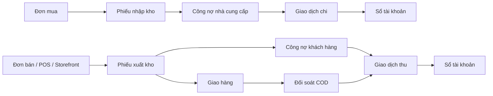

# Mục lục module ERP

Tra nhanh màn hình, API, backend, dữ liệu và test của từng module. Cập nhật theo mã nguồn ngày **11/08/2026**.

> Nếu tài liệu khác code, ưu tiên [`routes/web.php`](routes/web.php), [`routes/api.php`](routes/api.php) và phần hiện thực trong mã nguồn.

## Chọn đường đọc

### Người mới — hiểu dự án trong 15 phút

1. Đọc [`START_HERE.md`](START_HERE.md) để chạy dự án và dùng dữ liệu demo.
2. Xem [bản đồ liên module](#luong-lien-module) để hiểu Mua/Bán → Kho → Kế toán.
3. Chọn module; đọc Vai trò, Điểm vào, Liên thông, Ràng buộc và Kịch bản tái hiện trước.
4. Khi nhận task, lần theo `màn hình → API → Controller → Service → dữ liệu → test`.

### Người đã quen dự án — tra cứu trong 30 giây

1. Có triệu chứng → [Knowledge Base](#tra-cuu-tim-loi-theo-trieu-chung).
2. Biết module → [Chọn module](#chon-module).
3. Biết endpoint/class/method → [`PROJECT_FUNCTION_INDEX.md`](docs/PROJECT_FUNCTION_INDEX.md) hoặc `rg`.
4. Nghi sai schema → [`PROJECT_DATABASE_INDEX.md`](docs/PROJECT_DATABASE_INDEX.md).

## Chọn cách tra cứu

| Tôi đang muốn                           | Đi tới                                                                                                    |
| --------------------------------------- | --------------------------------------------------------------------------------------------------------- |
| Tìm một màn hình hoặc phân hệ           | [Chọn module](#chon-module)                                                                               |
| Tìm theo chức năng/nghiệp vụ hoặc endpoint | [`PROJECT_FUNCTION_INDEX.md`](docs/PROJECT_FUNCTION_INDEX.md)                                          |
| Tìm nguyên nhân theo lỗi đang gặp       | [Tra cứu tìm lỗi theo triệu chứng](#tra-cuu-tim-loi-theo-trieu-chung)                                     |
| Tìm API, permission hoặc vị trí cần sửa | [Tra cứu nhanh khi sửa code](#tra-cuu-nhanh-khi-sua-code)                                                 |
| Tìm database hoặc test liên quan        | [Database](docs/PROJECT_DATABASE_INDEX.md) · [Function và test ảnh hưởng](docs/PROJECT_FUNCTION_INDEX.md) |

<a id="chon-module"></a>

## Chọn module

| Module                                                        | Màn hình                              | Code chính                                                                                   |
| ------------------------------------------------------------- | ------------------------------------- | -------------------------------------------------------------------------------------------- |
| [Khung ứng dụng và Dashboard](#1-khung-ứng-dụng-và-dashboard) | `/`, `/dashboard`                     | [`DashBoard.vue`](resources/js/Pages/DashBoard.vue)                                          |
| [Công ty và hồ sơ](#2-công-ty-và-hồ-sơ-cá-nhân)               | `/company/*`, `/profile`              | [`Pages/Company`](resources/js/Pages/Company), [`Pages/Profile`](resources/js/Pages/Profile) |
| [Nhân sự và tổ chức](#3-nhân-sự-và-cơ-cấu-tổ-chức)            | `/user`, `/departments`, `/positions` | [`Pages/Manage`](resources/js/Pages/Manage)                                                  |
| [Vai trò và phân quyền](#4-vai-trò-và-phân-quyền)             | `/role`, `/permission`                | [`Role.vue`](resources/js/Pages/Manage/Role.vue)                                             |
| [Mua hàng](#5-mua-hàng)                                       | `/purchase/*`                         | [`Pages/Purchase`](resources/js/Pages/Purchase)                                              |
| [Bán hàng](#6-bán-hàng)                                       | `/sale/*`                             | [`Pages/Sale`](resources/js/Pages/Sale)                                                      |
| [Cửa hàng trực tuyến](#6a-cửa-hàng-trực-tuyến)                | `/shop/*`                             | [`Pages/Storefront`](resources/js/Pages/Storefront)                                          |
| [Kho](#7-kho)                                                 | `/warehouse/*`                        | [`Pages/Warehouse`](resources/js/Pages/Warehouse)                                            |
| [Kế toán và công nợ](#8-kế-toán-giao-dịch-và-công-nợ)         | `/accountant/*`                       | [`Pages/Accountant`](resources/js/Pages/Accountant)                                          |
| [Nhật ký hoạt động](#9-nhật-ký-hoạt-động)                     | `/audit-logs`                         | [`Pages/AuditLog`](resources/js/Pages/AuditLog)                                              |
| [Thông báo và realtime](#10-thông-báo-và-realtime)            | Header                                | [`NotificationMenu.vue`](resources/js/components/layout/header/NotificationMenu.vue)         |
| [Xác thực](#11-xác-thực)                                      | `/login`, `/register`                 | [`routes/auth.php`](routes/auth.php)                                                         |
| [Thành phần dùng chung](#12-thành-phần-dùng-chung-và-hạ-tầng) | Toàn hệ thống                         | [`components`](resources/js/components), [`composables`](resources/js/composables)           |
| [Hướng dẫn sử dụng](#13-hướng-dẫn-sử-dụng)                    | `/guide`                              | [`Guide/Index.vue`](resources/js/Pages/Guide/Index.vue)                                      |

> Luồng nghiệp vụ nằm trong [`BUSINESS_FLOWS.md`](resources/docs/BUSINESS_FLOWS.md); các quyết định kỹ thuật nằm trong [`resources/docs/decisions/`](resources/docs/decisions/).

<a id="luong-lien-module"></a>

## Bản đồ luồng liên module

Phần này dùng khi lỗi xuất hiện ở module sau nhưng nguyên nhân có thể nằm ở chứng từ nguồn của module trước. Đây là bản đồ điều hướng nhanh; quy tắc trạng thái và số liệu đầy đủ nằm trong [`BUSINESS_FLOWS.md`](resources/docs/BUSINESS_FLOWS.md).



| Đang debug                              | Kiểm tra theo thứ tự                                                             | Tài liệu/điểm vào                                                                                                                                                        |
| --------------------------------------- | -------------------------------------------------------------------------------- | ------------------------------------------------------------------------------------------------------------------------------------------------------------------------ |
| Đơn mua không làm tăng tồn hoặc công nợ | PO đã duyệt → phiếu nhập → kho xác nhận → kế toán duyệt → tồn/công nợ NCC        | [Luồng mua hàng](resources/docs/BUSINESS_FLOWS.md#mua-hàng--nhập-kho--thanh-toán) · [Mua hàng](#5-mua-hàng) · [Kho](#7-kho) · [Kế toán](#8-kế-toán-giao-dịch-và-công-nợ) |
| Đơn bán không giảm tồn hoặc tạo công nợ | SO đã duyệt → phiếu xuất → kho xác nhận → kế toán duyệt → tồn/công nợ khách hàng | [Luồng bán hàng](resources/docs/BUSINESS_FLOWS.md#bán-hàng--xuất-kho--thu-tiền) · [Bán hàng](#6-bán-hàng) · [Kho](#7-kho) · [Kế toán](#8-kế-toán-giao-dịch-và-công-nợ)   |
| POS/Storefront lệch với đơn bán         | nguồn tạo đơn → SalesOrder/items → phiếu xuất → công nợ/giao dịch                | [Bán hàng](#6-bán-hàng) · [Storefront](#6a-cửa-hàng-trực-tuyến) · [Kho](#7-kho)                                                                                          |
| Số dư hoặc công nợ không giảm           | chứng từ nguồn → giao dịch gắn PO/SO → duyệt giao dịch → ledger → debt summary   | [Giao dịch và lịch sử thanh toán](resources/docs/BUSINESS_FLOWS.md#giao-dịch-và-lịch-sử-thanh-toán) · [Kế toán](#8-kế-toán-giao-dịch-và-công-nợ)                         |
| COD không khớp tiền thu                 | phiếu xuất/giao hàng → trạng thái giao → phiên đối soát → giao dịch thu → ledger | [Kho](#7-kho) · [Kế toán](#8-kế-toán-giao-dịch-và-công-nợ) · [`CodReconciliationTest`](tests/Feature/CodReconciliationTest.php)                                          |

> Không suy luận số liệu chỉ từ trạng thái PO/SO. Theo nghiệp vụ hiện hành, tồn kho và công nợ chỉ thay đổi tại bước duyệt có hiệu lực của phiếu kho; số dư tài khoản thay đổi khi giao dịch được duyệt.

<!-- GENERATED_COMBINED_LOOKUP_START -->

> Phần tra cứu hợp nhất từ `PROJECT_MODULE_DETAIL_INDEX.md`, được sinh tự động từ code.

## Cẩm nang chẩn đoán nhanh

> Chỉ giữ Knowledge Base và luồng trạng thái trong trang chính. Danh sách endpoint/function đầy đủ nằm tại [`docs/PROJECT_FUNCTION_INDEX.md`](docs/PROJECT_FUNCTION_INDEX.md).

<a id="tra-cuu-tim-loi-theo-trieu-chung"></a>

<details>
<summary><strong>Knowledge Base — khoanh vùng theo nguyên nhân gốc</strong></summary>


> Knowledge Base theo nguyên nhân gốc. Chọn câu hỏi gần nhất với điều người dùng báo; chỉ mở chỉ mục endpoint đầy đủ nếu các bước này chưa khoanh vùng được lỗi.

### Vì sao tạo/sửa đơn báo “số lượng không hợp lệ”?

- **Nguyên nhân thường gặp:** sản phẩm dùng đơn vị `allow_decimal = false` nhưng payload gửi số lượng lẻ.
- **Cách check:** đọc field 422 → mở [OrderQuantityValidationService::validate()](app/Services/OrderQuantityValidationService.php#L10) → kiểm tra `Product → Unit → allow_decimal` và `items.*.quantity`.
- **Lưu ý:** Service này không kiểm tra tồn kho. Nếu lỗi nói không đủ tồn hoặc không thể xuất, dùng câu hỏi kế tiếp.

### Vì sao còn hàng nhưng không thể tạo phiếu xuất?

- **Nguyên nhân thường gặp:** tồn khả dụng khác tồn thực tế vì phiếu xuất `pending` đang giữ chỗ, chọn sai kho hoặc đơn đã xuất một phần.
- **Cách check:** đối chiếu `WarehouseProductStock.quantity` với lượng giữ chỗ → mở [availableForExport()](app/Http/Controllers/SalesOrderController.php#L245) và [stockOutData()](app/Http/Controllers/SalesOrderController.php#L923) → kiểm tra warehouse/product/company và lượng đã xuất.

### Vì sao PO/SO đã duyệt nhưng Kho không thấy?

- **Nguyên nhân thường gặp:** trạng thái chưa đúng, đơn đã xử lý hết, loại đơn bị loại khỏi danh sách, permission kho hoặc scope công ty.
- **Cách check:** xác nhận trạng thái `approved/partial` → tính lượng còn nhập/xuất sau các phiếu hiện có → kiểm tra endpoint danh sách chờ kho bằng tài khoản role Kho.

### Vì sao phiếu đã duyệt nhưng tồn hoặc công nợ chưa đổi?

- **Nguyên nhân thường gặp:** mới hoàn thành bước kho xác nhận, chưa qua kế toán duyệt; hoặc transaction duyệt kế toán đã rollback.
- **Cách check:** phân biệt [approve() của kho](app/Http/Controllers/WarehouseSlipController.php#L818) với [accountantApprove()](app/Http/Controllers/WarehouseSlipController.php#L862) → tìm `InventoryMovement` và debt theo phiếu nguồn.
- **Ràng buộc:** [ADR-001](resources/docs/decisions/ADR-001-WAREHOUSE-ACCOUNTING-APPROVAL.md#L1) quy định chỉ kế toán duyệt mới cập nhật tồn, movement và công nợ.

### Vì sao duyệt giao dịch xong nhưng công nợ không giảm?

- **Nguyên nhân thường gặp:** sai `type` (`receipt/payment`), sai category (`THU_KH/CHI_NCC`), thiếu customer/supplier hoặc không gắn đúng PO/SO.
- **Cách check:** mở [TransactionService::approve()](app/Services/TransactionService.php#L191) và [syncDebt()](app/Services/TransactionService.php#L850) → kiểm tra type/category/đối tượng/đơn → đối chiếu debt và `AccountLedger` của cùng transaction.

### Vì sao giá vốn xuất/chuyển không giống giá bình quân?

- Đây có thể không phải bug. [ADR-002](resources/docs/decisions/ADR-002-INVENTORY-COST.md#L1) quy định dùng giá nhập gần nhất; giá trị nhập gồm VAT, không dùng bình quân gia quyền.
- **Cách check:** lần từ sản phẩm đến đơn mua/phiếu nhập gần nhất và đối chiếu `cost_price`, `cost_amount` của phiếu/movement.

### Vì sao thay tỷ giá làm số liệu mới khác chứng từ cũ?

- [ADR-003](resources/docs/decisions/ADR-003-CURRENCY-AND-ROLES.md#L1) yêu cầu VND luôn bằng 1; ngoại tệ có lịch sử và không sửa hồi tố chứng từ.
- **Cách check:** phân biệt tỷ giá hiện hành trong `CompanyCurrencyRate` với `exchange_rate`/giá trị base snapshot trên chứng từ.

### Vì sao POS hoặc Storefront tạo trùng đơn?

- **Nguyên nhân thường gặp:** double-click/retry tạo hai request, draft POS được checkout lại hoặc transaction checkout không bao phủ toàn bộ thao tác ghi.
- **Cách check:** tìm đơn theo customer/session, thời điểm và tổng tiền → kiểm tra `PosController::store()` hoặc `StorefrontController::checkout()` → kiểm tra transaction, code generation và retry frontend.

### Vì sao coupon hợp lệ nhưng không áp dụng hoặc không được hoàn lại?

- **Nguyên nhân thường gặp:** sai thời gian, channel, customer assignment, giới hạn sử dụng; hoặc nhánh hủy không hoàn tác `CouponUsage`.
- **Cách check:** mở [CouponService](app/Services/CouponService.php#L1) → đối chiếu điều kiện áp dụng, usage theo đơn và nguồn Sale/POS/Storefront.

### Vì sao có thông báo nhưng màn hình không tự cập nhật?

- **Nguyên nhân thường gặp:** queue/Reverb chưa chạy, private channel từ chối, sai company channel hoặc listener frontend không đăng ký.
- **Cách check:** xác nhận notification đã commit → queue/Reverb → `routes/channels.php` → `companyData.js`/`useRealtimeRefresh.js`; phân biệt lỗi lưu, broadcast và render.

### Vì sao Dashboard lệch số liệu chi tiết?

- **Nguyên nhân thường gặp:** khác khoảng ngày/timezone, khác trạng thái được tính hoặc repository dùng điều kiện khác màn hình chi tiết.
- **Cách check:** mở [DashboardService::getOverview()](app/Services/DashboardService.php#L14) và [DashboardRepository](app/Repositories/DashboardRepository.php#L1) → cố định `date_from/date_to`, company và trạng thái rồi đối chiếu.

### Vì sao dữ liệu công ty khác xuất hiện trên màn hình?

- **Nguyên nhân thường gặp:** query thiếu `company_id`, relation/eager-load không có scope hoặc ID từ request chưa được xác minh thuộc công ty hiện tại.
- **Cách check:** lần từ controller xuống query → kiểm tra `BelongsToCompany`, điều kiện company trên relation và test cô lập công ty. Đây là lỗi bảo mật, không chỉ lỗi hiển thị.


</details>

<a id="tra-cuu-luong-trang-thai"></a>

<details>
<summary><strong>Luồng trạng thái và thứ tự debug</strong></summary>


> Các luồng dưới đây được đối chiếu với trạng thái đang ghi trong Controller/Service. Xem thêm [Luồng nghiệp vụ hiện hành](resources/docs/BUSINESS_FLOWS.md#L1).

- **Đơn bán:** `draft → pending → approved → partial → completed`; có thể sang `cancelled` khi còn `draft/pending`. Điểm kiểm tra: [gửi duyệt](app/Http/Controllers/SalesOrderController.php#L729), [duyệt](app/Http/Controllers/SalesOrderController.php#L776), [hủy](app/Http/Controllers/SalesOrderController.php#L832).
- **Đơn mua:** `pending → approved → partial → completed`; có thể sang `cancelled` khi còn `pending`. Điểm kiểm tra: [duyệt](app/Http/Controllers/PurchaseOrderController.php#L526), [hủy](app/Http/Controllers/PurchaseOrderController.php#L578).
- **Phiếu kho:** bắt đầu `pending`; kho xác nhận rồi kế toán duyệt. Khi kế toán duyệt, đơn liên quan được tính lại thành `approved/partial/completed`. Điểm kiểm tra: [kho duyệt](app/Http/Controllers/WarehouseSlipController.php#L818), [kế toán duyệt](app/Http/Controllers/WarehouseSlipController.php#L862).
- **Giao dịch:** `pending → approved` hoặc `pending → rejected`. Chỉ bước duyệt mới ghi nhận số dư/công nợ liên quan. Điểm kiểm tra: [duyệt giao dịch](app/Services/TransactionService.php#L195), [từ chối giao dịch](app/Services/TransactionService.php#L267).

### Thứ tự debug một chức năng

1. Mở dòng gọi trên **Trang/Component** và kiểm tra payload, HTTP method, URL.
2. Mở **Controller/Function**, kiểm tra quyền, validation và trạng thái đầu vào.
3. Mở **Service/model được gọi**, kiểm tra transaction, thay đổi dữ liệu và quan hệ.
4. Đối chiếu trạng thái trước/sau với luồng ở trên và kiểm tra trang bị ảnh hưởng trực tiếp/gián tiếp.
5. Chạy **kiểm thử liên quan**; nếu tài liệu báo chưa phát hiện test thì cần bổ sung test tái hiện lỗi trước khi sửa.


</details>


<!-- GENERATED_COMBINED_LOOKUP_END -->

## 1. Khung ứng dụng và Dashboard

**Vai trò:** trang vào hệ thống, dashboard tổng hợp và khung giao diện dùng chung.

- **Điểm vào:** `/`, `/dashboard`; web và API route tại [`routes/web.php`](routes/web.php), [`routes/api.php`](routes/api.php).
- **Frontend:** [`DashBoard.vue`](resources/js/Pages/DashBoard.vue), [`AdminLayout.vue`](resources/js/Layouts/AdminLayout.vue), [`components/layout`](resources/js/components/layout); dashboard riêng nằm trong từng module.
- **Backend:** [`DashboardController`](app/Http/Controllers/DashboardController.php), [`DashboardService`](app/Services/DashboardService.php), [`DashboardRepository`](app/Repositories/DashboardRepository.php).
- **Kiểm thử:** [`ModuleDashboardTest`](tests/Feature/ModuleDashboardTest.php), [`DemoAccountPageSmokeTest`](tests/Feature/DemoAccountPageSmokeTest.php).

<!-- GENERATED_MODULE_GROUP_1_KHUNG_NG_DNG_V_A_DASHBOARD_START -->

> Chi tiết FE/BE bên dưới được sinh tự động từ code; mở từng nhóm nghiệp vụ con khi cần tra cứu.

<details>
<summary><strong>1.1 Dashboard tổng</strong> — 2 trang, 1 Controller, 1 Service trực tiếp</summary>

### FE — từng trang Vue

<details>
<summary><strong>Trang Bảng điều khiển</strong> — <code>DashBoard.vue</code></summary>

- **File:** [resources/js/Pages/DashBoard.vue](resources/js/Pages/DashBoard.vue#L1).
- **Mở trang tổng quan bảng điều khiển:** `GET/HEAD /` → [DashboardController::landing()](app/Http/Controllers/DashboardController.php#L25) — Thực hiện nghiệp vụ “landing” cho bảng điều khiển.
  - **Sửa Function này ảnh hưởng:** dữ liệu hoặc hành động liên quan đến bảng điều khiển trên trang này có thể thay đổi trên chính trang này; chưa phát hiện Service/model được gọi trực tiếp.
  - **Trang khác và test cần kiểm tra:** [DashBoard.vue:1](resources/js/Pages/DashBoard.vue#L1) · [PasswordResetTest.php:42](tests/Feature/Auth/PasswordResetTest.php#L42)<br>[CodReconciliationTest.php:88](tests/Feature/CodReconciliationTest.php#L88)<br>[DemoModuleRolesTest.php:37](tests/Feature/DemoModuleRolesTest.php#L37).
- **Xem tổng quan bảng điều khiển:** `GET/HEAD /api/dashboard/overview` → [DashboardController::overview()](app/Http/Controllers/DashboardController.php#L50) — Thực hiện nghiệp vụ “overview” cho bảng điều khiển. Bao gồm: quy đổi/kiểm tra tiền tệ.
  - **Sửa Function này ảnh hưởng:** chỉ số, tổng hợp và biểu đồ báo cáo có thể thay đổi trên chính trang này; đồng thời cần kiểm tra [DashboardService::getOverview()](app/Services/DashboardService.php#L14) (tổng hợp dữ liệu widget theo module và khoảng ngày).
  - **Trang khác và test cần kiểm tra:** [DashBoard.vue:1205](resources/js/Pages/DashBoard.vue#L1205) · [ModuleDashboardTest.php:70](tests/Feature/ModuleDashboardTest.php#L70)<br>[ModuleDashboardTest.php:82](tests/Feature/ModuleDashboardTest.php#L82)<br>[ModuleDashboardTest.php:99](tests/Feature/ModuleDashboardTest.php#L99).
- **Xem số liệu phân hệ bảng điều khiển:** `GET/HEAD /api/dashboard/{module}` → [DashboardController::module()](app/Http/Controllers/DashboardController.php#L86) — Thực hiện nghiệp vụ “module” cho bảng điều khiển. Bao gồm: quy đổi/kiểm tra tiền tệ.
  - **Sửa Function này ảnh hưởng:** dữ liệu hoặc hành động liên quan đến bảng điều khiển trên trang này có thể thay đổi trên chính trang này; đồng thời cần kiểm tra [DashboardService::getModuleOverview()](app/Services/DashboardService.php#L57) (tổng hợp dữ liệu widget theo module và khoảng ngày).
  - **Trang khác và test cần kiểm tra:** [DashBoard.vue:1205](resources/js/Pages/DashBoard.vue#L1205)<br>[ModuleDashboard.vue:390](resources/js/components/dashboard/ModuleDashboard.vue#L390)<br>[Dashboard.vue:2](resources/js/Pages/Accountant/Dashboard.vue#L2)<br>[Dashboard.vue:2](resources/js/Pages/Purchase/Dashboard.vue#L2)<br>[Dashboard.vue:2](resources/js/Pages/Sale/Dashboard.vue#L2)<br>[Dashboard.vue:2](resources/js/Pages/Warehouse/Dashboard.vue#L2) · [ModuleDashboardTest.php:54](tests/Feature/ModuleDashboardTest.php#L54)<br>[ModuleDashboardTest.php:56](tests/Feature/ModuleDashboardTest.php#L56)<br>[ModuleDashboardTest.php:70](tests/Feature/ModuleDashboardTest.php#L70).

</details>

<details>
<summary><strong>Trang chủ</strong> — <code>Home.vue</code></summary>

- **File:** [resources/js/Pages/Home.vue](resources/js/Pages/Home.vue#L1).
- **Chức năng:** dựng giao diện hoặc nhận dữ liệu qua Inertia/Component/composable; chưa phát hiện API trực tiếp trong file.

</details>

### BE — Controller và Service

<a id="chi-tiet-app-http-controllers-dashboardcontroller"></a>

<details>
<summary><strong>Controller DashboardController</strong> — 5 Function</summary>

- **File:** [app/Http/Controllers/DashboardController.php](app/Http/Controllers/DashboardController.php#L1).
- `public` [__construct()](app/Http/Controllers/DashboardController.php#L21) — không có API trực tiếp: Inject các service/dependency mà controller cần để xử lý bảng điều khiển.
  - **Đường dẫn sửa nhanh:** FE: phân tích tĩnh chưa ánh xạ được trang gọi trực tiếp → API: chưa có route trực tiếp → [DashboardController::__construct()](app/Http/Controllers/DashboardController.php#L21) → Service/Model: chưa phát hiện lời gọi trực tiếp → Test: chưa ánh xạ được test trực tiếp.
  - **Mức độ ảnh hưởng:** **Cao** — thay đổi dependency khởi tạo có thể làm tất cả endpoint của lớp không hoạt động.
  - **Ảnh hưởng khi sửa:** Ảnh hưởng việc khởi tạo controller và tất cả endpoint của controller nếu dependency thay đổi.
- `public` [landing()](app/Http/Controllers/DashboardController.php#L25) — API `GET/HEAD /`, `GET/HEAD /dashboard`: Thực hiện nghiệp vụ “landing” cho bảng điều khiển.
  - **Đường dẫn sửa nhanh:** FE [DashBoard.vue:1](resources/js/Pages/DashBoard.vue#L1) → API `GET/HEAD /`, `GET/HEAD /dashboard` → [DashboardController::landing()](app/Http/Controllers/DashboardController.php#L25) → Service/Model: chưa phát hiện lời gọi trực tiếp → Test [PasswordResetTest.php:42](tests/Feature/Auth/PasswordResetTest.php#L42)<br>[CodReconciliationTest.php:88](tests/Feature/CodReconciliationTest.php#L88)<br>[DemoModuleRolesTest.php:37](tests/Feature/DemoModuleRolesTest.php#L37).
  - **Mức độ ảnh hưởng:** **Thấp** — chủ yếu đọc/chuẩn bị dữ liệu; rủi ro chính nằm ở cấu trúc dữ liệu trả về và giao diện hiển thị.
  - **Ảnh hưởng khi sửa:** Logic xử lý bảng điều khiển, dữ liệu đầu ra hoặc điều kiện nghiệp vụ của Function có thể thay đổi. <br>• [Trang Bảng điều khiển](resources/js/Pages/DashBoard.vue#L1): dữ liệu hoặc hành động liên quan đến bảng điều khiển trên trang này có thể thay đổi.
- `public` [overview()](app/Http/Controllers/DashboardController.php#L50) — API `GET/HEAD /api/dashboard/overview`: Thực hiện nghiệp vụ “overview” cho bảng điều khiển. Bao gồm: quy đổi/kiểm tra tiền tệ.
  - **Đường dẫn sửa nhanh:** FE [DashBoard.vue:1205](resources/js/Pages/DashBoard.vue#L1205) → API `GET/HEAD /api/dashboard/overview` → [DashboardController::overview()](app/Http/Controllers/DashboardController.php#L50) → Service/Model [DashboardService::getOverview()](app/Services/DashboardService.php#L14) (tổng hợp dữ liệu widget theo module và khoảng ngày) → Test [ModuleDashboardTest.php:70](tests/Feature/ModuleDashboardTest.php#L70)<br>[ModuleDashboardTest.php:82](tests/Feature/ModuleDashboardTest.php#L82)<br>[ModuleDashboardTest.php:99](tests/Feature/ModuleDashboardTest.php#L99).
  - **Mức độ ảnh hưởng:** **Thấp** — chủ yếu đọc/chuẩn bị dữ liệu; rủi ro chính nằm ở cấu trúc dữ liệu trả về và giao diện hiển thị.
  - **Ảnh hưởng khi sửa:** Logic xử lý bảng điều khiển, dữ liệu đầu ra hoặc điều kiện nghiệp vụ của Function có thể thay đổi. Cần đối chiếu số tiền, tỷ giá, số dư tài khoản và công nợ trước/sau. <br>• [Trang Bảng điều khiển](resources/js/Pages/DashBoard.vue#L1205): chỉ số, tổng hợp và biểu đồ báo cáo có thể thay đổi.
- `public` [module()](app/Http/Controllers/DashboardController.php#L86) — API `GET/HEAD /api/dashboard/{module}`: Thực hiện nghiệp vụ “module” cho bảng điều khiển. Bao gồm: quy đổi/kiểm tra tiền tệ.
  - **Đường dẫn sửa nhanh:** FE [DashBoard.vue:1205](resources/js/Pages/DashBoard.vue#L1205)<br>[ModuleDashboard.vue:390](resources/js/components/dashboard/ModuleDashboard.vue#L390)<br>[Dashboard.vue:2](resources/js/Pages/Accountant/Dashboard.vue#L2)<br>[Dashboard.vue:2](resources/js/Pages/Purchase/Dashboard.vue#L2)<br>[Dashboard.vue:2](resources/js/Pages/Sale/Dashboard.vue#L2)<br>[Dashboard.vue:2](resources/js/Pages/Warehouse/Dashboard.vue#L2) → API `GET/HEAD /api/dashboard/{module}` → [DashboardController::module()](app/Http/Controllers/DashboardController.php#L86) → Service/Model [DashboardService::getModuleOverview()](app/Services/DashboardService.php#L57) (tổng hợp dữ liệu widget theo module và khoảng ngày) → Test [ModuleDashboardTest.php:54](tests/Feature/ModuleDashboardTest.php#L54)<br>[ModuleDashboardTest.php:56](tests/Feature/ModuleDashboardTest.php#L56)<br>[ModuleDashboardTest.php:70](tests/Feature/ModuleDashboardTest.php#L70).
  - **Mức độ ảnh hưởng:** **Trung bình** — là hàm hỗ trợ/dùng chung hoặc có nhiều nơi phụ thuộc cần kiểm tra.
  - **Ảnh hưởng khi sửa:** Logic xử lý bảng điều khiển, dữ liệu đầu ra hoặc điều kiện nghiệp vụ của Function có thể thay đổi. Cần đối chiếu tồn kho, lượng giữ chỗ, lượng đã nhập/xuất và biến động kho. Cần đối chiếu số tiền, tỷ giá, số dư tài khoản và công nợ trước/sau. <br>• [Trang Bảng điều khiển](resources/js/Pages/DashBoard.vue#L1205): dữ liệu hoặc hành động liên quan đến bảng điều khiển trên trang này có thể thay đổi. <br>• [Component ModuleDashboard](resources/js/components/dashboard/ModuleDashboard.vue#L390): dữ liệu hoặc hành động liên quan đến bảng điều khiển trên trang này có thể thay đổi. <br>• [Trang Bảng điều khiển](resources/js/Pages/Accountant/Dashboard.vue#L2): dữ liệu hoặc hành động liên quan đến bảng điều khiển trên trang này có thể thay đổi. <br>• [Trang Bảng điều khiển](resources/js/Pages/Purchase/Dashboard.vue#L2): dữ liệu hoặc hành động liên quan đến bảng điều khiển trên trang này có thể thay đổi. <br>• [Trang Bảng điều khiển](resources/js/Pages/Sale/Dashboard.vue#L2): dữ liệu hoặc hành động liên quan đến bảng điều khiển trên trang này có thể thay đổi. <br>• [Trang Bảng điều khiển](resources/js/Pages/Warehouse/Dashboard.vue#L2): dữ liệu hoặc hành động liên quan đến bảng điều khiển trên trang này có thể thay đổi.
- `private` [dateRange()](app/Http/Controllers/DashboardController.php#L120) — không có API trực tiếp: Hàm hỗ trợ nội bộ “date Range” phục vụ xử lý bảng điều khiển; thay đổi sẽ tác động các hàm gọi nó.
  - **Đường dẫn sửa nhanh:** FE: phân tích tĩnh chưa ánh xạ được trang gọi trực tiếp → API: chưa có route trực tiếp → [DashboardController::dateRange()](app/Http/Controllers/DashboardController.php#L120) → Service/Model: chưa phát hiện lời gọi trực tiếp → Test: chưa ánh xạ được test trực tiếp.
  - **Mức độ ảnh hưởng:** **Trung bình** — là hàm hỗ trợ/dùng chung hoặc có nhiều nơi phụ thuộc cần kiểm tra.
  - **Ảnh hưởng khi sửa:** Ảnh hưởng các hàm gọi hàm hỗ trợ trong cùng bộ điều khiển.<br>Được gọi tại: [dòng gọi 69](app/Http/Controllers/DashboardController.php#L69), [dòng gọi 105](app/Http/Controllers/DashboardController.php#L105).

</details>

<a id="chi-tiet-service-dashboardservice"></a>

<details>
<summary><strong>Service DashboardService</strong> — 4 Function public/private/protected</summary>

- **File:** [app/Services/DashboardService.php](app/Services/DashboardService.php#L1).
- **Logic nghiệp vụ:** Tổng hợp chỉ số hiệu suất và số liệu bảng điều khiển theo module/khoảng ngày.
- `public` [__construct()](app/Services/DashboardService.php#L10): Inject các service/dependency mà controller cần để xử lý dashboard tổng.
  - **Đường dẫn sửa nhanh:** Controller chưa tìm thấy nơi gọi trực tiếp bằng phân tích tĩnh → Service [DashboardService::__construct()](app/Services/DashboardService.php#L10) → Service/Model: chưa phát hiện lời gọi tiếp theo → FE: chưa ánh xạ được trang trực tiếp → Test: chưa ánh xạ được test trực tiếp.
  - **Mức độ ảnh hưởng:** **Cao** — thay đổi dependency khởi tạo có thể làm tất cả endpoint của lớp không hoạt động.
  - **Ảnh hưởng khi sửa:** thay đổi logic dùng chung của Service; cần kiểm tra các Function gọi phía trên; chưa ánh xạ được trang gọi trực tiếp.
- `public` [getOverview()](app/Services/DashboardService.php#L14): Thực hiện nghiệp vụ “get Overview” cho dashboard tổng. Bao gồm: xử lý số lượng/tồn kho, liên quan công nợ.
  - **Đường dẫn sửa nhanh:** Controller [DashboardController::overview()](app/Http/Controllers/DashboardController.php#L50) → Service [DashboardService::getOverview()](app/Services/DashboardService.php#L14) → Service/Model: chưa phát hiện lời gọi tiếp theo → FE [Trang Bảng điều khiển](resources/js/Pages/DashBoard.vue#L1205) → Test [ModuleDashboardTest.php:70](tests/Feature/ModuleDashboardTest.php#L70), [ModuleDashboardTest.php:82](tests/Feature/ModuleDashboardTest.php#L82), [ModuleDashboardTest.php:99](tests/Feature/ModuleDashboardTest.php#L99).
  - **Mức độ ảnh hưởng:** **Thấp** — chủ yếu đọc/chuẩn bị dữ liệu; rủi ro chính nằm ở cấu trúc dữ liệu trả về và giao diện hiển thị.
  - **Ảnh hưởng khi sửa:** thay đổi logic dùng chung của Service; cần kiểm tra các Function gọi phía trên và các trang [Trang Bảng điều khiển](resources/js/Pages/DashBoard.vue#L1205).
- `public` [getModuleOverview()](app/Services/DashboardService.php#L57): Thực hiện nghiệp vụ “get Module Overview” cho dashboard tổng. Bao gồm: xử lý số lượng/tồn kho, liên quan công nợ.
  - **Đường dẫn sửa nhanh:** Controller [DashboardController::module()](app/Http/Controllers/DashboardController.php#L86) → Service [DashboardService::getModuleOverview()](app/Services/DashboardService.php#L57) → Service/Model: chưa phát hiện lời gọi tiếp theo → FE [Trang Bảng điều khiển](resources/js/Pages/DashBoard.vue#L1205), [Component ModuleDashboard](resources/js/components/dashboard/ModuleDashboard.vue#L390), [Trang Bảng điều khiển](resources/js/Pages/Accountant/Dashboard.vue#L2), [Trang Bảng điều khiển](resources/js/Pages/Purchase/Dashboard.vue#L2), [Trang Bảng điều khiển](resources/js/Pages/Sale/Dashboard.vue#L2), [Trang Bảng điều khiển](resources/js/Pages/Warehouse/Dashboard.vue#L2) → Test [ModuleDashboardTest.php:54](tests/Feature/ModuleDashboardTest.php#L54), [ModuleDashboardTest.php:56](tests/Feature/ModuleDashboardTest.php#L56), [ModuleDashboardTest.php:70](tests/Feature/ModuleDashboardTest.php#L70).
  - **Mức độ ảnh hưởng:** **Trung bình** — là hàm hỗ trợ/dùng chung hoặc có nhiều nơi phụ thuộc cần kiểm tra.
  - **Ảnh hưởng khi sửa:** thay đổi logic dùng chung của Service; cần kiểm tra các Function gọi phía trên và các trang [Trang Bảng điều khiển](resources/js/Pages/DashBoard.vue#L1205), [Component ModuleDashboard](resources/js/components/dashboard/ModuleDashboard.vue#L390), [Trang Bảng điều khiển](resources/js/Pages/Accountant/Dashboard.vue#L2), [Trang Bảng điều khiển](resources/js/Pages/Purchase/Dashboard.vue#L2), [Trang Bảng điều khiển](resources/js/Pages/Sale/Dashboard.vue#L2), [Trang Bảng điều khiển](resources/js/Pages/Warehouse/Dashboard.vue#L2).
- `private` [percentChange()](app/Services/DashboardService.php#L110): Hàm hỗ trợ nội bộ “percent Change” phục vụ xử lý dashboard tổng; thay đổi sẽ tác động các hàm gọi nó.
  - **Đường dẫn sửa nhanh:** Controller [lời gọi nội bộ dòng 34](app/Services/DashboardService.php#L34), [lời gọi nội bộ dòng 36](app/Services/DashboardService.php#L36) → Service [DashboardService::percentChange()](app/Services/DashboardService.php#L110) → Service/Model: chưa phát hiện lời gọi tiếp theo → FE: chưa ánh xạ được trang trực tiếp → Test: chưa ánh xạ được test trực tiếp.
  - **Mức độ ảnh hưởng:** **Trung bình** — là hàm hỗ trợ/dùng chung hoặc có nhiều nơi phụ thuộc cần kiểm tra.
  - **Ảnh hưởng khi sửa:** thay đổi logic dùng chung của Service; cần kiểm tra các Function gọi phía trên; chưa ánh xạ được trang gọi trực tiếp.

</details>

- **Đọc sâu:** [Function và ảnh hưởng](docs/PROJECT_FUNCTION_INDEX.md) · [Tìm lỗi](docs/PROJECT_DEBUGGING_INDEX.md) · [Database](docs/PROJECT_DATABASE_INDEX.md).

</details>

<!-- GENERATED_MODULE_GROUP_1_KHUNG_NG_DNG_V_A_DASHBOARD_END -->

## 2. Công ty và hồ sơ cá nhân

**Vai trò:** tạo công ty, thiết lập ngữ cảnh công ty và quản lý hồ sơ người dùng hiện tại.

- **Điểm vào:** `/company/create`, `/company`, `/profile`; web route tại [`routes/web.php`](routes/web.php).
- **Frontend:** [`Company/Create.vue`](resources/js/Pages/Company/Create.vue), [`Profile/Edit.vue`](resources/js/Pages/Profile/Edit.vue).
- **Backend:** [`CompanyController`](app/Http/Controllers/CompanyController.php), [`ProfileController`](app/Http/Controllers/ProfileController.php), middleware `EnsureCompanyCreated`, `HandleInertiaRequests` và trait [`BelongsToCompany`](app/Traits/BelongsToCompany.php).
- **Dữ liệu:** [`Company`](app/Models/Company.php), [`User`](app/Models/User.php), [`CompanyCurrencyRate`](app/Models/CompanyCurrencyRate.php); migration tại [`database/migrations`](database/migrations).
- **Kiểm thử:** [`ProfileTest`](tests/Feature/ProfileTest.php), [`CompanyCurrencyServiceTest`](tests/Unit/CompanyCurrencyServiceTest.php), [`OpeningBalanceCurrencySnapshotTest`](tests/Feature/OpeningBalanceCurrencySnapshotTest.php).

<!-- GENERATED_MODULE_GROUP_2_C_ONG_TY_V_A_H_S_C_A_NH_AN_START -->

> Chi tiết FE/BE bên dưới được sinh tự động từ code; mở từng nhóm nghiệp vụ con khi cần tra cứu.

<details>
<summary><strong>2.1 Công ty</strong> — 1 trang, 2 Controller, 0 Service trực tiếp</summary>

### FE — từng trang Vue

<details>
<summary><strong>Trang Tạo công ty</strong> — <code>Company/Create.vue</code></summary>

- **File:** [resources/js/Pages/Company/Create.vue](resources/js/Pages/Company/Create.vue#L1).
- **Mở trang tạo công ty:** `GET/HEAD /api/company/create` → [CompanyController::create()](app/Http/Controllers/CompanyController.php#L18) — Render hoặc chuẩn bị dữ liệu cho màn hình tạo công ty. Hàm còn quy đổi/kiểm tra tiền tệ.
  - **Sửa Function này ảnh hưởng:** dữ liệu hoặc hành động liên quan đến công ty trên trang này có thể thay đổi trên chính trang này; đồng thời cần kiểm tra [Model Currency](app/Models/Currency.php#L1) (dữ liệu nghiệp vụ của Currency).
  - **Trang khác và test cần kiểm tra:** [Create.vue:1](resources/js/Pages/Company/Create.vue#L1) · —.
- **Tạo công ty:** `POST /company` → [CompanyController::store()](app/Http/Controllers/CompanyController.php#L33) — Kiểm tra đầu vào và tạo công ty mới cùng dữ liệu liên quan. Hàm còn kiểm tra dữ liệu đầu vào, chạy trong giao dịch cơ sở dữ liệu, quy đổi/kiểm tra tiền tệ.
  - **Sửa Function này ảnh hưởng:** dữ liệu gửi lên khi tạo mới, lỗi kiểm tra dữ liệu và dữ liệu xuất hiện sau khi lưu sẽ thay đổi trên chính trang này; đồng thời cần kiểm tra [Model Province](app/Models/Province.php#L1) (dữ liệu nghiệp vụ của Province), [Model Ward](app/Models/Ward.php#L1) (dữ liệu nghiệp vụ của Ward), [Model Company](app/Models/Company.php#L1) (dữ liệu nghiệp vụ của Company), [Model Role](app/Models/Role.php#L1) (dữ liệu nghiệp vụ của Role).
  - **Trang khác và test cần kiểm tra:** [Create.vue:258](resources/js/Pages/Company/Create.vue#L258) · —.

</details>

### BE — Controller và Service

<a id="chi-tiet-app-http-controllers-companycontroller"></a>

<details>
<summary><strong>Controller CompanyController</strong> — 2 Function</summary>

- **File:** [app/Http/Controllers/CompanyController.php](app/Http/Controllers/CompanyController.php#L1).
- `public` [create()](app/Http/Controllers/CompanyController.php#L18) — API `GET/HEAD /api/company/create`, `GET/HEAD /company/create`: Render hoặc chuẩn bị dữ liệu cho màn hình tạo công ty. Hàm còn quy đổi/kiểm tra tiền tệ.
  - **Đường dẫn sửa nhanh:** FE [Create.vue:1](resources/js/Pages/Company/Create.vue#L1) → API `GET/HEAD /api/company/create`, `GET/HEAD /company/create` → [CompanyController::create()](app/Http/Controllers/CompanyController.php#L18) → Service/Model [Model Currency](app/Models/Currency.php#L1) (dữ liệu nghiệp vụ của Currency) → Test: chưa ánh xạ được test trực tiếp.
  - **Mức độ ảnh hưởng:** **Cao** — có ghi dữ liệu và liên quan tiền tệ/công nợ/số dư.
  - **Ảnh hưởng khi sửa:** Quy tắc tạo công ty, dữ liệu được ghi và lỗi trả về khi tạo có thể thay đổi. Cần đối chiếu số tiền, tỷ giá, số dư tài khoản và công nợ trước/sau. <br>• [Trang Tạo công ty](resources/js/Pages/Company/Create.vue#L1): dữ liệu hoặc hành động liên quan đến công ty trên trang này có thể thay đổi. Phân tích tĩnh chưa ánh xạ được test theo route/Controller; cần tìm theo tên nghiệp vụ hoặc bổ sung test hồi quy.
- `public` [store()](app/Http/Controllers/CompanyController.php#L33) — API `POST /company`: Kiểm tra đầu vào và tạo công ty mới cùng dữ liệu liên quan. Hàm còn kiểm tra dữ liệu đầu vào, chạy trong giao dịch cơ sở dữ liệu, quy đổi/kiểm tra tiền tệ.
  - **Đường dẫn sửa nhanh:** FE [Create.vue:258](resources/js/Pages/Company/Create.vue#L258) → API `POST /company` → [CompanyController::store()](app/Http/Controllers/CompanyController.php#L33) → Service/Model [Model Province](app/Models/Province.php#L1) (dữ liệu nghiệp vụ của Province), [Model Ward](app/Models/Ward.php#L1) (dữ liệu nghiệp vụ của Ward), [Model Company](app/Models/Company.php#L1) (dữ liệu nghiệp vụ của Company), [Model Role](app/Models/Role.php#L1) (dữ liệu nghiệp vụ của Role) → Test: chưa ánh xạ được test trực tiếp.
  - **Mức độ ảnh hưởng:** **Rất cao** — có ghi dữ liệu và tác động chéo tồn kho/tài chính hoặc transaction với nhiều nơi phụ thuộc.
  - **Ảnh hưởng khi sửa:** Quy tắc tạo công ty, dữ liệu được ghi và lỗi trả về khi tạo có thể thay đổi. Cần đối chiếu số tiền, tỷ giá, số dư tài khoản và công nợ trước/sau. Cần bảo đảm toàn bộ thay đổi trong transaction cùng thành công hoặc cùng rollback. <br>• [Trang Tạo công ty](resources/js/Pages/Company/Create.vue#L258): dữ liệu gửi lên khi tạo mới, lỗi kiểm tra dữ liệu và dữ liệu xuất hiện sau khi lưu sẽ thay đổi. Phân tích tĩnh chưa ánh xạ được test theo route/Controller; cần tìm theo tên nghiệp vụ hoặc bổ sung test hồi quy.

</details>

<a id="chi-tiet-app-http-controllers-web-companiescontroller"></a>

<details>
<summary><strong>Controller WEB\CompaniesController</strong> — 3 Function</summary>

- **File:** [app/Http/Controllers/WEB/CompaniesController.php](app/Http/Controllers/WEB/CompaniesController.php#L1).
- `public` [index()](app/Http/Controllers/WEB/CompaniesController.php#L16) — không có API trực tiếp: Lấy danh sách công ty thuộc phạm vi được phép, áp dụng bộ lọc/tìm kiếm được gửi lên. Hàm còn quy đổi/kiểm tra tiền tệ.
  - **Đường dẫn sửa nhanh:** FE: phân tích tĩnh chưa ánh xạ được trang gọi trực tiếp → API: chưa có route trực tiếp → [WEB\CompaniesController::index()](app/Http/Controllers/WEB/CompaniesController.php#L16) → Service/Model [Model Company](app/Models/Company.php#L1) (dữ liệu nghiệp vụ của Company) → Test: chưa ánh xạ được test trực tiếp.
  - **Mức độ ảnh hưởng:** **Thấp** — chủ yếu đọc/chuẩn bị dữ liệu; rủi ro chính nằm ở cấu trúc dữ liệu trả về và giao diện hiển thị.
  - **Ảnh hưởng khi sửa:** Kết quả truy vấn công ty, điều kiện lọc, quan hệ nạp kèm hoặc cấu trúc JSON trả về có thể thay đổi. Cần đối chiếu số tiền, tỷ giá, số dư tài khoản và công nợ trước/sau. Phân tích tĩnh chưa thấy route trực tiếp; kiểm tra caller nội bộ, event, job hoặc framework hook trước khi sửa. Phân tích tĩnh chưa ánh xạ được trang Vue/JS trực tiếp; không đồng nghĩa Function không được sử dụng. Phân tích tĩnh chưa ánh xạ được test theo route/Controller; cần tìm theo tên nghiệp vụ hoặc bổ sung test hồi quy.
- `public` [store()](app/Http/Controllers/WEB/CompaniesController.php#L31) — không có API trực tiếp: Kiểm tra đầu vào và tạo công ty mới cùng dữ liệu liên quan. Hàm còn kiểm tra dữ liệu đầu vào, chạy trong giao dịch cơ sở dữ liệu, quy đổi/kiểm tra tiền tệ.
  - **Đường dẫn sửa nhanh:** FE: phân tích tĩnh chưa ánh xạ được trang gọi trực tiếp → API: chưa có route trực tiếp → [WEB\CompaniesController::store()](app/Http/Controllers/WEB/CompaniesController.php#L31) → Service/Model [Model Company](app/Models/Company.php#L1) (dữ liệu nghiệp vụ của Company), [Model Currency](app/Models/Currency.php#L1) (dữ liệu nghiệp vụ của Currency) → Test: chưa ánh xạ được test trực tiếp.
  - **Mức độ ảnh hưởng:** **Cao** — có ghi dữ liệu và liên quan tiền tệ/công nợ/số dư, trạng thái nghiệp vụ, transaction dữ liệu.
  - **Ảnh hưởng khi sửa:** Quy tắc tạo công ty, dữ liệu được ghi và lỗi trả về khi tạo có thể thay đổi. Cần đối chiếu số tiền, tỷ giá, số dư tài khoản và công nợ trước/sau. Cần bảo đảm toàn bộ thay đổi trong transaction cùng thành công hoặc cùng rollback. Phân tích tĩnh chưa thấy route trực tiếp; kiểm tra caller nội bộ, event, job hoặc framework hook trước khi sửa. Phân tích tĩnh chưa ánh xạ được trang Vue/JS trực tiếp; không đồng nghĩa Function không được sử dụng. Phân tích tĩnh chưa ánh xạ được test theo route/Controller; cần tìm theo tên nghiệp vụ hoặc bổ sung test hồi quy.
- `public` [update()](app/Http/Controllers/WEB/CompaniesController.php#L121) — không có API trực tiếp: Kiểm tra và cập nhật công ty hiện có sau khi kiểm tra phạm vi/quyền sửa. Hàm còn kiểm tra dữ liệu đầu vào.
  - **Đường dẫn sửa nhanh:** FE: phân tích tĩnh chưa ánh xạ được trang gọi trực tiếp → API: chưa có route trực tiếp → [WEB\CompaniesController::update()](app/Http/Controllers/WEB/CompaniesController.php#L121) → Service/Model: chưa phát hiện lời gọi trực tiếp → Test: chưa ánh xạ được test trực tiếp.
  - **Mức độ ảnh hưởng:** **Cao** — có ghi dữ liệu và liên quan trạng thái nghiệp vụ.
  - **Ảnh hưởng khi sửa:** Các trường được cập nhật, điều kiện cho phép sửa và trạng thái sau thao tác của công ty có thể thay đổi. Phân tích tĩnh chưa thấy route trực tiếp; kiểm tra caller nội bộ, event, job hoặc framework hook trước khi sửa. Phân tích tĩnh chưa ánh xạ được trang Vue/JS trực tiếp; không đồng nghĩa Function không được sử dụng. Phân tích tĩnh chưa ánh xạ được test theo route/Controller; cần tìm theo tên nghiệp vụ hoặc bổ sung test hồi quy.

</details>

> **Service:** không phát hiện Controller của nhóm gọi Service trực tiếp; logic hiện nằm trong Controller/model hoặc đi qua thành phần gián tiếp.

- **Đọc sâu:** [Function và ảnh hưởng](docs/PROJECT_FUNCTION_INDEX.md) · [Tìm lỗi](docs/PROJECT_DEBUGGING_INDEX.md) · [Database](docs/PROJECT_DATABASE_INDEX.md).

</details>

<details>
<summary><strong>2.2 Hồ sơ cá nhân</strong> — 1 trang, 1 Controller, 0 Service trực tiếp</summary>

### FE — từng trang Vue

<details>
<summary><strong>Trang Chỉnh sửa hồ sơ</strong> — <code>Profile/Edit.vue</code></summary>

- **File:** [resources/js/Pages/Profile/Edit.vue](resources/js/Pages/Profile/Edit.vue#L1).
- **Mở trang chỉnh sửa hồ sơ người dùng:** `GET/HEAD /profile` → [ProfileController::edit()](app/Http/Controllers/ProfileController.php#L18) — Render màn hình chỉnh sửa hồ sơ người dùng với dữ liệu người dùng hiện tại.
  - **Sửa Function này ảnh hưởng:** dữ liệu hoặc hành động liên quan đến hồ sơ người dùng trên trang này có thể thay đổi trên chính trang này; chưa phát hiện Service/model được gọi trực tiếp.
  - **Trang khác và test cần kiểm tra:** [Edit.vue:1](resources/js/Pages/Profile/Edit.vue#L1) · [ProfileTest.php:19](tests/Feature/ProfileTest.php#L19).
- **Sửa hồ sơ người dùng:** `PATCH /profile` → [ProfileController::update()](app/Http/Controllers/ProfileController.php#L28) — Kiểm tra và cập nhật hồ sơ người dùng hiện có sau khi kiểm tra phạm vi/quyền sửa. Hàm còn kiểm tra dữ liệu đầu vào.
  - **Sửa Function này ảnh hưởng:** giá trị biểu mẫu được lưu, lỗi kiểm tra dữ liệu và dữ liệu tải lại sau khi sửa sẽ thay đổi trên chính trang này; chưa phát hiện Service/model được gọi trực tiếp.
  - **Trang khác và test cần kiểm tra:** [Edit.vue:29](resources/js/Pages/Profile/Edit.vue#L29) · [ProfileTest.php:30](tests/Feature/ProfileTest.php#L30)<br>[ProfileTest.php:52](tests/Feature/ProfileTest.php#L52).

</details>

### BE — Controller và Service

<a id="chi-tiet-app-http-controllers-profilecontroller"></a>

<details>
<summary><strong>Controller ProfileController</strong> — 3 Function</summary>

- **File:** [app/Http/Controllers/ProfileController.php](app/Http/Controllers/ProfileController.php#L1).
- `public` [edit()](app/Http/Controllers/ProfileController.php#L18) — API `GET/HEAD /profile`: Render màn hình chỉnh sửa hồ sơ người dùng với dữ liệu người dùng hiện tại.
  - **Đường dẫn sửa nhanh:** FE [Edit.vue:1](resources/js/Pages/Profile/Edit.vue#L1) → API `GET/HEAD /profile` → [ProfileController::edit()](app/Http/Controllers/ProfileController.php#L18) → Service/Model: chưa phát hiện lời gọi trực tiếp → Test [ProfileTest.php:19](tests/Feature/ProfileTest.php#L19).
  - **Mức độ ảnh hưởng:** **Thấp** — chủ yếu đọc/chuẩn bị dữ liệu; rủi ro chính nằm ở cấu trúc dữ liệu trả về và giao diện hiển thị.
  - **Ảnh hưởng khi sửa:** Logic xử lý hồ sơ người dùng, dữ liệu đầu ra hoặc điều kiện nghiệp vụ của Function có thể thay đổi. <br>• [Trang Chỉnh sửa hồ sơ](resources/js/Pages/Profile/Edit.vue#L1): dữ liệu hoặc hành động liên quan đến hồ sơ người dùng trên trang này có thể thay đổi.
- `public` [update()](app/Http/Controllers/ProfileController.php#L28) — API `PATCH /profile`: Kiểm tra và cập nhật hồ sơ người dùng hiện có sau khi kiểm tra phạm vi/quyền sửa. Hàm còn kiểm tra dữ liệu đầu vào.
  - **Đường dẫn sửa nhanh:** FE [Edit.vue:29](resources/js/Pages/Profile/Edit.vue#L29) → API `PATCH /profile` → [ProfileController::update()](app/Http/Controllers/ProfileController.php#L28) → Service/Model: chưa phát hiện lời gọi trực tiếp → Test [ProfileTest.php:30](tests/Feature/ProfileTest.php#L30)<br>[ProfileTest.php:52](tests/Feature/ProfileTest.php#L52).
  - **Mức độ ảnh hưởng:** **Cao** — có ghi dữ liệu và liên quan trạng thái nghiệp vụ.
  - **Ảnh hưởng khi sửa:** Các trường được cập nhật, điều kiện cho phép sửa và trạng thái sau thao tác của hồ sơ người dùng có thể thay đổi. <br>• [Trang Chỉnh sửa hồ sơ](resources/js/Pages/Profile/Edit.vue#L29): giá trị biểu mẫu được lưu, lỗi kiểm tra dữ liệu và dữ liệu tải lại sau khi sửa sẽ thay đổi.
- `public` [destroy()](app/Http/Controllers/ProfileController.php#L44) — API `DELETE /profile`: Kiểm tra điều kiện rồi xóa hồ sơ người dùng và dữ liệu phụ thuộc được xử lý trong hàm.
  - **Đường dẫn sửa nhanh:** FE: phân tích tĩnh chưa ánh xạ được trang gọi trực tiếp → API `DELETE /profile` → [ProfileController::destroy()](app/Http/Controllers/ProfileController.php#L44) → Service/Model: chưa phát hiện lời gọi trực tiếp → Test [ProfileTest.php:70](tests/Feature/ProfileTest.php#L70)<br>[ProfileTest.php:89](tests/Feature/ProfileTest.php#L89).
  - **Mức độ ảnh hưởng:** **Trung bình** — thay đổi dữ liệu hoặc validation nhưng chưa phát hiện tác động chéo tồn kho/tài chính.
  - **Ảnh hưởng khi sửa:** Điều kiện xóa/hủy, dữ liệu phụ thuộc và khả năng khôi phục trạng thái của hồ sơ người dùng có thể thay đổi. Phân tích tĩnh chưa ánh xạ được trang Vue/JS trực tiếp; không đồng nghĩa Function không được sử dụng.

</details>

> **Service:** không phát hiện Controller của nhóm gọi Service trực tiếp; logic hiện nằm trong Controller/model hoặc đi qua thành phần gián tiếp.

- **Đọc sâu:** [Function và ảnh hưởng](docs/PROJECT_FUNCTION_INDEX.md) · [Tìm lỗi](docs/PROJECT_DEBUGGING_INDEX.md) · [Database](docs/PROJECT_DATABASE_INDEX.md).

</details>

<!-- GENERATED_MODULE_GROUP_2_C_ONG_TY_V_A_H_S_C_A_NH_AN_END -->

## 3. Nhân sự và cơ cấu tổ chức

**Vai trò:** tạo và quản lý nhân viên đang hoạt động, phòng ban, chức vụ và quan hệ quản lý. Theo ADR-003, nhân sự do công ty tạo không còn luồng gửi duyệt/từ chối tài khoản.

- **Điểm vào:** `/user`, `/user/{id}`, `/departments`, `/positions`; API `/api/users`, `/api/departments`, `/api/positions`.
- **Frontend:** [`User.vue`](resources/js/Pages/Manage/User.vue), [`UserForm.vue`](resources/js/Pages/Manage/UserForm.vue), [`UserDetail.vue`](resources/js/Pages/Manage/UserDetail.vue), [`Department`](resources/js/Pages/Manage/Department), [`Position`](resources/js/Pages/Manage/Position).
- **Backend:** [`UserController`](app/Http/Controllers/API/UserController.php), [`DepartmentController`](app/Http/Controllers/DepartmentController.php), [`PositionController`](app/Http/Controllers/PositionController.php).
- **Dữ liệu:** [`User`](app/Models/User.php), [`Department`](app/Models/Department.php), [`Position`](app/Models/Position.php), [`Company`](app/Models/Company.php); migration tại [`database/migrations`](database/migrations).
- **Kiểm thử:** [`DepartmentPositionFlowTest`](tests/Feature/DepartmentPositionFlowTest.php), [`DepartmentManagerAssignmentTest`](tests/Feature/DepartmentManagerAssignmentTest.php), [`UserListVisibilityTest`](tests/Feature/UserListVisibilityTest.php), [`UserActivityLogTest`](tests/Feature/UserActivityLogTest.php).

<!-- GENERATED_MODULE_GROUP_3_NH_AN_S_V_A_C_CU_T_CHC_START -->

> Chi tiết FE/BE bên dưới được sinh tự động từ code; mở từng nhóm nghiệp vụ con khi cần tra cứu.

<details>
<summary><strong>3.1 Người dùng và nhân sự</strong> — 3 trang, 3 Controller, 1 Service trực tiếp</summary>

### FE — từng trang Vue

<details>
<summary><strong>Trang Người dùng</strong> — <code>Manage/User.vue</code></summary>

- **File:** [resources/js/Pages/Manage/User.vue](resources/js/Pages/Manage/User.vue#L1).
- **Xem danh sách người dùng/nhân sự:** `GET/HEAD /api/users/user` → [API\UserController::index()](app/Http/Controllers/API/UserController.php#L22) — Lấy danh sách người dùng/nhân sự thuộc phạm vi được phép, áp dụng bộ lọc/tìm kiếm được gửi lên.
  - **Sửa Function này ảnh hưởng:** danh sách, bộ lọc, phân trang hoặc dữ liệu lựa chọn có thể hiển thị thiếu/thừa/sai giá trị trên chính trang này; đồng thời cần kiểm tra [Model User](app/Models/User.php#L1) (dữ liệu nghiệp vụ của User).
  - **Trang khác và test cần kiểm tra:** [Index.vue:209](resources/js/Pages/AuditLog/Index.vue#L209)<br>[User.vue:424](resources/js/Pages/Manage/User.vue#L424) · [DemoModuleRolesTest.php:159](tests/Feature/DemoModuleRolesTest.php#L159)<br>[DepartmentPositionFlowTest.php:386](tests/Feature/DepartmentPositionFlowTest.php#L386)<br>[UserListVisibilityTest.php:35](tests/Feature/UserListVisibilityTest.php#L35).
- **Lấy vai trò người dùng/nhân sự:** `GET/HEAD /api/users/roles` → [API\UserController::role()](app/Http/Controllers/API/UserController.php#L81) — Thực hiện nghiệp vụ “role” cho người dùng/nhân sự.
  - **Sửa Function này ảnh hưởng:** dữ liệu hoặc hành động liên quan đến người dùng/nhân sự trên trang này có thể thay đổi trên chính trang này; đồng thời cần kiểm tra [Model Role](app/Models/Role.php#L1) (dữ liệu nghiệp vụ của Role).
  - **Trang khác và test cần kiểm tra:** [User.vue:480](resources/js/Pages/Manage/User.vue#L480)<br>[UserForm.vue:580](resources/js/Pages/Manage/UserForm.vue#L580) · [DepartmentPositionFlowTest.php:98](tests/Feature/DepartmentPositionFlowTest.php#L98).
- **Bật/tắt trạng thái người dùng/nhân sự:** `PATCH /api/users/{user}/status` → [API\UserController::toggleStatus()](app/Http/Controllers/API/UserController.php#L363) — Đổi trạng thái hoạt động của người dùng/nhân sự sau khi kiểm tra quyền/điều kiện.
  - **Sửa Function này ảnh hưởng:** dữ liệu hoặc hành động liên quan đến người dùng/nhân sự trên trang này có thể thay đổi trên chính trang này; chưa phát hiện Service/model được gọi trực tiếp.
  - **Trang khác và test cần kiểm tra:** [User.vue:457](resources/js/Pages/Manage/User.vue#L457) · [DemoModuleRolesTest.php:146](tests/Feature/DemoModuleRolesTest.php#L146)<br>[UserActivityLogTest.php:97](tests/Feature/UserActivityLogTest.php#L97)<br>[UserActivityLogTest.php:102](tests/Feature/UserActivityLogTest.php#L102).
- **Lấy danh sách lựa chọn phòng ban:** `GET/HEAD /api/departments/all` → [DepartmentController::all()](app/Http/Controllers/DepartmentController.php#L48) — Lấy toàn bộ phòng ban thuộc công ty hiện tại ở dạng rút gọn.
  - **Sửa Function này ảnh hưởng:** danh sách, bộ lọc, phân trang hoặc dữ liệu lựa chọn có thể hiển thị thiếu/thừa/sai giá trị trên chính trang này; đồng thời cần kiểm tra [Model Department](app/Models/Department.php#L1) (dữ liệu nghiệp vụ của Department).
  - **Trang khác và test cần kiểm tra:** [Index.vue:332](resources/js/Pages/Manage/Position/Index.vue#L332)<br>[User.vue:481](resources/js/Pages/Manage/User.vue#L481)<br>[UserForm.vue:592](resources/js/Pages/Manage/UserForm.vue#L592) · —.

</details>

<details>
<summary><strong>Trang Chi tiết người dùng</strong> — <code>Manage/UserDetail.vue</code></summary>

- **File:** [resources/js/Pages/Manage/UserDetail.vue](resources/js/Pages/Manage/UserDetail.vue#L1).
- **Xem chi tiết người dùng/nhân sự:** `GET/HEAD /api/users/user/{id}` → [API\UserController::show()](app/Http/Controllers/API/UserController.php#L105) — Lấy chi tiết một người dùng/nhân sự kèm các quan hệ cần cho màn hình xem/sửa.
  - **Sửa Function này ảnh hưởng:** các trường chi tiết, quan hệ và số liệu trong modal/trang chi tiết có thể thay đổi hoặc không tải được trên chính trang này; đồng thời cần kiểm tra [Model User](app/Models/User.php#L1) (dữ liệu nghiệp vụ của User), [Model ActivityLog](app/Models/ActivityLog.php#L1) (dữ liệu nghiệp vụ của ActivityLog).
  - **Trang khác và test cần kiểm tra:** [UserDetail.vue:116](resources/js/Pages/Manage/UserDetail.vue#L116) · [DepartmentPositionFlowTest.php:506](tests/Feature/DepartmentPositionFlowTest.php#L506).

</details>

<details>
<summary><strong>Trang Biểu mẫu người dùng</strong> — <code>Manage/UserForm.vue</code></summary>

- **File:** [resources/js/Pages/Manage/UserForm.vue](resources/js/Pages/Manage/UserForm.vue#L1).
- **Lấy vai trò người dùng/nhân sự:** `GET/HEAD /api/users/roles` → [API\UserController::role()](app/Http/Controllers/API/UserController.php#L81) — Thực hiện nghiệp vụ “role” cho người dùng/nhân sự.
  - **Sửa Function này ảnh hưởng:** dữ liệu hoặc hành động liên quan đến người dùng/nhân sự trên trang này có thể thay đổi trên chính trang này; đồng thời cần kiểm tra [Model Role](app/Models/Role.php#L1) (dữ liệu nghiệp vụ của Role).
  - **Trang khác và test cần kiểm tra:** [User.vue:480](resources/js/Pages/Manage/User.vue#L480)<br>[UserForm.vue:580](resources/js/Pages/Manage/UserForm.vue#L580) · [DepartmentPositionFlowTest.php:98](tests/Feature/DepartmentPositionFlowTest.php#L98).
- **Tạo người dùng/nhân sự:** `POST /api/users/user` → [API\UserController::store()](app/Http/Controllers/API/UserController.php#L165) — Kiểm tra đầu vào và tạo người dùng/nhân sự mới cùng dữ liệu liên quan. Hàm còn kiểm tra dữ liệu đầu vào.
  - **Sửa Function này ảnh hưởng:** dữ liệu gửi lên khi tạo mới, lỗi kiểm tra dữ liệu và dữ liệu xuất hiện sau khi lưu sẽ thay đổi trên chính trang này; đồng thời cần kiểm tra [Model Role](app/Models/Role.php#L1) (dữ liệu nghiệp vụ của Role), [Model User](app/Models/User.php#L1) (dữ liệu nghiệp vụ của User).
  - **Trang khác và test cần kiểm tra:** [UserForm.vue:687](resources/js/Pages/Manage/UserForm.vue#L687) · [DepartmentPositionFlowTest.php:55](tests/Feature/DepartmentPositionFlowTest.php#L55)<br>[DepartmentPositionFlowTest.php:404](tests/Feature/DepartmentPositionFlowTest.php#L404)<br>[DepartmentPositionFlowTest.php:440](tests/Feature/DepartmentPositionFlowTest.php#L440).
- **Sửa người dùng/nhân sự:** `PUT /api/users/user/{id}` → [API\UserController::update()](app/Http/Controllers/API/UserController.php#L268) — Kiểm tra và cập nhật người dùng/nhân sự hiện có sau khi kiểm tra phạm vi/quyền sửa. Hàm còn kiểm tra dữ liệu đầu vào.
  - **Sửa Function này ảnh hưởng:** giá trị biểu mẫu được lưu, lỗi kiểm tra dữ liệu và dữ liệu tải lại sau khi sửa sẽ thay đổi trên chính trang này; đồng thời cần kiểm tra [Model Role](app/Models/Role.php#L1) (dữ liệu nghiệp vụ của Role).
  - **Trang khác và test cần kiểm tra:** [UserForm.vue:685](resources/js/Pages/Manage/UserForm.vue#L685) · [DemoModuleRolesTest.php:141](tests/Feature/DemoModuleRolesTest.php#L141)<br>[DepartmentPositionFlowTest.php:30](tests/Feature/DepartmentPositionFlowTest.php#L30)<br>[DepartmentPositionFlowTest.php:78](tests/Feature/DepartmentPositionFlowTest.php#L78).
- **Lấy danh sách lựa chọn phòng ban:** `GET/HEAD /api/departments/all` → [DepartmentController::all()](app/Http/Controllers/DepartmentController.php#L48) — Lấy toàn bộ phòng ban thuộc công ty hiện tại ở dạng rút gọn.
  - **Sửa Function này ảnh hưởng:** danh sách, bộ lọc, phân trang hoặc dữ liệu lựa chọn có thể hiển thị thiếu/thừa/sai giá trị trên chính trang này; đồng thời cần kiểm tra [Model Department](app/Models/Department.php#L1) (dữ liệu nghiệp vụ của Department).
  - **Trang khác và test cần kiểm tra:** [Index.vue:332](resources/js/Pages/Manage/Position/Index.vue#L332)<br>[User.vue:481](resources/js/Pages/Manage/User.vue#L481)<br>[UserForm.vue:592](resources/js/Pages/Manage/UserForm.vue#L592) · —.
- **Tạo phòng ban:** `POST /api/departments` → [DepartmentController::store()](app/Http/Controllers/DepartmentController.php#L80) — Kiểm tra đầu vào và tạo phòng ban mới cùng dữ liệu liên quan. Hàm còn chạy trong giao dịch cơ sở dữ liệu, gửi thông báo.
  - **Sửa Function này ảnh hưởng:** dữ liệu gửi lên khi tạo mới, lỗi kiểm tra dữ liệu và dữ liệu xuất hiện sau khi lưu sẽ thay đổi trên chính trang này; đồng thời cần kiểm tra [NotificationService::createForHigherRoleUsers()](app/Services/NotificationService.php#L188) (tạo và phân phối thông báo nội bộ), [Model Department](app/Models/Department.php#L1) (dữ liệu nghiệp vụ của Department).
  - **Trang khác và test cần kiểm tra:** [Index.vue:302](resources/js/Pages/Manage/Department/Index.vue#L302)<br>[UserForm.vue:640](resources/js/Pages/Manage/UserForm.vue#L640) · [DepartmentManagerAssignmentTest.php:22](tests/Feature/DepartmentManagerAssignmentTest.php#L22)<br>[DepartmentManagerAssignmentTest.php:46](tests/Feature/DepartmentManagerAssignmentTest.php#L46)<br>[DepartmentPositionFlowTest.php:110](tests/Feature/DepartmentPositionFlowTest.php#L110).
- **Lấy danh sách lựa chọn chức vụ:** `GET/HEAD /api/positions/all` → [PositionController::all()](app/Http/Controllers/PositionController.php#L35) — Lấy toàn bộ chức vụ thuộc công ty hiện tại ở dạng rút gọn.
  - **Sửa Function này ảnh hưởng:** danh sách, bộ lọc, phân trang hoặc dữ liệu lựa chọn có thể hiển thị thiếu/thừa/sai giá trị trên chính trang này; đồng thời cần kiểm tra [Model Position](app/Models/Position.php#L1) (dữ liệu nghiệp vụ của Position).
  - **Trang khác và test cần kiểm tra:** [UserForm.vue:602](resources/js/Pages/Manage/UserForm.vue#L602) · —.
- **Tạo chức vụ:** `POST /api/positions` → [PositionController::store()](app/Http/Controllers/PositionController.php#L43) — Kiểm tra đầu vào và tạo chức vụ mới cùng dữ liệu liên quan. Hàm còn kiểm tra dữ liệu đầu vào, gửi thông báo.
  - **Sửa Function này ảnh hưởng:** dữ liệu gửi lên khi tạo mới, lỗi kiểm tra dữ liệu và dữ liệu xuất hiện sau khi lưu sẽ thay đổi trên chính trang này; đồng thời cần kiểm tra [NotificationService::createForHigherRoleUsers()](app/Services/NotificationService.php#L188) (tạo và phân phối thông báo nội bộ), [Model Position](app/Models/Position.php#L1) (dữ liệu nghiệp vụ của Position).
  - **Trang khác và test cần kiểm tra:** [Index.vue:299](resources/js/Pages/Manage/Position/Index.vue#L299)<br>[UserForm.vue:660](resources/js/Pages/Manage/UserForm.vue#L660) · [DepartmentPositionFlowTest.php:117](tests/Feature/DepartmentPositionFlowTest.php#L117)<br>[DepartmentPositionFlowTest.php:157](tests/Feature/DepartmentPositionFlowTest.php#L157)<br>[DepartmentPositionFlowTest.php:238](tests/Feature/DepartmentPositionFlowTest.php#L238).

</details>

### BE — Controller và Service

<a id="chi-tiet-app-http-controllers-api-usercontroller"></a>

<details>
<summary><strong>Controller API\UserController</strong> — 15 Function</summary>

- **File:** [app/Http/Controllers/API/UserController.php](app/Http/Controllers/API/UserController.php#L1).
- `public` [__construct()](app/Http/Controllers/API/UserController.php#L20) — không có API trực tiếp: Inject các service/dependency mà controller cần để xử lý người dùng/nhân sự.
  - **Đường dẫn sửa nhanh:** FE: phân tích tĩnh chưa ánh xạ được trang gọi trực tiếp → API: chưa có route trực tiếp → [API\UserController::__construct()](app/Http/Controllers/API/UserController.php#L20) → Service/Model: chưa phát hiện lời gọi trực tiếp → Test: chưa ánh xạ được test trực tiếp.
  - **Mức độ ảnh hưởng:** **Cao** — thay đổi dependency khởi tạo có thể làm tất cả endpoint của lớp không hoạt động.
  - **Ảnh hưởng khi sửa:** Ảnh hưởng việc khởi tạo controller và tất cả endpoint của controller nếu dependency thay đổi.
- `public` [index()](app/Http/Controllers/API/UserController.php#L22) — API `GET/HEAD /api/users/user`: Lấy danh sách người dùng/nhân sự thuộc phạm vi được phép, áp dụng bộ lọc/tìm kiếm được gửi lên.
  - **Đường dẫn sửa nhanh:** FE [Index.vue:209](resources/js/Pages/AuditLog/Index.vue#L209)<br>[User.vue:424](resources/js/Pages/Manage/User.vue#L424) → API `GET/HEAD /api/users/user` → [API\UserController::index()](app/Http/Controllers/API/UserController.php#L22) → Service/Model [Model User](app/Models/User.php#L1) (dữ liệu nghiệp vụ của User) → Test [DemoModuleRolesTest.php:159](tests/Feature/DemoModuleRolesTest.php#L159)<br>[DepartmentPositionFlowTest.php:386](tests/Feature/DepartmentPositionFlowTest.php#L386)<br>[UserListVisibilityTest.php:35](tests/Feature/UserListVisibilityTest.php#L35).
  - **Mức độ ảnh hưởng:** **Thấp** — chủ yếu đọc/chuẩn bị dữ liệu; rủi ro chính nằm ở cấu trúc dữ liệu trả về và giao diện hiển thị.
  - **Ảnh hưởng khi sửa:** Kết quả truy vấn người dùng/nhân sự, điều kiện lọc, quan hệ nạp kèm hoặc cấu trúc JSON trả về có thể thay đổi. <br>• [Trang Nhật ký hoạt động](resources/js/Pages/AuditLog/Index.vue#L209): danh sách, bộ lọc, phân trang hoặc dữ liệu lựa chọn có thể hiển thị thiếu/thừa/sai giá trị. <br>• [Trang Người dùng](resources/js/Pages/Manage/User.vue#L424): danh sách, bộ lọc, phân trang hoặc dữ liệu lựa chọn có thể hiển thị thiếu/thừa/sai giá trị.
- `public` [role()](app/Http/Controllers/API/UserController.php#L81) — API `GET/HEAD /api/users/roles`: Thực hiện nghiệp vụ “role” cho người dùng/nhân sự.
  - **Đường dẫn sửa nhanh:** FE [User.vue:480](resources/js/Pages/Manage/User.vue#L480)<br>[UserForm.vue:580](resources/js/Pages/Manage/UserForm.vue#L580) → API `GET/HEAD /api/users/roles` → [API\UserController::role()](app/Http/Controllers/API/UserController.php#L81) → Service/Model [Model Role](app/Models/Role.php#L1) (dữ liệu nghiệp vụ của Role) → Test [DepartmentPositionFlowTest.php:98](tests/Feature/DepartmentPositionFlowTest.php#L98).
  - **Mức độ ảnh hưởng:** **Thấp** — chủ yếu đọc/chuẩn bị dữ liệu; rủi ro chính nằm ở cấu trúc dữ liệu trả về và giao diện hiển thị.
  - **Ảnh hưởng khi sửa:** Logic xử lý người dùng/nhân sự, dữ liệu đầu ra hoặc điều kiện nghiệp vụ của Function có thể thay đổi. <br>• [Trang Người dùng](resources/js/Pages/Manage/User.vue#L480): dữ liệu hoặc hành động liên quan đến người dùng/nhân sự trên trang này có thể thay đổi. <br>• [Trang Biểu mẫu người dùng](resources/js/Pages/Manage/UserForm.vue#L580): dữ liệu hoặc hành động liên quan đến người dùng/nhân sự trên trang này có thể thay đổi.
- `public` [show()](app/Http/Controllers/API/UserController.php#L105) — API `GET/HEAD /api/users/user/{id}`: Lấy chi tiết một người dùng/nhân sự kèm các quan hệ cần cho màn hình xem/sửa.
  - **Đường dẫn sửa nhanh:** FE [UserDetail.vue:116](resources/js/Pages/Manage/UserDetail.vue#L116) → API `GET/HEAD /api/users/user/{id}` → [API\UserController::show()](app/Http/Controllers/API/UserController.php#L105) → Service/Model [Model User](app/Models/User.php#L1) (dữ liệu nghiệp vụ của User), [Model ActivityLog](app/Models/ActivityLog.php#L1) (dữ liệu nghiệp vụ của ActivityLog) → Test [DepartmentPositionFlowTest.php:506](tests/Feature/DepartmentPositionFlowTest.php#L506).
  - **Mức độ ảnh hưởng:** **Thấp** — chủ yếu đọc/chuẩn bị dữ liệu; rủi ro chính nằm ở cấu trúc dữ liệu trả về và giao diện hiển thị.
  - **Ảnh hưởng khi sửa:** Kết quả truy vấn người dùng/nhân sự, điều kiện lọc, quan hệ nạp kèm hoặc cấu trúc JSON trả về có thể thay đổi. <br>• [Trang Chi tiết người dùng](resources/js/Pages/Manage/UserDetail.vue#L116): các trường chi tiết, quan hệ và số liệu trong modal/trang chi tiết có thể thay đổi hoặc không tải được.
- `public` [store()](app/Http/Controllers/API/UserController.php#L165) — API `POST /api/users/user`: Kiểm tra đầu vào và tạo người dùng/nhân sự mới cùng dữ liệu liên quan. Hàm còn kiểm tra dữ liệu đầu vào.
  - **Đường dẫn sửa nhanh:** FE [UserForm.vue:687](resources/js/Pages/Manage/UserForm.vue#L687) → API `POST /api/users/user` → [API\UserController::store()](app/Http/Controllers/API/UserController.php#L165) → Service/Model [Model Role](app/Models/Role.php#L1) (dữ liệu nghiệp vụ của Role), [Model User](app/Models/User.php#L1) (dữ liệu nghiệp vụ của User) → Test [DepartmentPositionFlowTest.php:55](tests/Feature/DepartmentPositionFlowTest.php#L55)<br>[DepartmentPositionFlowTest.php:404](tests/Feature/DepartmentPositionFlowTest.php#L404)<br>[DepartmentPositionFlowTest.php:440](tests/Feature/DepartmentPositionFlowTest.php#L440).
  - **Mức độ ảnh hưởng:** **Cao** — có ghi dữ liệu và liên quan trạng thái nghiệp vụ.
  - **Ảnh hưởng khi sửa:** Quy tắc tạo người dùng/nhân sự, dữ liệu được ghi và lỗi trả về khi tạo có thể thay đổi. <br>• [Trang Biểu mẫu người dùng](resources/js/Pages/Manage/UserForm.vue#L687): dữ liệu gửi lên khi tạo mới, lỗi kiểm tra dữ liệu và dữ liệu xuất hiện sau khi lưu sẽ thay đổi.
- `public` [update()](app/Http/Controllers/API/UserController.php#L268) — API `PUT /api/users/user/{id}`: Kiểm tra và cập nhật người dùng/nhân sự hiện có sau khi kiểm tra phạm vi/quyền sửa. Hàm còn kiểm tra dữ liệu đầu vào.
  - **Đường dẫn sửa nhanh:** FE [UserForm.vue:685](resources/js/Pages/Manage/UserForm.vue#L685) → API `PUT /api/users/user/{id}` → [API\UserController::update()](app/Http/Controllers/API/UserController.php#L268) → Service/Model [Model Role](app/Models/Role.php#L1) (dữ liệu nghiệp vụ của Role) → Test [DemoModuleRolesTest.php:141](tests/Feature/DemoModuleRolesTest.php#L141)<br>[DepartmentPositionFlowTest.php:30](tests/Feature/DepartmentPositionFlowTest.php#L30)<br>[DepartmentPositionFlowTest.php:78](tests/Feature/DepartmentPositionFlowTest.php#L78).
  - **Mức độ ảnh hưởng:** **Cao** — có ghi dữ liệu và liên quan trạng thái nghiệp vụ.
  - **Ảnh hưởng khi sửa:** Các trường được cập nhật, điều kiện cho phép sửa và trạng thái sau thao tác của người dùng/nhân sự có thể thay đổi. <br>• [Trang Biểu mẫu người dùng](resources/js/Pages/Manage/UserForm.vue#L685): giá trị biểu mẫu được lưu, lỗi kiểm tra dữ liệu và dữ liệu tải lại sau khi sửa sẽ thay đổi.
- `public` [toggleStatus()](app/Http/Controllers/API/UserController.php#L363) — API `PATCH /api/users/{user}/status`: Đổi trạng thái hoạt động của người dùng/nhân sự sau khi kiểm tra quyền/điều kiện.
  - **Đường dẫn sửa nhanh:** FE [User.vue:457](resources/js/Pages/Manage/User.vue#L457) → API `PATCH /api/users/{user}/status` → [API\UserController::toggleStatus()](app/Http/Controllers/API/UserController.php#L363) → Service/Model: chưa phát hiện lời gọi trực tiếp → Test [DemoModuleRolesTest.php:146](tests/Feature/DemoModuleRolesTest.php#L146)<br>[UserActivityLogTest.php:97](tests/Feature/UserActivityLogTest.php#L97)<br>[UserActivityLogTest.php:102](tests/Feature/UserActivityLogTest.php#L102).
  - **Mức độ ảnh hưởng:** **Cao** — có ghi dữ liệu và liên quan trạng thái nghiệp vụ.
  - **Ảnh hưởng khi sửa:** Các trường được cập nhật, điều kiện cho phép sửa và trạng thái sau thao tác của người dùng/nhân sự có thể thay đổi. <br>• [Trang Người dùng](resources/js/Pages/Manage/User.vue#L457): dữ liệu hoặc hành động liên quan đến người dùng/nhân sự trên trang này có thể thay đổi.
- `public` [approve()](app/Http/Controllers/API/UserController.php#L399) — không có API trực tiếp: Duyệt người dùng/nhân sự, cập nhật trạng thái và kích hoạt bước nghiệp vụ tiếp theo. Hàm còn gửi thông báo.
  - **Đường dẫn sửa nhanh:** FE: phân tích tĩnh chưa ánh xạ được trang gọi trực tiếp → API: chưa có route trực tiếp → [API\UserController::approve()](app/Http/Controllers/API/UserController.php#L399) → Service/Model [NotificationService::create()](app/Services/NotificationService.php#L17) (tạo và phân phối thông báo nội bộ) → Test: chưa ánh xạ được test trực tiếp.
  - **Mức độ ảnh hưởng:** **Cao** — có ghi dữ liệu và liên quan trạng thái nghiệp vụ.
  - **Ảnh hưởng khi sửa:** Điều kiện chuyển trạng thái, người được phép thao tác và bước nghiệp vụ kế tiếp của người dùng/nhân sự có thể thay đổi. Cần kiểm tra người nhận, nội dung và thời điểm phát thông báo. Phân tích tĩnh chưa thấy route trực tiếp; kiểm tra caller nội bộ, event, job hoặc framework hook trước khi sửa. Phân tích tĩnh chưa ánh xạ được trang Vue/JS trực tiếp; không đồng nghĩa Function không được sử dụng. Phân tích tĩnh chưa ánh xạ được test theo route/Controller; cần tìm theo tên nghiệp vụ hoặc bổ sung test hồi quy.
- `public` [reject()](app/Http/Controllers/API/UserController.php#L443) — không có API trực tiếp: Từ chối người dùng/nhân sự, ghi lý do/trạng thái và thông báo bên liên quan nếu có. Hàm còn kiểm tra dữ liệu đầu vào, gửi thông báo.
  - **Đường dẫn sửa nhanh:** FE: phân tích tĩnh chưa ánh xạ được trang gọi trực tiếp → API: chưa có route trực tiếp → [API\UserController::reject()](app/Http/Controllers/API/UserController.php#L443) → Service/Model [NotificationService::create()](app/Services/NotificationService.php#L17) (tạo và phân phối thông báo nội bộ) → Test: chưa ánh xạ được test trực tiếp.
  - **Mức độ ảnh hưởng:** **Cao** — có ghi dữ liệu và liên quan trạng thái nghiệp vụ.
  - **Ảnh hưởng khi sửa:** Điều kiện chuyển trạng thái, người được phép thao tác và bước nghiệp vụ kế tiếp của người dùng/nhân sự có thể thay đổi. Cần kiểm tra người nhận, nội dung và thời điểm phát thông báo. Phân tích tĩnh chưa thấy route trực tiếp; kiểm tra caller nội bộ, event, job hoặc framework hook trước khi sửa. Phân tích tĩnh chưa ánh xạ được trang Vue/JS trực tiếp; không đồng nghĩa Function không được sử dụng. Phân tích tĩnh chưa ánh xạ được test theo route/Controller; cần tìm theo tên nghiệp vụ hoặc bổ sung test hồi quy.
- `public` [resubmit()](app/Http/Controllers/API/UserController.php#L514) — không có API trực tiếp: Thực hiện nghiệp vụ “resubmit” cho người dùng/nhân sự. Bao gồm: gửi thông báo.
  - **Đường dẫn sửa nhanh:** FE: phân tích tĩnh chưa ánh xạ được trang gọi trực tiếp → API: chưa có route trực tiếp → [API\UserController::resubmit()](app/Http/Controllers/API/UserController.php#L514) → Service/Model [NotificationService::createForHigherRoleUsers()](app/Services/NotificationService.php#L188) (tạo và phân phối thông báo nội bộ) → Test: chưa ánh xạ được test trực tiếp.
  - **Mức độ ảnh hưởng:** **Cao** — có ghi dữ liệu và liên quan trạng thái nghiệp vụ.
  - **Ảnh hưởng khi sửa:** Điều kiện chuyển trạng thái, người được phép thao tác và bước nghiệp vụ kế tiếp của người dùng/nhân sự có thể thay đổi. Cần kiểm tra người nhận, nội dung và thời điểm phát thông báo. Phân tích tĩnh chưa thấy route trực tiếp; kiểm tra caller nội bộ, event, job hoặc framework hook trước khi sửa. Phân tích tĩnh chưa ánh xạ được trang Vue/JS trực tiếp; không đồng nghĩa Function không được sử dụng. Phân tích tĩnh chưa ánh xạ được test theo route/Controller; cần tìm theo tên nghiệp vụ hoặc bổ sung test hồi quy.
- `private` [authorizeUserManagement()](app/Http/Controllers/API/UserController.php#L557) — không có API trực tiếp: Hàm hỗ trợ nội bộ “authorize User Management” phục vụ xử lý người dùng/nhân sự; thay đổi sẽ tác động các hàm gọi nó.
  - **Đường dẫn sửa nhanh:** FE: phân tích tĩnh chưa ánh xạ được trang gọi trực tiếp → API: chưa có route trực tiếp → [API\UserController::authorizeUserManagement()](app/Http/Controllers/API/UserController.php#L557) → Service/Model: chưa phát hiện lời gọi trực tiếp → Test: chưa ánh xạ được test trực tiếp.
  - **Mức độ ảnh hưởng:** **Trung bình** — là hàm hỗ trợ/dùng chung hoặc có nhiều nơi phụ thuộc cần kiểm tra.
  - **Ảnh hưởng khi sửa:** Ảnh hưởng các hàm gọi hàm hỗ trợ trong cùng bộ điều khiển.<br>Được gọi tại: [dòng gọi 272](app/Http/Controllers/API/UserController.php#L272), [dòng gọi 372](app/Http/Controllers/API/UserController.php#L372), [dòng gọi 407](app/Http/Controllers/API/UserController.php#L407), [dòng gọi 451](app/Http/Controllers/API/UserController.php#L451).
- `private` [validateRoleForOrganization()](app/Http/Controllers/API/UserController.php#L566) — không có API trực tiếp: Hàm hỗ trợ nội bộ “validate Role For Organization” phục vụ xử lý người dùng/nhân sự; thay đổi sẽ tác động các hàm gọi nó.
  - **Đường dẫn sửa nhanh:** FE: phân tích tĩnh chưa ánh xạ được trang gọi trực tiếp → API: chưa có route trực tiếp → [API\UserController::validateRoleForOrganization()](app/Http/Controllers/API/UserController.php#L566) → Service/Model [Model User](app/Models/User.php#L1) (dữ liệu nghiệp vụ của User), [Model Department](app/Models/Department.php#L1) (dữ liệu nghiệp vụ của Department), [Model Position](app/Models/Position.php#L1) (dữ liệu nghiệp vụ của Position) → Test: chưa ánh xạ được test trực tiếp.
  - **Mức độ ảnh hưởng:** **Trung bình** — là hàm hỗ trợ/dùng chung hoặc có nhiều nơi phụ thuộc cần kiểm tra.
  - **Ảnh hưởng khi sửa:** Ảnh hưởng các hàm gọi hàm hỗ trợ trong cùng bộ điều khiển.<br>Được gọi tại: [dòng gọi 232](app/Http/Controllers/API/UserController.php#L232), [dòng gọi 327](app/Http/Controllers/API/UserController.php#L327).
- `private` [organizationRoleNames()](app/Http/Controllers/API/UserController.php#L605) — không có API trực tiếp: Hàm hỗ trợ nội bộ “organization Role Names” phục vụ xử lý người dùng/nhân sự; thay đổi sẽ tác động các hàm gọi nó.
  - **Đường dẫn sửa nhanh:** FE: phân tích tĩnh chưa ánh xạ được trang gọi trực tiếp → API: chưa có route trực tiếp → [API\UserController::organizationRoleNames()](app/Http/Controllers/API/UserController.php#L605) → Service/Model: chưa phát hiện lời gọi trực tiếp → Test: chưa ánh xạ được test trực tiếp.
  - **Mức độ ảnh hưởng:** **Trung bình** — là hàm hỗ trợ/dùng chung hoặc có nhiều nơi phụ thuộc cần kiểm tra.
  - **Ảnh hưởng khi sửa:** Ảnh hưởng các hàm gọi hàm hỗ trợ trong cùng bộ điều khiển.<br>Được gọi tại: [dòng gọi 597](app/Http/Controllers/API/UserController.php#L597).
- `private` [canReviewEmployee()](app/Http/Controllers/API/UserController.php#L629) — không có API trực tiếp: Hàm hỗ trợ nội bộ “can Review Employee” phục vụ xử lý người dùng/nhân sự; thay đổi sẽ tác động các hàm gọi nó.
  - **Đường dẫn sửa nhanh:** FE: phân tích tĩnh chưa ánh xạ được trang gọi trực tiếp → API: chưa có route trực tiếp → [API\UserController::canReviewEmployee()](app/Http/Controllers/API/UserController.php#L629) → Service/Model: chưa phát hiện lời gọi trực tiếp → Test: chưa ánh xạ được test trực tiếp.
  - **Mức độ ảnh hưởng:** **Trung bình** — là hàm hỗ trợ/dùng chung hoặc có nhiều nơi phụ thuộc cần kiểm tra.
  - **Ảnh hưởng khi sửa:** Ảnh hưởng các hàm gọi hàm hỗ trợ trong cùng bộ điều khiển.<br>Được gọi tại: [dòng gọi 401](app/Http/Controllers/API/UserController.php#L401), [dòng gọi 445](app/Http/Controllers/API/UserController.php#L445).
- `public` [makeSystem()](app/Http/Controllers/API/UserController.php#L639) — không có API trực tiếp: Thực hiện nghiệp vụ “make System” cho người dùng/nhân sự.
  - **Đường dẫn sửa nhanh:** FE: phân tích tĩnh chưa ánh xạ được trang gọi trực tiếp → API: chưa có route trực tiếp → [API\UserController::makeSystem()](app/Http/Controllers/API/UserController.php#L639) → Service/Model [Model User](app/Models/User.php#L1) (dữ liệu nghiệp vụ của User) → Test: chưa ánh xạ được test trực tiếp.
  - **Mức độ ảnh hưởng:** **Trung bình** — thay đổi dữ liệu hoặc validation nhưng chưa phát hiện tác động chéo tồn kho/tài chính.
  - **Ảnh hưởng khi sửa:** Logic xử lý người dùng/nhân sự, dữ liệu đầu ra hoặc điều kiện nghiệp vụ của Function có thể thay đổi. Phân tích tĩnh chưa thấy route trực tiếp; kiểm tra caller nội bộ, event, job hoặc framework hook trước khi sửa. Phân tích tĩnh chưa ánh xạ được trang Vue/JS trực tiếp; không đồng nghĩa Function không được sử dụng. Phân tích tĩnh chưa ánh xạ được test theo route/Controller; cần tìm theo tên nghiệp vụ hoặc bổ sung test hồi quy.

</details>

<a id="chi-tiet-app-http-controllers-web-usercontroller"></a>

<details>
<summary><strong>Controller WEB\UserController</strong> — 7 Function</summary>

- **File:** [app/Http/Controllers/WEB/UserController.php](app/Http/Controllers/WEB/UserController.php#L1).
- `public` [index()](app/Http/Controllers/WEB/UserController.php#L30) — không có API trực tiếp: Lấy danh sách người dùng/nhân sự thuộc phạm vi được phép, áp dụng bộ lọc/tìm kiếm được gửi lên.
  - **Đường dẫn sửa nhanh:** FE: phân tích tĩnh chưa ánh xạ được trang gọi trực tiếp → API: chưa có route trực tiếp → [WEB\UserController::index()](app/Http/Controllers/WEB/UserController.php#L30) → Service/Model [Model User](app/Models/User.php#L1) (dữ liệu nghiệp vụ của User) → Test: chưa ánh xạ được test trực tiếp.
  - **Mức độ ảnh hưởng:** **Thấp** — chủ yếu đọc/chuẩn bị dữ liệu; rủi ro chính nằm ở cấu trúc dữ liệu trả về và giao diện hiển thị.
  - **Ảnh hưởng khi sửa:** Kết quả truy vấn người dùng/nhân sự, điều kiện lọc, quan hệ nạp kèm hoặc cấu trúc JSON trả về có thể thay đổi. Phân tích tĩnh chưa thấy route trực tiếp; kiểm tra caller nội bộ, event, job hoặc framework hook trước khi sửa. Phân tích tĩnh chưa ánh xạ được trang Vue/JS trực tiếp; không đồng nghĩa Function không được sử dụng. Phân tích tĩnh chưa ánh xạ được test theo route/Controller; cần tìm theo tên nghiệp vụ hoặc bổ sung test hồi quy.
- `public` [create()](app/Http/Controllers/WEB/UserController.php#L92) — không có API trực tiếp: Render hoặc chuẩn bị dữ liệu cho màn hình tạo người dùng/nhân sự.
  - **Đường dẫn sửa nhanh:** FE: phân tích tĩnh chưa ánh xạ được trang gọi trực tiếp → API: chưa có route trực tiếp → [WEB\UserController::create()](app/Http/Controllers/WEB/UserController.php#L92) → Service/Model: chưa phát hiện lời gọi trực tiếp → Test: chưa ánh xạ được test trực tiếp.
  - **Mức độ ảnh hưởng:** **Trung bình** — thay đổi dữ liệu hoặc validation nhưng chưa phát hiện tác động chéo tồn kho/tài chính.
  - **Ảnh hưởng khi sửa:** Quy tắc tạo người dùng/nhân sự, dữ liệu được ghi và lỗi trả về khi tạo có thể thay đổi. Phân tích tĩnh chưa thấy route trực tiếp; kiểm tra caller nội bộ, event, job hoặc framework hook trước khi sửa. Phân tích tĩnh chưa ánh xạ được trang Vue/JS trực tiếp; không đồng nghĩa Function không được sử dụng. Phân tích tĩnh chưa ánh xạ được test theo route/Controller; cần tìm theo tên nghiệp vụ hoặc bổ sung test hồi quy.
- `public` [store()](app/Http/Controllers/WEB/UserController.php#L96) — không có API trực tiếp: Kiểm tra đầu vào và tạo người dùng/nhân sự mới cùng dữ liệu liên quan. Hàm còn kiểm tra dữ liệu đầu vào, chạy trong giao dịch cơ sở dữ liệu, gửi thông báo.
  - **Đường dẫn sửa nhanh:** FE: phân tích tĩnh chưa ánh xạ được trang gọi trực tiếp → API: chưa có route trực tiếp → [WEB\UserController::store()](app/Http/Controllers/WEB/UserController.php#L96) → Service/Model [Model User](app/Models/User.php#L1) (dữ liệu nghiệp vụ của User) → Test: chưa ánh xạ được test trực tiếp.
  - **Mức độ ảnh hưởng:** **Cao** — có ghi dữ liệu và liên quan trạng thái nghiệp vụ, transaction dữ liệu.
  - **Ảnh hưởng khi sửa:** Quy tắc tạo người dùng/nhân sự, dữ liệu được ghi và lỗi trả về khi tạo có thể thay đổi. Cần kiểm tra người nhận, nội dung và thời điểm phát thông báo. Cần bảo đảm toàn bộ thay đổi trong transaction cùng thành công hoặc cùng rollback. Phân tích tĩnh chưa thấy route trực tiếp; kiểm tra caller nội bộ, event, job hoặc framework hook trước khi sửa. Phân tích tĩnh chưa ánh xạ được trang Vue/JS trực tiếp; không đồng nghĩa Function không được sử dụng. Phân tích tĩnh chưa ánh xạ được test theo route/Controller; cần tìm theo tên nghiệp vụ hoặc bổ sung test hồi quy.
- `public` [update()](app/Http/Controllers/WEB/UserController.php#L226) — không có API trực tiếp: Kiểm tra và cập nhật người dùng/nhân sự hiện có sau khi kiểm tra phạm vi/quyền sửa. Hàm còn kiểm tra dữ liệu đầu vào.
  - **Đường dẫn sửa nhanh:** FE: phân tích tĩnh chưa ánh xạ được trang gọi trực tiếp → API: chưa có route trực tiếp → [WEB\UserController::update()](app/Http/Controllers/WEB/UserController.php#L226) → Service/Model: chưa phát hiện lời gọi trực tiếp → Test: chưa ánh xạ được test trực tiếp.
  - **Mức độ ảnh hưởng:** **Trung bình** — thay đổi dữ liệu hoặc validation nhưng chưa phát hiện tác động chéo tồn kho/tài chính.
  - **Ảnh hưởng khi sửa:** Các trường được cập nhật, điều kiện cho phép sửa và trạng thái sau thao tác của người dùng/nhân sự có thể thay đổi. Phân tích tĩnh chưa thấy route trực tiếp; kiểm tra caller nội bộ, event, job hoặc framework hook trước khi sửa. Phân tích tĩnh chưa ánh xạ được trang Vue/JS trực tiếp; không đồng nghĩa Function không được sử dụng. Phân tích tĩnh chưa ánh xạ được test theo route/Controller; cần tìm theo tên nghiệp vụ hoặc bổ sung test hồi quy.
- `public` [getDepartmentsByCompany()](app/Http/Controllers/WEB/UserController.php#L375) — không có API trực tiếp: Thực hiện nghiệp vụ “get Departments By Company” cho người dùng/nhân sự.
  - **Đường dẫn sửa nhanh:** FE: phân tích tĩnh chưa ánh xạ được trang gọi trực tiếp → API: chưa có route trực tiếp → [WEB\UserController::getDepartmentsByCompany()](app/Http/Controllers/WEB/UserController.php#L375) → Service/Model [Model Department](app/Models/Department.php#L1) (dữ liệu nghiệp vụ của Department) → Test: chưa ánh xạ được test trực tiếp.
  - **Mức độ ảnh hưởng:** **Thấp** — chủ yếu đọc/chuẩn bị dữ liệu; rủi ro chính nằm ở cấu trúc dữ liệu trả về và giao diện hiển thị.
  - **Ảnh hưởng khi sửa:** Logic xử lý người dùng/nhân sự, dữ liệu đầu ra hoặc điều kiện nghiệp vụ của Function có thể thay đổi. Phân tích tĩnh chưa thấy route trực tiếp; kiểm tra caller nội bộ, event, job hoặc framework hook trước khi sửa. Phân tích tĩnh chưa ánh xạ được trang Vue/JS trực tiếp; không đồng nghĩa Function không được sử dụng. Phân tích tĩnh chưa ánh xạ được test theo route/Controller; cần tìm theo tên nghiệp vụ hoặc bổ sung test hồi quy.
- `private` [generateThumbnail()](app/Http/Controllers/WEB/UserController.php#L389) — không có API trực tiếp: Hàm hỗ trợ nội bộ “generate Thumbnail” phục vụ xử lý người dùng/nhân sự; thay đổi sẽ tác động các hàm gọi nó.
  - **Đường dẫn sửa nhanh:** FE: phân tích tĩnh chưa ánh xạ được trang gọi trực tiếp → API: chưa có route trực tiếp → [WEB\UserController::generateThumbnail()](app/Http/Controllers/WEB/UserController.php#L389) → Service/Model: chưa phát hiện lời gọi trực tiếp → Test: chưa ánh xạ được test trực tiếp.
  - **Mức độ ảnh hưởng:** **Trung bình** — là hàm hỗ trợ/dùng chung hoặc có nhiều nơi phụ thuộc cần kiểm tra.
  - **Ảnh hưởng khi sửa:** Ảnh hưởng các hàm gọi hàm hỗ trợ trong cùng bộ điều khiển.<br>Được gọi tại: [dòng gọi 164](app/Http/Controllers/WEB/UserController.php#L164), [dòng gọi 281](app/Http/Controllers/WEB/UserController.php#L281).
- `public` [changeCompany()](app/Http/Controllers/WEB/UserController.php#L412) — không có API trực tiếp: Thực hiện nghiệp vụ “change Company” cho người dùng/nhân sự.
  - **Đường dẫn sửa nhanh:** FE: phân tích tĩnh chưa ánh xạ được trang gọi trực tiếp → API: chưa có route trực tiếp → [WEB\UserController::changeCompany()](app/Http/Controllers/WEB/UserController.php#L412) → Service/Model: chưa phát hiện lời gọi trực tiếp → Test: chưa ánh xạ được test trực tiếp.
  - **Mức độ ảnh hưởng:** **Trung bình** — thay đổi dữ liệu hoặc validation nhưng chưa phát hiện tác động chéo tồn kho/tài chính.
  - **Ảnh hưởng khi sửa:** Logic xử lý người dùng/nhân sự, dữ liệu đầu ra hoặc điều kiện nghiệp vụ của Function có thể thay đổi. Phân tích tĩnh chưa thấy route trực tiếp; kiểm tra caller nội bộ, event, job hoặc framework hook trước khi sửa. Phân tích tĩnh chưa ánh xạ được trang Vue/JS trực tiếp; không đồng nghĩa Function không được sử dụng. Phân tích tĩnh chưa ánh xạ được test theo route/Controller; cần tìm theo tên nghiệp vụ hoặc bổ sung test hồi quy.

</details>

<a id="chi-tiet-app-http-controllers-employeecontroller"></a>

<details>
<summary><strong>Controller EmployeeController</strong> — 5 Function</summary>

- **File:** [app/Http/Controllers/EmployeeController.php](app/Http/Controllers/EmployeeController.php#L1).
- `public` [index()](app/Http/Controllers/EmployeeController.php#L12) — không có API trực tiếp: Lấy danh sách nhân viên thuộc phạm vi được phép, áp dụng bộ lọc/tìm kiếm được gửi lên. Hàm còn phân trang kết quả.
  - **Đường dẫn sửa nhanh:** FE: phân tích tĩnh chưa ánh xạ được trang gọi trực tiếp → API: chưa có route trực tiếp → [EmployeeController::index()](app/Http/Controllers/EmployeeController.php#L12) → Service/Model [Model User](app/Models/User.php#L1) (dữ liệu nghiệp vụ của User) → Test: chưa ánh xạ được test trực tiếp.
  - **Mức độ ảnh hưởng:** **Thấp** — chủ yếu đọc/chuẩn bị dữ liệu; rủi ro chính nằm ở cấu trúc dữ liệu trả về và giao diện hiển thị.
  - **Ảnh hưởng khi sửa:** Kết quả truy vấn nhân viên, điều kiện lọc, quan hệ nạp kèm hoặc cấu trúc JSON trả về có thể thay đổi. Phân tích tĩnh chưa thấy route trực tiếp; kiểm tra caller nội bộ, event, job hoặc framework hook trước khi sửa. Phân tích tĩnh chưa ánh xạ được trang Vue/JS trực tiếp; không đồng nghĩa Function không được sử dụng. Phân tích tĩnh chưa ánh xạ được test theo route/Controller; cần tìm theo tên nghiệp vụ hoặc bổ sung test hồi quy.
- `public` [roles()](app/Http/Controllers/EmployeeController.php#L44) — không có API trực tiếp: Thực hiện nghiệp vụ “roles” cho nhân viên.
  - **Đường dẫn sửa nhanh:** FE: phân tích tĩnh chưa ánh xạ được trang gọi trực tiếp → API: chưa có route trực tiếp → [EmployeeController::roles()](app/Http/Controllers/EmployeeController.php#L44) → Service/Model: chưa phát hiện lời gọi trực tiếp → Test: chưa ánh xạ được test trực tiếp.
  - **Mức độ ảnh hưởng:** **Thấp** — chủ yếu đọc/chuẩn bị dữ liệu; rủi ro chính nằm ở cấu trúc dữ liệu trả về và giao diện hiển thị.
  - **Ảnh hưởng khi sửa:** Logic xử lý nhân viên, dữ liệu đầu ra hoặc điều kiện nghiệp vụ của Function có thể thay đổi. Phân tích tĩnh chưa thấy route trực tiếp; kiểm tra caller nội bộ, event, job hoặc framework hook trước khi sửa. Phân tích tĩnh chưa ánh xạ được trang Vue/JS trực tiếp; không đồng nghĩa Function không được sử dụng. Phân tích tĩnh chưa ánh xạ được test theo route/Controller; cần tìm theo tên nghiệp vụ hoặc bổ sung test hồi quy.
- `public` [store()](app/Http/Controllers/EmployeeController.php#L49) — không có API trực tiếp: Kiểm tra đầu vào và tạo nhân viên mới cùng dữ liệu liên quan.
  - **Đường dẫn sửa nhanh:** FE: phân tích tĩnh chưa ánh xạ được trang gọi trực tiếp → API: chưa có route trực tiếp → [EmployeeController::store()](app/Http/Controllers/EmployeeController.php#L49) → Service/Model [Model User](app/Models/User.php#L1) (dữ liệu nghiệp vụ của User) → Test: chưa ánh xạ được test trực tiếp.
  - **Mức độ ảnh hưởng:** **Cao** — có ghi dữ liệu và liên quan trạng thái nghiệp vụ.
  - **Ảnh hưởng khi sửa:** Quy tắc tạo nhân viên, dữ liệu được ghi và lỗi trả về khi tạo có thể thay đổi. Phân tích tĩnh chưa thấy route trực tiếp; kiểm tra caller nội bộ, event, job hoặc framework hook trước khi sửa. Phân tích tĩnh chưa ánh xạ được trang Vue/JS trực tiếp; không đồng nghĩa Function không được sử dụng. Phân tích tĩnh chưa ánh xạ được test theo route/Controller; cần tìm theo tên nghiệp vụ hoặc bổ sung test hồi quy.
- `public` [update()](app/Http/Controllers/EmployeeController.php#L94) — không có API trực tiếp: Kiểm tra và cập nhật nhân viên hiện có sau khi kiểm tra phạm vi/quyền sửa.
  - **Đường dẫn sửa nhanh:** FE: phân tích tĩnh chưa ánh xạ được trang gọi trực tiếp → API: chưa có route trực tiếp → [EmployeeController::update()](app/Http/Controllers/EmployeeController.php#L94) → Service/Model: chưa phát hiện lời gọi trực tiếp → Test: chưa ánh xạ được test trực tiếp.
  - **Mức độ ảnh hưởng:** **Cao** — có ghi dữ liệu và liên quan trạng thái nghiệp vụ.
  - **Ảnh hưởng khi sửa:** Các trường được cập nhật, điều kiện cho phép sửa và trạng thái sau thao tác của nhân viên có thể thay đổi. Phân tích tĩnh chưa thấy route trực tiếp; kiểm tra caller nội bộ, event, job hoặc framework hook trước khi sửa. Phân tích tĩnh chưa ánh xạ được trang Vue/JS trực tiếp; không đồng nghĩa Function không được sử dụng. Phân tích tĩnh chưa ánh xạ được test theo route/Controller; cần tìm theo tên nghiệp vụ hoặc bổ sung test hồi quy.
- `public` [destroy()](app/Http/Controllers/EmployeeController.php#L134) — không có API trực tiếp: Kiểm tra điều kiện rồi xóa nhân viên và dữ liệu phụ thuộc được xử lý trong hàm.
  - **Đường dẫn sửa nhanh:** FE: phân tích tĩnh chưa ánh xạ được trang gọi trực tiếp → API: chưa có route trực tiếp → [EmployeeController::destroy()](app/Http/Controllers/EmployeeController.php#L134) → Service/Model: chưa phát hiện lời gọi trực tiếp → Test: chưa ánh xạ được test trực tiếp.
  - **Mức độ ảnh hưởng:** **Trung bình** — thay đổi dữ liệu hoặc validation nhưng chưa phát hiện tác động chéo tồn kho/tài chính.
  - **Ảnh hưởng khi sửa:** Điều kiện xóa/hủy, dữ liệu phụ thuộc và khả năng khôi phục trạng thái của nhân viên có thể thay đổi. Phân tích tĩnh chưa thấy route trực tiếp; kiểm tra caller nội bộ, event, job hoặc framework hook trước khi sửa. Phân tích tĩnh chưa ánh xạ được trang Vue/JS trực tiếp; không đồng nghĩa Function không được sử dụng. Phân tích tĩnh chưa ánh xạ được test theo route/Controller; cần tìm theo tên nghiệp vụ hoặc bổ sung test hồi quy.

</details>

<a id="chi-tiet-service-notificationservice"></a>

<details>
<summary><strong>Service NotificationService</strong> — 17 Function public/private/protected</summary>

- **File:** [app/Services/NotificationService.php](app/Services/NotificationService.php#L1).
- **Logic nghiệp vụ:** Tạo, phân phối và quản lý thông báo nội bộ.
- `public` [create()](app/Services/NotificationService.php#L17): Render hoặc chuẩn bị dữ liệu cho màn hình tạo người dùng và nhân sự. Hàm còn gửi thông báo.
  - **Đường dẫn sửa nhanh:** Controller [API\UserController::approve()](app/Http/Controllers/API/UserController.php#L399), [API\UserController::reject()](app/Http/Controllers/API/UserController.php#L443), [WarehouseSlipController::accountantApprove()](app/Http/Controllers/WarehouseSlipController.php#L862), [WarehouseSlipController::reject()](app/Http/Controllers/WarehouseSlipController.php#L1031) → Service [NotificationService::create()](app/Services/NotificationService.php#L17) → Service/Model [Model Notification](app/Models/Notification.php#L1) (dữ liệu nghiệp vụ của Notification) → FE [Trang Phiếu kho](resources/js/Pages/Warehouse/Slip/Index.vue#L456), [Trang Phiếu kho](resources/js/Pages/Warehouse/Slip/Index.vue#L630), [Trang tạo phiếu nhập](resources/js/Pages/Warehouse/Slip/Purchasecreate.vue#L296), [Trang tạo phiếu xuất](resources/js/Pages/Warehouse/Slip/Salecreate.vue#L546) → Test [InventoryLifecycleEndToEndTest.php:80](tests/Feature/InventoryLifecycleEndToEndTest.php#L80), [InventoryLifecycleEndToEndTest.php:192](tests/Feature/InventoryLifecycleEndToEndTest.php#L192), [PurchaseToPaymentEndToEndTest.php:133](tests/Feature/PurchaseToPaymentEndToEndTest.php#L133).
  - **Mức độ ảnh hưởng:** **Trung bình** — thay đổi dữ liệu hoặc validation nhưng chưa phát hiện tác động chéo tồn kho/tài chính.
  - **Ảnh hưởng khi sửa:** thay đổi logic dùng chung của Service; cần kiểm tra các Function gọi phía trên và các trang [Trang Phiếu kho](resources/js/Pages/Warehouse/Slip/Index.vue#L456), [Trang Phiếu kho](resources/js/Pages/Warehouse/Slip/Index.vue#L630), [Trang tạo phiếu nhập](resources/js/Pages/Warehouse/Slip/Purchasecreate.vue#L296), [Trang tạo phiếu xuất](resources/js/Pages/Warehouse/Slip/Salecreate.vue#L546).
- `public` [createForUsers()](app/Services/NotificationService.php#L47): Thực hiện nghiệp vụ “create For Users” cho người dùng và nhân sự. Bao gồm: gửi thông báo.
  - **Đường dẫn sửa nhanh:** Controller chưa tìm thấy nơi gọi trực tiếp bằng phân tích tĩnh → Service [NotificationService::createForUsers()](app/Services/NotificationService.php#L47) → Service/Model: chưa phát hiện lời gọi tiếp theo → FE: chưa ánh xạ được trang trực tiếp → Test: chưa ánh xạ được test trực tiếp.
  - **Mức độ ảnh hưởng:** **Trung bình** — thay đổi dữ liệu hoặc validation nhưng chưa phát hiện tác động chéo tồn kho/tài chính.
  - **Ảnh hưởng khi sửa:** thay đổi logic dùng chung của Service; cần kiểm tra các Function gọi phía trên; chưa ánh xạ được trang gọi trực tiếp.
- `public` [createForCustomerAccount()](app/Services/NotificationService.php#L68): Thực hiện nghiệp vụ “create For Customer Account” cho người dùng và nhân sự. Bao gồm: gửi thông báo.
  - **Đường dẫn sửa nhanh:** Controller chưa tìm thấy nơi gọi trực tiếp bằng phân tích tĩnh → Service [NotificationService::createForCustomerAccount()](app/Services/NotificationService.php#L68) → Service/Model [Model Notification](app/Models/Notification.php#L1) (dữ liệu nghiệp vụ của Notification) → FE: chưa ánh xạ được trang trực tiếp → Test: chưa ánh xạ được test trực tiếp.
  - **Mức độ ảnh hưởng:** **Trung bình** — thay đổi dữ liệu hoặc validation nhưng chưa phát hiện tác động chéo tồn kho/tài chính.
  - **Ảnh hưởng khi sửa:** thay đổi logic dùng chung của Service; cần kiểm tra các Function gọi phía trên; chưa ánh xạ được trang gọi trực tiếp.
- `public` [createForPermission()](app/Services/NotificationService.php#L92): Thực hiện nghiệp vụ “create For Permission” cho người dùng và nhân sự.
  - **Đường dẫn sửa nhanh:** Controller [PurchaseOrderController::store()](app/Http/Controllers/PurchaseOrderController.php#L238), [PurchaseOrderController::update()](app/Http/Controllers/PurchaseOrderController.php#L382), [SalesOrderController::store()](app/Http/Controllers/SalesOrderController.php#L363), [SalesOrderController::update()](app/Http/Controllers/SalesOrderController.php#L562), [WarehouseSlipController::approve()](app/Http/Controllers/WarehouseSlipController.php#L818) → Service [NotificationService::createForPermission()](app/Services/NotificationService.php#L92) → Service/Model [Model Company](app/Models/Company.php#L1) (dữ liệu nghiệp vụ của Company), [Model User](app/Models/User.php#L1) (dữ liệu nghiệp vụ của User) → FE [Trang Biểu mẫu đơn mua](resources/js/Pages/Purchase/Order/PurchaseOrderForm.vue#L760), [Trang Biểu mẫu đơn mua](resources/js/Pages/Purchase/Order/PurchaseOrderForm.vue#L758), [Form tạo/sửa đơn bán](resources/js/Pages/Sale/Order/SaleOrderForm.vue#L1002), [Form tạo/sửa đơn bán](resources/js/Pages/Sale/Order/SaleOrderForm.vue#L1000), [Trang Phiếu kho](resources/js/Pages/Warehouse/Slip/Index.vue#L423), [Trang tạo phiếu nhập](resources/js/Pages/Warehouse/Slip/Purchasecreate.vue#L264), [Trang tạo phiếu xuất](resources/js/Pages/Warehouse/Slip/Salecreate.vue#L509) → Test [InventoryLifecycleEndToEndTest.php:54](tests/Feature/InventoryLifecycleEndToEndTest.php#L54), [PurchaseToPaymentEndToEndTest.php:56](tests/Feature/PurchaseToPaymentEndToEndTest.php#L56), [PurchaseToPaymentEndToEndTest.php:68](tests/Feature/PurchaseToPaymentEndToEndTest.php#L68), [InventoryLifecycleEndToEndTest.php:106](tests/Feature/InventoryLifecycleEndToEndTest.php#L106), [InventoryLifecycleEndToEndTest.php:131](tests/Feature/InventoryLifecycleEndToEndTest.php#L131), [InventoryLifecycleEndToEndTest.php:74](tests/Feature/InventoryLifecycleEndToEndTest.php#L74), [InventoryLifecycleEndToEndTest.php:191](tests/Feature/InventoryLifecycleEndToEndTest.php#L191), [PurchaseToPaymentEndToEndTest.php:130](tests/Feature/PurchaseToPaymentEndToEndTest.php#L130).
  - **Mức độ ảnh hưởng:** **Cao** — có ghi dữ liệu và liên quan trạng thái nghiệp vụ.
  - **Ảnh hưởng khi sửa:** thay đổi logic dùng chung của Service; cần kiểm tra các Function gọi phía trên và các trang [Trang Biểu mẫu đơn mua](resources/js/Pages/Purchase/Order/PurchaseOrderForm.vue#L760), [Trang Biểu mẫu đơn mua](resources/js/Pages/Purchase/Order/PurchaseOrderForm.vue#L758), [Form tạo/sửa đơn bán](resources/js/Pages/Sale/Order/SaleOrderForm.vue#L1002), [Form tạo/sửa đơn bán](resources/js/Pages/Sale/Order/SaleOrderForm.vue#L1000), [Trang Phiếu kho](resources/js/Pages/Warehouse/Slip/Index.vue#L423), [Trang tạo phiếu nhập](resources/js/Pages/Warehouse/Slip/Purchasecreate.vue#L264), [Trang tạo phiếu xuất](resources/js/Pages/Warehouse/Slip/Salecreate.vue#L509).
- `public` [createForRole()](app/Services/NotificationService.php#L149): Thực hiện nghiệp vụ “create For Role” cho người dùng và nhân sự.
  - **Đường dẫn sửa nhanh:** Controller [StorefrontAccountController::cancelOrder()](app/Http/Controllers/StorefrontAccountController.php#L368) → Service [NotificationService::createForRole()](app/Services/NotificationService.php#L149) → Service/Model [Model Company](app/Models/Company.php#L1) (dữ liệu nghiệp vụ của Company), [Model User](app/Models/User.php#L1) (dữ liệu nghiệp vụ của User) → FE [Trang tài khoản cửa hàng trực tuyến](resources/js/Pages/Storefront/Account.vue#L711), [Trang chi tiết đơn cửa hàng trực tuyến](resources/js/Pages/Storefront/OrderDetail.vue#L190) → Test [StorefrontTest.php:225](tests/Feature/StorefrontTest.php#L225).
  - **Mức độ ảnh hưởng:** **Cao** — có ghi dữ liệu và liên quan trạng thái nghiệp vụ.
  - **Ảnh hưởng khi sửa:** thay đổi logic dùng chung của Service; cần kiểm tra các Function gọi phía trên và các trang [Trang tài khoản cửa hàng trực tuyến](resources/js/Pages/Storefront/Account.vue#L711), [Trang chi tiết đơn cửa hàng trực tuyến](resources/js/Pages/Storefront/OrderDetail.vue#L190).
- `public` [createForHigherRoleUsers()](app/Services/NotificationService.php#L188): Thực hiện nghiệp vụ “create For Higher Role Users” cho người dùng và nhân sự.
  - **Đường dẫn sửa nhanh:** Controller [API\UserController::resubmit()](app/Http/Controllers/API/UserController.php#L514), [DepartmentController::store()](app/Http/Controllers/DepartmentController.php#L80), [DepartmentController::destroy()](app/Http/Controllers/DepartmentController.php#L120), [PositionController::store()](app/Http/Controllers/PositionController.php#L43) → Service [NotificationService::createForHigherRoleUsers()](app/Services/NotificationService.php#L188) → Service/Model [Model Company](app/Models/Company.php#L1) (dữ liệu nghiệp vụ của Company), [Model User](app/Models/User.php#L1) (dữ liệu nghiệp vụ của User) → FE [Trang Phòng ban](resources/js/Pages/Manage/Department/Index.vue#L302), [Trang Biểu mẫu người dùng](resources/js/Pages/Manage/UserForm.vue#L640), [Trang Phòng ban](resources/js/Pages/Manage/Department/Index.vue#L325), [Trang Chức vụ](resources/js/Pages/Manage/Position/Index.vue#L299), [Trang Biểu mẫu người dùng](resources/js/Pages/Manage/UserForm.vue#L660) → Test [DepartmentManagerAssignmentTest.php:22](tests/Feature/DepartmentManagerAssignmentTest.php#L22), [DepartmentManagerAssignmentTest.php:46](tests/Feature/DepartmentManagerAssignmentTest.php#L46), [DepartmentPositionFlowTest.php:110](tests/Feature/DepartmentPositionFlowTest.php#L110), [DepartmentPositionFlowTest.php:201](tests/Feature/DepartmentPositionFlowTest.php#L201), [DepartmentPositionFlowTest.php:117](tests/Feature/DepartmentPositionFlowTest.php#L117), [DepartmentPositionFlowTest.php:157](tests/Feature/DepartmentPositionFlowTest.php#L157), [DepartmentPositionFlowTest.php:238](tests/Feature/DepartmentPositionFlowTest.php#L238).
  - **Mức độ ảnh hưởng:** **Cao** — có ghi dữ liệu và liên quan trạng thái nghiệp vụ.
  - **Ảnh hưởng khi sửa:** thay đổi logic dùng chung của Service; cần kiểm tra các Function gọi phía trên và các trang [Trang Phòng ban](resources/js/Pages/Manage/Department/Index.vue#L302), [Trang Biểu mẫu người dùng](resources/js/Pages/Manage/UserForm.vue#L640), [Trang Phòng ban](resources/js/Pages/Manage/Department/Index.vue#L325), [Trang Chức vụ](resources/js/Pages/Manage/Position/Index.vue#L299), [Trang Biểu mẫu người dùng](resources/js/Pages/Manage/UserForm.vue#L660).
- `public` [createForCompany()](app/Services/NotificationService.php#L227): Thực hiện nghiệp vụ “create For Company” cho người dùng và nhân sự.
  - **Đường dẫn sửa nhanh:** Controller chưa tìm thấy nơi gọi trực tiếp bằng phân tích tĩnh → Service [NotificationService::createForCompany()](app/Services/NotificationService.php#L227) → Service/Model [Model User](app/Models/User.php#L1) (dữ liệu nghiệp vụ của User) → FE: chưa ánh xạ được trang trực tiếp → Test: chưa ánh xạ được test trực tiếp.
  - **Mức độ ảnh hưởng:** **Trung bình** — thay đổi dữ liệu hoặc validation nhưng chưa phát hiện tác động chéo tồn kho/tài chính.
  - **Ảnh hưởng khi sửa:** thay đổi logic dùng chung của Service; cần kiểm tra các Function gọi phía trên; chưa ánh xạ được trang gọi trực tiếp.
- `public` [getUserNotifications()](app/Services/NotificationService.php#L246): Thực hiện nghiệp vụ “get User Notifications” cho người dùng và nhân sự. Bao gồm: phân trang kết quả, gửi thông báo.
  - **Đường dẫn sửa nhanh:** Controller [NotificationController::index()](app/Http/Controllers/NotificationController.php#L13) → Service [NotificationService::getUserNotifications()](app/Services/NotificationService.php#L246) → Service/Model: chưa phát hiện lời gọi tiếp theo → FE [Component NotificationCenter](resources/js/components/Notifications/NotificationCenter.vue#L824) → Test [NotificationFeatureTest.php:52](tests/Feature/NotificationFeatureTest.php#L52), [NotificationFeatureTest.php:125](tests/Feature/NotificationFeatureTest.php#L125).
  - **Mức độ ảnh hưởng:** **Thấp** — chủ yếu đọc/chuẩn bị dữ liệu; rủi ro chính nằm ở cấu trúc dữ liệu trả về và giao diện hiển thị.
  - **Ảnh hưởng khi sửa:** thay đổi logic dùng chung của Service; cần kiểm tra các Function gọi phía trên và các trang [Component NotificationCenter](resources/js/components/Notifications/NotificationCenter.vue#L824).
- `public` [getUserNotificationsByCategory()](app/Services/NotificationService.php#L268): Thực hiện nghiệp vụ “get User Notifications By Category” cho người dùng và nhân sự. Bao gồm: phân trang kết quả, gửi thông báo.
  - **Đường dẫn sửa nhanh:** Controller chưa tìm thấy nơi gọi trực tiếp bằng phân tích tĩnh → Service [NotificationService::getUserNotificationsByCategory()](app/Services/NotificationService.php#L268) → Service/Model: chưa phát hiện lời gọi tiếp theo → FE: chưa ánh xạ được trang trực tiếp → Test: chưa ánh xạ được test trực tiếp.
  - **Mức độ ảnh hưởng:** **Thấp** — chủ yếu đọc/chuẩn bị dữ liệu; rủi ro chính nằm ở cấu trúc dữ liệu trả về và giao diện hiển thị.
  - **Ảnh hưởng khi sửa:** thay đổi logic dùng chung của Service; cần kiểm tra các Function gọi phía trên; chưa ánh xạ được trang gọi trực tiếp.
- `private` [getSubdomainFromRequest()](app/Services/NotificationService.php#L289): Hàm hỗ trợ nội bộ “get Subdomain From Request” phục vụ xử lý người dùng và nhân sự; thay đổi sẽ tác động các hàm gọi nó.
  - **Đường dẫn sửa nhanh:** Controller [lời gọi nội bộ dòng 255](app/Services/NotificationService.php#L255), [lời gọi nội bộ dòng 279](app/Services/NotificationService.php#L279), [lời gọi nội bộ dòng 358](app/Services/NotificationService.php#L358), [lời gọi nội bộ dòng 371](app/Services/NotificationService.php#L371) → Service [NotificationService::getSubdomainFromRequest()](app/Services/NotificationService.php#L289) → Service/Model: chưa phát hiện lời gọi tiếp theo → FE: chưa ánh xạ được trang trực tiếp → Test: chưa ánh xạ được test trực tiếp.
  - **Mức độ ảnh hưởng:** **Trung bình** — là hàm hỗ trợ/dùng chung hoặc có nhiều nơi phụ thuộc cần kiểm tra.
  - **Ảnh hưởng khi sửa:** thay đổi logic dùng chung của Service; cần kiểm tra các Function gọi phía trên; chưa ánh xạ được trang gọi trực tiếp.
- `public` [markAsRead()](app/Services/NotificationService.php#L310): Đánh dấu một thông báo thuộc người dùng hiện tại là đã đọc.
  - **Đường dẫn sửa nhanh:** Controller [NotificationController::markAsRead()](app/Http/Controllers/NotificationController.php#L33) → Service [NotificationService::markAsRead()](app/Services/NotificationService.php#L310) → Service/Model: chưa phát hiện lời gọi tiếp theo → FE [Component NotificationCenter](resources/js/components/Notifications/NotificationCenter.vue#L904) → Test [NotificationFeatureTest.php:59](tests/Feature/NotificationFeatureTest.php#L59), [NotificationFeatureTest.php:60](tests/Feature/NotificationFeatureTest.php#L60).
  - **Mức độ ảnh hưởng:** **Trung bình** — thay đổi dữ liệu hoặc validation nhưng chưa phát hiện tác động chéo tồn kho/tài chính.
  - **Ảnh hưởng khi sửa:** thay đổi logic dùng chung của Service; cần kiểm tra các Function gọi phía trên và các trang [Component NotificationCenter](resources/js/components/Notifications/NotificationCenter.vue#L904).
- `public` [markAllAsRead()](app/Services/NotificationService.php#L326): Đánh dấu toàn bộ thông báo của người dùng hiện tại là đã đọc.
  - **Đường dẫn sửa nhanh:** Controller [NotificationController::markAllAsRead()](app/Http/Controllers/NotificationController.php#L39) → Service [NotificationService::markAllAsRead()](app/Services/NotificationService.php#L326) → Service/Model: chưa phát hiện lời gọi tiếp theo → FE [Component NotificationCenter](resources/js/components/Notifications/NotificationCenter.vue#L916) → Test: chưa ánh xạ được test trực tiếp.
  - **Mức độ ảnh hưởng:** **Trung bình** — thay đổi dữ liệu hoặc validation nhưng chưa phát hiện tác động chéo tồn kho/tài chính.
  - **Ảnh hưởng khi sửa:** thay đổi logic dùng chung của Service; cần kiểm tra các Function gọi phía trên và các trang [Component NotificationCenter](resources/js/components/Notifications/NotificationCenter.vue#L916).
- `public` [delete()](app/Services/NotificationService.php#L339): Thực hiện nghiệp vụ “delete” cho người dùng và nhân sự. Bao gồm: gửi thông báo.
  - **Đường dẫn sửa nhanh:** Controller [NotificationController::destroy()](app/Http/Controllers/NotificationController.php#L45) → Service [NotificationService::delete()](app/Services/NotificationService.php#L339) → Service/Model: chưa phát hiện lời gọi tiếp theo → FE [Component NotificationCenter](resources/js/components/Notifications/NotificationCenter.vue#L935) → Test [NotificationFeatureTest.php:61](tests/Feature/NotificationFeatureTest.php#L61).
  - **Mức độ ảnh hưởng:** **Trung bình** — thay đổi dữ liệu hoặc validation nhưng chưa phát hiện tác động chéo tồn kho/tài chính.
  - **Ảnh hưởng khi sửa:** thay đổi logic dùng chung của Service; cần kiểm tra các Function gọi phía trên và các trang [Component NotificationCenter](resources/js/components/Notifications/NotificationCenter.vue#L935).
- `public` [getUnreadCount()](app/Services/NotificationService.php#L353): Thực hiện nghiệp vụ “get Unread Count” cho người dùng và nhân sự. Bao gồm: gửi thông báo.
  - **Đường dẫn sửa nhanh:** Controller [NotificationController::unreadCount()](app/Http/Controllers/NotificationController.php#L24) → Service [NotificationService::getUnreadCount()](app/Services/NotificationService.php#L353) → Service/Model: chưa phát hiện lời gọi tiếp theo → FE [Component NotificationCenter](resources/js/components/Notifications/NotificationCenter.vue#L779), [Component UserMenu](resources/js/components/layout/header/UserMenu.vue#L403) → Test [NotificationFeatureTest.php:57](tests/Feature/NotificationFeatureTest.php#L57).
  - **Mức độ ảnh hưởng:** **Thấp** — chủ yếu đọc/chuẩn bị dữ liệu; rủi ro chính nằm ở cấu trúc dữ liệu trả về và giao diện hiển thị.
  - **Ảnh hưởng khi sửa:** thay đổi logic dùng chung của Service; cần kiểm tra các Function gọi phía trên và các trang [Component NotificationCenter](resources/js/components/Notifications/NotificationCenter.vue#L779), [Component UserMenu](resources/js/components/layout/header/UserMenu.vue#L403).
- `public` [getUnreadCountByCategory()](app/Services/NotificationService.php#L366): Thực hiện nghiệp vụ “get Unread Count By Category” cho người dùng và nhân sự. Bao gồm: gửi thông báo.
  - **Đường dẫn sửa nhanh:** Controller [NotificationController::unreadCount()](app/Http/Controllers/NotificationController.php#L24) → Service [NotificationService::getUnreadCountByCategory()](app/Services/NotificationService.php#L366) → Service/Model: chưa phát hiện lời gọi tiếp theo → FE [Component NotificationCenter](resources/js/components/Notifications/NotificationCenter.vue#L779), [Component UserMenu](resources/js/components/layout/header/UserMenu.vue#L403) → Test [NotificationFeatureTest.php:57](tests/Feature/NotificationFeatureTest.php#L57).
  - **Mức độ ảnh hưởng:** **Thấp** — chủ yếu đọc/chuẩn bị dữ liệu; rủi ro chính nằm ở cấu trúc dữ liệu trả về và giao diện hiển thị.
  - **Ảnh hưởng khi sửa:** thay đổi logic dùng chung của Service; cần kiểm tra các Function gọi phía trên và các trang [Component NotificationCenter](resources/js/components/Notifications/NotificationCenter.vue#L779), [Component UserMenu](resources/js/components/layout/header/UserMenu.vue#L403).
- `public` [deleteOldNotifications()](app/Services/NotificationService.php#L396): Thực hiện nghiệp vụ “delete Old Notifications” cho người dùng và nhân sự. Bao gồm: gửi thông báo.
  - **Đường dẫn sửa nhanh:** Controller chưa tìm thấy nơi gọi trực tiếp bằng phân tích tĩnh → Service [NotificationService::deleteOldNotifications()](app/Services/NotificationService.php#L396) → Service/Model [Model Notification](app/Models/Notification.php#L1) (dữ liệu nghiệp vụ của Notification) → FE: chưa ánh xạ được trang trực tiếp → Test: chưa ánh xạ được test trực tiếp.
  - **Mức độ ảnh hưởng:** **Trung bình** — thay đổi dữ liệu hoặc validation nhưng chưa phát hiện tác động chéo tồn kho/tài chính.
  - **Ảnh hưởng khi sửa:** thay đổi logic dùng chung của Service; cần kiểm tra các Function gọi phía trên; chưa ánh xạ được trang gọi trực tiếp.
- `public` [getCompanyNotifications()](app/Services/NotificationService.php#L405): Thực hiện nghiệp vụ “get Company Notifications” cho người dùng và nhân sự. Bao gồm: phân trang kết quả, gửi thông báo.
  - **Đường dẫn sửa nhanh:** Controller chưa tìm thấy nơi gọi trực tiếp bằng phân tích tĩnh → Service [NotificationService::getCompanyNotifications()](app/Services/NotificationService.php#L405) → Service/Model: chưa phát hiện lời gọi tiếp theo → FE: chưa ánh xạ được trang trực tiếp → Test: chưa ánh xạ được test trực tiếp.
  - **Mức độ ảnh hưởng:** **Thấp** — chủ yếu đọc/chuẩn bị dữ liệu; rủi ro chính nằm ở cấu trúc dữ liệu trả về và giao diện hiển thị.
  - **Ảnh hưởng khi sửa:** thay đổi logic dùng chung của Service; cần kiểm tra các Function gọi phía trên; chưa ánh xạ được trang gọi trực tiếp.

</details>

- **Đọc sâu:** [Function và ảnh hưởng](docs/PROJECT_FUNCTION_INDEX.md) · [Tìm lỗi](docs/PROJECT_DEBUGGING_INDEX.md) · [Database](docs/PROJECT_DATABASE_INDEX.md).

</details>

<details>
<summary><strong>3.2 Phòng ban</strong> — 1 trang, 2 Controller, 1 Service trực tiếp</summary>

### FE — từng trang Vue

<details>
<summary><strong>Trang Phòng ban</strong> — <code>Manage/Department/Index.vue</code></summary>

- **File:** [resources/js/Pages/Manage/Department/Index.vue](resources/js/Pages/Manage/Department/Index.vue#L1).
- **Xem danh sách phòng ban:** `GET/HEAD /api/departments` → [DepartmentController::index()](app/Http/Controllers/DepartmentController.php#L26) — Lấy danh sách phòng ban thuộc phạm vi được phép, áp dụng bộ lọc/tìm kiếm được gửi lên. Hàm còn kiểm tra dữ liệu đầu vào.
  - **Sửa Function này ảnh hưởng:** danh sách, bộ lọc, phân trang hoặc dữ liệu lựa chọn có thể hiển thị thiếu/thừa/sai giá trị trên chính trang này; đồng thời cần kiểm tra [Model Department](app/Models/Department.php#L1) (dữ liệu nghiệp vụ của Department).
  - **Trang khác và test cần kiểm tra:** [Index.vue:263](resources/js/Pages/Manage/Department/Index.vue#L263) · —.
- **Lấy danh sách quản lý phòng ban:** `GET/HEAD /api/departments/managers` → [DepartmentController::managers()](app/Http/Controllers/DepartmentController.php#L56) — Thực hiện nghiệp vụ “managers” cho phòng ban.
  - **Sửa Function này ảnh hưởng:** dữ liệu hoặc hành động liên quan đến phòng ban trên trang này có thể thay đổi trên chính trang này; đồng thời cần kiểm tra [Model User](app/Models/User.php#L1) (dữ liệu nghiệp vụ của User).
  - **Trang khác và test cần kiểm tra:** [Index.vue:335](resources/js/Pages/Manage/Department/Index.vue#L335) · [DepartmentManagerAssignmentTest.php:41](tests/Feature/DepartmentManagerAssignmentTest.php#L41).
- **Tạo phòng ban:** `POST /api/departments` → [DepartmentController::store()](app/Http/Controllers/DepartmentController.php#L80) — Kiểm tra đầu vào và tạo phòng ban mới cùng dữ liệu liên quan. Hàm còn chạy trong giao dịch cơ sở dữ liệu, gửi thông báo.
  - **Sửa Function này ảnh hưởng:** dữ liệu gửi lên khi tạo mới, lỗi kiểm tra dữ liệu và dữ liệu xuất hiện sau khi lưu sẽ thay đổi trên chính trang này; đồng thời cần kiểm tra [NotificationService::createForHigherRoleUsers()](app/Services/NotificationService.php#L188) (tạo và phân phối thông báo nội bộ), [Model Department](app/Models/Department.php#L1) (dữ liệu nghiệp vụ của Department).
  - **Trang khác và test cần kiểm tra:** [Index.vue:302](resources/js/Pages/Manage/Department/Index.vue#L302)<br>[UserForm.vue:640](resources/js/Pages/Manage/UserForm.vue#L640) · [DepartmentManagerAssignmentTest.php:22](tests/Feature/DepartmentManagerAssignmentTest.php#L22)<br>[DepartmentManagerAssignmentTest.php:46](tests/Feature/DepartmentManagerAssignmentTest.php#L46)<br>[DepartmentPositionFlowTest.php:110](tests/Feature/DepartmentPositionFlowTest.php#L110).
- **Sửa phòng ban:** `PUT /api/departments/{department}` → [DepartmentController::update()](app/Http/Controllers/DepartmentController.php#L109) — Kiểm tra và cập nhật phòng ban hiện có sau khi kiểm tra phạm vi/quyền sửa. Hàm còn chạy trong giao dịch cơ sở dữ liệu.
  - **Sửa Function này ảnh hưởng:** giá trị biểu mẫu được lưu, lỗi kiểm tra dữ liệu và dữ liệu tải lại sau khi sửa sẽ thay đổi trên chính trang này; chưa phát hiện Service/model được gọi trực tiếp.
  - **Trang khác và test cần kiểm tra:** [Index.vue:301](resources/js/Pages/Manage/Department/Index.vue#L301) · —.
- **Xóa phòng ban:** `DELETE /api/departments/{department}` → [DepartmentController::destroy()](app/Http/Controllers/DepartmentController.php#L120) — Kiểm tra điều kiện rồi xóa phòng ban và dữ liệu phụ thuộc được xử lý trong hàm. Hàm còn chạy trong giao dịch cơ sở dữ liệu, gửi thông báo.
  - **Sửa Function này ảnh hưởng:** nút hủy/xóa, điều kiện được phép thao tác và trạng thái/dòng dữ liệu sau thao tác sẽ thay đổi trên chính trang này; đồng thời cần kiểm tra [NotificationService::createForHigherRoleUsers()](app/Services/NotificationService.php#L188) (tạo và phân phối thông báo nội bộ).
  - **Trang khác và test cần kiểm tra:** [Index.vue:325](resources/js/Pages/Manage/Department/Index.vue#L325) · [DepartmentPositionFlowTest.php:201](tests/Feature/DepartmentPositionFlowTest.php#L201).

</details>

### BE — Controller và Service

<a id="chi-tiet-app-http-controllers-departmentcontroller"></a>

<details>
<summary><strong>Controller DepartmentController</strong> — 13 Function</summary>

- **File:** [app/Http/Controllers/DepartmentController.php](app/Http/Controllers/DepartmentController.php#L1).
- `public` [__construct()](app/Http/Controllers/DepartmentController.php#L17) — không có API trực tiếp: Inject các service/dependency mà controller cần để xử lý phòng ban.
  - **Đường dẫn sửa nhanh:** FE: phân tích tĩnh chưa ánh xạ được trang gọi trực tiếp → API: chưa có route trực tiếp → [DepartmentController::__construct()](app/Http/Controllers/DepartmentController.php#L17) → Service/Model: chưa phát hiện lời gọi trực tiếp → Test: chưa ánh xạ được test trực tiếp.
  - **Mức độ ảnh hưởng:** **Cao** — thay đổi dependency khởi tạo có thể làm tất cả endpoint của lớp không hoạt động.
  - **Ảnh hưởng khi sửa:** Ảnh hưởng việc khởi tạo controller và tất cả endpoint của controller nếu dependency thay đổi.
- `private` [companyId()](app/Http/Controllers/DepartmentController.php#L19) — không có API trực tiếp: Xác định công ty của người dùng hiện tại để cô lập dữ liệu và phân quyền.
  - **Đường dẫn sửa nhanh:** FE: phân tích tĩnh chưa ánh xạ được trang gọi trực tiếp → API: chưa có route trực tiếp → [DepartmentController::companyId()](app/Http/Controllers/DepartmentController.php#L19) → Service/Model: chưa phát hiện lời gọi trực tiếp → Test: chưa ánh xạ được test trực tiếp.
  - **Mức độ ảnh hưởng:** **Trung bình** — là hàm hỗ trợ/dùng chung hoặc có nhiều nơi phụ thuộc cần kiểm tra.
  - **Ảnh hưởng khi sửa:** Ảnh hưởng các hàm gọi hàm hỗ trợ trong cùng bộ điều khiển.<br>Được gọi tại: [dòng gọi 37](app/Http/Controllers/DepartmentController.php#L37), [dòng gọi 50](app/Http/Controllers/DepartmentController.php#L50), [dòng gọi 58](app/Http/Controllers/DepartmentController.php#L58), [dòng gọi 82](app/Http/Controllers/DepartmentController.php#L82), [dòng gọi 111](app/Http/Controllers/DepartmentController.php#L111), [dòng gọi 122](app/Http/Controllers/DepartmentController.php#L122).
- `public` [index()](app/Http/Controllers/DepartmentController.php#L26) — API `GET/HEAD /api/departments`: Lấy danh sách phòng ban thuộc phạm vi được phép, áp dụng bộ lọc/tìm kiếm được gửi lên. Hàm còn kiểm tra dữ liệu đầu vào.
  - **Đường dẫn sửa nhanh:** FE [Index.vue:263](resources/js/Pages/Manage/Department/Index.vue#L263) → API `GET/HEAD /api/departments` → [DepartmentController::index()](app/Http/Controllers/DepartmentController.php#L26) → Service/Model [Model Department](app/Models/Department.php#L1) (dữ liệu nghiệp vụ của Department) → Test: chưa ánh xạ được test trực tiếp.
  - **Mức độ ảnh hưởng:** **Thấp** — chủ yếu đọc/chuẩn bị dữ liệu; rủi ro chính nằm ở cấu trúc dữ liệu trả về và giao diện hiển thị.
  - **Ảnh hưởng khi sửa:** Kết quả truy vấn phòng ban, điều kiện lọc, quan hệ nạp kèm hoặc cấu trúc JSON trả về có thể thay đổi. <br>• [Trang Phòng ban](resources/js/Pages/Manage/Department/Index.vue#L263): danh sách, bộ lọc, phân trang hoặc dữ liệu lựa chọn có thể hiển thị thiếu/thừa/sai giá trị. Phân tích tĩnh chưa ánh xạ được test theo route/Controller; cần tìm theo tên nghiệp vụ hoặc bổ sung test hồi quy.
- `public` [all()](app/Http/Controllers/DepartmentController.php#L48) — API `GET/HEAD /api/departments/all`: Lấy toàn bộ phòng ban thuộc công ty hiện tại ở dạng rút gọn.
  - **Đường dẫn sửa nhanh:** FE [Index.vue:332](resources/js/Pages/Manage/Position/Index.vue#L332)<br>[User.vue:481](resources/js/Pages/Manage/User.vue#L481)<br>[UserForm.vue:592](resources/js/Pages/Manage/UserForm.vue#L592) → API `GET/HEAD /api/departments/all` → [DepartmentController::all()](app/Http/Controllers/DepartmentController.php#L48) → Service/Model [Model Department](app/Models/Department.php#L1) (dữ liệu nghiệp vụ của Department) → Test: chưa ánh xạ được test trực tiếp.
  - **Mức độ ảnh hưởng:** **Thấp** — chủ yếu đọc/chuẩn bị dữ liệu; rủi ro chính nằm ở cấu trúc dữ liệu trả về và giao diện hiển thị.
  - **Ảnh hưởng khi sửa:** Kết quả truy vấn phòng ban, điều kiện lọc, quan hệ nạp kèm hoặc cấu trúc JSON trả về có thể thay đổi. <br>• [Trang Chức vụ](resources/js/Pages/Manage/Position/Index.vue#L332): danh sách, bộ lọc, phân trang hoặc dữ liệu lựa chọn có thể hiển thị thiếu/thừa/sai giá trị. <br>• [Trang Người dùng](resources/js/Pages/Manage/User.vue#L481): danh sách, bộ lọc, phân trang hoặc dữ liệu lựa chọn có thể hiển thị thiếu/thừa/sai giá trị. <br>• [Trang Biểu mẫu người dùng](resources/js/Pages/Manage/UserForm.vue#L592): danh sách, bộ lọc, phân trang hoặc dữ liệu lựa chọn có thể hiển thị thiếu/thừa/sai giá trị. Phân tích tĩnh chưa ánh xạ được test theo route/Controller; cần tìm theo tên nghiệp vụ hoặc bổ sung test hồi quy.
- `public` [managers()](app/Http/Controllers/DepartmentController.php#L56) — API `GET/HEAD /api/departments/managers`: Thực hiện nghiệp vụ “managers” cho phòng ban.
  - **Đường dẫn sửa nhanh:** FE [Index.vue:335](resources/js/Pages/Manage/Department/Index.vue#L335) → API `GET/HEAD /api/departments/managers` → [DepartmentController::managers()](app/Http/Controllers/DepartmentController.php#L56) → Service/Model [Model User](app/Models/User.php#L1) (dữ liệu nghiệp vụ của User) → Test [DepartmentManagerAssignmentTest.php:41](tests/Feature/DepartmentManagerAssignmentTest.php#L41).
  - **Mức độ ảnh hưởng:** **Thấp** — chủ yếu đọc/chuẩn bị dữ liệu; rủi ro chính nằm ở cấu trúc dữ liệu trả về và giao diện hiển thị.
  - **Ảnh hưởng khi sửa:** Logic xử lý phòng ban, dữ liệu đầu ra hoặc điều kiện nghiệp vụ của Function có thể thay đổi. <br>• [Trang Phòng ban](resources/js/Pages/Manage/Department/Index.vue#L335): dữ liệu hoặc hành động liên quan đến phòng ban trên trang này có thể thay đổi.
- `public` [store()](app/Http/Controllers/DepartmentController.php#L80) — API `POST /api/departments`: Kiểm tra đầu vào và tạo phòng ban mới cùng dữ liệu liên quan. Hàm còn chạy trong giao dịch cơ sở dữ liệu, gửi thông báo.
  - **Đường dẫn sửa nhanh:** FE [Index.vue:302](resources/js/Pages/Manage/Department/Index.vue#L302)<br>[UserForm.vue:640](resources/js/Pages/Manage/UserForm.vue#L640) → API `POST /api/departments` → [DepartmentController::store()](app/Http/Controllers/DepartmentController.php#L80) → Service/Model [NotificationService::createForHigherRoleUsers()](app/Services/NotificationService.php#L188) (tạo và phân phối thông báo nội bộ), [Model Department](app/Models/Department.php#L1) (dữ liệu nghiệp vụ của Department) → Test [DepartmentManagerAssignmentTest.php:22](tests/Feature/DepartmentManagerAssignmentTest.php#L22)<br>[DepartmentManagerAssignmentTest.php:46](tests/Feature/DepartmentManagerAssignmentTest.php#L46)<br>[DepartmentPositionFlowTest.php:110](tests/Feature/DepartmentPositionFlowTest.php#L110).
  - **Mức độ ảnh hưởng:** **Rất cao** — có ghi dữ liệu và tác động chéo tồn kho/tài chính hoặc transaction với nhiều nơi phụ thuộc.
  - **Ảnh hưởng khi sửa:** Quy tắc tạo phòng ban, dữ liệu được ghi và lỗi trả về khi tạo có thể thay đổi. Cần kiểm tra người nhận, nội dung và thời điểm phát thông báo. Cần bảo đảm toàn bộ thay đổi trong transaction cùng thành công hoặc cùng rollback. <br>• [Trang Phòng ban](resources/js/Pages/Manage/Department/Index.vue#L302): dữ liệu gửi lên khi tạo mới, lỗi kiểm tra dữ liệu và dữ liệu xuất hiện sau khi lưu sẽ thay đổi. <br>• [Trang Biểu mẫu người dùng](resources/js/Pages/Manage/UserForm.vue#L640): dữ liệu gửi lên khi tạo mới, lỗi kiểm tra dữ liệu và dữ liệu xuất hiện sau khi lưu sẽ thay đổi.
- `public` [update()](app/Http/Controllers/DepartmentController.php#L109) — API `PUT /api/departments/{department}`: Kiểm tra và cập nhật phòng ban hiện có sau khi kiểm tra phạm vi/quyền sửa. Hàm còn chạy trong giao dịch cơ sở dữ liệu.
  - **Đường dẫn sửa nhanh:** FE [Index.vue:301](resources/js/Pages/Manage/Department/Index.vue#L301) → API `PUT /api/departments/{department}` → [DepartmentController::update()](app/Http/Controllers/DepartmentController.php#L109) → Service/Model: chưa phát hiện lời gọi trực tiếp → Test: chưa ánh xạ được test trực tiếp.
  - **Mức độ ảnh hưởng:** **Cao** — có ghi dữ liệu và liên quan transaction dữ liệu.
  - **Ảnh hưởng khi sửa:** Các trường được cập nhật, điều kiện cho phép sửa và trạng thái sau thao tác của phòng ban có thể thay đổi. Cần bảo đảm toàn bộ thay đổi trong transaction cùng thành công hoặc cùng rollback. <br>• [Trang Phòng ban](resources/js/Pages/Manage/Department/Index.vue#L301): giá trị biểu mẫu được lưu, lỗi kiểm tra dữ liệu và dữ liệu tải lại sau khi sửa sẽ thay đổi. Phân tích tĩnh chưa ánh xạ được test theo route/Controller; cần tìm theo tên nghiệp vụ hoặc bổ sung test hồi quy.
- `public` [destroy()](app/Http/Controllers/DepartmentController.php#L120) — API `DELETE /api/departments/{department}`: Kiểm tra điều kiện rồi xóa phòng ban và dữ liệu phụ thuộc được xử lý trong hàm. Hàm còn chạy trong giao dịch cơ sở dữ liệu, gửi thông báo.
  - **Đường dẫn sửa nhanh:** FE [Index.vue:325](resources/js/Pages/Manage/Department/Index.vue#L325) → API `DELETE /api/departments/{department}` → [DepartmentController::destroy()](app/Http/Controllers/DepartmentController.php#L120) → Service/Model [NotificationService::createForHigherRoleUsers()](app/Services/NotificationService.php#L188) (tạo và phân phối thông báo nội bộ) → Test [DepartmentPositionFlowTest.php:201](tests/Feature/DepartmentPositionFlowTest.php#L201).
  - **Mức độ ảnh hưởng:** **Cao** — có ghi dữ liệu và liên quan transaction dữ liệu.
  - **Ảnh hưởng khi sửa:** Điều kiện xóa/hủy, dữ liệu phụ thuộc và khả năng khôi phục trạng thái của phòng ban có thể thay đổi. Cần kiểm tra người nhận, nội dung và thời điểm phát thông báo. Cần bảo đảm toàn bộ thay đổi trong transaction cùng thành công hoặc cùng rollback. <br>• [Trang Phòng ban](resources/js/Pages/Manage/Department/Index.vue#L325): nút hủy/xóa, điều kiện được phép thao tác và trạng thái/dòng dữ liệu sau thao tác sẽ thay đổi.
- `private` [validateDepartment()](app/Http/Controllers/DepartmentController.php#L158) — không có API trực tiếp: Hàm hỗ trợ nội bộ “validate Department” phục vụ xử lý phòng ban; thay đổi sẽ tác động các hàm gọi nó.
  - **Đường dẫn sửa nhanh:** FE: phân tích tĩnh chưa ánh xạ được trang gọi trực tiếp → API: chưa có route trực tiếp → [DepartmentController::validateDepartment()](app/Http/Controllers/DepartmentController.php#L158) → Service/Model [Model User](app/Models/User.php#L1) (dữ liệu nghiệp vụ của User) → Test: chưa ánh xạ được test trực tiếp.
  - **Mức độ ảnh hưởng:** **Trung bình** — là hàm hỗ trợ/dùng chung hoặc có nhiều nơi phụ thuộc cần kiểm tra.
  - **Ảnh hưởng khi sửa:** Ảnh hưởng các hàm gọi hàm hỗ trợ trong cùng bộ điều khiển.<br>Được gọi tại: [dòng gọi 83](app/Http/Controllers/DepartmentController.php#L83), [dòng gọi 114](app/Http/Controllers/DepartmentController.php#L114).
- `private` [nextCode()](app/Http/Controllers/DepartmentController.php#L189) — không có API trực tiếp: Sinh mã phòng ban kế tiếp trong phạm vi công ty.
  - **Đường dẫn sửa nhanh:** FE: phân tích tĩnh chưa ánh xạ được trang gọi trực tiếp → API: chưa có route trực tiếp → [DepartmentController::nextCode()](app/Http/Controllers/DepartmentController.php#L189) → Service/Model [Model Department](app/Models/Department.php#L1) (dữ liệu nghiệp vụ của Department) → Test: chưa ánh xạ được test trực tiếp.
  - **Mức độ ảnh hưởng:** **Trung bình** — là hàm hỗ trợ/dùng chung hoặc có nhiều nơi phụ thuộc cần kiểm tra.
  - **Ảnh hưởng khi sửa:** Ảnh hưởng các hàm gọi hàm hỗ trợ trong cùng bộ điều khiển.<br>Được gọi tại: [dòng gọi 85](app/Http/Controllers/DepartmentController.php#L85).
- `private` [syncManagerAssignment()](app/Http/Controllers/DepartmentController.php#L202) — không có API trực tiếp: Hàm hỗ trợ nội bộ “sync Manager Assignment” phục vụ xử lý phòng ban; thay đổi sẽ tác động các hàm gọi nó.
  - **Đường dẫn sửa nhanh:** FE: phân tích tĩnh chưa ánh xạ được trang gọi trực tiếp → API: chưa có route trực tiếp → [DepartmentController::syncManagerAssignment()](app/Http/Controllers/DepartmentController.php#L202) → Service/Model [Model Position](app/Models/Position.php#L1) (dữ liệu nghiệp vụ của Position) → Test: chưa ánh xạ được test trực tiếp.
  - **Mức độ ảnh hưởng:** **Cao** — có ghi dữ liệu và liên quan trạng thái nghiệp vụ.
  - **Ảnh hưởng khi sửa:** Ảnh hưởng các hàm gọi hàm hỗ trợ trong cùng bộ điều khiển.<br>Được gọi tại: [dòng gọi 89](app/Http/Controllers/DepartmentController.php#L89), [dòng gọi 115](app/Http/Controllers/DepartmentController.php#L115).
- `private` [nextPositionCode()](app/Http/Controllers/DepartmentController.php#L240) — không có API trực tiếp: Hàm hỗ trợ nội bộ “next Position Code” phục vụ xử lý phòng ban; thay đổi sẽ tác động các hàm gọi nó.
  - **Đường dẫn sửa nhanh:** FE: phân tích tĩnh chưa ánh xạ được trang gọi trực tiếp → API: chưa có route trực tiếp → [DepartmentController::nextPositionCode()](app/Http/Controllers/DepartmentController.php#L240) → Service/Model: chưa phát hiện lời gọi trực tiếp → Test: chưa ánh xạ được test trực tiếp.
  - **Mức độ ảnh hưởng:** **Trung bình** — là hàm hỗ trợ/dùng chung hoặc có nhiều nơi phụ thuộc cần kiểm tra.
  - **Ảnh hưởng khi sửa:** Ảnh hưởng các hàm gọi hàm hỗ trợ trong cùng bộ điều khiển.<br>Được gọi tại: [dòng gọi 216](app/Http/Controllers/DepartmentController.php#L216).
- `private` [recordDeletion()](app/Http/Controllers/DepartmentController.php#L246) — không có API trực tiếp: Hàm hỗ trợ nội bộ “record Deletion” phục vụ xử lý phòng ban; thay đổi sẽ tác động các hàm gọi nó.
  - **Đường dẫn sửa nhanh:** FE: phân tích tĩnh chưa ánh xạ được trang gọi trực tiếp → API: chưa có route trực tiếp → [DepartmentController::recordDeletion()](app/Http/Controllers/DepartmentController.php#L246) → Service/Model [Model ActivityLog](app/Models/ActivityLog.php#L1) (dữ liệu nghiệp vụ của ActivityLog) → Test: chưa ánh xạ được test trực tiếp.
  - **Mức độ ảnh hưởng:** **Trung bình** — thay đổi dữ liệu hoặc validation nhưng chưa phát hiện tác động chéo tồn kho/tài chính.
  - **Ảnh hưởng khi sửa:** Ảnh hưởng các hàm gọi hàm hỗ trợ trong cùng bộ điều khiển.<br>Được gọi tại: [dòng gọi 137](app/Http/Controllers/DepartmentController.php#L137), [dòng gọi 140](app/Http/Controllers/DepartmentController.php#L140).

</details>

<a id="chi-tiet-app-http-controllers-web-departmentscontroller"></a>

<details>
<summary><strong>Controller WEB\DepartmentsController</strong> — 4 Function</summary>

- **File:** [app/Http/Controllers/WEB/DepartmentsController.php](app/Http/Controllers/WEB/DepartmentsController.php#L1).
- `public` [index()](app/Http/Controllers/WEB/DepartmentsController.php#L18) — không có API trực tiếp: Lấy danh sách phòng ban thuộc phạm vi được phép, áp dụng bộ lọc/tìm kiếm được gửi lên.
  - **Đường dẫn sửa nhanh:** FE: phân tích tĩnh chưa ánh xạ được trang gọi trực tiếp → API: chưa có route trực tiếp → [WEB\DepartmentsController::index()](app/Http/Controllers/WEB/DepartmentsController.php#L18) → Service/Model [Model Department](app/Models/Department.php#L1) (dữ liệu nghiệp vụ của Department) → Test: chưa ánh xạ được test trực tiếp.
  - **Mức độ ảnh hưởng:** **Thấp** — chủ yếu đọc/chuẩn bị dữ liệu; rủi ro chính nằm ở cấu trúc dữ liệu trả về và giao diện hiển thị.
  - **Ảnh hưởng khi sửa:** Kết quả truy vấn phòng ban, điều kiện lọc, quan hệ nạp kèm hoặc cấu trúc JSON trả về có thể thay đổi. Phân tích tĩnh chưa thấy route trực tiếp; kiểm tra caller nội bộ, event, job hoặc framework hook trước khi sửa. Phân tích tĩnh chưa ánh xạ được trang Vue/JS trực tiếp; không đồng nghĩa Function không được sử dụng. Phân tích tĩnh chưa ánh xạ được test theo route/Controller; cần tìm theo tên nghiệp vụ hoặc bổ sung test hồi quy.
- `public` [store()](app/Http/Controllers/WEB/DepartmentsController.php#L52) — không có API trực tiếp: Kiểm tra đầu vào và tạo phòng ban mới cùng dữ liệu liên quan. Hàm còn kiểm tra dữ liệu đầu vào.
  - **Đường dẫn sửa nhanh:** FE: phân tích tĩnh chưa ánh xạ được trang gọi trực tiếp → API: chưa có route trực tiếp → [WEB\DepartmentsController::store()](app/Http/Controllers/WEB/DepartmentsController.php#L52) → Service/Model [Model Department](app/Models/Department.php#L1) (dữ liệu nghiệp vụ của Department) → Test: chưa ánh xạ được test trực tiếp.
  - **Mức độ ảnh hưởng:** **Cao** — có ghi dữ liệu và liên quan trạng thái nghiệp vụ.
  - **Ảnh hưởng khi sửa:** Quy tắc tạo phòng ban, dữ liệu được ghi và lỗi trả về khi tạo có thể thay đổi. Phân tích tĩnh chưa thấy route trực tiếp; kiểm tra caller nội bộ, event, job hoặc framework hook trước khi sửa. Phân tích tĩnh chưa ánh xạ được trang Vue/JS trực tiếp; không đồng nghĩa Function không được sử dụng. Phân tích tĩnh chưa ánh xạ được test theo route/Controller; cần tìm theo tên nghiệp vụ hoặc bổ sung test hồi quy.
- `public` [update()](app/Http/Controllers/WEB/DepartmentsController.php#L72) — không có API trực tiếp: Kiểm tra và cập nhật phòng ban hiện có sau khi kiểm tra phạm vi/quyền sửa. Hàm còn kiểm tra dữ liệu đầu vào.
  - **Đường dẫn sửa nhanh:** FE: phân tích tĩnh chưa ánh xạ được trang gọi trực tiếp → API: chưa có route trực tiếp → [WEB\DepartmentsController::update()](app/Http/Controllers/WEB/DepartmentsController.php#L72) → Service/Model: chưa phát hiện lời gọi trực tiếp → Test: chưa ánh xạ được test trực tiếp.
  - **Mức độ ảnh hưởng:** **Cao** — có ghi dữ liệu và liên quan trạng thái nghiệp vụ.
  - **Ảnh hưởng khi sửa:** Các trường được cập nhật, điều kiện cho phép sửa và trạng thái sau thao tác của phòng ban có thể thay đổi. Phân tích tĩnh chưa thấy route trực tiếp; kiểm tra caller nội bộ, event, job hoặc framework hook trước khi sửa. Phân tích tĩnh chưa ánh xạ được trang Vue/JS trực tiếp; không đồng nghĩa Function không được sử dụng. Phân tích tĩnh chưa ánh xạ được test theo route/Controller; cần tìm theo tên nghiệp vụ hoặc bổ sung test hồi quy.
- `public` [detail()](app/Http/Controllers/WEB/DepartmentsController.php#L89) — không có API trực tiếp: Lấy hồ sơ chi tiết phòng ban kèm các quan hệ và số liệu nghiệp vụ liên quan.
  - **Đường dẫn sửa nhanh:** FE: phân tích tĩnh chưa ánh xạ được trang gọi trực tiếp → API: chưa có route trực tiếp → [WEB\DepartmentsController::detail()](app/Http/Controllers/WEB/DepartmentsController.php#L89) → Service/Model [Model Department](app/Models/Department.php#L1) (dữ liệu nghiệp vụ của Department), [Model Position](app/Models/Position.php#L1) (dữ liệu nghiệp vụ của Position) → Test: chưa ánh xạ được test trực tiếp.
  - **Mức độ ảnh hưởng:** **Thấp** — chủ yếu đọc/chuẩn bị dữ liệu; rủi ro chính nằm ở cấu trúc dữ liệu trả về và giao diện hiển thị.
  - **Ảnh hưởng khi sửa:** Kết quả truy vấn phòng ban, điều kiện lọc, quan hệ nạp kèm hoặc cấu trúc JSON trả về có thể thay đổi. Phân tích tĩnh chưa thấy route trực tiếp; kiểm tra caller nội bộ, event, job hoặc framework hook trước khi sửa. Phân tích tĩnh chưa ánh xạ được trang Vue/JS trực tiếp; không đồng nghĩa Function không được sử dụng. Phân tích tĩnh chưa ánh xạ được test theo route/Controller; cần tìm theo tên nghiệp vụ hoặc bổ sung test hồi quy.

</details>

> **Service dùng chung:** [NotificationService — mở phần chi tiết duy nhất](#chi-tiet-service-notificationservice); Function nhóm này gọi: [NotificationService::createForHigherRoleUsers()](app/Services/NotificationService.php#L188).

- **Đọc sâu:** [Function và ảnh hưởng](docs/PROJECT_FUNCTION_INDEX.md) · [Tìm lỗi](docs/PROJECT_DEBUGGING_INDEX.md) · [Database](docs/PROJECT_DATABASE_INDEX.md).

</details>

<details>
<summary><strong>3.3 Chức vụ</strong> — 1 trang, 2 Controller, 0 Service trực tiếp</summary>

### FE — từng trang Vue

<details>
<summary><strong>Trang Chức vụ</strong> — <code>Manage/Position/Index.vue</code></summary>

- **File:** [resources/js/Pages/Manage/Position/Index.vue](resources/js/Pages/Manage/Position/Index.vue#L1).
- **Lấy danh sách lựa chọn phòng ban:** `GET/HEAD /api/departments/all` → [DepartmentController::all()](app/Http/Controllers/DepartmentController.php#L48) — Lấy toàn bộ phòng ban thuộc công ty hiện tại ở dạng rút gọn.
  - **Sửa Function này ảnh hưởng:** danh sách, bộ lọc, phân trang hoặc dữ liệu lựa chọn có thể hiển thị thiếu/thừa/sai giá trị trên chính trang này; đồng thời cần kiểm tra [Model Department](app/Models/Department.php#L1) (dữ liệu nghiệp vụ của Department).
  - **Trang khác và test cần kiểm tra:** [Index.vue:332](resources/js/Pages/Manage/Position/Index.vue#L332)<br>[User.vue:481](resources/js/Pages/Manage/User.vue#L481)<br>[UserForm.vue:592](resources/js/Pages/Manage/UserForm.vue#L592) · —.
- **Xem danh sách chức vụ:** `GET/HEAD /api/positions` → [PositionController::index()](app/Http/Controllers/PositionController.php#L22) — Lấy danh sách chức vụ thuộc phạm vi được phép, áp dụng bộ lọc/tìm kiếm được gửi lên. Hàm còn kiểm tra dữ liệu đầu vào.
  - **Sửa Function này ảnh hưởng:** danh sách, bộ lọc, phân trang hoặc dữ liệu lựa chọn có thể hiển thị thiếu/thừa/sai giá trị trên chính trang này; đồng thời cần kiểm tra [Model Position](app/Models/Position.php#L1) (dữ liệu nghiệp vụ của Position).
  - **Trang khác và test cần kiểm tra:** [Index.vue:260](resources/js/Pages/Manage/Position/Index.vue#L260) · [DepartmentPositionFlowTest.php:259](tests/Feature/DepartmentPositionFlowTest.php#L259).
- **Tạo chức vụ:** `POST /api/positions` → [PositionController::store()](app/Http/Controllers/PositionController.php#L43) — Kiểm tra đầu vào và tạo chức vụ mới cùng dữ liệu liên quan. Hàm còn kiểm tra dữ liệu đầu vào, gửi thông báo.
  - **Sửa Function này ảnh hưởng:** dữ liệu gửi lên khi tạo mới, lỗi kiểm tra dữ liệu và dữ liệu xuất hiện sau khi lưu sẽ thay đổi trên chính trang này; đồng thời cần kiểm tra [NotificationService::createForHigherRoleUsers()](app/Services/NotificationService.php#L188) (tạo và phân phối thông báo nội bộ), [Model Position](app/Models/Position.php#L1) (dữ liệu nghiệp vụ của Position).
  - **Trang khác và test cần kiểm tra:** [Index.vue:299](resources/js/Pages/Manage/Position/Index.vue#L299)<br>[UserForm.vue:660](resources/js/Pages/Manage/UserForm.vue#L660) · [DepartmentPositionFlowTest.php:117](tests/Feature/DepartmentPositionFlowTest.php#L117)<br>[DepartmentPositionFlowTest.php:157](tests/Feature/DepartmentPositionFlowTest.php#L157)<br>[DepartmentPositionFlowTest.php:238](tests/Feature/DepartmentPositionFlowTest.php#L238).
- **Sửa chức vụ:** `PUT /api/positions/{position}` → [PositionController::update()](app/Http/Controllers/PositionController.php#L63) — Kiểm tra và cập nhật chức vụ hiện có sau khi kiểm tra phạm vi/quyền sửa. Hàm còn kiểm tra dữ liệu đầu vào.
  - **Sửa Function này ảnh hưởng:** giá trị biểu mẫu được lưu, lỗi kiểm tra dữ liệu và dữ liệu tải lại sau khi sửa sẽ thay đổi trên chính trang này; chưa phát hiện Service/model được gọi trực tiếp.
  - **Trang khác và test cần kiểm tra:** [Index.vue:298](resources/js/Pages/Manage/Position/Index.vue#L298) · —.
- **Xóa chức vụ:** `DELETE /api/positions/{position}` → [PositionController::destroy()](app/Http/Controllers/PositionController.php#L70) — Kiểm tra điều kiện rồi xóa chức vụ và dữ liệu phụ thuộc được xử lý trong hàm.
  - **Sửa Function này ảnh hưởng:** nút hủy/xóa, điều kiện được phép thao tác và trạng thái/dòng dữ liệu sau thao tác sẽ thay đổi trên chính trang này; đồng thời cần kiểm tra [Model ActivityLog](app/Models/ActivityLog.php#L1) (dữ liệu nghiệp vụ của ActivityLog).
  - **Trang khác và test cần kiểm tra:** [Index.vue:322](resources/js/Pages/Manage/Position/Index.vue#L322) · —.

</details>

### BE — Controller và Service

<a id="chi-tiet-app-http-controllers-positioncontroller"></a>

<details>
<summary><strong>Controller PositionController</strong> — 9 Function</summary>

- **File:** [app/Http/Controllers/PositionController.php](app/Http/Controllers/PositionController.php#L1).
- `public` [__construct()](app/Http/Controllers/PositionController.php#L13) — không có API trực tiếp: Inject các service/dependency mà controller cần để xử lý chức vụ.
  - **Đường dẫn sửa nhanh:** FE: phân tích tĩnh chưa ánh xạ được trang gọi trực tiếp → API: chưa có route trực tiếp → [PositionController::__construct()](app/Http/Controllers/PositionController.php#L13) → Service/Model: chưa phát hiện lời gọi trực tiếp → Test: chưa ánh xạ được test trực tiếp.
  - **Mức độ ảnh hưởng:** **Cao** — thay đổi dependency khởi tạo có thể làm tất cả endpoint của lớp không hoạt động.
  - **Ảnh hưởng khi sửa:** Ảnh hưởng việc khởi tạo controller và tất cả endpoint của controller nếu dependency thay đổi.
- `private` [companyId()](app/Http/Controllers/PositionController.php#L15) — không có API trực tiếp: Xác định công ty của người dùng hiện tại để cô lập dữ liệu và phân quyền.
  - **Đường dẫn sửa nhanh:** FE: phân tích tĩnh chưa ánh xạ được trang gọi trực tiếp → API: chưa có route trực tiếp → [PositionController::companyId()](app/Http/Controllers/PositionController.php#L15) → Service/Model: chưa phát hiện lời gọi trực tiếp → Test: chưa ánh xạ được test trực tiếp.
  - **Mức độ ảnh hưởng:** **Trung bình** — là hàm hỗ trợ/dùng chung hoặc có nhiều nơi phụ thuộc cần kiểm tra.
  - **Ảnh hưởng khi sửa:** Ảnh hưởng các hàm gọi hàm hỗ trợ trong cùng bộ điều khiển.<br>Được gọi tại: [dòng gọi 28](app/Http/Controllers/PositionController.php#L28), [dòng gọi 38](app/Http/Controllers/PositionController.php#L38), [dòng gọi 45](app/Http/Controllers/PositionController.php#L45), [dòng gọi 65](app/Http/Controllers/PositionController.php#L65), [dòng gọi 72](app/Http/Controllers/PositionController.php#L72).
- `public` [index()](app/Http/Controllers/PositionController.php#L22) — API `GET/HEAD /api/positions`: Lấy danh sách chức vụ thuộc phạm vi được phép, áp dụng bộ lọc/tìm kiếm được gửi lên. Hàm còn kiểm tra dữ liệu đầu vào.
  - **Đường dẫn sửa nhanh:** FE [Index.vue:260](resources/js/Pages/Manage/Position/Index.vue#L260) → API `GET/HEAD /api/positions` → [PositionController::index()](app/Http/Controllers/PositionController.php#L22) → Service/Model [Model Position](app/Models/Position.php#L1) (dữ liệu nghiệp vụ của Position) → Test [DepartmentPositionFlowTest.php:259](tests/Feature/DepartmentPositionFlowTest.php#L259).
  - **Mức độ ảnh hưởng:** **Thấp** — chủ yếu đọc/chuẩn bị dữ liệu; rủi ro chính nằm ở cấu trúc dữ liệu trả về và giao diện hiển thị.
  - **Ảnh hưởng khi sửa:** Kết quả truy vấn chức vụ, điều kiện lọc, quan hệ nạp kèm hoặc cấu trúc JSON trả về có thể thay đổi. <br>• [Trang Chức vụ](resources/js/Pages/Manage/Position/Index.vue#L260): danh sách, bộ lọc, phân trang hoặc dữ liệu lựa chọn có thể hiển thị thiếu/thừa/sai giá trị.
- `public` [all()](app/Http/Controllers/PositionController.php#L35) — API `GET/HEAD /api/positions/all`: Lấy toàn bộ chức vụ thuộc công ty hiện tại ở dạng rút gọn.
  - **Đường dẫn sửa nhanh:** FE [UserForm.vue:602](resources/js/Pages/Manage/UserForm.vue#L602) → API `GET/HEAD /api/positions/all` → [PositionController::all()](app/Http/Controllers/PositionController.php#L35) → Service/Model [Model Position](app/Models/Position.php#L1) (dữ liệu nghiệp vụ của Position) → Test: chưa ánh xạ được test trực tiếp.
  - **Mức độ ảnh hưởng:** **Thấp** — chủ yếu đọc/chuẩn bị dữ liệu; rủi ro chính nằm ở cấu trúc dữ liệu trả về và giao diện hiển thị.
  - **Ảnh hưởng khi sửa:** Kết quả truy vấn chức vụ, điều kiện lọc, quan hệ nạp kèm hoặc cấu trúc JSON trả về có thể thay đổi. <br>• [Trang Biểu mẫu người dùng](resources/js/Pages/Manage/UserForm.vue#L602): danh sách, bộ lọc, phân trang hoặc dữ liệu lựa chọn có thể hiển thị thiếu/thừa/sai giá trị. Phân tích tĩnh chưa ánh xạ được test theo route/Controller; cần tìm theo tên nghiệp vụ hoặc bổ sung test hồi quy.
- `public` [store()](app/Http/Controllers/PositionController.php#L43) — API `POST /api/positions`: Kiểm tra đầu vào và tạo chức vụ mới cùng dữ liệu liên quan. Hàm còn kiểm tra dữ liệu đầu vào, gửi thông báo.
  - **Đường dẫn sửa nhanh:** FE [Index.vue:299](resources/js/Pages/Manage/Position/Index.vue#L299)<br>[UserForm.vue:660](resources/js/Pages/Manage/UserForm.vue#L660) → API `POST /api/positions` → [PositionController::store()](app/Http/Controllers/PositionController.php#L43) → Service/Model [NotificationService::createForHigherRoleUsers()](app/Services/NotificationService.php#L188) (tạo và phân phối thông báo nội bộ), [Model Position](app/Models/Position.php#L1) (dữ liệu nghiệp vụ của Position) → Test [DepartmentPositionFlowTest.php:117](tests/Feature/DepartmentPositionFlowTest.php#L117)<br>[DepartmentPositionFlowTest.php:157](tests/Feature/DepartmentPositionFlowTest.php#L157)<br>[DepartmentPositionFlowTest.php:238](tests/Feature/DepartmentPositionFlowTest.php#L238).
  - **Mức độ ảnh hưởng:** **Trung bình** — thay đổi dữ liệu hoặc validation nhưng chưa phát hiện tác động chéo tồn kho/tài chính.
  - **Ảnh hưởng khi sửa:** Quy tắc tạo chức vụ, dữ liệu được ghi và lỗi trả về khi tạo có thể thay đổi. Cần kiểm tra người nhận, nội dung và thời điểm phát thông báo. <br>• [Trang Chức vụ](resources/js/Pages/Manage/Position/Index.vue#L299): dữ liệu gửi lên khi tạo mới, lỗi kiểm tra dữ liệu và dữ liệu xuất hiện sau khi lưu sẽ thay đổi. <br>• [Trang Biểu mẫu người dùng](resources/js/Pages/Manage/UserForm.vue#L660): dữ liệu gửi lên khi tạo mới, lỗi kiểm tra dữ liệu và dữ liệu xuất hiện sau khi lưu sẽ thay đổi.
- `public` [update()](app/Http/Controllers/PositionController.php#L63) — API `PUT /api/positions/{position}`: Kiểm tra và cập nhật chức vụ hiện có sau khi kiểm tra phạm vi/quyền sửa. Hàm còn kiểm tra dữ liệu đầu vào.
  - **Đường dẫn sửa nhanh:** FE [Index.vue:298](resources/js/Pages/Manage/Position/Index.vue#L298) → API `PUT /api/positions/{position}` → [PositionController::update()](app/Http/Controllers/PositionController.php#L63) → Service/Model: chưa phát hiện lời gọi trực tiếp → Test: chưa ánh xạ được test trực tiếp.
  - **Mức độ ảnh hưởng:** **Trung bình** — thay đổi dữ liệu hoặc validation nhưng chưa phát hiện tác động chéo tồn kho/tài chính.
  - **Ảnh hưởng khi sửa:** Các trường được cập nhật, điều kiện cho phép sửa và trạng thái sau thao tác của chức vụ có thể thay đổi. <br>• [Trang Chức vụ](resources/js/Pages/Manage/Position/Index.vue#L298): giá trị biểu mẫu được lưu, lỗi kiểm tra dữ liệu và dữ liệu tải lại sau khi sửa sẽ thay đổi. Phân tích tĩnh chưa ánh xạ được test theo route/Controller; cần tìm theo tên nghiệp vụ hoặc bổ sung test hồi quy.
- `public` [destroy()](app/Http/Controllers/PositionController.php#L70) — API `DELETE /api/positions/{position}`: Kiểm tra điều kiện rồi xóa chức vụ và dữ liệu phụ thuộc được xử lý trong hàm.
  - **Đường dẫn sửa nhanh:** FE [Index.vue:322](resources/js/Pages/Manage/Position/Index.vue#L322) → API `DELETE /api/positions/{position}` → [PositionController::destroy()](app/Http/Controllers/PositionController.php#L70) → Service/Model [Model ActivityLog](app/Models/ActivityLog.php#L1) (dữ liệu nghiệp vụ của ActivityLog) → Test: chưa ánh xạ được test trực tiếp.
  - **Mức độ ảnh hưởng:** **Trung bình** — thay đổi dữ liệu hoặc validation nhưng chưa phát hiện tác động chéo tồn kho/tài chính.
  - **Ảnh hưởng khi sửa:** Điều kiện xóa/hủy, dữ liệu phụ thuộc và khả năng khôi phục trạng thái của chức vụ có thể thay đổi. <br>• [Trang Chức vụ](resources/js/Pages/Manage/Position/Index.vue#L322): nút hủy/xóa, điều kiện được phép thao tác và trạng thái/dòng dữ liệu sau thao tác sẽ thay đổi. Phân tích tĩnh chưa ánh xạ được test theo route/Controller; cần tìm theo tên nghiệp vụ hoặc bổ sung test hồi quy.
- `private` [validated()](app/Http/Controllers/PositionController.php#L108) — không có API trực tiếp: Tập trung các rule validate dùng khi tạo hoặc sửa chức vụ.
  - **Đường dẫn sửa nhanh:** FE: phân tích tĩnh chưa ánh xạ được trang gọi trực tiếp → API: chưa có route trực tiếp → [PositionController::validated()](app/Http/Controllers/PositionController.php#L108) → Service/Model: chưa phát hiện lời gọi trực tiếp → Test: chưa ánh xạ được test trực tiếp.
  - **Mức độ ảnh hưởng:** **Trung bình** — là hàm hỗ trợ/dùng chung hoặc có nhiều nơi phụ thuộc cần kiểm tra.
  - **Ảnh hưởng khi sửa:** Ảnh hưởng các hàm gọi hàm hỗ trợ trong cùng bộ điều khiển.<br>Được gọi tại: [dòng gọi 46](app/Http/Controllers/PositionController.php#L46), [dòng gọi 66](app/Http/Controllers/PositionController.php#L66).
- `private` [nextCode()](app/Http/Controllers/PositionController.php#L128) — không có API trực tiếp: Sinh mã chức vụ kế tiếp trong phạm vi công ty.
  - **Đường dẫn sửa nhanh:** FE: phân tích tĩnh chưa ánh xạ được trang gọi trực tiếp → API: chưa có route trực tiếp → [PositionController::nextCode()](app/Http/Controllers/PositionController.php#L128) → Service/Model: chưa phát hiện lời gọi trực tiếp → Test: chưa ánh xạ được test trực tiếp.
  - **Mức độ ảnh hưởng:** **Trung bình** — là hàm hỗ trợ/dùng chung hoặc có nhiều nơi phụ thuộc cần kiểm tra.
  - **Ảnh hưởng khi sửa:** Ảnh hưởng các hàm gọi hàm hỗ trợ trong cùng bộ điều khiển.<br>Được gọi tại: [dòng gọi 47](app/Http/Controllers/PositionController.php#L47).

</details>

<a id="chi-tiet-app-http-controllers-web-positionusercontroller"></a>

<details>
<summary><strong>Controller WEB\PositionUserController</strong> — 4 Function</summary>

- **File:** [app/Http/Controllers/WEB/PositionUserController.php](app/Http/Controllers/WEB/PositionUserController.php#L1).
- `public` [index()](app/Http/Controllers/WEB/PositionUserController.php#L18) — không có API trực tiếp: Lấy danh sách phân công chức vụ thuộc phạm vi được phép, áp dụng bộ lọc/tìm kiếm được gửi lên. Hàm còn phân trang kết quả.
  - **Đường dẫn sửa nhanh:** FE: phân tích tĩnh chưa ánh xạ được trang gọi trực tiếp → API: chưa có route trực tiếp → [WEB\PositionUserController::index()](app/Http/Controllers/WEB/PositionUserController.php#L18) → Service/Model [Model Position](app/Models/Position.php#L1) (dữ liệu nghiệp vụ của Position), [Model Department](app/Models/Department.php#L1) (dữ liệu nghiệp vụ của Department) → Test: chưa ánh xạ được test trực tiếp.
  - **Mức độ ảnh hưởng:** **Thấp** — chủ yếu đọc/chuẩn bị dữ liệu; rủi ro chính nằm ở cấu trúc dữ liệu trả về và giao diện hiển thị.
  - **Ảnh hưởng khi sửa:** Kết quả truy vấn phân công chức vụ, điều kiện lọc, quan hệ nạp kèm hoặc cấu trúc JSON trả về có thể thay đổi. Phân tích tĩnh chưa thấy route trực tiếp; kiểm tra caller nội bộ, event, job hoặc framework hook trước khi sửa. Phân tích tĩnh chưa ánh xạ được trang Vue/JS trực tiếp; không đồng nghĩa Function không được sử dụng. Phân tích tĩnh chưa ánh xạ được test theo route/Controller; cần tìm theo tên nghiệp vụ hoặc bổ sung test hồi quy.
- `public` [store()](app/Http/Controllers/WEB/PositionUserController.php#L62) — không có API trực tiếp: Kiểm tra đầu vào và tạo phân công chức vụ mới cùng dữ liệu liên quan. Hàm còn kiểm tra dữ liệu đầu vào, chạy trong giao dịch cơ sở dữ liệu.
  - **Đường dẫn sửa nhanh:** FE: phân tích tĩnh chưa ánh xạ được trang gọi trực tiếp → API: chưa có route trực tiếp → [WEB\PositionUserController::store()](app/Http/Controllers/WEB/PositionUserController.php#L62) → Service/Model [Model Department](app/Models/Department.php#L1) (dữ liệu nghiệp vụ của Department), [Model Position](app/Models/Position.php#L1) (dữ liệu nghiệp vụ của Position) → Test: chưa ánh xạ được test trực tiếp.
  - **Mức độ ảnh hưởng:** **Cao** — có ghi dữ liệu và liên quan trạng thái nghiệp vụ, transaction dữ liệu.
  - **Ảnh hưởng khi sửa:** Quy tắc tạo phân công chức vụ, dữ liệu được ghi và lỗi trả về khi tạo có thể thay đổi. Cần bảo đảm toàn bộ thay đổi trong transaction cùng thành công hoặc cùng rollback. Phân tích tĩnh chưa thấy route trực tiếp; kiểm tra caller nội bộ, event, job hoặc framework hook trước khi sửa. Phân tích tĩnh chưa ánh xạ được trang Vue/JS trực tiếp; không đồng nghĩa Function không được sử dụng. Phân tích tĩnh chưa ánh xạ được test theo route/Controller; cần tìm theo tên nghiệp vụ hoặc bổ sung test hồi quy.
- `public` [update()](app/Http/Controllers/WEB/PositionUserController.php#L117) — không có API trực tiếp: Kiểm tra và cập nhật phân công chức vụ hiện có sau khi kiểm tra phạm vi/quyền sửa. Hàm còn kiểm tra dữ liệu đầu vào, chạy trong giao dịch cơ sở dữ liệu.
  - **Đường dẫn sửa nhanh:** FE: phân tích tĩnh chưa ánh xạ được trang gọi trực tiếp → API: chưa có route trực tiếp → [WEB\PositionUserController::update()](app/Http/Controllers/WEB/PositionUserController.php#L117) → Service/Model [Model Position](app/Models/Position.php#L1) (dữ liệu nghiệp vụ của Position), [Model Department](app/Models/Department.php#L1) (dữ liệu nghiệp vụ của Department) → Test: chưa ánh xạ được test trực tiếp.
  - **Mức độ ảnh hưởng:** **Cao** — có ghi dữ liệu và liên quan trạng thái nghiệp vụ, transaction dữ liệu.
  - **Ảnh hưởng khi sửa:** Các trường được cập nhật, điều kiện cho phép sửa và trạng thái sau thao tác của phân công chức vụ có thể thay đổi. Cần bảo đảm toàn bộ thay đổi trong transaction cùng thành công hoặc cùng rollback. Phân tích tĩnh chưa thấy route trực tiếp; kiểm tra caller nội bộ, event, job hoặc framework hook trước khi sửa. Phân tích tĩnh chưa ánh xạ được trang Vue/JS trực tiếp; không đồng nghĩa Function không được sử dụng. Phân tích tĩnh chưa ánh xạ được test theo route/Controller; cần tìm theo tên nghiệp vụ hoặc bổ sung test hồi quy.
- `public` [getByDepartment()](app/Http/Controllers/WEB/PositionUserController.php#L176) — không có API trực tiếp: Thực hiện nghiệp vụ “get By Department” cho phân công chức vụ.
  - **Đường dẫn sửa nhanh:** FE: phân tích tĩnh chưa ánh xạ được trang gọi trực tiếp → API: chưa có route trực tiếp → [WEB\PositionUserController::getByDepartment()](app/Http/Controllers/WEB/PositionUserController.php#L176) → Service/Model [Model Position](app/Models/Position.php#L1) (dữ liệu nghiệp vụ của Position) → Test: chưa ánh xạ được test trực tiếp.
  - **Mức độ ảnh hưởng:** **Thấp** — chủ yếu đọc/chuẩn bị dữ liệu; rủi ro chính nằm ở cấu trúc dữ liệu trả về và giao diện hiển thị.
  - **Ảnh hưởng khi sửa:** Logic xử lý phân công chức vụ, dữ liệu đầu ra hoặc điều kiện nghiệp vụ của Function có thể thay đổi. Phân tích tĩnh chưa thấy route trực tiếp; kiểm tra caller nội bộ, event, job hoặc framework hook trước khi sửa. Phân tích tĩnh chưa ánh xạ được trang Vue/JS trực tiếp; không đồng nghĩa Function không được sử dụng. Phân tích tĩnh chưa ánh xạ được test theo route/Controller; cần tìm theo tên nghiệp vụ hoặc bổ sung test hồi quy.

</details>

> **Service:** không phát hiện Controller của nhóm gọi Service trực tiếp; logic hiện nằm trong Controller/model hoặc đi qua thành phần gián tiếp.

- **Đọc sâu:** [Function và ảnh hưởng](docs/PROJECT_FUNCTION_INDEX.md) · [Tìm lỗi](docs/PROJECT_DEBUGGING_INDEX.md) · [Database](docs/PROJECT_DATABASE_INDEX.md).

</details>

<!-- GENERATED_MODULE_GROUP_3_NH_AN_S_V_A_C_CU_T_CHC_END -->

## 4. Vai trò và phân quyền

**Vai trò:** định nghĩa vai trò, permission và giới hạn hành động của từng tài khoản.

- **Điểm vào:** `/role`, `/permission`; API `/api/roles`, `/api/permissions`.
- **Frontend:** [`Role.vue`](resources/js/Pages/Manage/Role.vue), [`RoleForm.vue`](resources/js/Pages/Manage/RoleForm.vue), [`Permission.vue`](resources/js/Pages/Manage/Permission.vue), [`PermissionForm.vue`](resources/js/Pages/Manage/PermissionForm.vue), [`usePermission.js`](resources/js/composables/usePermission.js).
- **Backend:** [`RoleController`](app/Http/Controllers/RoleController.php), [`PermissionController`](app/Http/Controllers/PermissionController.php); middleware Spatie được khai báo tại [`bootstrap/app.php`](bootstrap/app.php).
- **Dữ liệu:** [`Role`](app/Models/Role.php), [`Permission`](app/Models/Permission.php), [`User`](app/Models/User.php), [`create_permission_tables`](database/migrations/2025_11_26_032146_create_permission_tables.php).
- **Kiểm thử:** [`PermissionListTest`](tests/Feature/PermissionListTest.php), [`DemoModuleRolesTest`](tests/Feature/DemoModuleRolesTest.php), [`DemoAccountPageSmokeTest`](tests/Feature/DemoAccountPageSmokeTest.php).

<!-- GENERATED_MODULE_GROUP_4_VAI_TR_O_V_A_PH_AN_QUYN_START -->

> Chi tiết FE/BE bên dưới được sinh tự động từ code; mở từng nhóm nghiệp vụ con khi cần tra cứu.

<details>
<summary><strong>4.1 Vai trò</strong> — 2 trang, 1 Controller, 0 Service trực tiếp</summary>

### FE — từng trang Vue

<details>
<summary><strong>Trang Vai trò</strong> — <code>Manage/Role.vue</code></summary>

- **File:** [resources/js/Pages/Manage/Role.vue](resources/js/Pages/Manage/Role.vue#L1).
- **Xem danh sách vai trò:** `GET/HEAD /api/roles` → [RoleController::index()](app/Http/Controllers/RoleController.php#L13) — Lấy danh sách vai trò thuộc phạm vi được phép, áp dụng bộ lọc/tìm kiếm được gửi lên.
  - **Sửa Function này ảnh hưởng:** danh sách, bộ lọc, phân trang hoặc dữ liệu lựa chọn có thể hiển thị thiếu/thừa/sai giá trị trên chính trang này; đồng thời cần kiểm tra [Model Role](app/Models/Role.php#L1) (dữ liệu nghiệp vụ của Role).
  - **Trang khác và test cần kiểm tra:** [Role.vue:322](resources/js/Pages/Manage/Role.vue#L322) · [DemoModuleRolesTest.php:123](tests/Feature/DemoModuleRolesTest.php#L123).

</details>

<details>
<summary><strong>Trang Biểu mẫu vai trò</strong> — <code>Manage/RoleForm.vue</code></summary>

- **File:** [resources/js/Pages/Manage/RoleForm.vue](resources/js/Pages/Manage/RoleForm.vue#L1).
- **Lấy danh sách quyền vai trò:** `GET/HEAD /api/permissions/all` → [RoleController::permissions()](app/Http/Controllers/RoleController.php#L66) — Thực hiện nghiệp vụ “permissions” cho vai trò.
  - **Sửa Function này ảnh hưởng:** dữ liệu hoặc hành động liên quan đến vai trò trên trang này có thể thay đổi trên chính trang này; chưa phát hiện Service/model được gọi trực tiếp.
  - **Trang khác và test cần kiểm tra:** [RoleForm.vue:288](resources/js/Pages/Manage/RoleForm.vue#L288) · —.
- **Tạo vai trò:** `POST /api/roles` → [RoleController::store()](app/Http/Controllers/RoleController.php#L71) — Kiểm tra đầu vào và tạo vai trò mới cùng dữ liệu liên quan. Hàm còn kiểm tra dữ liệu đầu vào.
  - **Sửa Function này ảnh hưởng:** dữ liệu gửi lên khi tạo mới, lỗi kiểm tra dữ liệu và dữ liệu xuất hiện sau khi lưu sẽ thay đổi trên chính trang này; đồng thời cần kiểm tra [Model Role](app/Models/Role.php#L1) (dữ liệu nghiệp vụ của Role).
  - **Trang khác và test cần kiểm tra:** [RoleForm.vue:307](resources/js/Pages/Manage/RoleForm.vue#L307) · —.
- **Sửa vai trò:** `PUT /api/roles/{id}` → [RoleController::update()](app/Http/Controllers/RoleController.php#L112) — Kiểm tra và cập nhật vai trò hiện có sau khi kiểm tra phạm vi/quyền sửa. Hàm còn kiểm tra dữ liệu đầu vào.
  - **Sửa Function này ảnh hưởng:** giá trị biểu mẫu được lưu, lỗi kiểm tra dữ liệu và dữ liệu tải lại sau khi sửa sẽ thay đổi trên chính trang này; đồng thời cần kiểm tra [Model Role](app/Models/Role.php#L1) (dữ liệu nghiệp vụ của Role).
  - **Trang khác và test cần kiểm tra:** [RoleForm.vue:305](resources/js/Pages/Manage/RoleForm.vue#L305) · [DemoModuleRolesTest.php:103](tests/Feature/DemoModuleRolesTest.php#L103).

</details>

### BE — Controller và Service

<a id="chi-tiet-app-http-controllers-rolecontroller"></a>

<details>
<summary><strong>Controller RoleController</strong> — 7 Function</summary>

- **File:** [app/Http/Controllers/RoleController.php](app/Http/Controllers/RoleController.php#L1).
- `public` [index()](app/Http/Controllers/RoleController.php#L13) — API `GET/HEAD /api/roles`: Lấy danh sách vai trò thuộc phạm vi được phép, áp dụng bộ lọc/tìm kiếm được gửi lên.
  - **Đường dẫn sửa nhanh:** FE [Role.vue:322](resources/js/Pages/Manage/Role.vue#L322) → API `GET/HEAD /api/roles` → [RoleController::index()](app/Http/Controllers/RoleController.php#L13) → Service/Model [Model Role](app/Models/Role.php#L1) (dữ liệu nghiệp vụ của Role) → Test [DemoModuleRolesTest.php:123](tests/Feature/DemoModuleRolesTest.php#L123).
  - **Mức độ ảnh hưởng:** **Thấp** — chủ yếu đọc/chuẩn bị dữ liệu; rủi ro chính nằm ở cấu trúc dữ liệu trả về và giao diện hiển thị.
  - **Ảnh hưởng khi sửa:** Kết quả truy vấn vai trò, điều kiện lọc, quan hệ nạp kèm hoặc cấu trúc JSON trả về có thể thay đổi. <br>• [Trang Vai trò](resources/js/Pages/Manage/Role.vue#L322): danh sách, bộ lọc, phân trang hoặc dữ liệu lựa chọn có thể hiển thị thiếu/thừa/sai giá trị.
- `public` [permissions()](app/Http/Controllers/RoleController.php#L66) — API `GET/HEAD /api/permissions/all`: Thực hiện nghiệp vụ “permissions” cho vai trò.
  - **Đường dẫn sửa nhanh:** FE [RoleForm.vue:288](resources/js/Pages/Manage/RoleForm.vue#L288) → API `GET/HEAD /api/permissions/all` → [RoleController::permissions()](app/Http/Controllers/RoleController.php#L66) → Service/Model: chưa phát hiện lời gọi trực tiếp → Test: chưa ánh xạ được test trực tiếp.
  - **Mức độ ảnh hưởng:** **Thấp** — chủ yếu đọc/chuẩn bị dữ liệu; rủi ro chính nằm ở cấu trúc dữ liệu trả về và giao diện hiển thị.
  - **Ảnh hưởng khi sửa:** Logic xử lý vai trò, dữ liệu đầu ra hoặc điều kiện nghiệp vụ của Function có thể thay đổi. <br>• [Trang Biểu mẫu vai trò](resources/js/Pages/Manage/RoleForm.vue#L288): dữ liệu hoặc hành động liên quan đến vai trò trên trang này có thể thay đổi. Phân tích tĩnh chưa ánh xạ được test theo route/Controller; cần tìm theo tên nghiệp vụ hoặc bổ sung test hồi quy.
- `public` [store()](app/Http/Controllers/RoleController.php#L71) — API `POST /api/roles`: Kiểm tra đầu vào và tạo vai trò mới cùng dữ liệu liên quan. Hàm còn kiểm tra dữ liệu đầu vào.
  - **Đường dẫn sửa nhanh:** FE [RoleForm.vue:307](resources/js/Pages/Manage/RoleForm.vue#L307) → API `POST /api/roles` → [RoleController::store()](app/Http/Controllers/RoleController.php#L71) → Service/Model [Model Role](app/Models/Role.php#L1) (dữ liệu nghiệp vụ của Role) → Test: chưa ánh xạ được test trực tiếp.
  - **Mức độ ảnh hưởng:** **Trung bình** — thay đổi dữ liệu hoặc validation nhưng chưa phát hiện tác động chéo tồn kho/tài chính.
  - **Ảnh hưởng khi sửa:** Quy tắc tạo vai trò, dữ liệu được ghi và lỗi trả về khi tạo có thể thay đổi. <br>• [Trang Biểu mẫu vai trò](resources/js/Pages/Manage/RoleForm.vue#L307): dữ liệu gửi lên khi tạo mới, lỗi kiểm tra dữ liệu và dữ liệu xuất hiện sau khi lưu sẽ thay đổi. Phân tích tĩnh chưa ánh xạ được test theo route/Controller; cần tìm theo tên nghiệp vụ hoặc bổ sung test hồi quy.
- `public` [update()](app/Http/Controllers/RoleController.php#L112) — API `PUT /api/roles/{id}`: Kiểm tra và cập nhật vai trò hiện có sau khi kiểm tra phạm vi/quyền sửa. Hàm còn kiểm tra dữ liệu đầu vào.
  - **Đường dẫn sửa nhanh:** FE [RoleForm.vue:305](resources/js/Pages/Manage/RoleForm.vue#L305) → API `PUT /api/roles/{id}` → [RoleController::update()](app/Http/Controllers/RoleController.php#L112) → Service/Model [Model Role](app/Models/Role.php#L1) (dữ liệu nghiệp vụ của Role) → Test [DemoModuleRolesTest.php:103](tests/Feature/DemoModuleRolesTest.php#L103).
  - **Mức độ ảnh hưởng:** **Trung bình** — thay đổi dữ liệu hoặc validation nhưng chưa phát hiện tác động chéo tồn kho/tài chính.
  - **Ảnh hưởng khi sửa:** Các trường được cập nhật, điều kiện cho phép sửa và trạng thái sau thao tác của vai trò có thể thay đổi. <br>• [Trang Biểu mẫu vai trò](resources/js/Pages/Manage/RoleForm.vue#L305): giá trị biểu mẫu được lưu, lỗi kiểm tra dữ liệu và dữ liệu tải lại sau khi sửa sẽ thay đổi.
- `private` [validationMessages()](app/Http/Controllers/RoleController.php#L156) — không có API trực tiếp: Hàm hỗ trợ nội bộ “validation Messages” phục vụ xử lý vai trò; thay đổi sẽ tác động các hàm gọi nó.
  - **Đường dẫn sửa nhanh:** FE: phân tích tĩnh chưa ánh xạ được trang gọi trực tiếp → API: chưa có route trực tiếp → [RoleController::validationMessages()](app/Http/Controllers/RoleController.php#L156) → Service/Model: chưa phát hiện lời gọi trực tiếp → Test: chưa ánh xạ được test trực tiếp.
  - **Mức độ ảnh hưởng:** **Trung bình** — là hàm hỗ trợ/dùng chung hoặc có nhiều nơi phụ thuộc cần kiểm tra.
  - **Ảnh hưởng khi sửa:** Ảnh hưởng các hàm gọi hàm hỗ trợ trong cùng bộ điều khiển.<br>Được gọi tại: [dòng gọi 87](app/Http/Controllers/RoleController.php#L87), [dòng gọi 142](app/Http/Controllers/RoleController.php#L142).
- `public` [destroy()](app/Http/Controllers/RoleController.php#L169) — API `DELETE /api/roles/{id}`: Kiểm tra điều kiện rồi xóa vai trò và dữ liệu phụ thuộc được xử lý trong hàm.
  - **Đường dẫn sửa nhanh:** FE: phân tích tĩnh chưa ánh xạ được trang gọi trực tiếp → API `DELETE /api/roles/{id}` → [RoleController::destroy()](app/Http/Controllers/RoleController.php#L169) → Service/Model [Model Role](app/Models/Role.php#L1) (dữ liệu nghiệp vụ của Role) → Test: chưa ánh xạ được test trực tiếp.
  - **Mức độ ảnh hưởng:** **Trung bình** — thay đổi dữ liệu hoặc validation nhưng chưa phát hiện tác động chéo tồn kho/tài chính.
  - **Ảnh hưởng khi sửa:** Điều kiện xóa/hủy, dữ liệu phụ thuộc và khả năng khôi phục trạng thái của vai trò có thể thay đổi. Phân tích tĩnh chưa ánh xạ được trang Vue/JS trực tiếp; không đồng nghĩa Function không được sử dụng. Phân tích tĩnh chưa ánh xạ được test theo route/Controller; cần tìm theo tên nghiệp vụ hoặc bổ sung test hồi quy.
- `private` [guardAgainstProtectedRole()](app/Http/Controllers/RoleController.php#L193) — không có API trực tiếp: Hàm hỗ trợ nội bộ “guard Against Protected Role” phục vụ xử lý vai trò; thay đổi sẽ tác động các hàm gọi nó.
  - **Đường dẫn sửa nhanh:** FE: phân tích tĩnh chưa ánh xạ được trang gọi trực tiếp → API: chưa có route trực tiếp → [RoleController::guardAgainstProtectedRole()](app/Http/Controllers/RoleController.php#L193) → Service/Model: chưa phát hiện lời gọi trực tiếp → Test: chưa ánh xạ được test trực tiếp.
  - **Mức độ ảnh hưởng:** **Trung bình** — là hàm hỗ trợ/dùng chung hoặc có nhiều nơi phụ thuộc cần kiểm tra.
  - **Ảnh hưởng khi sửa:** Ảnh hưởng các hàm gọi hàm hỗ trợ trong cùng bộ điều khiển.<br>Được gọi tại: [dòng gọi 125](app/Http/Controllers/RoleController.php#L125), [dòng gọi 173](app/Http/Controllers/RoleController.php#L173).

</details>

> **Service:** không phát hiện Controller của nhóm gọi Service trực tiếp; logic hiện nằm trong Controller/model hoặc đi qua thành phần gián tiếp.

- **Đọc sâu:** [Function và ảnh hưởng](docs/PROJECT_FUNCTION_INDEX.md) · [Tìm lỗi](docs/PROJECT_DEBUGGING_INDEX.md) · [Database](docs/PROJECT_DATABASE_INDEX.md).

</details>

<details>
<summary><strong>4.2 Permission</strong> — 2 trang, 1 Controller, 0 Service trực tiếp</summary>

### FE — từng trang Vue

<details>
<summary><strong>Trang Quyền</strong> — <code>Manage/Permission.vue</code></summary>

- **File:** [resources/js/Pages/Manage/Permission.vue](resources/js/Pages/Manage/Permission.vue#L1).
- **Xem danh sách quyền:** `GET/HEAD /api/permissions` → [PermissionController::index()](app/Http/Controllers/PermissionController.php#L12) — Lấy danh sách quyền thuộc phạm vi được phép, áp dụng bộ lọc/tìm kiếm được gửi lên.
  - **Sửa Function này ảnh hưởng:** danh sách, bộ lọc, phân trang hoặc dữ liệu lựa chọn có thể hiển thị thiếu/thừa/sai giá trị trên chính trang này; đồng thời cần kiểm tra [Model Permission](app/Models/Permission.php#L1) (dữ liệu nghiệp vụ của Permission).
  - **Trang khác và test cần kiểm tra:** [Permission.vue:170](resources/js/Pages/Manage/Permission.vue#L170) · [PermissionListTest.php:21](tests/Feature/PermissionListTest.php#L21).
- **Xóa quyền:** `DELETE /api/permissions/{id}` → [PermissionController::destroy()](app/Http/Controllers/PermissionController.php#L89) — Kiểm tra điều kiện rồi xóa quyền và dữ liệu phụ thuộc được xử lý trong hàm.
  - **Sửa Function này ảnh hưởng:** nút hủy/xóa, điều kiện được phép thao tác và trạng thái/dòng dữ liệu sau thao tác sẽ thay đổi trên chính trang này; đồng thời cần kiểm tra [Model Permission](app/Models/Permission.php#L1) (dữ liệu nghiệp vụ của Permission).
  - **Trang khác và test cần kiểm tra:** [Permission.vue:145](resources/js/Pages/Manage/Permission.vue#L145) · —.

</details>

<details>
<summary><strong>Trang Biểu mẫu quyền</strong> — <code>Manage/PermissionForm.vue</code></summary>

- **File:** [resources/js/Pages/Manage/PermissionForm.vue](resources/js/Pages/Manage/PermissionForm.vue#L1).
- **Tạo quyền:** `POST /api/permissions` → [PermissionController::store()](app/Http/Controllers/PermissionController.php#L35) — Kiểm tra đầu vào và tạo quyền mới cùng dữ liệu liên quan. Hàm còn kiểm tra dữ liệu đầu vào.
  - **Sửa Function này ảnh hưởng:** dữ liệu gửi lên khi tạo mới, lỗi kiểm tra dữ liệu và dữ liệu xuất hiện sau khi lưu sẽ thay đổi trên chính trang này; đồng thời cần kiểm tra [Model Permission](app/Models/Permission.php#L1) (dữ liệu nghiệp vụ của Permission).
  - **Trang khác và test cần kiểm tra:** [PermissionForm.vue:111](resources/js/Pages/Manage/PermissionForm.vue#L111) · —.
- **Sửa quyền:** `PUT /api/permissions/{id}` → [PermissionController::update()](app/Http/Controllers/PermissionController.php#L66) — Kiểm tra và cập nhật quyền hiện có sau khi kiểm tra phạm vi/quyền sửa. Hàm còn kiểm tra dữ liệu đầu vào.
  - **Sửa Function này ảnh hưởng:** giá trị biểu mẫu được lưu, lỗi kiểm tra dữ liệu và dữ liệu tải lại sau khi sửa sẽ thay đổi trên chính trang này; đồng thời cần kiểm tra [Model Permission](app/Models/Permission.php#L1) (dữ liệu nghiệp vụ của Permission).
  - **Trang khác và test cần kiểm tra:** [PermissionForm.vue:109](resources/js/Pages/Manage/PermissionForm.vue#L109) · —.

</details>

### BE — Controller và Service

<a id="chi-tiet-app-http-controllers-permissioncontroller"></a>

<details>
<summary><strong>Controller PermissionController</strong> — 4 Function</summary>

- **File:** [app/Http/Controllers/PermissionController.php](app/Http/Controllers/PermissionController.php#L1).
- `public` [index()](app/Http/Controllers/PermissionController.php#L12) — API `GET/HEAD /api/permissions`: Lấy danh sách quyền thuộc phạm vi được phép, áp dụng bộ lọc/tìm kiếm được gửi lên.
  - **Đường dẫn sửa nhanh:** FE [Permission.vue:170](resources/js/Pages/Manage/Permission.vue#L170) → API `GET/HEAD /api/permissions` → [PermissionController::index()](app/Http/Controllers/PermissionController.php#L12) → Service/Model [Model Permission](app/Models/Permission.php#L1) (dữ liệu nghiệp vụ của Permission) → Test [PermissionListTest.php:21](tests/Feature/PermissionListTest.php#L21).
  - **Mức độ ảnh hưởng:** **Thấp** — chủ yếu đọc/chuẩn bị dữ liệu; rủi ro chính nằm ở cấu trúc dữ liệu trả về và giao diện hiển thị.
  - **Ảnh hưởng khi sửa:** Kết quả truy vấn quyền, điều kiện lọc, quan hệ nạp kèm hoặc cấu trúc JSON trả về có thể thay đổi. <br>• [Trang Quyền](resources/js/Pages/Manage/Permission.vue#L170): danh sách, bộ lọc, phân trang hoặc dữ liệu lựa chọn có thể hiển thị thiếu/thừa/sai giá trị.
- `public` [store()](app/Http/Controllers/PermissionController.php#L35) — API `POST /api/permissions`: Kiểm tra đầu vào và tạo quyền mới cùng dữ liệu liên quan. Hàm còn kiểm tra dữ liệu đầu vào.
  - **Đường dẫn sửa nhanh:** FE [PermissionForm.vue:111](resources/js/Pages/Manage/PermissionForm.vue#L111) → API `POST /api/permissions` → [PermissionController::store()](app/Http/Controllers/PermissionController.php#L35) → Service/Model [Model Permission](app/Models/Permission.php#L1) (dữ liệu nghiệp vụ của Permission) → Test: chưa ánh xạ được test trực tiếp.
  - **Mức độ ảnh hưởng:** **Trung bình** — thay đổi dữ liệu hoặc validation nhưng chưa phát hiện tác động chéo tồn kho/tài chính.
  - **Ảnh hưởng khi sửa:** Quy tắc tạo quyền, dữ liệu được ghi và lỗi trả về khi tạo có thể thay đổi. <br>• [Trang Biểu mẫu quyền](resources/js/Pages/Manage/PermissionForm.vue#L111): dữ liệu gửi lên khi tạo mới, lỗi kiểm tra dữ liệu và dữ liệu xuất hiện sau khi lưu sẽ thay đổi. Phân tích tĩnh chưa ánh xạ được test theo route/Controller; cần tìm theo tên nghiệp vụ hoặc bổ sung test hồi quy.
- `public` [update()](app/Http/Controllers/PermissionController.php#L66) — API `PUT /api/permissions/{id}`: Kiểm tra và cập nhật quyền hiện có sau khi kiểm tra phạm vi/quyền sửa. Hàm còn kiểm tra dữ liệu đầu vào.
  - **Đường dẫn sửa nhanh:** FE [PermissionForm.vue:109](resources/js/Pages/Manage/PermissionForm.vue#L109) → API `PUT /api/permissions/{id}` → [PermissionController::update()](app/Http/Controllers/PermissionController.php#L66) → Service/Model [Model Permission](app/Models/Permission.php#L1) (dữ liệu nghiệp vụ của Permission) → Test: chưa ánh xạ được test trực tiếp.
  - **Mức độ ảnh hưởng:** **Trung bình** — thay đổi dữ liệu hoặc validation nhưng chưa phát hiện tác động chéo tồn kho/tài chính.
  - **Ảnh hưởng khi sửa:** Các trường được cập nhật, điều kiện cho phép sửa và trạng thái sau thao tác của quyền có thể thay đổi. <br>• [Trang Biểu mẫu quyền](resources/js/Pages/Manage/PermissionForm.vue#L109): giá trị biểu mẫu được lưu, lỗi kiểm tra dữ liệu và dữ liệu tải lại sau khi sửa sẽ thay đổi. Phân tích tĩnh chưa ánh xạ được test theo route/Controller; cần tìm theo tên nghiệp vụ hoặc bổ sung test hồi quy.
- `public` [destroy()](app/Http/Controllers/PermissionController.php#L89) — API `DELETE /api/permissions/{id}`: Kiểm tra điều kiện rồi xóa quyền và dữ liệu phụ thuộc được xử lý trong hàm.
  - **Đường dẫn sửa nhanh:** FE [Permission.vue:145](resources/js/Pages/Manage/Permission.vue#L145) → API `DELETE /api/permissions/{id}` → [PermissionController::destroy()](app/Http/Controllers/PermissionController.php#L89) → Service/Model [Model Permission](app/Models/Permission.php#L1) (dữ liệu nghiệp vụ của Permission) → Test: chưa ánh xạ được test trực tiếp.
  - **Mức độ ảnh hưởng:** **Trung bình** — thay đổi dữ liệu hoặc validation nhưng chưa phát hiện tác động chéo tồn kho/tài chính.
  - **Ảnh hưởng khi sửa:** Điều kiện xóa/hủy, dữ liệu phụ thuộc và khả năng khôi phục trạng thái của quyền có thể thay đổi. <br>• [Trang Quyền](resources/js/Pages/Manage/Permission.vue#L145): nút hủy/xóa, điều kiện được phép thao tác và trạng thái/dòng dữ liệu sau thao tác sẽ thay đổi. Phân tích tĩnh chưa ánh xạ được test theo route/Controller; cần tìm theo tên nghiệp vụ hoặc bổ sung test hồi quy.

</details>

> **Service:** không phát hiện Controller của nhóm gọi Service trực tiếp; logic hiện nằm trong Controller/model hoặc đi qua thành phần gián tiếp.

- **Đọc sâu:** [Function và ảnh hưởng](docs/PROJECT_FUNCTION_INDEX.md) · [Tìm lỗi](docs/PROJECT_DEBUGGING_INDEX.md) · [Database](docs/PROJECT_DATABASE_INDEX.md).

</details>

<!-- GENERATED_MODULE_GROUP_4_VAI_TR_O_V_A_PH_AN_QUYN_END -->

## 5. Mua hàng

**Vai trò:** nhà cung cấp, danh mục/sản phẩm mua, đơn mua, duyệt đơn và chuyển sang nhập kho/công nợ.

- **Điểm vào:** `/purchase/*`; web và API route tại [`routes/web.php`](routes/web.php), [`routes/api.php`](routes/api.php).
- **Frontend:** [`Purchase`](resources/js/Pages/Purchase) gồm [`Supplier`](resources/js/Pages/Purchase/Supplier), [`Product`](resources/js/Pages/Purchase/Product), [`Category`](resources/js/Pages/Purchase/Category), [`Unit`](resources/js/Pages/Purchase/Unit), [`Order`](resources/js/Pages/Purchase/Order).
- **Backend:** [`PurchaseOrderController`](app/Http/Controllers/PurchaseOrderController.php), [`SupplierController`](app/Http/Controllers/SupplierController.php), [`ProductController`](app/Http/Controllers/ProductController.php), [`CategoryController`](app/Http/Controllers/CategoryController.php), [`UnitController`](app/Http/Controllers/UnitController.php); service chính [`PurchaseOrderService`](app/Services/PurchaseOrderService.php).
- **Dữ liệu:** model tại [`app/Models`](app/Models): `Supplier`, `PurchaseOrder`, `PurchaseOrderItem`, `SupplierDebt`, `Product`, `Category`, `Unit`; migration tại [`database/migrations`](database/migrations).
- **Kiểm thử:** [`PurchaseToPaymentEndToEndTest`](tests/Feature/PurchaseToPaymentEndToEndTest.php), [`DebtFlowEndToEndTest`](tests/Feature/DebtFlowEndToEndTest.php), [`ProductAvailabilityTest`](tests/Feature/ProductAvailabilityTest.php).
- **Liên thông:** đơn mua được duyệt đi sang [Kho](#7-kho) để lập/xác nhận phiếu nhập, sau đó sang [Kế toán](#8-kế-toán-giao-dịch-và-công-nợ) để duyệt phiếu, ghi tồn, công nợ NCC và giao dịch chi. [Xem luồng đầy đủ](resources/docs/BUSINESS_FLOWS.md#mua-hàng--nhập-kho--thanh-toán).
- **Ràng buộc/giới hạn chính:** theo [`ADR-001`](resources/docs/decisions/ADR-001-WAREHOUSE-ACCOUNTING-APPROVAL.md), PO được duyệt chỉ mở đường cho việc lập phiếu nhập; tồn và công nợ NCC chỉ thay đổi khi kế toán duyệt phiếu. Theo [`ADR-002`](resources/docs/decisions/ADR-002-INVENTORY-COST.md), giá trị nhập gồm VAT và trở thành nguồn giá nhập gần nhất.

> **Kịch bản tái hiện nhanh:** seed dữ liệu, đăng nhập `purchase@demo.vn`, tạo PO cho `NCC-DEMO` với `DEMO-SP-001`, duyệt PO; đăng nhập `warehouse@demo.vn` để lập và xác nhận phiếu nhập; đăng nhập `accountant@demo.vn` để duyệt. Chụp tồn `KHO-DEMO` và công nợ `NCC-DEMO` trước/sau từng bước. Chỉ bước cuối được làm tăng số liệu.

> `ProductController`, `CategoryController` và `UnitController` được dùng chung với Kho. Hãy xác định ngữ cảnh bằng prefix route `/api/purchase` hoặc `/api/warehouse`.

<!-- GENERATED_MODULE_GROUP_5_MUA_H_ANG_START -->

> Chi tiết FE/BE bên dưới được sinh tự động từ code; mở từng nhóm nghiệp vụ con khi cần tra cứu.

<details>
<summary><strong>5.1 Nhà cung cấp</strong> — 3 trang, 1 Controller, 0 Service trực tiếp</summary>

### FE — từng trang Vue

<details>
<summary><strong>Trang Nhà cung cấp</strong> — <code>Purchase/Supplier/Index.vue</code></summary>

- **File:** [resources/js/Pages/Purchase/Supplier/Index.vue](resources/js/Pages/Purchase/Supplier/Index.vue#L1).
- **Xem danh sách nhà cung cấp:** `GET/HEAD /api/purchase/suppliers` → [SupplierController::index()](app/Http/Controllers/SupplierController.php#L29) — Lấy danh sách nhà cung cấp thuộc phạm vi được phép, áp dụng bộ lọc/tìm kiếm được gửi lên. Hàm còn quy đổi/kiểm tra tiền tệ.
  - **Sửa Function này ảnh hưởng:** danh sách, bộ lọc, phân trang hoặc dữ liệu lựa chọn có thể hiển thị thiếu/thừa/sai giá trị trên chính trang này; đồng thời cần kiểm tra [Model Supplier](app/Models/Supplier.php#L1) (dữ liệu nghiệp vụ của Supplier).
  - **Trang khác và test cần kiểm tra:** [Index.vue:154](resources/js/Pages/Accountant/Supplier/Index.vue#L154)<br>[Index.vue:335](resources/js/Pages/Purchase/Supplier/Index.vue#L335) · —.
- **Lấy danh sách lựa chọn nhà cung cấp:** `GET/HEAD /api/purchase/suppliers/all` → [SupplierController::all()](app/Http/Controllers/SupplierController.php#L100) — Lấy toàn bộ nhà cung cấp thuộc công ty hiện tại ở dạng rút gọn.
  - **Sửa Function này ảnh hưởng:** danh sách, bộ lọc, phân trang hoặc dữ liệu lựa chọn có thể hiển thị thiếu/thừa/sai giá trị trên chính trang này; đồng thời cần kiểm tra [Model Supplier](app/Models/Supplier.php#L1) (dữ liệu nghiệp vụ của Supplier).
  - **Trang khác và test cần kiểm tra:** [Index.vue:472](resources/js/Pages/Accountant/Transaction/Index.vue#L472)<br>[Index.vue:471](resources/js/Pages/Purchase/Order/Index.vue#L471)<br>[Index.vue:296](resources/js/Pages/Purchase/Supplier/Index.vue#L296) · [DemoModuleRolesTest.php:324](tests/Feature/DemoModuleRolesTest.php#L324)<br>[TransactionFlowTest.php:290](tests/Feature/TransactionFlowTest.php#L290).
- **Xem chi tiết nhà cung cấp:** `GET/HEAD /api/purchase/suppliers/{supplier}` → [SupplierController::show()](app/Http/Controllers/SupplierController.php#L197) — Lấy chi tiết một nhà cung cấp kèm các quan hệ cần cho màn hình xem/sửa.
  - **Sửa Function này ảnh hưởng:** các trường chi tiết, quan hệ và số liệu trong modal/trang chi tiết có thể thay đổi hoặc không tải được trên chính trang này; đồng thời cần kiểm tra [Model Supplier](app/Models/Supplier.php#L1) (dữ liệu nghiệp vụ của Supplier).
  - **Trang khác và test cần kiểm tra:** [Index.vue:472](resources/js/Pages/Accountant/Transaction/Index.vue#L472)<br>[Index.vue:471](resources/js/Pages/Purchase/Order/Index.vue#L471)<br>[Index.vue:287](resources/js/Pages/Purchase/Supplier/Index.vue#L287) · [DemoModuleRolesTest.php:324](tests/Feature/DemoModuleRolesTest.php#L324)<br>[TransactionFlowTest.php:290](tests/Feature/TransactionFlowTest.php#L290).
- **Bật/tắt trạng thái nhà cung cấp:** `PATCH /api/purchase/suppliers/{id}/status` → [SupplierController::toggleStatus()](app/Http/Controllers/SupplierController.php#L431) — Đổi trạng thái hoạt động của nhà cung cấp sau khi kiểm tra quyền/điều kiện.
  - **Sửa Function này ảnh hưởng:** dữ liệu hoặc hành động liên quan đến nhà cung cấp trên trang này có thể thay đổi trên chính trang này; đồng thời cần kiểm tra [Model Supplier](app/Models/Supplier.php#L1) (dữ liệu nghiệp vụ của Supplier).
  - **Trang khác và test cần kiểm tra:** [Index.vue:363](resources/js/Pages/Purchase/Supplier/Index.vue#L363) · —.

</details>

<details>
<summary><strong>Trang Chi tiết nhà cung cấp</strong> — <code>Purchase/Supplier/SupplierDetail.vue</code></summary>

- **File:** [resources/js/Pages/Purchase/Supplier/SupplierDetail.vue](resources/js/Pages/Purchase/Supplier/SupplierDetail.vue#L1).
- **Xem chi tiết đơn mua:** `GET/HEAD /api/purchase/orders/{order}` → [PurchaseOrderController::show()](app/Http/Controllers/PurchaseOrderController.php#L179) — Lấy chi tiết một đơn mua kèm các quan hệ cần cho màn hình xem/sửa. Hàm còn xử lý số lượng/tồn kho, quy đổi/kiểm tra tiền tệ.
  - **Sửa Function này ảnh hưởng:** các trường chi tiết, quan hệ và số liệu trong modal/trang chi tiết có thể thay đổi hoặc không tải được trên chính trang này; đồng thời cần kiểm tra [Model PurchaseOrder](app/Models/PurchaseOrder.php#L1) (dữ liệu nghiệp vụ của PurchaseOrder).
  - **Trang khác và test cần kiểm tra:** [Index.vue:517](resources/js/Pages/Purchase/Order/Index.vue#L517)<br>[SupplierDetail.vue:558](resources/js/Pages/Purchase/Supplier/SupplierDetail.vue#L558)<br>[Index.vue:559](resources/js/Pages/Warehouse/Order/Index.vue#L559) · [DemoModuleRolesTest.php:247](tests/Feature/DemoModuleRolesTest.php#L247).
- **Xem hồ sơ chi tiết nhà cung cấp:** `GET/HEAD /api/purchase/suppliers/{id}/detail` → [SupplierController::detail()](app/Http/Controllers/SupplierController.php#L202) — Lấy hồ sơ chi tiết nhà cung cấp kèm các quan hệ và số liệu nghiệp vụ liên quan.
  - **Sửa Function này ảnh hưởng:** các trường chi tiết, quan hệ và số liệu trong modal/trang chi tiết có thể thay đổi hoặc không tải được trên chính trang này; đồng thời cần kiểm tra [Model Supplier](app/Models/Supplier.php#L1) (dữ liệu nghiệp vụ của Supplier).
  - **Trang khác và test cần kiểm tra:** [SupplierDetail.vue:572](resources/js/Pages/Purchase/Supplier/SupplierDetail.vue#L572) · [DemoModuleRolesTest.php:240](tests/Feature/DemoModuleRolesTest.php#L240)<br>[DemoModuleRolesTest.php:302](tests/Feature/DemoModuleRolesTest.php#L302)<br>[OpeningBalanceCurrencySnapshotTest.php:79](tests/Feature/OpeningBalanceCurrencySnapshotTest.php#L79).

</details>

<details>
<summary><strong>Trang Biểu mẫu nhà cung cấp</strong> — <code>Purchase/Supplier/SupplierForm.vue</code></summary>

- **File:** [resources/js/Pages/Purchase/Supplier/SupplierForm.vue](resources/js/Pages/Purchase/Supplier/SupplierForm.vue#L1).
- **Tạo nhà cung cấp:** `POST /api/purchase/suppliers` → [SupplierController::store()](app/Http/Controllers/SupplierController.php#L134) — Kiểm tra đầu vào và tạo nhà cung cấp mới cùng dữ liệu liên quan. Hàm còn kiểm tra dữ liệu đầu vào, liên quan công nợ, quy đổi/kiểm tra tiền tệ.
  - **Sửa Function này ảnh hưởng:** dữ liệu gửi lên khi tạo mới, lỗi kiểm tra dữ liệu và dữ liệu xuất hiện sau khi lưu sẽ thay đổi trên chính trang này; đồng thời cần kiểm tra [Model Supplier](app/Models/Supplier.php#L1) (dữ liệu nghiệp vụ của Supplier).
  - **Trang khác và test cần kiểm tra:** [SupplierForm.vue:522](resources/js/Pages/Purchase/Supplier/SupplierForm.vue#L522) · [OpeningBalanceCurrencySnapshotTest.php:52](tests/Feature/OpeningBalanceCurrencySnapshotTest.php#L52).
- **Sửa nhà cung cấp:** `PUT /api/purchase/suppliers/{supplier}` → [SupplierController::update()](app/Http/Controllers/SupplierController.php#L345) — Kiểm tra và cập nhật nhà cung cấp hiện có sau khi kiểm tra phạm vi/quyền sửa. Hàm còn kiểm tra dữ liệu đầu vào, liên quan công nợ, quy đổi/kiểm tra tiền tệ.
  - **Sửa Function này ảnh hưởng:** giá trị biểu mẫu được lưu, lỗi kiểm tra dữ liệu và dữ liệu tải lại sau khi sửa sẽ thay đổi trên chính trang này; đồng thời cần kiểm tra [Model Supplier](app/Models/Supplier.php#L1) (dữ liệu nghiệp vụ của Supplier).
  - **Trang khác và test cần kiểm tra:** [SupplierForm.vue:516](resources/js/Pages/Purchase/Supplier/SupplierForm.vue#L516) · [DemoModuleRolesTest.php:339](tests/Feature/DemoModuleRolesTest.php#L339).

</details>

### BE — Controller và Service

<a id="chi-tiet-app-http-controllers-suppliercontroller"></a>

<details>
<summary><strong>Controller SupplierController</strong> — 12 Function</summary>

- **File:** [app/Http/Controllers/SupplierController.php](app/Http/Controllers/SupplierController.php#L1).
- `public` [__construct()](app/Http/Controllers/SupplierController.php#L17) — không có API trực tiếp: Inject các service/dependency mà controller cần để xử lý nhà cung cấp.
  - **Đường dẫn sửa nhanh:** FE: phân tích tĩnh chưa ánh xạ được trang gọi trực tiếp → API: chưa có route trực tiếp → [SupplierController::__construct()](app/Http/Controllers/SupplierController.php#L17) → Service/Model: chưa phát hiện lời gọi trực tiếp → Test [DebtSummaryTest.php:6](tests/Feature/DebtSummaryTest.php#L6).
  - **Mức độ ảnh hưởng:** **Cao** — thay đổi dependency khởi tạo có thể làm tất cả endpoint của lớp không hoạt động.
  - **Ảnh hưởng khi sửa:** Ảnh hưởng việc khởi tạo controller và tất cả endpoint của controller nếu dependency thay đổi.
- `private` [companyId()](app/Http/Controllers/SupplierController.php#L22) — không có API trực tiếp: Xác định công ty của người dùng hiện tại để cô lập dữ liệu và phân quyền.
  - **Đường dẫn sửa nhanh:** FE: phân tích tĩnh chưa ánh xạ được trang gọi trực tiếp → API: chưa có route trực tiếp → [SupplierController::companyId()](app/Http/Controllers/SupplierController.php#L22) → Service/Model: chưa phát hiện lời gọi trực tiếp → Test [DebtSummaryTest.php:6](tests/Feature/DebtSummaryTest.php#L6).
  - **Mức độ ảnh hưởng:** **Trung bình** — là hàm hỗ trợ/dùng chung hoặc có nhiều nơi phụ thuộc cần kiểm tra.
  - **Ảnh hưởng khi sửa:** Ảnh hưởng các hàm gọi hàm hỗ trợ trong cùng bộ điều khiển.<br>Được gọi tại: [dòng gọi 147](app/Http/Controllers/SupplierController.php#L147), [dòng gọi 347](app/Http/Controllers/SupplierController.php#L347), [dòng gọi 360](app/Http/Controllers/SupplierController.php#L360), [dòng gọi 418](app/Http/Controllers/SupplierController.php#L418), [dòng gọi 433](app/Http/Controllers/SupplierController.php#L433), [dòng gọi 459](app/Http/Controllers/SupplierController.php#L459).
- `public` [index()](app/Http/Controllers/SupplierController.php#L29) — API `GET/HEAD /api/accountant/suppliers-debt`, `GET/HEAD /api/purchase/suppliers`: Lấy danh sách nhà cung cấp thuộc phạm vi được phép, áp dụng bộ lọc/tìm kiếm được gửi lên. Hàm còn quy đổi/kiểm tra tiền tệ.
  - **Đường dẫn sửa nhanh:** FE [Index.vue:154](resources/js/Pages/Accountant/Supplier/Index.vue#L154)<br>[Index.vue:335](resources/js/Pages/Purchase/Supplier/Index.vue#L335) → API `GET/HEAD /api/accountant/suppliers-debt`, `GET/HEAD /api/purchase/suppliers` → [SupplierController::index()](app/Http/Controllers/SupplierController.php#L29) → Service/Model [Model Supplier](app/Models/Supplier.php#L1) (dữ liệu nghiệp vụ của Supplier) → Test: chưa ánh xạ được test trực tiếp.
  - **Mức độ ảnh hưởng:** **Thấp** — chủ yếu đọc/chuẩn bị dữ liệu; rủi ro chính nằm ở cấu trúc dữ liệu trả về và giao diện hiển thị.
  - **Ảnh hưởng khi sửa:** Kết quả truy vấn nhà cung cấp, điều kiện lọc, quan hệ nạp kèm hoặc cấu trúc JSON trả về có thể thay đổi. Cần đối chiếu số tiền, tỷ giá, số dư tài khoản và công nợ trước/sau. <br>• [Trang Nhà cung cấp](resources/js/Pages/Accountant/Supplier/Index.vue#L154): danh sách, bộ lọc, phân trang hoặc dữ liệu lựa chọn có thể hiển thị thiếu/thừa/sai giá trị. <br>• [Trang Nhà cung cấp](resources/js/Pages/Purchase/Supplier/Index.vue#L335): danh sách, bộ lọc, phân trang hoặc dữ liệu lựa chọn có thể hiển thị thiếu/thừa/sai giá trị. Phân tích tĩnh chưa ánh xạ được test theo route/Controller; cần tìm theo tên nghiệp vụ hoặc bổ sung test hồi quy.
- `public` [all()](app/Http/Controllers/SupplierController.php#L100) — API `GET/HEAD /api/purchase/suppliers/all`: Lấy toàn bộ nhà cung cấp thuộc công ty hiện tại ở dạng rút gọn.
  - **Đường dẫn sửa nhanh:** FE [Index.vue:472](resources/js/Pages/Accountant/Transaction/Index.vue#L472)<br>[Index.vue:471](resources/js/Pages/Purchase/Order/Index.vue#L471)<br>[Index.vue:296](resources/js/Pages/Purchase/Supplier/Index.vue#L296) → API `GET/HEAD /api/purchase/suppliers/all` → [SupplierController::all()](app/Http/Controllers/SupplierController.php#L100) → Service/Model [Model Supplier](app/Models/Supplier.php#L1) (dữ liệu nghiệp vụ của Supplier) → Test [DemoModuleRolesTest.php:324](tests/Feature/DemoModuleRolesTest.php#L324)<br>[TransactionFlowTest.php:290](tests/Feature/TransactionFlowTest.php#L290).
  - **Mức độ ảnh hưởng:** **Thấp** — chủ yếu đọc/chuẩn bị dữ liệu; rủi ro chính nằm ở cấu trúc dữ liệu trả về và giao diện hiển thị.
  - **Ảnh hưởng khi sửa:** Kết quả truy vấn nhà cung cấp, điều kiện lọc, quan hệ nạp kèm hoặc cấu trúc JSON trả về có thể thay đổi. Cần đối chiếu số tiền, tỷ giá, số dư tài khoản và công nợ trước/sau. <br>• [Trang Giao dịch](resources/js/Pages/Accountant/Transaction/Index.vue#L472): danh sách, bộ lọc, phân trang hoặc dữ liệu lựa chọn có thể hiển thị thiếu/thừa/sai giá trị. <br>• [Trang Đơn mua](resources/js/Pages/Purchase/Order/Index.vue#L471): danh sách, bộ lọc, phân trang hoặc dữ liệu lựa chọn có thể hiển thị thiếu/thừa/sai giá trị. <br>• [Trang Nhà cung cấp](resources/js/Pages/Purchase/Supplier/Index.vue#L296): danh sách, bộ lọc, phân trang hoặc dữ liệu lựa chọn có thể hiển thị thiếu/thừa/sai giá trị.
- `public` [store()](app/Http/Controllers/SupplierController.php#L134) — API `POST /api/purchase/suppliers`: Kiểm tra đầu vào và tạo nhà cung cấp mới cùng dữ liệu liên quan. Hàm còn kiểm tra dữ liệu đầu vào, liên quan công nợ, quy đổi/kiểm tra tiền tệ.
  - **Đường dẫn sửa nhanh:** FE [SupplierForm.vue:522](resources/js/Pages/Purchase/Supplier/SupplierForm.vue#L522) → API `POST /api/purchase/suppliers` → [SupplierController::store()](app/Http/Controllers/SupplierController.php#L134) → Service/Model [Model Supplier](app/Models/Supplier.php#L1) (dữ liệu nghiệp vụ của Supplier) → Test [OpeningBalanceCurrencySnapshotTest.php:52](tests/Feature/OpeningBalanceCurrencySnapshotTest.php#L52).
  - **Mức độ ảnh hưởng:** **Cao** — có ghi dữ liệu và liên quan tiền tệ/công nợ/số dư.
  - **Ảnh hưởng khi sửa:** Quy tắc tạo nhà cung cấp, dữ liệu được ghi và lỗi trả về khi tạo có thể thay đổi. Cần đối chiếu số tiền, tỷ giá, số dư tài khoản và công nợ trước/sau. <br>• [Trang Biểu mẫu nhà cung cấp](resources/js/Pages/Purchase/Supplier/SupplierForm.vue#L522): dữ liệu gửi lên khi tạo mới, lỗi kiểm tra dữ liệu và dữ liệu xuất hiện sau khi lưu sẽ thay đổi.
- `public` [show()](app/Http/Controllers/SupplierController.php#L197) — API `GET/HEAD /api/purchase/suppliers/{supplier}`: Lấy chi tiết một nhà cung cấp kèm các quan hệ cần cho màn hình xem/sửa.
  - **Đường dẫn sửa nhanh:** FE [Index.vue:472](resources/js/Pages/Accountant/Transaction/Index.vue#L472)<br>[Index.vue:471](resources/js/Pages/Purchase/Order/Index.vue#L471)<br>[Index.vue:287](resources/js/Pages/Purchase/Supplier/Index.vue#L287) → API `GET/HEAD /api/purchase/suppliers/{supplier}` → [SupplierController::show()](app/Http/Controllers/SupplierController.php#L197) → Service/Model [Model Supplier](app/Models/Supplier.php#L1) (dữ liệu nghiệp vụ của Supplier) → Test [DemoModuleRolesTest.php:324](tests/Feature/DemoModuleRolesTest.php#L324)<br>[TransactionFlowTest.php:290](tests/Feature/TransactionFlowTest.php#L290).
  - **Mức độ ảnh hưởng:** **Thấp** — chủ yếu đọc/chuẩn bị dữ liệu; rủi ro chính nằm ở cấu trúc dữ liệu trả về và giao diện hiển thị.
  - **Ảnh hưởng khi sửa:** Kết quả truy vấn nhà cung cấp, điều kiện lọc, quan hệ nạp kèm hoặc cấu trúc JSON trả về có thể thay đổi. <br>• [Trang Giao dịch](resources/js/Pages/Accountant/Transaction/Index.vue#L472): các trường chi tiết, quan hệ và số liệu trong modal/trang chi tiết có thể thay đổi hoặc không tải được. <br>• [Trang Đơn mua](resources/js/Pages/Purchase/Order/Index.vue#L471): các trường chi tiết, quan hệ và số liệu trong modal/trang chi tiết có thể thay đổi hoặc không tải được. <br>• [Trang Nhà cung cấp](resources/js/Pages/Purchase/Supplier/Index.vue#L287): các trường chi tiết, quan hệ và số liệu trong modal/trang chi tiết có thể thay đổi hoặc không tải được.
- `public` [detail()](app/Http/Controllers/SupplierController.php#L202) — API `GET/HEAD /api/accountant/suppliers-debt/{id}/detail`, `GET/HEAD /api/purchase/suppliers/{id}/detail`: Lấy hồ sơ chi tiết nhà cung cấp kèm các quan hệ và số liệu nghiệp vụ liên quan.
  - **Đường dẫn sửa nhanh:** FE [SupplierDetail.vue:572](resources/js/Pages/Purchase/Supplier/SupplierDetail.vue#L572) → API `GET/HEAD /api/accountant/suppliers-debt/{id}/detail`, `GET/HEAD /api/purchase/suppliers/{id}/detail` → [SupplierController::detail()](app/Http/Controllers/SupplierController.php#L202) → Service/Model [Model Supplier](app/Models/Supplier.php#L1) (dữ liệu nghiệp vụ của Supplier) → Test [DemoModuleRolesTest.php:240](tests/Feature/DemoModuleRolesTest.php#L240)<br>[DemoModuleRolesTest.php:302](tests/Feature/DemoModuleRolesTest.php#L302)<br>[OpeningBalanceCurrencySnapshotTest.php:79](tests/Feature/OpeningBalanceCurrencySnapshotTest.php#L79).
  - **Mức độ ảnh hưởng:** **Thấp** — chủ yếu đọc/chuẩn bị dữ liệu; rủi ro chính nằm ở cấu trúc dữ liệu trả về và giao diện hiển thị.
  - **Ảnh hưởng khi sửa:** Kết quả truy vấn nhà cung cấp, điều kiện lọc, quan hệ nạp kèm hoặc cấu trúc JSON trả về có thể thay đổi. Cần đối chiếu số tiền, tỷ giá, số dư tài khoản và công nợ trước/sau. <br>• [Trang Chi tiết nhà cung cấp](resources/js/Pages/Purchase/Supplier/SupplierDetail.vue#L572): các trường chi tiết, quan hệ và số liệu trong modal/trang chi tiết có thể thay đổi hoặc không tải được.
- `public` [update()](app/Http/Controllers/SupplierController.php#L345) — API `PUT /api/purchase/suppliers/{supplier}`: Kiểm tra và cập nhật nhà cung cấp hiện có sau khi kiểm tra phạm vi/quyền sửa. Hàm còn kiểm tra dữ liệu đầu vào, liên quan công nợ, quy đổi/kiểm tra tiền tệ.
  - **Đường dẫn sửa nhanh:** FE [SupplierForm.vue:516](resources/js/Pages/Purchase/Supplier/SupplierForm.vue#L516) → API `PUT /api/purchase/suppliers/{supplier}` → [SupplierController::update()](app/Http/Controllers/SupplierController.php#L345) → Service/Model [Model Supplier](app/Models/Supplier.php#L1) (dữ liệu nghiệp vụ của Supplier) → Test [DemoModuleRolesTest.php:339](tests/Feature/DemoModuleRolesTest.php#L339).
  - **Mức độ ảnh hưởng:** **Cao** — có ghi dữ liệu và liên quan tiền tệ/công nợ/số dư.
  - **Ảnh hưởng khi sửa:** Các trường được cập nhật, điều kiện cho phép sửa và trạng thái sau thao tác của nhà cung cấp có thể thay đổi. Cần đối chiếu số tiền, tỷ giá, số dư tài khoản và công nợ trước/sau. <br>• [Trang Biểu mẫu nhà cung cấp](resources/js/Pages/Purchase/Supplier/SupplierForm.vue#L516): giá trị biểu mẫu được lưu, lỗi kiểm tra dữ liệu và dữ liệu tải lại sau khi sửa sẽ thay đổi.
- `public` [destroy()](app/Http/Controllers/SupplierController.php#L416) — API `DELETE /api/purchase/suppliers/{supplier}`: Kiểm tra điều kiện rồi xóa nhà cung cấp và dữ liệu phụ thuộc được xử lý trong hàm.
  - **Đường dẫn sửa nhanh:** FE: phân tích tĩnh chưa ánh xạ được trang gọi trực tiếp → API `DELETE /api/purchase/suppliers/{supplier}` → [SupplierController::destroy()](app/Http/Controllers/SupplierController.php#L416) → Service/Model [Model Supplier](app/Models/Supplier.php#L1) (dữ liệu nghiệp vụ của Supplier) → Test: chưa ánh xạ được test trực tiếp.
  - **Mức độ ảnh hưởng:** **Trung bình** — thay đổi dữ liệu hoặc validation nhưng chưa phát hiện tác động chéo tồn kho/tài chính.
  - **Ảnh hưởng khi sửa:** Điều kiện xóa/hủy, dữ liệu phụ thuộc và khả năng khôi phục trạng thái của nhà cung cấp có thể thay đổi. Phân tích tĩnh chưa ánh xạ được trang Vue/JS trực tiếp; không đồng nghĩa Function không được sử dụng. Phân tích tĩnh chưa ánh xạ được test theo route/Controller; cần tìm theo tên nghiệp vụ hoặc bổ sung test hồi quy.
- `public` [toggleStatus()](app/Http/Controllers/SupplierController.php#L431) — API `PATCH /api/purchase/suppliers/{id}/status`: Đổi trạng thái hoạt động của nhà cung cấp sau khi kiểm tra quyền/điều kiện.
  - **Đường dẫn sửa nhanh:** FE [Index.vue:363](resources/js/Pages/Purchase/Supplier/Index.vue#L363) → API `PATCH /api/purchase/suppliers/{id}/status` → [SupplierController::toggleStatus()](app/Http/Controllers/SupplierController.php#L431) → Service/Model [Model Supplier](app/Models/Supplier.php#L1) (dữ liệu nghiệp vụ của Supplier) → Test: chưa ánh xạ được test trực tiếp.
  - **Mức độ ảnh hưởng:** **Cao** — có ghi dữ liệu và liên quan trạng thái nghiệp vụ.
  - **Ảnh hưởng khi sửa:** Các trường được cập nhật, điều kiện cho phép sửa và trạng thái sau thao tác của nhà cung cấp có thể thay đổi. <br>• [Trang Nhà cung cấp](resources/js/Pages/Purchase/Supplier/Index.vue#L363): dữ liệu hoặc hành động liên quan đến nhà cung cấp trên trang này có thể thay đổi. Phân tích tĩnh chưa ánh xạ được test theo route/Controller; cần tìm theo tên nghiệp vụ hoặc bổ sung test hồi quy.
- `private` [ensureCompanyCurrency()](app/Http/Controllers/SupplierController.php#L446) — không có API trực tiếp: Kiểm tra tiền tệ được chọn thuộc công ty hiện tại.
  - **Đường dẫn sửa nhanh:** FE: phân tích tĩnh chưa ánh xạ được trang gọi trực tiếp → API: chưa có route trực tiếp → [SupplierController::ensureCompanyCurrency()](app/Http/Controllers/SupplierController.php#L446) → Service/Model: chưa phát hiện lời gọi trực tiếp → Test [DebtSummaryTest.php:6](tests/Feature/DebtSummaryTest.php#L6).
  - **Mức độ ảnh hưởng:** **Trung bình** — là hàm hỗ trợ/dùng chung hoặc có nhiều nơi phụ thuộc cần kiểm tra.
  - **Ảnh hưởng khi sửa:** Ảnh hưởng các hàm gọi hàm hỗ trợ trong cùng bộ điều khiển.<br>Được gọi tại: [dòng gọi 191](app/Http/Controllers/SupplierController.php#L191), [dòng gọi 407](app/Http/Controllers/SupplierController.php#L407).
- `private` [withOpeningBalanceSnapshots()](app/Http/Controllers/SupplierController.php#L456) — không có API trực tiếp: Hàm hỗ trợ nội bộ “with Opening Balance Snapshots” phục vụ xử lý nhà cung cấp; thay đổi sẽ tác động các hàm gọi nó.
  - **Đường dẫn sửa nhanh:** FE: phân tích tĩnh chưa ánh xạ được trang gọi trực tiếp → API: chưa có route trực tiếp → [SupplierController::withOpeningBalanceSnapshots()](app/Http/Controllers/SupplierController.php#L456) → Service/Model: chưa phát hiện lời gọi trực tiếp → Test [DebtSummaryTest.php:6](tests/Feature/DebtSummaryTest.php#L6).
  - **Mức độ ảnh hưởng:** **Trung bình** — là hàm hỗ trợ/dùng chung hoặc có nhiều nơi phụ thuộc cần kiểm tra.
  - **Ảnh hưởng khi sửa:** Ảnh hưởng các hàm gọi hàm hỗ trợ trong cùng bộ điều khiển.<br>Được gọi tại: [dòng gọi 192](app/Http/Controllers/SupplierController.php#L192), [dòng gọi 408](app/Http/Controllers/SupplierController.php#L408).

</details>

> **Service:** không phát hiện Controller của nhóm gọi Service trực tiếp; logic hiện nằm trong Controller/model hoặc đi qua thành phần gián tiếp.

- **Đọc sâu:** [Function và ảnh hưởng](docs/PROJECT_FUNCTION_INDEX.md) · [Tìm lỗi](docs/PROJECT_DEBUGGING_INDEX.md) · [Database](docs/PROJECT_DATABASE_INDEX.md).

</details>

<details>
<summary><strong>5.2 Danh mục sản phẩm</strong> — 2 trang, 1 Controller, 0 Service trực tiếp</summary>

### FE — từng trang Vue

<details>
<summary><strong>Trang Biểu mẫu danh mục</strong> — <code>Purchase/Category/CategoryForm.vue</code></summary>

- **File:** [resources/js/Pages/Purchase/Category/CategoryForm.vue](resources/js/Pages/Purchase/Category/CategoryForm.vue#L1).
- **Chức năng:** dựng giao diện hoặc nhận dữ liệu qua Inertia/Component/composable; chưa phát hiện API trực tiếp trong file.

</details>

<details>
<summary><strong>Trang Danh mục</strong> — <code>Purchase/Category/Index.vue</code></summary>

- **File:** [resources/js/Pages/Purchase/Category/Index.vue](resources/js/Pages/Purchase/Category/Index.vue#L1).
- **Xem danh sách danh mục sản phẩm:** `GET/HEAD /api/purchase/categories` → [CategoryController::index()](app/Http/Controllers/CategoryController.php#L11) — Lấy danh sách danh mục sản phẩm thuộc phạm vi được phép, áp dụng bộ lọc/tìm kiếm được gửi lên.
  - **Sửa Function này ảnh hưởng:** danh sách, bộ lọc, phân trang hoặc dữ liệu lựa chọn có thể hiển thị thiếu/thừa/sai giá trị trên chính trang này; đồng thời cần kiểm tra [Model Category](app/Models/Category.php#L1) (dữ liệu nghiệp vụ của Category).
  - **Trang khác và test cần kiểm tra:** [Index.vue:210](resources/js/Pages/Purchase/Category/Index.vue#L210)<br>[Index.vue:205](resources/js/Pages/Warehouse/Category/Index.vue#L205) · [ProductAvailabilityTest.php:68](tests/Feature/ProductAvailabilityTest.php#L68)<br>[ProductAvailabilityTest.php:93](tests/Feature/ProductAvailabilityTest.php#L93).
- **Bật/tắt trạng thái danh mục sản phẩm:** `PATCH /api/purchase/categories/{id}/status` → [CategoryController::toggleStatus()](app/Http/Controllers/CategoryController.php#L215) — Đổi trạng thái hoạt động của danh mục sản phẩm sau khi kiểm tra quyền/điều kiện.
  - **Sửa Function này ảnh hưởng:** dữ liệu hoặc hành động liên quan đến danh mục sản phẩm trên trang này có thể thay đổi trên chính trang này; đồng thời cần kiểm tra [Model Category](app/Models/Category.php#L1) (dữ liệu nghiệp vụ của Category).
  - **Trang khác và test cần kiểm tra:** [Index.vue:244](resources/js/Pages/Purchase/Category/Index.vue#L244)<br>[Index.vue:239](resources/js/Pages/Warehouse/Category/Index.vue#L239) · —.

</details>

### BE — Controller và Service

<a id="chi-tiet-app-http-controllers-categorycontroller"></a>

<details>
<summary><strong>Controller CategoryController</strong> — 9 Function</summary>

- **File:** [app/Http/Controllers/CategoryController.php](app/Http/Controllers/CategoryController.php#L1).
- `public` [index()](app/Http/Controllers/CategoryController.php#L11) — API `GET/HEAD /api/categories`, `GET/HEAD /api/purchase/categories`, `GET/HEAD /api/warehouse/categories`: Lấy danh sách danh mục sản phẩm thuộc phạm vi được phép, áp dụng bộ lọc/tìm kiếm được gửi lên.
  - **Đường dẫn sửa nhanh:** FE [Index.vue:210](resources/js/Pages/Purchase/Category/Index.vue#L210)<br>[Index.vue:205](resources/js/Pages/Warehouse/Category/Index.vue#L205) → API `GET/HEAD /api/categories`, `GET/HEAD /api/purchase/categories`, `GET/HEAD /api/warehouse/categories` → [CategoryController::index()](app/Http/Controllers/CategoryController.php#L11) → Service/Model [Model Category](app/Models/Category.php#L1) (dữ liệu nghiệp vụ của Category) → Test [ProductAvailabilityTest.php:68](tests/Feature/ProductAvailabilityTest.php#L68)<br>[ProductAvailabilityTest.php:93](tests/Feature/ProductAvailabilityTest.php#L93).
  - **Mức độ ảnh hưởng:** **Thấp** — chủ yếu đọc/chuẩn bị dữ liệu; rủi ro chính nằm ở cấu trúc dữ liệu trả về và giao diện hiển thị.
  - **Ảnh hưởng khi sửa:** Kết quả truy vấn danh mục sản phẩm, điều kiện lọc, quan hệ nạp kèm hoặc cấu trúc JSON trả về có thể thay đổi. <br>• [Trang Danh mục](resources/js/Pages/Purchase/Category/Index.vue#L210): danh sách, bộ lọc, phân trang hoặc dữ liệu lựa chọn có thể hiển thị thiếu/thừa/sai giá trị. <br>• [Trang Danh mục](resources/js/Pages/Warehouse/Category/Index.vue#L205): danh sách, bộ lọc, phân trang hoặc dữ liệu lựa chọn có thể hiển thị thiếu/thừa/sai giá trị.
- `public` [store()](app/Http/Controllers/CategoryController.php#L37) — API `POST /api/purchase/categories`, `POST /api/warehouse/categories`: Kiểm tra đầu vào và tạo danh mục sản phẩm mới cùng dữ liệu liên quan. Hàm còn kiểm tra dữ liệu đầu vào.
  - **Đường dẫn sửa nhanh:** FE: phân tích tĩnh chưa ánh xạ được trang gọi trực tiếp → API `POST /api/purchase/categories`, `POST /api/warehouse/categories` → [CategoryController::store()](app/Http/Controllers/CategoryController.php#L37) → Service/Model [Model Category](app/Models/Category.php#L1) (dữ liệu nghiệp vụ của Category) → Test [ProductAvailabilityTest.php:129](tests/Feature/ProductAvailabilityTest.php#L129).
  - **Mức độ ảnh hưởng:** **Cao** — có ghi dữ liệu và liên quan trạng thái nghiệp vụ.
  - **Ảnh hưởng khi sửa:** Quy tắc tạo danh mục sản phẩm, dữ liệu được ghi và lỗi trả về khi tạo có thể thay đổi. Phân tích tĩnh chưa ánh xạ được trang Vue/JS trực tiếp; không đồng nghĩa Function không được sử dụng.
- `public` [select()](app/Http/Controllers/CategoryController.php#L82) — API `GET/HEAD /api/purchase/categories/select`, `GET/HEAD /api/warehouse/categories/select`: Lấy danh sách danh mục sản phẩm rút gọn để dùng trong danh sách chọn/biểu mẫu.
  - **Đường dẫn sửa nhanh:** FE [ProductForm.vue:495](resources/js/Pages/Purchase/Product/ProductForm.vue#L495)<br>[ProductForm.vue:499](resources/js/Pages/Warehouse/Product/ProductForm.vue#L499) → API `GET/HEAD /api/purchase/categories/select`, `GET/HEAD /api/warehouse/categories/select` → [CategoryController::select()](app/Http/Controllers/CategoryController.php#L82) → Service/Model [Model Category](app/Models/Category.php#L1) (dữ liệu nghiệp vụ của Category) → Test [DemoModuleRolesTest.php:84](tests/Feature/DemoModuleRolesTest.php#L84)<br>[ProductAvailabilityTest.php:112](tests/Feature/ProductAvailabilityTest.php#L112).
  - **Mức độ ảnh hưởng:** **Thấp** — chủ yếu đọc/chuẩn bị dữ liệu; rủi ro chính nằm ở cấu trúc dữ liệu trả về và giao diện hiển thị.
  - **Ảnh hưởng khi sửa:** Kết quả truy vấn danh mục sản phẩm, điều kiện lọc, quan hệ nạp kèm hoặc cấu trúc JSON trả về có thể thay đổi. <br>• [Trang Biểu mẫu sản phẩm](resources/js/Pages/Purchase/Product/ProductForm.vue#L495): danh sách, bộ lọc, phân trang hoặc dữ liệu lựa chọn có thể hiển thị thiếu/thừa/sai giá trị. <br>• [Trang Biểu mẫu sản phẩm](resources/js/Pages/Warehouse/Product/ProductForm.vue#L499): danh sách, bộ lọc, phân trang hoặc dữ liệu lựa chọn có thể hiển thị thiếu/thừa/sai giá trị.
- `public` [show()](app/Http/Controllers/CategoryController.php#L118) — API `GET/HEAD /api/purchase/categories/{category}`, `GET/HEAD /api/warehouse/categories/{category}`: Lấy chi tiết một danh mục sản phẩm kèm các quan hệ cần cho màn hình xem/sửa.
  - **Đường dẫn sửa nhanh:** FE [ProductForm.vue:495](resources/js/Pages/Purchase/Product/ProductForm.vue#L495)<br>[ProductForm.vue:499](resources/js/Pages/Warehouse/Product/ProductForm.vue#L499) → API `GET/HEAD /api/purchase/categories/{category}`, `GET/HEAD /api/warehouse/categories/{category}` → [CategoryController::show()](app/Http/Controllers/CategoryController.php#L118) → Service/Model [Model Category](app/Models/Category.php#L1) (dữ liệu nghiệp vụ của Category) → Test [DemoModuleRolesTest.php:84](tests/Feature/DemoModuleRolesTest.php#L84)<br>[ProductAvailabilityTest.php:112](tests/Feature/ProductAvailabilityTest.php#L112).
  - **Mức độ ảnh hưởng:** **Thấp** — chủ yếu đọc/chuẩn bị dữ liệu; rủi ro chính nằm ở cấu trúc dữ liệu trả về và giao diện hiển thị.
  - **Ảnh hưởng khi sửa:** Kết quả truy vấn danh mục sản phẩm, điều kiện lọc, quan hệ nạp kèm hoặc cấu trúc JSON trả về có thể thay đổi. <br>• [Trang Biểu mẫu sản phẩm](resources/js/Pages/Purchase/Product/ProductForm.vue#L495): các trường chi tiết, quan hệ và số liệu trong modal/trang chi tiết có thể thay đổi hoặc không tải được. <br>• [Trang Biểu mẫu sản phẩm](resources/js/Pages/Warehouse/Product/ProductForm.vue#L499): các trường chi tiết, quan hệ và số liệu trong modal/trang chi tiết có thể thay đổi hoặc không tải được.
- `public` [update()](app/Http/Controllers/CategoryController.php#L132) — API `PUT /api/purchase/categories/{category}`, `PUT /api/warehouse/categories/{category}`: Kiểm tra và cập nhật danh mục sản phẩm hiện có sau khi kiểm tra phạm vi/quyền sửa. Hàm còn kiểm tra dữ liệu đầu vào.
  - **Đường dẫn sửa nhanh:** FE: phân tích tĩnh chưa ánh xạ được trang gọi trực tiếp → API `PUT /api/purchase/categories/{category}`, `PUT /api/warehouse/categories/{category}` → [CategoryController::update()](app/Http/Controllers/CategoryController.php#L132) → Service/Model [Model Category](app/Models/Category.php#L1) (dữ liệu nghiệp vụ của Category) → Test: chưa ánh xạ được test trực tiếp.
  - **Mức độ ảnh hưởng:** **Cao** — có ghi dữ liệu và liên quan trạng thái nghiệp vụ.
  - **Ảnh hưởng khi sửa:** Các trường được cập nhật, điều kiện cho phép sửa và trạng thái sau thao tác của danh mục sản phẩm có thể thay đổi. Phân tích tĩnh chưa ánh xạ được trang Vue/JS trực tiếp; không đồng nghĩa Function không được sử dụng. Phân tích tĩnh chưa ánh xạ được test theo route/Controller; cần tìm theo tên nghiệp vụ hoặc bổ sung test hồi quy.
- `private` [descendantIds()](app/Http/Controllers/CategoryController.php#L187) — không có API trực tiếp: Hàm hỗ trợ nội bộ “descendant Ids” phục vụ xử lý danh mục sản phẩm; thay đổi sẽ tác động các hàm gọi nó.
  - **Đường dẫn sửa nhanh:** FE: phân tích tĩnh chưa ánh xạ được trang gọi trực tiếp → API: chưa có route trực tiếp → [CategoryController::descendantIds()](app/Http/Controllers/CategoryController.php#L187) → Service/Model [Model Category](app/Models/Category.php#L1) (dữ liệu nghiệp vụ của Category) → Test: chưa ánh xạ được test trực tiếp.
  - **Mức độ ảnh hưởng:** **Trung bình** — là hàm hỗ trợ/dùng chung hoặc có nhiều nơi phụ thuộc cần kiểm tra.
  - **Ảnh hưởng khi sửa:** Ảnh hưởng các hàm gọi hàm hỗ trợ trong cùng bộ điều khiển.<br>Được gọi tại: [dòng gọi 174](app/Http/Controllers/CategoryController.php#L174).
- `public` [destroy()](app/Http/Controllers/CategoryController.php#L200) — API `DELETE /api/purchase/categories/{category}`, `DELETE /api/warehouse/categories/{category}`: Kiểm tra điều kiện rồi xóa danh mục sản phẩm và dữ liệu phụ thuộc được xử lý trong hàm.
  - **Đường dẫn sửa nhanh:** FE: phân tích tĩnh chưa ánh xạ được trang gọi trực tiếp → API `DELETE /api/purchase/categories/{category}`, `DELETE /api/warehouse/categories/{category}` → [CategoryController::destroy()](app/Http/Controllers/CategoryController.php#L200) → Service/Model [Model Category](app/Models/Category.php#L1) (dữ liệu nghiệp vụ của Category) → Test: chưa ánh xạ được test trực tiếp.
  - **Mức độ ảnh hưởng:** **Trung bình** — thay đổi dữ liệu hoặc validation nhưng chưa phát hiện tác động chéo tồn kho/tài chính.
  - **Ảnh hưởng khi sửa:** Điều kiện xóa/hủy, dữ liệu phụ thuộc và khả năng khôi phục trạng thái của danh mục sản phẩm có thể thay đổi. Phân tích tĩnh chưa ánh xạ được trang Vue/JS trực tiếp; không đồng nghĩa Function không được sử dụng. Phân tích tĩnh chưa ánh xạ được test theo route/Controller; cần tìm theo tên nghiệp vụ hoặc bổ sung test hồi quy.
- `public` [toggleStatus()](app/Http/Controllers/CategoryController.php#L215) — API `PATCH /api/purchase/categories/{id}/status`, `PATCH /api/warehouse/categories/{id}/status`: Đổi trạng thái hoạt động của danh mục sản phẩm sau khi kiểm tra quyền/điều kiện.
  - **Đường dẫn sửa nhanh:** FE [Index.vue:244](resources/js/Pages/Purchase/Category/Index.vue#L244)<br>[Index.vue:239](resources/js/Pages/Warehouse/Category/Index.vue#L239) → API `PATCH /api/purchase/categories/{id}/status`, `PATCH /api/warehouse/categories/{id}/status` → [CategoryController::toggleStatus()](app/Http/Controllers/CategoryController.php#L215) → Service/Model [Model Category](app/Models/Category.php#L1) (dữ liệu nghiệp vụ của Category) → Test: chưa ánh xạ được test trực tiếp.
  - **Mức độ ảnh hưởng:** **Cao** — có ghi dữ liệu và liên quan trạng thái nghiệp vụ.
  - **Ảnh hưởng khi sửa:** Các trường được cập nhật, điều kiện cho phép sửa và trạng thái sau thao tác của danh mục sản phẩm có thể thay đổi. <br>• [Trang Danh mục](resources/js/Pages/Purchase/Category/Index.vue#L244): dữ liệu hoặc hành động liên quan đến danh mục sản phẩm trên trang này có thể thay đổi. <br>• [Trang Danh mục](resources/js/Pages/Warehouse/Category/Index.vue#L239): dữ liệu hoặc hành động liên quan đến danh mục sản phẩm trên trang này có thể thay đổi. Phân tích tĩnh chưa ánh xạ được test theo route/Controller; cần tìm theo tên nghiệp vụ hoặc bổ sung test hồi quy.
- `private` [isUsed()](app/Http/Controllers/CategoryController.php#L240) — không có API trực tiếp: Kiểm tra danh mục sản phẩm đã được dữ liệu nghiệp vụ khác tham chiếu hay chưa.
  - **Đường dẫn sửa nhanh:** FE: phân tích tĩnh chưa ánh xạ được trang gọi trực tiếp → API: chưa có route trực tiếp → [CategoryController::isUsed()](app/Http/Controllers/CategoryController.php#L240) → Service/Model: chưa phát hiện lời gọi trực tiếp → Test: chưa ánh xạ được test trực tiếp.
  - **Mức độ ảnh hưởng:** **Trung bình** — là hàm hỗ trợ/dùng chung hoặc có nhiều nơi phụ thuộc cần kiểm tra.
  - **Ảnh hưởng khi sửa:** Ảnh hưởng các hàm gọi hàm hỗ trợ trong cùng bộ điều khiển.<br>Được gọi tại: [dòng gọi 139](app/Http/Controllers/CategoryController.php#L139), [dòng gọi 205](app/Http/Controllers/CategoryController.php#L205), [dòng gọi 222](app/Http/Controllers/CategoryController.php#L222).

</details>

> **Service:** không phát hiện Controller của nhóm gọi Service trực tiếp; logic hiện nằm trong Controller/model hoặc đi qua thành phần gián tiếp.

- **Đọc sâu:** [Function và ảnh hưởng](docs/PROJECT_FUNCTION_INDEX.md) · [Tìm lỗi](docs/PROJECT_DEBUGGING_INDEX.md) · [Database](docs/PROJECT_DATABASE_INDEX.md).

</details>

<details>
<summary><strong>5.3 Đơn vị tính</strong> — 2 trang, 1 Controller, 0 Service trực tiếp</summary>

### FE — từng trang Vue

<details>
<summary><strong>Trang Đơn vị tính</strong> — <code>Purchase/Unit/Index.vue</code></summary>

- **File:** [resources/js/Pages/Purchase/Unit/Index.vue](resources/js/Pages/Purchase/Unit/Index.vue#L1).
- **Xem danh sách đơn vị tính:** `GET/HEAD /api/purchase/units` → [UnitController::index()](app/Http/Controllers/UnitController.php#L19) — Lấy danh sách đơn vị tính thuộc phạm vi được phép, áp dụng bộ lọc/tìm kiếm được gửi lên.
  - **Sửa Function này ảnh hưởng:** danh sách, bộ lọc, phân trang hoặc dữ liệu lựa chọn có thể hiển thị thiếu/thừa/sai giá trị trên chính trang này; đồng thời cần kiểm tra [Model Unit](app/Models/Unit.php#L1) (dữ liệu nghiệp vụ của Unit).
  - **Trang khác và test cần kiểm tra:** [Index.vue:154](resources/js/Pages/Purchase/Unit/Index.vue#L154)<br>[Index.vue:154](resources/js/Pages/Warehouse/Unit/Index.vue#L154) · [ProductAvailabilityTest.php:69](tests/Feature/ProductAvailabilityTest.php#L69).
- **Bật/tắt trạng thái đơn vị tính:** `PATCH /api/purchase/units/{id}/status` → [UnitController::toggleStatus()](app/Http/Controllers/UnitController.php#L148) — Đổi trạng thái hoạt động của đơn vị tính sau khi kiểm tra quyền/điều kiện.
  - **Sửa Function này ảnh hưởng:** dữ liệu hoặc hành động liên quan đến đơn vị tính trên trang này có thể thay đổi trên chính trang này; đồng thời cần kiểm tra [Model Unit](app/Models/Unit.php#L1) (dữ liệu nghiệp vụ của Unit).
  - **Trang khác và test cần kiểm tra:** [Index.vue:227](resources/js/Pages/Purchase/Unit/Index.vue#L227)<br>[Index.vue:227](resources/js/Pages/Warehouse/Unit/Index.vue#L227) · —.

</details>

<details>
<summary><strong>Trang Biểu mẫu đơn vị tính</strong> — <code>Purchase/Unit/UnitForm.vue</code></summary>

- **File:** [resources/js/Pages/Purchase/Unit/UnitForm.vue](resources/js/Pages/Purchase/Unit/UnitForm.vue#L1).
- **Chức năng:** dựng giao diện hoặc nhận dữ liệu qua Inertia/Component/composable; chưa phát hiện API trực tiếp trong file.

</details>

### BE — Controller và Service

<a id="chi-tiet-app-http-controllers-unitcontroller"></a>

<details>
<summary><strong>Controller UnitController</strong> — 8 Function</summary>

- **File:** [app/Http/Controllers/UnitController.php](app/Http/Controllers/UnitController.php#L1).
- `private` [companyId()](app/Http/Controllers/UnitController.php#L11) — không có API trực tiếp: Xác định công ty của người dùng hiện tại để cô lập dữ liệu và phân quyền.
  - **Đường dẫn sửa nhanh:** FE: phân tích tĩnh chưa ánh xạ được trang gọi trực tiếp → API: chưa có route trực tiếp → [UnitController::companyId()](app/Http/Controllers/UnitController.php#L11) → Service/Model: chưa phát hiện lời gọi trực tiếp → Test: chưa ánh xạ được test trực tiếp.
  - **Mức độ ảnh hưởng:** **Trung bình** — là hàm hỗ trợ/dùng chung hoặc có nhiều nơi phụ thuộc cần kiểm tra.
  - **Ảnh hưởng khi sửa:** Ảnh hưởng các hàm gọi hàm hỗ trợ trong cùng bộ điều khiển.<br>Được gọi tại: [dòng gọi 21](app/Http/Controllers/UnitController.php#L21), [dòng gọi 37](app/Http/Controllers/UnitController.php#L37), [dòng gọi 50](app/Http/Controllers/UnitController.php#L50), [dòng gọi 83](app/Http/Controllers/UnitController.php#L83), [dòng gọi 90](app/Http/Controllers/UnitController.php#L90), [dòng gọi 135](app/Http/Controllers/UnitController.php#L135), [dòng gọi 150](app/Http/Controllers/UnitController.php#L150).
- `public` [index()](app/Http/Controllers/UnitController.php#L19) — API `GET/HEAD /api/purchase/units`, `GET/HEAD /api/units`, `GET/HEAD /api/warehouse/units`: Lấy danh sách đơn vị tính thuộc phạm vi được phép, áp dụng bộ lọc/tìm kiếm được gửi lên.
  - **Đường dẫn sửa nhanh:** FE [Index.vue:154](resources/js/Pages/Purchase/Unit/Index.vue#L154)<br>[Index.vue:154](resources/js/Pages/Warehouse/Unit/Index.vue#L154) → API `GET/HEAD /api/purchase/units`, `GET/HEAD /api/units`, `GET/HEAD /api/warehouse/units` → [UnitController::index()](app/Http/Controllers/UnitController.php#L19) → Service/Model [Model Unit](app/Models/Unit.php#L1) (dữ liệu nghiệp vụ của Unit) → Test [ProductAvailabilityTest.php:69](tests/Feature/ProductAvailabilityTest.php#L69).
  - **Mức độ ảnh hưởng:** **Thấp** — chủ yếu đọc/chuẩn bị dữ liệu; rủi ro chính nằm ở cấu trúc dữ liệu trả về và giao diện hiển thị.
  - **Ảnh hưởng khi sửa:** Kết quả truy vấn đơn vị tính, điều kiện lọc, quan hệ nạp kèm hoặc cấu trúc JSON trả về có thể thay đổi. <br>• [Trang Đơn vị tính](resources/js/Pages/Purchase/Unit/Index.vue#L154): danh sách, bộ lọc, phân trang hoặc dữ liệu lựa chọn có thể hiển thị thiếu/thừa/sai giá trị. <br>• [Trang Đơn vị tính](resources/js/Pages/Warehouse/Unit/Index.vue#L154): danh sách, bộ lọc, phân trang hoặc dữ liệu lựa chọn có thể hiển thị thiếu/thừa/sai giá trị.
- `public` [select()](app/Http/Controllers/UnitController.php#L35) — API `GET/HEAD /api/purchase/units/select`, `GET/HEAD /api/warehouse/units/select`: Lấy danh sách đơn vị tính rút gọn để dùng trong danh sách chọn/biểu mẫu.
  - **Đường dẫn sửa nhanh:** FE [ProductForm.vue:496](resources/js/Pages/Purchase/Product/ProductForm.vue#L496)<br>[ProductForm.vue:500](resources/js/Pages/Warehouse/Product/ProductForm.vue#L500) → API `GET/HEAD /api/purchase/units/select`, `GET/HEAD /api/warehouse/units/select` → [UnitController::select()](app/Http/Controllers/UnitController.php#L35) → Service/Model [Model Unit](app/Models/Unit.php#L1) (dữ liệu nghiệp vụ của Unit) → Test [DemoModuleRolesTest.php:88](tests/Feature/DemoModuleRolesTest.php#L88).
  - **Mức độ ảnh hưởng:** **Thấp** — chủ yếu đọc/chuẩn bị dữ liệu; rủi ro chính nằm ở cấu trúc dữ liệu trả về và giao diện hiển thị.
  - **Ảnh hưởng khi sửa:** Kết quả truy vấn đơn vị tính, điều kiện lọc, quan hệ nạp kèm hoặc cấu trúc JSON trả về có thể thay đổi. <br>• [Trang Biểu mẫu sản phẩm](resources/js/Pages/Purchase/Product/ProductForm.vue#L496): danh sách, bộ lọc, phân trang hoặc dữ liệu lựa chọn có thể hiển thị thiếu/thừa/sai giá trị. <br>• [Trang Biểu mẫu sản phẩm](resources/js/Pages/Warehouse/Product/ProductForm.vue#L500): danh sách, bộ lọc, phân trang hoặc dữ liệu lựa chọn có thể hiển thị thiếu/thừa/sai giá trị.
- `public` [store()](app/Http/Controllers/UnitController.php#L48) — API `POST /api/purchase/units`, `POST /api/warehouse/units`: Kiểm tra đầu vào và tạo đơn vị tính mới cùng dữ liệu liên quan. Hàm còn kiểm tra dữ liệu đầu vào.
  - **Đường dẫn sửa nhanh:** FE: phân tích tĩnh chưa ánh xạ được trang gọi trực tiếp → API `POST /api/purchase/units`, `POST /api/warehouse/units` → [UnitController::store()](app/Http/Controllers/UnitController.php#L48) → Service/Model [Model Unit](app/Models/Unit.php#L1) (dữ liệu nghiệp vụ của Unit) → Test: chưa ánh xạ được test trực tiếp.
  - **Mức độ ảnh hưởng:** **Cao** — có ghi dữ liệu và liên quan trạng thái nghiệp vụ.
  - **Ảnh hưởng khi sửa:** Quy tắc tạo đơn vị tính, dữ liệu được ghi và lỗi trả về khi tạo có thể thay đổi. Phân tích tĩnh chưa ánh xạ được trang Vue/JS trực tiếp; không đồng nghĩa Function không được sử dụng. Phân tích tĩnh chưa ánh xạ được test theo route/Controller; cần tìm theo tên nghiệp vụ hoặc bổ sung test hồi quy.
- `public` [show()](app/Http/Controllers/UnitController.php#L81) — API `GET/HEAD /api/purchase/units/{unit}`, `GET/HEAD /api/warehouse/units/{unit}`: Lấy chi tiết một đơn vị tính kèm các quan hệ cần cho màn hình xem/sửa.
  - **Đường dẫn sửa nhanh:** FE [ProductForm.vue:496](resources/js/Pages/Purchase/Product/ProductForm.vue#L496)<br>[ProductForm.vue:500](resources/js/Pages/Warehouse/Product/ProductForm.vue#L500) → API `GET/HEAD /api/purchase/units/{unit}`, `GET/HEAD /api/warehouse/units/{unit}` → [UnitController::show()](app/Http/Controllers/UnitController.php#L81) → Service/Model [Model Unit](app/Models/Unit.php#L1) (dữ liệu nghiệp vụ của Unit) → Test [DemoModuleRolesTest.php:88](tests/Feature/DemoModuleRolesTest.php#L88).
  - **Mức độ ảnh hưởng:** **Thấp** — chủ yếu đọc/chuẩn bị dữ liệu; rủi ro chính nằm ở cấu trúc dữ liệu trả về và giao diện hiển thị.
  - **Ảnh hưởng khi sửa:** Kết quả truy vấn đơn vị tính, điều kiện lọc, quan hệ nạp kèm hoặc cấu trúc JSON trả về có thể thay đổi. <br>• [Trang Biểu mẫu sản phẩm](resources/js/Pages/Purchase/Product/ProductForm.vue#L496): các trường chi tiết, quan hệ và số liệu trong modal/trang chi tiết có thể thay đổi hoặc không tải được. <br>• [Trang Biểu mẫu sản phẩm](resources/js/Pages/Warehouse/Product/ProductForm.vue#L500): các trường chi tiết, quan hệ và số liệu trong modal/trang chi tiết có thể thay đổi hoặc không tải được.
- `public` [update()](app/Http/Controllers/UnitController.php#L88) — API `PUT /api/purchase/units/{unit}`, `PUT /api/warehouse/units/{unit}`: Kiểm tra và cập nhật đơn vị tính hiện có sau khi kiểm tra phạm vi/quyền sửa. Hàm còn kiểm tra dữ liệu đầu vào.
  - **Đường dẫn sửa nhanh:** FE: phân tích tĩnh chưa ánh xạ được trang gọi trực tiếp → API `PUT /api/purchase/units/{unit}`, `PUT /api/warehouse/units/{unit}` → [UnitController::update()](app/Http/Controllers/UnitController.php#L88) → Service/Model [Model Unit](app/Models/Unit.php#L1) (dữ liệu nghiệp vụ của Unit) → Test: chưa ánh xạ được test trực tiếp.
  - **Mức độ ảnh hưởng:** **Cao** — có ghi dữ liệu và liên quan trạng thái nghiệp vụ.
  - **Ảnh hưởng khi sửa:** Các trường được cập nhật, điều kiện cho phép sửa và trạng thái sau thao tác của đơn vị tính có thể thay đổi. Phân tích tĩnh chưa ánh xạ được trang Vue/JS trực tiếp; không đồng nghĩa Function không được sử dụng. Phân tích tĩnh chưa ánh xạ được test theo route/Controller; cần tìm theo tên nghiệp vụ hoặc bổ sung test hồi quy.
- `public` [destroy()](app/Http/Controllers/UnitController.php#L133) — API `DELETE /api/purchase/units/{unit}`, `DELETE /api/warehouse/units/{unit}`: Kiểm tra điều kiện rồi xóa đơn vị tính và dữ liệu phụ thuộc được xử lý trong hàm.
  - **Đường dẫn sửa nhanh:** FE: phân tích tĩnh chưa ánh xạ được trang gọi trực tiếp → API `DELETE /api/purchase/units/{unit}`, `DELETE /api/warehouse/units/{unit}` → [UnitController::destroy()](app/Http/Controllers/UnitController.php#L133) → Service/Model [Model Unit](app/Models/Unit.php#L1) (dữ liệu nghiệp vụ của Unit) → Test: chưa ánh xạ được test trực tiếp.
  - **Mức độ ảnh hưởng:** **Trung bình** — thay đổi dữ liệu hoặc validation nhưng chưa phát hiện tác động chéo tồn kho/tài chính.
  - **Ảnh hưởng khi sửa:** Điều kiện xóa/hủy, dữ liệu phụ thuộc và khả năng khôi phục trạng thái của đơn vị tính có thể thay đổi. Phân tích tĩnh chưa ánh xạ được trang Vue/JS trực tiếp; không đồng nghĩa Function không được sử dụng. Phân tích tĩnh chưa ánh xạ được test theo route/Controller; cần tìm theo tên nghiệp vụ hoặc bổ sung test hồi quy.
- `public` [toggleStatus()](app/Http/Controllers/UnitController.php#L148) — API `PATCH /api/purchase/units/{id}/status`, `PATCH /api/units/{id}/status`, `PATCH /api/warehouse/units/{id}/status`: Đổi trạng thái hoạt động của đơn vị tính sau khi kiểm tra quyền/điều kiện.
  - **Đường dẫn sửa nhanh:** FE [Index.vue:227](resources/js/Pages/Purchase/Unit/Index.vue#L227)<br>[Index.vue:227](resources/js/Pages/Warehouse/Unit/Index.vue#L227) → API `PATCH /api/purchase/units/{id}/status`, `PATCH /api/units/{id}/status`, `PATCH /api/warehouse/units/{id}/status` → [UnitController::toggleStatus()](app/Http/Controllers/UnitController.php#L148) → Service/Model [Model Unit](app/Models/Unit.php#L1) (dữ liệu nghiệp vụ của Unit) → Test: chưa ánh xạ được test trực tiếp.
  - **Mức độ ảnh hưởng:** **Cao** — có ghi dữ liệu và liên quan trạng thái nghiệp vụ.
  - **Ảnh hưởng khi sửa:** Các trường được cập nhật, điều kiện cho phép sửa và trạng thái sau thao tác của đơn vị tính có thể thay đổi. <br>• [Trang Đơn vị tính](resources/js/Pages/Purchase/Unit/Index.vue#L227): dữ liệu hoặc hành động liên quan đến đơn vị tính trên trang này có thể thay đổi. <br>• [Trang Đơn vị tính](resources/js/Pages/Warehouse/Unit/Index.vue#L227): dữ liệu hoặc hành động liên quan đến đơn vị tính trên trang này có thể thay đổi. Phân tích tĩnh chưa ánh xạ được test theo route/Controller; cần tìm theo tên nghiệp vụ hoặc bổ sung test hồi quy.

</details>

> **Service:** không phát hiện Controller của nhóm gọi Service trực tiếp; logic hiện nằm trong Controller/model hoặc đi qua thành phần gián tiếp.

- **Đọc sâu:** [Function và ảnh hưởng](docs/PROJECT_FUNCTION_INDEX.md) · [Tìm lỗi](docs/PROJECT_DEBUGGING_INDEX.md) · [Database](docs/PROJECT_DATABASE_INDEX.md).

</details>

<details>
<summary><strong>5.4 Sản phẩm</strong> — 2 trang, 1 Controller, 0 Service trực tiếp</summary>

### FE — từng trang Vue

<details>
<summary><strong>Trang Sản phẩm</strong> — <code>Purchase/Product/Index.vue</code></summary>

- **File:** [resources/js/Pages/Purchase/Product/Index.vue](resources/js/Pages/Purchase/Product/Index.vue#L1).
- **Xem danh sách sản phẩm:** `GET/HEAD /api/purchase/products` → [ProductController::index()](app/Http/Controllers/ProductController.php#L51) — Lấy danh sách sản phẩm thuộc phạm vi được phép, áp dụng bộ lọc/tìm kiếm được gửi lên. Hàm còn xử lý số lượng/tồn kho, quy đổi/kiểm tra tiền tệ.
  - **Sửa Function này ảnh hưởng:** danh sách, bộ lọc, phân trang hoặc dữ liệu lựa chọn có thể hiển thị thiếu/thừa/sai giá trị trên chính trang này; đồng thời cần kiểm tra [CurrencyService::getCompanyCurrency()](app/Services/CurrencyService.php#L9) (đóng gói logic nghiệp vụ dùng lại của phân hệ), [Model Product](app/Models/Product.php#L1) (dữ liệu nghiệp vụ của Product).
  - **Trang khác và test cần kiểm tra:** [Index.vue:477](resources/js/Pages/Purchase/Order/Index.vue#L477)<br>[Index.vue:309](resources/js/Pages/Purchase/Product/Index.vue#L309)<br>[Index.vue:308](resources/js/Pages/Warehouse/Product/Index.vue#L308)<br>[Index.vue:312](resources/js/Pages/Warehouse/Transfer/Index.vue#L312) · [ProductAvailabilityTest.php:37](tests/Feature/ProductAvailabilityTest.php#L37)<br>[ProductAvailabilityTest.php:38](tests/Feature/ProductAvailabilityTest.php#L38)<br>[WarehouseFilterTest.php:68](tests/Feature/WarehouseFilterTest.php#L68).
- **Xóa sản phẩm:** `DELETE /api/purchase/products/{product}` → [ProductController::destroy()](app/Http/Controllers/ProductController.php#L427) — Kiểm tra điều kiện rồi xóa sản phẩm và dữ liệu phụ thuộc được xử lý trong hàm.
  - **Sửa Function này ảnh hưởng:** nút hủy/xóa, điều kiện được phép thao tác và trạng thái/dòng dữ liệu sau thao tác sẽ thay đổi trên chính trang này; đồng thời cần kiểm tra [Model Product](app/Models/Product.php#L1) (dữ liệu nghiệp vụ của Product).
  - **Trang khác và test cần kiểm tra:** [Index.vue:380](resources/js/Pages/Purchase/Product/Index.vue#L380)<br>[Index.vue:379](resources/js/Pages/Warehouse/Product/Index.vue#L379) · —.
- **Bật/tắt trạng thái sản phẩm:** `PATCH /api/purchase/products/{id}/status` → [ProductController::toggleStatus()](app/Http/Controllers/ProductController.php#L445) — Đổi trạng thái hoạt động của sản phẩm sau khi kiểm tra quyền/điều kiện.
  - **Sửa Function này ảnh hưởng:** dữ liệu hoặc hành động liên quan đến sản phẩm trên trang này có thể thay đổi trên chính trang này; đồng thời cần kiểm tra [Model Product](app/Models/Product.php#L1) (dữ liệu nghiệp vụ của Product).
  - **Trang khác và test cần kiểm tra:** [Index.vue:391](resources/js/Pages/Purchase/Product/Index.vue#L391)<br>[Index.vue:390](resources/js/Pages/Warehouse/Product/Index.vue#L390) · —.

</details>

<details>
<summary><strong>Trang Biểu mẫu sản phẩm</strong> — <code>Purchase/Product/ProductForm.vue</code></summary>

- **File:** [resources/js/Pages/Purchase/Product/ProductForm.vue](resources/js/Pages/Purchase/Product/ProductForm.vue#L1).
- **Tạo sản phẩm:** `POST /api/purchase/products` → [ProductController::store()](app/Http/Controllers/ProductController.php#L211) — Kiểm tra đầu vào và tạo sản phẩm mới cùng dữ liệu liên quan. Hàm còn kiểm tra dữ liệu đầu vào, xử lý số lượng/tồn kho.
  - **Sửa Function này ảnh hưởng:** dữ liệu gửi lên khi tạo mới, lỗi kiểm tra dữ liệu và dữ liệu xuất hiện sau khi lưu sẽ thay đổi trên chính trang này; đồng thời cần kiểm tra [Model Product](app/Models/Product.php#L1) (dữ liệu nghiệp vụ của Product).
  - **Trang khác và test cần kiểm tra:** [ProductForm.vue:464](resources/js/Pages/Purchase/Product/ProductForm.vue#L464)<br>[ProductForm.vue:473](resources/js/Pages/Warehouse/Product/ProductForm.vue#L473) · [ProductAvailabilityTest.php:116](tests/Feature/ProductAvailabilityTest.php#L116).
- **Sửa sản phẩm:** `PUT /api/purchase/products/{product}` → [ProductController::update()](app/Http/Controllers/ProductController.php#L318) — Kiểm tra và cập nhật sản phẩm hiện có sau khi kiểm tra phạm vi/quyền sửa. Hàm còn kiểm tra dữ liệu đầu vào, xử lý số lượng/tồn kho.
  - **Sửa Function này ảnh hưởng:** giá trị biểu mẫu được lưu, lỗi kiểm tra dữ liệu và dữ liệu tải lại sau khi sửa sẽ thay đổi trên chính trang này; đồng thời cần kiểm tra [Model Product](app/Models/Product.php#L1) (dữ liệu nghiệp vụ của Product).
  - **Trang khác và test cần kiểm tra:** [ProductForm.vue:460](resources/js/Pages/Purchase/Product/ProductForm.vue#L460)<br>[ProductForm.vue:471](resources/js/Pages/Warehouse/Product/ProductForm.vue#L471) · [ProductAvailabilityTest.php:55](tests/Feature/ProductAvailabilityTest.php#L55).
- **Lấy danh sách lựa chọn danh mục sản phẩm:** `GET/HEAD /api/purchase/categories/select` → [CategoryController::select()](app/Http/Controllers/CategoryController.php#L82) — Lấy danh sách danh mục sản phẩm rút gọn để dùng trong danh sách chọn/biểu mẫu.
  - **Sửa Function này ảnh hưởng:** danh sách, bộ lọc, phân trang hoặc dữ liệu lựa chọn có thể hiển thị thiếu/thừa/sai giá trị trên chính trang này; đồng thời cần kiểm tra [Model Category](app/Models/Category.php#L1) (dữ liệu nghiệp vụ của Category).
  - **Trang khác và test cần kiểm tra:** [ProductForm.vue:495](resources/js/Pages/Purchase/Product/ProductForm.vue#L495)<br>[ProductForm.vue:499](resources/js/Pages/Warehouse/Product/ProductForm.vue#L499) · [DemoModuleRolesTest.php:84](tests/Feature/DemoModuleRolesTest.php#L84)<br>[ProductAvailabilityTest.php:112](tests/Feature/ProductAvailabilityTest.php#L112).
- **Xem chi tiết danh mục sản phẩm:** `GET/HEAD /api/purchase/categories/{category}` → [CategoryController::show()](app/Http/Controllers/CategoryController.php#L118) — Lấy chi tiết một danh mục sản phẩm kèm các quan hệ cần cho màn hình xem/sửa.
  - **Sửa Function này ảnh hưởng:** các trường chi tiết, quan hệ và số liệu trong modal/trang chi tiết có thể thay đổi hoặc không tải được trên chính trang này; đồng thời cần kiểm tra [Model Category](app/Models/Category.php#L1) (dữ liệu nghiệp vụ của Category).
  - **Trang khác và test cần kiểm tra:** [ProductForm.vue:495](resources/js/Pages/Purchase/Product/ProductForm.vue#L495)<br>[ProductForm.vue:499](resources/js/Pages/Warehouse/Product/ProductForm.vue#L499) · [DemoModuleRolesTest.php:84](tests/Feature/DemoModuleRolesTest.php#L84)<br>[ProductAvailabilityTest.php:112](tests/Feature/ProductAvailabilityTest.php#L112).
- **Lấy danh sách lựa chọn đơn vị tính:** `GET/HEAD /api/purchase/units/select` → [UnitController::select()](app/Http/Controllers/UnitController.php#L35) — Lấy danh sách đơn vị tính rút gọn để dùng trong danh sách chọn/biểu mẫu.
  - **Sửa Function này ảnh hưởng:** danh sách, bộ lọc, phân trang hoặc dữ liệu lựa chọn có thể hiển thị thiếu/thừa/sai giá trị trên chính trang này; đồng thời cần kiểm tra [Model Unit](app/Models/Unit.php#L1) (dữ liệu nghiệp vụ của Unit).
  - **Trang khác và test cần kiểm tra:** [ProductForm.vue:496](resources/js/Pages/Purchase/Product/ProductForm.vue#L496)<br>[ProductForm.vue:500](resources/js/Pages/Warehouse/Product/ProductForm.vue#L500) · [DemoModuleRolesTest.php:88](tests/Feature/DemoModuleRolesTest.php#L88).
- **Xem chi tiết đơn vị tính:** `GET/HEAD /api/purchase/units/{unit}` → [UnitController::show()](app/Http/Controllers/UnitController.php#L81) — Lấy chi tiết một đơn vị tính kèm các quan hệ cần cho màn hình xem/sửa.
  - **Sửa Function này ảnh hưởng:** các trường chi tiết, quan hệ và số liệu trong modal/trang chi tiết có thể thay đổi hoặc không tải được trên chính trang này; đồng thời cần kiểm tra [Model Unit](app/Models/Unit.php#L1) (dữ liệu nghiệp vụ của Unit).
  - **Trang khác và test cần kiểm tra:** [ProductForm.vue:496](resources/js/Pages/Purchase/Product/ProductForm.vue#L496)<br>[ProductForm.vue:500](resources/js/Pages/Warehouse/Product/ProductForm.vue#L500) · [DemoModuleRolesTest.php:88](tests/Feature/DemoModuleRolesTest.php#L88).

</details>

### BE — Controller và Service

<a id="chi-tiet-app-http-controllers-productcontroller"></a>

<details>
<summary><strong>Controller ProductController</strong> — 11 Function</summary>

- **File:** [app/Http/Controllers/ProductController.php](app/Http/Controllers/ProductController.php#L1).
- `public` [__construct()](app/Http/Controllers/ProductController.php#L15) — không có API trực tiếp: Inject các service/dependency mà controller cần để xử lý sản phẩm.
  - **Đường dẫn sửa nhanh:** FE: phân tích tĩnh chưa ánh xạ được trang gọi trực tiếp → API: chưa có route trực tiếp → [ProductController::__construct()](app/Http/Controllers/ProductController.php#L15) → Service/Model: chưa phát hiện lời gọi trực tiếp → Test: chưa ánh xạ được test trực tiếp.
  - **Mức độ ảnh hưởng:** **Cao** — thay đổi dependency khởi tạo có thể làm tất cả endpoint của lớp không hoạt động.
  - **Ảnh hưởng khi sửa:** Ảnh hưởng việc khởi tạo controller và tất cả endpoint của controller nếu dependency thay đổi.
- `private` [companyId()](app/Http/Controllers/ProductController.php#L19) — không có API trực tiếp: Xác định công ty của người dùng hiện tại để cô lập dữ liệu và phân quyền.
  - **Đường dẫn sửa nhanh:** FE: phân tích tĩnh chưa ánh xạ được trang gọi trực tiếp → API: chưa có route trực tiếp → [ProductController::companyId()](app/Http/Controllers/ProductController.php#L19) → Service/Model: chưa phát hiện lời gọi trực tiếp → Test: chưa ánh xạ được test trực tiếp.
  - **Mức độ ảnh hưởng:** **Trung bình** — là hàm hỗ trợ/dùng chung hoặc có nhiều nơi phụ thuộc cần kiểm tra.
  - **Ảnh hưởng khi sửa:** Ảnh hưởng các hàm gọi hàm hỗ trợ trong cùng bộ điều khiển.<br>Được gọi tại: [dòng gọi 213](app/Http/Controllers/ProductController.php#L213), [dòng gọi 429](app/Http/Controllers/ProductController.php#L429), [dòng gọi 447](app/Http/Controllers/ProductController.php#L447).
- `private` [isUsed()](app/Http/Controllers/ProductController.php#L27) — không có API trực tiếp: Kiểm tra sản phẩm đã được dữ liệu nghiệp vụ khác tham chiếu hay chưa.
  - **Đường dẫn sửa nhanh:** FE: phân tích tĩnh chưa ánh xạ được trang gọi trực tiếp → API: chưa có route trực tiếp → [ProductController::isUsed()](app/Http/Controllers/ProductController.php#L27) → Service/Model: chưa phát hiện lời gọi trực tiếp → Test: chưa ánh xạ được test trực tiếp.
  - **Mức độ ảnh hưởng:** **Trung bình** — là hàm hỗ trợ/dùng chung hoặc có nhiều nơi phụ thuộc cần kiểm tra.
  - **Ảnh hưởng khi sửa:** Ảnh hưởng các hàm gọi hàm hỗ trợ trong cùng bộ điều khiển.<br>Được gọi tại: [dòng gọi 167](app/Http/Controllers/ProductController.php#L167), [dòng gọi 325](app/Http/Controllers/ProductController.php#L325), [dòng gọi 431](app/Http/Controllers/ProductController.php#L431).
- `private` [categoryRules()](app/Http/Controllers/ProductController.php#L35) — không có API trực tiếp: Hàm hỗ trợ nội bộ “category Rules” phục vụ xử lý sản phẩm; thay đổi sẽ tác động các hàm gọi nó.
  - **Đường dẫn sửa nhanh:** FE: phân tích tĩnh chưa ánh xạ được trang gọi trực tiếp → API: chưa có route trực tiếp → [ProductController::categoryRules()](app/Http/Controllers/ProductController.php#L35) → Service/Model [Model Category](app/Models/Category.php#L1) (dữ liệu nghiệp vụ của Category) → Test: chưa ánh xạ được test trực tiếp.
  - **Mức độ ảnh hưởng:** **Trung bình** — là hàm hỗ trợ/dùng chung hoặc có nhiều nơi phụ thuộc cần kiểm tra.
  - **Ảnh hưởng khi sửa:** Ảnh hưởng các hàm gọi hàm hỗ trợ trong cùng bộ điều khiển.<br>Được gọi tại: [dòng gọi 232](app/Http/Controllers/ProductController.php#L232), [dòng gọi 349](app/Http/Controllers/ProductController.php#L349).
- `public` [index()](app/Http/Controllers/ProductController.php#L51) — API `GET/HEAD /api/purchase/products`, `GET/HEAD /api/warehouse/products`: Lấy danh sách sản phẩm thuộc phạm vi được phép, áp dụng bộ lọc/tìm kiếm được gửi lên. Hàm còn xử lý số lượng/tồn kho, quy đổi/kiểm tra tiền tệ.
  - **Đường dẫn sửa nhanh:** FE [Index.vue:477](resources/js/Pages/Purchase/Order/Index.vue#L477)<br>[Index.vue:309](resources/js/Pages/Purchase/Product/Index.vue#L309)<br>[Index.vue:308](resources/js/Pages/Warehouse/Product/Index.vue#L308)<br>[Index.vue:312](resources/js/Pages/Warehouse/Transfer/Index.vue#L312) → API `GET/HEAD /api/purchase/products`, `GET/HEAD /api/warehouse/products` → [ProductController::index()](app/Http/Controllers/ProductController.php#L51) → Service/Model [CurrencyService::getCompanyCurrency()](app/Services/CurrencyService.php#L9) (đóng gói logic nghiệp vụ dùng lại của phân hệ), [Model Product](app/Models/Product.php#L1) (dữ liệu nghiệp vụ của Product) → Test [ProductAvailabilityTest.php:37](tests/Feature/ProductAvailabilityTest.php#L37)<br>[ProductAvailabilityTest.php:38](tests/Feature/ProductAvailabilityTest.php#L38)<br>[WarehouseFilterTest.php:68](tests/Feature/WarehouseFilterTest.php#L68).
  - **Mức độ ảnh hưởng:** **Trung bình** — là hàm hỗ trợ/dùng chung hoặc có nhiều nơi phụ thuộc cần kiểm tra.
  - **Ảnh hưởng khi sửa:** Kết quả truy vấn sản phẩm, điều kiện lọc, quan hệ nạp kèm hoặc cấu trúc JSON trả về có thể thay đổi. Cần đối chiếu tồn kho, lượng giữ chỗ, lượng đã nhập/xuất và biến động kho. Cần đối chiếu số tiền, tỷ giá, số dư tài khoản và công nợ trước/sau. <br>• [Trang Đơn mua](resources/js/Pages/Purchase/Order/Index.vue#L477): danh sách, bộ lọc, phân trang hoặc dữ liệu lựa chọn có thể hiển thị thiếu/thừa/sai giá trị. <br>• [Trang Sản phẩm](resources/js/Pages/Purchase/Product/Index.vue#L309): danh sách, bộ lọc, phân trang hoặc dữ liệu lựa chọn có thể hiển thị thiếu/thừa/sai giá trị. <br>• [Trang Sản phẩm](resources/js/Pages/Warehouse/Product/Index.vue#L308): danh sách, bộ lọc, phân trang hoặc dữ liệu lựa chọn có thể hiển thị thiếu/thừa/sai giá trị. <br>• [Trang Chuyển kho](resources/js/Pages/Warehouse/Transfer/Index.vue#L312): danh sách, bộ lọc, phân trang hoặc dữ liệu lựa chọn có thể hiển thị thiếu/thừa/sai giá trị.
- `public` [forSelect()](app/Http/Controllers/ProductController.php#L174) — API `GET/HEAD /api/products/for-select`: Lấy danh sách sản phẩm rút gọn, đang hoạt động để dùng trong danh sách chọn/biểu mẫu.
  - **Đường dẫn sửa nhanh:** FE [PurchaseOrderForm.vue:493](resources/js/Pages/Purchase/Order/PurchaseOrderForm.vue#L493)<br>[Index.vue:391](resources/js/Pages/Sale/Customer/Index.vue#L391)<br>[Index.vue:447](resources/js/Pages/Sale/Order/Index.vue#L447)<br>[SaleOrderForm.vue:950](resources/js/Pages/Sale/Order/SaleOrderForm.vue#L950) → API `GET/HEAD /api/products/for-select` → [ProductController::forSelect()](app/Http/Controllers/ProductController.php#L174) → Service/Model [Model Product](app/Models/Product.php#L1) (dữ liệu nghiệp vụ của Product) → Test [ProductAvailabilityTest.php:39](tests/Feature/ProductAvailabilityTest.php#L39)<br>[ProductAvailabilityTest.php:40](tests/Feature/ProductAvailabilityTest.php#L40)<br>[ProductAvailabilityTest.php:143](tests/Feature/ProductAvailabilityTest.php#L143).
  - **Mức độ ảnh hưởng:** **Trung bình** — là hàm hỗ trợ/dùng chung hoặc có nhiều nơi phụ thuộc cần kiểm tra.
  - **Ảnh hưởng khi sửa:** Kết quả truy vấn sản phẩm, điều kiện lọc, quan hệ nạp kèm hoặc cấu trúc JSON trả về có thể thay đổi. Cần đối chiếu tồn kho, lượng giữ chỗ, lượng đã nhập/xuất và biến động kho. <br>• [Trang Biểu mẫu đơn mua](resources/js/Pages/Purchase/Order/PurchaseOrderForm.vue#L493): danh sách, bộ lọc, phân trang hoặc dữ liệu lựa chọn có thể hiển thị thiếu/thừa/sai giá trị. <br>• [Trang Khách hàng](resources/js/Pages/Sale/Customer/Index.vue#L391): danh sách, bộ lọc, phân trang hoặc dữ liệu lựa chọn có thể hiển thị thiếu/thừa/sai giá trị. <br>• [Trang Đơn bán](resources/js/Pages/Sale/Order/Index.vue#L447): dữ liệu lựa chọn hoặc hành động liên quan đến sản phẩm trên trang đơn bán có thể thay đổi. <br>• [Form tạo/sửa đơn bán](resources/js/Pages/Sale/Order/SaleOrderForm.vue#L950): dữ liệu nạp vào biểu mẫu, lỗi kiểm tra dữ liệu và kết quả lưu đơn/dòng sản phẩm/mã giảm giá có thể thay đổi.
- `public` [store()](app/Http/Controllers/ProductController.php#L211) — API `POST /api/purchase/products`, `POST /api/warehouse/products`: Kiểm tra đầu vào và tạo sản phẩm mới cùng dữ liệu liên quan. Hàm còn kiểm tra dữ liệu đầu vào, xử lý số lượng/tồn kho.
  - **Đường dẫn sửa nhanh:** FE [ProductForm.vue:464](resources/js/Pages/Purchase/Product/ProductForm.vue#L464)<br>[ProductForm.vue:473](resources/js/Pages/Warehouse/Product/ProductForm.vue#L473) → API `POST /api/purchase/products`, `POST /api/warehouse/products` → [ProductController::store()](app/Http/Controllers/ProductController.php#L211) → Service/Model [Model Product](app/Models/Product.php#L1) (dữ liệu nghiệp vụ của Product) → Test [ProductAvailabilityTest.php:116](tests/Feature/ProductAvailabilityTest.php#L116).
  - **Mức độ ảnh hưởng:** **Cao** — có ghi dữ liệu và liên quan tồn kho, trạng thái nghiệp vụ.
  - **Ảnh hưởng khi sửa:** Quy tắc tạo sản phẩm, dữ liệu được ghi và lỗi trả về khi tạo có thể thay đổi. Cần đối chiếu tồn kho, lượng giữ chỗ, lượng đã nhập/xuất và biến động kho. <br>• [Trang Biểu mẫu sản phẩm](resources/js/Pages/Purchase/Product/ProductForm.vue#L464): dữ liệu gửi lên khi tạo mới, lỗi kiểm tra dữ liệu và dữ liệu xuất hiện sau khi lưu sẽ thay đổi. <br>• [Trang Biểu mẫu sản phẩm](resources/js/Pages/Warehouse/Product/ProductForm.vue#L473): dữ liệu gửi lên khi tạo mới, lỗi kiểm tra dữ liệu và dữ liệu xuất hiện sau khi lưu sẽ thay đổi.
- `public` [show()](app/Http/Controllers/ProductController.php#L307) — API `GET/HEAD /api/purchase/products/{product}`, `GET/HEAD /api/warehouse/products/{product}`: Lấy chi tiết một sản phẩm kèm các quan hệ cần cho màn hình xem/sửa.
  - **Đường dẫn sửa nhanh:** FE: phân tích tĩnh chưa ánh xạ được trang gọi trực tiếp → API `GET/HEAD /api/purchase/products/{product}`, `GET/HEAD /api/warehouse/products/{product}` → [ProductController::show()](app/Http/Controllers/ProductController.php#L307) → Service/Model [Model Product](app/Models/Product.php#L1) (dữ liệu nghiệp vụ của Product) → Test: chưa ánh xạ được test trực tiếp.
  - **Mức độ ảnh hưởng:** **Thấp** — chủ yếu đọc/chuẩn bị dữ liệu; rủi ro chính nằm ở cấu trúc dữ liệu trả về và giao diện hiển thị.
  - **Ảnh hưởng khi sửa:** Kết quả truy vấn sản phẩm, điều kiện lọc, quan hệ nạp kèm hoặc cấu trúc JSON trả về có thể thay đổi. Phân tích tĩnh chưa ánh xạ được trang Vue/JS trực tiếp; không đồng nghĩa Function không được sử dụng. Phân tích tĩnh chưa ánh xạ được test theo route/Controller; cần tìm theo tên nghiệp vụ hoặc bổ sung test hồi quy.
- `public` [update()](app/Http/Controllers/ProductController.php#L318) — API `PUT /api/purchase/products/{product}`, `PUT /api/warehouse/products/{product}`: Kiểm tra và cập nhật sản phẩm hiện có sau khi kiểm tra phạm vi/quyền sửa. Hàm còn kiểm tra dữ liệu đầu vào, xử lý số lượng/tồn kho.
  - **Đường dẫn sửa nhanh:** FE [ProductForm.vue:460](resources/js/Pages/Purchase/Product/ProductForm.vue#L460)<br>[ProductForm.vue:471](resources/js/Pages/Warehouse/Product/ProductForm.vue#L471) → API `PUT /api/purchase/products/{product}`, `PUT /api/warehouse/products/{product}` → [ProductController::update()](app/Http/Controllers/ProductController.php#L318) → Service/Model [Model Product](app/Models/Product.php#L1) (dữ liệu nghiệp vụ của Product) → Test [ProductAvailabilityTest.php:55](tests/Feature/ProductAvailabilityTest.php#L55).
  - **Mức độ ảnh hưởng:** **Cao** — có ghi dữ liệu và liên quan tồn kho, trạng thái nghiệp vụ.
  - **Ảnh hưởng khi sửa:** Các trường được cập nhật, điều kiện cho phép sửa và trạng thái sau thao tác của sản phẩm có thể thay đổi. Cần đối chiếu tồn kho, lượng giữ chỗ, lượng đã nhập/xuất và biến động kho. <br>• [Trang Biểu mẫu sản phẩm](resources/js/Pages/Purchase/Product/ProductForm.vue#L460): giá trị biểu mẫu được lưu, lỗi kiểm tra dữ liệu và dữ liệu tải lại sau khi sửa sẽ thay đổi. <br>• [Trang Biểu mẫu sản phẩm](resources/js/Pages/Warehouse/Product/ProductForm.vue#L471): giá trị biểu mẫu được lưu, lỗi kiểm tra dữ liệu và dữ liệu tải lại sau khi sửa sẽ thay đổi.
- `public` [destroy()](app/Http/Controllers/ProductController.php#L427) — API `DELETE /api/purchase/products/{product}`, `DELETE /api/warehouse/products/{product}`: Kiểm tra điều kiện rồi xóa sản phẩm và dữ liệu phụ thuộc được xử lý trong hàm.
  - **Đường dẫn sửa nhanh:** FE [Index.vue:380](resources/js/Pages/Purchase/Product/Index.vue#L380)<br>[Index.vue:379](resources/js/Pages/Warehouse/Product/Index.vue#L379) → API `DELETE /api/purchase/products/{product}`, `DELETE /api/warehouse/products/{product}` → [ProductController::destroy()](app/Http/Controllers/ProductController.php#L427) → Service/Model [Model Product](app/Models/Product.php#L1) (dữ liệu nghiệp vụ của Product) → Test: chưa ánh xạ được test trực tiếp.
  - **Mức độ ảnh hưởng:** **Trung bình** — thay đổi dữ liệu hoặc validation nhưng chưa phát hiện tác động chéo tồn kho/tài chính.
  - **Ảnh hưởng khi sửa:** Điều kiện xóa/hủy, dữ liệu phụ thuộc và khả năng khôi phục trạng thái của sản phẩm có thể thay đổi. <br>• [Trang Sản phẩm](resources/js/Pages/Purchase/Product/Index.vue#L380): nút hủy/xóa, điều kiện được phép thao tác và trạng thái/dòng dữ liệu sau thao tác sẽ thay đổi. <br>• [Trang Sản phẩm](resources/js/Pages/Warehouse/Product/Index.vue#L379): nút hủy/xóa, điều kiện được phép thao tác và trạng thái/dòng dữ liệu sau thao tác sẽ thay đổi. Phân tích tĩnh chưa ánh xạ được test theo route/Controller; cần tìm theo tên nghiệp vụ hoặc bổ sung test hồi quy.
- `public` [toggleStatus()](app/Http/Controllers/ProductController.php#L445) — API `PATCH /api/purchase/products/{id}/status`, `PATCH /api/warehouse/products/{id}/status`: Đổi trạng thái hoạt động của sản phẩm sau khi kiểm tra quyền/điều kiện.
  - **Đường dẫn sửa nhanh:** FE [Index.vue:391](resources/js/Pages/Purchase/Product/Index.vue#L391)<br>[Index.vue:390](resources/js/Pages/Warehouse/Product/Index.vue#L390) → API `PATCH /api/purchase/products/{id}/status`, `PATCH /api/warehouse/products/{id}/status` → [ProductController::toggleStatus()](app/Http/Controllers/ProductController.php#L445) → Service/Model [Model Product](app/Models/Product.php#L1) (dữ liệu nghiệp vụ của Product) → Test: chưa ánh xạ được test trực tiếp.
  - **Mức độ ảnh hưởng:** **Cao** — có ghi dữ liệu và liên quan trạng thái nghiệp vụ.
  - **Ảnh hưởng khi sửa:** Các trường được cập nhật, điều kiện cho phép sửa và trạng thái sau thao tác của sản phẩm có thể thay đổi. <br>• [Trang Sản phẩm](resources/js/Pages/Purchase/Product/Index.vue#L391): dữ liệu hoặc hành động liên quan đến sản phẩm trên trang này có thể thay đổi. <br>• [Trang Sản phẩm](resources/js/Pages/Warehouse/Product/Index.vue#L390): dữ liệu hoặc hành động liên quan đến sản phẩm trên trang này có thể thay đổi. Phân tích tĩnh chưa ánh xạ được test theo route/Controller; cần tìm theo tên nghiệp vụ hoặc bổ sung test hồi quy.

</details>

> **Service:** không phát hiện Controller của nhóm gọi Service trực tiếp; logic hiện nằm trong Controller/model hoặc đi qua thành phần gián tiếp.

- **Đọc sâu:** [Function và ảnh hưởng](docs/PROJECT_FUNCTION_INDEX.md) · [Tìm lỗi](docs/PROJECT_DEBUGGING_INDEX.md) · [Database](docs/PROJECT_DATABASE_INDEX.md).

</details>

<details>
<summary><strong>5.5 Đơn mua</strong> — 3 trang, 1 Controller, 1 Service trực tiếp</summary>

### FE — từng trang Vue

<details>
<summary><strong>Trang Đơn mua</strong> — <code>Purchase/Order/Index.vue</code></summary>

- **File:** [resources/js/Pages/Purchase/Order/Index.vue](resources/js/Pages/Purchase/Order/Index.vue#L1).
- **Xem danh sách đơn mua:** `GET/HEAD /api/purchase/orders` → [PurchaseOrderController::index()](app/Http/Controllers/PurchaseOrderController.php#L46) — Lấy danh sách đơn mua thuộc phạm vi được phép, áp dụng bộ lọc/tìm kiếm được gửi lên. Hàm còn quy đổi/kiểm tra tiền tệ.
  - **Sửa Function này ảnh hưởng:** danh sách, bộ lọc, phân trang hoặc dữ liệu lựa chọn có thể hiển thị thiếu/thừa/sai giá trị trên chính trang này; đồng thời cần kiểm tra [Model PurchaseOrder](app/Models/PurchaseOrder.php#L1) (dữ liệu nghiệp vụ của PurchaseOrder).
  - **Trang khác và test cần kiểm tra:** [TransactionForm.vue:1222](resources/js/Pages/Accountant/Transaction/TransactionForm.vue#L1222)<br>[Index.vue:454](resources/js/Pages/Purchase/Order/Index.vue#L454) · [DemoModuleRolesTest.php:328](tests/Feature/DemoModuleRolesTest.php#L328)<br>[DepartmentPositionFlowTest.php:382](tests/Feature/DepartmentPositionFlowTest.php#L382).
- **Xem chi tiết đơn mua:** `GET/HEAD /api/purchase/orders/{order}` → [PurchaseOrderController::show()](app/Http/Controllers/PurchaseOrderController.php#L179) — Lấy chi tiết một đơn mua kèm các quan hệ cần cho màn hình xem/sửa. Hàm còn xử lý số lượng/tồn kho, quy đổi/kiểm tra tiền tệ.
  - **Sửa Function này ảnh hưởng:** các trường chi tiết, quan hệ và số liệu trong modal/trang chi tiết có thể thay đổi hoặc không tải được trên chính trang này; đồng thời cần kiểm tra [Model PurchaseOrder](app/Models/PurchaseOrder.php#L1) (dữ liệu nghiệp vụ của PurchaseOrder).
  - **Trang khác và test cần kiểm tra:** [Index.vue:517](resources/js/Pages/Purchase/Order/Index.vue#L517)<br>[SupplierDetail.vue:558](resources/js/Pages/Purchase/Supplier/SupplierDetail.vue#L558)<br>[Index.vue:559](resources/js/Pages/Warehouse/Order/Index.vue#L559) · [DemoModuleRolesTest.php:247](tests/Feature/DemoModuleRolesTest.php#L247).
- **Duyệt đơn mua:** `POST /api/purchase/orders/{id}/approve` → [PurchaseOrderController::approve()](app/Http/Controllers/PurchaseOrderController.php#L524) — Duyệt đơn mua, cập nhật trạng thái và kích hoạt bước nghiệp vụ tiếp theo. Hàm còn chạy trong giao dịch cơ sở dữ liệu, liên quan công nợ.
  - **Sửa Function này ảnh hưởng:** nút duyệt/gửi/từ chối, trạng thái hiển thị và khả năng chứng từ đi tiếp sang bước nghiệp vụ sau sẽ thay đổi trên chính trang này; đồng thời cần kiểm tra [ActivityLogService::log()](app/Services/ActivityLogService.php#L9) (đóng gói logic nghiệp vụ dùng lại của phân hệ), [Model PurchaseOrder](app/Models/PurchaseOrder.php#L1) (dữ liệu nghiệp vụ của PurchaseOrder).
  - **Trang khác và test cần kiểm tra:** [Index.vue:438](resources/js/Pages/Purchase/Order/Index.vue#L438) · [DepartmentPositionFlowTest.php:390](tests/Feature/DepartmentPositionFlowTest.php#L390)<br>[InventoryLifecycleEndToEndTest.php:65](tests/Feature/InventoryLifecycleEndToEndTest.php#L65)<br>[NotificationFeatureTest.php:169](tests/Feature/NotificationFeatureTest.php#L169).
- **Hủy đơn mua:** `POST /api/purchase/orders/{id}/cancel` → [PurchaseOrderController::cancel()](app/Http/Controllers/PurchaseOrderController.php#L576) — Hủy đơn mua hợp lệ và hoàn tác dữ liệu/trạng thái liên quan nếu có.
  - **Sửa Function này ảnh hưởng:** nút hủy/xóa, điều kiện được phép thao tác và trạng thái/dòng dữ liệu sau thao tác sẽ thay đổi trên chính trang này; đồng thời cần kiểm tra [ActivityLogService::log()](app/Services/ActivityLogService.php#L9) (đóng gói logic nghiệp vụ dùng lại của phân hệ).
  - **Trang khác và test cần kiểm tra:** [Index.vue:503](resources/js/Pages/Purchase/Order/Index.vue#L503) · [NotificationFeatureTest.php:121](tests/Feature/NotificationFeatureTest.php#L121).
- **Lấy danh sách lựa chọn nhà cung cấp:** `GET/HEAD /api/purchase/suppliers/all` → [SupplierController::all()](app/Http/Controllers/SupplierController.php#L100) — Lấy toàn bộ nhà cung cấp thuộc công ty hiện tại ở dạng rút gọn.
  - **Sửa Function này ảnh hưởng:** danh sách, bộ lọc, phân trang hoặc dữ liệu lựa chọn có thể hiển thị thiếu/thừa/sai giá trị trên chính trang này; đồng thời cần kiểm tra [Model Supplier](app/Models/Supplier.php#L1) (dữ liệu nghiệp vụ của Supplier).
  - **Trang khác và test cần kiểm tra:** [Index.vue:472](resources/js/Pages/Accountant/Transaction/Index.vue#L472)<br>[Index.vue:471](resources/js/Pages/Purchase/Order/Index.vue#L471)<br>[Index.vue:296](resources/js/Pages/Purchase/Supplier/Index.vue#L296) · [DemoModuleRolesTest.php:324](tests/Feature/DemoModuleRolesTest.php#L324)<br>[TransactionFlowTest.php:290](tests/Feature/TransactionFlowTest.php#L290).
- **Xem chi tiết nhà cung cấp:** `GET/HEAD /api/purchase/suppliers/{supplier}` → [SupplierController::show()](app/Http/Controllers/SupplierController.php#L197) — Lấy chi tiết một nhà cung cấp kèm các quan hệ cần cho màn hình xem/sửa.
  - **Sửa Function này ảnh hưởng:** các trường chi tiết, quan hệ và số liệu trong modal/trang chi tiết có thể thay đổi hoặc không tải được trên chính trang này; đồng thời cần kiểm tra [Model Supplier](app/Models/Supplier.php#L1) (dữ liệu nghiệp vụ của Supplier).
  - **Trang khác và test cần kiểm tra:** [Index.vue:472](resources/js/Pages/Accountant/Transaction/Index.vue#L472)<br>[Index.vue:471](resources/js/Pages/Purchase/Order/Index.vue#L471)<br>[Index.vue:287](resources/js/Pages/Purchase/Supplier/Index.vue#L287) · [DemoModuleRolesTest.php:324](tests/Feature/DemoModuleRolesTest.php#L324)<br>[TransactionFlowTest.php:290](tests/Feature/TransactionFlowTest.php#L290).
- **Xem danh sách sản phẩm:** `GET/HEAD /api/purchase/products` → [ProductController::index()](app/Http/Controllers/ProductController.php#L51) — Lấy danh sách sản phẩm thuộc phạm vi được phép, áp dụng bộ lọc/tìm kiếm được gửi lên. Hàm còn xử lý số lượng/tồn kho, quy đổi/kiểm tra tiền tệ.
  - **Sửa Function này ảnh hưởng:** danh sách, bộ lọc, phân trang hoặc dữ liệu lựa chọn có thể hiển thị thiếu/thừa/sai giá trị trên chính trang này; đồng thời cần kiểm tra [CurrencyService::getCompanyCurrency()](app/Services/CurrencyService.php#L9) (đóng gói logic nghiệp vụ dùng lại của phân hệ), [Model Product](app/Models/Product.php#L1) (dữ liệu nghiệp vụ của Product).
  - **Trang khác và test cần kiểm tra:** [Index.vue:477](resources/js/Pages/Purchase/Order/Index.vue#L477)<br>[Index.vue:309](resources/js/Pages/Purchase/Product/Index.vue#L309)<br>[Index.vue:308](resources/js/Pages/Warehouse/Product/Index.vue#L308)<br>[Index.vue:312](resources/js/Pages/Warehouse/Transfer/Index.vue#L312) · [ProductAvailabilityTest.php:37](tests/Feature/ProductAvailabilityTest.php#L37)<br>[ProductAvailabilityTest.php:38](tests/Feature/ProductAvailabilityTest.php#L38)<br>[WarehouseFilterTest.php:68](tests/Feature/WarehouseFilterTest.php#L68).

</details>

<details>
<summary><strong>Trang Chi tiết đơn mua</strong> — <code>Purchase/Order/PurchaseOrderDetail.vue</code></summary>

- **File:** [resources/js/Pages/Purchase/Order/PurchaseOrderDetail.vue](resources/js/Pages/Purchase/Order/PurchaseOrderDetail.vue#L1).
- **Chức năng:** dựng giao diện hoặc nhận dữ liệu qua Inertia/Component/composable; chưa phát hiện API trực tiếp trong file.

</details>

<details>
<summary><strong>Trang Biểu mẫu đơn mua</strong> — <code>Purchase/Order/PurchaseOrderForm.vue</code></summary>

- **File:** [resources/js/Pages/Purchase/Order/PurchaseOrderForm.vue](resources/js/Pages/Purchase/Order/PurchaseOrderForm.vue#L1).
- **Tạo đơn mua:** `POST /api/purchase/orders` → [PurchaseOrderController::store()](app/Http/Controllers/PurchaseOrderController.php#L238) — Kiểm tra đầu vào và tạo đơn mua mới cùng dữ liệu liên quan. Hàm còn kiểm tra dữ liệu đầu vào, chạy trong giao dịch cơ sở dữ liệu, gửi thông báo, xử lý số lượng/tồn kho.
  - **Sửa Function này ảnh hưởng:** dữ liệu gửi lên khi tạo mới, lỗi kiểm tra dữ liệu và dữ liệu xuất hiện sau khi lưu sẽ thay đổi trên chính trang này; đồng thời cần kiểm tra [NotificationService::createForPermission()](app/Services/NotificationService.php#L92) (tạo và phân phối thông báo nội bộ), [Model Currency](app/Models/Currency.php#L1) (dữ liệu nghiệp vụ của Currency), [Model PurchaseOrder](app/Models/PurchaseOrder.php#L1) (dữ liệu nghiệp vụ của PurchaseOrder).
  - **Trang khác và test cần kiểm tra:** [PurchaseOrderForm.vue:760](resources/js/Pages/Purchase/Order/PurchaseOrderForm.vue#L760) · [InventoryLifecycleEndToEndTest.php:54](tests/Feature/InventoryLifecycleEndToEndTest.php#L54)<br>[PurchaseToPaymentEndToEndTest.php:56](tests/Feature/PurchaseToPaymentEndToEndTest.php#L56).
- **Sửa đơn mua:** `PUT /api/purchase/orders/{order}` → [PurchaseOrderController::update()](app/Http/Controllers/PurchaseOrderController.php#L382) — Kiểm tra và cập nhật đơn mua hiện có sau khi kiểm tra phạm vi/quyền sửa. Hàm còn kiểm tra dữ liệu đầu vào, chạy trong giao dịch cơ sở dữ liệu, gửi thông báo, xử lý số lượng/tồn kho.
  - **Sửa Function này ảnh hưởng:** giá trị biểu mẫu được lưu, lỗi kiểm tra dữ liệu và dữ liệu tải lại sau khi sửa sẽ thay đổi trên chính trang này; đồng thời cần kiểm tra [NotificationService::createForPermission()](app/Services/NotificationService.php#L92) (tạo và phân phối thông báo nội bộ), [Model PurchaseOrder](app/Models/PurchaseOrder.php#L1) (dữ liệu nghiệp vụ của PurchaseOrder), [Model Currency](app/Models/Currency.php#L1) (dữ liệu nghiệp vụ của Currency).
  - **Trang khác và test cần kiểm tra:** [PurchaseOrderForm.vue:758](resources/js/Pages/Purchase/Order/PurchaseOrderForm.vue#L758) · [PurchaseToPaymentEndToEndTest.php:68](tests/Feature/PurchaseToPaymentEndToEndTest.php#L68).
- **Lấy danh sách lựa chọn sản phẩm:** `GET/HEAD /api/products/for-select` → [ProductController::forSelect()](app/Http/Controllers/ProductController.php#L174) — Lấy danh sách sản phẩm rút gọn, đang hoạt động để dùng trong danh sách chọn/biểu mẫu.
  - **Sửa Function này ảnh hưởng:** danh sách, bộ lọc, phân trang hoặc dữ liệu lựa chọn có thể hiển thị thiếu/thừa/sai giá trị trên chính trang này; đồng thời cần kiểm tra [Model Product](app/Models/Product.php#L1) (dữ liệu nghiệp vụ của Product).
  - **Trang khác và test cần kiểm tra:** [PurchaseOrderForm.vue:493](resources/js/Pages/Purchase/Order/PurchaseOrderForm.vue#L493)<br>[Index.vue:391](resources/js/Pages/Sale/Customer/Index.vue#L391)<br>[Index.vue:447](resources/js/Pages/Sale/Order/Index.vue#L447)<br>[SaleOrderForm.vue:950](resources/js/Pages/Sale/Order/SaleOrderForm.vue#L950) · [ProductAvailabilityTest.php:39](tests/Feature/ProductAvailabilityTest.php#L39)<br>[ProductAvailabilityTest.php:40](tests/Feature/ProductAvailabilityTest.php#L40)<br>[ProductAvailabilityTest.php:143](tests/Feature/ProductAvailabilityTest.php#L143).

</details>

### BE — Controller và Service

<a id="chi-tiet-app-http-controllers-purchaseordercontroller"></a>

<details>
<summary><strong>Controller PurchaseOrderController</strong> — 12 Function</summary>

- **File:** [app/Http/Controllers/PurchaseOrderController.php](app/Http/Controllers/PurchaseOrderController.php#L1).
- `public` [__construct()](app/Http/Controllers/PurchaseOrderController.php#L22) — không có API trực tiếp: Inject các service/dependency mà controller cần để xử lý đơn mua.
  - **Đường dẫn sửa nhanh:** FE: phân tích tĩnh chưa ánh xạ được trang gọi trực tiếp → API: chưa có route trực tiếp → [PurchaseOrderController::__construct()](app/Http/Controllers/PurchaseOrderController.php#L22) → Service/Model: chưa phát hiện lời gọi trực tiếp → Test: chưa ánh xạ được test trực tiếp.
  - **Mức độ ảnh hưởng:** **Cao** — thay đổi dependency khởi tạo có thể làm tất cả endpoint của lớp không hoạt động.
  - **Ảnh hưởng khi sửa:** Ảnh hưởng việc khởi tạo controller và tất cả endpoint của controller nếu dependency thay đổi.
- `private` [getCompanyCurrency()](app/Http/Controllers/PurchaseOrderController.php#L27) — không có API trực tiếp: Lấy tiền tệ mặc định của công ty để quy đổi số tiền.
  - **Đường dẫn sửa nhanh:** FE: phân tích tĩnh chưa ánh xạ được trang gọi trực tiếp → API: chưa có route trực tiếp → [PurchaseOrderController::getCompanyCurrency()](app/Http/Controllers/PurchaseOrderController.php#L27) → Service/Model: chưa phát hiện lời gọi trực tiếp → Test: chưa ánh xạ được test trực tiếp.
  - **Mức độ ảnh hưởng:** **Trung bình** — là hàm hỗ trợ/dùng chung hoặc có nhiều nơi phụ thuộc cần kiểm tra.
  - **Ảnh hưởng khi sửa:** Ảnh hưởng các hàm gọi hàm hỗ trợ trong cùng bộ điều khiển.<br>Được gọi tại: [dòng gọi 79](app/Http/Controllers/PurchaseOrderController.php#L79), [dòng gọi 143](app/Http/Controllers/PurchaseOrderController.php#L143), [dòng gọi 192](app/Http/Controllers/PurchaseOrderController.php#L192), [dòng gọi 656](app/Http/Controllers/PurchaseOrderController.php#L656).
- `private` [companyId()](app/Http/Controllers/PurchaseOrderController.php#L33) — không có API trực tiếp: Xác định công ty của người dùng hiện tại để cô lập dữ liệu và phân quyền.
  - **Đường dẫn sửa nhanh:** FE: phân tích tĩnh chưa ánh xạ được trang gọi trực tiếp → API: chưa có route trực tiếp → [PurchaseOrderController::companyId()](app/Http/Controllers/PurchaseOrderController.php#L33) → Service/Model: chưa phát hiện lời gọi trực tiếp → Test: chưa ánh xạ được test trực tiếp.
  - **Mức độ ảnh hưởng:** **Trung bình** — là hàm hỗ trợ/dùng chung hoặc có nhiều nơi phụ thuộc cần kiểm tra.
  - **Ảnh hưởng khi sửa:** Ảnh hưởng các hàm gọi hàm hỗ trợ trong cùng bộ điều khiển.<br>Được gọi tại: [dòng gọi 384](app/Http/Controllers/PurchaseOrderController.php#L384), [dòng gọi 501](app/Http/Controllers/PurchaseOrderController.php#L501), [dòng gọi 527](app/Http/Controllers/PurchaseOrderController.php#L527), [dòng gọi 579](app/Http/Controllers/PurchaseOrderController.php#L579), [dòng gọi 627](app/Http/Controllers/PurchaseOrderController.php#L627).
- `public` [index()](app/Http/Controllers/PurchaseOrderController.php#L46) — API `GET/HEAD /api/purchase/orders`: Lấy danh sách đơn mua thuộc phạm vi được phép, áp dụng bộ lọc/tìm kiếm được gửi lên. Hàm còn quy đổi/kiểm tra tiền tệ.
  - **Đường dẫn sửa nhanh:** FE [TransactionForm.vue:1222](resources/js/Pages/Accountant/Transaction/TransactionForm.vue#L1222)<br>[Index.vue:454](resources/js/Pages/Purchase/Order/Index.vue#L454) → API `GET/HEAD /api/purchase/orders` → [PurchaseOrderController::index()](app/Http/Controllers/PurchaseOrderController.php#L46) → Service/Model [Model PurchaseOrder](app/Models/PurchaseOrder.php#L1) (dữ liệu nghiệp vụ của PurchaseOrder) → Test [DemoModuleRolesTest.php:328](tests/Feature/DemoModuleRolesTest.php#L328)<br>[DepartmentPositionFlowTest.php:382](tests/Feature/DepartmentPositionFlowTest.php#L382).
  - **Mức độ ảnh hưởng:** **Thấp** — chủ yếu đọc/chuẩn bị dữ liệu; rủi ro chính nằm ở cấu trúc dữ liệu trả về và giao diện hiển thị.
  - **Ảnh hưởng khi sửa:** Kết quả truy vấn đơn mua, điều kiện lọc, quan hệ nạp kèm hoặc cấu trúc JSON trả về có thể thay đổi. Cần đối chiếu số tiền, tỷ giá, số dư tài khoản và công nợ trước/sau. <br>• [Form giao dịch kế toán](resources/js/Pages/Accountant/Transaction/TransactionForm.vue#L1222): danh sách đơn có thể chọn, số tiền còn phải thu/trả và dữ liệu dùng để lập giao dịch có thể thay đổi. <br>• [Trang Đơn mua](resources/js/Pages/Purchase/Order/Index.vue#L454): danh sách, bộ lọc, phân trang hoặc dữ liệu lựa chọn có thể hiển thị thiếu/thừa/sai giá trị.
- `public` [warehouseIndex()](app/Http/Controllers/PurchaseOrderController.php#L118) — API `GET/HEAD /api/warehouse/orders`: Lấy các đơn đủ điều kiện cho màn hình kho và tính trạng thái nhập/xuất.
  - **Đường dẫn sửa nhanh:** FE [Index.vue:569](resources/js/Pages/Warehouse/Order/Index.vue#L569) → API `GET/HEAD /api/warehouse/orders` → [PurchaseOrderController::warehouseIndex()](app/Http/Controllers/PurchaseOrderController.php#L118) → Service/Model [Model PurchaseOrder](app/Models/PurchaseOrder.php#L1) (dữ liệu nghiệp vụ của PurchaseOrder) → Test [DemoAccountPageSmokeTest.php:97](tests/Feature/DemoAccountPageSmokeTest.php#L97)<br>[PurchaseToPaymentEndToEndTest.php:105](tests/Feature/PurchaseToPaymentEndToEndTest.php#L105).
  - **Mức độ ảnh hưởng:** **Thấp** — chủ yếu đọc/chuẩn bị dữ liệu; rủi ro chính nằm ở cấu trúc dữ liệu trả về và giao diện hiển thị.
  - **Ảnh hưởng khi sửa:** Logic xử lý đơn mua, dữ liệu đầu ra hoặc điều kiện nghiệp vụ của Function có thể thay đổi. Cần đối chiếu số tiền, tỷ giá, số dư tài khoản và công nợ trước/sau. <br>• [Trang Đơn chờ kho](resources/js/Pages/Warehouse/Order/Index.vue#L569): đơn có xuất hiện trong hàng chờ kho hay không, trạng thái đã nhập/xuất và nút tạo phiếu có thể thay đổi.
- `public` [show()](app/Http/Controllers/PurchaseOrderController.php#L179) — API `GET/HEAD /api/purchase/orders/{order}`: Lấy chi tiết một đơn mua kèm các quan hệ cần cho màn hình xem/sửa. Hàm còn xử lý số lượng/tồn kho, quy đổi/kiểm tra tiền tệ.
  - **Đường dẫn sửa nhanh:** FE [Index.vue:517](resources/js/Pages/Purchase/Order/Index.vue#L517)<br>[SupplierDetail.vue:558](resources/js/Pages/Purchase/Supplier/SupplierDetail.vue#L558)<br>[Index.vue:559](resources/js/Pages/Warehouse/Order/Index.vue#L559) → API `GET/HEAD /api/purchase/orders/{order}` → [PurchaseOrderController::show()](app/Http/Controllers/PurchaseOrderController.php#L179) → Service/Model [Model PurchaseOrder](app/Models/PurchaseOrder.php#L1) (dữ liệu nghiệp vụ của PurchaseOrder) → Test [DemoModuleRolesTest.php:247](tests/Feature/DemoModuleRolesTest.php#L247).
  - **Mức độ ảnh hưởng:** **Thấp** — chủ yếu đọc/chuẩn bị dữ liệu; rủi ro chính nằm ở cấu trúc dữ liệu trả về và giao diện hiển thị.
  - **Ảnh hưởng khi sửa:** Kết quả truy vấn đơn mua, điều kiện lọc, quan hệ nạp kèm hoặc cấu trúc JSON trả về có thể thay đổi. Cần đối chiếu tồn kho, lượng giữ chỗ, lượng đã nhập/xuất và biến động kho. Cần đối chiếu số tiền, tỷ giá, số dư tài khoản và công nợ trước/sau. <br>• [Trang Đơn mua](resources/js/Pages/Purchase/Order/Index.vue#L517): các trường chi tiết, quan hệ và số liệu trong modal/trang chi tiết có thể thay đổi hoặc không tải được. <br>• [Trang Chi tiết nhà cung cấp](resources/js/Pages/Purchase/Supplier/SupplierDetail.vue#L558): các trường chi tiết, quan hệ và số liệu trong modal/trang chi tiết có thể thay đổi hoặc không tải được. <br>• [Trang Đơn chờ kho](resources/js/Pages/Warehouse/Order/Index.vue#L559): đơn có xuất hiện trong hàng chờ kho hay không, trạng thái đã nhập/xuất và nút tạo phiếu có thể thay đổi.
- `public` [store()](app/Http/Controllers/PurchaseOrderController.php#L238) — API `POST /api/purchase/orders`: Kiểm tra đầu vào và tạo đơn mua mới cùng dữ liệu liên quan. Hàm còn kiểm tra dữ liệu đầu vào, chạy trong giao dịch cơ sở dữ liệu, gửi thông báo, xử lý số lượng/tồn kho.
  - **Đường dẫn sửa nhanh:** FE [PurchaseOrderForm.vue:760](resources/js/Pages/Purchase/Order/PurchaseOrderForm.vue#L760) → API `POST /api/purchase/orders` → [PurchaseOrderController::store()](app/Http/Controllers/PurchaseOrderController.php#L238) → Service/Model [NotificationService::createForPermission()](app/Services/NotificationService.php#L92) (tạo và phân phối thông báo nội bộ), [Model Currency](app/Models/Currency.php#L1) (dữ liệu nghiệp vụ của Currency), [Model PurchaseOrder](app/Models/PurchaseOrder.php#L1) (dữ liệu nghiệp vụ của PurchaseOrder) → Test [InventoryLifecycleEndToEndTest.php:54](tests/Feature/InventoryLifecycleEndToEndTest.php#L54)<br>[PurchaseToPaymentEndToEndTest.php:56](tests/Feature/PurchaseToPaymentEndToEndTest.php#L56).
  - **Mức độ ảnh hưởng:** **Rất cao** — có ghi dữ liệu và tác động chéo tồn kho/tài chính hoặc transaction với nhiều nơi phụ thuộc.
  - **Ảnh hưởng khi sửa:** Quy tắc tạo đơn mua, dữ liệu được ghi và lỗi trả về khi tạo có thể thay đổi. Cần đối chiếu tồn kho, lượng giữ chỗ, lượng đã nhập/xuất và biến động kho. Cần đối chiếu số tiền, tỷ giá, số dư tài khoản và công nợ trước/sau. Cần kiểm tra người nhận, nội dung và thời điểm phát thông báo. Cần bảo đảm toàn bộ thay đổi trong transaction cùng thành công hoặc cùng rollback. <br>• [Trang Biểu mẫu đơn mua](resources/js/Pages/Purchase/Order/PurchaseOrderForm.vue#L760): dữ liệu gửi lên khi tạo mới, lỗi kiểm tra dữ liệu và dữ liệu xuất hiện sau khi lưu sẽ thay đổi.
- `public` [update()](app/Http/Controllers/PurchaseOrderController.php#L382) — API `PUT /api/purchase/orders/{order}`: Kiểm tra và cập nhật đơn mua hiện có sau khi kiểm tra phạm vi/quyền sửa. Hàm còn kiểm tra dữ liệu đầu vào, chạy trong giao dịch cơ sở dữ liệu, gửi thông báo, xử lý số lượng/tồn kho.
  - **Đường dẫn sửa nhanh:** FE [PurchaseOrderForm.vue:758](resources/js/Pages/Purchase/Order/PurchaseOrderForm.vue#L758) → API `PUT /api/purchase/orders/{order}` → [PurchaseOrderController::update()](app/Http/Controllers/PurchaseOrderController.php#L382) → Service/Model [NotificationService::createForPermission()](app/Services/NotificationService.php#L92) (tạo và phân phối thông báo nội bộ), [Model PurchaseOrder](app/Models/PurchaseOrder.php#L1) (dữ liệu nghiệp vụ của PurchaseOrder), [Model Currency](app/Models/Currency.php#L1) (dữ liệu nghiệp vụ của Currency) → Test [PurchaseToPaymentEndToEndTest.php:68](tests/Feature/PurchaseToPaymentEndToEndTest.php#L68).
  - **Mức độ ảnh hưởng:** **Rất cao** — có ghi dữ liệu và tác động chéo tồn kho/tài chính hoặc transaction với nhiều nơi phụ thuộc.
  - **Ảnh hưởng khi sửa:** Các trường được cập nhật, điều kiện cho phép sửa và trạng thái sau thao tác của đơn mua có thể thay đổi. Cần đối chiếu tồn kho, lượng giữ chỗ, lượng đã nhập/xuất và biến động kho. Cần đối chiếu số tiền, tỷ giá, số dư tài khoản và công nợ trước/sau. Cần kiểm tra người nhận, nội dung và thời điểm phát thông báo. Cần bảo đảm toàn bộ thay đổi trong transaction cùng thành công hoặc cùng rollback. <br>• [Trang Biểu mẫu đơn mua](resources/js/Pages/Purchase/Order/PurchaseOrderForm.vue#L758): giá trị biểu mẫu được lưu, lỗi kiểm tra dữ liệu và dữ liệu tải lại sau khi sửa sẽ thay đổi.
- `public` [approve()](app/Http/Controllers/PurchaseOrderController.php#L524) — API `POST /api/purchase/orders/{id}/approve`: Duyệt đơn mua, cập nhật trạng thái và kích hoạt bước nghiệp vụ tiếp theo. Hàm còn chạy trong giao dịch cơ sở dữ liệu, liên quan công nợ.
  - **Đường dẫn sửa nhanh:** FE [Index.vue:438](resources/js/Pages/Purchase/Order/Index.vue#L438) → API `POST /api/purchase/orders/{id}/approve` → [PurchaseOrderController::approve()](app/Http/Controllers/PurchaseOrderController.php#L524) → Service/Model [ActivityLogService::log()](app/Services/ActivityLogService.php#L9) (đóng gói logic nghiệp vụ dùng lại của phân hệ), [Model PurchaseOrder](app/Models/PurchaseOrder.php#L1) (dữ liệu nghiệp vụ của PurchaseOrder) → Test [DepartmentPositionFlowTest.php:390](tests/Feature/DepartmentPositionFlowTest.php#L390)<br>[InventoryLifecycleEndToEndTest.php:65](tests/Feature/InventoryLifecycleEndToEndTest.php#L65)<br>[NotificationFeatureTest.php:169](tests/Feature/NotificationFeatureTest.php#L169).
  - **Mức độ ảnh hưởng:** **Cao** — có ghi dữ liệu và liên quan tiền tệ/công nợ/số dư, trạng thái nghiệp vụ, transaction dữ liệu.
  - **Ảnh hưởng khi sửa:** Điều kiện chuyển trạng thái, người được phép thao tác và bước nghiệp vụ kế tiếp của đơn mua có thể thay đổi. Cần đối chiếu số tiền, tỷ giá, số dư tài khoản và công nợ trước/sau. Cần bảo đảm toàn bộ thay đổi trong transaction cùng thành công hoặc cùng rollback. <br>• [Trang Đơn mua](resources/js/Pages/Purchase/Order/Index.vue#L438): nút duyệt/gửi/từ chối, trạng thái hiển thị và khả năng chứng từ đi tiếp sang bước nghiệp vụ sau sẽ thay đổi. <br>• [Trang Đơn chờ kho](resources/js/Pages/Warehouse/Order/Index.vue#L569) (gián tiếp): sau khi duyệt, đơn có thể xuất hiện hoặc không xuất hiện trong danh sách chờ nhập kho.
- `public` [cancel()](app/Http/Controllers/PurchaseOrderController.php#L576) — API `POST /api/purchase/orders/{id}/cancel`: Hủy đơn mua hợp lệ và hoàn tác dữ liệu/trạng thái liên quan nếu có.
  - **Đường dẫn sửa nhanh:** FE [Index.vue:503](resources/js/Pages/Purchase/Order/Index.vue#L503) → API `POST /api/purchase/orders/{id}/cancel` → [PurchaseOrderController::cancel()](app/Http/Controllers/PurchaseOrderController.php#L576) → Service/Model [ActivityLogService::log()](app/Services/ActivityLogService.php#L9) (đóng gói logic nghiệp vụ dùng lại của phân hệ) → Test [NotificationFeatureTest.php:121](tests/Feature/NotificationFeatureTest.php#L121).
  - **Mức độ ảnh hưởng:** **Cao** — có ghi dữ liệu và liên quan tồn kho, trạng thái nghiệp vụ.
  - **Ảnh hưởng khi sửa:** Điều kiện xóa/hủy, dữ liệu phụ thuộc và khả năng khôi phục trạng thái của đơn mua có thể thay đổi. Cần đối chiếu tồn kho, lượng giữ chỗ, lượng đã nhập/xuất và biến động kho. <br>• [Trang Đơn mua](resources/js/Pages/Purchase/Order/Index.vue#L503): nút hủy/xóa, điều kiện được phép thao tác và trạng thái/dòng dữ liệu sau thao tác sẽ thay đổi.
- `public` [destroy()](app/Http/Controllers/PurchaseOrderController.php#L624) — API `DELETE /api/purchase/orders/{order}`: Kiểm tra điều kiện rồi xóa đơn mua và dữ liệu phụ thuộc được xử lý trong hàm. Hàm còn chạy trong giao dịch cơ sở dữ liệu.
  - **Đường dẫn sửa nhanh:** FE: phân tích tĩnh chưa ánh xạ được trang gọi trực tiếp → API `DELETE /api/purchase/orders/{order}` → [PurchaseOrderController::destroy()](app/Http/Controllers/PurchaseOrderController.php#L624) → Service/Model: chưa phát hiện lời gọi trực tiếp → Test: chưa ánh xạ được test trực tiếp.
  - **Mức độ ảnh hưởng:** **Cao** — có ghi dữ liệu và liên quan tồn kho, trạng thái nghiệp vụ, transaction dữ liệu.
  - **Ảnh hưởng khi sửa:** Điều kiện xóa/hủy, dữ liệu phụ thuộc và khả năng khôi phục trạng thái của đơn mua có thể thay đổi. Cần đối chiếu tồn kho, lượng giữ chỗ, lượng đã nhập/xuất và biến động kho. Cần bảo đảm toàn bộ thay đổi trong transaction cùng thành công hoặc cùng rollback. Phân tích tĩnh chưa ánh xạ được trang Vue/JS trực tiếp; không đồng nghĩa Function không được sử dụng. Phân tích tĩnh chưa ánh xạ được test theo route/Controller; cần tìm theo tên nghiệp vụ hoặc bổ sung test hồi quy.
- `public` [stockInData()](app/Http/Controllers/PurchaseOrderController.php#L647) — API `GET/HEAD /api/purchase/orders/{id}/stock-in-data`, `GET/HEAD /api/warehouse/orders/{id}/stock-in`: Chuẩn bị chi tiết đơn mua, lượng đã nhận và điều kiện tạo phiếu nhập.
  - **Đường dẫn sửa nhanh:** FE [Purchasecreate.vue:379](resources/js/Pages/Warehouse/Slip/Purchasecreate.vue#L379) → API `GET/HEAD /api/purchase/orders/{id}/stock-in-data`, `GET/HEAD /api/warehouse/orders/{id}/stock-in` → [PurchaseOrderController::stockInData()](app/Http/Controllers/PurchaseOrderController.php#L647) → Service/Model [Model PurchaseOrder](app/Models/PurchaseOrder.php#L1) (dữ liệu nghiệp vụ của PurchaseOrder), [Model WarehouseSlipItem](app/Models/WarehouseSlipItem.php#L1) (dữ liệu nghiệp vụ của WarehouseSlipItem) → Test: chưa ánh xạ được test trực tiếp.
  - **Mức độ ảnh hưởng:** **Thấp** — chủ yếu đọc/chuẩn bị dữ liệu; rủi ro chính nằm ở cấu trúc dữ liệu trả về và giao diện hiển thị.
  - **Ảnh hưởng khi sửa:** Logic xử lý đơn mua, dữ liệu đầu ra hoặc điều kiện nghiệp vụ của Function có thể thay đổi. Cần đối chiếu tồn kho, lượng giữ chỗ, lượng đã nhập/xuất và biến động kho. Cần đối chiếu số tiền, tỷ giá, số dư tài khoản và công nợ trước/sau. <br>• [Trang tạo phiếu nhập](resources/js/Pages/Warehouse/Slip/Purchasecreate.vue#L379): dữ liệu đơn khởi tạo phiếu, kho được chọn, lượng đã nhập/còn được nhập và nút lưu phiếu có thể thay đổi. Phân tích tĩnh chưa ánh xạ được test theo route/Controller; cần tìm theo tên nghiệp vụ hoặc bổ sung test hồi quy.

</details>

> **Service dùng chung:** [NotificationService — mở phần chi tiết duy nhất](#chi-tiet-service-notificationservice); Function nhóm này gọi: [NotificationService::createForPermission()](app/Services/NotificationService.php#L92), [NotificationService::create()](app/Services/NotificationService.php#L17).

- **Đọc sâu:** [Function và ảnh hưởng](docs/PROJECT_FUNCTION_INDEX.md) · [Tìm lỗi](docs/PROJECT_DEBUGGING_INDEX.md) · [Database](docs/PROJECT_DATABASE_INDEX.md).

</details>

<details>
<summary><strong>5.6 Dashboard mua hàng</strong> — 1 trang, 1 Controller, 1 Service trực tiếp</summary>

### FE — từng trang Vue

<details>
<summary><strong>Trang Bảng điều khiển</strong> — <code>Purchase/Dashboard.vue</code></summary>

- **File:** [resources/js/Pages/Purchase/Dashboard.vue](resources/js/Pages/Purchase/Dashboard.vue#L1).
- **Chức năng:** dựng giao diện hoặc nhận dữ liệu qua Inertia/Component/composable; chưa phát hiện API trực tiếp trong file.

</details>

### BE — Controller và Service

> **Controller dùng chung:** [DashboardController — mở phần chi tiết duy nhất](#chi-tiet-app-http-controllers-dashboardcontroller). Các API/Function mà nghiệp vụ này sử dụng đã được liên kết tại từng trang FE phía trên.

> **Service dùng chung:** [DashboardService — mở phần chi tiết duy nhất](#chi-tiet-service-dashboardservice); Function nhóm này gọi: [DashboardService::getOverview()](app/Services/DashboardService.php#L14), [DashboardService::getModuleOverview()](app/Services/DashboardService.php#L57).

- **Đọc sâu:** [Function và ảnh hưởng](docs/PROJECT_FUNCTION_INDEX.md) · [Tìm lỗi](docs/PROJECT_DEBUGGING_INDEX.md) · [Database](docs/PROJECT_DATABASE_INDEX.md).

</details>

<!-- GENERATED_MODULE_GROUP_5_MUA_H_ANG_END -->

## 6. Bán hàng

**Vai trò:** khách hàng, đơn bán, POS, coupon/khuyến mãi, duyệt đơn, xuất kho, doanh thu và công nợ khách hàng.

- **Điểm vào:** `/sale/*`; web và API route tại [`routes/web.php`](routes/web.php), [`routes/api.php`](routes/api.php).
- **Frontend:** [`Customer`](resources/js/Pages/Sale/Customer), [`Order`](resources/js/Pages/Sale/Order), [`Pos`](resources/js/Pages/Sale/Pos), [`Coupon`](resources/js/Pages/Sale/Coupon), [`Dashboard.vue`](resources/js/Pages/Sale/Dashboard.vue).
- **Backend:** [`SalesOrderController`](app/Http/Controllers/SalesOrderController.php), [`CustomerController`](app/Http/Controllers/CustomerController.php), [`PosController`](app/Http/Controllers/PosController.php), [`CouponController`](app/Http/Controllers/CouponController.php); service liên quan [`CustomerDebtService`](app/Services/CustomerDebtService.php), [`StockService`](app/Services/StockService.php), [`CodeGeneratorService`](app/Services/CodeGeneratorService.php).
- **Dữ liệu:** model tại [`app/Models`](app/Models): `Customer`, `CustomerDebt`, `CustomerPayment`, `SalesOrder`, `SalesOrderItem`, `PosCoupon`, `CouponUsage`, `CouponCustomerAssignment`; migration tại [`database/migrations`](database/migrations).
- **Kiểm thử:** [`InventoryLifecycleEndToEndTest`](tests/Feature/InventoryLifecycleEndToEndTest.php), [`InventoryAccountingFlowTest`](tests/Feature/InventoryAccountingFlowTest.php), [`DebtSummaryTest`](tests/Feature/DebtSummaryTest.php), [`ProductAvailabilityTest`](tests/Feature/ProductAvailabilityTest.php).
- **Liên thông:** đơn bán/POS được duyệt đi sang [Kho](#7-kho) để xuất hàng, rồi sang [Kế toán](#8-kế-toán-giao-dịch-và-công-nợ) để ghi công nợ, thu tiền và sổ tài khoản. [Xem luồng đầy đủ](resources/docs/BUSINESS_FLOWS.md#bán-hàng--xuất-kho--thu-tiền).
- **Ràng buộc/giới hạn chính:** theo [`ADR-001`](resources/docs/decisions/ADR-001-WAREHOUSE-ACCOUNTING-APPROVAL.md), duyệt SO chưa giảm tồn hoặc tạo công nợ. Theo [`ADR-002`](resources/docs/decisions/ADR-002-INVENTORY-COST.md), giá vốn xuất dùng giá nhập gần nhất, không dùng bình quân.

> **Kịch bản tái hiện nhanh:** seed dữ liệu, đăng nhập `sales@demo.vn`, tạo SO cho `KH-DEMO` với `DEMO-SP-002`, gửi/duyệt đơn; dùng `warehouse@demo.vn` lập và xác nhận phiếu xuất; dùng `accountant@demo.vn` duyệt phiếu rồi tạo giao dịch thu category `THU_KH` gắn SO. Nếu công nợ không giảm, kiểm tra `TransactionService::syncDebt()`, `customer_debts` và ledger của giao dịch.

<!-- GENERATED_MODULE_GROUP_6_B_AN_H_ANG_START -->

> Chi tiết FE/BE bên dưới được sinh tự động từ code; mở từng nhóm nghiệp vụ con khi cần tra cứu.

<details>
<summary><strong>6.1 Khách hàng</strong> — 3 trang, 1 Controller, 0 Service trực tiếp</summary>

### FE — từng trang Vue

<details>
<summary><strong>Trang chi tiết khách hàng</strong> — <code>Sale/Customer/CustomerDetail.vue</code></summary>

- **File:** [resources/js/Pages/Sale/Customer/CustomerDetail.vue](resources/js/Pages/Sale/Customer/CustomerDetail.vue#L1).
- **Xem chi tiết đơn bán:** `GET/HEAD /api/sale/orders/{order}` → [SalesOrderController::show()](app/Http/Controllers/SalesOrderController.php#L296) — Lấy chi tiết đơn bán, tính số lượng đã xuất từng dòng (có nhánh riêng cho POS), quy đổi/tính tiền từng dòng và tổng đơn, kèm khách hàng, kho, người tạo/duyệt, địa chỉ và mã giảm giá.
  - **Sửa Function này ảnh hưởng:** lịch sử đơn của khách hàng và nội dung chi tiết đơn được mở từ hồ sơ khách hàng có thể thay đổi trên chính trang này; đồng thời cần kiểm tra [Model SalesOrder](app/Models/SalesOrder.php#L1) (dữ liệu nghiệp vụ của SalesOrder).
  - **Trang khác và test cần kiểm tra:** [CustomerDetail.vue:552](resources/js/Pages/Sale/Customer/CustomerDetail.vue#L552)<br>[Index.vue:414](resources/js/Pages/Sale/Order/Index.vue#L414)<br>[Index.vue:412](resources/js/Pages/Warehouse/Order/Index.vue#L412) · [DemoModuleRolesTest.php:272](tests/Feature/DemoModuleRolesTest.php#L272)<br>[PosCheckoutTest.php:265](tests/Feature/PosCheckoutTest.php#L265)<br>[PosCheckoutTest.php:289](tests/Feature/PosCheckoutTest.php#L289).
- **Xem hồ sơ chi tiết khách hàng:** `GET/HEAD /api/sale/customers/{id}/detail` → [CustomerController::detail()](app/Http/Controllers/CustomerController.php#L282) — Lấy hồ sơ chi tiết khách hàng kèm các quan hệ và số liệu nghiệp vụ liên quan.
  - **Sửa Function này ảnh hưởng:** lịch sử đơn của khách hàng và nội dung chi tiết đơn được mở từ hồ sơ khách hàng có thể thay đổi trên chính trang này; đồng thời cần kiểm tra [Model Customer](app/Models/Customer.php#L1) (dữ liệu nghiệp vụ của Customer).
  - **Trang khác và test cần kiểm tra:** [CustomerDetail.vue:141](resources/js/Pages/Accountant/Customer/CustomerDetail.vue#L141)<br>[CustomerDetail.vue:573](resources/js/Pages/Sale/Customer/CustomerDetail.vue#L573)<br>[SaleOrderForm.vue:639](resources/js/Pages/Sale/Order/SaleOrderForm.vue#L639) · [DemoAccountPageSmokeTest.php:109](tests/Feature/DemoAccountPageSmokeTest.php#L109)<br>[DemoModuleRolesTest.php:265](tests/Feature/DemoModuleRolesTest.php#L265)<br>[DemoModuleRolesTest.php:296](tests/Feature/DemoModuleRolesTest.php#L296).

</details>

<details>
<summary><strong>Trang Biểu mẫu khách hàng</strong> — <code>Sale/Customer/CustomerForm.vue</code></summary>

- **File:** [resources/js/Pages/Sale/Customer/CustomerForm.vue](resources/js/Pages/Sale/Customer/CustomerForm.vue#L1).
- **Tạo khách hàng:** `POST /api/sale/customers` → [CustomerController::store()](app/Http/Controllers/CustomerController.php#L120) — Kiểm tra đầu vào và tạo khách hàng mới cùng dữ liệu liên quan. Hàm còn kiểm tra dữ liệu đầu vào, liên quan công nợ, quy đổi/kiểm tra tiền tệ.
  - **Sửa Function này ảnh hưởng:** dữ liệu gửi lên khi tạo mới, lỗi kiểm tra dữ liệu và dữ liệu xuất hiện sau khi lưu sẽ thay đổi trên chính trang này; đồng thời cần kiểm tra [Model Customer](app/Models/Customer.php#L1) (dữ liệu nghiệp vụ của Customer).
  - **Trang khác và test cần kiểm tra:** [CustomerForm.vue:504](resources/js/Pages/Sale/Customer/CustomerForm.vue#L504) · [OpeningBalanceCurrencySnapshotTest.php:36](tests/Feature/OpeningBalanceCurrencySnapshotTest.php#L36).
- **Sửa khách hàng:** `PUT /api/sale/customers/{customer}` → [CustomerController::update()](app/Http/Controllers/CustomerController.php#L179) — Kiểm tra và cập nhật khách hàng hiện có sau khi kiểm tra phạm vi/quyền sửa. Hàm còn kiểm tra dữ liệu đầu vào, liên quan công nợ, quy đổi/kiểm tra tiền tệ.
  - **Sửa Function này ảnh hưởng:** giá trị biểu mẫu được lưu, lỗi kiểm tra dữ liệu và dữ liệu tải lại sau khi sửa sẽ thay đổi trên chính trang này; đồng thời cần kiểm tra [Model Customer](app/Models/Customer.php#L1) (dữ liệu nghiệp vụ của Customer).
  - **Trang khác và test cần kiểm tra:** [CustomerForm.vue:497](resources/js/Pages/Sale/Customer/CustomerForm.vue#L497) · —.

</details>

<details>
<summary><strong>Trang Khách hàng</strong> — <code>Sale/Customer/Index.vue</code></summary>

- **File:** [resources/js/Pages/Sale/Customer/Index.vue](resources/js/Pages/Sale/Customer/Index.vue#L1).
- **Xem danh sách khách hàng:** `GET/HEAD /api/sale/customers` → [CustomerController::index()](app/Http/Controllers/CustomerController.php#L15) — Lấy danh sách khách hàng thuộc phạm vi được phép, áp dụng bộ lọc/tìm kiếm được gửi lên. Hàm còn liên quan công nợ, quy đổi/kiểm tra tiền tệ.
  - **Sửa Function này ảnh hưởng:** danh sách, bộ lọc, phân trang hoặc dữ liệu lựa chọn có thể hiển thị thiếu/thừa/sai giá trị trên chính trang này; đồng thời cần kiểm tra [Model Customer](app/Models/Customer.php#L1) (dữ liệu nghiệp vụ của Customer).
  - **Trang khác và test cần kiểm tra:** [Index.vue:158](resources/js/Pages/Accountant/Customer/Index.vue#L158)<br>[Index.vue:344](resources/js/Pages/Sale/Customer/Index.vue#L344) · [PosCheckoutTest.php:188](tests/Feature/PosCheckoutTest.php#L188).
- **Lấy danh sách lựa chọn khách hàng:** `GET/HEAD /api/sale/customers/all` → [CustomerController::all()](app/Http/Controllers/CustomerController.php#L92) — Lấy toàn bộ khách hàng thuộc công ty hiện tại ở dạng rút gọn.
  - **Sửa Function này ảnh hưởng:** danh sách, bộ lọc, phân trang hoặc dữ liệu lựa chọn có thể hiển thị thiếu/thừa/sai giá trị trên chính trang này; đồng thời cần kiểm tra [Model Customer](app/Models/Customer.php#L1) (dữ liệu nghiệp vụ của Customer).
  - **Trang khác và test cần kiểm tra:** [Index.vue:471](resources/js/Pages/Accountant/Transaction/Index.vue#L471)<br>[CouponForm.vue:104](resources/js/Pages/Sale/Coupon/CouponForm.vue#L104)<br>[Index.vue:390](resources/js/Pages/Sale/Customer/Index.vue#L390)<br>[Index.vue:442](resources/js/Pages/Sale/Order/Index.vue#L442) · [DemoModuleRolesTest.php:322](tests/Feature/DemoModuleRolesTest.php#L322)<br>[TransactionFlowTest.php:267](tests/Feature/TransactionFlowTest.php#L267).
- **Xem chi tiết khách hàng:** `GET/HEAD /api/sale/customers/{customer}` → [CustomerController::show()](app/Http/Controllers/CustomerController.php#L248) — Lấy chi tiết một khách hàng kèm các quan hệ cần cho màn hình xem/sửa. Hàm còn liên quan công nợ.
  - **Sửa Function này ảnh hưởng:** các trường chi tiết, quan hệ và số liệu trong modal/trang chi tiết có thể thay đổi hoặc không tải được trên chính trang này; đồng thời cần kiểm tra [Model Customer](app/Models/Customer.php#L1) (dữ liệu nghiệp vụ của Customer).
  - **Trang khác và test cần kiểm tra:** [Index.vue:471](resources/js/Pages/Accountant/Transaction/Index.vue#L471)<br>[CouponForm.vue:104](resources/js/Pages/Sale/Coupon/CouponForm.vue#L104)<br>[Index.vue:319](resources/js/Pages/Sale/Customer/Index.vue#L319)<br>[Index.vue:442](resources/js/Pages/Sale/Order/Index.vue#L442) · [DemoModuleRolesTest.php:322](tests/Feature/DemoModuleRolesTest.php#L322)<br>[TransactionFlowTest.php:267](tests/Feature/TransactionFlowTest.php#L267).
- **Bật/tắt trạng thái khách hàng:** `PATCH /api/sale/customers/{customer}/status` → [CustomerController::toggleStatus()](app/Http/Controllers/CustomerController.php#L399) — Đổi trạng thái hoạt động của khách hàng sau khi kiểm tra quyền/điều kiện.
  - **Sửa Function này ảnh hưởng:** dữ liệu hoặc hành động liên quan đến khách hàng trên trang này có thể thay đổi trên chính trang này; đồng thời cần kiểm tra [Model Customer](app/Models/Customer.php#L1) (dữ liệu nghiệp vụ của Customer).
  - **Trang khác và test cần kiểm tra:** [Index.vue:372](resources/js/Pages/Sale/Customer/Index.vue#L372) · —.

</details>

### BE — Controller và Service

<a id="chi-tiet-app-http-controllers-customercontroller"></a>

<details>
<summary><strong>Controller CustomerController</strong> — 10 Function</summary>

- **File:** [app/Http/Controllers/CustomerController.php](app/Http/Controllers/CustomerController.php#L1).
- `public` [index()](app/Http/Controllers/CustomerController.php#L15) — API `GET/HEAD /api/accountant/customers-debt`, `GET/HEAD /api/sale/customers`: Lấy danh sách khách hàng thuộc phạm vi được phép, áp dụng bộ lọc/tìm kiếm được gửi lên. Hàm còn liên quan công nợ, quy đổi/kiểm tra tiền tệ.
  - **Đường dẫn sửa nhanh:** FE [Index.vue:158](resources/js/Pages/Accountant/Customer/Index.vue#L158)<br>[Index.vue:344](resources/js/Pages/Sale/Customer/Index.vue#L344) → API `GET/HEAD /api/accountant/customers-debt`, `GET/HEAD /api/sale/customers` → [CustomerController::index()](app/Http/Controllers/CustomerController.php#L15) → Service/Model [Model Customer](app/Models/Customer.php#L1) (dữ liệu nghiệp vụ của Customer) → Test [PosCheckoutTest.php:188](tests/Feature/PosCheckoutTest.php#L188).
  - **Mức độ ảnh hưởng:** **Thấp** — chủ yếu đọc/chuẩn bị dữ liệu; rủi ro chính nằm ở cấu trúc dữ liệu trả về và giao diện hiển thị.
  - **Ảnh hưởng khi sửa:** Kết quả truy vấn khách hàng, điều kiện lọc, quan hệ nạp kèm hoặc cấu trúc JSON trả về có thể thay đổi. Cần đối chiếu số tiền, tỷ giá, số dư tài khoản và công nợ trước/sau. <br>• [Trang Khách hàng](resources/js/Pages/Accountant/Customer/Index.vue#L158): danh sách, bộ lọc, phân trang hoặc dữ liệu lựa chọn có thể hiển thị thiếu/thừa/sai giá trị. <br>• [Trang Khách hàng](resources/js/Pages/Sale/Customer/Index.vue#L344): danh sách, bộ lọc, phân trang hoặc dữ liệu lựa chọn có thể hiển thị thiếu/thừa/sai giá trị.
- `public` [all()](app/Http/Controllers/CustomerController.php#L92) — API `GET/HEAD /api/sale/customers/all`: Lấy toàn bộ khách hàng thuộc công ty hiện tại ở dạng rút gọn.
  - **Đường dẫn sửa nhanh:** FE [Index.vue:471](resources/js/Pages/Accountant/Transaction/Index.vue#L471)<br>[CouponForm.vue:104](resources/js/Pages/Sale/Coupon/CouponForm.vue#L104)<br>[Index.vue:390](resources/js/Pages/Sale/Customer/Index.vue#L390)<br>[Index.vue:442](resources/js/Pages/Sale/Order/Index.vue#L442) → API `GET/HEAD /api/sale/customers/all` → [CustomerController::all()](app/Http/Controllers/CustomerController.php#L92) → Service/Model [Model Customer](app/Models/Customer.php#L1) (dữ liệu nghiệp vụ của Customer) → Test [DemoModuleRolesTest.php:322](tests/Feature/DemoModuleRolesTest.php#L322)<br>[TransactionFlowTest.php:267](tests/Feature/TransactionFlowTest.php#L267).
  - **Mức độ ảnh hưởng:** **Trung bình** — là hàm hỗ trợ/dùng chung hoặc có nhiều nơi phụ thuộc cần kiểm tra.
  - **Ảnh hưởng khi sửa:** Kết quả truy vấn khách hàng, điều kiện lọc, quan hệ nạp kèm hoặc cấu trúc JSON trả về có thể thay đổi. Cần đối chiếu số tiền, tỷ giá, số dư tài khoản và công nợ trước/sau. <br>• [Trang Giao dịch](resources/js/Pages/Accountant/Transaction/Index.vue#L471): danh sách, bộ lọc, phân trang hoặc dữ liệu lựa chọn có thể hiển thị thiếu/thừa/sai giá trị. <br>• [Trang Biểu mẫu mã giảm giá](resources/js/Pages/Sale/Coupon/CouponForm.vue#L104): danh sách, bộ lọc, phân trang hoặc dữ liệu lựa chọn có thể hiển thị thiếu/thừa/sai giá trị. <br>• [Trang Khách hàng](resources/js/Pages/Sale/Customer/Index.vue#L390): danh sách, bộ lọc, phân trang hoặc dữ liệu lựa chọn có thể hiển thị thiếu/thừa/sai giá trị. <br>• [Trang Đơn bán](resources/js/Pages/Sale/Order/Index.vue#L442): dữ liệu lựa chọn hoặc hành động liên quan đến khách hàng trên trang đơn bán có thể thay đổi.
- `public` [store()](app/Http/Controllers/CustomerController.php#L120) — API `POST /api/sale/customers`: Kiểm tra đầu vào và tạo khách hàng mới cùng dữ liệu liên quan. Hàm còn kiểm tra dữ liệu đầu vào, liên quan công nợ, quy đổi/kiểm tra tiền tệ.
  - **Đường dẫn sửa nhanh:** FE [CustomerForm.vue:504](resources/js/Pages/Sale/Customer/CustomerForm.vue#L504) → API `POST /api/sale/customers` → [CustomerController::store()](app/Http/Controllers/CustomerController.php#L120) → Service/Model [Model Customer](app/Models/Customer.php#L1) (dữ liệu nghiệp vụ của Customer) → Test [OpeningBalanceCurrencySnapshotTest.php:36](tests/Feature/OpeningBalanceCurrencySnapshotTest.php#L36).
  - **Mức độ ảnh hưởng:** **Cao** — có ghi dữ liệu và liên quan tiền tệ/công nợ/số dư, trạng thái nghiệp vụ.
  - **Ảnh hưởng khi sửa:** Quy tắc tạo khách hàng, dữ liệu được ghi và lỗi trả về khi tạo có thể thay đổi. Cần đối chiếu số tiền, tỷ giá, số dư tài khoản và công nợ trước/sau. <br>• [Trang Biểu mẫu khách hàng](resources/js/Pages/Sale/Customer/CustomerForm.vue#L504): dữ liệu gửi lên khi tạo mới, lỗi kiểm tra dữ liệu và dữ liệu xuất hiện sau khi lưu sẽ thay đổi.
- `public` [update()](app/Http/Controllers/CustomerController.php#L179) — API `PUT /api/sale/customers/{customer}`: Kiểm tra và cập nhật khách hàng hiện có sau khi kiểm tra phạm vi/quyền sửa. Hàm còn kiểm tra dữ liệu đầu vào, liên quan công nợ, quy đổi/kiểm tra tiền tệ.
  - **Đường dẫn sửa nhanh:** FE [CustomerForm.vue:497](resources/js/Pages/Sale/Customer/CustomerForm.vue#L497) → API `PUT /api/sale/customers/{customer}` → [CustomerController::update()](app/Http/Controllers/CustomerController.php#L179) → Service/Model [Model Customer](app/Models/Customer.php#L1) (dữ liệu nghiệp vụ của Customer) → Test: chưa ánh xạ được test trực tiếp.
  - **Mức độ ảnh hưởng:** **Cao** — có ghi dữ liệu và liên quan tiền tệ/công nợ/số dư, trạng thái nghiệp vụ.
  - **Ảnh hưởng khi sửa:** Các trường được cập nhật, điều kiện cho phép sửa và trạng thái sau thao tác của khách hàng có thể thay đổi. Cần đối chiếu số tiền, tỷ giá, số dư tài khoản và công nợ trước/sau. <br>• [Trang Biểu mẫu khách hàng](resources/js/Pages/Sale/Customer/CustomerForm.vue#L497): giá trị biểu mẫu được lưu, lỗi kiểm tra dữ liệu và dữ liệu tải lại sau khi sửa sẽ thay đổi. Phân tích tĩnh chưa ánh xạ được test theo route/Controller; cần tìm theo tên nghiệp vụ hoặc bổ sung test hồi quy.
- `public` [show()](app/Http/Controllers/CustomerController.php#L248) — API `GET/HEAD /api/sale/customers/{customer}`: Lấy chi tiết một khách hàng kèm các quan hệ cần cho màn hình xem/sửa. Hàm còn liên quan công nợ.
  - **Đường dẫn sửa nhanh:** FE [Index.vue:471](resources/js/Pages/Accountant/Transaction/Index.vue#L471)<br>[CouponForm.vue:104](resources/js/Pages/Sale/Coupon/CouponForm.vue#L104)<br>[Index.vue:319](resources/js/Pages/Sale/Customer/Index.vue#L319)<br>[Index.vue:442](resources/js/Pages/Sale/Order/Index.vue#L442) → API `GET/HEAD /api/sale/customers/{customer}` → [CustomerController::show()](app/Http/Controllers/CustomerController.php#L248) → Service/Model [Model Customer](app/Models/Customer.php#L1) (dữ liệu nghiệp vụ của Customer) → Test [DemoModuleRolesTest.php:322](tests/Feature/DemoModuleRolesTest.php#L322)<br>[TransactionFlowTest.php:267](tests/Feature/TransactionFlowTest.php#L267).
  - **Mức độ ảnh hưởng:** **Trung bình** — là hàm hỗ trợ/dùng chung hoặc có nhiều nơi phụ thuộc cần kiểm tra.
  - **Ảnh hưởng khi sửa:** Kết quả truy vấn khách hàng, điều kiện lọc, quan hệ nạp kèm hoặc cấu trúc JSON trả về có thể thay đổi. Cần đối chiếu số tiền, tỷ giá, số dư tài khoản và công nợ trước/sau. <br>• [Trang Giao dịch](resources/js/Pages/Accountant/Transaction/Index.vue#L471): các trường chi tiết, quan hệ và số liệu trong modal/trang chi tiết có thể thay đổi hoặc không tải được. <br>• [Trang Biểu mẫu mã giảm giá](resources/js/Pages/Sale/Coupon/CouponForm.vue#L104): các trường chi tiết, quan hệ và số liệu trong modal/trang chi tiết có thể thay đổi hoặc không tải được. <br>• [Trang Khách hàng](resources/js/Pages/Sale/Customer/Index.vue#L319): các trường chi tiết, quan hệ và số liệu trong modal/trang chi tiết có thể thay đổi hoặc không tải được. <br>• [Trang Đơn bán](resources/js/Pages/Sale/Order/Index.vue#L442): modal chi tiết và dữ liệu dùng để mở form sửa có thể sai/thiếu hoặc không mở được.
- `public` [detail()](app/Http/Controllers/CustomerController.php#L282) — API `GET/HEAD /api/accountant/customers-debt/{id}/detail`, `GET/HEAD /api/sale/customers/{id}/detail`: Lấy hồ sơ chi tiết khách hàng kèm các quan hệ và số liệu nghiệp vụ liên quan.
  - **Đường dẫn sửa nhanh:** FE [CustomerDetail.vue:141](resources/js/Pages/Accountant/Customer/CustomerDetail.vue#L141)<br>[CustomerDetail.vue:573](resources/js/Pages/Sale/Customer/CustomerDetail.vue#L573)<br>[SaleOrderForm.vue:639](resources/js/Pages/Sale/Order/SaleOrderForm.vue#L639) → API `GET/HEAD /api/accountant/customers-debt/{id}/detail`, `GET/HEAD /api/sale/customers/{id}/detail` → [CustomerController::detail()](app/Http/Controllers/CustomerController.php#L282) → Service/Model [Model Customer](app/Models/Customer.php#L1) (dữ liệu nghiệp vụ của Customer) → Test [DemoAccountPageSmokeTest.php:109](tests/Feature/DemoAccountPageSmokeTest.php#L109)<br>[DemoModuleRolesTest.php:265](tests/Feature/DemoModuleRolesTest.php#L265)<br>[DemoModuleRolesTest.php:296](tests/Feature/DemoModuleRolesTest.php#L296).
  - **Mức độ ảnh hưởng:** **Thấp** — chủ yếu đọc/chuẩn bị dữ liệu; rủi ro chính nằm ở cấu trúc dữ liệu trả về và giao diện hiển thị.
  - **Ảnh hưởng khi sửa:** Kết quả truy vấn khách hàng, điều kiện lọc, quan hệ nạp kèm hoặc cấu trúc JSON trả về có thể thay đổi. Cần đối chiếu số tiền, tỷ giá, số dư tài khoản và công nợ trước/sau. <br>• [Trang Chi tiết khách hàng](resources/js/Pages/Accountant/Customer/CustomerDetail.vue#L141): các trường chi tiết, quan hệ và số liệu trong modal/trang chi tiết có thể thay đổi hoặc không tải được. <br>• [Trang chi tiết khách hàng](resources/js/Pages/Sale/Customer/CustomerDetail.vue#L573): lịch sử đơn của khách hàng và nội dung chi tiết đơn được mở từ hồ sơ khách hàng có thể thay đổi. <br>• [Form tạo/sửa đơn bán](resources/js/Pages/Sale/Order/SaleOrderForm.vue#L639): dữ liệu nạp vào biểu mẫu, lỗi kiểm tra dữ liệu và kết quả lưu đơn/dòng sản phẩm/mã giảm giá có thể thay đổi.
- `public` [createQuickOrder()](app/Http/Controllers/CustomerController.php#L377) — API `POST /api/sale/customers/{id}/quick-order`: Thực hiện nghiệp vụ “create Quick Order” cho khách hàng.
  - **Đường dẫn sửa nhanh:** FE: phân tích tĩnh chưa ánh xạ được trang gọi trực tiếp → API `POST /api/sale/customers/{id}/quick-order` → [CustomerController::createQuickOrder()](app/Http/Controllers/CustomerController.php#L377) → Service/Model [Model Customer](app/Models/Customer.php#L1) (dữ liệu nghiệp vụ của Customer), [Model SalesOrder](app/Models/SalesOrder.php#L1) (dữ liệu nghiệp vụ của SalesOrder) → Test: chưa ánh xạ được test trực tiếp.
  - **Mức độ ảnh hưởng:** **Cao** — có ghi dữ liệu và liên quan tiền tệ/công nợ/số dư, trạng thái nghiệp vụ.
  - **Ảnh hưởng khi sửa:** Logic xử lý khách hàng, dữ liệu đầu ra hoặc điều kiện nghiệp vụ của Function có thể thay đổi. Cần đối chiếu số tiền, tỷ giá, số dư tài khoản và công nợ trước/sau. Phân tích tĩnh chưa ánh xạ được trang Vue/JS trực tiếp; không đồng nghĩa Function không được sử dụng. Phân tích tĩnh chưa ánh xạ được test theo route/Controller; cần tìm theo tên nghiệp vụ hoặc bổ sung test hồi quy.
- `public` [toggleStatus()](app/Http/Controllers/CustomerController.php#L399) — API `PATCH /api/sale/customers/{customer}/status`: Đổi trạng thái hoạt động của khách hàng sau khi kiểm tra quyền/điều kiện.
  - **Đường dẫn sửa nhanh:** FE [Index.vue:372](resources/js/Pages/Sale/Customer/Index.vue#L372) → API `PATCH /api/sale/customers/{customer}/status` → [CustomerController::toggleStatus()](app/Http/Controllers/CustomerController.php#L399) → Service/Model [Model Customer](app/Models/Customer.php#L1) (dữ liệu nghiệp vụ của Customer) → Test: chưa ánh xạ được test trực tiếp.
  - **Mức độ ảnh hưởng:** **Cao** — có ghi dữ liệu và liên quan trạng thái nghiệp vụ.
  - **Ảnh hưởng khi sửa:** Các trường được cập nhật, điều kiện cho phép sửa và trạng thái sau thao tác của khách hàng có thể thay đổi. <br>• [Trang Khách hàng](resources/js/Pages/Sale/Customer/Index.vue#L372): dữ liệu hoặc hành động liên quan đến khách hàng trên trang này có thể thay đổi. Phân tích tĩnh chưa ánh xạ được test theo route/Controller; cần tìm theo tên nghiệp vụ hoặc bổ sung test hồi quy.
- `private` [ensureCompanyCurrency()](app/Http/Controllers/CustomerController.php#L415) — không có API trực tiếp: Kiểm tra tiền tệ được chọn thuộc công ty hiện tại.
  - **Đường dẫn sửa nhanh:** FE: phân tích tĩnh chưa ánh xạ được trang gọi trực tiếp → API: chưa có route trực tiếp → [CustomerController::ensureCompanyCurrency()](app/Http/Controllers/CustomerController.php#L415) → Service/Model: chưa phát hiện lời gọi trực tiếp → Test [DebtSummaryTest.php:5](tests/Feature/DebtSummaryTest.php#L5).
  - **Mức độ ảnh hưởng:** **Trung bình** — là hàm hỗ trợ/dùng chung hoặc có nhiều nơi phụ thuộc cần kiểm tra.
  - **Ảnh hưởng khi sửa:** Ảnh hưởng các hàm gọi hàm hỗ trợ trong cùng bộ điều khiển.<br>Được gọi tại: [dòng gọi 173](app/Http/Controllers/CustomerController.php#L173), [dòng gọi 239](app/Http/Controllers/CustomerController.php#L239).
- `private` [withOpeningDebtSnapshot()](app/Http/Controllers/CustomerController.php#L425) — không có API trực tiếp: Hàm hỗ trợ nội bộ “with Opening Debt Snapshot” phục vụ xử lý khách hàng; thay đổi sẽ tác động các hàm gọi nó.
  - **Đường dẫn sửa nhanh:** FE: phân tích tĩnh chưa ánh xạ được trang gọi trực tiếp → API: chưa có route trực tiếp → [CustomerController::withOpeningDebtSnapshot()](app/Http/Controllers/CustomerController.php#L425) → Service/Model: chưa phát hiện lời gọi trực tiếp → Test [DebtSummaryTest.php:5](tests/Feature/DebtSummaryTest.php#L5).
  - **Mức độ ảnh hưởng:** **Trung bình** — là hàm hỗ trợ/dùng chung hoặc có nhiều nơi phụ thuộc cần kiểm tra.
  - **Ảnh hưởng khi sửa:** Ảnh hưởng các hàm gọi hàm hỗ trợ trong cùng bộ điều khiển.<br>Được gọi tại: [dòng gọi 174](app/Http/Controllers/CustomerController.php#L174), [dòng gọi 240](app/Http/Controllers/CustomerController.php#L240).

</details>

> **Service:** không phát hiện Controller của nhóm gọi Service trực tiếp; logic hiện nằm trong Controller/model hoặc đi qua thành phần gián tiếp.

- **Đọc sâu:** [Function và ảnh hưởng](docs/PROJECT_FUNCTION_INDEX.md) · [Tìm lỗi](docs/PROJECT_DEBUGGING_INDEX.md) · [Database](docs/PROJECT_DATABASE_INDEX.md).

</details>

<details>
<summary><strong>6.2 Đơn bán</strong> — 3 trang, 1 Controller, 1 Service trực tiếp</summary>

### FE — từng trang Vue

<details>
<summary><strong>Trang Đơn bán</strong> — <code>Sale/Order/Index.vue</code></summary>

- **File:** [resources/js/Pages/Sale/Order/Index.vue](resources/js/Pages/Sale/Order/Index.vue#L1).
- **Xem danh sách đơn bán:** `GET/HEAD /api/sale/orders` → [SalesOrderController::index()](app/Http/Controllers/SalesOrderController.php#L40) — Lấy danh sách đơn bán (loại POS chưa thanh toán), lọc theo trạng thái, điều kiện giao dịch, mã đơn và khách hàng; quy đổi giá/VAT/phí vận chuyển/giảm giá sang tiền tệ công ty rồi phân trang.
  - **Sửa Function này ảnh hưởng:** các dòng đơn, bộ lọc, phân trang và giá/VAT/phí/giảm giá/tổng tiền trong danh sách có thể thay đổi trên chính trang này; đồng thời cần kiểm tra [Model SalesOrder](app/Models/SalesOrder.php#L1) (dữ liệu nghiệp vụ của SalesOrder).
  - **Trang khác và test cần kiểm tra:** [TransactionForm.vue:1190](resources/js/Pages/Accountant/Transaction/TransactionForm.vue#L1190)<br>[Index.vue:425](resources/js/Pages/Sale/Order/Index.vue#L425) · [DemoModuleRolesTest.php:326](tests/Feature/DemoModuleRolesTest.php#L326)<br>[PosCheckoutTest.php:93](tests/Feature/PosCheckoutTest.php#L93)<br>[PosCheckoutTest.php:104](tests/Feature/PosCheckoutTest.php#L104).
- **Xem chi tiết đơn bán:** `GET/HEAD /api/sale/orders/{order}` → [SalesOrderController::show()](app/Http/Controllers/SalesOrderController.php#L296) — Lấy chi tiết đơn bán, tính số lượng đã xuất từng dòng (có nhánh riêng cho POS), quy đổi/tính tiền từng dòng và tổng đơn, kèm khách hàng, kho, người tạo/duyệt, địa chỉ và mã giảm giá.
  - **Sửa Function này ảnh hưởng:** modal chi tiết và dữ liệu dùng để mở form sửa có thể sai/thiếu hoặc không mở được trên chính trang này; đồng thời cần kiểm tra [Model SalesOrder](app/Models/SalesOrder.php#L1) (dữ liệu nghiệp vụ của SalesOrder).
  - **Trang khác và test cần kiểm tra:** [CustomerDetail.vue:552](resources/js/Pages/Sale/Customer/CustomerDetail.vue#L552)<br>[Index.vue:414](resources/js/Pages/Sale/Order/Index.vue#L414)<br>[Index.vue:412](resources/js/Pages/Warehouse/Order/Index.vue#L412) · [DemoModuleRolesTest.php:272](tests/Feature/DemoModuleRolesTest.php#L272)<br>[PosCheckoutTest.php:265](tests/Feature/PosCheckoutTest.php#L265)<br>[PosCheckoutTest.php:289](tests/Feature/PosCheckoutTest.php#L289).
- **Duyệt đơn bán:** `POST /api/sale/orders/{id}/approve` → [SalesOrderController::approve()](app/Http/Controllers/SalesOrderController.php#L776) — Chuyển đơn `pending` sang `approved`, ghi nhận mã giảm giá đã dùng (trừ kênh cửa hàng trực tuyến), ghi nhật ký hoạt động và thông báo người tạo để đơn đi tiếp sang quy trình kho.
  - **Sửa Function này ảnh hưởng:** nút duyệt, trạng thái đơn sau duyệt và thời điểm đơn đủ điều kiện chuyển sang kho có thể thay đổi trên chính trang này; đồng thời cần kiểm tra [ActivityLogService::log()](app/Services/ActivityLogService.php#L9) (đóng gói logic nghiệp vụ dùng lại của phân hệ), [Model SalesOrder](app/Models/SalesOrder.php#L1) (dữ liệu nghiệp vụ của SalesOrder).
  - **Trang khác và test cần kiểm tra:** [Index.vue:524](resources/js/Pages/Sale/Order/Index.vue#L524) · [InventoryLifecycleEndToEndTest.php:165](tests/Feature/InventoryLifecycleEndToEndTest.php#L165)<br>[NotificationFeatureTest.php:171](tests/Feature/NotificationFeatureTest.php#L171)<br>[SalesOrderWorkflowTest.php:34](tests/Feature/SalesOrderWorkflowTest.php#L34).
- **Hủy đơn bán:** `POST /api/sale/orders/{id}/cancel` → [SalesOrderController::cancel()](app/Http/Controllers/SalesOrderController.php#L824) — Hủy đơn `draft/pending` chưa có phiếu xuất kho; bắt buộc lý do, hoàn tác mã giảm giá, ghi nhật ký và thông báo người tạo/khách cửa hàng trực tuyến.
  - **Sửa Function này ảnh hưởng:** nút hủy, thông báo lỗi và trạng thái đơn sau hủy có thể thay đổi trên chính trang này; đồng thời cần kiểm tra [ActivityLogService::log()](app/Services/ActivityLogService.php#L9) (đóng gói logic nghiệp vụ dùng lại của phân hệ).
  - **Trang khác và test cần kiểm tra:** [Index.vue:511](resources/js/Pages/Sale/Order/Index.vue#L511) · [NotificationFeatureTest.php:86](tests/Feature/NotificationFeatureTest.php#L86)<br>[StorefrontTest.php:130](tests/Feature/StorefrontTest.php#L130).
- **Lấy danh sách lựa chọn khách hàng:** `GET/HEAD /api/sale/customers/all` → [CustomerController::all()](app/Http/Controllers/CustomerController.php#L92) — Lấy toàn bộ khách hàng thuộc công ty hiện tại ở dạng rút gọn.
  - **Sửa Function này ảnh hưởng:** dữ liệu lựa chọn hoặc hành động liên quan đến khách hàng trên trang đơn bán có thể thay đổi trên chính trang này; đồng thời cần kiểm tra [Model Customer](app/Models/Customer.php#L1) (dữ liệu nghiệp vụ của Customer).
  - **Trang khác và test cần kiểm tra:** [Index.vue:471](resources/js/Pages/Accountant/Transaction/Index.vue#L471)<br>[CouponForm.vue:104](resources/js/Pages/Sale/Coupon/CouponForm.vue#L104)<br>[Index.vue:390](resources/js/Pages/Sale/Customer/Index.vue#L390)<br>[Index.vue:442](resources/js/Pages/Sale/Order/Index.vue#L442) · [DemoModuleRolesTest.php:322](tests/Feature/DemoModuleRolesTest.php#L322)<br>[TransactionFlowTest.php:267](tests/Feature/TransactionFlowTest.php#L267).
- **Xem chi tiết khách hàng:** `GET/HEAD /api/sale/customers/{customer}` → [CustomerController::show()](app/Http/Controllers/CustomerController.php#L248) — Lấy chi tiết một khách hàng kèm các quan hệ cần cho màn hình xem/sửa. Hàm còn liên quan công nợ.
  - **Sửa Function này ảnh hưởng:** modal chi tiết và dữ liệu dùng để mở form sửa có thể sai/thiếu hoặc không mở được trên chính trang này; đồng thời cần kiểm tra [Model Customer](app/Models/Customer.php#L1) (dữ liệu nghiệp vụ của Customer).
  - **Trang khác và test cần kiểm tra:** [Index.vue:471](resources/js/Pages/Accountant/Transaction/Index.vue#L471)<br>[CouponForm.vue:104](resources/js/Pages/Sale/Coupon/CouponForm.vue#L104)<br>[Index.vue:319](resources/js/Pages/Sale/Customer/Index.vue#L319)<br>[Index.vue:442](resources/js/Pages/Sale/Order/Index.vue#L442) · [DemoModuleRolesTest.php:322](tests/Feature/DemoModuleRolesTest.php#L322)<br>[TransactionFlowTest.php:267](tests/Feature/TransactionFlowTest.php#L267).

</details>

<details>
<summary><strong>Trang Chi tiết đơn bán</strong> — <code>Sale/Order/SaleOrderDetail.vue</code></summary>

- **File:** [resources/js/Pages/Sale/Order/SaleOrderDetail.vue](resources/js/Pages/Sale/Order/SaleOrderDetail.vue#L1).
- **Chức năng:** dựng giao diện hoặc nhận dữ liệu qua Inertia/Component/composable; chưa phát hiện API trực tiếp trong file.

</details>

<details>
<summary><strong>Form tạo/sửa đơn bán</strong> — <code>Sale/Order/SaleOrderForm.vue</code></summary>

- **File:** [resources/js/Pages/Sale/Order/SaleOrderForm.vue](resources/js/Pages/Sale/Order/SaleOrderForm.vue#L1).
- **Tạo đơn bán:** `POST /api/sale/orders` → [SalesOrderController::store()](app/Http/Controllers/SalesOrderController.php#L363) — Kiểm tra dữ liệu và tạo đơn bán cùng các dòng sản phẩm trong giao dịch cơ sở dữ liệu; kiểm tra tồn, tính tỷ giá/giá trị tiền tệ công ty, áp mã giảm giá và gửi thông báo cho kế toán.
  - **Sửa Function này ảnh hưởng:** việc gửi biểu mẫu tạo đơn, lỗi kiểm tra dữ liệu, số tiền/mã giảm giá được lưu và đơn mới xuất hiện trong danh sách có thể thay đổi trên chính trang này; đồng thời cần kiểm tra [NotificationService::createForPermission()](app/Services/NotificationService.php#L92) (tạo và phân phối thông báo nội bộ), [Model SalesOrder](app/Models/SalesOrder.php#L1) (dữ liệu nghiệp vụ của SalesOrder), [Model Currency](app/Models/Currency.php#L1) (dữ liệu nghiệp vụ của Currency).
  - **Trang khác và test cần kiểm tra:** [SaleOrderForm.vue:1002](resources/js/Pages/Sale/Order/SaleOrderForm.vue#L1002) · [InventoryLifecycleEndToEndTest.php:106](tests/Feature/InventoryLifecycleEndToEndTest.php#L106).
- **Sửa đơn bán:** `PUT /api/sale/orders/{order}` → [SalesOrderController::update()](app/Http/Controllers/SalesOrderController.php#L562) — Chỉ sửa đơn `draft/pending`: kiểm tra dữ liệu, tính lại tỷ giá, xóa và tạo lại toàn bộ dòng sản phẩm, hoàn tác rồi áp lại mã giảm giá, sau đó gửi thông báo trong giao dịch cơ sở dữ liệu.
  - **Sửa Function này ảnh hưởng:** dữ liệu nạp vào biểu mẫu, lỗi kiểm tra dữ liệu và kết quả lưu đơn/dòng sản phẩm/mã giảm giá có thể thay đổi trên chính trang này; đồng thời cần kiểm tra [NotificationService::createForPermission()](app/Services/NotificationService.php#L92) (tạo và phân phối thông báo nội bộ), [Model SalesOrder](app/Models/SalesOrder.php#L1) (dữ liệu nghiệp vụ của SalesOrder), [Model Currency](app/Models/Currency.php#L1) (dữ liệu nghiệp vụ của Currency), [Model SalesOrderItem](app/Models/SalesOrderItem.php#L1) (dữ liệu nghiệp vụ của SalesOrderItem).
  - **Trang khác và test cần kiểm tra:** [SaleOrderForm.vue:1000](resources/js/Pages/Sale/Order/SaleOrderForm.vue#L1000) · [InventoryLifecycleEndToEndTest.php:131](tests/Feature/InventoryLifecycleEndToEndTest.php#L131).
- **Xem hồ sơ chi tiết khách hàng:** `GET/HEAD /api/sale/customers/{id}/detail` → [CustomerController::detail()](app/Http/Controllers/CustomerController.php#L282) — Lấy hồ sơ chi tiết khách hàng kèm các quan hệ và số liệu nghiệp vụ liên quan.
  - **Sửa Function này ảnh hưởng:** dữ liệu nạp vào biểu mẫu, lỗi kiểm tra dữ liệu và kết quả lưu đơn/dòng sản phẩm/mã giảm giá có thể thay đổi trên chính trang này; đồng thời cần kiểm tra [Model Customer](app/Models/Customer.php#L1) (dữ liệu nghiệp vụ của Customer).
  - **Trang khác và test cần kiểm tra:** [CustomerDetail.vue:141](resources/js/Pages/Accountant/Customer/CustomerDetail.vue#L141)<br>[CustomerDetail.vue:573](resources/js/Pages/Sale/Customer/CustomerDetail.vue#L573)<br>[SaleOrderForm.vue:639](resources/js/Pages/Sale/Order/SaleOrderForm.vue#L639) · [DemoAccountPageSmokeTest.php:109](tests/Feature/DemoAccountPageSmokeTest.php#L109)<br>[DemoModuleRolesTest.php:265](tests/Feature/DemoModuleRolesTest.php#L265)<br>[DemoModuleRolesTest.php:296](tests/Feature/DemoModuleRolesTest.php#L296).
- **Lấy danh sách đang hoạt động mã giảm giá:** `GET/HEAD /api/sale/coupons/active` → [CouponController::active()](app/Http/Controllers/CouponController.php#L52) — Lấy các mã giảm giá đang hoạt động để dùng khi nhập liệu.
  - **Sửa Function này ảnh hưởng:** dữ liệu nạp vào biểu mẫu, lỗi kiểm tra dữ liệu và kết quả lưu đơn/dòng sản phẩm/mã giảm giá có thể thay đổi trên chính trang này; đồng thời cần kiểm tra [Model PosCoupon](app/Models/PosCoupon.php#L1) (dữ liệu nghiệp vụ của PosCoupon).
  - **Trang khác và test cần kiểm tra:** [SaleOrderForm.vue:933](resources/js/Pages/Sale/Order/SaleOrderForm.vue#L933) · —.

</details>

### BE — Controller và Service

<a id="chi-tiet-app-http-controllers-salesordercontroller"></a>

<details>
<summary><strong>Controller SalesOrderController</strong> — 14 Function</summary>

- **File:** [app/Http/Controllers/SalesOrderController.php](app/Http/Controllers/SalesOrderController.php#L1).
- `public` [__construct()](app/Http/Controllers/SalesOrderController.php#L21) — không có API trực tiếp: Inject các service/dependency mà controller cần để xử lý đơn bán.
  - **Đường dẫn sửa nhanh:** FE: phân tích tĩnh chưa ánh xạ được trang gọi trực tiếp → API: chưa có route trực tiếp → [SalesOrderController::__construct()](app/Http/Controllers/SalesOrderController.php#L21) → Service/Model: chưa phát hiện lời gọi trực tiếp → Test: chưa ánh xạ được test trực tiếp.
  - **Mức độ ảnh hưởng:** **Cao** — thay đổi dependency khởi tạo có thể làm tất cả endpoint của lớp không hoạt động.
  - **Ảnh hưởng khi sửa:** Ảnh hưởng việc khởi tạo controller và tất cả endpoint của controller nếu dependency thay đổi.
- `private` [companyId()](app/Http/Controllers/SalesOrderController.php#L23) — không có API trực tiếp: Lấy `company_id` của người dùng hiện tại (ưu tiên `user->company_id`, dự phòng bằng quan hệ `companies()`); trả 403 nếu người dùng không thuộc công ty.
  - **Đường dẫn sửa nhanh:** FE: phân tích tĩnh chưa ánh xạ được trang gọi trực tiếp → API: chưa có route trực tiếp → [SalesOrderController::companyId()](app/Http/Controllers/SalesOrderController.php#L23) → Service/Model: chưa phát hiện lời gọi trực tiếp → Test: chưa ánh xạ được test trực tiếp.
  - **Mức độ ảnh hưởng:** **Trung bình** — là hàm hỗ trợ/dùng chung hoặc có nhiều nơi phụ thuộc cần kiểm tra.
  - **Ảnh hưởng khi sửa:** Ảnh hưởng các hàm gọi hàm hỗ trợ trong cùng bộ điều khiển.<br>Được gọi tại: [dòng gọi 564](app/Http/Controllers/SalesOrderController.php#L564), [dòng gọi 731](app/Http/Controllers/SalesOrderController.php#L731), [dòng gọi 778](app/Http/Controllers/SalesOrderController.php#L778), [dòng gọi 833](app/Http/Controllers/SalesOrderController.php#L833), [dòng gọi 906](app/Http/Controllers/SalesOrderController.php#L906).
- `private` [getCompanyCurrency()](app/Http/Controllers/SalesOrderController.php#L33) — không có API trực tiếp: Lấy tiền tệ mặc định của công ty qua `user->company` hoặc công ty đầu tiên của người dùng để quy đổi giá hiển thị.
  - **Đường dẫn sửa nhanh:** FE: phân tích tĩnh chưa ánh xạ được trang gọi trực tiếp → API: chưa có route trực tiếp → [SalesOrderController::getCompanyCurrency()](app/Http/Controllers/SalesOrderController.php#L33) → Service/Model: chưa phát hiện lời gọi trực tiếp → Test: chưa ánh xạ được test trực tiếp.
  - **Mức độ ảnh hưởng:** **Trung bình** — là hàm hỗ trợ/dùng chung hoặc có nhiều nơi phụ thuộc cần kiểm tra.
  - **Ảnh hưởng khi sửa:** Ảnh hưởng các hàm gọi hàm hỗ trợ trong cùng bộ điều khiển.<br>Được gọi tại: [dòng gọi 81](app/Http/Controllers/SalesOrderController.php#L81), [dòng gọi 166](app/Http/Controllers/SalesOrderController.php#L166), [dòng gọi 298](app/Http/Controllers/SalesOrderController.php#L298), [dòng gọi 932](app/Http/Controllers/SalesOrderController.php#L932).
- `public` [index()](app/Http/Controllers/SalesOrderController.php#L40) — API `GET/HEAD /api/sale/orders`: Lấy danh sách đơn bán (loại POS chưa thanh toán), lọc theo trạng thái, điều kiện giao dịch, mã đơn và khách hàng; quy đổi giá/VAT/phí vận chuyển/giảm giá sang tiền tệ công ty rồi phân trang.
  - **Đường dẫn sửa nhanh:** FE [TransactionForm.vue:1190](resources/js/Pages/Accountant/Transaction/TransactionForm.vue#L1190)<br>[Index.vue:425](resources/js/Pages/Sale/Order/Index.vue#L425) → API `GET/HEAD /api/sale/orders` → [SalesOrderController::index()](app/Http/Controllers/SalesOrderController.php#L40) → Service/Model [Model SalesOrder](app/Models/SalesOrder.php#L1) (dữ liệu nghiệp vụ của SalesOrder) → Test [DemoModuleRolesTest.php:326](tests/Feature/DemoModuleRolesTest.php#L326)<br>[PosCheckoutTest.php:93](tests/Feature/PosCheckoutTest.php#L93)<br>[PosCheckoutTest.php:104](tests/Feature/PosCheckoutTest.php#L104).
  - **Mức độ ảnh hưởng:** **Thấp** — chủ yếu đọc/chuẩn bị dữ liệu; rủi ro chính nằm ở cấu trúc dữ liệu trả về và giao diện hiển thị.
  - **Ảnh hưởng khi sửa:** Kết quả truy vấn đơn bán, điều kiện lọc, quan hệ nạp kèm hoặc cấu trúc JSON trả về có thể thay đổi. Cần đối chiếu tồn kho, lượng giữ chỗ, lượng đã nhập/xuất và biến động kho. Cần đối chiếu số tiền, tỷ giá, số dư tài khoản và công nợ trước/sau. <br>• [Form giao dịch kế toán](resources/js/Pages/Accountant/Transaction/TransactionForm.vue#L1190): danh sách đơn có thể chọn, số tiền còn phải thu/trả và dữ liệu dùng để lập giao dịch có thể thay đổi. <br>• [Trang Đơn bán](resources/js/Pages/Sale/Order/Index.vue#L425): các dòng đơn, bộ lọc, phân trang và giá/VAT/phí/giảm giá/tổng tiền trong danh sách có thể thay đổi.
- `public` [warehouseIndex()](app/Http/Controllers/SalesOrderController.php#L149) — API `GET/HEAD /api/saleorders/warehouse`: Lấy đơn bán `approved/partial/completed` cho màn hình kho, loại đơn POS và tính `warehouse_status` từ các phiếu xuất đã duyệt.
  - **Đường dẫn sửa nhanh:** FE [Index.vue:586](resources/js/Pages/Warehouse/Order/Index.vue#L586) → API `GET/HEAD /api/saleorders/warehouse` → [SalesOrderController::warehouseIndex()](app/Http/Controllers/SalesOrderController.php#L149) → Service/Model [Model SalesOrder](app/Models/SalesOrder.php#L1) (dữ liệu nghiệp vụ của SalesOrder) → Test [PosCheckoutTest.php:89](tests/Feature/PosCheckoutTest.php#L89).
  - **Mức độ ảnh hưởng:** **Thấp** — chủ yếu đọc/chuẩn bị dữ liệu; rủi ro chính nằm ở cấu trúc dữ liệu trả về và giao diện hiển thị.
  - **Ảnh hưởng khi sửa:** Logic xử lý đơn bán, dữ liệu đầu ra hoặc điều kiện nghiệp vụ của Function có thể thay đổi. Cần đối chiếu tồn kho, lượng giữ chỗ, lượng đã nhập/xuất và biến động kho. Cần đối chiếu số tiền, tỷ giá, số dư tài khoản và công nợ trước/sau. Cần kiểm tra điều kiện áp dụng, số lần sử dụng và hoàn tác mã giảm giá. <br>• [Trang Đơn chờ kho](resources/js/Pages/Warehouse/Order/Index.vue#L586): đơn có xuất hiện trong hàng chờ kho hay không, trạng thái đã nhập/xuất và nút tạo phiếu có thể thay đổi.
- `public` [availableForExport()](app/Http/Controllers/SalesOrderController.php#L245) — API `GET/HEAD /api/available-for-export`: Trả danh sách kho và tồn khả dụng của từng sản phẩm trong đơn; tồn khả dụng bằng tồn thực tế trừ lượng đang được phiếu xuất `pending` giữ chỗ.
  - **Đường dẫn sửa nhanh:** FE [Salecreate.vue:363](resources/js/Pages/Warehouse/Slip/Salecreate.vue#L363) → API `GET/HEAD /api/available-for-export` → [SalesOrderController::availableForExport()](app/Http/Controllers/SalesOrderController.php#L245) → Service/Model [Model SalesOrder](app/Models/SalesOrder.php#L1) (dữ liệu nghiệp vụ của SalesOrder), [Model WarehouseSlipItem](app/Models/WarehouseSlipItem.php#L1) (dữ liệu nghiệp vụ của WarehouseSlipItem), [Model Warehouse](app/Models/Warehouse.php#L1) (dữ liệu nghiệp vụ của Warehouse) → Test [InventoryLifecycleEndToEndTest.php:168](tests/Feature/InventoryLifecycleEndToEndTest.php#L168).
  - **Mức độ ảnh hưởng:** **Thấp** — chủ yếu đọc/chuẩn bị dữ liệu; rủi ro chính nằm ở cấu trúc dữ liệu trả về và giao diện hiển thị.
  - **Ảnh hưởng khi sửa:** Logic xử lý đơn bán, dữ liệu đầu ra hoặc điều kiện nghiệp vụ của Function có thể thay đổi. Cần đối chiếu tồn kho, lượng giữ chỗ, lượng đã nhập/xuất và biến động kho. <br>• [Trang tạo phiếu xuất](resources/js/Pages/Warehouse/Slip/Salecreate.vue#L363): dữ liệu đơn khởi tạo phiếu, kho được chọn, lượng đã xuất/còn được xuất và nút lưu phiếu có thể thay đổi.
- `public` [show()](app/Http/Controllers/SalesOrderController.php#L296) — API `GET/HEAD /api/sale/orders/{order}`: Lấy chi tiết đơn bán, tính số lượng đã xuất từng dòng (có nhánh riêng cho POS), quy đổi/tính tiền từng dòng và tổng đơn, kèm khách hàng, kho, người tạo/duyệt, địa chỉ và mã giảm giá.
  - **Đường dẫn sửa nhanh:** FE [CustomerDetail.vue:552](resources/js/Pages/Sale/Customer/CustomerDetail.vue#L552)<br>[Index.vue:414](resources/js/Pages/Sale/Order/Index.vue#L414)<br>[Index.vue:412](resources/js/Pages/Warehouse/Order/Index.vue#L412) → API `GET/HEAD /api/sale/orders/{order}` → [SalesOrderController::show()](app/Http/Controllers/SalesOrderController.php#L296) → Service/Model [Model SalesOrder](app/Models/SalesOrder.php#L1) (dữ liệu nghiệp vụ của SalesOrder) → Test [DemoModuleRolesTest.php:272](tests/Feature/DemoModuleRolesTest.php#L272)<br>[PosCheckoutTest.php:265](tests/Feature/PosCheckoutTest.php#L265)<br>[PosCheckoutTest.php:289](tests/Feature/PosCheckoutTest.php#L289).
  - **Mức độ ảnh hưởng:** **Thấp** — chủ yếu đọc/chuẩn bị dữ liệu; rủi ro chính nằm ở cấu trúc dữ liệu trả về và giao diện hiển thị.
  - **Ảnh hưởng khi sửa:** Kết quả truy vấn đơn bán, điều kiện lọc, quan hệ nạp kèm hoặc cấu trúc JSON trả về có thể thay đổi. Cần đối chiếu tồn kho, lượng giữ chỗ, lượng đã nhập/xuất và biến động kho. Cần đối chiếu số tiền, tỷ giá, số dư tài khoản và công nợ trước/sau. Cần kiểm tra điều kiện áp dụng, số lần sử dụng và hoàn tác mã giảm giá. <br>• [Trang chi tiết khách hàng](resources/js/Pages/Sale/Customer/CustomerDetail.vue#L552): lịch sử đơn của khách hàng và nội dung chi tiết đơn được mở từ hồ sơ khách hàng có thể thay đổi. <br>• [Trang Đơn bán](resources/js/Pages/Sale/Order/Index.vue#L414): modal chi tiết và dữ liệu dùng để mở form sửa có thể sai/thiếu hoặc không mở được. <br>• [Trang Đơn chờ kho](resources/js/Pages/Warehouse/Order/Index.vue#L412): đơn có xuất hiện trong hàng chờ kho hay không, trạng thái đã nhập/xuất và nút tạo phiếu có thể thay đổi.
- `public` [store()](app/Http/Controllers/SalesOrderController.php#L363) — API `POST /api/sale/orders`: Kiểm tra dữ liệu và tạo đơn bán cùng các dòng sản phẩm trong giao dịch cơ sở dữ liệu; kiểm tra tồn, tính tỷ giá/giá trị tiền tệ công ty, áp mã giảm giá và gửi thông báo cho kế toán.
  - **Đường dẫn sửa nhanh:** FE [SaleOrderForm.vue:1002](resources/js/Pages/Sale/Order/SaleOrderForm.vue#L1002) → API `POST /api/sale/orders` → [SalesOrderController::store()](app/Http/Controllers/SalesOrderController.php#L363) → Service/Model [NotificationService::createForPermission()](app/Services/NotificationService.php#L92) (tạo và phân phối thông báo nội bộ), [Model SalesOrder](app/Models/SalesOrder.php#L1) (dữ liệu nghiệp vụ của SalesOrder), [Model Currency](app/Models/Currency.php#L1) (dữ liệu nghiệp vụ của Currency) → Test [InventoryLifecycleEndToEndTest.php:106](tests/Feature/InventoryLifecycleEndToEndTest.php#L106).
  - **Mức độ ảnh hưởng:** **Rất cao** — có ghi dữ liệu và tác động chéo tồn kho/tài chính hoặc transaction với nhiều nơi phụ thuộc.
  - **Ảnh hưởng khi sửa:** Quy tắc tạo đơn bán, dữ liệu được ghi và lỗi trả về khi tạo có thể thay đổi. Cần đối chiếu tồn kho, lượng giữ chỗ, lượng đã nhập/xuất và biến động kho. Cần đối chiếu số tiền, tỷ giá, số dư tài khoản và công nợ trước/sau. Cần kiểm tra điều kiện áp dụng, số lần sử dụng và hoàn tác mã giảm giá. Cần kiểm tra người nhận, nội dung và thời điểm phát thông báo. Cần bảo đảm toàn bộ thay đổi trong transaction cùng thành công hoặc cùng rollback. <br>• [Form tạo/sửa đơn bán](resources/js/Pages/Sale/Order/SaleOrderForm.vue#L1002): việc gửi biểu mẫu tạo đơn, lỗi kiểm tra dữ liệu, số tiền/mã giảm giá được lưu và đơn mới xuất hiện trong danh sách có thể thay đổi.
- `public` [update()](app/Http/Controllers/SalesOrderController.php#L562) — API `PUT /api/sale/orders/{order}`: Chỉ sửa đơn `draft/pending`: kiểm tra dữ liệu, tính lại tỷ giá, xóa và tạo lại toàn bộ dòng sản phẩm, hoàn tác rồi áp lại mã giảm giá, sau đó gửi thông báo trong giao dịch cơ sở dữ liệu.
  - **Đường dẫn sửa nhanh:** FE [SaleOrderForm.vue:1000](resources/js/Pages/Sale/Order/SaleOrderForm.vue#L1000) → API `PUT /api/sale/orders/{order}` → [SalesOrderController::update()](app/Http/Controllers/SalesOrderController.php#L562) → Service/Model [NotificationService::createForPermission()](app/Services/NotificationService.php#L92) (tạo và phân phối thông báo nội bộ), [Model SalesOrder](app/Models/SalesOrder.php#L1) (dữ liệu nghiệp vụ của SalesOrder), [Model Currency](app/Models/Currency.php#L1) (dữ liệu nghiệp vụ của Currency), [Model SalesOrderItem](app/Models/SalesOrderItem.php#L1) (dữ liệu nghiệp vụ của SalesOrderItem) → Test [InventoryLifecycleEndToEndTest.php:131](tests/Feature/InventoryLifecycleEndToEndTest.php#L131).
  - **Mức độ ảnh hưởng:** **Rất cao** — có ghi dữ liệu và tác động chéo tồn kho/tài chính hoặc transaction với nhiều nơi phụ thuộc.
  - **Ảnh hưởng khi sửa:** Các trường được cập nhật, điều kiện cho phép sửa và trạng thái sau thao tác của đơn bán có thể thay đổi. Cần đối chiếu tồn kho, lượng giữ chỗ, lượng đã nhập/xuất và biến động kho. Cần đối chiếu số tiền, tỷ giá, số dư tài khoản và công nợ trước/sau. Cần kiểm tra điều kiện áp dụng, số lần sử dụng và hoàn tác mã giảm giá. Cần kiểm tra người nhận, nội dung và thời điểm phát thông báo. Cần bảo đảm toàn bộ thay đổi trong transaction cùng thành công hoặc cùng rollback. <br>• [Form tạo/sửa đơn bán](resources/js/Pages/Sale/Order/SaleOrderForm.vue#L1000): dữ liệu nạp vào biểu mẫu, lỗi kiểm tra dữ liệu và kết quả lưu đơn/dòng sản phẩm/mã giảm giá có thể thay đổi.
- `public` [submitForApproval()](app/Http/Controllers/SalesOrderController.php#L729) — API `POST /api/sale/orders/{id}/submit`: Chuyển đơn từ `draft` sang `pending`, ghi `submitted_at`, nhật ký hoạt động và gửi thông báo cho người có quyền duyệt đơn bán.
  - **Đường dẫn sửa nhanh:** FE: phân tích tĩnh chưa ánh xạ được trang gọi trực tiếp → API `POST /api/sale/orders/{id}/submit` → [SalesOrderController::submitForApproval()](app/Http/Controllers/SalesOrderController.php#L729) → Service/Model [ActivityLogService::log()](app/Services/ActivityLogService.php#L9) (đóng gói logic nghiệp vụ dùng lại của phân hệ), [Model SalesOrder](app/Models/SalesOrder.php#L1) (dữ liệu nghiệp vụ của SalesOrder) → Test [SalesOrderWorkflowTest.php:29](tests/Feature/SalesOrderWorkflowTest.php#L29).
  - **Mức độ ảnh hưởng:** **Cao** — có ghi dữ liệu và liên quan trạng thái nghiệp vụ.
  - **Ảnh hưởng khi sửa:** Điều kiện chuyển trạng thái, người được phép thao tác và bước nghiệp vụ kế tiếp của đơn bán có thể thay đổi. Phân tích tĩnh chưa ánh xạ được trang Vue/JS trực tiếp; không đồng nghĩa Function không được sử dụng.
- `public` [approve()](app/Http/Controllers/SalesOrderController.php#L776) — API `POST /api/sale/orders/{id}/approve`: Chuyển đơn `pending` sang `approved`, ghi nhận mã giảm giá đã dùng (trừ kênh cửa hàng trực tuyến), ghi nhật ký hoạt động và thông báo người tạo để đơn đi tiếp sang quy trình kho.
  - **Đường dẫn sửa nhanh:** FE [Index.vue:524](resources/js/Pages/Sale/Order/Index.vue#L524) → API `POST /api/sale/orders/{id}/approve` → [SalesOrderController::approve()](app/Http/Controllers/SalesOrderController.php#L776) → Service/Model [ActivityLogService::log()](app/Services/ActivityLogService.php#L9) (đóng gói logic nghiệp vụ dùng lại của phân hệ), [Model SalesOrder](app/Models/SalesOrder.php#L1) (dữ liệu nghiệp vụ của SalesOrder) → Test [InventoryLifecycleEndToEndTest.php:165](tests/Feature/InventoryLifecycleEndToEndTest.php#L165)<br>[NotificationFeatureTest.php:171](tests/Feature/NotificationFeatureTest.php#L171)<br>[SalesOrderWorkflowTest.php:34](tests/Feature/SalesOrderWorkflowTest.php#L34).
  - **Mức độ ảnh hưởng:** **Cao** — có ghi dữ liệu và liên quan trạng thái nghiệp vụ, transaction dữ liệu.
  - **Ảnh hưởng khi sửa:** Điều kiện chuyển trạng thái, người được phép thao tác và bước nghiệp vụ kế tiếp của đơn bán có thể thay đổi. Cần kiểm tra điều kiện áp dụng, số lần sử dụng và hoàn tác mã giảm giá. Cần bảo đảm toàn bộ thay đổi trong transaction cùng thành công hoặc cùng rollback. <br>• [Trang Đơn bán](resources/js/Pages/Sale/Order/Index.vue#L524): nút duyệt, trạng thái đơn sau duyệt và thời điểm đơn đủ điều kiện chuyển sang kho có thể thay đổi. <br>• [Trang Đơn chờ kho](resources/js/Pages/Warehouse/Order/Index.vue#L586) (gián tiếp): sau khi duyệt, đơn có thể xuất hiện hoặc không xuất hiện trong danh sách chờ xuất kho.
- `public` [cancel()](app/Http/Controllers/SalesOrderController.php#L824) — API `POST /api/sale/orders/{id}/cancel`: Hủy đơn `draft/pending` chưa có phiếu xuất kho; bắt buộc lý do, hoàn tác mã giảm giá, ghi nhật ký và thông báo người tạo/khách cửa hàng trực tuyến.
  - **Đường dẫn sửa nhanh:** FE [Index.vue:511](resources/js/Pages/Sale/Order/Index.vue#L511) → API `POST /api/sale/orders/{id}/cancel` → [SalesOrderController::cancel()](app/Http/Controllers/SalesOrderController.php#L824) → Service/Model [ActivityLogService::log()](app/Services/ActivityLogService.php#L9) (đóng gói logic nghiệp vụ dùng lại của phân hệ) → Test [NotificationFeatureTest.php:86](tests/Feature/NotificationFeatureTest.php#L86)<br>[StorefrontTest.php:130](tests/Feature/StorefrontTest.php#L130).
  - **Mức độ ảnh hưởng:** **Cao** — có ghi dữ liệu và liên quan tồn kho, trạng thái nghiệp vụ.
  - **Ảnh hưởng khi sửa:** Điều kiện xóa/hủy, dữ liệu phụ thuộc và khả năng khôi phục trạng thái của đơn bán có thể thay đổi. Cần đối chiếu tồn kho, lượng giữ chỗ, lượng đã nhập/xuất và biến động kho. Cần kiểm tra điều kiện áp dụng, số lần sử dụng và hoàn tác mã giảm giá. <br>• [Trang Đơn bán](resources/js/Pages/Sale/Order/Index.vue#L511): nút hủy, thông báo lỗi và trạng thái đơn sau hủy có thể thay đổi.
- `public` [destroy()](app/Http/Controllers/SalesOrderController.php#L903) — API `DELETE /api/sale/orders/{order}`: Xóa cứng đơn `draft/pending` chưa có phiếu xuất: xóa toàn bộ dòng sản phẩm rồi xóa đơn trong giao dịch cơ sở dữ liệu.
  - **Đường dẫn sửa nhanh:** FE: phân tích tĩnh chưa ánh xạ được trang gọi trực tiếp → API `DELETE /api/sale/orders/{order}` → [SalesOrderController::destroy()](app/Http/Controllers/SalesOrderController.php#L903) → Service/Model: chưa phát hiện lời gọi trực tiếp → Test: chưa ánh xạ được test trực tiếp.
  - **Mức độ ảnh hưởng:** **Cao** — có ghi dữ liệu và liên quan tồn kho, trạng thái nghiệp vụ, transaction dữ liệu.
  - **Ảnh hưởng khi sửa:** Điều kiện xóa/hủy, dữ liệu phụ thuộc và khả năng khôi phục trạng thái của đơn bán có thể thay đổi. Cần đối chiếu tồn kho, lượng giữ chỗ, lượng đã nhập/xuất và biến động kho. Cần bảo đảm toàn bộ thay đổi trong transaction cùng thành công hoặc cùng rollback. Phân tích tĩnh chưa ánh xạ được trang Vue/JS trực tiếp; không đồng nghĩa Function không được sử dụng. Phân tích tĩnh chưa ánh xạ được test theo route/Controller; cần tìm theo tên nghiệp vụ hoặc bổ sung test hồi quy.
- `public` [stockOutData()](app/Http/Controllers/SalesOrderController.php#L923) — API `GET/HEAD /api/warehouse/orders/{id}/stock-out`: Chuẩn bị dữ liệu tạo phiếu xuất: tính lượng đã xuất/giữ bởi phiếu `pending` và `approved`, quy đổi tiền, đồng thời trả `can_export` và lý do chặn theo trạng thái đơn/hoàn hàng.
  - **Đường dẫn sửa nhanh:** FE [Salecreate.vue:327](resources/js/Pages/Warehouse/Slip/Salecreate.vue#L327) → API `GET/HEAD /api/warehouse/orders/{id}/stock-out` → [SalesOrderController::stockOutData()](app/Http/Controllers/SalesOrderController.php#L923) → Service/Model [Model SalesOrder](app/Models/SalesOrder.php#L1) (dữ liệu nghiệp vụ của SalesOrder) → Test: chưa ánh xạ được test trực tiếp.
  - **Mức độ ảnh hưởng:** **Thấp** — chủ yếu đọc/chuẩn bị dữ liệu; rủi ro chính nằm ở cấu trúc dữ liệu trả về và giao diện hiển thị.
  - **Ảnh hưởng khi sửa:** Logic xử lý đơn bán, dữ liệu đầu ra hoặc điều kiện nghiệp vụ của Function có thể thay đổi. Cần đối chiếu tồn kho, lượng giữ chỗ, lượng đã nhập/xuất và biến động kho. Cần đối chiếu số tiền, tỷ giá, số dư tài khoản và công nợ trước/sau. Cần kiểm tra điều kiện áp dụng, số lần sử dụng và hoàn tác mã giảm giá. <br>• [Trang tạo phiếu xuất](resources/js/Pages/Warehouse/Slip/Salecreate.vue#L327): dữ liệu đơn khởi tạo phiếu, kho được chọn, lượng đã xuất/còn được xuất và nút lưu phiếu có thể thay đổi. Phân tích tĩnh chưa ánh xạ được test theo route/Controller; cần tìm theo tên nghiệp vụ hoặc bổ sung test hồi quy.

</details>

> **Service dùng chung:** [NotificationService — mở phần chi tiết duy nhất](#chi-tiet-service-notificationservice); Function nhóm này gọi: [NotificationService::createForPermission()](app/Services/NotificationService.php#L92), [NotificationService::create()](app/Services/NotificationService.php#L17), [NotificationService::createForCustomerAccount()](app/Services/NotificationService.php#L68).

- **Đọc sâu:** [Function và ảnh hưởng](docs/PROJECT_FUNCTION_INDEX.md) · [Tìm lỗi](docs/PROJECT_DEBUGGING_INDEX.md) · [Database](docs/PROJECT_DATABASE_INDEX.md).

</details>

<details>
<summary><strong>6.3 Bán hàng POS</strong> — 1 trang, 1 Controller, 0 Service trực tiếp</summary>

### FE — từng trang Vue

<details>
<summary><strong>Trang bán hàng POS</strong> — <code>Sale/Pos/Index.vue</code></summary>

- **File:** [resources/js/Pages/Sale/Pos/Index.vue](resources/js/Pages/Sale/Pos/Index.vue#L1).
- **Xem đơn nháp đơn bán POS:** `GET/HEAD /api/sale/pos/drafts` → [PosController::drafts()](app/Http/Controllers/PosController.php#L25) — Lấy danh sách đơn POS nháp của công ty hiện tại.
  - **Sửa Function này ảnh hưởng:** danh sách, bộ lọc, phân trang hoặc dữ liệu lựa chọn có thể hiển thị thiếu/thừa/sai giá trị trên chính trang này; đồng thời cần kiểm tra [Model SalesOrder](app/Models/SalesOrder.php#L1) (dữ liệu nghiệp vụ của SalesOrder).
  - **Trang khác và test cần kiểm tra:** [Index.vue:488](resources/js/Pages/Sale/Pos/Index.vue#L488) · [PosCheckoutTest.php:139](tests/Feature/PosCheckoutTest.php#L139)<br>[PosCheckoutTest.php:158](tests/Feature/PosCheckoutTest.php#L158).
- **Lấy dữ liệu lựa chọn đơn bán POS:** `GET/HEAD /api/sale/pos/options` → [PosController::options()](app/Http/Controllers/PosController.php#L39) — Lấy sản phẩm, khách hàng, kho, tiền tệ và dữ liệu chọn dùng cho POS.
  - **Sửa Function này ảnh hưởng:** dữ liệu hoặc hành động liên quan đến đơn bán POS trên trang này có thể thay đổi trên chính trang này; đồng thời cần kiểm tra [Model Customer](app/Models/Customer.php#L1) (dữ liệu nghiệp vụ của Customer), [Model Warehouse](app/Models/Warehouse.php#L1) (dữ liệu nghiệp vụ của Warehouse), [Model Product](app/Models/Product.php#L1) (dữ liệu nghiệp vụ của Product), [Model WarehouseProductStock](app/Models/WarehouseProductStock.php#L1) (tồn hiện tại của một sản phẩm tại một kho), [Model PosCoupon](app/Models/PosCoupon.php#L1) (dữ liệu nghiệp vụ của PosCoupon), [Model Currency](app/Models/Currency.php#L1) (dữ liệu nghiệp vụ của Currency).
  - **Trang khác và test cần kiểm tra:** [Index.vue:486](resources/js/Pages/Sale/Pos/Index.vue#L486) · [PosCheckoutTest.php:344](tests/Feature/PosCheckoutTest.php#L344).
- **Tạo đơn nháp đơn bán POS:** `POST /api/sale/pos/drafts` → [PosController::createDraft()](app/Http/Controllers/PosController.php#L80) — Tạo đơn POS nháp để giữ nội dung giỏ hàng trước khi thanh toán.
  - **Sửa Function này ảnh hưởng:** dữ liệu gửi lên khi tạo mới, lỗi kiểm tra dữ liệu và dữ liệu xuất hiện sau khi lưu sẽ thay đổi trên chính trang này; đồng thời cần kiểm tra [Model SalesOrder](app/Models/SalesOrder.php#L1) (dữ liệu nghiệp vụ của SalesOrder).
  - **Trang khác và test cần kiểm tra:** [Index.vue:350](resources/js/Pages/Sale/Pos/Index.vue#L350) · [PosCheckoutTest.php:100](tests/Feature/PosCheckoutTest.php#L100)<br>[PosCheckoutTest.php:123](tests/Feature/PosCheckoutTest.php#L123)<br>[PosCheckoutTest.php:147](tests/Feature/PosCheckoutTest.php#L147).
- **Tạo nhanh khách hàng đơn bán POS:** `POST /api/sale/pos/customers` → [PosController::storeCustomer()](app/Http/Controllers/PosController.php#L96) — Thực hiện nghiệp vụ “store Customer” cho đơn bán POS. Bao gồm: kiểm tra dữ liệu đầu vào, liên quan công nợ, quy đổi/kiểm tra tiền tệ.
  - **Sửa Function này ảnh hưởng:** dữ liệu gửi lên khi tạo mới, lỗi kiểm tra dữ liệu và dữ liệu xuất hiện sau khi lưu sẽ thay đổi trên chính trang này; đồng thời cần kiểm tra [Model Customer](app/Models/Customer.php#L1) (dữ liệu nghiệp vụ của Customer).
  - **Trang khác và test cần kiểm tra:** [Index.vue:436](resources/js/Pages/Sale/Pos/Index.vue#L436) · [PosCheckoutTest.php:165](tests/Feature/PosCheckoutTest.php#L165).
- **Sửa đơn nháp đơn bán POS:** `PUT /api/sale/pos/drafts/{order}` → [PosController::updateDraft()](app/Http/Controllers/PosController.php#L121) — Cập nhật sản phẩm, số lượng và thông tin của đơn POS nháp.
  - **Sửa Function này ảnh hưởng:** giá trị biểu mẫu được lưu, lỗi kiểm tra dữ liệu và dữ liệu tải lại sau khi sửa sẽ thay đổi trên chính trang này; đồng thời cần kiểm tra [Model Customer](app/Models/Customer.php#L1) (dữ liệu nghiệp vụ của Customer), [Model Product](app/Models/Product.php#L1) (dữ liệu nghiệp vụ của Product), [Model WarehouseProductStock](app/Models/WarehouseProductStock.php#L1) (tồn hiện tại của một sản phẩm tại một kho).
  - **Trang khác và test cần kiểm tra:** [Index.vue:394](resources/js/Pages/Sale/Pos/Index.vue#L394) · [PosCheckoutTest.php:125](tests/Feature/PosCheckoutTest.php#L125).
- **Hủy đơn nháp đơn bán POS:** `DELETE /api/sale/pos/drafts/{order}` → [PosController::cancelDraft()](app/Http/Controllers/PosController.php#L189) — Hủy đơn POS nháp và giải phóng dữ liệu tạm liên quan.
  - **Sửa Function này ảnh hưởng:** nút hủy/xóa, điều kiện được phép thao tác và trạng thái/dòng dữ liệu sau thao tác sẽ thay đổi trên chính trang này; chưa phát hiện Service/model được gọi trực tiếp.
  - **Trang khác và test cần kiểm tra:** [Index.vue:414](resources/js/Pages/Sale/Pos/Index.vue#L414) · [PosCheckoutTest.php:149](tests/Feature/PosCheckoutTest.php#L149).
- **Tạo đơn bán POS:** `POST /api/sale/pos/orders` → [PosController::store()](app/Http/Controllers/PosController.php#L202) — Kiểm tra đầu vào và tạo đơn bán POS mới cùng dữ liệu liên quan. Hàm còn kiểm tra dữ liệu đầu vào, chạy trong giao dịch cơ sở dữ liệu, xử lý số lượng/tồn kho, liên quan công nợ.
  - **Sửa Function này ảnh hưởng:** dữ liệu gửi lên khi tạo mới, lỗi kiểm tra dữ liệu và dữ liệu xuất hiện sau khi lưu sẽ thay đổi trên chính trang này; đồng thời cần kiểm tra [InventoryMovementService::record()](app/Services/InventoryMovementService.php#L11) (ghi biến động tồn và liên kết chứng từ nguồn), [Model Customer](app/Models/Customer.php#L1) (dữ liệu nghiệp vụ của Customer), [Model Currency](app/Models/Currency.php#L1) (dữ liệu nghiệp vụ của Currency), [Model SalesOrder](app/Models/SalesOrder.php#L1) (dữ liệu nghiệp vụ của SalesOrder), [Model Product](app/Models/Product.php#L1) (dữ liệu nghiệp vụ của Product), [Model WarehouseProductStock](app/Models/WarehouseProductStock.php#L1) (tồn hiện tại của một sản phẩm tại một kho), [Model CustomerDebt](app/Models/CustomerDebt.php#L1) (phát sinh và điều chỉnh công nợ khách hàng).
  - **Trang khác và test cần kiểm tra:** [Index.vue:456](resources/js/Pages/Sale/Pos/Index.vue#L456) · [PosCheckoutTest.php:68](tests/Feature/PosCheckoutTest.php#L68)<br>[PosCheckoutTest.php:78](tests/Feature/PosCheckoutTest.php#L78)<br>[PosCheckoutTest.php:111](tests/Feature/PosCheckoutTest.php#L111).
- **Xem lịch sử đơn bán POS:** `GET/HEAD /api/sale/pos/history` → [PosController::history()](app/Http/Controllers/PosController.php#L339) — Lấy lịch sử các đơn POS đã hoàn tất.
  - **Sửa Function này ảnh hưởng:** danh sách, bộ lọc, phân trang hoặc dữ liệu lựa chọn có thể hiển thị thiếu/thừa/sai giá trị trên chính trang này; đồng thời cần kiểm tra [Model SalesOrder](app/Models/SalesOrder.php#L1) (dữ liệu nghiệp vụ của SalesOrder).
  - **Trang khác và test cần kiểm tra:** [Index.vue:480](resources/js/Pages/Sale/Pos/Index.vue#L480) · [PosCheckoutTest.php:248](tests/Feature/PosCheckoutTest.php#L248).
- **Xem chi tiết đơn bán POS:** `GET/HEAD /api/sale/pos/orders/{order}` → [PosController::show()](app/Http/Controllers/PosController.php#L348) — Lấy chi tiết một đơn bán POS kèm các quan hệ cần cho màn hình xem/sửa. Hàm còn quy đổi/kiểm tra tiền tệ.
  - **Sửa Function này ảnh hưởng:** các trường chi tiết, quan hệ và số liệu trong modal/trang chi tiết có thể thay đổi hoặc không tải được trên chính trang này; chưa phát hiện Service/model được gọi trực tiếp.
  - **Trang khác và test cần kiểm tra:** [Index.vue:481](resources/js/Pages/Sale/Pos/Index.vue#L481) · —.

</details>

### BE — Controller và Service

<a id="chi-tiet-app-http-controllers-poscontroller"></a>

<details>
<summary><strong>Controller PosController</strong> — 13 Function</summary>

- **File:** [app/Http/Controllers/PosController.php](app/Http/Controllers/PosController.php#L1).
- `public` [drafts()](app/Http/Controllers/PosController.php#L25) — API `GET/HEAD /api/sale/pos/drafts`: Lấy danh sách đơn POS nháp của công ty hiện tại.
  - **Đường dẫn sửa nhanh:** FE [Index.vue:488](resources/js/Pages/Sale/Pos/Index.vue#L488) → API `GET/HEAD /api/sale/pos/drafts` → [PosController::drafts()](app/Http/Controllers/PosController.php#L25) → Service/Model [Model SalesOrder](app/Models/SalesOrder.php#L1) (dữ liệu nghiệp vụ của SalesOrder) → Test [PosCheckoutTest.php:139](tests/Feature/PosCheckoutTest.php#L139)<br>[PosCheckoutTest.php:158](tests/Feature/PosCheckoutTest.php#L158).
  - **Mức độ ảnh hưởng:** **Thấp** — chủ yếu đọc/chuẩn bị dữ liệu; rủi ro chính nằm ở cấu trúc dữ liệu trả về và giao diện hiển thị.
  - **Ảnh hưởng khi sửa:** Logic xử lý đơn bán POS, dữ liệu đầu ra hoặc điều kiện nghiệp vụ của Function có thể thay đổi. Cần đối chiếu số tiền, tỷ giá, số dư tài khoản và công nợ trước/sau. Cần kiểm tra điều kiện áp dụng, số lần sử dụng và hoàn tác mã giảm giá. <br>• [Trang bán hàng POS](resources/js/Pages/Sale/Pos/Index.vue#L488): danh sách, bộ lọc, phân trang hoặc dữ liệu lựa chọn có thể hiển thị thiếu/thừa/sai giá trị.
- `public` [options()](app/Http/Controllers/PosController.php#L39) — API `GET/HEAD /api/sale/pos/options`: Lấy sản phẩm, khách hàng, kho, tiền tệ và dữ liệu chọn dùng cho POS.
  - **Đường dẫn sửa nhanh:** FE [Index.vue:486](resources/js/Pages/Sale/Pos/Index.vue#L486) → API `GET/HEAD /api/sale/pos/options` → [PosController::options()](app/Http/Controllers/PosController.php#L39) → Service/Model [Model Customer](app/Models/Customer.php#L1) (dữ liệu nghiệp vụ của Customer), [Model Warehouse](app/Models/Warehouse.php#L1) (dữ liệu nghiệp vụ của Warehouse), [Model Product](app/Models/Product.php#L1) (dữ liệu nghiệp vụ của Product), [Model WarehouseProductStock](app/Models/WarehouseProductStock.php#L1) (tồn hiện tại của một sản phẩm tại một kho), [Model PosCoupon](app/Models/PosCoupon.php#L1) (dữ liệu nghiệp vụ của PosCoupon), [Model Currency](app/Models/Currency.php#L1) (dữ liệu nghiệp vụ của Currency) → Test [PosCheckoutTest.php:344](tests/Feature/PosCheckoutTest.php#L344).
  - **Mức độ ảnh hưởng:** **Trung bình** — là hàm hỗ trợ/dùng chung hoặc có nhiều nơi phụ thuộc cần kiểm tra.
  - **Ảnh hưởng khi sửa:** Logic xử lý đơn bán POS, dữ liệu đầu ra hoặc điều kiện nghiệp vụ của Function có thể thay đổi. Cần đối chiếu tồn kho, lượng giữ chỗ, lượng đã nhập/xuất và biến động kho. Cần đối chiếu số tiền, tỷ giá, số dư tài khoản và công nợ trước/sau. Cần kiểm tra điều kiện áp dụng, số lần sử dụng và hoàn tác mã giảm giá. <br>• [Trang bán hàng POS](resources/js/Pages/Sale/Pos/Index.vue#L486): dữ liệu hoặc hành động liên quan đến đơn bán POS trên trang này có thể thay đổi.
- `public` [createDraft()](app/Http/Controllers/PosController.php#L80) — API `POST /api/sale/pos/drafts`: Tạo đơn POS nháp để giữ nội dung giỏ hàng trước khi thanh toán.
  - **Đường dẫn sửa nhanh:** FE [Index.vue:350](resources/js/Pages/Sale/Pos/Index.vue#L350) → API `POST /api/sale/pos/drafts` → [PosController::createDraft()](app/Http/Controllers/PosController.php#L80) → Service/Model [Model SalesOrder](app/Models/SalesOrder.php#L1) (dữ liệu nghiệp vụ của SalesOrder) → Test [PosCheckoutTest.php:100](tests/Feature/PosCheckoutTest.php#L100)<br>[PosCheckoutTest.php:123](tests/Feature/PosCheckoutTest.php#L123)<br>[PosCheckoutTest.php:147](tests/Feature/PosCheckoutTest.php#L147).
  - **Mức độ ảnh hưởng:** **Cao** — có ghi dữ liệu và liên quan tiền tệ/công nợ/số dư, trạng thái nghiệp vụ.
  - **Ảnh hưởng khi sửa:** Quy tắc tạo đơn bán POS, dữ liệu được ghi và lỗi trả về khi tạo có thể thay đổi. Cần đối chiếu số tiền, tỷ giá, số dư tài khoản và công nợ trước/sau. <br>• [Trang bán hàng POS](resources/js/Pages/Sale/Pos/Index.vue#L350): dữ liệu gửi lên khi tạo mới, lỗi kiểm tra dữ liệu và dữ liệu xuất hiện sau khi lưu sẽ thay đổi.
- `public` [storeCustomer()](app/Http/Controllers/PosController.php#L96) — API `POST /api/sale/pos/customers`: Thực hiện nghiệp vụ “store Customer” cho đơn bán POS. Bao gồm: kiểm tra dữ liệu đầu vào, liên quan công nợ, quy đổi/kiểm tra tiền tệ.
  - **Đường dẫn sửa nhanh:** FE [Index.vue:436](resources/js/Pages/Sale/Pos/Index.vue#L436) → API `POST /api/sale/pos/customers` → [PosController::storeCustomer()](app/Http/Controllers/PosController.php#L96) → Service/Model [Model Customer](app/Models/Customer.php#L1) (dữ liệu nghiệp vụ của Customer) → Test [PosCheckoutTest.php:165](tests/Feature/PosCheckoutTest.php#L165).
  - **Mức độ ảnh hưởng:** **Cao** — có ghi dữ liệu và liên quan tiền tệ/công nợ/số dư, trạng thái nghiệp vụ.
  - **Ảnh hưởng khi sửa:** Logic xử lý đơn bán POS, dữ liệu đầu ra hoặc điều kiện nghiệp vụ của Function có thể thay đổi. Cần đối chiếu số tiền, tỷ giá, số dư tài khoản và công nợ trước/sau. <br>• [Trang bán hàng POS](resources/js/Pages/Sale/Pos/Index.vue#L436): dữ liệu gửi lên khi tạo mới, lỗi kiểm tra dữ liệu và dữ liệu xuất hiện sau khi lưu sẽ thay đổi.
- `public` [updateDraft()](app/Http/Controllers/PosController.php#L121) — API `PUT /api/sale/pos/drafts/{order}`: Cập nhật sản phẩm, số lượng và thông tin của đơn POS nháp.
  - **Đường dẫn sửa nhanh:** FE [Index.vue:394](resources/js/Pages/Sale/Pos/Index.vue#L394) → API `PUT /api/sale/pos/drafts/{order}` → [PosController::updateDraft()](app/Http/Controllers/PosController.php#L121) → Service/Model [Model Customer](app/Models/Customer.php#L1) (dữ liệu nghiệp vụ của Customer), [Model Product](app/Models/Product.php#L1) (dữ liệu nghiệp vụ của Product), [Model WarehouseProductStock](app/Models/WarehouseProductStock.php#L1) (tồn hiện tại của một sản phẩm tại một kho) → Test [PosCheckoutTest.php:125](tests/Feature/PosCheckoutTest.php#L125).
  - **Mức độ ảnh hưởng:** **Rất cao** — có ghi dữ liệu và tác động chéo tồn kho/tài chính hoặc transaction với nhiều nơi phụ thuộc.
  - **Ảnh hưởng khi sửa:** Các trường được cập nhật, điều kiện cho phép sửa và trạng thái sau thao tác của đơn bán POS có thể thay đổi. Cần đối chiếu tồn kho, lượng giữ chỗ, lượng đã nhập/xuất và biến động kho. Cần đối chiếu số tiền, tỷ giá, số dư tài khoản và công nợ trước/sau. Cần kiểm tra điều kiện áp dụng, số lần sử dụng và hoàn tác mã giảm giá. Cần bảo đảm toàn bộ thay đổi trong transaction cùng thành công hoặc cùng rollback. <br>• [Trang bán hàng POS](resources/js/Pages/Sale/Pos/Index.vue#L394): giá trị biểu mẫu được lưu, lỗi kiểm tra dữ liệu và dữ liệu tải lại sau khi sửa sẽ thay đổi.
- `public` [cancelDraft()](app/Http/Controllers/PosController.php#L189) — API `DELETE /api/sale/pos/drafts/{order}`: Hủy đơn POS nháp và giải phóng dữ liệu tạm liên quan.
  - **Đường dẫn sửa nhanh:** FE [Index.vue:414](resources/js/Pages/Sale/Pos/Index.vue#L414) → API `DELETE /api/sale/pos/drafts/{order}` → [PosController::cancelDraft()](app/Http/Controllers/PosController.php#L189) → Service/Model: chưa phát hiện lời gọi trực tiếp → Test [PosCheckoutTest.php:149](tests/Feature/PosCheckoutTest.php#L149).
  - **Mức độ ảnh hưởng:** **Cao** — có ghi dữ liệu và liên quan trạng thái nghiệp vụ.
  - **Ảnh hưởng khi sửa:** Điều kiện xóa/hủy, dữ liệu phụ thuộc và khả năng khôi phục trạng thái của đơn bán POS có thể thay đổi. <br>• [Trang bán hàng POS](resources/js/Pages/Sale/Pos/Index.vue#L414): nút hủy/xóa, điều kiện được phép thao tác và trạng thái/dòng dữ liệu sau thao tác sẽ thay đổi.
- `public` [store()](app/Http/Controllers/PosController.php#L202) — API `POST /api/sale/pos/orders`: Kiểm tra đầu vào và tạo đơn bán POS mới cùng dữ liệu liên quan. Hàm còn kiểm tra dữ liệu đầu vào, chạy trong giao dịch cơ sở dữ liệu, xử lý số lượng/tồn kho, liên quan công nợ.
  - **Đường dẫn sửa nhanh:** FE [Index.vue:456](resources/js/Pages/Sale/Pos/Index.vue#L456) → API `POST /api/sale/pos/orders` → [PosController::store()](app/Http/Controllers/PosController.php#L202) → Service/Model [InventoryMovementService::record()](app/Services/InventoryMovementService.php#L11) (ghi biến động tồn và liên kết chứng từ nguồn), [Model Customer](app/Models/Customer.php#L1) (dữ liệu nghiệp vụ của Customer), [Model Currency](app/Models/Currency.php#L1) (dữ liệu nghiệp vụ của Currency), [Model SalesOrder](app/Models/SalesOrder.php#L1) (dữ liệu nghiệp vụ của SalesOrder), [Model Product](app/Models/Product.php#L1) (dữ liệu nghiệp vụ của Product), [Model WarehouseProductStock](app/Models/WarehouseProductStock.php#L1) (tồn hiện tại của một sản phẩm tại một kho), [Model CustomerDebt](app/Models/CustomerDebt.php#L1) (phát sinh và điều chỉnh công nợ khách hàng) → Test [PosCheckoutTest.php:68](tests/Feature/PosCheckoutTest.php#L68)<br>[PosCheckoutTest.php:78](tests/Feature/PosCheckoutTest.php#L78)<br>[PosCheckoutTest.php:111](tests/Feature/PosCheckoutTest.php#L111).
  - **Mức độ ảnh hưởng:** **Rất cao** — có ghi dữ liệu và tác động chéo tồn kho/tài chính hoặc transaction với nhiều nơi phụ thuộc.
  - **Ảnh hưởng khi sửa:** Quy tắc tạo đơn bán POS, dữ liệu được ghi và lỗi trả về khi tạo có thể thay đổi. Cần đối chiếu tồn kho, lượng giữ chỗ, lượng đã nhập/xuất và biến động kho. Cần đối chiếu số tiền, tỷ giá, số dư tài khoản và công nợ trước/sau. Cần kiểm tra điều kiện áp dụng, số lần sử dụng và hoàn tác mã giảm giá. Cần bảo đảm toàn bộ thay đổi trong transaction cùng thành công hoặc cùng rollback. <br>• [Trang bán hàng POS](resources/js/Pages/Sale/Pos/Index.vue#L456): dữ liệu gửi lên khi tạo mới, lỗi kiểm tra dữ liệu và dữ liệu xuất hiện sau khi lưu sẽ thay đổi.
- `public` [history()](app/Http/Controllers/PosController.php#L339) — API `GET/HEAD /api/sale/pos/history`: Lấy lịch sử các đơn POS đã hoàn tất.
  - **Đường dẫn sửa nhanh:** FE [Index.vue:480](resources/js/Pages/Sale/Pos/Index.vue#L480) → API `GET/HEAD /api/sale/pos/history` → [PosController::history()](app/Http/Controllers/PosController.php#L339) → Service/Model [Model SalesOrder](app/Models/SalesOrder.php#L1) (dữ liệu nghiệp vụ của SalesOrder) → Test [PosCheckoutTest.php:248](tests/Feature/PosCheckoutTest.php#L248).
  - **Mức độ ảnh hưởng:** **Thấp** — chủ yếu đọc/chuẩn bị dữ liệu; rủi ro chính nằm ở cấu trúc dữ liệu trả về và giao diện hiển thị.
  - **Ảnh hưởng khi sửa:** Logic xử lý đơn bán POS, dữ liệu đầu ra hoặc điều kiện nghiệp vụ của Function có thể thay đổi. Cần đối chiếu số tiền, tỷ giá, số dư tài khoản và công nợ trước/sau. <br>• [Trang bán hàng POS](resources/js/Pages/Sale/Pos/Index.vue#L480): danh sách, bộ lọc, phân trang hoặc dữ liệu lựa chọn có thể hiển thị thiếu/thừa/sai giá trị.
- `public` [show()](app/Http/Controllers/PosController.php#L348) — API `GET/HEAD /api/sale/pos/orders/{order}`: Lấy chi tiết một đơn bán POS kèm các quan hệ cần cho màn hình xem/sửa. Hàm còn quy đổi/kiểm tra tiền tệ.
  - **Đường dẫn sửa nhanh:** FE [Index.vue:481](resources/js/Pages/Sale/Pos/Index.vue#L481) → API `GET/HEAD /api/sale/pos/orders/{order}` → [PosController::show()](app/Http/Controllers/PosController.php#L348) → Service/Model: chưa phát hiện lời gọi trực tiếp → Test: chưa ánh xạ được test trực tiếp.
  - **Mức độ ảnh hưởng:** **Thấp** — chủ yếu đọc/chuẩn bị dữ liệu; rủi ro chính nằm ở cấu trúc dữ liệu trả về và giao diện hiển thị.
  - **Ảnh hưởng khi sửa:** Kết quả truy vấn đơn bán POS, điều kiện lọc, quan hệ nạp kèm hoặc cấu trúc JSON trả về có thể thay đổi. Cần đối chiếu số tiền, tỷ giá, số dư tài khoản và công nợ trước/sau. <br>• [Trang bán hàng POS](resources/js/Pages/Sale/Pos/Index.vue#L481): các trường chi tiết, quan hệ và số liệu trong modal/trang chi tiết có thể thay đổi hoặc không tải được. Phân tích tĩnh chưa ánh xạ được test theo route/Controller; cần tìm theo tên nghiệp vụ hoặc bổ sung test hồi quy.
- `private` [company()](app/Http/Controllers/PosController.php#L355) — không có API trực tiếp: Hàm hỗ trợ nội bộ “company” phục vụ xử lý đơn bán POS; thay đổi sẽ tác động các hàm gọi nó.
  - **Đường dẫn sửa nhanh:** FE: phân tích tĩnh chưa ánh xạ được trang gọi trực tiếp → API: chưa có route trực tiếp → [PosController::company()](app/Http/Controllers/PosController.php#L355) → Service/Model: chưa phát hiện lời gọi trực tiếp → Test: chưa ánh xạ được test trực tiếp.
  - **Mức độ ảnh hưởng:** **Trung bình** — là hàm hỗ trợ/dùng chung hoặc có nhiều nơi phụ thuộc cần kiểm tra.
  - **Ảnh hưởng khi sửa:** Ảnh hưởng các hàm gọi hàm hỗ trợ trong cùng bộ điều khiển.<br>Được gọi tại: [dòng gọi 28](app/Http/Controllers/PosController.php#L28), [dòng gọi 41](app/Http/Controllers/PosController.php#L41), [dòng gọi 82](app/Http/Controllers/PosController.php#L82), [dòng gọi 98](app/Http/Controllers/PosController.php#L98), [dòng gọi 123](app/Http/Controllers/PosController.php#L123), [dòng gọi 191](app/Http/Controllers/PosController.php#L191), [dòng gọi 204](app/Http/Controllers/PosController.php#L204), [dòng gọi 341](app/Http/Controllers/PosController.php#L341), [dòng gọi 350](app/Http/Controllers/PosController.php#L350).
- `private` [walkInCustomer()](app/Http/Controllers/PosController.php#L360) — không có API trực tiếp: Hàm hỗ trợ nội bộ “walk In Customer” phục vụ xử lý đơn bán POS; thay đổi sẽ tác động các hàm gọi nó.
  - **Đường dẫn sửa nhanh:** FE: phân tích tĩnh chưa ánh xạ được trang gọi trực tiếp → API: chưa có route trực tiếp → [PosController::walkInCustomer()](app/Http/Controllers/PosController.php#L360) → Service/Model [Model Customer](app/Models/Customer.php#L1) (dữ liệu nghiệp vụ của Customer) → Test: chưa ánh xạ được test trực tiếp.
  - **Mức độ ảnh hưởng:** **Cao** — có ghi dữ liệu và liên quan tiền tệ/công nợ/số dư, trạng thái nghiệp vụ.
  - **Ảnh hưởng khi sửa:** Ảnh hưởng các hàm gọi hàm hỗ trợ trong cùng bộ điều khiển.<br>Được gọi tại: [dòng gọi 85](app/Http/Controllers/PosController.php#L85), [dòng gọi 141](app/Http/Controllers/PosController.php#L141), [dòng gọi 225](app/Http/Controllers/PosController.php#L225).
- `private` [paymentRate()](app/Http/Controllers/PosController.php#L368) — không có API trực tiếp: Hàm hỗ trợ nội bộ “payment Rate” phục vụ xử lý đơn bán POS; thay đổi sẽ tác động các hàm gọi nó.
  - **Đường dẫn sửa nhanh:** FE: phân tích tĩnh chưa ánh xạ được trang gọi trực tiếp → API: chưa có route trực tiếp → [PosController::paymentRate()](app/Http/Controllers/PosController.php#L368) → Service/Model [Model Company](app/Models/Company.php#L1) (dữ liệu nghiệp vụ của Company), [Model CompanyCurrencyRate](app/Models/CompanyCurrencyRate.php#L1) (dữ liệu nghiệp vụ của CompanyCurrencyRate) → Test: chưa ánh xạ được test trực tiếp.
  - **Mức độ ảnh hưởng:** **Trung bình** — là hàm hỗ trợ/dùng chung hoặc có nhiều nơi phụ thuộc cần kiểm tra.
  - **Ảnh hưởng khi sửa:** Ảnh hưởng các hàm gọi hàm hỗ trợ trong cùng bộ điều khiển.<br>Được gọi tại: [dòng gọi 69](app/Http/Controllers/PosController.php#L69), [dòng gọi 227](app/Http/Controllers/PosController.php#L227).
- `private` [receipt()](app/Http/Controllers/PosController.php#L393) — không có API trực tiếp: Chuẩn hóa dữ liệu đơn POS thành cấu trúc hóa đơn/biên nhận trả về giao diện.
  - **Đường dẫn sửa nhanh:** FE: phân tích tĩnh chưa ánh xạ được trang gọi trực tiếp → API: chưa có route trực tiếp → [PosController::receipt()](app/Http/Controllers/PosController.php#L393) → Service/Model: chưa phát hiện lời gọi trực tiếp → Test: chưa ánh xạ được test trực tiếp.
  - **Mức độ ảnh hưởng:** **Trung bình** — là hàm hỗ trợ/dùng chung hoặc có nhiều nơi phụ thuộc cần kiểm tra.
  - **Ảnh hưởng khi sửa:** Ảnh hưởng các hàm gọi hàm hỗ trợ trong cùng bộ điều khiển.<br>Được gọi tại: [dòng gọi 34](app/Http/Controllers/PosController.php#L34), [dòng gọi 93](app/Http/Controllers/PosController.php#L93), [dòng gọi 186](app/Http/Controllers/PosController.php#L186), [dòng gọi 336](app/Http/Controllers/PosController.php#L336), [dòng gọi 352](app/Http/Controllers/PosController.php#L352).

</details>

> **Service:** không phát hiện Controller của nhóm gọi Service trực tiếp; logic hiện nằm trong Controller/model hoặc đi qua thành phần gián tiếp.

- **Đọc sâu:** [Function và ảnh hưởng](docs/PROJECT_FUNCTION_INDEX.md) · [Tìm lỗi](docs/PROJECT_DEBUGGING_INDEX.md) · [Database](docs/PROJECT_DATABASE_INDEX.md).

</details>

<details>
<summary><strong>6.4 Mã giảm giá</strong> — 2 trang, 1 Controller, 0 Service trực tiếp</summary>

### FE — từng trang Vue

<details>
<summary><strong>Trang Biểu mẫu mã giảm giá</strong> — <code>Sale/Coupon/CouponForm.vue</code></summary>

- **File:** [resources/js/Pages/Sale/Coupon/CouponForm.vue](resources/js/Pages/Sale/Coupon/CouponForm.vue#L1).
- **Lấy danh sách lựa chọn khách hàng:** `GET/HEAD /api/sale/customers/all` → [CustomerController::all()](app/Http/Controllers/CustomerController.php#L92) — Lấy toàn bộ khách hàng thuộc công ty hiện tại ở dạng rút gọn.
  - **Sửa Function này ảnh hưởng:** danh sách, bộ lọc, phân trang hoặc dữ liệu lựa chọn có thể hiển thị thiếu/thừa/sai giá trị trên chính trang này; đồng thời cần kiểm tra [Model Customer](app/Models/Customer.php#L1) (dữ liệu nghiệp vụ của Customer).
  - **Trang khác và test cần kiểm tra:** [Index.vue:471](resources/js/Pages/Accountant/Transaction/Index.vue#L471)<br>[CouponForm.vue:104](resources/js/Pages/Sale/Coupon/CouponForm.vue#L104)<br>[Index.vue:390](resources/js/Pages/Sale/Customer/Index.vue#L390)<br>[Index.vue:442](resources/js/Pages/Sale/Order/Index.vue#L442) · [DemoModuleRolesTest.php:322](tests/Feature/DemoModuleRolesTest.php#L322)<br>[TransactionFlowTest.php:267](tests/Feature/TransactionFlowTest.php#L267).
- **Xem chi tiết khách hàng:** `GET/HEAD /api/sale/customers/{customer}` → [CustomerController::show()](app/Http/Controllers/CustomerController.php#L248) — Lấy chi tiết một khách hàng kèm các quan hệ cần cho màn hình xem/sửa. Hàm còn liên quan công nợ.
  - **Sửa Function này ảnh hưởng:** các trường chi tiết, quan hệ và số liệu trong modal/trang chi tiết có thể thay đổi hoặc không tải được trên chính trang này; đồng thời cần kiểm tra [Model Customer](app/Models/Customer.php#L1) (dữ liệu nghiệp vụ của Customer).
  - **Trang khác và test cần kiểm tra:** [Index.vue:471](resources/js/Pages/Accountant/Transaction/Index.vue#L471)<br>[CouponForm.vue:104](resources/js/Pages/Sale/Coupon/CouponForm.vue#L104)<br>[Index.vue:319](resources/js/Pages/Sale/Customer/Index.vue#L319)<br>[Index.vue:442](resources/js/Pages/Sale/Order/Index.vue#L442) · [DemoModuleRolesTest.php:322](tests/Feature/DemoModuleRolesTest.php#L322)<br>[TransactionFlowTest.php:267](tests/Feature/TransactionFlowTest.php#L267).
- **Tạo mã giảm giá:** `POST /api/sale/coupons` → [CouponController::store()](app/Http/Controllers/CouponController.php#L68) — Kiểm tra đầu vào và tạo mã giảm giá mới cùng dữ liệu liên quan. Hàm còn kiểm tra dữ liệu đầu vào, xử lý mã giảm giá.
  - **Sửa Function này ảnh hưởng:** dữ liệu gửi lên khi tạo mới, lỗi kiểm tra dữ liệu và dữ liệu xuất hiện sau khi lưu sẽ thay đổi trên chính trang này; đồng thời cần kiểm tra [Model PosCoupon](app/Models/PosCoupon.php#L1) (dữ liệu nghiệp vụ của PosCoupon).
  - **Trang khác và test cần kiểm tra:** [CouponForm.vue:109](resources/js/Pages/Sale/Coupon/CouponForm.vue#L109) · [CouponManagementTest.php:39](tests/Feature/CouponManagementTest.php#L39)<br>[CouponManagementTest.php:96](tests/Feature/CouponManagementTest.php#L96).
- **Sửa mã giảm giá:** `PUT /api/sale/coupons/{coupon}` → [CouponController::update()](app/Http/Controllers/CouponController.php#L84) — Kiểm tra và cập nhật mã giảm giá hiện có sau khi kiểm tra phạm vi/quyền sửa. Hàm còn kiểm tra dữ liệu đầu vào, xử lý mã giảm giá.
  - **Sửa Function này ảnh hưởng:** giá trị biểu mẫu được lưu, lỗi kiểm tra dữ liệu và dữ liệu tải lại sau khi sửa sẽ thay đổi trên chính trang này; chưa phát hiện Service/model được gọi trực tiếp.
  - **Trang khác và test cần kiểm tra:** [CouponForm.vue:109](resources/js/Pages/Sale/Coupon/CouponForm.vue#L109) · [CouponManagementTest.php:43](tests/Feature/CouponManagementTest.php#L43)<br>[CouponManagementTest.php:45](tests/Feature/CouponManagementTest.php#L45).

</details>

<details>
<summary><strong>Trang Mã giảm giá</strong> — <code>Sale/Coupon/Index.vue</code></summary>

- **File:** [resources/js/Pages/Sale/Coupon/Index.vue](resources/js/Pages/Sale/Coupon/Index.vue#L1).
- **Xem danh sách mã giảm giá:** `GET/HEAD /api/sale/coupons` → [CouponController::index()](app/Http/Controllers/CouponController.php#L18) — Lấy danh sách mã giảm giá thuộc phạm vi được phép, áp dụng bộ lọc/tìm kiếm được gửi lên. Hàm còn phân trang kết quả, xử lý mã giảm giá.
  - **Sửa Function này ảnh hưởng:** danh sách, bộ lọc, phân trang hoặc dữ liệu lựa chọn có thể hiển thị thiếu/thừa/sai giá trị trên chính trang này; đồng thời cần kiểm tra [Model PosCoupon](app/Models/PosCoupon.php#L1) (dữ liệu nghiệp vụ của PosCoupon).
  - **Trang khác và test cần kiểm tra:** [Index.vue:103](resources/js/Pages/Sale/Coupon/Index.vue#L103) · [CouponManagementTest.php:42](tests/Feature/CouponManagementTest.php#L42).
- **Xóa mã giảm giá:** `DELETE /api/sale/coupons/{coupon}` → [CouponController::destroy()](app/Http/Controllers/CouponController.php#L102) — Kiểm tra điều kiện rồi xóa mã giảm giá và dữ liệu phụ thuộc được xử lý trong hàm. Hàm còn xử lý mã giảm giá.
  - **Sửa Function này ảnh hưởng:** nút hủy/xóa, điều kiện được phép thao tác và trạng thái/dòng dữ liệu sau thao tác sẽ thay đổi trên chính trang này; chưa phát hiện Service/model được gọi trực tiếp.
  - **Trang khác và test cần kiểm tra:** [Index.vue:130](resources/js/Pages/Sale/Coupon/Index.vue#L130) · [CouponManagementTest.php:45](tests/Feature/CouponManagementTest.php#L45).

</details>

### BE — Controller và Service

<a id="chi-tiet-app-http-controllers-couponcontroller"></a>

<details>
<summary><strong>Controller CouponController</strong> — 10 Function</summary>

- **File:** [app/Http/Controllers/CouponController.php](app/Http/Controllers/CouponController.php#L1).
- `private` [companyId()](app/Http/Controllers/CouponController.php#L13) — không có API trực tiếp: Xác định công ty của người dùng hiện tại để cô lập dữ liệu và phân quyền.
  - **Đường dẫn sửa nhanh:** FE: phân tích tĩnh chưa ánh xạ được trang gọi trực tiếp → API: chưa có route trực tiếp → [CouponController::companyId()](app/Http/Controllers/CouponController.php#L13) → Service/Model: chưa phát hiện lời gọi trực tiếp → Test: chưa ánh xạ được test trực tiếp.
  - **Mức độ ảnh hưởng:** **Trung bình** — là hàm hỗ trợ/dùng chung hoặc có nhiều nơi phụ thuộc cần kiểm tra.
  - **Ảnh hưởng khi sửa:** Ảnh hưởng các hàm gọi hàm hỗ trợ trong cùng bộ điều khiển.<br>Được gọi tại: [dòng gọi 23](app/Http/Controllers/CouponController.php#L23), [dòng gọi 57](app/Http/Controllers/CouponController.php#L57), [dòng gọi 74](app/Http/Controllers/CouponController.php#L74), [dòng gọi 86](app/Http/Controllers/CouponController.php#L86), [dòng gọi 104](app/Http/Controllers/CouponController.php#L104), [dòng gọi 115](app/Http/Controllers/CouponController.php#L115), [dòng gọi 122](app/Http/Controllers/CouponController.php#L122).
- `public` [index()](app/Http/Controllers/CouponController.php#L18) — API `GET/HEAD /api/sale/coupons`: Lấy danh sách mã giảm giá thuộc phạm vi được phép, áp dụng bộ lọc/tìm kiếm được gửi lên. Hàm còn phân trang kết quả, xử lý mã giảm giá.
  - **Đường dẫn sửa nhanh:** FE [Index.vue:103](resources/js/Pages/Sale/Coupon/Index.vue#L103) → API `GET/HEAD /api/sale/coupons` → [CouponController::index()](app/Http/Controllers/CouponController.php#L18) → Service/Model [Model PosCoupon](app/Models/PosCoupon.php#L1) (dữ liệu nghiệp vụ của PosCoupon) → Test [CouponManagementTest.php:42](tests/Feature/CouponManagementTest.php#L42).
  - **Mức độ ảnh hưởng:** **Thấp** — chủ yếu đọc/chuẩn bị dữ liệu; rủi ro chính nằm ở cấu trúc dữ liệu trả về và giao diện hiển thị.
  - **Ảnh hưởng khi sửa:** Kết quả truy vấn mã giảm giá, điều kiện lọc, quan hệ nạp kèm hoặc cấu trúc JSON trả về có thể thay đổi. Cần kiểm tra điều kiện áp dụng, số lần sử dụng và hoàn tác mã giảm giá. <br>• [Trang Mã giảm giá](resources/js/Pages/Sale/Coupon/Index.vue#L103): danh sách, bộ lọc, phân trang hoặc dữ liệu lựa chọn có thể hiển thị thiếu/thừa/sai giá trị.
- `public` [active()](app/Http/Controllers/CouponController.php#L52) — API `GET/HEAD /api/sale/coupons/active`: Lấy các mã giảm giá đang hoạt động để dùng khi nhập liệu.
  - **Đường dẫn sửa nhanh:** FE [SaleOrderForm.vue:933](resources/js/Pages/Sale/Order/SaleOrderForm.vue#L933) → API `GET/HEAD /api/sale/coupons/active` → [CouponController::active()](app/Http/Controllers/CouponController.php#L52) → Service/Model [Model PosCoupon](app/Models/PosCoupon.php#L1) (dữ liệu nghiệp vụ của PosCoupon) → Test: chưa ánh xạ được test trực tiếp.
  - **Mức độ ảnh hưởng:** **Thấp** — chủ yếu đọc/chuẩn bị dữ liệu; rủi ro chính nằm ở cấu trúc dữ liệu trả về và giao diện hiển thị.
  - **Ảnh hưởng khi sửa:** Kết quả truy vấn mã giảm giá, điều kiện lọc, quan hệ nạp kèm hoặc cấu trúc JSON trả về có thể thay đổi. Cần đối chiếu số tiền, tỷ giá, số dư tài khoản và công nợ trước/sau. Cần kiểm tra điều kiện áp dụng, số lần sử dụng và hoàn tác mã giảm giá. <br>• [Form tạo/sửa đơn bán](resources/js/Pages/Sale/Order/SaleOrderForm.vue#L933): dữ liệu nạp vào biểu mẫu, lỗi kiểm tra dữ liệu và kết quả lưu đơn/dòng sản phẩm/mã giảm giá có thể thay đổi. Phân tích tĩnh chưa ánh xạ được test theo route/Controller; cần tìm theo tên nghiệp vụ hoặc bổ sung test hồi quy.
- `public` [store()](app/Http/Controllers/CouponController.php#L68) — API `POST /api/sale/coupons`: Kiểm tra đầu vào và tạo mã giảm giá mới cùng dữ liệu liên quan. Hàm còn kiểm tra dữ liệu đầu vào, xử lý mã giảm giá.
  - **Đường dẫn sửa nhanh:** FE [CouponForm.vue:109](resources/js/Pages/Sale/Coupon/CouponForm.vue#L109) → API `POST /api/sale/coupons` → [CouponController::store()](app/Http/Controllers/CouponController.php#L68) → Service/Model [Model PosCoupon](app/Models/PosCoupon.php#L1) (dữ liệu nghiệp vụ của PosCoupon) → Test [CouponManagementTest.php:39](tests/Feature/CouponManagementTest.php#L39)<br>[CouponManagementTest.php:96](tests/Feature/CouponManagementTest.php#L96).
  - **Mức độ ảnh hưởng:** **Cao** — có ghi dữ liệu và liên quan trạng thái nghiệp vụ.
  - **Ảnh hưởng khi sửa:** Quy tắc tạo mã giảm giá, dữ liệu được ghi và lỗi trả về khi tạo có thể thay đổi. Cần kiểm tra điều kiện áp dụng, số lần sử dụng và hoàn tác mã giảm giá. <br>• [Trang Biểu mẫu mã giảm giá](resources/js/Pages/Sale/Coupon/CouponForm.vue#L109): dữ liệu gửi lên khi tạo mới, lỗi kiểm tra dữ liệu và dữ liệu xuất hiện sau khi lưu sẽ thay đổi.
- `public` [update()](app/Http/Controllers/CouponController.php#L84) — API `PUT /api/sale/coupons/{coupon}`: Kiểm tra và cập nhật mã giảm giá hiện có sau khi kiểm tra phạm vi/quyền sửa. Hàm còn kiểm tra dữ liệu đầu vào, xử lý mã giảm giá.
  - **Đường dẫn sửa nhanh:** FE [CouponForm.vue:109](resources/js/Pages/Sale/Coupon/CouponForm.vue#L109) → API `PUT /api/sale/coupons/{coupon}` → [CouponController::update()](app/Http/Controllers/CouponController.php#L84) → Service/Model: chưa phát hiện lời gọi trực tiếp → Test [CouponManagementTest.php:43](tests/Feature/CouponManagementTest.php#L43)<br>[CouponManagementTest.php:45](tests/Feature/CouponManagementTest.php#L45).
  - **Mức độ ảnh hưởng:** **Cao** — có ghi dữ liệu và liên quan trạng thái nghiệp vụ.
  - **Ảnh hưởng khi sửa:** Các trường được cập nhật, điều kiện cho phép sửa và trạng thái sau thao tác của mã giảm giá có thể thay đổi. Cần kiểm tra điều kiện áp dụng, số lần sử dụng và hoàn tác mã giảm giá. <br>• [Trang Biểu mẫu mã giảm giá](resources/js/Pages/Sale/Coupon/CouponForm.vue#L109): giá trị biểu mẫu được lưu, lỗi kiểm tra dữ liệu và dữ liệu tải lại sau khi sửa sẽ thay đổi.
- `public` [destroy()](app/Http/Controllers/CouponController.php#L102) — API `DELETE /api/sale/coupons/{coupon}`: Kiểm tra điều kiện rồi xóa mã giảm giá và dữ liệu phụ thuộc được xử lý trong hàm. Hàm còn xử lý mã giảm giá.
  - **Đường dẫn sửa nhanh:** FE [Index.vue:130](resources/js/Pages/Sale/Coupon/Index.vue#L130) → API `DELETE /api/sale/coupons/{coupon}` → [CouponController::destroy()](app/Http/Controllers/CouponController.php#L102) → Service/Model: chưa phát hiện lời gọi trực tiếp → Test [CouponManagementTest.php:45](tests/Feature/CouponManagementTest.php#L45).
  - **Mức độ ảnh hưởng:** **Trung bình** — thay đổi dữ liệu hoặc validation nhưng chưa phát hiện tác động chéo tồn kho/tài chính.
  - **Ảnh hưởng khi sửa:** Điều kiện xóa/hủy, dữ liệu phụ thuộc và khả năng khôi phục trạng thái của mã giảm giá có thể thay đổi. Cần kiểm tra điều kiện áp dụng, số lần sử dụng và hoàn tác mã giảm giá. <br>• [Trang Mã giảm giá](resources/js/Pages/Sale/Coupon/Index.vue#L130): nút hủy/xóa, điều kiện được phép thao tác và trạng thái/dòng dữ liệu sau thao tác sẽ thay đổi.
- `public` [usages()](app/Http/Controllers/CouponController.php#L113) — API `GET/HEAD /api/sale/coupons/{coupon}/usages`: Thực hiện nghiệp vụ “usages” cho mã giảm giá. Bao gồm: phân trang kết quả, xử lý mã giảm giá.
  - **Đường dẫn sửa nhanh:** FE: phân tích tĩnh chưa ánh xạ được trang gọi trực tiếp → API `GET/HEAD /api/sale/coupons/{coupon}/usages` → [CouponController::usages()](app/Http/Controllers/CouponController.php#L113) → Service/Model: chưa phát hiện lời gọi trực tiếp → Test: chưa ánh xạ được test trực tiếp.
  - **Mức độ ảnh hưởng:** **Thấp** — chủ yếu đọc/chuẩn bị dữ liệu; rủi ro chính nằm ở cấu trúc dữ liệu trả về và giao diện hiển thị.
  - **Ảnh hưởng khi sửa:** Logic xử lý mã giảm giá, dữ liệu đầu ra hoặc điều kiện nghiệp vụ của Function có thể thay đổi. Cần đối chiếu số tiền, tỷ giá, số dư tài khoản và công nợ trước/sau. Cần kiểm tra điều kiện áp dụng, số lần sử dụng và hoàn tác mã giảm giá. Phân tích tĩnh chưa ánh xạ được trang Vue/JS trực tiếp; không đồng nghĩa Function không được sử dụng. Phân tích tĩnh chưa ánh xạ được test theo route/Controller; cần tìm theo tên nghiệp vụ hoặc bổ sung test hồi quy.
- `private` [validated()](app/Http/Controllers/CouponController.php#L120) — không có API trực tiếp: Tập trung các rule validate dùng khi tạo hoặc sửa mã giảm giá.
  - **Đường dẫn sửa nhanh:** FE: phân tích tĩnh chưa ánh xạ được trang gọi trực tiếp → API: chưa có route trực tiếp → [CouponController::validated()](app/Http/Controllers/CouponController.php#L120) → Service/Model: chưa phát hiện lời gọi trực tiếp → Test: chưa ánh xạ được test trực tiếp.
  - **Mức độ ảnh hưởng:** **Trung bình** — là hàm hỗ trợ/dùng chung hoặc có nhiều nơi phụ thuộc cần kiểm tra.
  - **Ảnh hưởng khi sửa:** Ảnh hưởng các hàm gọi hàm hỗ trợ trong cùng bộ điều khiển.<br>Được gọi tại: [dòng gọi 70](app/Http/Controllers/CouponController.php#L70), [dòng gọi 87](app/Http/Controllers/CouponController.php#L87).
- `private` [nextCode()](app/Http/Controllers/CouponController.php#L138) — không có API trực tiếp: Sinh mã mã giảm giá kế tiếp trong phạm vi công ty.
  - **Đường dẫn sửa nhanh:** FE: phân tích tĩnh chưa ánh xạ được trang gọi trực tiếp → API: chưa có route trực tiếp → [CouponController::nextCode()](app/Http/Controllers/CouponController.php#L138) → Service/Model [Model PosCoupon](app/Models/PosCoupon.php#L1) (dữ liệu nghiệp vụ của PosCoupon) → Test: chưa ánh xạ được test trực tiếp.
  - **Mức độ ảnh hưởng:** **Trung bình** — là hàm hỗ trợ/dùng chung hoặc có nhiều nơi phụ thuộc cần kiểm tra.
  - **Ảnh hưởng khi sửa:** Ảnh hưởng các hàm gọi hàm hỗ trợ trong cùng bộ điều khiển.<br>Được gọi tại: [dòng gọi 76](app/Http/Controllers/CouponController.php#L76).
- `private` [syncCustomers()](app/Http/Controllers/CouponController.php#L146) — không có API trực tiếp: Hàm hỗ trợ nội bộ “sync Customers” phục vụ xử lý mã giảm giá; thay đổi sẽ tác động các hàm gọi nó.
  - **Đường dẫn sửa nhanh:** FE: phân tích tĩnh chưa ánh xạ được trang gọi trực tiếp → API: chưa có route trực tiếp → [CouponController::syncCustomers()](app/Http/Controllers/CouponController.php#L146) → Service/Model: chưa phát hiện lời gọi trực tiếp → Test: chưa ánh xạ được test trực tiếp.
  - **Mức độ ảnh hưởng:** **Cao** — có ghi dữ liệu và liên quan trạng thái nghiệp vụ.
  - **Ảnh hưởng khi sửa:** Ảnh hưởng các hàm gọi hàm hỗ trợ trong cùng bộ điều khiển.<br>Được gọi tại: [dòng gọi 79](app/Http/Controllers/CouponController.php#L79), [dòng gọi 97](app/Http/Controllers/CouponController.php#L97).

</details>

> **Service:** không phát hiện Controller của nhóm gọi Service trực tiếp; logic hiện nằm trong Controller/model hoặc đi qua thành phần gián tiếp.

- **Đọc sâu:** [Function và ảnh hưởng](docs/PROJECT_FUNCTION_INDEX.md) · [Tìm lỗi](docs/PROJECT_DEBUGGING_INDEX.md) · [Database](docs/PROJECT_DATABASE_INDEX.md).

</details>

<details>
<summary><strong>6.5 Dashboard bán hàng</strong> — 1 trang, 1 Controller, 1 Service trực tiếp</summary>

### FE — từng trang Vue

<details>
<summary><strong>Trang Bảng điều khiển</strong> — <code>Sale/Dashboard.vue</code></summary>

- **File:** [resources/js/Pages/Sale/Dashboard.vue](resources/js/Pages/Sale/Dashboard.vue#L1).
- **Chức năng:** dựng giao diện hoặc nhận dữ liệu qua Inertia/Component/composable; chưa phát hiện API trực tiếp trong file.

</details>

### BE — Controller và Service

> **Controller dùng chung:** [DashboardController — mở phần chi tiết duy nhất](#chi-tiet-app-http-controllers-dashboardcontroller). Các API/Function mà nghiệp vụ này sử dụng đã được liên kết tại từng trang FE phía trên.

> **Service dùng chung:** [DashboardService — mở phần chi tiết duy nhất](#chi-tiet-service-dashboardservice); Function nhóm này gọi: [DashboardService::getOverview()](app/Services/DashboardService.php#L14), [DashboardService::getModuleOverview()](app/Services/DashboardService.php#L57).

- **Đọc sâu:** [Function và ảnh hưởng](docs/PROJECT_FUNCTION_INDEX.md) · [Tìm lỗi](docs/PROJECT_DEBUGGING_INDEX.md) · [Database](docs/PROJECT_DATABASE_INDEX.md).

</details>

<!-- GENERATED_MODULE_GROUP_6_B_AN_H_ANG_END -->

## 6A. Cửa hàng trực tuyến

**Vai trò:** danh bạ cửa hàng, gian hàng công khai, giỏ hàng, checkout, voucher, tài khoản khách, địa chỉ, lịch sử đơn và thông báo khách hàng.

- **Điểm vào:** `/shop`, `/shop/{company:storefront_slug}` và các trang con `product`, `cart`, `checkout`, `my-account`, `notifications`, `orders/{code}`.
- **Frontend:** [`Storefront`](resources/js/Pages/Storefront), [`components/Storefront`](resources/js/components/Storefront), [`useStorefrontCart.js`](resources/js/composables/useStorefrontCart.js), [`useStorefrontNotifications.js`](resources/js/composables/useStorefrontNotifications.js).
- **Backend:** [`StorefrontController`](app/Http/Controllers/StorefrontController.php), [`StorefrontAccountController`](app/Http/Controllers/StorefrontAccountController.php); route công khai và account route tại [`routes/web.php`](routes/web.php).
- **Dữ liệu:** `Company` storefront fields, `CustomerAccount`, `CustomerAddress`, `Notification` gắn `customer_account_id`, `SalesOrder`, coupon assignment/usage và snapshot giao nhận.
- **Luồng chính:** khách chọn sản phẩm → giỏ hàng → voucher → checkout → tạo đơn bán; khách có thể theo dõi/hủy đơn theo chính sách và nhận thông báo riêng.
- **Liên thông:** checkout tạo `SalesOrder`; từ đó dùng chung luồng [Bán hàng](#6-bán-hàng) → [Kho](#7-kho) → [Kế toán](#8-kế-toán-giao-dịch-và-công-nợ). Khi debug, kiểm tra thêm snapshot khách hàng, giao nhận và coupon tại thời điểm đặt hàng.

<!-- GENERATED_MODULE_GROUP_6A_CA_H_ANG_TRC_TUYN_START -->

> Chi tiết FE/BE bên dưới được sinh tự động từ code; mở từng nhóm nghiệp vụ con khi cần tra cứu.

<details>
<summary><strong>6A.1 Gian hàng, sản phẩm và checkout</strong> — 6 trang, 1 Controller, 0 Service trực tiếp</summary>

### FE — từng trang Vue

<details>
<summary><strong>Trang Giỏ hàng</strong> — <code>Storefront/Cart.vue</code></summary>

- **File:** [resources/js/Pages/Storefront/Cart.vue](resources/js/Pages/Storefront/Cart.vue#L1).
- **Mở trang giỏ hàng cửa hàng trực tuyến:** `GET/HEAD /shop/{company}/cart` → [StorefrontController::cartPage()](app/Http/Controllers/StorefrontController.php#L58) — Thực hiện nghiệp vụ “cart Page” cho cửa hàng trực tuyến.
  - **Sửa Function này ảnh hưởng:** dữ liệu hoặc hành động liên quan đến cửa hàng trực tuyến trên trang này có thể thay đổi trên chính trang này; chưa phát hiện Service/model được gọi trực tiếp.
  - **Trang khác và test cần kiểm tra:** [Cart.vue:1](resources/js/Pages/Storefront/Cart.vue#L1) · —.

</details>

<details>
<summary><strong>Trang thanh toán cửa hàng trực tuyến</strong> — <code>Storefront/Checkout.vue</code></summary>

- **File:** [resources/js/Pages/Storefront/Checkout.vue](resources/js/Pages/Storefront/Checkout.vue#L1).
- **Mở trang thanh toán cửa hàng trực tuyến:** `GET/HEAD /shop/{company}/checkout` → [StorefrontController::checkoutPage()](app/Http/Controllers/StorefrontController.php#L65) — Thực hiện nghiệp vụ “checkout Page” cho cửa hàng trực tuyến.
  - **Sửa Function này ảnh hưởng:** dữ liệu hoặc hành động liên quan đến cửa hàng trực tuyến trên trang này có thể thay đổi trên chính trang này; chưa phát hiện Service/model được gọi trực tiếp.
  - **Trang khác và test cần kiểm tra:** [Checkout.vue:1](resources/js/Pages/Storefront/Checkout.vue#L1) · —.
- **Lấy mã giảm giá khả dụng cửa hàng trực tuyến:** `GET/HEAD /shop/{company}/vouchers` → [StorefrontController::vouchers()](app/Http/Controllers/StorefrontController.php#L128) — Lấy mã giảm giá hợp lệ mà khách hàng có thể dùng trên cửa hàng trực tuyến.
  - **Sửa Function này ảnh hưởng:** dữ liệu hoặc hành động liên quan đến cửa hàng trực tuyến trên trang này có thể thay đổi trên chính trang này; đồng thời cần kiểm tra [Model PosCoupon](app/Models/PosCoupon.php#L1) (dữ liệu nghiệp vụ của PosCoupon).
  - **Trang khác và test cần kiểm tra:** [Checkout.vue:534](resources/js/Pages/Storefront/Checkout.vue#L534) · —.
- **Đặt hàng và thanh toán cửa hàng trực tuyến:** `POST /shop/{company}/checkout` → [StorefrontController::checkout()](app/Http/Controllers/StorefrontController.php#L140) — Kiểm tra giỏ hàng cửa hàng trực tuyến, tạo đơn bán và áp dụng thông tin giao hàng/mã giảm giá.
  - **Sửa Function này ảnh hưởng:** dữ liệu gửi lên khi tạo mới, lỗi kiểm tra dữ liệu và dữ liệu xuất hiện sau khi lưu sẽ thay đổi trên chính trang này; đồng thời cần kiểm tra [CodeGeneratorService::generate()](app/Services/CodeGeneratorService.php#L9) (đóng gói logic nghiệp vụ dùng lại của phân hệ), [Model Product](app/Models/Product.php#L1) (dữ liệu nghiệp vụ của Product), [Model WarehouseProductStock](app/Models/WarehouseProductStock.php#L1) (tồn hiện tại của một sản phẩm tại một kho), [Model Customer](app/Models/Customer.php#L1) (dữ liệu nghiệp vụ của Customer), [Model SalesOrder](app/Models/SalesOrder.php#L1) (dữ liệu nghiệp vụ của SalesOrder).
  - **Trang khác và test cần kiểm tra:** [Checkout.vue:496](resources/js/Pages/Storefront/Checkout.vue#L496) · [StorefrontTest.php:53](tests/Feature/StorefrontTest.php#L53)<br>[StorefrontTest.php:100](tests/Feature/StorefrontTest.php#L100)<br>[StorefrontTest.php:119](tests/Feature/StorefrontTest.php#L119).
- **Lấy thông tin tài khoản hiện tại tài khoản khách hàng cửa hàng trực tuyến:** `GET/HEAD /shop/{company}/account/me` → [StorefrontAccountController::me()](app/Http/Controllers/StorefrontAccountController.php#L185) — Thực hiện nghiệp vụ “me” cho tài khoản khách hàng cửa hàng trực tuyến.
  - **Sửa Function này ảnh hưởng:** các trường chi tiết, quan hệ và số liệu trong modal/trang chi tiết có thể thay đổi hoặc không tải được trên chính trang này; chưa phát hiện Service/model được gọi trực tiếp.
  - **Trang khác và test cần kiểm tra:** [Account.vue:558](resources/js/Pages/Storefront/Account.vue#L558)<br>[Checkout.vue:535](resources/js/Pages/Storefront/Checkout.vue#L535) · —.
- **Xem danh sách địa chỉ tài khoản khách hàng cửa hàng trực tuyến:** `GET/HEAD /shop/{company}/account/addresses` → [StorefrontAccountController::addresses()](app/Http/Controllers/StorefrontAccountController.php#L400) — Thực hiện nghiệp vụ “addresses” cho tài khoản khách hàng cửa hàng trực tuyến.
  - **Sửa Function này ảnh hưởng:** dữ liệu hoặc hành động liên quan đến tài khoản khách hàng cửa hàng trực tuyến trên trang này có thể thay đổi trên chính trang này; chưa phát hiện Service/model được gọi trực tiếp.
  - **Trang khác và test cần kiểm tra:** [Account.vue:567](resources/js/Pages/Storefront/Account.vue#L567)<br>[Checkout.vue:544](resources/js/Pages/Storefront/Checkout.vue#L544) · —.
- **Tạo địa chỉ tài khoản khách hàng cửa hàng trực tuyến:** `POST /shop/{company}/account/addresses` → [StorefrontAccountController::storeAddress()](app/Http/Controllers/StorefrontAccountController.php#L405) — Thực hiện nghiệp vụ “store Address” cho tài khoản khách hàng cửa hàng trực tuyến. Bao gồm: kiểm tra dữ liệu đầu vào.
  - **Sửa Function này ảnh hưởng:** dữ liệu gửi lên khi tạo mới, lỗi kiểm tra dữ liệu và dữ liệu xuất hiện sau khi lưu sẽ thay đổi trên chính trang này; đồng thời cần kiểm tra [Model Province](app/Models/Province.php#L1) (dữ liệu nghiệp vụ của Province), [Model Ward](app/Models/Ward.php#L1) (dữ liệu nghiệp vụ của Ward).
  - **Trang khác và test cần kiểm tra:** [Account.vue:672](resources/js/Pages/Storefront/Account.vue#L672)<br>[Checkout.vue:433](resources/js/Pages/Storefront/Checkout.vue#L433) · [StorefrontTest.php:208](tests/Feature/StorefrontTest.php#L208).

</details>

<details>
<summary><strong>Trang Danh bạ cửa hàng</strong> — <code>Storefront/Directory.vue</code></summary>

- **File:** [resources/js/Pages/Storefront/Directory.vue](resources/js/Pages/Storefront/Directory.vue#L1).
- **Mở danh bạ cửa hàng cửa hàng trực tuyến:** `GET/HEAD /shop` → [StorefrontController::directory()](app/Http/Controllers/StorefrontController.php#L27) — Thực hiện nghiệp vụ “directory” cho cửa hàng trực tuyến.
  - **Sửa Function này ảnh hưởng:** dữ liệu hoặc hành động liên quan đến cửa hàng trực tuyến trên trang này có thể thay đổi trên chính trang này; đồng thời cần kiểm tra [Model Company](app/Models/Company.php#L1) (dữ liệu nghiệp vụ của Company).
  - **Trang khác và test cần kiểm tra:** [Directory.vue:1](resources/js/Pages/Storefront/Directory.vue#L1) · [StorefrontTest.php:26](tests/Feature/StorefrontTest.php#L26).

</details>

<details>
<summary><strong>Trang Sản phẩm</strong> — <code>Storefront/Product.vue</code></summary>

- **File:** [resources/js/Pages/Storefront/Product.vue](resources/js/Pages/Storefront/Product.vue#L1).
- **Mở trang sản phẩm cửa hàng trực tuyến:** `GET/HEAD /shop/{company}/product/{product}` → [StorefrontController::productPage()](app/Http/Controllers/StorefrontController.php#L50) — Thực hiện nghiệp vụ “product Page” cho cửa hàng trực tuyến.
  - **Sửa Function này ảnh hưởng:** dữ liệu hoặc hành động liên quan đến cửa hàng trực tuyến trên trang này có thể thay đổi trên chính trang này; chưa phát hiện Service/model được gọi trực tiếp.
  - **Trang khác và test cần kiểm tra:** [Product.vue:1](resources/js/Pages/Storefront/Product.vue#L1) · —.
- **Xem chi tiết sản phẩm cửa hàng trực tuyến:** `GET/HEAD /shop/{company}/products/{product}` → [StorefrontController::product()](app/Http/Controllers/StorefrontController.php#L118) — Thực hiện nghiệp vụ “product” cho cửa hàng trực tuyến. Bao gồm: xử lý số lượng/tồn kho.
  - **Sửa Function này ảnh hưởng:** các trường chi tiết, quan hệ và số liệu trong modal/trang chi tiết có thể thay đổi hoặc không tải được trên chính trang này; chưa phát hiện Service/model được gọi trực tiếp.
  - **Trang khác và test cần kiểm tra:** [Product.vue:152](resources/js/Pages/Storefront/Product.vue#L152) · —.

</details>

<details>
<summary><strong>Trang Cửa hàng</strong> — <code>Storefront/Shop.vue</code></summary>

- **File:** [resources/js/Pages/Storefront/Shop.vue](resources/js/Pages/Storefront/Shop.vue#L1).
- **Mở cửa hàng cửa hàng trực tuyến:** `GET/HEAD /shop/{company}` → [StorefrontController::shop()](app/Http/Controllers/StorefrontController.php#L36) — Thực hiện nghiệp vụ “shop” cho cửa hàng trực tuyến.
  - **Sửa Function này ảnh hưởng:** dữ liệu hoặc hành động liên quan đến cửa hàng trực tuyến trên trang này có thể thay đổi trên chính trang này; chưa phát hiện Service/model được gọi trực tiếp.
  - **Trang khác và test cần kiểm tra:** [Shop.vue:1](resources/js/Pages/Storefront/Shop.vue#L1) · [StorefrontTest.php:28](tests/Feature/StorefrontTest.php#L28).
- **Xem danh sách sản phẩm cửa hàng trực tuyến:** `GET/HEAD /shop/{company}/products` → [StorefrontController::products()](app/Http/Controllers/StorefrontController.php#L79) — Lấy danh sách sản phẩm cửa hàng trực tuyến có lọc và phân trang.
  - **Sửa Function này ảnh hưởng:** danh sách, bộ lọc, phân trang hoặc dữ liệu lựa chọn có thể hiển thị thiếu/thừa/sai giá trị trên chính trang này; đồng thời cần kiểm tra [Model Product](app/Models/Product.php#L1) (dữ liệu nghiệp vụ của Product).
  - **Trang khác và test cần kiểm tra:** [Shop.vue:407](resources/js/Pages/Storefront/Shop.vue#L407) · [StorefrontTest.php:38](tests/Feature/StorefrontTest.php#L38).

</details>

<details>
<summary><strong>Trang Đặt hàng thành công</strong> — <code>Storefront/Success.vue</code></summary>

- **File:** [resources/js/Pages/Storefront/Success.vue](resources/js/Pages/Storefront/Success.vue#L1).
- **Mở trang đặt hàng thành công cửa hàng trực tuyến:** `GET/HEAD /shop/{company}/order-success` → [StorefrontController::successPage()](app/Http/Controllers/StorefrontController.php#L72) — Thực hiện nghiệp vụ “success Page” cho cửa hàng trực tuyến.
  - **Sửa Function này ảnh hưởng:** dữ liệu hoặc hành động liên quan đến cửa hàng trực tuyến trên trang này có thể thay đổi trên chính trang này; chưa phát hiện Service/model được gọi trực tiếp.
  - **Trang khác và test cần kiểm tra:** [Success.vue:1](resources/js/Pages/Storefront/Success.vue#L1) · —.

</details>

### BE — Controller và Service

<a id="chi-tiet-app-http-controllers-storefrontcontroller"></a>

<details>
<summary><strong>Controller StorefrontController</strong> — 18 Function</summary>

- **File:** [app/Http/Controllers/StorefrontController.php](app/Http/Controllers/StorefrontController.php#L1).
- `public` [__construct()](app/Http/Controllers/StorefrontController.php#L25) — không có API trực tiếp: Inject các service/dependency mà controller cần để xử lý cửa hàng trực tuyến.
  - **Đường dẫn sửa nhanh:** FE: phân tích tĩnh chưa ánh xạ được trang gọi trực tiếp → API: chưa có route trực tiếp → [StorefrontController::__construct()](app/Http/Controllers/StorefrontController.php#L25) → Service/Model: chưa phát hiện lời gọi trực tiếp → Test: chưa ánh xạ được test trực tiếp.
  - **Mức độ ảnh hưởng:** **Cao** — thay đổi dependency khởi tạo có thể làm tất cả endpoint của lớp không hoạt động.
  - **Ảnh hưởng khi sửa:** Ảnh hưởng việc khởi tạo controller và tất cả endpoint của controller nếu dependency thay đổi.
- `public` [directory()](app/Http/Controllers/StorefrontController.php#L27) — API `GET/HEAD /shop`: Thực hiện nghiệp vụ “directory” cho cửa hàng trực tuyến.
  - **Đường dẫn sửa nhanh:** FE [Directory.vue:1](resources/js/Pages/Storefront/Directory.vue#L1) → API `GET/HEAD /shop` → [StorefrontController::directory()](app/Http/Controllers/StorefrontController.php#L27) → Service/Model [Model Company](app/Models/Company.php#L1) (dữ liệu nghiệp vụ của Company) → Test [StorefrontTest.php:26](tests/Feature/StorefrontTest.php#L26).
  - **Mức độ ảnh hưởng:** **Thấp** — chủ yếu đọc/chuẩn bị dữ liệu; rủi ro chính nằm ở cấu trúc dữ liệu trả về và giao diện hiển thị.
  - **Ảnh hưởng khi sửa:** Logic xử lý cửa hàng trực tuyến, dữ liệu đầu ra hoặc điều kiện nghiệp vụ của Function có thể thay đổi. <br>• [Trang Danh bạ cửa hàng](resources/js/Pages/Storefront/Directory.vue#L1): dữ liệu hoặc hành động liên quan đến cửa hàng trực tuyến trên trang này có thể thay đổi.
- `public` [shop()](app/Http/Controllers/StorefrontController.php#L36) — API `GET/HEAD /shop/{company}`: Thực hiện nghiệp vụ “shop” cho cửa hàng trực tuyến.
  - **Đường dẫn sửa nhanh:** FE [Shop.vue:1](resources/js/Pages/Storefront/Shop.vue#L1) → API `GET/HEAD /shop/{company}` → [StorefrontController::shop()](app/Http/Controllers/StorefrontController.php#L36) → Service/Model: chưa phát hiện lời gọi trực tiếp → Test [StorefrontTest.php:28](tests/Feature/StorefrontTest.php#L28).
  - **Mức độ ảnh hưởng:** **Thấp** — chủ yếu đọc/chuẩn bị dữ liệu; rủi ro chính nằm ở cấu trúc dữ liệu trả về và giao diện hiển thị.
  - **Ảnh hưởng khi sửa:** Logic xử lý cửa hàng trực tuyến, dữ liệu đầu ra hoặc điều kiện nghiệp vụ của Function có thể thay đổi. <br>• [Trang Cửa hàng](resources/js/Pages/Storefront/Shop.vue#L1): dữ liệu hoặc hành động liên quan đến cửa hàng trực tuyến trên trang này có thể thay đổi.
- `public` [accountPage()](app/Http/Controllers/StorefrontController.php#L43) — API `GET/HEAD /shop/{company}/my-account`: Thực hiện nghiệp vụ “account Page” cho cửa hàng trực tuyến.
  - **Đường dẫn sửa nhanh:** FE [Account.vue:1](resources/js/Pages/Storefront/Account.vue#L1) → API `GET/HEAD /shop/{company}/my-account` → [StorefrontController::accountPage()](app/Http/Controllers/StorefrontController.php#L43) → Service/Model: chưa phát hiện lời gọi trực tiếp → Test: chưa ánh xạ được test trực tiếp.
  - **Mức độ ảnh hưởng:** **Thấp** — chủ yếu đọc/chuẩn bị dữ liệu; rủi ro chính nằm ở cấu trúc dữ liệu trả về và giao diện hiển thị.
  - **Ảnh hưởng khi sửa:** Logic xử lý cửa hàng trực tuyến, dữ liệu đầu ra hoặc điều kiện nghiệp vụ của Function có thể thay đổi. <br>• [Trang tài khoản cửa hàng trực tuyến](resources/js/Pages/Storefront/Account.vue#L1): dữ liệu hoặc hành động liên quan đến cửa hàng trực tuyến trên trang này có thể thay đổi. Phân tích tĩnh chưa ánh xạ được test theo route/Controller; cần tìm theo tên nghiệp vụ hoặc bổ sung test hồi quy.
- `public` [productPage()](app/Http/Controllers/StorefrontController.php#L50) — API `GET/HEAD /shop/{company}/product/{product}`: Thực hiện nghiệp vụ “product Page” cho cửa hàng trực tuyến.
  - **Đường dẫn sửa nhanh:** FE [Product.vue:1](resources/js/Pages/Storefront/Product.vue#L1) → API `GET/HEAD /shop/{company}/product/{product}` → [StorefrontController::productPage()](app/Http/Controllers/StorefrontController.php#L50) → Service/Model: chưa phát hiện lời gọi trực tiếp → Test: chưa ánh xạ được test trực tiếp.
  - **Mức độ ảnh hưởng:** **Thấp** — chủ yếu đọc/chuẩn bị dữ liệu; rủi ro chính nằm ở cấu trúc dữ liệu trả về và giao diện hiển thị.
  - **Ảnh hưởng khi sửa:** Logic xử lý cửa hàng trực tuyến, dữ liệu đầu ra hoặc điều kiện nghiệp vụ của Function có thể thay đổi. <br>• [Trang Sản phẩm](resources/js/Pages/Storefront/Product.vue#L1): dữ liệu hoặc hành động liên quan đến cửa hàng trực tuyến trên trang này có thể thay đổi. Phân tích tĩnh chưa ánh xạ được test theo route/Controller; cần tìm theo tên nghiệp vụ hoặc bổ sung test hồi quy.
- `public` [cartPage()](app/Http/Controllers/StorefrontController.php#L58) — API `GET/HEAD /shop/{company}/cart`: Thực hiện nghiệp vụ “cart Page” cho cửa hàng trực tuyến.
  - **Đường dẫn sửa nhanh:** FE [Cart.vue:1](resources/js/Pages/Storefront/Cart.vue#L1) → API `GET/HEAD /shop/{company}/cart` → [StorefrontController::cartPage()](app/Http/Controllers/StorefrontController.php#L58) → Service/Model: chưa phát hiện lời gọi trực tiếp → Test: chưa ánh xạ được test trực tiếp.
  - **Mức độ ảnh hưởng:** **Thấp** — chủ yếu đọc/chuẩn bị dữ liệu; rủi ro chính nằm ở cấu trúc dữ liệu trả về và giao diện hiển thị.
  - **Ảnh hưởng khi sửa:** Logic xử lý cửa hàng trực tuyến, dữ liệu đầu ra hoặc điều kiện nghiệp vụ của Function có thể thay đổi. <br>• [Trang Giỏ hàng](resources/js/Pages/Storefront/Cart.vue#L1): dữ liệu hoặc hành động liên quan đến cửa hàng trực tuyến trên trang này có thể thay đổi. Phân tích tĩnh chưa ánh xạ được test theo route/Controller; cần tìm theo tên nghiệp vụ hoặc bổ sung test hồi quy.
- `public` [checkoutPage()](app/Http/Controllers/StorefrontController.php#L65) — API `GET/HEAD /shop/{company}/checkout`: Thực hiện nghiệp vụ “checkout Page” cho cửa hàng trực tuyến.
  - **Đường dẫn sửa nhanh:** FE [Checkout.vue:1](resources/js/Pages/Storefront/Checkout.vue#L1) → API `GET/HEAD /shop/{company}/checkout` → [StorefrontController::checkoutPage()](app/Http/Controllers/StorefrontController.php#L65) → Service/Model: chưa phát hiện lời gọi trực tiếp → Test: chưa ánh xạ được test trực tiếp.
  - **Mức độ ảnh hưởng:** **Trung bình** — thay đổi dữ liệu hoặc validation nhưng chưa phát hiện tác động chéo tồn kho/tài chính.
  - **Ảnh hưởng khi sửa:** Logic xử lý cửa hàng trực tuyến, dữ liệu đầu ra hoặc điều kiện nghiệp vụ của Function có thể thay đổi. <br>• [Trang thanh toán cửa hàng trực tuyến](resources/js/Pages/Storefront/Checkout.vue#L1): dữ liệu hoặc hành động liên quan đến cửa hàng trực tuyến trên trang này có thể thay đổi. Phân tích tĩnh chưa ánh xạ được test theo route/Controller; cần tìm theo tên nghiệp vụ hoặc bổ sung test hồi quy.
- `public` [successPage()](app/Http/Controllers/StorefrontController.php#L72) — API `GET/HEAD /shop/{company}/order-success`: Thực hiện nghiệp vụ “success Page” cho cửa hàng trực tuyến.
  - **Đường dẫn sửa nhanh:** FE [Success.vue:1](resources/js/Pages/Storefront/Success.vue#L1) → API `GET/HEAD /shop/{company}/order-success` → [StorefrontController::successPage()](app/Http/Controllers/StorefrontController.php#L72) → Service/Model: chưa phát hiện lời gọi trực tiếp → Test: chưa ánh xạ được test trực tiếp.
  - **Mức độ ảnh hưởng:** **Thấp** — chủ yếu đọc/chuẩn bị dữ liệu; rủi ro chính nằm ở cấu trúc dữ liệu trả về và giao diện hiển thị.
  - **Ảnh hưởng khi sửa:** Logic xử lý cửa hàng trực tuyến, dữ liệu đầu ra hoặc điều kiện nghiệp vụ của Function có thể thay đổi. <br>• [Trang Đặt hàng thành công](resources/js/Pages/Storefront/Success.vue#L1): dữ liệu hoặc hành động liên quan đến cửa hàng trực tuyến trên trang này có thể thay đổi. Phân tích tĩnh chưa ánh xạ được test theo route/Controller; cần tìm theo tên nghiệp vụ hoặc bổ sung test hồi quy.
- `public` [products()](app/Http/Controllers/StorefrontController.php#L79) — API `GET/HEAD /shop/{company}/products`: Lấy danh sách sản phẩm cửa hàng trực tuyến có lọc và phân trang.
  - **Đường dẫn sửa nhanh:** FE [Shop.vue:407](resources/js/Pages/Storefront/Shop.vue#L407) → API `GET/HEAD /shop/{company}/products` → [StorefrontController::products()](app/Http/Controllers/StorefrontController.php#L79) → Service/Model [Model Product](app/Models/Product.php#L1) (dữ liệu nghiệp vụ của Product) → Test [StorefrontTest.php:38](tests/Feature/StorefrontTest.php#L38).
  - **Mức độ ảnh hưởng:** **Thấp** — chủ yếu đọc/chuẩn bị dữ liệu; rủi ro chính nằm ở cấu trúc dữ liệu trả về và giao diện hiển thị.
  - **Ảnh hưởng khi sửa:** Logic xử lý cửa hàng trực tuyến, dữ liệu đầu ra hoặc điều kiện nghiệp vụ của Function có thể thay đổi. Cần đối chiếu tồn kho, lượng giữ chỗ, lượng đã nhập/xuất và biến động kho. <br>• [Trang Cửa hàng](resources/js/Pages/Storefront/Shop.vue#L407): danh sách, bộ lọc, phân trang hoặc dữ liệu lựa chọn có thể hiển thị thiếu/thừa/sai giá trị.
- `public` [product()](app/Http/Controllers/StorefrontController.php#L118) — API `GET/HEAD /shop/{company}/products/{product}`: Thực hiện nghiệp vụ “product” cho cửa hàng trực tuyến. Bao gồm: xử lý số lượng/tồn kho.
  - **Đường dẫn sửa nhanh:** FE [Product.vue:152](resources/js/Pages/Storefront/Product.vue#L152) → API `GET/HEAD /shop/{company}/products/{product}` → [StorefrontController::product()](app/Http/Controllers/StorefrontController.php#L118) → Service/Model: chưa phát hiện lời gọi trực tiếp → Test: chưa ánh xạ được test trực tiếp.
  - **Mức độ ảnh hưởng:** **Thấp** — chủ yếu đọc/chuẩn bị dữ liệu; rủi ro chính nằm ở cấu trúc dữ liệu trả về và giao diện hiển thị.
  - **Ảnh hưởng khi sửa:** Logic xử lý cửa hàng trực tuyến, dữ liệu đầu ra hoặc điều kiện nghiệp vụ của Function có thể thay đổi. Cần đối chiếu tồn kho, lượng giữ chỗ, lượng đã nhập/xuất và biến động kho. <br>• [Trang Sản phẩm](resources/js/Pages/Storefront/Product.vue#L152): các trường chi tiết, quan hệ và số liệu trong modal/trang chi tiết có thể thay đổi hoặc không tải được. Phân tích tĩnh chưa ánh xạ được test theo route/Controller; cần tìm theo tên nghiệp vụ hoặc bổ sung test hồi quy.
- `public` [vouchers()](app/Http/Controllers/StorefrontController.php#L128) — API `GET/HEAD /shop/{company}/vouchers`: Lấy mã giảm giá hợp lệ mà khách hàng có thể dùng trên cửa hàng trực tuyến.
  - **Đường dẫn sửa nhanh:** FE [Checkout.vue:534](resources/js/Pages/Storefront/Checkout.vue#L534) → API `GET/HEAD /shop/{company}/vouchers` → [StorefrontController::vouchers()](app/Http/Controllers/StorefrontController.php#L128) → Service/Model [Model PosCoupon](app/Models/PosCoupon.php#L1) (dữ liệu nghiệp vụ của PosCoupon) → Test: chưa ánh xạ được test trực tiếp.
  - **Mức độ ảnh hưởng:** **Thấp** — chủ yếu đọc/chuẩn bị dữ liệu; rủi ro chính nằm ở cấu trúc dữ liệu trả về và giao diện hiển thị.
  - **Ảnh hưởng khi sửa:** Logic xử lý cửa hàng trực tuyến, dữ liệu đầu ra hoặc điều kiện nghiệp vụ của Function có thể thay đổi. Cần đối chiếu số tiền, tỷ giá, số dư tài khoản và công nợ trước/sau. Cần kiểm tra điều kiện áp dụng, số lần sử dụng và hoàn tác mã giảm giá. <br>• [Trang thanh toán cửa hàng trực tuyến](resources/js/Pages/Storefront/Checkout.vue#L534): dữ liệu hoặc hành động liên quan đến cửa hàng trực tuyến trên trang này có thể thay đổi. Phân tích tĩnh chưa ánh xạ được test theo route/Controller; cần tìm theo tên nghiệp vụ hoặc bổ sung test hồi quy.
- `public` [checkout()](app/Http/Controllers/StorefrontController.php#L140) — API `POST /shop/{company}/checkout`: Kiểm tra giỏ hàng cửa hàng trực tuyến, tạo đơn bán và áp dụng thông tin giao hàng/mã giảm giá.
  - **Đường dẫn sửa nhanh:** FE [Checkout.vue:496](resources/js/Pages/Storefront/Checkout.vue#L496) → API `POST /shop/{company}/checkout` → [StorefrontController::checkout()](app/Http/Controllers/StorefrontController.php#L140) → Service/Model [CodeGeneratorService::generate()](app/Services/CodeGeneratorService.php#L9) (đóng gói logic nghiệp vụ dùng lại của phân hệ), [Model Product](app/Models/Product.php#L1) (dữ liệu nghiệp vụ của Product), [Model WarehouseProductStock](app/Models/WarehouseProductStock.php#L1) (tồn hiện tại của một sản phẩm tại một kho), [Model Customer](app/Models/Customer.php#L1) (dữ liệu nghiệp vụ của Customer), [Model SalesOrder](app/Models/SalesOrder.php#L1) (dữ liệu nghiệp vụ của SalesOrder) → Test [StorefrontTest.php:53](tests/Feature/StorefrontTest.php#L53)<br>[StorefrontTest.php:100](tests/Feature/StorefrontTest.php#L100)<br>[StorefrontTest.php:119](tests/Feature/StorefrontTest.php#L119).
  - **Mức độ ảnh hưởng:** **Rất cao** — có ghi dữ liệu và tác động chéo tồn kho/tài chính hoặc transaction với nhiều nơi phụ thuộc.
  - **Ảnh hưởng khi sửa:** Quy tắc tạo cửa hàng trực tuyến, dữ liệu được ghi và lỗi trả về khi tạo có thể thay đổi. Cần đối chiếu tồn kho, lượng giữ chỗ, lượng đã nhập/xuất và biến động kho. Cần đối chiếu số tiền, tỷ giá, số dư tài khoản và công nợ trước/sau. Cần kiểm tra điều kiện áp dụng, số lần sử dụng và hoàn tác mã giảm giá. Cần bảo đảm toàn bộ thay đổi trong transaction cùng thành công hoặc cùng rollback. <br>• [Trang thanh toán cửa hàng trực tuyến](resources/js/Pages/Storefront/Checkout.vue#L496): dữ liệu gửi lên khi tạo mới, lỗi kiểm tra dữ liệu và dữ liệu xuất hiện sau khi lưu sẽ thay đổi.
- `private` [ensureEnabled()](app/Http/Controllers/StorefrontController.php#L264) — không có API trực tiếp: Hàm hỗ trợ nội bộ “ensure Enabled” phục vụ xử lý cửa hàng trực tuyến; thay đổi sẽ tác động các hàm gọi nó.
  - **Đường dẫn sửa nhanh:** FE: phân tích tĩnh chưa ánh xạ được trang gọi trực tiếp → API: chưa có route trực tiếp → [StorefrontController::ensureEnabled()](app/Http/Controllers/StorefrontController.php#L264) → Service/Model: chưa phát hiện lời gọi trực tiếp → Test: chưa ánh xạ được test trực tiếp.
  - **Mức độ ảnh hưởng:** **Trung bình** — là hàm hỗ trợ/dùng chung hoặc có nhiều nơi phụ thuộc cần kiểm tra.
  - **Ảnh hưởng khi sửa:** Ảnh hưởng các hàm gọi hàm hỗ trợ trong cùng bộ điều khiển.<br>Được gọi tại: [dòng gọi 38](app/Http/Controllers/StorefrontController.php#L38), [dòng gọi 45](app/Http/Controllers/StorefrontController.php#L45), [dòng gọi 52](app/Http/Controllers/StorefrontController.php#L52), [dòng gọi 60](app/Http/Controllers/StorefrontController.php#L60), [dòng gọi 67](app/Http/Controllers/StorefrontController.php#L67), [dòng gọi 74](app/Http/Controllers/StorefrontController.php#L74), [dòng gọi 81](app/Http/Controllers/StorefrontController.php#L81), [dòng gọi 120](app/Http/Controllers/StorefrontController.php#L120), [dòng gọi 130](app/Http/Controllers/StorefrontController.php#L130), [dòng gọi 142](app/Http/Controllers/StorefrontController.php#L142).
- `private` [companyData()](app/Http/Controllers/StorefrontController.php#L269) — không có API trực tiếp: Hàm hỗ trợ nội bộ “company Data” phục vụ xử lý cửa hàng trực tuyến; thay đổi sẽ tác động các hàm gọi nó.
  - **Đường dẫn sửa nhanh:** FE: phân tích tĩnh chưa ánh xạ được trang gọi trực tiếp → API: chưa có route trực tiếp → [StorefrontController::companyData()](app/Http/Controllers/StorefrontController.php#L269) → Service/Model: chưa phát hiện lời gọi trực tiếp → Test: chưa ánh xạ được test trực tiếp.
  - **Mức độ ảnh hưởng:** **Trung bình** — là hàm hỗ trợ/dùng chung hoặc có nhiều nơi phụ thuộc cần kiểm tra.
  - **Ảnh hưởng khi sửa:** Ảnh hưởng các hàm gọi hàm hỗ trợ trong cùng bộ điều khiển.<br>Được gọi tại: [dòng gọi 32](app/Http/Controllers/StorefrontController.php#L32), [dòng gọi 40](app/Http/Controllers/StorefrontController.php#L40), [dòng gọi 47](app/Http/Controllers/StorefrontController.php#L47), [dòng gọi 55](app/Http/Controllers/StorefrontController.php#L55), [dòng gọi 62](app/Http/Controllers/StorefrontController.php#L62), [dòng gọi 69](app/Http/Controllers/StorefrontController.php#L69), [dòng gọi 76](app/Http/Controllers/StorefrontController.php#L76).
- `private` [currencyData()](app/Http/Controllers/StorefrontController.php#L281) — không có API trực tiếp: Hàm hỗ trợ nội bộ “currency Data” phục vụ xử lý cửa hàng trực tuyến; thay đổi sẽ tác động các hàm gọi nó.
  - **Đường dẫn sửa nhanh:** FE: phân tích tĩnh chưa ánh xạ được trang gọi trực tiếp → API: chưa có route trực tiếp → [StorefrontController::currencyData()](app/Http/Controllers/StorefrontController.php#L281) → Service/Model: chưa phát hiện lời gọi trực tiếp → Test: chưa ánh xạ được test trực tiếp.
  - **Mức độ ảnh hưởng:** **Trung bình** — là hàm hỗ trợ/dùng chung hoặc có nhiều nơi phụ thuộc cần kiểm tra.
  - **Ảnh hưởng khi sửa:** Ảnh hưởng các hàm gọi hàm hỗ trợ trong cùng bộ điều khiển.<br>Được gọi tại: [dòng gọi 114](app/Http/Controllers/StorefrontController.php#L114), [dòng gọi 278](app/Http/Controllers/StorefrontController.php#L278).
- `private` [sellingPrice()](app/Http/Controllers/StorefrontController.php#L288) — không có API trực tiếp: Xác định giá bán hiện hành của sản phẩm trên cửa hàng trực tuyến.
  - **Đường dẫn sửa nhanh:** FE: phân tích tĩnh chưa ánh xạ được trang gọi trực tiếp → API: chưa có route trực tiếp → [StorefrontController::sellingPrice()](app/Http/Controllers/StorefrontController.php#L288) → Service/Model: chưa phát hiện lời gọi trực tiếp → Test: chưa ánh xạ được test trực tiếp.
  - **Mức độ ảnh hưởng:** **Trung bình** — là hàm hỗ trợ/dùng chung hoặc có nhiều nơi phụ thuộc cần kiểm tra.
  - **Ảnh hưởng khi sửa:** Ảnh hưởng các hàm gọi hàm hỗ trợ trong cùng bộ điều khiển.<br>Được gọi tại: [dòng gọi 176](app/Http/Controllers/StorefrontController.php#L176), [dòng gọi 301](app/Http/Controllers/StorefrontController.php#L301), [dòng gọi 302](app/Http/Controllers/StorefrontController.php#L302).
- `private` [productData()](app/Http/Controllers/StorefrontController.php#L297) — không có API trực tiếp: Hàm hỗ trợ nội bộ “product Data” phục vụ xử lý cửa hàng trực tuyến; thay đổi sẽ tác động các hàm gọi nó.
  - **Đường dẫn sửa nhanh:** FE: phân tích tĩnh chưa ánh xạ được trang gọi trực tiếp → API: chưa có route trực tiếp → [StorefrontController::productData()](app/Http/Controllers/StorefrontController.php#L297) → Service/Model: chưa phát hiện lời gọi trực tiếp → Test: chưa ánh xạ được test trực tiếp.
  - **Mức độ ảnh hưởng:** **Trung bình** — là hàm hỗ trợ/dùng chung hoặc có nhiều nơi phụ thuộc cần kiểm tra.
  - **Ảnh hưởng khi sửa:** Ảnh hưởng các hàm gọi hàm hỗ trợ trong cùng bộ điều khiển.<br>Được gọi tại: [dòng gọi 108](app/Http/Controllers/StorefrontController.php#L108), [dòng gọi 125](app/Http/Controllers/StorefrontController.php#L125).
- `private` [sessionAccount()](app/Http/Controllers/StorefrontController.php#L308) — không có API trực tiếp: Hàm hỗ trợ nội bộ “session Account” phục vụ xử lý cửa hàng trực tuyến; thay đổi sẽ tác động các hàm gọi nó.
  - **Đường dẫn sửa nhanh:** FE: phân tích tĩnh chưa ánh xạ được trang gọi trực tiếp → API: chưa có route trực tiếp → [StorefrontController::sessionAccount()](app/Http/Controllers/StorefrontController.php#L308) → Service/Model [Model CustomerAccount](app/Models/CustomerAccount.php#L1) (dữ liệu nghiệp vụ của CustomerAccount) → Test: chưa ánh xạ được test trực tiếp.
  - **Mức độ ảnh hưởng:** **Trung bình** — là hàm hỗ trợ/dùng chung hoặc có nhiều nơi phụ thuộc cần kiểm tra.
  - **Ảnh hưởng khi sửa:** Ảnh hưởng các hàm gọi hàm hỗ trợ trong cùng bộ điều khiển.<br>Được gọi tại: [dòng gọi 183](app/Http/Controllers/StorefrontController.php#L183).

</details>

> **Service:** không phát hiện Controller của nhóm gọi Service trực tiếp; logic hiện nằm trong Controller/model hoặc đi qua thành phần gián tiếp.

- **Đọc sâu:** [Function và ảnh hưởng](docs/PROJECT_FUNCTION_INDEX.md) · [Tìm lỗi](docs/PROJECT_DEBUGGING_INDEX.md) · [Database](docs/PROJECT_DATABASE_INDEX.md).

</details>

<details>
<summary><strong>6A.2 Tài khoản và đơn của khách</strong> — 2 trang, 1 Controller, 1 Service trực tiếp</summary>

### FE — từng trang Vue

<details>
<summary><strong>Trang tài khoản cửa hàng trực tuyến</strong> — <code>Storefront/Account.vue</code></summary>

- **File:** [resources/js/Pages/Storefront/Account.vue](resources/js/Pages/Storefront/Account.vue#L1).
- **Mở trang tài khoản cửa hàng trực tuyến:** `GET/HEAD /shop/{company}/my-account` → [StorefrontController::accountPage()](app/Http/Controllers/StorefrontController.php#L43) — Thực hiện nghiệp vụ “account Page” cho cửa hàng trực tuyến.
  - **Sửa Function này ảnh hưởng:** dữ liệu hoặc hành động liên quan đến cửa hàng trực tuyến trên trang này có thể thay đổi trên chính trang này; chưa phát hiện Service/model được gọi trực tiếp.
  - **Trang khác và test cần kiểm tra:** [Account.vue:1](resources/js/Pages/Storefront/Account.vue#L1) · —.

</details>

<details>
<summary><strong>Trang chi tiết đơn cửa hàng trực tuyến</strong> — <code>Storefront/OrderDetail.vue</code></summary>

- **File:** [resources/js/Pages/Storefront/OrderDetail.vue](resources/js/Pages/Storefront/OrderDetail.vue#L1).
- **Mở trang chi tiết đơn tài khoản khách hàng cửa hàng trực tuyến:** `GET/HEAD /shop/{company}/my-account/orders/{code}` → [StorefrontAccountController::orderPage()](app/Http/Controllers/StorefrontAccountController.php#L27) — Thực hiện nghiệp vụ “order Page” cho tài khoản khách hàng cửa hàng trực tuyến. Bao gồm: xử lý số lượng/tồn kho, quy đổi/kiểm tra tiền tệ, xử lý mã giảm giá.
  - **Sửa Function này ảnh hưởng:** các trường chi tiết, quan hệ và số liệu trong modal/trang chi tiết có thể thay đổi hoặc không tải được trên chính trang này; chưa phát hiện Service/model được gọi trực tiếp.
  - **Trang khác và test cần kiểm tra:** [OrderDetail.vue:1](resources/js/Pages/Storefront/OrderDetail.vue#L1) · [StorefrontTest.php:197](tests/Feature/StorefrontTest.php#L197).
- **Hủy đơn hàng tài khoản khách hàng cửa hàng trực tuyến:** `POST /shop/{company}/account/orders/{code}/cancel` → [StorefrontAccountController::cancelOrder()](app/Http/Controllers/StorefrontAccountController.php#L368) — Cho khách hàng cửa hàng trực tuyến hủy đơn hợp lệ, ghi lý do và hoàn tác mã giảm giá nếu cần.
  - **Sửa Function này ảnh hưởng:** nút hủy/xóa, điều kiện được phép thao tác và trạng thái/dòng dữ liệu sau thao tác sẽ thay đổi trên chính trang này; đồng thời cần kiểm tra [NotificationService::createForRole()](app/Services/NotificationService.php#L149) (tạo và phân phối thông báo nội bộ).
  - **Trang khác và test cần kiểm tra:** [Account.vue:711](resources/js/Pages/Storefront/Account.vue#L711)<br>[OrderDetail.vue:190](resources/js/Pages/Storefront/OrderDetail.vue#L190) · [StorefrontTest.php:225](tests/Feature/StorefrontTest.php#L225).

</details>

### BE — Controller và Service

<a id="chi-tiet-app-http-controllers-storefrontaccountcontroller"></a>

<details>
<summary><strong>Controller StorefrontAccountController</strong> — 30 Function</summary>

- **File:** [app/Http/Controllers/StorefrontAccountController.php](app/Http/Controllers/StorefrontAccountController.php#L1).
- `public` [__construct()](app/Http/Controllers/StorefrontAccountController.php#L25) — không có API trực tiếp: Inject các service/dependency mà controller cần để xử lý tài khoản khách hàng cửa hàng trực tuyến.
  - **Đường dẫn sửa nhanh:** FE: phân tích tĩnh chưa ánh xạ được trang gọi trực tiếp → API: chưa có route trực tiếp → [StorefrontAccountController::__construct()](app/Http/Controllers/StorefrontAccountController.php#L25) → Service/Model: chưa phát hiện lời gọi trực tiếp → Test: chưa ánh xạ được test trực tiếp.
  - **Mức độ ảnh hưởng:** **Cao** — thay đổi dependency khởi tạo có thể làm tất cả endpoint của lớp không hoạt động.
  - **Ảnh hưởng khi sửa:** Ảnh hưởng việc khởi tạo controller và tất cả endpoint của controller nếu dependency thay đổi.
- `public` [orderPage()](app/Http/Controllers/StorefrontAccountController.php#L27) — API `GET/HEAD /shop/{company}/my-account/orders/{code}`: Thực hiện nghiệp vụ “order Page” cho tài khoản khách hàng cửa hàng trực tuyến. Bao gồm: xử lý số lượng/tồn kho, quy đổi/kiểm tra tiền tệ, xử lý mã giảm giá.
  - **Đường dẫn sửa nhanh:** FE [OrderDetail.vue:1](resources/js/Pages/Storefront/OrderDetail.vue#L1) → API `GET/HEAD /shop/{company}/my-account/orders/{code}` → [StorefrontAccountController::orderPage()](app/Http/Controllers/StorefrontAccountController.php#L27) → Service/Model: chưa phát hiện lời gọi trực tiếp → Test [StorefrontTest.php:197](tests/Feature/StorefrontTest.php#L197).
  - **Mức độ ảnh hưởng:** **Thấp** — chủ yếu đọc/chuẩn bị dữ liệu; rủi ro chính nằm ở cấu trúc dữ liệu trả về và giao diện hiển thị.
  - **Ảnh hưởng khi sửa:** Logic xử lý tài khoản khách hàng cửa hàng trực tuyến, dữ liệu đầu ra hoặc điều kiện nghiệp vụ của Function có thể thay đổi. Cần đối chiếu tồn kho, lượng giữ chỗ, lượng đã nhập/xuất và biến động kho. Cần đối chiếu số tiền, tỷ giá, số dư tài khoản và công nợ trước/sau. Cần kiểm tra điều kiện áp dụng, số lần sử dụng và hoàn tác mã giảm giá. <br>• [Trang chi tiết đơn cửa hàng trực tuyến](resources/js/Pages/Storefront/OrderDetail.vue#L1): các trường chi tiết, quan hệ và số liệu trong modal/trang chi tiết có thể thay đổi hoặc không tải được.
- `public` [notificationPage()](app/Http/Controllers/StorefrontAccountController.php#L114) — API `GET/HEAD /shop/{company}/my-account/notifications`: Thực hiện nghiệp vụ “notification Page” cho tài khoản khách hàng cửa hàng trực tuyến. Bao gồm: gửi thông báo.
  - **Đường dẫn sửa nhanh:** FE [Notifications.vue:1](resources/js/Pages/Storefront/Notifications.vue#L1) → API `GET/HEAD /shop/{company}/my-account/notifications` → [StorefrontAccountController::notificationPage()](app/Http/Controllers/StorefrontAccountController.php#L114) → Service/Model: chưa phát hiện lời gọi trực tiếp → Test [StorefrontTest.php:143](tests/Feature/StorefrontTest.php#L143).
  - **Mức độ ảnh hưởng:** **Thấp** — chủ yếu đọc/chuẩn bị dữ liệu; rủi ro chính nằm ở cấu trúc dữ liệu trả về và giao diện hiển thị.
  - **Ảnh hưởng khi sửa:** Logic xử lý tài khoản khách hàng cửa hàng trực tuyến, dữ liệu đầu ra hoặc điều kiện nghiệp vụ của Function có thể thay đổi. Cần kiểm tra người nhận, nội dung và thời điểm phát thông báo. <br>• [Trang Thông báo](resources/js/Pages/Storefront/Notifications.vue#L1): số thông báo, trạng thái đã đọc và danh sách thông báo có thể thay đổi.
- `public` [register()](app/Http/Controllers/StorefrontAccountController.php#L128) — API `POST /shop/{company}/account/register`: Thực hiện nghiệp vụ “register” cho tài khoản khách hàng cửa hàng trực tuyến. Bao gồm: kiểm tra dữ liệu đầu vào, quy đổi/kiểm tra tiền tệ.
  - **Đường dẫn sửa nhanh:** FE [CustomerAuthPanel.vue:95](resources/js/components/Storefront/CustomerAuthPanel.vue#L95)<br>[Account.vue:482](resources/js/Pages/Storefront/Account.vue#L482) → API `POST /shop/{company}/account/register` → [StorefrontAccountController::register()](app/Http/Controllers/StorefrontAccountController.php#L128) → Service/Model [CodeGeneratorService::generate()](app/Services/CodeGeneratorService.php#L9) (đóng gói logic nghiệp vụ dùng lại của phân hệ), [Model Customer](app/Models/Customer.php#L1) (dữ liệu nghiệp vụ của Customer), [Model CustomerAccount](app/Models/CustomerAccount.php#L1) (dữ liệu nghiệp vụ của CustomerAccount) → Test [StorefrontTest.php:115](tests/Feature/StorefrontTest.php#L115)<br>[StorefrontTest.php:174](tests/Feature/StorefrontTest.php#L174).
  - **Mức độ ảnh hưởng:** **Cao** — có ghi dữ liệu và liên quan tiền tệ/công nợ/số dư, trạng thái nghiệp vụ.
  - **Ảnh hưởng khi sửa:** Quy tắc tạo tài khoản khách hàng cửa hàng trực tuyến, dữ liệu được ghi và lỗi trả về khi tạo có thể thay đổi. Cần đối chiếu số tiền, tỷ giá, số dư tài khoản và công nợ trước/sau. <br>• [Component CustomerAuthPanel](resources/js/components/Storefront/CustomerAuthPanel.vue#L95): dữ liệu gửi lên khi tạo mới, lỗi kiểm tra dữ liệu và dữ liệu xuất hiện sau khi lưu sẽ thay đổi. <br>• [Trang tài khoản cửa hàng trực tuyến](resources/js/Pages/Storefront/Account.vue#L482): dữ liệu gửi lên khi tạo mới, lỗi kiểm tra dữ liệu và dữ liệu xuất hiện sau khi lưu sẽ thay đổi.
- `public` [login()](app/Http/Controllers/StorefrontAccountController.php#L161) — API `POST /shop/{company}/account/login`: Thực hiện nghiệp vụ “login” cho tài khoản khách hàng cửa hàng trực tuyến. Bao gồm: kiểm tra dữ liệu đầu vào.
  - **Đường dẫn sửa nhanh:** FE [CustomerAuthPanel.vue:86](resources/js/components/Storefront/CustomerAuthPanel.vue#L86)<br>[Account.vue:482](resources/js/Pages/Storefront/Account.vue#L482) → API `POST /shop/{company}/account/login` → [StorefrontAccountController::login()](app/Http/Controllers/StorefrontAccountController.php#L161) → Service/Model [Model CustomerAccount](app/Models/CustomerAccount.php#L1) (dữ liệu nghiệp vụ của CustomerAccount) → Test: chưa ánh xạ được test trực tiếp.
  - **Mức độ ảnh hưởng:** **Trung bình** — thay đổi dữ liệu hoặc validation nhưng chưa phát hiện tác động chéo tồn kho/tài chính.
  - **Ảnh hưởng khi sửa:** Logic xử lý tài khoản khách hàng cửa hàng trực tuyến, dữ liệu đầu ra hoặc điều kiện nghiệp vụ của Function có thể thay đổi. <br>• [Component CustomerAuthPanel](resources/js/components/Storefront/CustomerAuthPanel.vue#L86): dữ liệu hoặc hành động liên quan đến tài khoản khách hàng cửa hàng trực tuyến trên trang này có thể thay đổi. <br>• [Trang tài khoản cửa hàng trực tuyến](resources/js/Pages/Storefront/Account.vue#L482): dữ liệu hoặc hành động liên quan đến tài khoản khách hàng cửa hàng trực tuyến trên trang này có thể thay đổi. Phân tích tĩnh chưa ánh xạ được test theo route/Controller; cần tìm theo tên nghiệp vụ hoặc bổ sung test hồi quy.
- `public` [logout()](app/Http/Controllers/StorefrontAccountController.php#L177) — API `POST /shop/{company}/account/logout`: Thực hiện nghiệp vụ “logout” cho tài khoản khách hàng cửa hàng trực tuyến.
  - **Đường dẫn sửa nhanh:** FE [Account.vue:574](resources/js/Pages/Storefront/Account.vue#L574) → API `POST /shop/{company}/account/logout` → [StorefrontAccountController::logout()](app/Http/Controllers/StorefrontAccountController.php#L177) → Service/Model: chưa phát hiện lời gọi trực tiếp → Test: chưa ánh xạ được test trực tiếp.
  - **Mức độ ảnh hưởng:** **Trung bình** — thay đổi dữ liệu hoặc validation nhưng chưa phát hiện tác động chéo tồn kho/tài chính.
  - **Ảnh hưởng khi sửa:** Logic xử lý tài khoản khách hàng cửa hàng trực tuyến, dữ liệu đầu ra hoặc điều kiện nghiệp vụ của Function có thể thay đổi. <br>• [Trang tài khoản cửa hàng trực tuyến](resources/js/Pages/Storefront/Account.vue#L574): dữ liệu hoặc hành động liên quan đến tài khoản khách hàng cửa hàng trực tuyến trên trang này có thể thay đổi. Phân tích tĩnh chưa ánh xạ được test theo route/Controller; cần tìm theo tên nghiệp vụ hoặc bổ sung test hồi quy.
- `public` [me()](app/Http/Controllers/StorefrontAccountController.php#L185) — API `GET/HEAD /shop/{company}/account/me`: Thực hiện nghiệp vụ “me” cho tài khoản khách hàng cửa hàng trực tuyến.
  - **Đường dẫn sửa nhanh:** FE [Account.vue:558](resources/js/Pages/Storefront/Account.vue#L558)<br>[Checkout.vue:535](resources/js/Pages/Storefront/Checkout.vue#L535) → API `GET/HEAD /shop/{company}/account/me` → [StorefrontAccountController::me()](app/Http/Controllers/StorefrontAccountController.php#L185) → Service/Model: chưa phát hiện lời gọi trực tiếp → Test: chưa ánh xạ được test trực tiếp.
  - **Mức độ ảnh hưởng:** **Thấp** — chủ yếu đọc/chuẩn bị dữ liệu; rủi ro chính nằm ở cấu trúc dữ liệu trả về và giao diện hiển thị.
  - **Ảnh hưởng khi sửa:** Logic xử lý tài khoản khách hàng cửa hàng trực tuyến, dữ liệu đầu ra hoặc điều kiện nghiệp vụ của Function có thể thay đổi. <br>• [Trang tài khoản cửa hàng trực tuyến](resources/js/Pages/Storefront/Account.vue#L558): các trường chi tiết, quan hệ và số liệu trong modal/trang chi tiết có thể thay đổi hoặc không tải được. <br>• [Trang thanh toán cửa hàng trực tuyến](resources/js/Pages/Storefront/Checkout.vue#L535): các trường chi tiết, quan hệ và số liệu trong modal/trang chi tiết có thể thay đổi hoặc không tải được. Phân tích tĩnh chưa ánh xạ được test theo route/Controller; cần tìm theo tên nghiệp vụ hoặc bổ sung test hồi quy.
- `public` [updateProfile()](app/Http/Controllers/StorefrontAccountController.php#L192) — API `PUT /shop/{company}/account/profile`: Thực hiện nghiệp vụ “update Profile” cho tài khoản khách hàng cửa hàng trực tuyến. Bao gồm: kiểm tra dữ liệu đầu vào.
  - **Đường dẫn sửa nhanh:** FE [Account.vue:584](resources/js/Pages/Storefront/Account.vue#L584) → API `PUT /shop/{company}/account/profile` → [StorefrontAccountController::updateProfile()](app/Http/Controllers/StorefrontAccountController.php#L192) → Service/Model: chưa phát hiện lời gọi trực tiếp → Test: chưa ánh xạ được test trực tiếp.
  - **Mức độ ảnh hưởng:** **Trung bình** — thay đổi dữ liệu hoặc validation nhưng chưa phát hiện tác động chéo tồn kho/tài chính.
  - **Ảnh hưởng khi sửa:** Logic xử lý tài khoản khách hàng cửa hàng trực tuyến, dữ liệu đầu ra hoặc điều kiện nghiệp vụ của Function có thể thay đổi. <br>• [Trang tài khoản cửa hàng trực tuyến](resources/js/Pages/Storefront/Account.vue#L584): giá trị biểu mẫu được lưu, lỗi kiểm tra dữ liệu và dữ liệu tải lại sau khi sửa sẽ thay đổi. Phân tích tĩnh chưa ánh xạ được test theo route/Controller; cần tìm theo tên nghiệp vụ hoặc bổ sung test hồi quy.
- `public` [updatePassword()](app/Http/Controllers/StorefrontAccountController.php#L204) — API `PUT /shop/{company}/account/password`: Thực hiện nghiệp vụ “update Password” cho tài khoản khách hàng cửa hàng trực tuyến. Bao gồm: kiểm tra dữ liệu đầu vào.
  - **Đường dẫn sửa nhanh:** FE [Account.vue:594](resources/js/Pages/Storefront/Account.vue#L594) → API `PUT /shop/{company}/account/password` → [StorefrontAccountController::updatePassword()](app/Http/Controllers/StorefrontAccountController.php#L204) → Service/Model: chưa phát hiện lời gọi trực tiếp → Test: chưa ánh xạ được test trực tiếp.
  - **Mức độ ảnh hưởng:** **Trung bình** — thay đổi dữ liệu hoặc validation nhưng chưa phát hiện tác động chéo tồn kho/tài chính.
  - **Ảnh hưởng khi sửa:** Logic xử lý tài khoản khách hàng cửa hàng trực tuyến, dữ liệu đầu ra hoặc điều kiện nghiệp vụ của Function có thể thay đổi. <br>• [Trang tài khoản cửa hàng trực tuyến](resources/js/Pages/Storefront/Account.vue#L594): giá trị biểu mẫu được lưu, lỗi kiểm tra dữ liệu và dữ liệu tải lại sau khi sửa sẽ thay đổi. Phân tích tĩnh chưa ánh xạ được test theo route/Controller; cần tìm theo tên nghiệp vụ hoặc bổ sung test hồi quy.
- `public` [orders()](app/Http/Controllers/StorefrontAccountController.php#L221) — API `GET/HEAD /shop/{company}/account/orders`: Thực hiện nghiệp vụ “orders” cho tài khoản khách hàng cửa hàng trực tuyến. Bao gồm: phân trang kết quả, xử lý số lượng/tồn kho.
  - **Đường dẫn sửa nhanh:** FE [Account.vue:566](resources/js/Pages/Storefront/Account.vue#L566) → API `GET/HEAD /shop/{company}/account/orders` → [StorefrontAccountController::orders()](app/Http/Controllers/StorefrontAccountController.php#L221) → Service/Model: chưa phát hiện lời gọi trực tiếp → Test [StorefrontTest.php:186](tests/Feature/StorefrontTest.php#L186)<br>[StorefrontTest.php:229](tests/Feature/StorefrontTest.php#L229).
  - **Mức độ ảnh hưởng:** **Thấp** — chủ yếu đọc/chuẩn bị dữ liệu; rủi ro chính nằm ở cấu trúc dữ liệu trả về và giao diện hiển thị.
  - **Ảnh hưởng khi sửa:** Logic xử lý tài khoản khách hàng cửa hàng trực tuyến, dữ liệu đầu ra hoặc điều kiện nghiệp vụ của Function có thể thay đổi. Cần đối chiếu tồn kho, lượng giữ chỗ, lượng đã nhập/xuất và biến động kho. Cần đối chiếu số tiền, tỷ giá, số dư tài khoản và công nợ trước/sau. <br>• [Trang tài khoản cửa hàng trực tuyến](resources/js/Pages/Storefront/Account.vue#L566): danh sách, bộ lọc, phân trang hoặc dữ liệu lựa chọn có thể hiển thị thiếu/thừa/sai giá trị.
- `public` [notifications()](app/Http/Controllers/StorefrontAccountController.php#L248) — API `GET/HEAD /shop/{company}/account/notifications`: Thực hiện nghiệp vụ “notifications” cho tài khoản khách hàng cửa hàng trực tuyến. Bao gồm: gửi thông báo.
  - **Đường dẫn sửa nhanh:** FE: phân tích tĩnh chưa ánh xạ được trang gọi trực tiếp → API `GET/HEAD /shop/{company}/account/notifications` → [StorefrontAccountController::notifications()](app/Http/Controllers/StorefrontAccountController.php#L248) → Service/Model [Model Notification](app/Models/Notification.php#L1) (dữ liệu nghiệp vụ của Notification) → Test [StorefrontTest.php:138](tests/Feature/StorefrontTest.php#L138).
  - **Mức độ ảnh hưởng:** **Trung bình** — thay đổi dữ liệu hoặc validation nhưng chưa phát hiện tác động chéo tồn kho/tài chính.
  - **Ảnh hưởng khi sửa:** Logic xử lý tài khoản khách hàng cửa hàng trực tuyến, dữ liệu đầu ra hoặc điều kiện nghiệp vụ của Function có thể thay đổi. Cần kiểm tra người nhận, nội dung và thời điểm phát thông báo. Phân tích tĩnh chưa ánh xạ được trang Vue/JS trực tiếp; không đồng nghĩa Function không được sử dụng.
- `public` [notificationHistory()](app/Http/Controllers/StorefrontAccountController.php#L266) — API `GET/HEAD /shop/{company}/account/notification-history`: Thực hiện nghiệp vụ “notification History” cho tài khoản khách hàng cửa hàng trực tuyến. Bao gồm: kiểm tra dữ liệu đầu vào, phân trang kết quả, gửi thông báo.
  - **Đường dẫn sửa nhanh:** FE [Notifications.vue:166](resources/js/Pages/Storefront/Notifications.vue#L166) → API `GET/HEAD /shop/{company}/account/notification-history` → [StorefrontAccountController::notificationHistory()](app/Http/Controllers/StorefrontAccountController.php#L266) → Service/Model [Model Notification](app/Models/Notification.php#L1) (dữ liệu nghiệp vụ của Notification) → Test [StorefrontTest.php:148](tests/Feature/StorefrontTest.php#L148)<br>[StorefrontTest.php:155](tests/Feature/StorefrontTest.php#L155).
  - **Mức độ ảnh hưởng:** **Thấp** — chủ yếu đọc/chuẩn bị dữ liệu; rủi ro chính nằm ở cấu trúc dữ liệu trả về và giao diện hiển thị.
  - **Ảnh hưởng khi sửa:** Logic xử lý tài khoản khách hàng cửa hàng trực tuyến, dữ liệu đầu ra hoặc điều kiện nghiệp vụ của Function có thể thay đổi. Cần kiểm tra người nhận, nội dung và thời điểm phát thông báo. <br>• [Trang Thông báo](resources/js/Pages/Storefront/Notifications.vue#L166): số thông báo, trạng thái đã đọc và danh sách thông báo có thể thay đổi.
- `public` [notificationUnreadCount()](app/Http/Controllers/StorefrontAccountController.php#L293) — API `GET/HEAD /shop/{company}/account/notifications/unread-count`: Thực hiện nghiệp vụ “notification Unread Count” cho tài khoản khách hàng cửa hàng trực tuyến. Bao gồm: gửi thông báo.
  - **Đường dẫn sửa nhanh:** FE [NotificationBadgeLink.vue:33](resources/js/components/Storefront/NotificationBadgeLink.vue#L33)<br>[Account.vue:488](resources/js/Pages/Storefront/Account.vue#L488)<br>[Cart.vue:236](resources/js/Pages/Storefront/Cart.vue#L236)<br>[Checkout.vue:329](resources/js/Pages/Storefront/Checkout.vue#L329)<br>[OrderDetail.vue:153](resources/js/Pages/Storefront/OrderDetail.vue#L153)<br>[Product.vue:134](resources/js/Pages/Storefront/Product.vue#L134)<br>[Shop.vue:373](resources/js/Pages/Storefront/Shop.vue#L373) → API `GET/HEAD /shop/{company}/account/notifications/unread-count` → [StorefrontAccountController::notificationUnreadCount()](app/Http/Controllers/StorefrontAccountController.php#L293) → Service/Model [Model Notification](app/Models/Notification.php#L1) (dữ liệu nghiệp vụ của Notification) → Test [StorefrontTest.php:134](tests/Feature/StorefrontTest.php#L134).
  - **Mức độ ảnh hưởng:** **Trung bình** — là hàm hỗ trợ/dùng chung hoặc có nhiều nơi phụ thuộc cần kiểm tra.
  - **Ảnh hưởng khi sửa:** Logic xử lý tài khoản khách hàng cửa hàng trực tuyến, dữ liệu đầu ra hoặc điều kiện nghiệp vụ của Function có thể thay đổi. Cần kiểm tra người nhận, nội dung và thời điểm phát thông báo. <br>• [Component NotificationBadgeLink](resources/js/components/Storefront/NotificationBadgeLink.vue#L33): số thông báo, trạng thái đã đọc và danh sách thông báo có thể thay đổi. <br>• [Trang tài khoản cửa hàng trực tuyến](resources/js/Pages/Storefront/Account.vue#L488): số thông báo, trạng thái đã đọc và danh sách thông báo có thể thay đổi. <br>• [Trang Giỏ hàng](resources/js/Pages/Storefront/Cart.vue#L236): số thông báo, trạng thái đã đọc và danh sách thông báo có thể thay đổi. <br>• [Trang thanh toán cửa hàng trực tuyến](resources/js/Pages/Storefront/Checkout.vue#L329): số thông báo, trạng thái đã đọc và danh sách thông báo có thể thay đổi. <br>• [Trang chi tiết đơn cửa hàng trực tuyến](resources/js/Pages/Storefront/OrderDetail.vue#L153): số thông báo, trạng thái đã đọc và danh sách thông báo có thể thay đổi. <br>• [Trang Sản phẩm](resources/js/Pages/Storefront/Product.vue#L134): số thông báo, trạng thái đã đọc và danh sách thông báo có thể thay đổi. <br>• [Trang Cửa hàng](resources/js/Pages/Storefront/Shop.vue#L373): số thông báo, trạng thái đã đọc và danh sách thông báo có thể thay đổi.
- `public` [markNotificationRead()](app/Http/Controllers/StorefrontAccountController.php#L307) — API `POST /shop/{company}/account/notifications/{notification}/read`: Thực hiện nghiệp vụ “mark Notification Read” cho tài khoản khách hàng cửa hàng trực tuyến. Bao gồm: gửi thông báo.
  - **Đường dẫn sửa nhanh:** FE [Notifications.vue:186](resources/js/Pages/Storefront/Notifications.vue#L186) → API `POST /shop/{company}/account/notifications/{notification}/read` → [StorefrontAccountController::markNotificationRead()](app/Http/Controllers/StorefrontAccountController.php#L307) → Service/Model: chưa phát hiện lời gọi trực tiếp → Test [StorefrontTest.php:153](tests/Feature/StorefrontTest.php#L153).
  - **Mức độ ảnh hưởng:** **Trung bình** — thay đổi dữ liệu hoặc validation nhưng chưa phát hiện tác động chéo tồn kho/tài chính.
  - **Ảnh hưởng khi sửa:** Logic xử lý tài khoản khách hàng cửa hàng trực tuyến, dữ liệu đầu ra hoặc điều kiện nghiệp vụ của Function có thể thay đổi. Cần kiểm tra người nhận, nội dung và thời điểm phát thông báo. <br>• [Trang Thông báo](resources/js/Pages/Storefront/Notifications.vue#L186): số thông báo, trạng thái đã đọc và danh sách thông báo có thể thay đổi.
- `public` [markAllNotificationsRead()](app/Http/Controllers/StorefrontAccountController.php#L316) — API `POST /shop/{company}/account/notifications/read-all`: Thực hiện nghiệp vụ “mark All Notifications Read” cho tài khoản khách hàng cửa hàng trực tuyến. Bao gồm: gửi thông báo.
  - **Đường dẫn sửa nhanh:** FE [Notifications.vue:194](resources/js/Pages/Storefront/Notifications.vue#L194) → API `POST /shop/{company}/account/notifications/read-all` → [StorefrontAccountController::markAllNotificationsRead()](app/Http/Controllers/StorefrontAccountController.php#L316) → Service/Model [Model Notification](app/Models/Notification.php#L1) (dữ liệu nghiệp vụ của Notification) → Test: chưa ánh xạ được test trực tiếp.
  - **Mức độ ảnh hưởng:** **Trung bình** — thay đổi dữ liệu hoặc validation nhưng chưa phát hiện tác động chéo tồn kho/tài chính.
  - **Ảnh hưởng khi sửa:** Logic xử lý tài khoản khách hàng cửa hàng trực tuyến, dữ liệu đầu ra hoặc điều kiện nghiệp vụ của Function có thể thay đổi. Cần kiểm tra người nhận, nội dung và thời điểm phát thông báo. <br>• [Trang Thông báo](resources/js/Pages/Storefront/Notifications.vue#L194): số thông báo, trạng thái đã đọc và danh sách thông báo có thể thay đổi. Phân tích tĩnh chưa ánh xạ được test theo route/Controller; cần tìm theo tên nghiệp vụ hoặc bổ sung test hồi quy.
- `public` [destroyNotification()](app/Http/Controllers/StorefrontAccountController.php#L328) — API `DELETE /shop/{company}/account/notifications/{notification}`: Thực hiện nghiệp vụ “destroy Notification” cho tài khoản khách hàng cửa hàng trực tuyến. Bao gồm: gửi thông báo.
  - **Đường dẫn sửa nhanh:** FE [Notifications.vue:213](resources/js/Pages/Storefront/Notifications.vue#L213) → API `DELETE /shop/{company}/account/notifications/{notification}` → [StorefrontAccountController::destroyNotification()](app/Http/Controllers/StorefrontAccountController.php#L328) → Service/Model: chưa phát hiện lời gọi trực tiếp → Test [StorefrontTest.php:159](tests/Feature/StorefrontTest.php#L159).
  - **Mức độ ảnh hưởng:** **Trung bình** — thay đổi dữ liệu hoặc validation nhưng chưa phát hiện tác động chéo tồn kho/tài chính.
  - **Ảnh hưởng khi sửa:** Logic xử lý tài khoản khách hàng cửa hàng trực tuyến, dữ liệu đầu ra hoặc điều kiện nghiệp vụ của Function có thể thay đổi. Cần kiểm tra người nhận, nội dung và thời điểm phát thông báo. <br>• [Trang Thông báo](resources/js/Pages/Storefront/Notifications.vue#L213): số thông báo, trạng thái đã đọc và danh sách thông báo có thể thay đổi.
- `private` [ensureOwnedNotification()](app/Http/Controllers/StorefrontAccountController.php#L337) — không có API trực tiếp: Hàm hỗ trợ nội bộ “ensure Owned Notification” phục vụ xử lý tài khoản khách hàng cửa hàng trực tuyến; thay đổi sẽ tác động các hàm gọi nó.
  - **Đường dẫn sửa nhanh:** FE: phân tích tĩnh chưa ánh xạ được trang gọi trực tiếp → API: chưa có route trực tiếp → [StorefrontAccountController::ensureOwnedNotification()](app/Http/Controllers/StorefrontAccountController.php#L337) → Service/Model: chưa phát hiện lời gọi trực tiếp → Test: chưa ánh xạ được test trực tiếp.
  - **Mức độ ảnh hưởng:** **Trung bình** — là hàm hỗ trợ/dùng chung hoặc có nhiều nơi phụ thuộc cần kiểm tra.
  - **Ảnh hưởng khi sửa:** Ảnh hưởng các hàm gọi hàm hỗ trợ trong cùng bộ điều khiển.<br>Được gọi tại: [dòng gọi 310](app/Http/Controllers/StorefrontAccountController.php#L310), [dòng gọi 331](app/Http/Controllers/StorefrontAccountController.php#L331).
- `private` [repurchaseProductData()](app/Http/Controllers/StorefrontAccountController.php#L346) — không có API trực tiếp: Chuẩn hóa sản phẩm từ đơn cũ để khách hàng mua lại.
  - **Đường dẫn sửa nhanh:** FE: phân tích tĩnh chưa ánh xạ được trang gọi trực tiếp → API: chưa có route trực tiếp → [StorefrontAccountController::repurchaseProductData()](app/Http/Controllers/StorefrontAccountController.php#L346) → Service/Model: chưa phát hiện lời gọi trực tiếp → Test: chưa ánh xạ được test trực tiếp.
  - **Mức độ ảnh hưởng:** **Trung bình** — là hàm hỗ trợ/dùng chung hoặc có nhiều nơi phụ thuộc cần kiểm tra.
  - **Ảnh hưởng khi sửa:** Ảnh hưởng các hàm gọi hàm hỗ trợ trong cùng bộ điều khiển.<br>Được gọi tại: [dòng gọi 81](app/Http/Controllers/StorefrontAccountController.php#L81), [dòng gọi 241](app/Http/Controllers/StorefrontAccountController.php#L241).
- `public` [cancelOrder()](app/Http/Controllers/StorefrontAccountController.php#L368) — API `POST /shop/{company}/account/orders/{code}/cancel`: Cho khách hàng cửa hàng trực tuyến hủy đơn hợp lệ, ghi lý do và hoàn tác mã giảm giá nếu cần.
  - **Đường dẫn sửa nhanh:** FE [Account.vue:711](resources/js/Pages/Storefront/Account.vue#L711)<br>[OrderDetail.vue:190](resources/js/Pages/Storefront/OrderDetail.vue#L190) → API `POST /shop/{company}/account/orders/{code}/cancel` → [StorefrontAccountController::cancelOrder()](app/Http/Controllers/StorefrontAccountController.php#L368) → Service/Model [NotificationService::createForRole()](app/Services/NotificationService.php#L149) (tạo và phân phối thông báo nội bộ) → Test [StorefrontTest.php:225](tests/Feature/StorefrontTest.php#L225).
  - **Mức độ ảnh hưởng:** **Cao** — có ghi dữ liệu và liên quan trạng thái nghiệp vụ.
  - **Ảnh hưởng khi sửa:** Điều kiện xóa/hủy, dữ liệu phụ thuộc và khả năng khôi phục trạng thái của tài khoản khách hàng cửa hàng trực tuyến có thể thay đổi. Cần kiểm tra điều kiện áp dụng, số lần sử dụng và hoàn tác mã giảm giá. Cần kiểm tra người nhận, nội dung và thời điểm phát thông báo. <br>• [Trang tài khoản cửa hàng trực tuyến](resources/js/Pages/Storefront/Account.vue#L711): nút hủy/xóa, điều kiện được phép thao tác và trạng thái/dòng dữ liệu sau thao tác sẽ thay đổi. <br>• [Trang chi tiết đơn cửa hàng trực tuyến](resources/js/Pages/Storefront/OrderDetail.vue#L190): nút hủy/xóa, điều kiện được phép thao tác và trạng thái/dòng dữ liệu sau thao tác sẽ thay đổi.
- `public` [addresses()](app/Http/Controllers/StorefrontAccountController.php#L400) — API `GET/HEAD /shop/{company}/account/addresses`: Thực hiện nghiệp vụ “addresses” cho tài khoản khách hàng cửa hàng trực tuyến.
  - **Đường dẫn sửa nhanh:** FE [Account.vue:567](resources/js/Pages/Storefront/Account.vue#L567)<br>[Checkout.vue:544](resources/js/Pages/Storefront/Checkout.vue#L544) → API `GET/HEAD /shop/{company}/account/addresses` → [StorefrontAccountController::addresses()](app/Http/Controllers/StorefrontAccountController.php#L400) → Service/Model: chưa phát hiện lời gọi trực tiếp → Test: chưa ánh xạ được test trực tiếp.
  - **Mức độ ảnh hưởng:** **Thấp** — chủ yếu đọc/chuẩn bị dữ liệu; rủi ro chính nằm ở cấu trúc dữ liệu trả về và giao diện hiển thị.
  - **Ảnh hưởng khi sửa:** Logic xử lý tài khoản khách hàng cửa hàng trực tuyến, dữ liệu đầu ra hoặc điều kiện nghiệp vụ của Function có thể thay đổi. <br>• [Trang tài khoản cửa hàng trực tuyến](resources/js/Pages/Storefront/Account.vue#L567): dữ liệu hoặc hành động liên quan đến tài khoản khách hàng cửa hàng trực tuyến trên trang này có thể thay đổi. <br>• [Trang thanh toán cửa hàng trực tuyến](resources/js/Pages/Storefront/Checkout.vue#L544): dữ liệu hoặc hành động liên quan đến tài khoản khách hàng cửa hàng trực tuyến trên trang này có thể thay đổi. Phân tích tĩnh chưa ánh xạ được test theo route/Controller; cần tìm theo tên nghiệp vụ hoặc bổ sung test hồi quy.
- `public` [storeAddress()](app/Http/Controllers/StorefrontAccountController.php#L405) — API `POST /shop/{company}/account/addresses`: Thực hiện nghiệp vụ “store Address” cho tài khoản khách hàng cửa hàng trực tuyến. Bao gồm: kiểm tra dữ liệu đầu vào.
  - **Đường dẫn sửa nhanh:** FE [Account.vue:672](resources/js/Pages/Storefront/Account.vue#L672)<br>[Checkout.vue:433](resources/js/Pages/Storefront/Checkout.vue#L433) → API `POST /shop/{company}/account/addresses` → [StorefrontAccountController::storeAddress()](app/Http/Controllers/StorefrontAccountController.php#L405) → Service/Model [Model Province](app/Models/Province.php#L1) (dữ liệu nghiệp vụ của Province), [Model Ward](app/Models/Ward.php#L1) (dữ liệu nghiệp vụ của Ward) → Test [StorefrontTest.php:208](tests/Feature/StorefrontTest.php#L208).
  - **Mức độ ảnh hưởng:** **Trung bình** — thay đổi dữ liệu hoặc validation nhưng chưa phát hiện tác động chéo tồn kho/tài chính.
  - **Ảnh hưởng khi sửa:** Logic xử lý tài khoản khách hàng cửa hàng trực tuyến, dữ liệu đầu ra hoặc điều kiện nghiệp vụ của Function có thể thay đổi. <br>• [Trang tài khoản cửa hàng trực tuyến](resources/js/Pages/Storefront/Account.vue#L672): dữ liệu gửi lên khi tạo mới, lỗi kiểm tra dữ liệu và dữ liệu xuất hiện sau khi lưu sẽ thay đổi. <br>• [Trang thanh toán cửa hàng trực tuyến](resources/js/Pages/Storefront/Checkout.vue#L433): dữ liệu gửi lên khi tạo mới, lỗi kiểm tra dữ liệu và dữ liệu xuất hiện sau khi lưu sẽ thay đổi.
- `public` [destroyAddress()](app/Http/Controllers/StorefrontAccountController.php#L439) — API `DELETE /shop/{company}/account/addresses/{address}`: Thực hiện nghiệp vụ “destroy Address” cho tài khoản khách hàng cửa hàng trực tuyến.
  - **Đường dẫn sửa nhanh:** FE [Account.vue:706](resources/js/Pages/Storefront/Account.vue#L706) → API `DELETE /shop/{company}/account/addresses/{address}` → [StorefrontAccountController::destroyAddress()](app/Http/Controllers/StorefrontAccountController.php#L439) → Service/Model: chưa phát hiện lời gọi trực tiếp → Test: chưa ánh xạ được test trực tiếp.
  - **Mức độ ảnh hưởng:** **Trung bình** — thay đổi dữ liệu hoặc validation nhưng chưa phát hiện tác động chéo tồn kho/tài chính.
  - **Ảnh hưởng khi sửa:** Logic xử lý tài khoản khách hàng cửa hàng trực tuyến, dữ liệu đầu ra hoặc điều kiện nghiệp vụ của Function có thể thay đổi. <br>• [Trang tài khoản cửa hàng trực tuyến](resources/js/Pages/Storefront/Account.vue#L706): dữ liệu hoặc hành động liên quan đến tài khoản khách hàng cửa hàng trực tuyến trên trang này có thể thay đổi. Phân tích tĩnh chưa ánh xạ được test theo route/Controller; cần tìm theo tên nghiệp vụ hoặc bổ sung test hồi quy.
- `public` [updateAddress()](app/Http/Controllers/StorefrontAccountController.php#L458) — API `PUT /shop/{company}/account/addresses/{address}`: Thực hiện nghiệp vụ “update Address” cho tài khoản khách hàng cửa hàng trực tuyến.
  - **Đường dẫn sửa nhanh:** FE [Account.vue:670](resources/js/Pages/Storefront/Account.vue#L670) → API `PUT /shop/{company}/account/addresses/{address}` → [StorefrontAccountController::updateAddress()](app/Http/Controllers/StorefrontAccountController.php#L458) → Service/Model: chưa phát hiện lời gọi trực tiếp → Test [StorefrontTest.php:213](tests/Feature/StorefrontTest.php#L213).
  - **Mức độ ảnh hưởng:** **Trung bình** — thay đổi dữ liệu hoặc validation nhưng chưa phát hiện tác động chéo tồn kho/tài chính.
  - **Ảnh hưởng khi sửa:** Logic xử lý tài khoản khách hàng cửa hàng trực tuyến, dữ liệu đầu ra hoặc điều kiện nghiệp vụ của Function có thể thay đổi. <br>• [Trang tài khoản cửa hàng trực tuyến](resources/js/Pages/Storefront/Account.vue#L670): giá trị biểu mẫu được lưu, lỗi kiểm tra dữ liệu và dữ liệu tải lại sau khi sửa sẽ thay đổi.
- `private` [validatedAddress()](app/Http/Controllers/StorefrontAccountController.php#L481) — không có API trực tiếp: Hàm hỗ trợ nội bộ “validated Address” phục vụ xử lý tài khoản khách hàng cửa hàng trực tuyến; thay đổi sẽ tác động các hàm gọi nó.
  - **Đường dẫn sửa nhanh:** FE: phân tích tĩnh chưa ánh xạ được trang gọi trực tiếp → API: chưa có route trực tiếp → [StorefrontAccountController::validatedAddress()](app/Http/Controllers/StorefrontAccountController.php#L481) → Service/Model [Model Province](app/Models/Province.php#L1) (dữ liệu nghiệp vụ của Province), [Model Ward](app/Models/Ward.php#L1) (dữ liệu nghiệp vụ của Ward) → Test: chưa ánh xạ được test trực tiếp.
  - **Mức độ ảnh hưởng:** **Trung bình** — là hàm hỗ trợ/dùng chung hoặc có nhiều nơi phụ thuộc cần kiểm tra.
  - **Ảnh hưởng khi sửa:** Ảnh hưởng các hàm gọi hàm hỗ trợ trong cùng bộ điều khiển.<br>Được gọi tại: [dòng gọi 463](app/Http/Controllers/StorefrontAccountController.php#L463).
- `private` [syncCustomerAddress()](app/Http/Controllers/StorefrontAccountController.php#L504) — không có API trực tiếp: Hàm hỗ trợ nội bộ “sync Customer Address” phục vụ xử lý tài khoản khách hàng cửa hàng trực tuyến; thay đổi sẽ tác động các hàm gọi nó.
  - **Đường dẫn sửa nhanh:** FE: phân tích tĩnh chưa ánh xạ được trang gọi trực tiếp → API: chưa có route trực tiếp → [StorefrontAccountController::syncCustomerAddress()](app/Http/Controllers/StorefrontAccountController.php#L504) → Service/Model: chưa phát hiện lời gọi trực tiếp → Test: chưa ánh xạ được test trực tiếp.
  - **Mức độ ảnh hưởng:** **Trung bình** — thay đổi dữ liệu hoặc validation nhưng chưa phát hiện tác động chéo tồn kho/tài chính.
  - **Ảnh hưởng khi sửa:** Ảnh hưởng các hàm gọi hàm hỗ trợ trong cùng bộ điều khiển.<br>Được gọi tại: [dòng gọi 433](app/Http/Controllers/StorefrontAccountController.php#L433), [dòng gọi 449](app/Http/Controllers/StorefrontAccountController.php#L449), [dòng gọi 469](app/Http/Controllers/StorefrontAccountController.php#L469), [dòng gọi 474](app/Http/Controllers/StorefrontAccountController.php#L474).
- `private` [account()](app/Http/Controllers/StorefrontAccountController.php#L513) — không có API trực tiếp: Hàm hỗ trợ nội bộ “account” phục vụ xử lý tài khoản khách hàng cửa hàng trực tuyến; thay đổi sẽ tác động các hàm gọi nó.
  - **Đường dẫn sửa nhanh:** FE: phân tích tĩnh chưa ánh xạ được trang gọi trực tiếp → API: chưa có route trực tiếp → [StorefrontAccountController::account()](app/Http/Controllers/StorefrontAccountController.php#L513) → Service/Model [Model CustomerAccount](app/Models/CustomerAccount.php#L1) (dữ liệu nghiệp vụ của CustomerAccount) → Test: chưa ánh xạ được test trực tiếp.
  - **Mức độ ảnh hưởng:** **Trung bình** — là hàm hỗ trợ/dùng chung hoặc có nhiều nơi phụ thuộc cần kiểm tra.
  - **Ảnh hưởng khi sửa:** Ảnh hưởng các hàm gọi hàm hỗ trợ trong cùng bộ điều khiển.<br>Được gọi tại: [dòng gọi 30](app/Http/Controllers/StorefrontAccountController.php#L30), [dòng gọi 117](app/Http/Controllers/StorefrontAccountController.php#L117), [dòng gọi 179](app/Http/Controllers/StorefrontAccountController.php#L179), [dòng gọi 187](app/Http/Controllers/StorefrontAccountController.php#L187), [dòng gọi 194](app/Http/Controllers/StorefrontAccountController.php#L194), [dòng gọi 206](app/Http/Controllers/StorefrontAccountController.php#L206), [dòng gọi 223](app/Http/Controllers/StorefrontAccountController.php#L223), [dòng gọi 250](app/Http/Controllers/StorefrontAccountController.php#L250), [dòng gọi 268](app/Http/Controllers/StorefrontAccountController.php#L268), [dòng gọi 295](app/Http/Controllers/StorefrontAccountController.php#L295), [dòng gọi 309](app/Http/Controllers/StorefrontAccountController.php#L309), [dòng gọi 318](app/Http/Controllers/StorefrontAccountController.php#L318), [dòng gọi 330](app/Http/Controllers/StorefrontAccountController.php#L330), [dòng gọi 370](app/Http/Controllers/StorefrontAccountController.php#L370), [dòng gọi 402](app/Http/Controllers/StorefrontAccountController.php#L402), [dòng gọi 407](app/Http/Controllers/StorefrontAccountController.php#L407), [dòng gọi 441](app/Http/Controllers/StorefrontAccountController.php#L441), [dòng gọi 460](app/Http/Controllers/StorefrontAccountController.php#L460).
- `private` [loginSession()](app/Http/Controllers/StorefrontAccountController.php#L526) — không có API trực tiếp: Hàm hỗ trợ nội bộ “login Session” phục vụ xử lý tài khoản khách hàng cửa hàng trực tuyến; thay đổi sẽ tác động các hàm gọi nó.
  - **Đường dẫn sửa nhanh:** FE: phân tích tĩnh chưa ánh xạ được trang gọi trực tiếp → API: chưa có route trực tiếp → [StorefrontAccountController::loginSession()](app/Http/Controllers/StorefrontAccountController.php#L526) → Service/Model: chưa phát hiện lời gọi trực tiếp → Test: chưa ánh xạ được test trực tiếp.
  - **Mức độ ảnh hưởng:** **Trung bình** — thay đổi dữ liệu hoặc validation nhưng chưa phát hiện tác động chéo tồn kho/tài chính.
  - **Ảnh hưởng khi sửa:** Ảnh hưởng các hàm gọi hàm hỗ trợ trong cùng bộ điều khiển.<br>Được gọi tại: [dòng gọi 156](app/Http/Controllers/StorefrontAccountController.php#L156), [dòng gọi 172](app/Http/Controllers/StorefrontAccountController.php#L172), [dòng gọi 216](app/Http/Controllers/StorefrontAccountController.php#L216).
- `private` [orderStatusLabel()](app/Http/Controllers/StorefrontAccountController.php#L531) — không có API trực tiếp: Hàm hỗ trợ nội bộ “order Status Label” phục vụ xử lý tài khoản khách hàng cửa hàng trực tuyến; thay đổi sẽ tác động các hàm gọi nó.
  - **Đường dẫn sửa nhanh:** FE: phân tích tĩnh chưa ánh xạ được trang gọi trực tiếp → API: chưa có route trực tiếp → [StorefrontAccountController::orderStatusLabel()](app/Http/Controllers/StorefrontAccountController.php#L531) → Service/Model: chưa phát hiện lời gọi trực tiếp → Test: chưa ánh xạ được test trực tiếp.
  - **Mức độ ảnh hưởng:** **Trung bình** — là hàm hỗ trợ/dùng chung hoặc có nhiều nơi phụ thuộc cần kiểm tra.
  - **Ảnh hưởng khi sửa:** Ảnh hưởng các hàm gọi hàm hỗ trợ trong cùng bộ điều khiển.<br>Được gọi tại: [dòng gọi 62](app/Http/Controllers/StorefrontAccountController.php#L62), [dòng gọi 228](app/Http/Controllers/StorefrontAccountController.php#L228).
- `private` [data()](app/Http/Controllers/StorefrontAccountController.php#L544) — không có API trực tiếp: Hàm hỗ trợ nội bộ “data” phục vụ xử lý tài khoản khách hàng cửa hàng trực tuyến; thay đổi sẽ tác động các hàm gọi nó.
  - **Đường dẫn sửa nhanh:** FE: phân tích tĩnh chưa ánh xạ được trang gọi trực tiếp → API: chưa có route trực tiếp → [StorefrontAccountController::data()](app/Http/Controllers/StorefrontAccountController.php#L544) → Service/Model: chưa phát hiện lời gọi trực tiếp → Test: chưa ánh xạ được test trực tiếp.
  - **Mức độ ảnh hưởng:** **Trung bình** — là hàm hỗ trợ/dùng chung hoặc có nhiều nơi phụ thuộc cần kiểm tra.
  - **Ảnh hưởng khi sửa:** Ảnh hưởng các hàm gọi hàm hỗ trợ trong cùng bộ điều khiển.<br>Được gọi tại: [dòng gọi 158](app/Http/Controllers/StorefrontAccountController.php#L158), [dòng gọi 174](app/Http/Controllers/StorefrontAccountController.php#L174), [dòng gọi 189](app/Http/Controllers/StorefrontAccountController.php#L189), [dòng gọi 201](app/Http/Controllers/StorefrontAccountController.php#L201).
- `private` [enabled()](app/Http/Controllers/StorefrontAccountController.php#L555) — không có API trực tiếp: Hàm hỗ trợ nội bộ “enabled” phục vụ xử lý tài khoản khách hàng cửa hàng trực tuyến; thay đổi sẽ tác động các hàm gọi nó.
  - **Đường dẫn sửa nhanh:** FE: phân tích tĩnh chưa ánh xạ được trang gọi trực tiếp → API: chưa có route trực tiếp → [StorefrontAccountController::enabled()](app/Http/Controllers/StorefrontAccountController.php#L555) → Service/Model: chưa phát hiện lời gọi trực tiếp → Test: chưa ánh xạ được test trực tiếp.
  - **Mức độ ảnh hưởng:** **Trung bình** — là hàm hỗ trợ/dùng chung hoặc có nhiều nơi phụ thuộc cần kiểm tra.
  - **Ảnh hưởng khi sửa:** Ảnh hưởng các hàm gọi hàm hỗ trợ trong cùng bộ điều khiển.<br>Được gọi tại: [dòng gọi 29](app/Http/Controllers/StorefrontAccountController.php#L29), [dòng gọi 116](app/Http/Controllers/StorefrontAccountController.php#L116), [dòng gọi 130](app/Http/Controllers/StorefrontAccountController.php#L130), [dòng gọi 163](app/Http/Controllers/StorefrontAccountController.php#L163).

</details>

> **Service dùng chung:** [NotificationService — mở phần chi tiết duy nhất](#chi-tiet-service-notificationservice); Function nhóm này gọi: [NotificationService::createForRole()](app/Services/NotificationService.php#L149).

- **Đọc sâu:** [Function và ảnh hưởng](docs/PROJECT_FUNCTION_INDEX.md) · [Tìm lỗi](docs/PROJECT_DEBUGGING_INDEX.md) · [Database](docs/PROJECT_DATABASE_INDEX.md).

</details>

<details>
<summary><strong>6A.3 Thông báo khách hàng</strong> — 1 trang, 1 Controller, 1 Service trực tiếp</summary>

### FE — từng trang Vue

<details>
<summary><strong>Trang Thông báo</strong> — <code>Storefront/Notifications.vue</code></summary>

- **File:** [resources/js/Pages/Storefront/Notifications.vue](resources/js/Pages/Storefront/Notifications.vue#L1).
- **Mở trang thông báo tài khoản khách hàng cửa hàng trực tuyến:** `GET/HEAD /shop/{company}/my-account/notifications` → [StorefrontAccountController::notificationPage()](app/Http/Controllers/StorefrontAccountController.php#L114) — Thực hiện nghiệp vụ “notification Page” cho tài khoản khách hàng cửa hàng trực tuyến. Bao gồm: gửi thông báo.
  - **Sửa Function này ảnh hưởng:** số thông báo, trạng thái đã đọc và danh sách thông báo có thể thay đổi trên chính trang này; chưa phát hiện Service/model được gọi trực tiếp.
  - **Trang khác và test cần kiểm tra:** [Notifications.vue:1](resources/js/Pages/Storefront/Notifications.vue#L1) · [StorefrontTest.php:143](tests/Feature/StorefrontTest.php#L143).

</details>

### BE — Controller và Service

> **Controller dùng chung:** [StorefrontAccountController — mở phần chi tiết duy nhất](#chi-tiet-app-http-controllers-storefrontaccountcontroller). Các API/Function mà nghiệp vụ này sử dụng đã được liên kết tại từng trang FE phía trên.

> **Service dùng chung:** [NotificationService — mở phần chi tiết duy nhất](#chi-tiet-service-notificationservice); Function nhóm này gọi: [NotificationService::createForRole()](app/Services/NotificationService.php#L149).

- **Đọc sâu:** [Function và ảnh hưởng](docs/PROJECT_FUNCTION_INDEX.md) · [Tìm lỗi](docs/PROJECT_DEBUGGING_INDEX.md) · [Database](docs/PROJECT_DATABASE_INDEX.md).

</details>

<!-- GENERATED_MODULE_GROUP_6A_CA_H_ANG_TRC_TUYN_END -->

## 7. Kho

**Vai trò:** kho, sản phẩm tồn, phiếu nhập/xuất, chuyển kho, giao vận/hoàn hàng và sổ biến động tồn.

- **Điểm vào:** `/warehouse/*`; web và API route tại [`routes/web.php`](routes/web.php), [`routes/api.php`](routes/api.php).
- **Frontend:** [`Warehouse`](resources/js/Pages/Warehouse) gồm `Product`, `Category`, `Unit`, `Order`, `Slip`, `Transfer`, `InventoryMovement`.
- **Backend:** [`WarehouseController`](app/Http/Controllers/WarehouseController.php), [`WarehouseSlipController`](app/Http/Controllers/WarehouseSlipController.php), [`WarehouseInventoryController`](app/Http/Controllers/WarehouseInventoryController.php), [`InventoryMovementController`](app/Http/Controllers/InventoryMovementController.php), [`WarehouseTransferController`](app/Http/Controllers/WarehouseTransferController.php); service [`StockService`](app/Services/StockService.php), [`InventoryMovementService`](app/Services/InventoryMovementService.php).
- **Dữ liệu:** model tại [`app/Models`](app/Models): `Warehouse`, `WarehouseProductStock`, `Stock`, `WarehouseSlip`, `WarehouseSlipItem`, `WarehouseTransfer`, `WarehouseTransferItem`, `InventoryMovement`; migration tại [`database/migrations`](database/migrations).
- **Kiểm thử:** [`InventoryLifecycleEndToEndTest`](tests/Feature/InventoryLifecycleEndToEndTest.php), [`InventoryAccountingFlowTest`](tests/Feature/InventoryAccountingFlowTest.php), [`WarehouseFilterTest`](tests/Feature/WarehouseFilterTest.php), [`ProductAvailabilityTest`](tests/Feature/ProductAvailabilityTest.php).
- **Liên thông:** nhận chứng từ nguồn từ [Mua hàng](#5-mua-hàng) hoặc [Bán hàng](#6-bán-hàng); kho xác nhận trước, [Kế toán](#8-kế-toán-giao-dịch-và-công-nợ) duyệt sau. Khi lỗi tồn/công nợ, kiểm tra cả phiếu `pending`, lượng giữ chỗ, bước duyệt kế toán và biến động kho. [Xem luồng mua](resources/docs/BUSINESS_FLOWS.md#mua-hàng--nhập-kho--thanh-toán) · [luồng bán](resources/docs/BUSINESS_FLOWS.md#bán-hàng--xuất-kho--thu-tiền).
- **Ràng buộc/giới hạn chính:** [`ADR-001`](resources/docs/decisions/ADR-001-WAREHOUSE-ACCOUNTING-APPROVAL.md) bắt buộc hai bước kho xác nhận → kế toán duyệt và chống duyệt lặp trong transaction. [`ADR-002`](resources/docs/decisions/ADR-002-INVENTORY-COST.md) yêu cầu nhập gồm VAT, còn xuất/chuyển dùng cùng nguồn giá nhập gần nhất.

> **Kịch bản tái hiện nhanh:** dùng `SO-DEMO-001`, `PX-DEMO-001`, `KHO-DEMO` làm mẫu cấu trúc. Với lỗi giữ chỗ, tạo thêm phiếu xuất `pending` cho cùng sản phẩm rồi so sánh tồn thực tế với tồn khả dụng. Với lỗi duyệt lặp, gọi lại bước kế toán duyệt và xác nhận không có thêm `InventoryMovement`, debt hoặc thay đổi tồn lần hai.

<!-- GENERATED_MODULE_GROUP_7_KHO_START -->

> Chi tiết FE/BE bên dưới được sinh tự động từ code; mở từng nhóm nghiệp vụ con khi cần tra cứu.

<details>
<summary><strong>7.1 Kho hàng</strong> — 3 trang, 1 Controller, 0 Service trực tiếp</summary>

### FE — từng trang Vue

<details>
<summary><strong>Trang Kho</strong> — <code>Warehouse/Index.vue</code></summary>

- **File:** [resources/js/Pages/Warehouse/Index.vue](resources/js/Pages/Warehouse/Index.vue#L1).
- **Xem danh sách kho:** `GET/HEAD /api/warehouses` → [WarehouseController::index()](app/Http/Controllers/WarehouseController.php#L24) — Lấy danh sách kho thuộc phạm vi được phép, áp dụng bộ lọc/tìm kiếm được gửi lên. Hàm còn kiểm tra dữ liệu đầu vào, xử lý số lượng/tồn kho, quy đổi/kiểm tra tiền tệ.
  - **Sửa Function này ảnh hưởng:** danh sách, bộ lọc, phân trang hoặc dữ liệu lựa chọn có thể hiển thị thiếu/thừa/sai giá trị trên chính trang này; đồng thời cần kiểm tra [Model Warehouse](app/Models/Warehouse.php#L1) (dữ liệu nghiệp vụ của Warehouse).
  - **Trang khác và test cần kiểm tra:** [Index.vue:238](resources/js/Pages/Warehouse/Index.vue#L238) · [WarehouseFilterTest.php:24](tests/Feature/WarehouseFilterTest.php#L24)<br>[WarehouseFilterTest.php:30](tests/Feature/WarehouseFilterTest.php#L30)<br>[WarehouseFilterTest.php:35](tests/Feature/WarehouseFilterTest.php#L35).
- **Bật/tắt trạng thái kho:** `PATCH /api/warehouses/{warehouse}/status` → [WarehouseController::toggleStatus()](app/Http/Controllers/WarehouseController.php#L231) — Đổi trạng thái hoạt động của kho sau khi kiểm tra quyền/điều kiện.
  - **Sửa Function này ảnh hưởng:** dữ liệu hoặc hành động liên quan đến kho trên trang này có thể thay đổi trên chính trang này; đồng thời cần kiểm tra [Model Warehouse](app/Models/Warehouse.php#L1) (dữ liệu nghiệp vụ của Warehouse).
  - **Trang khác và test cần kiểm tra:** [Index.vue:281](resources/js/Pages/Warehouse/Index.vue#L281) · [AuditLogFeatureTest.php:61](tests/Feature/AuditLogFeatureTest.php#L61)<br>[DemoModuleRolesTest.php:200](tests/Feature/DemoModuleRolesTest.php#L200)<br>[DemoModuleRolesTest.php:210](tests/Feature/DemoModuleRolesTest.php#L210).

</details>

<details>
<summary><strong>Trang Chi tiết kho</strong> — <code>Warehouse/WarehouseDetail.vue</code></summary>

- **File:** [resources/js/Pages/Warehouse/WarehouseDetail.vue](resources/js/Pages/Warehouse/WarehouseDetail.vue#L1).
- **Xem hồ sơ chi tiết kho:** `GET/HEAD /api/warehouses/{warehouse}/detail` → [WarehouseController::detail()](app/Http/Controllers/WarehouseController.php#L283) — Lấy hồ sơ chi tiết kho kèm các quan hệ và số liệu nghiệp vụ liên quan.
  - **Sửa Function này ảnh hưởng:** các trường chi tiết, quan hệ và số liệu trong modal/trang chi tiết có thể thay đổi hoặc không tải được trên chính trang này; chưa phát hiện Service/model được gọi trực tiếp.
  - **Trang khác và test cần kiểm tra:** [WarehouseDetail.vue:343](resources/js/Pages/Warehouse/WarehouseDetail.vue#L343) · —.

</details>

<details>
<summary><strong>Trang Biểu mẫu kho</strong> — <code>Warehouse/WarehouseForm.vue</code></summary>

- **File:** [resources/js/Pages/Warehouse/WarehouseForm.vue](resources/js/Pages/Warehouse/WarehouseForm.vue#L1).
- **Tạo kho:** `POST /api/warehouses` → [WarehouseController::store()](app/Http/Controllers/WarehouseController.php#L114) — Kiểm tra đầu vào và tạo kho mới cùng dữ liệu liên quan. Hàm còn kiểm tra dữ liệu đầu vào, chạy trong giao dịch cơ sở dữ liệu.
  - **Sửa Function này ảnh hưởng:** dữ liệu gửi lên khi tạo mới, lỗi kiểm tra dữ liệu và dữ liệu xuất hiện sau khi lưu sẽ thay đổi trên chính trang này; đồng thời cần kiểm tra [Model Address](app/Models/Address.php#L1) (dữ liệu nghiệp vụ của Address), [Model Warehouse](app/Models/Warehouse.php#L1) (dữ liệu nghiệp vụ của Warehouse).
  - **Trang khác và test cần kiểm tra:** [WarehouseForm.vue:215](resources/js/Pages/Warehouse/WarehouseForm.vue#L215) · —.
- **Sửa kho:** `PUT /api/warehouses/{warehouse}` → [WarehouseController::update()](app/Http/Controllers/WarehouseController.php#L180) — Kiểm tra và cập nhật kho hiện có sau khi kiểm tra phạm vi/quyền sửa. Hàm còn kiểm tra dữ liệu đầu vào, chạy trong giao dịch cơ sở dữ liệu.
  - **Sửa Function này ảnh hưởng:** giá trị biểu mẫu được lưu, lỗi kiểm tra dữ liệu và dữ liệu tải lại sau khi sửa sẽ thay đổi trên chính trang này; đồng thời cần kiểm tra [Model Warehouse](app/Models/Warehouse.php#L1) (dữ liệu nghiệp vụ của Warehouse).
  - **Trang khác và test cần kiểm tra:** [WarehouseForm.vue:211](resources/js/Pages/Warehouse/WarehouseForm.vue#L211) · [DemoModuleRolesTest.php:173](tests/Feature/DemoModuleRolesTest.php#L173).

</details>

### BE — Controller và Service

<a id="chi-tiet-app-http-controllers-warehousecontroller"></a>

<details>
<summary><strong>Controller WarehouseController</strong> — 13 Function</summary>

- **File:** [app/Http/Controllers/WarehouseController.php](app/Http/Controllers/WarehouseController.php#L1).
- `private` [companyId()](app/Http/Controllers/WarehouseController.php#L16) — không có API trực tiếp: Xác định công ty của người dùng hiện tại để cô lập dữ liệu và phân quyền.
  - **Đường dẫn sửa nhanh:** FE: phân tích tĩnh chưa ánh xạ được trang gọi trực tiếp → API: chưa có route trực tiếp → [WarehouseController::companyId()](app/Http/Controllers/WarehouseController.php#L16) → Service/Model: chưa phát hiện lời gọi trực tiếp → Test: chưa ánh xạ được test trực tiếp.
  - **Mức độ ảnh hưởng:** **Trung bình** — là hàm hỗ trợ/dùng chung hoặc có nhiều nơi phụ thuộc cần kiểm tra.
  - **Ảnh hưởng khi sửa:** Ảnh hưởng các hàm gọi hàm hỗ trợ trong cùng bộ điều khiển.<br>Được gọi tại: [dòng gọi 163](app/Http/Controllers/WarehouseController.php#L163), [dòng gọi 176](app/Http/Controllers/WarehouseController.php#L176), [dòng gọi 182](app/Http/Controllers/WarehouseController.php#L182), [dòng gọi 218](app/Http/Controllers/WarehouseController.php#L218), [dòng gọi 233](app/Http/Controllers/WarehouseController.php#L233).
- `public` [index()](app/Http/Controllers/WarehouseController.php#L24) — API `GET/HEAD /api/warehouses`: Lấy danh sách kho thuộc phạm vi được phép, áp dụng bộ lọc/tìm kiếm được gửi lên. Hàm còn kiểm tra dữ liệu đầu vào, xử lý số lượng/tồn kho, quy đổi/kiểm tra tiền tệ.
  - **Đường dẫn sửa nhanh:** FE [Index.vue:238](resources/js/Pages/Warehouse/Index.vue#L238) → API `GET/HEAD /api/warehouses` → [WarehouseController::index()](app/Http/Controllers/WarehouseController.php#L24) → Service/Model [Model Warehouse](app/Models/Warehouse.php#L1) (dữ liệu nghiệp vụ của Warehouse) → Test [WarehouseFilterTest.php:24](tests/Feature/WarehouseFilterTest.php#L24)<br>[WarehouseFilterTest.php:30](tests/Feature/WarehouseFilterTest.php#L30)<br>[WarehouseFilterTest.php:35](tests/Feature/WarehouseFilterTest.php#L35).
  - **Mức độ ảnh hưởng:** **Thấp** — chủ yếu đọc/chuẩn bị dữ liệu; rủi ro chính nằm ở cấu trúc dữ liệu trả về và giao diện hiển thị.
  - **Ảnh hưởng khi sửa:** Kết quả truy vấn kho, điều kiện lọc, quan hệ nạp kèm hoặc cấu trúc JSON trả về có thể thay đổi. Cần đối chiếu tồn kho, lượng giữ chỗ, lượng đã nhập/xuất và biến động kho. Cần đối chiếu số tiền, tỷ giá, số dư tài khoản và công nợ trước/sau. <br>• [Trang Kho](resources/js/Pages/Warehouse/Index.vue#L238): danh sách, bộ lọc, phân trang hoặc dữ liệu lựa chọn có thể hiển thị thiếu/thừa/sai giá trị.
- `public` [store()](app/Http/Controllers/WarehouseController.php#L114) — API `POST /api/warehouses`: Kiểm tra đầu vào và tạo kho mới cùng dữ liệu liên quan. Hàm còn kiểm tra dữ liệu đầu vào, chạy trong giao dịch cơ sở dữ liệu.
  - **Đường dẫn sửa nhanh:** FE [WarehouseForm.vue:215](resources/js/Pages/Warehouse/WarehouseForm.vue#L215) → API `POST /api/warehouses` → [WarehouseController::store()](app/Http/Controllers/WarehouseController.php#L114) → Service/Model [Model Address](app/Models/Address.php#L1) (dữ liệu nghiệp vụ của Address), [Model Warehouse](app/Models/Warehouse.php#L1) (dữ liệu nghiệp vụ của Warehouse) → Test: chưa ánh xạ được test trực tiếp.
  - **Mức độ ảnh hưởng:** **Cao** — có ghi dữ liệu và liên quan tồn kho, transaction dữ liệu.
  - **Ảnh hưởng khi sửa:** Quy tắc tạo kho, dữ liệu được ghi và lỗi trả về khi tạo có thể thay đổi. Cần đối chiếu tồn kho, lượng giữ chỗ, lượng đã nhập/xuất và biến động kho. Cần bảo đảm toàn bộ thay đổi trong transaction cùng thành công hoặc cùng rollback. <br>• [Trang Biểu mẫu kho](resources/js/Pages/Warehouse/WarehouseForm.vue#L215): dữ liệu gửi lên khi tạo mới, lỗi kiểm tra dữ liệu và dữ liệu xuất hiện sau khi lưu sẽ thay đổi. Phân tích tĩnh chưa ánh xạ được test theo route/Controller; cần tìm theo tên nghiệp vụ hoặc bổ sung test hồi quy.
- `public` [all()](app/Http/Controllers/WarehouseController.php#L159) — API `GET/HEAD /api/warehouses/all`: Lấy toàn bộ kho thuộc công ty hiện tại ở dạng rút gọn.
  - **Đường dẫn sửa nhanh:** FE [Index.vue:404](resources/js/Pages/Purchase/Product/Index.vue#L404)<br>[Index.vue:132](resources/js/Pages/Warehouse/InventoryMovement/Index.vue#L132)<br>[Index.vue:403](resources/js/Pages/Warehouse/Product/Index.vue#L403)<br>[Index.vue:722](resources/js/Pages/Warehouse/Slip/Index.vue#L722)<br>[Purchasecreate.vue:405](resources/js/Pages/Warehouse/Slip/Purchasecreate.vue#L405)<br>[Index.vue:366](resources/js/Pages/Warehouse/Transfer/Index.vue#L366) → API `GET/HEAD /api/warehouses/all` → [WarehouseController::all()](app/Http/Controllers/WarehouseController.php#L159) → Service/Model [Model Warehouse](app/Models/Warehouse.php#L1) (dữ liệu nghiệp vụ của Warehouse) → Test [WarehouseFilterTest.php:60](tests/Feature/WarehouseFilterTest.php#L60)<br>[WarehouseFilterTest.php:86](tests/Feature/WarehouseFilterTest.php#L86).
  - **Mức độ ảnh hưởng:** **Trung bình** — là hàm hỗ trợ/dùng chung hoặc có nhiều nơi phụ thuộc cần kiểm tra.
  - **Ảnh hưởng khi sửa:** Kết quả truy vấn kho, điều kiện lọc, quan hệ nạp kèm hoặc cấu trúc JSON trả về có thể thay đổi. Cần đối chiếu tồn kho, lượng giữ chỗ, lượng đã nhập/xuất và biến động kho. <br>• [Trang Sản phẩm](resources/js/Pages/Purchase/Product/Index.vue#L404): danh sách, bộ lọc, phân trang hoặc dữ liệu lựa chọn có thể hiển thị thiếu/thừa/sai giá trị. <br>• [Trang Biến động tồn kho](resources/js/Pages/Warehouse/InventoryMovement/Index.vue#L132): danh sách, bộ lọc, phân trang hoặc dữ liệu lựa chọn có thể hiển thị thiếu/thừa/sai giá trị. <br>• [Trang Sản phẩm](resources/js/Pages/Warehouse/Product/Index.vue#L403): danh sách, bộ lọc, phân trang hoặc dữ liệu lựa chọn có thể hiển thị thiếu/thừa/sai giá trị. <br>• [Trang Phiếu kho](resources/js/Pages/Warehouse/Slip/Index.vue#L722): danh sách, bộ lọc, phân trang hoặc dữ liệu lựa chọn có thể hiển thị thiếu/thừa/sai giá trị. <br>• [Trang tạo phiếu nhập](resources/js/Pages/Warehouse/Slip/Purchasecreate.vue#L405): dữ liệu đơn khởi tạo phiếu, kho được chọn, lượng đã nhập/còn được nhập và nút lưu phiếu có thể thay đổi. <br>• [Trang Chuyển kho](resources/js/Pages/Warehouse/Transfer/Index.vue#L366): danh sách, bộ lọc, phân trang hoặc dữ liệu lựa chọn có thể hiển thị thiếu/thừa/sai giá trị.
- `public` [show()](app/Http/Controllers/WarehouseController.php#L171) — API `GET/HEAD /api/warehouses/{warehouse}`: Lấy chi tiết một kho kèm các quan hệ cần cho màn hình xem/sửa.
  - **Đường dẫn sửa nhanh:** FE [Index.vue:404](resources/js/Pages/Purchase/Product/Index.vue#L404)<br>[Index.vue:132](resources/js/Pages/Warehouse/InventoryMovement/Index.vue#L132)<br>[Index.vue:403](resources/js/Pages/Warehouse/Product/Index.vue#L403)<br>[Index.vue:722](resources/js/Pages/Warehouse/Slip/Index.vue#L722)<br>[Purchasecreate.vue:405](resources/js/Pages/Warehouse/Slip/Purchasecreate.vue#L405)<br>[Index.vue:366](resources/js/Pages/Warehouse/Transfer/Index.vue#L366) → API `GET/HEAD /api/warehouses/{warehouse}` → [WarehouseController::show()](app/Http/Controllers/WarehouseController.php#L171) → Service/Model [Model Warehouse](app/Models/Warehouse.php#L1) (dữ liệu nghiệp vụ của Warehouse) → Test [AuditLogFeatureTest.php:58](tests/Feature/AuditLogFeatureTest.php#L58)<br>[WarehouseFilterTest.php:60](tests/Feature/WarehouseFilterTest.php#L60)<br>[WarehouseFilterTest.php:86](tests/Feature/WarehouseFilterTest.php#L86).
  - **Mức độ ảnh hưởng:** **Trung bình** — là hàm hỗ trợ/dùng chung hoặc có nhiều nơi phụ thuộc cần kiểm tra.
  - **Ảnh hưởng khi sửa:** Kết quả truy vấn kho, điều kiện lọc, quan hệ nạp kèm hoặc cấu trúc JSON trả về có thể thay đổi. Cần đối chiếu tồn kho, lượng giữ chỗ, lượng đã nhập/xuất và biến động kho. <br>• [Trang Sản phẩm](resources/js/Pages/Purchase/Product/Index.vue#L404): các trường chi tiết, quan hệ và số liệu trong modal/trang chi tiết có thể thay đổi hoặc không tải được. <br>• [Trang Biến động tồn kho](resources/js/Pages/Warehouse/InventoryMovement/Index.vue#L132): các trường chi tiết, quan hệ và số liệu trong modal/trang chi tiết có thể thay đổi hoặc không tải được. <br>• [Trang Sản phẩm](resources/js/Pages/Warehouse/Product/Index.vue#L403): các trường chi tiết, quan hệ và số liệu trong modal/trang chi tiết có thể thay đổi hoặc không tải được. <br>• [Trang Phiếu kho](resources/js/Pages/Warehouse/Slip/Index.vue#L722): các trường chi tiết, quan hệ và số liệu trong modal/trang chi tiết có thể thay đổi hoặc không tải được. <br>• [Trang tạo phiếu nhập](resources/js/Pages/Warehouse/Slip/Purchasecreate.vue#L405): dữ liệu đơn khởi tạo phiếu, kho được chọn, lượng đã nhập/còn được nhập và nút lưu phiếu có thể thay đổi. <br>• [Trang Chuyển kho](resources/js/Pages/Warehouse/Transfer/Index.vue#L366): các trường chi tiết, quan hệ và số liệu trong modal/trang chi tiết có thể thay đổi hoặc không tải được.
- `public` [update()](app/Http/Controllers/WarehouseController.php#L180) — API `PUT /api/warehouses/{warehouse}`: Kiểm tra và cập nhật kho hiện có sau khi kiểm tra phạm vi/quyền sửa. Hàm còn kiểm tra dữ liệu đầu vào, chạy trong giao dịch cơ sở dữ liệu.
  - **Đường dẫn sửa nhanh:** FE [WarehouseForm.vue:211](resources/js/Pages/Warehouse/WarehouseForm.vue#L211) → API `PUT /api/warehouses/{warehouse}` → [WarehouseController::update()](app/Http/Controllers/WarehouseController.php#L180) → Service/Model [Model Warehouse](app/Models/Warehouse.php#L1) (dữ liệu nghiệp vụ của Warehouse) → Test [DemoModuleRolesTest.php:173](tests/Feature/DemoModuleRolesTest.php#L173).
  - **Mức độ ảnh hưởng:** **Cao** — có ghi dữ liệu và liên quan tồn kho, transaction dữ liệu.
  - **Ảnh hưởng khi sửa:** Các trường được cập nhật, điều kiện cho phép sửa và trạng thái sau thao tác của kho có thể thay đổi. Cần đối chiếu tồn kho, lượng giữ chỗ, lượng đã nhập/xuất và biến động kho. Cần bảo đảm toàn bộ thay đổi trong transaction cùng thành công hoặc cùng rollback. <br>• [Trang Biểu mẫu kho](resources/js/Pages/Warehouse/WarehouseForm.vue#L211): giá trị biểu mẫu được lưu, lỗi kiểm tra dữ liệu và dữ liệu tải lại sau khi sửa sẽ thay đổi.
- `public` [destroy()](app/Http/Controllers/WarehouseController.php#L216) — API `DELETE /api/warehouses/{warehouse}`: Kiểm tra điều kiện rồi xóa kho và dữ liệu phụ thuộc được xử lý trong hàm. Hàm còn xử lý số lượng/tồn kho.
  - **Đường dẫn sửa nhanh:** FE: phân tích tĩnh chưa ánh xạ được trang gọi trực tiếp → API `DELETE /api/warehouses/{warehouse}` → [WarehouseController::destroy()](app/Http/Controllers/WarehouseController.php#L216) → Service/Model [Model Warehouse](app/Models/Warehouse.php#L1) (dữ liệu nghiệp vụ của Warehouse) → Test: chưa ánh xạ được test trực tiếp.
  - **Mức độ ảnh hưởng:** **Cao** — có ghi dữ liệu và liên quan tồn kho.
  - **Ảnh hưởng khi sửa:** Điều kiện xóa/hủy, dữ liệu phụ thuộc và khả năng khôi phục trạng thái của kho có thể thay đổi. Cần đối chiếu tồn kho, lượng giữ chỗ, lượng đã nhập/xuất và biến động kho. Phân tích tĩnh chưa ánh xạ được trang Vue/JS trực tiếp; không đồng nghĩa Function không được sử dụng. Phân tích tĩnh chưa ánh xạ được test theo route/Controller; cần tìm theo tên nghiệp vụ hoặc bổ sung test hồi quy.
- `public` [toggleStatus()](app/Http/Controllers/WarehouseController.php#L231) — API `PATCH /api/warehouse/{id}/status`, `PATCH /api/warehouses/{warehouse}/status`: Đổi trạng thái hoạt động của kho sau khi kiểm tra quyền/điều kiện.
  - **Đường dẫn sửa nhanh:** FE [Index.vue:281](resources/js/Pages/Warehouse/Index.vue#L281) → API `PATCH /api/warehouse/{id}/status`, `PATCH /api/warehouses/{warehouse}/status` → [WarehouseController::toggleStatus()](app/Http/Controllers/WarehouseController.php#L231) → Service/Model [Model Warehouse](app/Models/Warehouse.php#L1) (dữ liệu nghiệp vụ của Warehouse) → Test [AuditLogFeatureTest.php:61](tests/Feature/AuditLogFeatureTest.php#L61)<br>[DemoModuleRolesTest.php:200](tests/Feature/DemoModuleRolesTest.php#L200)<br>[DemoModuleRolesTest.php:210](tests/Feature/DemoModuleRolesTest.php#L210).
  - **Mức độ ảnh hưởng:** **Cao** — có ghi dữ liệu và liên quan tồn kho, trạng thái nghiệp vụ.
  - **Ảnh hưởng khi sửa:** Các trường được cập nhật, điều kiện cho phép sửa và trạng thái sau thao tác của kho có thể thay đổi. Cần đối chiếu tồn kho, lượng giữ chỗ, lượng đã nhập/xuất và biến động kho. <br>• [Trang Kho](resources/js/Pages/Warehouse/Index.vue#L281): dữ liệu hoặc hành động liên quan đến kho trên trang này có thể thay đổi.
- `public` [products()](app/Http/Controllers/WarehouseController.php#L244) — không có API trực tiếp: Lấy danh sách sản phẩm cửa hàng trực tuyến có lọc và phân trang.
  - **Đường dẫn sửa nhanh:** FE [Index.vue:1](resources/js/Pages/Warehouse/Product/Index.vue#L1) → API: chưa có route trực tiếp → [WarehouseController::products()](app/Http/Controllers/WarehouseController.php#L244) → Service/Model: chưa phát hiện lời gọi trực tiếp → Test: chưa ánh xạ được test trực tiếp.
  - **Mức độ ảnh hưởng:** **Thấp** — chủ yếu đọc/chuẩn bị dữ liệu; rủi ro chính nằm ở cấu trúc dữ liệu trả về và giao diện hiển thị.
  - **Ảnh hưởng khi sửa:** Logic xử lý kho, dữ liệu đầu ra hoặc điều kiện nghiệp vụ của Function có thể thay đổi. Cần đối chiếu tồn kho, lượng giữ chỗ, lượng đã nhập/xuất và biến động kho. <br>• [Trang Sản phẩm](resources/js/Pages/Warehouse/Product/Index.vue#L1): danh sách, bộ lọc, phân trang hoặc dữ liệu lựa chọn có thể hiển thị thiếu/thừa/sai giá trị. Phân tích tĩnh chưa thấy route trực tiếp; kiểm tra caller nội bộ, event, job hoặc framework hook trước khi sửa. Phân tích tĩnh chưa ánh xạ được test theo route/Controller; cần tìm theo tên nghiệp vụ hoặc bổ sung test hồi quy.
- `public` [import()](app/Http/Controllers/WarehouseController.php#L249) — không có API trực tiếp: Thực hiện nghiệp vụ “import” cho kho.
  - **Đường dẫn sửa nhanh:** FE: phân tích tĩnh chưa ánh xạ được trang gọi trực tiếp → API: chưa có route trực tiếp → [WarehouseController::import()](app/Http/Controllers/WarehouseController.php#L249) → Service/Model: chưa phát hiện lời gọi trực tiếp → Test: chưa ánh xạ được test trực tiếp.
  - **Mức độ ảnh hưởng:** **Thấp** — chủ yếu đọc/chuẩn bị dữ liệu; rủi ro chính nằm ở cấu trúc dữ liệu trả về và giao diện hiển thị.
  - **Ảnh hưởng khi sửa:** Logic xử lý kho, dữ liệu đầu ra hoặc điều kiện nghiệp vụ của Function có thể thay đổi. Cần đối chiếu tồn kho, lượng giữ chỗ, lượng đã nhập/xuất và biến động kho. Phân tích tĩnh chưa thấy route trực tiếp; kiểm tra caller nội bộ, event, job hoặc framework hook trước khi sửa. Phân tích tĩnh chưa ánh xạ được trang Vue/JS trực tiếp; không đồng nghĩa Function không được sử dụng. Phân tích tĩnh chưa ánh xạ được test theo route/Controller; cần tìm theo tên nghiệp vụ hoặc bổ sung test hồi quy.
- `public` [export()](app/Http/Controllers/WarehouseController.php#L254) — không có API trực tiếp: Thực hiện nghiệp vụ “export” cho kho.
  - **Đường dẫn sửa nhanh:** FE: phân tích tĩnh chưa ánh xạ được trang gọi trực tiếp → API: chưa có route trực tiếp → [WarehouseController::export()](app/Http/Controllers/WarehouseController.php#L254) → Service/Model: chưa phát hiện lời gọi trực tiếp → Test: chưa ánh xạ được test trực tiếp.
  - **Mức độ ảnh hưởng:** **Thấp** — chủ yếu đọc/chuẩn bị dữ liệu; rủi ro chính nằm ở cấu trúc dữ liệu trả về và giao diện hiển thị.
  - **Ảnh hưởng khi sửa:** Logic xử lý kho, dữ liệu đầu ra hoặc điều kiện nghiệp vụ của Function có thể thay đổi. Cần đối chiếu tồn kho, lượng giữ chỗ, lượng đã nhập/xuất và biến động kho. Phân tích tĩnh chưa thấy route trực tiếp; kiểm tra caller nội bộ, event, job hoặc framework hook trước khi sửa. Phân tích tĩnh chưa ánh xạ được trang Vue/JS trực tiếp; không đồng nghĩa Function không được sử dụng. Phân tích tĩnh chưa ánh xạ được test theo route/Controller; cần tìm theo tên nghiệp vụ hoặc bổ sung test hồi quy.
- `public` [getStocks()](app/Http/Controllers/WarehouseController.php#L262) — API `GET/HEAD /api/warehouse/stocks`: Lấy tồn kho theo sản phẩm/kho và các điều kiện lọc được gửi lên.
  - **Đường dẫn sửa nhanh:** FE: phân tích tĩnh chưa ánh xạ được trang gọi trực tiếp → API `GET/HEAD /api/warehouse/stocks` → [WarehouseController::getStocks()](app/Http/Controllers/WarehouseController.php#L262) → Service/Model [Model Warehouse](app/Models/Warehouse.php#L1) (dữ liệu nghiệp vụ của Warehouse), [Model WarehouseProductStock](app/Models/WarehouseProductStock.php#L1) (tồn hiện tại của một sản phẩm tại một kho) → Test: chưa ánh xạ được test trực tiếp.
  - **Mức độ ảnh hưởng:** **Thấp** — chủ yếu đọc/chuẩn bị dữ liệu; rủi ro chính nằm ở cấu trúc dữ liệu trả về và giao diện hiển thị.
  - **Ảnh hưởng khi sửa:** Logic xử lý kho, dữ liệu đầu ra hoặc điều kiện nghiệp vụ của Function có thể thay đổi. Cần đối chiếu tồn kho, lượng giữ chỗ, lượng đã nhập/xuất và biến động kho. Phân tích tĩnh chưa ánh xạ được trang Vue/JS trực tiếp; không đồng nghĩa Function không được sử dụng. Phân tích tĩnh chưa ánh xạ được test theo route/Controller; cần tìm theo tên nghiệp vụ hoặc bổ sung test hồi quy.
- `public` [detail()](app/Http/Controllers/WarehouseController.php#L283) — API `GET/HEAD /api/warehouses/{warehouse}/detail`: Lấy hồ sơ chi tiết kho kèm các quan hệ và số liệu nghiệp vụ liên quan.
  - **Đường dẫn sửa nhanh:** FE [WarehouseDetail.vue:343](resources/js/Pages/Warehouse/WarehouseDetail.vue#L343) → API `GET/HEAD /api/warehouses/{warehouse}/detail` → [WarehouseController::detail()](app/Http/Controllers/WarehouseController.php#L283) → Service/Model: chưa phát hiện lời gọi trực tiếp → Test: chưa ánh xạ được test trực tiếp.
  - **Mức độ ảnh hưởng:** **Thấp** — chủ yếu đọc/chuẩn bị dữ liệu; rủi ro chính nằm ở cấu trúc dữ liệu trả về và giao diện hiển thị.
  - **Ảnh hưởng khi sửa:** Kết quả truy vấn kho, điều kiện lọc, quan hệ nạp kèm hoặc cấu trúc JSON trả về có thể thay đổi. Cần đối chiếu tồn kho, lượng giữ chỗ, lượng đã nhập/xuất và biến động kho. Cần đối chiếu số tiền, tỷ giá, số dư tài khoản và công nợ trước/sau. <br>• [Trang Chi tiết kho](resources/js/Pages/Warehouse/WarehouseDetail.vue#L343): các trường chi tiết, quan hệ và số liệu trong modal/trang chi tiết có thể thay đổi hoặc không tải được. Phân tích tĩnh chưa ánh xạ được test theo route/Controller; cần tìm theo tên nghiệp vụ hoặc bổ sung test hồi quy.

</details>

> **Service:** không phát hiện Controller của nhóm gọi Service trực tiếp; logic hiện nằm trong Controller/model hoặc đi qua thành phần gián tiếp.

- **Đọc sâu:** [Function và ảnh hưởng](docs/PROJECT_FUNCTION_INDEX.md) · [Tìm lỗi](docs/PROJECT_DEBUGGING_INDEX.md) · [Database](docs/PROJECT_DATABASE_INDEX.md).

</details>

<details>
<summary><strong>7.2 Sản phẩm trong kho</strong> — 3 trang, 1 Controller, 0 Service trực tiếp</summary>

### FE — từng trang Vue

<details>
<summary><strong>Trang Sản phẩm</strong> — <code>Warehouse/Product/Index.vue</code></summary>

- **File:** [resources/js/Pages/Warehouse/Product/Index.vue](resources/js/Pages/Warehouse/Product/Index.vue#L1).
- **Lấy danh sách lựa chọn kho:** `GET/HEAD /api/warehouses/all` → [WarehouseController::all()](app/Http/Controllers/WarehouseController.php#L159) — Lấy toàn bộ kho thuộc công ty hiện tại ở dạng rút gọn.
  - **Sửa Function này ảnh hưởng:** danh sách, bộ lọc, phân trang hoặc dữ liệu lựa chọn có thể hiển thị thiếu/thừa/sai giá trị trên chính trang này; đồng thời cần kiểm tra [Model Warehouse](app/Models/Warehouse.php#L1) (dữ liệu nghiệp vụ của Warehouse).
  - **Trang khác và test cần kiểm tra:** [Index.vue:404](resources/js/Pages/Purchase/Product/Index.vue#L404)<br>[Index.vue:132](resources/js/Pages/Warehouse/InventoryMovement/Index.vue#L132)<br>[Index.vue:403](resources/js/Pages/Warehouse/Product/Index.vue#L403)<br>[Index.vue:722](resources/js/Pages/Warehouse/Slip/Index.vue#L722)<br>[Purchasecreate.vue:405](resources/js/Pages/Warehouse/Slip/Purchasecreate.vue#L405)<br>[Index.vue:366](resources/js/Pages/Warehouse/Transfer/Index.vue#L366) · [WarehouseFilterTest.php:60](tests/Feature/WarehouseFilterTest.php#L60)<br>[WarehouseFilterTest.php:86](tests/Feature/WarehouseFilterTest.php#L86).
- **Xem chi tiết kho:** `GET/HEAD /api/warehouses/{warehouse}` → [WarehouseController::show()](app/Http/Controllers/WarehouseController.php#L171) — Lấy chi tiết một kho kèm các quan hệ cần cho màn hình xem/sửa.
  - **Sửa Function này ảnh hưởng:** các trường chi tiết, quan hệ và số liệu trong modal/trang chi tiết có thể thay đổi hoặc không tải được trên chính trang này; đồng thời cần kiểm tra [Model Warehouse](app/Models/Warehouse.php#L1) (dữ liệu nghiệp vụ của Warehouse).
  - **Trang khác và test cần kiểm tra:** [Index.vue:404](resources/js/Pages/Purchase/Product/Index.vue#L404)<br>[Index.vue:132](resources/js/Pages/Warehouse/InventoryMovement/Index.vue#L132)<br>[Index.vue:403](resources/js/Pages/Warehouse/Product/Index.vue#L403)<br>[Index.vue:722](resources/js/Pages/Warehouse/Slip/Index.vue#L722)<br>[Purchasecreate.vue:405](resources/js/Pages/Warehouse/Slip/Purchasecreate.vue#L405)<br>[Index.vue:366](resources/js/Pages/Warehouse/Transfer/Index.vue#L366) · [AuditLogFeatureTest.php:58](tests/Feature/AuditLogFeatureTest.php#L58)<br>[WarehouseFilterTest.php:60](tests/Feature/WarehouseFilterTest.php#L60)<br>[WarehouseFilterTest.php:86](tests/Feature/WarehouseFilterTest.php#L86).
- **Xem danh sách sản phẩm:** `GET/HEAD /api/warehouse/products` → [ProductController::index()](app/Http/Controllers/ProductController.php#L51) — Lấy danh sách sản phẩm thuộc phạm vi được phép, áp dụng bộ lọc/tìm kiếm được gửi lên. Hàm còn xử lý số lượng/tồn kho, quy đổi/kiểm tra tiền tệ.
  - **Sửa Function này ảnh hưởng:** danh sách, bộ lọc, phân trang hoặc dữ liệu lựa chọn có thể hiển thị thiếu/thừa/sai giá trị trên chính trang này; đồng thời cần kiểm tra [CurrencyService::getCompanyCurrency()](app/Services/CurrencyService.php#L9) (đóng gói logic nghiệp vụ dùng lại của phân hệ), [Model Product](app/Models/Product.php#L1) (dữ liệu nghiệp vụ của Product).
  - **Trang khác và test cần kiểm tra:** [Index.vue:477](resources/js/Pages/Purchase/Order/Index.vue#L477)<br>[Index.vue:309](resources/js/Pages/Purchase/Product/Index.vue#L309)<br>[Index.vue:308](resources/js/Pages/Warehouse/Product/Index.vue#L308)<br>[Index.vue:312](resources/js/Pages/Warehouse/Transfer/Index.vue#L312) · [ProductAvailabilityTest.php:37](tests/Feature/ProductAvailabilityTest.php#L37)<br>[ProductAvailabilityTest.php:38](tests/Feature/ProductAvailabilityTest.php#L38)<br>[WarehouseFilterTest.php:68](tests/Feature/WarehouseFilterTest.php#L68).
- **Xóa sản phẩm:** `DELETE /api/warehouse/products/{product}` → [ProductController::destroy()](app/Http/Controllers/ProductController.php#L427) — Kiểm tra điều kiện rồi xóa sản phẩm và dữ liệu phụ thuộc được xử lý trong hàm.
  - **Sửa Function này ảnh hưởng:** nút hủy/xóa, điều kiện được phép thao tác và trạng thái/dòng dữ liệu sau thao tác sẽ thay đổi trên chính trang này; đồng thời cần kiểm tra [Model Product](app/Models/Product.php#L1) (dữ liệu nghiệp vụ của Product).
  - **Trang khác và test cần kiểm tra:** [Index.vue:380](resources/js/Pages/Purchase/Product/Index.vue#L380)<br>[Index.vue:379](resources/js/Pages/Warehouse/Product/Index.vue#L379) · —.
- **Bật/tắt trạng thái sản phẩm:** `PATCH /api/warehouse/products/{id}/status` → [ProductController::toggleStatus()](app/Http/Controllers/ProductController.php#L445) — Đổi trạng thái hoạt động của sản phẩm sau khi kiểm tra quyền/điều kiện.
  - **Sửa Function này ảnh hưởng:** dữ liệu hoặc hành động liên quan đến sản phẩm trên trang này có thể thay đổi trên chính trang này; đồng thời cần kiểm tra [Model Product](app/Models/Product.php#L1) (dữ liệu nghiệp vụ của Product).
  - **Trang khác và test cần kiểm tra:** [Index.vue:391](resources/js/Pages/Purchase/Product/Index.vue#L391)<br>[Index.vue:390](resources/js/Pages/Warehouse/Product/Index.vue#L390) · —.

</details>

<details>
<summary><strong>Trang Chi tiết sản phẩm</strong> — <code>Warehouse/Product/ProductDetail.vue</code></summary>

- **File:** [resources/js/Pages/Warehouse/Product/ProductDetail.vue](resources/js/Pages/Warehouse/Product/ProductDetail.vue#L1).
- **Chức năng:** dựng giao diện hoặc nhận dữ liệu qua Inertia/Component/composable; chưa phát hiện API trực tiếp trong file.

</details>

<details>
<summary><strong>Trang Biểu mẫu sản phẩm</strong> — <code>Warehouse/Product/ProductForm.vue</code></summary>

- **File:** [resources/js/Pages/Warehouse/Product/ProductForm.vue](resources/js/Pages/Warehouse/Product/ProductForm.vue#L1).
- **Tạo sản phẩm:** `POST /api/warehouse/products` → [ProductController::store()](app/Http/Controllers/ProductController.php#L211) — Kiểm tra đầu vào và tạo sản phẩm mới cùng dữ liệu liên quan. Hàm còn kiểm tra dữ liệu đầu vào, xử lý số lượng/tồn kho.
  - **Sửa Function này ảnh hưởng:** dữ liệu gửi lên khi tạo mới, lỗi kiểm tra dữ liệu và dữ liệu xuất hiện sau khi lưu sẽ thay đổi trên chính trang này; đồng thời cần kiểm tra [Model Product](app/Models/Product.php#L1) (dữ liệu nghiệp vụ của Product).
  - **Trang khác và test cần kiểm tra:** [ProductForm.vue:464](resources/js/Pages/Purchase/Product/ProductForm.vue#L464)<br>[ProductForm.vue:473](resources/js/Pages/Warehouse/Product/ProductForm.vue#L473) · [ProductAvailabilityTest.php:116](tests/Feature/ProductAvailabilityTest.php#L116).
- **Sửa sản phẩm:** `PUT /api/warehouse/products/{product}` → [ProductController::update()](app/Http/Controllers/ProductController.php#L318) — Kiểm tra và cập nhật sản phẩm hiện có sau khi kiểm tra phạm vi/quyền sửa. Hàm còn kiểm tra dữ liệu đầu vào, xử lý số lượng/tồn kho.
  - **Sửa Function này ảnh hưởng:** giá trị biểu mẫu được lưu, lỗi kiểm tra dữ liệu và dữ liệu tải lại sau khi sửa sẽ thay đổi trên chính trang này; đồng thời cần kiểm tra [Model Product](app/Models/Product.php#L1) (dữ liệu nghiệp vụ của Product).
  - **Trang khác và test cần kiểm tra:** [ProductForm.vue:460](resources/js/Pages/Purchase/Product/ProductForm.vue#L460)<br>[ProductForm.vue:471](resources/js/Pages/Warehouse/Product/ProductForm.vue#L471) · [ProductAvailabilityTest.php:55](tests/Feature/ProductAvailabilityTest.php#L55).
- **Lấy danh sách lựa chọn danh mục sản phẩm:** `GET/HEAD /api/warehouse/categories/select` → [CategoryController::select()](app/Http/Controllers/CategoryController.php#L82) — Lấy danh sách danh mục sản phẩm rút gọn để dùng trong danh sách chọn/biểu mẫu.
  - **Sửa Function này ảnh hưởng:** danh sách, bộ lọc, phân trang hoặc dữ liệu lựa chọn có thể hiển thị thiếu/thừa/sai giá trị trên chính trang này; đồng thời cần kiểm tra [Model Category](app/Models/Category.php#L1) (dữ liệu nghiệp vụ của Category).
  - **Trang khác và test cần kiểm tra:** [ProductForm.vue:495](resources/js/Pages/Purchase/Product/ProductForm.vue#L495)<br>[ProductForm.vue:499](resources/js/Pages/Warehouse/Product/ProductForm.vue#L499) · [DemoModuleRolesTest.php:84](tests/Feature/DemoModuleRolesTest.php#L84)<br>[ProductAvailabilityTest.php:112](tests/Feature/ProductAvailabilityTest.php#L112).
- **Xem chi tiết danh mục sản phẩm:** `GET/HEAD /api/warehouse/categories/{category}` → [CategoryController::show()](app/Http/Controllers/CategoryController.php#L118) — Lấy chi tiết một danh mục sản phẩm kèm các quan hệ cần cho màn hình xem/sửa.
  - **Sửa Function này ảnh hưởng:** các trường chi tiết, quan hệ và số liệu trong modal/trang chi tiết có thể thay đổi hoặc không tải được trên chính trang này; đồng thời cần kiểm tra [Model Category](app/Models/Category.php#L1) (dữ liệu nghiệp vụ của Category).
  - **Trang khác và test cần kiểm tra:** [ProductForm.vue:495](resources/js/Pages/Purchase/Product/ProductForm.vue#L495)<br>[ProductForm.vue:499](resources/js/Pages/Warehouse/Product/ProductForm.vue#L499) · [DemoModuleRolesTest.php:84](tests/Feature/DemoModuleRolesTest.php#L84)<br>[ProductAvailabilityTest.php:112](tests/Feature/ProductAvailabilityTest.php#L112).
- **Lấy danh sách lựa chọn đơn vị tính:** `GET/HEAD /api/warehouse/units/select` → [UnitController::select()](app/Http/Controllers/UnitController.php#L35) — Lấy danh sách đơn vị tính rút gọn để dùng trong danh sách chọn/biểu mẫu.
  - **Sửa Function này ảnh hưởng:** danh sách, bộ lọc, phân trang hoặc dữ liệu lựa chọn có thể hiển thị thiếu/thừa/sai giá trị trên chính trang này; đồng thời cần kiểm tra [Model Unit](app/Models/Unit.php#L1) (dữ liệu nghiệp vụ của Unit).
  - **Trang khác và test cần kiểm tra:** [ProductForm.vue:496](resources/js/Pages/Purchase/Product/ProductForm.vue#L496)<br>[ProductForm.vue:500](resources/js/Pages/Warehouse/Product/ProductForm.vue#L500) · [DemoModuleRolesTest.php:88](tests/Feature/DemoModuleRolesTest.php#L88).
- **Xem chi tiết đơn vị tính:** `GET/HEAD /api/warehouse/units/{unit}` → [UnitController::show()](app/Http/Controllers/UnitController.php#L81) — Lấy chi tiết một đơn vị tính kèm các quan hệ cần cho màn hình xem/sửa.
  - **Sửa Function này ảnh hưởng:** các trường chi tiết, quan hệ và số liệu trong modal/trang chi tiết có thể thay đổi hoặc không tải được trên chính trang này; đồng thời cần kiểm tra [Model Unit](app/Models/Unit.php#L1) (dữ liệu nghiệp vụ của Unit).
  - **Trang khác và test cần kiểm tra:** [ProductForm.vue:496](resources/js/Pages/Purchase/Product/ProductForm.vue#L496)<br>[ProductForm.vue:500](resources/js/Pages/Warehouse/Product/ProductForm.vue#L500) · [DemoModuleRolesTest.php:88](tests/Feature/DemoModuleRolesTest.php#L88).

</details>

### BE — Controller và Service

> **Controller dùng chung:** [ProductController — mở phần chi tiết duy nhất](#chi-tiet-app-http-controllers-productcontroller). Các API/Function mà nghiệp vụ này sử dụng đã được liên kết tại từng trang FE phía trên.

> **Service:** không phát hiện Controller của nhóm gọi Service trực tiếp; logic hiện nằm trong Controller/model hoặc đi qua thành phần gián tiếp.

- **Đọc sâu:** [Function và ảnh hưởng](docs/PROJECT_FUNCTION_INDEX.md) · [Tìm lỗi](docs/PROJECT_DEBUGGING_INDEX.md) · [Database](docs/PROJECT_DATABASE_INDEX.md).

</details>

<details>
<summary><strong>7.3 Danh mục và đơn vị tính</strong> — 4 trang, 2 Controller, 0 Service trực tiếp</summary>

### FE — từng trang Vue

<details>
<summary><strong>Trang Biểu mẫu danh mục</strong> — <code>Warehouse/Category/CategoryForm.vue</code></summary>

- **File:** [resources/js/Pages/Warehouse/Category/CategoryForm.vue](resources/js/Pages/Warehouse/Category/CategoryForm.vue#L1).
- **Chức năng:** dựng giao diện hoặc nhận dữ liệu qua Inertia/Component/composable; chưa phát hiện API trực tiếp trong file.

</details>

<details>
<summary><strong>Trang Danh mục</strong> — <code>Warehouse/Category/Index.vue</code></summary>

- **File:** [resources/js/Pages/Warehouse/Category/Index.vue](resources/js/Pages/Warehouse/Category/Index.vue#L1).
- **Xem danh sách danh mục sản phẩm:** `GET/HEAD /api/warehouse/categories` → [CategoryController::index()](app/Http/Controllers/CategoryController.php#L11) — Lấy danh sách danh mục sản phẩm thuộc phạm vi được phép, áp dụng bộ lọc/tìm kiếm được gửi lên.
  - **Sửa Function này ảnh hưởng:** danh sách, bộ lọc, phân trang hoặc dữ liệu lựa chọn có thể hiển thị thiếu/thừa/sai giá trị trên chính trang này; đồng thời cần kiểm tra [Model Category](app/Models/Category.php#L1) (dữ liệu nghiệp vụ của Category).
  - **Trang khác và test cần kiểm tra:** [Index.vue:210](resources/js/Pages/Purchase/Category/Index.vue#L210)<br>[Index.vue:205](resources/js/Pages/Warehouse/Category/Index.vue#L205) · [ProductAvailabilityTest.php:68](tests/Feature/ProductAvailabilityTest.php#L68)<br>[ProductAvailabilityTest.php:93](tests/Feature/ProductAvailabilityTest.php#L93).
- **Bật/tắt trạng thái danh mục sản phẩm:** `PATCH /api/warehouse/categories/{id}/status` → [CategoryController::toggleStatus()](app/Http/Controllers/CategoryController.php#L215) — Đổi trạng thái hoạt động của danh mục sản phẩm sau khi kiểm tra quyền/điều kiện.
  - **Sửa Function này ảnh hưởng:** dữ liệu hoặc hành động liên quan đến danh mục sản phẩm trên trang này có thể thay đổi trên chính trang này; đồng thời cần kiểm tra [Model Category](app/Models/Category.php#L1) (dữ liệu nghiệp vụ của Category).
  - **Trang khác và test cần kiểm tra:** [Index.vue:244](resources/js/Pages/Purchase/Category/Index.vue#L244)<br>[Index.vue:239](resources/js/Pages/Warehouse/Category/Index.vue#L239) · —.

</details>

<details>
<summary><strong>Trang Đơn vị tính</strong> — <code>Warehouse/Unit/Index.vue</code></summary>

- **File:** [resources/js/Pages/Warehouse/Unit/Index.vue](resources/js/Pages/Warehouse/Unit/Index.vue#L1).
- **Xem danh sách đơn vị tính:** `GET/HEAD /api/warehouse/units` → [UnitController::index()](app/Http/Controllers/UnitController.php#L19) — Lấy danh sách đơn vị tính thuộc phạm vi được phép, áp dụng bộ lọc/tìm kiếm được gửi lên.
  - **Sửa Function này ảnh hưởng:** danh sách, bộ lọc, phân trang hoặc dữ liệu lựa chọn có thể hiển thị thiếu/thừa/sai giá trị trên chính trang này; đồng thời cần kiểm tra [Model Unit](app/Models/Unit.php#L1) (dữ liệu nghiệp vụ của Unit).
  - **Trang khác và test cần kiểm tra:** [Index.vue:154](resources/js/Pages/Purchase/Unit/Index.vue#L154)<br>[Index.vue:154](resources/js/Pages/Warehouse/Unit/Index.vue#L154) · [ProductAvailabilityTest.php:69](tests/Feature/ProductAvailabilityTest.php#L69).
- **Bật/tắt trạng thái đơn vị tính:** `PATCH /api/warehouse/units/{id}/status` → [UnitController::toggleStatus()](app/Http/Controllers/UnitController.php#L148) — Đổi trạng thái hoạt động của đơn vị tính sau khi kiểm tra quyền/điều kiện.
  - **Sửa Function này ảnh hưởng:** dữ liệu hoặc hành động liên quan đến đơn vị tính trên trang này có thể thay đổi trên chính trang này; đồng thời cần kiểm tra [Model Unit](app/Models/Unit.php#L1) (dữ liệu nghiệp vụ của Unit).
  - **Trang khác và test cần kiểm tra:** [Index.vue:227](resources/js/Pages/Purchase/Unit/Index.vue#L227)<br>[Index.vue:227](resources/js/Pages/Warehouse/Unit/Index.vue#L227) · —.

</details>

<details>
<summary><strong>Trang Biểu mẫu đơn vị tính</strong> — <code>Warehouse/Unit/UnitForm.vue</code></summary>

- **File:** [resources/js/Pages/Warehouse/Unit/UnitForm.vue](resources/js/Pages/Warehouse/Unit/UnitForm.vue#L1).
- **Chức năng:** dựng giao diện hoặc nhận dữ liệu qua Inertia/Component/composable; chưa phát hiện API trực tiếp trong file.

</details>

### BE — Controller và Service

> **Controller dùng chung:** [CategoryController — mở phần chi tiết duy nhất](#chi-tiet-app-http-controllers-categorycontroller). Các API/Function mà nghiệp vụ này sử dụng đã được liên kết tại từng trang FE phía trên.

> **Controller dùng chung:** [UnitController — mở phần chi tiết duy nhất](#chi-tiet-app-http-controllers-unitcontroller). Các API/Function mà nghiệp vụ này sử dụng đã được liên kết tại từng trang FE phía trên.

> **Service:** không phát hiện Controller của nhóm gọi Service trực tiếp; logic hiện nằm trong Controller/model hoặc đi qua thành phần gián tiếp.

- **Đọc sâu:** [Function và ảnh hưởng](docs/PROJECT_FUNCTION_INDEX.md) · [Tìm lỗi](docs/PROJECT_DEBUGGING_INDEX.md) · [Database](docs/PROJECT_DATABASE_INDEX.md).

</details>

<details>
<summary><strong>7.4 Đơn chờ kho</strong> — 1 trang, 2 Controller, 0 Service trực tiếp</summary>

### FE — từng trang Vue

<details>
<summary><strong>Trang Đơn chờ kho</strong> — <code>Warehouse/Order/Index.vue</code></summary>

- **File:** [resources/js/Pages/Warehouse/Order/Index.vue](resources/js/Pages/Warehouse/Order/Index.vue#L1).
- **Chức năng:** dựng giao diện hoặc nhận dữ liệu qua Inertia/Component/composable; chưa phát hiện API trực tiếp trong file.

</details>

### BE — Controller và Service

> **Controller dùng chung:** [PurchaseOrderController — mở phần chi tiết duy nhất](#chi-tiet-app-http-controllers-purchaseordercontroller). Các API/Function mà nghiệp vụ này sử dụng đã được liên kết tại từng trang FE phía trên.

> **Controller dùng chung:** [SalesOrderController — mở phần chi tiết duy nhất](#chi-tiet-app-http-controllers-salesordercontroller). Các API/Function mà nghiệp vụ này sử dụng đã được liên kết tại từng trang FE phía trên.

> **Service:** không phát hiện Controller của nhóm gọi Service trực tiếp; logic hiện nằm trong Controller/model hoặc đi qua thành phần gián tiếp.

- **Đọc sâu:** [Function và ảnh hưởng](docs/PROJECT_FUNCTION_INDEX.md) · [Tìm lỗi](docs/PROJECT_DEBUGGING_INDEX.md) · [Database](docs/PROJECT_DATABASE_INDEX.md).

</details>

<details>
<summary><strong>7.5 Phiếu nhập/xuất kho</strong> — 4 trang, 1 Controller, 2 Service trực tiếp</summary>

### FE — từng trang Vue

<details>
<summary><strong>Trang Phiếu kho</strong> — <code>Warehouse/Slip/Index.vue</code></summary>

- **File:** [resources/js/Pages/Warehouse/Slip/Index.vue](resources/js/Pages/Warehouse/Slip/Index.vue#L1).
- **Lấy danh sách lựa chọn kho:** `GET/HEAD /api/warehouses/all` → [WarehouseController::all()](app/Http/Controllers/WarehouseController.php#L159) — Lấy toàn bộ kho thuộc công ty hiện tại ở dạng rút gọn.
  - **Sửa Function này ảnh hưởng:** danh sách, bộ lọc, phân trang hoặc dữ liệu lựa chọn có thể hiển thị thiếu/thừa/sai giá trị trên chính trang này; đồng thời cần kiểm tra [Model Warehouse](app/Models/Warehouse.php#L1) (dữ liệu nghiệp vụ của Warehouse).
  - **Trang khác và test cần kiểm tra:** [Index.vue:404](resources/js/Pages/Purchase/Product/Index.vue#L404)<br>[Index.vue:132](resources/js/Pages/Warehouse/InventoryMovement/Index.vue#L132)<br>[Index.vue:403](resources/js/Pages/Warehouse/Product/Index.vue#L403)<br>[Index.vue:722](resources/js/Pages/Warehouse/Slip/Index.vue#L722)<br>[Purchasecreate.vue:405](resources/js/Pages/Warehouse/Slip/Purchasecreate.vue#L405)<br>[Index.vue:366](resources/js/Pages/Warehouse/Transfer/Index.vue#L366) · [WarehouseFilterTest.php:60](tests/Feature/WarehouseFilterTest.php#L60)<br>[WarehouseFilterTest.php:86](tests/Feature/WarehouseFilterTest.php#L86).
- **Xem chi tiết kho:** `GET/HEAD /api/warehouses/{warehouse}` → [WarehouseController::show()](app/Http/Controllers/WarehouseController.php#L171) — Lấy chi tiết một kho kèm các quan hệ cần cho màn hình xem/sửa.
  - **Sửa Function này ảnh hưởng:** các trường chi tiết, quan hệ và số liệu trong modal/trang chi tiết có thể thay đổi hoặc không tải được trên chính trang này; đồng thời cần kiểm tra [Model Warehouse](app/Models/Warehouse.php#L1) (dữ liệu nghiệp vụ của Warehouse).
  - **Trang khác và test cần kiểm tra:** [Index.vue:404](resources/js/Pages/Purchase/Product/Index.vue#L404)<br>[Index.vue:132](resources/js/Pages/Warehouse/InventoryMovement/Index.vue#L132)<br>[Index.vue:403](resources/js/Pages/Warehouse/Product/Index.vue#L403)<br>[Index.vue:722](resources/js/Pages/Warehouse/Slip/Index.vue#L722)<br>[Purchasecreate.vue:405](resources/js/Pages/Warehouse/Slip/Purchasecreate.vue#L405)<br>[Index.vue:366](resources/js/Pages/Warehouse/Transfer/Index.vue#L366) · [AuditLogFeatureTest.php:58](tests/Feature/AuditLogFeatureTest.php#L58)<br>[WarehouseFilterTest.php:60](tests/Feature/WarehouseFilterTest.php#L60)<br>[WarehouseFilterTest.php:86](tests/Feature/WarehouseFilterTest.php#L86).
- **Xác nhận giao hàng phiếu nhập/xuất kho:** `POST /api/warehouse/slips/{id}/confirm-delivery` → [WarehouseSlipController::confirmDelivery()](app/Http/Controllers/WarehouseSlipController.php#L531) — Xác nhận trạng thái giao hàng của phiếu xuất và cập nhật đơn liên quan.
  - **Sửa Function này ảnh hưởng:** dữ liệu hoặc hành động liên quan đến phiếu nhập/xuất kho trên trang này có thể thay đổi trên chính trang này; đồng thời cần kiểm tra [ActivityLogService::log()](app/Services/ActivityLogService.php#L9) (đóng gói logic nghiệp vụ dùng lại của phân hệ), [Model WarehouseSlip](app/Models/WarehouseSlip.php#L1) (dữ liệu nghiệp vụ của WarehouseSlip), [Model WarehouseSlipItem](app/Models/WarehouseSlipItem.php#L1) (dữ liệu nghiệp vụ của WarehouseSlipItem).
  - **Trang khác và test cần kiểm tra:** [Index.vue:491](resources/js/Pages/Warehouse/Slip/Index.vue#L491) · [CodReconciliationTest.php:139](tests/Feature/CodReconciliationTest.php#L139)<br>[CodReconciliationTest.php:151](tests/Feature/CodReconciliationTest.php#L151)<br>[InventoryLifecycleEndToEndTest.php:196](tests/Feature/InventoryLifecycleEndToEndTest.php#L196).
- **Lấy danh sách đối tác vận chuyển phiếu nhập/xuất kho:** `GET/HEAD /api/warehouse/slips/shipping/partners` → [WarehouseSlipController::shippingPartners()](app/Http/Controllers/WarehouseSlipController.php#L579) — Lấy danh sách đối tác vận chuyển dùng khi giao hàng.
  - **Sửa Function này ảnh hưởng:** dữ liệu hoặc hành động liên quan đến phiếu nhập/xuất kho trên trang này có thể thay đổi trên chính trang này; đồng thời cần kiểm tra [Model ShippingPartner](app/Models/ShippingPartner.php#L1) (dữ liệu nghiệp vụ của ShippingPartner).
  - **Trang khác và test cần kiểm tra:** [Index.vue:389](resources/js/Pages/Warehouse/Slip/Index.vue#L389) · —.
- **Tạo đối tác vận chuyển phiếu nhập/xuất kho:** `POST /api/warehouse/slips/shipping/partners` → [WarehouseSlipController::storeShippingPartner()](app/Http/Controllers/WarehouseSlipController.php#L585) — Kiểm tra dữ liệu và tạo nhanh đối tác vận chuyển.
  - **Sửa Function này ảnh hưởng:** dữ liệu hoặc hành động liên quan đến phiếu nhập/xuất kho trên trang này có thể thay đổi trên chính trang này; đồng thời cần kiểm tra [Model ShippingPartner](app/Models/ShippingPartner.php#L1) (dữ liệu nghiệp vụ của ShippingPartner).
  - **Trang khác và test cần kiểm tra:** [Index.vue:658](resources/js/Pages/Warehouse/Slip/Index.vue#L658) · —.
- **Gán đơn vị vận chuyển phiếu nhập/xuất kho:** `PUT /api/warehouse/slips/{id}/shipping` → [WarehouseSlipController::assignShipping()](app/Http/Controllers/WarehouseSlipController.php#L600) — Gán đối tác vận chuyển và thông tin giao hàng cho phiếu xuất.
  - **Sửa Function này ảnh hưởng:** dữ liệu hoặc hành động liên quan đến phiếu nhập/xuất kho trên trang này có thể thay đổi trên chính trang này; đồng thời cần kiểm tra [ActivityLogService::log()](app/Services/ActivityLogService.php#L9) (đóng gói logic nghiệp vụ dùng lại của phân hệ), [Model WarehouseSlip](app/Models/WarehouseSlip.php#L1) (dữ liệu nghiệp vụ của WarehouseSlip).
  - **Trang khác và test cần kiểm tra:** [Index.vue:673](resources/js/Pages/Warehouse/Slip/Index.vue#L673) · [CodReconciliationTest.php:142](tests/Feature/CodReconciliationTest.php#L142).
- **Yêu cầu hoàn hàng giao phiếu nhập/xuất kho:** `POST /api/warehouse/slips/{id}/request-delivery-return` → [WarehouseSlipController::requestDeliveryReturn()](app/Http/Controllers/WarehouseSlipController.php#L640) — Ghi nhận yêu cầu hoàn hàng giao thất bại và chuyển sang luồng xử lý hoàn.
  - **Sửa Function này ảnh hưởng:** dữ liệu hoặc hành động liên quan đến phiếu nhập/xuất kho trên trang này có thể thay đổi trên chính trang này; đồng thời cần kiểm tra [Model WarehouseSlip](app/Models/WarehouseSlip.php#L1) (dữ liệu nghiệp vụ của WarehouseSlip), [Model WarehouseSlipItem](app/Models/WarehouseSlipItem.php#L1) (dữ liệu nghiệp vụ của WarehouseSlipItem).
  - **Trang khác và test cần kiểm tra:** [Index.vue:533](resources/js/Pages/Warehouse/Slip/Index.vue#L533) · —.
- **Nhận hàng hoàn phiếu nhập/xuất kho:** `POST /api/warehouse/slips/{id}/receive-delivery-return` → [WarehouseSlipController::receiveDeliveryReturn()](app/Http/Controllers/WarehouseSlipController.php#L700) — Xác nhận kho đã nhận lại hàng hoàn để chờ kế toán duyệt.
  - **Sửa Function này ảnh hưởng:** dữ liệu hoặc hành động liên quan đến phiếu nhập/xuất kho trên trang này có thể thay đổi trên chính trang này; đồng thời cần kiểm tra [Model WarehouseSlip](app/Models/WarehouseSlip.php#L1) (dữ liệu nghiệp vụ của WarehouseSlip).
  - **Trang khác và test cần kiểm tra:** [Index.vue:566](resources/js/Pages/Warehouse/Slip/Index.vue#L566) · —.
- **Kế toán duyệt hàng hoàn phiếu nhập/xuất kho:** `POST /api/warehouse/slips/{id}/accountant-approve-delivery-return` → [WarehouseSlipController::accountantApproveDeliveryReturn()](app/Http/Controllers/WarehouseSlipController.php#L720) — Kế toán duyệt hàng hoàn và ghi nhận biến động tồn kho tương ứng.
  - **Sửa Function này ảnh hưởng:** dữ liệu hoặc hành động liên quan đến phiếu nhập/xuất kho trên trang này có thể thay đổi trên chính trang này; đồng thời cần kiểm tra [InventoryMovementService::record()](app/Services/InventoryMovementService.php#L11) (ghi biến động tồn và liên kết chứng từ nguồn), [Model WarehouseSlip](app/Models/WarehouseSlip.php#L1) (dữ liệu nghiệp vụ của WarehouseSlip), [Model WarehouseProductStock](app/Models/WarehouseProductStock.php#L1) (tồn hiện tại của một sản phẩm tại một kho), [Model CustomerDebt](app/Models/CustomerDebt.php#L1) (phát sinh và điều chỉnh công nợ khách hàng).
  - **Trang khác và test cần kiểm tra:** [Index.vue:598](resources/js/Pages/Warehouse/Slip/Index.vue#L598) · —.
- **Duyệt phiếu nhập/xuất kho:** `POST /api/warehouse/slips/{id}/approve` → [WarehouseSlipController::approve()](app/Http/Controllers/WarehouseSlipController.php#L818) — Duyệt phiếu nhập/xuất kho, cập nhật trạng thái và kích hoạt bước nghiệp vụ tiếp theo. Hàm còn chạy trong giao dịch cơ sở dữ liệu, gửi thông báo.
  - **Sửa Function này ảnh hưởng:** nút duyệt/gửi/từ chối, trạng thái hiển thị và khả năng chứng từ đi tiếp sang bước nghiệp vụ sau sẽ thay đổi trên chính trang này; đồng thời cần kiểm tra [NotificationService::createForPermission()](app/Services/NotificationService.php#L92) (tạo và phân phối thông báo nội bộ), [ActivityLogService::log()](app/Services/ActivityLogService.php#L9) (đóng gói logic nghiệp vụ dùng lại của phân hệ).
  - **Trang khác và test cần kiểm tra:** [Index.vue:423](resources/js/Pages/Warehouse/Slip/Index.vue#L423)<br>[Purchasecreate.vue:264](resources/js/Pages/Warehouse/Slip/Purchasecreate.vue#L264)<br>[Salecreate.vue:509](resources/js/Pages/Warehouse/Slip/Salecreate.vue#L509) · [InventoryLifecycleEndToEndTest.php:74](tests/Feature/InventoryLifecycleEndToEndTest.php#L74)<br>[InventoryLifecycleEndToEndTest.php:191](tests/Feature/InventoryLifecycleEndToEndTest.php#L191)<br>[PurchaseToPaymentEndToEndTest.php:130](tests/Feature/PurchaseToPaymentEndToEndTest.php#L130).
- **Kế toán duyệt phiếu nhập/xuất kho:** `POST /api/warehouse/slips/{id}/accountant-approve` → [WarehouseSlipController::accountantApprove()](app/Http/Controllers/WarehouseSlipController.php#L862) — Kế toán duyệt phiếu kho, cập nhật tồn kho/công nợ và hoàn tất trạng thái liên quan.
  - **Sửa Function này ảnh hưởng:** nút duyệt/gửi/từ chối, trạng thái hiển thị và khả năng chứng từ đi tiếp sang bước nghiệp vụ sau sẽ thay đổi trên chính trang này; đồng thời cần kiểm tra [NotificationService::create()](app/Services/NotificationService.php#L17) (tạo và phân phối thông báo nội bộ), [InventoryMovementService::record()](app/Services/InventoryMovementService.php#L11) (ghi biến động tồn và liên kết chứng từ nguồn), [SupplierDebtService::createFromWarehouseSlip()](app/Services/SupplierDebtService.php#L27) (ghi nhận, thanh toán và tính công nợ nhà cung cấp), [CustomerDebtService::createFromWarehouseSlip()](app/Services/CustomerDebtService.php#L46) (ghi nhận, thanh toán và tính công nợ khách hàng), [Model WarehouseSlip](app/Models/WarehouseSlip.php#L1) (dữ liệu nghiệp vụ của WarehouseSlip), [Model WarehouseProductStock](app/Models/WarehouseProductStock.php#L1) (tồn hiện tại của một sản phẩm tại một kho), [Model Product](app/Models/Product.php#L1) (dữ liệu nghiệp vụ của Product), [Model SalesOrder](app/Models/SalesOrder.php#L1) (dữ liệu nghiệp vụ của SalesOrder).
  - **Trang khác và test cần kiểm tra:** [Index.vue:456](resources/js/Pages/Warehouse/Slip/Index.vue#L456) · [InventoryLifecycleEndToEndTest.php:80](tests/Feature/InventoryLifecycleEndToEndTest.php#L80)<br>[InventoryLifecycleEndToEndTest.php:192](tests/Feature/InventoryLifecycleEndToEndTest.php#L192)<br>[PurchaseToPaymentEndToEndTest.php:133](tests/Feature/PurchaseToPaymentEndToEndTest.php#L133).
- **Từ chối phiếu nhập/xuất kho:** `POST /api/warehouse/slips/{id}/reject` → [WarehouseSlipController::reject()](app/Http/Controllers/WarehouseSlipController.php#L1031) — Từ chối phiếu nhập/xuất kho, ghi lý do/trạng thái và thông báo bên liên quan nếu có. Hàm còn gửi thông báo.
  - **Sửa Function này ảnh hưởng:** nút duyệt/gửi/từ chối, trạng thái hiển thị và khả năng chứng từ đi tiếp sang bước nghiệp vụ sau sẽ thay đổi trên chính trang này; đồng thời cần kiểm tra [NotificationService::create()](app/Services/NotificationService.php#L17) (tạo và phân phối thông báo nội bộ), [ActivityLogService::log()](app/Services/ActivityLogService.php#L9) (đóng gói logic nghiệp vụ dùng lại của phân hệ), [Model WarehouseSlip](app/Models/WarehouseSlip.php#L1) (dữ liệu nghiệp vụ của WarehouseSlip).
  - **Trang khác và test cần kiểm tra:** [Index.vue:630](resources/js/Pages/Warehouse/Slip/Index.vue#L630)<br>[Purchasecreate.vue:296](resources/js/Pages/Warehouse/Slip/Purchasecreate.vue#L296)<br>[Salecreate.vue:546](resources/js/Pages/Warehouse/Slip/Salecreate.vue#L546) · —.

</details>

<details>
<summary><strong>Trang tạo phiếu nhập</strong> — <code>Warehouse/Slip/Purchasecreate.vue</code></summary>

- **File:** [resources/js/Pages/Warehouse/Slip/Purchasecreate.vue](resources/js/Pages/Warehouse/Slip/Purchasecreate.vue#L1).
- **Lấy danh sách lựa chọn kho:** `GET/HEAD /api/warehouses/all` → [WarehouseController::all()](app/Http/Controllers/WarehouseController.php#L159) — Lấy toàn bộ kho thuộc công ty hiện tại ở dạng rút gọn.
  - **Sửa Function này ảnh hưởng:** dữ liệu đơn khởi tạo phiếu, kho được chọn, lượng đã nhập/còn được nhập và nút lưu phiếu có thể thay đổi trên chính trang này; đồng thời cần kiểm tra [Model Warehouse](app/Models/Warehouse.php#L1) (dữ liệu nghiệp vụ của Warehouse).
  - **Trang khác và test cần kiểm tra:** [Index.vue:404](resources/js/Pages/Purchase/Product/Index.vue#L404)<br>[Index.vue:132](resources/js/Pages/Warehouse/InventoryMovement/Index.vue#L132)<br>[Index.vue:403](resources/js/Pages/Warehouse/Product/Index.vue#L403)<br>[Index.vue:722](resources/js/Pages/Warehouse/Slip/Index.vue#L722)<br>[Purchasecreate.vue:405](resources/js/Pages/Warehouse/Slip/Purchasecreate.vue#L405)<br>[Index.vue:366](resources/js/Pages/Warehouse/Transfer/Index.vue#L366) · [WarehouseFilterTest.php:60](tests/Feature/WarehouseFilterTest.php#L60)<br>[WarehouseFilterTest.php:86](tests/Feature/WarehouseFilterTest.php#L86).
- **Xem chi tiết kho:** `GET/HEAD /api/warehouses/{warehouse}` → [WarehouseController::show()](app/Http/Controllers/WarehouseController.php#L171) — Lấy chi tiết một kho kèm các quan hệ cần cho màn hình xem/sửa.
  - **Sửa Function này ảnh hưởng:** dữ liệu đơn khởi tạo phiếu, kho được chọn, lượng đã nhập/còn được nhập và nút lưu phiếu có thể thay đổi trên chính trang này; đồng thời cần kiểm tra [Model Warehouse](app/Models/Warehouse.php#L1) (dữ liệu nghiệp vụ của Warehouse).
  - **Trang khác và test cần kiểm tra:** [Index.vue:404](resources/js/Pages/Purchase/Product/Index.vue#L404)<br>[Index.vue:132](resources/js/Pages/Warehouse/InventoryMovement/Index.vue#L132)<br>[Index.vue:403](resources/js/Pages/Warehouse/Product/Index.vue#L403)<br>[Index.vue:722](resources/js/Pages/Warehouse/Slip/Index.vue#L722)<br>[Purchasecreate.vue:405](resources/js/Pages/Warehouse/Slip/Purchasecreate.vue#L405)<br>[Index.vue:366](resources/js/Pages/Warehouse/Transfer/Index.vue#L366) · [AuditLogFeatureTest.php:58](tests/Feature/AuditLogFeatureTest.php#L58)<br>[WarehouseFilterTest.php:60](tests/Feature/WarehouseFilterTest.php#L60)<br>[WarehouseFilterTest.php:86](tests/Feature/WarehouseFilterTest.php#L86).
- **Xem danh sách phiếu nhập/xuất kho:** `GET/HEAD /api/warehouse/slips` → [WarehouseSlipController::index()](app/Http/Controllers/WarehouseSlipController.php#L32) — Lấy danh sách phiếu nhập/xuất kho thuộc phạm vi được phép, áp dụng bộ lọc/tìm kiếm được gửi lên.
  - **Sửa Function này ảnh hưởng:** dữ liệu đơn khởi tạo phiếu, kho được chọn, lượng đã nhập/còn được nhập và nút lưu phiếu có thể thay đổi trên chính trang này; đồng thời cần kiểm tra [Model WarehouseSlip](app/Models/WarehouseSlip.php#L1) (dữ liệu nghiệp vụ của WarehouseSlip).
  - **Trang khác và test cần kiểm tra:** [Purchasecreate.vue:396](resources/js/Pages/Warehouse/Slip/Purchasecreate.vue#L396)<br>[Salecreate.vue:352](resources/js/Pages/Warehouse/Slip/Salecreate.vue#L352) · —.
- **Tạo phiếu nhập/xuất kho:** `POST /api/warehouse/slips` → [WarehouseSlipController::store()](app/Http/Controllers/WarehouseSlipController.php#L182) — Kiểm tra đầu vào và tạo phiếu nhập/xuất kho mới cùng dữ liệu liên quan. Hàm còn kiểm tra dữ liệu đầu vào, chạy trong giao dịch cơ sở dữ liệu, xử lý số lượng/tồn kho.
  - **Sửa Function này ảnh hưởng:** dữ liệu đơn khởi tạo phiếu, kho được chọn, lượng đã nhập/còn được nhập và nút lưu phiếu có thể thay đổi trên chính trang này; đồng thời cần kiểm tra [Model PurchaseOrder](app/Models/PurchaseOrder.php#L1) (dữ liệu nghiệp vụ của PurchaseOrder), [Model WarehouseSlip](app/Models/WarehouseSlip.php#L1) (dữ liệu nghiệp vụ của WarehouseSlip), [Model SalesOrder](app/Models/SalesOrder.php#L1) (dữ liệu nghiệp vụ của SalesOrder), [Model WarehouseSlipItem](app/Models/WarehouseSlipItem.php#L1) (dữ liệu nghiệp vụ của WarehouseSlipItem), [Model WarehouseProductStock](app/Models/WarehouseProductStock.php#L1) (tồn hiện tại của một sản phẩm tại một kho).
  - **Trang khác và test cần kiểm tra:** [Purchasecreate.vue:456](resources/js/Pages/Warehouse/Slip/Purchasecreate.vue#L456)<br>[Salecreate.vue:418](resources/js/Pages/Warehouse/Slip/Salecreate.vue#L418) · [CodReconciliationTest.php:194](tests/Feature/CodReconciliationTest.php#L194)<br>[CodReconciliationTest.php:207](tests/Feature/CodReconciliationTest.php#L207)<br>[InventoryLifecycleEndToEndTest.php:67](tests/Feature/InventoryLifecycleEndToEndTest.php#L67).
- **Duyệt phiếu nhập/xuất kho:** `POST /api/warehouse/slips/{id}/approve` → [WarehouseSlipController::approve()](app/Http/Controllers/WarehouseSlipController.php#L818) — Duyệt phiếu nhập/xuất kho, cập nhật trạng thái và kích hoạt bước nghiệp vụ tiếp theo. Hàm còn chạy trong giao dịch cơ sở dữ liệu, gửi thông báo.
  - **Sửa Function này ảnh hưởng:** dữ liệu đơn khởi tạo phiếu, kho được chọn, lượng đã nhập/còn được nhập và nút lưu phiếu có thể thay đổi trên chính trang này; đồng thời cần kiểm tra [NotificationService::createForPermission()](app/Services/NotificationService.php#L92) (tạo và phân phối thông báo nội bộ), [ActivityLogService::log()](app/Services/ActivityLogService.php#L9) (đóng gói logic nghiệp vụ dùng lại của phân hệ).
  - **Trang khác và test cần kiểm tra:** [Index.vue:423](resources/js/Pages/Warehouse/Slip/Index.vue#L423)<br>[Purchasecreate.vue:264](resources/js/Pages/Warehouse/Slip/Purchasecreate.vue#L264)<br>[Salecreate.vue:509](resources/js/Pages/Warehouse/Slip/Salecreate.vue#L509) · [InventoryLifecycleEndToEndTest.php:74](tests/Feature/InventoryLifecycleEndToEndTest.php#L74)<br>[InventoryLifecycleEndToEndTest.php:191](tests/Feature/InventoryLifecycleEndToEndTest.php#L191)<br>[PurchaseToPaymentEndToEndTest.php:130](tests/Feature/PurchaseToPaymentEndToEndTest.php#L130).
- **Từ chối phiếu nhập/xuất kho:** `POST /api/warehouse/slips/{id}/reject` → [WarehouseSlipController::reject()](app/Http/Controllers/WarehouseSlipController.php#L1031) — Từ chối phiếu nhập/xuất kho, ghi lý do/trạng thái và thông báo bên liên quan nếu có. Hàm còn gửi thông báo.
  - **Sửa Function này ảnh hưởng:** dữ liệu đơn khởi tạo phiếu, kho được chọn, lượng đã nhập/còn được nhập và nút lưu phiếu có thể thay đổi trên chính trang này; đồng thời cần kiểm tra [NotificationService::create()](app/Services/NotificationService.php#L17) (tạo và phân phối thông báo nội bộ), [ActivityLogService::log()](app/Services/ActivityLogService.php#L9) (đóng gói logic nghiệp vụ dùng lại của phân hệ), [Model WarehouseSlip](app/Models/WarehouseSlip.php#L1) (dữ liệu nghiệp vụ của WarehouseSlip).
  - **Trang khác và test cần kiểm tra:** [Index.vue:630](resources/js/Pages/Warehouse/Slip/Index.vue#L630)<br>[Purchasecreate.vue:296](resources/js/Pages/Warehouse/Slip/Purchasecreate.vue#L296)<br>[Salecreate.vue:546](resources/js/Pages/Warehouse/Slip/Salecreate.vue#L546) · —.

</details>

<details>
<summary><strong>Trang tạo phiếu xuất</strong> — <code>Warehouse/Slip/Salecreate.vue</code></summary>

- **File:** [resources/js/Pages/Warehouse/Slip/Salecreate.vue](resources/js/Pages/Warehouse/Slip/Salecreate.vue#L1).
- **Xem danh sách phiếu nhập/xuất kho:** `GET/HEAD /api/warehouse/slips` → [WarehouseSlipController::index()](app/Http/Controllers/WarehouseSlipController.php#L32) — Lấy danh sách phiếu nhập/xuất kho thuộc phạm vi được phép, áp dụng bộ lọc/tìm kiếm được gửi lên.
  - **Sửa Function này ảnh hưởng:** dữ liệu đơn khởi tạo phiếu, kho được chọn, lượng đã xuất/còn được xuất và nút lưu phiếu có thể thay đổi trên chính trang này; đồng thời cần kiểm tra [Model WarehouseSlip](app/Models/WarehouseSlip.php#L1) (dữ liệu nghiệp vụ của WarehouseSlip).
  - **Trang khác và test cần kiểm tra:** [Purchasecreate.vue:396](resources/js/Pages/Warehouse/Slip/Purchasecreate.vue#L396)<br>[Salecreate.vue:352](resources/js/Pages/Warehouse/Slip/Salecreate.vue#L352) · —.
- **Tạo phiếu nhập/xuất kho:** `POST /api/warehouse/slips` → [WarehouseSlipController::store()](app/Http/Controllers/WarehouseSlipController.php#L182) — Kiểm tra đầu vào và tạo phiếu nhập/xuất kho mới cùng dữ liệu liên quan. Hàm còn kiểm tra dữ liệu đầu vào, chạy trong giao dịch cơ sở dữ liệu, xử lý số lượng/tồn kho.
  - **Sửa Function này ảnh hưởng:** dữ liệu đơn khởi tạo phiếu, kho được chọn, lượng đã xuất/còn được xuất và nút lưu phiếu có thể thay đổi trên chính trang này; đồng thời cần kiểm tra [Model PurchaseOrder](app/Models/PurchaseOrder.php#L1) (dữ liệu nghiệp vụ của PurchaseOrder), [Model WarehouseSlip](app/Models/WarehouseSlip.php#L1) (dữ liệu nghiệp vụ của WarehouseSlip), [Model SalesOrder](app/Models/SalesOrder.php#L1) (dữ liệu nghiệp vụ của SalesOrder), [Model WarehouseSlipItem](app/Models/WarehouseSlipItem.php#L1) (dữ liệu nghiệp vụ của WarehouseSlipItem), [Model WarehouseProductStock](app/Models/WarehouseProductStock.php#L1) (tồn hiện tại của một sản phẩm tại một kho).
  - **Trang khác và test cần kiểm tra:** [Purchasecreate.vue:456](resources/js/Pages/Warehouse/Slip/Purchasecreate.vue#L456)<br>[Salecreate.vue:418](resources/js/Pages/Warehouse/Slip/Salecreate.vue#L418) · [CodReconciliationTest.php:194](tests/Feature/CodReconciliationTest.php#L194)<br>[CodReconciliationTest.php:207](tests/Feature/CodReconciliationTest.php#L207)<br>[InventoryLifecycleEndToEndTest.php:67](tests/Feature/InventoryLifecycleEndToEndTest.php#L67).
- **Duyệt phiếu nhập/xuất kho:** `POST /api/warehouse/slips/{id}/approve` → [WarehouseSlipController::approve()](app/Http/Controllers/WarehouseSlipController.php#L818) — Duyệt phiếu nhập/xuất kho, cập nhật trạng thái và kích hoạt bước nghiệp vụ tiếp theo. Hàm còn chạy trong giao dịch cơ sở dữ liệu, gửi thông báo.
  - **Sửa Function này ảnh hưởng:** dữ liệu đơn khởi tạo phiếu, kho được chọn, lượng đã xuất/còn được xuất và nút lưu phiếu có thể thay đổi trên chính trang này; đồng thời cần kiểm tra [NotificationService::createForPermission()](app/Services/NotificationService.php#L92) (tạo và phân phối thông báo nội bộ), [ActivityLogService::log()](app/Services/ActivityLogService.php#L9) (đóng gói logic nghiệp vụ dùng lại của phân hệ).
  - **Trang khác và test cần kiểm tra:** [Index.vue:423](resources/js/Pages/Warehouse/Slip/Index.vue#L423)<br>[Purchasecreate.vue:264](resources/js/Pages/Warehouse/Slip/Purchasecreate.vue#L264)<br>[Salecreate.vue:509](resources/js/Pages/Warehouse/Slip/Salecreate.vue#L509) · [InventoryLifecycleEndToEndTest.php:74](tests/Feature/InventoryLifecycleEndToEndTest.php#L74)<br>[InventoryLifecycleEndToEndTest.php:191](tests/Feature/InventoryLifecycleEndToEndTest.php#L191)<br>[PurchaseToPaymentEndToEndTest.php:130](tests/Feature/PurchaseToPaymentEndToEndTest.php#L130).
- **Từ chối phiếu nhập/xuất kho:** `POST /api/warehouse/slips/{id}/reject` → [WarehouseSlipController::reject()](app/Http/Controllers/WarehouseSlipController.php#L1031) — Từ chối phiếu nhập/xuất kho, ghi lý do/trạng thái và thông báo bên liên quan nếu có. Hàm còn gửi thông báo.
  - **Sửa Function này ảnh hưởng:** dữ liệu đơn khởi tạo phiếu, kho được chọn, lượng đã xuất/còn được xuất và nút lưu phiếu có thể thay đổi trên chính trang này; đồng thời cần kiểm tra [NotificationService::create()](app/Services/NotificationService.php#L17) (tạo và phân phối thông báo nội bộ), [ActivityLogService::log()](app/Services/ActivityLogService.php#L9) (đóng gói logic nghiệp vụ dùng lại của phân hệ), [Model WarehouseSlip](app/Models/WarehouseSlip.php#L1) (dữ liệu nghiệp vụ của WarehouseSlip).
  - **Trang khác và test cần kiểm tra:** [Index.vue:630](resources/js/Pages/Warehouse/Slip/Index.vue#L630)<br>[Purchasecreate.vue:296](resources/js/Pages/Warehouse/Slip/Purchasecreate.vue#L296)<br>[Salecreate.vue:546](resources/js/Pages/Warehouse/Slip/Salecreate.vue#L546) · —.

</details>

<details>
<summary><strong>Trang Chi tiết phiếu kho</strong> — <code>Warehouse/Slip/SlipDetail.vue</code></summary>

- **File:** [resources/js/Pages/Warehouse/Slip/SlipDetail.vue](resources/js/Pages/Warehouse/Slip/SlipDetail.vue#L1).
- **Xem chi tiết phiếu nhập/xuất kho:** `GET/HEAD /api/warehouse/slips/{slip}` → [WarehouseSlipController::show()](app/Http/Controllers/WarehouseSlipController.php#L114) — Lấy chi tiết một phiếu nhập/xuất kho kèm các quan hệ cần cho màn hình xem/sửa. Hàm còn xử lý số lượng/tồn kho, quy đổi/kiểm tra tiền tệ.
  - **Sửa Function này ảnh hưởng:** các trường chi tiết, quan hệ và số liệu trong modal/trang chi tiết có thể thay đổi hoặc không tải được trên chính trang này; đồng thời cần kiểm tra [Model WarehouseSlip](app/Models/WarehouseSlip.php#L1) (dữ liệu nghiệp vụ của WarehouseSlip).
  - **Trang khác và test cần kiểm tra:** [SlipDetail.vue:229](resources/js/Pages/Warehouse/Slip/SlipDetail.vue#L229) · [DemoModuleRolesTest.php:223](tests/Feature/DemoModuleRolesTest.php#L223).

</details>

### BE — Controller và Service

<a id="chi-tiet-app-http-controllers-warehouseslipcontroller"></a>

<details>
<summary><strong>Controller WarehouseSlipController</strong> — 21 Function</summary>

- **File:** [app/Http/Controllers/WarehouseSlipController.php](app/Http/Controllers/WarehouseSlipController.php#L1).
- `public` [__construct()](app/Http/Controllers/WarehouseSlipController.php#L27) — không có API trực tiếp: Inject các service/dependency mà controller cần để xử lý phiếu nhập/xuất kho.
  - **Đường dẫn sửa nhanh:** FE: phân tích tĩnh chưa ánh xạ được trang gọi trực tiếp → API: chưa có route trực tiếp → [WarehouseSlipController::__construct()](app/Http/Controllers/WarehouseSlipController.php#L27) → Service/Model: chưa phát hiện lời gọi trực tiếp → Test: chưa ánh xạ được test trực tiếp.
  - **Mức độ ảnh hưởng:** **Cao** — thay đổi dependency khởi tạo có thể làm tất cả endpoint của lớp không hoạt động.
  - **Ảnh hưởng khi sửa:** Ảnh hưởng việc khởi tạo controller và tất cả endpoint của controller nếu dependency thay đổi.
- `public` [index()](app/Http/Controllers/WarehouseSlipController.php#L32) — API `GET/HEAD /api/warehouse/slips`: Lấy danh sách phiếu nhập/xuất kho thuộc phạm vi được phép, áp dụng bộ lọc/tìm kiếm được gửi lên.
  - **Đường dẫn sửa nhanh:** FE [Purchasecreate.vue:396](resources/js/Pages/Warehouse/Slip/Purchasecreate.vue#L396)<br>[Salecreate.vue:352](resources/js/Pages/Warehouse/Slip/Salecreate.vue#L352) → API `GET/HEAD /api/warehouse/slips` → [WarehouseSlipController::index()](app/Http/Controllers/WarehouseSlipController.php#L32) → Service/Model [Model WarehouseSlip](app/Models/WarehouseSlip.php#L1) (dữ liệu nghiệp vụ của WarehouseSlip) → Test: chưa ánh xạ được test trực tiếp.
  - **Mức độ ảnh hưởng:** **Thấp** — chủ yếu đọc/chuẩn bị dữ liệu; rủi ro chính nằm ở cấu trúc dữ liệu trả về và giao diện hiển thị.
  - **Ảnh hưởng khi sửa:** Kết quả truy vấn phiếu nhập/xuất kho, điều kiện lọc, quan hệ nạp kèm hoặc cấu trúc JSON trả về có thể thay đổi. Cần đối chiếu tồn kho, lượng giữ chỗ, lượng đã nhập/xuất và biến động kho. <br>• [Trang tạo phiếu nhập](resources/js/Pages/Warehouse/Slip/Purchasecreate.vue#L396): dữ liệu đơn khởi tạo phiếu, kho được chọn, lượng đã nhập/còn được nhập và nút lưu phiếu có thể thay đổi. <br>• [Trang tạo phiếu xuất](resources/js/Pages/Warehouse/Slip/Salecreate.vue#L352): dữ liệu đơn khởi tạo phiếu, kho được chọn, lượng đã xuất/còn được xuất và nút lưu phiếu có thể thay đổi. Phân tích tĩnh chưa ánh xạ được test theo route/Controller; cần tìm theo tên nghiệp vụ hoặc bổ sung test hồi quy.
- `public` [show()](app/Http/Controllers/WarehouseSlipController.php#L114) — API `GET/HEAD /api/warehouse/slips/{slip}`: Lấy chi tiết một phiếu nhập/xuất kho kèm các quan hệ cần cho màn hình xem/sửa. Hàm còn xử lý số lượng/tồn kho, quy đổi/kiểm tra tiền tệ.
  - **Đường dẫn sửa nhanh:** FE [SlipDetail.vue:229](resources/js/Pages/Warehouse/Slip/SlipDetail.vue#L229) → API `GET/HEAD /api/warehouse/slips/{slip}` → [WarehouseSlipController::show()](app/Http/Controllers/WarehouseSlipController.php#L114) → Service/Model [Model WarehouseSlip](app/Models/WarehouseSlip.php#L1) (dữ liệu nghiệp vụ của WarehouseSlip) → Test [DemoModuleRolesTest.php:223](tests/Feature/DemoModuleRolesTest.php#L223).
  - **Mức độ ảnh hưởng:** **Thấp** — chủ yếu đọc/chuẩn bị dữ liệu; rủi ro chính nằm ở cấu trúc dữ liệu trả về và giao diện hiển thị.
  - **Ảnh hưởng khi sửa:** Kết quả truy vấn phiếu nhập/xuất kho, điều kiện lọc, quan hệ nạp kèm hoặc cấu trúc JSON trả về có thể thay đổi. Cần đối chiếu tồn kho, lượng giữ chỗ, lượng đã nhập/xuất và biến động kho. Cần đối chiếu số tiền, tỷ giá, số dư tài khoản và công nợ trước/sau. <br>• [Trang Chi tiết phiếu kho](resources/js/Pages/Warehouse/Slip/SlipDetail.vue#L229): các trường chi tiết, quan hệ và số liệu trong modal/trang chi tiết có thể thay đổi hoặc không tải được.
- `public` [store()](app/Http/Controllers/WarehouseSlipController.php#L182) — API `POST /api/warehouse/slips`: Kiểm tra đầu vào và tạo phiếu nhập/xuất kho mới cùng dữ liệu liên quan. Hàm còn kiểm tra dữ liệu đầu vào, chạy trong giao dịch cơ sở dữ liệu, xử lý số lượng/tồn kho.
  - **Đường dẫn sửa nhanh:** FE [Purchasecreate.vue:456](resources/js/Pages/Warehouse/Slip/Purchasecreate.vue#L456)<br>[Salecreate.vue:418](resources/js/Pages/Warehouse/Slip/Salecreate.vue#L418) → API `POST /api/warehouse/slips` → [WarehouseSlipController::store()](app/Http/Controllers/WarehouseSlipController.php#L182) → Service/Model [Model PurchaseOrder](app/Models/PurchaseOrder.php#L1) (dữ liệu nghiệp vụ của PurchaseOrder), [Model WarehouseSlip](app/Models/WarehouseSlip.php#L1) (dữ liệu nghiệp vụ của WarehouseSlip), [Model SalesOrder](app/Models/SalesOrder.php#L1) (dữ liệu nghiệp vụ của SalesOrder), [Model WarehouseSlipItem](app/Models/WarehouseSlipItem.php#L1) (dữ liệu nghiệp vụ của WarehouseSlipItem), [Model WarehouseProductStock](app/Models/WarehouseProductStock.php#L1) (tồn hiện tại của một sản phẩm tại một kho) → Test [CodReconciliationTest.php:194](tests/Feature/CodReconciliationTest.php#L194)<br>[CodReconciliationTest.php:207](tests/Feature/CodReconciliationTest.php#L207)<br>[InventoryLifecycleEndToEndTest.php:67](tests/Feature/InventoryLifecycleEndToEndTest.php#L67).
  - **Mức độ ảnh hưởng:** **Rất cao** — có ghi dữ liệu và tác động chéo tồn kho/tài chính hoặc transaction với nhiều nơi phụ thuộc.
  - **Ảnh hưởng khi sửa:** Quy tắc tạo phiếu nhập/xuất kho, dữ liệu được ghi và lỗi trả về khi tạo có thể thay đổi. Cần đối chiếu tồn kho, lượng giữ chỗ, lượng đã nhập/xuất và biến động kho. Cần đối chiếu số tiền, tỷ giá, số dư tài khoản và công nợ trước/sau. Cần bảo đảm toàn bộ thay đổi trong transaction cùng thành công hoặc cùng rollback. <br>• [Trang tạo phiếu nhập](resources/js/Pages/Warehouse/Slip/Purchasecreate.vue#L456): dữ liệu đơn khởi tạo phiếu, kho được chọn, lượng đã nhập/còn được nhập và nút lưu phiếu có thể thay đổi. <br>• [Trang tạo phiếu xuất](resources/js/Pages/Warehouse/Slip/Salecreate.vue#L418): dữ liệu đơn khởi tạo phiếu, kho được chọn, lượng đã xuất/còn được xuất và nút lưu phiếu có thể thay đổi.
- `public` [update()](app/Http/Controllers/WarehouseSlipController.php#L409) — API `PUT /api/warehouse/slips/{slip}`: Kiểm tra và cập nhật phiếu nhập/xuất kho hiện có sau khi kiểm tra phạm vi/quyền sửa. Hàm còn kiểm tra dữ liệu đầu vào.
  - **Đường dẫn sửa nhanh:** FE: phân tích tĩnh chưa ánh xạ được trang gọi trực tiếp → API `PUT /api/warehouse/slips/{slip}` → [WarehouseSlipController::update()](app/Http/Controllers/WarehouseSlipController.php#L409) → Service/Model [Model WarehouseSlip](app/Models/WarehouseSlip.php#L1) (dữ liệu nghiệp vụ của WarehouseSlip) → Test: chưa ánh xạ được test trực tiếp.
  - **Mức độ ảnh hưởng:** **Cao** — có ghi dữ liệu và liên quan tồn kho, trạng thái nghiệp vụ.
  - **Ảnh hưởng khi sửa:** Các trường được cập nhật, điều kiện cho phép sửa và trạng thái sau thao tác của phiếu nhập/xuất kho có thể thay đổi. Cần đối chiếu tồn kho, lượng giữ chỗ, lượng đã nhập/xuất và biến động kho. Phân tích tĩnh chưa ánh xạ được trang Vue/JS trực tiếp; không đồng nghĩa Function không được sử dụng. Phân tích tĩnh chưa ánh xạ được test theo route/Controller; cần tìm theo tên nghiệp vụ hoặc bổ sung test hồi quy.
- `private` [updateOrderStatus()](app/Http/Controllers/WarehouseSlipController.php#L431) — không có API trực tiếp: Hàm hỗ trợ nội bộ “update Order Status” phục vụ xử lý phiếu nhập/xuất kho; thay đổi sẽ tác động các hàm gọi nó.
  - **Đường dẫn sửa nhanh:** FE: phân tích tĩnh chưa ánh xạ được trang gọi trực tiếp → API: chưa có route trực tiếp → [WarehouseSlipController::updateOrderStatus()](app/Http/Controllers/WarehouseSlipController.php#L431) → Service/Model [Model PurchaseOrder](app/Models/PurchaseOrder.php#L1) (dữ liệu nghiệp vụ của PurchaseOrder), [Model WarehouseSlipItem](app/Models/WarehouseSlipItem.php#L1) (dữ liệu nghiệp vụ của WarehouseSlipItem) → Test: chưa ánh xạ được test trực tiếp.
  - **Mức độ ảnh hưởng:** **Cao** — có ghi dữ liệu và liên quan tồn kho, trạng thái nghiệp vụ.
  - **Ảnh hưởng khi sửa:** Ảnh hưởng các hàm gọi hàm hỗ trợ trong cùng bộ điều khiển.<br>Được gọi tại: [dòng gọi 994](app/Http/Controllers/WarehouseSlipController.php#L994).
- `private` [updateSalesOrderStatus()](app/Http/Controllers/WarehouseSlipController.php#L479) — không có API trực tiếp: Hàm hỗ trợ nội bộ “update Sales Order Status” phục vụ xử lý phiếu nhập/xuất kho; thay đổi sẽ tác động các hàm gọi nó.
  - **Đường dẫn sửa nhanh:** FE: phân tích tĩnh chưa ánh xạ được trang gọi trực tiếp → API: chưa có route trực tiếp → [WarehouseSlipController::updateSalesOrderStatus()](app/Http/Controllers/WarehouseSlipController.php#L479) → Service/Model [Model SalesOrder](app/Models/SalesOrder.php#L1) (dữ liệu nghiệp vụ của SalesOrder), [Model WarehouseSlipItem](app/Models/WarehouseSlipItem.php#L1) (dữ liệu nghiệp vụ của WarehouseSlipItem) → Test: chưa ánh xạ được test trực tiếp.
  - **Mức độ ảnh hưởng:** **Rất cao** — có ghi dữ liệu và tác động chéo tồn kho/tài chính hoặc transaction với nhiều nơi phụ thuộc.
  - **Ảnh hưởng khi sửa:** Ảnh hưởng các hàm gọi hàm hỗ trợ trong cùng bộ điều khiển.<br>Được gọi tại: [dòng gọi 996](app/Http/Controllers/WarehouseSlipController.php#L996).
- `public` [confirmDelivery()](app/Http/Controllers/WarehouseSlipController.php#L531) — API `POST /api/warehouse/slips/{id}/confirm-delivery`: Xác nhận trạng thái giao hàng của phiếu xuất và cập nhật đơn liên quan.
  - **Đường dẫn sửa nhanh:** FE [Index.vue:491](resources/js/Pages/Warehouse/Slip/Index.vue#L491) → API `POST /api/warehouse/slips/{id}/confirm-delivery` → [WarehouseSlipController::confirmDelivery()](app/Http/Controllers/WarehouseSlipController.php#L531) → Service/Model [ActivityLogService::log()](app/Services/ActivityLogService.php#L9) (đóng gói logic nghiệp vụ dùng lại của phân hệ), [Model WarehouseSlip](app/Models/WarehouseSlip.php#L1) (dữ liệu nghiệp vụ của WarehouseSlip), [Model WarehouseSlipItem](app/Models/WarehouseSlipItem.php#L1) (dữ liệu nghiệp vụ của WarehouseSlipItem) → Test [CodReconciliationTest.php:139](tests/Feature/CodReconciliationTest.php#L139)<br>[CodReconciliationTest.php:151](tests/Feature/CodReconciliationTest.php#L151)<br>[InventoryLifecycleEndToEndTest.php:196](tests/Feature/InventoryLifecycleEndToEndTest.php#L196).
  - **Mức độ ảnh hưởng:** **Rất cao** — có ghi dữ liệu và tác động chéo tồn kho/tài chính hoặc transaction với nhiều nơi phụ thuộc.
  - **Ảnh hưởng khi sửa:** Điều kiện chuyển trạng thái, người được phép thao tác và bước nghiệp vụ kế tiếp của phiếu nhập/xuất kho có thể thay đổi. Cần đối chiếu tồn kho, lượng giữ chỗ, lượng đã nhập/xuất và biến động kho. Cần đối chiếu số tiền, tỷ giá, số dư tài khoản và công nợ trước/sau. Cần kiểm tra điều kiện áp dụng, số lần sử dụng và hoàn tác mã giảm giá. <br>• [Trang Phiếu kho](resources/js/Pages/Warehouse/Slip/Index.vue#L491): dữ liệu hoặc hành động liên quan đến phiếu nhập/xuất kho trên trang này có thể thay đổi.
- `public` [shippingPartners()](app/Http/Controllers/WarehouseSlipController.php#L579) — API `GET/HEAD /api/warehouse/slips/shipping/partners`: Lấy danh sách đối tác vận chuyển dùng khi giao hàng.
  - **Đường dẫn sửa nhanh:** FE [Index.vue:389](resources/js/Pages/Warehouse/Slip/Index.vue#L389) → API `GET/HEAD /api/warehouse/slips/shipping/partners` → [WarehouseSlipController::shippingPartners()](app/Http/Controllers/WarehouseSlipController.php#L579) → Service/Model [Model ShippingPartner](app/Models/ShippingPartner.php#L1) (dữ liệu nghiệp vụ của ShippingPartner) → Test: chưa ánh xạ được test trực tiếp.
  - **Mức độ ảnh hưởng:** **Thấp** — chủ yếu đọc/chuẩn bị dữ liệu; rủi ro chính nằm ở cấu trúc dữ liệu trả về và giao diện hiển thị.
  - **Ảnh hưởng khi sửa:** Logic xử lý phiếu nhập/xuất kho, dữ liệu đầu ra hoặc điều kiện nghiệp vụ của Function có thể thay đổi. <br>• [Trang Phiếu kho](resources/js/Pages/Warehouse/Slip/Index.vue#L389): dữ liệu hoặc hành động liên quan đến phiếu nhập/xuất kho trên trang này có thể thay đổi. Phân tích tĩnh chưa ánh xạ được test theo route/Controller; cần tìm theo tên nghiệp vụ hoặc bổ sung test hồi quy.
- `public` [storeShippingPartner()](app/Http/Controllers/WarehouseSlipController.php#L585) — API `POST /api/warehouse/slips/shipping/partners`: Kiểm tra dữ liệu và tạo nhanh đối tác vận chuyển.
  - **Đường dẫn sửa nhanh:** FE [Index.vue:658](resources/js/Pages/Warehouse/Slip/Index.vue#L658) → API `POST /api/warehouse/slips/shipping/partners` → [WarehouseSlipController::storeShippingPartner()](app/Http/Controllers/WarehouseSlipController.php#L585) → Service/Model [Model ShippingPartner](app/Models/ShippingPartner.php#L1) (dữ liệu nghiệp vụ của ShippingPartner) → Test: chưa ánh xạ được test trực tiếp.
  - **Mức độ ảnh hưởng:** **Trung bình** — thay đổi dữ liệu hoặc validation nhưng chưa phát hiện tác động chéo tồn kho/tài chính.
  - **Ảnh hưởng khi sửa:** Logic xử lý phiếu nhập/xuất kho, dữ liệu đầu ra hoặc điều kiện nghiệp vụ của Function có thể thay đổi. <br>• [Trang Phiếu kho](resources/js/Pages/Warehouse/Slip/Index.vue#L658): dữ liệu hoặc hành động liên quan đến phiếu nhập/xuất kho trên trang này có thể thay đổi. Phân tích tĩnh chưa ánh xạ được test theo route/Controller; cần tìm theo tên nghiệp vụ hoặc bổ sung test hồi quy.
- `public` [assignShipping()](app/Http/Controllers/WarehouseSlipController.php#L600) — API `PUT /api/warehouse/slips/{id}/shipping`: Gán đối tác vận chuyển và thông tin giao hàng cho phiếu xuất.
  - **Đường dẫn sửa nhanh:** FE [Index.vue:673](resources/js/Pages/Warehouse/Slip/Index.vue#L673) → API `PUT /api/warehouse/slips/{id}/shipping` → [WarehouseSlipController::assignShipping()](app/Http/Controllers/WarehouseSlipController.php#L600) → Service/Model [ActivityLogService::log()](app/Services/ActivityLogService.php#L9) (đóng gói logic nghiệp vụ dùng lại của phân hệ), [Model WarehouseSlip](app/Models/WarehouseSlip.php#L1) (dữ liệu nghiệp vụ của WarehouseSlip) → Test [CodReconciliationTest.php:142](tests/Feature/CodReconciliationTest.php#L142).
  - **Mức độ ảnh hưởng:** **Cao** — có ghi dữ liệu và liên quan tồn kho, trạng thái nghiệp vụ.
  - **Ảnh hưởng khi sửa:** Logic xử lý phiếu nhập/xuất kho, dữ liệu đầu ra hoặc điều kiện nghiệp vụ của Function có thể thay đổi. Cần đối chiếu tồn kho, lượng giữ chỗ, lượng đã nhập/xuất và biến động kho. <br>• [Trang Phiếu kho](resources/js/Pages/Warehouse/Slip/Index.vue#L673): dữ liệu hoặc hành động liên quan đến phiếu nhập/xuất kho trên trang này có thể thay đổi.
- `public` [requestDeliveryReturn()](app/Http/Controllers/WarehouseSlipController.php#L640) — API `POST /api/warehouse/slips/{id}/request-delivery-return`: Ghi nhận yêu cầu hoàn hàng giao thất bại và chuyển sang luồng xử lý hoàn.
  - **Đường dẫn sửa nhanh:** FE [Index.vue:533](resources/js/Pages/Warehouse/Slip/Index.vue#L533) → API `POST /api/warehouse/slips/{id}/request-delivery-return` → [WarehouseSlipController::requestDeliveryReturn()](app/Http/Controllers/WarehouseSlipController.php#L640) → Service/Model [Model WarehouseSlip](app/Models/WarehouseSlip.php#L1) (dữ liệu nghiệp vụ của WarehouseSlip), [Model WarehouseSlipItem](app/Models/WarehouseSlipItem.php#L1) (dữ liệu nghiệp vụ của WarehouseSlipItem) → Test: chưa ánh xạ được test trực tiếp.
  - **Mức độ ảnh hưởng:** **Rất cao** — có ghi dữ liệu và tác động chéo tồn kho/tài chính hoặc transaction với nhiều nơi phụ thuộc.
  - **Ảnh hưởng khi sửa:** Logic xử lý phiếu nhập/xuất kho, dữ liệu đầu ra hoặc điều kiện nghiệp vụ của Function có thể thay đổi. Cần đối chiếu tồn kho, lượng giữ chỗ, lượng đã nhập/xuất và biến động kho. Cần đối chiếu số tiền, tỷ giá, số dư tài khoản và công nợ trước/sau. Cần bảo đảm toàn bộ thay đổi trong transaction cùng thành công hoặc cùng rollback. <br>• [Trang Phiếu kho](resources/js/Pages/Warehouse/Slip/Index.vue#L533): dữ liệu hoặc hành động liên quan đến phiếu nhập/xuất kho trên trang này có thể thay đổi. Phân tích tĩnh chưa ánh xạ được test theo route/Controller; cần tìm theo tên nghiệp vụ hoặc bổ sung test hồi quy.
- `public` [receiveDeliveryReturn()](app/Http/Controllers/WarehouseSlipController.php#L700) — API `POST /api/warehouse/slips/{id}/receive-delivery-return`: Xác nhận kho đã nhận lại hàng hoàn để chờ kế toán duyệt.
  - **Đường dẫn sửa nhanh:** FE [Index.vue:566](resources/js/Pages/Warehouse/Slip/Index.vue#L566) → API `POST /api/warehouse/slips/{id}/receive-delivery-return` → [WarehouseSlipController::receiveDeliveryReturn()](app/Http/Controllers/WarehouseSlipController.php#L700) → Service/Model [Model WarehouseSlip](app/Models/WarehouseSlip.php#L1) (dữ liệu nghiệp vụ của WarehouseSlip) → Test: chưa ánh xạ được test trực tiếp.
  - **Mức độ ảnh hưởng:** **Cao** — có ghi dữ liệu và liên quan tồn kho, trạng thái nghiệp vụ, transaction dữ liệu.
  - **Ảnh hưởng khi sửa:** Điều kiện chuyển trạng thái, người được phép thao tác và bước nghiệp vụ kế tiếp của phiếu nhập/xuất kho có thể thay đổi. Cần đối chiếu tồn kho, lượng giữ chỗ, lượng đã nhập/xuất và biến động kho. Cần bảo đảm toàn bộ thay đổi trong transaction cùng thành công hoặc cùng rollback. <br>• [Trang Phiếu kho](resources/js/Pages/Warehouse/Slip/Index.vue#L566): dữ liệu hoặc hành động liên quan đến phiếu nhập/xuất kho trên trang này có thể thay đổi. Phân tích tĩnh chưa ánh xạ được test theo route/Controller; cần tìm theo tên nghiệp vụ hoặc bổ sung test hồi quy.
- `public` [accountantApproveDeliveryReturn()](app/Http/Controllers/WarehouseSlipController.php#L720) — API `POST /api/warehouse/slips/{id}/accountant-approve-delivery-return`: Kế toán duyệt hàng hoàn và ghi nhận biến động tồn kho tương ứng.
  - **Đường dẫn sửa nhanh:** FE [Index.vue:598](resources/js/Pages/Warehouse/Slip/Index.vue#L598) → API `POST /api/warehouse/slips/{id}/accountant-approve-delivery-return` → [WarehouseSlipController::accountantApproveDeliveryReturn()](app/Http/Controllers/WarehouseSlipController.php#L720) → Service/Model [InventoryMovementService::record()](app/Services/InventoryMovementService.php#L11) (ghi biến động tồn và liên kết chứng từ nguồn), [Model WarehouseSlip](app/Models/WarehouseSlip.php#L1) (dữ liệu nghiệp vụ của WarehouseSlip), [Model WarehouseProductStock](app/Models/WarehouseProductStock.php#L1) (tồn hiện tại của một sản phẩm tại một kho), [Model CustomerDebt](app/Models/CustomerDebt.php#L1) (phát sinh và điều chỉnh công nợ khách hàng) → Test: chưa ánh xạ được test trực tiếp.
  - **Mức độ ảnh hưởng:** **Rất cao** — có ghi dữ liệu và tác động chéo tồn kho/tài chính hoặc transaction với nhiều nơi phụ thuộc.
  - **Ảnh hưởng khi sửa:** Điều kiện chuyển trạng thái, người được phép thao tác và bước nghiệp vụ kế tiếp của phiếu nhập/xuất kho có thể thay đổi. Cần đối chiếu tồn kho, lượng giữ chỗ, lượng đã nhập/xuất và biến động kho. Cần đối chiếu số tiền, tỷ giá, số dư tài khoản và công nợ trước/sau. Cần bảo đảm toàn bộ thay đổi trong transaction cùng thành công hoặc cùng rollback. <br>• [Trang Phiếu kho](resources/js/Pages/Warehouse/Slip/Index.vue#L598): dữ liệu hoặc hành động liên quan đến phiếu nhập/xuất kho trên trang này có thể thay đổi. Phân tích tĩnh chưa ánh xạ được test theo route/Controller; cần tìm theo tên nghiệp vụ hoặc bổ sung test hồi quy.
- `public` [ordersForImport()](app/Http/Controllers/WarehouseSlipController.php#L789) — không có API trực tiếp: Lấy các đơn mua còn số lượng có thể lập phiếu nhập.
  - **Đường dẫn sửa nhanh:** FE: phân tích tĩnh chưa ánh xạ được trang gọi trực tiếp → API: chưa có route trực tiếp → [WarehouseSlipController::ordersForImport()](app/Http/Controllers/WarehouseSlipController.php#L789) → Service/Model [Model PurchaseOrder](app/Models/PurchaseOrder.php#L1) (dữ liệu nghiệp vụ của PurchaseOrder) → Test: chưa ánh xạ được test trực tiếp.
  - **Mức độ ảnh hưởng:** **Thấp** — chủ yếu đọc/chuẩn bị dữ liệu; rủi ro chính nằm ở cấu trúc dữ liệu trả về và giao diện hiển thị.
  - **Ảnh hưởng khi sửa:** Logic xử lý phiếu nhập/xuất kho, dữ liệu đầu ra hoặc điều kiện nghiệp vụ của Function có thể thay đổi. Phân tích tĩnh chưa thấy route trực tiếp; kiểm tra caller nội bộ, event, job hoặc framework hook trước khi sửa. Phân tích tĩnh chưa ánh xạ được trang Vue/JS trực tiếp; không đồng nghĩa Function không được sử dụng. Phân tích tĩnh chưa ánh xạ được test theo route/Controller; cần tìm theo tên nghiệp vụ hoặc bổ sung test hồi quy.
- `public` [ordersForExport()](app/Http/Controllers/WarehouseSlipController.php#L798) — không có API trực tiếp: Lấy các đơn bán còn số lượng có thể lập phiếu xuất.
  - **Đường dẫn sửa nhanh:** FE: phân tích tĩnh chưa ánh xạ được trang gọi trực tiếp → API: chưa có route trực tiếp → [WarehouseSlipController::ordersForExport()](app/Http/Controllers/WarehouseSlipController.php#L798) → Service/Model [Model SalesOrder](app/Models/SalesOrder.php#L1) (dữ liệu nghiệp vụ của SalesOrder) → Test: chưa ánh xạ được test trực tiếp.
  - **Mức độ ảnh hưởng:** **Thấp** — chủ yếu đọc/chuẩn bị dữ liệu; rủi ro chính nằm ở cấu trúc dữ liệu trả về và giao diện hiển thị.
  - **Ảnh hưởng khi sửa:** Logic xử lý phiếu nhập/xuất kho, dữ liệu đầu ra hoặc điều kiện nghiệp vụ của Function có thể thay đổi. Phân tích tĩnh chưa thấy route trực tiếp; kiểm tra caller nội bộ, event, job hoặc framework hook trước khi sửa. Phân tích tĩnh chưa ánh xạ được trang Vue/JS trực tiếp; không đồng nghĩa Function không được sử dụng. Phân tích tĩnh chưa ánh xạ được test theo route/Controller; cần tìm theo tên nghiệp vụ hoặc bổ sung test hồi quy.
- `private` [updateProductPriceFromPO()](app/Http/Controllers/WarehouseSlipController.php#L807) — không có API trực tiếp: Hàm hỗ trợ nội bộ “update Product Price From P O” phục vụ xử lý phiếu nhập/xuất kho; thay đổi sẽ tác động các hàm gọi nó.
  - **Đường dẫn sửa nhanh:** FE: phân tích tĩnh chưa ánh xạ được trang gọi trực tiếp → API: chưa có route trực tiếp → [WarehouseSlipController::updateProductPriceFromPO()](app/Http/Controllers/WarehouseSlipController.php#L807) → Service/Model [Model Product](app/Models/Product.php#L1) (dữ liệu nghiệp vụ của Product) → Test: chưa ánh xạ được test trực tiếp.
  - **Mức độ ảnh hưởng:** **Trung bình** — thay đổi dữ liệu hoặc validation nhưng chưa phát hiện tác động chéo tồn kho/tài chính.
  - **Ảnh hưởng khi sửa:** Ảnh hưởng các hàm gọi hàm hỗ trợ trong cùng bộ điều khiển.<br>Được gọi tại: [dòng gọi 918](app/Http/Controllers/WarehouseSlipController.php#L918).
- `public` [approve()](app/Http/Controllers/WarehouseSlipController.php#L818) — API `POST /api/warehouse/slips/{id}/approve`: Duyệt phiếu nhập/xuất kho, cập nhật trạng thái và kích hoạt bước nghiệp vụ tiếp theo. Hàm còn chạy trong giao dịch cơ sở dữ liệu, gửi thông báo.
  - **Đường dẫn sửa nhanh:** FE [Index.vue:423](resources/js/Pages/Warehouse/Slip/Index.vue#L423)<br>[Purchasecreate.vue:264](resources/js/Pages/Warehouse/Slip/Purchasecreate.vue#L264)<br>[Salecreate.vue:509](resources/js/Pages/Warehouse/Slip/Salecreate.vue#L509) → API `POST /api/warehouse/slips/{id}/approve` → [WarehouseSlipController::approve()](app/Http/Controllers/WarehouseSlipController.php#L818) → Service/Model [NotificationService::createForPermission()](app/Services/NotificationService.php#L92) (tạo và phân phối thông báo nội bộ), [ActivityLogService::log()](app/Services/ActivityLogService.php#L9) (đóng gói logic nghiệp vụ dùng lại của phân hệ) → Test [InventoryLifecycleEndToEndTest.php:74](tests/Feature/InventoryLifecycleEndToEndTest.php#L74)<br>[InventoryLifecycleEndToEndTest.php:191](tests/Feature/InventoryLifecycleEndToEndTest.php#L191)<br>[PurchaseToPaymentEndToEndTest.php:130](tests/Feature/PurchaseToPaymentEndToEndTest.php#L130).
  - **Mức độ ảnh hưởng:** **Rất cao** — có ghi dữ liệu và tác động chéo tồn kho/tài chính hoặc transaction với nhiều nơi phụ thuộc.
  - **Ảnh hưởng khi sửa:** Điều kiện chuyển trạng thái, người được phép thao tác và bước nghiệp vụ kế tiếp của phiếu nhập/xuất kho có thể thay đổi. Cần đối chiếu tồn kho, lượng giữ chỗ, lượng đã nhập/xuất và biến động kho. Cần kiểm tra người nhận, nội dung và thời điểm phát thông báo. Cần bảo đảm toàn bộ thay đổi trong transaction cùng thành công hoặc cùng rollback. <br>• [Trang Phiếu kho](resources/js/Pages/Warehouse/Slip/Index.vue#L423): nút duyệt/gửi/từ chối, trạng thái hiển thị và khả năng chứng từ đi tiếp sang bước nghiệp vụ sau sẽ thay đổi. <br>• [Trang tạo phiếu nhập](resources/js/Pages/Warehouse/Slip/Purchasecreate.vue#L264): dữ liệu đơn khởi tạo phiếu, kho được chọn, lượng đã nhập/còn được nhập và nút lưu phiếu có thể thay đổi. <br>• [Trang tạo phiếu xuất](resources/js/Pages/Warehouse/Slip/Salecreate.vue#L509): dữ liệu đơn khởi tạo phiếu, kho được chọn, lượng đã xuất/còn được xuất và nút lưu phiếu có thể thay đổi.
- `public` [accountantApprove()](app/Http/Controllers/WarehouseSlipController.php#L862) — API `POST /api/warehouse/slips/{id}/accountant-approve`: Kế toán duyệt phiếu kho, cập nhật tồn kho/công nợ và hoàn tất trạng thái liên quan.
  - **Đường dẫn sửa nhanh:** FE [Index.vue:456](resources/js/Pages/Warehouse/Slip/Index.vue#L456) → API `POST /api/warehouse/slips/{id}/accountant-approve` → [WarehouseSlipController::accountantApprove()](app/Http/Controllers/WarehouseSlipController.php#L862) → Service/Model [NotificationService::create()](app/Services/NotificationService.php#L17) (tạo và phân phối thông báo nội bộ), [InventoryMovementService::record()](app/Services/InventoryMovementService.php#L11) (ghi biến động tồn và liên kết chứng từ nguồn), [SupplierDebtService::createFromWarehouseSlip()](app/Services/SupplierDebtService.php#L27) (ghi nhận, thanh toán và tính công nợ nhà cung cấp), [CustomerDebtService::createFromWarehouseSlip()](app/Services/CustomerDebtService.php#L46) (ghi nhận, thanh toán và tính công nợ khách hàng), [Model WarehouseSlip](app/Models/WarehouseSlip.php#L1) (dữ liệu nghiệp vụ của WarehouseSlip), [Model WarehouseProductStock](app/Models/WarehouseProductStock.php#L1) (tồn hiện tại của một sản phẩm tại một kho), [Model Product](app/Models/Product.php#L1) (dữ liệu nghiệp vụ của Product), [Model SalesOrder](app/Models/SalesOrder.php#L1) (dữ liệu nghiệp vụ của SalesOrder) → Test [InventoryLifecycleEndToEndTest.php:80](tests/Feature/InventoryLifecycleEndToEndTest.php#L80)<br>[InventoryLifecycleEndToEndTest.php:192](tests/Feature/InventoryLifecycleEndToEndTest.php#L192)<br>[PurchaseToPaymentEndToEndTest.php:133](tests/Feature/PurchaseToPaymentEndToEndTest.php#L133).
  - **Mức độ ảnh hưởng:** **Rất cao** — có ghi dữ liệu và tác động chéo tồn kho/tài chính hoặc transaction với nhiều nơi phụ thuộc.
  - **Ảnh hưởng khi sửa:** Điều kiện chuyển trạng thái, người được phép thao tác và bước nghiệp vụ kế tiếp của phiếu nhập/xuất kho có thể thay đổi. Cần đối chiếu tồn kho, lượng giữ chỗ, lượng đã nhập/xuất và biến động kho. Cần đối chiếu số tiền, tỷ giá, số dư tài khoản và công nợ trước/sau. Cần kiểm tra người nhận, nội dung và thời điểm phát thông báo. Cần bảo đảm toàn bộ thay đổi trong transaction cùng thành công hoặc cùng rollback. <br>• [Trang Phiếu kho](resources/js/Pages/Warehouse/Slip/Index.vue#L456): nút duyệt/gửi/từ chối, trạng thái hiển thị và khả năng chứng từ đi tiếp sang bước nghiệp vụ sau sẽ thay đổi. <br>• [Trang Đơn chờ kho](resources/js/Pages/Warehouse/Order/Index.vue#L569) (gián tiếp): lượng đã nhập/xuất và trạng thái hoàn thành của đơn chờ kho có thể thay đổi. <br>• [Trang Biến động tồn kho](resources/js/Pages/Warehouse/InventoryMovement/Index.vue#L1) (gián tiếp): biến động tồn kho phát sinh sau duyệt có thể thay đổi hoặc không được ghi nhận.
- `public` [reject()](app/Http/Controllers/WarehouseSlipController.php#L1031) — API `POST /api/warehouse/slips/{id}/reject`: Từ chối phiếu nhập/xuất kho, ghi lý do/trạng thái và thông báo bên liên quan nếu có. Hàm còn gửi thông báo.
  - **Đường dẫn sửa nhanh:** FE [Index.vue:630](resources/js/Pages/Warehouse/Slip/Index.vue#L630)<br>[Purchasecreate.vue:296](resources/js/Pages/Warehouse/Slip/Purchasecreate.vue#L296)<br>[Salecreate.vue:546](resources/js/Pages/Warehouse/Slip/Salecreate.vue#L546) → API `POST /api/warehouse/slips/{id}/reject` → [WarehouseSlipController::reject()](app/Http/Controllers/WarehouseSlipController.php#L1031) → Service/Model [NotificationService::create()](app/Services/NotificationService.php#L17) (tạo và phân phối thông báo nội bộ), [ActivityLogService::log()](app/Services/ActivityLogService.php#L9) (đóng gói logic nghiệp vụ dùng lại của phân hệ), [Model WarehouseSlip](app/Models/WarehouseSlip.php#L1) (dữ liệu nghiệp vụ của WarehouseSlip) → Test: chưa ánh xạ được test trực tiếp.
  - **Mức độ ảnh hưởng:** **Cao** — có ghi dữ liệu và liên quan tồn kho, trạng thái nghiệp vụ.
  - **Ảnh hưởng khi sửa:** Điều kiện chuyển trạng thái, người được phép thao tác và bước nghiệp vụ kế tiếp của phiếu nhập/xuất kho có thể thay đổi. Cần đối chiếu tồn kho, lượng giữ chỗ, lượng đã nhập/xuất và biến động kho. Cần kiểm tra người nhận, nội dung và thời điểm phát thông báo. <br>• [Trang Phiếu kho](resources/js/Pages/Warehouse/Slip/Index.vue#L630): nút duyệt/gửi/từ chối, trạng thái hiển thị và khả năng chứng từ đi tiếp sang bước nghiệp vụ sau sẽ thay đổi. <br>• [Trang tạo phiếu nhập](resources/js/Pages/Warehouse/Slip/Purchasecreate.vue#L296): dữ liệu đơn khởi tạo phiếu, kho được chọn, lượng đã nhập/còn được nhập và nút lưu phiếu có thể thay đổi. <br>• [Trang tạo phiếu xuất](resources/js/Pages/Warehouse/Slip/Salecreate.vue#L546): dữ liệu đơn khởi tạo phiếu, kho được chọn, lượng đã xuất/còn được xuất và nút lưu phiếu có thể thay đổi. Phân tích tĩnh chưa ánh xạ được test theo route/Controller; cần tìm theo tên nghiệp vụ hoặc bổ sung test hồi quy.
- `private` [getApprovedReceivedMap()](app/Http/Controllers/WarehouseSlipController.php#L1075) — không có API trực tiếp: Hàm hỗ trợ nội bộ “get Approved Received Map” phục vụ xử lý phiếu nhập/xuất kho; thay đổi sẽ tác động các hàm gọi nó.
  - **Đường dẫn sửa nhanh:** FE: phân tích tĩnh chưa ánh xạ được trang gọi trực tiếp → API: chưa có route trực tiếp → [WarehouseSlipController::getApprovedReceivedMap()](app/Http/Controllers/WarehouseSlipController.php#L1075) → Service/Model [Model WarehouseSlipItem](app/Models/WarehouseSlipItem.php#L1) (dữ liệu nghiệp vụ của WarehouseSlipItem) → Test: chưa ánh xạ được test trực tiếp.
  - **Mức độ ảnh hưởng:** **Trung bình** — là hàm hỗ trợ/dùng chung hoặc có nhiều nơi phụ thuộc cần kiểm tra.
  - **Ảnh hưởng khi sửa:** Ảnh hưởng các hàm gọi hàm hỗ trợ trong cùng bộ điều khiển.<br>Được gọi tại: [dòng gọi 446](app/Http/Controllers/WarehouseSlipController.php#L446).

</details>

<a id="chi-tiet-service-inventorymovementservice"></a>

<details>
<summary><strong>Service InventoryMovementService</strong> — 1 Function public/private/protected</summary>

- **File:** [app/Services/InventoryMovementService.php](app/Services/InventoryMovementService.php#L1).
- **Logic nghiệp vụ:** Ghi biến động tăng/giảm/chuyển tồn kho và liên kết chứng từ nguồn.
- `public` [record()](app/Services/InventoryMovementService.php#L11): Thực hiện nghiệp vụ “record” cho phiếu nhập/xuất kho. Bao gồm: xử lý số lượng/tồn kho.
  - **Đường dẫn sửa nhanh:** Controller [PosController::store()](app/Http/Controllers/PosController.php#L202), [WarehouseSlipController::accountantApproveDeliveryReturn()](app/Http/Controllers/WarehouseSlipController.php#L720), [WarehouseSlipController::accountantApprove()](app/Http/Controllers/WarehouseSlipController.php#L862), [WarehouseTransferController::approve()](app/Http/Controllers/WarehouseTransferController.php#L102) → Service [InventoryMovementService::record()](app/Services/InventoryMovementService.php#L11) → Service/Model [Model InventoryMovement](app/Models/InventoryMovement.php#L1) (sổ biến động tồn có truy vết chứng từ nguồn) → FE [Trang bán hàng POS](resources/js/Pages/Sale/Pos/Index.vue#L456), [Trang Phiếu kho](resources/js/Pages/Warehouse/Slip/Index.vue#L598), [Trang Phiếu kho](resources/js/Pages/Warehouse/Slip/Index.vue#L456), [Trang Chuyển kho](resources/js/Pages/Warehouse/Transfer/Index.vue#L347) → Test [PosCheckoutTest.php:68](tests/Feature/PosCheckoutTest.php#L68), [PosCheckoutTest.php:78](tests/Feature/PosCheckoutTest.php#L78), [PosCheckoutTest.php:111](tests/Feature/PosCheckoutTest.php#L111), [InventoryLifecycleEndToEndTest.php:80](tests/Feature/InventoryLifecycleEndToEndTest.php#L80), [InventoryLifecycleEndToEndTest.php:192](tests/Feature/InventoryLifecycleEndToEndTest.php#L192), [PurchaseToPaymentEndToEndTest.php:133](tests/Feature/PurchaseToPaymentEndToEndTest.php#L133), [InventoryAccountingFlowTest.php:45](tests/Feature/InventoryAccountingFlowTest.php#L45), [InventoryLifecycleEndToEndTest.php:93](tests/Feature/InventoryLifecycleEndToEndTest.php#L93).
  - **Mức độ ảnh hưởng:** **Cao** — có ghi dữ liệu và liên quan tồn kho.
  - **Ảnh hưởng khi sửa:** thay đổi logic dùng chung của Service; cần kiểm tra các Function gọi phía trên và các trang [Trang bán hàng POS](resources/js/Pages/Sale/Pos/Index.vue#L456), [Trang Phiếu kho](resources/js/Pages/Warehouse/Slip/Index.vue#L598), [Trang Phiếu kho](resources/js/Pages/Warehouse/Slip/Index.vue#L456), [Trang Chuyển kho](resources/js/Pages/Warehouse/Transfer/Index.vue#L347).

</details>

> **Service dùng chung:** [NotificationService — mở phần chi tiết duy nhất](#chi-tiet-service-notificationservice); Function nhóm này gọi: [NotificationService::createForPermission()](app/Services/NotificationService.php#L92), [NotificationService::create()](app/Services/NotificationService.php#L17).

- **Đọc sâu:** [Function và ảnh hưởng](docs/PROJECT_FUNCTION_INDEX.md) · [Tìm lỗi](docs/PROJECT_DEBUGGING_INDEX.md) · [Database](docs/PROJECT_DATABASE_INDEX.md).

</details>

<details>
<summary><strong>7.6 Chuyển kho</strong> — 1 trang, 1 Controller, 1 Service trực tiếp</summary>

### FE — từng trang Vue

<details>
<summary><strong>Trang Chuyển kho</strong> — <code>Warehouse/Transfer/Index.vue</code></summary>

- **File:** [resources/js/Pages/Warehouse/Transfer/Index.vue](resources/js/Pages/Warehouse/Transfer/Index.vue#L1).
- **Lấy danh sách lựa chọn kho:** `GET/HEAD /api/warehouses/all` → [WarehouseController::all()](app/Http/Controllers/WarehouseController.php#L159) — Lấy toàn bộ kho thuộc công ty hiện tại ở dạng rút gọn.
  - **Sửa Function này ảnh hưởng:** danh sách, bộ lọc, phân trang hoặc dữ liệu lựa chọn có thể hiển thị thiếu/thừa/sai giá trị trên chính trang này; đồng thời cần kiểm tra [Model Warehouse](app/Models/Warehouse.php#L1) (dữ liệu nghiệp vụ của Warehouse).
  - **Trang khác và test cần kiểm tra:** [Index.vue:404](resources/js/Pages/Purchase/Product/Index.vue#L404)<br>[Index.vue:132](resources/js/Pages/Warehouse/InventoryMovement/Index.vue#L132)<br>[Index.vue:403](resources/js/Pages/Warehouse/Product/Index.vue#L403)<br>[Index.vue:722](resources/js/Pages/Warehouse/Slip/Index.vue#L722)<br>[Purchasecreate.vue:405](resources/js/Pages/Warehouse/Slip/Purchasecreate.vue#L405)<br>[Index.vue:366](resources/js/Pages/Warehouse/Transfer/Index.vue#L366) · [WarehouseFilterTest.php:60](tests/Feature/WarehouseFilterTest.php#L60)<br>[WarehouseFilterTest.php:86](tests/Feature/WarehouseFilterTest.php#L86).
- **Xem chi tiết kho:** `GET/HEAD /api/warehouses/{warehouse}` → [WarehouseController::show()](app/Http/Controllers/WarehouseController.php#L171) — Lấy chi tiết một kho kèm các quan hệ cần cho màn hình xem/sửa.
  - **Sửa Function này ảnh hưởng:** các trường chi tiết, quan hệ và số liệu trong modal/trang chi tiết có thể thay đổi hoặc không tải được trên chính trang này; đồng thời cần kiểm tra [Model Warehouse](app/Models/Warehouse.php#L1) (dữ liệu nghiệp vụ của Warehouse).
  - **Trang khác và test cần kiểm tra:** [Index.vue:404](resources/js/Pages/Purchase/Product/Index.vue#L404)<br>[Index.vue:132](resources/js/Pages/Warehouse/InventoryMovement/Index.vue#L132)<br>[Index.vue:403](resources/js/Pages/Warehouse/Product/Index.vue#L403)<br>[Index.vue:722](resources/js/Pages/Warehouse/Slip/Index.vue#L722)<br>[Purchasecreate.vue:405](resources/js/Pages/Warehouse/Slip/Purchasecreate.vue#L405)<br>[Index.vue:366](resources/js/Pages/Warehouse/Transfer/Index.vue#L366) · [AuditLogFeatureTest.php:58](tests/Feature/AuditLogFeatureTest.php#L58)<br>[WarehouseFilterTest.php:60](tests/Feature/WarehouseFilterTest.php#L60)<br>[WarehouseFilterTest.php:86](tests/Feature/WarehouseFilterTest.php#L86).
- **Xem danh sách phiếu chuyển kho:** `GET/HEAD /api/warehouse/transfers` → [WarehouseTransferController::index()](app/Http/Controllers/WarehouseTransferController.php#L31) — Lấy danh sách phiếu chuyển kho thuộc phạm vi được phép, áp dụng bộ lọc/tìm kiếm được gửi lên. Hàm còn phân trang kết quả.
  - **Sửa Function này ảnh hưởng:** danh sách, bộ lọc, phân trang hoặc dữ liệu lựa chọn có thể hiển thị thiếu/thừa/sai giá trị trên chính trang này; đồng thời cần kiểm tra [Model WarehouseTransfer](app/Models/WarehouseTransfer.php#L1) (dữ liệu nghiệp vụ của WarehouseTransfer).
  - **Trang khác và test cần kiểm tra:** [Index.vue:285](resources/js/Pages/Warehouse/Transfer/Index.vue#L285) · —.
- **Tạo phiếu chuyển kho:** `POST /api/warehouse/transfers` → [WarehouseTransferController::store()](app/Http/Controllers/WarehouseTransferController.php#L39) — Kiểm tra đầu vào và tạo phiếu chuyển kho mới cùng dữ liệu liên quan. Hàm còn kiểm tra dữ liệu đầu vào, xử lý số lượng/tồn kho.
  - **Sửa Function này ảnh hưởng:** dữ liệu gửi lên khi tạo mới, lỗi kiểm tra dữ liệu và dữ liệu xuất hiện sau khi lưu sẽ thay đổi trên chính trang này; đồng thời cần kiểm tra [OrderQuantityValidationService::validate()](app/Services/OrderQuantityValidationService.php#L10) (kiểm tra số lượng lẻ theo cấu hình đơn vị tính; không kiểm tra tồn kho), [Model WarehouseProductStock](app/Models/WarehouseProductStock.php#L1) (tồn hiện tại của một sản phẩm tại một kho).
  - **Trang khác và test cần kiểm tra:** [Index.vue:326](resources/js/Pages/Warehouse/Transfer/Index.vue#L326) · [InventoryLifecycleEndToEndTest.php:87](tests/Feature/InventoryLifecycleEndToEndTest.php#L87).
- **Duyệt phiếu chuyển kho:** `POST /api/warehouse/transfers/{id}/approve` → [WarehouseTransferController::approve()](app/Http/Controllers/WarehouseTransferController.php#L102) — Duyệt phiếu chuyển kho, cập nhật trạng thái và kích hoạt bước nghiệp vụ tiếp theo. Hàm còn chạy trong giao dịch cơ sở dữ liệu, xử lý số lượng/tồn kho.
  - **Sửa Function này ảnh hưởng:** nút duyệt/gửi/từ chối, trạng thái hiển thị và khả năng chứng từ đi tiếp sang bước nghiệp vụ sau sẽ thay đổi trên chính trang này; đồng thời cần kiểm tra [InventoryMovementService::record()](app/Services/InventoryMovementService.php#L11) (ghi biến động tồn và liên kết chứng từ nguồn), [ActivityLogService::log()](app/Services/ActivityLogService.php#L9) (đóng gói logic nghiệp vụ dùng lại của phân hệ), [Model WarehouseTransfer](app/Models/WarehouseTransfer.php#L1) (dữ liệu nghiệp vụ của WarehouseTransfer), [Model WarehouseProductStock](app/Models/WarehouseProductStock.php#L1) (tồn hiện tại của một sản phẩm tại một kho).
  - **Trang khác và test cần kiểm tra:** [Index.vue:347](resources/js/Pages/Warehouse/Transfer/Index.vue#L347) · [InventoryAccountingFlowTest.php:45](tests/Feature/InventoryAccountingFlowTest.php#L45)<br>[InventoryLifecycleEndToEndTest.php:93](tests/Feature/InventoryLifecycleEndToEndTest.php#L93).
- **Hủy phiếu chuyển kho:** `POST /api/warehouse/transfers/{id}/cancel` → [WarehouseTransferController::cancel()](app/Http/Controllers/WarehouseTransferController.php#L172) — Hủy phiếu chuyển kho hợp lệ và hoàn tác dữ liệu/trạng thái liên quan nếu có.
  - **Sửa Function này ảnh hưởng:** nút hủy/xóa, điều kiện được phép thao tác và trạng thái/dòng dữ liệu sau thao tác sẽ thay đổi trên chính trang này; đồng thời cần kiểm tra [ActivityLogService::log()](app/Services/ActivityLogService.php#L9) (đóng gói logic nghiệp vụ dùng lại của phân hệ), [Model WarehouseTransfer](app/Models/WarehouseTransfer.php#L1) (dữ liệu nghiệp vụ của WarehouseTransfer).
  - **Trang khác và test cần kiểm tra:** [Index.vue:359](resources/js/Pages/Warehouse/Transfer/Index.vue#L359) · —.
- **Xem danh sách sản phẩm:** `GET/HEAD /api/warehouse/products` → [ProductController::index()](app/Http/Controllers/ProductController.php#L51) — Lấy danh sách sản phẩm thuộc phạm vi được phép, áp dụng bộ lọc/tìm kiếm được gửi lên. Hàm còn xử lý số lượng/tồn kho, quy đổi/kiểm tra tiền tệ.
  - **Sửa Function này ảnh hưởng:** danh sách, bộ lọc, phân trang hoặc dữ liệu lựa chọn có thể hiển thị thiếu/thừa/sai giá trị trên chính trang này; đồng thời cần kiểm tra [CurrencyService::getCompanyCurrency()](app/Services/CurrencyService.php#L9) (đóng gói logic nghiệp vụ dùng lại của phân hệ), [Model Product](app/Models/Product.php#L1) (dữ liệu nghiệp vụ của Product).
  - **Trang khác và test cần kiểm tra:** [Index.vue:477](resources/js/Pages/Purchase/Order/Index.vue#L477)<br>[Index.vue:309](resources/js/Pages/Purchase/Product/Index.vue#L309)<br>[Index.vue:308](resources/js/Pages/Warehouse/Product/Index.vue#L308)<br>[Index.vue:312](resources/js/Pages/Warehouse/Transfer/Index.vue#L312) · [ProductAvailabilityTest.php:37](tests/Feature/ProductAvailabilityTest.php#L37)<br>[ProductAvailabilityTest.php:38](tests/Feature/ProductAvailabilityTest.php#L38)<br>[WarehouseFilterTest.php:68](tests/Feature/WarehouseFilterTest.php#L68).

</details>

### BE — Controller và Service

<a id="chi-tiet-app-http-controllers-warehousetransfercontroller"></a>

<details>
<summary><strong>Controller WarehouseTransferController</strong> — 6 Function</summary>

- **File:** [app/Http/Controllers/WarehouseTransferController.php](app/Http/Controllers/WarehouseTransferController.php#L1).
- `public` [__construct()](app/Http/Controllers/WarehouseTransferController.php#L20) — không có API trực tiếp: Inject các service/dependency mà controller cần để xử lý phiếu chuyển kho.
  - **Đường dẫn sửa nhanh:** FE: phân tích tĩnh chưa ánh xạ được trang gọi trực tiếp → API: chưa có route trực tiếp → [WarehouseTransferController::__construct()](app/Http/Controllers/WarehouseTransferController.php#L20) → Service/Model: chưa phát hiện lời gọi trực tiếp → Test: chưa ánh xạ được test trực tiếp.
  - **Mức độ ảnh hưởng:** **Cao** — thay đổi dependency khởi tạo có thể làm tất cả endpoint của lớp không hoạt động.
  - **Ảnh hưởng khi sửa:** Ảnh hưởng việc khởi tạo controller và tất cả endpoint của controller nếu dependency thay đổi.
- `private` [companyId()](app/Http/Controllers/WarehouseTransferController.php#L24) — không có API trực tiếp: Xác định công ty của người dùng hiện tại để cô lập dữ liệu và phân quyền.
  - **Đường dẫn sửa nhanh:** FE: phân tích tĩnh chưa ánh xạ được trang gọi trực tiếp → API: chưa có route trực tiếp → [WarehouseTransferController::companyId()](app/Http/Controllers/WarehouseTransferController.php#L24) → Service/Model: chưa phát hiện lời gọi trực tiếp → Test: chưa ánh xạ được test trực tiếp.
  - **Mức độ ảnh hưởng:** **Trung bình** — là hàm hỗ trợ/dùng chung hoặc có nhiều nơi phụ thuộc cần kiểm tra.
  - **Ảnh hưởng khi sửa:** Ảnh hưởng các hàm gọi hàm hỗ trợ trong cùng bộ điều khiển.<br>Được gọi tại: [dòng gọi 34](app/Http/Controllers/WarehouseTransferController.php#L34), [dòng gọi 41](app/Http/Controllers/WarehouseTransferController.php#L41), [dòng gọi 104](app/Http/Controllers/WarehouseTransferController.php#L104), [dòng gọi 174](app/Http/Controllers/WarehouseTransferController.php#L174).
- `public` [index()](app/Http/Controllers/WarehouseTransferController.php#L31) — API `GET/HEAD /api/warehouse/transfers`: Lấy danh sách phiếu chuyển kho thuộc phạm vi được phép, áp dụng bộ lọc/tìm kiếm được gửi lên. Hàm còn phân trang kết quả.
  - **Đường dẫn sửa nhanh:** FE [Index.vue:285](resources/js/Pages/Warehouse/Transfer/Index.vue#L285) → API `GET/HEAD /api/warehouse/transfers` → [WarehouseTransferController::index()](app/Http/Controllers/WarehouseTransferController.php#L31) → Service/Model [Model WarehouseTransfer](app/Models/WarehouseTransfer.php#L1) (dữ liệu nghiệp vụ của WarehouseTransfer) → Test: chưa ánh xạ được test trực tiếp.
  - **Mức độ ảnh hưởng:** **Thấp** — chủ yếu đọc/chuẩn bị dữ liệu; rủi ro chính nằm ở cấu trúc dữ liệu trả về và giao diện hiển thị.
  - **Ảnh hưởng khi sửa:** Kết quả truy vấn phiếu chuyển kho, điều kiện lọc, quan hệ nạp kèm hoặc cấu trúc JSON trả về có thể thay đổi. Cần đối chiếu tồn kho, lượng giữ chỗ, lượng đã nhập/xuất và biến động kho. <br>• [Trang Chuyển kho](resources/js/Pages/Warehouse/Transfer/Index.vue#L285): danh sách, bộ lọc, phân trang hoặc dữ liệu lựa chọn có thể hiển thị thiếu/thừa/sai giá trị. Phân tích tĩnh chưa ánh xạ được test theo route/Controller; cần tìm theo tên nghiệp vụ hoặc bổ sung test hồi quy.
- `public` [store()](app/Http/Controllers/WarehouseTransferController.php#L39) — API `POST /api/warehouse/transfers`: Kiểm tra đầu vào và tạo phiếu chuyển kho mới cùng dữ liệu liên quan. Hàm còn kiểm tra dữ liệu đầu vào, xử lý số lượng/tồn kho.
  - **Đường dẫn sửa nhanh:** FE [Index.vue:326](resources/js/Pages/Warehouse/Transfer/Index.vue#L326) → API `POST /api/warehouse/transfers` → [WarehouseTransferController::store()](app/Http/Controllers/WarehouseTransferController.php#L39) → Service/Model [OrderQuantityValidationService::validate()](app/Services/OrderQuantityValidationService.php#L10) (kiểm tra số lượng lẻ theo cấu hình đơn vị tính; không kiểm tra tồn kho), [Model WarehouseProductStock](app/Models/WarehouseProductStock.php#L1) (tồn hiện tại của một sản phẩm tại một kho) → Test [InventoryLifecycleEndToEndTest.php:87](tests/Feature/InventoryLifecycleEndToEndTest.php#L87).
  - **Mức độ ảnh hưởng:** **Cao** — có ghi dữ liệu và liên quan tồn kho, trạng thái nghiệp vụ.
  - **Ảnh hưởng khi sửa:** Quy tắc tạo phiếu chuyển kho, dữ liệu được ghi và lỗi trả về khi tạo có thể thay đổi. Cần đối chiếu tồn kho, lượng giữ chỗ, lượng đã nhập/xuất và biến động kho. <br>• [Trang Chuyển kho](resources/js/Pages/Warehouse/Transfer/Index.vue#L326): dữ liệu gửi lên khi tạo mới, lỗi kiểm tra dữ liệu và dữ liệu xuất hiện sau khi lưu sẽ thay đổi.
- `public` [approve()](app/Http/Controllers/WarehouseTransferController.php#L102) — API `POST /api/warehouse/transfers/{id}/approve`: Duyệt phiếu chuyển kho, cập nhật trạng thái và kích hoạt bước nghiệp vụ tiếp theo. Hàm còn chạy trong giao dịch cơ sở dữ liệu, xử lý số lượng/tồn kho.
  - **Đường dẫn sửa nhanh:** FE [Index.vue:347](resources/js/Pages/Warehouse/Transfer/Index.vue#L347) → API `POST /api/warehouse/transfers/{id}/approve` → [WarehouseTransferController::approve()](app/Http/Controllers/WarehouseTransferController.php#L102) → Service/Model [InventoryMovementService::record()](app/Services/InventoryMovementService.php#L11) (ghi biến động tồn và liên kết chứng từ nguồn), [ActivityLogService::log()](app/Services/ActivityLogService.php#L9) (đóng gói logic nghiệp vụ dùng lại của phân hệ), [Model WarehouseTransfer](app/Models/WarehouseTransfer.php#L1) (dữ liệu nghiệp vụ của WarehouseTransfer), [Model WarehouseProductStock](app/Models/WarehouseProductStock.php#L1) (tồn hiện tại của một sản phẩm tại một kho) → Test [InventoryAccountingFlowTest.php:45](tests/Feature/InventoryAccountingFlowTest.php#L45)<br>[InventoryLifecycleEndToEndTest.php:93](tests/Feature/InventoryLifecycleEndToEndTest.php#L93).
  - **Mức độ ảnh hưởng:** **Rất cao** — có ghi dữ liệu và tác động chéo tồn kho/tài chính hoặc transaction với nhiều nơi phụ thuộc.
  - **Ảnh hưởng khi sửa:** Điều kiện chuyển trạng thái, người được phép thao tác và bước nghiệp vụ kế tiếp của phiếu chuyển kho có thể thay đổi. Cần đối chiếu tồn kho, lượng giữ chỗ, lượng đã nhập/xuất và biến động kho. Cần bảo đảm toàn bộ thay đổi trong transaction cùng thành công hoặc cùng rollback. <br>• [Trang Chuyển kho](resources/js/Pages/Warehouse/Transfer/Index.vue#L347): nút duyệt/gửi/từ chối, trạng thái hiển thị và khả năng chứng từ đi tiếp sang bước nghiệp vụ sau sẽ thay đổi. <br>• [Trang Biến động tồn kho](resources/js/Pages/Warehouse/InventoryMovement/Index.vue#L1) (gián tiếp): biến động giảm kho nguồn và tăng kho đích có thể thay đổi.
- `public` [cancel()](app/Http/Controllers/WarehouseTransferController.php#L172) — API `POST /api/warehouse/transfers/{id}/cancel`: Hủy phiếu chuyển kho hợp lệ và hoàn tác dữ liệu/trạng thái liên quan nếu có.
  - **Đường dẫn sửa nhanh:** FE [Index.vue:359](resources/js/Pages/Warehouse/Transfer/Index.vue#L359) → API `POST /api/warehouse/transfers/{id}/cancel` → [WarehouseTransferController::cancel()](app/Http/Controllers/WarehouseTransferController.php#L172) → Service/Model [ActivityLogService::log()](app/Services/ActivityLogService.php#L9) (đóng gói logic nghiệp vụ dùng lại của phân hệ), [Model WarehouseTransfer](app/Models/WarehouseTransfer.php#L1) (dữ liệu nghiệp vụ của WarehouseTransfer) → Test: chưa ánh xạ được test trực tiếp.
  - **Mức độ ảnh hưởng:** **Cao** — có ghi dữ liệu và liên quan tồn kho, trạng thái nghiệp vụ.
  - **Ảnh hưởng khi sửa:** Điều kiện xóa/hủy, dữ liệu phụ thuộc và khả năng khôi phục trạng thái của phiếu chuyển kho có thể thay đổi. Cần đối chiếu tồn kho, lượng giữ chỗ, lượng đã nhập/xuất và biến động kho. <br>• [Trang Chuyển kho](resources/js/Pages/Warehouse/Transfer/Index.vue#L359): nút hủy/xóa, điều kiện được phép thao tác và trạng thái/dòng dữ liệu sau thao tác sẽ thay đổi. Phân tích tĩnh chưa ánh xạ được test theo route/Controller; cần tìm theo tên nghiệp vụ hoặc bổ sung test hồi quy.

</details>

> **Service dùng chung:** [InventoryMovementService — mở phần chi tiết duy nhất](#chi-tiet-service-inventorymovementservice); Function nhóm này gọi: [InventoryMovementService::record()](app/Services/InventoryMovementService.php#L11).

- **Đọc sâu:** [Function và ảnh hưởng](docs/PROJECT_FUNCTION_INDEX.md) · [Tìm lỗi](docs/PROJECT_DEBUGGING_INDEX.md) · [Database](docs/PROJECT_DATABASE_INDEX.md).

</details>

<details>
<summary><strong>7.7 Biến động tồn kho</strong> — 1 trang, 1 Controller, 0 Service trực tiếp</summary>

### FE — từng trang Vue

<details>
<summary><strong>Trang Biến động tồn kho</strong> — <code>Warehouse/InventoryMovement/Index.vue</code></summary>

- **File:** [resources/js/Pages/Warehouse/InventoryMovement/Index.vue](resources/js/Pages/Warehouse/InventoryMovement/Index.vue#L1).
- **Lấy danh sách lựa chọn kho:** `GET/HEAD /api/warehouses/all` → [WarehouseController::all()](app/Http/Controllers/WarehouseController.php#L159) — Lấy toàn bộ kho thuộc công ty hiện tại ở dạng rút gọn.
  - **Sửa Function này ảnh hưởng:** danh sách, bộ lọc, phân trang hoặc dữ liệu lựa chọn có thể hiển thị thiếu/thừa/sai giá trị trên chính trang này; đồng thời cần kiểm tra [Model Warehouse](app/Models/Warehouse.php#L1) (dữ liệu nghiệp vụ của Warehouse).
  - **Trang khác và test cần kiểm tra:** [Index.vue:404](resources/js/Pages/Purchase/Product/Index.vue#L404)<br>[Index.vue:132](resources/js/Pages/Warehouse/InventoryMovement/Index.vue#L132)<br>[Index.vue:403](resources/js/Pages/Warehouse/Product/Index.vue#L403)<br>[Index.vue:722](resources/js/Pages/Warehouse/Slip/Index.vue#L722)<br>[Purchasecreate.vue:405](resources/js/Pages/Warehouse/Slip/Purchasecreate.vue#L405)<br>[Index.vue:366](resources/js/Pages/Warehouse/Transfer/Index.vue#L366) · [WarehouseFilterTest.php:60](tests/Feature/WarehouseFilterTest.php#L60)<br>[WarehouseFilterTest.php:86](tests/Feature/WarehouseFilterTest.php#L86).
- **Xem chi tiết kho:** `GET/HEAD /api/warehouses/{warehouse}` → [WarehouseController::show()](app/Http/Controllers/WarehouseController.php#L171) — Lấy chi tiết một kho kèm các quan hệ cần cho màn hình xem/sửa.
  - **Sửa Function này ảnh hưởng:** các trường chi tiết, quan hệ và số liệu trong modal/trang chi tiết có thể thay đổi hoặc không tải được trên chính trang này; đồng thời cần kiểm tra [Model Warehouse](app/Models/Warehouse.php#L1) (dữ liệu nghiệp vụ của Warehouse).
  - **Trang khác và test cần kiểm tra:** [Index.vue:404](resources/js/Pages/Purchase/Product/Index.vue#L404)<br>[Index.vue:132](resources/js/Pages/Warehouse/InventoryMovement/Index.vue#L132)<br>[Index.vue:403](resources/js/Pages/Warehouse/Product/Index.vue#L403)<br>[Index.vue:722](resources/js/Pages/Warehouse/Slip/Index.vue#L722)<br>[Purchasecreate.vue:405](resources/js/Pages/Warehouse/Slip/Purchasecreate.vue#L405)<br>[Index.vue:366](resources/js/Pages/Warehouse/Transfer/Index.vue#L366) · [AuditLogFeatureTest.php:58](tests/Feature/AuditLogFeatureTest.php#L58)<br>[WarehouseFilterTest.php:60](tests/Feature/WarehouseFilterTest.php#L60)<br>[WarehouseFilterTest.php:86](tests/Feature/WarehouseFilterTest.php#L86).
- **Xem danh sách biến động tồn kho:** `GET/HEAD /api/warehouse/inventory-movements` → [InventoryMovementController::index()](app/Http/Controllers/InventoryMovementController.php#L13) — Lấy danh sách biến động tồn kho thuộc phạm vi được phép, áp dụng bộ lọc/tìm kiếm được gửi lên. Hàm còn kiểm tra dữ liệu đầu vào, phân trang kết quả, xử lý số lượng/tồn kho, quy đổi/kiểm tra tiền tệ.
  - **Sửa Function này ảnh hưởng:** danh sách, bộ lọc, phân trang hoặc dữ liệu lựa chọn có thể hiển thị thiếu/thừa/sai giá trị trên chính trang này; đồng thời cần kiểm tra [Model InventoryMovement](app/Models/InventoryMovement.php#L1) (sổ biến động tồn có truy vết chứng từ nguồn), [Model Company](app/Models/Company.php#L1) (dữ liệu nghiệp vụ của Company).
  - **Trang khác và test cần kiểm tra:** [Index.vue:112](resources/js/Pages/Warehouse/InventoryMovement/Index.vue#L112) · [InventoryAccountingFlowTest.php:83](tests/Feature/InventoryAccountingFlowTest.php#L83)<br>[InventoryAccountingFlowTest.php:91](tests/Feature/InventoryAccountingFlowTest.php#L91)<br>[InventoryAccountingFlowTest.php:96](tests/Feature/InventoryAccountingFlowTest.php#L96).

</details>

### BE — Controller và Service

<a id="chi-tiet-app-http-controllers-inventorymovementcontroller"></a>

<details>
<summary><strong>Controller InventoryMovementController</strong> — 2 Function</summary>

- **File:** [app/Http/Controllers/InventoryMovementController.php](app/Http/Controllers/InventoryMovementController.php#L1).
- `public` [index()](app/Http/Controllers/InventoryMovementController.php#L13) — API `GET/HEAD /api/warehouse/inventory-movements`: Lấy danh sách biến động tồn kho thuộc phạm vi được phép, áp dụng bộ lọc/tìm kiếm được gửi lên. Hàm còn kiểm tra dữ liệu đầu vào, phân trang kết quả, xử lý số lượng/tồn kho, quy đổi/kiểm tra tiền tệ.
  - **Đường dẫn sửa nhanh:** FE [Index.vue:112](resources/js/Pages/Warehouse/InventoryMovement/Index.vue#L112) → API `GET/HEAD /api/warehouse/inventory-movements` → [InventoryMovementController::index()](app/Http/Controllers/InventoryMovementController.php#L13) → Service/Model [Model InventoryMovement](app/Models/InventoryMovement.php#L1) (sổ biến động tồn có truy vết chứng từ nguồn), [Model Company](app/Models/Company.php#L1) (dữ liệu nghiệp vụ của Company) → Test [InventoryAccountingFlowTest.php:83](tests/Feature/InventoryAccountingFlowTest.php#L83)<br>[InventoryAccountingFlowTest.php:91](tests/Feature/InventoryAccountingFlowTest.php#L91)<br>[InventoryAccountingFlowTest.php:96](tests/Feature/InventoryAccountingFlowTest.php#L96).
  - **Mức độ ảnh hưởng:** **Thấp** — chủ yếu đọc/chuẩn bị dữ liệu; rủi ro chính nằm ở cấu trúc dữ liệu trả về và giao diện hiển thị.
  - **Ảnh hưởng khi sửa:** Kết quả truy vấn biến động tồn kho, điều kiện lọc, quan hệ nạp kèm hoặc cấu trúc JSON trả về có thể thay đổi. Cần đối chiếu tồn kho, lượng giữ chỗ, lượng đã nhập/xuất và biến động kho. Cần đối chiếu số tiền, tỷ giá, số dư tài khoản và công nợ trước/sau. <br>• [Trang Biến động tồn kho](resources/js/Pages/Warehouse/InventoryMovement/Index.vue#L112): danh sách, bộ lọc, phân trang hoặc dữ liệu lựa chọn có thể hiển thị thiếu/thừa/sai giá trị.
- `private` [sourceDocument()](app/Http/Controllers/InventoryMovementController.php#L62) — không có API trực tiếp: Xác định loại và liên kết chứng từ nguồn tạo ra biến động tồn kho.
  - **Đường dẫn sửa nhanh:** FE: phân tích tĩnh chưa ánh xạ được trang gọi trực tiếp → API: chưa có route trực tiếp → [InventoryMovementController::sourceDocument()](app/Http/Controllers/InventoryMovementController.php#L62) → Service/Model: chưa phát hiện lời gọi trực tiếp → Test: chưa ánh xạ được test trực tiếp.
  - **Mức độ ảnh hưởng:** **Trung bình** — là hàm hỗ trợ/dùng chung hoặc có nhiều nơi phụ thuộc cần kiểm tra.
  - **Ảnh hưởng khi sửa:** Ảnh hưởng các hàm gọi hàm hỗ trợ trong cùng bộ điều khiển.<br>Được gọi tại: [dòng gọi 56](app/Http/Controllers/InventoryMovementController.php#L56).

</details>

> **Service:** không phát hiện Controller của nhóm gọi Service trực tiếp; logic hiện nằm trong Controller/model hoặc đi qua thành phần gián tiếp.

- **Đọc sâu:** [Function và ảnh hưởng](docs/PROJECT_FUNCTION_INDEX.md) · [Tìm lỗi](docs/PROJECT_DEBUGGING_INDEX.md) · [Database](docs/PROJECT_DATABASE_INDEX.md).

</details>

<details>
<summary><strong>7.8 Dashboard kho</strong> — 1 trang, 1 Controller, 1 Service trực tiếp</summary>

### FE — từng trang Vue

<details>
<summary><strong>Trang Bảng điều khiển</strong> — <code>Warehouse/Dashboard.vue</code></summary>

- **File:** [resources/js/Pages/Warehouse/Dashboard.vue](resources/js/Pages/Warehouse/Dashboard.vue#L1).
- **Chức năng:** dựng giao diện hoặc nhận dữ liệu qua Inertia/Component/composable; chưa phát hiện API trực tiếp trong file.

</details>

### BE — Controller và Service

> **Controller dùng chung:** [DashboardController — mở phần chi tiết duy nhất](#chi-tiet-app-http-controllers-dashboardcontroller). Các API/Function mà nghiệp vụ này sử dụng đã được liên kết tại từng trang FE phía trên.

> **Service dùng chung:** [DashboardService — mở phần chi tiết duy nhất](#chi-tiet-service-dashboardservice); Function nhóm này gọi: [DashboardService::getOverview()](app/Services/DashboardService.php#L14), [DashboardService::getModuleOverview()](app/Services/DashboardService.php#L57).

- **Đọc sâu:** [Function và ảnh hưởng](docs/PROJECT_FUNCTION_INDEX.md) · [Tìm lỗi](docs/PROJECT_DEBUGGING_INDEX.md) · [Database](docs/PROJECT_DATABASE_INDEX.md).

</details>

<!-- GENERATED_MODULE_GROUP_7_KHO_END -->

## 8. Kế toán, giao dịch và công nợ

**Vai trò:** tiền tệ, ngân hàng, tài khoản/quỹ, giao dịch, sổ tài khoản, công nợ, đối soát COD và báo cáo lãi lỗ.

- **Điểm vào:** `/accountant/*`; web và API route tại [`routes/web.php`](routes/web.php), [`routes/api.php`](routes/api.php).
- **Frontend:** [`Accountant`](resources/js/Pages/Accountant) gồm danh mục kế toán, giao dịch, sổ tài khoản, công nợ và báo cáo.
- **Backend:** [`AccountController`](app/Http/Controllers/AccountController.php), [`TransactionController`](app/Http/Controllers/TransactionController.php), [`CodReconciliationController`](app/Http/Controllers/CodReconciliationController.php), [`AccountLedgerController`](app/Http/Controllers/Accountant/AccountLedgerController.php), [`ProfitLossReportController`](app/Http/Controllers/Accountant/ProfitLossReportController.php); các controller còn lại nằm trong [`app/Http/Controllers`](app/Http/Controllers).
- **Nghiệp vụ:** [`TransactionService`](app/Services/TransactionService.php), [`LedgerService`](app/Services/LedgerService.php), [`CurrencyService`](app/Services/CurrencyService.php), [`AccountBalanceService`](app/Services/AccountBalanceService.php); repository tại [`app/Repositories`](app/Repositories).
- **Dữ liệu:** model tại [`app/Models`](app/Models): `Currency`, `CurrencyRate`, `CompanyCurrencyRate`, `Bank`, `Account`, `AccountLedger`, `Transaction`, `TransactionCategory`, `CustomerDebt`, `SupplierDebt`; migration tại [`database/migrations`](database/migrations).
- **Kiểm thử:** [`TransactionFlowTest`](tests/Feature/TransactionFlowTest.php), [`DebtSummaryTest`](tests/Feature/DebtSummaryTest.php), [`DebtFlowEndToEndTest`](tests/Feature/DebtFlowEndToEndTest.php), [`OpeningBalanceCurrencySnapshotTest`](tests/Feature/OpeningBalanceCurrencySnapshotTest.php), [`TransactionCategoryCompanyIsolationTest`](tests/Feature/TransactionCategoryCompanyIsolationTest.php), [`InventoryAccountingFlowTest`](tests/Feature/InventoryAccountingFlowTest.php).
- **Liên thông:** duyệt phiếu nhập/xuất từ [Kho](#7-kho) để ghi nhận tồn và công nợ; duyệt giao dịch gắn PO/SO để cập nhật số dư, ledger và giảm công nợ tương ứng. Với COD, lần ngược từ phiếu giao hàng → phiên đối soát → giao dịch thu. [Xem quy tắc thanh toán](resources/docs/BUSINESS_FLOWS.md#giao-dịch-và-lịch-sử-thanh-toán).
- **Ràng buộc/giới hạn chính:** [`ADR-001`](resources/docs/decisions/ADR-001-WAREHOUSE-ACCOUNTING-APPROVAL.md) không cho kế toán thao tác trước khi kho xác nhận. [`ADR-003`](resources/docs/decisions/ADR-003-CURRENCY-AND-ROLES.md) khóa VND ở tỷ giá 1 và yêu cầu chứng từ ngoại tệ dùng snapshot, không sửa hồi tố.

> **Kịch bản tái hiện nhanh:** dùng `SO-DEMO-001`, `KH-DEMO` và tài khoản `TM-DEMO`; tạo giao dịch `receipt` category `THU_KH`, gắn đúng SO rồi duyệt. Ghi lại `current_balance`, tổng `customer_debts` và `AccountLedger` trước/sau. Kỳ vọng số dư tăng đúng số tiền base, công nợ giảm đúng số tiền và chỉ có một bút toán cho giao dịch.

<!-- GENERATED_MODULE_GROUP_8_K_TO_AN_GIAO_DCH_V_A_C_ONG_N_START -->

> Chi tiết FE/BE bên dưới được sinh tự động từ code; mở từng nhóm nghiệp vụ con khi cần tra cứu.

<details>
<summary><strong>8.1 Tài khoản và sổ cái</strong> — 3 trang, 2 Controller, 1 Service trực tiếp</summary>

### FE — từng trang Vue

<details>
<summary><strong>Trang Sổ cái tài khoản</strong> — <code>Accountant/AccountLedger/Index.vue</code></summary>

- **File:** [resources/js/Pages/Accountant/AccountLedger/Index.vue](resources/js/Pages/Accountant/AccountLedger/Index.vue#L1).
- **Lấy danh sách lựa chọn tài khoản kế toán:** `GET/HEAD /api/accountant/accounts/all` → [AccountController::all()](app/Http/Controllers/AccountController.php#L69) — Lấy toàn bộ tài khoản kế toán thuộc công ty hiện tại ở dạng rút gọn.
  - **Sửa Function này ảnh hưởng:** danh sách, bộ lọc, phân trang hoặc dữ liệu lựa chọn có thể hiển thị thiếu/thừa/sai giá trị trên chính trang này; đồng thời cần kiểm tra [Model Account](app/Models/Account.php#L1) (dữ liệu nghiệp vụ của Account).
  - **Trang khác và test cần kiểm tra:** [Index.vue:194](resources/js/Pages/Accountant/AccountLedger/Index.vue#L194)<br>[Index.vue:468](resources/js/Pages/Accountant/Transaction/Index.vue#L468)<br>[TransactionForm.vue:916](resources/js/Pages/Accountant/Transaction/TransactionForm.vue#L916) · —.
- **Xem chi tiết tài khoản kế toán:** `GET/HEAD /api/accountant/accounts/{account}` → [AccountController::show()](app/Http/Controllers/AccountController.php#L131) — Lấy chi tiết một tài khoản kế toán kèm các quan hệ cần cho màn hình xem/sửa. Hàm còn quy đổi/kiểm tra tiền tệ.
  - **Sửa Function này ảnh hưởng:** các trường chi tiết, quan hệ và số liệu trong modal/trang chi tiết có thể thay đổi hoặc không tải được trên chính trang này; chưa phát hiện Service/model được gọi trực tiếp.
  - **Trang khác và test cần kiểm tra:** [Index.vue:194](resources/js/Pages/Accountant/AccountLedger/Index.vue#L194)<br>[Index.vue:468](resources/js/Pages/Accountant/Transaction/Index.vue#L468)<br>[TransactionForm.vue:916](resources/js/Pages/Accountant/Transaction/TransactionForm.vue#L916) · —.
- **Xem danh sách sổ cái tài khoản:** `GET/HEAD /api/accountant/account-ledgers` → [Accountant\AccountLedgerController::index()](app/Http/Controllers/Accountant/AccountLedgerController.php#L11) — Lấy danh sách sổ cái tài khoản thuộc phạm vi được phép, áp dụng bộ lọc/tìm kiếm được gửi lên. Hàm còn phân trang kết quả, quy đổi/kiểm tra tiền tệ.
  - **Sửa Function này ảnh hưởng:** danh sách, bộ lọc, phân trang hoặc dữ liệu lựa chọn có thể hiển thị thiếu/thừa/sai giá trị trên chính trang này; đồng thời cần kiểm tra [Model AccountLedger](app/Models/AccountLedger.php#L1) (bút toán làm cơ sở đối chiếu số dư tài khoản).
  - **Trang khác và test cần kiểm tra:** [Index.vue:170](resources/js/Pages/Accountant/AccountLedger/Index.vue#L170) · —.

</details>

<details>
<summary><strong>Trang Biểu mẫu tài khoản</strong> — <code>Accountant/Account/AccountForm.vue</code></summary>

- **File:** [resources/js/Pages/Accountant/Account/AccountForm.vue](resources/js/Pages/Accountant/Account/AccountForm.vue#L1).
- **Tạo tài khoản kế toán:** `POST /api/accountant/accounts` → [AccountController::store()](app/Http/Controllers/AccountController.php#L81) — Kiểm tra đầu vào và tạo tài khoản kế toán mới cùng dữ liệu liên quan. Hàm còn kiểm tra dữ liệu đầu vào, quy đổi/kiểm tra tiền tệ.
  - **Sửa Function này ảnh hưởng:** dữ liệu gửi lên khi tạo mới, lỗi kiểm tra dữ liệu và dữ liệu xuất hiện sau khi lưu sẽ thay đổi trên chính trang này; đồng thời cần kiểm tra [Model Account](app/Models/Account.php#L1) (dữ liệu nghiệp vụ của Account).
  - **Trang khác và test cần kiểm tra:** [AccountForm.vue:273](resources/js/Pages/Accountant/Account/AccountForm.vue#L273) · —.
- **Sửa tài khoản kế toán:** `PUT /api/accountant/accounts/{account}` → [AccountController::update()](app/Http/Controllers/AccountController.php#L139) — Kiểm tra và cập nhật tài khoản kế toán hiện có sau khi kiểm tra phạm vi/quyền sửa. Hàm còn kiểm tra dữ liệu đầu vào, quy đổi/kiểm tra tiền tệ.
  - **Sửa Function này ảnh hưởng:** giá trị biểu mẫu được lưu, lỗi kiểm tra dữ liệu và dữ liệu tải lại sau khi sửa sẽ thay đổi trên chính trang này; chưa phát hiện Service/model được gọi trực tiếp.
  - **Trang khác và test cần kiểm tra:** [AccountForm.vue:267](resources/js/Pages/Accountant/Account/AccountForm.vue#L267) · —.
- **Xem danh sách ngân hàng:** `GET/HEAD /api/accountant/banks` → [BankController::index()](app/Http/Controllers/BankController.php#L16) — Lấy danh sách ngân hàng thuộc phạm vi được phép, áp dụng bộ lọc/tìm kiếm được gửi lên. Hàm còn phân trang kết quả.
  - **Sửa Function này ảnh hưởng:** danh sách, bộ lọc, phân trang hoặc dữ liệu lựa chọn có thể hiển thị thiếu/thừa/sai giá trị trên chính trang này; đồng thời cần kiểm tra [Model Bank](app/Models/Bank.php#L1) (dữ liệu nghiệp vụ của Bank).
  - **Trang khác và test cần kiểm tra:** [AccountForm.vue:295](resources/js/Pages/Accountant/Account/AccountForm.vue#L295)<br>[Index.vue:213](resources/js/Pages/Accountant/Bank/Index.vue#L213) · —.
- **Xem danh sách tiền tệ và tỷ giá:** `GET/HEAD /api/accountant/currencies` → [CurrencyController::index()](app/Http/Controllers/CurrencyController.php#L61) — Lấy danh sách tiền tệ và tỷ giá thuộc phạm vi được phép, áp dụng bộ lọc/tìm kiếm được gửi lên. Hàm còn phân trang kết quả, quy đổi/kiểm tra tiền tệ.
  - **Sửa Function này ảnh hưởng:** danh sách, bộ lọc, phân trang hoặc dữ liệu lựa chọn có thể hiển thị thiếu/thừa/sai giá trị trên chính trang này; đồng thời cần kiểm tra [Model Currency](app/Models/Currency.php#L1) (dữ liệu nghiệp vụ của Currency).
  - **Trang khác và test cần kiểm tra:** [AccountForm.vue:294](resources/js/Pages/Accountant/Account/AccountForm.vue#L294)<br>[Index.vue:253](resources/js/Pages/Accountant/Currency/Index.vue#L253)<br>[Index.vue:470](resources/js/Pages/Accountant/Transaction/Index.vue#L470) · —.

</details>

<details>
<summary><strong>Trang Tài khoản</strong> — <code>Accountant/Account/Index.vue</code></summary>

- **File:** [resources/js/Pages/Accountant/Account/Index.vue](resources/js/Pages/Accountant/Account/Index.vue#L1).
- **Xem danh sách tài khoản kế toán:** `GET/HEAD /api/accountant/accounts` → [AccountController::index()](app/Http/Controllers/AccountController.php#L12) — Lấy danh sách tài khoản kế toán thuộc phạm vi được phép, áp dụng bộ lọc/tìm kiếm được gửi lên. Hàm còn phân trang kết quả, quy đổi/kiểm tra tiền tệ.
  - **Sửa Function này ảnh hưởng:** danh sách, bộ lọc, phân trang hoặc dữ liệu lựa chọn có thể hiển thị thiếu/thừa/sai giá trị trên chính trang này; đồng thời cần kiểm tra [Model Account](app/Models/Account.php#L1) (dữ liệu nghiệp vụ của Account).
  - **Trang khác và test cần kiểm tra:** [Index.vue:281](resources/js/Pages/Accountant/Account/Index.vue#L281) · —.
- **Bật/tắt trạng thái tài khoản kế toán:** `PATCH /api/accountant/accounts/{account}/toggle-status` → [AccountController::toggleStatus()](app/Http/Controllers/AccountController.php#L216) — Đổi trạng thái hoạt động của tài khoản kế toán sau khi kiểm tra quyền/điều kiện.
  - **Sửa Function này ảnh hưởng:** dữ liệu hoặc hành động liên quan đến tài khoản kế toán trên trang này có thể thay đổi trên chính trang này; chưa phát hiện Service/model được gọi trực tiếp.
  - **Trang khác và test cần kiểm tra:** [Index.vue:270](resources/js/Pages/Accountant/Account/Index.vue#L270) · —.

</details>

### BE — Controller và Service

<a id="chi-tiet-app-http-controllers-accountcontroller"></a>

<details>
<summary><strong>Controller AccountController</strong> — 8 Function</summary>

- **File:** [app/Http/Controllers/AccountController.php](app/Http/Controllers/AccountController.php#L1).
- `public` [index()](app/Http/Controllers/AccountController.php#L12) — API `GET/HEAD /api/accountant/accounts`: Lấy danh sách tài khoản kế toán thuộc phạm vi được phép, áp dụng bộ lọc/tìm kiếm được gửi lên. Hàm còn phân trang kết quả, quy đổi/kiểm tra tiền tệ.
  - **Đường dẫn sửa nhanh:** FE [Index.vue:281](resources/js/Pages/Accountant/Account/Index.vue#L281) → API `GET/HEAD /api/accountant/accounts` → [AccountController::index()](app/Http/Controllers/AccountController.php#L12) → Service/Model [Model Account](app/Models/Account.php#L1) (dữ liệu nghiệp vụ của Account) → Test: chưa ánh xạ được test trực tiếp.
  - **Mức độ ảnh hưởng:** **Thấp** — chủ yếu đọc/chuẩn bị dữ liệu; rủi ro chính nằm ở cấu trúc dữ liệu trả về và giao diện hiển thị.
  - **Ảnh hưởng khi sửa:** Kết quả truy vấn tài khoản kế toán, điều kiện lọc, quan hệ nạp kèm hoặc cấu trúc JSON trả về có thể thay đổi. Cần đối chiếu số tiền, tỷ giá, số dư tài khoản và công nợ trước/sau. <br>• [Trang Tài khoản](resources/js/Pages/Accountant/Account/Index.vue#L281): danh sách, bộ lọc, phân trang hoặc dữ liệu lựa chọn có thể hiển thị thiếu/thừa/sai giá trị. Phân tích tĩnh chưa ánh xạ được test theo route/Controller; cần tìm theo tên nghiệp vụ hoặc bổ sung test hồi quy.
- `public` [all()](app/Http/Controllers/AccountController.php#L69) — API `GET/HEAD /api/accountant/accounts/all`: Lấy toàn bộ tài khoản kế toán thuộc công ty hiện tại ở dạng rút gọn.
  - **Đường dẫn sửa nhanh:** FE [Index.vue:194](resources/js/Pages/Accountant/AccountLedger/Index.vue#L194)<br>[Index.vue:468](resources/js/Pages/Accountant/Transaction/Index.vue#L468)<br>[TransactionForm.vue:916](resources/js/Pages/Accountant/Transaction/TransactionForm.vue#L916) → API `GET/HEAD /api/accountant/accounts/all` → [AccountController::all()](app/Http/Controllers/AccountController.php#L69) → Service/Model [Model Account](app/Models/Account.php#L1) (dữ liệu nghiệp vụ của Account) → Test: chưa ánh xạ được test trực tiếp.
  - **Mức độ ảnh hưởng:** **Thấp** — chủ yếu đọc/chuẩn bị dữ liệu; rủi ro chính nằm ở cấu trúc dữ liệu trả về và giao diện hiển thị.
  - **Ảnh hưởng khi sửa:** Kết quả truy vấn tài khoản kế toán, điều kiện lọc, quan hệ nạp kèm hoặc cấu trúc JSON trả về có thể thay đổi. Cần đối chiếu số tiền, tỷ giá, số dư tài khoản và công nợ trước/sau. <br>• [Trang Sổ cái tài khoản](resources/js/Pages/Accountant/AccountLedger/Index.vue#L194): danh sách, bộ lọc, phân trang hoặc dữ liệu lựa chọn có thể hiển thị thiếu/thừa/sai giá trị. <br>• [Trang Giao dịch](resources/js/Pages/Accountant/Transaction/Index.vue#L468): danh sách, bộ lọc, phân trang hoặc dữ liệu lựa chọn có thể hiển thị thiếu/thừa/sai giá trị. <br>• [Form giao dịch kế toán](resources/js/Pages/Accountant/Transaction/TransactionForm.vue#L916): danh sách đơn có thể chọn, số tiền còn phải thu/trả và dữ liệu dùng để lập giao dịch có thể thay đổi. Phân tích tĩnh chưa ánh xạ được test theo route/Controller; cần tìm theo tên nghiệp vụ hoặc bổ sung test hồi quy.
- `public` [store()](app/Http/Controllers/AccountController.php#L81) — API `POST /api/accountant/accounts`: Kiểm tra đầu vào và tạo tài khoản kế toán mới cùng dữ liệu liên quan. Hàm còn kiểm tra dữ liệu đầu vào, quy đổi/kiểm tra tiền tệ.
  - **Đường dẫn sửa nhanh:** FE [AccountForm.vue:273](resources/js/Pages/Accountant/Account/AccountForm.vue#L273) → API `POST /api/accountant/accounts` → [AccountController::store()](app/Http/Controllers/AccountController.php#L81) → Service/Model [Model Account](app/Models/Account.php#L1) (dữ liệu nghiệp vụ của Account) → Test: chưa ánh xạ được test trực tiếp.
  - **Mức độ ảnh hưởng:** **Cao** — có ghi dữ liệu và liên quan tiền tệ/công nợ/số dư.
  - **Ảnh hưởng khi sửa:** Quy tắc tạo tài khoản kế toán, dữ liệu được ghi và lỗi trả về khi tạo có thể thay đổi. Cần đối chiếu số tiền, tỷ giá, số dư tài khoản và công nợ trước/sau. <br>• [Trang Biểu mẫu tài khoản](resources/js/Pages/Accountant/Account/AccountForm.vue#L273): dữ liệu gửi lên khi tạo mới, lỗi kiểm tra dữ liệu và dữ liệu xuất hiện sau khi lưu sẽ thay đổi. Phân tích tĩnh chưa ánh xạ được test theo route/Controller; cần tìm theo tên nghiệp vụ hoặc bổ sung test hồi quy.
- `public` [show()](app/Http/Controllers/AccountController.php#L131) — API `GET/HEAD /api/accountant/accounts/{account}`: Lấy chi tiết một tài khoản kế toán kèm các quan hệ cần cho màn hình xem/sửa. Hàm còn quy đổi/kiểm tra tiền tệ.
  - **Đường dẫn sửa nhanh:** FE [Index.vue:194](resources/js/Pages/Accountant/AccountLedger/Index.vue#L194)<br>[Index.vue:468](resources/js/Pages/Accountant/Transaction/Index.vue#L468)<br>[TransactionForm.vue:916](resources/js/Pages/Accountant/Transaction/TransactionForm.vue#L916) → API `GET/HEAD /api/accountant/accounts/{account}` → [AccountController::show()](app/Http/Controllers/AccountController.php#L131) → Service/Model: chưa phát hiện lời gọi trực tiếp → Test: chưa ánh xạ được test trực tiếp.
  - **Mức độ ảnh hưởng:** **Thấp** — chủ yếu đọc/chuẩn bị dữ liệu; rủi ro chính nằm ở cấu trúc dữ liệu trả về và giao diện hiển thị.
  - **Ảnh hưởng khi sửa:** Kết quả truy vấn tài khoản kế toán, điều kiện lọc, quan hệ nạp kèm hoặc cấu trúc JSON trả về có thể thay đổi. Cần đối chiếu số tiền, tỷ giá, số dư tài khoản và công nợ trước/sau. <br>• [Trang Sổ cái tài khoản](resources/js/Pages/Accountant/AccountLedger/Index.vue#L194): các trường chi tiết, quan hệ và số liệu trong modal/trang chi tiết có thể thay đổi hoặc không tải được. <br>• [Trang Giao dịch](resources/js/Pages/Accountant/Transaction/Index.vue#L468): các trường chi tiết, quan hệ và số liệu trong modal/trang chi tiết có thể thay đổi hoặc không tải được. <br>• [Form giao dịch kế toán](resources/js/Pages/Accountant/Transaction/TransactionForm.vue#L916): danh sách đơn có thể chọn, số tiền còn phải thu/trả và dữ liệu dùng để lập giao dịch có thể thay đổi. Phân tích tĩnh chưa ánh xạ được test theo route/Controller; cần tìm theo tên nghiệp vụ hoặc bổ sung test hồi quy.
- `public` [update()](app/Http/Controllers/AccountController.php#L139) — API `PUT /api/accountant/accounts/{account}`: Kiểm tra và cập nhật tài khoản kế toán hiện có sau khi kiểm tra phạm vi/quyền sửa. Hàm còn kiểm tra dữ liệu đầu vào, quy đổi/kiểm tra tiền tệ.
  - **Đường dẫn sửa nhanh:** FE [AccountForm.vue:267](resources/js/Pages/Accountant/Account/AccountForm.vue#L267) → API `PUT /api/accountant/accounts/{account}` → [AccountController::update()](app/Http/Controllers/AccountController.php#L139) → Service/Model: chưa phát hiện lời gọi trực tiếp → Test: chưa ánh xạ được test trực tiếp.
  - **Mức độ ảnh hưởng:** **Cao** — có ghi dữ liệu và liên quan tiền tệ/công nợ/số dư.
  - **Ảnh hưởng khi sửa:** Các trường được cập nhật, điều kiện cho phép sửa và trạng thái sau thao tác của tài khoản kế toán có thể thay đổi. Cần đối chiếu số tiền, tỷ giá, số dư tài khoản và công nợ trước/sau. <br>• [Trang Biểu mẫu tài khoản](resources/js/Pages/Accountant/Account/AccountForm.vue#L267): giá trị biểu mẫu được lưu, lỗi kiểm tra dữ liệu và dữ liệu tải lại sau khi sửa sẽ thay đổi. Phân tích tĩnh chưa ánh xạ được test theo route/Controller; cần tìm theo tên nghiệp vụ hoặc bổ sung test hồi quy.
- `public` [destroy()](app/Http/Controllers/AccountController.php#L196) — API `DELETE /api/accountant/accounts/{account}`: Kiểm tra điều kiện rồi xóa tài khoản kế toán và dữ liệu phụ thuộc được xử lý trong hàm.
  - **Đường dẫn sửa nhanh:** FE: phân tích tĩnh chưa ánh xạ được trang gọi trực tiếp → API `DELETE /api/accountant/accounts/{account}` → [AccountController::destroy()](app/Http/Controllers/AccountController.php#L196) → Service/Model: chưa phát hiện lời gọi trực tiếp → Test: chưa ánh xạ được test trực tiếp.
  - **Mức độ ảnh hưởng:** **Trung bình** — thay đổi dữ liệu hoặc validation nhưng chưa phát hiện tác động chéo tồn kho/tài chính.
  - **Ảnh hưởng khi sửa:** Điều kiện xóa/hủy, dữ liệu phụ thuộc và khả năng khôi phục trạng thái của tài khoản kế toán có thể thay đổi. Phân tích tĩnh chưa ánh xạ được trang Vue/JS trực tiếp; không đồng nghĩa Function không được sử dụng. Phân tích tĩnh chưa ánh xạ được test theo route/Controller; cần tìm theo tên nghiệp vụ hoặc bổ sung test hồi quy.
- `public` [toggleStatus()](app/Http/Controllers/AccountController.php#L216) — API `PATCH /api/accountant/accounts/{account}/toggle-status`: Đổi trạng thái hoạt động của tài khoản kế toán sau khi kiểm tra quyền/điều kiện.
  - **Đường dẫn sửa nhanh:** FE [Index.vue:270](resources/js/Pages/Accountant/Account/Index.vue#L270) → API `PATCH /api/accountant/accounts/{account}/toggle-status` → [AccountController::toggleStatus()](app/Http/Controllers/AccountController.php#L216) → Service/Model: chưa phát hiện lời gọi trực tiếp → Test: chưa ánh xạ được test trực tiếp.
  - **Mức độ ảnh hưởng:** **Trung bình** — thay đổi dữ liệu hoặc validation nhưng chưa phát hiện tác động chéo tồn kho/tài chính.
  - **Ảnh hưởng khi sửa:** Các trường được cập nhật, điều kiện cho phép sửa và trạng thái sau thao tác của tài khoản kế toán có thể thay đổi. <br>• [Trang Tài khoản](resources/js/Pages/Accountant/Account/Index.vue#L270): dữ liệu hoặc hành động liên quan đến tài khoản kế toán trên trang này có thể thay đổi. Phân tích tĩnh chưa ánh xạ được test theo route/Controller; cần tìm theo tên nghiệp vụ hoặc bổ sung test hồi quy.
- `public` [rebuildBalance()](app/Http/Controllers/AccountController.php#L230) — API `POST /api/accountant/accounts/{id}/rebuild-balance`: Tính và xây dựng lại số dư tài khoản từ dữ liệu giao dịch.
  - **Đường dẫn sửa nhanh:** FE: phân tích tĩnh chưa ánh xạ được trang gọi trực tiếp → API `POST /api/accountant/accounts/{id}/rebuild-balance` → [AccountController::rebuildBalance()](app/Http/Controllers/AccountController.php#L230) → Service/Model [AccountBalanceService::rebuild()](app/Services/AccountBalanceService.php#L15) (tính và xây dựng lại số dư tài khoản từ dữ liệu giao dịch) → Test: chưa ánh xạ được test trực tiếp.
  - **Mức độ ảnh hưởng:** **Thấp** — chủ yếu đọc/chuẩn bị dữ liệu; rủi ro chính nằm ở cấu trúc dữ liệu trả về và giao diện hiển thị.
  - **Ảnh hưởng khi sửa:** Logic xử lý tài khoản kế toán, dữ liệu đầu ra hoặc điều kiện nghiệp vụ của Function có thể thay đổi. Cần đối chiếu số tiền, tỷ giá, số dư tài khoản và công nợ trước/sau. Phân tích tĩnh chưa ánh xạ được trang Vue/JS trực tiếp; không đồng nghĩa Function không được sử dụng. Phân tích tĩnh chưa ánh xạ được test theo route/Controller; cần tìm theo tên nghiệp vụ hoặc bổ sung test hồi quy.

</details>

<a id="chi-tiet-app-http-controllers-accountant-accountledgercontroller"></a>

<details>
<summary><strong>Controller Accountant\AccountLedgerController</strong> — 1 Function</summary>

- **File:** [app/Http/Controllers/Accountant/AccountLedgerController.php](app/Http/Controllers/Accountant/AccountLedgerController.php#L1).
- `public` [index()](app/Http/Controllers/Accountant/AccountLedgerController.php#L11) — API `GET/HEAD /api/accountant/account-ledgers`: Lấy danh sách sổ cái tài khoản thuộc phạm vi được phép, áp dụng bộ lọc/tìm kiếm được gửi lên. Hàm còn phân trang kết quả, quy đổi/kiểm tra tiền tệ.
  - **Đường dẫn sửa nhanh:** FE [Index.vue:170](resources/js/Pages/Accountant/AccountLedger/Index.vue#L170) → API `GET/HEAD /api/accountant/account-ledgers` → [Accountant\AccountLedgerController::index()](app/Http/Controllers/Accountant/AccountLedgerController.php#L11) → Service/Model [Model AccountLedger](app/Models/AccountLedger.php#L1) (bút toán làm cơ sở đối chiếu số dư tài khoản) → Test: chưa ánh xạ được test trực tiếp.
  - **Mức độ ảnh hưởng:** **Thấp** — chủ yếu đọc/chuẩn bị dữ liệu; rủi ro chính nằm ở cấu trúc dữ liệu trả về và giao diện hiển thị.
  - **Ảnh hưởng khi sửa:** Kết quả truy vấn sổ cái tài khoản, điều kiện lọc, quan hệ nạp kèm hoặc cấu trúc JSON trả về có thể thay đổi. Cần đối chiếu số tiền, tỷ giá, số dư tài khoản và công nợ trước/sau. <br>• [Trang Sổ cái tài khoản](resources/js/Pages/Accountant/AccountLedger/Index.vue#L170): danh sách, bộ lọc, phân trang hoặc dữ liệu lựa chọn có thể hiển thị thiếu/thừa/sai giá trị. Phân tích tĩnh chưa ánh xạ được test theo route/Controller; cần tìm theo tên nghiệp vụ hoặc bổ sung test hồi quy.

</details>

<a id="chi-tiet-service-accountbalanceservice"></a>

<details>
<summary><strong>Service AccountBalanceService</strong> — 4 Function public/private/protected</summary>

- **File:** [app/Services/AccountBalanceService.php](app/Services/AccountBalanceService.php#L1).
- **Logic nghiệp vụ:** Tính, cập nhật và xây dựng lại số dư tài khoản kế toán.
- `public` [rebuild()](app/Services/AccountBalanceService.php#L15): Thực hiện nghiệp vụ “rebuild” cho tài khoản và sổ cái. Bao gồm: chạy trong giao dịch cơ sở dữ liệu.
  - **Đường dẫn sửa nhanh:** Controller [AccountController::rebuildBalance()](app/Http/Controllers/AccountController.php#L230) → Service [AccountBalanceService::rebuild()](app/Services/AccountBalanceService.php#L15) → Service/Model [Model Account](app/Models/Account.php#L1) (dữ liệu nghiệp vụ của Account), [Model AccountLedger](app/Models/AccountLedger.php#L1) (bút toán làm cơ sở đối chiếu số dư tài khoản) → FE: chưa ánh xạ được trang trực tiếp → Test: chưa ánh xạ được test trực tiếp.
  - **Mức độ ảnh hưởng:** **Cao** — có ghi dữ liệu và liên quan tiền tệ/công nợ/số dư, transaction dữ liệu.
  - **Ảnh hưởng khi sửa:** thay đổi logic dùng chung của Service; cần kiểm tra các Function gọi phía trên; chưa ánh xạ được trang gọi trực tiếp.
- `public` [increase()](app/Services/AccountBalanceService.php#L48): Thực hiện nghiệp vụ “increase” cho tài khoản và sổ cái.
  - **Đường dẫn sửa nhanh:** Controller chưa tìm thấy nơi gọi trực tiếp bằng phân tích tĩnh → Service [AccountBalanceService::increase()](app/Services/AccountBalanceService.php#L48) → Service/Model: chưa phát hiện lời gọi tiếp theo → FE: chưa ánh xạ được trang trực tiếp → Test: chưa ánh xạ được test trực tiếp.
  - **Mức độ ảnh hưởng:** **Thấp** — chủ yếu đọc/chuẩn bị dữ liệu; rủi ro chính nằm ở cấu trúc dữ liệu trả về và giao diện hiển thị.
  - **Ảnh hưởng khi sửa:** thay đổi logic dùng chung của Service; cần kiểm tra các Function gọi phía trên; chưa ánh xạ được trang gọi trực tiếp.
- `public` [decrease()](app/Services/AccountBalanceService.php#L62): Thực hiện nghiệp vụ “decrease” cho tài khoản và sổ cái.
  - **Đường dẫn sửa nhanh:** Controller chưa tìm thấy nơi gọi trực tiếp bằng phân tích tĩnh → Service [AccountBalanceService::decrease()](app/Services/AccountBalanceService.php#L62) → Service/Model: chưa phát hiện lời gọi tiếp theo → FE: chưa ánh xạ được trang trực tiếp → Test: chưa ánh xạ được test trực tiếp.
  - **Mức độ ảnh hưởng:** **Thấp** — chủ yếu đọc/chuẩn bị dữ liệu; rủi ro chính nằm ở cấu trúc dữ liệu trả về và giao diện hiển thị.
  - **Ảnh hưởng khi sửa:** thay đổi logic dùng chung của Service; cần kiểm tra các Function gọi phía trên; chưa ánh xạ được trang gọi trực tiếp.
- `public` [getBalance()](app/Services/AccountBalanceService.php#L80): Thực hiện nghiệp vụ “get Balance” cho tài khoản và sổ cái.
  - **Đường dẫn sửa nhanh:** Controller chưa tìm thấy nơi gọi trực tiếp bằng phân tích tĩnh → Service [AccountBalanceService::getBalance()](app/Services/AccountBalanceService.php#L80) → Service/Model: chưa phát hiện lời gọi tiếp theo → FE: chưa ánh xạ được trang trực tiếp → Test: chưa ánh xạ được test trực tiếp.
  - **Mức độ ảnh hưởng:** **Thấp** — chủ yếu đọc/chuẩn bị dữ liệu; rủi ro chính nằm ở cấu trúc dữ liệu trả về và giao diện hiển thị.
  - **Ảnh hưởng khi sửa:** thay đổi logic dùng chung của Service; cần kiểm tra các Function gọi phía trên; chưa ánh xạ được trang gọi trực tiếp.

</details>

- **Đọc sâu:** [Function và ảnh hưởng](docs/PROJECT_FUNCTION_INDEX.md) · [Tìm lỗi](docs/PROJECT_DEBUGGING_INDEX.md) · [Database](docs/PROJECT_DATABASE_INDEX.md).

</details>

<details>
<summary><strong>8.2 Ngân hàng</strong> — 2 trang, 1 Controller, 0 Service trực tiếp</summary>

### FE — từng trang Vue

<details>
<summary><strong>Trang Biểu mẫu ngân hàng</strong> — <code>Accountant/Bank/BankForm.vue</code></summary>

- **File:** [resources/js/Pages/Accountant/Bank/BankForm.vue](resources/js/Pages/Accountant/Bank/BankForm.vue#L1).
- **Tạo ngân hàng:** `POST /api/accountant/banks` → [BankController::store()](app/Http/Controllers/BankController.php#L65) — Kiểm tra đầu vào và tạo ngân hàng mới cùng dữ liệu liên quan. Hàm còn kiểm tra dữ liệu đầu vào, chạy trong giao dịch cơ sở dữ liệu.
  - **Sửa Function này ảnh hưởng:** dữ liệu gửi lên khi tạo mới, lỗi kiểm tra dữ liệu và dữ liệu xuất hiện sau khi lưu sẽ thay đổi trên chính trang này; đồng thời cần kiểm tra [Model Bank](app/Models/Bank.php#L1) (dữ liệu nghiệp vụ của Bank).
  - **Trang khác và test cần kiểm tra:** [BankForm.vue:146](resources/js/Pages/Accountant/Bank/BankForm.vue#L146) · —.

</details>

<details>
<summary><strong>Trang Ngân hàng</strong> — <code>Accountant/Bank/Index.vue</code></summary>

- **File:** [resources/js/Pages/Accountant/Bank/Index.vue](resources/js/Pages/Accountant/Bank/Index.vue#L1).
- **Xem danh sách ngân hàng:** `GET/HEAD /api/accountant/banks` → [BankController::index()](app/Http/Controllers/BankController.php#L16) — Lấy danh sách ngân hàng thuộc phạm vi được phép, áp dụng bộ lọc/tìm kiếm được gửi lên. Hàm còn phân trang kết quả.
  - **Sửa Function này ảnh hưởng:** danh sách, bộ lọc, phân trang hoặc dữ liệu lựa chọn có thể hiển thị thiếu/thừa/sai giá trị trên chính trang này; đồng thời cần kiểm tra [Model Bank](app/Models/Bank.php#L1) (dữ liệu nghiệp vụ của Bank).
  - **Trang khác và test cần kiểm tra:** [AccountForm.vue:295](resources/js/Pages/Accountant/Account/AccountForm.vue#L295)<br>[Index.vue:213](resources/js/Pages/Accountant/Bank/Index.vue#L213) · —.
- **Bật/tắt trạng thái ngân hàng:** `PATCH /api/accountant/banks/{bank}/toggle-status` → [BankController::toggleStatus()](app/Http/Controllers/BankController.php#L134) — Đổi trạng thái hoạt động của ngân hàng sau khi kiểm tra quyền/điều kiện.
  - **Sửa Function này ảnh hưởng:** dữ liệu hoặc hành động liên quan đến ngân hàng trên trang này có thể thay đổi trên chính trang này; chưa phát hiện Service/model được gọi trực tiếp.
  - **Trang khác và test cần kiểm tra:** [Index.vue:207](resources/js/Pages/Accountant/Bank/Index.vue#L207) · —.

</details>

### BE — Controller và Service

<a id="chi-tiet-app-http-controllers-bankcontroller"></a>

<details>
<summary><strong>Controller BankController</strong> — 5 Function</summary>

- **File:** [app/Http/Controllers/BankController.php](app/Http/Controllers/BankController.php#L1).
- `public` [index()](app/Http/Controllers/BankController.php#L16) — API `GET/HEAD /api/accountant/banks`: Lấy danh sách ngân hàng thuộc phạm vi được phép, áp dụng bộ lọc/tìm kiếm được gửi lên. Hàm còn phân trang kết quả.
  - **Đường dẫn sửa nhanh:** FE [AccountForm.vue:295](resources/js/Pages/Accountant/Account/AccountForm.vue#L295)<br>[Index.vue:213](resources/js/Pages/Accountant/Bank/Index.vue#L213) → API `GET/HEAD /api/accountant/banks` → [BankController::index()](app/Http/Controllers/BankController.php#L16) → Service/Model [Model Bank](app/Models/Bank.php#L1) (dữ liệu nghiệp vụ của Bank) → Test: chưa ánh xạ được test trực tiếp.
  - **Mức độ ảnh hưởng:** **Thấp** — chủ yếu đọc/chuẩn bị dữ liệu; rủi ro chính nằm ở cấu trúc dữ liệu trả về và giao diện hiển thị.
  - **Ảnh hưởng khi sửa:** Kết quả truy vấn ngân hàng, điều kiện lọc, quan hệ nạp kèm hoặc cấu trúc JSON trả về có thể thay đổi. <br>• [Trang Biểu mẫu tài khoản](resources/js/Pages/Accountant/Account/AccountForm.vue#L295): danh sách, bộ lọc, phân trang hoặc dữ liệu lựa chọn có thể hiển thị thiếu/thừa/sai giá trị. <br>• [Trang Ngân hàng](resources/js/Pages/Accountant/Bank/Index.vue#L213): danh sách, bộ lọc, phân trang hoặc dữ liệu lựa chọn có thể hiển thị thiếu/thừa/sai giá trị. Phân tích tĩnh chưa ánh xạ được test theo route/Controller; cần tìm theo tên nghiệp vụ hoặc bổ sung test hồi quy.
- `public` [store()](app/Http/Controllers/BankController.php#L65) — API `POST /api/accountant/banks`: Kiểm tra đầu vào và tạo ngân hàng mới cùng dữ liệu liên quan. Hàm còn kiểm tra dữ liệu đầu vào, chạy trong giao dịch cơ sở dữ liệu.
  - **Đường dẫn sửa nhanh:** FE [BankForm.vue:146](resources/js/Pages/Accountant/Bank/BankForm.vue#L146) → API `POST /api/accountant/banks` → [BankController::store()](app/Http/Controllers/BankController.php#L65) → Service/Model [Model Bank](app/Models/Bank.php#L1) (dữ liệu nghiệp vụ của Bank) → Test: chưa ánh xạ được test trực tiếp.
  - **Mức độ ảnh hưởng:** **Cao** — có ghi dữ liệu và liên quan trạng thái nghiệp vụ, transaction dữ liệu.
  - **Ảnh hưởng khi sửa:** Quy tắc tạo ngân hàng, dữ liệu được ghi và lỗi trả về khi tạo có thể thay đổi. Cần bảo đảm toàn bộ thay đổi trong transaction cùng thành công hoặc cùng rollback. <br>• [Trang Biểu mẫu ngân hàng](resources/js/Pages/Accountant/Bank/BankForm.vue#L146): dữ liệu gửi lên khi tạo mới, lỗi kiểm tra dữ liệu và dữ liệu xuất hiện sau khi lưu sẽ thay đổi. Phân tích tĩnh chưa ánh xạ được test theo route/Controller; cần tìm theo tên nghiệp vụ hoặc bổ sung test hồi quy.
- `public` [update()](app/Http/Controllers/BankController.php#L102) — API `PUT /api/accountant/banks/{bank}`: Kiểm tra và cập nhật ngân hàng hiện có sau khi kiểm tra phạm vi/quyền sửa. Hàm còn kiểm tra dữ liệu đầu vào.
  - **Đường dẫn sửa nhanh:** FE: phân tích tĩnh chưa ánh xạ được trang gọi trực tiếp → API `PUT /api/accountant/banks/{bank}` → [BankController::update()](app/Http/Controllers/BankController.php#L102) → Service/Model: chưa phát hiện lời gọi trực tiếp → Test: chưa ánh xạ được test trực tiếp.
  - **Mức độ ảnh hưởng:** **Trung bình** — thay đổi dữ liệu hoặc validation nhưng chưa phát hiện tác động chéo tồn kho/tài chính.
  - **Ảnh hưởng khi sửa:** Các trường được cập nhật, điều kiện cho phép sửa và trạng thái sau thao tác của ngân hàng có thể thay đổi. Phân tích tĩnh chưa ánh xạ được trang Vue/JS trực tiếp; không đồng nghĩa Function không được sử dụng. Phân tích tĩnh chưa ánh xạ được test theo route/Controller; cần tìm theo tên nghiệp vụ hoặc bổ sung test hồi quy.
- `public` [destroy()](app/Http/Controllers/BankController.php#L130) — API `DELETE /api/accountant/banks/{bank}`: Kiểm tra điều kiện rồi xóa ngân hàng và dữ liệu phụ thuộc được xử lý trong hàm.
  - **Đường dẫn sửa nhanh:** FE: phân tích tĩnh chưa ánh xạ được trang gọi trực tiếp → API `DELETE /api/accountant/banks/{bank}` → [BankController::destroy()](app/Http/Controllers/BankController.php#L130) → Service/Model: chưa phát hiện lời gọi trực tiếp → Test: chưa ánh xạ được test trực tiếp.
  - **Mức độ ảnh hưởng:** **Trung bình** — thay đổi dữ liệu hoặc validation nhưng chưa phát hiện tác động chéo tồn kho/tài chính.
  - **Ảnh hưởng khi sửa:** Điều kiện xóa/hủy, dữ liệu phụ thuộc và khả năng khôi phục trạng thái của ngân hàng có thể thay đổi. Phân tích tĩnh chưa ánh xạ được trang Vue/JS trực tiếp; không đồng nghĩa Function không được sử dụng. Phân tích tĩnh chưa ánh xạ được test theo route/Controller; cần tìm theo tên nghiệp vụ hoặc bổ sung test hồi quy.
- `public` [toggleStatus()](app/Http/Controllers/BankController.php#L134) — API `PATCH /api/accountant/banks/{bank}/toggle-status`: Đổi trạng thái hoạt động của ngân hàng sau khi kiểm tra quyền/điều kiện.
  - **Đường dẫn sửa nhanh:** FE [Index.vue:207](resources/js/Pages/Accountant/Bank/Index.vue#L207) → API `PATCH /api/accountant/banks/{bank}/toggle-status` → [BankController::toggleStatus()](app/Http/Controllers/BankController.php#L134) → Service/Model: chưa phát hiện lời gọi trực tiếp → Test: chưa ánh xạ được test trực tiếp.
  - **Mức độ ảnh hưởng:** **Cao** — có ghi dữ liệu và liên quan trạng thái nghiệp vụ.
  - **Ảnh hưởng khi sửa:** Các trường được cập nhật, điều kiện cho phép sửa và trạng thái sau thao tác của ngân hàng có thể thay đổi. <br>• [Trang Ngân hàng](resources/js/Pages/Accountant/Bank/Index.vue#L207): dữ liệu hoặc hành động liên quan đến ngân hàng trên trang này có thể thay đổi. Phân tích tĩnh chưa ánh xạ được test theo route/Controller; cần tìm theo tên nghiệp vụ hoặc bổ sung test hồi quy.

</details>

> **Service:** không phát hiện Controller của nhóm gọi Service trực tiếp; logic hiện nằm trong Controller/model hoặc đi qua thành phần gián tiếp.

- **Đọc sâu:** [Function và ảnh hưởng](docs/PROJECT_FUNCTION_INDEX.md) · [Tìm lỗi](docs/PROJECT_DEBUGGING_INDEX.md) · [Database](docs/PROJECT_DATABASE_INDEX.md).

</details>

<details>
<summary><strong>8.3 Tiền tệ và tỷ giá</strong> — 3 trang, 1 Controller, 0 Service trực tiếp</summary>

### FE — từng trang Vue

<details>
<summary><strong>Trang Lịch sử tỷ giá</strong> — <code>Accountant/Currency/CurencyRateHistory.vue</code></summary>

- **File:** [resources/js/Pages/Accountant/Currency/CurencyRateHistory.vue](resources/js/Pages/Accountant/Currency/CurencyRateHistory.vue#L1).
- **Xem lịch sử tỷ giá tiền tệ và tỷ giá:** `GET/HEAD /api/accountant/currencies/{currency}/rates` → [CurrencyController::rates()](app/Http/Controllers/CurrencyController.php#L194) — Thực hiện nghiệp vụ “rates” cho tiền tệ và tỷ giá. Bao gồm: quy đổi/kiểm tra tiền tệ.
  - **Sửa Function này ảnh hưởng:** dữ liệu hoặc hành động liên quan đến tiền tệ và tỷ giá trên trang này có thể thay đổi trên chính trang này; đồng thời cần kiểm tra [Model CompanyCurrencyRate](app/Models/CompanyCurrencyRate.php#L1) (dữ liệu nghiệp vụ của CompanyCurrencyRate).
  - **Trang khác và test cần kiểm tra:** [CurencyRateHistory.vue:135](resources/js/Pages/Accountant/Currency/CurencyRateHistory.vue#L135) · —.
- **Thêm tỷ giá tiền tệ và tỷ giá:** `POST /api/accountant/currencies/{currency}/rates` → [CurrencyController::storeRate()](app/Http/Controllers/CurrencyController.php#L206) — Thực hiện nghiệp vụ “store Rate” cho tiền tệ và tỷ giá. Bao gồm: kiểm tra dữ liệu đầu vào, quy đổi/kiểm tra tiền tệ.
  - **Sửa Function này ảnh hưởng:** dữ liệu hoặc hành động liên quan đến tiền tệ và tỷ giá trên trang này có thể thay đổi trên chính trang này; đồng thời cần kiểm tra [Model Company](app/Models/Company.php#L1) (dữ liệu nghiệp vụ của Company), [Model CompanyCurrencyRate](app/Models/CompanyCurrencyRate.php#L1) (dữ liệu nghiệp vụ của CompanyCurrencyRate).
  - **Trang khác và test cần kiểm tra:** [CurencyRateHistory.vue:145](resources/js/Pages/Accountant/Currency/CurencyRateHistory.vue#L145) · —.

</details>

<details>
<summary><strong>Trang Biểu mẫu tiền tệ</strong> — <code>Accountant/Currency/CurrencyForm.vue</code></summary>

- **File:** [resources/js/Pages/Accountant/Currency/CurrencyForm.vue](resources/js/Pages/Accountant/Currency/CurrencyForm.vue#L1).
- **Tạo tiền tệ và tỷ giá:** `POST /api/accountant/currencies` → [CurrencyController::store()](app/Http/Controllers/CurrencyController.php#L94) — Kiểm tra đầu vào và tạo tiền tệ và tỷ giá mới cùng dữ liệu liên quan. Hàm còn kiểm tra dữ liệu đầu vào, quy đổi/kiểm tra tiền tệ.
  - **Sửa Function này ảnh hưởng:** dữ liệu gửi lên khi tạo mới, lỗi kiểm tra dữ liệu và dữ liệu xuất hiện sau khi lưu sẽ thay đổi trên chính trang này; đồng thời cần kiểm tra [Model Currency](app/Models/Currency.php#L1) (dữ liệu nghiệp vụ của Currency).
  - **Trang khác và test cần kiểm tra:** [CurrencyForm.vue:224](resources/js/Pages/Accountant/Currency/CurrencyForm.vue#L224) · —.
- **Sửa tiền tệ và tỷ giá:** `PUT /api/accountant/currencies/{currency}` → [CurrencyController::update()](app/Http/Controllers/CurrencyController.php#L123) — Kiểm tra và cập nhật tiền tệ và tỷ giá hiện có sau khi kiểm tra phạm vi/quyền sửa. Hàm còn kiểm tra dữ liệu đầu vào, chạy trong giao dịch cơ sở dữ liệu, quy đổi/kiểm tra tiền tệ.
  - **Sửa Function này ảnh hưởng:** giá trị biểu mẫu được lưu, lỗi kiểm tra dữ liệu và dữ liệu tải lại sau khi sửa sẽ thay đổi trên chính trang này; đồng thời cần kiểm tra [Model CompanyCurrencyRate](app/Models/CompanyCurrencyRate.php#L1) (dữ liệu nghiệp vụ của CompanyCurrencyRate).
  - **Trang khác và test cần kiểm tra:** [CurrencyForm.vue:220](resources/js/Pages/Accountant/Currency/CurrencyForm.vue#L220) · —.

</details>

<details>
<summary><strong>Trang Tiền tệ</strong> — <code>Accountant/Currency/Index.vue</code></summary>

- **File:** [resources/js/Pages/Accountant/Currency/Index.vue](resources/js/Pages/Accountant/Currency/Index.vue#L1).
- **Xem danh sách tiền tệ và tỷ giá:** `GET/HEAD /api/accountant/currencies` → [CurrencyController::index()](app/Http/Controllers/CurrencyController.php#L61) — Lấy danh sách tiền tệ và tỷ giá thuộc phạm vi được phép, áp dụng bộ lọc/tìm kiếm được gửi lên. Hàm còn phân trang kết quả, quy đổi/kiểm tra tiền tệ.
  - **Sửa Function này ảnh hưởng:** danh sách, bộ lọc, phân trang hoặc dữ liệu lựa chọn có thể hiển thị thiếu/thừa/sai giá trị trên chính trang này; đồng thời cần kiểm tra [Model Currency](app/Models/Currency.php#L1) (dữ liệu nghiệp vụ của Currency).
  - **Trang khác và test cần kiểm tra:** [AccountForm.vue:294](resources/js/Pages/Accountant/Account/AccountForm.vue#L294)<br>[Index.vue:253](resources/js/Pages/Accountant/Currency/Index.vue#L253)<br>[Index.vue:470](resources/js/Pages/Accountant/Transaction/Index.vue#L470) · —.
- **Bật/tắt trạng thái tiền tệ và tỷ giá:** `PATCH /api/accountant/currencies/{currency}/toggle-status` → [CurrencyController::toggleStatus()](app/Http/Controllers/CurrencyController.php#L247) — Đổi trạng thái hoạt động của tiền tệ và tỷ giá sau khi kiểm tra quyền/điều kiện.
  - **Sửa Function này ảnh hưởng:** dữ liệu hoặc hành động liên quan đến tiền tệ và tỷ giá trên trang này có thể thay đổi trên chính trang này; chưa phát hiện Service/model được gọi trực tiếp.
  - **Trang khác và test cần kiểm tra:** [Index.vue:280](resources/js/Pages/Accountant/Currency/Index.vue#L280) · —.

</details>

### BE — Controller và Service

<a id="chi-tiet-app-http-controllers-currencycontroller"></a>

<details>
<summary><strong>Controller CurrencyController</strong> — 9 Function</summary>

- **File:** [app/Http/Controllers/CurrencyController.php](app/Http/Controllers/CurrencyController.php#L1).
- `public` [forSelect()](app/Http/Controllers/CurrencyController.php#L14) — API `GET/HEAD /api/currencies/for-select`: Lấy danh sách tiền tệ và tỷ giá rút gọn, đang hoạt động để dùng trong danh sách chọn/biểu mẫu.
  - **Đường dẫn sửa nhanh:** FE [Index.vue:485](resources/js/Pages/Purchase/Order/Index.vue#L485)<br>[PurchaseOrderForm.vue:536](resources/js/Pages/Purchase/Order/PurchaseOrderForm.vue#L536)<br>[Index.vue:314](resources/js/Pages/Purchase/Supplier/Index.vue#L314)<br>[Index.vue:389](resources/js/Pages/Sale/Customer/Index.vue#L389)<br>[Index.vue:452](resources/js/Pages/Sale/Order/Index.vue#L452)<br>[SaleOrderForm.vue:762](resources/js/Pages/Sale/Order/SaleOrderForm.vue#L762) → API `GET/HEAD /api/currencies/for-select` → [CurrencyController::forSelect()](app/Http/Controllers/CurrencyController.php#L14) → Service/Model [Model CompanyCurrencyRate](app/Models/CompanyCurrencyRate.php#L1) (dữ liệu nghiệp vụ của CompanyCurrencyRate), [Model Currency](app/Models/Currency.php#L1) (dữ liệu nghiệp vụ của Currency) → Test [ProductAvailabilityTest.php:146](tests/Feature/ProductAvailabilityTest.php#L146).
  - **Mức độ ảnh hưởng:** **Trung bình** — là hàm hỗ trợ/dùng chung hoặc có nhiều nơi phụ thuộc cần kiểm tra.
  - **Ảnh hưởng khi sửa:** Kết quả truy vấn tiền tệ và tỷ giá, điều kiện lọc, quan hệ nạp kèm hoặc cấu trúc JSON trả về có thể thay đổi. Cần đối chiếu số tiền, tỷ giá, số dư tài khoản và công nợ trước/sau. <br>• [Trang Đơn mua](resources/js/Pages/Purchase/Order/Index.vue#L485): danh sách, bộ lọc, phân trang hoặc dữ liệu lựa chọn có thể hiển thị thiếu/thừa/sai giá trị. <br>• [Trang Biểu mẫu đơn mua](resources/js/Pages/Purchase/Order/PurchaseOrderForm.vue#L536): danh sách, bộ lọc, phân trang hoặc dữ liệu lựa chọn có thể hiển thị thiếu/thừa/sai giá trị. <br>• [Trang Nhà cung cấp](resources/js/Pages/Purchase/Supplier/Index.vue#L314): danh sách, bộ lọc, phân trang hoặc dữ liệu lựa chọn có thể hiển thị thiếu/thừa/sai giá trị. <br>• [Trang Khách hàng](resources/js/Pages/Sale/Customer/Index.vue#L389): danh sách, bộ lọc, phân trang hoặc dữ liệu lựa chọn có thể hiển thị thiếu/thừa/sai giá trị. <br>• [Trang Đơn bán](resources/js/Pages/Sale/Order/Index.vue#L452): dữ liệu lựa chọn hoặc hành động liên quan đến tiền tệ và tỷ giá trên trang đơn bán có thể thay đổi. <br>• [Form tạo/sửa đơn bán](resources/js/Pages/Sale/Order/SaleOrderForm.vue#L762): dữ liệu nạp vào biểu mẫu, lỗi kiểm tra dữ liệu và kết quả lưu đơn/dòng sản phẩm/mã giảm giá có thể thay đổi.
- `public` [index()](app/Http/Controllers/CurrencyController.php#L61) — API `GET/HEAD /api/accountant/currencies`: Lấy danh sách tiền tệ và tỷ giá thuộc phạm vi được phép, áp dụng bộ lọc/tìm kiếm được gửi lên. Hàm còn phân trang kết quả, quy đổi/kiểm tra tiền tệ.
  - **Đường dẫn sửa nhanh:** FE [AccountForm.vue:294](resources/js/Pages/Accountant/Account/AccountForm.vue#L294)<br>[Index.vue:253](resources/js/Pages/Accountant/Currency/Index.vue#L253)<br>[Index.vue:470](resources/js/Pages/Accountant/Transaction/Index.vue#L470) → API `GET/HEAD /api/accountant/currencies` → [CurrencyController::index()](app/Http/Controllers/CurrencyController.php#L61) → Service/Model [Model Currency](app/Models/Currency.php#L1) (dữ liệu nghiệp vụ của Currency) → Test: chưa ánh xạ được test trực tiếp.
  - **Mức độ ảnh hưởng:** **Thấp** — chủ yếu đọc/chuẩn bị dữ liệu; rủi ro chính nằm ở cấu trúc dữ liệu trả về và giao diện hiển thị.
  - **Ảnh hưởng khi sửa:** Kết quả truy vấn tiền tệ và tỷ giá, điều kiện lọc, quan hệ nạp kèm hoặc cấu trúc JSON trả về có thể thay đổi. Cần đối chiếu số tiền, tỷ giá, số dư tài khoản và công nợ trước/sau. <br>• [Trang Biểu mẫu tài khoản](resources/js/Pages/Accountant/Account/AccountForm.vue#L294): danh sách, bộ lọc, phân trang hoặc dữ liệu lựa chọn có thể hiển thị thiếu/thừa/sai giá trị. <br>• [Trang Tiền tệ](resources/js/Pages/Accountant/Currency/Index.vue#L253): danh sách, bộ lọc, phân trang hoặc dữ liệu lựa chọn có thể hiển thị thiếu/thừa/sai giá trị. <br>• [Trang Giao dịch](resources/js/Pages/Accountant/Transaction/Index.vue#L470): danh sách, bộ lọc, phân trang hoặc dữ liệu lựa chọn có thể hiển thị thiếu/thừa/sai giá trị. Phân tích tĩnh chưa ánh xạ được test theo route/Controller; cần tìm theo tên nghiệp vụ hoặc bổ sung test hồi quy.
- `public` [store()](app/Http/Controllers/CurrencyController.php#L94) — API `POST /api/accountant/currencies`: Kiểm tra đầu vào và tạo tiền tệ và tỷ giá mới cùng dữ liệu liên quan. Hàm còn kiểm tra dữ liệu đầu vào, quy đổi/kiểm tra tiền tệ.
  - **Đường dẫn sửa nhanh:** FE [CurrencyForm.vue:224](resources/js/Pages/Accountant/Currency/CurrencyForm.vue#L224) → API `POST /api/accountant/currencies` → [CurrencyController::store()](app/Http/Controllers/CurrencyController.php#L94) → Service/Model [Model Currency](app/Models/Currency.php#L1) (dữ liệu nghiệp vụ của Currency) → Test: chưa ánh xạ được test trực tiếp.
  - **Mức độ ảnh hưởng:** **Cao** — có ghi dữ liệu và liên quan tiền tệ/công nợ/số dư.
  - **Ảnh hưởng khi sửa:** Quy tắc tạo tiền tệ và tỷ giá, dữ liệu được ghi và lỗi trả về khi tạo có thể thay đổi. Cần đối chiếu số tiền, tỷ giá, số dư tài khoản và công nợ trước/sau. <br>• [Trang Biểu mẫu tiền tệ](resources/js/Pages/Accountant/Currency/CurrencyForm.vue#L224): dữ liệu gửi lên khi tạo mới, lỗi kiểm tra dữ liệu và dữ liệu xuất hiện sau khi lưu sẽ thay đổi. Phân tích tĩnh chưa ánh xạ được test theo route/Controller; cần tìm theo tên nghiệp vụ hoặc bổ sung test hồi quy.
- `public` [show()](app/Http/Controllers/CurrencyController.php#L116) — API `GET/HEAD /api/accountant/currencies/{currency}`: Lấy chi tiết một tiền tệ và tỷ giá kèm các quan hệ cần cho màn hình xem/sửa. Hàm còn quy đổi/kiểm tra tiền tệ.
  - **Đường dẫn sửa nhanh:** FE: phân tích tĩnh chưa ánh xạ được trang gọi trực tiếp → API `GET/HEAD /api/accountant/currencies/{currency}` → [CurrencyController::show()](app/Http/Controllers/CurrencyController.php#L116) → Service/Model: chưa phát hiện lời gọi trực tiếp → Test: chưa ánh xạ được test trực tiếp.
  - **Mức độ ảnh hưởng:** **Thấp** — chủ yếu đọc/chuẩn bị dữ liệu; rủi ro chính nằm ở cấu trúc dữ liệu trả về và giao diện hiển thị.
  - **Ảnh hưởng khi sửa:** Kết quả truy vấn tiền tệ và tỷ giá, điều kiện lọc, quan hệ nạp kèm hoặc cấu trúc JSON trả về có thể thay đổi. Cần đối chiếu số tiền, tỷ giá, số dư tài khoản và công nợ trước/sau. Phân tích tĩnh chưa ánh xạ được trang Vue/JS trực tiếp; không đồng nghĩa Function không được sử dụng. Phân tích tĩnh chưa ánh xạ được test theo route/Controller; cần tìm theo tên nghiệp vụ hoặc bổ sung test hồi quy.
- `public` [update()](app/Http/Controllers/CurrencyController.php#L123) — API `PUT /api/accountant/currencies/{currency}`: Kiểm tra và cập nhật tiền tệ và tỷ giá hiện có sau khi kiểm tra phạm vi/quyền sửa. Hàm còn kiểm tra dữ liệu đầu vào, chạy trong giao dịch cơ sở dữ liệu, quy đổi/kiểm tra tiền tệ.
  - **Đường dẫn sửa nhanh:** FE [CurrencyForm.vue:220](resources/js/Pages/Accountant/Currency/CurrencyForm.vue#L220) → API `PUT /api/accountant/currencies/{currency}` → [CurrencyController::update()](app/Http/Controllers/CurrencyController.php#L123) → Service/Model [Model CompanyCurrencyRate](app/Models/CompanyCurrencyRate.php#L1) (dữ liệu nghiệp vụ của CompanyCurrencyRate) → Test: chưa ánh xạ được test trực tiếp.
  - **Mức độ ảnh hưởng:** **Cao** — có ghi dữ liệu và liên quan tiền tệ/công nợ/số dư, trạng thái nghiệp vụ, transaction dữ liệu.
  - **Ảnh hưởng khi sửa:** Các trường được cập nhật, điều kiện cho phép sửa và trạng thái sau thao tác của tiền tệ và tỷ giá có thể thay đổi. Cần đối chiếu số tiền, tỷ giá, số dư tài khoản và công nợ trước/sau. Cần bảo đảm toàn bộ thay đổi trong transaction cùng thành công hoặc cùng rollback. <br>• [Trang Biểu mẫu tiền tệ](resources/js/Pages/Accountant/Currency/CurrencyForm.vue#L220): giá trị biểu mẫu được lưu, lỗi kiểm tra dữ liệu và dữ liệu tải lại sau khi sửa sẽ thay đổi. Phân tích tĩnh chưa ánh xạ được test theo route/Controller; cần tìm theo tên nghiệp vụ hoặc bổ sung test hồi quy.
- `public` [destroy()](app/Http/Controllers/CurrencyController.php#L179) — API `DELETE /api/accountant/currencies/{currency}`: Kiểm tra điều kiện rồi xóa tiền tệ và tỷ giá và dữ liệu phụ thuộc được xử lý trong hàm. Hàm còn quy đổi/kiểm tra tiền tệ.
  - **Đường dẫn sửa nhanh:** FE: phân tích tĩnh chưa ánh xạ được trang gọi trực tiếp → API `DELETE /api/accountant/currencies/{currency}` → [CurrencyController::destroy()](app/Http/Controllers/CurrencyController.php#L179) → Service/Model: chưa phát hiện lời gọi trực tiếp → Test: chưa ánh xạ được test trực tiếp.
  - **Mức độ ảnh hưởng:** **Cao** — có ghi dữ liệu và liên quan tiền tệ/công nợ/số dư.
  - **Ảnh hưởng khi sửa:** Điều kiện xóa/hủy, dữ liệu phụ thuộc và khả năng khôi phục trạng thái của tiền tệ và tỷ giá có thể thay đổi. Cần đối chiếu số tiền, tỷ giá, số dư tài khoản và công nợ trước/sau. Phân tích tĩnh chưa ánh xạ được trang Vue/JS trực tiếp; không đồng nghĩa Function không được sử dụng. Phân tích tĩnh chưa ánh xạ được test theo route/Controller; cần tìm theo tên nghiệp vụ hoặc bổ sung test hồi quy.
- `public` [rates()](app/Http/Controllers/CurrencyController.php#L194) — API `GET/HEAD /api/accountant/currencies/{currency}/rates`: Thực hiện nghiệp vụ “rates” cho tiền tệ và tỷ giá. Bao gồm: quy đổi/kiểm tra tiền tệ.
  - **Đường dẫn sửa nhanh:** FE [CurencyRateHistory.vue:135](resources/js/Pages/Accountant/Currency/CurencyRateHistory.vue#L135) → API `GET/HEAD /api/accountant/currencies/{currency}/rates` → [CurrencyController::rates()](app/Http/Controllers/CurrencyController.php#L194) → Service/Model [Model CompanyCurrencyRate](app/Models/CompanyCurrencyRate.php#L1) (dữ liệu nghiệp vụ của CompanyCurrencyRate) → Test: chưa ánh xạ được test trực tiếp.
  - **Mức độ ảnh hưởng:** **Thấp** — chủ yếu đọc/chuẩn bị dữ liệu; rủi ro chính nằm ở cấu trúc dữ liệu trả về và giao diện hiển thị.
  - **Ảnh hưởng khi sửa:** Logic xử lý tiền tệ và tỷ giá, dữ liệu đầu ra hoặc điều kiện nghiệp vụ của Function có thể thay đổi. Cần đối chiếu số tiền, tỷ giá, số dư tài khoản và công nợ trước/sau. <br>• [Trang Lịch sử tỷ giá](resources/js/Pages/Accountant/Currency/CurencyRateHistory.vue#L135): dữ liệu hoặc hành động liên quan đến tiền tệ và tỷ giá trên trang này có thể thay đổi. Phân tích tĩnh chưa ánh xạ được test theo route/Controller; cần tìm theo tên nghiệp vụ hoặc bổ sung test hồi quy.
- `public` [storeRate()](app/Http/Controllers/CurrencyController.php#L206) — API `POST /api/accountant/currencies/{currency}/rates`: Thực hiện nghiệp vụ “store Rate” cho tiền tệ và tỷ giá. Bao gồm: kiểm tra dữ liệu đầu vào, quy đổi/kiểm tra tiền tệ.
  - **Đường dẫn sửa nhanh:** FE [CurencyRateHistory.vue:145](resources/js/Pages/Accountant/Currency/CurencyRateHistory.vue#L145) → API `POST /api/accountant/currencies/{currency}/rates` → [CurrencyController::storeRate()](app/Http/Controllers/CurrencyController.php#L206) → Service/Model [Model Company](app/Models/Company.php#L1) (dữ liệu nghiệp vụ của Company), [Model CompanyCurrencyRate](app/Models/CompanyCurrencyRate.php#L1) (dữ liệu nghiệp vụ của CompanyCurrencyRate) → Test: chưa ánh xạ được test trực tiếp.
  - **Mức độ ảnh hưởng:** **Cao** — có ghi dữ liệu và liên quan tiền tệ/công nợ/số dư.
  - **Ảnh hưởng khi sửa:** Logic xử lý tiền tệ và tỷ giá, dữ liệu đầu ra hoặc điều kiện nghiệp vụ của Function có thể thay đổi. Cần đối chiếu số tiền, tỷ giá, số dư tài khoản và công nợ trước/sau. <br>• [Trang Lịch sử tỷ giá](resources/js/Pages/Accountant/Currency/CurencyRateHistory.vue#L145): dữ liệu hoặc hành động liên quan đến tiền tệ và tỷ giá trên trang này có thể thay đổi. Phân tích tĩnh chưa ánh xạ được test theo route/Controller; cần tìm theo tên nghiệp vụ hoặc bổ sung test hồi quy.
- `public` [toggleStatus()](app/Http/Controllers/CurrencyController.php#L247) — API `PATCH /api/accountant/currencies/{currency}/toggle-status`, `PATCH /api/currencies/{currency}/toggle-status`: Đổi trạng thái hoạt động của tiền tệ và tỷ giá sau khi kiểm tra quyền/điều kiện.
  - **Đường dẫn sửa nhanh:** FE [Index.vue:280](resources/js/Pages/Accountant/Currency/Index.vue#L280) → API `PATCH /api/accountant/currencies/{currency}/toggle-status`, `PATCH /api/currencies/{currency}/toggle-status` → [CurrencyController::toggleStatus()](app/Http/Controllers/CurrencyController.php#L247) → Service/Model: chưa phát hiện lời gọi trực tiếp → Test: chưa ánh xạ được test trực tiếp.
  - **Mức độ ảnh hưởng:** **Cao** — có ghi dữ liệu và liên quan tiền tệ/công nợ/số dư.
  - **Ảnh hưởng khi sửa:** Các trường được cập nhật, điều kiện cho phép sửa và trạng thái sau thao tác của tiền tệ và tỷ giá có thể thay đổi. Cần đối chiếu số tiền, tỷ giá, số dư tài khoản và công nợ trước/sau. <br>• [Trang Tiền tệ](resources/js/Pages/Accountant/Currency/Index.vue#L280): dữ liệu hoặc hành động liên quan đến tiền tệ và tỷ giá trên trang này có thể thay đổi. Phân tích tĩnh chưa ánh xạ được test theo route/Controller; cần tìm theo tên nghiệp vụ hoặc bổ sung test hồi quy.

</details>

> **Service:** không phát hiện Controller của nhóm gọi Service trực tiếp; logic hiện nằm trong Controller/model hoặc đi qua thành phần gián tiếp.

- **Đọc sâu:** [Function và ảnh hưởng](docs/PROJECT_FUNCTION_INDEX.md) · [Tìm lỗi](docs/PROJECT_DEBUGGING_INDEX.md) · [Database](docs/PROJECT_DATABASE_INDEX.md).

</details>

<details>
<summary><strong>8.4 Loại giao dịch</strong> — 2 trang, 1 Controller, 1 Service trực tiếp</summary>

### FE — từng trang Vue

<details>
<summary><strong>Trang Loại giao dịch</strong> — <code>Accountant/TransactionCategory/Index.vue</code></summary>

- **File:** [resources/js/Pages/Accountant/TransactionCategory/Index.vue](resources/js/Pages/Accountant/TransactionCategory/Index.vue#L1).
- **Xem danh sách loại giao dịch:** `GET/HEAD /api/accountant/transaction-categories` → [TransactionCategoryController::index()](app/Http/Controllers/TransactionCategoryController.php#L22) — Lấy danh sách loại giao dịch thuộc phạm vi được phép, áp dụng bộ lọc/tìm kiếm được gửi lên. Hàm còn phân trang kết quả.
  - **Sửa Function này ảnh hưởng:** danh sách, bộ lọc, phân trang hoặc dữ liệu lựa chọn có thể hiển thị thiếu/thừa/sai giá trị trên chính trang này; đồng thời cần kiểm tra [TransactionCategoryService::paginate()](app/Services/TransactionCategoryService.php#L25) (đóng gói logic nghiệp vụ dùng lại của phân hệ).
  - **Trang khác và test cần kiểm tra:** [Index.vue:203](resources/js/Pages/Accountant/TransactionCategory/Index.vue#L203)<br>[Index.vue:469](resources/js/Pages/Accountant/Transaction/Index.vue#L469) · —.
- **Sửa loại giao dịch:** `PUT /api/accountant/transaction-categories/{transactionCategory}` → [TransactionCategoryController::update()](app/Http/Controllers/TransactionCategoryController.php#L82) — Kiểm tra và cập nhật loại giao dịch hiện có sau khi kiểm tra phạm vi/quyền sửa. Hàm còn kiểm tra dữ liệu đầu vào.
  - **Sửa Function này ảnh hưởng:** giá trị biểu mẫu được lưu, lỗi kiểm tra dữ liệu và dữ liệu tải lại sau khi sửa sẽ thay đổi trên chính trang này; đồng thời cần kiểm tra [TransactionCategoryService::update()](app/Services/TransactionCategoryService.php#L75) (đóng gói logic nghiệp vụ dùng lại của phân hệ).
  - **Trang khác và test cần kiểm tra:** [Index.vue:238](resources/js/Pages/Accountant/TransactionCategory/Index.vue#L238)<br>[TransactionCategoryForm.vue:212](resources/js/Pages/Accountant/TransactionCategory/TransactionCategoryForm.vue#L212) · [TransactionCategoryCompanyIsolationTest.php:43](tests/Feature/TransactionCategoryCompanyIsolationTest.php#L43).
- **Xóa loại giao dịch:** `DELETE /api/accountant/transaction-categories/{transactionCategory}` → [TransactionCategoryController::destroy()](app/Http/Controllers/TransactionCategoryController.php#L103) — Kiểm tra điều kiện rồi xóa loại giao dịch và dữ liệu phụ thuộc được xử lý trong hàm.
  - **Sửa Function này ảnh hưởng:** nút hủy/xóa, điều kiện được phép thao tác và trạng thái/dòng dữ liệu sau thao tác sẽ thay đổi trên chính trang này; đồng thời cần kiểm tra [TransactionCategoryService::delete()](app/Services/TransactionCategoryService.php#L105) (đóng gói logic nghiệp vụ dùng lại của phân hệ).
  - **Trang khác và test cần kiểm tra:** [Index.vue:253](resources/js/Pages/Accountant/TransactionCategory/Index.vue#L253) · [TransactionCategoryCompanyIsolationTest.php:51](tests/Feature/TransactionCategoryCompanyIsolationTest.php#L51).

</details>

<details>
<summary><strong>Trang Biểu mẫu loại giao dịch</strong> — <code>Accountant/TransactionCategory/TransactionCategoryForm.vue</code></summary>

- **File:** [resources/js/Pages/Accountant/TransactionCategory/TransactionCategoryForm.vue](resources/js/Pages/Accountant/TransactionCategory/TransactionCategoryForm.vue#L1).
- **Tạo loại giao dịch:** `POST /api/accountant/transaction-categories` → [TransactionCategoryController::store()](app/Http/Controllers/TransactionCategoryController.php#L68) — Kiểm tra đầu vào và tạo loại giao dịch mới cùng dữ liệu liên quan. Hàm còn kiểm tra dữ liệu đầu vào.
  - **Sửa Function này ảnh hưởng:** dữ liệu gửi lên khi tạo mới, lỗi kiểm tra dữ liệu và dữ liệu xuất hiện sau khi lưu sẽ thay đổi trên chính trang này; đồng thời cần kiểm tra [TransactionCategoryService::create()](app/Services/TransactionCategoryService.php#L53) (đóng gói logic nghiệp vụ dùng lại của phân hệ).
  - **Trang khác và test cần kiểm tra:** [TransactionCategoryForm.vue:216](resources/js/Pages/Accountant/TransactionCategory/TransactionCategoryForm.vue#L216) · —.
- **Sửa loại giao dịch:** `PUT /api/accountant/transaction-categories/{transactionCategory}` → [TransactionCategoryController::update()](app/Http/Controllers/TransactionCategoryController.php#L82) — Kiểm tra và cập nhật loại giao dịch hiện có sau khi kiểm tra phạm vi/quyền sửa. Hàm còn kiểm tra dữ liệu đầu vào.
  - **Sửa Function này ảnh hưởng:** giá trị biểu mẫu được lưu, lỗi kiểm tra dữ liệu và dữ liệu tải lại sau khi sửa sẽ thay đổi trên chính trang này; đồng thời cần kiểm tra [TransactionCategoryService::update()](app/Services/TransactionCategoryService.php#L75) (đóng gói logic nghiệp vụ dùng lại của phân hệ).
  - **Trang khác và test cần kiểm tra:** [Index.vue:238](resources/js/Pages/Accountant/TransactionCategory/Index.vue#L238)<br>[TransactionCategoryForm.vue:212](resources/js/Pages/Accountant/TransactionCategory/TransactionCategoryForm.vue#L212) · [TransactionCategoryCompanyIsolationTest.php:43](tests/Feature/TransactionCategoryCompanyIsolationTest.php#L43).

</details>

### BE — Controller và Service

<a id="chi-tiet-app-http-controllers-transactioncategorycontroller"></a>

<details>
<summary><strong>Controller TransactionCategoryController</strong> — 8 Function</summary>

- **File:** [app/Http/Controllers/TransactionCategoryController.php](app/Http/Controllers/TransactionCategoryController.php#L1).
- `public` [__construct()](app/Http/Controllers/TransactionCategoryController.php#L15) — không có API trực tiếp: Inject các service/dependency mà controller cần để xử lý loại giao dịch.
  - **Đường dẫn sửa nhanh:** FE: phân tích tĩnh chưa ánh xạ được trang gọi trực tiếp → API: chưa có route trực tiếp → [TransactionCategoryController::__construct()](app/Http/Controllers/TransactionCategoryController.php#L15) → Service/Model: chưa phát hiện lời gọi trực tiếp → Test: chưa ánh xạ được test trực tiếp.
  - **Mức độ ảnh hưởng:** **Cao** — thay đổi dependency khởi tạo có thể làm tất cả endpoint của lớp không hoạt động.
  - **Ảnh hưởng khi sửa:** Ảnh hưởng việc khởi tạo controller và tất cả endpoint của controller nếu dependency thay đổi.
- `public` [index()](app/Http/Controllers/TransactionCategoryController.php#L22) — API `GET/HEAD /api/accountant/transaction-categories`: Lấy danh sách loại giao dịch thuộc phạm vi được phép, áp dụng bộ lọc/tìm kiếm được gửi lên. Hàm còn phân trang kết quả.
  - **Đường dẫn sửa nhanh:** FE [Index.vue:203](resources/js/Pages/Accountant/TransactionCategory/Index.vue#L203)<br>[Index.vue:469](resources/js/Pages/Accountant/Transaction/Index.vue#L469) → API `GET/HEAD /api/accountant/transaction-categories` → [TransactionCategoryController::index()](app/Http/Controllers/TransactionCategoryController.php#L22) → Service/Model [TransactionCategoryService::paginate()](app/Services/TransactionCategoryService.php#L25) (đóng gói logic nghiệp vụ dùng lại của phân hệ) → Test: chưa ánh xạ được test trực tiếp.
  - **Mức độ ảnh hưởng:** **Thấp** — chủ yếu đọc/chuẩn bị dữ liệu; rủi ro chính nằm ở cấu trúc dữ liệu trả về và giao diện hiển thị.
  - **Ảnh hưởng khi sửa:** Kết quả truy vấn loại giao dịch, điều kiện lọc, quan hệ nạp kèm hoặc cấu trúc JSON trả về có thể thay đổi. <br>• [Trang Loại giao dịch](resources/js/Pages/Accountant/TransactionCategory/Index.vue#L203): danh sách, bộ lọc, phân trang hoặc dữ liệu lựa chọn có thể hiển thị thiếu/thừa/sai giá trị. <br>• [Trang Giao dịch](resources/js/Pages/Accountant/Transaction/Index.vue#L469): danh sách, bộ lọc, phân trang hoặc dữ liệu lựa chọn có thể hiển thị thiếu/thừa/sai giá trị. Phân tích tĩnh chưa ánh xạ được test theo route/Controller; cần tìm theo tên nghiệp vụ hoặc bổ sung test hồi quy.
- `public` [active()](app/Http/Controllers/TransactionCategoryController.php#L42) — API `GET/HEAD /api/accountant/transaction-categories/active`: Lấy các loại giao dịch đang hoạt động để dùng khi nhập liệu.
  - **Đường dẫn sửa nhanh:** FE: phân tích tĩnh chưa ánh xạ được trang gọi trực tiếp → API `GET/HEAD /api/accountant/transaction-categories/active` → [TransactionCategoryController::active()](app/Http/Controllers/TransactionCategoryController.php#L42) → Service/Model [TransactionCategoryService::getActive()](app/Services/TransactionCategoryService.php#L35) (đóng gói logic nghiệp vụ dùng lại của phân hệ) → Test: chưa ánh xạ được test trực tiếp.
  - **Mức độ ảnh hưởng:** **Thấp** — chủ yếu đọc/chuẩn bị dữ liệu; rủi ro chính nằm ở cấu trúc dữ liệu trả về và giao diện hiển thị.
  - **Ảnh hưởng khi sửa:** Kết quả truy vấn loại giao dịch, điều kiện lọc, quan hệ nạp kèm hoặc cấu trúc JSON trả về có thể thay đổi. Phân tích tĩnh chưa ánh xạ được trang Vue/JS trực tiếp; không đồng nghĩa Function không được sử dụng. Phân tích tĩnh chưa ánh xạ được test theo route/Controller; cần tìm theo tên nghiệp vụ hoặc bổ sung test hồi quy.
- `public` [show()](app/Http/Controllers/TransactionCategoryController.php#L55) — API `GET/HEAD /api/accountant/transaction-categories/{transactionCategory}`: Lấy chi tiết một loại giao dịch kèm các quan hệ cần cho màn hình xem/sửa.
  - **Đường dẫn sửa nhanh:** FE: phân tích tĩnh chưa ánh xạ được trang gọi trực tiếp → API `GET/HEAD /api/accountant/transaction-categories/{transactionCategory}` → [TransactionCategoryController::show()](app/Http/Controllers/TransactionCategoryController.php#L55) → Service/Model: chưa phát hiện lời gọi trực tiếp → Test [TransactionCategoryCompanyIsolationTest.php:39](tests/Feature/TransactionCategoryCompanyIsolationTest.php#L39).
  - **Mức độ ảnh hưởng:** **Thấp** — chủ yếu đọc/chuẩn bị dữ liệu; rủi ro chính nằm ở cấu trúc dữ liệu trả về và giao diện hiển thị.
  - **Ảnh hưởng khi sửa:** Kết quả truy vấn loại giao dịch, điều kiện lọc, quan hệ nạp kèm hoặc cấu trúc JSON trả về có thể thay đổi. Phân tích tĩnh chưa ánh xạ được trang Vue/JS trực tiếp; không đồng nghĩa Function không được sử dụng.
- `public` [store()](app/Http/Controllers/TransactionCategoryController.php#L68) — API `POST /api/accountant/transaction-categories`: Kiểm tra đầu vào và tạo loại giao dịch mới cùng dữ liệu liên quan. Hàm còn kiểm tra dữ liệu đầu vào.
  - **Đường dẫn sửa nhanh:** FE [TransactionCategoryForm.vue:216](resources/js/Pages/Accountant/TransactionCategory/TransactionCategoryForm.vue#L216) → API `POST /api/accountant/transaction-categories` → [TransactionCategoryController::store()](app/Http/Controllers/TransactionCategoryController.php#L68) → Service/Model [TransactionCategoryService::create()](app/Services/TransactionCategoryService.php#L53) (đóng gói logic nghiệp vụ dùng lại của phân hệ) → Test: chưa ánh xạ được test trực tiếp.
  - **Mức độ ảnh hưởng:** **Trung bình** — thay đổi dữ liệu hoặc validation nhưng chưa phát hiện tác động chéo tồn kho/tài chính.
  - **Ảnh hưởng khi sửa:** Quy tắc tạo loại giao dịch, dữ liệu được ghi và lỗi trả về khi tạo có thể thay đổi. <br>• [Trang Biểu mẫu loại giao dịch](resources/js/Pages/Accountant/TransactionCategory/TransactionCategoryForm.vue#L216): dữ liệu gửi lên khi tạo mới, lỗi kiểm tra dữ liệu và dữ liệu xuất hiện sau khi lưu sẽ thay đổi. Phân tích tĩnh chưa ánh xạ được test theo route/Controller; cần tìm theo tên nghiệp vụ hoặc bổ sung test hồi quy.
- `public` [update()](app/Http/Controllers/TransactionCategoryController.php#L82) — API `PUT /api/accountant/transaction-categories/{transactionCategory}`: Kiểm tra và cập nhật loại giao dịch hiện có sau khi kiểm tra phạm vi/quyền sửa. Hàm còn kiểm tra dữ liệu đầu vào.
  - **Đường dẫn sửa nhanh:** FE [Index.vue:238](resources/js/Pages/Accountant/TransactionCategory/Index.vue#L238)<br>[TransactionCategoryForm.vue:212](resources/js/Pages/Accountant/TransactionCategory/TransactionCategoryForm.vue#L212) → API `PUT /api/accountant/transaction-categories/{transactionCategory}` → [TransactionCategoryController::update()](app/Http/Controllers/TransactionCategoryController.php#L82) → Service/Model [TransactionCategoryService::update()](app/Services/TransactionCategoryService.php#L75) (đóng gói logic nghiệp vụ dùng lại của phân hệ) → Test [TransactionCategoryCompanyIsolationTest.php:43](tests/Feature/TransactionCategoryCompanyIsolationTest.php#L43).
  - **Mức độ ảnh hưởng:** **Trung bình** — thay đổi dữ liệu hoặc validation nhưng chưa phát hiện tác động chéo tồn kho/tài chính.
  - **Ảnh hưởng khi sửa:** Các trường được cập nhật, điều kiện cho phép sửa và trạng thái sau thao tác của loại giao dịch có thể thay đổi. <br>• [Trang Loại giao dịch](resources/js/Pages/Accountant/TransactionCategory/Index.vue#L238): giá trị biểu mẫu được lưu, lỗi kiểm tra dữ liệu và dữ liệu tải lại sau khi sửa sẽ thay đổi. <br>• [Trang Biểu mẫu loại giao dịch](resources/js/Pages/Accountant/TransactionCategory/TransactionCategoryForm.vue#L212): giá trị biểu mẫu được lưu, lỗi kiểm tra dữ liệu và dữ liệu tải lại sau khi sửa sẽ thay đổi.
- `public` [destroy()](app/Http/Controllers/TransactionCategoryController.php#L103) — API `DELETE /api/accountant/transaction-categories/{transactionCategory}`: Kiểm tra điều kiện rồi xóa loại giao dịch và dữ liệu phụ thuộc được xử lý trong hàm.
  - **Đường dẫn sửa nhanh:** FE [Index.vue:253](resources/js/Pages/Accountant/TransactionCategory/Index.vue#L253) → API `DELETE /api/accountant/transaction-categories/{transactionCategory}` → [TransactionCategoryController::destroy()](app/Http/Controllers/TransactionCategoryController.php#L103) → Service/Model [TransactionCategoryService::delete()](app/Services/TransactionCategoryService.php#L105) (đóng gói logic nghiệp vụ dùng lại của phân hệ) → Test [TransactionCategoryCompanyIsolationTest.php:51](tests/Feature/TransactionCategoryCompanyIsolationTest.php#L51).
  - **Mức độ ảnh hưởng:** **Trung bình** — thay đổi dữ liệu hoặc validation nhưng chưa phát hiện tác động chéo tồn kho/tài chính.
  - **Ảnh hưởng khi sửa:** Điều kiện xóa/hủy, dữ liệu phụ thuộc và khả năng khôi phục trạng thái của loại giao dịch có thể thay đổi. <br>• [Trang Loại giao dịch](resources/js/Pages/Accountant/TransactionCategory/Index.vue#L253): nút hủy/xóa, điều kiện được phép thao tác và trạng thái/dòng dữ liệu sau thao tác sẽ thay đổi.
- `private` [ensureCurrentCompany()](app/Http/Controllers/TransactionCategoryController.php#L115) — không có API trực tiếp: Hàm hỗ trợ nội bộ “ensure Current Company” phục vụ xử lý loại giao dịch; thay đổi sẽ tác động các hàm gọi nó.
  - **Đường dẫn sửa nhanh:** FE: phân tích tĩnh chưa ánh xạ được trang gọi trực tiếp → API: chưa có route trực tiếp → [TransactionCategoryController::ensureCurrentCompany()](app/Http/Controllers/TransactionCategoryController.php#L115) → Service/Model: chưa phát hiện lời gọi trực tiếp → Test: chưa ánh xạ được test trực tiếp.
  - **Mức độ ảnh hưởng:** **Trung bình** — là hàm hỗ trợ/dùng chung hoặc có nhiều nơi phụ thuộc cần kiểm tra.
  - **Ảnh hưởng khi sửa:** Ảnh hưởng các hàm gọi hàm hỗ trợ trong cùng bộ điều khiển.<br>Được gọi tại: [dòng gọi 57](app/Http/Controllers/TransactionCategoryController.php#L57), [dòng gọi 86](app/Http/Controllers/TransactionCategoryController.php#L86), [dòng gọi 105](app/Http/Controllers/TransactionCategoryController.php#L105).

</details>

<a id="chi-tiet-service-transactioncategoryservice"></a>

<details>
<summary><strong>Service TransactionCategoryService</strong> — 10 Function public/private/protected</summary>

- **File:** [app/Services/TransactionCategoryService.php](app/Services/TransactionCategoryService.php#L1).
- **Logic nghiệp vụ:** Quản lý quy tắc nghiệp vụ của loại giao dịch.
- `public` [__construct()](app/Services/TransactionCategoryService.php#L18): Inject các service/dependency mà controller cần để xử lý loại giao dịch.
  - **Đường dẫn sửa nhanh:** Controller chưa tìm thấy nơi gọi trực tiếp bằng phân tích tĩnh → Service [TransactionCategoryService::__construct()](app/Services/TransactionCategoryService.php#L18) → Service/Model: chưa phát hiện lời gọi tiếp theo → FE: chưa ánh xạ được trang trực tiếp → Test: chưa ánh xạ được test trực tiếp.
  - **Mức độ ảnh hưởng:** **Cao** — thay đổi dependency khởi tạo có thể làm tất cả endpoint của lớp không hoạt động.
  - **Ảnh hưởng khi sửa:** thay đổi logic dùng chung của Service; cần kiểm tra các Function gọi phía trên; chưa ánh xạ được trang gọi trực tiếp.
- `public` [paginate()](app/Services/TransactionCategoryService.php#L25): Thực hiện nghiệp vụ “paginate” cho loại giao dịch. Bao gồm: phân trang kết quả.
  - **Đường dẫn sửa nhanh:** Controller [TransactionCategoryController::index()](app/Http/Controllers/TransactionCategoryController.php#L22) → Service [TransactionCategoryService::paginate()](app/Services/TransactionCategoryService.php#L25) → Service/Model: chưa phát hiện lời gọi tiếp theo → FE [Trang Loại giao dịch](resources/js/Pages/Accountant/TransactionCategory/Index.vue#L203), [Trang Giao dịch](resources/js/Pages/Accountant/Transaction/Index.vue#L469) → Test: chưa ánh xạ được test trực tiếp.
  - **Mức độ ảnh hưởng:** **Thấp** — chủ yếu đọc/chuẩn bị dữ liệu; rủi ro chính nằm ở cấu trúc dữ liệu trả về và giao diện hiển thị.
  - **Ảnh hưởng khi sửa:** thay đổi logic dùng chung của Service; cần kiểm tra các Function gọi phía trên và các trang [Trang Loại giao dịch](resources/js/Pages/Accountant/TransactionCategory/Index.vue#L203), [Trang Giao dịch](resources/js/Pages/Accountant/Transaction/Index.vue#L469).
- `public` [getActive()](app/Services/TransactionCategoryService.php#L35): Thực hiện nghiệp vụ “get Active” cho loại giao dịch.
  - **Đường dẫn sửa nhanh:** Controller [TransactionCategoryController::active()](app/Http/Controllers/TransactionCategoryController.php#L42) → Service [TransactionCategoryService::getActive()](app/Services/TransactionCategoryService.php#L35) → Service/Model: chưa phát hiện lời gọi tiếp theo → FE: chưa ánh xạ được trang trực tiếp → Test: chưa ánh xạ được test trực tiếp.
  - **Mức độ ảnh hưởng:** **Thấp** — chủ yếu đọc/chuẩn bị dữ liệu; rủi ro chính nằm ở cấu trúc dữ liệu trả về và giao diện hiển thị.
  - **Ảnh hưởng khi sửa:** thay đổi logic dùng chung của Service; cần kiểm tra các Function gọi phía trên; chưa ánh xạ được trang gọi trực tiếp.
- `public` [find()](app/Services/TransactionCategoryService.php#L43): Thực hiện nghiệp vụ “find” cho loại giao dịch.
  - **Đường dẫn sửa nhanh:** Controller chưa tìm thấy nơi gọi trực tiếp bằng phân tích tĩnh → Service [TransactionCategoryService::find()](app/Services/TransactionCategoryService.php#L43) → Service/Model: chưa phát hiện lời gọi tiếp theo → FE: chưa ánh xạ được trang trực tiếp → Test: chưa ánh xạ được test trực tiếp.
  - **Mức độ ảnh hưởng:** **Thấp** — chủ yếu đọc/chuẩn bị dữ liệu; rủi ro chính nằm ở cấu trúc dữ liệu trả về và giao diện hiển thị.
  - **Ảnh hưởng khi sửa:** thay đổi logic dùng chung của Service; cần kiểm tra các Function gọi phía trên; chưa ánh xạ được trang gọi trực tiếp.
- `public` [create()](app/Services/TransactionCategoryService.php#L53): Render hoặc chuẩn bị dữ liệu cho màn hình tạo loại giao dịch. Hàm còn chạy trong giao dịch cơ sở dữ liệu.
  - **Đường dẫn sửa nhanh:** Controller [TransactionCategoryController::store()](app/Http/Controllers/TransactionCategoryController.php#L68) → Service [TransactionCategoryService::create()](app/Services/TransactionCategoryService.php#L53) → Service/Model: chưa phát hiện lời gọi tiếp theo → FE [Trang Biểu mẫu loại giao dịch](resources/js/Pages/Accountant/TransactionCategory/TransactionCategoryForm.vue#L216) → Test: chưa ánh xạ được test trực tiếp.
  - **Mức độ ảnh hưởng:** **Cao** — có ghi dữ liệu và liên quan trạng thái nghiệp vụ, transaction dữ liệu.
  - **Ảnh hưởng khi sửa:** thay đổi logic dùng chung của Service; cần kiểm tra các Function gọi phía trên và các trang [Trang Biểu mẫu loại giao dịch](resources/js/Pages/Accountant/TransactionCategory/TransactionCategoryForm.vue#L216).
- `public` [update()](app/Services/TransactionCategoryService.php#L75): Kiểm tra và cập nhật loại giao dịch hiện có sau khi kiểm tra phạm vi/quyền sửa.
  - **Đường dẫn sửa nhanh:** Controller [TransactionCategoryController::update()](app/Http/Controllers/TransactionCategoryController.php#L82) → Service [TransactionCategoryService::update()](app/Services/TransactionCategoryService.php#L75) → Service/Model: chưa phát hiện lời gọi tiếp theo → FE [Trang Loại giao dịch](resources/js/Pages/Accountant/TransactionCategory/Index.vue#L238), [Trang Biểu mẫu loại giao dịch](resources/js/Pages/Accountant/TransactionCategory/TransactionCategoryForm.vue#L212) → Test [TransactionCategoryCompanyIsolationTest.php:43](tests/Feature/TransactionCategoryCompanyIsolationTest.php#L43).
  - **Mức độ ảnh hưởng:** **Cao** — có ghi dữ liệu và liên quan trạng thái nghiệp vụ.
  - **Ảnh hưởng khi sửa:** thay đổi logic dùng chung của Service; cần kiểm tra các Function gọi phía trên và các trang [Trang Loại giao dịch](resources/js/Pages/Accountant/TransactionCategory/Index.vue#L238), [Trang Biểu mẫu loại giao dịch](resources/js/Pages/Accountant/TransactionCategory/TransactionCategoryForm.vue#L212).
- `public` [delete()](app/Services/TransactionCategoryService.php#L105): Thực hiện nghiệp vụ “delete” cho loại giao dịch.
  - **Đường dẫn sửa nhanh:** Controller [TransactionCategoryController::destroy()](app/Http/Controllers/TransactionCategoryController.php#L103) → Service [TransactionCategoryService::delete()](app/Services/TransactionCategoryService.php#L105) → Service/Model: chưa phát hiện lời gọi tiếp theo → FE [Trang Loại giao dịch](resources/js/Pages/Accountant/TransactionCategory/Index.vue#L253) → Test [TransactionCategoryCompanyIsolationTest.php:51](tests/Feature/TransactionCategoryCompanyIsolationTest.php#L51).
  - **Mức độ ảnh hưởng:** **Trung bình** — thay đổi dữ liệu hoặc validation nhưng chưa phát hiện tác động chéo tồn kho/tài chính.
  - **Ảnh hưởng khi sửa:** thay đổi logic dùng chung của Service; cần kiểm tra các Function gọi phía trên và các trang [Trang Loại giao dịch](resources/js/Pages/Accountant/TransactionCategory/Index.vue#L253).
- `private` [ensureCurrentCompany()](app/Services/TransactionCategoryService.php#L118): Hàm hỗ trợ nội bộ “ensure Current Company” phục vụ xử lý loại giao dịch; thay đổi sẽ tác động các hàm gọi nó.
  - **Đường dẫn sửa nhanh:** Controller [lời gọi nội bộ dòng 77](app/Services/TransactionCategoryService.php#L77), [lời gọi nội bộ dòng 107](app/Services/TransactionCategoryService.php#L107) → Service [TransactionCategoryService::ensureCurrentCompany()](app/Services/TransactionCategoryService.php#L118) → Service/Model: chưa phát hiện lời gọi tiếp theo → FE: chưa ánh xạ được trang trực tiếp → Test: chưa ánh xạ được test trực tiếp.
  - **Mức độ ảnh hưởng:** **Trung bình** — là hàm hỗ trợ/dùng chung hoặc có nhiều nơi phụ thuộc cần kiểm tra.
  - **Ảnh hưởng khi sửa:** thay đổi logic dùng chung của Service; cần kiểm tra các Function gọi phía trên; chưa ánh xạ được trang gọi trực tiếp.
- `private` [validateType()](app/Services/TransactionCategoryService.php#L126): Hàm hỗ trợ nội bộ “validate Type” phục vụ xử lý loại giao dịch; thay đổi sẽ tác động các hàm gọi nó.
  - **Đường dẫn sửa nhanh:** Controller [lời gọi nội bộ dòng 55](app/Services/TransactionCategoryService.php#L55), [lời gọi nội bộ dòng 92](app/Services/TransactionCategoryService.php#L92) → Service [TransactionCategoryService::validateType()](app/Services/TransactionCategoryService.php#L126) → Service/Model: chưa phát hiện lời gọi tiếp theo → FE: chưa ánh xạ được trang trực tiếp → Test: chưa ánh xạ được test trực tiếp.
  - **Mức độ ảnh hưởng:** **Trung bình** — là hàm hỗ trợ/dùng chung hoặc có nhiều nơi phụ thuộc cần kiểm tra.
  - **Ảnh hưởng khi sửa:** thay đổi logic dùng chung của Service; cần kiểm tra các Function gọi phía trên; chưa ánh xạ được trang gọi trực tiếp.
- `private` [generateCode()](app/Services/TransactionCategoryService.php#L141): Hàm hỗ trợ nội bộ “generate Code” phục vụ xử lý loại giao dịch; thay đổi sẽ tác động các hàm gọi nó.
  - **Đường dẫn sửa nhanh:** Controller [lời gọi nội bộ dòng 59](app/Services/TransactionCategoryService.php#L59) → Service [TransactionCategoryService::generateCode()](app/Services/TransactionCategoryService.php#L141) → Service/Model [Model TransactionCategory](app/Models/TransactionCategory.php#L1) (dữ liệu nghiệp vụ của TransactionCategory) → FE: chưa ánh xạ được trang trực tiếp → Test: chưa ánh xạ được test trực tiếp.
  - **Mức độ ảnh hưởng:** **Trung bình** — là hàm hỗ trợ/dùng chung hoặc có nhiều nơi phụ thuộc cần kiểm tra.
  - **Ảnh hưởng khi sửa:** thay đổi logic dùng chung của Service; cần kiểm tra các Function gọi phía trên; chưa ánh xạ được trang gọi trực tiếp.

</details>

- **Đọc sâu:** [Function và ảnh hưởng](docs/PROJECT_FUNCTION_INDEX.md) · [Tìm lỗi](docs/PROJECT_DEBUGGING_INDEX.md) · [Database](docs/PROJECT_DATABASE_INDEX.md).

</details>

<details>
<summary><strong>8.5 Giao dịch kế toán</strong> — 3 trang, 1 Controller, 2 Service trực tiếp</summary>

### FE — từng trang Vue

<details>
<summary><strong>Trang Giao dịch</strong> — <code>Accountant/Transaction/Index.vue</code></summary>

- **File:** [resources/js/Pages/Accountant/Transaction/Index.vue](resources/js/Pages/Accountant/Transaction/Index.vue#L1).
- **Lấy danh sách lựa chọn tài khoản kế toán:** `GET/HEAD /api/accountant/accounts/all` → [AccountController::all()](app/Http/Controllers/AccountController.php#L69) — Lấy toàn bộ tài khoản kế toán thuộc công ty hiện tại ở dạng rút gọn.
  - **Sửa Function này ảnh hưởng:** danh sách, bộ lọc, phân trang hoặc dữ liệu lựa chọn có thể hiển thị thiếu/thừa/sai giá trị trên chính trang này; đồng thời cần kiểm tra [Model Account](app/Models/Account.php#L1) (dữ liệu nghiệp vụ của Account).
  - **Trang khác và test cần kiểm tra:** [Index.vue:194](resources/js/Pages/Accountant/AccountLedger/Index.vue#L194)<br>[Index.vue:468](resources/js/Pages/Accountant/Transaction/Index.vue#L468)<br>[TransactionForm.vue:916](resources/js/Pages/Accountant/Transaction/TransactionForm.vue#L916) · —.
- **Xem chi tiết tài khoản kế toán:** `GET/HEAD /api/accountant/accounts/{account}` → [AccountController::show()](app/Http/Controllers/AccountController.php#L131) — Lấy chi tiết một tài khoản kế toán kèm các quan hệ cần cho màn hình xem/sửa. Hàm còn quy đổi/kiểm tra tiền tệ.
  - **Sửa Function này ảnh hưởng:** các trường chi tiết, quan hệ và số liệu trong modal/trang chi tiết có thể thay đổi hoặc không tải được trên chính trang này; chưa phát hiện Service/model được gọi trực tiếp.
  - **Trang khác và test cần kiểm tra:** [Index.vue:194](resources/js/Pages/Accountant/AccountLedger/Index.vue#L194)<br>[Index.vue:468](resources/js/Pages/Accountant/Transaction/Index.vue#L468)<br>[TransactionForm.vue:916](resources/js/Pages/Accountant/Transaction/TransactionForm.vue#L916) · —.
- **Xem danh sách tiền tệ và tỷ giá:** `GET/HEAD /api/accountant/currencies` → [CurrencyController::index()](app/Http/Controllers/CurrencyController.php#L61) — Lấy danh sách tiền tệ và tỷ giá thuộc phạm vi được phép, áp dụng bộ lọc/tìm kiếm được gửi lên. Hàm còn phân trang kết quả, quy đổi/kiểm tra tiền tệ.
  - **Sửa Function này ảnh hưởng:** danh sách, bộ lọc, phân trang hoặc dữ liệu lựa chọn có thể hiển thị thiếu/thừa/sai giá trị trên chính trang này; đồng thời cần kiểm tra [Model Currency](app/Models/Currency.php#L1) (dữ liệu nghiệp vụ của Currency).
  - **Trang khác và test cần kiểm tra:** [AccountForm.vue:294](resources/js/Pages/Accountant/Account/AccountForm.vue#L294)<br>[Index.vue:253](resources/js/Pages/Accountant/Currency/Index.vue#L253)<br>[Index.vue:470](resources/js/Pages/Accountant/Transaction/Index.vue#L470) · —.
- **Xem danh sách giao dịch kế toán:** `GET/HEAD /api/accountant/transactions` → [TransactionController::index()](app/Http/Controllers/TransactionController.php#L24) — Lấy danh sách giao dịch kế toán thuộc phạm vi được phép, áp dụng bộ lọc/tìm kiếm được gửi lên. Hàm còn quy đổi/kiểm tra tiền tệ.
  - **Sửa Function này ảnh hưởng:** danh sách, bộ lọc, phân trang hoặc dữ liệu lựa chọn có thể hiển thị thiếu/thừa/sai giá trị trên chính trang này; đồng thời cần kiểm tra [Model Transaction](app/Models/Transaction.php#L1) (chứng từ thu/chi/chuyển tiền và trạng thái duyệt).
  - **Trang khác và test cần kiểm tra:** [Index.vue:420](resources/js/Pages/Accountant/Transaction/Index.vue#L420) · —.
- **Duyệt giao dịch kế toán:** `POST /api/accountant/transactions/{transaction}/approve` → [TransactionController::approve()](app/Http/Controllers/TransactionController.php#L267) — Duyệt giao dịch kế toán, cập nhật trạng thái và kích hoạt bước nghiệp vụ tiếp theo.
  - **Sửa Function này ảnh hưởng:** nút duyệt/gửi/từ chối, trạng thái hiển thị và khả năng chứng từ đi tiếp sang bước nghiệp vụ sau sẽ thay đổi trên chính trang này; đồng thời cần kiểm tra [TransactionService::approve()](app/Services/TransactionService.php#L191) (tạo/duyệt giao dịch, cập nhật số dư, ledger và đồng bộ công nợ).
  - **Trang khác và test cần kiểm tra:** [Index.vue:380](resources/js/Pages/Accountant/Transaction/Index.vue#L380) · [InventoryLifecycleEndToEndTest.php:245](tests/Feature/InventoryLifecycleEndToEndTest.php#L245)<br>[InventoryLifecycleEndToEndTest.php:253](tests/Feature/InventoryLifecycleEndToEndTest.php#L253)<br>[PurchaseToPaymentEndToEndTest.php:166](tests/Feature/PurchaseToPaymentEndToEndTest.php#L166).
- **Từ chối giao dịch kế toán:** `POST /api/accountant/transactions/{transaction}/reject` → [TransactionController::reject()](app/Http/Controllers/TransactionController.php#L281) — Từ chối giao dịch kế toán, ghi lý do/trạng thái và thông báo bên liên quan nếu có. Hàm còn kiểm tra dữ liệu đầu vào.
  - **Sửa Function này ảnh hưởng:** nút duyệt/gửi/từ chối, trạng thái hiển thị và khả năng chứng từ đi tiếp sang bước nghiệp vụ sau sẽ thay đổi trên chính trang này; đồng thời cần kiểm tra [TransactionService::reject()](app/Services/TransactionService.php#L259) (tạo/duyệt giao dịch, cập nhật số dư, ledger và đồng bộ công nợ).
  - **Trang khác và test cần kiểm tra:** [Index.vue:328](resources/js/Pages/Accountant/Transaction/Index.vue#L328) · —.
- **Xóa giao dịch kế toán:** `DELETE /api/accountant/transactions/{transaction}` → [TransactionController::destroy()](app/Http/Controllers/TransactionController.php#L325) — Kiểm tra điều kiện rồi xóa giao dịch kế toán và dữ liệu phụ thuộc được xử lý trong hàm.
  - **Sửa Function này ảnh hưởng:** nút hủy/xóa, điều kiện được phép thao tác và trạng thái/dòng dữ liệu sau thao tác sẽ thay đổi trên chính trang này; đồng thời cần kiểm tra [TransactionService::delete()](app/Services/TransactionService.php#L160) (tạo/duyệt giao dịch, cập nhật số dư, ledger và đồng bộ công nợ).
  - **Trang khác và test cần kiểm tra:** [Index.vue:351](resources/js/Pages/Accountant/Transaction/Index.vue#L351) · —.
- **Xem danh sách loại giao dịch:** `GET/HEAD /api/accountant/transaction-categories` → [TransactionCategoryController::index()](app/Http/Controllers/TransactionCategoryController.php#L22) — Lấy danh sách loại giao dịch thuộc phạm vi được phép, áp dụng bộ lọc/tìm kiếm được gửi lên. Hàm còn phân trang kết quả.
  - **Sửa Function này ảnh hưởng:** danh sách, bộ lọc, phân trang hoặc dữ liệu lựa chọn có thể hiển thị thiếu/thừa/sai giá trị trên chính trang này; đồng thời cần kiểm tra [TransactionCategoryService::paginate()](app/Services/TransactionCategoryService.php#L25) (đóng gói logic nghiệp vụ dùng lại của phân hệ).
  - **Trang khác và test cần kiểm tra:** [Index.vue:203](resources/js/Pages/Accountant/TransactionCategory/Index.vue#L203)<br>[Index.vue:469](resources/js/Pages/Accountant/Transaction/Index.vue#L469) · —.

</details>

<details>
<summary><strong>Trang Chi tiết giao dịch</strong> — <code>Accountant/Transaction/TransactionDetail.vue</code></summary>

- **File:** [resources/js/Pages/Accountant/Transaction/TransactionDetail.vue](resources/js/Pages/Accountant/Transaction/TransactionDetail.vue#L1).
- **Xem chi tiết giao dịch kế toán:** `GET/HEAD /api/accountant/transactions/{transaction}` → [TransactionController::show()](app/Http/Controllers/TransactionController.php#L221) — Lấy chi tiết một giao dịch kế toán kèm các quan hệ cần cho màn hình xem/sửa. Hàm còn quy đổi/kiểm tra tiền tệ.
  - **Sửa Function này ảnh hưởng:** các trường chi tiết, quan hệ và số liệu trong modal/trang chi tiết có thể thay đổi hoặc không tải được trên chính trang này; chưa phát hiện Service/model được gọi trực tiếp.
  - **Trang khác và test cần kiểm tra:** [TransactionDetail.vue:416](resources/js/Pages/Accountant/Transaction/TransactionDetail.vue#L416)<br>[TransactionForm.vue:1297](resources/js/Pages/Accountant/Transaction/TransactionForm.vue#L1297) · [TransactionFlowTest.php:91](tests/Feature/TransactionFlowTest.php#L91)<br>[TransactionFlowTest.php:220](tests/Feature/TransactionFlowTest.php#L220).

</details>

<details>
<summary><strong>Form giao dịch kế toán</strong> — <code>Accountant/Transaction/TransactionForm.vue</code></summary>

- **File:** [resources/js/Pages/Accountant/Transaction/TransactionForm.vue](resources/js/Pages/Accountant/Transaction/TransactionForm.vue#L1).
- **Lấy danh sách lựa chọn tài khoản kế toán:** `GET/HEAD /api/accountant/accounts/all` → [AccountController::all()](app/Http/Controllers/AccountController.php#L69) — Lấy toàn bộ tài khoản kế toán thuộc công ty hiện tại ở dạng rút gọn.
  - **Sửa Function này ảnh hưởng:** danh sách đơn có thể chọn, số tiền còn phải thu/trả và dữ liệu dùng để lập giao dịch có thể thay đổi trên chính trang này; đồng thời cần kiểm tra [Model Account](app/Models/Account.php#L1) (dữ liệu nghiệp vụ của Account).
  - **Trang khác và test cần kiểm tra:** [Index.vue:194](resources/js/Pages/Accountant/AccountLedger/Index.vue#L194)<br>[Index.vue:468](resources/js/Pages/Accountant/Transaction/Index.vue#L468)<br>[TransactionForm.vue:916](resources/js/Pages/Accountant/Transaction/TransactionForm.vue#L916) · —.
- **Xem chi tiết tài khoản kế toán:** `GET/HEAD /api/accountant/accounts/{account}` → [AccountController::show()](app/Http/Controllers/AccountController.php#L131) — Lấy chi tiết một tài khoản kế toán kèm các quan hệ cần cho màn hình xem/sửa. Hàm còn quy đổi/kiểm tra tiền tệ.
  - **Sửa Function này ảnh hưởng:** danh sách đơn có thể chọn, số tiền còn phải thu/trả và dữ liệu dùng để lập giao dịch có thể thay đổi trên chính trang này; chưa phát hiện Service/model được gọi trực tiếp.
  - **Trang khác và test cần kiểm tra:** [Index.vue:194](resources/js/Pages/Accountant/AccountLedger/Index.vue#L194)<br>[Index.vue:468](resources/js/Pages/Accountant/Transaction/Index.vue#L468)<br>[TransactionForm.vue:916](resources/js/Pages/Accountant/Transaction/TransactionForm.vue#L916) · —.
- **Tạo giao dịch kế toán:** `POST /api/accountant/transactions` → [TransactionController::store()](app/Http/Controllers/TransactionController.php#L78) — Kiểm tra đầu vào và tạo giao dịch kế toán mới cùng dữ liệu liên quan. Hàm còn kiểm tra dữ liệu đầu vào, quy đổi/kiểm tra tiền tệ.
  - **Sửa Function này ảnh hưởng:** danh sách đơn có thể chọn, số tiền còn phải thu/trả và dữ liệu dùng để lập giao dịch có thể thay đổi trên chính trang này; đồng thời cần kiểm tra [TransactionService::create()](app/Services/TransactionService.php#L45) (tạo/duyệt giao dịch, cập nhật số dư, ledger và đồng bộ công nợ).
  - **Trang khác và test cần kiểm tra:** [TransactionForm.vue:1441](resources/js/Pages/Accountant/Transaction/TransactionForm.vue#L1441) · [InventoryLifecycleEndToEndTest.php:239](tests/Feature/InventoryLifecycleEndToEndTest.php#L239)<br>[InventoryLifecycleEndToEndTest.php:247](tests/Feature/InventoryLifecycleEndToEndTest.php#L247)<br>[PurchaseToPaymentEndToEndTest.php:151](tests/Feature/PurchaseToPaymentEndToEndTest.php#L151).
- **Lấy tỷ giá giao dịch giao dịch kế toán:** `GET/HEAD /api/accountant/transactions/exchange-rate` → [TransactionController::exchangeRate()](app/Http/Controllers/TransactionController.php#L140) — Lấy tỷ giá phù hợp giữa tiền tệ giao dịch và tiền tệ công ty.
  - **Sửa Function này ảnh hưởng:** danh sách đơn có thể chọn, số tiền còn phải thu/trả và dữ liệu dùng để lập giao dịch có thể thay đổi trên chính trang này; đồng thời cần kiểm tra [CompanyCurrencyService::rate()](app/Services/CompanyCurrencyService.php#L11) (xác định tiền tệ công ty và tỷ giá tại ngày chứng từ).
  - **Trang khác và test cần kiểm tra:** [TransactionForm.vue:1297](resources/js/Pages/Accountant/Transaction/TransactionForm.vue#L1297) · [TransactionFlowTest.php:220](tests/Feature/TransactionFlowTest.php#L220).
- **Sửa giao dịch kế toán:** `PUT /api/accountant/transactions/{transaction}` → [TransactionController::update()](app/Http/Controllers/TransactionController.php#L159) — Kiểm tra và cập nhật giao dịch kế toán hiện có sau khi kiểm tra phạm vi/quyền sửa. Hàm còn kiểm tra dữ liệu đầu vào, quy đổi/kiểm tra tiền tệ.
  - **Sửa Function này ảnh hưởng:** danh sách đơn có thể chọn, số tiền còn phải thu/trả và dữ liệu dùng để lập giao dịch có thể thay đổi trên chính trang này; đồng thời cần kiểm tra [TransactionService::update()](app/Services/TransactionService.php#L118) (tạo/duyệt giao dịch, cập nhật số dư, ledger và đồng bộ công nợ).
  - **Trang khác và test cần kiểm tra:** [TransactionForm.vue:1439](resources/js/Pages/Accountant/Transaction/TransactionForm.vue#L1439) · [TransactionFlowTest.php:176](tests/Feature/TransactionFlowTest.php#L176).
- **Xem chi tiết giao dịch kế toán:** `GET/HEAD /api/accountant/transactions/{transaction}` → [TransactionController::show()](app/Http/Controllers/TransactionController.php#L221) — Lấy chi tiết một giao dịch kế toán kèm các quan hệ cần cho màn hình xem/sửa. Hàm còn quy đổi/kiểm tra tiền tệ.
  - **Sửa Function này ảnh hưởng:** danh sách đơn có thể chọn, số tiền còn phải thu/trả và dữ liệu dùng để lập giao dịch có thể thay đổi trên chính trang này; chưa phát hiện Service/model được gọi trực tiếp.
  - **Trang khác và test cần kiểm tra:** [TransactionDetail.vue:416](resources/js/Pages/Accountant/Transaction/TransactionDetail.vue#L416)<br>[TransactionForm.vue:1297](resources/js/Pages/Accountant/Transaction/TransactionForm.vue#L1297) · [TransactionFlowTest.php:91](tests/Feature/TransactionFlowTest.php#L91)<br>[TransactionFlowTest.php:220](tests/Feature/TransactionFlowTest.php#L220).
- **Tính số tiền đơn còn phải thu/trả giao dịch kế toán:** `GET/HEAD /api/accountant/transactions/order-outstanding` → [TransactionController::orderOutstanding()](app/Http/Controllers/TransactionController.php#L301) — Tính số tiền còn phải thu/phải trả của đơn để lập giao dịch.
  - **Sửa Function này ảnh hưởng:** danh sách đơn có thể chọn, số tiền còn phải thu/trả và dữ liệu dùng để lập giao dịch có thể thay đổi trên chính trang này; đồng thời cần kiểm tra [TransactionService::salesOrderOutstanding()](app/Services/TransactionService.php#L1020) (tạo/duyệt giao dịch, cập nhật số dư, ledger và đồng bộ công nợ), [TransactionService::purchaseOrderOutstanding()](app/Services/TransactionService.php#L1029) (tạo/duyệt giao dịch, cập nhật số dư, ledger và đồng bộ công nợ).
  - **Trang khác và test cần kiểm tra:** [TransactionForm.vue:1351](resources/js/Pages/Accountant/Transaction/TransactionForm.vue#L1351) · —.

</details>

### BE — Controller và Service

<a id="chi-tiet-app-http-controllers-transactioncontroller"></a>

<details>
<summary><strong>Controller TransactionController</strong> — 12 Function</summary>

- **File:** [app/Http/Controllers/TransactionController.php](app/Http/Controllers/TransactionController.php#L1).
- `public` [__construct()](app/Http/Controllers/TransactionController.php#L18) — không có API trực tiếp: Inject các service/dependency mà controller cần để xử lý giao dịch kế toán.
  - **Đường dẫn sửa nhanh:** FE: phân tích tĩnh chưa ánh xạ được trang gọi trực tiếp → API: chưa có route trực tiếp → [TransactionController::__construct()](app/Http/Controllers/TransactionController.php#L18) → Service/Model: chưa phát hiện lời gọi trực tiếp → Test: chưa ánh xạ được test trực tiếp.
  - **Mức độ ảnh hưởng:** **Cao** — thay đổi dependency khởi tạo có thể làm tất cả endpoint của lớp không hoạt động.
  - **Ảnh hưởng khi sửa:** Ảnh hưởng việc khởi tạo controller và tất cả endpoint của controller nếu dependency thay đổi.
- `public` [index()](app/Http/Controllers/TransactionController.php#L24) — API `GET/HEAD /api/accountant/transactions`: Lấy danh sách giao dịch kế toán thuộc phạm vi được phép, áp dụng bộ lọc/tìm kiếm được gửi lên. Hàm còn quy đổi/kiểm tra tiền tệ.
  - **Đường dẫn sửa nhanh:** FE [Index.vue:420](resources/js/Pages/Accountant/Transaction/Index.vue#L420) → API `GET/HEAD /api/accountant/transactions` → [TransactionController::index()](app/Http/Controllers/TransactionController.php#L24) → Service/Model [Model Transaction](app/Models/Transaction.php#L1) (chứng từ thu/chi/chuyển tiền và trạng thái duyệt) → Test: chưa ánh xạ được test trực tiếp.
  - **Mức độ ảnh hưởng:** **Thấp** — chủ yếu đọc/chuẩn bị dữ liệu; rủi ro chính nằm ở cấu trúc dữ liệu trả về và giao diện hiển thị.
  - **Ảnh hưởng khi sửa:** Kết quả truy vấn giao dịch kế toán, điều kiện lọc, quan hệ nạp kèm hoặc cấu trúc JSON trả về có thể thay đổi. Cần đối chiếu số tiền, tỷ giá, số dư tài khoản và công nợ trước/sau. <br>• [Trang Giao dịch](resources/js/Pages/Accountant/Transaction/Index.vue#L420): danh sách, bộ lọc, phân trang hoặc dữ liệu lựa chọn có thể hiển thị thiếu/thừa/sai giá trị. Phân tích tĩnh chưa ánh xạ được test theo route/Controller; cần tìm theo tên nghiệp vụ hoặc bổ sung test hồi quy.
- `public` [store()](app/Http/Controllers/TransactionController.php#L78) — API `POST /api/accountant/transactions`: Kiểm tra đầu vào và tạo giao dịch kế toán mới cùng dữ liệu liên quan. Hàm còn kiểm tra dữ liệu đầu vào, quy đổi/kiểm tra tiền tệ.
  - **Đường dẫn sửa nhanh:** FE [TransactionForm.vue:1441](resources/js/Pages/Accountant/Transaction/TransactionForm.vue#L1441) → API `POST /api/accountant/transactions` → [TransactionController::store()](app/Http/Controllers/TransactionController.php#L78) → Service/Model [TransactionService::create()](app/Services/TransactionService.php#L45) (tạo/duyệt giao dịch, cập nhật số dư, ledger và đồng bộ công nợ) → Test [InventoryLifecycleEndToEndTest.php:239](tests/Feature/InventoryLifecycleEndToEndTest.php#L239)<br>[InventoryLifecycleEndToEndTest.php:247](tests/Feature/InventoryLifecycleEndToEndTest.php#L247)<br>[PurchaseToPaymentEndToEndTest.php:151](tests/Feature/PurchaseToPaymentEndToEndTest.php#L151).
  - **Mức độ ảnh hưởng:** **Cao** — có ghi dữ liệu và liên quan tiền tệ/công nợ/số dư.
  - **Ảnh hưởng khi sửa:** Quy tắc tạo giao dịch kế toán, dữ liệu được ghi và lỗi trả về khi tạo có thể thay đổi. Cần đối chiếu số tiền, tỷ giá, số dư tài khoản và công nợ trước/sau. <br>• [Form giao dịch kế toán](resources/js/Pages/Accountant/Transaction/TransactionForm.vue#L1441): danh sách đơn có thể chọn, số tiền còn phải thu/trả và dữ liệu dùng để lập giao dịch có thể thay đổi.
- `public` [exchangeRate()](app/Http/Controllers/TransactionController.php#L140) — API `GET/HEAD /api/accountant/transactions/exchange-rate`: Lấy tỷ giá phù hợp giữa tiền tệ giao dịch và tiền tệ công ty.
  - **Đường dẫn sửa nhanh:** FE [TransactionForm.vue:1297](resources/js/Pages/Accountant/Transaction/TransactionForm.vue#L1297) → API `GET/HEAD /api/accountant/transactions/exchange-rate` → [TransactionController::exchangeRate()](app/Http/Controllers/TransactionController.php#L140) → Service/Model [CompanyCurrencyService::rate()](app/Services/CompanyCurrencyService.php#L11) (xác định tiền tệ công ty và tỷ giá tại ngày chứng từ) → Test [TransactionFlowTest.php:220](tests/Feature/TransactionFlowTest.php#L220).
  - **Mức độ ảnh hưởng:** **Thấp** — chủ yếu đọc/chuẩn bị dữ liệu; rủi ro chính nằm ở cấu trúc dữ liệu trả về và giao diện hiển thị.
  - **Ảnh hưởng khi sửa:** Logic xử lý giao dịch kế toán, dữ liệu đầu ra hoặc điều kiện nghiệp vụ của Function có thể thay đổi. Cần đối chiếu số tiền, tỷ giá, số dư tài khoản và công nợ trước/sau. <br>• [Form giao dịch kế toán](resources/js/Pages/Accountant/Transaction/TransactionForm.vue#L1297): danh sách đơn có thể chọn, số tiền còn phải thu/trả và dữ liệu dùng để lập giao dịch có thể thay đổi.
- `public` [update()](app/Http/Controllers/TransactionController.php#L159) — API `PUT /api/accountant/transactions/{transaction}`: Kiểm tra và cập nhật giao dịch kế toán hiện có sau khi kiểm tra phạm vi/quyền sửa. Hàm còn kiểm tra dữ liệu đầu vào, quy đổi/kiểm tra tiền tệ.
  - **Đường dẫn sửa nhanh:** FE [TransactionForm.vue:1439](resources/js/Pages/Accountant/Transaction/TransactionForm.vue#L1439) → API `PUT /api/accountant/transactions/{transaction}` → [TransactionController::update()](app/Http/Controllers/TransactionController.php#L159) → Service/Model [TransactionService::update()](app/Services/TransactionService.php#L118) (tạo/duyệt giao dịch, cập nhật số dư, ledger và đồng bộ công nợ) → Test [TransactionFlowTest.php:176](tests/Feature/TransactionFlowTest.php#L176).
  - **Mức độ ảnh hưởng:** **Cao** — có ghi dữ liệu và liên quan tiền tệ/công nợ/số dư.
  - **Ảnh hưởng khi sửa:** Các trường được cập nhật, điều kiện cho phép sửa và trạng thái sau thao tác của giao dịch kế toán có thể thay đổi. Cần đối chiếu số tiền, tỷ giá, số dư tài khoản và công nợ trước/sau. <br>• [Form giao dịch kế toán](resources/js/Pages/Accountant/Transaction/TransactionForm.vue#L1439): danh sách đơn có thể chọn, số tiền còn phải thu/trả và dữ liệu dùng để lập giao dịch có thể thay đổi.
- `public` [ledger()](app/Http/Controllers/TransactionController.php#L213) — không có API trực tiếp: Lấy các bút toán và biến động số dư của tài khoản kế toán.
  - **Đường dẫn sửa nhanh:** FE: phân tích tĩnh chưa ánh xạ được trang gọi trực tiếp → API: chưa có route trực tiếp → [TransactionController::ledger()](app/Http/Controllers/TransactionController.php#L213) → Service/Model: chưa phát hiện lời gọi trực tiếp → Test: chưa ánh xạ được test trực tiếp.
  - **Mức độ ảnh hưởng:** **Thấp** — chủ yếu đọc/chuẩn bị dữ liệu; rủi ro chính nằm ở cấu trúc dữ liệu trả về và giao diện hiển thị.
  - **Ảnh hưởng khi sửa:** Logic xử lý giao dịch kế toán, dữ liệu đầu ra hoặc điều kiện nghiệp vụ của Function có thể thay đổi. Phân tích tĩnh chưa thấy route trực tiếp; kiểm tra caller nội bộ, event, job hoặc framework hook trước khi sửa. Phân tích tĩnh chưa ánh xạ được trang Vue/JS trực tiếp; không đồng nghĩa Function không được sử dụng. Phân tích tĩnh chưa ánh xạ được test theo route/Controller; cần tìm theo tên nghiệp vụ hoặc bổ sung test hồi quy.
- `public` [show()](app/Http/Controllers/TransactionController.php#L221) — API `GET/HEAD /api/accountant/transactions/{transaction}`: Lấy chi tiết một giao dịch kế toán kèm các quan hệ cần cho màn hình xem/sửa. Hàm còn quy đổi/kiểm tra tiền tệ.
  - **Đường dẫn sửa nhanh:** FE [TransactionDetail.vue:416](resources/js/Pages/Accountant/Transaction/TransactionDetail.vue#L416)<br>[TransactionForm.vue:1297](resources/js/Pages/Accountant/Transaction/TransactionForm.vue#L1297) → API `GET/HEAD /api/accountant/transactions/{transaction}` → [TransactionController::show()](app/Http/Controllers/TransactionController.php#L221) → Service/Model: chưa phát hiện lời gọi trực tiếp → Test [TransactionFlowTest.php:91](tests/Feature/TransactionFlowTest.php#L91)<br>[TransactionFlowTest.php:220](tests/Feature/TransactionFlowTest.php#L220).
  - **Mức độ ảnh hưởng:** **Thấp** — chủ yếu đọc/chuẩn bị dữ liệu; rủi ro chính nằm ở cấu trúc dữ liệu trả về và giao diện hiển thị.
  - **Ảnh hưởng khi sửa:** Kết quả truy vấn giao dịch kế toán, điều kiện lọc, quan hệ nạp kèm hoặc cấu trúc JSON trả về có thể thay đổi. Cần đối chiếu số tiền, tỷ giá, số dư tài khoản và công nợ trước/sau. <br>• [Trang Chi tiết giao dịch](resources/js/Pages/Accountant/Transaction/TransactionDetail.vue#L416): các trường chi tiết, quan hệ và số liệu trong modal/trang chi tiết có thể thay đổi hoặc không tải được. <br>• [Form giao dịch kế toán](resources/js/Pages/Accountant/Transaction/TransactionForm.vue#L1297): danh sách đơn có thể chọn, số tiền còn phải thu/trả và dữ liệu dùng để lập giao dịch có thể thay đổi.
- `private` [attachCodReconciliations()](app/Http/Controllers/TransactionController.php#L245) — không có API trực tiếp: Hàm hỗ trợ nội bộ “attach Cod Reconciliations” phục vụ xử lý giao dịch kế toán; thay đổi sẽ tác động các hàm gọi nó.
  - **Đường dẫn sửa nhanh:** FE: phân tích tĩnh chưa ánh xạ được trang gọi trực tiếp → API: chưa có route trực tiếp → [TransactionController::attachCodReconciliations()](app/Http/Controllers/TransactionController.php#L245) → Service/Model [Model CodReconciliation](app/Models/CodReconciliation.php#L1) (dữ liệu nghiệp vụ của CodReconciliation) → Test: chưa ánh xạ được test trực tiếp.
  - **Mức độ ảnh hưởng:** **Trung bình** — là hàm hỗ trợ/dùng chung hoặc có nhiều nơi phụ thuộc cần kiểm tra.
  - **Ảnh hưởng khi sửa:** Ảnh hưởng các hàm gọi hàm hỗ trợ trong cùng bộ điều khiển.<br>Được gọi tại: [dòng gọi 72](app/Http/Controllers/TransactionController.php#L72), [dòng gọi 240](app/Http/Controllers/TransactionController.php#L240).
- `public` [approve()](app/Http/Controllers/TransactionController.php#L267) — API `POST /api/accountant/transactions/{transaction}/approve`: Duyệt giao dịch kế toán, cập nhật trạng thái và kích hoạt bước nghiệp vụ tiếp theo.
  - **Đường dẫn sửa nhanh:** FE [Index.vue:380](resources/js/Pages/Accountant/Transaction/Index.vue#L380) → API `POST /api/accountant/transactions/{transaction}/approve` → [TransactionController::approve()](app/Http/Controllers/TransactionController.php#L267) → Service/Model [TransactionService::approve()](app/Services/TransactionService.php#L191) (tạo/duyệt giao dịch, cập nhật số dư, ledger và đồng bộ công nợ) → Test [InventoryLifecycleEndToEndTest.php:245](tests/Feature/InventoryLifecycleEndToEndTest.php#L245)<br>[InventoryLifecycleEndToEndTest.php:253](tests/Feature/InventoryLifecycleEndToEndTest.php#L253)<br>[PurchaseToPaymentEndToEndTest.php:166](tests/Feature/PurchaseToPaymentEndToEndTest.php#L166).
  - **Mức độ ảnh hưởng:** **Cao** — có ghi dữ liệu và liên quan trạng thái nghiệp vụ.
  - **Ảnh hưởng khi sửa:** Điều kiện chuyển trạng thái, người được phép thao tác và bước nghiệp vụ kế tiếp của giao dịch kế toán có thể thay đổi. <br>• [Trang Giao dịch](resources/js/Pages/Accountant/Transaction/Index.vue#L380): nút duyệt/gửi/từ chối, trạng thái hiển thị và khả năng chứng từ đi tiếp sang bước nghiệp vụ sau sẽ thay đổi.
- `public` [reject()](app/Http/Controllers/TransactionController.php#L281) — API `POST /api/accountant/transactions/{transaction}/reject`: Từ chối giao dịch kế toán, ghi lý do/trạng thái và thông báo bên liên quan nếu có. Hàm còn kiểm tra dữ liệu đầu vào.
  - **Đường dẫn sửa nhanh:** FE [Index.vue:328](resources/js/Pages/Accountant/Transaction/Index.vue#L328) → API `POST /api/accountant/transactions/{transaction}/reject` → [TransactionController::reject()](app/Http/Controllers/TransactionController.php#L281) → Service/Model [TransactionService::reject()](app/Services/TransactionService.php#L259) (tạo/duyệt giao dịch, cập nhật số dư, ledger và đồng bộ công nợ) → Test: chưa ánh xạ được test trực tiếp.
  - **Mức độ ảnh hưởng:** **Cao** — có ghi dữ liệu và liên quan trạng thái nghiệp vụ.
  - **Ảnh hưởng khi sửa:** Điều kiện chuyển trạng thái, người được phép thao tác và bước nghiệp vụ kế tiếp của giao dịch kế toán có thể thay đổi. <br>• [Trang Giao dịch](resources/js/Pages/Accountant/Transaction/Index.vue#L328): nút duyệt/gửi/từ chối, trạng thái hiển thị và khả năng chứng từ đi tiếp sang bước nghiệp vụ sau sẽ thay đổi. Phân tích tĩnh chưa ánh xạ được test theo route/Controller; cần tìm theo tên nghiệp vụ hoặc bổ sung test hồi quy.
- `public` [orderOutstanding()](app/Http/Controllers/TransactionController.php#L301) — API `GET/HEAD /api/accountant/transactions/order-outstanding`: Tính số tiền còn phải thu/phải trả của đơn để lập giao dịch.
  - **Đường dẫn sửa nhanh:** FE [TransactionForm.vue:1351](resources/js/Pages/Accountant/Transaction/TransactionForm.vue#L1351) → API `GET/HEAD /api/accountant/transactions/order-outstanding` → [TransactionController::orderOutstanding()](app/Http/Controllers/TransactionController.php#L301) → Service/Model [TransactionService::salesOrderOutstanding()](app/Services/TransactionService.php#L1020) (tạo/duyệt giao dịch, cập nhật số dư, ledger và đồng bộ công nợ), [TransactionService::purchaseOrderOutstanding()](app/Services/TransactionService.php#L1029) (tạo/duyệt giao dịch, cập nhật số dư, ledger và đồng bộ công nợ) → Test: chưa ánh xạ được test trực tiếp.
  - **Mức độ ảnh hưởng:** **Thấp** — chủ yếu đọc/chuẩn bị dữ liệu; rủi ro chính nằm ở cấu trúc dữ liệu trả về và giao diện hiển thị.
  - **Ảnh hưởng khi sửa:** Logic xử lý giao dịch kế toán, dữ liệu đầu ra hoặc điều kiện nghiệp vụ của Function có thể thay đổi. Cần đối chiếu số tiền, tỷ giá, số dư tài khoản và công nợ trước/sau. <br>• [Form giao dịch kế toán](resources/js/Pages/Accountant/Transaction/TransactionForm.vue#L1351): danh sách đơn có thể chọn, số tiền còn phải thu/trả và dữ liệu dùng để lập giao dịch có thể thay đổi. Phân tích tĩnh chưa ánh xạ được test theo route/Controller; cần tìm theo tên nghiệp vụ hoặc bổ sung test hồi quy.
- `public` [destroy()](app/Http/Controllers/TransactionController.php#L325) — API `DELETE /api/accountant/transactions/{transaction}`: Kiểm tra điều kiện rồi xóa giao dịch kế toán và dữ liệu phụ thuộc được xử lý trong hàm.
  - **Đường dẫn sửa nhanh:** FE [Index.vue:351](resources/js/Pages/Accountant/Transaction/Index.vue#L351) → API `DELETE /api/accountant/transactions/{transaction}` → [TransactionController::destroy()](app/Http/Controllers/TransactionController.php#L325) → Service/Model [TransactionService::delete()](app/Services/TransactionService.php#L160) (tạo/duyệt giao dịch, cập nhật số dư, ledger và đồng bộ công nợ) → Test: chưa ánh xạ được test trực tiếp.
  - **Mức độ ảnh hưởng:** **Trung bình** — thay đổi dữ liệu hoặc validation nhưng chưa phát hiện tác động chéo tồn kho/tài chính.
  - **Ảnh hưởng khi sửa:** Điều kiện xóa/hủy, dữ liệu phụ thuộc và khả năng khôi phục trạng thái của giao dịch kế toán có thể thay đổi. <br>• [Trang Giao dịch](resources/js/Pages/Accountant/Transaction/Index.vue#L351): nút hủy/xóa, điều kiện được phép thao tác và trạng thái/dòng dữ liệu sau thao tác sẽ thay đổi. Phân tích tĩnh chưa ánh xạ được test theo route/Controller; cần tìm theo tên nghiệp vụ hoặc bổ sung test hồi quy.

</details>

<a id="chi-tiet-service-transactionservice"></a>

<details>
<summary><strong>Service TransactionService</strong> — 22 Function public/private/protected</summary>

- **File:** [app/Services/TransactionService.php](app/Services/TransactionService.php#L1).
- **Logic nghiệp vụ:** Tạo, duyệt, từ chối giao dịch và ghi nhận số dư/công nợ liên quan.
- `public` [__construct()](app/Services/TransactionService.php#L24): Inject các service/dependency mà controller cần để xử lý giao dịch kế toán.
  - **Đường dẫn sửa nhanh:** Controller chưa tìm thấy nơi gọi trực tiếp bằng phân tích tĩnh → Service [TransactionService::__construct()](app/Services/TransactionService.php#L24) → Service/Model: chưa phát hiện lời gọi tiếp theo → FE: chưa ánh xạ được trang trực tiếp → Test: chưa ánh xạ được test trực tiếp.
  - **Mức độ ảnh hưởng:** **Cao** — thay đổi dependency khởi tạo có thể làm tất cả endpoint của lớp không hoạt động.
  - **Ảnh hưởng khi sửa:** thay đổi logic dùng chung của Service; cần kiểm tra các Function gọi phía trên; chưa ánh xạ được trang gọi trực tiếp.
- `public` [create()](app/Services/TransactionService.php#L45): Render hoặc chuẩn bị dữ liệu cho màn hình tạo giao dịch kế toán. Hàm còn chạy trong giao dịch cơ sở dữ liệu, gửi thông báo, liên quan công nợ, quy đổi/kiểm tra tiền tệ.
  - **Đường dẫn sửa nhanh:** Controller [TransactionController::store()](app/Http/Controllers/TransactionController.php#L78) → Service [TransactionService::create()](app/Services/TransactionService.php#L45) → Service/Model [NotificationService::createForPermission()](app/Services/NotificationService.php#L92) (tạo và phân phối thông báo nội bộ) → FE [Form giao dịch kế toán](resources/js/Pages/Accountant/Transaction/TransactionForm.vue#L1441) → Test [InventoryLifecycleEndToEndTest.php:239](tests/Feature/InventoryLifecycleEndToEndTest.php#L239), [InventoryLifecycleEndToEndTest.php:247](tests/Feature/InventoryLifecycleEndToEndTest.php#L247), [PurchaseToPaymentEndToEndTest.php:151](tests/Feature/PurchaseToPaymentEndToEndTest.php#L151).
  - **Mức độ ảnh hưởng:** **Cao** — có ghi dữ liệu và liên quan tiền tệ/công nợ/số dư, trạng thái nghiệp vụ, transaction dữ liệu.
  - **Ảnh hưởng khi sửa:** thay đổi logic dùng chung của Service; cần kiểm tra các Function gọi phía trên và các trang [Form giao dịch kế toán](resources/js/Pages/Accountant/Transaction/TransactionForm.vue#L1441).
- `public` [update()](app/Services/TransactionService.php#L118): Kiểm tra và cập nhật giao dịch kế toán hiện có sau khi kiểm tra phạm vi/quyền sửa. Hàm còn chạy trong giao dịch cơ sở dữ liệu, liên quan công nợ, quy đổi/kiểm tra tiền tệ.
  - **Đường dẫn sửa nhanh:** Controller [TransactionController::update()](app/Http/Controllers/TransactionController.php#L159) → Service [TransactionService::update()](app/Services/TransactionService.php#L118) → Service/Model: chưa phát hiện lời gọi tiếp theo → FE [Form giao dịch kế toán](resources/js/Pages/Accountant/Transaction/TransactionForm.vue#L1439) → Test [TransactionFlowTest.php:176](tests/Feature/TransactionFlowTest.php#L176).
  - **Mức độ ảnh hưởng:** **Cao** — có ghi dữ liệu và liên quan tiền tệ/công nợ/số dư, trạng thái nghiệp vụ, transaction dữ liệu.
  - **Ảnh hưởng khi sửa:** thay đổi logic dùng chung của Service; cần kiểm tra các Function gọi phía trên và các trang [Form giao dịch kế toán](resources/js/Pages/Accountant/Transaction/TransactionForm.vue#L1439).
- `public` [delete()](app/Services/TransactionService.php#L160): Thực hiện nghiệp vụ “delete” cho giao dịch kế toán. Bao gồm: chạy trong giao dịch cơ sở dữ liệu.
  - **Đường dẫn sửa nhanh:** Controller [TransactionController::destroy()](app/Http/Controllers/TransactionController.php#L325) → Service [TransactionService::delete()](app/Services/TransactionService.php#L160) → Service/Model: chưa phát hiện lời gọi tiếp theo → FE [Trang Giao dịch](resources/js/Pages/Accountant/Transaction/Index.vue#L351) → Test: chưa ánh xạ được test trực tiếp.
  - **Mức độ ảnh hưởng:** **Cao** — có ghi dữ liệu và liên quan trạng thái nghiệp vụ, transaction dữ liệu.
  - **Ảnh hưởng khi sửa:** thay đổi logic dùng chung của Service; cần kiểm tra các Function gọi phía trên và các trang [Trang Giao dịch](resources/js/Pages/Accountant/Transaction/Index.vue#L351).
- `public` [approve()](app/Services/TransactionService.php#L191): Duyệt giao dịch kế toán, cập nhật trạng thái và kích hoạt bước nghiệp vụ tiếp theo. Hàm còn chạy trong giao dịch cơ sở dữ liệu, liên quan công nợ, quy đổi/kiểm tra tiền tệ.
  - **Đường dẫn sửa nhanh:** Controller [TransactionController::approve()](app/Http/Controllers/TransactionController.php#L267) → Service [TransactionService::approve()](app/Services/TransactionService.php#L191) → Service/Model [LedgerService::record()](app/Services/LedgerService.php#L19) (ghi và truy vấn bút toán sổ tài khoản), [Model Transaction](app/Models/Transaction.php#L1) (chứng từ thu/chi/chuyển tiền và trạng thái duyệt) → FE [Trang Giao dịch](resources/js/Pages/Accountant/Transaction/Index.vue#L380) → Test [InventoryLifecycleEndToEndTest.php:245](tests/Feature/InventoryLifecycleEndToEndTest.php#L245), [InventoryLifecycleEndToEndTest.php:253](tests/Feature/InventoryLifecycleEndToEndTest.php#L253), [PurchaseToPaymentEndToEndTest.php:166](tests/Feature/PurchaseToPaymentEndToEndTest.php#L166).
  - **Mức độ ảnh hưởng:** **Cao** — có ghi dữ liệu và liên quan tiền tệ/công nợ/số dư, trạng thái nghiệp vụ, transaction dữ liệu.
  - **Ảnh hưởng khi sửa:** thay đổi logic dùng chung của Service; cần kiểm tra các Function gọi phía trên và các trang [Trang Giao dịch](resources/js/Pages/Accountant/Transaction/Index.vue#L380).
- `public` [reject()](app/Services/TransactionService.php#L259): Từ chối giao dịch kế toán, ghi lý do/trạng thái và thông báo bên liên quan nếu có. Hàm còn chạy trong giao dịch cơ sở dữ liệu.
  - **Đường dẫn sửa nhanh:** Controller [TransactionController::reject()](app/Http/Controllers/TransactionController.php#L281) → Service [TransactionService::reject()](app/Services/TransactionService.php#L259) → Service/Model [Model Transaction](app/Models/Transaction.php#L1) (chứng từ thu/chi/chuyển tiền và trạng thái duyệt) → FE [Trang Giao dịch](resources/js/Pages/Accountant/Transaction/Index.vue#L328) → Test: chưa ánh xạ được test trực tiếp.
  - **Mức độ ảnh hưởng:** **Cao** — có ghi dữ liệu và liên quan trạng thái nghiệp vụ, transaction dữ liệu.
  - **Ảnh hưởng khi sửa:** thay đổi logic dùng chung của Service; cần kiểm tra các Function gọi phía trên và các trang [Trang Giao dịch](resources/js/Pages/Accountant/Transaction/Index.vue#L328).
- `private` [notifyTransactionCreator()](app/Services/TransactionService.php#L304): Hàm hỗ trợ nội bộ “notify Transaction Creator” phục vụ xử lý giao dịch kế toán; thay đổi sẽ tác động các hàm gọi nó.
  - **Đường dẫn sửa nhanh:** Controller [lời gọi nội bộ dòng 238](app/Services/TransactionService.php#L238), [lời gọi nội bộ dòng 291](app/Services/TransactionService.php#L291) → Service [TransactionService::notifyTransactionCreator()](app/Services/TransactionService.php#L304) → Service/Model [NotificationService::create()](app/Services/NotificationService.php#L17) (tạo và phân phối thông báo nội bộ) → FE: chưa ánh xạ được trang trực tiếp → Test: chưa ánh xạ được test trực tiếp.
  - **Mức độ ảnh hưởng:** **Trung bình** — thay đổi dữ liệu hoặc validation nhưng chưa phát hiện tác động chéo tồn kho/tài chính.
  - **Ảnh hưởng khi sửa:** thay đổi logic dùng chung của Service; cần kiểm tra các Function gọi phía trên; chưa ánh xạ được trang gọi trực tiếp.
- `private` [determinePurpose()](app/Services/TransactionService.php#L325): Hàm hỗ trợ nội bộ “determine Purpose” phục vụ xử lý giao dịch kế toán; thay đổi sẽ tác động các hàm gọi nó.
  - **Đường dẫn sửa nhanh:** Controller [lời gọi nội bộ dòng 65](app/Services/TransactionService.php#L65), [lời gọi nội bộ dòng 139](app/Services/TransactionService.php#L139) → Service [TransactionService::determinePurpose()](app/Services/TransactionService.php#L325) → Service/Model: chưa phát hiện lời gọi tiếp theo → FE: chưa ánh xạ được trang trực tiếp → Test: chưa ánh xạ được test trực tiếp.
  - **Mức độ ảnh hưởng:** **Trung bình** — là hàm hỗ trợ/dùng chung hoặc có nhiều nơi phụ thuộc cần kiểm tra.
  - **Ảnh hưởng khi sửa:** thay đổi logic dùng chung của Service; cần kiểm tra các Function gọi phía trên; chưa ánh xạ được trang gọi trực tiếp.
- `private` [normalizeAndValidateRelations()](app/Services/TransactionService.php#L358): Hàm hỗ trợ nội bộ “normalize And Validate Relations” phục vụ xử lý giao dịch kế toán; thay đổi sẽ tác động các hàm gọi nó.
  - **Đường dẫn sửa nhanh:** Controller [lời gọi nội bộ dòng 47](app/Services/TransactionService.php#L47), [lời gọi nội bộ dòng 120](app/Services/TransactionService.php#L120), [lời gọi nội bộ dòng 211](app/Services/TransactionService.php#L211) → Service [TransactionService::normalizeAndValidateRelations()](app/Services/TransactionService.php#L358) → Service/Model: chưa phát hiện lời gọi tiếp theo → FE: chưa ánh xạ được trang trực tiếp → Test: chưa ánh xạ được test trực tiếp.
  - **Mức độ ảnh hưởng:** **Trung bình** — là hàm hỗ trợ/dùng chung hoặc có nhiều nơi phụ thuộc cần kiểm tra.
  - **Ảnh hưởng khi sửa:** thay đổi logic dùng chung của Service; cần kiểm tra các Function gọi phía trên; chưa ánh xạ được trang gọi trực tiếp.
- `private` [deriveCurrencyId()](app/Services/TransactionService.php#L432): Hàm hỗ trợ nội bộ “derive Currency Id” phục vụ xử lý giao dịch kế toán; thay đổi sẽ tác động các hàm gọi nó.
  - **Đường dẫn sửa nhanh:** Controller [lời gọi nội bộ dòng 373](app/Services/TransactionService.php#L373) → Service [TransactionService::deriveCurrencyId()](app/Services/TransactionService.php#L432) → Service/Model: chưa phát hiện lời gọi tiếp theo → FE: chưa ánh xạ được trang trực tiếp → Test: chưa ánh xạ được test trực tiếp.
  - **Mức độ ảnh hưởng:** **Trung bình** — là hàm hỗ trợ/dùng chung hoặc có nhiều nơi phụ thuộc cần kiểm tra.
  - **Ảnh hưởng khi sửa:** thay đổi logic dùng chung của Service; cần kiểm tra các Function gọi phía trên; chưa ánh xạ được trang gọi trực tiếp.
- `private` [validateRequestedOutstanding()](app/Services/TransactionService.php#L451): Hàm hỗ trợ nội bộ “validate Requested Outstanding” phục vụ xử lý giao dịch kế toán; thay đổi sẽ tác động các hàm gọi nó.
  - **Đường dẫn sửa nhanh:** Controller [lời gọi nội bộ dòng 50](app/Services/TransactionService.php#L50), [lời gọi nội bộ dòng 123](app/Services/TransactionService.php#L123) → Service [TransactionService::validateRequestedOutstanding()](app/Services/TransactionService.php#L451) → Service/Model: chưa phát hiện lời gọi tiếp theo → FE: chưa ánh xạ được trang trực tiếp → Test: chưa ánh xạ được test trực tiếp.
  - **Mức độ ảnh hưởng:** **Trung bình** — là hàm hỗ trợ/dùng chung hoặc có nhiều nơi phụ thuộc cần kiểm tra.
  - **Ảnh hưởng khi sửa:** thay đổi logic dùng chung của Service; cần kiểm tra các Function gọi phía trên; chưa ánh xạ được trang gọi trực tiếp.
- `private` [validateInput()](app/Services/TransactionService.php#L465): Hàm hỗ trợ nội bộ “validate Input” phục vụ xử lý giao dịch kế toán; thay đổi sẽ tác động các hàm gọi nó.
  - **Đường dẫn sửa nhanh:** Controller [lời gọi nội bộ dòng 48](app/Services/TransactionService.php#L48), [lời gọi nội bộ dòng 121](app/Services/TransactionService.php#L121), [lời gọi nội bộ dòng 212](app/Services/TransactionService.php#L212) → Service [TransactionService::validateInput()](app/Services/TransactionService.php#L465) → Service/Model [Model Account](app/Models/Account.php#L1) (dữ liệu nghiệp vụ của Account) → FE: chưa ánh xạ được trang trực tiếp → Test: chưa ánh xạ được test trực tiếp.
  - **Mức độ ảnh hưởng:** **Trung bình** — là hàm hỗ trợ/dùng chung hoặc có nhiều nơi phụ thuộc cần kiểm tra.
  - **Ảnh hưởng khi sửa:** thay đổi logic dùng chung của Service; cần kiểm tra các Function gọi phía trên; chưa ánh xạ được trang gọi trực tiếp.
- `private` [validateCategoryRelations()](app/Services/TransactionService.php#L606): Hàm hỗ trợ nội bộ “validate Category Relations” phục vụ xử lý giao dịch kế toán; thay đổi sẽ tác động các hàm gọi nó.
  - **Đường dẫn sửa nhanh:** Controller [lời gọi nội bộ dòng 603](app/Services/TransactionService.php#L603) → Service [TransactionService::validateCategoryRelations()](app/Services/TransactionService.php#L606) → Service/Model: chưa phát hiện lời gọi tiếp theo → FE: chưa ánh xạ được trang trực tiếp → Test: chưa ánh xạ được test trực tiếp.
  - **Mức độ ảnh hưởng:** **Trung bình** — là hàm hỗ trợ/dùng chung hoặc có nhiều nơi phụ thuộc cần kiểm tra.
  - **Ảnh hưởng khi sửa:** thay đổi logic dùng chung của Service; cần kiểm tra các Function gọi phía trên; chưa ánh xạ được trang gọi trực tiếp.
- `private` [validateAvailableBalance()](app/Services/TransactionService.php#L647): Hàm hỗ trợ nội bộ “validate Available Balance” phục vụ xử lý giao dịch kế toán; thay đổi sẽ tác động các hàm gọi nó.
  - **Đường dẫn sửa nhanh:** Controller [lời gọi nội bộ dòng 49](app/Services/TransactionService.php#L49), [lời gọi nội bộ dòng 122](app/Services/TransactionService.php#L122) → Service [TransactionService::validateAvailableBalance()](app/Services/TransactionService.php#L647) → Service/Model [Model Account](app/Models/Account.php#L1) (dữ liệu nghiệp vụ của Account) → FE: chưa ánh xạ được trang trực tiếp → Test: chưa ánh xạ được test trực tiếp.
  - **Mức độ ảnh hưởng:** **Trung bình** — là hàm hỗ trợ/dùng chung hoặc có nhiều nơi phụ thuộc cần kiểm tra.
  - **Ảnh hưởng khi sửa:** thay đổi logic dùng chung của Service; cần kiểm tra các Function gọi phía trên; chưa ánh xạ được trang gọi trực tiếp.
- `private` [validateCategoryType()](app/Services/TransactionService.php#L688): Hàm hỗ trợ nội bộ “validate Category Type” phục vụ xử lý giao dịch kế toán; thay đổi sẽ tác động các hàm gọi nó.
  - **Đường dẫn sửa nhanh:** Controller [lời gọi nội bộ dòng 602](app/Services/TransactionService.php#L602) → Service [TransactionService::validateCategoryType()](app/Services/TransactionService.php#L688) → Service/Model [Model TransactionCategory](app/Models/TransactionCategory.php#L1) (dữ liệu nghiệp vụ của TransactionCategory) → FE: chưa ánh xạ được trang trực tiếp → Test: chưa ánh xạ được test trực tiếp.
  - **Mức độ ảnh hưởng:** **Trung bình** — là hàm hỗ trợ/dùng chung hoặc có nhiều nơi phụ thuộc cần kiểm tra.
  - **Ảnh hưởng khi sửa:** thay đổi logic dùng chung của Service; cần kiểm tra các Function gọi phía trên; chưa ánh xạ được trang gọi trực tiếp.
- `private` [updateBalance()](app/Services/TransactionService.php#L741): Hàm hỗ trợ nội bộ “update Balance” phục vụ xử lý giao dịch kế toán; thay đổi sẽ tác động các hàm gọi nó.
  - **Đường dẫn sửa nhanh:** Controller [lời gọi nội bộ dòng 216](app/Services/TransactionService.php#L216) → Service [TransactionService::updateBalance()](app/Services/TransactionService.php#L741) → Service/Model [AccountBalanceService::increase()](app/Services/AccountBalanceService.php#L48) (tính và xây dựng lại số dư tài khoản từ dữ liệu giao dịch), [AccountBalanceService::decrease()](app/Services/AccountBalanceService.php#L62) (tính và xây dựng lại số dư tài khoản từ dữ liệu giao dịch) → FE: chưa ánh xạ được trang trực tiếp → Test: chưa ánh xạ được test trực tiếp.
  - **Mức độ ảnh hưởng:** **Cao** — có ghi dữ liệu và liên quan tiền tệ/công nợ/số dư.
  - **Ảnh hưởng khi sửa:** thay đổi logic dùng chung của Service; cần kiểm tra các Function gọi phía trên; chưa ánh xạ được trang gọi trực tiếp.
- `private` [lockAccount()](app/Services/TransactionService.php#L802): Hàm hỗ trợ nội bộ “lock Account” phục vụ xử lý giao dịch kế toán; thay đổi sẽ tác động các hàm gọi nó.
  - **Đường dẫn sửa nhanh:** Controller [lời gọi nội bộ dòng 747](app/Services/TransactionService.php#L747), [lời gọi nội bộ dòng 754](app/Services/TransactionService.php#L754) → Service [TransactionService::lockAccount()](app/Services/TransactionService.php#L802) → Service/Model [Model Account](app/Models/Account.php#L1) (dữ liệu nghiệp vụ của Account) → FE: chưa ánh xạ được trang trực tiếp → Test: chưa ánh xạ được test trực tiếp.
  - **Mức độ ảnh hưởng:** **Trung bình** — là hàm hỗ trợ/dùng chung hoặc có nhiều nơi phụ thuộc cần kiểm tra.
  - **Ảnh hưởng khi sửa:** thay đổi logic dùng chung của Service; cần kiểm tra các Function gọi phía trên; chưa ánh xạ được trang gọi trực tiếp.
- `private` [convertToAccountCurrency()](app/Services/TransactionService.php#L823): Hàm hỗ trợ nội bộ “convert To Account Currency” phục vụ xử lý giao dịch kế toán; thay đổi sẽ tác động các hàm gọi nó.
  - **Đường dẫn sửa nhanh:** Controller [lời gọi nội bộ dòng 673](app/Services/TransactionService.php#L673), [lời gọi nội bộ dòng 748](app/Services/TransactionService.php#L748), [lời gọi nội bộ dòng 755](app/Services/TransactionService.php#L755), [lời gọi nội bộ dòng 788](app/Services/TransactionService.php#L788), [lời gọi nội bộ dòng 789](app/Services/TransactionService.php#L789) → Service [TransactionService::convertToAccountCurrency()](app/Services/TransactionService.php#L823) → Service/Model: chưa phát hiện lời gọi tiếp theo → FE: chưa ánh xạ được trang trực tiếp → Test: chưa ánh xạ được test trực tiếp.
  - **Mức độ ảnh hưởng:** **Trung bình** — là hàm hỗ trợ/dùng chung hoặc có nhiều nơi phụ thuộc cần kiểm tra.
  - **Ảnh hưởng khi sửa:** thay đổi logic dùng chung của Service; cần kiểm tra các Function gọi phía trên; chưa ánh xạ được trang gọi trực tiếp.
- `private` [syncDebt()](app/Services/TransactionService.php#L850): Hàm hỗ trợ nội bộ “sync Debt” phục vụ xử lý giao dịch kế toán; thay đổi sẽ tác động các hàm gọi nó.
  - **Đường dẫn sửa nhanh:** Controller [lời gọi nội bộ dòng 218](app/Services/TransactionService.php#L218) → Service [TransactionService::syncDebt()](app/Services/TransactionService.php#L850) → Service/Model [CustomerDebtService::receiveAdvance()](app/Services/CustomerDebtService.php#L198) (ghi nhận, thanh toán và tính công nợ khách hàng), [CustomerDebtService::receiveOpeningDebtPayment()](app/Services/CustomerDebtService.php#L166) (ghi nhận, thanh toán và tính công nợ khách hàng), [CustomerDebtService::receivePayment()](app/Services/CustomerDebtService.php#L140) (ghi nhận, thanh toán và tính công nợ khách hàng), [SupplierDebtService::paySupplier()](app/Services/SupplierDebtService.php#L220) (ghi nhận, thanh toán và tính công nợ nhà cung cấp), [SupplierDebtService::applyAdvanceToOrder()](app/Services/SupplierDebtService.php#L59) (ghi nhận, thanh toán và tính công nợ nhà cung cấp), [SupplierDebtService::payOpeningDebt()](app/Services/SupplierDebtService.php#L245) (ghi nhận, thanh toán và tính công nợ nhà cung cấp), [SupplierDebtService::advanceSupplier()](app/Services/SupplierDebtService.php#L298) (ghi nhận, thanh toán và tính công nợ nhà cung cấp), [SupplierDebtService::refundAdvance()](app/Services/SupplierDebtService.php#L318) (ghi nhận, thanh toán và tính công nợ nhà cung cấp), [SupplierDebtService::receiveFromSupplier()](app/Services/SupplierDebtService.php#L274) (ghi nhận, thanh toán và tính công nợ nhà cung cấp), [CustomerDebtService::refundAdvance()](app/Services/CustomerDebtService.php#L213) (ghi nhận, thanh toán và tính công nợ khách hàng), [CustomerDebtService::refundToCustomer()](app/Services/CustomerDebtService.php#L248) (ghi nhận, thanh toán và tính công nợ khách hàng) → FE: chưa ánh xạ được trang trực tiếp → Test: chưa ánh xạ được test trực tiếp.
  - **Mức độ ảnh hưởng:** **Trung bình** — là hàm hỗ trợ/dùng chung hoặc có nhiều nơi phụ thuộc cần kiểm tra.
  - **Ảnh hưởng khi sửa:** thay đổi logic dùng chung của Service; cần kiểm tra các Function gọi phía trên; chưa ánh xạ được trang gọi trực tiếp.
- `private` [validateOutstandingDebt()](app/Services/TransactionService.php#L928): Hàm hỗ trợ nội bộ “validate Outstanding Debt” phục vụ xử lý giao dịch kế toán; thay đổi sẽ tác động các hàm gọi nó.
  - **Đường dẫn sửa nhanh:** Controller [lời gọi nội bộ dòng 213](app/Services/TransactionService.php#L213), [lời gọi nội bộ dòng 453](app/Services/TransactionService.php#L453) → Service [TransactionService::validateOutstandingDebt()](app/Services/TransactionService.php#L928) → Service/Model [CustomerDebtService::getOpeningDebtBalance()](app/Services/CustomerDebtService.php#L188) (ghi nhận, thanh toán và tính công nợ khách hàng), [CustomerDebtService::getBalance()](app/Services/CustomerDebtService.php#L281) (ghi nhận, thanh toán và tính công nợ khách hàng), [SupplierDebtService::getAdvanceBalance()](app/Services/SupplierDebtService.php#L182) (ghi nhận, thanh toán và tính công nợ nhà cung cấp), [SupplierDebtService::getOutstandingBalance()](app/Services/SupplierDebtService.php#L167) (ghi nhận, thanh toán và tính công nợ nhà cung cấp), [CustomerDebtService::getAdvanceBalance()](app/Services/CustomerDebtService.php#L228) (ghi nhận, thanh toán và tính công nợ khách hàng), [SupplierDebtService::getOpeningDebtBalance()](app/Services/SupplierDebtService.php#L173) (ghi nhận, thanh toán và tính công nợ nhà cung cấp) → FE: chưa ánh xạ được trang trực tiếp → Test: chưa ánh xạ được test trực tiếp.
  - **Mức độ ảnh hưởng:** **Trung bình** — là hàm hỗ trợ/dùng chung hoặc có nhiều nơi phụ thuộc cần kiểm tra.
  - **Ảnh hưởng khi sửa:** thay đổi logic dùng chung của Service; cần kiểm tra các Function gọi phía trên; chưa ánh xạ được trang gọi trực tiếp.
- `public` [salesOrderOutstanding()](app/Services/TransactionService.php#L1020): Thực hiện nghiệp vụ “sales Order Outstanding” cho giao dịch kế toán. Bao gồm: liên quan công nợ.
  - **Đường dẫn sửa nhanh:** Controller [TransactionController::orderOutstanding()](app/Http/Controllers/TransactionController.php#L301) → Service [TransactionService::salesOrderOutstanding()](app/Services/TransactionService.php#L1020) → Service/Model [Model WarehouseSlip](app/Models/WarehouseSlip.php#L1) (dữ liệu nghiệp vụ của WarehouseSlip), [Model CustomerDebt](app/Models/CustomerDebt.php#L1) (phát sinh và điều chỉnh công nợ khách hàng), [Model Transaction](app/Models/Transaction.php#L1) (chứng từ thu/chi/chuyển tiền và trạng thái duyệt) → FE [Form giao dịch kế toán](resources/js/Pages/Accountant/Transaction/TransactionForm.vue#L1351) → Test: chưa ánh xạ được test trực tiếp.
  - **Mức độ ảnh hưởng:** **Thấp** — chủ yếu đọc/chuẩn bị dữ liệu; rủi ro chính nằm ở cấu trúc dữ liệu trả về và giao diện hiển thị.
  - **Ảnh hưởng khi sửa:** thay đổi logic dùng chung của Service; cần kiểm tra các Function gọi phía trên và các trang [Form giao dịch kế toán](resources/js/Pages/Accountant/Transaction/TransactionForm.vue#L1351).
- `public` [purchaseOrderOutstanding()](app/Services/TransactionService.php#L1029): Thực hiện nghiệp vụ “purchase Order Outstanding” cho giao dịch kế toán. Bao gồm: liên quan công nợ.
  - **Đường dẫn sửa nhanh:** Controller [TransactionController::orderOutstanding()](app/Http/Controllers/TransactionController.php#L301) → Service [TransactionService::purchaseOrderOutstanding()](app/Services/TransactionService.php#L1029) → Service/Model [Model WarehouseSlip](app/Models/WarehouseSlip.php#L1) (dữ liệu nghiệp vụ của WarehouseSlip), [Model SupplierDebt](app/Models/SupplierDebt.php#L1) (phát sinh và điều chỉnh công nợ nhà cung cấp), [Model Transaction](app/Models/Transaction.php#L1) (chứng từ thu/chi/chuyển tiền và trạng thái duyệt) → FE [Form giao dịch kế toán](resources/js/Pages/Accountant/Transaction/TransactionForm.vue#L1351) → Test: chưa ánh xạ được test trực tiếp.
  - **Mức độ ảnh hưởng:** **Thấp** — chủ yếu đọc/chuẩn bị dữ liệu; rủi ro chính nằm ở cấu trúc dữ liệu trả về và giao diện hiển thị.
  - **Ảnh hưởng khi sửa:** thay đổi logic dùng chung của Service; cần kiểm tra các Function gọi phía trên và các trang [Form giao dịch kế toán](resources/js/Pages/Accountant/Transaction/TransactionForm.vue#L1351).

</details>

<a id="chi-tiet-service-companycurrencyservice"></a>

<details>
<summary><strong>Service CompanyCurrencyService</strong> — 2 Function public/private/protected</summary>

- **File:** [app/Services/CompanyCurrencyService.php](app/Services/CompanyCurrencyService.php#L1).
- **Logic nghiệp vụ:** Lấy tiền tệ công ty và tính tỷ giá quy đổi.
- `public` [rate()](app/Services/CompanyCurrencyService.php#L11): Thực hiện nghiệp vụ “rate” cho giao dịch kế toán. Bao gồm: quy đổi/kiểm tra tiền tệ.
  - **Đường dẫn sửa nhanh:** Controller [TransactionController::exchangeRate()](app/Http/Controllers/TransactionController.php#L140) → Service [CompanyCurrencyService::rate()](app/Services/CompanyCurrencyService.php#L11) → Service/Model [Model Company](app/Models/Company.php#L1) (dữ liệu nghiệp vụ của Company), [Model CompanyCurrencyRate](app/Models/CompanyCurrencyRate.php#L1) (dữ liệu nghiệp vụ của CompanyCurrencyRate) → FE [Form giao dịch kế toán](resources/js/Pages/Accountant/Transaction/TransactionForm.vue#L1297) → Test [TransactionFlowTest.php:220](tests/Feature/TransactionFlowTest.php#L220).
  - **Mức độ ảnh hưởng:** **Thấp** — chủ yếu đọc/chuẩn bị dữ liệu; rủi ro chính nằm ở cấu trúc dữ liệu trả về và giao diện hiển thị.
  - **Ảnh hưởng khi sửa:** thay đổi logic dùng chung của Service; cần kiểm tra các Function gọi phía trên và các trang [Form giao dịch kế toán](resources/js/Pages/Accountant/Transaction/TransactionForm.vue#L1297).
- `public` [toBase()](app/Services/CompanyCurrencyService.php#L30): Thực hiện nghiệp vụ “to Base” cho giao dịch kế toán. Bao gồm: quy đổi/kiểm tra tiền tệ.
  - **Đường dẫn sửa nhanh:** Controller chưa tìm thấy nơi gọi trực tiếp bằng phân tích tĩnh → Service [CompanyCurrencyService::toBase()](app/Services/CompanyCurrencyService.php#L30) → Service/Model: chưa phát hiện lời gọi tiếp theo → FE: chưa ánh xạ được trang trực tiếp → Test: chưa ánh xạ được test trực tiếp.
  - **Mức độ ảnh hưởng:** **Thấp** — chủ yếu đọc/chuẩn bị dữ liệu; rủi ro chính nằm ở cấu trúc dữ liệu trả về và giao diện hiển thị.
  - **Ảnh hưởng khi sửa:** thay đổi logic dùng chung của Service; cần kiểm tra các Function gọi phía trên; chưa ánh xạ được trang gọi trực tiếp.

</details>

- **Đọc sâu:** [Function và ảnh hưởng](docs/PROJECT_FUNCTION_INDEX.md) · [Tìm lỗi](docs/PROJECT_DEBUGGING_INDEX.md) · [Database](docs/PROJECT_DATABASE_INDEX.md).

</details>

<details>
<summary><strong>8.6 Công nợ khách hàng</strong> — 2 trang, 1 Controller, 0 Service trực tiếp</summary>

### FE — từng trang Vue

<details>
<summary><strong>Trang Chi tiết khách hàng</strong> — <code>Accountant/Customer/CustomerDetail.vue</code></summary>

- **File:** [resources/js/Pages/Accountant/Customer/CustomerDetail.vue](resources/js/Pages/Accountant/Customer/CustomerDetail.vue#L1).
- **Chức năng:** dựng giao diện hoặc nhận dữ liệu qua Inertia/Component/composable; chưa phát hiện API trực tiếp trong file.

</details>

<details>
<summary><strong>Trang Khách hàng</strong> — <code>Accountant/Customer/Index.vue</code></summary>

- **File:** [resources/js/Pages/Accountant/Customer/Index.vue](resources/js/Pages/Accountant/Customer/Index.vue#L1).
- **Chức năng:** dựng giao diện hoặc nhận dữ liệu qua Inertia/Component/composable; chưa phát hiện API trực tiếp trong file.

</details>

### BE — Controller và Service

> **Controller dùng chung:** [CustomerController — mở phần chi tiết duy nhất](#chi-tiet-app-http-controllers-customercontroller). Các API/Function mà nghiệp vụ này sử dụng đã được liên kết tại từng trang FE phía trên.

> **Service:** không phát hiện Controller của nhóm gọi Service trực tiếp; logic hiện nằm trong Controller/model hoặc đi qua thành phần gián tiếp.

- **Đọc sâu:** [Function và ảnh hưởng](docs/PROJECT_FUNCTION_INDEX.md) · [Tìm lỗi](docs/PROJECT_DEBUGGING_INDEX.md) · [Database](docs/PROJECT_DATABASE_INDEX.md).

</details>

<details>
<summary><strong>8.7 Công nợ nhà cung cấp</strong> — 1 trang, 1 Controller, 0 Service trực tiếp</summary>

### FE — từng trang Vue

<details>
<summary><strong>Trang Nhà cung cấp</strong> — <code>Accountant/Supplier/Index.vue</code></summary>

- **File:** [resources/js/Pages/Accountant/Supplier/Index.vue](resources/js/Pages/Accountant/Supplier/Index.vue#L1).
- **Chức năng:** dựng giao diện hoặc nhận dữ liệu qua Inertia/Component/composable; chưa phát hiện API trực tiếp trong file.

</details>

### BE — Controller và Service

> **Controller dùng chung:** [SupplierController — mở phần chi tiết duy nhất](#chi-tiet-app-http-controllers-suppliercontroller). Các API/Function mà nghiệp vụ này sử dụng đã được liên kết tại từng trang FE phía trên.

> **Service:** không phát hiện Controller của nhóm gọi Service trực tiếp; logic hiện nằm trong Controller/model hoặc đi qua thành phần gián tiếp.

- **Đọc sâu:** [Function và ảnh hưởng](docs/PROJECT_FUNCTION_INDEX.md) · [Tìm lỗi](docs/PROJECT_DEBUGGING_INDEX.md) · [Database](docs/PROJECT_DATABASE_INDEX.md).

</details>

<details>
<summary><strong>8.8 Đối soát COD</strong> — 1 trang, 1 Controller, 1 Service trực tiếp</summary>

### FE — từng trang Vue

<details>
<summary><strong>Trang Đối soát COD</strong> — <code>Accountant/CodReconciliation/Index.vue</code></summary>

- **File:** [resources/js/Pages/Accountant/CodReconciliation/Index.vue](resources/js/Pages/Accountant/CodReconciliation/Index.vue#L1).
- **Xem danh sách đối soát COD:** `GET/HEAD /api/accountant/cod-reconciliations` → [CodReconciliationController::index()](app/Http/Controllers/CodReconciliationController.php#L16) — Lấy danh sách đối soát COD thuộc phạm vi được phép, áp dụng bộ lọc/tìm kiếm được gửi lên. Hàm còn phân trang kết quả, quy đổi/kiểm tra tiền tệ.
  - **Sửa Function này ảnh hưởng:** danh sách, bộ lọc, phân trang hoặc dữ liệu lựa chọn có thể hiển thị thiếu/thừa/sai giá trị trên chính trang này; đồng thời cần kiểm tra [Model SalesOrder](app/Models/SalesOrder.php#L1) (dữ liệu nghiệp vụ của SalesOrder), [Model CodReconciliation](app/Models/CodReconciliation.php#L1) (dữ liệu nghiệp vụ của CodReconciliation), [Model ShippingPartner](app/Models/ShippingPartner.php#L1) (dữ liệu nghiệp vụ của ShippingPartner), [Model Account](app/Models/Account.php#L1) (dữ liệu nghiệp vụ của Account).
  - **Trang khác và test cần kiểm tra:** [Index.vue:414](resources/js/Pages/Accountant/CodReconciliation/Index.vue#L414) · [CodReconciliationTest.php:55](tests/Feature/CodReconciliationTest.php#L55).
- **Tạo đối soát COD:** `POST /api/accountant/cod-reconciliations` → [CodReconciliationController::store()](app/Http/Controllers/CodReconciliationController.php#L56) — Kiểm tra đầu vào và tạo đối soát COD mới cùng dữ liệu liên quan. Hàm còn kiểm tra dữ liệu đầu vào.
  - **Sửa Function này ảnh hưởng:** dữ liệu gửi lên khi tạo mới, lỗi kiểm tra dữ liệu và dữ liệu xuất hiện sau khi lưu sẽ thay đổi trên chính trang này; đồng thời cần kiểm tra [CodReconciliationService::reconcile()](app/Services/CodReconciliationService.php#L16) (tạo và xử lý phiên đối soát tiền thu hộ COD).
  - **Trang khác và test cần kiểm tra:** [Index.vue:448](resources/js/Pages/Accountant/CodReconciliation/Index.vue#L448) · [CodReconciliationTest.php:61](tests/Feature/CodReconciliationTest.php#L61)<br>[CodReconciliationTest.php:110](tests/Feature/CodReconciliationTest.php#L110)<br>[CodReconciliationTest.php:111](tests/Feature/CodReconciliationTest.php#L111).
- **Tạo đối tác đối soát đối soát COD:** `POST /api/accountant/cod-reconciliations/partners` → [CodReconciliationController::storePartner()](app/Http/Controllers/CodReconciliationController.php#L77) — Thực hiện nghiệp vụ “store Partner” cho đối soát COD. Bao gồm: kiểm tra dữ liệu đầu vào.
  - **Sửa Function này ảnh hưởng:** dữ liệu hoặc hành động liên quan đến đối soát COD trên trang này có thể thay đổi trên chính trang này; đồng thời cần kiểm tra [Model ShippingPartner](app/Models/ShippingPartner.php#L1) (dữ liệu nghiệp vụ của ShippingPartner).
  - **Trang khác và test cần kiểm tra:** [Index.vue:426](resources/js/Pages/Accountant/CodReconciliation/Index.vue#L426) · —.

</details>

### BE — Controller và Service

<a id="chi-tiet-app-http-controllers-codreconciliationcontroller"></a>

<details>
<summary><strong>Controller CodReconciliationController</strong> — 4 Function</summary>

- **File:** [app/Http/Controllers/CodReconciliationController.php](app/Http/Controllers/CodReconciliationController.php#L1).
- `public` [index()](app/Http/Controllers/CodReconciliationController.php#L16) — API `GET/HEAD /api/accountant/cod-reconciliations`: Lấy danh sách đối soát COD thuộc phạm vi được phép, áp dụng bộ lọc/tìm kiếm được gửi lên. Hàm còn phân trang kết quả, quy đổi/kiểm tra tiền tệ.
  - **Đường dẫn sửa nhanh:** FE [Index.vue:414](resources/js/Pages/Accountant/CodReconciliation/Index.vue#L414) → API `GET/HEAD /api/accountant/cod-reconciliations` → [CodReconciliationController::index()](app/Http/Controllers/CodReconciliationController.php#L16) → Service/Model [Model SalesOrder](app/Models/SalesOrder.php#L1) (dữ liệu nghiệp vụ của SalesOrder), [Model CodReconciliation](app/Models/CodReconciliation.php#L1) (dữ liệu nghiệp vụ của CodReconciliation), [Model ShippingPartner](app/Models/ShippingPartner.php#L1) (dữ liệu nghiệp vụ của ShippingPartner), [Model Account](app/Models/Account.php#L1) (dữ liệu nghiệp vụ của Account) → Test [CodReconciliationTest.php:55](tests/Feature/CodReconciliationTest.php#L55).
  - **Mức độ ảnh hưởng:** **Trung bình** — là hàm hỗ trợ/dùng chung hoặc có nhiều nơi phụ thuộc cần kiểm tra.
  - **Ảnh hưởng khi sửa:** Kết quả truy vấn đối soát COD, điều kiện lọc, quan hệ nạp kèm hoặc cấu trúc JSON trả về có thể thay đổi. Cần đối chiếu số tiền, tỷ giá, số dư tài khoản và công nợ trước/sau. <br>• [Trang Đối soát COD](resources/js/Pages/Accountant/CodReconciliation/Index.vue#L414): danh sách, bộ lọc, phân trang hoặc dữ liệu lựa chọn có thể hiển thị thiếu/thừa/sai giá trị.
- `public` [show()](app/Http/Controllers/CodReconciliationController.php#L49) — API `GET/HEAD /api/accountant/cod-reconciliations/{reconciliation}`: Lấy chi tiết một đối soát COD kèm các quan hệ cần cho màn hình xem/sửa. Hàm còn quy đổi/kiểm tra tiền tệ.
  - **Đường dẫn sửa nhanh:** FE: phân tích tĩnh chưa ánh xạ được trang gọi trực tiếp → API `GET/HEAD /api/accountant/cod-reconciliations/{reconciliation}` → [CodReconciliationController::show()](app/Http/Controllers/CodReconciliationController.php#L49) → Service/Model: chưa phát hiện lời gọi trực tiếp → Test: chưa ánh xạ được test trực tiếp.
  - **Mức độ ảnh hưởng:** **Thấp** — chủ yếu đọc/chuẩn bị dữ liệu; rủi ro chính nằm ở cấu trúc dữ liệu trả về và giao diện hiển thị.
  - **Ảnh hưởng khi sửa:** Kết quả truy vấn đối soát COD, điều kiện lọc, quan hệ nạp kèm hoặc cấu trúc JSON trả về có thể thay đổi. Cần đối chiếu số tiền, tỷ giá, số dư tài khoản và công nợ trước/sau. Phân tích tĩnh chưa ánh xạ được trang Vue/JS trực tiếp; không đồng nghĩa Function không được sử dụng. Phân tích tĩnh chưa ánh xạ được test theo route/Controller; cần tìm theo tên nghiệp vụ hoặc bổ sung test hồi quy.
- `public` [store()](app/Http/Controllers/CodReconciliationController.php#L56) — API `POST /api/accountant/cod-reconciliations`: Kiểm tra đầu vào và tạo đối soát COD mới cùng dữ liệu liên quan. Hàm còn kiểm tra dữ liệu đầu vào.
  - **Đường dẫn sửa nhanh:** FE [Index.vue:448](resources/js/Pages/Accountant/CodReconciliation/Index.vue#L448) → API `POST /api/accountant/cod-reconciliations` → [CodReconciliationController::store()](app/Http/Controllers/CodReconciliationController.php#L56) → Service/Model [CodReconciliationService::reconcile()](app/Services/CodReconciliationService.php#L16) (tạo và xử lý phiên đối soát tiền thu hộ COD) → Test [CodReconciliationTest.php:61](tests/Feature/CodReconciliationTest.php#L61)<br>[CodReconciliationTest.php:110](tests/Feature/CodReconciliationTest.php#L110)<br>[CodReconciliationTest.php:111](tests/Feature/CodReconciliationTest.php#L111).
  - **Mức độ ảnh hưởng:** **Cao** — có ghi dữ liệu và liên quan tiền tệ/công nợ/số dư.
  - **Ảnh hưởng khi sửa:** Quy tắc tạo đối soát COD, dữ liệu được ghi và lỗi trả về khi tạo có thể thay đổi. Cần đối chiếu số tiền, tỷ giá, số dư tài khoản và công nợ trước/sau. <br>• [Trang Đối soát COD](resources/js/Pages/Accountant/CodReconciliation/Index.vue#L448): dữ liệu gửi lên khi tạo mới, lỗi kiểm tra dữ liệu và dữ liệu xuất hiện sau khi lưu sẽ thay đổi.
- `public` [storePartner()](app/Http/Controllers/CodReconciliationController.php#L77) — API `POST /api/accountant/cod-reconciliations/partners`: Thực hiện nghiệp vụ “store Partner” cho đối soát COD. Bao gồm: kiểm tra dữ liệu đầu vào.
  - **Đường dẫn sửa nhanh:** FE [Index.vue:426](resources/js/Pages/Accountant/CodReconciliation/Index.vue#L426) → API `POST /api/accountant/cod-reconciliations/partners` → [CodReconciliationController::storePartner()](app/Http/Controllers/CodReconciliationController.php#L77) → Service/Model [Model ShippingPartner](app/Models/ShippingPartner.php#L1) (dữ liệu nghiệp vụ của ShippingPartner) → Test: chưa ánh xạ được test trực tiếp.
  - **Mức độ ảnh hưởng:** **Trung bình** — thay đổi dữ liệu hoặc validation nhưng chưa phát hiện tác động chéo tồn kho/tài chính.
  - **Ảnh hưởng khi sửa:** Logic xử lý đối soát COD, dữ liệu đầu ra hoặc điều kiện nghiệp vụ của Function có thể thay đổi. <br>• [Trang Đối soát COD](resources/js/Pages/Accountant/CodReconciliation/Index.vue#L426): dữ liệu hoặc hành động liên quan đến đối soát COD trên trang này có thể thay đổi. Phân tích tĩnh chưa ánh xạ được test theo route/Controller; cần tìm theo tên nghiệp vụ hoặc bổ sung test hồi quy.

</details>

<a id="chi-tiet-service-codreconciliationservice"></a>

<details>
<summary><strong>Service CodReconciliationService</strong> — 2 Function public/private/protected</summary>

- **File:** [app/Services/CodReconciliationService.php](app/Services/CodReconciliationService.php#L1).
- **Logic nghiệp vụ:** Tạo và xử lý đối soát tiền thu hộ COD.
- `public` [__construct()](app/Services/CodReconciliationService.php#L14): Inject các service/dependency mà controller cần để xử lý Đối soát cod.
  - **Đường dẫn sửa nhanh:** Controller chưa tìm thấy nơi gọi trực tiếp bằng phân tích tĩnh → Service [CodReconciliationService::__construct()](app/Services/CodReconciliationService.php#L14) → Service/Model: chưa phát hiện lời gọi tiếp theo → FE: chưa ánh xạ được trang trực tiếp → Test: chưa ánh xạ được test trực tiếp.
  - **Mức độ ảnh hưởng:** **Cao** — thay đổi dependency khởi tạo có thể làm tất cả endpoint của lớp không hoạt động.
  - **Ảnh hưởng khi sửa:** thay đổi logic dùng chung của Service; cần kiểm tra các Function gọi phía trên; chưa ánh xạ được trang gọi trực tiếp.
- `public` [reconcile()](app/Services/CodReconciliationService.php#L16): Thực hiện nghiệp vụ “reconcile” cho Đối soát cod. Bao gồm: chạy trong giao dịch cơ sở dữ liệu.
  - **Đường dẫn sửa nhanh:** Controller [CodReconciliationController::store()](app/Http/Controllers/CodReconciliationController.php#L56) → Service [CodReconciliationService::reconcile()](app/Services/CodReconciliationService.php#L16) → Service/Model [Model SalesOrder](app/Models/SalesOrder.php#L1) (dữ liệu nghiệp vụ của SalesOrder) → FE [Trang Đối soát COD](resources/js/Pages/Accountant/CodReconciliation/Index.vue#L448) → Test [CodReconciliationTest.php:61](tests/Feature/CodReconciliationTest.php#L61), [CodReconciliationTest.php:110](tests/Feature/CodReconciliationTest.php#L110), [CodReconciliationTest.php:111](tests/Feature/CodReconciliationTest.php#L111).
  - **Mức độ ảnh hưởng:** **Thấp** — chủ yếu đọc/chuẩn bị dữ liệu; rủi ro chính nằm ở cấu trúc dữ liệu trả về và giao diện hiển thị.
  - **Ảnh hưởng khi sửa:** thay đổi logic dùng chung của Service; cần kiểm tra các Function gọi phía trên và các trang [Trang Đối soát COD](resources/js/Pages/Accountant/CodReconciliation/Index.vue#L448).

</details>

- **Đọc sâu:** [Function và ảnh hưởng](docs/PROJECT_FUNCTION_INDEX.md) · [Tìm lỗi](docs/PROJECT_DEBUGGING_INDEX.md) · [Database](docs/PROJECT_DATABASE_INDEX.md).

</details>

<details>
<summary><strong>8.9 Báo cáo lãi lỗ</strong> — 1 trang, 1 Controller, 0 Service trực tiếp</summary>

### FE — từng trang Vue

<details>
<summary><strong>Trang Báo cáo lãi lỗ</strong> — <code>Accountant/Report/ProfitLoss.vue</code></summary>

- **File:** [resources/js/Pages/Accountant/Report/ProfitLoss.vue](resources/js/Pages/Accountant/Report/ProfitLoss.vue#L1).
- **Xem danh sách báo cáo lãi lỗ:** `GET/HEAD /api/accountant/profit-loss-report` → [Accountant\ProfitLossReportController::index()](app/Http/Controllers/Accountant/ProfitLossReportController.php#L15) — Lấy danh sách báo cáo lãi lỗ thuộc phạm vi được phép, áp dụng bộ lọc/tìm kiếm được gửi lên. Hàm còn kiểm tra dữ liệu đầu vào, xử lý số lượng/tồn kho, quy đổi/kiểm tra tiền tệ.
  - **Sửa Function này ảnh hưởng:** danh sách, bộ lọc, phân trang hoặc dữ liệu lựa chọn có thể hiển thị thiếu/thừa/sai giá trị trên chính trang này; đồng thời cần kiểm tra [Model WarehouseSlip](app/Models/WarehouseSlip.php#L1) (dữ liệu nghiệp vụ của WarehouseSlip), [Model Company](app/Models/Company.php#L1) (dữ liệu nghiệp vụ của Company), [Model Warehouse](app/Models/Warehouse.php#L1) (dữ liệu nghiệp vụ của Warehouse).
  - **Trang khác và test cần kiểm tra:** [ProfitLoss.vue:249](resources/js/Pages/Accountant/Report/ProfitLoss.vue#L249) · [InventoryLifecycleEndToEndTest.php:208](tests/Feature/InventoryLifecycleEndToEndTest.php#L208).

</details>

### BE — Controller và Service

<a id="chi-tiet-app-http-controllers-accountant-profitlossreportcontroller"></a>

<details>
<summary><strong>Controller Accountant\ProfitLossReportController</strong> — 1 Function</summary>

- **File:** [app/Http/Controllers/Accountant/ProfitLossReportController.php](app/Http/Controllers/Accountant/ProfitLossReportController.php#L1).
- `public` [index()](app/Http/Controllers/Accountant/ProfitLossReportController.php#L15) — API `GET/HEAD /api/accountant/profit-loss-report`: Lấy danh sách báo cáo lãi lỗ thuộc phạm vi được phép, áp dụng bộ lọc/tìm kiếm được gửi lên. Hàm còn kiểm tra dữ liệu đầu vào, xử lý số lượng/tồn kho, quy đổi/kiểm tra tiền tệ.
  - **Đường dẫn sửa nhanh:** FE [ProfitLoss.vue:249](resources/js/Pages/Accountant/Report/ProfitLoss.vue#L249) → API `GET/HEAD /api/accountant/profit-loss-report` → [Accountant\ProfitLossReportController::index()](app/Http/Controllers/Accountant/ProfitLossReportController.php#L15) → Service/Model [Model WarehouseSlip](app/Models/WarehouseSlip.php#L1) (dữ liệu nghiệp vụ của WarehouseSlip), [Model Company](app/Models/Company.php#L1) (dữ liệu nghiệp vụ của Company), [Model Warehouse](app/Models/Warehouse.php#L1) (dữ liệu nghiệp vụ của Warehouse) → Test [InventoryLifecycleEndToEndTest.php:208](tests/Feature/InventoryLifecycleEndToEndTest.php#L208).
  - **Mức độ ảnh hưởng:** **Thấp** — chủ yếu đọc/chuẩn bị dữ liệu; rủi ro chính nằm ở cấu trúc dữ liệu trả về và giao diện hiển thị.
  - **Ảnh hưởng khi sửa:** Kết quả truy vấn báo cáo lãi lỗ, điều kiện lọc, quan hệ nạp kèm hoặc cấu trúc JSON trả về có thể thay đổi. Cần đối chiếu tồn kho, lượng giữ chỗ, lượng đã nhập/xuất và biến động kho. Cần đối chiếu số tiền, tỷ giá, số dư tài khoản và công nợ trước/sau. <br>• [Trang Báo cáo lãi lỗ](resources/js/Pages/Accountant/Report/ProfitLoss.vue#L249): danh sách, bộ lọc, phân trang hoặc dữ liệu lựa chọn có thể hiển thị thiếu/thừa/sai giá trị.

</details>

> **Service:** không phát hiện Controller của nhóm gọi Service trực tiếp; logic hiện nằm trong Controller/model hoặc đi qua thành phần gián tiếp.

- **Đọc sâu:** [Function và ảnh hưởng](docs/PROJECT_FUNCTION_INDEX.md) · [Tìm lỗi](docs/PROJECT_DEBUGGING_INDEX.md) · [Database](docs/PROJECT_DATABASE_INDEX.md).

</details>

<details>
<summary><strong>8.10 Dashboard kế toán</strong> — 1 trang, 1 Controller, 1 Service trực tiếp</summary>

### FE — từng trang Vue

<details>
<summary><strong>Trang Bảng điều khiển</strong> — <code>Accountant/Dashboard.vue</code></summary>

- **File:** [resources/js/Pages/Accountant/Dashboard.vue](resources/js/Pages/Accountant/Dashboard.vue#L1).
- **Chức năng:** dựng giao diện hoặc nhận dữ liệu qua Inertia/Component/composable; chưa phát hiện API trực tiếp trong file.

</details>

### BE — Controller và Service

> **Controller dùng chung:** [DashboardController — mở phần chi tiết duy nhất](#chi-tiet-app-http-controllers-dashboardcontroller). Các API/Function mà nghiệp vụ này sử dụng đã được liên kết tại từng trang FE phía trên.

> **Service dùng chung:** [DashboardService — mở phần chi tiết duy nhất](#chi-tiet-service-dashboardservice); Function nhóm này gọi: [DashboardService::getOverview()](app/Services/DashboardService.php#L14), [DashboardService::getModuleOverview()](app/Services/DashboardService.php#L57).

- **Đọc sâu:** [Function và ảnh hưởng](docs/PROJECT_FUNCTION_INDEX.md) · [Tìm lỗi](docs/PROJECT_DEBUGGING_INDEX.md) · [Database](docs/PROJECT_DATABASE_INDEX.md).

</details>

<!-- GENERATED_MODULE_GROUP_8_K_TO_AN_GIAO_DCH_V_A_C_ONG_N_END -->

## 9. Nhật ký hoạt động

**Vai trò:** lưu vết ai đã làm gì, trên dữ liệu nào và trong công ty nào.

- **Điểm vào:** `/audit-logs`; API `/api/audit-logs`.
- **Frontend:** [`Index.vue`](resources/js/Pages/AuditLog/Index.vue), [`AuditLogDetail.vue`](resources/js/Pages/AuditLog/AuditLogDetail.vue).
- **Backend:** [`AuditLogController`](app/Http/Controllers/AuditLogController.php), [`ActivityLogService`](app/Services/ActivityLogService.php), middleware `LogPermissionAction`, `LogUserActivity`.
- **Dữ liệu:** [`ActivityLog`](app/Models/ActivityLog.php), [`create_activity_logs_table`](database/migrations/2026_06_19_152918_create_activity_logs_table.php).
- **Kiểm thử:** [`AuditLogFeatureTest`](tests/Feature/AuditLogFeatureTest.php), [`UserActivityLogTest`](tests/Feature/UserActivityLogTest.php).

<!-- GENERATED_MODULE_GROUP_9_NHT_K_Y_HOT_DNG_START -->

> Chi tiết FE/BE bên dưới được sinh tự động từ code; mở từng nhóm nghiệp vụ con khi cần tra cứu.

<details>
<summary><strong>9.1 Nhật ký hoạt động</strong> — 2 trang, 1 Controller, 0 Service trực tiếp</summary>

### FE — từng trang Vue

<details>
<summary><strong>Trang Chi tiết nhật ký hoạt động</strong> — <code>AuditLog/AuditLogDetail.vue</code></summary>

- **File:** [resources/js/Pages/AuditLog/AuditLogDetail.vue](resources/js/Pages/AuditLog/AuditLogDetail.vue#L1).
- **Chức năng:** dựng giao diện hoặc nhận dữ liệu qua Inertia/Component/composable; chưa phát hiện API trực tiếp trong file.

</details>

<details>
<summary><strong>Trang Nhật ký hoạt động</strong> — <code>AuditLog/Index.vue</code></summary>

- **File:** [resources/js/Pages/AuditLog/Index.vue](resources/js/Pages/AuditLog/Index.vue#L1).
- **Xem danh sách nhật ký hoạt động:** `GET/HEAD /api/audit-logs` → [AuditLogController::index()](app/Http/Controllers/AuditLogController.php#L13) — Lấy danh sách nhật ký hoạt động thuộc phạm vi được phép, áp dụng bộ lọc/tìm kiếm được gửi lên. Hàm còn kiểm tra dữ liệu đầu vào.
  - **Sửa Function này ảnh hưởng:** danh sách, bộ lọc, phân trang hoặc dữ liệu lựa chọn có thể hiển thị thiếu/thừa/sai giá trị trên chính trang này; đồng thời cần kiểm tra [Model ActivityLog](app/Models/ActivityLog.php#L1) (dữ liệu nghiệp vụ của ActivityLog).
  - **Trang khác và test cần kiểm tra:** [Index.vue:202](resources/js/Pages/AuditLog/Index.vue#L202) · [AuditLogFeatureTest.php:38](tests/Feature/AuditLogFeatureTest.php#L38).
- **Xem chi tiết nhật ký hoạt động:** `GET/HEAD /api/audit-logs/{auditLog}` → [AuditLogController::show()](app/Http/Controllers/AuditLogController.php#L109) — Lấy chi tiết một nhật ký hoạt động kèm các quan hệ cần cho màn hình xem/sửa.
  - **Sửa Function này ảnh hưởng:** các trường chi tiết, quan hệ và số liệu trong modal/trang chi tiết có thể thay đổi hoặc không tải được trên chính trang này; chưa phát hiện Service/model được gọi trực tiếp.
  - **Trang khác và test cần kiểm tra:** [Index.vue:184](resources/js/Pages/AuditLog/Index.vue#L184) · [AuditLogFeatureTest.php:97](tests/Feature/AuditLogFeatureTest.php#L97).

</details>

### BE — Controller và Service

<a id="chi-tiet-app-http-controllers-auditlogcontroller"></a>

<details>
<summary><strong>Controller AuditLogController</strong> — 8 Function</summary>

- **File:** [app/Http/Controllers/AuditLogController.php](app/Http/Controllers/AuditLogController.php#L1).
- `public` [index()](app/Http/Controllers/AuditLogController.php#L13) — API `GET/HEAD /api/audit-logs`: Lấy danh sách nhật ký hoạt động thuộc phạm vi được phép, áp dụng bộ lọc/tìm kiếm được gửi lên. Hàm còn kiểm tra dữ liệu đầu vào.
  - **Đường dẫn sửa nhanh:** FE [Index.vue:202](resources/js/Pages/AuditLog/Index.vue#L202) → API `GET/HEAD /api/audit-logs` → [AuditLogController::index()](app/Http/Controllers/AuditLogController.php#L13) → Service/Model [Model ActivityLog](app/Models/ActivityLog.php#L1) (dữ liệu nghiệp vụ của ActivityLog) → Test [AuditLogFeatureTest.php:38](tests/Feature/AuditLogFeatureTest.php#L38).
  - **Mức độ ảnh hưởng:** **Thấp** — chủ yếu đọc/chuẩn bị dữ liệu; rủi ro chính nằm ở cấu trúc dữ liệu trả về và giao diện hiển thị.
  - **Ảnh hưởng khi sửa:** Kết quả truy vấn nhật ký hoạt động, điều kiện lọc, quan hệ nạp kèm hoặc cấu trúc JSON trả về có thể thay đổi. <br>• [Trang Nhật ký hoạt động](resources/js/Pages/AuditLog/Index.vue#L202): danh sách, bộ lọc, phân trang hoặc dữ liệu lựa chọn có thể hiển thị thiếu/thừa/sai giá trị.
- `public` [trace()](app/Http/Controllers/AuditLogController.php#L86) — API `GET/HEAD /api/audit-logs/trace`: Truy vết chuỗi nhật ký liên quan đến cùng chứng từ/bản ghi nghiệp vụ.
  - **Đường dẫn sửa nhanh:** FE: phân tích tĩnh chưa ánh xạ được trang gọi trực tiếp → API `GET/HEAD /api/audit-logs/trace` → [AuditLogController::trace()](app/Http/Controllers/AuditLogController.php#L86) → Service/Model [Model ActivityLog](app/Models/ActivityLog.php#L1) (dữ liệu nghiệp vụ của ActivityLog) → Test: chưa ánh xạ được test trực tiếp.
  - **Mức độ ảnh hưởng:** **Thấp** — chủ yếu đọc/chuẩn bị dữ liệu; rủi ro chính nằm ở cấu trúc dữ liệu trả về và giao diện hiển thị.
  - **Ảnh hưởng khi sửa:** Logic xử lý nhật ký hoạt động, dữ liệu đầu ra hoặc điều kiện nghiệp vụ của Function có thể thay đổi. Phân tích tĩnh chưa ánh xạ được trang Vue/JS trực tiếp; không đồng nghĩa Function không được sử dụng. Phân tích tĩnh chưa ánh xạ được test theo route/Controller; cần tìm theo tên nghiệp vụ hoặc bổ sung test hồi quy.
- `public` [show()](app/Http/Controllers/AuditLogController.php#L109) — API `GET/HEAD /api/audit-logs/{auditLog}`: Lấy chi tiết một nhật ký hoạt động kèm các quan hệ cần cho màn hình xem/sửa.
  - **Đường dẫn sửa nhanh:** FE [Index.vue:184](resources/js/Pages/AuditLog/Index.vue#L184) → API `GET/HEAD /api/audit-logs/{auditLog}` → [AuditLogController::show()](app/Http/Controllers/AuditLogController.php#L109) → Service/Model: chưa phát hiện lời gọi trực tiếp → Test [AuditLogFeatureTest.php:97](tests/Feature/AuditLogFeatureTest.php#L97).
  - **Mức độ ảnh hưởng:** **Thấp** — chủ yếu đọc/chuẩn bị dữ liệu; rủi ro chính nằm ở cấu trúc dữ liệu trả về và giao diện hiển thị.
  - **Ảnh hưởng khi sửa:** Kết quả truy vấn nhật ký hoạt động, điều kiện lọc, quan hệ nạp kèm hoặc cấu trúc JSON trả về có thể thay đổi. <br>• [Trang Nhật ký hoạt động](resources/js/Pages/AuditLog/Index.vue#L184): các trường chi tiết, quan hệ và số liệu trong modal/trang chi tiết có thể thay đổi hoặc không tải được.
- `private` [companyId()](app/Http/Controllers/AuditLogController.php#L120) — không có API trực tiếp: Xác định công ty của người dùng hiện tại để cô lập dữ liệu và phân quyền.
  - **Đường dẫn sửa nhanh:** FE: phân tích tĩnh chưa ánh xạ được trang gọi trực tiếp → API: chưa có route trực tiếp → [AuditLogController::companyId()](app/Http/Controllers/AuditLogController.php#L120) → Service/Model: chưa phát hiện lời gọi trực tiếp → Test: chưa ánh xạ được test trực tiếp.
  - **Mức độ ảnh hưởng:** **Trung bình** — là hàm hỗ trợ/dùng chung hoặc có nhiều nơi phụ thuộc cần kiểm tra.
  - **Ảnh hưởng khi sửa:** Ảnh hưởng các hàm gọi hàm hỗ trợ trong cùng bộ điều khiển.<br>Được gọi tại: [dòng gọi 15](app/Http/Controllers/AuditLogController.php#L15), [dòng gọi 96](app/Http/Controllers/AuditLogController.php#L96), [dòng gọi 113](app/Http/Controllers/AuditLogController.php#L113).
- `private` [present()](app/Http/Controllers/AuditLogController.php#L128) — không có API trực tiếp: Hàm hỗ trợ nội bộ “present” phục vụ xử lý nhật ký hoạt động; thay đổi sẽ tác động các hàm gọi nó.
  - **Đường dẫn sửa nhanh:** FE: phân tích tĩnh chưa ánh xạ được trang gọi trực tiếp → API: chưa có route trực tiếp → [AuditLogController::present()](app/Http/Controllers/AuditLogController.php#L128) → Service/Model: chưa phát hiện lời gọi trực tiếp → Test: chưa ánh xạ được test trực tiếp.
  - **Mức độ ảnh hưởng:** **Trung bình** — là hàm hỗ trợ/dùng chung hoặc có nhiều nơi phụ thuộc cần kiểm tra.
  - **Ảnh hưởng khi sửa:** Ảnh hưởng các hàm gọi hàm hỗ trợ trong cùng bộ điều khiển.<br>Được gọi tại: [dòng gọi 76](app/Http/Controllers/AuditLogController.php#L76), [dòng gọi 106](app/Http/Controllers/AuditLogController.php#L106), [dòng gọi 116](app/Http/Controllers/AuditLogController.php#L116).
- `private` [recordReference()](app/Http/Controllers/AuditLogController.php#L145) — không có API trực tiếp: Hàm hỗ trợ nội bộ “record Reference” phục vụ xử lý nhật ký hoạt động; thay đổi sẽ tác động các hàm gọi nó.
  - **Đường dẫn sửa nhanh:** FE: phân tích tĩnh chưa ánh xạ được trang gọi trực tiếp → API: chưa có route trực tiếp → [AuditLogController::recordReference()](app/Http/Controllers/AuditLogController.php#L145) → Service/Model: chưa phát hiện lời gọi trực tiếp → Test: chưa ánh xạ được test trực tiếp.
  - **Mức độ ảnh hưởng:** **Trung bình** — là hàm hỗ trợ/dùng chung hoặc có nhiều nơi phụ thuộc cần kiểm tra.
  - **Ảnh hưởng khi sửa:** Ảnh hưởng các hàm gọi hàm hỗ trợ trong cùng bộ điều khiển.<br>Được gọi tại: [dòng gọi 137](app/Http/Controllers/AuditLogController.php#L137), [dòng gọi 175](app/Http/Controllers/AuditLogController.php#L175).
- `private` [activitySummary()](app/Http/Controllers/AuditLogController.php#L158) — không có API trực tiếp: Hàm hỗ trợ nội bộ “activity Summary” phục vụ xử lý nhật ký hoạt động; thay đổi sẽ tác động các hàm gọi nó.
  - **Đường dẫn sửa nhanh:** FE: phân tích tĩnh chưa ánh xạ được trang gọi trực tiếp → API: chưa có route trực tiếp → [AuditLogController::activitySummary()](app/Http/Controllers/AuditLogController.php#L158) → Service/Model: chưa phát hiện lời gọi trực tiếp → Test: chưa ánh xạ được test trực tiếp.
  - **Mức độ ảnh hưởng:** **Trung bình** — là hàm hỗ trợ/dùng chung hoặc có nhiều nơi phụ thuộc cần kiểm tra.
  - **Ảnh hưởng khi sửa:** Ảnh hưởng các hàm gọi hàm hỗ trợ trong cùng bộ điều khiển.<br>Được gọi tại: [dòng gọi 138](app/Http/Controllers/AuditLogController.php#L138).
- `private` [relationLabels()](app/Http/Controllers/AuditLogController.php#L176) — không có API trực tiếp: Hàm hỗ trợ nội bộ “relation Labels” phục vụ xử lý nhật ký hoạt động; thay đổi sẽ tác động các hàm gọi nó.
  - **Đường dẫn sửa nhanh:** FE: phân tích tĩnh chưa ánh xạ được trang gọi trực tiếp → API: chưa có route trực tiếp → [AuditLogController::relationLabels()](app/Http/Controllers/AuditLogController.php#L176) → Service/Model: chưa phát hiện lời gọi trực tiếp → Test: chưa ánh xạ được test trực tiếp.
  - **Mức độ ảnh hưởng:** **Trung bình** — là hàm hỗ trợ/dùng chung hoặc có nhiều nơi phụ thuộc cần kiểm tra.
  - **Ảnh hưởng khi sửa:** Ảnh hưởng các hàm gọi hàm hỗ trợ trong cùng bộ điều khiển.<br>Được gọi tại: [dòng gọi 117](app/Http/Controllers/AuditLogController.php#L117).

</details>

> **Service:** không phát hiện Controller của nhóm gọi Service trực tiếp; logic hiện nằm trong Controller/model hoặc đi qua thành phần gián tiếp.

- **Đọc sâu:** [Function và ảnh hưởng](docs/PROJECT_FUNCTION_INDEX.md) · [Tìm lỗi](docs/PROJECT_DEBUGGING_INDEX.md) · [Database](docs/PROJECT_DATABASE_INDEX.md).

</details>

<!-- GENERATED_MODULE_GROUP_9_NHT_K_Y_HOT_DNG_END -->

## 10. Thông báo và realtime

**Vai trò:** thông báo theo người dùng/module và tự làm mới dữ liệu khi công ty có thay đổi.

- **Điểm vào:** menu trên header; API `/api/notifications`; WebSocket tại [`routes/channels.php`](routes/channels.php).
- **Frontend:** [`NotificationMenu.vue`](resources/js/components/layout/header/NotificationMenu.vue), [`echo.js`](resources/js/echo.js), [`companyData.js`](resources/js/realtime/companyData.js), [`useRealtimeRefresh.js`](resources/js/composables/useRealtimeRefresh.js).
- **Backend:** [`NotificationController`](app/Http/Controllers/NotificationController.php), [`BroadcastController`](app/Http/Controllers/BroadcastController.php), [`NotificationService`](app/Services/NotificationService.php); event `NotificationCreated`, `CompanyDataChanged`.
- **Dữ liệu:** [`Notification`](app/Models/Notification.php), [`create_notifications_table`](database/migrations/2026_07_22_120000_create_notifications_table.php).
- **Kiểm thử:** [`NotificationFeatureTest`](tests/Feature/NotificationFeatureTest.php), [`NotificationRecipientsTest`](tests/Feature/NotificationRecipientsTest.php), [`NotificationCreatedTest`](tests/Unit/NotificationCreatedTest.php), [`CompanyDataChangedTest`](tests/Unit/CompanyDataChangedTest.php).

<!-- GENERATED_MODULE_GROUP_10_TH_ONG_B_AO_V_A_REALTIME_START -->

> Chi tiết FE/BE bên dưới được sinh tự động từ code; mở từng nhóm nghiệp vụ con khi cần tra cứu.

<details>
<summary><strong>10.1 Thông báo và realtime</strong> — 0 trang, 2 Controller, 1 Service trực tiếp</summary>

### FE — từng trang Vue

> Nhóm nghiệp vụ này không có trang Vue riêng hoặc giao diện nằm trong Component/Blade dùng chung.
### BE — Controller và Service

<a id="chi-tiet-app-http-controllers-notificationcontroller"></a>

<details>
<summary><strong>Controller NotificationController</strong> — 6 Function</summary>

- **File:** [app/Http/Controllers/NotificationController.php](app/Http/Controllers/NotificationController.php#L1).
- `public` [__construct()](app/Http/Controllers/NotificationController.php#L11) — không có API trực tiếp: Inject các service/dependency mà controller cần để xử lý thông báo.
  - **Đường dẫn sửa nhanh:** FE: phân tích tĩnh chưa ánh xạ được trang gọi trực tiếp → API: chưa có route trực tiếp → [NotificationController::__construct()](app/Http/Controllers/NotificationController.php#L11) → Service/Model: chưa phát hiện lời gọi trực tiếp → Test: chưa ánh xạ được test trực tiếp.
  - **Mức độ ảnh hưởng:** **Cao** — thay đổi dependency khởi tạo có thể làm tất cả endpoint của lớp không hoạt động.
  - **Ảnh hưởng khi sửa:** Ảnh hưởng việc khởi tạo controller và tất cả endpoint của controller nếu dependency thay đổi.
- `public` [index()](app/Http/Controllers/NotificationController.php#L13) — API `GET/HEAD /api/notifications`: Lấy danh sách thông báo thuộc phạm vi được phép, áp dụng bộ lọc/tìm kiếm được gửi lên. Hàm còn gửi thông báo.
  - **Đường dẫn sửa nhanh:** FE [NotificationCenter.vue:824](resources/js/components/Notifications/NotificationCenter.vue#L824) → API `GET/HEAD /api/notifications` → [NotificationController::index()](app/Http/Controllers/NotificationController.php#L13) → Service/Model [NotificationService::getUserNotifications()](app/Services/NotificationService.php#L246) (tạo và phân phối thông báo nội bộ) → Test [NotificationFeatureTest.php:52](tests/Feature/NotificationFeatureTest.php#L52)<br>[NotificationFeatureTest.php:125](tests/Feature/NotificationFeatureTest.php#L125).
  - **Mức độ ảnh hưởng:** **Thấp** — chủ yếu đọc/chuẩn bị dữ liệu; rủi ro chính nằm ở cấu trúc dữ liệu trả về và giao diện hiển thị.
  - **Ảnh hưởng khi sửa:** Kết quả truy vấn thông báo, điều kiện lọc, quan hệ nạp kèm hoặc cấu trúc JSON trả về có thể thay đổi. Cần kiểm tra người nhận, nội dung và thời điểm phát thông báo. <br>• [Component NotificationCenter](resources/js/components/Notifications/NotificationCenter.vue#L824): danh sách, bộ lọc, phân trang hoặc dữ liệu lựa chọn có thể hiển thị thiếu/thừa/sai giá trị.
- `public` [unreadCount()](app/Http/Controllers/NotificationController.php#L24) — API `GET/HEAD /api/notifications/unread-count`: Đếm số thông báo chưa đọc của người dùng hiện tại.
  - **Đường dẫn sửa nhanh:** FE [NotificationCenter.vue:779](resources/js/components/Notifications/NotificationCenter.vue#L779)<br>[UserMenu.vue:403](resources/js/components/layout/header/UserMenu.vue#L403) → API `GET/HEAD /api/notifications/unread-count` → [NotificationController::unreadCount()](app/Http/Controllers/NotificationController.php#L24) → Service/Model [NotificationService::getUnreadCount()](app/Services/NotificationService.php#L353) (tạo và phân phối thông báo nội bộ), [NotificationService::getUnreadCountByCategory()](app/Services/NotificationService.php#L366) (tạo và phân phối thông báo nội bộ) → Test [NotificationFeatureTest.php:57](tests/Feature/NotificationFeatureTest.php#L57).
  - **Mức độ ảnh hưởng:** **Thấp** — chủ yếu đọc/chuẩn bị dữ liệu; rủi ro chính nằm ở cấu trúc dữ liệu trả về và giao diện hiển thị.
  - **Ảnh hưởng khi sửa:** Logic xử lý thông báo, dữ liệu đầu ra hoặc điều kiện nghiệp vụ của Function có thể thay đổi. <br>• [Component NotificationCenter](resources/js/components/Notifications/NotificationCenter.vue#L779): số thông báo, trạng thái đã đọc và danh sách thông báo có thể thay đổi. <br>• [Component UserMenu](resources/js/components/layout/header/UserMenu.vue#L403): số thông báo, trạng thái đã đọc và danh sách thông báo có thể thay đổi.
- `public` [markAsRead()](app/Http/Controllers/NotificationController.php#L33) — API `POST /api/notifications/{notification}/mark-as-read`: Đánh dấu một thông báo thuộc người dùng hiện tại là đã đọc.
  - **Đường dẫn sửa nhanh:** FE [NotificationCenter.vue:904](resources/js/components/Notifications/NotificationCenter.vue#L904) → API `POST /api/notifications/{notification}/mark-as-read` → [NotificationController::markAsRead()](app/Http/Controllers/NotificationController.php#L33) → Service/Model [NotificationService::markAsRead()](app/Services/NotificationService.php#L310) (tạo và phân phối thông báo nội bộ) → Test [NotificationFeatureTest.php:59](tests/Feature/NotificationFeatureTest.php#L59)<br>[NotificationFeatureTest.php:60](tests/Feature/NotificationFeatureTest.php#L60).
  - **Mức độ ảnh hưởng:** **Trung bình** — thay đổi dữ liệu hoặc validation nhưng chưa phát hiện tác động chéo tồn kho/tài chính.
  - **Ảnh hưởng khi sửa:** Các trường được cập nhật, điều kiện cho phép sửa và trạng thái sau thao tác của thông báo có thể thay đổi. Cần kiểm tra người nhận, nội dung và thời điểm phát thông báo. <br>• [Component NotificationCenter](resources/js/components/Notifications/NotificationCenter.vue#L904): số thông báo, trạng thái đã đọc và danh sách thông báo có thể thay đổi.
- `public` [markAllAsRead()](app/Http/Controllers/NotificationController.php#L39) — API `POST /api/notifications/mark-all-read`: Đánh dấu toàn bộ thông báo của người dùng hiện tại là đã đọc.
  - **Đường dẫn sửa nhanh:** FE [NotificationCenter.vue:916](resources/js/components/Notifications/NotificationCenter.vue#L916) → API `POST /api/notifications/mark-all-read` → [NotificationController::markAllAsRead()](app/Http/Controllers/NotificationController.php#L39) → Service/Model [NotificationService::markAllAsRead()](app/Services/NotificationService.php#L326) (tạo và phân phối thông báo nội bộ) → Test: chưa ánh xạ được test trực tiếp.
  - **Mức độ ảnh hưởng:** **Trung bình** — thay đổi dữ liệu hoặc validation nhưng chưa phát hiện tác động chéo tồn kho/tài chính.
  - **Ảnh hưởng khi sửa:** Các trường được cập nhật, điều kiện cho phép sửa và trạng thái sau thao tác của thông báo có thể thay đổi. <br>• [Component NotificationCenter](resources/js/components/Notifications/NotificationCenter.vue#L916): số thông báo, trạng thái đã đọc và danh sách thông báo có thể thay đổi. Phân tích tĩnh chưa ánh xạ được test theo route/Controller; cần tìm theo tên nghiệp vụ hoặc bổ sung test hồi quy.
- `public` [destroy()](app/Http/Controllers/NotificationController.php#L45) — API `DELETE /api/notifications/{notification}`: Kiểm tra điều kiện rồi xóa thông báo và dữ liệu phụ thuộc được xử lý trong hàm. Hàm còn gửi thông báo.
  - **Đường dẫn sửa nhanh:** FE [NotificationCenter.vue:935](resources/js/components/Notifications/NotificationCenter.vue#L935) → API `DELETE /api/notifications/{notification}` → [NotificationController::destroy()](app/Http/Controllers/NotificationController.php#L45) → Service/Model [NotificationService::delete()](app/Services/NotificationService.php#L339) (tạo và phân phối thông báo nội bộ) → Test [NotificationFeatureTest.php:61](tests/Feature/NotificationFeatureTest.php#L61).
  - **Mức độ ảnh hưởng:** **Trung bình** — thay đổi dữ liệu hoặc validation nhưng chưa phát hiện tác động chéo tồn kho/tài chính.
  - **Ảnh hưởng khi sửa:** Điều kiện xóa/hủy, dữ liệu phụ thuộc và khả năng khôi phục trạng thái của thông báo có thể thay đổi. Cần kiểm tra người nhận, nội dung và thời điểm phát thông báo. <br>• [Component NotificationCenter](resources/js/components/Notifications/NotificationCenter.vue#L935): nút hủy/xóa, điều kiện được phép thao tác và trạng thái/dòng dữ liệu sau thao tác sẽ thay đổi.

</details>

<a id="chi-tiet-app-http-controllers-broadcastcontroller"></a>

<details>
<summary><strong>Controller BroadcastController</strong> — 8 Function</summary>

- **File:** [app/Http/Controllers/BroadcastController.php](app/Http/Controllers/BroadcastController.php#L1).
- `public` [authorizeUserChannel()](app/Http/Controllers/BroadcastController.php#L21) — không có API trực tiếp: Thực hiện nghiệp vụ “authorize User Channel” cho quyền truy cập kênh thời gian thực.
  - **Đường dẫn sửa nhanh:** FE: phân tích tĩnh chưa ánh xạ được trang gọi trực tiếp → API: chưa có route trực tiếp → [BroadcastController::authorizeUserChannel()](app/Http/Controllers/BroadcastController.php#L21) → Service/Model: chưa phát hiện lời gọi trực tiếp → Test: chưa ánh xạ được test trực tiếp.
  - **Mức độ ảnh hưởng:** **Thấp** — chủ yếu đọc/chuẩn bị dữ liệu; rủi ro chính nằm ở cấu trúc dữ liệu trả về và giao diện hiển thị.
  - **Ảnh hưởng khi sửa:** Logic xử lý quyền truy cập kênh thời gian thực, dữ liệu đầu ra hoặc điều kiện nghiệp vụ của Function có thể thay đổi. Phân tích tĩnh chưa thấy route trực tiếp; kiểm tra caller nội bộ, event, job hoặc framework hook trước khi sửa. Phân tích tĩnh chưa ánh xạ được trang Vue/JS trực tiếp; không đồng nghĩa Function không được sử dụng. Phân tích tĩnh chưa ánh xạ được test theo route/Controller; cần tìm theo tên nghiệp vụ hoặc bổ sung test hồi quy.
- `public` [authorizeCompanyChannel()](app/Http/Controllers/BroadcastController.php#L60) — không có API trực tiếp: Thực hiện nghiệp vụ “authorize Company Channel” cho quyền truy cập kênh thời gian thực.
  - **Đường dẫn sửa nhanh:** FE: phân tích tĩnh chưa ánh xạ được trang gọi trực tiếp → API: chưa có route trực tiếp → [BroadcastController::authorizeCompanyChannel()](app/Http/Controllers/BroadcastController.php#L60) → Service/Model: chưa phát hiện lời gọi trực tiếp → Test: chưa ánh xạ được test trực tiếp.
  - **Mức độ ảnh hưởng:** **Thấp** — chủ yếu đọc/chuẩn bị dữ liệu; rủi ro chính nằm ở cấu trúc dữ liệu trả về và giao diện hiển thị.
  - **Ảnh hưởng khi sửa:** Logic xử lý quyền truy cập kênh thời gian thực, dữ liệu đầu ra hoặc điều kiện nghiệp vụ của Function có thể thay đổi. Phân tích tĩnh chưa thấy route trực tiếp; kiểm tra caller nội bộ, event, job hoặc framework hook trước khi sửa. Phân tích tĩnh chưa ánh xạ được trang Vue/JS trực tiếp; không đồng nghĩa Function không được sử dụng. Phân tích tĩnh chưa ánh xạ được test theo route/Controller; cần tìm theo tên nghiệp vụ hoặc bổ sung test hồi quy.
- `public` [authorizeUserInCompanyChannel()](app/Http/Controllers/BroadcastController.php#L101) — không có API trực tiếp: Thực hiện nghiệp vụ “authorize User In Company Channel” cho quyền truy cập kênh thời gian thực.
  - **Đường dẫn sửa nhanh:** FE: phân tích tĩnh chưa ánh xạ được trang gọi trực tiếp → API: chưa có route trực tiếp → [BroadcastController::authorizeUserInCompanyChannel()](app/Http/Controllers/BroadcastController.php#L101) → Service/Model: chưa phát hiện lời gọi trực tiếp → Test: chưa ánh xạ được test trực tiếp.
  - **Mức độ ảnh hưởng:** **Thấp** — chủ yếu đọc/chuẩn bị dữ liệu; rủi ro chính nằm ở cấu trúc dữ liệu trả về và giao diện hiển thị.
  - **Ảnh hưởng khi sửa:** Logic xử lý quyền truy cập kênh thời gian thực, dữ liệu đầu ra hoặc điều kiện nghiệp vụ của Function có thể thay đổi. Phân tích tĩnh chưa thấy route trực tiếp; kiểm tra caller nội bộ, event, job hoặc framework hook trước khi sửa. Phân tích tĩnh chưa ánh xạ được trang Vue/JS trực tiếp; không đồng nghĩa Function không được sử dụng. Phân tích tĩnh chưa ánh xạ được test theo route/Controller; cần tìm theo tên nghiệp vụ hoặc bổ sung test hồi quy.
- `private` [checkAuthenticated()](app/Http/Controllers/BroadcastController.php#L144) — không có API trực tiếp: Hàm hỗ trợ nội bộ “check Authenticated” phục vụ xử lý quyền truy cập kênh thời gian thực; thay đổi sẽ tác động các hàm gọi nó.
  - **Đường dẫn sửa nhanh:** FE: phân tích tĩnh chưa ánh xạ được trang gọi trực tiếp → API: chưa có route trực tiếp → [BroadcastController::checkAuthenticated()](app/Http/Controllers/BroadcastController.php#L144) → Service/Model: chưa phát hiện lời gọi trực tiếp → Test: chưa ánh xạ được test trực tiếp.
  - **Mức độ ảnh hưởng:** **Trung bình** — là hàm hỗ trợ/dùng chung hoặc có nhiều nơi phụ thuộc cần kiểm tra.
  - **Ảnh hưởng khi sửa:** Ảnh hưởng các hàm gọi hàm hỗ trợ trong cùng bộ điều khiển.<br>Được gọi tại: [dòng gọi 24](app/Http/Controllers/BroadcastController.php#L24), [dòng gọi 63](app/Http/Controllers/BroadcastController.php#L63), [dòng gọi 104](app/Http/Controllers/BroadcastController.php#L104).
- `private` [checkUserId()](app/Http/Controllers/BroadcastController.php#L162) — không có API trực tiếp: Hàm hỗ trợ nội bộ “check User Id” phục vụ xử lý quyền truy cập kênh thời gian thực; thay đổi sẽ tác động các hàm gọi nó.
  - **Đường dẫn sửa nhanh:** FE: phân tích tĩnh chưa ánh xạ được trang gọi trực tiếp → API: chưa có route trực tiếp → [BroadcastController::checkUserId()](app/Http/Controllers/BroadcastController.php#L162) → Service/Model: chưa phát hiện lời gọi trực tiếp → Test: chưa ánh xạ được test trực tiếp.
  - **Mức độ ảnh hưởng:** **Trung bình** — là hàm hỗ trợ/dùng chung hoặc có nhiều nơi phụ thuộc cần kiểm tra.
  - **Ảnh hưởng khi sửa:** Ảnh hưởng các hàm gọi hàm hỗ trợ trong cùng bộ điều khiển.<br>Được gọi tại: [dòng gọi 29](app/Http/Controllers/BroadcastController.php#L29), [dòng gọi 109](app/Http/Controllers/BroadcastController.php#L109).
- `private` [checkSubdomain()](app/Http/Controllers/BroadcastController.php#L183) — không có API trực tiếp: Hàm hỗ trợ nội bộ “check Subdomain” phục vụ xử lý quyền truy cập kênh thời gian thực; thay đổi sẽ tác động các hàm gọi nó.
  - **Đường dẫn sửa nhanh:** FE: phân tích tĩnh chưa ánh xạ được trang gọi trực tiếp → API: chưa có route trực tiếp → [BroadcastController::checkSubdomain()](app/Http/Controllers/BroadcastController.php#L183) → Service/Model: chưa phát hiện lời gọi trực tiếp → Test: chưa ánh xạ được test trực tiếp.
  - **Mức độ ảnh hưởng:** **Trung bình** — là hàm hỗ trợ/dùng chung hoặc có nhiều nơi phụ thuộc cần kiểm tra.
  - **Ảnh hưởng khi sửa:** Ảnh hưởng các hàm gọi hàm hỗ trợ trong cùng bộ điều khiển.<br>Được gọi tại: [dòng gọi 34](app/Http/Controllers/BroadcastController.php#L34), [dòng gọi 68](app/Http/Controllers/BroadcastController.php#L68), [dòng gọi 114](app/Http/Controllers/BroadcastController.php#L114).
- `private` [checkOrigin()](app/Http/Controllers/BroadcastController.php#L206) — không có API trực tiếp: Hàm hỗ trợ nội bộ “check Origin” phục vụ xử lý quyền truy cập kênh thời gian thực; thay đổi sẽ tác động các hàm gọi nó.
  - **Đường dẫn sửa nhanh:** FE: phân tích tĩnh chưa ánh xạ được trang gọi trực tiếp → API: chưa có route trực tiếp → [BroadcastController::checkOrigin()](app/Http/Controllers/BroadcastController.php#L206) → Service/Model: chưa phát hiện lời gọi trực tiếp → Test: chưa ánh xạ được test trực tiếp.
  - **Mức độ ảnh hưởng:** **Trung bình** — là hàm hỗ trợ/dùng chung hoặc có nhiều nơi phụ thuộc cần kiểm tra.
  - **Ảnh hưởng khi sửa:** Ảnh hưởng các hàm gọi hàm hỗ trợ trong cùng bộ điều khiển.<br>Được gọi tại: [dòng gọi 39](app/Http/Controllers/BroadcastController.php#L39), [dòng gọi 73](app/Http/Controllers/BroadcastController.php#L73), [dòng gọi 119](app/Http/Controllers/BroadcastController.php#L119).
- `private` [checkCompanyMembership()](app/Http/Controllers/BroadcastController.php#L256) — không có API trực tiếp: Hàm hỗ trợ nội bộ “check Company Membership” phục vụ xử lý quyền truy cập kênh thời gian thực; thay đổi sẽ tác động các hàm gọi nó.
  - **Đường dẫn sửa nhanh:** FE: phân tích tĩnh chưa ánh xạ được trang gọi trực tiếp → API: chưa có route trực tiếp → [BroadcastController::checkCompanyMembership()](app/Http/Controllers/BroadcastController.php#L256) → Service/Model: chưa phát hiện lời gọi trực tiếp → Test: chưa ánh xạ được test trực tiếp.
  - **Mức độ ảnh hưởng:** **Trung bình** — là hàm hỗ trợ/dùng chung hoặc có nhiều nơi phụ thuộc cần kiểm tra.
  - **Ảnh hưởng khi sửa:** Ảnh hưởng các hàm gọi hàm hỗ trợ trong cùng bộ điều khiển.<br>Được gọi tại: [dòng gọi 78](app/Http/Controllers/BroadcastController.php#L78), [dòng gọi 124](app/Http/Controllers/BroadcastController.php#L124).

</details>

> **Service dùng chung:** [NotificationService — mở phần chi tiết duy nhất](#chi-tiet-service-notificationservice); Function nhóm này gọi: [NotificationService::getUserNotifications()](app/Services/NotificationService.php#L246), [NotificationService::getUnreadCount()](app/Services/NotificationService.php#L353), [NotificationService::getUnreadCountByCategory()](app/Services/NotificationService.php#L366), [NotificationService::markAsRead()](app/Services/NotificationService.php#L310), [NotificationService::markAllAsRead()](app/Services/NotificationService.php#L326), [NotificationService::delete()](app/Services/NotificationService.php#L339).

- **Đọc sâu:** [Function và ảnh hưởng](docs/PROJECT_FUNCTION_INDEX.md) · [Tìm lỗi](docs/PROJECT_DEBUGGING_INDEX.md) · [Database](docs/PROJECT_DATABASE_INDEX.md).

</details>

<!-- GENERATED_MODULE_GROUP_10_TH_ONG_B_AO_V_A_REALTIME_END -->

## 11. Xác thực

**Vai trò:** đăng nhập, đăng ký, đăng xuất, đặt lại mật khẩu, xác minh email và Google OAuth.

- **Điểm vào:** `/login`, `/register`, `/forgot-password`; route tại [`routes/auth.php`](routes/auth.php).
- **Frontend:** Blade và shell view tại [`resources/views`](resources/views).
- **Backend:** controller tại [`app/Http/Controllers/Auth`](app/Http/Controllers/Auth), cấu hình tại [`config/auth.php`](config/auth.php), [`config/services.php`](config/services.php).
- **Dữ liệu:** [`User`](app/Models/User.php), [`PasswordResetToken`](app/Models/PasswordResetToken.php), [`Session`](app/Models/Session.php).
- **Kiểm thử:** toàn bộ [`tests/Feature/Auth`](tests/Feature/Auth).

<!-- GENERATED_MODULE_GROUP_11_X_AC_THC_START -->

> Chi tiết FE/BE bên dưới được sinh tự động từ code; mở từng nhóm nghiệp vụ con khi cần tra cứu.

<details>
<summary><strong>11.1 Đăng nhập, đăng ký và mật khẩu</strong> — 0 trang, 11 Controller, 0 Service trực tiếp</summary>

### FE — từng trang Vue

> Nhóm nghiệp vụ này không có trang Vue riêng hoặc giao diện nằm trong Component/Blade dùng chung.
### BE — Controller và Service

<a id="chi-tiet-app-http-controllers-auth-authenticatedsessioncontroller"></a>

<details>
<summary><strong>Controller Auth\AuthenticatedSessionController</strong> — 4 Function</summary>

- **File:** [app/Http/Controllers/Auth/AuthenticatedSessionController.php](app/Http/Controllers/Auth/AuthenticatedSessionController.php#L1).
- `public` [create()](app/Http/Controllers/Auth/AuthenticatedSessionController.php#L19) — API `GET/HEAD /login`: Render hoặc chuẩn bị dữ liệu cho màn hình tạo phiên đăng nhập.
  - **Đường dẫn sửa nhanh:** FE: phân tích tĩnh chưa ánh xạ được trang gọi trực tiếp → API `GET/HEAD /login` → [Auth\AuthenticatedSessionController::create()](app/Http/Controllers/Auth/AuthenticatedSessionController.php#L19) → Service/Model: chưa phát hiện lời gọi trực tiếp → Test [AuthenticationTest.php:15](tests/Feature/Auth/AuthenticationTest.php#L15)<br>[ExampleTest.php:17](tests/Feature/ExampleTest.php#L17).
  - **Mức độ ảnh hưởng:** **Trung bình** — thay đổi dữ liệu hoặc validation nhưng chưa phát hiện tác động chéo tồn kho/tài chính.
  - **Ảnh hưởng khi sửa:** Quy tắc tạo phiên đăng nhập, dữ liệu được ghi và lỗi trả về khi tạo có thể thay đổi. Phân tích tĩnh chưa ánh xạ được trang Vue/JS trực tiếp; không đồng nghĩa Function không được sử dụng.
- `public` [createSub()](app/Http/Controllers/Auth/AuthenticatedSessionController.php#L23) — không có API trực tiếp: Thực hiện nghiệp vụ “create Sub” cho phiên đăng nhập.
  - **Đường dẫn sửa nhanh:** FE: phân tích tĩnh chưa ánh xạ được trang gọi trực tiếp → API: chưa có route trực tiếp → [Auth\AuthenticatedSessionController::createSub()](app/Http/Controllers/Auth/AuthenticatedSessionController.php#L23) → Service/Model: chưa phát hiện lời gọi trực tiếp → Test: chưa ánh xạ được test trực tiếp.
  - **Mức độ ảnh hưởng:** **Trung bình** — thay đổi dữ liệu hoặc validation nhưng chưa phát hiện tác động chéo tồn kho/tài chính.
  - **Ảnh hưởng khi sửa:** Logic xử lý phiên đăng nhập, dữ liệu đầu ra hoặc điều kiện nghiệp vụ của Function có thể thay đổi. Phân tích tĩnh chưa thấy route trực tiếp; kiểm tra caller nội bộ, event, job hoặc framework hook trước khi sửa. Phân tích tĩnh chưa ánh xạ được trang Vue/JS trực tiếp; không đồng nghĩa Function không được sử dụng. Phân tích tĩnh chưa ánh xạ được test theo route/Controller; cần tìm theo tên nghiệp vụ hoặc bổ sung test hồi quy.
- `public` [store()](app/Http/Controllers/Auth/AuthenticatedSessionController.php#L31) — API `POST /login`: Kiểm tra đầu vào và tạo phiên đăng nhập mới cùng dữ liệu liên quan.
  - **Đường dẫn sửa nhanh:** FE [CustomerAuthPanel.vue:86](resources/js/components/Storefront/CustomerAuthPanel.vue#L86)<br>[Account.vue:482](resources/js/Pages/Storefront/Account.vue#L482) → API `POST /login` → [Auth\AuthenticatedSessionController::store()](app/Http/Controllers/Auth/AuthenticatedSessionController.php#L31) → Service/Model: chưa phát hiện lời gọi trực tiếp → Test [AuthenticationTest.php:24](tests/Feature/Auth/AuthenticationTest.php#L24)<br>[AuthenticationTest.php:37](tests/Feature/Auth/AuthenticationTest.php#L37).
  - **Mức độ ảnh hưởng:** **Trung bình** — thay đổi dữ liệu hoặc validation nhưng chưa phát hiện tác động chéo tồn kho/tài chính.
  - **Ảnh hưởng khi sửa:** Quy tắc tạo phiên đăng nhập, dữ liệu được ghi và lỗi trả về khi tạo có thể thay đổi. <br>• [Component CustomerAuthPanel](resources/js/components/Storefront/CustomerAuthPanel.vue#L86): dữ liệu gửi lên khi tạo mới, lỗi kiểm tra dữ liệu và dữ liệu xuất hiện sau khi lưu sẽ thay đổi. <br>• [Trang tài khoản cửa hàng trực tuyến](resources/js/Pages/Storefront/Account.vue#L482): dữ liệu gửi lên khi tạo mới, lỗi kiểm tra dữ liệu và dữ liệu xuất hiện sau khi lưu sẽ thay đổi.
- `public` [destroy()](app/Http/Controllers/Auth/AuthenticatedSessionController.php#L44) — API `GET/POST/HEAD /logout`: Kiểm tra điều kiện rồi xóa phiên đăng nhập và dữ liệu phụ thuộc được xử lý trong hàm.
  - **Đường dẫn sửa nhanh:** FE [Account.vue:574](resources/js/Pages/Storefront/Account.vue#L574) → API `GET/POST/HEAD /logout` → [Auth\AuthenticatedSessionController::destroy()](app/Http/Controllers/Auth/AuthenticatedSessionController.php#L44) → Service/Model: chưa phát hiện lời gọi trực tiếp → Test [AuthenticationTest.php:49](tests/Feature/Auth/AuthenticationTest.php#L49).
  - **Mức độ ảnh hưởng:** **Trung bình** — thay đổi dữ liệu hoặc validation nhưng chưa phát hiện tác động chéo tồn kho/tài chính.
  - **Ảnh hưởng khi sửa:** Điều kiện xóa/hủy, dữ liệu phụ thuộc và khả năng khôi phục trạng thái của phiên đăng nhập có thể thay đổi. <br>• [Trang tài khoản cửa hàng trực tuyến](resources/js/Pages/Storefront/Account.vue#L574): nút hủy/xóa, điều kiện được phép thao tác và trạng thái/dòng dữ liệu sau thao tác sẽ thay đổi.

</details>

<a id="chi-tiet-app-http-controllers-auth-confirmablepasswordcontroller"></a>

<details>
<summary><strong>Controller Auth\ConfirmablePasswordController</strong> — 2 Function</summary>

- **File:** [app/Http/Controllers/Auth/ConfirmablePasswordController.php](app/Http/Controllers/Auth/ConfirmablePasswordController.php#L1).
- `public` [show()](app/Http/Controllers/Auth/ConfirmablePasswordController.php#L17) — API `GET/HEAD /confirm-password`: Lấy chi tiết một xác nhận mật khẩu kèm các quan hệ cần cho màn hình xem/sửa.
  - **Đường dẫn sửa nhanh:** FE: phân tích tĩnh chưa ánh xạ được trang gọi trực tiếp → API `GET/HEAD /confirm-password` → [Auth\ConfirmablePasswordController::show()](app/Http/Controllers/Auth/ConfirmablePasswordController.php#L17) → Service/Model: chưa phát hiện lời gọi trực tiếp → Test [PasswordConfirmationTest.php:17](tests/Feature/Auth/PasswordConfirmationTest.php#L17).
  - **Mức độ ảnh hưởng:** **Thấp** — chủ yếu đọc/chuẩn bị dữ liệu; rủi ro chính nằm ở cấu trúc dữ liệu trả về và giao diện hiển thị.
  - **Ảnh hưởng khi sửa:** Kết quả truy vấn xác nhận mật khẩu, điều kiện lọc, quan hệ nạp kèm hoặc cấu trúc JSON trả về có thể thay đổi. Phân tích tĩnh chưa ánh xạ được trang Vue/JS trực tiếp; không đồng nghĩa Function không được sử dụng.
- `public` [store()](app/Http/Controllers/Auth/ConfirmablePasswordController.php#L25) — API `POST /confirm-password`: Kiểm tra đầu vào và tạo xác nhận mật khẩu mới cùng dữ liệu liên quan. Hàm còn kiểm tra dữ liệu đầu vào.
  - **Đường dẫn sửa nhanh:** FE: phân tích tĩnh chưa ánh xạ được trang gọi trực tiếp → API `POST /confirm-password` → [Auth\ConfirmablePasswordController::store()](app/Http/Controllers/Auth/ConfirmablePasswordController.php#L25) → Service/Model: chưa phát hiện lời gọi trực tiếp → Test [PasswordConfirmationTest.php:26](tests/Feature/Auth/PasswordConfirmationTest.php#L26)<br>[PasswordConfirmationTest.php:38](tests/Feature/Auth/PasswordConfirmationTest.php#L38).
  - **Mức độ ảnh hưởng:** **Trung bình** — thay đổi dữ liệu hoặc validation nhưng chưa phát hiện tác động chéo tồn kho/tài chính.
  - **Ảnh hưởng khi sửa:** Quy tắc tạo xác nhận mật khẩu, dữ liệu được ghi và lỗi trả về khi tạo có thể thay đổi. Phân tích tĩnh chưa ánh xạ được trang Vue/JS trực tiếp; không đồng nghĩa Function không được sử dụng.

</details>

<a id="chi-tiet-app-http-controllers-auth-emailverificationnotificationcontroller"></a>

<details>
<summary><strong>Controller Auth\EmailVerificationNotificationController</strong> — 1 Function</summary>

- **File:** [app/Http/Controllers/Auth/EmailVerificationNotificationController.php](app/Http/Controllers/Auth/EmailVerificationNotificationController.php#L1).
- `public` [store()](app/Http/Controllers/Auth/EmailVerificationNotificationController.php#L14) — API `POST /email/verification-notification`: Kiểm tra đầu vào và tạo email xác minh mới cùng dữ liệu liên quan. Hàm còn gửi thông báo.
  - **Đường dẫn sửa nhanh:** FE: phân tích tĩnh chưa ánh xạ được trang gọi trực tiếp → API `POST /email/verification-notification` → [Auth\EmailVerificationNotificationController::store()](app/Http/Controllers/Auth/EmailVerificationNotificationController.php#L14) → Service/Model: chưa phát hiện lời gọi trực tiếp → Test: chưa ánh xạ được test trực tiếp.
  - **Mức độ ảnh hưởng:** **Cao** — có ghi dữ liệu và liên quan trạng thái nghiệp vụ.
  - **Ảnh hưởng khi sửa:** Quy tắc tạo email xác minh, dữ liệu được ghi và lỗi trả về khi tạo có thể thay đổi. Cần kiểm tra người nhận, nội dung và thời điểm phát thông báo. Phân tích tĩnh chưa ánh xạ được trang Vue/JS trực tiếp; không đồng nghĩa Function không được sử dụng. Phân tích tĩnh chưa ánh xạ được test theo route/Controller; cần tìm theo tên nghiệp vụ hoặc bổ sung test hồi quy.

</details>

<a id="chi-tiet-app-http-controllers-auth-emailverificationpromptcontroller"></a>

<details>
<summary><strong>Controller Auth\EmailVerificationPromptController</strong> — 1 Function</summary>

- **File:** [app/Http/Controllers/Auth/EmailVerificationPromptController.php](app/Http/Controllers/Auth/EmailVerificationPromptController.php#L1).
- `public` [__invoke()](app/Http/Controllers/Auth/EmailVerificationPromptController.php#L15) — không có API trực tiếp: Thực hiện nghiệp vụ “__invoke” cho màn hình xác minh email.
  - **Đường dẫn sửa nhanh:** FE: phân tích tĩnh chưa ánh xạ được trang gọi trực tiếp → API: chưa có route trực tiếp → [Auth\EmailVerificationPromptController::__invoke()](app/Http/Controllers/Auth/EmailVerificationPromptController.php#L15) → Service/Model: chưa phát hiện lời gọi trực tiếp → Test: chưa ánh xạ được test trực tiếp.
  - **Mức độ ảnh hưởng:** **Thấp** — chủ yếu đọc/chuẩn bị dữ liệu; rủi ro chính nằm ở cấu trúc dữ liệu trả về và giao diện hiển thị.
  - **Ảnh hưởng khi sửa:** Logic xử lý màn hình xác minh email, dữ liệu đầu ra hoặc điều kiện nghiệp vụ của Function có thể thay đổi. Phân tích tĩnh chưa thấy route trực tiếp; kiểm tra caller nội bộ, event, job hoặc framework hook trước khi sửa. Phân tích tĩnh chưa ánh xạ được trang Vue/JS trực tiếp; không đồng nghĩa Function không được sử dụng. Phân tích tĩnh chưa ánh xạ được test theo route/Controller; cần tìm theo tên nghiệp vụ hoặc bổ sung test hồi quy.

</details>

<a id="chi-tiet-app-http-controllers-auth-googlecontroller"></a>

<details>
<summary><strong>Controller Auth\GoogleController</strong> — 3 Function</summary>

- **File:** [app/Http/Controllers/Auth/GoogleController.php](app/Http/Controllers/Auth/GoogleController.php#L1).
- `public` [redirectToGoogle()](app/Http/Controllers/Auth/GoogleController.php#L19) — API `GET/HEAD /login/google`: Thực hiện nghiệp vụ “redirect To Google” cho đăng nhập Google.
  - **Đường dẫn sửa nhanh:** FE: phân tích tĩnh chưa ánh xạ được trang gọi trực tiếp → API `GET/HEAD /login/google` → [Auth\GoogleController::redirectToGoogle()](app/Http/Controllers/Auth/GoogleController.php#L19) → Service/Model: chưa phát hiện lời gọi trực tiếp → Test: chưa ánh xạ được test trực tiếp.
  - **Mức độ ảnh hưởng:** **Thấp** — chủ yếu đọc/chuẩn bị dữ liệu; rủi ro chính nằm ở cấu trúc dữ liệu trả về và giao diện hiển thị.
  - **Ảnh hưởng khi sửa:** Logic xử lý đăng nhập Google, dữ liệu đầu ra hoặc điều kiện nghiệp vụ của Function có thể thay đổi. Phân tích tĩnh chưa ánh xạ được trang Vue/JS trực tiếp; không đồng nghĩa Function không được sử dụng. Phân tích tĩnh chưa ánh xạ được test theo route/Controller; cần tìm theo tên nghiệp vụ hoặc bổ sung test hồi quy.
- `public` [handleGoogleCallback()](app/Http/Controllers/Auth/GoogleController.php#L31) — API `GET/HEAD /login/google/callback`: Thực hiện nghiệp vụ “handle Google Callback” cho đăng nhập Google.
  - **Đường dẫn sửa nhanh:** FE: phân tích tĩnh chưa ánh xạ được trang gọi trực tiếp → API `GET/HEAD /login/google/callback` → [Auth\GoogleController::handleGoogleCallback()](app/Http/Controllers/Auth/GoogleController.php#L31) → Service/Model [Model User](app/Models/User.php#L1) (dữ liệu nghiệp vụ của User) → Test: chưa ánh xạ được test trực tiếp.
  - **Mức độ ảnh hưởng:** **Cao** — có ghi dữ liệu và liên quan trạng thái nghiệp vụ.
  - **Ảnh hưởng khi sửa:** Logic xử lý đăng nhập Google, dữ liệu đầu ra hoặc điều kiện nghiệp vụ của Function có thể thay đổi. Phân tích tĩnh chưa ánh xạ được trang Vue/JS trực tiếp; không đồng nghĩa Function không được sử dụng. Phân tích tĩnh chưa ánh xạ được test theo route/Controller; cần tìm theo tên nghiệp vụ hoặc bổ sung test hồi quy.
- `public` [getRedirectUrl()](app/Http/Controllers/Auth/GoogleController.php#L94) — không có API trực tiếp: Thực hiện nghiệp vụ “get Redirect Url” cho đăng nhập Google.
  - **Đường dẫn sửa nhanh:** FE: phân tích tĩnh chưa ánh xạ được trang gọi trực tiếp → API: chưa có route trực tiếp → [Auth\GoogleController::getRedirectUrl()](app/Http/Controllers/Auth/GoogleController.php#L94) → Service/Model: chưa phát hiện lời gọi trực tiếp → Test: chưa ánh xạ được test trực tiếp.
  - **Mức độ ảnh hưởng:** **Thấp** — chủ yếu đọc/chuẩn bị dữ liệu; rủi ro chính nằm ở cấu trúc dữ liệu trả về và giao diện hiển thị.
  - **Ảnh hưởng khi sửa:** Logic xử lý đăng nhập Google, dữ liệu đầu ra hoặc điều kiện nghiệp vụ của Function có thể thay đổi. Phân tích tĩnh chưa thấy route trực tiếp; kiểm tra caller nội bộ, event, job hoặc framework hook trước khi sửa. Phân tích tĩnh chưa ánh xạ được trang Vue/JS trực tiếp; không đồng nghĩa Function không được sử dụng. Phân tích tĩnh chưa ánh xạ được test theo route/Controller; cần tìm theo tên nghiệp vụ hoặc bổ sung test hồi quy.

</details>

<a id="chi-tiet-app-http-controllers-auth-newpasswordcontroller"></a>

<details>
<summary><strong>Controller Auth\NewPasswordController</strong> — 2 Function</summary>

- **File:** [app/Http/Controllers/Auth/NewPasswordController.php](app/Http/Controllers/Auth/NewPasswordController.php#L1).
- `public` [create()](app/Http/Controllers/Auth/NewPasswordController.php#L21) — API `GET/HEAD /reset-password/{token}`: Render hoặc chuẩn bị dữ liệu cho màn hình tạo mật khẩu mới.
  - **Đường dẫn sửa nhanh:** FE: phân tích tĩnh chưa ánh xạ được trang gọi trực tiếp → API `GET/HEAD /reset-password/{token}` → [Auth\NewPasswordController::create()](app/Http/Controllers/Auth/NewPasswordController.php#L21) → Service/Model: chưa phát hiện lời gọi trực tiếp → Test: chưa ánh xạ được test trực tiếp.
  - **Mức độ ảnh hưởng:** **Trung bình** — thay đổi dữ liệu hoặc validation nhưng chưa phát hiện tác động chéo tồn kho/tài chính.
  - **Ảnh hưởng khi sửa:** Quy tắc tạo mật khẩu mới, dữ liệu được ghi và lỗi trả về khi tạo có thể thay đổi. Phân tích tĩnh chưa ánh xạ được trang Vue/JS trực tiếp; không đồng nghĩa Function không được sử dụng. Phân tích tĩnh chưa ánh xạ được test theo route/Controller; cần tìm theo tên nghiệp vụ hoặc bổ sung test hồi quy.
- `public` [store()](app/Http/Controllers/Auth/NewPasswordController.php#L31) — API `POST /reset-password`: Kiểm tra đầu vào và tạo mật khẩu mới mới cùng dữ liệu liên quan. Hàm còn kiểm tra dữ liệu đầu vào.
  - **Đường dẫn sửa nhanh:** FE: phân tích tĩnh chưa ánh xạ được trang gọi trực tiếp → API `POST /reset-password` → [Auth\NewPasswordController::store()](app/Http/Controllers/Auth/NewPasswordController.php#L31) → Service/Model: chưa phát hiện lời gọi trực tiếp → Test [PasswordResetTest.php:59](tests/Feature/Auth/PasswordResetTest.php#L59).
  - **Mức độ ảnh hưởng:** **Cao** — có ghi dữ liệu và liên quan trạng thái nghiệp vụ.
  - **Ảnh hưởng khi sửa:** Quy tắc tạo mật khẩu mới, dữ liệu được ghi và lỗi trả về khi tạo có thể thay đổi. Phân tích tĩnh chưa ánh xạ được trang Vue/JS trực tiếp; không đồng nghĩa Function không được sử dụng.

</details>

<a id="chi-tiet-app-http-controllers-auth-passwordcontroller"></a>

<details>
<summary><strong>Controller Auth\PasswordController</strong> — 1 Function</summary>

- **File:** [app/Http/Controllers/Auth/PasswordController.php](app/Http/Controllers/Auth/PasswordController.php#L1).
- `public` [update()](app/Http/Controllers/Auth/PasswordController.php#L16) — API `PUT /password`: Kiểm tra và cập nhật mật khẩu hiện có sau khi kiểm tra phạm vi/quyền sửa.
  - **Đường dẫn sửa nhanh:** FE [Account.vue:594](resources/js/Pages/Storefront/Account.vue#L594) → API `PUT /password` → [Auth\PasswordController::update()](app/Http/Controllers/Auth/PasswordController.php#L16) → Service/Model: chưa phát hiện lời gọi trực tiếp → Test [PasswordUpdateTest.php:21](tests/Feature/Auth/PasswordUpdateTest.php#L21)<br>[PasswordUpdateTest.php:41](tests/Feature/Auth/PasswordUpdateTest.php#L41).
  - **Mức độ ảnh hưởng:** **Cao** — có ghi dữ liệu và liên quan trạng thái nghiệp vụ.
  - **Ảnh hưởng khi sửa:** Các trường được cập nhật, điều kiện cho phép sửa và trạng thái sau thao tác của mật khẩu có thể thay đổi. <br>• [Trang tài khoản cửa hàng trực tuyến](resources/js/Pages/Storefront/Account.vue#L594): giá trị biểu mẫu được lưu, lỗi kiểm tra dữ liệu và dữ liệu tải lại sau khi sửa sẽ thay đổi.

</details>

<a id="chi-tiet-app-http-controllers-auth-passwordresetlinkcontroller"></a>

<details>
<summary><strong>Controller Auth\PasswordResetLinkController</strong> — 2 Function</summary>

- **File:** [app/Http/Controllers/Auth/PasswordResetLinkController.php](app/Http/Controllers/Auth/PasswordResetLinkController.php#L1).
- `public` [create()](app/Http/Controllers/Auth/PasswordResetLinkController.php#L16) — API `GET/HEAD /forgot-password`: Render hoặc chuẩn bị dữ liệu cho màn hình tạo liên kết đặt lại mật khẩu.
  - **Đường dẫn sửa nhanh:** FE: phân tích tĩnh chưa ánh xạ được trang gọi trực tiếp → API `GET/HEAD /forgot-password` → [Auth\PasswordResetLinkController::create()](app/Http/Controllers/Auth/PasswordResetLinkController.php#L16) → Service/Model: chưa phát hiện lời gọi trực tiếp → Test [PasswordResetTest.php:17](tests/Feature/Auth/PasswordResetTest.php#L17).
  - **Mức độ ảnh hưởng:** **Trung bình** — thay đổi dữ liệu hoặc validation nhưng chưa phát hiện tác động chéo tồn kho/tài chính.
  - **Ảnh hưởng khi sửa:** Quy tắc tạo liên kết đặt lại mật khẩu, dữ liệu được ghi và lỗi trả về khi tạo có thể thay đổi. Phân tích tĩnh chưa ánh xạ được trang Vue/JS trực tiếp; không đồng nghĩa Function không được sử dụng.
- `public` [store()](app/Http/Controllers/Auth/PasswordResetLinkController.php#L26) — API `POST /forgot-password`: Kiểm tra đầu vào và tạo liên kết đặt lại mật khẩu mới cùng dữ liệu liên quan. Hàm còn kiểm tra dữ liệu đầu vào.
  - **Đường dẫn sửa nhanh:** FE: phân tích tĩnh chưa ánh xạ được trang gọi trực tiếp → API `POST /forgot-password` → [Auth\PasswordResetLinkController::store()](app/Http/Controllers/Auth/PasswordResetLinkController.php#L26) → Service/Model: chưa phát hiện lời gọi trực tiếp → Test [PasswordResetTest.php:28](tests/Feature/Auth/PasswordResetTest.php#L28)<br>[PasswordResetTest.php:39](tests/Feature/Auth/PasswordResetTest.php#L39)<br>[PasswordResetTest.php:56](tests/Feature/Auth/PasswordResetTest.php#L56).
  - **Mức độ ảnh hưởng:** **Cao** — có ghi dữ liệu và liên quan trạng thái nghiệp vụ.
  - **Ảnh hưởng khi sửa:** Quy tắc tạo liên kết đặt lại mật khẩu, dữ liệu được ghi và lỗi trả về khi tạo có thể thay đổi. Phân tích tĩnh chưa ánh xạ được trang Vue/JS trực tiếp; không đồng nghĩa Function không được sử dụng.

</details>

<a id="chi-tiet-app-http-controllers-auth-registeredusercontroller"></a>

<details>
<summary><strong>Controller Auth\RegisteredUserController</strong> — 2 Function</summary>

- **File:** [app/Http/Controllers/Auth/RegisteredUserController.php](app/Http/Controllers/Auth/RegisteredUserController.php#L1).
- `public` [create()](app/Http/Controllers/Auth/RegisteredUserController.php#L20) — API `GET/HEAD /register`: Render hoặc chuẩn bị dữ liệu cho màn hình tạo đăng ký người dùng.
  - **Đường dẫn sửa nhanh:** FE: phân tích tĩnh chưa ánh xạ được trang gọi trực tiếp → API `GET/HEAD /register` → [Auth\RegisteredUserController::create()](app/Http/Controllers/Auth/RegisteredUserController.php#L20) → Service/Model: chưa phát hiện lời gọi trực tiếp → Test [RegistrationTest.php:14](tests/Feature/Auth/RegistrationTest.php#L14).
  - **Mức độ ảnh hưởng:** **Trung bình** — thay đổi dữ liệu hoặc validation nhưng chưa phát hiện tác động chéo tồn kho/tài chính.
  - **Ảnh hưởng khi sửa:** Quy tắc tạo đăng ký người dùng, dữ liệu được ghi và lỗi trả về khi tạo có thể thay đổi. Phân tích tĩnh chưa ánh xạ được trang Vue/JS trực tiếp; không đồng nghĩa Function không được sử dụng.
- `public` [store()](app/Http/Controllers/Auth/RegisteredUserController.php#L30) — API `POST /register`: Kiểm tra đầu vào và tạo đăng ký người dùng mới cùng dữ liệu liên quan. Hàm còn kiểm tra dữ liệu đầu vào.
  - **Đường dẫn sửa nhanh:** FE [CustomerAuthPanel.vue:95](resources/js/components/Storefront/CustomerAuthPanel.vue#L95)<br>[Account.vue:482](resources/js/Pages/Storefront/Account.vue#L482) → API `POST /register` → [Auth\RegisteredUserController::store()](app/Http/Controllers/Auth/RegisteredUserController.php#L30) → Service/Model [Model User](app/Models/User.php#L1) (dữ liệu nghiệp vụ của User) → Test [RegistrationTest.php:21](tests/Feature/Auth/RegistrationTest.php#L21)<br>[StorefrontTest.php:115](tests/Feature/StorefrontTest.php#L115)<br>[StorefrontTest.php:174](tests/Feature/StorefrontTest.php#L174).
  - **Mức độ ảnh hưởng:** **Cao** — có ghi dữ liệu và liên quan trạng thái nghiệp vụ.
  - **Ảnh hưởng khi sửa:** Quy tắc tạo đăng ký người dùng, dữ liệu được ghi và lỗi trả về khi tạo có thể thay đổi. <br>• [Component CustomerAuthPanel](resources/js/components/Storefront/CustomerAuthPanel.vue#L95): dữ liệu gửi lên khi tạo mới, lỗi kiểm tra dữ liệu và dữ liệu xuất hiện sau khi lưu sẽ thay đổi. <br>• [Trang tài khoản cửa hàng trực tuyến](resources/js/Pages/Storefront/Account.vue#L482): dữ liệu gửi lên khi tạo mới, lỗi kiểm tra dữ liệu và dữ liệu xuất hiện sau khi lưu sẽ thay đổi.

</details>

<a id="chi-tiet-app-http-controllers-auth-updatephonecontroller"></a>

<details>
<summary><strong>Controller Auth\UpdatePhoneController</strong> — 2 Function</summary>

- **File:** [app/Http/Controllers/Auth/UpdatePhoneController.php](app/Http/Controllers/Auth/UpdatePhoneController.php#L1).
- `public` [index()](app/Http/Controllers/Auth/UpdatePhoneController.php#L11) — API `GET/HEAD /phone-update`: Lấy danh sách số điện thoại thuộc phạm vi được phép, áp dụng bộ lọc/tìm kiếm được gửi lên.
  - **Đường dẫn sửa nhanh:** FE: phân tích tĩnh chưa ánh xạ được trang gọi trực tiếp → API `GET/HEAD /phone-update` → [Auth\UpdatePhoneController::index()](app/Http/Controllers/Auth/UpdatePhoneController.php#L11) → Service/Model: chưa phát hiện lời gọi trực tiếp → Test: chưa ánh xạ được test trực tiếp.
  - **Mức độ ảnh hưởng:** **Thấp** — chủ yếu đọc/chuẩn bị dữ liệu; rủi ro chính nằm ở cấu trúc dữ liệu trả về và giao diện hiển thị.
  - **Ảnh hưởng khi sửa:** Kết quả truy vấn số điện thoại, điều kiện lọc, quan hệ nạp kèm hoặc cấu trúc JSON trả về có thể thay đổi. Phân tích tĩnh chưa ánh xạ được trang Vue/JS trực tiếp; không đồng nghĩa Function không được sử dụng. Phân tích tĩnh chưa ánh xạ được test theo route/Controller; cần tìm theo tên nghiệp vụ hoặc bổ sung test hồi quy.
- `public` [update()](app/Http/Controllers/Auth/UpdatePhoneController.php#L16) — API `PUT /phone-update`: Kiểm tra và cập nhật số điện thoại hiện có sau khi kiểm tra phạm vi/quyền sửa. Hàm còn kiểm tra dữ liệu đầu vào.
  - **Đường dẫn sửa nhanh:** FE: phân tích tĩnh chưa ánh xạ được trang gọi trực tiếp → API `PUT /phone-update` → [Auth\UpdatePhoneController::update()](app/Http/Controllers/Auth/UpdatePhoneController.php#L16) → Service/Model: chưa phát hiện lời gọi trực tiếp → Test: chưa ánh xạ được test trực tiếp.
  - **Mức độ ảnh hưởng:** **Cao** — có ghi dữ liệu và liên quan trạng thái nghiệp vụ.
  - **Ảnh hưởng khi sửa:** Các trường được cập nhật, điều kiện cho phép sửa và trạng thái sau thao tác của số điện thoại có thể thay đổi. Phân tích tĩnh chưa ánh xạ được trang Vue/JS trực tiếp; không đồng nghĩa Function không được sử dụng. Phân tích tĩnh chưa ánh xạ được test theo route/Controller; cần tìm theo tên nghiệp vụ hoặc bổ sung test hồi quy.

</details>

<a id="chi-tiet-app-http-controllers-auth-verifyemailcontroller"></a>

<details>
<summary><strong>Controller Auth\VerifyEmailController</strong> — 1 Function</summary>

- **File:** [app/Http/Controllers/Auth/VerifyEmailController.php](app/Http/Controllers/Auth/VerifyEmailController.php#L1).
- `public` [__invoke()](app/Http/Controllers/Auth/VerifyEmailController.php#L16) — không có API trực tiếp: Thực hiện nghiệp vụ “__invoke” cho xác minh email.
  - **Đường dẫn sửa nhanh:** FE: phân tích tĩnh chưa ánh xạ được trang gọi trực tiếp → API: chưa có route trực tiếp → [Auth\VerifyEmailController::__invoke()](app/Http/Controllers/Auth/VerifyEmailController.php#L16) → Service/Model: chưa phát hiện lời gọi trực tiếp → Test: chưa ánh xạ được test trực tiếp.
  - **Mức độ ảnh hưởng:** **Thấp** — chủ yếu đọc/chuẩn bị dữ liệu; rủi ro chính nằm ở cấu trúc dữ liệu trả về và giao diện hiển thị.
  - **Ảnh hưởng khi sửa:** Logic xử lý xác minh email, dữ liệu đầu ra hoặc điều kiện nghiệp vụ của Function có thể thay đổi. Phân tích tĩnh chưa thấy route trực tiếp; kiểm tra caller nội bộ, event, job hoặc framework hook trước khi sửa. Phân tích tĩnh chưa ánh xạ được trang Vue/JS trực tiếp; không đồng nghĩa Function không được sử dụng. Phân tích tĩnh chưa ánh xạ được test theo route/Controller; cần tìm theo tên nghiệp vụ hoặc bổ sung test hồi quy.

</details>

> **Service:** không phát hiện Controller của nhóm gọi Service trực tiếp; logic hiện nằm trong Controller/model hoặc đi qua thành phần gián tiếp.

- **Đọc sâu:** [Function và ảnh hưởng](docs/PROJECT_FUNCTION_INDEX.md) · [Tìm lỗi](docs/PROJECT_DEBUGGING_INDEX.md) · [Database](docs/PROJECT_DATABASE_INDEX.md).

</details>

<details>
<summary><strong>11.2 Địa chỉ hành chính</strong> — 0 trang, 2 Controller, 0 Service trực tiếp</summary>

### FE — từng trang Vue

> Nhóm nghiệp vụ này không có trang Vue riêng hoặc giao diện nằm trong Component/Blade dùng chung.
### BE — Controller và Service

<a id="chi-tiet-app-http-controllers-addresscontroller"></a>

<details>
<summary><strong>Controller AddressController</strong> — 2 Function</summary>

- **File:** [app/Http/Controllers/AddressController.php](app/Http/Controllers/AddressController.php#L1).
- `public` [provinces()](app/Http/Controllers/AddressController.php#L10) — API `GET/HEAD /api/provinces`, `GET/HEAD /shop/locations/provinces`: Thực hiện nghiệp vụ “provinces” cho địa chỉ hành chính.
  - **Đường dẫn sửa nhanh:** FE [Create.vue:223](resources/js/Pages/Company/Create.vue#L223)<br>[SupplierForm.vue:445](resources/js/Pages/Purchase/Supplier/SupplierForm.vue#L445)<br>[CustomerForm.vue:434](resources/js/Pages/Sale/Customer/CustomerForm.vue#L434)<br>[Index.vue:392](resources/js/Pages/Sale/Customer/Index.vue#L392)<br>[Index.vue:567](resources/js/Pages/Sale/Order/Index.vue#L567)<br>[Account.vue:605](resources/js/Pages/Storefront/Account.vue#L605)<br>[Checkout.vue:394](resources/js/Pages/Storefront/Checkout.vue#L394)<br>[WarehouseForm.vue:240](resources/js/Pages/Warehouse/WarehouseForm.vue#L240) → API `GET/HEAD /api/provinces`, `GET/HEAD /shop/locations/provinces` → [AddressController::provinces()](app/Http/Controllers/AddressController.php#L10) → Service/Model: chưa phát hiện lời gọi trực tiếp → Test: chưa ánh xạ được test trực tiếp.
  - **Mức độ ảnh hưởng:** **Trung bình** — là hàm hỗ trợ/dùng chung hoặc có nhiều nơi phụ thuộc cần kiểm tra.
  - **Ảnh hưởng khi sửa:** Logic xử lý địa chỉ hành chính, dữ liệu đầu ra hoặc điều kiện nghiệp vụ của Function có thể thay đổi. <br>• [Trang Tạo công ty](resources/js/Pages/Company/Create.vue#L223): dữ liệu hoặc hành động liên quan đến địa chỉ hành chính trên trang này có thể thay đổi. <br>• [Trang Biểu mẫu nhà cung cấp](resources/js/Pages/Purchase/Supplier/SupplierForm.vue#L445): dữ liệu hoặc hành động liên quan đến địa chỉ hành chính trên trang này có thể thay đổi. <br>• [Trang Biểu mẫu khách hàng](resources/js/Pages/Sale/Customer/CustomerForm.vue#L434): dữ liệu hoặc hành động liên quan đến địa chỉ hành chính trên trang này có thể thay đổi. <br>• [Trang Khách hàng](resources/js/Pages/Sale/Customer/Index.vue#L392): dữ liệu hoặc hành động liên quan đến địa chỉ hành chính trên trang này có thể thay đổi. <br>• [Trang Đơn bán](resources/js/Pages/Sale/Order/Index.vue#L567): dữ liệu lựa chọn hoặc hành động liên quan đến địa chỉ hành chính trên trang đơn bán có thể thay đổi. <br>• [Trang tài khoản cửa hàng trực tuyến](resources/js/Pages/Storefront/Account.vue#L605): dữ liệu hoặc hành động liên quan đến địa chỉ hành chính trên trang này có thể thay đổi. <br>• [Trang thanh toán cửa hàng trực tuyến](resources/js/Pages/Storefront/Checkout.vue#L394): dữ liệu hoặc hành động liên quan đến địa chỉ hành chính trên trang này có thể thay đổi. <br>• [Trang Biểu mẫu kho](resources/js/Pages/Warehouse/WarehouseForm.vue#L240): dữ liệu hoặc hành động liên quan đến địa chỉ hành chính trên trang này có thể thay đổi. Phân tích tĩnh chưa ánh xạ được test theo route/Controller; cần tìm theo tên nghiệp vụ hoặc bổ sung test hồi quy.
- `public` [wards()](app/Http/Controllers/AddressController.php#L15) — API `GET/HEAD /api/provinces/{province}/wards`, `GET/HEAD /shop/locations/provinces/{province}/wards`: Thực hiện nghiệp vụ “wards” cho địa chỉ hành chính.
  - **Đường dẫn sửa nhanh:** FE [Create.vue:233](resources/js/Pages/Company/Create.vue#L233)<br>[SupplierForm.vue:458](resources/js/Pages/Purchase/Supplier/SupplierForm.vue#L458)<br>[CustomerForm.vue:449](resources/js/Pages/Sale/Customer/CustomerForm.vue#L449)<br>[SaleOrderForm.vue:628](resources/js/Pages/Sale/Order/SaleOrderForm.vue#L628)<br>[Account.vue:618](resources/js/Pages/Storefront/Account.vue#L618)<br>[Checkout.vue:405](resources/js/Pages/Storefront/Checkout.vue#L405)<br>[WarehouseForm.vue:185](resources/js/Pages/Warehouse/WarehouseForm.vue#L185) → API `GET/HEAD /api/provinces/{province}/wards`, `GET/HEAD /shop/locations/provinces/{province}/wards` → [AddressController::wards()](app/Http/Controllers/AddressController.php#L15) → Service/Model [Model Ward](app/Models/Ward.php#L1) (dữ liệu nghiệp vụ của Ward) → Test: chưa ánh xạ được test trực tiếp.
  - **Mức độ ảnh hưởng:** **Trung bình** — là hàm hỗ trợ/dùng chung hoặc có nhiều nơi phụ thuộc cần kiểm tra.
  - **Ảnh hưởng khi sửa:** Logic xử lý địa chỉ hành chính, dữ liệu đầu ra hoặc điều kiện nghiệp vụ của Function có thể thay đổi. <br>• [Trang Tạo công ty](resources/js/Pages/Company/Create.vue#L233): dữ liệu hoặc hành động liên quan đến địa chỉ hành chính trên trang này có thể thay đổi. <br>• [Trang Biểu mẫu nhà cung cấp](resources/js/Pages/Purchase/Supplier/SupplierForm.vue#L458): dữ liệu hoặc hành động liên quan đến địa chỉ hành chính trên trang này có thể thay đổi. <br>• [Trang Biểu mẫu khách hàng](resources/js/Pages/Sale/Customer/CustomerForm.vue#L449): dữ liệu hoặc hành động liên quan đến địa chỉ hành chính trên trang này có thể thay đổi. <br>• [Form tạo/sửa đơn bán](resources/js/Pages/Sale/Order/SaleOrderForm.vue#L628): dữ liệu nạp vào biểu mẫu, lỗi kiểm tra dữ liệu và kết quả lưu đơn/dòng sản phẩm/mã giảm giá có thể thay đổi. <br>• [Trang tài khoản cửa hàng trực tuyến](resources/js/Pages/Storefront/Account.vue#L618): dữ liệu hoặc hành động liên quan đến địa chỉ hành chính trên trang này có thể thay đổi. <br>• [Trang thanh toán cửa hàng trực tuyến](resources/js/Pages/Storefront/Checkout.vue#L405): dữ liệu hoặc hành động liên quan đến địa chỉ hành chính trên trang này có thể thay đổi. <br>• [Trang Biểu mẫu kho](resources/js/Pages/Warehouse/WarehouseForm.vue#L185): dữ liệu hoặc hành động liên quan đến địa chỉ hành chính trên trang này có thể thay đổi. Phân tích tĩnh chưa ánh xạ được test theo route/Controller; cần tìm theo tên nghiệp vụ hoặc bổ sung test hồi quy.

</details>

<a id="chi-tiet-app-http-controllers-provincecontroller"></a>

<details>
<summary><strong>Controller ProvinceController</strong> — 2 Function</summary>

- **File:** [app/Http/Controllers/ProvinceController.php](app/Http/Controllers/ProvinceController.php#L1).
- `public` [index()](app/Http/Controllers/ProvinceController.php#L10) — không có API trực tiếp: Lấy danh sách tỉnh/phường thuộc phạm vi được phép, áp dụng bộ lọc/tìm kiếm được gửi lên.
  - **Đường dẫn sửa nhanh:** FE: phân tích tĩnh chưa ánh xạ được trang gọi trực tiếp → API: chưa có route trực tiếp → [ProvinceController::index()](app/Http/Controllers/ProvinceController.php#L10) → Service/Model: chưa phát hiện lời gọi trực tiếp → Test: chưa ánh xạ được test trực tiếp.
  - **Mức độ ảnh hưởng:** **Thấp** — chủ yếu đọc/chuẩn bị dữ liệu; rủi ro chính nằm ở cấu trúc dữ liệu trả về và giao diện hiển thị.
  - **Ảnh hưởng khi sửa:** Kết quả truy vấn tỉnh/phường, điều kiện lọc, quan hệ nạp kèm hoặc cấu trúc JSON trả về có thể thay đổi. Phân tích tĩnh chưa thấy route trực tiếp; kiểm tra caller nội bộ, event, job hoặc framework hook trước khi sửa. Phân tích tĩnh chưa ánh xạ được trang Vue/JS trực tiếp; không đồng nghĩa Function không được sử dụng. Phân tích tĩnh chưa ánh xạ được test theo route/Controller; cần tìm theo tên nghiệp vụ hoặc bổ sung test hồi quy.
- `public` [wards()](app/Http/Controllers/ProvinceController.php#L15) — không có API trực tiếp: Thực hiện nghiệp vụ “wards” cho tỉnh/phường.
  - **Đường dẫn sửa nhanh:** FE: phân tích tĩnh chưa ánh xạ được trang gọi trực tiếp → API: chưa có route trực tiếp → [ProvinceController::wards()](app/Http/Controllers/ProvinceController.php#L15) → Service/Model [Model Ward](app/Models/Ward.php#L1) (dữ liệu nghiệp vụ của Ward) → Test: chưa ánh xạ được test trực tiếp.
  - **Mức độ ảnh hưởng:** **Thấp** — chủ yếu đọc/chuẩn bị dữ liệu; rủi ro chính nằm ở cấu trúc dữ liệu trả về và giao diện hiển thị.
  - **Ảnh hưởng khi sửa:** Logic xử lý tỉnh/phường, dữ liệu đầu ra hoặc điều kiện nghiệp vụ của Function có thể thay đổi. Phân tích tĩnh chưa thấy route trực tiếp; kiểm tra caller nội bộ, event, job hoặc framework hook trước khi sửa. Phân tích tĩnh chưa ánh xạ được trang Vue/JS trực tiếp; không đồng nghĩa Function không được sử dụng. Phân tích tĩnh chưa ánh xạ được test theo route/Controller; cần tìm theo tên nghiệp vụ hoặc bổ sung test hồi quy.

</details>

> **Service:** không phát hiện Controller của nhóm gọi Service trực tiếp; logic hiện nằm trong Controller/model hoặc đi qua thành phần gián tiếp.

- **Đọc sâu:** [Function và ảnh hưởng](docs/PROJECT_FUNCTION_INDEX.md) · [Tìm lỗi](docs/PROJECT_DEBUGGING_INDEX.md) · [Database](docs/PROJECT_DATABASE_INDEX.md).

</details>

<!-- GENERATED_MODULE_GROUP_11_X_AC_THC_END -->

## 12. Thành phần dùng chung và hạ tầng

| Nhóm                    | Mở tại                                                                                                                            |
| ----------------------- | --------------------------------------------------------------------------------------------------------------------------------- |
| Khởi tạo frontend       | [`app.js`](resources/js/app.js), [`bootstrap.js`](resources/js/bootstrap.js), [`echo.js`](resources/js/echo.js)                   |
| Giao diện dùng chung    | [`Layouts`](resources/js/Layouts), [`components`](resources/js/components), [`components/layout`](resources/js/components/layout) |
| Logic frontend dùng lại | [`composables`](resources/js/composables)                                                                                         |
| Backend dùng chung      | [`Middleware`](app/Http/Middleware), [`Providers`](app/Providers), [`Traits`](app/Traits), [`Helpers`](app/Helpers)               |
| Cấu hình                | [`config`](config/), [`.env.example`](.env.example), [`vite.config.js`](vite.config.js), [`package.json`](package.json)           |
| Database                | [`migrations`](database/migrations), `seeders`, `factories`                                                                       |
| Scheduler               | [`routes/console.php`](routes/console.php)                                                                                        |
| Test                    | [`tests/Feature`](tests/Feature), [`tests/Unit`](tests/Unit)                                                                      |

<!-- GENERATED_MODULE_GROUP_12_TH_ANH_PHN_D_UNG_CHUNG_V_A_H_TNG_START -->

> Chi tiết FE/BE bên dưới được sinh tự động từ code; mở từng nhóm nghiệp vụ con khi cần tra cứu.

<details>
<summary><strong>12.1 Component, composable, Controller nền và layout dùng chung</strong> — 0 trang, 1 Controller, 0 Service trực tiếp</summary>

### FE — từng trang Vue

> Nhóm nghiệp vụ này không có trang Vue riêng hoặc giao diện nằm trong Component/Blade dùng chung.
### BE — Controller và Service

<a id="chi-tiet-app-http-controllers-controller"></a>

<details>
<summary><strong>Controller Controller</strong> — 6 Function</summary>

- **File:** [app/Http/Controllers/Controller.php](app/Http/Controllers/Controller.php#L1).
- `public` [__construct()](app/Http/Controllers/Controller.php#L15) — không có API trực tiếp: Inject các service/dependency mà controller cần để xử lý .
  - **Đường dẫn sửa nhanh:** FE: phân tích tĩnh chưa ánh xạ được trang gọi trực tiếp → API: chưa có route trực tiếp → [Controller::__construct()](app/Http/Controllers/Controller.php#L15) → Service/Model: chưa phát hiện lời gọi trực tiếp → Test [DebtSummaryTest.php:5](tests/Feature/DebtSummaryTest.php#L5)<br>[DebtSummaryTest.php:6](tests/Feature/DebtSummaryTest.php#L6).
  - **Mức độ ảnh hưởng:** **Cao** — thay đổi dependency khởi tạo có thể làm tất cả endpoint của lớp không hoạt động.
  - **Ảnh hưởng khi sửa:** Ảnh hưởng việc khởi tạo controller và tất cả endpoint của controller nếu dependency thay đổi.
- `protected` [sendResponse()](app/Http/Controllers/Controller.php#L30) — không có API trực tiếp: Hàm hỗ trợ nội bộ “send Response” phục vụ xử lý ; thay đổi sẽ tác động các hàm gọi nó.
  - **Đường dẫn sửa nhanh:** FE: phân tích tĩnh chưa ánh xạ được trang gọi trực tiếp → API: chưa có route trực tiếp → [Controller::sendResponse()](app/Http/Controllers/Controller.php#L30) → Service/Model: chưa phát hiện lời gọi trực tiếp → Test [DebtSummaryTest.php:5](tests/Feature/DebtSummaryTest.php#L5)<br>[DebtSummaryTest.php:6](tests/Feature/DebtSummaryTest.php#L6).
  - **Mức độ ảnh hưởng:** **Trung bình** — là hàm hỗ trợ/dùng chung hoặc có nhiều nơi phụ thuộc cần kiểm tra.
  - **Ảnh hưởng khi sửa:** Ảnh hưởng nội bộ bộ điều khiển; chưa tìm thấy lời gọi trực tiếp bằng phân tích tĩnh.
- `protected` [parseDateRange()](app/Http/Controllers/Controller.php#L40) — không có API trực tiếp: Hàm hỗ trợ nội bộ “parse Date Range” phục vụ xử lý ; thay đổi sẽ tác động các hàm gọi nó.
  - **Đường dẫn sửa nhanh:** FE: phân tích tĩnh chưa ánh xạ được trang gọi trực tiếp → API: chưa có route trực tiếp → [Controller::parseDateRange()](app/Http/Controllers/Controller.php#L40) → Service/Model: chưa phát hiện lời gọi trực tiếp → Test [DebtSummaryTest.php:5](tests/Feature/DebtSummaryTest.php#L5)<br>[DebtSummaryTest.php:6](tests/Feature/DebtSummaryTest.php#L6).
  - **Mức độ ảnh hưởng:** **Trung bình** — là hàm hỗ trợ/dùng chung hoặc có nhiều nơi phụ thuộc cần kiểm tra.
  - **Ảnh hưởng khi sửa:** Ảnh hưởng nội bộ bộ điều khiển; chưa tìm thấy lời gọi trực tiếp bằng phân tích tĩnh.
- `protected` [removeMoneyFormat()](app/Http/Controllers/Controller.php#L59) — không có API trực tiếp: Hàm hỗ trợ nội bộ “remove Money Format” phục vụ xử lý ; thay đổi sẽ tác động các hàm gọi nó.
  - **Đường dẫn sửa nhanh:** FE: phân tích tĩnh chưa ánh xạ được trang gọi trực tiếp → API: chưa có route trực tiếp → [Controller::removeMoneyFormat()](app/Http/Controllers/Controller.php#L59) → Service/Model: chưa phát hiện lời gọi trực tiếp → Test [DebtSummaryTest.php:5](tests/Feature/DebtSummaryTest.php#L5)<br>[DebtSummaryTest.php:6](tests/Feature/DebtSummaryTest.php#L6).
  - **Mức độ ảnh hưởng:** **Trung bình** — là hàm hỗ trợ/dùng chung hoặc có nhiều nơi phụ thuộc cần kiểm tra.
  - **Ảnh hưởng khi sửa:** Ảnh hưởng nội bộ bộ điều khiển; chưa tìm thấy lời gọi trực tiếp bằng phân tích tĩnh.
- `protected` [generateUniqueInvoiceNumber()](app/Http/Controllers/Controller.php#L67) — không có API trực tiếp: Hàm hỗ trợ nội bộ “generate Unique Invoice Number” phục vụ xử lý ; thay đổi sẽ tác động các hàm gọi nó.
  - **Đường dẫn sửa nhanh:** FE: phân tích tĩnh chưa ánh xạ được trang gọi trực tiếp → API: chưa có route trực tiếp → [Controller::generateUniqueInvoiceNumber()](app/Http/Controllers/Controller.php#L67) → Service/Model: chưa phát hiện lời gọi trực tiếp → Test [DebtSummaryTest.php:5](tests/Feature/DebtSummaryTest.php#L5)<br>[DebtSummaryTest.php:6](tests/Feature/DebtSummaryTest.php#L6).
  - **Mức độ ảnh hưởng:** **Trung bình** — là hàm hỗ trợ/dùng chung hoặc có nhiều nơi phụ thuộc cần kiểm tra.
  - **Ảnh hưởng khi sửa:** Ảnh hưởng nội bộ bộ điều khiển; chưa tìm thấy lời gọi trực tiếp bằng phân tích tĩnh.
- `protected` [calculatorAmount()](app/Http/Controllers/Controller.php#L75) — không có API trực tiếp: Hàm hỗ trợ nội bộ “calculator Amount” phục vụ xử lý ; thay đổi sẽ tác động các hàm gọi nó.
  - **Đường dẫn sửa nhanh:** FE: phân tích tĩnh chưa ánh xạ được trang gọi trực tiếp → API: chưa có route trực tiếp → [Controller::calculatorAmount()](app/Http/Controllers/Controller.php#L75) → Service/Model: chưa phát hiện lời gọi trực tiếp → Test [DebtSummaryTest.php:5](tests/Feature/DebtSummaryTest.php#L5)<br>[DebtSummaryTest.php:6](tests/Feature/DebtSummaryTest.php#L6).
  - **Mức độ ảnh hưởng:** **Trung bình** — là hàm hỗ trợ/dùng chung hoặc có nhiều nơi phụ thuộc cần kiểm tra.
  - **Ảnh hưởng khi sửa:** Ảnh hưởng nội bộ bộ điều khiển; chưa tìm thấy lời gọi trực tiếp bằng phân tích tĩnh.

</details>

> **Service:** không phát hiện Controller của nhóm gọi Service trực tiếp; logic hiện nằm trong Controller/model hoặc đi qua thành phần gián tiếp.

- **Đọc sâu:** [Function và ảnh hưởng](docs/PROJECT_FUNCTION_INDEX.md) · [Tìm lỗi](docs/PROJECT_DEBUGGING_INDEX.md) · [Database](docs/PROJECT_DATABASE_INDEX.md).

</details>

<details>
<summary><strong>12.2 Service nghiệp vụ dùng chung</strong> — 0 trang, 0 Controller, 4 Service trực tiếp</summary>

### FE — từng trang Vue

> Nhóm nghiệp vụ này không có trang Vue riêng hoặc giao diện nằm trong Component/Blade dùng chung.
### BE — Controller và Service

> **Service dùng chung:** [CompanyCurrencyService — mở phần chi tiết duy nhất](#chi-tiet-service-companycurrencyservice); chưa phát hiện lời gọi trực tiếp trong Controller của nhóm.

<a id="chi-tiet-service-codegeneratorservice"></a>

<details>
<summary><strong>Service CodeGeneratorService</strong> — 1 Function public/private/protected</summary>

- **File:** [app/Services/CodeGeneratorService.php](app/Services/CodeGeneratorService.php#L1).
- **Logic nghiệp vụ:** Sinh mã chứng từ/mã đối tượng theo công ty.
- `public` [generate()](app/Services/CodeGeneratorService.php#L9): Thực hiện nghiệp vụ “generate” cho service nghiệp vụ dùng chung. Bao gồm: chạy trong giao dịch cơ sở dữ liệu.
  - **Đường dẫn sửa nhanh:** Controller [StorefrontAccountController::register()](app/Http/Controllers/StorefrontAccountController.php#L128), [StorefrontController::checkout()](app/Http/Controllers/StorefrontController.php#L140) → Service [CodeGeneratorService::generate()](app/Services/CodeGeneratorService.php#L9) → Service/Model: chưa phát hiện lời gọi tiếp theo → FE [Component CustomerAuthPanel](resources/js/components/Storefront/CustomerAuthPanel.vue#L95), [Trang tài khoản cửa hàng trực tuyến](resources/js/Pages/Storefront/Account.vue#L482), [Trang thanh toán cửa hàng trực tuyến](resources/js/Pages/Storefront/Checkout.vue#L496) → Test [StorefrontTest.php:115](tests/Feature/StorefrontTest.php#L115), [StorefrontTest.php:174](tests/Feature/StorefrontTest.php#L174), [StorefrontTest.php:53](tests/Feature/StorefrontTest.php#L53), [StorefrontTest.php:100](tests/Feature/StorefrontTest.php#L100), [StorefrontTest.php:119](tests/Feature/StorefrontTest.php#L119).
  - **Mức độ ảnh hưởng:** **Cao** — có ghi dữ liệu và liên quan transaction dữ liệu.
  - **Ảnh hưởng khi sửa:** thay đổi logic dùng chung của Service; cần kiểm tra các Function gọi phía trên và các trang [Component CustomerAuthPanel](resources/js/components/Storefront/CustomerAuthPanel.vue#L95), [Trang tài khoản cửa hàng trực tuyến](resources/js/Pages/Storefront/Account.vue#L482), [Trang thanh toán cửa hàng trực tuyến](resources/js/Pages/Storefront/Checkout.vue#L496).

</details>

> **Service dùng chung:** [NotificationService — mở phần chi tiết duy nhất](#chi-tiet-service-notificationservice); chưa phát hiện lời gọi trực tiếp trong Controller của nhóm.

<a id="chi-tiet-service-stockservice"></a>

<details>
<summary><strong>Service StockService</strong> — 1 Function public/private/protected</summary>

- **File:** [app/Services/StockService.php](app/Services/StockService.php#L1).
- **Logic nghiệp vụ:** Truy vấn và cập nhật tồn kho.
- `public` [applySlip()](app/Services/StockService.php#L10): Thực hiện nghiệp vụ “apply Slip” cho service nghiệp vụ dùng chung. Bao gồm: xử lý số lượng/tồn kho.
  - **Đường dẫn sửa nhanh:** Controller chưa tìm thấy nơi gọi trực tiếp bằng phân tích tĩnh → Service [StockService::applySlip()](app/Services/StockService.php#L10) → Service/Model [Model WarehouseProductStock](app/Models/WarehouseProductStock.php#L1) (tồn hiện tại của một sản phẩm tại một kho) → FE: chưa ánh xạ được trang trực tiếp → Test: chưa ánh xạ được test trực tiếp.
  - **Mức độ ảnh hưởng:** **Cao** — có ghi dữ liệu và liên quan tồn kho.
  - **Ảnh hưởng khi sửa:** thay đổi logic dùng chung của Service; cần kiểm tra các Function gọi phía trên; chưa ánh xạ được trang gọi trực tiếp.

</details>

- **Đọc sâu:** [Function và ảnh hưởng](docs/PROJECT_FUNCTION_INDEX.md) · [Tìm lỗi](docs/PROJECT_DEBUGGING_INDEX.md) · [Database](docs/PROJECT_DATABASE_INDEX.md).

</details>

<!-- GENERATED_MODULE_GROUP_12_TH_ANH_PHN_D_UNG_CHUNG_V_A_H_TNG_END -->

## 13. Hướng dẫn sử dụng

**Vai trò:** cung cấp hướng dẫn thao tác và tài liệu nghiệp vụ ngay trong ứng dụng.

- **Điểm vào:** `/guide`; route tại [`routes/web.php`](routes/web.php).
- **Frontend:** [`resources/js/Pages/Guide/Index.vue`](resources/js/Pages/Guide/Index.vue).
- **Nội dung tham chiếu:** [`Document.md`](Document.md), [`BUSINESS_FLOWS.md`](resources/docs/BUSINESS_FLOWS.md).
- **Lưu ý:** đây là trang nội dung tĩnh, hiện không có Controller, Model hoặc API riêng.

<a id="tra-cuu-nhanh-khi-sua-code"></a>

<!-- GENERATED_MODULE_GROUP_13_HNG_DN_S_DNG_START -->

> Chi tiết FE/BE bên dưới được sinh tự động từ code; mở từng nhóm nghiệp vụ con khi cần tra cứu.

<details>
<summary><strong>13.1 Trang hướng dẫn và tài liệu</strong> — 3 trang, 0 Controller, 0 Service trực tiếp</summary>

### FE — từng trang Vue

<details>
<summary><strong>Trang Hướng dẫn</strong> — <code>Guide/Index.vue</code></summary>

- **File:** [resources/js/Pages/Guide/Index.vue](resources/js/Pages/Guide/Index.vue#L1).
- **Chức năng:** dựng giao diện hoặc nhận dữ liệu qua Inertia/Component/composable; chưa phát hiện API trực tiếp trong file.

</details>

<details>
<summary><strong>Trang Tài liệu</strong> — <code>Document.vue</code></summary>

- **File:** [resources/js/Pages/Document.vue](resources/js/Pages/Document.vue#L1).
- **Chức năng:** dựng giao diện hoặc nhận dữ liệu qua Inertia/Component/composable; chưa phát hiện API trực tiếp trong file.

</details>

<details>
<summary><strong>Trang nội dung</strong> — <code>Page.vue</code></summary>

- **File:** [resources/js/Pages/Page.vue](resources/js/Pages/Page.vue#L1).
- **Chức năng:** dựng giao diện hoặc nhận dữ liệu qua Inertia/Component/composable; chưa phát hiện API trực tiếp trong file.

</details>

### BE — Controller và Service

> **Service:** không phát hiện Controller của nhóm gọi Service trực tiếp; logic hiện nằm trong Controller/model hoặc đi qua thành phần gián tiếp.

- **Đọc sâu:** [Function và ảnh hưởng](docs/PROJECT_FUNCTION_INDEX.md) · [Tìm lỗi](docs/PROJECT_DEBUGGING_INDEX.md) · [Database](docs/PROJECT_DATABASE_INDEX.md).

</details>

<!-- GENERATED_MODULE_GROUP_13_HNG_DN_S_DNG_END -->

## Tra cứu nhanh khi sửa code

| Muốn sửa                       | Mở đầu tiên                                                                             |
| ------------------------------ | --------------------------------------------------------------------------------------- |
| Chữ, màu, icon, vị trí button  | Vue page trong [`resources/js/Pages`](resources/js/Pages), sau đó component được import |
| Button ẩn/hiện hoặc bị disable | `v-if`, `v-show`, `disabled`, `usePermission.js`                                        |
| Hành động khi bấm button       | Hàm `@click`, rồi tìm Axios endpoint                                                    |
| URL màn hình                   | [`routes/web.php`](routes/web.php)                                                      |
| API và permission              | [`routes/api.php`](routes/api.php)                                                      |
| Validate dữ liệu               | [`app/Http/Requests`](app/Http/Requests) hoặc validation trong Controller               |
| Quy tắc nghiệp vụ/trạng thái   | Service, sau đó Controller nếu module cũ chưa tách Service                              |
| Truy vấn dữ liệu               | Repository hoặc Eloquent Model/Controller                                               |
| Cấu trúc bảng                  | [`database/migrations`](database/migrations) và Model                                   |
| Response JSON                  | [`app/Http/Resources`](app/Http/Resources) hoặc Controller                              |
| Lỗi 403                        | Permission middleware, role/permission seeder và quyền user                             |
| Lỗi 422                        | Form Request/validation                                                                 |
| Lỗi 500                        | [`storage/logs/laravel.log`](storage/logs/laravel.log), Controller và Service           |

<details>
<summary><strong>Lệnh tìm kiếm thường dùng</strong></summary>

<br>

```bash
# Tìm chữ đang hiển thị trên giao diện
rg -n "Nội dung cần tìm" resources/js

# Tìm endpoint từ DevTools > Network
rg -n "purchase/orders" routes app resources/js tests

# Tìm toàn bộ nơi dùng một permission
rg -n "don_mua.duyet" routes app resources/js database tests

# Xem route đã đăng ký
php artisan route:list --path=purchase

# Chạy test đúng luồng
php artisan test --filter=PurchaseToPaymentEndToEndTest
```

</details>

## Checklist sửa code an toàn

### Trước khi sửa

- Ghi lại URL, payload, user/role, `company_id`, trạng thái chứng từ và dữ liệu trước lỗi.
- Xác định nguồn sự thật: tồn ở `WarehouseProductStock`, biến động ở `InventoryMovement`, công nợ ở debt records, số dư đối chiếu bằng `AccountLedger`.
- Đọc ADR/ràng buộc của module và tìm test gần nhất; thêm test tái hiện nếu chưa có.

### Sau khi sửa

- Kiểm tra happy path, validation, permission, cô lập công ty và trạng thái trung gian.
- Thử retry/double-click để bảo đảm không ghi movement, debt hoặc ledger hai lần.
- Chạy test module nguồn, module đích, test end-to-end và `npm run build`.
- Nếu đổi route/service/trạng thái/điểm ghi số liệu, chạy lại generator và cập nhật tài liệu hoặc ADR.

## Tài liệu đọc sâu

- Tổng quan kiến trúc và toàn bộ luồng: [`PROJECT_INDEX.md`](PROJECT_INDEX.md).
- Đặc tả nghiệp vụ: [`Document.md`](Document.md).
- Danh mục endpoint: [`API_DOCUMENTATION.md`](API_DOCUMENTATION.md).
- Quy chuẩn kiến trúc: [`resources/docs/ARCHITECTURE.md`](resources/docs/ARCHITECTURE.md).
- Quy chuẩn frontend: [`resources/docs/FRONTEND_COMPONENTS.md`](resources/docs/FRONTEND_COMPONENTS.md).
- Quy tắc bảo mật: [`resources/docs/SECURITY.md`](resources/docs/SECURITY.md).

## Quy tắc cập nhật mục lục

Khi thêm module hoặc chuyển vị trí code, cập nhật trang này trong cùng pull request. Chỉ ghi thành phần thực sự tồn tại và ưu tiên link tương đối có thể mở trực tiếp.

<details>
<summary><strong>Mẫu thêm module mới</strong></summary>

```md
## N. Tên module

**Vai trò:** mô tả ngắn mục đích nghiệp vụ.

- **Điểm vào:** URL; web route; API prefix.
- **Frontend:** page và component chính.
- **Backend:** Controller, Service, Repository hoặc middleware liên quan.
- **Dữ liệu:** Model và migration chính.
- **Kiểm thử:** Feature/Unit test quan trọng.
```

</details>
