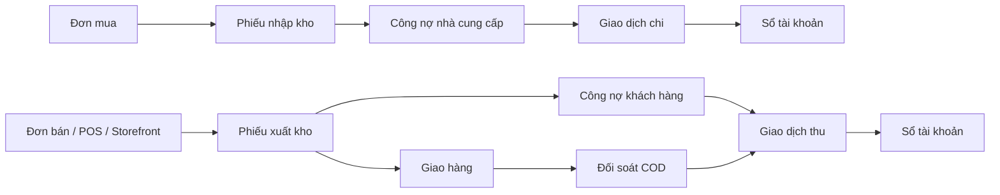

# Mục lục module ERP

Tra nhanh màn hình, API, backend, dữ liệu và test của từng module. Cập nhật theo mã nguồn ngày **12/08/2026**.

**Đi nhanh:** [Người mới](#tong-quan-cho-nguoi-moi) · [Chọn module](#chon-module) · [Tìm lỗi](#tra-cuu-tim-loi-theo-trieu-chung) · [Sửa code](#tra-cuu-nhanh-khi-sua-code)

> Nếu tài liệu khác code, ưu tiên [`routes/web.php`](routes/web.php), [`routes/api.php`](routes/api.php) và phần hiện thực trong mã nguồn.

## Bắt đầu nhanh

| Bạn đang cần                                | Bắt đầu từ                                                                                                  |
| ------------------------------------------- | ----------------------------------------------------------------------------------------------------------- |
| Mới tham gia dự án                          | [Tổng quan cho người mới](#tong-quan-cho-nguoi-moi)                                                         |
| Đang gặp lỗi nhưng chưa biết nguyên nhân    | [Knowledge Base](#tra-cuu-tim-loi-theo-trieu-chung)                                                        |
| Đã biết phân hệ hoặc màn hình cần tìm       | [Chọn module](#chon-module)                                                                                 |
| Chỉ nhớ chức năng, chưa biết tên hàm        | [Tra cứu theo chức năng/nghiệp vụ](#tra-cuu-theo-chuc-nang-nghiep-vu)                                     |
| Đã biết API, class hoặc method              | [`PROJECT_FUNCTION_INDEX.md`](docs/PROJECT_FUNCTION_INDEX.md)                                              |
| Cần tìm bảng, model, migration hoặc test    | [Cơ sở dữ liệu](docs/PROJECT_DATABASE_INDEX.md) · [Hàm và kiểm thử](docs/PROJECT_FUNCTION_INDEX.md)        |

### Người mới — nắm bản đồ dự án trước khi đọc chi tiết

1. Đọc [`START_HERE.md`](START_HERE.md) để chạy dự án và dùng dữ liệu demo.
2. Đọc [Tổng quan cho người mới](#tong-quan-cho-nguoi-moi) và [bản đồ liên module](#luong-lien-module) để hiểu Mua/Bán → Kho → Kế toán.
3. Chọn module; chỉ đọc **Vai trò**, **Điểm vào**, **Liên thông**, **Ràng buộc** và **Luồng demo nhanh** trước. Các khối chi tiết sinh tự động chỉ mở khi cần sửa hoặc tìm lỗi.
4. Khi nhận task, lần theo `màn hình → API → Controller → Service → dữ liệu → test`.

<a id="tong-quan-cho-nguoi-moi"></a>

## Tổng quan cho người mới

### Hệ thống này giải quyết việc gì?

Đây là hệ thống ERP kết nối các công việc vốn dễ bị tách rời: mua hàng, bán hàng, quản lý kho và kế toán. Một đơn hàng chưa tự làm thay đổi tồn kho hoặc tiền. Nó tạo **chứng từ nguồn** để bộ phận tiếp theo kiểm tra và xác nhận. Nhờ vậy, hệ thống lưu được ai đã làm gì và số liệu thay đổi ở bước nào.

### Một yêu cầu đi qua mã nguồn như thế nào?

`Màn hình Vue → API → Controller → Service → Model/cơ sở dữ liệu → Test`

- **Màn hình Vue (giao diện):** nơi người dùng xem dữ liệu và bấm thao tác.
- **API:** địa chỉ mà giao diện gọi để đọc hoặc thay đổi dữ liệu.
- **Controller (bộ điều khiển):** nhận yêu cầu, kiểm tra quyền/đầu vào và gọi xử lý phù hợp.
- **Service (dịch vụ nghiệp vụ):** chứa quy tắc dùng chung như cập nhật tồn, công nợ hoặc sổ tài khoản.
- **Model/cơ sở dữ liệu:** cấu trúc và nơi lưu dữ liệu.
- **Test (kiểm thử tự động):** mô tả kết quả hệ thống phải giữ đúng sau khi sửa code.

Khi mới tìm hiểu, dừng ở **Vai trò**, **Liên thông** và **Luồng demo nhanh** của mỗi module là đủ. Chỉ lần tiếp xuống API/Controller/Service khi đã có một màn hình hoặc lỗi cụ thể.

<details>
<summary><strong>Thuật ngữ thường gặp</strong></summary>

| Thuật ngữ                    | Nghĩa trong tài liệu                                                 |
| ---------------------------- | -------------------------------------------------------------------- |
| PO (Purchase Order)          | Đơn mua hàng gửi nhà cung cấp.                                       |
| SO (Sales Order)             | Đơn bán hàng cho khách.                                              |
| NCC                          | Nhà cung cấp.                                                        |
| POS (Point of Sale)          | Màn hình bán hàng tại quầy.                                          |
| Storefront                   | Cửa hàng trực tuyến dành cho khách mua hàng.                         |
| COD (Cash on Delivery)       | Thu tiền khi giao hàng; cần đối soát tiền đã thu.                    |
| Ledger                       | Sổ tài khoản, lưu từng lần tăng/giảm số dư.                          |
| Công nợ                      | Số tiền còn phải thu từ khách hoặc còn phải trả nhà cung cấp.        |
| Chứng từ nguồn               | Đơn mua, đơn bán hoặc phiếu làm căn cứ cho bước nghiệp vụ sau.       |
| Tồn thực tế / tồn khả dụng   | Số đang có trong kho / số còn có thể dùng sau khi trừ lượng giữ chỗ. |
| Frontend (FE) / Backend (BE) | Phần giao diện / phần xử lý phía máy chủ.                            |
| `pending`                    | Trạng thái đang chờ xử lý hoặc chờ duyệt.                            |
| `base amount`                | Số tiền đã quy đổi về tiền tệ cơ sở của công ty.                     |

</details>

<a id="chon-module"></a>

## Chọn module

| Module                                                        | Màn hình                              | Code chính                                                                                   |
| ------------------------------------------------------------- | ------------------------------------- | -------------------------------------------------------------------------------------------- |
| [Khung ứng dụng và Dashboard](#1-khung-ứng-dụng-và-dashboard) | `/`, `/dashboard`                     | [`DashBoard.vue`](resources/js/Pages/DashBoard.vue)                                          |
| [Công ty và hồ sơ](#2-công-ty-và-hồ-sơ-cá-nhân)               | `/company/*`, `/profile`              | [`Pages/Company`](resources/js/Pages/Company), [`Pages/Profile`](resources/js/Pages/Profile) |
| [Nhân sự và tổ chức](#3-nhân-sự-và-cơ-cấu-tổ-chức)            | `/user`, `/departments`, `/positions` | [`Pages/Manage`](resources/js/Pages/Manage)                                                  |
| [Vai trò và phân quyền](#4-vai-trò-và-phân-quyền)             | `/role`, `/permission`                | [`Role.vue`](resources/js/Pages/Manage/Role.vue)                                             |
| [Mua hàng](#5-mua-hàng)                                       | `/purchase/*`                         | [`Pages/Purchase`](resources/js/Pages/Purchase)                                              |
| [Bán hàng](#6-bán-hàng)                                       | `/sale/*`                             | [`Pages/Sale`](resources/js/Pages/Sale)                                                      |
| [Cửa hàng trực tuyến](#6a-cửa-hàng-trực-tuyến)                | `/shop/*`                             | [`Pages/Storefront`](resources/js/Pages/Storefront)                                          |
| [Kho](#7-kho)                                                 | `/warehouse/*`                        | [`Pages/Warehouse`](resources/js/Pages/Warehouse)                                            |
| [Kế toán và công nợ](#8-kế-toán-giao-dịch-và-công-nợ)         | `/accountant/*`                       | [`Pages/Accountant`](resources/js/Pages/Accountant)                                          |
| [Nhật ký hoạt động](#9-nhật-ký-hoạt-động)                     | `/audit-logs`                         | [`Pages/AuditLog`](resources/js/Pages/AuditLog)                                              |
| [Thông báo và realtime](#10-thông-báo-và-realtime)            | Header                                | [`NotificationMenu.vue`](resources/js/components/layout/header/NotificationMenu.vue)         |
| [Xác thực](#11-xác-thực)                                      | `/login`, `/register`                 | [`routes/auth.php`](routes/auth.php)                                                         |
| [Thành phần dùng chung](#12-thành-phần-dùng-chung-và-hạ-tầng) | Toàn hệ thống                         | [`components`](resources/js/components), [`composables`](resources/js/composables)           |
| [Hướng dẫn sử dụng](#13-hướng-dẫn-sử-dụng)                    | `/guide`                              | [`Guide/Index.vue`](resources/js/Pages/Guide/Index.vue)                                      |

> Luồng nghiệp vụ nằm trong [`BUSINESS_FLOWS.md`](resources/docs/BUSINESS_FLOWS.md); các quyết định kỹ thuật nằm trong [`resources/docs/decisions/`](resources/docs/decisions/).

<a id="luong-lien-module"></a>

## Bản đồ luồng liên module

Phần này dùng khi lỗi xuất hiện ở module sau nhưng nguyên nhân có thể nằm ở chứng từ nguồn của module trước. Đây là bản đồ điều hướng nhanh; quy tắc trạng thái và số liệu đầy đủ nằm trong [`BUSINESS_FLOWS.md`](resources/docs/BUSINESS_FLOWS.md).

**Ví dụ: công ty mua 10 sản phẩm:** nhân viên mua hàng tạo và duyệt đơn mua → nhân viên kho nhận đủ 10 sản phẩm và xác nhận phiếu nhập → kế toán duyệt phiếu để ghi tăng tồn kho và ghi nhận số tiền còn nợ nhà cung cấp → khi công ty thanh toán, kế toán duyệt giao dịch chi để giảm công nợ và ghi vào sổ tài khoản. Nếu tồn kho chưa tăng, hãy kiểm tra phiếu nhập và bước duyệt kế toán trước khi kiểm tra giao dịch thanh toán.

Chiều bán hàng diễn ra ngược lại: nhân viên tạo đơn bán → kho xuất hàng → kế toán duyệt để giảm tồn và ghi công nợ khách hàng → khi thu tiền, giao dịch thu làm giảm công nợ và tăng số dư tài khoản.



| Triệu chứng lỗi                                   | Kiểm tra theo thứ tự                                                                               | Tài liệu/điểm vào                                                                                                                                                        |
| ------------------------------------------------- | -------------------------------------------------------------------------------------------------- | ------------------------------------------------------------------------------------------------------------------------------------------------------------------------ |
| Đơn mua không làm tăng tồn hoặc công nợ           | đơn mua (PO) đã duyệt → phiếu nhập → kho xác nhận → kế toán duyệt → tồn/công nợ nhà cung cấp       | [Luồng mua hàng](resources/docs/BUSINESS_FLOWS.md#mua-hàng--nhập-kho--thanh-toán) · [Mua hàng](#5-mua-hàng) · [Kho](#7-kho) · [Kế toán](#8-kế-toán-giao-dịch-và-công-nợ) |
| Đơn bán không giảm tồn hoặc tạo công nợ           | đơn bán (SO) đã duyệt → phiếu xuất → kho xác nhận → kế toán duyệt → tồn/công nợ khách hàng         | [Luồng bán hàng](resources/docs/BUSINESS_FLOWS.md#bán-hàng--xuất-kho--thu-tiền) · [Bán hàng](#6-bán-hàng) · [Kho](#7-kho) · [Kế toán](#8-kế-toán-giao-dịch-và-công-nợ)   |
| Bán tại quầy/cửa hàng trực tuyến lệch với đơn bán | nguồn tạo đơn → đơn bán và dòng sản phẩm → phiếu xuất → công nợ/giao dịch                          | [Bán hàng](#6-bán-hàng) · [Cửa hàng trực tuyến](#6a-cửa-hàng-trực-tuyến) · [Kho](#7-kho)                                                                                 |
| Số dư hoặc công nợ không giảm                     | chứng từ nguồn → giao dịch gắn đơn mua/đơn bán → duyệt giao dịch → sổ tài khoản → tổng hợp công nợ | [Giao dịch và lịch sử thanh toán](resources/docs/BUSINESS_FLOWS.md#giao-dịch-và-lịch-sử-thanh-toán) · [Kế toán](#8-kế-toán-giao-dịch-và-công-nợ)                         |
| Tiền thu khi giao hàng (COD) không khớp           | phiếu xuất/giao hàng → trạng thái giao → phiên đối soát → giao dịch thu → sổ tài khoản             | [Kho](#7-kho) · [Kế toán](#8-kế-toán-giao-dịch-và-công-nợ) · [`CodReconciliationTest`](tests/Feature/CodReconciliationTest.php)                                          |

> Không suy luận số liệu chỉ từ trạng thái PO/SO. Theo nghiệp vụ hiện hành, tồn kho và công nợ chỉ thay đổi tại bước duyệt có hiệu lực của phiếu kho; số dư tài khoản thay đổi khi giao dịch được duyệt.

<!-- GENERATED_COMBINED_LOOKUP_START -->

> Phần tra cứu hợp nhất từ `PROJECT_MODULE_DETAIL_INDEX.md`, được sinh tự động từ code.

## Cẩm nang chẩn đoán nhanh

> Mở đúng khối theo nhu cầu. Tra cứu nghiệp vụ chỉ giữ API đã tìm được màn hình Vue/JS sử dụng; danh sách hàm đầy đủ nằm tại [`docs/PROJECT_FUNCTION_INDEX.md`](docs/PROJECT_FUNCTION_INDEX.md).

<a id="tra-cuu-theo-chuc-nang-nghiep-vu"></a>

<details>
<summary><strong>Tra cứu theo chức năng/nghiệp vụ — khi quên tên hàm</strong></summary>


> Dùng mục này khi chỉ nhớ việc cần làm, ví dụ “Tạo giao dịch”, “Duyệt đơn bán” hoặc “Tạo phiếu xuất”, nhưng không nhớ tên trang hay file.


### Nền tảng và quản trị

- **Bật/tắt trạng thái người dùng/nhân sự** → `PATCH /api/users/{user}/status` → [API\UserController::toggleStatus()](app/Http/Controllers/API/UserController.php#L363) → Màn hình/Component: [Trang Người dùng — Quản trị](resources/js/Pages/Manage/User.vue#L457)
- **Lấy danh sách lựa chọn chức vụ** → `GET/HEAD /api/positions/all` → [PositionController::all()](app/Http/Controllers/PositionController.php#L35) → Màn hình/Component: [Trang Biểu mẫu người dùng — Quản trị](resources/js/Pages/Manage/UserForm.vue#L602)
- **Lấy danh sách lựa chọn phòng ban** → `GET/HEAD /api/departments/all` → [DepartmentController::all()](app/Http/Controllers/DepartmentController.php#L48) → Màn hình/Component: [Trang Chức vụ — Quản trị](resources/js/Pages/Manage/Position/Index.vue#L332), [Trang Người dùng — Quản trị](resources/js/Pages/Manage/User.vue#L481), [Trang Biểu mẫu người dùng — Quản trị](resources/js/Pages/Manage/UserForm.vue#L592)
- **Lấy danh sách quyền vai trò** → `GET/HEAD /api/permissions/all` → [RoleController::permissions()](app/Http/Controllers/RoleController.php#L66) → Màn hình/Component: [Trang Biểu mẫu vai trò — Quản trị](resources/js/Pages/Manage/RoleForm.vue#L288)
- **Lấy danh sách quản lý phòng ban** → `GET/HEAD /api/departments/managers` → [DepartmentController::managers()](app/Http/Controllers/DepartmentController.php#L56) → Màn hình/Component: [Trang Phòng ban — Quản trị](resources/js/Pages/Manage/Department/Index.vue#L335)
- **Lấy vai trò người dùng/nhân sự** → `GET/HEAD /api/users/roles` → [API\UserController::role()](app/Http/Controllers/API/UserController.php#L81) → Màn hình/Component: [Trang Người dùng — Quản trị](resources/js/Pages/Manage/User.vue#L480), [Trang Biểu mẫu người dùng — Quản trị](resources/js/Pages/Manage/UserForm.vue#L580)
- **Mở trang chỉnh sửa hồ sơ người dùng** → `GET/HEAD /profile` → [ProfileController::edit()](app/Http/Controllers/ProfileController.php#L18) → Màn hình/Component: [Trang Chỉnh sửa hồ sơ](resources/js/Pages/Profile/Edit.vue#L1)
- **Mở trang tạo công ty** → `GET/HEAD /api/company/create` → [CompanyController::create()](app/Http/Controllers/CompanyController.php#L18) → Màn hình/Component: [Trang Tạo công ty](resources/js/Pages/Company/Create.vue#L1)
- **Mở trang tạo công ty** → `GET/HEAD /company/create` → [CompanyController::create()](app/Http/Controllers/CompanyController.php#L18) → Màn hình/Component: [Trang Tạo công ty](resources/js/Pages/Company/Create.vue#L1)
- **Sửa chức vụ** → `PUT /api/positions/{position}` → [PositionController::update()](app/Http/Controllers/PositionController.php#L63) → Màn hình/Component: [Trang Chức vụ — Quản trị](resources/js/Pages/Manage/Position/Index.vue#L298)
- **Sửa hồ sơ người dùng** → `PATCH /profile` → [ProfileController::update()](app/Http/Controllers/ProfileController.php#L28) → Màn hình/Component: [Trang Chỉnh sửa hồ sơ](resources/js/Pages/Profile/Edit.vue#L29)
- **Sửa người dùng/nhân sự** → `PUT /api/users/user/{id}` → [API\UserController::update()](app/Http/Controllers/API/UserController.php#L268) → Màn hình/Component: [Trang Biểu mẫu người dùng — Quản trị](resources/js/Pages/Manage/UserForm.vue#L685)
- **Sửa phòng ban** → `PUT /api/departments/{department}` → [DepartmentController::update()](app/Http/Controllers/DepartmentController.php#L109) → Màn hình/Component: [Trang Phòng ban — Quản trị](resources/js/Pages/Manage/Department/Index.vue#L301)
- **Sửa quyền** → `PUT /api/permissions/{id}` → [PermissionController::update()](app/Http/Controllers/PermissionController.php#L66) → Màn hình/Component: [Trang Biểu mẫu quyền — Quản trị](resources/js/Pages/Manage/PermissionForm.vue#L109)
- **Sửa vai trò** → `PUT /api/roles/{id}` → [RoleController::update()](app/Http/Controllers/RoleController.php#L112) → Màn hình/Component: [Trang Biểu mẫu vai trò — Quản trị](resources/js/Pages/Manage/RoleForm.vue#L305)
- **Tạo chức vụ** → `POST /api/positions` → [PositionController::store()](app/Http/Controllers/PositionController.php#L43) → Màn hình/Component: [Trang Chức vụ — Quản trị](resources/js/Pages/Manage/Position/Index.vue#L299), [Trang Biểu mẫu người dùng — Quản trị](resources/js/Pages/Manage/UserForm.vue#L660)
- **Tạo công ty** → `POST /company` → [CompanyController::store()](app/Http/Controllers/CompanyController.php#L33) → Màn hình/Component: [Trang Tạo công ty](resources/js/Pages/Company/Create.vue#L258)
- **Tạo người dùng/nhân sự** → `POST /api/users/user` → [API\UserController::store()](app/Http/Controllers/API/UserController.php#L165) → Màn hình/Component: [Trang Biểu mẫu người dùng — Quản trị](resources/js/Pages/Manage/UserForm.vue#L687)
- **Tạo phòng ban** → `POST /api/departments` → [DepartmentController::store()](app/Http/Controllers/DepartmentController.php#L80) → Màn hình/Component: [Trang Phòng ban — Quản trị](resources/js/Pages/Manage/Department/Index.vue#L302), [Trang Biểu mẫu người dùng — Quản trị](resources/js/Pages/Manage/UserForm.vue#L640)
- **Tạo quyền** → `POST /api/permissions` → [PermissionController::store()](app/Http/Controllers/PermissionController.php#L35) → Màn hình/Component: [Trang Biểu mẫu quyền — Quản trị](resources/js/Pages/Manage/PermissionForm.vue#L111)
- **Tạo vai trò** → `POST /api/roles` → [RoleController::store()](app/Http/Controllers/RoleController.php#L71) → Màn hình/Component: [Trang Biểu mẫu vai trò — Quản trị](resources/js/Pages/Manage/RoleForm.vue#L307)
- **Xem chi tiết người dùng/nhân sự** → `GET/HEAD /api/users/user/{id}` → [API\UserController::show()](app/Http/Controllers/API/UserController.php#L105) → Màn hình/Component: [Trang Chi tiết người dùng — Quản trị](resources/js/Pages/Manage/UserDetail.vue#L116)
- **Xem danh sách chức vụ** → `GET/HEAD /api/positions` → [PositionController::index()](app/Http/Controllers/PositionController.php#L22) → Màn hình/Component: [Trang Chức vụ — Quản trị](resources/js/Pages/Manage/Position/Index.vue#L260)
- **Xem danh sách người dùng/nhân sự** → `GET/HEAD /api/users/user` → [API\UserController::index()](app/Http/Controllers/API/UserController.php#L22) → Màn hình/Component: [Trang Nhật ký hoạt động](resources/js/Pages/AuditLog/Index.vue#L209), [Trang Người dùng — Quản trị](resources/js/Pages/Manage/User.vue#L424)
- **Xem danh sách phòng ban** → `GET/HEAD /api/departments` → [DepartmentController::index()](app/Http/Controllers/DepartmentController.php#L26) → Màn hình/Component: [Trang Phòng ban — Quản trị](resources/js/Pages/Manage/Department/Index.vue#L263)
- **Xem danh sách quyền** → `GET/HEAD /api/permissions` → [PermissionController::index()](app/Http/Controllers/PermissionController.php#L12) → Màn hình/Component: [Trang Quyền — Quản trị](resources/js/Pages/Manage/Permission.vue#L170)
- **Xem danh sách vai trò** → `GET/HEAD /api/roles` → [RoleController::index()](app/Http/Controllers/RoleController.php#L13) → Màn hình/Component: [Trang Vai trò — Quản trị](resources/js/Pages/Manage/Role.vue#L322)
- **Xóa chức vụ** → `DELETE /api/positions/{position}` → [PositionController::destroy()](app/Http/Controllers/PositionController.php#L70) → Màn hình/Component: [Trang Chức vụ — Quản trị](resources/js/Pages/Manage/Position/Index.vue#L322)
- **Xóa hồ sơ người dùng** → `DELETE /profile` → [ProfileController::destroy()](app/Http/Controllers/ProfileController.php#L44)
- **Xóa phòng ban** → `DELETE /api/departments/{department}` → [DepartmentController::destroy()](app/Http/Controllers/DepartmentController.php#L120) → Màn hình/Component: [Trang Phòng ban — Quản trị](resources/js/Pages/Manage/Department/Index.vue#L325)
- **Xóa quyền** → `DELETE /api/permissions/{id}` → [PermissionController::destroy()](app/Http/Controllers/PermissionController.php#L89) → Màn hình/Component: [Trang Quyền — Quản trị](resources/js/Pages/Manage/Permission.vue#L145)

### Mua hàng

- **Bật/tắt trạng thái danh mục sản phẩm** → `PATCH /api/purchase/categories/{id}/status` → [CategoryController::toggleStatus()](app/Http/Controllers/CategoryController.php#L215) → Màn hình/Component: [Trang Danh mục — Mua hàng](resources/js/Pages/Purchase/Category/Index.vue#L244)
- **Bật/tắt trạng thái danh mục sản phẩm** → `PATCH /api/warehouse/categories/{id}/status` → [CategoryController::toggleStatus()](app/Http/Controllers/CategoryController.php#L215) → Màn hình/Component: [Trang Danh mục — Kho](resources/js/Pages/Warehouse/Category/Index.vue#L239)
- **Bật/tắt trạng thái nhà cung cấp** → `PATCH /api/purchase/suppliers/{id}/status` → [SupplierController::toggleStatus()](app/Http/Controllers/SupplierController.php#L431) → Màn hình/Component: [Trang Nhà cung cấp — Mua hàng](resources/js/Pages/Purchase/Supplier/Index.vue#L363)
- **Bật/tắt trạng thái sản phẩm** → `PATCH /api/purchase/products/{id}/status` → [ProductController::toggleStatus()](app/Http/Controllers/ProductController.php#L445) → Màn hình/Component: [Trang Sản phẩm — Mua hàng](resources/js/Pages/Purchase/Product/Index.vue#L391)
- **Bật/tắt trạng thái sản phẩm** → `PATCH /api/warehouse/products/{id}/status` → [ProductController::toggleStatus()](app/Http/Controllers/ProductController.php#L445) → Màn hình/Component: [Trang Sản phẩm — Kho](resources/js/Pages/Warehouse/Product/Index.vue#L390)
- **Bật/tắt trạng thái đơn vị tính** → `PATCH /api/purchase/units/{id}/status` → [UnitController::toggleStatus()](app/Http/Controllers/UnitController.php#L148) → Màn hình/Component: [Trang Đơn vị tính — Mua hàng](resources/js/Pages/Purchase/Unit/Index.vue#L227)
- **Bật/tắt trạng thái đơn vị tính** → `PATCH /api/warehouse/units/{id}/status` → [UnitController::toggleStatus()](app/Http/Controllers/UnitController.php#L148) → Màn hình/Component: [Trang Đơn vị tính — Kho](resources/js/Pages/Warehouse/Unit/Index.vue#L227)
- **Chuẩn bị tạo phiếu nhập đơn mua** → `GET/HEAD /api/warehouse/orders/{id}/stock-in` → [PurchaseOrderController::stockInData()](app/Http/Controllers/PurchaseOrderController.php#L647) → Màn hình/Component: [Trang tạo phiếu nhập — Kho](resources/js/Pages/Warehouse/Slip/Purchasecreate.vue#L379)
- **Duyệt đơn mua** → `POST /api/purchase/orders/{id}/approve` → [PurchaseOrderController::approve()](app/Http/Controllers/PurchaseOrderController.php#L524) → Màn hình/Component: [Trang Đơn mua — Mua hàng](resources/js/Pages/Purchase/Order/Index.vue#L438)
- **Hủy đơn mua** → `POST /api/purchase/orders/{id}/cancel` → [PurchaseOrderController::cancel()](app/Http/Controllers/PurchaseOrderController.php#L576) → Màn hình/Component: [Trang Đơn mua — Mua hàng](resources/js/Pages/Purchase/Order/Index.vue#L503)
- **Lấy danh sách lựa chọn danh mục sản phẩm** → `GET/HEAD /api/purchase/categories/select` → [CategoryController::select()](app/Http/Controllers/CategoryController.php#L82) → Màn hình/Component: [Trang Biểu mẫu sản phẩm — Mua hàng](resources/js/Pages/Purchase/Product/ProductForm.vue#L495)
- **Lấy danh sách lựa chọn danh mục sản phẩm** → `GET/HEAD /api/warehouse/categories/select` → [CategoryController::select()](app/Http/Controllers/CategoryController.php#L82) → Màn hình/Component: [Trang Biểu mẫu sản phẩm — Kho](resources/js/Pages/Warehouse/Product/ProductForm.vue#L499)
- **Lấy danh sách lựa chọn nhà cung cấp** → `GET/HEAD /api/purchase/suppliers/all` → [SupplierController::all()](app/Http/Controllers/SupplierController.php#L100) → Màn hình/Component: [Trang Giao dịch — Kế toán](resources/js/Pages/Accountant/Transaction/Index.vue#L472), [Trang Đơn mua — Mua hàng](resources/js/Pages/Purchase/Order/Index.vue#L471), [Trang Nhà cung cấp — Mua hàng](resources/js/Pages/Purchase/Supplier/Index.vue#L296)
- **Lấy danh sách lựa chọn sản phẩm** → `GET/HEAD /api/products/for-select` → [ProductController::forSelect()](app/Http/Controllers/ProductController.php#L174) → Màn hình/Component: [Trang Biểu mẫu đơn mua — Mua hàng](resources/js/Pages/Purchase/Order/PurchaseOrderForm.vue#L493), [Trang Khách hàng — Bán hàng](resources/js/Pages/Sale/Customer/Index.vue#L391), [Trang Đơn bán — Bán hàng](resources/js/Pages/Sale/Order/Index.vue#L447), [Form tạo/sửa đơn bán — Bán hàng](resources/js/Pages/Sale/Order/SaleOrderForm.vue#L950)
- **Lấy danh sách lựa chọn đơn vị tính** → `GET/HEAD /api/purchase/units/select` → [UnitController::select()](app/Http/Controllers/UnitController.php#L35) → Màn hình/Component: [Trang Biểu mẫu sản phẩm — Mua hàng](resources/js/Pages/Purchase/Product/ProductForm.vue#L496)
- **Lấy danh sách lựa chọn đơn vị tính** → `GET/HEAD /api/warehouse/units/select` → [UnitController::select()](app/Http/Controllers/UnitController.php#L35) → Màn hình/Component: [Trang Biểu mẫu sản phẩm — Kho](resources/js/Pages/Warehouse/Product/ProductForm.vue#L500)
- **Sửa nhà cung cấp** → `PUT /api/purchase/suppliers/{supplier}` → [SupplierController::update()](app/Http/Controllers/SupplierController.php#L345) → Màn hình/Component: [Trang Biểu mẫu nhà cung cấp — Mua hàng](resources/js/Pages/Purchase/Supplier/SupplierForm.vue#L516)
- **Sửa sản phẩm** → `PUT /api/purchase/products/{product}` → [ProductController::update()](app/Http/Controllers/ProductController.php#L318) → Màn hình/Component: [Trang Biểu mẫu sản phẩm — Mua hàng](resources/js/Pages/Purchase/Product/ProductForm.vue#L460)
- **Sửa sản phẩm** → `PUT /api/warehouse/products/{product}` → [ProductController::update()](app/Http/Controllers/ProductController.php#L318) → Màn hình/Component: [Trang Biểu mẫu sản phẩm — Kho](resources/js/Pages/Warehouse/Product/ProductForm.vue#L471)
- **Sửa đơn mua** → `PUT /api/purchase/orders/{order}` → [PurchaseOrderController::update()](app/Http/Controllers/PurchaseOrderController.php#L382) → Màn hình/Component: [Trang Biểu mẫu đơn mua — Mua hàng](resources/js/Pages/Purchase/Order/PurchaseOrderForm.vue#L758)
- **Tạo nhà cung cấp** → `POST /api/purchase/suppliers` → [SupplierController::store()](app/Http/Controllers/SupplierController.php#L134) → Màn hình/Component: [Trang Biểu mẫu nhà cung cấp — Mua hàng](resources/js/Pages/Purchase/Supplier/SupplierForm.vue#L522)
- **Tạo sản phẩm** → `POST /api/purchase/products` → [ProductController::store()](app/Http/Controllers/ProductController.php#L211) → Màn hình/Component: [Trang Biểu mẫu sản phẩm — Mua hàng](resources/js/Pages/Purchase/Product/ProductForm.vue#L464)
- **Tạo sản phẩm** → `POST /api/warehouse/products` → [ProductController::store()](app/Http/Controllers/ProductController.php#L211) → Màn hình/Component: [Trang Biểu mẫu sản phẩm — Kho](resources/js/Pages/Warehouse/Product/ProductForm.vue#L473)
- **Tạo đơn mua** → `POST /api/purchase/orders` → [PurchaseOrderController::store()](app/Http/Controllers/PurchaseOrderController.php#L238) → Màn hình/Component: [Trang Biểu mẫu đơn mua — Mua hàng](resources/js/Pages/Purchase/Order/PurchaseOrderForm.vue#L760)
- **Xem chi tiết danh mục sản phẩm** → `GET/HEAD /api/purchase/categories/{category}` → [CategoryController::show()](app/Http/Controllers/CategoryController.php#L118) → Màn hình/Component: [Trang Biểu mẫu sản phẩm — Mua hàng](resources/js/Pages/Purchase/Product/ProductForm.vue#L495)
- **Xem chi tiết danh mục sản phẩm** → `GET/HEAD /api/warehouse/categories/{category}` → [CategoryController::show()](app/Http/Controllers/CategoryController.php#L118) → Màn hình/Component: [Trang Biểu mẫu sản phẩm — Kho](resources/js/Pages/Warehouse/Product/ProductForm.vue#L499)
- **Xem chi tiết nhà cung cấp** → `GET/HEAD /api/purchase/suppliers/{supplier}` → [SupplierController::show()](app/Http/Controllers/SupplierController.php#L197) → Màn hình/Component: [Trang Giao dịch — Kế toán](resources/js/Pages/Accountant/Transaction/Index.vue#L472), [Trang Đơn mua — Mua hàng](resources/js/Pages/Purchase/Order/Index.vue#L471), [Trang Nhà cung cấp — Mua hàng](resources/js/Pages/Purchase/Supplier/Index.vue#L287)
- **Xem chi tiết đơn mua** → `GET/HEAD /api/purchase/orders/{order}` → [PurchaseOrderController::show()](app/Http/Controllers/PurchaseOrderController.php#L179) → Màn hình/Component: [Trang Đơn mua — Mua hàng](resources/js/Pages/Purchase/Order/Index.vue#L517), [Trang Chi tiết nhà cung cấp — Mua hàng](resources/js/Pages/Purchase/Supplier/SupplierDetail.vue#L558), [Trang Đơn chờ kho — Kho](resources/js/Pages/Warehouse/Order/Index.vue#L559)
- **Xem chi tiết đơn vị tính** → `GET/HEAD /api/purchase/units/{unit}` → [UnitController::show()](app/Http/Controllers/UnitController.php#L81) → Màn hình/Component: [Trang Biểu mẫu sản phẩm — Mua hàng](resources/js/Pages/Purchase/Product/ProductForm.vue#L496)
- **Xem chi tiết đơn vị tính** → `GET/HEAD /api/warehouse/units/{unit}` → [UnitController::show()](app/Http/Controllers/UnitController.php#L81) → Màn hình/Component: [Trang Biểu mẫu sản phẩm — Kho](resources/js/Pages/Warehouse/Product/ProductForm.vue#L500)
- **Xem danh sách chờ kho đơn mua** → `GET/HEAD /api/warehouse/orders` → [PurchaseOrderController::warehouseIndex()](app/Http/Controllers/PurchaseOrderController.php#L118) → Màn hình/Component: [Trang Đơn chờ kho — Kho](resources/js/Pages/Warehouse/Order/Index.vue#L569)
- **Xem danh sách danh mục sản phẩm** → `GET/HEAD /api/purchase/categories` → [CategoryController::index()](app/Http/Controllers/CategoryController.php#L11) → Màn hình/Component: [Trang Danh mục — Mua hàng](resources/js/Pages/Purchase/Category/Index.vue#L210)
- **Xem danh sách danh mục sản phẩm** → `GET/HEAD /api/warehouse/categories` → [CategoryController::index()](app/Http/Controllers/CategoryController.php#L11) → Màn hình/Component: [Trang Danh mục — Mua hàng](resources/js/Pages/Purchase/Category/Index.vue#L227), [Trang Danh mục — Kho](resources/js/Pages/Warehouse/Category/Index.vue#L205)
- **Xem danh sách nhà cung cấp** → `GET/HEAD /api/accountant/suppliers-debt` → [SupplierController::index()](app/Http/Controllers/SupplierController.php#L29) → Màn hình/Component: [Trang Nhà cung cấp — Kế toán](resources/js/Pages/Accountant/Supplier/Index.vue#L154)
- **Xem danh sách nhà cung cấp** → `GET/HEAD /api/purchase/suppliers` → [SupplierController::index()](app/Http/Controllers/SupplierController.php#L29) → Màn hình/Component: [Trang Nhà cung cấp — Mua hàng](resources/js/Pages/Purchase/Supplier/Index.vue#L335)
- **Xem danh sách sản phẩm** → `GET/HEAD /api/purchase/products` → [ProductController::index()](app/Http/Controllers/ProductController.php#L51) → Màn hình/Component: [Trang Đơn mua — Mua hàng](resources/js/Pages/Purchase/Order/Index.vue#L477), [Trang Sản phẩm — Mua hàng](resources/js/Pages/Purchase/Product/Index.vue#L309)
- **Xem danh sách sản phẩm** → `GET/HEAD /api/warehouse/products` → [ProductController::index()](app/Http/Controllers/ProductController.php#L51) → Màn hình/Component: [Trang Sản phẩm — Kho](resources/js/Pages/Warehouse/Product/Index.vue#L308), [Trang Chuyển kho — Kho](resources/js/Pages/Warehouse/Transfer/Index.vue#L312)
- **Xem danh sách đơn mua** → `GET/HEAD /api/purchase/orders` → [PurchaseOrderController::index()](app/Http/Controllers/PurchaseOrderController.php#L46) → Màn hình/Component: [Form giao dịch kế toán — Kế toán](resources/js/Pages/Accountant/Transaction/TransactionForm.vue#L1222), [Trang Đơn mua — Mua hàng](resources/js/Pages/Purchase/Order/Index.vue#L454)
- **Xem danh sách đơn vị tính** → `GET/HEAD /api/purchase/units` → [UnitController::index()](app/Http/Controllers/UnitController.php#L19) → Màn hình/Component: [Trang Đơn vị tính — Mua hàng](resources/js/Pages/Purchase/Unit/Index.vue#L154)
- **Xem danh sách đơn vị tính** → `GET/HEAD /api/warehouse/units` → [UnitController::index()](app/Http/Controllers/UnitController.php#L19) → Màn hình/Component: [Trang Đơn vị tính — Mua hàng](resources/js/Pages/Purchase/Unit/Index.vue#L212), [Trang Đơn vị tính — Kho](resources/js/Pages/Warehouse/Unit/Index.vue#L154)
- **Xem hồ sơ chi tiết nhà cung cấp** → `GET/HEAD /api/purchase/suppliers/{id}/detail` → [SupplierController::detail()](app/Http/Controllers/SupplierController.php#L202) → Màn hình/Component: [Trang Chi tiết nhà cung cấp — Mua hàng](resources/js/Pages/Purchase/Supplier/SupplierDetail.vue#L572)
- **Xóa sản phẩm** → `DELETE /api/purchase/products/{product}` → [ProductController::destroy()](app/Http/Controllers/ProductController.php#L427) → Màn hình/Component: [Trang Sản phẩm — Mua hàng](resources/js/Pages/Purchase/Product/Index.vue#L380)
- **Xóa sản phẩm** → `DELETE /api/warehouse/products/{product}` → [ProductController::destroy()](app/Http/Controllers/ProductController.php#L427) → Màn hình/Component: [Trang Sản phẩm — Kho](resources/js/Pages/Warehouse/Product/Index.vue#L379)

### Bán hàng

- **Bật/tắt trạng thái khách hàng** → `PATCH /api/sale/customers/{customer}/status` → [CustomerController::toggleStatus()](app/Http/Controllers/CustomerController.php#L399) → Màn hình/Component: [Trang Khách hàng — Bán hàng](resources/js/Pages/Sale/Customer/Index.vue#L372)
- **Chuẩn bị tạo phiếu xuất đơn bán** → `GET/HEAD /api/warehouse/orders/{id}/stock-out` → [SalesOrderController::stockOutData()](app/Http/Controllers/SalesOrderController.php#L923) → Màn hình/Component: [Trang tạo phiếu xuất — Kho](resources/js/Pages/Warehouse/Slip/Salecreate.vue#L327)
- **Duyệt đơn bán** → `POST /api/sale/orders/{id}/approve` → [SalesOrderController::approve()](app/Http/Controllers/SalesOrderController.php#L776) → Màn hình/Component: [Trang Đơn bán — Bán hàng](resources/js/Pages/Sale/Order/Index.vue#L524)
- **Hủy đơn bán** → `POST /api/sale/orders/{id}/cancel` → [SalesOrderController::cancel()](app/Http/Controllers/SalesOrderController.php#L824) → Màn hình/Component: [Trang Đơn bán — Bán hàng](resources/js/Pages/Sale/Order/Index.vue#L511)
- **Hủy đơn nháp đơn bán POS** → `DELETE /api/sale/pos/drafts/{order}` → [PosController::cancelDraft()](app/Http/Controllers/PosController.php#L189) → Màn hình/Component: [Trang bán hàng POS — Bán hàng](resources/js/Pages/Sale/Pos/Index.vue#L414)
- **Kiểm tra số lượng có thể xuất đơn bán** → `GET/HEAD /api/available-for-export` → [SalesOrderController::availableForExport()](app/Http/Controllers/SalesOrderController.php#L245) → Màn hình/Component: [Trang tạo phiếu xuất — Kho](resources/js/Pages/Warehouse/Slip/Salecreate.vue#L363)
- **Lấy danh sách lựa chọn khách hàng** → `GET/HEAD /api/sale/customers/all` → [CustomerController::all()](app/Http/Controllers/CustomerController.php#L92) → Màn hình/Component: [Trang Giao dịch — Kế toán](resources/js/Pages/Accountant/Transaction/Index.vue#L471), [Trang Biểu mẫu mã giảm giá — Bán hàng](resources/js/Pages/Sale/Coupon/CouponForm.vue#L104), [Trang Khách hàng — Bán hàng](resources/js/Pages/Sale/Customer/Index.vue#L390), [Trang Đơn bán — Bán hàng](resources/js/Pages/Sale/Order/Index.vue#L442)
- **Lấy danh sách đang hoạt động mã giảm giá** → `GET/HEAD /api/sale/coupons/active` → [CouponController::active()](app/Http/Controllers/CouponController.php#L52) → Màn hình/Component: [Form tạo/sửa đơn bán — Bán hàng](resources/js/Pages/Sale/Order/SaleOrderForm.vue#L933)
- **Lấy dữ liệu lựa chọn đơn bán POS** → `GET/HEAD /api/sale/pos/options` → [PosController::options()](app/Http/Controllers/PosController.php#L39) → Màn hình/Component: [Trang bán hàng POS — Bán hàng](resources/js/Pages/Sale/Pos/Index.vue#L486)
- **Sửa khách hàng** → `PUT /api/sale/customers/{customer}` → [CustomerController::update()](app/Http/Controllers/CustomerController.php#L179) → Màn hình/Component: [Trang Biểu mẫu khách hàng — Bán hàng](resources/js/Pages/Sale/Customer/CustomerForm.vue#L497)
- **Sửa mã giảm giá** → `PUT /api/sale/coupons/{coupon}` → [CouponController::update()](app/Http/Controllers/CouponController.php#L84) → Màn hình/Component: [Trang Biểu mẫu mã giảm giá — Bán hàng](resources/js/Pages/Sale/Coupon/CouponForm.vue#L109)
- **Sửa đơn bán** → `PUT /api/sale/orders/{order}` → [SalesOrderController::update()](app/Http/Controllers/SalesOrderController.php#L562) → Màn hình/Component: [Form tạo/sửa đơn bán — Bán hàng](resources/js/Pages/Sale/Order/SaleOrderForm.vue#L1000)
- **Sửa đơn nháp đơn bán POS** → `PUT /api/sale/pos/drafts/{order}` → [PosController::updateDraft()](app/Http/Controllers/PosController.php#L121) → Màn hình/Component: [Trang bán hàng POS — Bán hàng](resources/js/Pages/Sale/Pos/Index.vue#L394)
- **Tạo khách hàng** → `POST /api/sale/customers` → [CustomerController::store()](app/Http/Controllers/CustomerController.php#L120) → Màn hình/Component: [Trang Biểu mẫu khách hàng — Bán hàng](resources/js/Pages/Sale/Customer/CustomerForm.vue#L504)
- **Tạo mã giảm giá** → `POST /api/sale/coupons` → [CouponController::store()](app/Http/Controllers/CouponController.php#L68) → Màn hình/Component: [Trang Biểu mẫu mã giảm giá — Bán hàng](resources/js/Pages/Sale/Coupon/CouponForm.vue#L109)
- **Tạo nhanh khách hàng đơn bán POS** → `POST /api/sale/pos/customers` → [PosController::storeCustomer()](app/Http/Controllers/PosController.php#L96) → Màn hình/Component: [Trang bán hàng POS — Bán hàng](resources/js/Pages/Sale/Pos/Index.vue#L436)
- **Tạo đơn bán POS** → `POST /api/sale/pos/orders` → [PosController::store()](app/Http/Controllers/PosController.php#L202) → Màn hình/Component: [Trang bán hàng POS — Bán hàng](resources/js/Pages/Sale/Pos/Index.vue#L456)
- **Tạo đơn bán** → `POST /api/sale/orders` → [SalesOrderController::store()](app/Http/Controllers/SalesOrderController.php#L363) → Màn hình/Component: [Form tạo/sửa đơn bán — Bán hàng](resources/js/Pages/Sale/Order/SaleOrderForm.vue#L1002)
- **Tạo đơn nháp đơn bán POS** → `POST /api/sale/pos/drafts` → [PosController::createDraft()](app/Http/Controllers/PosController.php#L80) → Màn hình/Component: [Trang bán hàng POS — Bán hàng](resources/js/Pages/Sale/Pos/Index.vue#L350)
- **Xem chi tiết khách hàng** → `GET/HEAD /api/sale/customers/{customer}` → [CustomerController::show()](app/Http/Controllers/CustomerController.php#L248) → Màn hình/Component: [Trang Giao dịch — Kế toán](resources/js/Pages/Accountant/Transaction/Index.vue#L471), [Trang Biểu mẫu mã giảm giá — Bán hàng](resources/js/Pages/Sale/Coupon/CouponForm.vue#L104), [Trang Khách hàng — Bán hàng](resources/js/Pages/Sale/Customer/Index.vue#L319), [Trang Đơn bán — Bán hàng](resources/js/Pages/Sale/Order/Index.vue#L442)
- **Xem chi tiết đơn bán POS** → `GET/HEAD /api/sale/pos/orders/{order}` → [PosController::show()](app/Http/Controllers/PosController.php#L348) → Màn hình/Component: [Trang bán hàng POS — Bán hàng](resources/js/Pages/Sale/Pos/Index.vue#L481)
- **Xem chi tiết đơn bán** → `GET/HEAD /api/sale/orders/{order}` → [SalesOrderController::show()](app/Http/Controllers/SalesOrderController.php#L296) → Màn hình/Component: [Trang chi tiết khách hàng — Bán hàng](resources/js/Pages/Sale/Customer/CustomerDetail.vue#L552), [Trang Đơn bán — Bán hàng](resources/js/Pages/Sale/Order/Index.vue#L414), [Trang Đơn chờ kho — Kho](resources/js/Pages/Warehouse/Order/Index.vue#L412)
- **Xem danh sách chờ kho đơn bán** → `GET/HEAD /api/saleorders/warehouse` → [SalesOrderController::warehouseIndex()](app/Http/Controllers/SalesOrderController.php#L149) → Màn hình/Component: [Trang Đơn chờ kho — Kho](resources/js/Pages/Warehouse/Order/Index.vue#L586)
- **Xem danh sách khách hàng** → `GET/HEAD /api/accountant/customers-debt` → [CustomerController::index()](app/Http/Controllers/CustomerController.php#L15) → Màn hình/Component: [Trang Khách hàng — Kế toán](resources/js/Pages/Accountant/Customer/Index.vue#L158)
- **Xem danh sách khách hàng** → `GET/HEAD /api/sale/customers` → [CustomerController::index()](app/Http/Controllers/CustomerController.php#L15) → Màn hình/Component: [Trang Khách hàng — Bán hàng](resources/js/Pages/Sale/Customer/Index.vue#L344)
- **Xem danh sách mã giảm giá** → `GET/HEAD /api/sale/coupons` → [CouponController::index()](app/Http/Controllers/CouponController.php#L18) → Màn hình/Component: [Trang Mã giảm giá — Bán hàng](resources/js/Pages/Sale/Coupon/Index.vue#L103)
- **Xem danh sách đơn bán** → `GET/HEAD /api/sale/orders` → [SalesOrderController::index()](app/Http/Controllers/SalesOrderController.php#L40) → Màn hình/Component: [Form giao dịch kế toán — Kế toán](resources/js/Pages/Accountant/Transaction/TransactionForm.vue#L1190), [Trang Đơn bán — Bán hàng](resources/js/Pages/Sale/Order/Index.vue#L425)
- **Xem hồ sơ chi tiết khách hàng** → `GET/HEAD /api/accountant/customers-debt/{id}/detail` → [CustomerController::detail()](app/Http/Controllers/CustomerController.php#L282) → Màn hình/Component: [Trang Chi tiết khách hàng — Kế toán](resources/js/Pages/Accountant/Customer/CustomerDetail.vue#L141)
- **Xem hồ sơ chi tiết khách hàng** → `GET/HEAD /api/sale/customers/{id}/detail` → [CustomerController::detail()](app/Http/Controllers/CustomerController.php#L282) → Màn hình/Component: [Trang chi tiết khách hàng — Bán hàng](resources/js/Pages/Sale/Customer/CustomerDetail.vue#L573), [Form tạo/sửa đơn bán — Bán hàng](resources/js/Pages/Sale/Order/SaleOrderForm.vue#L639)
- **Xem lịch sử đơn bán POS** → `GET/HEAD /api/sale/pos/history` → [PosController::history()](app/Http/Controllers/PosController.php#L339) → Màn hình/Component: [Trang bán hàng POS — Bán hàng](resources/js/Pages/Sale/Pos/Index.vue#L480)
- **Xem đơn nháp đơn bán POS** → `GET/HEAD /api/sale/pos/drafts` → [PosController::drafts()](app/Http/Controllers/PosController.php#L25) → Màn hình/Component: [Trang bán hàng POS — Bán hàng](resources/js/Pages/Sale/Pos/Index.vue#L488)
- **Xóa mã giảm giá** → `DELETE /api/sale/coupons/{coupon}` → [CouponController::destroy()](app/Http/Controllers/CouponController.php#L102) → Màn hình/Component: [Trang Mã giảm giá — Bán hàng](resources/js/Pages/Sale/Coupon/Index.vue#L130)

### Cửa hàng trực tuyến

- **Hủy đơn hàng tài khoản khách hàng cửa hàng trực tuyến** → `POST /shop/{company}/account/orders/{code}/cancel` → [StorefrontAccountController::cancelOrder()](app/Http/Controllers/StorefrontAccountController.php#L368) → Màn hình/Component: [Trang tài khoản cửa hàng trực tuyến — Cửa hàng trực tuyến](resources/js/Pages/Storefront/Account.vue#L711), [Trang chi tiết đơn cửa hàng trực tuyến — Cửa hàng trực tuyến](resources/js/Pages/Storefront/OrderDetail.vue#L190)
- **Lấy mã giảm giá khả dụng cửa hàng trực tuyến** → `GET/HEAD /shop/{company}/vouchers` → [StorefrontController::vouchers()](app/Http/Controllers/StorefrontController.php#L128) → Màn hình/Component: [Trang thanh toán cửa hàng trực tuyến — Cửa hàng trực tuyến](resources/js/Pages/Storefront/Checkout.vue#L534)
- **Lấy thông tin tài khoản hiện tại tài khoản khách hàng cửa hàng trực tuyến** → `GET/HEAD /shop/{company}/account/me` → [StorefrontAccountController::me()](app/Http/Controllers/StorefrontAccountController.php#L185) → Màn hình/Component: [Trang tài khoản cửa hàng trực tuyến — Cửa hàng trực tuyến](resources/js/Pages/Storefront/Account.vue#L558), [Trang thanh toán cửa hàng trực tuyến — Cửa hàng trực tuyến](resources/js/Pages/Storefront/Checkout.vue#L535)
- **Mở cửa hàng cửa hàng trực tuyến** → `GET/HEAD /shop/{company}` → [StorefrontController::shop()](app/Http/Controllers/StorefrontController.php#L36) → Màn hình/Component: [Trang Cửa hàng — Cửa hàng trực tuyến](resources/js/Pages/Storefront/Shop.vue#L1)
- **Mở danh bạ cửa hàng cửa hàng trực tuyến** → `GET/HEAD /shop` → [StorefrontController::directory()](app/Http/Controllers/StorefrontController.php#L27) → Màn hình/Component: [Trang Danh bạ cửa hàng — Cửa hàng trực tuyến](resources/js/Pages/Storefront/Directory.vue#L1)
- **Mở trang chi tiết đơn tài khoản khách hàng cửa hàng trực tuyến** → `GET/HEAD /shop/{company}/my-account/orders/{code}` → [StorefrontAccountController::orderPage()](app/Http/Controllers/StorefrontAccountController.php#L27) → Màn hình/Component: [Trang chi tiết đơn cửa hàng trực tuyến — Cửa hàng trực tuyến](resources/js/Pages/Storefront/OrderDetail.vue#L1)
- **Mở trang giỏ hàng cửa hàng trực tuyến** → `GET/HEAD /shop/{company}/cart` → [StorefrontController::cartPage()](app/Http/Controllers/StorefrontController.php#L58) → Màn hình/Component: [Trang Giỏ hàng — Cửa hàng trực tuyến](resources/js/Pages/Storefront/Cart.vue#L1)
- **Mở trang sản phẩm cửa hàng trực tuyến** → `GET/HEAD /shop/{company}/product/{product}` → [StorefrontController::productPage()](app/Http/Controllers/StorefrontController.php#L50) → Màn hình/Component: [Trang Sản phẩm — Cửa hàng trực tuyến](resources/js/Pages/Storefront/Product.vue#L1)
- **Mở trang thanh toán cửa hàng trực tuyến** → `GET/HEAD /shop/{company}/checkout` → [StorefrontController::checkoutPage()](app/Http/Controllers/StorefrontController.php#L65) → Màn hình/Component: [Trang thanh toán cửa hàng trực tuyến — Cửa hàng trực tuyến](resources/js/Pages/Storefront/Checkout.vue#L1)
- **Mở trang thông báo tài khoản khách hàng cửa hàng trực tuyến** → `GET/HEAD /shop/{company}/my-account/notifications` → [StorefrontAccountController::notificationPage()](app/Http/Controllers/StorefrontAccountController.php#L114) → Màn hình/Component: [Trang Thông báo — Cửa hàng trực tuyến](resources/js/Pages/Storefront/Notifications.vue#L1)
- **Mở trang tài khoản cửa hàng trực tuyến** → `GET/HEAD /shop/{company}/my-account` → [StorefrontController::accountPage()](app/Http/Controllers/StorefrontController.php#L43) → Màn hình/Component: [Trang tài khoản cửa hàng trực tuyến — Cửa hàng trực tuyến](resources/js/Pages/Storefront/Account.vue#L1)
- **Mở trang đặt hàng thành công cửa hàng trực tuyến** → `GET/HEAD /shop/{company}/order-success` → [StorefrontController::successPage()](app/Http/Controllers/StorefrontController.php#L72) → Màn hình/Component: [Trang Đặt hàng thành công — Cửa hàng trực tuyến](resources/js/Pages/Storefront/Success.vue#L1)
- **Sửa hồ sơ tài khoản khách hàng cửa hàng trực tuyến** → `PUT /shop/{company}/account/profile` → [StorefrontAccountController::updateProfile()](app/Http/Controllers/StorefrontAccountController.php#L192) → Màn hình/Component: [Trang tài khoản cửa hàng trực tuyến — Cửa hàng trực tuyến](resources/js/Pages/Storefront/Account.vue#L584)
- **Sửa địa chỉ tài khoản khách hàng cửa hàng trực tuyến** → `PUT /shop/{company}/account/addresses/{address}` → [StorefrontAccountController::updateAddress()](app/Http/Controllers/StorefrontAccountController.php#L458) → Màn hình/Component: [Trang tài khoản cửa hàng trực tuyến — Cửa hàng trực tuyến](resources/js/Pages/Storefront/Account.vue#L670)
- **Tạo địa chỉ tài khoản khách hàng cửa hàng trực tuyến** → `POST /shop/{company}/account/addresses` → [StorefrontAccountController::storeAddress()](app/Http/Controllers/StorefrontAccountController.php#L405) → Màn hình/Component: [Trang tài khoản cửa hàng trực tuyến — Cửa hàng trực tuyến](resources/js/Pages/Storefront/Account.vue#L672), [Trang thanh toán cửa hàng trực tuyến — Cửa hàng trực tuyến](resources/js/Pages/Storefront/Checkout.vue#L433)
- **Xem chi tiết sản phẩm cửa hàng trực tuyến** → `GET/HEAD /shop/{company}/products/{product}` → [StorefrontController::product()](app/Http/Controllers/StorefrontController.php#L118) → Màn hình/Component: [Trang Sản phẩm — Cửa hàng trực tuyến](resources/js/Pages/Storefront/Product.vue#L152)
- **Xem danh sách sản phẩm cửa hàng trực tuyến** → `GET/HEAD /shop/{company}/products` → [StorefrontController::products()](app/Http/Controllers/StorefrontController.php#L79) → Màn hình/Component: [Trang Cửa hàng — Cửa hàng trực tuyến](resources/js/Pages/Storefront/Shop.vue#L407)
- **Xem danh sách thông báo tài khoản khách hàng cửa hàng trực tuyến** → `GET/HEAD /shop/{company}/account/notifications` → [StorefrontAccountController::notifications()](app/Http/Controllers/StorefrontAccountController.php#L248)
- **Xem danh sách đơn tài khoản khách hàng cửa hàng trực tuyến** → `GET/HEAD /shop/{company}/account/orders` → [StorefrontAccountController::orders()](app/Http/Controllers/StorefrontAccountController.php#L221) → Màn hình/Component: [Trang tài khoản cửa hàng trực tuyến — Cửa hàng trực tuyến](resources/js/Pages/Storefront/Account.vue#L566)
- **Xem danh sách địa chỉ tài khoản khách hàng cửa hàng trực tuyến** → `GET/HEAD /shop/{company}/account/addresses` → [StorefrontAccountController::addresses()](app/Http/Controllers/StorefrontAccountController.php#L400) → Màn hình/Component: [Trang tài khoản cửa hàng trực tuyến — Cửa hàng trực tuyến](resources/js/Pages/Storefront/Account.vue#L567), [Trang thanh toán cửa hàng trực tuyến — Cửa hàng trực tuyến](resources/js/Pages/Storefront/Checkout.vue#L544)
- **Xem lịch sử thông báo tài khoản khách hàng cửa hàng trực tuyến** → `GET/HEAD /shop/{company}/account/notification-history` → [StorefrontAccountController::notificationHistory()](app/Http/Controllers/StorefrontAccountController.php#L266) → Màn hình/Component: [Trang Thông báo — Cửa hàng trực tuyến](resources/js/Pages/Storefront/Notifications.vue#L166)
- **Xóa thông báo tài khoản khách hàng cửa hàng trực tuyến** → `DELETE /shop/{company}/account/notifications/{notification}` → [StorefrontAccountController::destroyNotification()](app/Http/Controllers/StorefrontAccountController.php#L328) → Màn hình/Component: [Trang Thông báo — Cửa hàng trực tuyến](resources/js/Pages/Storefront/Notifications.vue#L213)
- **Xóa địa chỉ tài khoản khách hàng cửa hàng trực tuyến** → `DELETE /shop/{company}/account/addresses/{address}` → [StorefrontAccountController::destroyAddress()](app/Http/Controllers/StorefrontAccountController.php#L439) → Màn hình/Component: [Trang tài khoản cửa hàng trực tuyến — Cửa hàng trực tuyến](resources/js/Pages/Storefront/Account.vue#L706)
- **Đánh dấu thông báo đã đọc tài khoản khách hàng cửa hàng trực tuyến** → `POST /shop/{company}/account/notifications/{notification}/read` → [StorefrontAccountController::markNotificationRead()](app/Http/Controllers/StorefrontAccountController.php#L307) → Màn hình/Component: [Trang Thông báo — Cửa hàng trực tuyến](resources/js/Pages/Storefront/Notifications.vue#L186)
- **Đánh dấu tất cả thông báo đã đọc tài khoản khách hàng cửa hàng trực tuyến** → `POST /shop/{company}/account/notifications/read-all` → [StorefrontAccountController::markAllNotificationsRead()](app/Http/Controllers/StorefrontAccountController.php#L316) → Màn hình/Component: [Trang Thông báo — Cửa hàng trực tuyến](resources/js/Pages/Storefront/Notifications.vue#L194)
- **Đăng ký tài khoản khách hàng cửa hàng trực tuyến** → `POST /shop/{company}/account/register` → [StorefrontAccountController::register()](app/Http/Controllers/StorefrontAccountController.php#L128) → Màn hình/Component: [Component CustomerAuthPanel](resources/js/components/Storefront/CustomerAuthPanel.vue#L95), [Trang tài khoản cửa hàng trực tuyến — Cửa hàng trực tuyến](resources/js/Pages/Storefront/Account.vue#L482)
- **Đăng nhập tài khoản khách hàng cửa hàng trực tuyến** → `POST /shop/{company}/account/login` → [StorefrontAccountController::login()](app/Http/Controllers/StorefrontAccountController.php#L161) → Màn hình/Component: [Component CustomerAuthPanel](resources/js/components/Storefront/CustomerAuthPanel.vue#L86), [Trang tài khoản cửa hàng trực tuyến — Cửa hàng trực tuyến](resources/js/Pages/Storefront/Account.vue#L482)
- **Đăng xuất tài khoản khách hàng cửa hàng trực tuyến** → `POST /shop/{company}/account/logout` → [StorefrontAccountController::logout()](app/Http/Controllers/StorefrontAccountController.php#L177) → Màn hình/Component: [Trang tài khoản cửa hàng trực tuyến — Cửa hàng trực tuyến](resources/js/Pages/Storefront/Account.vue#L574)
- **Đặt hàng và thanh toán cửa hàng trực tuyến** → `POST /shop/{company}/checkout` → [StorefrontController::checkout()](app/Http/Controllers/StorefrontController.php#L140) → Màn hình/Component: [Trang thanh toán cửa hàng trực tuyến — Cửa hàng trực tuyến](resources/js/Pages/Storefront/Checkout.vue#L496)
- **Đếm thông báo chưa đọc tài khoản khách hàng cửa hàng trực tuyến** → `GET/HEAD /shop/{company}/account/notifications/unread-count` → [StorefrontAccountController::notificationUnreadCount()](app/Http/Controllers/StorefrontAccountController.php#L293) → Màn hình/Component: [Component NotificationBadgeLink](resources/js/components/Storefront/NotificationBadgeLink.vue#L33), [Trang tài khoản cửa hàng trực tuyến — Cửa hàng trực tuyến](resources/js/Pages/Storefront/Account.vue#L488), [Trang Giỏ hàng — Cửa hàng trực tuyến](resources/js/Pages/Storefront/Cart.vue#L236), [Trang thanh toán cửa hàng trực tuyến — Cửa hàng trực tuyến](resources/js/Pages/Storefront/Checkout.vue#L329), [Trang chi tiết đơn cửa hàng trực tuyến — Cửa hàng trực tuyến](resources/js/Pages/Storefront/OrderDetail.vue#L153), [Trang Sản phẩm — Cửa hàng trực tuyến](resources/js/Pages/Storefront/Product.vue#L134), [Trang Cửa hàng — Cửa hàng trực tuyến](resources/js/Pages/Storefront/Shop.vue#L373)
- **Đổi mật khẩu tài khoản khách hàng cửa hàng trực tuyến** → `PUT /shop/{company}/account/password` → [StorefrontAccountController::updatePassword()](app/Http/Controllers/StorefrontAccountController.php#L204) → Màn hình/Component: [Trang tài khoản cửa hàng trực tuyến — Cửa hàng trực tuyến](resources/js/Pages/Storefront/Account.vue#L594)

### Kho

- **Bật/tắt trạng thái danh mục sản phẩm** → `PATCH /api/purchase/categories/{id}/status` → [CategoryController::toggleStatus()](app/Http/Controllers/CategoryController.php#L215) → Màn hình/Component: [Trang Danh mục — Mua hàng](resources/js/Pages/Purchase/Category/Index.vue#L244)
- **Bật/tắt trạng thái danh mục sản phẩm** → `PATCH /api/warehouse/categories/{id}/status` → [CategoryController::toggleStatus()](app/Http/Controllers/CategoryController.php#L215) → Màn hình/Component: [Trang Danh mục — Kho](resources/js/Pages/Warehouse/Category/Index.vue#L239)
- **Bật/tắt trạng thái kho** → `PATCH /api/warehouses/{warehouse}/status` → [WarehouseController::toggleStatus()](app/Http/Controllers/WarehouseController.php#L231) → Màn hình/Component: [Trang Kho — Kho](resources/js/Pages/Warehouse/Index.vue#L281)
- **Bật/tắt trạng thái sản phẩm** → `PATCH /api/purchase/products/{id}/status` → [ProductController::toggleStatus()](app/Http/Controllers/ProductController.php#L445) → Màn hình/Component: [Trang Sản phẩm — Mua hàng](resources/js/Pages/Purchase/Product/Index.vue#L391)
- **Bật/tắt trạng thái sản phẩm** → `PATCH /api/warehouse/products/{id}/status` → [ProductController::toggleStatus()](app/Http/Controllers/ProductController.php#L445) → Màn hình/Component: [Trang Sản phẩm — Kho](resources/js/Pages/Warehouse/Product/Index.vue#L390)
- **Bật/tắt trạng thái đơn vị tính** → `PATCH /api/purchase/units/{id}/status` → [UnitController::toggleStatus()](app/Http/Controllers/UnitController.php#L148) → Màn hình/Component: [Trang Đơn vị tính — Mua hàng](resources/js/Pages/Purchase/Unit/Index.vue#L227)
- **Bật/tắt trạng thái đơn vị tính** → `PATCH /api/warehouse/units/{id}/status` → [UnitController::toggleStatus()](app/Http/Controllers/UnitController.php#L148) → Màn hình/Component: [Trang Đơn vị tính — Kho](resources/js/Pages/Warehouse/Unit/Index.vue#L227)
- **Duyệt phiếu chuyển kho** → `POST /api/warehouse/transfers/{id}/approve` → [WarehouseTransferController::approve()](app/Http/Controllers/WarehouseTransferController.php#L102) → Màn hình/Component: [Trang Chuyển kho — Kho](resources/js/Pages/Warehouse/Transfer/Index.vue#L347)
- **Duyệt phiếu nhập/xuất kho** → `POST /api/warehouse/slips/{id}/approve` → [WarehouseSlipController::approve()](app/Http/Controllers/WarehouseSlipController.php#L818) → Màn hình/Component: [Trang Phiếu kho — Kho](resources/js/Pages/Warehouse/Slip/Index.vue#L423), [Trang tạo phiếu nhập — Kho](resources/js/Pages/Warehouse/Slip/Purchasecreate.vue#L264), [Trang tạo phiếu xuất — Kho](resources/js/Pages/Warehouse/Slip/Salecreate.vue#L509)
- **Gán đơn vị vận chuyển phiếu nhập/xuất kho** → `PUT /api/warehouse/slips/{id}/shipping` → [WarehouseSlipController::assignShipping()](app/Http/Controllers/WarehouseSlipController.php#L600) → Màn hình/Component: [Trang Phiếu kho — Kho](resources/js/Pages/Warehouse/Slip/Index.vue#L673)
- **Hủy phiếu chuyển kho** → `POST /api/warehouse/transfers/{id}/cancel` → [WarehouseTransferController::cancel()](app/Http/Controllers/WarehouseTransferController.php#L172) → Màn hình/Component: [Trang Chuyển kho — Kho](resources/js/Pages/Warehouse/Transfer/Index.vue#L359)
- **Kế toán duyệt hàng hoàn phiếu nhập/xuất kho** → `POST /api/warehouse/slips/{id}/accountant-approve-delivery-return` → [WarehouseSlipController::accountantApproveDeliveryReturn()](app/Http/Controllers/WarehouseSlipController.php#L720) → Màn hình/Component: [Trang Phiếu kho — Kho](resources/js/Pages/Warehouse/Slip/Index.vue#L598)
- **Kế toán duyệt phiếu nhập/xuất kho** → `POST /api/warehouse/slips/{id}/accountant-approve` → [WarehouseSlipController::accountantApprove()](app/Http/Controllers/WarehouseSlipController.php#L862) → Màn hình/Component: [Trang Phiếu kho — Kho](resources/js/Pages/Warehouse/Slip/Index.vue#L456)
- **Lấy danh sách lựa chọn danh mục sản phẩm** → `GET/HEAD /api/purchase/categories/select` → [CategoryController::select()](app/Http/Controllers/CategoryController.php#L82) → Màn hình/Component: [Trang Biểu mẫu sản phẩm — Mua hàng](resources/js/Pages/Purchase/Product/ProductForm.vue#L495)
- **Lấy danh sách lựa chọn danh mục sản phẩm** → `GET/HEAD /api/warehouse/categories/select` → [CategoryController::select()](app/Http/Controllers/CategoryController.php#L82) → Màn hình/Component: [Trang Biểu mẫu sản phẩm — Kho](resources/js/Pages/Warehouse/Product/ProductForm.vue#L499)
- **Lấy danh sách lựa chọn kho** → `GET/HEAD /api/warehouses/all` → [WarehouseController::all()](app/Http/Controllers/WarehouseController.php#L159) → Màn hình/Component: [Trang Sản phẩm — Mua hàng](resources/js/Pages/Purchase/Product/Index.vue#L404), [Trang Biến động tồn kho — Kho](resources/js/Pages/Warehouse/InventoryMovement/Index.vue#L132), [Trang Sản phẩm — Kho](resources/js/Pages/Warehouse/Product/Index.vue#L403), [Trang Phiếu kho — Kho](resources/js/Pages/Warehouse/Slip/Index.vue#L722), [Trang tạo phiếu nhập — Kho](resources/js/Pages/Warehouse/Slip/Purchasecreate.vue#L405), [Trang Chuyển kho — Kho](resources/js/Pages/Warehouse/Transfer/Index.vue#L366)
- **Lấy danh sách lựa chọn sản phẩm** → `GET/HEAD /api/products/for-select` → [ProductController::forSelect()](app/Http/Controllers/ProductController.php#L174) → Màn hình/Component: [Trang Biểu mẫu đơn mua — Mua hàng](resources/js/Pages/Purchase/Order/PurchaseOrderForm.vue#L493), [Trang Khách hàng — Bán hàng](resources/js/Pages/Sale/Customer/Index.vue#L391), [Trang Đơn bán — Bán hàng](resources/js/Pages/Sale/Order/Index.vue#L447), [Form tạo/sửa đơn bán — Bán hàng](resources/js/Pages/Sale/Order/SaleOrderForm.vue#L950)
- **Lấy danh sách lựa chọn đơn vị tính** → `GET/HEAD /api/purchase/units/select` → [UnitController::select()](app/Http/Controllers/UnitController.php#L35) → Màn hình/Component: [Trang Biểu mẫu sản phẩm — Mua hàng](resources/js/Pages/Purchase/Product/ProductForm.vue#L496)
- **Lấy danh sách lựa chọn đơn vị tính** → `GET/HEAD /api/warehouse/units/select` → [UnitController::select()](app/Http/Controllers/UnitController.php#L35) → Màn hình/Component: [Trang Biểu mẫu sản phẩm — Kho](resources/js/Pages/Warehouse/Product/ProductForm.vue#L500)
- **Lấy danh sách đối tác vận chuyển phiếu nhập/xuất kho** → `GET/HEAD /api/warehouse/slips/shipping/partners` → [WarehouseSlipController::shippingPartners()](app/Http/Controllers/WarehouseSlipController.php#L579) → Màn hình/Component: [Trang Phiếu kho — Kho](resources/js/Pages/Warehouse/Slip/Index.vue#L389)
- **Nhận hàng hoàn phiếu nhập/xuất kho** → `POST /api/warehouse/slips/{id}/receive-delivery-return` → [WarehouseSlipController::receiveDeliveryReturn()](app/Http/Controllers/WarehouseSlipController.php#L700) → Màn hình/Component: [Trang Phiếu kho — Kho](resources/js/Pages/Warehouse/Slip/Index.vue#L566)
- **Sửa kho** → `PUT /api/warehouses/{warehouse}` → [WarehouseController::update()](app/Http/Controllers/WarehouseController.php#L180) → Màn hình/Component: [Trang Biểu mẫu kho — Kho](resources/js/Pages/Warehouse/WarehouseForm.vue#L211)
- **Sửa sản phẩm** → `PUT /api/purchase/products/{product}` → [ProductController::update()](app/Http/Controllers/ProductController.php#L318) → Màn hình/Component: [Trang Biểu mẫu sản phẩm — Mua hàng](resources/js/Pages/Purchase/Product/ProductForm.vue#L460)
- **Sửa sản phẩm** → `PUT /api/warehouse/products/{product}` → [ProductController::update()](app/Http/Controllers/ProductController.php#L318) → Màn hình/Component: [Trang Biểu mẫu sản phẩm — Kho](resources/js/Pages/Warehouse/Product/ProductForm.vue#L471)
- **Tạo kho** → `POST /api/warehouses` → [WarehouseController::store()](app/Http/Controllers/WarehouseController.php#L114) → Màn hình/Component: [Trang Biểu mẫu kho — Kho](resources/js/Pages/Warehouse/WarehouseForm.vue#L215)
- **Tạo phiếu chuyển kho** → `POST /api/warehouse/transfers` → [WarehouseTransferController::store()](app/Http/Controllers/WarehouseTransferController.php#L39) → Màn hình/Component: [Trang Chuyển kho — Kho](resources/js/Pages/Warehouse/Transfer/Index.vue#L326)
- **Tạo phiếu nhập/xuất kho** → `POST /api/warehouse/slips` → [WarehouseSlipController::store()](app/Http/Controllers/WarehouseSlipController.php#L182) → Màn hình/Component: [Trang tạo phiếu nhập — Kho](resources/js/Pages/Warehouse/Slip/Purchasecreate.vue#L456), [Trang tạo phiếu xuất — Kho](resources/js/Pages/Warehouse/Slip/Salecreate.vue#L418)
- **Tạo sản phẩm** → `POST /api/purchase/products` → [ProductController::store()](app/Http/Controllers/ProductController.php#L211) → Màn hình/Component: [Trang Biểu mẫu sản phẩm — Mua hàng](resources/js/Pages/Purchase/Product/ProductForm.vue#L464)
- **Tạo sản phẩm** → `POST /api/warehouse/products` → [ProductController::store()](app/Http/Controllers/ProductController.php#L211) → Màn hình/Component: [Trang Biểu mẫu sản phẩm — Kho](resources/js/Pages/Warehouse/Product/ProductForm.vue#L473)
- **Tạo đối tác vận chuyển phiếu nhập/xuất kho** → `POST /api/warehouse/slips/shipping/partners` → [WarehouseSlipController::storeShippingPartner()](app/Http/Controllers/WarehouseSlipController.php#L585) → Màn hình/Component: [Trang Phiếu kho — Kho](resources/js/Pages/Warehouse/Slip/Index.vue#L658)
- **Từ chối phiếu nhập/xuất kho** → `POST /api/warehouse/slips/{id}/reject` → [WarehouseSlipController::reject()](app/Http/Controllers/WarehouseSlipController.php#L1031) → Màn hình/Component: [Trang Phiếu kho — Kho](resources/js/Pages/Warehouse/Slip/Index.vue#L630), [Trang tạo phiếu nhập — Kho](resources/js/Pages/Warehouse/Slip/Purchasecreate.vue#L296), [Trang tạo phiếu xuất — Kho](resources/js/Pages/Warehouse/Slip/Salecreate.vue#L546)
- **Xem chi tiết danh mục sản phẩm** → `GET/HEAD /api/purchase/categories/{category}` → [CategoryController::show()](app/Http/Controllers/CategoryController.php#L118) → Màn hình/Component: [Trang Biểu mẫu sản phẩm — Mua hàng](resources/js/Pages/Purchase/Product/ProductForm.vue#L495)
- **Xem chi tiết danh mục sản phẩm** → `GET/HEAD /api/warehouse/categories/{category}` → [CategoryController::show()](app/Http/Controllers/CategoryController.php#L118) → Màn hình/Component: [Trang Biểu mẫu sản phẩm — Kho](resources/js/Pages/Warehouse/Product/ProductForm.vue#L499)
- **Xem chi tiết kho** → `GET/HEAD /api/warehouses/{warehouse}` → [WarehouseController::show()](app/Http/Controllers/WarehouseController.php#L171) → Màn hình/Component: [Trang Sản phẩm — Mua hàng](resources/js/Pages/Purchase/Product/Index.vue#L404), [Trang Biến động tồn kho — Kho](resources/js/Pages/Warehouse/InventoryMovement/Index.vue#L132), [Trang Sản phẩm — Kho](resources/js/Pages/Warehouse/Product/Index.vue#L403), [Trang Phiếu kho — Kho](resources/js/Pages/Warehouse/Slip/Index.vue#L722), [Trang tạo phiếu nhập — Kho](resources/js/Pages/Warehouse/Slip/Purchasecreate.vue#L405), [Trang Chuyển kho — Kho](resources/js/Pages/Warehouse/Transfer/Index.vue#L366)
- **Xem chi tiết phiếu nhập/xuất kho** → `GET/HEAD /api/warehouse/slips/{slip}` → [WarehouseSlipController::show()](app/Http/Controllers/WarehouseSlipController.php#L114) → Màn hình/Component: [Trang Chi tiết phiếu kho — Kho](resources/js/Pages/Warehouse/Slip/SlipDetail.vue#L229)
- **Xem chi tiết đơn vị tính** → `GET/HEAD /api/purchase/units/{unit}` → [UnitController::show()](app/Http/Controllers/UnitController.php#L81) → Màn hình/Component: [Trang Biểu mẫu sản phẩm — Mua hàng](resources/js/Pages/Purchase/Product/ProductForm.vue#L496)
- **Xem chi tiết đơn vị tính** → `GET/HEAD /api/warehouse/units/{unit}` → [UnitController::show()](app/Http/Controllers/UnitController.php#L81) → Màn hình/Component: [Trang Biểu mẫu sản phẩm — Kho](resources/js/Pages/Warehouse/Product/ProductForm.vue#L500)
- **Xem danh sách biến động tồn kho** → `GET/HEAD /api/warehouse/inventory-movements` → [InventoryMovementController::index()](app/Http/Controllers/InventoryMovementController.php#L13) → Màn hình/Component: [Trang Biến động tồn kho — Kho](resources/js/Pages/Warehouse/InventoryMovement/Index.vue#L112)
- **Xem danh sách danh mục sản phẩm** → `GET/HEAD /api/purchase/categories` → [CategoryController::index()](app/Http/Controllers/CategoryController.php#L11) → Màn hình/Component: [Trang Danh mục — Mua hàng](resources/js/Pages/Purchase/Category/Index.vue#L210)
- **Xem danh sách danh mục sản phẩm** → `GET/HEAD /api/warehouse/categories` → [CategoryController::index()](app/Http/Controllers/CategoryController.php#L11) → Màn hình/Component: [Trang Danh mục — Mua hàng](resources/js/Pages/Purchase/Category/Index.vue#L227), [Trang Danh mục — Kho](resources/js/Pages/Warehouse/Category/Index.vue#L205)
- **Xem danh sách kho** → `GET/HEAD /api/warehouses` → [WarehouseController::index()](app/Http/Controllers/WarehouseController.php#L24) → Màn hình/Component: [Trang Kho — Kho](resources/js/Pages/Warehouse/Index.vue#L238)
- **Xem danh sách phiếu chuyển kho** → `GET/HEAD /api/warehouse/transfers` → [WarehouseTransferController::index()](app/Http/Controllers/WarehouseTransferController.php#L31) → Màn hình/Component: [Trang Chuyển kho — Kho](resources/js/Pages/Warehouse/Transfer/Index.vue#L285)
- **Xem danh sách phiếu nhập/xuất kho** → `GET/HEAD /api/warehouse/slips` → [WarehouseSlipController::index()](app/Http/Controllers/WarehouseSlipController.php#L32) → Màn hình/Component: [Trang tạo phiếu nhập — Kho](resources/js/Pages/Warehouse/Slip/Purchasecreate.vue#L396), [Trang tạo phiếu xuất — Kho](resources/js/Pages/Warehouse/Slip/Salecreate.vue#L352)
- **Xem danh sách sản phẩm** → `GET/HEAD /api/purchase/products` → [ProductController::index()](app/Http/Controllers/ProductController.php#L51) → Màn hình/Component: [Trang Đơn mua — Mua hàng](resources/js/Pages/Purchase/Order/Index.vue#L477), [Trang Sản phẩm — Mua hàng](resources/js/Pages/Purchase/Product/Index.vue#L309)
- **Xem danh sách sản phẩm** → `GET/HEAD /api/warehouse/products` → [ProductController::index()](app/Http/Controllers/ProductController.php#L51) → Màn hình/Component: [Trang Sản phẩm — Kho](resources/js/Pages/Warehouse/Product/Index.vue#L308), [Trang Chuyển kho — Kho](resources/js/Pages/Warehouse/Transfer/Index.vue#L312)
- **Xem danh sách đơn vị tính** → `GET/HEAD /api/purchase/units` → [UnitController::index()](app/Http/Controllers/UnitController.php#L19) → Màn hình/Component: [Trang Đơn vị tính — Mua hàng](resources/js/Pages/Purchase/Unit/Index.vue#L154)
- **Xem danh sách đơn vị tính** → `GET/HEAD /api/warehouse/units` → [UnitController::index()](app/Http/Controllers/UnitController.php#L19) → Màn hình/Component: [Trang Đơn vị tính — Mua hàng](resources/js/Pages/Purchase/Unit/Index.vue#L212), [Trang Đơn vị tính — Kho](resources/js/Pages/Warehouse/Unit/Index.vue#L154)
- **Xem hồ sơ chi tiết kho** → `GET/HEAD /api/warehouses/{warehouse}/detail` → [WarehouseController::detail()](app/Http/Controllers/WarehouseController.php#L283) → Màn hình/Component: [Trang Chi tiết kho — Kho](resources/js/Pages/Warehouse/WarehouseDetail.vue#L343)
- **Xác nhận giao hàng phiếu nhập/xuất kho** → `POST /api/warehouse/slips/{id}/confirm-delivery` → [WarehouseSlipController::confirmDelivery()](app/Http/Controllers/WarehouseSlipController.php#L531) → Màn hình/Component: [Trang Phiếu kho — Kho](resources/js/Pages/Warehouse/Slip/Index.vue#L491)
- **Xóa sản phẩm** → `DELETE /api/purchase/products/{product}` → [ProductController::destroy()](app/Http/Controllers/ProductController.php#L427) → Màn hình/Component: [Trang Sản phẩm — Mua hàng](resources/js/Pages/Purchase/Product/Index.vue#L380)
- **Xóa sản phẩm** → `DELETE /api/warehouse/products/{product}` → [ProductController::destroy()](app/Http/Controllers/ProductController.php#L427) → Màn hình/Component: [Trang Sản phẩm — Kho](resources/js/Pages/Warehouse/Product/Index.vue#L379)
- **Yêu cầu hoàn hàng giao phiếu nhập/xuất kho** → `POST /api/warehouse/slips/{id}/request-delivery-return` → [WarehouseSlipController::requestDeliveryReturn()](app/Http/Controllers/WarehouseSlipController.php#L640) → Màn hình/Component: [Trang Phiếu kho — Kho](resources/js/Pages/Warehouse/Slip/Index.vue#L533)

### Kế toán và công nợ

- **Bật/tắt trạng thái ngân hàng** → `PATCH /api/accountant/banks/{bank}/toggle-status` → [BankController::toggleStatus()](app/Http/Controllers/BankController.php#L134) → Màn hình/Component: [Trang Ngân hàng — Kế toán](resources/js/Pages/Accountant/Bank/Index.vue#L207)
- **Bật/tắt trạng thái tiền tệ và tỷ giá** → `PATCH /api/accountant/currencies/{currency}/toggle-status` → [CurrencyController::toggleStatus()](app/Http/Controllers/CurrencyController.php#L247) → Màn hình/Component: [Trang Tiền tệ — Kế toán](resources/js/Pages/Accountant/Currency/Index.vue#L280)
- **Bật/tắt trạng thái tài khoản kế toán** → `PATCH /api/accountant/accounts/{account}/toggle-status` → [AccountController::toggleStatus()](app/Http/Controllers/AccountController.php#L216) → Màn hình/Component: [Trang Tài khoản — Kế toán](resources/js/Pages/Accountant/Account/Index.vue#L270)
- **Duyệt giao dịch kế toán** → `POST /api/accountant/transactions/{transaction}/approve` → [TransactionController::approve()](app/Http/Controllers/TransactionController.php#L267) → Màn hình/Component: [Trang Giao dịch — Kế toán](resources/js/Pages/Accountant/Transaction/Index.vue#L380)
- **Lấy danh sách lựa chọn tiền tệ và tỷ giá** → `GET/HEAD /api/currencies/for-select` → [CurrencyController::forSelect()](app/Http/Controllers/CurrencyController.php#L14) → Màn hình/Component: [Trang Đơn mua — Mua hàng](resources/js/Pages/Purchase/Order/Index.vue#L485), [Trang Biểu mẫu đơn mua — Mua hàng](resources/js/Pages/Purchase/Order/PurchaseOrderForm.vue#L536), [Trang Nhà cung cấp — Mua hàng](resources/js/Pages/Purchase/Supplier/Index.vue#L314), [Trang Khách hàng — Bán hàng](resources/js/Pages/Sale/Customer/Index.vue#L389), [Trang Đơn bán — Bán hàng](resources/js/Pages/Sale/Order/Index.vue#L452), [Form tạo/sửa đơn bán — Bán hàng](resources/js/Pages/Sale/Order/SaleOrderForm.vue#L762)
- **Lấy danh sách lựa chọn tài khoản kế toán** → `GET/HEAD /api/accountant/accounts/all` → [AccountController::all()](app/Http/Controllers/AccountController.php#L69) → Màn hình/Component: [Trang Sổ cái tài khoản — Kế toán](resources/js/Pages/Accountant/AccountLedger/Index.vue#L194), [Trang Giao dịch — Kế toán](resources/js/Pages/Accountant/Transaction/Index.vue#L468), [Form giao dịch kế toán — Kế toán](resources/js/Pages/Accountant/Transaction/TransactionForm.vue#L916)
- **Lấy tỷ giá giao dịch giao dịch kế toán** → `GET/HEAD /api/accountant/transactions/exchange-rate` → [TransactionController::exchangeRate()](app/Http/Controllers/TransactionController.php#L140) → Màn hình/Component: [Form giao dịch kế toán — Kế toán](resources/js/Pages/Accountant/Transaction/TransactionForm.vue#L1297)
- **Sửa giao dịch kế toán** → `PUT /api/accountant/transactions/{transaction}` → [TransactionController::update()](app/Http/Controllers/TransactionController.php#L159) → Màn hình/Component: [Form giao dịch kế toán — Kế toán](resources/js/Pages/Accountant/Transaction/TransactionForm.vue#L1439)
- **Sửa loại giao dịch** → `PUT /api/accountant/transaction-categories/{transactionCategory}` → [TransactionCategoryController::update()](app/Http/Controllers/TransactionCategoryController.php#L82) → Màn hình/Component: [Trang Loại giao dịch — Kế toán](resources/js/Pages/Accountant/TransactionCategory/Index.vue#L238), [Trang Biểu mẫu loại giao dịch — Kế toán](resources/js/Pages/Accountant/TransactionCategory/TransactionCategoryForm.vue#L212)
- **Sửa tiền tệ và tỷ giá** → `PUT /api/accountant/currencies/{currency}` → [CurrencyController::update()](app/Http/Controllers/CurrencyController.php#L123) → Màn hình/Component: [Trang Biểu mẫu tiền tệ — Kế toán](resources/js/Pages/Accountant/Currency/CurrencyForm.vue#L220)
- **Sửa tài khoản kế toán** → `PUT /api/accountant/accounts/{account}` → [AccountController::update()](app/Http/Controllers/AccountController.php#L139) → Màn hình/Component: [Trang Biểu mẫu tài khoản — Kế toán](resources/js/Pages/Accountant/Account/AccountForm.vue#L267)
- **Thêm tỷ giá tiền tệ và tỷ giá** → `POST /api/accountant/currencies/{currency}/rates` → [CurrencyController::storeRate()](app/Http/Controllers/CurrencyController.php#L206) → Màn hình/Component: [Trang Lịch sử tỷ giá — Kế toán](resources/js/Pages/Accountant/Currency/CurencyRateHistory.vue#L145)
- **Tính số tiền đơn còn phải thu/trả giao dịch kế toán** → `GET/HEAD /api/accountant/transactions/order-outstanding` → [TransactionController::orderOutstanding()](app/Http/Controllers/TransactionController.php#L301) → Màn hình/Component: [Form giao dịch kế toán — Kế toán](resources/js/Pages/Accountant/Transaction/TransactionForm.vue#L1351)
- **Tạo giao dịch kế toán** → `POST /api/accountant/transactions` → [TransactionController::store()](app/Http/Controllers/TransactionController.php#L78) → Màn hình/Component: [Form giao dịch kế toán — Kế toán](resources/js/Pages/Accountant/Transaction/TransactionForm.vue#L1441)
- **Tạo loại giao dịch** → `POST /api/accountant/transaction-categories` → [TransactionCategoryController::store()](app/Http/Controllers/TransactionCategoryController.php#L68) → Màn hình/Component: [Trang Biểu mẫu loại giao dịch — Kế toán](resources/js/Pages/Accountant/TransactionCategory/TransactionCategoryForm.vue#L216)
- **Tạo ngân hàng** → `POST /api/accountant/banks` → [BankController::store()](app/Http/Controllers/BankController.php#L65) → Màn hình/Component: [Trang Biểu mẫu ngân hàng — Kế toán](resources/js/Pages/Accountant/Bank/BankForm.vue#L146)
- **Tạo tiền tệ và tỷ giá** → `POST /api/accountant/currencies` → [CurrencyController::store()](app/Http/Controllers/CurrencyController.php#L94) → Màn hình/Component: [Trang Biểu mẫu tiền tệ — Kế toán](resources/js/Pages/Accountant/Currency/CurrencyForm.vue#L224)
- **Tạo tài khoản kế toán** → `POST /api/accountant/accounts` → [AccountController::store()](app/Http/Controllers/AccountController.php#L81) → Màn hình/Component: [Trang Biểu mẫu tài khoản — Kế toán](resources/js/Pages/Accountant/Account/AccountForm.vue#L273)
- **Tạo đối soát COD** → `POST /api/accountant/cod-reconciliations` → [CodReconciliationController::store()](app/Http/Controllers/CodReconciliationController.php#L56) → Màn hình/Component: [Trang Đối soát COD — Kế toán](resources/js/Pages/Accountant/CodReconciliation/Index.vue#L448)
- **Tạo đối tác đối soát đối soát COD** → `POST /api/accountant/cod-reconciliations/partners` → [CodReconciliationController::storePartner()](app/Http/Controllers/CodReconciliationController.php#L77) → Màn hình/Component: [Trang Đối soát COD — Kế toán](resources/js/Pages/Accountant/CodReconciliation/Index.vue#L426)
- **Từ chối giao dịch kế toán** → `POST /api/accountant/transactions/{transaction}/reject` → [TransactionController::reject()](app/Http/Controllers/TransactionController.php#L281) → Màn hình/Component: [Trang Giao dịch — Kế toán](resources/js/Pages/Accountant/Transaction/Index.vue#L328)
- **Xem chi tiết giao dịch kế toán** → `GET/HEAD /api/accountant/transactions/{transaction}` → [TransactionController::show()](app/Http/Controllers/TransactionController.php#L221) → Màn hình/Component: [Trang Chi tiết giao dịch — Kế toán](resources/js/Pages/Accountant/Transaction/TransactionDetail.vue#L416), [Form giao dịch kế toán — Kế toán](resources/js/Pages/Accountant/Transaction/TransactionForm.vue#L1297)
- **Xem chi tiết tài khoản kế toán** → `GET/HEAD /api/accountant/accounts/{account}` → [AccountController::show()](app/Http/Controllers/AccountController.php#L131) → Màn hình/Component: [Trang Sổ cái tài khoản — Kế toán](resources/js/Pages/Accountant/AccountLedger/Index.vue#L194), [Trang Giao dịch — Kế toán](resources/js/Pages/Accountant/Transaction/Index.vue#L468), [Form giao dịch kế toán — Kế toán](resources/js/Pages/Accountant/Transaction/TransactionForm.vue#L916)
- **Xem danh sách báo cáo lãi lỗ** → `GET/HEAD /api/accountant/profit-loss-report` → [Accountant\ProfitLossReportController::index()](app/Http/Controllers/Accountant/ProfitLossReportController.php#L15) → Màn hình/Component: [Trang Báo cáo lãi lỗ — Kế toán](resources/js/Pages/Accountant/Report/ProfitLoss.vue#L249)
- **Xem danh sách giao dịch kế toán** → `GET/HEAD /api/accountant/transactions` → [TransactionController::index()](app/Http/Controllers/TransactionController.php#L24) → Màn hình/Component: [Trang Giao dịch — Kế toán](resources/js/Pages/Accountant/Transaction/Index.vue#L420)
- **Xem danh sách loại giao dịch** → `GET/HEAD /api/accountant/transaction-categories` → [TransactionCategoryController::index()](app/Http/Controllers/TransactionCategoryController.php#L22) → Màn hình/Component: [Trang Loại giao dịch — Kế toán](resources/js/Pages/Accountant/TransactionCategory/Index.vue#L203), [Trang Giao dịch — Kế toán](resources/js/Pages/Accountant/Transaction/Index.vue#L469)
- **Xem danh sách ngân hàng** → `GET/HEAD /api/accountant/banks` → [BankController::index()](app/Http/Controllers/BankController.php#L16) → Màn hình/Component: [Trang Biểu mẫu tài khoản — Kế toán](resources/js/Pages/Accountant/Account/AccountForm.vue#L295), [Trang Ngân hàng — Kế toán](resources/js/Pages/Accountant/Bank/Index.vue#L213)
- **Xem danh sách sổ cái tài khoản** → `GET/HEAD /api/accountant/account-ledgers` → [Accountant\AccountLedgerController::index()](app/Http/Controllers/Accountant/AccountLedgerController.php#L11) → Màn hình/Component: [Trang Sổ cái tài khoản — Kế toán](resources/js/Pages/Accountant/AccountLedger/Index.vue#L170)
- **Xem danh sách tiền tệ và tỷ giá** → `GET/HEAD /api/accountant/currencies` → [CurrencyController::index()](app/Http/Controllers/CurrencyController.php#L61) → Màn hình/Component: [Trang Biểu mẫu tài khoản — Kế toán](resources/js/Pages/Accountant/Account/AccountForm.vue#L294), [Trang Tiền tệ — Kế toán](resources/js/Pages/Accountant/Currency/Index.vue#L253), [Trang Giao dịch — Kế toán](resources/js/Pages/Accountant/Transaction/Index.vue#L470)
- **Xem danh sách tài khoản kế toán** → `GET/HEAD /api/accountant/accounts` → [AccountController::index()](app/Http/Controllers/AccountController.php#L12) → Màn hình/Component: [Trang Tài khoản — Kế toán](resources/js/Pages/Accountant/Account/Index.vue#L281)
- **Xem danh sách đối soát COD** → `GET/HEAD /api/accountant/cod-reconciliations` → [CodReconciliationController::index()](app/Http/Controllers/CodReconciliationController.php#L16) → Màn hình/Component: [Trang Đối soát COD — Kế toán](resources/js/Pages/Accountant/CodReconciliation/Index.vue#L414)
- **Xem lịch sử tỷ giá tiền tệ và tỷ giá** → `GET/HEAD /api/accountant/currencies/{currency}/rates` → [CurrencyController::rates()](app/Http/Controllers/CurrencyController.php#L194) → Màn hình/Component: [Trang Lịch sử tỷ giá — Kế toán](resources/js/Pages/Accountant/Currency/CurencyRateHistory.vue#L135)
- **Xóa giao dịch kế toán** → `DELETE /api/accountant/transactions/{transaction}` → [TransactionController::destroy()](app/Http/Controllers/TransactionController.php#L325) → Màn hình/Component: [Trang Giao dịch — Kế toán](resources/js/Pages/Accountant/Transaction/Index.vue#L351)
- **Xóa loại giao dịch** → `DELETE /api/accountant/transaction-categories/{transactionCategory}` → [TransactionCategoryController::destroy()](app/Http/Controllers/TransactionCategoryController.php#L103) → Màn hình/Component: [Trang Loại giao dịch — Kế toán](resources/js/Pages/Accountant/TransactionCategory/Index.vue#L253)

### Bảng điều khiển, nhật ký và thông báo

- **Mở trang tổng quan bảng điều khiển** → `GET/HEAD /dashboard` → [DashboardController::landing()](app/Http/Controllers/DashboardController.php#L25) → Màn hình/Component: [Trang Bảng điều khiển](resources/js/Pages/DashBoard.vue#L1)
- **Mở trang tổng quan bảng điều khiển** → `GET/HEAD /` → [DashboardController::landing()](app/Http/Controllers/DashboardController.php#L25) → Màn hình/Component: [Trang Bảng điều khiển](resources/js/Pages/DashBoard.vue#L1)
- **Xem chi tiết nhật ký hoạt động** → `GET/HEAD /api/audit-logs/{auditLog}` → [AuditLogController::show()](app/Http/Controllers/AuditLogController.php#L109) → Màn hình/Component: [Trang Nhật ký hoạt động](resources/js/Pages/AuditLog/Index.vue#L184)
- **Xem danh sách nhật ký hoạt động** → `GET/HEAD /api/audit-logs` → [AuditLogController::index()](app/Http/Controllers/AuditLogController.php#L13) → Màn hình/Component: [Trang Nhật ký hoạt động](resources/js/Pages/AuditLog/Index.vue#L202)
- **Xem danh sách thông báo** → `GET/HEAD /api/notifications` → [NotificationController::index()](app/Http/Controllers/NotificationController.php#L13) → Màn hình/Component: [Component NotificationCenter](resources/js/components/Notifications/NotificationCenter.vue#L824)
- **Xem số liệu phân hệ bảng điều khiển** → `GET/HEAD /api/dashboard/{module}` → [DashboardController::module()](app/Http/Controllers/DashboardController.php#L86) → Màn hình/Component: [Trang Bảng điều khiển](resources/js/Pages/DashBoard.vue#L1205), [Component ModuleDashboard](resources/js/components/dashboard/ModuleDashboard.vue#L390), [Trang Bảng điều khiển — Kế toán](resources/js/Pages/Accountant/Dashboard.vue#L2), [Trang Bảng điều khiển — Mua hàng](resources/js/Pages/Purchase/Dashboard.vue#L2), [Trang Bảng điều khiển — Bán hàng](resources/js/Pages/Sale/Dashboard.vue#L2), [Trang Bảng điều khiển — Kho](resources/js/Pages/Warehouse/Dashboard.vue#L2)
- **Xem tổng quan bảng điều khiển** → `GET/HEAD /api/dashboard/overview` → [DashboardController::overview()](app/Http/Controllers/DashboardController.php#L50) → Màn hình/Component: [Trang Bảng điều khiển](resources/js/Pages/DashBoard.vue#L1205)
- **Xóa thông báo** → `DELETE /api/notifications/{notification}` → [NotificationController::destroy()](app/Http/Controllers/NotificationController.php#L45) → Màn hình/Component: [Component NotificationCenter](resources/js/components/Notifications/NotificationCenter.vue#L935)
- **Đánh dấu tất cả đã đọc thông báo** → `POST /api/notifications/mark-all-read` → [NotificationController::markAllAsRead()](app/Http/Controllers/NotificationController.php#L39) → Màn hình/Component: [Component NotificationCenter](resources/js/components/Notifications/NotificationCenter.vue#L916)
- **Đánh dấu đã đọc thông báo** → `POST /api/notifications/{notification}/mark-as-read` → [NotificationController::markAsRead()](app/Http/Controllers/NotificationController.php#L33) → Màn hình/Component: [Component NotificationCenter](resources/js/components/Notifications/NotificationCenter.vue#L904)
- **Đếm số thông báo chưa đọc** → `GET/HEAD /api/notifications/unread-count` → [NotificationController::unreadCount()](app/Http/Controllers/NotificationController.php#L24) → Màn hình/Component: [Component NotificationCenter](resources/js/components/Notifications/NotificationCenter.vue#L779), [Component UserMenu](resources/js/components/layout/header/UserMenu.vue#L403)

### Xác thực và API dùng chung

- **Chuyển tới trang đăng nhập Google** → `GET/HEAD /login/google` → [Auth\GoogleController::redirectToGoogle()](app/Http/Controllers/Auth/GoogleController.php#L19)
- **Lấy danh sách phường/xã địa chỉ hành chính** → `GET/HEAD /api/provinces/{province}/wards` → [AddressController::wards()](app/Http/Controllers/AddressController.php#L15) → Màn hình/Component: [Trang Tạo công ty](resources/js/Pages/Company/Create.vue#L233), [Trang Biểu mẫu nhà cung cấp — Mua hàng](resources/js/Pages/Purchase/Supplier/SupplierForm.vue#L458), [Trang Biểu mẫu khách hàng — Bán hàng](resources/js/Pages/Sale/Customer/CustomerForm.vue#L449), [Form tạo/sửa đơn bán — Bán hàng](resources/js/Pages/Sale/Order/SaleOrderForm.vue#L628), [Trang Biểu mẫu kho — Kho](resources/js/Pages/Warehouse/WarehouseForm.vue#L185)
- **Lấy danh sách phường/xã địa chỉ hành chính** → `GET/HEAD /shop/locations/provinces/{province}/wards` → [AddressController::wards()](app/Http/Controllers/AddressController.php#L15) → Màn hình/Component: [Trang tài khoản cửa hàng trực tuyến — Cửa hàng trực tuyến](resources/js/Pages/Storefront/Account.vue#L618), [Trang thanh toán cửa hàng trực tuyến — Cửa hàng trực tuyến](resources/js/Pages/Storefront/Checkout.vue#L405)
- **Lấy danh sách tỉnh/thành địa chỉ hành chính** → `GET/HEAD /api/provinces` → [AddressController::provinces()](app/Http/Controllers/AddressController.php#L10) → Màn hình/Component: [Trang Tạo công ty](resources/js/Pages/Company/Create.vue#L223), [Trang Biểu mẫu nhà cung cấp — Mua hàng](resources/js/Pages/Purchase/Supplier/SupplierForm.vue#L445), [Trang Biểu mẫu khách hàng — Bán hàng](resources/js/Pages/Sale/Customer/CustomerForm.vue#L434), [Trang Khách hàng — Bán hàng](resources/js/Pages/Sale/Customer/Index.vue#L392), [Trang Đơn bán — Bán hàng](resources/js/Pages/Sale/Order/Index.vue#L567), [Trang Biểu mẫu kho — Kho](resources/js/Pages/Warehouse/WarehouseForm.vue#L240)
- **Lấy danh sách tỉnh/thành địa chỉ hành chính** → `GET/HEAD /shop/locations/provinces` → [AddressController::provinces()](app/Http/Controllers/AddressController.php#L10) → Màn hình/Component: [Trang tài khoản cửa hàng trực tuyến — Cửa hàng trực tuyến](resources/js/Pages/Storefront/Account.vue#L605), [Trang thanh toán cửa hàng trực tuyến — Cửa hàng trực tuyến](resources/js/Pages/Storefront/Checkout.vue#L394)
- **Mở trang tạo liên kết đặt lại mật khẩu** → `GET/HEAD /forgot-password` → [Auth\PasswordResetLinkController::create()](app/Http/Controllers/Auth/PasswordResetLinkController.php#L16)
- **Mở trang tạo mật khẩu mới** → `GET/HEAD /reset-password/{token}` → [Auth\NewPasswordController::create()](app/Http/Controllers/Auth/NewPasswordController.php#L21)
- **Mở trang tạo phiên đăng nhập** → `GET/HEAD /login` → [Auth\AuthenticatedSessionController::create()](app/Http/Controllers/Auth/AuthenticatedSessionController.php#L19)
- **Mở trang tạo đăng ký người dùng** → `GET/HEAD /register` → [Auth\RegisteredUserController::create()](app/Http/Controllers/Auth/RegisteredUserController.php#L20)
- **Sửa mật khẩu** → `PUT /password` → [Auth\PasswordController::update()](app/Http/Controllers/Auth/PasswordController.php#L16) → Màn hình/Component: [Trang tài khoản cửa hàng trực tuyến — Cửa hàng trực tuyến](resources/js/Pages/Storefront/Account.vue#L594)
- **Sửa số điện thoại** → `PUT /phone-update` → [Auth\UpdatePhoneController::update()](app/Http/Controllers/Auth/UpdatePhoneController.php#L16)
- **Tạo email xác minh** → `POST /email/verification-notification` → [Auth\EmailVerificationNotificationController::store()](app/Http/Controllers/Auth/EmailVerificationNotificationController.php#L14)
- **Tạo liên kết đặt lại mật khẩu** → `POST /forgot-password` → [Auth\PasswordResetLinkController::store()](app/Http/Controllers/Auth/PasswordResetLinkController.php#L26)
- **Tạo mật khẩu mới** → `POST /reset-password` → [Auth\NewPasswordController::store()](app/Http/Controllers/Auth/NewPasswordController.php#L31)
- **Tạo phiên đăng nhập** → `POST /login` → [Auth\AuthenticatedSessionController::store()](app/Http/Controllers/Auth/AuthenticatedSessionController.php#L31) → Màn hình/Component: [Component CustomerAuthPanel](resources/js/components/Storefront/CustomerAuthPanel.vue#L86), [Trang tài khoản cửa hàng trực tuyến — Cửa hàng trực tuyến](resources/js/Pages/Storefront/Account.vue#L482)
- **Tạo xác nhận mật khẩu** → `POST /confirm-password` → [Auth\ConfirmablePasswordController::store()](app/Http/Controllers/Auth/ConfirmablePasswordController.php#L25)
- **Tạo đăng ký người dùng** → `POST /register` → [Auth\RegisteredUserController::store()](app/Http/Controllers/Auth/RegisteredUserController.php#L30) → Màn hình/Component: [Component CustomerAuthPanel](resources/js/components/Storefront/CustomerAuthPanel.vue#L95), [Trang tài khoản cửa hàng trực tuyến — Cửa hàng trực tuyến](resources/js/Pages/Storefront/Account.vue#L482)
- **Xem chi tiết xác nhận mật khẩu** → `GET/HEAD /confirm-password` → [Auth\ConfirmablePasswordController::show()](app/Http/Controllers/Auth/ConfirmablePasswordController.php#L17)
- **Xem danh sách số điện thoại** → `GET/HEAD /phone-update` → [Auth\UpdatePhoneController::index()](app/Http/Controllers/Auth/UpdatePhoneController.php#L11)
- **Xóa phiên đăng nhập** → `GET/POST/HEAD /logout` → [Auth\AuthenticatedSessionController::destroy()](app/Http/Controllers/Auth/AuthenticatedSessionController.php#L44) → Màn hình/Component: [Trang tài khoản cửa hàng trực tuyến — Cửa hàng trực tuyến](resources/js/Pages/Storefront/Account.vue#L574)
- **Xử lý phản hồi đăng nhập từ Google** → `GET/HEAD /login/google/callback` → [Auth\GoogleController::handleGoogleCallback()](app/Http/Controllers/Auth/GoogleController.php#L31)


</details>

<a id="tra-cuu-tim-loi-theo-trieu-chung"></a>

<details>
<summary><strong>Knowledge Base — khoanh vùng theo nguyên nhân gốc</strong></summary>


> Chọn tiêu đề gần nhất với điều người dùng nhìn thấy. Mỗi mục đi từ dấu hiệu bên ngoài đến dữ liệu cần kiểm tra và file nên mở đầu tiên.
> Đây là tình huống chẩn đoán dựa trên mã nguồn, không mặc định là lỗi production đã được xác nhận.

### Tạo hoặc sửa đơn báo “số lượng không hợp lệ”

- **Người dùng thấy:** Form không lưu và API trả lỗi 422 tại trường số lượng.
- **Nguyên nhân thường gặp:** Sản phẩm dùng đơn vị không cho phép số lẻ (`allow_decimal = false`) nhưng dữ liệu gửi lên có số lượng thập phân.
- **Cách kiểm tra:** Đọc trường lỗi trong response 422 → kiểm tra `items.*.quantity` → mở quan hệ `Product → Unit` và xem `allow_decimal`.
- **Vị trí code:** [OrderQuantityValidationService::validate()](app/Services/OrderQuantityValidationService.php#L10).

### Còn hàng nhưng không thể tạo phiếu xuất

- **Người dùng thấy:** Màn hình hiển thị còn tồn nhưng sản phẩm bị báo không đủ số lượng để xuất.
- **Nguyên nhân thường gặp:** Tồn khả dụng thấp hơn tồn thực tế do phiếu `pending` đang giữ chỗ, chọn sai kho hoặc đơn đã được xuất một phần.
- **Cách kiểm tra:** So sánh `WarehouseProductStock.quantity` với lượng đang giữ chỗ → kiểm tra đúng kho, sản phẩm, công ty và lượng đã xuất của đơn.
- **Vị trí code:** [availableForExport()](app/Http/Controllers/SalesOrderController.php#L245) · [stockOutData()](app/Http/Controllers/SalesOrderController.php#L923).

### Đơn mua hoặc đơn bán đã duyệt nhưng Kho không thấy

- **Người dùng thấy:** Đơn hiện “Đã duyệt” ở Mua/Bán nhưng không xuất hiện trong danh sách chờ nhập/xuất kho.
- **Nguyên nhân thường gặp:** Trạng thái chưa thuộc `approved/partial`, đơn đã được xử lý hết, tài khoản thiếu quyền Kho hoặc đơn thuộc công ty khác.
- **Cách kiểm tra:** Xác nhận trạng thái → tính lượng còn phải nhập/xuất sau các phiếu hiện có → gọi endpoint danh sách chờ kho bằng đúng tài khoản và công ty.
- **Vị trí code:** [PurchaseOrderController](app/Http/Controllers/PurchaseOrderController.php#L1) · [SalesOrderController](app/Http/Controllers/SalesOrderController.php#L1) · [API đơn chờ Kho](routes/api.php#L377).

### Phiếu kho đã duyệt nhưng tồn hoặc công nợ chưa đổi

- **Người dùng thấy:** Phiếu không còn chờ Kho nhưng số lượng tồn và công nợ vẫn giữ nguyên.
- **Nguyên nhân thường gặp:** Mới hoàn thành bước Kho xác nhận, chưa qua Kế toán duyệt; hoặc giao dịch cơ sở dữ liệu khi duyệt đã bị hoàn tác.
- **Cách kiểm tra:** Phân biệt trạng thái sau Kho xác nhận với Kế toán duyệt → tìm biến động kho (`InventoryMovement`) và công nợ theo phiếu nguồn.
- **Vị trí code:** [Kho xác nhận: approve()](app/Http/Controllers/WarehouseSlipController.php#L818) · [Kế toán duyệt: accountantApprove()](app/Http/Controllers/WarehouseSlipController.php#L862) · [ADR-001](resources/docs/decisions/ADR-001-WAREHOUSE-ACCOUNTING-APPROVAL.md#L1).

### Duyệt giao dịch xong nhưng công nợ không giảm

- **Người dùng thấy:** Giao dịch đã được duyệt và số dư có thể đã đổi, nhưng khoản phải thu/phải trả không giảm.
- **Nguyên nhân thường gặp:** Sai loại thu/chi, sai nhóm `THU_KH/CHI_NCC`, thiếu khách hàng/nhà cung cấp hoặc không gắn đúng đơn mua/đơn bán.
- **Cách kiểm tra:** Kiểm tra `type`, nhóm giao dịch, đối tượng và đơn liên kết → đối chiếu công nợ và `AccountLedger` theo cùng `transaction_id`.
- **Vị trí code:** [TransactionService::approve()](app/Services/TransactionService.php#L191) · [TransactionService::syncDebt()](app/Services/TransactionService.php#L850).

### Giá vốn xuất hoặc chuyển kho không giống giá bình quân

- **Người dùng thấy:** Giá vốn trên phiếu/biến động kho khác kết quả bình quân mà người kiểm tra tự tính.
- **Nguyên nhân thường gặp:** Đây có thể là đúng nghiệp vụ: hệ thống dùng giá nhập gần nhất và giá trị nhập gồm VAT, không dùng bình quân gia quyền.
- **Cách kiểm tra:** Tìm lần nhập gần nhất của sản phẩm trước thời điểm xuất/chuyển → đối chiếu `cost_price` và `cost_amount` trên phiếu và biến động kho.
- **Vị trí code:** [ADR-002](resources/docs/decisions/ADR-002-INVENTORY-COST.md#L1) · [InventoryMovementService](app/Services/InventoryMovementService.php#L1).

### Thay tỷ giá nhưng chứng từ cũ không đổi hoặc số liệu mới khác số liệu cũ

- **Người dùng thấy:** Cùng một ngoại tệ nhưng chứng từ tạo ở hai thời điểm có giá trị quy đổi khác nhau.
- **Nguyên nhân thường gặp:** Chứng từ lưu tỷ giá tại thời điểm tạo; thay tỷ giá hiện hành không sửa hồi tố chứng từ cũ. VND luôn có tỷ giá 1.
- **Cách kiểm tra:** So sánh tỷ giá hiện hành trong `CompanyCurrencyRate` với `exchange_rate` và giá trị quy đổi đã lưu trên từng chứng từ.
- **Vị trí code:** [ADR-003](resources/docs/decisions/ADR-003-CURRENCY-AND-ROLES.md#L1) · [CurrencyService](app/Services/CurrencyService.php#L1).

### Bán tại quầy hoặc cửa hàng trực tuyến tạo trùng đơn

- **Người dùng thấy:** Hai đơn có khách hàng, thời điểm, sản phẩm và tổng tiền gần như giống nhau.
- **Nguyên nhân thường gặp:** Người dùng bấm nhiều lần, trình duyệt gửi lại request, đơn nháp được thanh toán lại hoặc toàn bộ thao tác chưa nằm trong cùng transaction.
- **Cách kiểm tra:** Tìm các đơn cùng khách/phiên, thời điểm và tổng tiền → đối chiếu request trên Network → kiểm tra khóa chống gửi lặp và phạm vi transaction.
- **Vị trí code:** [PosController](app/Http/Controllers/PosController.php#L1) · [StorefrontController](app/Http/Controllers/StorefrontController.php#L1).

### Mã giảm giá hợp lệ nhưng không áp dụng hoặc không được hoàn lại

- **Người dùng thấy:** Mã còn hiệu lực nhưng checkout từ chối, hoặc hủy đơn xong vẫn bị tính là đã sử dụng.
- **Nguyên nhân thường gặp:** Không đúng thời gian/kênh/khách được gán, vượt giới hạn sử dụng hoặc nhánh hủy chưa hoàn tác `CouponUsage`.
- **Cách kiểm tra:** Đối chiếu thời gian, kênh bán, khách hàng, giới hạn → tìm `CouponUsage` theo đơn → kiểm tra nhánh hủy của đúng nguồn Bán hàng/POS/Storefront.
- **Vị trí code:** [CouponService](app/Services/CouponService.php#L1).

### Có thông báo nhưng màn hình không tự cập nhật

- **Người dùng thấy:** Thông báo đã xuất hiện hoặc đã có trong cơ sở dữ liệu, nhưng danh sách liên quan chỉ đổi sau khi tải lại trang.
- **Nguyên nhân thường gặp:** Queue/Reverb chưa chạy, kênh riêng bị từ chối, sai kênh công ty hoặc frontend chưa đăng ký listener.
- **Cách kiểm tra:** Xác nhận thông báo đã lưu → kiểm tra queue và Reverb → xác thực quyền vào channel → kiểm tra sự kiện đến trình duyệt rồi mới kiểm tra bước render.
- **Vị trí code:** [routes/channels.php](routes/channels.php#L1) · [companyData.js](resources/js/realtime/companyData.js#L1) · [useRealtimeRefresh.js](resources/js/composables/useRealtimeRefresh.js#L1).

### Dashboard lệch số liệu so với màn hình chi tiết

- **Người dùng thấy:** Thẻ tổng hợp hoặc biểu đồ không bằng tổng các dòng người dùng đang xem.
- **Nguyên nhân thường gặp:** Hai màn hình dùng khác khoảng ngày, múi giờ, công ty, trạng thái hoặc điều kiện truy vấn.
- **Cách kiểm tra:** Cố định cùng `date_from`, `date_to`, công ty và trạng thái → lấy request của Dashboard → chạy lại điều kiện tương ứng trên danh sách chi tiết.
- **Vị trí code:** [DashboardService::getOverview()](app/Services/DashboardService.php#L14) · [DashboardRepository](app/Repositories/DashboardRepository.php#L1).

### Dữ liệu của công ty khác xuất hiện trên màn hình

- **Người dùng thấy:** Người dùng nhìn thấy bản ghi không thuộc công ty đang làm việc.
- **Nguyên nhân thường gặp:** Truy vấn thiếu `company_id`, quan hệ không được giới hạn theo công ty hoặc ID từ request chưa được xác minh quyền sở hữu.
- **Cách kiểm tra:** Lần từ Controller xuống truy vấn → kiểm tra trait/điều kiện công ty trên model và relation → tái hiện bằng hai công ty riêng. Xử lý như lỗi bảo mật.
- **Vị trí code:** [BelongsToCompany](app/Traits/BelongsToCompany.php#L1) · [EnsureCompanyCreated](app/Http/Middleware/EnsureCompanyCreated.php#L1).

### Mở được màn hình nhưng thao tác lại báo 403

- **Người dùng thấy:** Trang hiển thị bình thường nhưng nút lưu, duyệt, hủy hoặc xóa trả về HTTP 403.
- **Nguyên nhân thường gặp:** Route web cho phép mở trang nhưng API yêu cầu quyền mà vai trò hiện tại chưa có; hoặc cache quyền chưa được làm mới.
- **Cách kiểm tra:** Lấy endpoint trả 403 trong Network → đối chiếu middleware `permission:*` → kiểm tra quyền trực tiếp và quyền qua vai trò → làm mới cache rồi thử lại.
- **Vị trí code:** [nhóm API có xác thực/phân quyền](routes/api.php#L44) · [HandleInertiaRequests](app/Http/Middleware/HandleInertiaRequests.php#L1).

### Danh sách có dữ liệu nhưng lọc hoặc chuyển trang lại trống

- **Người dùng thấy:** Danh sách ban đầu có bản ghi; sau khi lọc, tìm kiếm hoặc chuyển trang thì không còn kết quả.
- **Nguyên nhân thường gặp:** Tên tham số giữa giao diện và Controller không khớp, URL còn bộ lọc cũ hoặc `page` vượt quá số trang sau khi lọc.
- **Cách kiểm tra:** Xem query string trong Network → so sánh với `$request` trong `index()` → đặt `page=1` → bỏ lần lượt từng bộ lọc để tìm điều kiện gây trống.
- **Vị trí code:** [WarehouseController](app/Http/Controllers/WarehouseController.php#L1) · [SalesOrderController](app/Http/Controllers/SalesOrderController.php#L1).

### Số dư sai sau khi sửa hoặc duyệt lại giao dịch

- **Người dùng thấy:** Số dư ban đầu đúng nhưng tăng/giảm thêm sau thao tác lặp, hoặc không bằng tổng sổ tài khoản.
- **Nguyên nhân thường gặp:** Bút toán cũ chưa được đảo, yêu cầu duyệt được xử lý hai lần hoặc `current_balance` lệch với ledger.
- **Cách kiểm tra:** Lấy `transaction_id` → đếm bút toán liên quan → cộng ledger theo thời gian → so sánh `current_balance` → kiểm tra duyệt lặp có tạo tác động lần hai không.
- **Vị trí code:** [TransactionService](app/Services/TransactionService.php#L1) · [LedgerService](app/Services/LedgerService.php#L1) · [AccountBalanceService](app/Services/AccountBalanceService.php#L1).

### Khách đặt hàng thành công nhưng không thấy đơn trong tài khoản

- **Người dùng thấy:** Trang thành công trả mã đơn nhưng mục “Đơn hàng của tôi” không có đơn đó.
- **Nguyên nhân thường gặp:** Đơn được tạo khi chưa đăng nhập, thiếu `customer_account_id`, tài khoản không khớp snapshot khách hàng hoặc lịch sử đơn đang lọc sai cửa hàng.
- **Cách kiểm tra:** Tìm đơn theo mã → đối chiếu `company_id`, `customer_id`, `customer_account_id`, email và số điện thoại snapshot → gọi lịch sử đơn bằng đúng phiên và storefront.
- **Vị trí code:** [StorefrontController](app/Http/Controllers/StorefrontController.php#L1) · [StorefrontAccountController](app/Http/Controllers/StorefrontAccountController.php#L1).

### Thao tác thành công nhưng không có nhật ký hoạt động

- **Người dùng thấy:** Dữ liệu đã thay đổi nhưng trang Nhật ký hoạt động không có bản ghi tương ứng.
- **Nguyên nhân thường gặp:** Endpoint không qua middleware `audit`, nhánh xử lý không gọi service ghi log, transaction bị hoàn tác hoặc thiếu ngữ cảnh người dùng/công ty.
- **Cách kiểm tra:** Xác nhận dữ liệu đã commit → kiểm tra middleware route → tìm lời gọi ghi log → lọc lại theo đúng công ty, người thao tác và thời gian.
- **Vị trí code:** [middleware audit của API](routes/api.php#L44) · [ActivityLogService](app/Services/ActivityLogService.php#L1) · [AuditLogController](app/Http/Controllers/AuditLogController.php#L1).


</details>

<a id="tra-cuu-luong-trang-thai"></a>

<details>
<summary><strong>Luồng trạng thái và thứ tự debug</strong></summary>


> Các luồng dưới đây được đối chiếu với trạng thái đang ghi trong Controller/Service. Xem thêm [Luồng nghiệp vụ hiện hành](resources/docs/BUSINESS_FLOWS.md#L1).

- **Đơn bán:** `draft → pending → approved → partial → completed`; có thể sang `cancelled` khi còn `draft/pending`. Điểm kiểm tra: [gửi duyệt](app/Http/Controllers/SalesOrderController.php#L729), [duyệt](app/Http/Controllers/SalesOrderController.php#L776), [hủy](app/Http/Controllers/SalesOrderController.php#L832).
- **Đơn mua:** `pending → approved → partial → completed`; có thể sang `cancelled` khi còn `pending`. Điểm kiểm tra: [duyệt](app/Http/Controllers/PurchaseOrderController.php#L526), [hủy](app/Http/Controllers/PurchaseOrderController.php#L578).
- **Phiếu kho:** bắt đầu `pending`; kho xác nhận rồi kế toán duyệt. Khi kế toán duyệt, đơn liên quan được tính lại thành `approved/partial/completed`. Điểm kiểm tra: [kho duyệt](app/Http/Controllers/WarehouseSlipController.php#L818), [kế toán duyệt](app/Http/Controllers/WarehouseSlipController.php#L862).
- **Giao dịch:** `pending → approved` hoặc `pending → rejected`. Chỉ bước duyệt mới ghi nhận số dư/công nợ liên quan. Điểm kiểm tra: [duyệt giao dịch](app/Services/TransactionService.php#L195), [từ chối giao dịch](app/Services/TransactionService.php#L267).

### Thứ tự debug một chức năng

1. Mở dòng gọi trên **Màn hình/Component** và kiểm tra dữ liệu gửi lên, HTTP method, URL.
2. Mở **Controller/Function**, kiểm tra quyền, validation và trạng thái đầu vào.
3. Mở **Service/model được gọi**, kiểm tra transaction, thay đổi dữ liệu và quan hệ.
4. Đối chiếu trạng thái trước/sau với luồng ở trên và kiểm tra trang bị ảnh hưởng trực tiếp/gián tiếp.
5. Chạy **kiểm thử liên quan**; nếu tài liệu báo chưa phát hiện test thì cần bổ sung test tái hiện lỗi trước khi sửa.


</details>


<!-- GENERATED_COMBINED_LOOKUP_END -->

## 1. Khung ứng dụng và Dashboard

**Vai trò:** trang vào hệ thống, dashboard tổng hợp và khung giao diện dùng chung.

- **Điểm vào:** `/`, `/dashboard`; xem trực tiếp [web route Dashboard](routes/web.php#L251) và [API Dashboard](routes/api.php#L425).
- **Frontend:** [`DashBoard.vue`](resources/js/Pages/DashBoard.vue), [`AdminLayout.vue`](resources/js/Layouts/AdminLayout.vue), [`components/layout`](resources/js/components/layout); dashboard riêng nằm trong từng module.
- **Backend:** [`DashboardController`](app/Http/Controllers/DashboardController.php), [`DashboardService`](app/Services/DashboardService.php), [`DashboardRepository`](app/Repositories/DashboardRepository.php).
- **Kiểm thử:** [`ModuleDashboardTest`](tests/Feature/ModuleDashboardTest.php), [`DemoAccountPageSmokeTest`](tests/Feature/DemoAccountPageSmokeTest.php).

<!-- GENERATED_MODULE_GROUP_1_KHUNG_NG_DNG_V_A_DASHBOARD_START -->

> Chi tiết kỹ thuật về màn hình, API và từng hàm được sinh tự động từ mã nguồn; chỉ mở nhóm nghiệp vụ đang cần tra cứu. “Mức gợi ý tự động” dựa trên phân tích tĩnh, không thay thế đánh giá nghiệp vụ và bảo mật.

<details>
<summary><strong>1.1 Dashboard tổng</strong> — 2 màn hình, 1 Controller, 1 Service trực tiếp</summary>

### Giao diện — từng màn hình Vue

<details>
<summary><strong>Trang Bảng điều khiển</strong> — <code>DashBoard.vue</code></summary>

- **Mã nguồn giao diện:** [resources/js/Pages/DashBoard.vue](resources/js/Pages/DashBoard.vue#L1).
- **Mở trang tổng quan bảng điều khiển:** `GET/HEAD /` → [DashboardController::landing()](app/Http/Controllers/DashboardController.php#L25) — Thực hiện nghiệp vụ “landing” cho bảng điều khiển.
  - **Nếu sửa hàm này:** dữ liệu hoặc hành động liên quan đến bảng điều khiển trên trang này có thể thay đổi trên chính trang này; chưa phát hiện Service/model được gọi trực tiếp.
  - **Trang khác và test cần kiểm tra:** [DashBoard.vue:1](resources/js/Pages/DashBoard.vue#L1) · [PasswordResetTest.php:42](tests/Feature/Auth/PasswordResetTest.php#L42)<br>[CodReconciliationTest.php:88](tests/Feature/CodReconciliationTest.php#L88)<br>[DemoModuleRolesTest.php:37](tests/Feature/DemoModuleRolesTest.php#L37).
- **Xem tổng quan bảng điều khiển:** `GET/HEAD /api/dashboard/overview` → [DashboardController::overview()](app/Http/Controllers/DashboardController.php#L50) — Thực hiện nghiệp vụ “overview” cho bảng điều khiển. Bao gồm: quy đổi/kiểm tra tiền tệ.
  - **Nếu sửa hàm này:** chỉ số, tổng hợp và biểu đồ báo cáo có thể thay đổi trên chính trang này; đồng thời cần kiểm tra [DashboardService::getOverview()](app/Services/DashboardService.php#L14) (tổng hợp dữ liệu widget theo module và khoảng ngày).
  - **Trang khác và test cần kiểm tra:** [DashBoard.vue:1205](resources/js/Pages/DashBoard.vue#L1205) · [ModuleDashboardTest.php:70](tests/Feature/ModuleDashboardTest.php#L70)<br>[ModuleDashboardTest.php:82](tests/Feature/ModuleDashboardTest.php#L82)<br>[ModuleDashboardTest.php:99](tests/Feature/ModuleDashboardTest.php#L99).
- **Xem số liệu phân hệ bảng điều khiển:** `GET/HEAD /api/dashboard/{module}` → [DashboardController::module()](app/Http/Controllers/DashboardController.php#L86) — Thực hiện nghiệp vụ “module” cho bảng điều khiển. Bao gồm: quy đổi/kiểm tra tiền tệ.
  - **Nếu sửa hàm này:** dữ liệu hoặc hành động liên quan đến bảng điều khiển trên trang này có thể thay đổi trên chính trang này; đồng thời cần kiểm tra [DashboardService::getModuleOverview()](app/Services/DashboardService.php#L57) (tổng hợp dữ liệu widget theo module và khoảng ngày).
  - **Trang khác và test cần kiểm tra:** [DashBoard.vue:1205](resources/js/Pages/DashBoard.vue#L1205)<br>[ModuleDashboard.vue:390](resources/js/components/dashboard/ModuleDashboard.vue#L390)<br>[Dashboard.vue:2](resources/js/Pages/Accountant/Dashboard.vue#L2)<br>[Dashboard.vue:2](resources/js/Pages/Purchase/Dashboard.vue#L2)<br>[Dashboard.vue:2](resources/js/Pages/Sale/Dashboard.vue#L2)<br>[Dashboard.vue:2](resources/js/Pages/Warehouse/Dashboard.vue#L2) · [ModuleDashboardTest.php:54](tests/Feature/ModuleDashboardTest.php#L54)<br>[ModuleDashboardTest.php:56](tests/Feature/ModuleDashboardTest.php#L56)<br>[ModuleDashboardTest.php:70](tests/Feature/ModuleDashboardTest.php#L70).

</details>

<details>
<summary><strong>Trang chủ</strong> — <code>Home.vue</code></summary>

- **Mã nguồn giao diện:** [resources/js/Pages/Home.vue](resources/js/Pages/Home.vue#L1).
- **Chức năng:** dựng giao diện hoặc nhận dữ liệu qua Inertia/Component/composable; chưa phát hiện API trực tiếp trong file.

</details>

### Xử lý phía máy chủ — Controller và Service

<a id="chi-tiet-app-http-controllers-dashboardcontroller"></a>

<details>
<summary><strong>Controller DashboardController</strong> — 5 hàm</summary>

- **Mã nguồn xử lý:** [app/Http/Controllers/DashboardController.php](app/Http/Controllers/DashboardController.php#L1).

<details>
<summary><code>public __construct()</code> — Khởi tạo lớp và các thành phần cần dùng</summary>

- **Mã nguồn:** [DashboardController::__construct()](app/Http/Controllers/DashboardController.php#L21).
- **Hàm này làm gì:** Khởi tạo các dịch vụ và thành phần mà lớp cần để xử lý bảng điều khiển.
- **API:** không có API gọi trực tiếp; có thể là hàm nội bộ hoặc được gọi gián tiếp.
- **Lần theo code:** Màn hình: chưa tìm thấy nơi gọi trực tiếp → API: chưa có route trực tiếp → [DashboardController::__construct()](app/Http/Controllers/DashboardController.php#L21) → Xử lý/dữ liệu: chưa thấy lời gọi trực tiếp → Kiểm thử: chưa tìm thấy trường hợp đi trực tiếp qua hàm này.
- **Mức gợi ý tự động:** **Cao** — thay đổi thành phần được khởi tạo có thể làm mọi API của lớp ngừng hoạt động.
- **Khi thay đổi hàm này:** Nếu thay đổi cách khởi tạo, mọi API hoặc hàm dùng lớp này có thể không chạy được.
- **Nên kiểm tra cùng:**
  - **Luồng nghiệp vụ:** luồng ghi dữ liệu và trạng thái nghiệp vụ sử dụng kết quả của hàm. Chạy lại từ bước tạo dữ liệu đến kết quả cuối.
  - **Màn hình:** chưa tìm thấy nơi gọi trực tiếp; kiểm tra thêm lời gọi nội bộ, sự kiện, job hoặc route động.
  - **Dữ liệu dùng chung:** chưa thấy model được hàm sử dụng trực tiếp.
  - **Kiểm thử:** chưa tìm thấy trường hợp đi trực tiếp qua hàm này; tìm theo tên nghiệp vụ hoặc bổ sung kiểm thử trước khi sửa.

</details>

<details>
<summary><code>public landing()</code> — Mở trang tổng quan bảng điều khiển</summary>

- **Mã nguồn:** [DashboardController::landing()](app/Http/Controllers/DashboardController.php#L25).
- **Hàm này làm gì:** Thực hiện nghiệp vụ “landing” cho bảng điều khiển.
- **API:** `GET/HEAD /`, `GET/HEAD /dashboard`.
- **Lần theo code:** Màn hình [DashBoard.vue:1](resources/js/Pages/DashBoard.vue#L1) → API `GET/HEAD /`, `GET/HEAD /dashboard` → [DashboardController::landing()](app/Http/Controllers/DashboardController.php#L25) → Xử lý/dữ liệu: chưa thấy lời gọi trực tiếp → Kiểm thử [PasswordResetTest.php:42](tests/Feature/Auth/PasswordResetTest.php#L42)<br>[CodReconciliationTest.php:88](tests/Feature/CodReconciliationTest.php#L88)<br>[DemoModuleRolesTest.php:37](tests/Feature/DemoModuleRolesTest.php#L37).
- **Mức gợi ý tự động:** **Thấp** — chủ yếu đọc/chuẩn bị dữ liệu; rủi ro chính nằm ở cấu trúc dữ liệu trả về và giao diện hiển thị.
- **Khi thay đổi hàm này:** Cách xử lý bảng điều khiển, dữ liệu trả về hoặc điều kiện nghiệp vụ có thể thay đổi.
- **Nên kiểm tra cùng:**
  - **Màn hình:** [Trang Bảng điều khiển — Giao diện](resources/js/Pages/DashBoard.vue#L1). Kiểm tra dữ liệu hiển thị, thông báo lỗi và nút thao tác.
  - **Dữ liệu dùng chung:** chưa thấy model được hàm sử dụng trực tiếp.
  - **Kiểm thử:** [PasswordResetTest.php:42](tests/Feature/Auth/PasswordResetTest.php#L42) · [CodReconciliationTest.php:88](tests/Feature/CodReconciliationTest.php#L88) · [DemoModuleRolesTest.php:37](tests/Feature/DemoModuleRolesTest.php#L37).

</details>

<details>
<summary><code>public overview()</code> — Xem tổng quan bảng điều khiển</summary>

- **Mã nguồn:** [DashboardController::overview()](app/Http/Controllers/DashboardController.php#L50).
- **Hàm này làm gì:** Thực hiện nghiệp vụ “overview” cho bảng điều khiển. Bao gồm: quy đổi/kiểm tra tiền tệ.
- **API:** `GET/HEAD /api/dashboard/overview`.
- **Lần theo code:** Màn hình [DashBoard.vue:1205](resources/js/Pages/DashBoard.vue#L1205) → API `GET/HEAD /api/dashboard/overview` → [DashboardController::overview()](app/Http/Controllers/DashboardController.php#L50) → Xử lý/dữ liệu [DashboardService::getOverview()](app/Services/DashboardService.php#L14) (tổng hợp dữ liệu widget theo module và khoảng ngày) → Kiểm thử [ModuleDashboardTest.php:70](tests/Feature/ModuleDashboardTest.php#L70)<br>[ModuleDashboardTest.php:82](tests/Feature/ModuleDashboardTest.php#L82)<br>[ModuleDashboardTest.php:99](tests/Feature/ModuleDashboardTest.php#L99).
- **Mức gợi ý tự động:** **Thấp** — chủ yếu đọc/chuẩn bị dữ liệu; rủi ro chính nằm ở cấu trúc dữ liệu trả về và giao diện hiển thị.
- **Khi thay đổi hàm này:** Cách xử lý bảng điều khiển, dữ liệu trả về hoặc điều kiện nghiệp vụ có thể thay đổi. Cần đối chiếu số tiền, tỷ giá, số dư tài khoản và công nợ trước/sau.
- **Nên kiểm tra cùng:**
  - **Màn hình:** [Trang Bảng điều khiển — Giao diện](resources/js/Pages/DashBoard.vue#L1205). Kiểm tra dữ liệu hiển thị, thông báo lỗi và nút thao tác.
  - **Dữ liệu dùng chung:** chưa thấy model được hàm sử dụng trực tiếp.
  - **Kiểm thử:** [ModuleDashboardTest.php:70](tests/Feature/ModuleDashboardTest.php#L70) · [ModuleDashboardTest.php:82](tests/Feature/ModuleDashboardTest.php#L82) · [ModuleDashboardTest.php:99](tests/Feature/ModuleDashboardTest.php#L99).

</details>

<details>
<summary><code>public module()</code> — Xem số liệu phân hệ bảng điều khiển</summary>

- **Mã nguồn:** [DashboardController::module()](app/Http/Controllers/DashboardController.php#L86).
- **Hàm này làm gì:** Thực hiện nghiệp vụ “module” cho bảng điều khiển. Bao gồm: quy đổi/kiểm tra tiền tệ.
- **API:** `GET/HEAD /api/dashboard/{module}`.
- **Lần theo code:** Màn hình [DashBoard.vue:1205](resources/js/Pages/DashBoard.vue#L1205)<br>[ModuleDashboard.vue:390](resources/js/components/dashboard/ModuleDashboard.vue#L390)<br>[Dashboard.vue:2](resources/js/Pages/Accountant/Dashboard.vue#L2)<br>[Dashboard.vue:2](resources/js/Pages/Purchase/Dashboard.vue#L2)<br>[Dashboard.vue:2](resources/js/Pages/Sale/Dashboard.vue#L2)<br>[Dashboard.vue:2](resources/js/Pages/Warehouse/Dashboard.vue#L2) → API `GET/HEAD /api/dashboard/{module}` → [DashboardController::module()](app/Http/Controllers/DashboardController.php#L86) → Xử lý/dữ liệu [DashboardService::getModuleOverview()](app/Services/DashboardService.php#L57) (tổng hợp dữ liệu widget theo module và khoảng ngày) → Kiểm thử [ModuleDashboardTest.php:54](tests/Feature/ModuleDashboardTest.php#L54)<br>[ModuleDashboardTest.php:56](tests/Feature/ModuleDashboardTest.php#L56)<br>[ModuleDashboardTest.php:70](tests/Feature/ModuleDashboardTest.php#L70).
- **Mức gợi ý tự động:** **Trung bình** — là hàm hỗ trợ/dùng chung hoặc có nhiều nơi phụ thuộc cần kiểm tra.
- **Khi thay đổi hàm này:** Cách xử lý bảng điều khiển, dữ liệu trả về hoặc điều kiện nghiệp vụ có thể thay đổi. Cần đối chiếu tồn kho, lượng giữ chỗ, lượng đã nhập/xuất và biến động kho. Cần đối chiếu số tiền, tỷ giá, số dư tài khoản và công nợ trước/sau.
- **Nên kiểm tra cùng:**
  - **Màn hình:** [Trang Bảng điều khiển — Giao diện](resources/js/Pages/DashBoard.vue#L1205) · [Component ModuleDashboard — Component dùng chung](resources/js/components/dashboard/ModuleDashboard.vue#L390) · [Trang Bảng điều khiển — Kế toán](resources/js/Pages/Accountant/Dashboard.vue#L2) · [Trang Bảng điều khiển — Mua hàng](resources/js/Pages/Purchase/Dashboard.vue#L2) · [Trang Bảng điều khiển — Bán hàng](resources/js/Pages/Sale/Dashboard.vue#L2) · [Trang Bảng điều khiển — Kho](resources/js/Pages/Warehouse/Dashboard.vue#L2). Kiểm tra dữ liệu hiển thị, thông báo lỗi và nút thao tác.
  - **Dữ liệu dùng chung:** chưa thấy model được hàm sử dụng trực tiếp.
  - **Kiểm thử:** [ModuleDashboardTest.php:54](tests/Feature/ModuleDashboardTest.php#L54) · [ModuleDashboardTest.php:56](tests/Feature/ModuleDashboardTest.php#L56) · [ModuleDashboardTest.php:70](tests/Feature/ModuleDashboardTest.php#L70).

</details>

<details>
<summary><code>private dateRange()</code> — Date Range — bảng điều khiển</summary>

- **Mã nguồn:** [DashboardController::dateRange()](app/Http/Controllers/DashboardController.php#L120).
- **Hàm này làm gì:** Hàm hỗ trợ nội bộ “date Range” phục vụ xử lý bảng điều khiển; thay đổi sẽ tác động các hàm gọi nó.
- **API:** không có API gọi trực tiếp; có thể là hàm nội bộ hoặc được gọi gián tiếp.
- **Lần theo code:** Màn hình: chưa tìm thấy nơi gọi trực tiếp → API: chưa có route trực tiếp → [DashboardController::dateRange()](app/Http/Controllers/DashboardController.php#L120) → Xử lý/dữ liệu: chưa thấy lời gọi trực tiếp → Kiểm thử: chưa tìm thấy trường hợp đi trực tiếp qua hàm này.
- **Mức gợi ý tự động:** **Trung bình** — là hàm hỗ trợ/dùng chung hoặc có nhiều nơi phụ thuộc cần kiểm tra.
- **Khi thay đổi hàm này:** Đây là hàm nội bộ; thay đổi sẽ tác động các hàm đang gọi nó trong cùng lớp.
- **Nên kiểm tra cùng:**
  - **Màn hình:** chưa tìm thấy nơi gọi trực tiếp; kiểm tra thêm lời gọi nội bộ, sự kiện, job hoặc route động.
  - **Dữ liệu dùng chung:** chưa thấy model được hàm sử dụng trực tiếp.
  - **Kiểm thử:** chưa tìm thấy trường hợp đi trực tiếp qua hàm này; tìm theo tên nghiệp vụ hoặc bổ sung kiểm thử trước khi sửa.

</details>

</details>

<a id="chi-tiet-service-dashboardservice"></a>

<details>
<summary><strong>Service DashboardService</strong> — 4 hàm</summary>

- **Mã nguồn xử lý:** [app/Services/DashboardService.php](app/Services/DashboardService.php#L1).
- **Logic nghiệp vụ:** Tổng hợp chỉ số hiệu suất và số liệu bảng điều khiển theo module/khoảng ngày.

<details>
<summary><code>public __construct()</code> — Khởi tạo lớp và các thành phần cần dùng</summary>

- **Mã nguồn:** [DashboardService::__construct()](app/Services/DashboardService.php#L10).
- **Hàm này làm gì:** Khởi tạo các dịch vụ và thành phần mà lớp cần để xử lý dashboard tổng.
- **Được gọi từ:** chưa tìm thấy nơi gọi trực tiếp bằng phân tích tĩnh.
- **Lần theo code:** Controller chưa tìm thấy nơi gọi trực tiếp bằng phân tích tĩnh → Service [DashboardService::__construct()](app/Services/DashboardService.php#L10) → Xử lý/dữ liệu: chưa thấy lời gọi tiếp theo → Màn hình: chưa tìm thấy nơi gọi trực tiếp → Kiểm thử: chưa tìm thấy trường hợp đi trực tiếp qua hàm này.
- **Mức gợi ý tự động:** **Cao** — thay đổi thành phần được khởi tạo có thể làm mọi API của lớp ngừng hoạt động.
- **Khi thay đổi hàm này:** Nếu thay đổi cách khởi tạo, mọi API hoặc hàm dùng lớp này có thể không chạy được.
- **Nên kiểm tra cùng:**
  - **Hàm gọi Service:** chưa tìm thấy nơi gọi trực tiếp bằng phân tích tĩnh.
  - **Màn hình:** chưa tìm thấy nơi gọi trực tiếp; kiểm tra thêm lời gọi gián tiếp.
  - **Xử lý/dữ liệu tiếp theo:** chưa thấy lời gọi trực tiếp.
  - **Kiểm thử:** chưa tìm thấy trường hợp đi trực tiếp qua hàm này.

</details>

<details>
<summary><code>public getOverview()</code> — Get Overview — dashboard tổng</summary>

- **Mã nguồn:** [DashboardService::getOverview()](app/Services/DashboardService.php#L14).
- **Hàm này làm gì:** Thực hiện nghiệp vụ “get Overview” cho dashboard tổng. Bao gồm: xử lý số lượng/tồn kho, liên quan công nợ.
- **Được gọi từ:** [DashboardController::overview()](app/Http/Controllers/DashboardController.php#L50).
- **Lần theo code:** Controller [DashboardController::overview()](app/Http/Controllers/DashboardController.php#L50) → Service [DashboardService::getOverview()](app/Services/DashboardService.php#L14) → Xử lý/dữ liệu: chưa thấy lời gọi tiếp theo → Màn hình [Trang Bảng điều khiển](resources/js/Pages/DashBoard.vue#L1205) → Kiểm thử [ModuleDashboardTest.php:70](tests/Feature/ModuleDashboardTest.php#L70), [ModuleDashboardTest.php:82](tests/Feature/ModuleDashboardTest.php#L82), [ModuleDashboardTest.php:99](tests/Feature/ModuleDashboardTest.php#L99).
- **Mức gợi ý tự động:** **Thấp** — chủ yếu đọc/chuẩn bị dữ liệu; rủi ro chính nằm ở cấu trúc dữ liệu trả về và giao diện hiển thị.
- **Khi thay đổi hàm này:** Cách xử lý dashboard tổng, dữ liệu trả về hoặc điều kiện nghiệp vụ có thể thay đổi. Cần đối chiếu tồn kho, lượng giữ chỗ, lượng đã nhập/xuất và biến động kho. Cần đối chiếu số tiền, tỷ giá, số dư tài khoản và công nợ trước/sau.
- **Nên kiểm tra cùng:**
  - **Hàm gọi Service:** [DashboardController::overview()](app/Http/Controllers/DashboardController.php#L50).
  - **Màn hình:** [Trang Bảng điều khiển](resources/js/Pages/DashBoard.vue#L1205).
  - **Xử lý/dữ liệu tiếp theo:** chưa thấy lời gọi trực tiếp.
  - **Kiểm thử:** [ModuleDashboardTest.php:70](tests/Feature/ModuleDashboardTest.php#L70) · [ModuleDashboardTest.php:82](tests/Feature/ModuleDashboardTest.php#L82) · [ModuleDashboardTest.php:99](tests/Feature/ModuleDashboardTest.php#L99).

</details>

<details>
<summary><code>public getModuleOverview()</code> — Get Module Overview — dashboard tổng</summary>

- **Mã nguồn:** [DashboardService::getModuleOverview()](app/Services/DashboardService.php#L57).
- **Hàm này làm gì:** Thực hiện nghiệp vụ “get Module Overview” cho dashboard tổng. Bao gồm: xử lý số lượng/tồn kho, liên quan công nợ.
- **Được gọi từ:** [DashboardController::module()](app/Http/Controllers/DashboardController.php#L86).
- **Lần theo code:** Controller [DashboardController::module()](app/Http/Controllers/DashboardController.php#L86) → Service [DashboardService::getModuleOverview()](app/Services/DashboardService.php#L57) → Xử lý/dữ liệu: chưa thấy lời gọi tiếp theo → Màn hình [Trang Bảng điều khiển](resources/js/Pages/DashBoard.vue#L1205), [Component ModuleDashboard](resources/js/components/dashboard/ModuleDashboard.vue#L390), [Trang Bảng điều khiển](resources/js/Pages/Accountant/Dashboard.vue#L2), [Trang Bảng điều khiển](resources/js/Pages/Purchase/Dashboard.vue#L2), [Trang Bảng điều khiển](resources/js/Pages/Sale/Dashboard.vue#L2), [Trang Bảng điều khiển](resources/js/Pages/Warehouse/Dashboard.vue#L2) → Kiểm thử [ModuleDashboardTest.php:54](tests/Feature/ModuleDashboardTest.php#L54), [ModuleDashboardTest.php:56](tests/Feature/ModuleDashboardTest.php#L56), [ModuleDashboardTest.php:70](tests/Feature/ModuleDashboardTest.php#L70).
- **Mức gợi ý tự động:** **Trung bình** — là hàm hỗ trợ/dùng chung hoặc có nhiều nơi phụ thuộc cần kiểm tra.
- **Khi thay đổi hàm này:** Cách xử lý dashboard tổng, dữ liệu trả về hoặc điều kiện nghiệp vụ có thể thay đổi. Cần đối chiếu tồn kho, lượng giữ chỗ, lượng đã nhập/xuất và biến động kho. Cần đối chiếu số tiền, tỷ giá, số dư tài khoản và công nợ trước/sau.
- **Nên kiểm tra cùng:**
  - **Hàm gọi Service:** [DashboardController::module()](app/Http/Controllers/DashboardController.php#L86).
  - **Màn hình:** [Trang Bảng điều khiển](resources/js/Pages/DashBoard.vue#L1205) · [Component ModuleDashboard](resources/js/components/dashboard/ModuleDashboard.vue#L390) · [Trang Bảng điều khiển](resources/js/Pages/Accountant/Dashboard.vue#L2) · [Trang Bảng điều khiển](resources/js/Pages/Purchase/Dashboard.vue#L2) · [Trang Bảng điều khiển](resources/js/Pages/Sale/Dashboard.vue#L2) · [Trang Bảng điều khiển](resources/js/Pages/Warehouse/Dashboard.vue#L2).
  - **Xử lý/dữ liệu tiếp theo:** chưa thấy lời gọi trực tiếp.
  - **Kiểm thử:** [ModuleDashboardTest.php:54](tests/Feature/ModuleDashboardTest.php#L54) · [ModuleDashboardTest.php:56](tests/Feature/ModuleDashboardTest.php#L56) · [ModuleDashboardTest.php:70](tests/Feature/ModuleDashboardTest.php#L70).

</details>

<details>
<summary><code>private percentChange()</code> — Percent Change — dashboard tổng</summary>

- **Mã nguồn:** [DashboardService::percentChange()](app/Services/DashboardService.php#L110).
- **Hàm này làm gì:** Hàm hỗ trợ nội bộ “percent Change” phục vụ xử lý dashboard tổng; thay đổi sẽ tác động các hàm gọi nó.
- **Được gọi từ:** [lời gọi nội bộ dòng 34](app/Services/DashboardService.php#L34), [lời gọi nội bộ dòng 36](app/Services/DashboardService.php#L36).
- **Lần theo code:** Controller [lời gọi nội bộ dòng 34](app/Services/DashboardService.php#L34), [lời gọi nội bộ dòng 36](app/Services/DashboardService.php#L36) → Service [DashboardService::percentChange()](app/Services/DashboardService.php#L110) → Xử lý/dữ liệu: chưa thấy lời gọi tiếp theo → Màn hình: chưa tìm thấy nơi gọi trực tiếp → Kiểm thử: chưa tìm thấy trường hợp đi trực tiếp qua hàm này.
- **Mức gợi ý tự động:** **Trung bình** — là hàm hỗ trợ/dùng chung hoặc có nhiều nơi phụ thuộc cần kiểm tra.
- **Khi thay đổi hàm này:** Đây là hàm nội bộ; thay đổi sẽ tác động các hàm đang gọi nó trong cùng lớp.
- **Nên kiểm tra cùng:**
  - **Hàm gọi Service:** [lời gọi nội bộ dòng 34](app/Services/DashboardService.php#L34), [lời gọi nội bộ dòng 36](app/Services/DashboardService.php#L36).
  - **Màn hình:** chưa tìm thấy nơi gọi trực tiếp; kiểm tra thêm lời gọi gián tiếp.
  - **Xử lý/dữ liệu tiếp theo:** chưa thấy lời gọi trực tiếp.
  - **Kiểm thử:** chưa tìm thấy trường hợp đi trực tiếp qua hàm này.

</details>

</details>

- **Đọc sâu:** [Hàm và phạm vi cần kiểm tra](docs/PROJECT_FUNCTION_INDEX.md) · [Tìm lỗi](docs/PROJECT_DEBUGGING_INDEX.md) · [Cơ sở dữ liệu](docs/PROJECT_DATABASE_INDEX.md).

</details>

[↑ Quay lại danh sách module](#chon-module)

<!-- GENERATED_MODULE_GROUP_1_KHUNG_NG_DNG_V_A_DASHBOARD_END -->

## 2. Công ty và hồ sơ cá nhân

**Vai trò:** tạo công ty, thiết lập ngữ cảnh công ty và quản lý hồ sơ người dùng hiện tại.

- **Điểm vào:** `/company/create`, `/company`, `/profile`; xem trực tiếp [web route Công ty/Hồ sơ](routes/web.php#L242) và [API Công ty](routes/api.php#L94).
- **Frontend:** [`Company/Create.vue`](resources/js/Pages/Company/Create.vue), [`Profile/Edit.vue`](resources/js/Pages/Profile/Edit.vue).
- **Backend:** [`CompanyController`](app/Http/Controllers/CompanyController.php), [`ProfileController`](app/Http/Controllers/ProfileController.php), middleware `EnsureCompanyCreated`, `HandleInertiaRequests` và trait [`BelongsToCompany`](app/Traits/BelongsToCompany.php).
- **Dữ liệu:** [`Company`](app/Models/Company.php), [`User`](app/Models/User.php), [`CompanyCurrencyRate`](app/Models/CompanyCurrencyRate.php); migration tại [`database/migrations`](database/migrations).
- **Kiểm thử:** [`ProfileTest`](tests/Feature/ProfileTest.php), [`CompanyCurrencyServiceTest`](tests/Unit/CompanyCurrencyServiceTest.php), [`OpeningBalanceCurrencySnapshotTest`](tests/Feature/OpeningBalanceCurrencySnapshotTest.php).

<!-- GENERATED_MODULE_GROUP_2_C_ONG_TY_V_A_H_S_C_A_NH_AN_START -->

> Chi tiết kỹ thuật về màn hình, API và từng hàm được sinh tự động từ mã nguồn; chỉ mở nhóm nghiệp vụ đang cần tra cứu. “Mức gợi ý tự động” dựa trên phân tích tĩnh, không thay thế đánh giá nghiệp vụ và bảo mật.

<details>
<summary><strong>2.1 Công ty</strong> — 1 màn hình, 2 Controller, 0 Service trực tiếp</summary>

### Giao diện — từng màn hình Vue

<details>
<summary><strong>Trang Tạo công ty</strong> — <code>Company/Create.vue</code></summary>

- **Mã nguồn giao diện:** [resources/js/Pages/Company/Create.vue](resources/js/Pages/Company/Create.vue#L1).
- **Mở trang tạo công ty:** `GET/HEAD /api/company/create` → [CompanyController::create()](app/Http/Controllers/CompanyController.php#L18) — Render hoặc chuẩn bị dữ liệu cho màn hình tạo công ty. Hàm còn quy đổi/kiểm tra tiền tệ.
  - **Nếu sửa hàm này:** dữ liệu hoặc hành động liên quan đến công ty trên trang này có thể thay đổi trên chính trang này; đồng thời cần kiểm tra [Model Currency](app/Models/Currency.php#L1) (dữ liệu nghiệp vụ của Currency).
  - **Trang khác và test cần kiểm tra:** [Create.vue:1](resources/js/Pages/Company/Create.vue#L1) · —.
- **Tạo công ty:** `POST /company` → [CompanyController::store()](app/Http/Controllers/CompanyController.php#L33) — Kiểm tra đầu vào và tạo công ty mới cùng dữ liệu liên quan. Hàm còn kiểm tra dữ liệu đầu vào, chạy trong giao dịch cơ sở dữ liệu, quy đổi/kiểm tra tiền tệ.
  - **Nếu sửa hàm này:** dữ liệu gửi lên khi tạo mới, lỗi kiểm tra dữ liệu và dữ liệu xuất hiện sau khi lưu sẽ thay đổi trên chính trang này; đồng thời cần kiểm tra [Model Province](app/Models/Province.php#L1) (dữ liệu nghiệp vụ của Province), [Model Ward](app/Models/Ward.php#L1) (dữ liệu nghiệp vụ của Ward), [Model Company](app/Models/Company.php#L1) (dữ liệu nghiệp vụ của Company), [Model Role](app/Models/Role.php#L1) (dữ liệu nghiệp vụ của Role).
  - **Trang khác và test cần kiểm tra:** [Create.vue:258](resources/js/Pages/Company/Create.vue#L258) · —.

</details>

### Xử lý phía máy chủ — Controller và Service

<a id="chi-tiet-app-http-controllers-companycontroller"></a>

<details>
<summary><strong>Controller CompanyController</strong> — 2 hàm</summary>

- **Mã nguồn xử lý:** [app/Http/Controllers/CompanyController.php](app/Http/Controllers/CompanyController.php#L1).

<details>
<summary><code>public create()</code> — Mở trang tạo công ty</summary>

- **Mã nguồn:** [CompanyController::create()](app/Http/Controllers/CompanyController.php#L18).
- **Hàm này làm gì:** Render hoặc chuẩn bị dữ liệu cho màn hình tạo công ty. Hàm còn quy đổi/kiểm tra tiền tệ.
- **API:** `GET/HEAD /api/company/create`, `GET/HEAD /company/create`.
- **Lần theo code:** Màn hình [Create.vue:1](resources/js/Pages/Company/Create.vue#L1) → API `GET/HEAD /api/company/create`, `GET/HEAD /company/create` → [CompanyController::create()](app/Http/Controllers/CompanyController.php#L18) → Xử lý/dữ liệu [Model Currency](app/Models/Currency.php#L1) (dữ liệu nghiệp vụ của Currency) → Kiểm thử: chưa tìm thấy trường hợp đi trực tiếp qua hàm này.
- **Mức gợi ý tự động:** **Cao** — có ghi dữ liệu và liên quan tiền tệ/công nợ/số dư.
- **Khi thay đổi hàm này:** Quy tắc tạo công ty, dữ liệu được ghi và lỗi trả về khi tạo có thể thay đổi. Cần đối chiếu số tiền, tỷ giá, số dư tài khoản và công nợ trước/sau.
- **Nên kiểm tra cùng:**
  - **Luồng nghiệp vụ:** luồng ghi dữ liệu và trạng thái nghiệp vụ sử dụng kết quả của hàm. Chạy lại từ bước tạo dữ liệu đến kết quả cuối.
  - **Màn hình:** [Trang Tạo công ty — Công ty](resources/js/Pages/Company/Create.vue#L1). Kiểm tra dữ liệu hiển thị, thông báo lỗi và nút thao tác.
  - **Dữ liệu dùng chung:** [Model Company](app/Models/Company.php#L1) · [Model Currency](app/Models/Currency.php#L1). Chỉ cần rà tất cả nơi sử dụng khi đổi cấu trúc, quan hệ, kiểu dữ liệu, trạng thái hoặc quy tắc ghi.
  - **Kiểm thử:** chưa tìm thấy trường hợp đi trực tiếp qua hàm này; tìm theo tên nghiệp vụ hoặc bổ sung kiểm thử trước khi sửa.

</details>

<details>
<summary><code>public store()</code> — Tạo công ty</summary>

- **Mã nguồn:** [CompanyController::store()](app/Http/Controllers/CompanyController.php#L33).
- **Hàm này làm gì:** Kiểm tra đầu vào và tạo công ty mới cùng dữ liệu liên quan. Hàm còn kiểm tra dữ liệu đầu vào, chạy trong giao dịch cơ sở dữ liệu, quy đổi/kiểm tra tiền tệ.
- **API:** `POST /company`.
- **Lần theo code:** Màn hình [Create.vue:258](resources/js/Pages/Company/Create.vue#L258) → API `POST /company` → [CompanyController::store()](app/Http/Controllers/CompanyController.php#L33) → Xử lý/dữ liệu [Model Province](app/Models/Province.php#L1) (dữ liệu nghiệp vụ của Province), [Model Ward](app/Models/Ward.php#L1) (dữ liệu nghiệp vụ của Ward), [Model Company](app/Models/Company.php#L1) (dữ liệu nghiệp vụ của Company), [Model Role](app/Models/Role.php#L1) (dữ liệu nghiệp vụ của Role) → Kiểm thử: chưa tìm thấy trường hợp đi trực tiếp qua hàm này.
- **Mức gợi ý tự động:** **Rất cao** — có ghi dữ liệu và liên quan đồng thời đến tồn kho, tài chính hoặc nhiều nơi đang sử dụng.
- **Khi thay đổi hàm này:** Quy tắc tạo công ty, dữ liệu được ghi và lỗi trả về khi tạo có thể thay đổi. Cần đối chiếu số tiền, tỷ giá, số dư tài khoản và công nợ trước/sau. Cần bảo đảm các bước ghi dữ liệu cùng thành công hoặc cùng được hoàn tác.
- **Nên kiểm tra cùng:**
  - **Luồng nghiệp vụ:** luồng ghi dữ liệu và trạng thái nghiệp vụ sử dụng kết quả của hàm. Chạy lại từ bước tạo dữ liệu đến kết quả cuối.
  - **Màn hình:** [Trang Tạo công ty — Công ty](resources/js/Pages/Company/Create.vue#L258). Kiểm tra dữ liệu hiển thị, thông báo lỗi và nút thao tác.
  - **Dữ liệu dùng chung:** [Model Company](app/Models/Company.php#L1) · [Model Province](app/Models/Province.php#L1) · [Model Role](app/Models/Role.php#L1) · [Model User](app/Models/User.php#L1) · [Model Ward](app/Models/Ward.php#L1). Chỉ cần rà tất cả nơi sử dụng khi đổi cấu trúc, quan hệ, kiểu dữ liệu, trạng thái hoặc quy tắc ghi.
  - **Kiểm thử:** chưa tìm thấy trường hợp đi trực tiếp qua hàm này; tìm theo tên nghiệp vụ hoặc bổ sung kiểm thử trước khi sửa.

</details>

</details>

<a id="chi-tiet-app-http-controllers-web-companiescontroller"></a>

<details>
<summary><strong>Controller WEB\CompaniesController</strong> — 3 hàm</summary>

- **Mã nguồn xử lý:** [app/Http/Controllers/WEB/CompaniesController.php](app/Http/Controllers/WEB/CompaniesController.php#L1).

<details>
<summary><code>public index()</code> — Xem danh sách công ty</summary>

- **Mã nguồn:** [WEB\CompaniesController::index()](app/Http/Controllers/WEB/CompaniesController.php#L16).
- **Hàm này làm gì:** Lấy danh sách công ty thuộc phạm vi được phép, áp dụng bộ lọc/tìm kiếm được gửi lên. Hàm còn quy đổi/kiểm tra tiền tệ.
- **API:** không có API gọi trực tiếp; có thể là hàm nội bộ hoặc được gọi gián tiếp.
- **Lần theo code:** Màn hình: chưa tìm thấy nơi gọi trực tiếp → API: chưa có route trực tiếp → [WEB\CompaniesController::index()](app/Http/Controllers/WEB/CompaniesController.php#L16) → Xử lý/dữ liệu [Model Company](app/Models/Company.php#L1) (dữ liệu nghiệp vụ của Company) → Kiểm thử: chưa tìm thấy trường hợp đi trực tiếp qua hàm này.
- **Mức gợi ý tự động:** **Thấp** — chủ yếu đọc/chuẩn bị dữ liệu; rủi ro chính nằm ở cấu trúc dữ liệu trả về và giao diện hiển thị.
- **Khi thay đổi hàm này:** Kết quả truy vấn công ty, điều kiện lọc, quan hệ nạp kèm hoặc cấu trúc JSON trả về có thể thay đổi. Cần đối chiếu số tiền, tỷ giá, số dư tài khoản và công nợ trước/sau.
- **Nên kiểm tra cùng:**
  - **Màn hình:** chưa tìm thấy nơi gọi trực tiếp; kiểm tra thêm lời gọi nội bộ, sự kiện, job hoặc route động.
  - **Dữ liệu dùng chung:** [Model Company](app/Models/Company.php#L1). Chỉ cần rà tất cả nơi sử dụng khi đổi cấu trúc, quan hệ, kiểu dữ liệu, trạng thái hoặc quy tắc ghi.
  - **Kiểm thử:** chưa tìm thấy trường hợp đi trực tiếp qua hàm này; tìm theo tên nghiệp vụ hoặc bổ sung kiểm thử trước khi sửa.

</details>

<details>
<summary><code>public store()</code> — Tạo công ty</summary>

- **Mã nguồn:** [WEB\CompaniesController::store()](app/Http/Controllers/WEB/CompaniesController.php#L31).
- **Hàm này làm gì:** Kiểm tra đầu vào và tạo công ty mới cùng dữ liệu liên quan. Hàm còn kiểm tra dữ liệu đầu vào, chạy trong giao dịch cơ sở dữ liệu, quy đổi/kiểm tra tiền tệ.
- **API:** không có API gọi trực tiếp; có thể là hàm nội bộ hoặc được gọi gián tiếp.
- **Lần theo code:** Màn hình: chưa tìm thấy nơi gọi trực tiếp → API: chưa có route trực tiếp → [WEB\CompaniesController::store()](app/Http/Controllers/WEB/CompaniesController.php#L31) → Xử lý/dữ liệu [Model Company](app/Models/Company.php#L1) (dữ liệu nghiệp vụ của Company), [Model Currency](app/Models/Currency.php#L1) (dữ liệu nghiệp vụ của Currency) → Kiểm thử: chưa tìm thấy trường hợp đi trực tiếp qua hàm này.
- **Mức gợi ý tự động:** **Cao** — có ghi dữ liệu và liên quan tiền tệ/công nợ/số dư, trạng thái nghiệp vụ, giao dịch cơ sở dữ liệu.
- **Khi thay đổi hàm này:** Quy tắc tạo công ty, dữ liệu được ghi và lỗi trả về khi tạo có thể thay đổi. Cần đối chiếu số tiền, tỷ giá, số dư tài khoản và công nợ trước/sau. Cần bảo đảm các bước ghi dữ liệu cùng thành công hoặc cùng được hoàn tác.
- **Nên kiểm tra cùng:**
  - **Luồng nghiệp vụ:** luồng ghi dữ liệu và trạng thái nghiệp vụ sử dụng kết quả của hàm. Chạy lại từ bước tạo dữ liệu đến kết quả cuối.
  - **Màn hình:** chưa tìm thấy nơi gọi trực tiếp; kiểm tra thêm lời gọi nội bộ, sự kiện, job hoặc route động.
  - **Dữ liệu dùng chung:** [Model Company](app/Models/Company.php#L1) · [Model Currency](app/Models/Currency.php#L1). Chỉ cần rà tất cả nơi sử dụng khi đổi cấu trúc, quan hệ, kiểu dữ liệu, trạng thái hoặc quy tắc ghi.
  - **Kiểm thử:** chưa tìm thấy trường hợp đi trực tiếp qua hàm này; tìm theo tên nghiệp vụ hoặc bổ sung kiểm thử trước khi sửa.

</details>

<details>
<summary><code>public update()</code> — Sửa công ty</summary>

- **Mã nguồn:** [WEB\CompaniesController::update()](app/Http/Controllers/WEB/CompaniesController.php#L121).
- **Hàm này làm gì:** Kiểm tra và cập nhật công ty hiện có sau khi kiểm tra phạm vi/quyền sửa. Hàm còn kiểm tra dữ liệu đầu vào.
- **API:** không có API gọi trực tiếp; có thể là hàm nội bộ hoặc được gọi gián tiếp.
- **Lần theo code:** Màn hình: chưa tìm thấy nơi gọi trực tiếp → API: chưa có route trực tiếp → [WEB\CompaniesController::update()](app/Http/Controllers/WEB/CompaniesController.php#L121) → Xử lý/dữ liệu: chưa thấy lời gọi trực tiếp → Kiểm thử: chưa tìm thấy trường hợp đi trực tiếp qua hàm này.
- **Mức gợi ý tự động:** **Cao** — có ghi dữ liệu và liên quan trạng thái nghiệp vụ.
- **Khi thay đổi hàm này:** Các trường được cập nhật, điều kiện cho phép sửa và trạng thái sau thao tác của công ty có thể thay đổi.
- **Nên kiểm tra cùng:**
  - **Luồng nghiệp vụ:** luồng ghi dữ liệu và trạng thái nghiệp vụ sử dụng kết quả của hàm. Chạy lại từ bước tạo dữ liệu đến kết quả cuối.
  - **Màn hình:** chưa tìm thấy nơi gọi trực tiếp; kiểm tra thêm lời gọi nội bộ, sự kiện, job hoặc route động.
  - **Dữ liệu dùng chung:** chưa thấy model được hàm sử dụng trực tiếp.
  - **Kiểm thử:** chưa tìm thấy trường hợp đi trực tiếp qua hàm này; tìm theo tên nghiệp vụ hoặc bổ sung kiểm thử trước khi sửa.

</details>

</details>

> **Service:** không phát hiện Controller của nhóm gọi Service trực tiếp; logic hiện nằm trong Controller/model hoặc đi qua thành phần gián tiếp.

- **Đọc sâu:** [Hàm và phạm vi cần kiểm tra](docs/PROJECT_FUNCTION_INDEX.md) · [Tìm lỗi](docs/PROJECT_DEBUGGING_INDEX.md) · [Cơ sở dữ liệu](docs/PROJECT_DATABASE_INDEX.md).

</details>

<details>
<summary><strong>2.2 Hồ sơ cá nhân</strong> — 1 màn hình, 1 Controller, 0 Service trực tiếp</summary>

### Giao diện — từng màn hình Vue

<details>
<summary><strong>Trang Chỉnh sửa hồ sơ</strong> — <code>Profile/Edit.vue</code></summary>

- **Mã nguồn giao diện:** [resources/js/Pages/Profile/Edit.vue](resources/js/Pages/Profile/Edit.vue#L1).
- **Mở trang chỉnh sửa hồ sơ người dùng:** `GET/HEAD /profile` → [ProfileController::edit()](app/Http/Controllers/ProfileController.php#L18) — Render màn hình chỉnh sửa hồ sơ người dùng với dữ liệu người dùng hiện tại.
  - **Nếu sửa hàm này:** dữ liệu hoặc hành động liên quan đến hồ sơ người dùng trên trang này có thể thay đổi trên chính trang này; chưa phát hiện Service/model được gọi trực tiếp.
  - **Trang khác và test cần kiểm tra:** [Edit.vue:1](resources/js/Pages/Profile/Edit.vue#L1) · [ProfileTest.php:19](tests/Feature/ProfileTest.php#L19).
- **Sửa hồ sơ người dùng:** `PATCH /profile` → [ProfileController::update()](app/Http/Controllers/ProfileController.php#L28) — Kiểm tra và cập nhật hồ sơ người dùng hiện có sau khi kiểm tra phạm vi/quyền sửa. Hàm còn kiểm tra dữ liệu đầu vào.
  - **Nếu sửa hàm này:** giá trị biểu mẫu được lưu, lỗi kiểm tra dữ liệu và dữ liệu tải lại sau khi sửa sẽ thay đổi trên chính trang này; chưa phát hiện Service/model được gọi trực tiếp.
  - **Trang khác và test cần kiểm tra:** [Edit.vue:29](resources/js/Pages/Profile/Edit.vue#L29) · [ProfileTest.php:30](tests/Feature/ProfileTest.php#L30)<br>[ProfileTest.php:52](tests/Feature/ProfileTest.php#L52).

</details>

### Xử lý phía máy chủ — Controller và Service

<a id="chi-tiet-app-http-controllers-profilecontroller"></a>

<details>
<summary><strong>Controller ProfileController</strong> — 3 hàm</summary>

- **Mã nguồn xử lý:** [app/Http/Controllers/ProfileController.php](app/Http/Controllers/ProfileController.php#L1).

<details>
<summary><code>public edit()</code> — Mở trang chỉnh sửa hồ sơ người dùng</summary>

- **Mã nguồn:** [ProfileController::edit()](app/Http/Controllers/ProfileController.php#L18).
- **Hàm này làm gì:** Render màn hình chỉnh sửa hồ sơ người dùng với dữ liệu người dùng hiện tại.
- **API:** `GET/HEAD /profile`.
- **Lần theo code:** Màn hình [Edit.vue:1](resources/js/Pages/Profile/Edit.vue#L1) → API `GET/HEAD /profile` → [ProfileController::edit()](app/Http/Controllers/ProfileController.php#L18) → Xử lý/dữ liệu: chưa thấy lời gọi trực tiếp → Kiểm thử [ProfileTest.php:19](tests/Feature/ProfileTest.php#L19).
- **Mức gợi ý tự động:** **Thấp** — chủ yếu đọc/chuẩn bị dữ liệu; rủi ro chính nằm ở cấu trúc dữ liệu trả về và giao diện hiển thị.
- **Khi thay đổi hàm này:** Cách xử lý hồ sơ người dùng, dữ liệu trả về hoặc điều kiện nghiệp vụ có thể thay đổi.
- **Nên kiểm tra cùng:**
  - **Màn hình:** [Trang Chỉnh sửa hồ sơ — Profile](resources/js/Pages/Profile/Edit.vue#L1). Kiểm tra dữ liệu hiển thị, thông báo lỗi và nút thao tác.
  - **Dữ liệu dùng chung:** chưa thấy model được hàm sử dụng trực tiếp.
  - **Kiểm thử:** [ProfileTest.php:19](tests/Feature/ProfileTest.php#L19).

</details>

<details>
<summary><code>public update()</code> — Sửa hồ sơ người dùng</summary>

- **Mã nguồn:** [ProfileController::update()](app/Http/Controllers/ProfileController.php#L28).
- **Hàm này làm gì:** Kiểm tra và cập nhật hồ sơ người dùng hiện có sau khi kiểm tra phạm vi/quyền sửa. Hàm còn kiểm tra dữ liệu đầu vào.
- **API:** `PATCH /profile`.
- **Lần theo code:** Màn hình [Edit.vue:29](resources/js/Pages/Profile/Edit.vue#L29) → API `PATCH /profile` → [ProfileController::update()](app/Http/Controllers/ProfileController.php#L28) → Xử lý/dữ liệu: chưa thấy lời gọi trực tiếp → Kiểm thử [ProfileTest.php:30](tests/Feature/ProfileTest.php#L30)<br>[ProfileTest.php:52](tests/Feature/ProfileTest.php#L52).
- **Mức gợi ý tự động:** **Cao** — có ghi dữ liệu và liên quan trạng thái nghiệp vụ.
- **Khi thay đổi hàm này:** Các trường được cập nhật, điều kiện cho phép sửa và trạng thái sau thao tác của hồ sơ người dùng có thể thay đổi.
- **Nên kiểm tra cùng:**
  - **Luồng nghiệp vụ:** luồng ghi dữ liệu và trạng thái nghiệp vụ sử dụng kết quả của hàm. Chạy lại từ bước tạo dữ liệu đến kết quả cuối.
  - **Màn hình:** [Trang Chỉnh sửa hồ sơ — Profile](resources/js/Pages/Profile/Edit.vue#L29). Kiểm tra dữ liệu hiển thị, thông báo lỗi và nút thao tác.
  - **Dữ liệu dùng chung:** chưa thấy model được hàm sử dụng trực tiếp.
  - **Kiểm thử:** [ProfileTest.php:30](tests/Feature/ProfileTest.php#L30) · [ProfileTest.php:52](tests/Feature/ProfileTest.php#L52).

</details>

<details>
<summary><code>public destroy()</code> — Xóa hồ sơ người dùng</summary>

- **Mã nguồn:** [ProfileController::destroy()](app/Http/Controllers/ProfileController.php#L44).
- **Hàm này làm gì:** Kiểm tra điều kiện rồi xóa hồ sơ người dùng và dữ liệu phụ thuộc được xử lý trong hàm.
- **API:** `DELETE /profile`.
- **Lần theo code:** Màn hình: chưa tìm thấy nơi gọi trực tiếp → API `DELETE /profile` → [ProfileController::destroy()](app/Http/Controllers/ProfileController.php#L44) → Xử lý/dữ liệu: chưa thấy lời gọi trực tiếp → Kiểm thử [ProfileTest.php:70](tests/Feature/ProfileTest.php#L70)<br>[ProfileTest.php:89](tests/Feature/ProfileTest.php#L89).
- **Mức gợi ý tự động:** **Trung bình** — có thay đổi dữ liệu hoặc kiểm tra đầu vào nhưng chưa thấy liên quan trực tiếp đến cả tồn kho và tài chính.
- **Khi thay đổi hàm này:** Điều kiện xóa/hủy, dữ liệu phụ thuộc và khả năng khôi phục trạng thái của hồ sơ người dùng có thể thay đổi.
- **Nên kiểm tra cùng:**
  - **Màn hình:** chưa tìm thấy nơi gọi trực tiếp; kiểm tra thêm lời gọi nội bộ, sự kiện, job hoặc route động.
  - **Dữ liệu dùng chung:** chưa thấy model được hàm sử dụng trực tiếp.
  - **Kiểm thử:** [ProfileTest.php:70](tests/Feature/ProfileTest.php#L70) · [ProfileTest.php:89](tests/Feature/ProfileTest.php#L89).

</details>

</details>

> **Service:** không phát hiện Controller của nhóm gọi Service trực tiếp; logic hiện nằm trong Controller/model hoặc đi qua thành phần gián tiếp.

- **Đọc sâu:** [Hàm và phạm vi cần kiểm tra](docs/PROJECT_FUNCTION_INDEX.md) · [Tìm lỗi](docs/PROJECT_DEBUGGING_INDEX.md) · [Cơ sở dữ liệu](docs/PROJECT_DATABASE_INDEX.md).

</details>

[↑ Quay lại danh sách module](#chon-module)

<!-- GENERATED_MODULE_GROUP_2_C_ONG_TY_V_A_H_S_C_A_NH_AN_END -->

## 3. Nhân sự và cơ cấu tổ chức

**Vai trò:** tạo và quản lý nhân viên đang hoạt động, phòng ban, chức vụ và quan hệ quản lý. Theo ADR-003, nhân sự do công ty tạo không còn luồng gửi duyệt/từ chối tài khoản.

- **Điểm vào:** `/user`, `/user/{id}`, `/departments`, `/positions`; xem trực tiếp [web route Nhân sự/Tổ chức](routes/web.php#L195) và các API [Người dùng](routes/api.php#L51), [Phòng ban](routes/api.php#L61), [Chức vụ](routes/api.php#L70).
- **Frontend:** [`User.vue`](resources/js/Pages/Manage/User.vue), [`UserForm.vue`](resources/js/Pages/Manage/UserForm.vue), [`UserDetail.vue`](resources/js/Pages/Manage/UserDetail.vue), [`Department`](resources/js/Pages/Manage/Department), [`Position`](resources/js/Pages/Manage/Position).
- **Backend:** [`UserController`](app/Http/Controllers/API/UserController.php), [`DepartmentController`](app/Http/Controllers/DepartmentController.php), [`PositionController`](app/Http/Controllers/PositionController.php).
- **Dữ liệu:** [`User`](app/Models/User.php), [`Department`](app/Models/Department.php), [`Position`](app/Models/Position.php), [`Company`](app/Models/Company.php); migration tại [`database/migrations`](database/migrations).
- **Kiểm thử:** [`DepartmentPositionFlowTest`](tests/Feature/DepartmentPositionFlowTest.php), [`DepartmentManagerAssignmentTest`](tests/Feature/DepartmentManagerAssignmentTest.php), [`UserListVisibilityTest`](tests/Feature/UserListVisibilityTest.php), [`UserActivityLogTest`](tests/Feature/UserActivityLogTest.php).

<!-- GENERATED_MODULE_GROUP_3_NH_AN_S_V_A_C_CU_T_CHC_START -->

> Chi tiết kỹ thuật về màn hình, API và từng hàm được sinh tự động từ mã nguồn; chỉ mở nhóm nghiệp vụ đang cần tra cứu. “Mức gợi ý tự động” dựa trên phân tích tĩnh, không thay thế đánh giá nghiệp vụ và bảo mật.

<details>
<summary><strong>3.1 Người dùng và nhân sự</strong> — 3 màn hình, 3 Controller, 1 Service trực tiếp</summary>

### Giao diện — từng màn hình Vue

<details>
<summary><strong>Trang Người dùng</strong> — <code>Manage/User.vue</code></summary>

- **Mã nguồn giao diện:** [resources/js/Pages/Manage/User.vue](resources/js/Pages/Manage/User.vue#L1).
- **Xem danh sách người dùng/nhân sự:** `GET/HEAD /api/users/user` → [API\UserController::index()](app/Http/Controllers/API/UserController.php#L22) — Lấy danh sách người dùng/nhân sự thuộc phạm vi được phép, áp dụng bộ lọc/tìm kiếm được gửi lên.
  - **Nếu sửa hàm này:** danh sách, bộ lọc, phân trang hoặc dữ liệu lựa chọn có thể hiển thị thiếu/thừa/sai giá trị trên chính trang này; đồng thời cần kiểm tra [Model User](app/Models/User.php#L1) (dữ liệu nghiệp vụ của User).
  - **Trang khác và test cần kiểm tra:** [Index.vue:209](resources/js/Pages/AuditLog/Index.vue#L209)<br>[User.vue:424](resources/js/Pages/Manage/User.vue#L424) · [DemoModuleRolesTest.php:159](tests/Feature/DemoModuleRolesTest.php#L159)<br>[DepartmentPositionFlowTest.php:386](tests/Feature/DepartmentPositionFlowTest.php#L386)<br>[UserListVisibilityTest.php:35](tests/Feature/UserListVisibilityTest.php#L35).
- **Lấy vai trò người dùng/nhân sự:** `GET/HEAD /api/users/roles` → [API\UserController::role()](app/Http/Controllers/API/UserController.php#L81) — Thực hiện nghiệp vụ “role” cho người dùng/nhân sự.
  - **Nếu sửa hàm này:** dữ liệu hoặc hành động liên quan đến người dùng/nhân sự trên trang này có thể thay đổi trên chính trang này; đồng thời cần kiểm tra [Model Role](app/Models/Role.php#L1) (dữ liệu nghiệp vụ của Role).
  - **Trang khác và test cần kiểm tra:** [User.vue:480](resources/js/Pages/Manage/User.vue#L480)<br>[UserForm.vue:580](resources/js/Pages/Manage/UserForm.vue#L580) · [DepartmentPositionFlowTest.php:98](tests/Feature/DepartmentPositionFlowTest.php#L98).
- **Bật/tắt trạng thái người dùng/nhân sự:** `PATCH /api/users/{user}/status` → [API\UserController::toggleStatus()](app/Http/Controllers/API/UserController.php#L363) — Đổi trạng thái hoạt động của người dùng/nhân sự sau khi kiểm tra quyền/điều kiện.
  - **Nếu sửa hàm này:** dữ liệu hoặc hành động liên quan đến người dùng/nhân sự trên trang này có thể thay đổi trên chính trang này; chưa phát hiện Service/model được gọi trực tiếp.
  - **Trang khác và test cần kiểm tra:** [User.vue:457](resources/js/Pages/Manage/User.vue#L457) · [DemoModuleRolesTest.php:146](tests/Feature/DemoModuleRolesTest.php#L146)<br>[UserActivityLogTest.php:97](tests/Feature/UserActivityLogTest.php#L97)<br>[UserActivityLogTest.php:102](tests/Feature/UserActivityLogTest.php#L102).
- **Lấy danh sách lựa chọn phòng ban:** `GET/HEAD /api/departments/all` → [DepartmentController::all()](app/Http/Controllers/DepartmentController.php#L48) — Lấy toàn bộ phòng ban thuộc công ty hiện tại ở dạng rút gọn.
  - **Nếu sửa hàm này:** danh sách, bộ lọc, phân trang hoặc dữ liệu lựa chọn có thể hiển thị thiếu/thừa/sai giá trị trên chính trang này; đồng thời cần kiểm tra [Model Department](app/Models/Department.php#L1) (dữ liệu nghiệp vụ của Department).
  - **Trang khác và test cần kiểm tra:** [Index.vue:332](resources/js/Pages/Manage/Position/Index.vue#L332)<br>[User.vue:481](resources/js/Pages/Manage/User.vue#L481)<br>[UserForm.vue:592](resources/js/Pages/Manage/UserForm.vue#L592) · —.

</details>

<details>
<summary><strong>Trang Chi tiết người dùng</strong> — <code>Manage/UserDetail.vue</code></summary>

- **Mã nguồn giao diện:** [resources/js/Pages/Manage/UserDetail.vue](resources/js/Pages/Manage/UserDetail.vue#L1).
- **Xem chi tiết người dùng/nhân sự:** `GET/HEAD /api/users/user/{id}` → [API\UserController::show()](app/Http/Controllers/API/UserController.php#L105) — Lấy chi tiết một người dùng/nhân sự kèm các quan hệ cần cho màn hình xem/sửa.
  - **Nếu sửa hàm này:** các trường chi tiết, quan hệ và số liệu trong modal/trang chi tiết có thể thay đổi hoặc không tải được trên chính trang này; đồng thời cần kiểm tra [Model User](app/Models/User.php#L1) (dữ liệu nghiệp vụ của User), [Model ActivityLog](app/Models/ActivityLog.php#L1) (dữ liệu nghiệp vụ của ActivityLog).
  - **Trang khác và test cần kiểm tra:** [UserDetail.vue:116](resources/js/Pages/Manage/UserDetail.vue#L116) · [DepartmentPositionFlowTest.php:506](tests/Feature/DepartmentPositionFlowTest.php#L506).

</details>

<details>
<summary><strong>Trang Biểu mẫu người dùng</strong> — <code>Manage/UserForm.vue</code></summary>

- **Mã nguồn giao diện:** [resources/js/Pages/Manage/UserForm.vue](resources/js/Pages/Manage/UserForm.vue#L1).
- **Lấy vai trò người dùng/nhân sự:** `GET/HEAD /api/users/roles` → [API\UserController::role()](app/Http/Controllers/API/UserController.php#L81) — Thực hiện nghiệp vụ “role” cho người dùng/nhân sự.
  - **Nếu sửa hàm này:** dữ liệu hoặc hành động liên quan đến người dùng/nhân sự trên trang này có thể thay đổi trên chính trang này; đồng thời cần kiểm tra [Model Role](app/Models/Role.php#L1) (dữ liệu nghiệp vụ của Role).
  - **Trang khác và test cần kiểm tra:** [User.vue:480](resources/js/Pages/Manage/User.vue#L480)<br>[UserForm.vue:580](resources/js/Pages/Manage/UserForm.vue#L580) · [DepartmentPositionFlowTest.php:98](tests/Feature/DepartmentPositionFlowTest.php#L98).
- **Tạo người dùng/nhân sự:** `POST /api/users/user` → [API\UserController::store()](app/Http/Controllers/API/UserController.php#L165) — Kiểm tra đầu vào và tạo người dùng/nhân sự mới cùng dữ liệu liên quan. Hàm còn kiểm tra dữ liệu đầu vào.
  - **Nếu sửa hàm này:** dữ liệu gửi lên khi tạo mới, lỗi kiểm tra dữ liệu và dữ liệu xuất hiện sau khi lưu sẽ thay đổi trên chính trang này; đồng thời cần kiểm tra [Model Role](app/Models/Role.php#L1) (dữ liệu nghiệp vụ của Role), [Model User](app/Models/User.php#L1) (dữ liệu nghiệp vụ của User).
  - **Trang khác và test cần kiểm tra:** [UserForm.vue:687](resources/js/Pages/Manage/UserForm.vue#L687) · [DepartmentPositionFlowTest.php:55](tests/Feature/DepartmentPositionFlowTest.php#L55)<br>[DepartmentPositionFlowTest.php:404](tests/Feature/DepartmentPositionFlowTest.php#L404)<br>[DepartmentPositionFlowTest.php:440](tests/Feature/DepartmentPositionFlowTest.php#L440).
- **Sửa người dùng/nhân sự:** `PUT /api/users/user/{id}` → [API\UserController::update()](app/Http/Controllers/API/UserController.php#L268) — Kiểm tra và cập nhật người dùng/nhân sự hiện có sau khi kiểm tra phạm vi/quyền sửa. Hàm còn kiểm tra dữ liệu đầu vào.
  - **Nếu sửa hàm này:** giá trị biểu mẫu được lưu, lỗi kiểm tra dữ liệu và dữ liệu tải lại sau khi sửa sẽ thay đổi trên chính trang này; đồng thời cần kiểm tra [Model Role](app/Models/Role.php#L1) (dữ liệu nghiệp vụ của Role).
  - **Trang khác và test cần kiểm tra:** [UserForm.vue:685](resources/js/Pages/Manage/UserForm.vue#L685) · [DemoModuleRolesTest.php:141](tests/Feature/DemoModuleRolesTest.php#L141)<br>[DepartmentPositionFlowTest.php:30](tests/Feature/DepartmentPositionFlowTest.php#L30)<br>[DepartmentPositionFlowTest.php:78](tests/Feature/DepartmentPositionFlowTest.php#L78).
- **Lấy danh sách lựa chọn phòng ban:** `GET/HEAD /api/departments/all` → [DepartmentController::all()](app/Http/Controllers/DepartmentController.php#L48) — Lấy toàn bộ phòng ban thuộc công ty hiện tại ở dạng rút gọn.
  - **Nếu sửa hàm này:** danh sách, bộ lọc, phân trang hoặc dữ liệu lựa chọn có thể hiển thị thiếu/thừa/sai giá trị trên chính trang này; đồng thời cần kiểm tra [Model Department](app/Models/Department.php#L1) (dữ liệu nghiệp vụ của Department).
  - **Trang khác và test cần kiểm tra:** [Index.vue:332](resources/js/Pages/Manage/Position/Index.vue#L332)<br>[User.vue:481](resources/js/Pages/Manage/User.vue#L481)<br>[UserForm.vue:592](resources/js/Pages/Manage/UserForm.vue#L592) · —.
- **Tạo phòng ban:** `POST /api/departments` → [DepartmentController::store()](app/Http/Controllers/DepartmentController.php#L80) — Kiểm tra đầu vào và tạo phòng ban mới cùng dữ liệu liên quan. Hàm còn chạy trong giao dịch cơ sở dữ liệu, gửi thông báo.
  - **Nếu sửa hàm này:** dữ liệu gửi lên khi tạo mới, lỗi kiểm tra dữ liệu và dữ liệu xuất hiện sau khi lưu sẽ thay đổi trên chính trang này; đồng thời cần kiểm tra [NotificationService::createForHigherRoleUsers()](app/Services/NotificationService.php#L188) (tạo và phân phối thông báo nội bộ), [Model Department](app/Models/Department.php#L1) (dữ liệu nghiệp vụ của Department).
  - **Trang khác và test cần kiểm tra:** [Index.vue:302](resources/js/Pages/Manage/Department/Index.vue#L302)<br>[UserForm.vue:640](resources/js/Pages/Manage/UserForm.vue#L640) · [DepartmentManagerAssignmentTest.php:22](tests/Feature/DepartmentManagerAssignmentTest.php#L22)<br>[DepartmentManagerAssignmentTest.php:46](tests/Feature/DepartmentManagerAssignmentTest.php#L46)<br>[DepartmentPositionFlowTest.php:110](tests/Feature/DepartmentPositionFlowTest.php#L110).
- **Lấy danh sách lựa chọn chức vụ:** `GET/HEAD /api/positions/all` → [PositionController::all()](app/Http/Controllers/PositionController.php#L35) — Lấy toàn bộ chức vụ thuộc công ty hiện tại ở dạng rút gọn.
  - **Nếu sửa hàm này:** danh sách, bộ lọc, phân trang hoặc dữ liệu lựa chọn có thể hiển thị thiếu/thừa/sai giá trị trên chính trang này; đồng thời cần kiểm tra [Model Position](app/Models/Position.php#L1) (dữ liệu nghiệp vụ của Position).
  - **Trang khác và test cần kiểm tra:** [UserForm.vue:602](resources/js/Pages/Manage/UserForm.vue#L602) · —.
- **Tạo chức vụ:** `POST /api/positions` → [PositionController::store()](app/Http/Controllers/PositionController.php#L43) — Kiểm tra đầu vào và tạo chức vụ mới cùng dữ liệu liên quan. Hàm còn kiểm tra dữ liệu đầu vào, gửi thông báo.
  - **Nếu sửa hàm này:** dữ liệu gửi lên khi tạo mới, lỗi kiểm tra dữ liệu và dữ liệu xuất hiện sau khi lưu sẽ thay đổi trên chính trang này; đồng thời cần kiểm tra [NotificationService::createForHigherRoleUsers()](app/Services/NotificationService.php#L188) (tạo và phân phối thông báo nội bộ), [Model Position](app/Models/Position.php#L1) (dữ liệu nghiệp vụ của Position).
  - **Trang khác và test cần kiểm tra:** [Index.vue:299](resources/js/Pages/Manage/Position/Index.vue#L299)<br>[UserForm.vue:660](resources/js/Pages/Manage/UserForm.vue#L660) · [DepartmentPositionFlowTest.php:117](tests/Feature/DepartmentPositionFlowTest.php#L117)<br>[DepartmentPositionFlowTest.php:157](tests/Feature/DepartmentPositionFlowTest.php#L157)<br>[DepartmentPositionFlowTest.php:238](tests/Feature/DepartmentPositionFlowTest.php#L238).

</details>

### Xử lý phía máy chủ — Controller và Service

<a id="chi-tiet-app-http-controllers-api-usercontroller"></a>

<details>
<summary><strong>Controller API\UserController</strong> — 15 hàm</summary>

- **Mã nguồn xử lý:** [app/Http/Controllers/API/UserController.php](app/Http/Controllers/API/UserController.php#L1).

<details>
<summary><code>public __construct()</code> — Khởi tạo lớp và các thành phần cần dùng</summary>

- **Mã nguồn:** [API\UserController::__construct()](app/Http/Controllers/API/UserController.php#L20).
- **Hàm này làm gì:** Khởi tạo các dịch vụ và thành phần mà lớp cần để xử lý người dùng/nhân sự.
- **API:** không có API gọi trực tiếp; có thể là hàm nội bộ hoặc được gọi gián tiếp.
- **Lần theo code:** Màn hình: chưa tìm thấy nơi gọi trực tiếp → API: chưa có route trực tiếp → [API\UserController::__construct()](app/Http/Controllers/API/UserController.php#L20) → Xử lý/dữ liệu: chưa thấy lời gọi trực tiếp → Kiểm thử: chưa tìm thấy trường hợp đi trực tiếp qua hàm này.
- **Mức gợi ý tự động:** **Cao** — thay đổi thành phần được khởi tạo có thể làm mọi API của lớp ngừng hoạt động.
- **Khi thay đổi hàm này:** Nếu thay đổi cách khởi tạo, mọi API hoặc hàm dùng lớp này có thể không chạy được.
- **Nên kiểm tra cùng:**
  - **Luồng nghiệp vụ:** luồng ghi dữ liệu và trạng thái nghiệp vụ sử dụng kết quả của hàm. Chạy lại từ bước tạo dữ liệu đến kết quả cuối.
  - **Màn hình:** chưa tìm thấy nơi gọi trực tiếp; kiểm tra thêm lời gọi nội bộ, sự kiện, job hoặc route động.
  - **Dữ liệu dùng chung:** chưa thấy model được hàm sử dụng trực tiếp.
  - **Kiểm thử:** chưa tìm thấy trường hợp đi trực tiếp qua hàm này; tìm theo tên nghiệp vụ hoặc bổ sung kiểm thử trước khi sửa.

</details>

<details>
<summary><code>public index()</code> — Xem danh sách người dùng/nhân sự</summary>

- **Mã nguồn:** [API\UserController::index()](app/Http/Controllers/API/UserController.php#L22).
- **Hàm này làm gì:** Lấy danh sách người dùng/nhân sự thuộc phạm vi được phép, áp dụng bộ lọc/tìm kiếm được gửi lên.
- **API:** `GET/HEAD /api/users/user`.
- **Lần theo code:** Màn hình [Index.vue:209](resources/js/Pages/AuditLog/Index.vue#L209)<br>[User.vue:424](resources/js/Pages/Manage/User.vue#L424) → API `GET/HEAD /api/users/user` → [API\UserController::index()](app/Http/Controllers/API/UserController.php#L22) → Xử lý/dữ liệu [Model User](app/Models/User.php#L1) (dữ liệu nghiệp vụ của User) → Kiểm thử [DemoModuleRolesTest.php:159](tests/Feature/DemoModuleRolesTest.php#L159)<br>[DepartmentPositionFlowTest.php:386](tests/Feature/DepartmentPositionFlowTest.php#L386)<br>[UserListVisibilityTest.php:35](tests/Feature/UserListVisibilityTest.php#L35).
- **Mức gợi ý tự động:** **Thấp** — chủ yếu đọc/chuẩn bị dữ liệu; rủi ro chính nằm ở cấu trúc dữ liệu trả về và giao diện hiển thị.
- **Khi thay đổi hàm này:** Kết quả truy vấn người dùng/nhân sự, điều kiện lọc, quan hệ nạp kèm hoặc cấu trúc JSON trả về có thể thay đổi.
- **Nên kiểm tra cùng:**
  - **Màn hình:** [Trang Nhật ký hoạt động — AuditLog](resources/js/Pages/AuditLog/Index.vue#L209) · [Trang Người dùng — Quản trị](resources/js/Pages/Manage/User.vue#L424). Kiểm tra dữ liệu hiển thị, thông báo lỗi và nút thao tác.
  - **Dữ liệu dùng chung:** [Model User](app/Models/User.php#L1). Chỉ cần rà tất cả nơi sử dụng khi đổi cấu trúc, quan hệ, kiểu dữ liệu, trạng thái hoặc quy tắc ghi.
  - **Kiểm thử:** [DemoModuleRolesTest.php:159](tests/Feature/DemoModuleRolesTest.php#L159) · [DepartmentPositionFlowTest.php:386](tests/Feature/DepartmentPositionFlowTest.php#L386) · [UserListVisibilityTest.php:35](tests/Feature/UserListVisibilityTest.php#L35).

</details>

<details>
<summary><code>public role()</code> — Lấy vai trò người dùng/nhân sự</summary>

- **Mã nguồn:** [API\UserController::role()](app/Http/Controllers/API/UserController.php#L81).
- **Hàm này làm gì:** Thực hiện nghiệp vụ “role” cho người dùng/nhân sự.
- **API:** `GET/HEAD /api/users/roles`.
- **Lần theo code:** Màn hình [User.vue:480](resources/js/Pages/Manage/User.vue#L480)<br>[UserForm.vue:580](resources/js/Pages/Manage/UserForm.vue#L580) → API `GET/HEAD /api/users/roles` → [API\UserController::role()](app/Http/Controllers/API/UserController.php#L81) → Xử lý/dữ liệu [Model Role](app/Models/Role.php#L1) (dữ liệu nghiệp vụ của Role) → Kiểm thử [DepartmentPositionFlowTest.php:98](tests/Feature/DepartmentPositionFlowTest.php#L98).
- **Mức gợi ý tự động:** **Thấp** — chủ yếu đọc/chuẩn bị dữ liệu; rủi ro chính nằm ở cấu trúc dữ liệu trả về và giao diện hiển thị.
- **Khi thay đổi hàm này:** Cách xử lý người dùng/nhân sự, dữ liệu trả về hoặc điều kiện nghiệp vụ có thể thay đổi.
- **Nên kiểm tra cùng:**
  - **Màn hình:** [Trang Người dùng — Quản trị](resources/js/Pages/Manage/User.vue#L480) · [Trang Biểu mẫu người dùng — Quản trị](resources/js/Pages/Manage/UserForm.vue#L580). Kiểm tra dữ liệu hiển thị, thông báo lỗi và nút thao tác.
  - **Dữ liệu dùng chung:** [Model Role](app/Models/Role.php#L1). Chỉ cần rà tất cả nơi sử dụng khi đổi cấu trúc, quan hệ, kiểu dữ liệu, trạng thái hoặc quy tắc ghi.
  - **Kiểm thử:** [DepartmentPositionFlowTest.php:98](tests/Feature/DepartmentPositionFlowTest.php#L98).

</details>

<details>
<summary><code>public show()</code> — Xem chi tiết người dùng/nhân sự</summary>

- **Mã nguồn:** [API\UserController::show()](app/Http/Controllers/API/UserController.php#L105).
- **Hàm này làm gì:** Lấy chi tiết một người dùng/nhân sự kèm các quan hệ cần cho màn hình xem/sửa.
- **API:** `GET/HEAD /api/users/user/{id}`.
- **Lần theo code:** Màn hình [UserDetail.vue:116](resources/js/Pages/Manage/UserDetail.vue#L116) → API `GET/HEAD /api/users/user/{id}` → [API\UserController::show()](app/Http/Controllers/API/UserController.php#L105) → Xử lý/dữ liệu [Model User](app/Models/User.php#L1) (dữ liệu nghiệp vụ của User), [Model ActivityLog](app/Models/ActivityLog.php#L1) (dữ liệu nghiệp vụ của ActivityLog) → Kiểm thử [DepartmentPositionFlowTest.php:506](tests/Feature/DepartmentPositionFlowTest.php#L506).
- **Mức gợi ý tự động:** **Thấp** — chủ yếu đọc/chuẩn bị dữ liệu; rủi ro chính nằm ở cấu trúc dữ liệu trả về và giao diện hiển thị.
- **Khi thay đổi hàm này:** Kết quả truy vấn người dùng/nhân sự, điều kiện lọc, quan hệ nạp kèm hoặc cấu trúc JSON trả về có thể thay đổi.
- **Nên kiểm tra cùng:**
  - **Màn hình:** [Trang Chi tiết người dùng — Quản trị](resources/js/Pages/Manage/UserDetail.vue#L116). Kiểm tra dữ liệu hiển thị, thông báo lỗi và nút thao tác.
  - **Dữ liệu dùng chung:** [Model ActivityLog](app/Models/ActivityLog.php#L1) · [Model Company](app/Models/Company.php#L1) · [Model User](app/Models/User.php#L1). Chỉ cần rà tất cả nơi sử dụng khi đổi cấu trúc, quan hệ, kiểu dữ liệu, trạng thái hoặc quy tắc ghi.
  - **Kiểm thử:** [DepartmentPositionFlowTest.php:506](tests/Feature/DepartmentPositionFlowTest.php#L506).

</details>

<details>
<summary><code>public store()</code> — Tạo người dùng/nhân sự</summary>

- **Mã nguồn:** [API\UserController::store()](app/Http/Controllers/API/UserController.php#L165).
- **Hàm này làm gì:** Kiểm tra đầu vào và tạo người dùng/nhân sự mới cùng dữ liệu liên quan. Hàm còn kiểm tra dữ liệu đầu vào.
- **API:** `POST /api/users/user`.
- **Lần theo code:** Màn hình [UserForm.vue:687](resources/js/Pages/Manage/UserForm.vue#L687) → API `POST /api/users/user` → [API\UserController::store()](app/Http/Controllers/API/UserController.php#L165) → Xử lý/dữ liệu [Model Role](app/Models/Role.php#L1) (dữ liệu nghiệp vụ của Role), [Model User](app/Models/User.php#L1) (dữ liệu nghiệp vụ của User) → Kiểm thử [DepartmentPositionFlowTest.php:55](tests/Feature/DepartmentPositionFlowTest.php#L55)<br>[DepartmentPositionFlowTest.php:404](tests/Feature/DepartmentPositionFlowTest.php#L404)<br>[DepartmentPositionFlowTest.php:440](tests/Feature/DepartmentPositionFlowTest.php#L440).
- **Mức gợi ý tự động:** **Cao** — có ghi dữ liệu và liên quan trạng thái nghiệp vụ.
- **Khi thay đổi hàm này:** Quy tắc tạo người dùng/nhân sự, dữ liệu được ghi và lỗi trả về khi tạo có thể thay đổi.
- **Nên kiểm tra cùng:**
  - **Luồng nghiệp vụ:** luồng ghi dữ liệu và trạng thái nghiệp vụ sử dụng kết quả của hàm. Chạy lại từ bước tạo dữ liệu đến kết quả cuối.
  - **Màn hình:** [Trang Biểu mẫu người dùng — Quản trị](resources/js/Pages/Manage/UserForm.vue#L687). Kiểm tra dữ liệu hiển thị, thông báo lỗi và nút thao tác.
  - **Dữ liệu dùng chung:** [Model Role](app/Models/Role.php#L1) · [Model User](app/Models/User.php#L1). Chỉ cần rà tất cả nơi sử dụng khi đổi cấu trúc, quan hệ, kiểu dữ liệu, trạng thái hoặc quy tắc ghi.
  - **Kiểm thử:** [DepartmentPositionFlowTest.php:55](tests/Feature/DepartmentPositionFlowTest.php#L55) · [DepartmentPositionFlowTest.php:404](tests/Feature/DepartmentPositionFlowTest.php#L404) · [DepartmentPositionFlowTest.php:440](tests/Feature/DepartmentPositionFlowTest.php#L440).

</details>

<details>
<summary><code>public update()</code> — Sửa người dùng/nhân sự</summary>

- **Mã nguồn:** [API\UserController::update()](app/Http/Controllers/API/UserController.php#L268).
- **Hàm này làm gì:** Kiểm tra và cập nhật người dùng/nhân sự hiện có sau khi kiểm tra phạm vi/quyền sửa. Hàm còn kiểm tra dữ liệu đầu vào.
- **API:** `PUT /api/users/user/{id}`.
- **Lần theo code:** Màn hình [UserForm.vue:685](resources/js/Pages/Manage/UserForm.vue#L685) → API `PUT /api/users/user/{id}` → [API\UserController::update()](app/Http/Controllers/API/UserController.php#L268) → Xử lý/dữ liệu [Model Role](app/Models/Role.php#L1) (dữ liệu nghiệp vụ của Role) → Kiểm thử [DemoModuleRolesTest.php:141](tests/Feature/DemoModuleRolesTest.php#L141)<br>[DepartmentPositionFlowTest.php:30](tests/Feature/DepartmentPositionFlowTest.php#L30)<br>[DepartmentPositionFlowTest.php:78](tests/Feature/DepartmentPositionFlowTest.php#L78).
- **Mức gợi ý tự động:** **Cao** — có ghi dữ liệu và liên quan trạng thái nghiệp vụ.
- **Khi thay đổi hàm này:** Các trường được cập nhật, điều kiện cho phép sửa và trạng thái sau thao tác của người dùng/nhân sự có thể thay đổi.
- **Nên kiểm tra cùng:**
  - **Luồng nghiệp vụ:** luồng ghi dữ liệu và trạng thái nghiệp vụ sử dụng kết quả của hàm. Chạy lại từ bước tạo dữ liệu đến kết quả cuối.
  - **Màn hình:** [Trang Biểu mẫu người dùng — Quản trị](resources/js/Pages/Manage/UserForm.vue#L685). Kiểm tra dữ liệu hiển thị, thông báo lỗi và nút thao tác.
  - **Dữ liệu dùng chung:** [Model Company](app/Models/Company.php#L1) · [Model Role](app/Models/Role.php#L1) · [Model User](app/Models/User.php#L1). Chỉ cần rà tất cả nơi sử dụng khi đổi cấu trúc, quan hệ, kiểu dữ liệu, trạng thái hoặc quy tắc ghi.
  - **Kiểm thử:** [DemoModuleRolesTest.php:141](tests/Feature/DemoModuleRolesTest.php#L141) · [DepartmentPositionFlowTest.php:30](tests/Feature/DepartmentPositionFlowTest.php#L30) · [DepartmentPositionFlowTest.php:78](tests/Feature/DepartmentPositionFlowTest.php#L78).

</details>

<details>
<summary><code>public toggleStatus()</code> — Bật/tắt trạng thái người dùng/nhân sự</summary>

- **Mã nguồn:** [API\UserController::toggleStatus()](app/Http/Controllers/API/UserController.php#L363).
- **Hàm này làm gì:** Đổi trạng thái hoạt động của người dùng/nhân sự sau khi kiểm tra quyền/điều kiện.
- **API:** `PATCH /api/users/{user}/status`.
- **Lần theo code:** Màn hình [User.vue:457](resources/js/Pages/Manage/User.vue#L457) → API `PATCH /api/users/{user}/status` → [API\UserController::toggleStatus()](app/Http/Controllers/API/UserController.php#L363) → Xử lý/dữ liệu: chưa thấy lời gọi trực tiếp → Kiểm thử [DemoModuleRolesTest.php:146](tests/Feature/DemoModuleRolesTest.php#L146)<br>[UserActivityLogTest.php:97](tests/Feature/UserActivityLogTest.php#L97)<br>[UserActivityLogTest.php:102](tests/Feature/UserActivityLogTest.php#L102).
- **Mức gợi ý tự động:** **Cao** — có ghi dữ liệu và liên quan trạng thái nghiệp vụ.
- **Khi thay đổi hàm này:** Các trường được cập nhật, điều kiện cho phép sửa và trạng thái sau thao tác của người dùng/nhân sự có thể thay đổi.
- **Nên kiểm tra cùng:**
  - **Luồng nghiệp vụ:** luồng ghi dữ liệu và trạng thái nghiệp vụ sử dụng kết quả của hàm. Chạy lại từ bước tạo dữ liệu đến kết quả cuối.
  - **Màn hình:** [Trang Người dùng — Quản trị](resources/js/Pages/Manage/User.vue#L457). Kiểm tra dữ liệu hiển thị, thông báo lỗi và nút thao tác.
  - **Dữ liệu dùng chung:** [Model User](app/Models/User.php#L1). Chỉ cần rà tất cả nơi sử dụng khi đổi cấu trúc, quan hệ, kiểu dữ liệu, trạng thái hoặc quy tắc ghi.
  - **Kiểm thử:** [DemoModuleRolesTest.php:146](tests/Feature/DemoModuleRolesTest.php#L146) · [UserActivityLogTest.php:97](tests/Feature/UserActivityLogTest.php#L97) · [UserActivityLogTest.php:102](tests/Feature/UserActivityLogTest.php#L102).

</details>

<details>
<summary><code>public approve()</code> — Duyệt người dùng/nhân sự</summary>

- **Mã nguồn:** [API\UserController::approve()](app/Http/Controllers/API/UserController.php#L399).
- **Hàm này làm gì:** Duyệt người dùng/nhân sự, cập nhật trạng thái và kích hoạt bước nghiệp vụ tiếp theo. Hàm còn gửi thông báo.
- **API:** không có API gọi trực tiếp; có thể là hàm nội bộ hoặc được gọi gián tiếp.
- **Lần theo code:** Màn hình: chưa tìm thấy nơi gọi trực tiếp → API: chưa có route trực tiếp → [API\UserController::approve()](app/Http/Controllers/API/UserController.php#L399) → Xử lý/dữ liệu [NotificationService::create()](app/Services/NotificationService.php#L17) (tạo và phân phối thông báo nội bộ) → Kiểm thử: chưa tìm thấy trường hợp đi trực tiếp qua hàm này.
- **Mức gợi ý tự động:** **Cao** — có ghi dữ liệu và liên quan trạng thái nghiệp vụ.
- **Khi thay đổi hàm này:** Điều kiện chuyển trạng thái, người được phép thao tác và bước nghiệp vụ kế tiếp của người dùng/nhân sự có thể thay đổi. Cần kiểm tra người nhận, nội dung và thời điểm phát thông báo.
- **Nên kiểm tra cùng:**
  - **Luồng nghiệp vụ:** [thông báo và người nhận](app/Services/NotificationService.php#L17). Chạy lại từ bước tạo dữ liệu đến kết quả cuối.
  - **Màn hình:** chưa tìm thấy nơi gọi trực tiếp; kiểm tra thêm lời gọi nội bộ, sự kiện, job hoặc route động.
  - **Dữ liệu dùng chung:** [Model User](app/Models/User.php#L1). Chỉ cần rà tất cả nơi sử dụng khi đổi cấu trúc, quan hệ, kiểu dữ liệu, trạng thái hoặc quy tắc ghi.
  - **Kiểm thử:** chưa tìm thấy trường hợp đi trực tiếp qua hàm này; tìm theo tên nghiệp vụ hoặc bổ sung kiểm thử trước khi sửa.

</details>

<details>
<summary><code>public reject()</code> — Từ chối người dùng/nhân sự</summary>

- **Mã nguồn:** [API\UserController::reject()](app/Http/Controllers/API/UserController.php#L443).
- **Hàm này làm gì:** Từ chối người dùng/nhân sự, ghi lý do/trạng thái và thông báo bên liên quan nếu có. Hàm còn kiểm tra dữ liệu đầu vào, gửi thông báo.
- **API:** không có API gọi trực tiếp; có thể là hàm nội bộ hoặc được gọi gián tiếp.
- **Lần theo code:** Màn hình: chưa tìm thấy nơi gọi trực tiếp → API: chưa có route trực tiếp → [API\UserController::reject()](app/Http/Controllers/API/UserController.php#L443) → Xử lý/dữ liệu [NotificationService::create()](app/Services/NotificationService.php#L17) (tạo và phân phối thông báo nội bộ) → Kiểm thử: chưa tìm thấy trường hợp đi trực tiếp qua hàm này.
- **Mức gợi ý tự động:** **Cao** — có ghi dữ liệu và liên quan trạng thái nghiệp vụ.
- **Khi thay đổi hàm này:** Điều kiện chuyển trạng thái, người được phép thao tác và bước nghiệp vụ kế tiếp của người dùng/nhân sự có thể thay đổi. Cần kiểm tra người nhận, nội dung và thời điểm phát thông báo.
- **Nên kiểm tra cùng:**
  - **Luồng nghiệp vụ:** [thông báo và người nhận](app/Services/NotificationService.php#L17). Chạy lại từ bước tạo dữ liệu đến kết quả cuối.
  - **Màn hình:** chưa tìm thấy nơi gọi trực tiếp; kiểm tra thêm lời gọi nội bộ, sự kiện, job hoặc route động.
  - **Dữ liệu dùng chung:** [Model User](app/Models/User.php#L1). Chỉ cần rà tất cả nơi sử dụng khi đổi cấu trúc, quan hệ, kiểu dữ liệu, trạng thái hoặc quy tắc ghi.
  - **Kiểm thử:** chưa tìm thấy trường hợp đi trực tiếp qua hàm này; tìm theo tên nghiệp vụ hoặc bổ sung kiểm thử trước khi sửa.

</details>

<details>
<summary><code>public resubmit()</code> — Resubmit — người dùng/nhân sự</summary>

- **Mã nguồn:** [API\UserController::resubmit()](app/Http/Controllers/API/UserController.php#L514).
- **Hàm này làm gì:** Thực hiện nghiệp vụ “resubmit” cho người dùng/nhân sự. Bao gồm: gửi thông báo.
- **API:** không có API gọi trực tiếp; có thể là hàm nội bộ hoặc được gọi gián tiếp.
- **Lần theo code:** Màn hình: chưa tìm thấy nơi gọi trực tiếp → API: chưa có route trực tiếp → [API\UserController::resubmit()](app/Http/Controllers/API/UserController.php#L514) → Xử lý/dữ liệu [NotificationService::createForHigherRoleUsers()](app/Services/NotificationService.php#L188) (tạo và phân phối thông báo nội bộ) → Kiểm thử: chưa tìm thấy trường hợp đi trực tiếp qua hàm này.
- **Mức gợi ý tự động:** **Cao** — có ghi dữ liệu và liên quan trạng thái nghiệp vụ.
- **Khi thay đổi hàm này:** Điều kiện chuyển trạng thái, người được phép thao tác và bước nghiệp vụ kế tiếp của người dùng/nhân sự có thể thay đổi. Cần kiểm tra người nhận, nội dung và thời điểm phát thông báo.
- **Nên kiểm tra cùng:**
  - **Luồng nghiệp vụ:** [thông báo và người nhận](app/Services/NotificationService.php#L17). Chạy lại từ bước tạo dữ liệu đến kết quả cuối.
  - **Màn hình:** chưa tìm thấy nơi gọi trực tiếp; kiểm tra thêm lời gọi nội bộ, sự kiện, job hoặc route động.
  - **Dữ liệu dùng chung:** [Model User](app/Models/User.php#L1). Chỉ cần rà tất cả nơi sử dụng khi đổi cấu trúc, quan hệ, kiểu dữ liệu, trạng thái hoặc quy tắc ghi.
  - **Kiểm thử:** chưa tìm thấy trường hợp đi trực tiếp qua hàm này; tìm theo tên nghiệp vụ hoặc bổ sung kiểm thử trước khi sửa.

</details>

<details>
<summary><code>private authorizeUserManagement()</code> — Authorize User Management — người dùng/nhân sự</summary>

- **Mã nguồn:** [API\UserController::authorizeUserManagement()](app/Http/Controllers/API/UserController.php#L557).
- **Hàm này làm gì:** Hàm hỗ trợ nội bộ “authorize User Management” phục vụ xử lý người dùng/nhân sự; thay đổi sẽ tác động các hàm gọi nó.
- **API:** không có API gọi trực tiếp; có thể là hàm nội bộ hoặc được gọi gián tiếp.
- **Lần theo code:** Màn hình: chưa tìm thấy nơi gọi trực tiếp → API: chưa có route trực tiếp → [API\UserController::authorizeUserManagement()](app/Http/Controllers/API/UserController.php#L557) → Xử lý/dữ liệu: chưa thấy lời gọi trực tiếp → Kiểm thử: chưa tìm thấy trường hợp đi trực tiếp qua hàm này.
- **Mức gợi ý tự động:** **Trung bình** — là hàm hỗ trợ/dùng chung hoặc có nhiều nơi phụ thuộc cần kiểm tra.
- **Khi thay đổi hàm này:** Đây là hàm nội bộ; thay đổi sẽ tác động các hàm đang gọi nó trong cùng lớp.
- **Nên kiểm tra cùng:**
  - **Màn hình:** chưa tìm thấy nơi gọi trực tiếp; kiểm tra thêm lời gọi nội bộ, sự kiện, job hoặc route động.
  - **Dữ liệu dùng chung:** chưa thấy model được hàm sử dụng trực tiếp.
  - **Kiểm thử:** chưa tìm thấy trường hợp đi trực tiếp qua hàm này; tìm theo tên nghiệp vụ hoặc bổ sung kiểm thử trước khi sửa.

</details>

<details>
<summary><code>private validateRoleForOrganization()</code> — Validate Role For Organization — người dùng/nhân sự</summary>

- **Mã nguồn:** [API\UserController::validateRoleForOrganization()](app/Http/Controllers/API/UserController.php#L566).
- **Hàm này làm gì:** Hàm hỗ trợ nội bộ “validate Role For Organization” phục vụ xử lý người dùng/nhân sự; thay đổi sẽ tác động các hàm gọi nó.
- **API:** không có API gọi trực tiếp; có thể là hàm nội bộ hoặc được gọi gián tiếp.
- **Lần theo code:** Màn hình: chưa tìm thấy nơi gọi trực tiếp → API: chưa có route trực tiếp → [API\UserController::validateRoleForOrganization()](app/Http/Controllers/API/UserController.php#L566) → Xử lý/dữ liệu [Model User](app/Models/User.php#L1) (dữ liệu nghiệp vụ của User), [Model Department](app/Models/Department.php#L1) (dữ liệu nghiệp vụ của Department), [Model Position](app/Models/Position.php#L1) (dữ liệu nghiệp vụ của Position) → Kiểm thử: chưa tìm thấy trường hợp đi trực tiếp qua hàm này.
- **Mức gợi ý tự động:** **Trung bình** — là hàm hỗ trợ/dùng chung hoặc có nhiều nơi phụ thuộc cần kiểm tra.
- **Khi thay đổi hàm này:** Đây là hàm nội bộ; thay đổi sẽ tác động các hàm đang gọi nó trong cùng lớp.
- **Nên kiểm tra cùng:**
  - **Màn hình:** chưa tìm thấy nơi gọi trực tiếp; kiểm tra thêm lời gọi nội bộ, sự kiện, job hoặc route động.
  - **Dữ liệu dùng chung:** [Model Department](app/Models/Department.php#L1) · [Model Position](app/Models/Position.php#L1) · [Model User](app/Models/User.php#L1). Chỉ cần rà tất cả nơi sử dụng khi đổi cấu trúc, quan hệ, kiểu dữ liệu, trạng thái hoặc quy tắc ghi.
  - **Kiểm thử:** chưa tìm thấy trường hợp đi trực tiếp qua hàm này; tìm theo tên nghiệp vụ hoặc bổ sung kiểm thử trước khi sửa.

</details>

<details>
<summary><code>private organizationRoleNames()</code> — Organization Role Names — người dùng/nhân sự</summary>

- **Mã nguồn:** [API\UserController::organizationRoleNames()](app/Http/Controllers/API/UserController.php#L605).
- **Hàm này làm gì:** Hàm hỗ trợ nội bộ “organization Role Names” phục vụ xử lý người dùng/nhân sự; thay đổi sẽ tác động các hàm gọi nó.
- **API:** không có API gọi trực tiếp; có thể là hàm nội bộ hoặc được gọi gián tiếp.
- **Lần theo code:** Màn hình: chưa tìm thấy nơi gọi trực tiếp → API: chưa có route trực tiếp → [API\UserController::organizationRoleNames()](app/Http/Controllers/API/UserController.php#L605) → Xử lý/dữ liệu: chưa thấy lời gọi trực tiếp → Kiểm thử: chưa tìm thấy trường hợp đi trực tiếp qua hàm này.
- **Mức gợi ý tự động:** **Trung bình** — là hàm hỗ trợ/dùng chung hoặc có nhiều nơi phụ thuộc cần kiểm tra.
- **Khi thay đổi hàm này:** Đây là hàm nội bộ; thay đổi sẽ tác động các hàm đang gọi nó trong cùng lớp.
- **Nên kiểm tra cùng:**
  - **Màn hình:** chưa tìm thấy nơi gọi trực tiếp; kiểm tra thêm lời gọi nội bộ, sự kiện, job hoặc route động.
  - **Dữ liệu dùng chung:** chưa thấy model được hàm sử dụng trực tiếp.
  - **Kiểm thử:** chưa tìm thấy trường hợp đi trực tiếp qua hàm này; tìm theo tên nghiệp vụ hoặc bổ sung kiểm thử trước khi sửa.

</details>

<details>
<summary><code>private canReviewEmployee()</code> — Can Review Employee — người dùng/nhân sự</summary>

- **Mã nguồn:** [API\UserController::canReviewEmployee()](app/Http/Controllers/API/UserController.php#L634).
- **Hàm này làm gì:** Hàm hỗ trợ nội bộ “can Review Employee” phục vụ xử lý người dùng/nhân sự; thay đổi sẽ tác động các hàm gọi nó.
- **API:** không có API gọi trực tiếp; có thể là hàm nội bộ hoặc được gọi gián tiếp.
- **Lần theo code:** Màn hình: chưa tìm thấy nơi gọi trực tiếp → API: chưa có route trực tiếp → [API\UserController::canReviewEmployee()](app/Http/Controllers/API/UserController.php#L634) → Xử lý/dữ liệu: chưa thấy lời gọi trực tiếp → Kiểm thử: chưa tìm thấy trường hợp đi trực tiếp qua hàm này.
- **Mức gợi ý tự động:** **Trung bình** — là hàm hỗ trợ/dùng chung hoặc có nhiều nơi phụ thuộc cần kiểm tra.
- **Khi thay đổi hàm này:** Đây là hàm nội bộ; thay đổi sẽ tác động các hàm đang gọi nó trong cùng lớp.
- **Nên kiểm tra cùng:**
  - **Màn hình:** chưa tìm thấy nơi gọi trực tiếp; kiểm tra thêm lời gọi nội bộ, sự kiện, job hoặc route động.
  - **Dữ liệu dùng chung:** [Model Company](app/Models/Company.php#L1). Chỉ cần rà tất cả nơi sử dụng khi đổi cấu trúc, quan hệ, kiểu dữ liệu, trạng thái hoặc quy tắc ghi.
  - **Kiểm thử:** chưa tìm thấy trường hợp đi trực tiếp qua hàm này; tìm theo tên nghiệp vụ hoặc bổ sung kiểm thử trước khi sửa.

</details>

<details>
<summary><code>public makeSystem()</code> — Make System — người dùng/nhân sự</summary>

- **Mã nguồn:** [API\UserController::makeSystem()](app/Http/Controllers/API/UserController.php#L644).
- **Hàm này làm gì:** Thực hiện nghiệp vụ “make System” cho người dùng/nhân sự.
- **API:** không có API gọi trực tiếp; có thể là hàm nội bộ hoặc được gọi gián tiếp.
- **Lần theo code:** Màn hình: chưa tìm thấy nơi gọi trực tiếp → API: chưa có route trực tiếp → [API\UserController::makeSystem()](app/Http/Controllers/API/UserController.php#L644) → Xử lý/dữ liệu [Model User](app/Models/User.php#L1) (dữ liệu nghiệp vụ của User) → Kiểm thử: chưa tìm thấy trường hợp đi trực tiếp qua hàm này.
- **Mức gợi ý tự động:** **Trung bình** — có thay đổi dữ liệu hoặc kiểm tra đầu vào nhưng chưa thấy liên quan trực tiếp đến cả tồn kho và tài chính.
- **Khi thay đổi hàm này:** Cách xử lý người dùng/nhân sự, dữ liệu trả về hoặc điều kiện nghiệp vụ có thể thay đổi.
- **Nên kiểm tra cùng:**
  - **Màn hình:** chưa tìm thấy nơi gọi trực tiếp; kiểm tra thêm lời gọi nội bộ, sự kiện, job hoặc route động.
  - **Dữ liệu dùng chung:** [Model User](app/Models/User.php#L1). Chỉ cần rà tất cả nơi sử dụng khi đổi cấu trúc, quan hệ, kiểu dữ liệu, trạng thái hoặc quy tắc ghi.
  - **Kiểm thử:** chưa tìm thấy trường hợp đi trực tiếp qua hàm này; tìm theo tên nghiệp vụ hoặc bổ sung kiểm thử trước khi sửa.

</details>

</details>

<a id="chi-tiet-app-http-controllers-web-usercontroller"></a>

<details>
<summary><strong>Controller WEB\UserController</strong> — 7 hàm</summary>

- **Mã nguồn xử lý:** [app/Http/Controllers/WEB/UserController.php](app/Http/Controllers/WEB/UserController.php#L1).

<details>
<summary><code>public index()</code> — Xem danh sách người dùng/nhân sự</summary>

- **Mã nguồn:** [WEB\UserController::index()](app/Http/Controllers/WEB/UserController.php#L30).
- **Hàm này làm gì:** Lấy danh sách người dùng/nhân sự thuộc phạm vi được phép, áp dụng bộ lọc/tìm kiếm được gửi lên.
- **API:** không có API gọi trực tiếp; có thể là hàm nội bộ hoặc được gọi gián tiếp.
- **Lần theo code:** Màn hình: chưa tìm thấy nơi gọi trực tiếp → API: chưa có route trực tiếp → [WEB\UserController::index()](app/Http/Controllers/WEB/UserController.php#L30) → Xử lý/dữ liệu [Model User](app/Models/User.php#L1) (dữ liệu nghiệp vụ của User) → Kiểm thử: chưa tìm thấy trường hợp đi trực tiếp qua hàm này.
- **Mức gợi ý tự động:** **Thấp** — chủ yếu đọc/chuẩn bị dữ liệu; rủi ro chính nằm ở cấu trúc dữ liệu trả về và giao diện hiển thị.
- **Khi thay đổi hàm này:** Kết quả truy vấn người dùng/nhân sự, điều kiện lọc, quan hệ nạp kèm hoặc cấu trúc JSON trả về có thể thay đổi.
- **Nên kiểm tra cùng:**
  - **Màn hình:** chưa tìm thấy nơi gọi trực tiếp; kiểm tra thêm lời gọi nội bộ, sự kiện, job hoặc route động.
  - **Dữ liệu dùng chung:** [Model User](app/Models/User.php#L1). Chỉ cần rà tất cả nơi sử dụng khi đổi cấu trúc, quan hệ, kiểu dữ liệu, trạng thái hoặc quy tắc ghi.
  - **Kiểm thử:** chưa tìm thấy trường hợp đi trực tiếp qua hàm này; tìm theo tên nghiệp vụ hoặc bổ sung kiểm thử trước khi sửa.

</details>

<details>
<summary><code>public create()</code> — Mở trang tạo người dùng/nhân sự</summary>

- **Mã nguồn:** [WEB\UserController::create()](app/Http/Controllers/WEB/UserController.php#L92).
- **Hàm này làm gì:** Render hoặc chuẩn bị dữ liệu cho màn hình tạo người dùng/nhân sự.
- **API:** không có API gọi trực tiếp; có thể là hàm nội bộ hoặc được gọi gián tiếp.
- **Lần theo code:** Màn hình: chưa tìm thấy nơi gọi trực tiếp → API: chưa có route trực tiếp → [WEB\UserController::create()](app/Http/Controllers/WEB/UserController.php#L92) → Xử lý/dữ liệu: chưa thấy lời gọi trực tiếp → Kiểm thử: chưa tìm thấy trường hợp đi trực tiếp qua hàm này.
- **Mức gợi ý tự động:** **Trung bình** — có thay đổi dữ liệu hoặc kiểm tra đầu vào nhưng chưa thấy liên quan trực tiếp đến cả tồn kho và tài chính.
- **Khi thay đổi hàm này:** Quy tắc tạo người dùng/nhân sự, dữ liệu được ghi và lỗi trả về khi tạo có thể thay đổi.
- **Nên kiểm tra cùng:**
  - **Màn hình:** chưa tìm thấy nơi gọi trực tiếp; kiểm tra thêm lời gọi nội bộ, sự kiện, job hoặc route động.
  - **Dữ liệu dùng chung:** chưa thấy model được hàm sử dụng trực tiếp.
  - **Kiểm thử:** chưa tìm thấy trường hợp đi trực tiếp qua hàm này; tìm theo tên nghiệp vụ hoặc bổ sung kiểm thử trước khi sửa.

</details>

<details>
<summary><code>public store()</code> — Tạo người dùng/nhân sự</summary>

- **Mã nguồn:** [WEB\UserController::store()](app/Http/Controllers/WEB/UserController.php#L96).
- **Hàm này làm gì:** Kiểm tra đầu vào và tạo người dùng/nhân sự mới cùng dữ liệu liên quan. Hàm còn kiểm tra dữ liệu đầu vào, chạy trong giao dịch cơ sở dữ liệu, gửi thông báo.
- **API:** không có API gọi trực tiếp; có thể là hàm nội bộ hoặc được gọi gián tiếp.
- **Lần theo code:** Màn hình: chưa tìm thấy nơi gọi trực tiếp → API: chưa có route trực tiếp → [WEB\UserController::store()](app/Http/Controllers/WEB/UserController.php#L96) → Xử lý/dữ liệu [Model User](app/Models/User.php#L1) (dữ liệu nghiệp vụ của User) → Kiểm thử: chưa tìm thấy trường hợp đi trực tiếp qua hàm này.
- **Mức gợi ý tự động:** **Cao** — có ghi dữ liệu và liên quan trạng thái nghiệp vụ, giao dịch cơ sở dữ liệu.
- **Khi thay đổi hàm này:** Quy tắc tạo người dùng/nhân sự, dữ liệu được ghi và lỗi trả về khi tạo có thể thay đổi. Cần kiểm tra người nhận, nội dung và thời điểm phát thông báo. Cần bảo đảm các bước ghi dữ liệu cùng thành công hoặc cùng được hoàn tác.
- **Nên kiểm tra cùng:**
  - **Luồng nghiệp vụ:** [thông báo và người nhận](app/Services/NotificationService.php#L17). Chạy lại từ bước tạo dữ liệu đến kết quả cuối.
  - **Màn hình:** chưa tìm thấy nơi gọi trực tiếp; kiểm tra thêm lời gọi nội bộ, sự kiện, job hoặc route động.
  - **Dữ liệu dùng chung:** [Model User](app/Models/User.php#L1). Chỉ cần rà tất cả nơi sử dụng khi đổi cấu trúc, quan hệ, kiểu dữ liệu, trạng thái hoặc quy tắc ghi.
  - **Kiểm thử:** chưa tìm thấy trường hợp đi trực tiếp qua hàm này; tìm theo tên nghiệp vụ hoặc bổ sung kiểm thử trước khi sửa.

</details>

<details>
<summary><code>public update()</code> — Sửa người dùng/nhân sự</summary>

- **Mã nguồn:** [WEB\UserController::update()](app/Http/Controllers/WEB/UserController.php#L226).
- **Hàm này làm gì:** Kiểm tra và cập nhật người dùng/nhân sự hiện có sau khi kiểm tra phạm vi/quyền sửa. Hàm còn kiểm tra dữ liệu đầu vào.
- **API:** không có API gọi trực tiếp; có thể là hàm nội bộ hoặc được gọi gián tiếp.
- **Lần theo code:** Màn hình: chưa tìm thấy nơi gọi trực tiếp → API: chưa có route trực tiếp → [WEB\UserController::update()](app/Http/Controllers/WEB/UserController.php#L226) → Xử lý/dữ liệu: chưa thấy lời gọi trực tiếp → Kiểm thử: chưa tìm thấy trường hợp đi trực tiếp qua hàm này.
- **Mức gợi ý tự động:** **Trung bình** — có thay đổi dữ liệu hoặc kiểm tra đầu vào nhưng chưa thấy liên quan trực tiếp đến cả tồn kho và tài chính.
- **Khi thay đổi hàm này:** Các trường được cập nhật, điều kiện cho phép sửa và trạng thái sau thao tác của người dùng/nhân sự có thể thay đổi.
- **Nên kiểm tra cùng:**
  - **Màn hình:** chưa tìm thấy nơi gọi trực tiếp; kiểm tra thêm lời gọi nội bộ, sự kiện, job hoặc route động.
  - **Dữ liệu dùng chung:** chưa thấy model được hàm sử dụng trực tiếp.
  - **Kiểm thử:** chưa tìm thấy trường hợp đi trực tiếp qua hàm này; tìm theo tên nghiệp vụ hoặc bổ sung kiểm thử trước khi sửa.

</details>

<details>
<summary><code>public getDepartmentsByCompany()</code> — Get Departments By Company — người dùng/nhân sự</summary>

- **Mã nguồn:** [WEB\UserController::getDepartmentsByCompany()](app/Http/Controllers/WEB/UserController.php#L375).
- **Hàm này làm gì:** Thực hiện nghiệp vụ “get Departments By Company” cho người dùng/nhân sự.
- **API:** không có API gọi trực tiếp; có thể là hàm nội bộ hoặc được gọi gián tiếp.
- **Lần theo code:** Màn hình: chưa tìm thấy nơi gọi trực tiếp → API: chưa có route trực tiếp → [WEB\UserController::getDepartmentsByCompany()](app/Http/Controllers/WEB/UserController.php#L375) → Xử lý/dữ liệu [Model Department](app/Models/Department.php#L1) (dữ liệu nghiệp vụ của Department) → Kiểm thử: chưa tìm thấy trường hợp đi trực tiếp qua hàm này.
- **Mức gợi ý tự động:** **Thấp** — chủ yếu đọc/chuẩn bị dữ liệu; rủi ro chính nằm ở cấu trúc dữ liệu trả về và giao diện hiển thị.
- **Khi thay đổi hàm này:** Cách xử lý người dùng/nhân sự, dữ liệu trả về hoặc điều kiện nghiệp vụ có thể thay đổi.
- **Nên kiểm tra cùng:**
  - **Màn hình:** chưa tìm thấy nơi gọi trực tiếp; kiểm tra thêm lời gọi nội bộ, sự kiện, job hoặc route động.
  - **Dữ liệu dùng chung:** [Model Department](app/Models/Department.php#L1). Chỉ cần rà tất cả nơi sử dụng khi đổi cấu trúc, quan hệ, kiểu dữ liệu, trạng thái hoặc quy tắc ghi.
  - **Kiểm thử:** chưa tìm thấy trường hợp đi trực tiếp qua hàm này; tìm theo tên nghiệp vụ hoặc bổ sung kiểm thử trước khi sửa.

</details>

<details>
<summary><code>private generateThumbnail()</code> — Generate Thumbnail — người dùng/nhân sự</summary>

- **Mã nguồn:** [WEB\UserController::generateThumbnail()](app/Http/Controllers/WEB/UserController.php#L389).
- **Hàm này làm gì:** Hàm hỗ trợ nội bộ “generate Thumbnail” phục vụ xử lý người dùng/nhân sự; thay đổi sẽ tác động các hàm gọi nó.
- **API:** không có API gọi trực tiếp; có thể là hàm nội bộ hoặc được gọi gián tiếp.
- **Lần theo code:** Màn hình: chưa tìm thấy nơi gọi trực tiếp → API: chưa có route trực tiếp → [WEB\UserController::generateThumbnail()](app/Http/Controllers/WEB/UserController.php#L389) → Xử lý/dữ liệu: chưa thấy lời gọi trực tiếp → Kiểm thử: chưa tìm thấy trường hợp đi trực tiếp qua hàm này.
- **Mức gợi ý tự động:** **Trung bình** — là hàm hỗ trợ/dùng chung hoặc có nhiều nơi phụ thuộc cần kiểm tra.
- **Khi thay đổi hàm này:** Đây là hàm nội bộ; thay đổi sẽ tác động các hàm đang gọi nó trong cùng lớp.
- **Nên kiểm tra cùng:**
  - **Màn hình:** chưa tìm thấy nơi gọi trực tiếp; kiểm tra thêm lời gọi nội bộ, sự kiện, job hoặc route động.
  - **Dữ liệu dùng chung:** chưa thấy model được hàm sử dụng trực tiếp.
  - **Kiểm thử:** chưa tìm thấy trường hợp đi trực tiếp qua hàm này; tìm theo tên nghiệp vụ hoặc bổ sung kiểm thử trước khi sửa.

</details>

<details>
<summary><code>public changeCompany()</code> — Change Company — người dùng/nhân sự</summary>

- **Mã nguồn:** [WEB\UserController::changeCompany()](app/Http/Controllers/WEB/UserController.php#L412).
- **Hàm này làm gì:** Thực hiện nghiệp vụ “change Company” cho người dùng/nhân sự.
- **API:** không có API gọi trực tiếp; có thể là hàm nội bộ hoặc được gọi gián tiếp.
- **Lần theo code:** Màn hình: chưa tìm thấy nơi gọi trực tiếp → API: chưa có route trực tiếp → [WEB\UserController::changeCompany()](app/Http/Controllers/WEB/UserController.php#L412) → Xử lý/dữ liệu: chưa thấy lời gọi trực tiếp → Kiểm thử: chưa tìm thấy trường hợp đi trực tiếp qua hàm này.
- **Mức gợi ý tự động:** **Trung bình** — có thay đổi dữ liệu hoặc kiểm tra đầu vào nhưng chưa thấy liên quan trực tiếp đến cả tồn kho và tài chính.
- **Khi thay đổi hàm này:** Cách xử lý người dùng/nhân sự, dữ liệu trả về hoặc điều kiện nghiệp vụ có thể thay đổi.
- **Nên kiểm tra cùng:**
  - **Màn hình:** chưa tìm thấy nơi gọi trực tiếp; kiểm tra thêm lời gọi nội bộ, sự kiện, job hoặc route động.
  - **Dữ liệu dùng chung:** chưa thấy model được hàm sử dụng trực tiếp.
  - **Kiểm thử:** chưa tìm thấy trường hợp đi trực tiếp qua hàm này; tìm theo tên nghiệp vụ hoặc bổ sung kiểm thử trước khi sửa.

</details>

</details>

<a id="chi-tiet-app-http-controllers-employeecontroller"></a>

<details>
<summary><strong>Controller EmployeeController</strong> — 5 hàm</summary>

- **Mã nguồn xử lý:** [app/Http/Controllers/EmployeeController.php](app/Http/Controllers/EmployeeController.php#L1).

<details>
<summary><code>public index()</code> — Xem danh sách nhân viên</summary>

- **Mã nguồn:** [EmployeeController::index()](app/Http/Controllers/EmployeeController.php#L12).
- **Hàm này làm gì:** Lấy danh sách nhân viên thuộc phạm vi được phép, áp dụng bộ lọc/tìm kiếm được gửi lên. Hàm còn phân trang kết quả.
- **API:** không có API gọi trực tiếp; có thể là hàm nội bộ hoặc được gọi gián tiếp.
- **Lần theo code:** Màn hình: chưa tìm thấy nơi gọi trực tiếp → API: chưa có route trực tiếp → [EmployeeController::index()](app/Http/Controllers/EmployeeController.php#L12) → Xử lý/dữ liệu [Model User](app/Models/User.php#L1) (dữ liệu nghiệp vụ của User) → Kiểm thử: chưa tìm thấy trường hợp đi trực tiếp qua hàm này.
- **Mức gợi ý tự động:** **Thấp** — chủ yếu đọc/chuẩn bị dữ liệu; rủi ro chính nằm ở cấu trúc dữ liệu trả về và giao diện hiển thị.
- **Khi thay đổi hàm này:** Kết quả truy vấn nhân viên, điều kiện lọc, quan hệ nạp kèm hoặc cấu trúc JSON trả về có thể thay đổi.
- **Nên kiểm tra cùng:**
  - **Màn hình:** chưa tìm thấy nơi gọi trực tiếp; kiểm tra thêm lời gọi nội bộ, sự kiện, job hoặc route động.
  - **Dữ liệu dùng chung:** [Model User](app/Models/User.php#L1). Chỉ cần rà tất cả nơi sử dụng khi đổi cấu trúc, quan hệ, kiểu dữ liệu, trạng thái hoặc quy tắc ghi.
  - **Kiểm thử:** chưa tìm thấy trường hợp đi trực tiếp qua hàm này; tìm theo tên nghiệp vụ hoặc bổ sung kiểm thử trước khi sửa.

</details>

<details>
<summary><code>public roles()</code> — Lấy danh sách vai trò nhân viên</summary>

- **Mã nguồn:** [EmployeeController::roles()](app/Http/Controllers/EmployeeController.php#L44).
- **Hàm này làm gì:** Thực hiện nghiệp vụ “roles” cho nhân viên.
- **API:** không có API gọi trực tiếp; có thể là hàm nội bộ hoặc được gọi gián tiếp.
- **Lần theo code:** Màn hình: chưa tìm thấy nơi gọi trực tiếp → API: chưa có route trực tiếp → [EmployeeController::roles()](app/Http/Controllers/EmployeeController.php#L44) → Xử lý/dữ liệu: chưa thấy lời gọi trực tiếp → Kiểm thử: chưa tìm thấy trường hợp đi trực tiếp qua hàm này.
- **Mức gợi ý tự động:** **Thấp** — chủ yếu đọc/chuẩn bị dữ liệu; rủi ro chính nằm ở cấu trúc dữ liệu trả về và giao diện hiển thị.
- **Khi thay đổi hàm này:** Cách xử lý nhân viên, dữ liệu trả về hoặc điều kiện nghiệp vụ có thể thay đổi.
- **Nên kiểm tra cùng:**
  - **Màn hình:** chưa tìm thấy nơi gọi trực tiếp; kiểm tra thêm lời gọi nội bộ, sự kiện, job hoặc route động.
  - **Dữ liệu dùng chung:** [Model Role](app/Models/Role.php#L1). Chỉ cần rà tất cả nơi sử dụng khi đổi cấu trúc, quan hệ, kiểu dữ liệu, trạng thái hoặc quy tắc ghi.
  - **Kiểm thử:** chưa tìm thấy trường hợp đi trực tiếp qua hàm này; tìm theo tên nghiệp vụ hoặc bổ sung kiểm thử trước khi sửa.

</details>

<details>
<summary><code>public store()</code> — Tạo nhân viên</summary>

- **Mã nguồn:** [EmployeeController::store()](app/Http/Controllers/EmployeeController.php#L49).
- **Hàm này làm gì:** Kiểm tra đầu vào và tạo nhân viên mới cùng dữ liệu liên quan.
- **API:** không có API gọi trực tiếp; có thể là hàm nội bộ hoặc được gọi gián tiếp.
- **Lần theo code:** Màn hình: chưa tìm thấy nơi gọi trực tiếp → API: chưa có route trực tiếp → [EmployeeController::store()](app/Http/Controllers/EmployeeController.php#L49) → Xử lý/dữ liệu [Model User](app/Models/User.php#L1) (dữ liệu nghiệp vụ của User) → Kiểm thử: chưa tìm thấy trường hợp đi trực tiếp qua hàm này.
- **Mức gợi ý tự động:** **Cao** — có ghi dữ liệu và liên quan trạng thái nghiệp vụ.
- **Khi thay đổi hàm này:** Quy tắc tạo nhân viên, dữ liệu được ghi và lỗi trả về khi tạo có thể thay đổi.
- **Nên kiểm tra cùng:**
  - **Luồng nghiệp vụ:** luồng ghi dữ liệu và trạng thái nghiệp vụ sử dụng kết quả của hàm. Chạy lại từ bước tạo dữ liệu đến kết quả cuối.
  - **Màn hình:** chưa tìm thấy nơi gọi trực tiếp; kiểm tra thêm lời gọi nội bộ, sự kiện, job hoặc route động.
  - **Dữ liệu dùng chung:** [Model User](app/Models/User.php#L1). Chỉ cần rà tất cả nơi sử dụng khi đổi cấu trúc, quan hệ, kiểu dữ liệu, trạng thái hoặc quy tắc ghi.
  - **Kiểm thử:** chưa tìm thấy trường hợp đi trực tiếp qua hàm này; tìm theo tên nghiệp vụ hoặc bổ sung kiểm thử trước khi sửa.

</details>

<details>
<summary><code>public update()</code> — Sửa nhân viên</summary>

- **Mã nguồn:** [EmployeeController::update()](app/Http/Controllers/EmployeeController.php#L94).
- **Hàm này làm gì:** Kiểm tra và cập nhật nhân viên hiện có sau khi kiểm tra phạm vi/quyền sửa.
- **API:** không có API gọi trực tiếp; có thể là hàm nội bộ hoặc được gọi gián tiếp.
- **Lần theo code:** Màn hình: chưa tìm thấy nơi gọi trực tiếp → API: chưa có route trực tiếp → [EmployeeController::update()](app/Http/Controllers/EmployeeController.php#L94) → Xử lý/dữ liệu: chưa thấy lời gọi trực tiếp → Kiểm thử: chưa tìm thấy trường hợp đi trực tiếp qua hàm này.
- **Mức gợi ý tự động:** **Cao** — có ghi dữ liệu và liên quan trạng thái nghiệp vụ.
- **Khi thay đổi hàm này:** Các trường được cập nhật, điều kiện cho phép sửa và trạng thái sau thao tác của nhân viên có thể thay đổi.
- **Nên kiểm tra cùng:**
  - **Luồng nghiệp vụ:** luồng ghi dữ liệu và trạng thái nghiệp vụ sử dụng kết quả của hàm. Chạy lại từ bước tạo dữ liệu đến kết quả cuối.
  - **Màn hình:** chưa tìm thấy nơi gọi trực tiếp; kiểm tra thêm lời gọi nội bộ, sự kiện, job hoặc route động.
  - **Dữ liệu dùng chung:** chưa thấy model được hàm sử dụng trực tiếp.
  - **Kiểm thử:** chưa tìm thấy trường hợp đi trực tiếp qua hàm này; tìm theo tên nghiệp vụ hoặc bổ sung kiểm thử trước khi sửa.

</details>

<details>
<summary><code>public destroy()</code> — Xóa nhân viên</summary>

- **Mã nguồn:** [EmployeeController::destroy()](app/Http/Controllers/EmployeeController.php#L134).
- **Hàm này làm gì:** Kiểm tra điều kiện rồi xóa nhân viên và dữ liệu phụ thuộc được xử lý trong hàm.
- **API:** không có API gọi trực tiếp; có thể là hàm nội bộ hoặc được gọi gián tiếp.
- **Lần theo code:** Màn hình: chưa tìm thấy nơi gọi trực tiếp → API: chưa có route trực tiếp → [EmployeeController::destroy()](app/Http/Controllers/EmployeeController.php#L134) → Xử lý/dữ liệu: chưa thấy lời gọi trực tiếp → Kiểm thử: chưa tìm thấy trường hợp đi trực tiếp qua hàm này.
- **Mức gợi ý tự động:** **Trung bình** — có thay đổi dữ liệu hoặc kiểm tra đầu vào nhưng chưa thấy liên quan trực tiếp đến cả tồn kho và tài chính.
- **Khi thay đổi hàm này:** Điều kiện xóa/hủy, dữ liệu phụ thuộc và khả năng khôi phục trạng thái của nhân viên có thể thay đổi.
- **Nên kiểm tra cùng:**
  - **Màn hình:** chưa tìm thấy nơi gọi trực tiếp; kiểm tra thêm lời gọi nội bộ, sự kiện, job hoặc route động.
  - **Dữ liệu dùng chung:** chưa thấy model được hàm sử dụng trực tiếp.
  - **Kiểm thử:** chưa tìm thấy trường hợp đi trực tiếp qua hàm này; tìm theo tên nghiệp vụ hoặc bổ sung kiểm thử trước khi sửa.

</details>

</details>

<a id="chi-tiet-service-notificationservice"></a>

<details>
<summary><strong>Service NotificationService</strong> — 17 hàm</summary>

- **Mã nguồn xử lý:** [app/Services/NotificationService.php](app/Services/NotificationService.php#L1).
- **Logic nghiệp vụ:** Tạo, phân phối và quản lý thông báo nội bộ.

<details>
<summary><code>public create()</code> — Mở trang tạo người dùng và nhân sự</summary>

- **Mã nguồn:** [NotificationService::create()](app/Services/NotificationService.php#L17).
- **Hàm này làm gì:** Render hoặc chuẩn bị dữ liệu cho màn hình tạo người dùng và nhân sự. Hàm còn gửi thông báo.
- **Được gọi từ:** [API\UserController::approve()](app/Http/Controllers/API/UserController.php#L399), [API\UserController::reject()](app/Http/Controllers/API/UserController.php#L443), [WarehouseSlipController::accountantApprove()](app/Http/Controllers/WarehouseSlipController.php#L862), [WarehouseSlipController::reject()](app/Http/Controllers/WarehouseSlipController.php#L1031).
- **Lần theo code:** Controller [API\UserController::approve()](app/Http/Controllers/API/UserController.php#L399), [API\UserController::reject()](app/Http/Controllers/API/UserController.php#L443), [WarehouseSlipController::accountantApprove()](app/Http/Controllers/WarehouseSlipController.php#L862), [WarehouseSlipController::reject()](app/Http/Controllers/WarehouseSlipController.php#L1031) → Service [NotificationService::create()](app/Services/NotificationService.php#L17) → Xử lý/dữ liệu [Model Notification](app/Models/Notification.php#L1) (dữ liệu nghiệp vụ của Notification) → Màn hình [Trang Phiếu kho](resources/js/Pages/Warehouse/Slip/Index.vue#L456), [Trang Phiếu kho](resources/js/Pages/Warehouse/Slip/Index.vue#L630), [Trang tạo phiếu nhập](resources/js/Pages/Warehouse/Slip/Purchasecreate.vue#L296), [Trang tạo phiếu xuất](resources/js/Pages/Warehouse/Slip/Salecreate.vue#L546) → Kiểm thử [InventoryLifecycleEndToEndTest.php:80](tests/Feature/InventoryLifecycleEndToEndTest.php#L80), [InventoryLifecycleEndToEndTest.php:192](tests/Feature/InventoryLifecycleEndToEndTest.php#L192), [PurchaseToPaymentEndToEndTest.php:133](tests/Feature/PurchaseToPaymentEndToEndTest.php#L133).
- **Mức gợi ý tự động:** **Trung bình** — có thay đổi dữ liệu hoặc kiểm tra đầu vào nhưng chưa thấy liên quan trực tiếp đến cả tồn kho và tài chính.
- **Khi thay đổi hàm này:** Quy tắc tạo người dùng và nhân sự, dữ liệu được ghi và lỗi trả về khi tạo có thể thay đổi. Cần kiểm tra người nhận, nội dung và thời điểm phát thông báo.
- **Nên kiểm tra cùng:**
  - **Hàm gọi Service:** [API\UserController::approve()](app/Http/Controllers/API/UserController.php#L399), [API\UserController::reject()](app/Http/Controllers/API/UserController.php#L443), [WarehouseSlipController::accountantApprove()](app/Http/Controllers/WarehouseSlipController.php#L862), [WarehouseSlipController::reject()](app/Http/Controllers/WarehouseSlipController.php#L1031).
  - **Màn hình:** [Trang Phiếu kho](resources/js/Pages/Warehouse/Slip/Index.vue#L456) · [Trang Phiếu kho](resources/js/Pages/Warehouse/Slip/Index.vue#L630) · [Trang tạo phiếu nhập](resources/js/Pages/Warehouse/Slip/Purchasecreate.vue#L296) · [Trang tạo phiếu xuất](resources/js/Pages/Warehouse/Slip/Salecreate.vue#L546).
  - **Xử lý/dữ liệu tiếp theo:** [Model Notification](app/Models/Notification.php#L1) (dữ liệu nghiệp vụ của Notification).
  - **Kiểm thử:** [InventoryLifecycleEndToEndTest.php:80](tests/Feature/InventoryLifecycleEndToEndTest.php#L80) · [InventoryLifecycleEndToEndTest.php:192](tests/Feature/InventoryLifecycleEndToEndTest.php#L192) · [PurchaseToPaymentEndToEndTest.php:133](tests/Feature/PurchaseToPaymentEndToEndTest.php#L133).

</details>

<details>
<summary><code>public createForUsers()</code> — Create For Users — người dùng và nhân sự</summary>

- **Mã nguồn:** [NotificationService::createForUsers()](app/Services/NotificationService.php#L47).
- **Hàm này làm gì:** Thực hiện nghiệp vụ “create For Users” cho người dùng và nhân sự. Bao gồm: gửi thông báo.
- **Được gọi từ:** chưa tìm thấy nơi gọi trực tiếp bằng phân tích tĩnh.
- **Lần theo code:** Controller chưa tìm thấy nơi gọi trực tiếp bằng phân tích tĩnh → Service [NotificationService::createForUsers()](app/Services/NotificationService.php#L47) → Xử lý/dữ liệu: chưa thấy lời gọi tiếp theo → Màn hình: chưa tìm thấy nơi gọi trực tiếp → Kiểm thử: chưa tìm thấy trường hợp đi trực tiếp qua hàm này.
- **Mức gợi ý tự động:** **Trung bình** — có thay đổi dữ liệu hoặc kiểm tra đầu vào nhưng chưa thấy liên quan trực tiếp đến cả tồn kho và tài chính.
- **Khi thay đổi hàm này:** Cách xử lý người dùng và nhân sự, dữ liệu trả về hoặc điều kiện nghiệp vụ có thể thay đổi. Cần kiểm tra người nhận, nội dung và thời điểm phát thông báo.
- **Nên kiểm tra cùng:**
  - **Hàm gọi Service:** chưa tìm thấy nơi gọi trực tiếp bằng phân tích tĩnh.
  - **Màn hình:** chưa tìm thấy nơi gọi trực tiếp; kiểm tra thêm lời gọi gián tiếp.
  - **Xử lý/dữ liệu tiếp theo:** chưa thấy lời gọi trực tiếp.
  - **Kiểm thử:** chưa tìm thấy trường hợp đi trực tiếp qua hàm này.

</details>

<details>
<summary><code>public createForCustomerAccount()</code> — Create For Customer Account — người dùng và nhân sự</summary>

- **Mã nguồn:** [NotificationService::createForCustomerAccount()](app/Services/NotificationService.php#L68).
- **Hàm này làm gì:** Thực hiện nghiệp vụ “create For Customer Account” cho người dùng và nhân sự. Bao gồm: gửi thông báo.
- **Được gọi từ:** chưa tìm thấy nơi gọi trực tiếp bằng phân tích tĩnh.
- **Lần theo code:** Controller chưa tìm thấy nơi gọi trực tiếp bằng phân tích tĩnh → Service [NotificationService::createForCustomerAccount()](app/Services/NotificationService.php#L68) → Xử lý/dữ liệu [Model Notification](app/Models/Notification.php#L1) (dữ liệu nghiệp vụ của Notification) → Màn hình: chưa tìm thấy nơi gọi trực tiếp → Kiểm thử: chưa tìm thấy trường hợp đi trực tiếp qua hàm này.
- **Mức gợi ý tự động:** **Trung bình** — có thay đổi dữ liệu hoặc kiểm tra đầu vào nhưng chưa thấy liên quan trực tiếp đến cả tồn kho và tài chính.
- **Khi thay đổi hàm này:** Cách xử lý người dùng và nhân sự, dữ liệu trả về hoặc điều kiện nghiệp vụ có thể thay đổi. Cần kiểm tra người nhận, nội dung và thời điểm phát thông báo.
- **Nên kiểm tra cùng:**
  - **Hàm gọi Service:** chưa tìm thấy nơi gọi trực tiếp bằng phân tích tĩnh.
  - **Màn hình:** chưa tìm thấy nơi gọi trực tiếp; kiểm tra thêm lời gọi gián tiếp.
  - **Xử lý/dữ liệu tiếp theo:** [Model Notification](app/Models/Notification.php#L1) (dữ liệu nghiệp vụ của Notification).
  - **Kiểm thử:** chưa tìm thấy trường hợp đi trực tiếp qua hàm này.

</details>

<details>
<summary><code>public createForPermission()</code> — Create For Permission — người dùng và nhân sự</summary>

- **Mã nguồn:** [NotificationService::createForPermission()](app/Services/NotificationService.php#L92).
- **Hàm này làm gì:** Thực hiện nghiệp vụ “create For Permission” cho người dùng và nhân sự.
- **Được gọi từ:** [PurchaseOrderController::store()](app/Http/Controllers/PurchaseOrderController.php#L238), [PurchaseOrderController::update()](app/Http/Controllers/PurchaseOrderController.php#L382), [SalesOrderController::store()](app/Http/Controllers/SalesOrderController.php#L363), [SalesOrderController::update()](app/Http/Controllers/SalesOrderController.php#L562), [WarehouseSlipController::approve()](app/Http/Controllers/WarehouseSlipController.php#L818).
- **Lần theo code:** Controller [PurchaseOrderController::store()](app/Http/Controllers/PurchaseOrderController.php#L238), [PurchaseOrderController::update()](app/Http/Controllers/PurchaseOrderController.php#L382), [SalesOrderController::store()](app/Http/Controllers/SalesOrderController.php#L363), [SalesOrderController::update()](app/Http/Controllers/SalesOrderController.php#L562), [WarehouseSlipController::approve()](app/Http/Controllers/WarehouseSlipController.php#L818) → Service [NotificationService::createForPermission()](app/Services/NotificationService.php#L92) → Xử lý/dữ liệu [Model Company](app/Models/Company.php#L1) (dữ liệu nghiệp vụ của Company), [Model User](app/Models/User.php#L1) (dữ liệu nghiệp vụ của User) → Màn hình [Trang Biểu mẫu đơn mua](resources/js/Pages/Purchase/Order/PurchaseOrderForm.vue#L760), [Trang Biểu mẫu đơn mua](resources/js/Pages/Purchase/Order/PurchaseOrderForm.vue#L758), [Form tạo/sửa đơn bán](resources/js/Pages/Sale/Order/SaleOrderForm.vue#L1002), [Form tạo/sửa đơn bán](resources/js/Pages/Sale/Order/SaleOrderForm.vue#L1000), [Trang Phiếu kho](resources/js/Pages/Warehouse/Slip/Index.vue#L423), [Trang tạo phiếu nhập](resources/js/Pages/Warehouse/Slip/Purchasecreate.vue#L264), [Trang tạo phiếu xuất](resources/js/Pages/Warehouse/Slip/Salecreate.vue#L509) → Kiểm thử [InventoryLifecycleEndToEndTest.php:54](tests/Feature/InventoryLifecycleEndToEndTest.php#L54), [PurchaseToPaymentEndToEndTest.php:56](tests/Feature/PurchaseToPaymentEndToEndTest.php#L56), [PurchaseToPaymentEndToEndTest.php:68](tests/Feature/PurchaseToPaymentEndToEndTest.php#L68), [InventoryLifecycleEndToEndTest.php:106](tests/Feature/InventoryLifecycleEndToEndTest.php#L106), [InventoryLifecycleEndToEndTest.php:131](tests/Feature/InventoryLifecycleEndToEndTest.php#L131), [InventoryLifecycleEndToEndTest.php:74](tests/Feature/InventoryLifecycleEndToEndTest.php#L74), [InventoryLifecycleEndToEndTest.php:191](tests/Feature/InventoryLifecycleEndToEndTest.php#L191), [PurchaseToPaymentEndToEndTest.php:130](tests/Feature/PurchaseToPaymentEndToEndTest.php#L130).
- **Mức gợi ý tự động:** **Cao** — có ghi dữ liệu và liên quan trạng thái nghiệp vụ.
- **Khi thay đổi hàm này:** Cách xử lý người dùng và nhân sự, dữ liệu trả về hoặc điều kiện nghiệp vụ có thể thay đổi.
- **Nên kiểm tra cùng:**
  - **Hàm gọi Service:** [PurchaseOrderController::store()](app/Http/Controllers/PurchaseOrderController.php#L238), [PurchaseOrderController::update()](app/Http/Controllers/PurchaseOrderController.php#L382), [SalesOrderController::store()](app/Http/Controllers/SalesOrderController.php#L363), [SalesOrderController::update()](app/Http/Controllers/SalesOrderController.php#L562), [WarehouseSlipController::approve()](app/Http/Controllers/WarehouseSlipController.php#L818).
  - **Màn hình:** [Trang Biểu mẫu đơn mua](resources/js/Pages/Purchase/Order/PurchaseOrderForm.vue#L760) · [Trang Biểu mẫu đơn mua](resources/js/Pages/Purchase/Order/PurchaseOrderForm.vue#L758) · [Form tạo/sửa đơn bán](resources/js/Pages/Sale/Order/SaleOrderForm.vue#L1002) · [Form tạo/sửa đơn bán](resources/js/Pages/Sale/Order/SaleOrderForm.vue#L1000) · [Trang Phiếu kho](resources/js/Pages/Warehouse/Slip/Index.vue#L423) · [Trang tạo phiếu nhập](resources/js/Pages/Warehouse/Slip/Purchasecreate.vue#L264) · [Trang tạo phiếu xuất](resources/js/Pages/Warehouse/Slip/Salecreate.vue#L509).
  - **Xử lý/dữ liệu tiếp theo:** [Model Company](app/Models/Company.php#L1) (dữ liệu nghiệp vụ của Company) · [Model User](app/Models/User.php#L1) (dữ liệu nghiệp vụ của User).
  - **Kiểm thử:** [InventoryLifecycleEndToEndTest.php:54](tests/Feature/InventoryLifecycleEndToEndTest.php#L54) · [PurchaseToPaymentEndToEndTest.php:56](tests/Feature/PurchaseToPaymentEndToEndTest.php#L56) · [PurchaseToPaymentEndToEndTest.php:68](tests/Feature/PurchaseToPaymentEndToEndTest.php#L68) · [InventoryLifecycleEndToEndTest.php:106](tests/Feature/InventoryLifecycleEndToEndTest.php#L106) · [InventoryLifecycleEndToEndTest.php:131](tests/Feature/InventoryLifecycleEndToEndTest.php#L131) · [InventoryLifecycleEndToEndTest.php:74](tests/Feature/InventoryLifecycleEndToEndTest.php#L74) · [InventoryLifecycleEndToEndTest.php:191](tests/Feature/InventoryLifecycleEndToEndTest.php#L191) · [PurchaseToPaymentEndToEndTest.php:130](tests/Feature/PurchaseToPaymentEndToEndTest.php#L130).

</details>

<details>
<summary><code>public createForRole()</code> — Create For Role — người dùng và nhân sự</summary>

- **Mã nguồn:** [NotificationService::createForRole()](app/Services/NotificationService.php#L149).
- **Hàm này làm gì:** Thực hiện nghiệp vụ “create For Role” cho người dùng và nhân sự.
- **Được gọi từ:** [StorefrontAccountController::cancelOrder()](app/Http/Controllers/StorefrontAccountController.php#L368).
- **Lần theo code:** Controller [StorefrontAccountController::cancelOrder()](app/Http/Controllers/StorefrontAccountController.php#L368) → Service [NotificationService::createForRole()](app/Services/NotificationService.php#L149) → Xử lý/dữ liệu [Model Company](app/Models/Company.php#L1) (dữ liệu nghiệp vụ của Company), [Model User](app/Models/User.php#L1) (dữ liệu nghiệp vụ của User) → Màn hình [Trang tài khoản cửa hàng trực tuyến](resources/js/Pages/Storefront/Account.vue#L711), [Trang chi tiết đơn cửa hàng trực tuyến](resources/js/Pages/Storefront/OrderDetail.vue#L190) → Kiểm thử [StorefrontTest.php:225](tests/Feature/StorefrontTest.php#L225).
- **Mức gợi ý tự động:** **Cao** — có ghi dữ liệu và liên quan trạng thái nghiệp vụ.
- **Khi thay đổi hàm này:** Cách xử lý người dùng và nhân sự, dữ liệu trả về hoặc điều kiện nghiệp vụ có thể thay đổi.
- **Nên kiểm tra cùng:**
  - **Hàm gọi Service:** [StorefrontAccountController::cancelOrder()](app/Http/Controllers/StorefrontAccountController.php#L368).
  - **Màn hình:** [Trang tài khoản cửa hàng trực tuyến](resources/js/Pages/Storefront/Account.vue#L711) · [Trang chi tiết đơn cửa hàng trực tuyến](resources/js/Pages/Storefront/OrderDetail.vue#L190).
  - **Xử lý/dữ liệu tiếp theo:** [Model Company](app/Models/Company.php#L1) (dữ liệu nghiệp vụ của Company) · [Model User](app/Models/User.php#L1) (dữ liệu nghiệp vụ của User).
  - **Kiểm thử:** [StorefrontTest.php:225](tests/Feature/StorefrontTest.php#L225).

</details>

<details>
<summary><code>public createForHigherRoleUsers()</code> — Create For Higher Role Users — người dùng và nhân sự</summary>

- **Mã nguồn:** [NotificationService::createForHigherRoleUsers()](app/Services/NotificationService.php#L188).
- **Hàm này làm gì:** Thực hiện nghiệp vụ “create For Higher Role Users” cho người dùng và nhân sự.
- **Được gọi từ:** [API\UserController::resubmit()](app/Http/Controllers/API/UserController.php#L514), [DepartmentController::store()](app/Http/Controllers/DepartmentController.php#L80), [DepartmentController::destroy()](app/Http/Controllers/DepartmentController.php#L120), [PositionController::store()](app/Http/Controllers/PositionController.php#L43).
- **Lần theo code:** Controller [API\UserController::resubmit()](app/Http/Controllers/API/UserController.php#L514), [DepartmentController::store()](app/Http/Controllers/DepartmentController.php#L80), [DepartmentController::destroy()](app/Http/Controllers/DepartmentController.php#L120), [PositionController::store()](app/Http/Controllers/PositionController.php#L43) → Service [NotificationService::createForHigherRoleUsers()](app/Services/NotificationService.php#L188) → Xử lý/dữ liệu [Model Company](app/Models/Company.php#L1) (dữ liệu nghiệp vụ của Company), [Model User](app/Models/User.php#L1) (dữ liệu nghiệp vụ của User) → Màn hình [Trang Phòng ban](resources/js/Pages/Manage/Department/Index.vue#L302), [Trang Biểu mẫu người dùng](resources/js/Pages/Manage/UserForm.vue#L640), [Trang Phòng ban](resources/js/Pages/Manage/Department/Index.vue#L325), [Trang Chức vụ](resources/js/Pages/Manage/Position/Index.vue#L299), [Trang Biểu mẫu người dùng](resources/js/Pages/Manage/UserForm.vue#L660) → Kiểm thử [DepartmentManagerAssignmentTest.php:22](tests/Feature/DepartmentManagerAssignmentTest.php#L22), [DepartmentManagerAssignmentTest.php:46](tests/Feature/DepartmentManagerAssignmentTest.php#L46), [DepartmentPositionFlowTest.php:110](tests/Feature/DepartmentPositionFlowTest.php#L110), [DepartmentPositionFlowTest.php:201](tests/Feature/DepartmentPositionFlowTest.php#L201), [DepartmentPositionFlowTest.php:117](tests/Feature/DepartmentPositionFlowTest.php#L117), [DepartmentPositionFlowTest.php:157](tests/Feature/DepartmentPositionFlowTest.php#L157), [DepartmentPositionFlowTest.php:238](tests/Feature/DepartmentPositionFlowTest.php#L238).
- **Mức gợi ý tự động:** **Cao** — có ghi dữ liệu và liên quan trạng thái nghiệp vụ.
- **Khi thay đổi hàm này:** Cách xử lý người dùng và nhân sự, dữ liệu trả về hoặc điều kiện nghiệp vụ có thể thay đổi.
- **Nên kiểm tra cùng:**
  - **Hàm gọi Service:** [API\UserController::resubmit()](app/Http/Controllers/API/UserController.php#L514), [DepartmentController::store()](app/Http/Controllers/DepartmentController.php#L80), [DepartmentController::destroy()](app/Http/Controllers/DepartmentController.php#L120), [PositionController::store()](app/Http/Controllers/PositionController.php#L43).
  - **Màn hình:** [Trang Phòng ban](resources/js/Pages/Manage/Department/Index.vue#L302) · [Trang Biểu mẫu người dùng](resources/js/Pages/Manage/UserForm.vue#L640) · [Trang Phòng ban](resources/js/Pages/Manage/Department/Index.vue#L325) · [Trang Chức vụ](resources/js/Pages/Manage/Position/Index.vue#L299) · [Trang Biểu mẫu người dùng](resources/js/Pages/Manage/UserForm.vue#L660).
  - **Xử lý/dữ liệu tiếp theo:** [Model Company](app/Models/Company.php#L1) (dữ liệu nghiệp vụ của Company) · [Model User](app/Models/User.php#L1) (dữ liệu nghiệp vụ của User).
  - **Kiểm thử:** [DepartmentManagerAssignmentTest.php:22](tests/Feature/DepartmentManagerAssignmentTest.php#L22) · [DepartmentManagerAssignmentTest.php:46](tests/Feature/DepartmentManagerAssignmentTest.php#L46) · [DepartmentPositionFlowTest.php:110](tests/Feature/DepartmentPositionFlowTest.php#L110) · [DepartmentPositionFlowTest.php:201](tests/Feature/DepartmentPositionFlowTest.php#L201) · [DepartmentPositionFlowTest.php:117](tests/Feature/DepartmentPositionFlowTest.php#L117) · [DepartmentPositionFlowTest.php:157](tests/Feature/DepartmentPositionFlowTest.php#L157) · [DepartmentPositionFlowTest.php:238](tests/Feature/DepartmentPositionFlowTest.php#L238).

</details>

<details>
<summary><code>public createForCompany()</code> — Create For Company — người dùng và nhân sự</summary>

- **Mã nguồn:** [NotificationService::createForCompany()](app/Services/NotificationService.php#L227).
- **Hàm này làm gì:** Thực hiện nghiệp vụ “create For Company” cho người dùng và nhân sự.
- **Được gọi từ:** chưa tìm thấy nơi gọi trực tiếp bằng phân tích tĩnh.
- **Lần theo code:** Controller chưa tìm thấy nơi gọi trực tiếp bằng phân tích tĩnh → Service [NotificationService::createForCompany()](app/Services/NotificationService.php#L227) → Xử lý/dữ liệu [Model User](app/Models/User.php#L1) (dữ liệu nghiệp vụ của User) → Màn hình: chưa tìm thấy nơi gọi trực tiếp → Kiểm thử: chưa tìm thấy trường hợp đi trực tiếp qua hàm này.
- **Mức gợi ý tự động:** **Trung bình** — có thay đổi dữ liệu hoặc kiểm tra đầu vào nhưng chưa thấy liên quan trực tiếp đến cả tồn kho và tài chính.
- **Khi thay đổi hàm này:** Cách xử lý người dùng và nhân sự, dữ liệu trả về hoặc điều kiện nghiệp vụ có thể thay đổi.
- **Nên kiểm tra cùng:**
  - **Hàm gọi Service:** chưa tìm thấy nơi gọi trực tiếp bằng phân tích tĩnh.
  - **Màn hình:** chưa tìm thấy nơi gọi trực tiếp; kiểm tra thêm lời gọi gián tiếp.
  - **Xử lý/dữ liệu tiếp theo:** [Model User](app/Models/User.php#L1) (dữ liệu nghiệp vụ của User).
  - **Kiểm thử:** chưa tìm thấy trường hợp đi trực tiếp qua hàm này.

</details>

<details>
<summary><code>public getUserNotifications()</code> — Get User Notifications — người dùng và nhân sự</summary>

- **Mã nguồn:** [NotificationService::getUserNotifications()](app/Services/NotificationService.php#L246).
- **Hàm này làm gì:** Thực hiện nghiệp vụ “get User Notifications” cho người dùng và nhân sự. Bao gồm: phân trang kết quả, gửi thông báo.
- **Được gọi từ:** [NotificationController::index()](app/Http/Controllers/NotificationController.php#L13).
- **Lần theo code:** Controller [NotificationController::index()](app/Http/Controllers/NotificationController.php#L13) → Service [NotificationService::getUserNotifications()](app/Services/NotificationService.php#L246) → Xử lý/dữ liệu: chưa thấy lời gọi tiếp theo → Màn hình [Component NotificationCenter](resources/js/components/Notifications/NotificationCenter.vue#L824) → Kiểm thử [NotificationFeatureTest.php:52](tests/Feature/NotificationFeatureTest.php#L52), [NotificationFeatureTest.php:125](tests/Feature/NotificationFeatureTest.php#L125).
- **Mức gợi ý tự động:** **Thấp** — chủ yếu đọc/chuẩn bị dữ liệu; rủi ro chính nằm ở cấu trúc dữ liệu trả về và giao diện hiển thị.
- **Khi thay đổi hàm này:** Cách xử lý người dùng và nhân sự, dữ liệu trả về hoặc điều kiện nghiệp vụ có thể thay đổi. Cần kiểm tra người nhận, nội dung và thời điểm phát thông báo.
- **Nên kiểm tra cùng:**
  - **Hàm gọi Service:** [NotificationController::index()](app/Http/Controllers/NotificationController.php#L13).
  - **Màn hình:** [Component NotificationCenter](resources/js/components/Notifications/NotificationCenter.vue#L824).
  - **Xử lý/dữ liệu tiếp theo:** chưa thấy lời gọi trực tiếp.
  - **Kiểm thử:** [NotificationFeatureTest.php:52](tests/Feature/NotificationFeatureTest.php#L52) · [NotificationFeatureTest.php:125](tests/Feature/NotificationFeatureTest.php#L125).

</details>

<details>
<summary><code>public getUserNotificationsByCategory()</code> — Get User Notifications By Category — người dùng và nhân sự</summary>

- **Mã nguồn:** [NotificationService::getUserNotificationsByCategory()](app/Services/NotificationService.php#L268).
- **Hàm này làm gì:** Thực hiện nghiệp vụ “get User Notifications By Category” cho người dùng và nhân sự. Bao gồm: phân trang kết quả, gửi thông báo.
- **Được gọi từ:** chưa tìm thấy nơi gọi trực tiếp bằng phân tích tĩnh.
- **Lần theo code:** Controller chưa tìm thấy nơi gọi trực tiếp bằng phân tích tĩnh → Service [NotificationService::getUserNotificationsByCategory()](app/Services/NotificationService.php#L268) → Xử lý/dữ liệu: chưa thấy lời gọi tiếp theo → Màn hình: chưa tìm thấy nơi gọi trực tiếp → Kiểm thử: chưa tìm thấy trường hợp đi trực tiếp qua hàm này.
- **Mức gợi ý tự động:** **Thấp** — chủ yếu đọc/chuẩn bị dữ liệu; rủi ro chính nằm ở cấu trúc dữ liệu trả về và giao diện hiển thị.
- **Khi thay đổi hàm này:** Cách xử lý người dùng và nhân sự, dữ liệu trả về hoặc điều kiện nghiệp vụ có thể thay đổi. Cần kiểm tra người nhận, nội dung và thời điểm phát thông báo.
- **Nên kiểm tra cùng:**
  - **Hàm gọi Service:** chưa tìm thấy nơi gọi trực tiếp bằng phân tích tĩnh.
  - **Màn hình:** chưa tìm thấy nơi gọi trực tiếp; kiểm tra thêm lời gọi gián tiếp.
  - **Xử lý/dữ liệu tiếp theo:** chưa thấy lời gọi trực tiếp.
  - **Kiểm thử:** chưa tìm thấy trường hợp đi trực tiếp qua hàm này.

</details>

<details>
<summary><code>private getSubdomainFromRequest()</code> — Get Subdomain From Request — người dùng và nhân sự</summary>

- **Mã nguồn:** [NotificationService::getSubdomainFromRequest()](app/Services/NotificationService.php#L289).
- **Hàm này làm gì:** Hàm hỗ trợ nội bộ “get Subdomain From Request” phục vụ xử lý người dùng và nhân sự; thay đổi sẽ tác động các hàm gọi nó.
- **Được gọi từ:** [lời gọi nội bộ dòng 255](app/Services/NotificationService.php#L255), [lời gọi nội bộ dòng 279](app/Services/NotificationService.php#L279), [lời gọi nội bộ dòng 358](app/Services/NotificationService.php#L358), [lời gọi nội bộ dòng 371](app/Services/NotificationService.php#L371).
- **Lần theo code:** Controller [lời gọi nội bộ dòng 255](app/Services/NotificationService.php#L255), [lời gọi nội bộ dòng 279](app/Services/NotificationService.php#L279), [lời gọi nội bộ dòng 358](app/Services/NotificationService.php#L358), [lời gọi nội bộ dòng 371](app/Services/NotificationService.php#L371) → Service [NotificationService::getSubdomainFromRequest()](app/Services/NotificationService.php#L289) → Xử lý/dữ liệu: chưa thấy lời gọi tiếp theo → Màn hình: chưa tìm thấy nơi gọi trực tiếp → Kiểm thử: chưa tìm thấy trường hợp đi trực tiếp qua hàm này.
- **Mức gợi ý tự động:** **Trung bình** — là hàm hỗ trợ/dùng chung hoặc có nhiều nơi phụ thuộc cần kiểm tra.
- **Khi thay đổi hàm này:** Đây là hàm nội bộ; thay đổi sẽ tác động các hàm đang gọi nó trong cùng lớp.
- **Nên kiểm tra cùng:**
  - **Hàm gọi Service:** [lời gọi nội bộ dòng 255](app/Services/NotificationService.php#L255), [lời gọi nội bộ dòng 279](app/Services/NotificationService.php#L279), [lời gọi nội bộ dòng 358](app/Services/NotificationService.php#L358), [lời gọi nội bộ dòng 371](app/Services/NotificationService.php#L371).
  - **Màn hình:** chưa tìm thấy nơi gọi trực tiếp; kiểm tra thêm lời gọi gián tiếp.
  - **Xử lý/dữ liệu tiếp theo:** chưa thấy lời gọi trực tiếp.
  - **Kiểm thử:** chưa tìm thấy trường hợp đi trực tiếp qua hàm này.

</details>

<details>
<summary><code>public markAsRead()</code> — Đánh dấu đã đọc người dùng và nhân sự</summary>

- **Mã nguồn:** [NotificationService::markAsRead()](app/Services/NotificationService.php#L310).
- **Hàm này làm gì:** Đánh dấu một thông báo thuộc người dùng hiện tại là đã đọc.
- **Được gọi từ:** [NotificationController::markAsRead()](app/Http/Controllers/NotificationController.php#L33).
- **Lần theo code:** Controller [NotificationController::markAsRead()](app/Http/Controllers/NotificationController.php#L33) → Service [NotificationService::markAsRead()](app/Services/NotificationService.php#L310) → Xử lý/dữ liệu: chưa thấy lời gọi tiếp theo → Màn hình [Component NotificationCenter](resources/js/components/Notifications/NotificationCenter.vue#L904) → Kiểm thử [NotificationFeatureTest.php:59](tests/Feature/NotificationFeatureTest.php#L59), [NotificationFeatureTest.php:60](tests/Feature/NotificationFeatureTest.php#L60).
- **Mức gợi ý tự động:** **Trung bình** — có thay đổi dữ liệu hoặc kiểm tra đầu vào nhưng chưa thấy liên quan trực tiếp đến cả tồn kho và tài chính.
- **Khi thay đổi hàm này:** Các trường được cập nhật, điều kiện cho phép sửa và trạng thái sau thao tác của người dùng và nhân sự có thể thay đổi. Cần kiểm tra người nhận, nội dung và thời điểm phát thông báo.
- **Nên kiểm tra cùng:**
  - **Hàm gọi Service:** [NotificationController::markAsRead()](app/Http/Controllers/NotificationController.php#L33).
  - **Màn hình:** [Component NotificationCenter](resources/js/components/Notifications/NotificationCenter.vue#L904).
  - **Xử lý/dữ liệu tiếp theo:** chưa thấy lời gọi trực tiếp.
  - **Kiểm thử:** [NotificationFeatureTest.php:59](tests/Feature/NotificationFeatureTest.php#L59) · [NotificationFeatureTest.php:60](tests/Feature/NotificationFeatureTest.php#L60).

</details>

<details>
<summary><code>public markAllAsRead()</code> — Đánh dấu tất cả đã đọc người dùng và nhân sự</summary>

- **Mã nguồn:** [NotificationService::markAllAsRead()](app/Services/NotificationService.php#L326).
- **Hàm này làm gì:** Đánh dấu toàn bộ thông báo của người dùng hiện tại là đã đọc.
- **Được gọi từ:** [NotificationController::markAllAsRead()](app/Http/Controllers/NotificationController.php#L39).
- **Lần theo code:** Controller [NotificationController::markAllAsRead()](app/Http/Controllers/NotificationController.php#L39) → Service [NotificationService::markAllAsRead()](app/Services/NotificationService.php#L326) → Xử lý/dữ liệu: chưa thấy lời gọi tiếp theo → Màn hình [Component NotificationCenter](resources/js/components/Notifications/NotificationCenter.vue#L916) → Kiểm thử: chưa tìm thấy trường hợp đi trực tiếp qua hàm này.
- **Mức gợi ý tự động:** **Trung bình** — có thay đổi dữ liệu hoặc kiểm tra đầu vào nhưng chưa thấy liên quan trực tiếp đến cả tồn kho và tài chính.
- **Khi thay đổi hàm này:** Các trường được cập nhật, điều kiện cho phép sửa và trạng thái sau thao tác của người dùng và nhân sự có thể thay đổi. Cần kiểm tra người nhận, nội dung và thời điểm phát thông báo.
- **Nên kiểm tra cùng:**
  - **Hàm gọi Service:** [NotificationController::markAllAsRead()](app/Http/Controllers/NotificationController.php#L39).
  - **Màn hình:** [Component NotificationCenter](resources/js/components/Notifications/NotificationCenter.vue#L916).
  - **Xử lý/dữ liệu tiếp theo:** chưa thấy lời gọi trực tiếp.
  - **Kiểm thử:** chưa tìm thấy trường hợp đi trực tiếp qua hàm này.

</details>

<details>
<summary><code>public delete()</code> — Delete — người dùng và nhân sự</summary>

- **Mã nguồn:** [NotificationService::delete()](app/Services/NotificationService.php#L339).
- **Hàm này làm gì:** Thực hiện nghiệp vụ “delete” cho người dùng và nhân sự. Bao gồm: gửi thông báo.
- **Được gọi từ:** [NotificationController::destroy()](app/Http/Controllers/NotificationController.php#L45).
- **Lần theo code:** Controller [NotificationController::destroy()](app/Http/Controllers/NotificationController.php#L45) → Service [NotificationService::delete()](app/Services/NotificationService.php#L339) → Xử lý/dữ liệu: chưa thấy lời gọi tiếp theo → Màn hình [Component NotificationCenter](resources/js/components/Notifications/NotificationCenter.vue#L935) → Kiểm thử [NotificationFeatureTest.php:61](tests/Feature/NotificationFeatureTest.php#L61).
- **Mức gợi ý tự động:** **Trung bình** — có thay đổi dữ liệu hoặc kiểm tra đầu vào nhưng chưa thấy liên quan trực tiếp đến cả tồn kho và tài chính.
- **Khi thay đổi hàm này:** Điều kiện xóa/hủy, dữ liệu phụ thuộc và khả năng khôi phục trạng thái của người dùng và nhân sự có thể thay đổi. Cần kiểm tra người nhận, nội dung và thời điểm phát thông báo.
- **Nên kiểm tra cùng:**
  - **Hàm gọi Service:** [NotificationController::destroy()](app/Http/Controllers/NotificationController.php#L45).
  - **Màn hình:** [Component NotificationCenter](resources/js/components/Notifications/NotificationCenter.vue#L935).
  - **Xử lý/dữ liệu tiếp theo:** chưa thấy lời gọi trực tiếp.
  - **Kiểm thử:** [NotificationFeatureTest.php:61](tests/Feature/NotificationFeatureTest.php#L61).

</details>

<details>
<summary><code>public getUnreadCount()</code> — Get Unread Count — người dùng và nhân sự</summary>

- **Mã nguồn:** [NotificationService::getUnreadCount()](app/Services/NotificationService.php#L353).
- **Hàm này làm gì:** Thực hiện nghiệp vụ “get Unread Count” cho người dùng và nhân sự. Bao gồm: gửi thông báo.
- **Được gọi từ:** [NotificationController::unreadCount()](app/Http/Controllers/NotificationController.php#L24).
- **Lần theo code:** Controller [NotificationController::unreadCount()](app/Http/Controllers/NotificationController.php#L24) → Service [NotificationService::getUnreadCount()](app/Services/NotificationService.php#L353) → Xử lý/dữ liệu: chưa thấy lời gọi tiếp theo → Màn hình [Component NotificationCenter](resources/js/components/Notifications/NotificationCenter.vue#L779), [Component UserMenu](resources/js/components/layout/header/UserMenu.vue#L403) → Kiểm thử [NotificationFeatureTest.php:57](tests/Feature/NotificationFeatureTest.php#L57).
- **Mức gợi ý tự động:** **Thấp** — chủ yếu đọc/chuẩn bị dữ liệu; rủi ro chính nằm ở cấu trúc dữ liệu trả về và giao diện hiển thị.
- **Khi thay đổi hàm này:** Cách xử lý người dùng và nhân sự, dữ liệu trả về hoặc điều kiện nghiệp vụ có thể thay đổi. Cần kiểm tra người nhận, nội dung và thời điểm phát thông báo.
- **Nên kiểm tra cùng:**
  - **Hàm gọi Service:** [NotificationController::unreadCount()](app/Http/Controllers/NotificationController.php#L24).
  - **Màn hình:** [Component NotificationCenter](resources/js/components/Notifications/NotificationCenter.vue#L779) · [Component UserMenu](resources/js/components/layout/header/UserMenu.vue#L403).
  - **Xử lý/dữ liệu tiếp theo:** chưa thấy lời gọi trực tiếp.
  - **Kiểm thử:** [NotificationFeatureTest.php:57](tests/Feature/NotificationFeatureTest.php#L57).

</details>

<details>
<summary><code>public getUnreadCountByCategory()</code> — Get Unread Count By Category — người dùng và nhân sự</summary>

- **Mã nguồn:** [NotificationService::getUnreadCountByCategory()](app/Services/NotificationService.php#L366).
- **Hàm này làm gì:** Thực hiện nghiệp vụ “get Unread Count By Category” cho người dùng và nhân sự. Bao gồm: gửi thông báo.
- **Được gọi từ:** [NotificationController::unreadCount()](app/Http/Controllers/NotificationController.php#L24).
- **Lần theo code:** Controller [NotificationController::unreadCount()](app/Http/Controllers/NotificationController.php#L24) → Service [NotificationService::getUnreadCountByCategory()](app/Services/NotificationService.php#L366) → Xử lý/dữ liệu: chưa thấy lời gọi tiếp theo → Màn hình [Component NotificationCenter](resources/js/components/Notifications/NotificationCenter.vue#L779), [Component UserMenu](resources/js/components/layout/header/UserMenu.vue#L403) → Kiểm thử [NotificationFeatureTest.php:57](tests/Feature/NotificationFeatureTest.php#L57).
- **Mức gợi ý tự động:** **Thấp** — chủ yếu đọc/chuẩn bị dữ liệu; rủi ro chính nằm ở cấu trúc dữ liệu trả về và giao diện hiển thị.
- **Khi thay đổi hàm này:** Cách xử lý người dùng và nhân sự, dữ liệu trả về hoặc điều kiện nghiệp vụ có thể thay đổi. Cần đối chiếu tồn kho, lượng giữ chỗ, lượng đã nhập/xuất và biến động kho. Cần kiểm tra người nhận, nội dung và thời điểm phát thông báo.
- **Nên kiểm tra cùng:**
  - **Hàm gọi Service:** [NotificationController::unreadCount()](app/Http/Controllers/NotificationController.php#L24).
  - **Màn hình:** [Component NotificationCenter](resources/js/components/Notifications/NotificationCenter.vue#L779) · [Component UserMenu](resources/js/components/layout/header/UserMenu.vue#L403).
  - **Xử lý/dữ liệu tiếp theo:** chưa thấy lời gọi trực tiếp.
  - **Kiểm thử:** [NotificationFeatureTest.php:57](tests/Feature/NotificationFeatureTest.php#L57).

</details>

<details>
<summary><code>public deleteOldNotifications()</code> — Delete Old Notifications — người dùng và nhân sự</summary>

- **Mã nguồn:** [NotificationService::deleteOldNotifications()](app/Services/NotificationService.php#L396).
- **Hàm này làm gì:** Thực hiện nghiệp vụ “delete Old Notifications” cho người dùng và nhân sự. Bao gồm: gửi thông báo.
- **Được gọi từ:** chưa tìm thấy nơi gọi trực tiếp bằng phân tích tĩnh.
- **Lần theo code:** Controller chưa tìm thấy nơi gọi trực tiếp bằng phân tích tĩnh → Service [NotificationService::deleteOldNotifications()](app/Services/NotificationService.php#L396) → Xử lý/dữ liệu [Model Notification](app/Models/Notification.php#L1) (dữ liệu nghiệp vụ của Notification) → Màn hình: chưa tìm thấy nơi gọi trực tiếp → Kiểm thử: chưa tìm thấy trường hợp đi trực tiếp qua hàm này.
- **Mức gợi ý tự động:** **Trung bình** — có thay đổi dữ liệu hoặc kiểm tra đầu vào nhưng chưa thấy liên quan trực tiếp đến cả tồn kho và tài chính.
- **Khi thay đổi hàm này:** Cách xử lý người dùng và nhân sự, dữ liệu trả về hoặc điều kiện nghiệp vụ có thể thay đổi. Cần kiểm tra người nhận, nội dung và thời điểm phát thông báo.
- **Nên kiểm tra cùng:**
  - **Hàm gọi Service:** chưa tìm thấy nơi gọi trực tiếp bằng phân tích tĩnh.
  - **Màn hình:** chưa tìm thấy nơi gọi trực tiếp; kiểm tra thêm lời gọi gián tiếp.
  - **Xử lý/dữ liệu tiếp theo:** [Model Notification](app/Models/Notification.php#L1) (dữ liệu nghiệp vụ của Notification).
  - **Kiểm thử:** chưa tìm thấy trường hợp đi trực tiếp qua hàm này.

</details>

<details>
<summary><code>public getCompanyNotifications()</code> — Get Company Notifications — người dùng và nhân sự</summary>

- **Mã nguồn:** [NotificationService::getCompanyNotifications()](app/Services/NotificationService.php#L405).
- **Hàm này làm gì:** Thực hiện nghiệp vụ “get Company Notifications” cho người dùng và nhân sự. Bao gồm: phân trang kết quả, gửi thông báo.
- **Được gọi từ:** chưa tìm thấy nơi gọi trực tiếp bằng phân tích tĩnh.
- **Lần theo code:** Controller chưa tìm thấy nơi gọi trực tiếp bằng phân tích tĩnh → Service [NotificationService::getCompanyNotifications()](app/Services/NotificationService.php#L405) → Xử lý/dữ liệu: chưa thấy lời gọi tiếp theo → Màn hình: chưa tìm thấy nơi gọi trực tiếp → Kiểm thử: chưa tìm thấy trường hợp đi trực tiếp qua hàm này.
- **Mức gợi ý tự động:** **Thấp** — chủ yếu đọc/chuẩn bị dữ liệu; rủi ro chính nằm ở cấu trúc dữ liệu trả về và giao diện hiển thị.
- **Khi thay đổi hàm này:** Cách xử lý người dùng và nhân sự, dữ liệu trả về hoặc điều kiện nghiệp vụ có thể thay đổi. Cần kiểm tra người nhận, nội dung và thời điểm phát thông báo.
- **Nên kiểm tra cùng:**
  - **Hàm gọi Service:** chưa tìm thấy nơi gọi trực tiếp bằng phân tích tĩnh.
  - **Màn hình:** chưa tìm thấy nơi gọi trực tiếp; kiểm tra thêm lời gọi gián tiếp.
  - **Xử lý/dữ liệu tiếp theo:** chưa thấy lời gọi trực tiếp.
  - **Kiểm thử:** chưa tìm thấy trường hợp đi trực tiếp qua hàm này.

</details>

</details>

- **Đọc sâu:** [Hàm và phạm vi cần kiểm tra](docs/PROJECT_FUNCTION_INDEX.md) · [Tìm lỗi](docs/PROJECT_DEBUGGING_INDEX.md) · [Cơ sở dữ liệu](docs/PROJECT_DATABASE_INDEX.md).

</details>

<details>
<summary><strong>3.2 Phòng ban</strong> — 1 màn hình, 2 Controller, 1 Service trực tiếp</summary>

### Giao diện — từng màn hình Vue

<details>
<summary><strong>Trang Phòng ban</strong> — <code>Manage/Department/Index.vue</code></summary>

- **Mã nguồn giao diện:** [resources/js/Pages/Manage/Department/Index.vue](resources/js/Pages/Manage/Department/Index.vue#L1).
- **Xem danh sách phòng ban:** `GET/HEAD /api/departments` → [DepartmentController::index()](app/Http/Controllers/DepartmentController.php#L26) — Lấy danh sách phòng ban thuộc phạm vi được phép, áp dụng bộ lọc/tìm kiếm được gửi lên. Hàm còn kiểm tra dữ liệu đầu vào.
  - **Nếu sửa hàm này:** danh sách, bộ lọc, phân trang hoặc dữ liệu lựa chọn có thể hiển thị thiếu/thừa/sai giá trị trên chính trang này; đồng thời cần kiểm tra [Model Department](app/Models/Department.php#L1) (dữ liệu nghiệp vụ của Department).
  - **Trang khác và test cần kiểm tra:** [Index.vue:263](resources/js/Pages/Manage/Department/Index.vue#L263) · —.
- **Lấy danh sách quản lý phòng ban:** `GET/HEAD /api/departments/managers` → [DepartmentController::managers()](app/Http/Controllers/DepartmentController.php#L56) — Thực hiện nghiệp vụ “managers” cho phòng ban.
  - **Nếu sửa hàm này:** dữ liệu hoặc hành động liên quan đến phòng ban trên trang này có thể thay đổi trên chính trang này; đồng thời cần kiểm tra [Model User](app/Models/User.php#L1) (dữ liệu nghiệp vụ của User).
  - **Trang khác và test cần kiểm tra:** [Index.vue:335](resources/js/Pages/Manage/Department/Index.vue#L335) · [DepartmentManagerAssignmentTest.php:41](tests/Feature/DepartmentManagerAssignmentTest.php#L41).
- **Tạo phòng ban:** `POST /api/departments` → [DepartmentController::store()](app/Http/Controllers/DepartmentController.php#L80) — Kiểm tra đầu vào và tạo phòng ban mới cùng dữ liệu liên quan. Hàm còn chạy trong giao dịch cơ sở dữ liệu, gửi thông báo.
  - **Nếu sửa hàm này:** dữ liệu gửi lên khi tạo mới, lỗi kiểm tra dữ liệu và dữ liệu xuất hiện sau khi lưu sẽ thay đổi trên chính trang này; đồng thời cần kiểm tra [NotificationService::createForHigherRoleUsers()](app/Services/NotificationService.php#L188) (tạo và phân phối thông báo nội bộ), [Model Department](app/Models/Department.php#L1) (dữ liệu nghiệp vụ của Department).
  - **Trang khác và test cần kiểm tra:** [Index.vue:302](resources/js/Pages/Manage/Department/Index.vue#L302)<br>[UserForm.vue:640](resources/js/Pages/Manage/UserForm.vue#L640) · [DepartmentManagerAssignmentTest.php:22](tests/Feature/DepartmentManagerAssignmentTest.php#L22)<br>[DepartmentManagerAssignmentTest.php:46](tests/Feature/DepartmentManagerAssignmentTest.php#L46)<br>[DepartmentPositionFlowTest.php:110](tests/Feature/DepartmentPositionFlowTest.php#L110).
- **Sửa phòng ban:** `PUT /api/departments/{department}` → [DepartmentController::update()](app/Http/Controllers/DepartmentController.php#L109) — Kiểm tra và cập nhật phòng ban hiện có sau khi kiểm tra phạm vi/quyền sửa. Hàm còn chạy trong giao dịch cơ sở dữ liệu.
  - **Nếu sửa hàm này:** giá trị biểu mẫu được lưu, lỗi kiểm tra dữ liệu và dữ liệu tải lại sau khi sửa sẽ thay đổi trên chính trang này; chưa phát hiện Service/model được gọi trực tiếp.
  - **Trang khác và test cần kiểm tra:** [Index.vue:301](resources/js/Pages/Manage/Department/Index.vue#L301) · —.
- **Xóa phòng ban:** `DELETE /api/departments/{department}` → [DepartmentController::destroy()](app/Http/Controllers/DepartmentController.php#L120) — Kiểm tra điều kiện rồi xóa phòng ban và dữ liệu phụ thuộc được xử lý trong hàm. Hàm còn chạy trong giao dịch cơ sở dữ liệu, gửi thông báo.
  - **Nếu sửa hàm này:** nút hủy/xóa, điều kiện được phép thao tác và trạng thái/dòng dữ liệu sau thao tác sẽ thay đổi trên chính trang này; đồng thời cần kiểm tra [NotificationService::createForHigherRoleUsers()](app/Services/NotificationService.php#L188) (tạo và phân phối thông báo nội bộ).
  - **Trang khác và test cần kiểm tra:** [Index.vue:325](resources/js/Pages/Manage/Department/Index.vue#L325) · [DepartmentPositionFlowTest.php:201](tests/Feature/DepartmentPositionFlowTest.php#L201).

</details>

### Xử lý phía máy chủ — Controller và Service

<a id="chi-tiet-app-http-controllers-departmentcontroller"></a>

<details>
<summary><strong>Controller DepartmentController</strong> — 13 hàm</summary>

- **Mã nguồn xử lý:** [app/Http/Controllers/DepartmentController.php](app/Http/Controllers/DepartmentController.php#L1).

<details>
<summary><code>public __construct()</code> — Khởi tạo lớp và các thành phần cần dùng</summary>

- **Mã nguồn:** [DepartmentController::__construct()](app/Http/Controllers/DepartmentController.php#L17).
- **Hàm này làm gì:** Khởi tạo các dịch vụ và thành phần mà lớp cần để xử lý phòng ban.
- **API:** không có API gọi trực tiếp; có thể là hàm nội bộ hoặc được gọi gián tiếp.
- **Lần theo code:** Màn hình: chưa tìm thấy nơi gọi trực tiếp → API: chưa có route trực tiếp → [DepartmentController::__construct()](app/Http/Controllers/DepartmentController.php#L17) → Xử lý/dữ liệu: chưa thấy lời gọi trực tiếp → Kiểm thử: chưa tìm thấy trường hợp đi trực tiếp qua hàm này.
- **Mức gợi ý tự động:** **Cao** — thay đổi thành phần được khởi tạo có thể làm mọi API của lớp ngừng hoạt động.
- **Khi thay đổi hàm này:** Nếu thay đổi cách khởi tạo, mọi API hoặc hàm dùng lớp này có thể không chạy được.
- **Nên kiểm tra cùng:**
  - **Luồng nghiệp vụ:** luồng ghi dữ liệu và trạng thái nghiệp vụ sử dụng kết quả của hàm. Chạy lại từ bước tạo dữ liệu đến kết quả cuối.
  - **Màn hình:** chưa tìm thấy nơi gọi trực tiếp; kiểm tra thêm lời gọi nội bộ, sự kiện, job hoặc route động.
  - **Dữ liệu dùng chung:** chưa thấy model được hàm sử dụng trực tiếp.
  - **Kiểm thử:** chưa tìm thấy trường hợp đi trực tiếp qua hàm này; tìm theo tên nghiệp vụ hoặc bổ sung kiểm thử trước khi sửa.

</details>

<details>
<summary><code>private companyId()</code> — Company Id — phòng ban</summary>

- **Mã nguồn:** [DepartmentController::companyId()](app/Http/Controllers/DepartmentController.php#L19).
- **Hàm này làm gì:** Xác định công ty của người dùng hiện tại để cô lập dữ liệu và phân quyền.
- **API:** không có API gọi trực tiếp; có thể là hàm nội bộ hoặc được gọi gián tiếp.
- **Lần theo code:** Màn hình: chưa tìm thấy nơi gọi trực tiếp → API: chưa có route trực tiếp → [DepartmentController::companyId()](app/Http/Controllers/DepartmentController.php#L19) → Xử lý/dữ liệu: chưa thấy lời gọi trực tiếp → Kiểm thử: chưa tìm thấy trường hợp đi trực tiếp qua hàm này.
- **Mức gợi ý tự động:** **Trung bình** — là hàm hỗ trợ/dùng chung hoặc có nhiều nơi phụ thuộc cần kiểm tra.
- **Khi thay đổi hàm này:** Đây là hàm nội bộ; thay đổi sẽ tác động các hàm đang gọi nó trong cùng lớp.
- **Nên kiểm tra cùng:**
  - **Màn hình:** chưa tìm thấy nơi gọi trực tiếp; kiểm tra thêm lời gọi nội bộ, sự kiện, job hoặc route động.
  - **Dữ liệu dùng chung:** chưa thấy model được hàm sử dụng trực tiếp.
  - **Kiểm thử:** chưa tìm thấy trường hợp đi trực tiếp qua hàm này; tìm theo tên nghiệp vụ hoặc bổ sung kiểm thử trước khi sửa.

</details>

<details>
<summary><code>public index()</code> — Xem danh sách phòng ban</summary>

- **Mã nguồn:** [DepartmentController::index()](app/Http/Controllers/DepartmentController.php#L26).
- **Hàm này làm gì:** Lấy danh sách phòng ban thuộc phạm vi được phép, áp dụng bộ lọc/tìm kiếm được gửi lên. Hàm còn kiểm tra dữ liệu đầu vào.
- **API:** `GET/HEAD /api/departments`.
- **Lần theo code:** Màn hình [Index.vue:263](resources/js/Pages/Manage/Department/Index.vue#L263) → API `GET/HEAD /api/departments` → [DepartmentController::index()](app/Http/Controllers/DepartmentController.php#L26) → Xử lý/dữ liệu [Model Department](app/Models/Department.php#L1) (dữ liệu nghiệp vụ của Department) → Kiểm thử: chưa tìm thấy trường hợp đi trực tiếp qua hàm này.
- **Mức gợi ý tự động:** **Thấp** — chủ yếu đọc/chuẩn bị dữ liệu; rủi ro chính nằm ở cấu trúc dữ liệu trả về và giao diện hiển thị.
- **Khi thay đổi hàm này:** Kết quả truy vấn phòng ban, điều kiện lọc, quan hệ nạp kèm hoặc cấu trúc JSON trả về có thể thay đổi.
- **Nên kiểm tra cùng:**
  - **Màn hình:** [Trang Phòng ban — Quản trị](resources/js/Pages/Manage/Department/Index.vue#L263). Kiểm tra dữ liệu hiển thị, thông báo lỗi và nút thao tác.
  - **Dữ liệu dùng chung:** [Model Department](app/Models/Department.php#L1). Chỉ cần rà tất cả nơi sử dụng khi đổi cấu trúc, quan hệ, kiểu dữ liệu, trạng thái hoặc quy tắc ghi.
  - **Kiểm thử:** chưa tìm thấy trường hợp đi trực tiếp qua hàm này; tìm theo tên nghiệp vụ hoặc bổ sung kiểm thử trước khi sửa.

</details>

<details>
<summary><code>public all()</code> — Lấy danh sách lựa chọn phòng ban</summary>

- **Mã nguồn:** [DepartmentController::all()](app/Http/Controllers/DepartmentController.php#L48).
- **Hàm này làm gì:** Lấy toàn bộ phòng ban thuộc công ty hiện tại ở dạng rút gọn.
- **API:** `GET/HEAD /api/departments/all`.
- **Lần theo code:** Màn hình [Index.vue:332](resources/js/Pages/Manage/Position/Index.vue#L332)<br>[User.vue:481](resources/js/Pages/Manage/User.vue#L481)<br>[UserForm.vue:592](resources/js/Pages/Manage/UserForm.vue#L592) → API `GET/HEAD /api/departments/all` → [DepartmentController::all()](app/Http/Controllers/DepartmentController.php#L48) → Xử lý/dữ liệu [Model Department](app/Models/Department.php#L1) (dữ liệu nghiệp vụ của Department) → Kiểm thử: chưa tìm thấy trường hợp đi trực tiếp qua hàm này.
- **Mức gợi ý tự động:** **Thấp** — chủ yếu đọc/chuẩn bị dữ liệu; rủi ro chính nằm ở cấu trúc dữ liệu trả về và giao diện hiển thị.
- **Khi thay đổi hàm này:** Kết quả truy vấn phòng ban, điều kiện lọc, quan hệ nạp kèm hoặc cấu trúc JSON trả về có thể thay đổi.
- **Nên kiểm tra cùng:**
  - **Màn hình:** [Trang Chức vụ — Quản trị](resources/js/Pages/Manage/Position/Index.vue#L332) · [Trang Người dùng — Quản trị](resources/js/Pages/Manage/User.vue#L481) · [Trang Biểu mẫu người dùng — Quản trị](resources/js/Pages/Manage/UserForm.vue#L592). Kiểm tra dữ liệu hiển thị, thông báo lỗi và nút thao tác.
  - **Dữ liệu dùng chung:** [Model Department](app/Models/Department.php#L1). Chỉ cần rà tất cả nơi sử dụng khi đổi cấu trúc, quan hệ, kiểu dữ liệu, trạng thái hoặc quy tắc ghi.
  - **Kiểm thử:** chưa tìm thấy trường hợp đi trực tiếp qua hàm này; tìm theo tên nghiệp vụ hoặc bổ sung kiểm thử trước khi sửa.

</details>

<details>
<summary><code>public managers()</code> — Lấy danh sách quản lý phòng ban</summary>

- **Mã nguồn:** [DepartmentController::managers()](app/Http/Controllers/DepartmentController.php#L56).
- **Hàm này làm gì:** Thực hiện nghiệp vụ “managers” cho phòng ban.
- **API:** `GET/HEAD /api/departments/managers`.
- **Lần theo code:** Màn hình [Index.vue:335](resources/js/Pages/Manage/Department/Index.vue#L335) → API `GET/HEAD /api/departments/managers` → [DepartmentController::managers()](app/Http/Controllers/DepartmentController.php#L56) → Xử lý/dữ liệu [Model User](app/Models/User.php#L1) (dữ liệu nghiệp vụ của User) → Kiểm thử [DepartmentManagerAssignmentTest.php:41](tests/Feature/DepartmentManagerAssignmentTest.php#L41).
- **Mức gợi ý tự động:** **Thấp** — chủ yếu đọc/chuẩn bị dữ liệu; rủi ro chính nằm ở cấu trúc dữ liệu trả về và giao diện hiển thị.
- **Khi thay đổi hàm này:** Cách xử lý phòng ban, dữ liệu trả về hoặc điều kiện nghiệp vụ có thể thay đổi.
- **Nên kiểm tra cùng:**
  - **Màn hình:** [Trang Phòng ban — Quản trị](resources/js/Pages/Manage/Department/Index.vue#L335). Kiểm tra dữ liệu hiển thị, thông báo lỗi và nút thao tác.
  - **Dữ liệu dùng chung:** [Model Company](app/Models/Company.php#L1) · [Model User](app/Models/User.php#L1). Chỉ cần rà tất cả nơi sử dụng khi đổi cấu trúc, quan hệ, kiểu dữ liệu, trạng thái hoặc quy tắc ghi.
  - **Kiểm thử:** [DepartmentManagerAssignmentTest.php:41](tests/Feature/DepartmentManagerAssignmentTest.php#L41).

</details>

<details>
<summary><code>public store()</code> — Tạo phòng ban</summary>

- **Mã nguồn:** [DepartmentController::store()](app/Http/Controllers/DepartmentController.php#L80).
- **Hàm này làm gì:** Kiểm tra đầu vào và tạo phòng ban mới cùng dữ liệu liên quan. Hàm còn chạy trong giao dịch cơ sở dữ liệu, gửi thông báo.
- **API:** `POST /api/departments`.
- **Lần theo code:** Màn hình [Index.vue:302](resources/js/Pages/Manage/Department/Index.vue#L302)<br>[UserForm.vue:640](resources/js/Pages/Manage/UserForm.vue#L640) → API `POST /api/departments` → [DepartmentController::store()](app/Http/Controllers/DepartmentController.php#L80) → Xử lý/dữ liệu [NotificationService::createForHigherRoleUsers()](app/Services/NotificationService.php#L188) (tạo và phân phối thông báo nội bộ), [Model Department](app/Models/Department.php#L1) (dữ liệu nghiệp vụ của Department) → Kiểm thử [DepartmentManagerAssignmentTest.php:22](tests/Feature/DepartmentManagerAssignmentTest.php#L22)<br>[DepartmentManagerAssignmentTest.php:46](tests/Feature/DepartmentManagerAssignmentTest.php#L46)<br>[DepartmentPositionFlowTest.php:110](tests/Feature/DepartmentPositionFlowTest.php#L110).
- **Mức gợi ý tự động:** **Rất cao** — có ghi dữ liệu và liên quan đồng thời đến tồn kho, tài chính hoặc nhiều nơi đang sử dụng.
- **Khi thay đổi hàm này:** Quy tắc tạo phòng ban, dữ liệu được ghi và lỗi trả về khi tạo có thể thay đổi. Cần kiểm tra người nhận, nội dung và thời điểm phát thông báo. Cần bảo đảm các bước ghi dữ liệu cùng thành công hoặc cùng được hoàn tác.
- **Nên kiểm tra cùng:**
  - **Luồng nghiệp vụ:** [thông báo và người nhận](app/Services/NotificationService.php#L17). Chạy lại từ bước tạo dữ liệu đến kết quả cuối.
  - **Màn hình:** [Trang Phòng ban — Quản trị](resources/js/Pages/Manage/Department/Index.vue#L302) · [Trang Biểu mẫu người dùng — Quản trị](resources/js/Pages/Manage/UserForm.vue#L640). Kiểm tra dữ liệu hiển thị, thông báo lỗi và nút thao tác.
  - **Dữ liệu dùng chung:** [Model Department](app/Models/Department.php#L1). Chỉ cần rà tất cả nơi sử dụng khi đổi cấu trúc, quan hệ, kiểu dữ liệu, trạng thái hoặc quy tắc ghi.
  - **Kiểm thử:** [DepartmentManagerAssignmentTest.php:22](tests/Feature/DepartmentManagerAssignmentTest.php#L22) · [DepartmentManagerAssignmentTest.php:46](tests/Feature/DepartmentManagerAssignmentTest.php#L46) · [DepartmentPositionFlowTest.php:110](tests/Feature/DepartmentPositionFlowTest.php#L110).

</details>

<details>
<summary><code>public update()</code> — Sửa phòng ban</summary>

- **Mã nguồn:** [DepartmentController::update()](app/Http/Controllers/DepartmentController.php#L109).
- **Hàm này làm gì:** Kiểm tra và cập nhật phòng ban hiện có sau khi kiểm tra phạm vi/quyền sửa. Hàm còn chạy trong giao dịch cơ sở dữ liệu.
- **API:** `PUT /api/departments/{department}`.
- **Lần theo code:** Màn hình [Index.vue:301](resources/js/Pages/Manage/Department/Index.vue#L301) → API `PUT /api/departments/{department}` → [DepartmentController::update()](app/Http/Controllers/DepartmentController.php#L109) → Xử lý/dữ liệu: chưa thấy lời gọi trực tiếp → Kiểm thử: chưa tìm thấy trường hợp đi trực tiếp qua hàm này.
- **Mức gợi ý tự động:** **Cao** — có ghi dữ liệu và liên quan giao dịch cơ sở dữ liệu.
- **Khi thay đổi hàm này:** Các trường được cập nhật, điều kiện cho phép sửa và trạng thái sau thao tác của phòng ban có thể thay đổi. Cần bảo đảm các bước ghi dữ liệu cùng thành công hoặc cùng được hoàn tác.
- **Nên kiểm tra cùng:**
  - **Luồng nghiệp vụ:** luồng ghi dữ liệu và trạng thái nghiệp vụ sử dụng kết quả của hàm. Chạy lại từ bước tạo dữ liệu đến kết quả cuối.
  - **Màn hình:** [Trang Phòng ban — Quản trị](resources/js/Pages/Manage/Department/Index.vue#L301). Kiểm tra dữ liệu hiển thị, thông báo lỗi và nút thao tác.
  - **Dữ liệu dùng chung:** chưa thấy model được hàm sử dụng trực tiếp.
  - **Kiểm thử:** chưa tìm thấy trường hợp đi trực tiếp qua hàm này; tìm theo tên nghiệp vụ hoặc bổ sung kiểm thử trước khi sửa.

</details>

<details>
<summary><code>public destroy()</code> — Xóa phòng ban</summary>

- **Mã nguồn:** [DepartmentController::destroy()](app/Http/Controllers/DepartmentController.php#L120).
- **Hàm này làm gì:** Kiểm tra điều kiện rồi xóa phòng ban và dữ liệu phụ thuộc được xử lý trong hàm. Hàm còn chạy trong giao dịch cơ sở dữ liệu, gửi thông báo.
- **API:** `DELETE /api/departments/{department}`.
- **Lần theo code:** Màn hình [Index.vue:325](resources/js/Pages/Manage/Department/Index.vue#L325) → API `DELETE /api/departments/{department}` → [DepartmentController::destroy()](app/Http/Controllers/DepartmentController.php#L120) → Xử lý/dữ liệu [NotificationService::createForHigherRoleUsers()](app/Services/NotificationService.php#L188) (tạo và phân phối thông báo nội bộ) → Kiểm thử [DepartmentPositionFlowTest.php:201](tests/Feature/DepartmentPositionFlowTest.php#L201).
- **Mức gợi ý tự động:** **Cao** — có ghi dữ liệu và liên quan giao dịch cơ sở dữ liệu.
- **Khi thay đổi hàm này:** Điều kiện xóa/hủy, dữ liệu phụ thuộc và khả năng khôi phục trạng thái của phòng ban có thể thay đổi. Cần kiểm tra người nhận, nội dung và thời điểm phát thông báo. Cần bảo đảm các bước ghi dữ liệu cùng thành công hoặc cùng được hoàn tác.
- **Nên kiểm tra cùng:**
  - **Luồng nghiệp vụ:** [thông báo và người nhận](app/Services/NotificationService.php#L17). Chạy lại từ bước tạo dữ liệu đến kết quả cuối.
  - **Màn hình:** [Trang Phòng ban — Quản trị](resources/js/Pages/Manage/Department/Index.vue#L325). Kiểm tra dữ liệu hiển thị, thông báo lỗi và nút thao tác.
  - **Dữ liệu dùng chung:** chưa thấy model được hàm sử dụng trực tiếp.
  - **Kiểm thử:** [DepartmentPositionFlowTest.php:201](tests/Feature/DepartmentPositionFlowTest.php#L201).

</details>

<details>
<summary><code>private validateDepartment()</code> — Validate Department — phòng ban</summary>

- **Mã nguồn:** [DepartmentController::validateDepartment()](app/Http/Controllers/DepartmentController.php#L158).
- **Hàm này làm gì:** Hàm hỗ trợ nội bộ “validate Department” phục vụ xử lý phòng ban; thay đổi sẽ tác động các hàm gọi nó.
- **API:** không có API gọi trực tiếp; có thể là hàm nội bộ hoặc được gọi gián tiếp.
- **Lần theo code:** Màn hình: chưa tìm thấy nơi gọi trực tiếp → API: chưa có route trực tiếp → [DepartmentController::validateDepartment()](app/Http/Controllers/DepartmentController.php#L158) → Xử lý/dữ liệu [Model User](app/Models/User.php#L1) (dữ liệu nghiệp vụ của User) → Kiểm thử: chưa tìm thấy trường hợp đi trực tiếp qua hàm này.
- **Mức gợi ý tự động:** **Trung bình** — là hàm hỗ trợ/dùng chung hoặc có nhiều nơi phụ thuộc cần kiểm tra.
- **Khi thay đổi hàm này:** Đây là hàm nội bộ; thay đổi sẽ tác động các hàm đang gọi nó trong cùng lớp.
- **Nên kiểm tra cùng:**
  - **Màn hình:** chưa tìm thấy nơi gọi trực tiếp; kiểm tra thêm lời gọi nội bộ, sự kiện, job hoặc route động.
  - **Dữ liệu dùng chung:** [Model User](app/Models/User.php#L1). Chỉ cần rà tất cả nơi sử dụng khi đổi cấu trúc, quan hệ, kiểu dữ liệu, trạng thái hoặc quy tắc ghi.
  - **Kiểm thử:** chưa tìm thấy trường hợp đi trực tiếp qua hàm này; tìm theo tên nghiệp vụ hoặc bổ sung kiểm thử trước khi sửa.

</details>

<details>
<summary><code>private nextCode()</code> — Next Code — phòng ban</summary>

- **Mã nguồn:** [DepartmentController::nextCode()](app/Http/Controllers/DepartmentController.php#L189).
- **Hàm này làm gì:** Sinh mã phòng ban kế tiếp trong phạm vi công ty.
- **API:** không có API gọi trực tiếp; có thể là hàm nội bộ hoặc được gọi gián tiếp.
- **Lần theo code:** Màn hình: chưa tìm thấy nơi gọi trực tiếp → API: chưa có route trực tiếp → [DepartmentController::nextCode()](app/Http/Controllers/DepartmentController.php#L189) → Xử lý/dữ liệu [Model Department](app/Models/Department.php#L1) (dữ liệu nghiệp vụ của Department) → Kiểm thử: chưa tìm thấy trường hợp đi trực tiếp qua hàm này.
- **Mức gợi ý tự động:** **Trung bình** — là hàm hỗ trợ/dùng chung hoặc có nhiều nơi phụ thuộc cần kiểm tra.
- **Khi thay đổi hàm này:** Đây là hàm nội bộ; thay đổi sẽ tác động các hàm đang gọi nó trong cùng lớp.
- **Nên kiểm tra cùng:**
  - **Màn hình:** chưa tìm thấy nơi gọi trực tiếp; kiểm tra thêm lời gọi nội bộ, sự kiện, job hoặc route động.
  - **Dữ liệu dùng chung:** [Model Department](app/Models/Department.php#L1). Chỉ cần rà tất cả nơi sử dụng khi đổi cấu trúc, quan hệ, kiểu dữ liệu, trạng thái hoặc quy tắc ghi.
  - **Kiểm thử:** chưa tìm thấy trường hợp đi trực tiếp qua hàm này; tìm theo tên nghiệp vụ hoặc bổ sung kiểm thử trước khi sửa.

</details>

<details>
<summary><code>private syncManagerAssignment()</code> — Sync Manager Assignment — phòng ban</summary>

- **Mã nguồn:** [DepartmentController::syncManagerAssignment()](app/Http/Controllers/DepartmentController.php#L202).
- **Hàm này làm gì:** Hàm hỗ trợ nội bộ “sync Manager Assignment” phục vụ xử lý phòng ban; thay đổi sẽ tác động các hàm gọi nó.
- **API:** không có API gọi trực tiếp; có thể là hàm nội bộ hoặc được gọi gián tiếp.
- **Lần theo code:** Màn hình: chưa tìm thấy nơi gọi trực tiếp → API: chưa có route trực tiếp → [DepartmentController::syncManagerAssignment()](app/Http/Controllers/DepartmentController.php#L202) → Xử lý/dữ liệu [Model Position](app/Models/Position.php#L1) (dữ liệu nghiệp vụ của Position) → Kiểm thử: chưa tìm thấy trường hợp đi trực tiếp qua hàm này.
- **Mức gợi ý tự động:** **Cao** — có ghi dữ liệu và liên quan trạng thái nghiệp vụ.
- **Khi thay đổi hàm này:** Đây là hàm nội bộ; thay đổi sẽ tác động các hàm đang gọi nó trong cùng lớp.
- **Nên kiểm tra cùng:**
  - **Luồng nghiệp vụ:** luồng ghi dữ liệu và trạng thái nghiệp vụ sử dụng kết quả của hàm. Chạy lại từ bước tạo dữ liệu đến kết quả cuối.
  - **Màn hình:** chưa tìm thấy nơi gọi trực tiếp; kiểm tra thêm lời gọi nội bộ, sự kiện, job hoặc route động.
  - **Dữ liệu dùng chung:** [Model Company](app/Models/Company.php#L1) · [Model Position](app/Models/Position.php#L1) · [Model User](app/Models/User.php#L1). Chỉ cần rà tất cả nơi sử dụng khi đổi cấu trúc, quan hệ, kiểu dữ liệu, trạng thái hoặc quy tắc ghi.
  - **Kiểm thử:** chưa tìm thấy trường hợp đi trực tiếp qua hàm này; tìm theo tên nghiệp vụ hoặc bổ sung kiểm thử trước khi sửa.

</details>

<details>
<summary><code>private nextPositionCode()</code> — Next Position Code — phòng ban</summary>

- **Mã nguồn:** [DepartmentController::nextPositionCode()](app/Http/Controllers/DepartmentController.php#L240).
- **Hàm này làm gì:** Hàm hỗ trợ nội bộ “next Position Code” phục vụ xử lý phòng ban; thay đổi sẽ tác động các hàm gọi nó.
- **API:** không có API gọi trực tiếp; có thể là hàm nội bộ hoặc được gọi gián tiếp.
- **Lần theo code:** Màn hình: chưa tìm thấy nơi gọi trực tiếp → API: chưa có route trực tiếp → [DepartmentController::nextPositionCode()](app/Http/Controllers/DepartmentController.php#L240) → Xử lý/dữ liệu: chưa thấy lời gọi trực tiếp → Kiểm thử: chưa tìm thấy trường hợp đi trực tiếp qua hàm này.
- **Mức gợi ý tự động:** **Trung bình** — là hàm hỗ trợ/dùng chung hoặc có nhiều nơi phụ thuộc cần kiểm tra.
- **Khi thay đổi hàm này:** Đây là hàm nội bộ; thay đổi sẽ tác động các hàm đang gọi nó trong cùng lớp.
- **Nên kiểm tra cùng:**
  - **Màn hình:** chưa tìm thấy nơi gọi trực tiếp; kiểm tra thêm lời gọi nội bộ, sự kiện, job hoặc route động.
  - **Dữ liệu dùng chung:** [Model Position](app/Models/Position.php#L1). Chỉ cần rà tất cả nơi sử dụng khi đổi cấu trúc, quan hệ, kiểu dữ liệu, trạng thái hoặc quy tắc ghi.
  - **Kiểm thử:** chưa tìm thấy trường hợp đi trực tiếp qua hàm này; tìm theo tên nghiệp vụ hoặc bổ sung kiểm thử trước khi sửa.

</details>

<details>
<summary><code>private recordDeletion()</code> — Record Deletion — phòng ban</summary>

- **Mã nguồn:** [DepartmentController::recordDeletion()](app/Http/Controllers/DepartmentController.php#L246).
- **Hàm này làm gì:** Hàm hỗ trợ nội bộ “record Deletion” phục vụ xử lý phòng ban; thay đổi sẽ tác động các hàm gọi nó.
- **API:** không có API gọi trực tiếp; có thể là hàm nội bộ hoặc được gọi gián tiếp.
- **Lần theo code:** Màn hình: chưa tìm thấy nơi gọi trực tiếp → API: chưa có route trực tiếp → [DepartmentController::recordDeletion()](app/Http/Controllers/DepartmentController.php#L246) → Xử lý/dữ liệu [Model ActivityLog](app/Models/ActivityLog.php#L1) (dữ liệu nghiệp vụ của ActivityLog) → Kiểm thử: chưa tìm thấy trường hợp đi trực tiếp qua hàm này.
- **Mức gợi ý tự động:** **Trung bình** — có thay đổi dữ liệu hoặc kiểm tra đầu vào nhưng chưa thấy liên quan trực tiếp đến cả tồn kho và tài chính.
- **Khi thay đổi hàm này:** Đây là hàm nội bộ; thay đổi sẽ tác động các hàm đang gọi nó trong cùng lớp.
- **Nên kiểm tra cùng:**
  - **Màn hình:** chưa tìm thấy nơi gọi trực tiếp; kiểm tra thêm lời gọi nội bộ, sự kiện, job hoặc route động.
  - **Dữ liệu dùng chung:** [Model ActivityLog](app/Models/ActivityLog.php#L1). Chỉ cần rà tất cả nơi sử dụng khi đổi cấu trúc, quan hệ, kiểu dữ liệu, trạng thái hoặc quy tắc ghi.
  - **Kiểm thử:** chưa tìm thấy trường hợp đi trực tiếp qua hàm này; tìm theo tên nghiệp vụ hoặc bổ sung kiểm thử trước khi sửa.

</details>

</details>

<a id="chi-tiet-app-http-controllers-web-departmentscontroller"></a>

<details>
<summary><strong>Controller WEB\DepartmentsController</strong> — 4 hàm</summary>

- **Mã nguồn xử lý:** [app/Http/Controllers/WEB/DepartmentsController.php](app/Http/Controllers/WEB/DepartmentsController.php#L1).

<details>
<summary><code>public index()</code> — Xem danh sách phòng ban</summary>

- **Mã nguồn:** [WEB\DepartmentsController::index()](app/Http/Controllers/WEB/DepartmentsController.php#L18).
- **Hàm này làm gì:** Lấy danh sách phòng ban thuộc phạm vi được phép, áp dụng bộ lọc/tìm kiếm được gửi lên.
- **API:** không có API gọi trực tiếp; có thể là hàm nội bộ hoặc được gọi gián tiếp.
- **Lần theo code:** Màn hình: chưa tìm thấy nơi gọi trực tiếp → API: chưa có route trực tiếp → [WEB\DepartmentsController::index()](app/Http/Controllers/WEB/DepartmentsController.php#L18) → Xử lý/dữ liệu [Model Department](app/Models/Department.php#L1) (dữ liệu nghiệp vụ của Department) → Kiểm thử: chưa tìm thấy trường hợp đi trực tiếp qua hàm này.
- **Mức gợi ý tự động:** **Thấp** — chủ yếu đọc/chuẩn bị dữ liệu; rủi ro chính nằm ở cấu trúc dữ liệu trả về và giao diện hiển thị.
- **Khi thay đổi hàm này:** Kết quả truy vấn phòng ban, điều kiện lọc, quan hệ nạp kèm hoặc cấu trúc JSON trả về có thể thay đổi.
- **Nên kiểm tra cùng:**
  - **Màn hình:** chưa tìm thấy nơi gọi trực tiếp; kiểm tra thêm lời gọi nội bộ, sự kiện, job hoặc route động.
  - **Dữ liệu dùng chung:** [Model Department](app/Models/Department.php#L1). Chỉ cần rà tất cả nơi sử dụng khi đổi cấu trúc, quan hệ, kiểu dữ liệu, trạng thái hoặc quy tắc ghi.
  - **Kiểm thử:** chưa tìm thấy trường hợp đi trực tiếp qua hàm này; tìm theo tên nghiệp vụ hoặc bổ sung kiểm thử trước khi sửa.

</details>

<details>
<summary><code>public store()</code> — Tạo phòng ban</summary>

- **Mã nguồn:** [WEB\DepartmentsController::store()](app/Http/Controllers/WEB/DepartmentsController.php#L52).
- **Hàm này làm gì:** Kiểm tra đầu vào và tạo phòng ban mới cùng dữ liệu liên quan. Hàm còn kiểm tra dữ liệu đầu vào.
- **API:** không có API gọi trực tiếp; có thể là hàm nội bộ hoặc được gọi gián tiếp.
- **Lần theo code:** Màn hình: chưa tìm thấy nơi gọi trực tiếp → API: chưa có route trực tiếp → [WEB\DepartmentsController::store()](app/Http/Controllers/WEB/DepartmentsController.php#L52) → Xử lý/dữ liệu [Model Department](app/Models/Department.php#L1) (dữ liệu nghiệp vụ của Department) → Kiểm thử: chưa tìm thấy trường hợp đi trực tiếp qua hàm này.
- **Mức gợi ý tự động:** **Cao** — có ghi dữ liệu và liên quan trạng thái nghiệp vụ.
- **Khi thay đổi hàm này:** Quy tắc tạo phòng ban, dữ liệu được ghi và lỗi trả về khi tạo có thể thay đổi.
- **Nên kiểm tra cùng:**
  - **Luồng nghiệp vụ:** luồng ghi dữ liệu và trạng thái nghiệp vụ sử dụng kết quả của hàm. Chạy lại từ bước tạo dữ liệu đến kết quả cuối.
  - **Màn hình:** chưa tìm thấy nơi gọi trực tiếp; kiểm tra thêm lời gọi nội bộ, sự kiện, job hoặc route động.
  - **Dữ liệu dùng chung:** [Model Department](app/Models/Department.php#L1). Chỉ cần rà tất cả nơi sử dụng khi đổi cấu trúc, quan hệ, kiểu dữ liệu, trạng thái hoặc quy tắc ghi.
  - **Kiểm thử:** chưa tìm thấy trường hợp đi trực tiếp qua hàm này; tìm theo tên nghiệp vụ hoặc bổ sung kiểm thử trước khi sửa.

</details>

<details>
<summary><code>public update()</code> — Sửa phòng ban</summary>

- **Mã nguồn:** [WEB\DepartmentsController::update()](app/Http/Controllers/WEB/DepartmentsController.php#L72).
- **Hàm này làm gì:** Kiểm tra và cập nhật phòng ban hiện có sau khi kiểm tra phạm vi/quyền sửa. Hàm còn kiểm tra dữ liệu đầu vào.
- **API:** không có API gọi trực tiếp; có thể là hàm nội bộ hoặc được gọi gián tiếp.
- **Lần theo code:** Màn hình: chưa tìm thấy nơi gọi trực tiếp → API: chưa có route trực tiếp → [WEB\DepartmentsController::update()](app/Http/Controllers/WEB/DepartmentsController.php#L72) → Xử lý/dữ liệu: chưa thấy lời gọi trực tiếp → Kiểm thử: chưa tìm thấy trường hợp đi trực tiếp qua hàm này.
- **Mức gợi ý tự động:** **Cao** — có ghi dữ liệu và liên quan trạng thái nghiệp vụ.
- **Khi thay đổi hàm này:** Các trường được cập nhật, điều kiện cho phép sửa và trạng thái sau thao tác của phòng ban có thể thay đổi.
- **Nên kiểm tra cùng:**
  - **Luồng nghiệp vụ:** luồng ghi dữ liệu và trạng thái nghiệp vụ sử dụng kết quả của hàm. Chạy lại từ bước tạo dữ liệu đến kết quả cuối.
  - **Màn hình:** chưa tìm thấy nơi gọi trực tiếp; kiểm tra thêm lời gọi nội bộ, sự kiện, job hoặc route động.
  - **Dữ liệu dùng chung:** chưa thấy model được hàm sử dụng trực tiếp.
  - **Kiểm thử:** chưa tìm thấy trường hợp đi trực tiếp qua hàm này; tìm theo tên nghiệp vụ hoặc bổ sung kiểm thử trước khi sửa.

</details>

<details>
<summary><code>public detail()</code> — Xem hồ sơ chi tiết phòng ban</summary>

- **Mã nguồn:** [WEB\DepartmentsController::detail()](app/Http/Controllers/WEB/DepartmentsController.php#L89).
- **Hàm này làm gì:** Lấy hồ sơ chi tiết phòng ban kèm các quan hệ và số liệu nghiệp vụ liên quan.
- **API:** không có API gọi trực tiếp; có thể là hàm nội bộ hoặc được gọi gián tiếp.
- **Lần theo code:** Màn hình: chưa tìm thấy nơi gọi trực tiếp → API: chưa có route trực tiếp → [WEB\DepartmentsController::detail()](app/Http/Controllers/WEB/DepartmentsController.php#L89) → Xử lý/dữ liệu [Model Department](app/Models/Department.php#L1) (dữ liệu nghiệp vụ của Department), [Model Position](app/Models/Position.php#L1) (dữ liệu nghiệp vụ của Position) → Kiểm thử: chưa tìm thấy trường hợp đi trực tiếp qua hàm này.
- **Mức gợi ý tự động:** **Thấp** — chủ yếu đọc/chuẩn bị dữ liệu; rủi ro chính nằm ở cấu trúc dữ liệu trả về và giao diện hiển thị.
- **Khi thay đổi hàm này:** Kết quả truy vấn phòng ban, điều kiện lọc, quan hệ nạp kèm hoặc cấu trúc JSON trả về có thể thay đổi.
- **Nên kiểm tra cùng:**
  - **Màn hình:** chưa tìm thấy nơi gọi trực tiếp; kiểm tra thêm lời gọi nội bộ, sự kiện, job hoặc route động.
  - **Dữ liệu dùng chung:** [Model Department](app/Models/Department.php#L1) · [Model Position](app/Models/Position.php#L1) · [Model Role](app/Models/Role.php#L1). Chỉ cần rà tất cả nơi sử dụng khi đổi cấu trúc, quan hệ, kiểu dữ liệu, trạng thái hoặc quy tắc ghi.
  - **Kiểm thử:** chưa tìm thấy trường hợp đi trực tiếp qua hàm này; tìm theo tên nghiệp vụ hoặc bổ sung kiểm thử trước khi sửa.

</details>

</details>

> **Service dùng chung:** [NotificationService — mở phần chi tiết duy nhất](#chi-tiet-service-notificationservice); các hàm được nhóm này sử dụng: [NotificationService::createForHigherRoleUsers()](app/Services/NotificationService.php#L188).

- **Đọc sâu:** [Hàm và phạm vi cần kiểm tra](docs/PROJECT_FUNCTION_INDEX.md) · [Tìm lỗi](docs/PROJECT_DEBUGGING_INDEX.md) · [Cơ sở dữ liệu](docs/PROJECT_DATABASE_INDEX.md).

</details>

<details>
<summary><strong>3.3 Chức vụ</strong> — 1 màn hình, 2 Controller, 0 Service trực tiếp</summary>

### Giao diện — từng màn hình Vue

<details>
<summary><strong>Trang Chức vụ</strong> — <code>Manage/Position/Index.vue</code></summary>

- **Mã nguồn giao diện:** [resources/js/Pages/Manage/Position/Index.vue](resources/js/Pages/Manage/Position/Index.vue#L1).
- **Lấy danh sách lựa chọn phòng ban:** `GET/HEAD /api/departments/all` → [DepartmentController::all()](app/Http/Controllers/DepartmentController.php#L48) — Lấy toàn bộ phòng ban thuộc công ty hiện tại ở dạng rút gọn.
  - **Nếu sửa hàm này:** danh sách, bộ lọc, phân trang hoặc dữ liệu lựa chọn có thể hiển thị thiếu/thừa/sai giá trị trên chính trang này; đồng thời cần kiểm tra [Model Department](app/Models/Department.php#L1) (dữ liệu nghiệp vụ của Department).
  - **Trang khác và test cần kiểm tra:** [Index.vue:332](resources/js/Pages/Manage/Position/Index.vue#L332)<br>[User.vue:481](resources/js/Pages/Manage/User.vue#L481)<br>[UserForm.vue:592](resources/js/Pages/Manage/UserForm.vue#L592) · —.
- **Xem danh sách chức vụ:** `GET/HEAD /api/positions` → [PositionController::index()](app/Http/Controllers/PositionController.php#L22) — Lấy danh sách chức vụ thuộc phạm vi được phép, áp dụng bộ lọc/tìm kiếm được gửi lên. Hàm còn kiểm tra dữ liệu đầu vào.
  - **Nếu sửa hàm này:** danh sách, bộ lọc, phân trang hoặc dữ liệu lựa chọn có thể hiển thị thiếu/thừa/sai giá trị trên chính trang này; đồng thời cần kiểm tra [Model Position](app/Models/Position.php#L1) (dữ liệu nghiệp vụ của Position).
  - **Trang khác và test cần kiểm tra:** [Index.vue:260](resources/js/Pages/Manage/Position/Index.vue#L260) · [DepartmentPositionFlowTest.php:259](tests/Feature/DepartmentPositionFlowTest.php#L259).
- **Tạo chức vụ:** `POST /api/positions` → [PositionController::store()](app/Http/Controllers/PositionController.php#L43) — Kiểm tra đầu vào và tạo chức vụ mới cùng dữ liệu liên quan. Hàm còn kiểm tra dữ liệu đầu vào, gửi thông báo.
  - **Nếu sửa hàm này:** dữ liệu gửi lên khi tạo mới, lỗi kiểm tra dữ liệu và dữ liệu xuất hiện sau khi lưu sẽ thay đổi trên chính trang này; đồng thời cần kiểm tra [NotificationService::createForHigherRoleUsers()](app/Services/NotificationService.php#L188) (tạo và phân phối thông báo nội bộ), [Model Position](app/Models/Position.php#L1) (dữ liệu nghiệp vụ của Position).
  - **Trang khác và test cần kiểm tra:** [Index.vue:299](resources/js/Pages/Manage/Position/Index.vue#L299)<br>[UserForm.vue:660](resources/js/Pages/Manage/UserForm.vue#L660) · [DepartmentPositionFlowTest.php:117](tests/Feature/DepartmentPositionFlowTest.php#L117)<br>[DepartmentPositionFlowTest.php:157](tests/Feature/DepartmentPositionFlowTest.php#L157)<br>[DepartmentPositionFlowTest.php:238](tests/Feature/DepartmentPositionFlowTest.php#L238).
- **Sửa chức vụ:** `PUT /api/positions/{position}` → [PositionController::update()](app/Http/Controllers/PositionController.php#L63) — Kiểm tra và cập nhật chức vụ hiện có sau khi kiểm tra phạm vi/quyền sửa. Hàm còn kiểm tra dữ liệu đầu vào.
  - **Nếu sửa hàm này:** giá trị biểu mẫu được lưu, lỗi kiểm tra dữ liệu và dữ liệu tải lại sau khi sửa sẽ thay đổi trên chính trang này; chưa phát hiện Service/model được gọi trực tiếp.
  - **Trang khác và test cần kiểm tra:** [Index.vue:298](resources/js/Pages/Manage/Position/Index.vue#L298) · —.
- **Xóa chức vụ:** `DELETE /api/positions/{position}` → [PositionController::destroy()](app/Http/Controllers/PositionController.php#L70) — Kiểm tra điều kiện rồi xóa chức vụ và dữ liệu phụ thuộc được xử lý trong hàm.
  - **Nếu sửa hàm này:** nút hủy/xóa, điều kiện được phép thao tác và trạng thái/dòng dữ liệu sau thao tác sẽ thay đổi trên chính trang này; đồng thời cần kiểm tra [Model ActivityLog](app/Models/ActivityLog.php#L1) (dữ liệu nghiệp vụ của ActivityLog).
  - **Trang khác và test cần kiểm tra:** [Index.vue:322](resources/js/Pages/Manage/Position/Index.vue#L322) · —.

</details>

### Xử lý phía máy chủ — Controller và Service

<a id="chi-tiet-app-http-controllers-positioncontroller"></a>

<details>
<summary><strong>Controller PositionController</strong> — 9 hàm</summary>

- **Mã nguồn xử lý:** [app/Http/Controllers/PositionController.php](app/Http/Controllers/PositionController.php#L1).

<details>
<summary><code>public __construct()</code> — Khởi tạo lớp và các thành phần cần dùng</summary>

- **Mã nguồn:** [PositionController::__construct()](app/Http/Controllers/PositionController.php#L13).
- **Hàm này làm gì:** Khởi tạo các dịch vụ và thành phần mà lớp cần để xử lý chức vụ.
- **API:** không có API gọi trực tiếp; có thể là hàm nội bộ hoặc được gọi gián tiếp.
- **Lần theo code:** Màn hình: chưa tìm thấy nơi gọi trực tiếp → API: chưa có route trực tiếp → [PositionController::__construct()](app/Http/Controllers/PositionController.php#L13) → Xử lý/dữ liệu: chưa thấy lời gọi trực tiếp → Kiểm thử: chưa tìm thấy trường hợp đi trực tiếp qua hàm này.
- **Mức gợi ý tự động:** **Cao** — thay đổi thành phần được khởi tạo có thể làm mọi API của lớp ngừng hoạt động.
- **Khi thay đổi hàm này:** Nếu thay đổi cách khởi tạo, mọi API hoặc hàm dùng lớp này có thể không chạy được.
- **Nên kiểm tra cùng:**
  - **Luồng nghiệp vụ:** luồng ghi dữ liệu và trạng thái nghiệp vụ sử dụng kết quả của hàm. Chạy lại từ bước tạo dữ liệu đến kết quả cuối.
  - **Màn hình:** chưa tìm thấy nơi gọi trực tiếp; kiểm tra thêm lời gọi nội bộ, sự kiện, job hoặc route động.
  - **Dữ liệu dùng chung:** chưa thấy model được hàm sử dụng trực tiếp.
  - **Kiểm thử:** chưa tìm thấy trường hợp đi trực tiếp qua hàm này; tìm theo tên nghiệp vụ hoặc bổ sung kiểm thử trước khi sửa.

</details>

<details>
<summary><code>private companyId()</code> — Company Id — chức vụ</summary>

- **Mã nguồn:** [PositionController::companyId()](app/Http/Controllers/PositionController.php#L15).
- **Hàm này làm gì:** Xác định công ty của người dùng hiện tại để cô lập dữ liệu và phân quyền.
- **API:** không có API gọi trực tiếp; có thể là hàm nội bộ hoặc được gọi gián tiếp.
- **Lần theo code:** Màn hình: chưa tìm thấy nơi gọi trực tiếp → API: chưa có route trực tiếp → [PositionController::companyId()](app/Http/Controllers/PositionController.php#L15) → Xử lý/dữ liệu: chưa thấy lời gọi trực tiếp → Kiểm thử: chưa tìm thấy trường hợp đi trực tiếp qua hàm này.
- **Mức gợi ý tự động:** **Trung bình** — là hàm hỗ trợ/dùng chung hoặc có nhiều nơi phụ thuộc cần kiểm tra.
- **Khi thay đổi hàm này:** Đây là hàm nội bộ; thay đổi sẽ tác động các hàm đang gọi nó trong cùng lớp.
- **Nên kiểm tra cùng:**
  - **Màn hình:** chưa tìm thấy nơi gọi trực tiếp; kiểm tra thêm lời gọi nội bộ, sự kiện, job hoặc route động.
  - **Dữ liệu dùng chung:** chưa thấy model được hàm sử dụng trực tiếp.
  - **Kiểm thử:** chưa tìm thấy trường hợp đi trực tiếp qua hàm này; tìm theo tên nghiệp vụ hoặc bổ sung kiểm thử trước khi sửa.

</details>

<details>
<summary><code>public index()</code> — Xem danh sách chức vụ</summary>

- **Mã nguồn:** [PositionController::index()](app/Http/Controllers/PositionController.php#L22).
- **Hàm này làm gì:** Lấy danh sách chức vụ thuộc phạm vi được phép, áp dụng bộ lọc/tìm kiếm được gửi lên. Hàm còn kiểm tra dữ liệu đầu vào.
- **API:** `GET/HEAD /api/positions`.
- **Lần theo code:** Màn hình [Index.vue:260](resources/js/Pages/Manage/Position/Index.vue#L260) → API `GET/HEAD /api/positions` → [PositionController::index()](app/Http/Controllers/PositionController.php#L22) → Xử lý/dữ liệu [Model Position](app/Models/Position.php#L1) (dữ liệu nghiệp vụ của Position) → Kiểm thử [DepartmentPositionFlowTest.php:259](tests/Feature/DepartmentPositionFlowTest.php#L259).
- **Mức gợi ý tự động:** **Thấp** — chủ yếu đọc/chuẩn bị dữ liệu; rủi ro chính nằm ở cấu trúc dữ liệu trả về và giao diện hiển thị.
- **Khi thay đổi hàm này:** Kết quả truy vấn chức vụ, điều kiện lọc, quan hệ nạp kèm hoặc cấu trúc JSON trả về có thể thay đổi.
- **Nên kiểm tra cùng:**
  - **Màn hình:** [Trang Chức vụ — Quản trị](resources/js/Pages/Manage/Position/Index.vue#L260). Kiểm tra dữ liệu hiển thị, thông báo lỗi và nút thao tác.
  - **Dữ liệu dùng chung:** [Model Position](app/Models/Position.php#L1). Chỉ cần rà tất cả nơi sử dụng khi đổi cấu trúc, quan hệ, kiểu dữ liệu, trạng thái hoặc quy tắc ghi.
  - **Kiểm thử:** [DepartmentPositionFlowTest.php:259](tests/Feature/DepartmentPositionFlowTest.php#L259).

</details>

<details>
<summary><code>public all()</code> — Lấy danh sách lựa chọn chức vụ</summary>

- **Mã nguồn:** [PositionController::all()](app/Http/Controllers/PositionController.php#L35).
- **Hàm này làm gì:** Lấy toàn bộ chức vụ thuộc công ty hiện tại ở dạng rút gọn.
- **API:** `GET/HEAD /api/positions/all`.
- **Lần theo code:** Màn hình [UserForm.vue:602](resources/js/Pages/Manage/UserForm.vue#L602) → API `GET/HEAD /api/positions/all` → [PositionController::all()](app/Http/Controllers/PositionController.php#L35) → Xử lý/dữ liệu [Model Position](app/Models/Position.php#L1) (dữ liệu nghiệp vụ của Position) → Kiểm thử: chưa tìm thấy trường hợp đi trực tiếp qua hàm này.
- **Mức gợi ý tự động:** **Thấp** — chủ yếu đọc/chuẩn bị dữ liệu; rủi ro chính nằm ở cấu trúc dữ liệu trả về và giao diện hiển thị.
- **Khi thay đổi hàm này:** Kết quả truy vấn chức vụ, điều kiện lọc, quan hệ nạp kèm hoặc cấu trúc JSON trả về có thể thay đổi.
- **Nên kiểm tra cùng:**
  - **Màn hình:** [Trang Biểu mẫu người dùng — Quản trị](resources/js/Pages/Manage/UserForm.vue#L602). Kiểm tra dữ liệu hiển thị, thông báo lỗi và nút thao tác.
  - **Dữ liệu dùng chung:** [Model Position](app/Models/Position.php#L1). Chỉ cần rà tất cả nơi sử dụng khi đổi cấu trúc, quan hệ, kiểu dữ liệu, trạng thái hoặc quy tắc ghi.
  - **Kiểm thử:** chưa tìm thấy trường hợp đi trực tiếp qua hàm này; tìm theo tên nghiệp vụ hoặc bổ sung kiểm thử trước khi sửa.

</details>

<details>
<summary><code>public store()</code> — Tạo chức vụ</summary>

- **Mã nguồn:** [PositionController::store()](app/Http/Controllers/PositionController.php#L43).
- **Hàm này làm gì:** Kiểm tra đầu vào và tạo chức vụ mới cùng dữ liệu liên quan. Hàm còn kiểm tra dữ liệu đầu vào, gửi thông báo.
- **API:** `POST /api/positions`.
- **Lần theo code:** Màn hình [Index.vue:299](resources/js/Pages/Manage/Position/Index.vue#L299)<br>[UserForm.vue:660](resources/js/Pages/Manage/UserForm.vue#L660) → API `POST /api/positions` → [PositionController::store()](app/Http/Controllers/PositionController.php#L43) → Xử lý/dữ liệu [NotificationService::createForHigherRoleUsers()](app/Services/NotificationService.php#L188) (tạo và phân phối thông báo nội bộ), [Model Position](app/Models/Position.php#L1) (dữ liệu nghiệp vụ của Position) → Kiểm thử [DepartmentPositionFlowTest.php:117](tests/Feature/DepartmentPositionFlowTest.php#L117)<br>[DepartmentPositionFlowTest.php:157](tests/Feature/DepartmentPositionFlowTest.php#L157)<br>[DepartmentPositionFlowTest.php:238](tests/Feature/DepartmentPositionFlowTest.php#L238).
- **Mức gợi ý tự động:** **Trung bình** — có thay đổi dữ liệu hoặc kiểm tra đầu vào nhưng chưa thấy liên quan trực tiếp đến cả tồn kho và tài chính.
- **Khi thay đổi hàm này:** Quy tắc tạo chức vụ, dữ liệu được ghi và lỗi trả về khi tạo có thể thay đổi. Cần kiểm tra người nhận, nội dung và thời điểm phát thông báo.
- **Nên kiểm tra cùng:**
  - **Màn hình:** [Trang Chức vụ — Quản trị](resources/js/Pages/Manage/Position/Index.vue#L299) · [Trang Biểu mẫu người dùng — Quản trị](resources/js/Pages/Manage/UserForm.vue#L660). Kiểm tra dữ liệu hiển thị, thông báo lỗi và nút thao tác.
  - **Dữ liệu dùng chung:** [Model Position](app/Models/Position.php#L1). Chỉ cần rà tất cả nơi sử dụng khi đổi cấu trúc, quan hệ, kiểu dữ liệu, trạng thái hoặc quy tắc ghi.
  - **Kiểm thử:** [DepartmentPositionFlowTest.php:117](tests/Feature/DepartmentPositionFlowTest.php#L117) · [DepartmentPositionFlowTest.php:157](tests/Feature/DepartmentPositionFlowTest.php#L157) · [DepartmentPositionFlowTest.php:238](tests/Feature/DepartmentPositionFlowTest.php#L238).

</details>

<details>
<summary><code>public update()</code> — Sửa chức vụ</summary>

- **Mã nguồn:** [PositionController::update()](app/Http/Controllers/PositionController.php#L63).
- **Hàm này làm gì:** Kiểm tra và cập nhật chức vụ hiện có sau khi kiểm tra phạm vi/quyền sửa. Hàm còn kiểm tra dữ liệu đầu vào.
- **API:** `PUT /api/positions/{position}`.
- **Lần theo code:** Màn hình [Index.vue:298](resources/js/Pages/Manage/Position/Index.vue#L298) → API `PUT /api/positions/{position}` → [PositionController::update()](app/Http/Controllers/PositionController.php#L63) → Xử lý/dữ liệu: chưa thấy lời gọi trực tiếp → Kiểm thử: chưa tìm thấy trường hợp đi trực tiếp qua hàm này.
- **Mức gợi ý tự động:** **Trung bình** — có thay đổi dữ liệu hoặc kiểm tra đầu vào nhưng chưa thấy liên quan trực tiếp đến cả tồn kho và tài chính.
- **Khi thay đổi hàm này:** Các trường được cập nhật, điều kiện cho phép sửa và trạng thái sau thao tác của chức vụ có thể thay đổi.
- **Nên kiểm tra cùng:**
  - **Màn hình:** [Trang Chức vụ — Quản trị](resources/js/Pages/Manage/Position/Index.vue#L298). Kiểm tra dữ liệu hiển thị, thông báo lỗi và nút thao tác.
  - **Dữ liệu dùng chung:** chưa thấy model được hàm sử dụng trực tiếp.
  - **Kiểm thử:** chưa tìm thấy trường hợp đi trực tiếp qua hàm này; tìm theo tên nghiệp vụ hoặc bổ sung kiểm thử trước khi sửa.

</details>

<details>
<summary><code>public destroy()</code> — Xóa chức vụ</summary>

- **Mã nguồn:** [PositionController::destroy()](app/Http/Controllers/PositionController.php#L70).
- **Hàm này làm gì:** Kiểm tra điều kiện rồi xóa chức vụ và dữ liệu phụ thuộc được xử lý trong hàm.
- **API:** `DELETE /api/positions/{position}`.
- **Lần theo code:** Màn hình [Index.vue:322](resources/js/Pages/Manage/Position/Index.vue#L322) → API `DELETE /api/positions/{position}` → [PositionController::destroy()](app/Http/Controllers/PositionController.php#L70) → Xử lý/dữ liệu [Model ActivityLog](app/Models/ActivityLog.php#L1) (dữ liệu nghiệp vụ của ActivityLog) → Kiểm thử: chưa tìm thấy trường hợp đi trực tiếp qua hàm này.
- **Mức gợi ý tự động:** **Trung bình** — có thay đổi dữ liệu hoặc kiểm tra đầu vào nhưng chưa thấy liên quan trực tiếp đến cả tồn kho và tài chính.
- **Khi thay đổi hàm này:** Điều kiện xóa/hủy, dữ liệu phụ thuộc và khả năng khôi phục trạng thái của chức vụ có thể thay đổi.
- **Nên kiểm tra cùng:**
  - **Màn hình:** [Trang Chức vụ — Quản trị](resources/js/Pages/Manage/Position/Index.vue#L322). Kiểm tra dữ liệu hiển thị, thông báo lỗi và nút thao tác.
  - **Dữ liệu dùng chung:** [Model ActivityLog](app/Models/ActivityLog.php#L1) · [Model Position](app/Models/Position.php#L1). Chỉ cần rà tất cả nơi sử dụng khi đổi cấu trúc, quan hệ, kiểu dữ liệu, trạng thái hoặc quy tắc ghi.
  - **Kiểm thử:** chưa tìm thấy trường hợp đi trực tiếp qua hàm này; tìm theo tên nghiệp vụ hoặc bổ sung kiểm thử trước khi sửa.

</details>

<details>
<summary><code>private validated()</code> — Validated — chức vụ</summary>

- **Mã nguồn:** [PositionController::validated()](app/Http/Controllers/PositionController.php#L108).
- **Hàm này làm gì:** Tập trung các rule validate dùng khi tạo hoặc sửa chức vụ.
- **API:** không có API gọi trực tiếp; có thể là hàm nội bộ hoặc được gọi gián tiếp.
- **Lần theo code:** Màn hình: chưa tìm thấy nơi gọi trực tiếp → API: chưa có route trực tiếp → [PositionController::validated()](app/Http/Controllers/PositionController.php#L108) → Xử lý/dữ liệu: chưa thấy lời gọi trực tiếp → Kiểm thử: chưa tìm thấy trường hợp đi trực tiếp qua hàm này.
- **Mức gợi ý tự động:** **Trung bình** — là hàm hỗ trợ/dùng chung hoặc có nhiều nơi phụ thuộc cần kiểm tra.
- **Khi thay đổi hàm này:** Đây là hàm nội bộ; thay đổi sẽ tác động các hàm đang gọi nó trong cùng lớp.
- **Nên kiểm tra cùng:**
  - **Màn hình:** chưa tìm thấy nơi gọi trực tiếp; kiểm tra thêm lời gọi nội bộ, sự kiện, job hoặc route động.
  - **Dữ liệu dùng chung:** chưa thấy model được hàm sử dụng trực tiếp.
  - **Kiểm thử:** chưa tìm thấy trường hợp đi trực tiếp qua hàm này; tìm theo tên nghiệp vụ hoặc bổ sung kiểm thử trước khi sửa.

</details>

<details>
<summary><code>private nextCode()</code> — Next Code — chức vụ</summary>

- **Mã nguồn:** [PositionController::nextCode()](app/Http/Controllers/PositionController.php#L128).
- **Hàm này làm gì:** Sinh mã chức vụ kế tiếp trong phạm vi công ty.
- **API:** không có API gọi trực tiếp; có thể là hàm nội bộ hoặc được gọi gián tiếp.
- **Lần theo code:** Màn hình: chưa tìm thấy nơi gọi trực tiếp → API: chưa có route trực tiếp → [PositionController::nextCode()](app/Http/Controllers/PositionController.php#L128) → Xử lý/dữ liệu: chưa thấy lời gọi trực tiếp → Kiểm thử: chưa tìm thấy trường hợp đi trực tiếp qua hàm này.
- **Mức gợi ý tự động:** **Trung bình** — là hàm hỗ trợ/dùng chung hoặc có nhiều nơi phụ thuộc cần kiểm tra.
- **Khi thay đổi hàm này:** Đây là hàm nội bộ; thay đổi sẽ tác động các hàm đang gọi nó trong cùng lớp.
- **Nên kiểm tra cùng:**
  - **Màn hình:** chưa tìm thấy nơi gọi trực tiếp; kiểm tra thêm lời gọi nội bộ, sự kiện, job hoặc route động.
  - **Dữ liệu dùng chung:** [Model Position](app/Models/Position.php#L1). Chỉ cần rà tất cả nơi sử dụng khi đổi cấu trúc, quan hệ, kiểu dữ liệu, trạng thái hoặc quy tắc ghi.
  - **Kiểm thử:** chưa tìm thấy trường hợp đi trực tiếp qua hàm này; tìm theo tên nghiệp vụ hoặc bổ sung kiểm thử trước khi sửa.

</details>

</details>

<a id="chi-tiet-app-http-controllers-web-positionusercontroller"></a>

<details>
<summary><strong>Controller WEB\PositionUserController</strong> — 4 hàm</summary>

- **Mã nguồn xử lý:** [app/Http/Controllers/WEB/PositionUserController.php](app/Http/Controllers/WEB/PositionUserController.php#L1).

<details>
<summary><code>public index()</code> — Xem danh sách phân công chức vụ</summary>

- **Mã nguồn:** [WEB\PositionUserController::index()](app/Http/Controllers/WEB/PositionUserController.php#L18).
- **Hàm này làm gì:** Lấy danh sách phân công chức vụ thuộc phạm vi được phép, áp dụng bộ lọc/tìm kiếm được gửi lên. Hàm còn phân trang kết quả.
- **API:** không có API gọi trực tiếp; có thể là hàm nội bộ hoặc được gọi gián tiếp.
- **Lần theo code:** Màn hình: chưa tìm thấy nơi gọi trực tiếp → API: chưa có route trực tiếp → [WEB\PositionUserController::index()](app/Http/Controllers/WEB/PositionUserController.php#L18) → Xử lý/dữ liệu [Model Position](app/Models/Position.php#L1) (dữ liệu nghiệp vụ của Position), [Model Department](app/Models/Department.php#L1) (dữ liệu nghiệp vụ của Department) → Kiểm thử: chưa tìm thấy trường hợp đi trực tiếp qua hàm này.
- **Mức gợi ý tự động:** **Thấp** — chủ yếu đọc/chuẩn bị dữ liệu; rủi ro chính nằm ở cấu trúc dữ liệu trả về và giao diện hiển thị.
- **Khi thay đổi hàm này:** Kết quả truy vấn phân công chức vụ, điều kiện lọc, quan hệ nạp kèm hoặc cấu trúc JSON trả về có thể thay đổi.
- **Nên kiểm tra cùng:**
  - **Màn hình:** chưa tìm thấy nơi gọi trực tiếp; kiểm tra thêm lời gọi nội bộ, sự kiện, job hoặc route động.
  - **Dữ liệu dùng chung:** [Model Department](app/Models/Department.php#L1) · [Model Position](app/Models/Position.php#L1). Chỉ cần rà tất cả nơi sử dụng khi đổi cấu trúc, quan hệ, kiểu dữ liệu, trạng thái hoặc quy tắc ghi.
  - **Kiểm thử:** chưa tìm thấy trường hợp đi trực tiếp qua hàm này; tìm theo tên nghiệp vụ hoặc bổ sung kiểm thử trước khi sửa.

</details>

<details>
<summary><code>public store()</code> — Tạo phân công chức vụ</summary>

- **Mã nguồn:** [WEB\PositionUserController::store()](app/Http/Controllers/WEB/PositionUserController.php#L62).
- **Hàm này làm gì:** Kiểm tra đầu vào và tạo phân công chức vụ mới cùng dữ liệu liên quan. Hàm còn kiểm tra dữ liệu đầu vào, chạy trong giao dịch cơ sở dữ liệu.
- **API:** không có API gọi trực tiếp; có thể là hàm nội bộ hoặc được gọi gián tiếp.
- **Lần theo code:** Màn hình: chưa tìm thấy nơi gọi trực tiếp → API: chưa có route trực tiếp → [WEB\PositionUserController::store()](app/Http/Controllers/WEB/PositionUserController.php#L62) → Xử lý/dữ liệu [Model Department](app/Models/Department.php#L1) (dữ liệu nghiệp vụ của Department), [Model Position](app/Models/Position.php#L1) (dữ liệu nghiệp vụ của Position) → Kiểm thử: chưa tìm thấy trường hợp đi trực tiếp qua hàm này.
- **Mức gợi ý tự động:** **Cao** — có ghi dữ liệu và liên quan trạng thái nghiệp vụ, giao dịch cơ sở dữ liệu.
- **Khi thay đổi hàm này:** Quy tắc tạo phân công chức vụ, dữ liệu được ghi và lỗi trả về khi tạo có thể thay đổi. Cần bảo đảm các bước ghi dữ liệu cùng thành công hoặc cùng được hoàn tác.
- **Nên kiểm tra cùng:**
  - **Luồng nghiệp vụ:** luồng ghi dữ liệu và trạng thái nghiệp vụ sử dụng kết quả của hàm. Chạy lại từ bước tạo dữ liệu đến kết quả cuối.
  - **Màn hình:** chưa tìm thấy nơi gọi trực tiếp; kiểm tra thêm lời gọi nội bộ, sự kiện, job hoặc route động.
  - **Dữ liệu dùng chung:** [Model Department](app/Models/Department.php#L1) · [Model Position](app/Models/Position.php#L1). Chỉ cần rà tất cả nơi sử dụng khi đổi cấu trúc, quan hệ, kiểu dữ liệu, trạng thái hoặc quy tắc ghi.
  - **Kiểm thử:** chưa tìm thấy trường hợp đi trực tiếp qua hàm này; tìm theo tên nghiệp vụ hoặc bổ sung kiểm thử trước khi sửa.

</details>

<details>
<summary><code>public update()</code> — Sửa phân công chức vụ</summary>

- **Mã nguồn:** [WEB\PositionUserController::update()](app/Http/Controllers/WEB/PositionUserController.php#L117).
- **Hàm này làm gì:** Kiểm tra và cập nhật phân công chức vụ hiện có sau khi kiểm tra phạm vi/quyền sửa. Hàm còn kiểm tra dữ liệu đầu vào, chạy trong giao dịch cơ sở dữ liệu.
- **API:** không có API gọi trực tiếp; có thể là hàm nội bộ hoặc được gọi gián tiếp.
- **Lần theo code:** Màn hình: chưa tìm thấy nơi gọi trực tiếp → API: chưa có route trực tiếp → [WEB\PositionUserController::update()](app/Http/Controllers/WEB/PositionUserController.php#L117) → Xử lý/dữ liệu [Model Position](app/Models/Position.php#L1) (dữ liệu nghiệp vụ của Position), [Model Department](app/Models/Department.php#L1) (dữ liệu nghiệp vụ của Department) → Kiểm thử: chưa tìm thấy trường hợp đi trực tiếp qua hàm này.
- **Mức gợi ý tự động:** **Cao** — có ghi dữ liệu và liên quan trạng thái nghiệp vụ, giao dịch cơ sở dữ liệu.
- **Khi thay đổi hàm này:** Các trường được cập nhật, điều kiện cho phép sửa và trạng thái sau thao tác của phân công chức vụ có thể thay đổi. Cần bảo đảm các bước ghi dữ liệu cùng thành công hoặc cùng được hoàn tác.
- **Nên kiểm tra cùng:**
  - **Luồng nghiệp vụ:** luồng ghi dữ liệu và trạng thái nghiệp vụ sử dụng kết quả của hàm. Chạy lại từ bước tạo dữ liệu đến kết quả cuối.
  - **Màn hình:** chưa tìm thấy nơi gọi trực tiếp; kiểm tra thêm lời gọi nội bộ, sự kiện, job hoặc route động.
  - **Dữ liệu dùng chung:** [Model Department](app/Models/Department.php#L1) · [Model Position](app/Models/Position.php#L1). Chỉ cần rà tất cả nơi sử dụng khi đổi cấu trúc, quan hệ, kiểu dữ liệu, trạng thái hoặc quy tắc ghi.
  - **Kiểm thử:** chưa tìm thấy trường hợp đi trực tiếp qua hàm này; tìm theo tên nghiệp vụ hoặc bổ sung kiểm thử trước khi sửa.

</details>

<details>
<summary><code>public getByDepartment()</code> — Get By Department — phân công chức vụ</summary>

- **Mã nguồn:** [WEB\PositionUserController::getByDepartment()](app/Http/Controllers/WEB/PositionUserController.php#L176).
- **Hàm này làm gì:** Thực hiện nghiệp vụ “get By Department” cho phân công chức vụ.
- **API:** không có API gọi trực tiếp; có thể là hàm nội bộ hoặc được gọi gián tiếp.
- **Lần theo code:** Màn hình: chưa tìm thấy nơi gọi trực tiếp → API: chưa có route trực tiếp → [WEB\PositionUserController::getByDepartment()](app/Http/Controllers/WEB/PositionUserController.php#L176) → Xử lý/dữ liệu [Model Position](app/Models/Position.php#L1) (dữ liệu nghiệp vụ của Position) → Kiểm thử: chưa tìm thấy trường hợp đi trực tiếp qua hàm này.
- **Mức gợi ý tự động:** **Thấp** — chủ yếu đọc/chuẩn bị dữ liệu; rủi ro chính nằm ở cấu trúc dữ liệu trả về và giao diện hiển thị.
- **Khi thay đổi hàm này:** Cách xử lý phân công chức vụ, dữ liệu trả về hoặc điều kiện nghiệp vụ có thể thay đổi.
- **Nên kiểm tra cùng:**
  - **Màn hình:** chưa tìm thấy nơi gọi trực tiếp; kiểm tra thêm lời gọi nội bộ, sự kiện, job hoặc route động.
  - **Dữ liệu dùng chung:** [Model Position](app/Models/Position.php#L1). Chỉ cần rà tất cả nơi sử dụng khi đổi cấu trúc, quan hệ, kiểu dữ liệu, trạng thái hoặc quy tắc ghi.
  - **Kiểm thử:** chưa tìm thấy trường hợp đi trực tiếp qua hàm này; tìm theo tên nghiệp vụ hoặc bổ sung kiểm thử trước khi sửa.

</details>

</details>

> **Service:** không phát hiện Controller của nhóm gọi Service trực tiếp; logic hiện nằm trong Controller/model hoặc đi qua thành phần gián tiếp.

- **Đọc sâu:** [Hàm và phạm vi cần kiểm tra](docs/PROJECT_FUNCTION_INDEX.md) · [Tìm lỗi](docs/PROJECT_DEBUGGING_INDEX.md) · [Cơ sở dữ liệu](docs/PROJECT_DATABASE_INDEX.md).

</details>

[↑ Quay lại danh sách module](#chon-module)

<!-- GENERATED_MODULE_GROUP_3_NH_AN_S_V_A_C_CU_T_CHC_END -->

## 4. Vai trò và phân quyền

**Vai trò:** định nghĩa vai trò, permission và giới hạn hành động của từng tài khoản.

- **Điểm vào:** `/role`, `/permission`; xem trực tiếp [web route Vai trò/Quyền](routes/web.php#L204) và các API [Vai trò](routes/api.php#L78), [Quyền](routes/api.php#L87).
- **Frontend:** [`Role.vue`](resources/js/Pages/Manage/Role.vue), [`RoleForm.vue`](resources/js/Pages/Manage/RoleForm.vue), [`Permission.vue`](resources/js/Pages/Manage/Permission.vue), [`PermissionForm.vue`](resources/js/Pages/Manage/PermissionForm.vue), [`usePermission.js`](resources/js/composables/usePermission.js).
- **Backend:** [`RoleController`](app/Http/Controllers/RoleController.php), [`PermissionController`](app/Http/Controllers/PermissionController.php); middleware Spatie được khai báo tại [`bootstrap/app.php`](bootstrap/app.php).
- **Dữ liệu:** [`Role`](app/Models/Role.php), [`Permission`](app/Models/Permission.php), [`User`](app/Models/User.php), [`create_permission_tables`](database/migrations/2025_11_26_032146_create_permission_tables.php).
- **Kiểm thử:** [`PermissionListTest`](tests/Feature/PermissionListTest.php), [`DemoModuleRolesTest`](tests/Feature/DemoModuleRolesTest.php), [`DemoAccountPageSmokeTest`](tests/Feature/DemoAccountPageSmokeTest.php).

<!-- GENERATED_MODULE_GROUP_4_VAI_TR_O_V_A_PH_AN_QUYN_START -->

> Chi tiết kỹ thuật về màn hình, API và từng hàm được sinh tự động từ mã nguồn; chỉ mở nhóm nghiệp vụ đang cần tra cứu. “Mức gợi ý tự động” dựa trên phân tích tĩnh, không thay thế đánh giá nghiệp vụ và bảo mật.

<details>
<summary><strong>4.1 Vai trò</strong> — 2 màn hình, 1 Controller, 0 Service trực tiếp</summary>

### Giao diện — từng màn hình Vue

<details>
<summary><strong>Trang Vai trò</strong> — <code>Manage/Role.vue</code></summary>

- **Mã nguồn giao diện:** [resources/js/Pages/Manage/Role.vue](resources/js/Pages/Manage/Role.vue#L1).
- **Xem danh sách vai trò:** `GET/HEAD /api/roles` → [RoleController::index()](app/Http/Controllers/RoleController.php#L13) — Lấy danh sách vai trò thuộc phạm vi được phép, áp dụng bộ lọc/tìm kiếm được gửi lên.
  - **Nếu sửa hàm này:** danh sách, bộ lọc, phân trang hoặc dữ liệu lựa chọn có thể hiển thị thiếu/thừa/sai giá trị trên chính trang này; đồng thời cần kiểm tra [Model Role](app/Models/Role.php#L1) (dữ liệu nghiệp vụ của Role).
  - **Trang khác và test cần kiểm tra:** [Role.vue:322](resources/js/Pages/Manage/Role.vue#L322) · [DemoModuleRolesTest.php:123](tests/Feature/DemoModuleRolesTest.php#L123).

</details>

<details>
<summary><strong>Trang Biểu mẫu vai trò</strong> — <code>Manage/RoleForm.vue</code></summary>

- **Mã nguồn giao diện:** [resources/js/Pages/Manage/RoleForm.vue](resources/js/Pages/Manage/RoleForm.vue#L1).
- **Lấy danh sách quyền vai trò:** `GET/HEAD /api/permissions/all` → [RoleController::permissions()](app/Http/Controllers/RoleController.php#L66) — Thực hiện nghiệp vụ “permissions” cho vai trò.
  - **Nếu sửa hàm này:** dữ liệu hoặc hành động liên quan đến vai trò trên trang này có thể thay đổi trên chính trang này; chưa phát hiện Service/model được gọi trực tiếp.
  - **Trang khác và test cần kiểm tra:** [RoleForm.vue:288](resources/js/Pages/Manage/RoleForm.vue#L288) · —.
- **Tạo vai trò:** `POST /api/roles` → [RoleController::store()](app/Http/Controllers/RoleController.php#L71) — Kiểm tra đầu vào và tạo vai trò mới cùng dữ liệu liên quan. Hàm còn kiểm tra dữ liệu đầu vào.
  - **Nếu sửa hàm này:** dữ liệu gửi lên khi tạo mới, lỗi kiểm tra dữ liệu và dữ liệu xuất hiện sau khi lưu sẽ thay đổi trên chính trang này; đồng thời cần kiểm tra [Model Role](app/Models/Role.php#L1) (dữ liệu nghiệp vụ của Role).
  - **Trang khác và test cần kiểm tra:** [RoleForm.vue:307](resources/js/Pages/Manage/RoleForm.vue#L307) · —.
- **Sửa vai trò:** `PUT /api/roles/{id}` → [RoleController::update()](app/Http/Controllers/RoleController.php#L112) — Kiểm tra và cập nhật vai trò hiện có sau khi kiểm tra phạm vi/quyền sửa. Hàm còn kiểm tra dữ liệu đầu vào.
  - **Nếu sửa hàm này:** giá trị biểu mẫu được lưu, lỗi kiểm tra dữ liệu và dữ liệu tải lại sau khi sửa sẽ thay đổi trên chính trang này; đồng thời cần kiểm tra [Model Role](app/Models/Role.php#L1) (dữ liệu nghiệp vụ của Role).
  - **Trang khác và test cần kiểm tra:** [RoleForm.vue:305](resources/js/Pages/Manage/RoleForm.vue#L305) · [DemoModuleRolesTest.php:103](tests/Feature/DemoModuleRolesTest.php#L103).

</details>

### Xử lý phía máy chủ — Controller và Service

<a id="chi-tiet-app-http-controllers-rolecontroller"></a>

<details>
<summary><strong>Controller RoleController</strong> — 7 hàm</summary>

- **Mã nguồn xử lý:** [app/Http/Controllers/RoleController.php](app/Http/Controllers/RoleController.php#L1).

<details>
<summary><code>public index()</code> — Xem danh sách vai trò</summary>

- **Mã nguồn:** [RoleController::index()](app/Http/Controllers/RoleController.php#L13).
- **Hàm này làm gì:** Lấy danh sách vai trò thuộc phạm vi được phép, áp dụng bộ lọc/tìm kiếm được gửi lên.
- **API:** `GET/HEAD /api/roles`.
- **Lần theo code:** Màn hình [Role.vue:322](resources/js/Pages/Manage/Role.vue#L322) → API `GET/HEAD /api/roles` → [RoleController::index()](app/Http/Controllers/RoleController.php#L13) → Xử lý/dữ liệu [Model Role](app/Models/Role.php#L1) (dữ liệu nghiệp vụ của Role) → Kiểm thử [DemoModuleRolesTest.php:123](tests/Feature/DemoModuleRolesTest.php#L123).
- **Mức gợi ý tự động:** **Thấp** — chủ yếu đọc/chuẩn bị dữ liệu; rủi ro chính nằm ở cấu trúc dữ liệu trả về và giao diện hiển thị.
- **Khi thay đổi hàm này:** Kết quả truy vấn vai trò, điều kiện lọc, quan hệ nạp kèm hoặc cấu trúc JSON trả về có thể thay đổi.
- **Nên kiểm tra cùng:**
  - **Màn hình:** [Trang Vai trò — Quản trị](resources/js/Pages/Manage/Role.vue#L322). Kiểm tra dữ liệu hiển thị, thông báo lỗi và nút thao tác.
  - **Dữ liệu dùng chung:** [Model Role](app/Models/Role.php#L1). Chỉ cần rà tất cả nơi sử dụng khi đổi cấu trúc, quan hệ, kiểu dữ liệu, trạng thái hoặc quy tắc ghi.
  - **Kiểm thử:** [DemoModuleRolesTest.php:123](tests/Feature/DemoModuleRolesTest.php#L123).

</details>

<details>
<summary><code>public permissions()</code> — Lấy danh sách quyền vai trò</summary>

- **Mã nguồn:** [RoleController::permissions()](app/Http/Controllers/RoleController.php#L66).
- **Hàm này làm gì:** Thực hiện nghiệp vụ “permissions” cho vai trò.
- **API:** `GET/HEAD /api/permissions/all`.
- **Lần theo code:** Màn hình [RoleForm.vue:288](resources/js/Pages/Manage/RoleForm.vue#L288) → API `GET/HEAD /api/permissions/all` → [RoleController::permissions()](app/Http/Controllers/RoleController.php#L66) → Xử lý/dữ liệu: chưa thấy lời gọi trực tiếp → Kiểm thử: chưa tìm thấy trường hợp đi trực tiếp qua hàm này.
- **Mức gợi ý tự động:** **Thấp** — chủ yếu đọc/chuẩn bị dữ liệu; rủi ro chính nằm ở cấu trúc dữ liệu trả về và giao diện hiển thị.
- **Khi thay đổi hàm này:** Cách xử lý vai trò, dữ liệu trả về hoặc điều kiện nghiệp vụ có thể thay đổi.
- **Nên kiểm tra cùng:**
  - **Màn hình:** [Trang Biểu mẫu vai trò — Quản trị](resources/js/Pages/Manage/RoleForm.vue#L288). Kiểm tra dữ liệu hiển thị, thông báo lỗi và nút thao tác.
  - **Dữ liệu dùng chung:** [Model Permission](app/Models/Permission.php#L1). Chỉ cần rà tất cả nơi sử dụng khi đổi cấu trúc, quan hệ, kiểu dữ liệu, trạng thái hoặc quy tắc ghi.
  - **Kiểm thử:** chưa tìm thấy trường hợp đi trực tiếp qua hàm này; tìm theo tên nghiệp vụ hoặc bổ sung kiểm thử trước khi sửa.

</details>

<details>
<summary><code>public store()</code> — Tạo vai trò</summary>

- **Mã nguồn:** [RoleController::store()](app/Http/Controllers/RoleController.php#L71).
- **Hàm này làm gì:** Kiểm tra đầu vào và tạo vai trò mới cùng dữ liệu liên quan. Hàm còn kiểm tra dữ liệu đầu vào.
- **API:** `POST /api/roles`.
- **Lần theo code:** Màn hình [RoleForm.vue:307](resources/js/Pages/Manage/RoleForm.vue#L307) → API `POST /api/roles` → [RoleController::store()](app/Http/Controllers/RoleController.php#L71) → Xử lý/dữ liệu [Model Role](app/Models/Role.php#L1) (dữ liệu nghiệp vụ của Role) → Kiểm thử: chưa tìm thấy trường hợp đi trực tiếp qua hàm này.
- **Mức gợi ý tự động:** **Trung bình** — có thay đổi dữ liệu hoặc kiểm tra đầu vào nhưng chưa thấy liên quan trực tiếp đến cả tồn kho và tài chính.
- **Khi thay đổi hàm này:** Quy tắc tạo vai trò, dữ liệu được ghi và lỗi trả về khi tạo có thể thay đổi.
- **Nên kiểm tra cùng:**
  - **Màn hình:** [Trang Biểu mẫu vai trò — Quản trị](resources/js/Pages/Manage/RoleForm.vue#L307). Kiểm tra dữ liệu hiển thị, thông báo lỗi và nút thao tác.
  - **Dữ liệu dùng chung:** [Model Role](app/Models/Role.php#L1). Chỉ cần rà tất cả nơi sử dụng khi đổi cấu trúc, quan hệ, kiểu dữ liệu, trạng thái hoặc quy tắc ghi.
  - **Kiểm thử:** chưa tìm thấy trường hợp đi trực tiếp qua hàm này; tìm theo tên nghiệp vụ hoặc bổ sung kiểm thử trước khi sửa.

</details>

<details>
<summary><code>public update()</code> — Sửa vai trò</summary>

- **Mã nguồn:** [RoleController::update()](app/Http/Controllers/RoleController.php#L112).
- **Hàm này làm gì:** Kiểm tra và cập nhật vai trò hiện có sau khi kiểm tra phạm vi/quyền sửa. Hàm còn kiểm tra dữ liệu đầu vào.
- **API:** `PUT /api/roles/{id}`.
- **Lần theo code:** Màn hình [RoleForm.vue:305](resources/js/Pages/Manage/RoleForm.vue#L305) → API `PUT /api/roles/{id}` → [RoleController::update()](app/Http/Controllers/RoleController.php#L112) → Xử lý/dữ liệu [Model Role](app/Models/Role.php#L1) (dữ liệu nghiệp vụ của Role) → Kiểm thử [DemoModuleRolesTest.php:103](tests/Feature/DemoModuleRolesTest.php#L103).
- **Mức gợi ý tự động:** **Trung bình** — có thay đổi dữ liệu hoặc kiểm tra đầu vào nhưng chưa thấy liên quan trực tiếp đến cả tồn kho và tài chính.
- **Khi thay đổi hàm này:** Các trường được cập nhật, điều kiện cho phép sửa và trạng thái sau thao tác của vai trò có thể thay đổi.
- **Nên kiểm tra cùng:**
  - **Màn hình:** [Trang Biểu mẫu vai trò — Quản trị](resources/js/Pages/Manage/RoleForm.vue#L305). Kiểm tra dữ liệu hiển thị, thông báo lỗi và nút thao tác.
  - **Dữ liệu dùng chung:** [Model Role](app/Models/Role.php#L1). Chỉ cần rà tất cả nơi sử dụng khi đổi cấu trúc, quan hệ, kiểu dữ liệu, trạng thái hoặc quy tắc ghi.
  - **Kiểm thử:** [DemoModuleRolesTest.php:103](tests/Feature/DemoModuleRolesTest.php#L103).

</details>

<details>
<summary><code>private validationMessages()</code> — Validation Messages — vai trò</summary>

- **Mã nguồn:** [RoleController::validationMessages()](app/Http/Controllers/RoleController.php#L156).
- **Hàm này làm gì:** Hàm hỗ trợ nội bộ “validation Messages” phục vụ xử lý vai trò; thay đổi sẽ tác động các hàm gọi nó.
- **API:** không có API gọi trực tiếp; có thể là hàm nội bộ hoặc được gọi gián tiếp.
- **Lần theo code:** Màn hình: chưa tìm thấy nơi gọi trực tiếp → API: chưa có route trực tiếp → [RoleController::validationMessages()](app/Http/Controllers/RoleController.php#L156) → Xử lý/dữ liệu: chưa thấy lời gọi trực tiếp → Kiểm thử: chưa tìm thấy trường hợp đi trực tiếp qua hàm này.
- **Mức gợi ý tự động:** **Trung bình** — là hàm hỗ trợ/dùng chung hoặc có nhiều nơi phụ thuộc cần kiểm tra.
- **Khi thay đổi hàm này:** Đây là hàm nội bộ; thay đổi sẽ tác động các hàm đang gọi nó trong cùng lớp.
- **Nên kiểm tra cùng:**
  - **Màn hình:** chưa tìm thấy nơi gọi trực tiếp; kiểm tra thêm lời gọi nội bộ, sự kiện, job hoặc route động.
  - **Dữ liệu dùng chung:** chưa thấy model được hàm sử dụng trực tiếp.
  - **Kiểm thử:** chưa tìm thấy trường hợp đi trực tiếp qua hàm này; tìm theo tên nghiệp vụ hoặc bổ sung kiểm thử trước khi sửa.

</details>

<details>
<summary><code>public destroy()</code> — Xóa vai trò</summary>

- **Mã nguồn:** [RoleController::destroy()](app/Http/Controllers/RoleController.php#L169).
- **Hàm này làm gì:** Kiểm tra điều kiện rồi xóa vai trò và dữ liệu phụ thuộc được xử lý trong hàm.
- **API:** `DELETE /api/roles/{id}`.
- **Lần theo code:** Màn hình: chưa tìm thấy nơi gọi trực tiếp → API `DELETE /api/roles/{id}` → [RoleController::destroy()](app/Http/Controllers/RoleController.php#L169) → Xử lý/dữ liệu [Model Role](app/Models/Role.php#L1) (dữ liệu nghiệp vụ của Role) → Kiểm thử: chưa tìm thấy trường hợp đi trực tiếp qua hàm này.
- **Mức gợi ý tự động:** **Trung bình** — có thay đổi dữ liệu hoặc kiểm tra đầu vào nhưng chưa thấy liên quan trực tiếp đến cả tồn kho và tài chính.
- **Khi thay đổi hàm này:** Điều kiện xóa/hủy, dữ liệu phụ thuộc và khả năng khôi phục trạng thái của vai trò có thể thay đổi.
- **Nên kiểm tra cùng:**
  - **Màn hình:** chưa tìm thấy nơi gọi trực tiếp; kiểm tra thêm lời gọi nội bộ, sự kiện, job hoặc route động.
  - **Dữ liệu dùng chung:** [Model Role](app/Models/Role.php#L1) · [Model User](app/Models/User.php#L1). Chỉ cần rà tất cả nơi sử dụng khi đổi cấu trúc, quan hệ, kiểu dữ liệu, trạng thái hoặc quy tắc ghi.
  - **Kiểm thử:** chưa tìm thấy trường hợp đi trực tiếp qua hàm này; tìm theo tên nghiệp vụ hoặc bổ sung kiểm thử trước khi sửa.

</details>

<details>
<summary><code>private guardAgainstProtectedRole()</code> — Guard Against Protected Role — vai trò</summary>

- **Mã nguồn:** [RoleController::guardAgainstProtectedRole()](app/Http/Controllers/RoleController.php#L193).
- **Hàm này làm gì:** Hàm hỗ trợ nội bộ “guard Against Protected Role” phục vụ xử lý vai trò; thay đổi sẽ tác động các hàm gọi nó.
- **API:** không có API gọi trực tiếp; có thể là hàm nội bộ hoặc được gọi gián tiếp.
- **Lần theo code:** Màn hình: chưa tìm thấy nơi gọi trực tiếp → API: chưa có route trực tiếp → [RoleController::guardAgainstProtectedRole()](app/Http/Controllers/RoleController.php#L193) → Xử lý/dữ liệu: chưa thấy lời gọi trực tiếp → Kiểm thử: chưa tìm thấy trường hợp đi trực tiếp qua hàm này.
- **Mức gợi ý tự động:** **Trung bình** — là hàm hỗ trợ/dùng chung hoặc có nhiều nơi phụ thuộc cần kiểm tra.
- **Khi thay đổi hàm này:** Đây là hàm nội bộ; thay đổi sẽ tác động các hàm đang gọi nó trong cùng lớp.
- **Nên kiểm tra cùng:**
  - **Màn hình:** chưa tìm thấy nơi gọi trực tiếp; kiểm tra thêm lời gọi nội bộ, sự kiện, job hoặc route động.
  - **Dữ liệu dùng chung:** chưa thấy model được hàm sử dụng trực tiếp.
  - **Kiểm thử:** chưa tìm thấy trường hợp đi trực tiếp qua hàm này; tìm theo tên nghiệp vụ hoặc bổ sung kiểm thử trước khi sửa.

</details>

</details>

> **Service:** không phát hiện Controller của nhóm gọi Service trực tiếp; logic hiện nằm trong Controller/model hoặc đi qua thành phần gián tiếp.

- **Đọc sâu:** [Hàm và phạm vi cần kiểm tra](docs/PROJECT_FUNCTION_INDEX.md) · [Tìm lỗi](docs/PROJECT_DEBUGGING_INDEX.md) · [Cơ sở dữ liệu](docs/PROJECT_DATABASE_INDEX.md).

</details>

<details>
<summary><strong>4.2 Permission</strong> — 2 màn hình, 1 Controller, 0 Service trực tiếp</summary>

### Giao diện — từng màn hình Vue

<details>
<summary><strong>Trang Quyền</strong> — <code>Manage/Permission.vue</code></summary>

- **Mã nguồn giao diện:** [resources/js/Pages/Manage/Permission.vue](resources/js/Pages/Manage/Permission.vue#L1).
- **Xem danh sách quyền:** `GET/HEAD /api/permissions` → [PermissionController::index()](app/Http/Controllers/PermissionController.php#L12) — Lấy danh sách quyền thuộc phạm vi được phép, áp dụng bộ lọc/tìm kiếm được gửi lên.
  - **Nếu sửa hàm này:** danh sách, bộ lọc, phân trang hoặc dữ liệu lựa chọn có thể hiển thị thiếu/thừa/sai giá trị trên chính trang này; đồng thời cần kiểm tra [Model Permission](app/Models/Permission.php#L1) (dữ liệu nghiệp vụ của Permission).
  - **Trang khác và test cần kiểm tra:** [Permission.vue:170](resources/js/Pages/Manage/Permission.vue#L170) · [PermissionListTest.php:21](tests/Feature/PermissionListTest.php#L21).
- **Xóa quyền:** `DELETE /api/permissions/{id}` → [PermissionController::destroy()](app/Http/Controllers/PermissionController.php#L89) — Kiểm tra điều kiện rồi xóa quyền và dữ liệu phụ thuộc được xử lý trong hàm.
  - **Nếu sửa hàm này:** nút hủy/xóa, điều kiện được phép thao tác và trạng thái/dòng dữ liệu sau thao tác sẽ thay đổi trên chính trang này; đồng thời cần kiểm tra [Model Permission](app/Models/Permission.php#L1) (dữ liệu nghiệp vụ của Permission).
  - **Trang khác và test cần kiểm tra:** [Permission.vue:145](resources/js/Pages/Manage/Permission.vue#L145) · —.

</details>

<details>
<summary><strong>Trang Biểu mẫu quyền</strong> — <code>Manage/PermissionForm.vue</code></summary>

- **Mã nguồn giao diện:** [resources/js/Pages/Manage/PermissionForm.vue](resources/js/Pages/Manage/PermissionForm.vue#L1).
- **Tạo quyền:** `POST /api/permissions` → [PermissionController::store()](app/Http/Controllers/PermissionController.php#L35) — Kiểm tra đầu vào và tạo quyền mới cùng dữ liệu liên quan. Hàm còn kiểm tra dữ liệu đầu vào.
  - **Nếu sửa hàm này:** dữ liệu gửi lên khi tạo mới, lỗi kiểm tra dữ liệu và dữ liệu xuất hiện sau khi lưu sẽ thay đổi trên chính trang này; đồng thời cần kiểm tra [Model Permission](app/Models/Permission.php#L1) (dữ liệu nghiệp vụ của Permission).
  - **Trang khác và test cần kiểm tra:** [PermissionForm.vue:111](resources/js/Pages/Manage/PermissionForm.vue#L111) · —.
- **Sửa quyền:** `PUT /api/permissions/{id}` → [PermissionController::update()](app/Http/Controllers/PermissionController.php#L66) — Kiểm tra và cập nhật quyền hiện có sau khi kiểm tra phạm vi/quyền sửa. Hàm còn kiểm tra dữ liệu đầu vào.
  - **Nếu sửa hàm này:** giá trị biểu mẫu được lưu, lỗi kiểm tra dữ liệu và dữ liệu tải lại sau khi sửa sẽ thay đổi trên chính trang này; đồng thời cần kiểm tra [Model Permission](app/Models/Permission.php#L1) (dữ liệu nghiệp vụ của Permission).
  - **Trang khác và test cần kiểm tra:** [PermissionForm.vue:109](resources/js/Pages/Manage/PermissionForm.vue#L109) · —.

</details>

### Xử lý phía máy chủ — Controller và Service

<a id="chi-tiet-app-http-controllers-permissioncontroller"></a>

<details>
<summary><strong>Controller PermissionController</strong> — 4 hàm</summary>

- **Mã nguồn xử lý:** [app/Http/Controllers/PermissionController.php](app/Http/Controllers/PermissionController.php#L1).

<details>
<summary><code>public index()</code> — Xem danh sách quyền</summary>

- **Mã nguồn:** [PermissionController::index()](app/Http/Controllers/PermissionController.php#L12).
- **Hàm này làm gì:** Lấy danh sách quyền thuộc phạm vi được phép, áp dụng bộ lọc/tìm kiếm được gửi lên.
- **API:** `GET/HEAD /api/permissions`.
- **Lần theo code:** Màn hình [Permission.vue:170](resources/js/Pages/Manage/Permission.vue#L170) → API `GET/HEAD /api/permissions` → [PermissionController::index()](app/Http/Controllers/PermissionController.php#L12) → Xử lý/dữ liệu [Model Permission](app/Models/Permission.php#L1) (dữ liệu nghiệp vụ của Permission) → Kiểm thử [PermissionListTest.php:21](tests/Feature/PermissionListTest.php#L21).
- **Mức gợi ý tự động:** **Thấp** — chủ yếu đọc/chuẩn bị dữ liệu; rủi ro chính nằm ở cấu trúc dữ liệu trả về và giao diện hiển thị.
- **Khi thay đổi hàm này:** Kết quả truy vấn quyền, điều kiện lọc, quan hệ nạp kèm hoặc cấu trúc JSON trả về có thể thay đổi.
- **Nên kiểm tra cùng:**
  - **Màn hình:** [Trang Quyền — Quản trị](resources/js/Pages/Manage/Permission.vue#L170). Kiểm tra dữ liệu hiển thị, thông báo lỗi và nút thao tác.
  - **Dữ liệu dùng chung:** [Model Permission](app/Models/Permission.php#L1). Chỉ cần rà tất cả nơi sử dụng khi đổi cấu trúc, quan hệ, kiểu dữ liệu, trạng thái hoặc quy tắc ghi.
  - **Kiểm thử:** [PermissionListTest.php:21](tests/Feature/PermissionListTest.php#L21).

</details>

<details>
<summary><code>public store()</code> — Tạo quyền</summary>

- **Mã nguồn:** [PermissionController::store()](app/Http/Controllers/PermissionController.php#L35).
- **Hàm này làm gì:** Kiểm tra đầu vào và tạo quyền mới cùng dữ liệu liên quan. Hàm còn kiểm tra dữ liệu đầu vào.
- **API:** `POST /api/permissions`.
- **Lần theo code:** Màn hình [PermissionForm.vue:111](resources/js/Pages/Manage/PermissionForm.vue#L111) → API `POST /api/permissions` → [PermissionController::store()](app/Http/Controllers/PermissionController.php#L35) → Xử lý/dữ liệu [Model Permission](app/Models/Permission.php#L1) (dữ liệu nghiệp vụ của Permission) → Kiểm thử: chưa tìm thấy trường hợp đi trực tiếp qua hàm này.
- **Mức gợi ý tự động:** **Trung bình** — có thay đổi dữ liệu hoặc kiểm tra đầu vào nhưng chưa thấy liên quan trực tiếp đến cả tồn kho và tài chính.
- **Khi thay đổi hàm này:** Quy tắc tạo quyền, dữ liệu được ghi và lỗi trả về khi tạo có thể thay đổi.
- **Nên kiểm tra cùng:**
  - **Màn hình:** [Trang Biểu mẫu quyền — Quản trị](resources/js/Pages/Manage/PermissionForm.vue#L111). Kiểm tra dữ liệu hiển thị, thông báo lỗi và nút thao tác.
  - **Dữ liệu dùng chung:** [Model Permission](app/Models/Permission.php#L1). Chỉ cần rà tất cả nơi sử dụng khi đổi cấu trúc, quan hệ, kiểu dữ liệu, trạng thái hoặc quy tắc ghi.
  - **Kiểm thử:** chưa tìm thấy trường hợp đi trực tiếp qua hàm này; tìm theo tên nghiệp vụ hoặc bổ sung kiểm thử trước khi sửa.

</details>

<details>
<summary><code>public update()</code> — Sửa quyền</summary>

- **Mã nguồn:** [PermissionController::update()](app/Http/Controllers/PermissionController.php#L66).
- **Hàm này làm gì:** Kiểm tra và cập nhật quyền hiện có sau khi kiểm tra phạm vi/quyền sửa. Hàm còn kiểm tra dữ liệu đầu vào.
- **API:** `PUT /api/permissions/{id}`.
- **Lần theo code:** Màn hình [PermissionForm.vue:109](resources/js/Pages/Manage/PermissionForm.vue#L109) → API `PUT /api/permissions/{id}` → [PermissionController::update()](app/Http/Controllers/PermissionController.php#L66) → Xử lý/dữ liệu [Model Permission](app/Models/Permission.php#L1) (dữ liệu nghiệp vụ của Permission) → Kiểm thử: chưa tìm thấy trường hợp đi trực tiếp qua hàm này.
- **Mức gợi ý tự động:** **Trung bình** — có thay đổi dữ liệu hoặc kiểm tra đầu vào nhưng chưa thấy liên quan trực tiếp đến cả tồn kho và tài chính.
- **Khi thay đổi hàm này:** Các trường được cập nhật, điều kiện cho phép sửa và trạng thái sau thao tác của quyền có thể thay đổi.
- **Nên kiểm tra cùng:**
  - **Màn hình:** [Trang Biểu mẫu quyền — Quản trị](resources/js/Pages/Manage/PermissionForm.vue#L109). Kiểm tra dữ liệu hiển thị, thông báo lỗi và nút thao tác.
  - **Dữ liệu dùng chung:** [Model Permission](app/Models/Permission.php#L1). Chỉ cần rà tất cả nơi sử dụng khi đổi cấu trúc, quan hệ, kiểu dữ liệu, trạng thái hoặc quy tắc ghi.
  - **Kiểm thử:** chưa tìm thấy trường hợp đi trực tiếp qua hàm này; tìm theo tên nghiệp vụ hoặc bổ sung kiểm thử trước khi sửa.

</details>

<details>
<summary><code>public destroy()</code> — Xóa quyền</summary>

- **Mã nguồn:** [PermissionController::destroy()](app/Http/Controllers/PermissionController.php#L89).
- **Hàm này làm gì:** Kiểm tra điều kiện rồi xóa quyền và dữ liệu phụ thuộc được xử lý trong hàm.
- **API:** `DELETE /api/permissions/{id}`.
- **Lần theo code:** Màn hình [Permission.vue:145](resources/js/Pages/Manage/Permission.vue#L145) → API `DELETE /api/permissions/{id}` → [PermissionController::destroy()](app/Http/Controllers/PermissionController.php#L89) → Xử lý/dữ liệu [Model Permission](app/Models/Permission.php#L1) (dữ liệu nghiệp vụ của Permission) → Kiểm thử: chưa tìm thấy trường hợp đi trực tiếp qua hàm này.
- **Mức gợi ý tự động:** **Trung bình** — có thay đổi dữ liệu hoặc kiểm tra đầu vào nhưng chưa thấy liên quan trực tiếp đến cả tồn kho và tài chính.
- **Khi thay đổi hàm này:** Điều kiện xóa/hủy, dữ liệu phụ thuộc và khả năng khôi phục trạng thái của quyền có thể thay đổi.
- **Nên kiểm tra cùng:**
  - **Màn hình:** [Trang Quyền — Quản trị](resources/js/Pages/Manage/Permission.vue#L145). Kiểm tra dữ liệu hiển thị, thông báo lỗi và nút thao tác.
  - **Dữ liệu dùng chung:** [Model Permission](app/Models/Permission.php#L1). Chỉ cần rà tất cả nơi sử dụng khi đổi cấu trúc, quan hệ, kiểu dữ liệu, trạng thái hoặc quy tắc ghi.
  - **Kiểm thử:** chưa tìm thấy trường hợp đi trực tiếp qua hàm này; tìm theo tên nghiệp vụ hoặc bổ sung kiểm thử trước khi sửa.

</details>

</details>

> **Service:** không phát hiện Controller của nhóm gọi Service trực tiếp; logic hiện nằm trong Controller/model hoặc đi qua thành phần gián tiếp.

- **Đọc sâu:** [Hàm và phạm vi cần kiểm tra](docs/PROJECT_FUNCTION_INDEX.md) · [Tìm lỗi](docs/PROJECT_DEBUGGING_INDEX.md) · [Cơ sở dữ liệu](docs/PROJECT_DATABASE_INDEX.md).

</details>

[↑ Quay lại danh sách module](#chon-module)

<!-- GENERATED_MODULE_GROUP_4_VAI_TR_O_V_A_PH_AN_QUYN_END -->

## 5. Mua hàng

**Vai trò:** nhà cung cấp, danh mục/sản phẩm mua, đơn mua, duyệt đơn và chuyển sang nhập kho/công nợ.

- **Điểm vào:** `/purchase/*`; xem trực tiếp [web route Mua hàng](routes/web.php#L112) và [API Mua hàng](routes/api.php#L182).
- **Frontend:** [`Purchase`](resources/js/Pages/Purchase) gồm [`Supplier`](resources/js/Pages/Purchase/Supplier), [`Product`](resources/js/Pages/Purchase/Product), [`Category`](resources/js/Pages/Purchase/Category), [`Unit`](resources/js/Pages/Purchase/Unit), [`Order`](resources/js/Pages/Purchase/Order).
- **Backend:** [`PurchaseOrderController`](app/Http/Controllers/PurchaseOrderController.php), [`SupplierController`](app/Http/Controllers/SupplierController.php), [`ProductController`](app/Http/Controllers/ProductController.php), [`CategoryController`](app/Http/Controllers/CategoryController.php), [`UnitController`](app/Http/Controllers/UnitController.php); service chính [`PurchaseOrderService`](app/Services/PurchaseOrderService.php).
- **Dữ liệu:** model tại [`app/Models`](app/Models): `Supplier`, `PurchaseOrder`, `PurchaseOrderItem`, `SupplierDebt`, `Product`, `Category`, `Unit`; migration tại [`database/migrations`](database/migrations).
- **Kiểm thử:** [`PurchaseToPaymentEndToEndTest`](tests/Feature/PurchaseToPaymentEndToEndTest.php), [`DebtFlowEndToEndTest`](tests/Feature/DebtFlowEndToEndTest.php), [`ProductAvailabilityTest`](tests/Feature/ProductAvailabilityTest.php).
- **Liên thông:** đơn mua được duyệt đi sang [Kho](#7-kho) để lập/xác nhận phiếu nhập, sau đó sang [Kế toán](#8-kế-toán-giao-dịch-và-công-nợ) để duyệt phiếu, ghi tồn, công nợ NCC và giao dịch chi. [Xem luồng đầy đủ](resources/docs/BUSINESS_FLOWS.md#mua-hàng--nhập-kho--thanh-toán).
- **Ràng buộc/giới hạn chính:** theo [`ADR-001`](resources/docs/decisions/ADR-001-WAREHOUSE-ACCOUNTING-APPROVAL.md), PO được duyệt chỉ mở đường cho việc lập phiếu nhập; tồn và công nợ NCC chỉ thay đổi khi kế toán duyệt phiếu. Theo [`ADR-002`](resources/docs/decisions/ADR-002-INVENTORY-COST.md), giá trị nhập gồm VAT và trở thành nguồn giá nhập gần nhất.

> **Luồng demo nhanh — mua hàng đến nhập kho**
>
> **Chuẩn bị:** chạy dữ liệu mẫu (seed), dùng nhà cung cấp `NCC-DEMO`, sản phẩm `DEMO-SP-001` và kho `KHO-DEMO`. Ghi lại tồn kho và công nợ nhà cung cấp trước khi bắt đầu.
>
> 1. Đăng nhập `purchase@demo.vn`, mở **Mua hàng → Đơn mua**, tạo đơn mua (PO) rồi duyệt. **Kỳ vọng:** có thể lập phiếu nhập; tồn và công nợ chưa đổi.
> 2. Đăng nhập `warehouse@demo.vn`, mở đơn chờ kho, lập phiếu nhập và xác nhận. **Kỳ vọng:** phiếu chờ kế toán duyệt; tồn và công nợ vẫn chưa đổi.
> 3. Đăng nhập `accountant@demo.vn`, mở phiếu nhập và duyệt. **Kỳ vọng:** tồn `KHO-DEMO` tăng đúng số lượng, công nợ `NCC-DEMO` tăng đúng giá trị và có một biến động kho.
> 4. Nếu kết quả sai, đối chiếu dữ liệu trước/sau từng bước để xác định lỗi bắt đầu ở đơn mua, phiếu nhập hay bước duyệt kế toán.

> `ProductController`, `CategoryController` và `UnitController` được dùng chung với Kho. Hãy xác định ngữ cảnh bằng prefix route `/api/purchase` hoặc `/api/warehouse`.

<!-- GENERATED_MODULE_GROUP_5_MUA_H_ANG_START -->

> Chi tiết kỹ thuật về màn hình, API và từng hàm được sinh tự động từ mã nguồn; chỉ mở nhóm nghiệp vụ đang cần tra cứu. “Mức gợi ý tự động” dựa trên phân tích tĩnh, không thay thế đánh giá nghiệp vụ và bảo mật.

<details>
<summary><strong>5.1 Nhà cung cấp</strong> — 3 màn hình, 1 Controller, 0 Service trực tiếp</summary>

### Giao diện — từng màn hình Vue

<details>
<summary><strong>Trang Nhà cung cấp</strong> — <code>Purchase/Supplier/Index.vue</code></summary>

- **Mã nguồn giao diện:** [resources/js/Pages/Purchase/Supplier/Index.vue](resources/js/Pages/Purchase/Supplier/Index.vue#L1).
- **Xem danh sách nhà cung cấp:** `GET/HEAD /api/purchase/suppliers` → [SupplierController::index()](app/Http/Controllers/SupplierController.php#L29) — Lấy danh sách nhà cung cấp thuộc phạm vi được phép, áp dụng bộ lọc/tìm kiếm được gửi lên. Hàm còn quy đổi/kiểm tra tiền tệ.
  - **Nếu sửa hàm này:** danh sách, bộ lọc, phân trang hoặc dữ liệu lựa chọn có thể hiển thị thiếu/thừa/sai giá trị trên chính trang này; đồng thời cần kiểm tra [Model Supplier](app/Models/Supplier.php#L1) (dữ liệu nghiệp vụ của Supplier).
  - **Trang khác và test cần kiểm tra:** [Index.vue:154](resources/js/Pages/Accountant/Supplier/Index.vue#L154)<br>[Index.vue:335](resources/js/Pages/Purchase/Supplier/Index.vue#L335) · —.
- **Lấy danh sách lựa chọn nhà cung cấp:** `GET/HEAD /api/purchase/suppliers/all` → [SupplierController::all()](app/Http/Controllers/SupplierController.php#L100) — Lấy toàn bộ nhà cung cấp thuộc công ty hiện tại ở dạng rút gọn.
  - **Nếu sửa hàm này:** danh sách, bộ lọc, phân trang hoặc dữ liệu lựa chọn có thể hiển thị thiếu/thừa/sai giá trị trên chính trang này; đồng thời cần kiểm tra [Model Supplier](app/Models/Supplier.php#L1) (dữ liệu nghiệp vụ của Supplier).
  - **Trang khác và test cần kiểm tra:** [Index.vue:472](resources/js/Pages/Accountant/Transaction/Index.vue#L472)<br>[Index.vue:471](resources/js/Pages/Purchase/Order/Index.vue#L471)<br>[Index.vue:296](resources/js/Pages/Purchase/Supplier/Index.vue#L296) · [DemoModuleRolesTest.php:324](tests/Feature/DemoModuleRolesTest.php#L324)<br>[TransactionFlowTest.php:290](tests/Feature/TransactionFlowTest.php#L290).
- **Xem chi tiết nhà cung cấp:** `GET/HEAD /api/purchase/suppliers/{supplier}` → [SupplierController::show()](app/Http/Controllers/SupplierController.php#L197) — Lấy chi tiết một nhà cung cấp kèm các quan hệ cần cho màn hình xem/sửa.
  - **Nếu sửa hàm này:** các trường chi tiết, quan hệ và số liệu trong modal/trang chi tiết có thể thay đổi hoặc không tải được trên chính trang này; đồng thời cần kiểm tra [Model Supplier](app/Models/Supplier.php#L1) (dữ liệu nghiệp vụ của Supplier).
  - **Trang khác và test cần kiểm tra:** [Index.vue:472](resources/js/Pages/Accountant/Transaction/Index.vue#L472)<br>[Index.vue:471](resources/js/Pages/Purchase/Order/Index.vue#L471)<br>[Index.vue:287](resources/js/Pages/Purchase/Supplier/Index.vue#L287) · [DemoModuleRolesTest.php:324](tests/Feature/DemoModuleRolesTest.php#L324)<br>[TransactionFlowTest.php:290](tests/Feature/TransactionFlowTest.php#L290).
- **Bật/tắt trạng thái nhà cung cấp:** `PATCH /api/purchase/suppliers/{id}/status` → [SupplierController::toggleStatus()](app/Http/Controllers/SupplierController.php#L431) — Đổi trạng thái hoạt động của nhà cung cấp sau khi kiểm tra quyền/điều kiện.
  - **Nếu sửa hàm này:** dữ liệu hoặc hành động liên quan đến nhà cung cấp trên trang này có thể thay đổi trên chính trang này; đồng thời cần kiểm tra [Model Supplier](app/Models/Supplier.php#L1) (dữ liệu nghiệp vụ của Supplier).
  - **Trang khác và test cần kiểm tra:** [Index.vue:363](resources/js/Pages/Purchase/Supplier/Index.vue#L363) · —.

</details>

<details>
<summary><strong>Trang Chi tiết nhà cung cấp</strong> — <code>Purchase/Supplier/SupplierDetail.vue</code></summary>

- **Mã nguồn giao diện:** [resources/js/Pages/Purchase/Supplier/SupplierDetail.vue](resources/js/Pages/Purchase/Supplier/SupplierDetail.vue#L1).
- **Xem chi tiết đơn mua:** `GET/HEAD /api/purchase/orders/{order}` → [PurchaseOrderController::show()](app/Http/Controllers/PurchaseOrderController.php#L179) — Lấy chi tiết một đơn mua kèm các quan hệ cần cho màn hình xem/sửa. Hàm còn xử lý số lượng/tồn kho, quy đổi/kiểm tra tiền tệ.
  - **Nếu sửa hàm này:** các trường chi tiết, quan hệ và số liệu trong modal/trang chi tiết có thể thay đổi hoặc không tải được trên chính trang này; đồng thời cần kiểm tra [Model PurchaseOrder](app/Models/PurchaseOrder.php#L1) (dữ liệu nghiệp vụ của PurchaseOrder).
  - **Trang khác và test cần kiểm tra:** [Index.vue:517](resources/js/Pages/Purchase/Order/Index.vue#L517)<br>[SupplierDetail.vue:558](resources/js/Pages/Purchase/Supplier/SupplierDetail.vue#L558)<br>[Index.vue:559](resources/js/Pages/Warehouse/Order/Index.vue#L559) · [DemoModuleRolesTest.php:247](tests/Feature/DemoModuleRolesTest.php#L247).
- **Xem hồ sơ chi tiết nhà cung cấp:** `GET/HEAD /api/purchase/suppliers/{id}/detail` → [SupplierController::detail()](app/Http/Controllers/SupplierController.php#L202) — Lấy hồ sơ chi tiết nhà cung cấp kèm các quan hệ và số liệu nghiệp vụ liên quan.
  - **Nếu sửa hàm này:** các trường chi tiết, quan hệ và số liệu trong modal/trang chi tiết có thể thay đổi hoặc không tải được trên chính trang này; đồng thời cần kiểm tra [Model Supplier](app/Models/Supplier.php#L1) (dữ liệu nghiệp vụ của Supplier).
  - **Trang khác và test cần kiểm tra:** [SupplierDetail.vue:572](resources/js/Pages/Purchase/Supplier/SupplierDetail.vue#L572) · [DemoModuleRolesTest.php:240](tests/Feature/DemoModuleRolesTest.php#L240)<br>[DemoModuleRolesTest.php:302](tests/Feature/DemoModuleRolesTest.php#L302)<br>[OpeningBalanceCurrencySnapshotTest.php:79](tests/Feature/OpeningBalanceCurrencySnapshotTest.php#L79).

</details>

<details>
<summary><strong>Trang Biểu mẫu nhà cung cấp</strong> — <code>Purchase/Supplier/SupplierForm.vue</code></summary>

- **Mã nguồn giao diện:** [resources/js/Pages/Purchase/Supplier/SupplierForm.vue](resources/js/Pages/Purchase/Supplier/SupplierForm.vue#L1).
- **Tạo nhà cung cấp:** `POST /api/purchase/suppliers` → [SupplierController::store()](app/Http/Controllers/SupplierController.php#L134) — Kiểm tra đầu vào và tạo nhà cung cấp mới cùng dữ liệu liên quan. Hàm còn kiểm tra dữ liệu đầu vào, liên quan công nợ, quy đổi/kiểm tra tiền tệ.
  - **Nếu sửa hàm này:** dữ liệu gửi lên khi tạo mới, lỗi kiểm tra dữ liệu và dữ liệu xuất hiện sau khi lưu sẽ thay đổi trên chính trang này; đồng thời cần kiểm tra [Model Supplier](app/Models/Supplier.php#L1) (dữ liệu nghiệp vụ của Supplier).
  - **Trang khác và test cần kiểm tra:** [SupplierForm.vue:522](resources/js/Pages/Purchase/Supplier/SupplierForm.vue#L522) · [OpeningBalanceCurrencySnapshotTest.php:52](tests/Feature/OpeningBalanceCurrencySnapshotTest.php#L52).
- **Sửa nhà cung cấp:** `PUT /api/purchase/suppliers/{supplier}` → [SupplierController::update()](app/Http/Controllers/SupplierController.php#L345) — Kiểm tra và cập nhật nhà cung cấp hiện có sau khi kiểm tra phạm vi/quyền sửa. Hàm còn kiểm tra dữ liệu đầu vào, liên quan công nợ, quy đổi/kiểm tra tiền tệ.
  - **Nếu sửa hàm này:** giá trị biểu mẫu được lưu, lỗi kiểm tra dữ liệu và dữ liệu tải lại sau khi sửa sẽ thay đổi trên chính trang này; đồng thời cần kiểm tra [Model Supplier](app/Models/Supplier.php#L1) (dữ liệu nghiệp vụ của Supplier).
  - **Trang khác và test cần kiểm tra:** [SupplierForm.vue:516](resources/js/Pages/Purchase/Supplier/SupplierForm.vue#L516) · [DemoModuleRolesTest.php:339](tests/Feature/DemoModuleRolesTest.php#L339).

</details>

### Xử lý phía máy chủ — Controller và Service

<a id="chi-tiet-app-http-controllers-suppliercontroller"></a>

<details>
<summary><strong>Controller SupplierController</strong> — 12 hàm</summary>

- **Mã nguồn xử lý:** [app/Http/Controllers/SupplierController.php](app/Http/Controllers/SupplierController.php#L1).

<details>
<summary><code>public __construct()</code> — Khởi tạo lớp và các thành phần cần dùng</summary>

- **Mã nguồn:** [SupplierController::__construct()](app/Http/Controllers/SupplierController.php#L17).
- **Hàm này làm gì:** Khởi tạo các dịch vụ và thành phần mà lớp cần để xử lý nhà cung cấp.
- **API:** không có API gọi trực tiếp; có thể là hàm nội bộ hoặc được gọi gián tiếp.
- **Lần theo code:** Màn hình: chưa tìm thấy nơi gọi trực tiếp → API: chưa có route trực tiếp → [SupplierController::__construct()](app/Http/Controllers/SupplierController.php#L17) → Xử lý/dữ liệu: chưa thấy lời gọi trực tiếp → Kiểm thử [DebtSummaryTest.php:6](tests/Feature/DebtSummaryTest.php#L6).
- **Mức gợi ý tự động:** **Cao** — thay đổi thành phần được khởi tạo có thể làm mọi API của lớp ngừng hoạt động.
- **Khi thay đổi hàm này:** Nếu thay đổi cách khởi tạo, mọi API hoặc hàm dùng lớp này có thể không chạy được.
- **Nên kiểm tra cùng:**
  - **Luồng nghiệp vụ:** luồng ghi dữ liệu và trạng thái nghiệp vụ sử dụng kết quả của hàm. Chạy lại từ bước tạo dữ liệu đến kết quả cuối.
  - **Màn hình:** chưa tìm thấy nơi gọi trực tiếp; kiểm tra thêm lời gọi nội bộ, sự kiện, job hoặc route động.
  - **Dữ liệu dùng chung:** chưa thấy model được hàm sử dụng trực tiếp.
  - **Kiểm thử:** [DebtSummaryTest.php:6](tests/Feature/DebtSummaryTest.php#L6).

</details>

<details>
<summary><code>private companyId()</code> — Company Id — nhà cung cấp</summary>

- **Mã nguồn:** [SupplierController::companyId()](app/Http/Controllers/SupplierController.php#L22).
- **Hàm này làm gì:** Xác định công ty của người dùng hiện tại để cô lập dữ liệu và phân quyền.
- **API:** không có API gọi trực tiếp; có thể là hàm nội bộ hoặc được gọi gián tiếp.
- **Lần theo code:** Màn hình: chưa tìm thấy nơi gọi trực tiếp → API: chưa có route trực tiếp → [SupplierController::companyId()](app/Http/Controllers/SupplierController.php#L22) → Xử lý/dữ liệu: chưa thấy lời gọi trực tiếp → Kiểm thử [DebtSummaryTest.php:6](tests/Feature/DebtSummaryTest.php#L6).
- **Mức gợi ý tự động:** **Trung bình** — là hàm hỗ trợ/dùng chung hoặc có nhiều nơi phụ thuộc cần kiểm tra.
- **Khi thay đổi hàm này:** Đây là hàm nội bộ; thay đổi sẽ tác động các hàm đang gọi nó trong cùng lớp.
- **Nên kiểm tra cùng:**
  - **Màn hình:** chưa tìm thấy nơi gọi trực tiếp; kiểm tra thêm lời gọi nội bộ, sự kiện, job hoặc route động.
  - **Dữ liệu dùng chung:** chưa thấy model được hàm sử dụng trực tiếp.
  - **Kiểm thử:** [DebtSummaryTest.php:6](tests/Feature/DebtSummaryTest.php#L6).

</details>

<details>
<summary><code>public index()</code> — Xem danh sách nhà cung cấp</summary>

- **Mã nguồn:** [SupplierController::index()](app/Http/Controllers/SupplierController.php#L29).
- **Hàm này làm gì:** Lấy danh sách nhà cung cấp thuộc phạm vi được phép, áp dụng bộ lọc/tìm kiếm được gửi lên. Hàm còn quy đổi/kiểm tra tiền tệ.
- **API:** `GET/HEAD /api/accountant/suppliers-debt`, `GET/HEAD /api/purchase/suppliers`.
- **Lần theo code:** Màn hình [Index.vue:154](resources/js/Pages/Accountant/Supplier/Index.vue#L154)<br>[Index.vue:335](resources/js/Pages/Purchase/Supplier/Index.vue#L335) → API `GET/HEAD /api/accountant/suppliers-debt`, `GET/HEAD /api/purchase/suppliers` → [SupplierController::index()](app/Http/Controllers/SupplierController.php#L29) → Xử lý/dữ liệu [Model Supplier](app/Models/Supplier.php#L1) (dữ liệu nghiệp vụ của Supplier) → Kiểm thử: chưa tìm thấy trường hợp đi trực tiếp qua hàm này.
- **Mức gợi ý tự động:** **Thấp** — chủ yếu đọc/chuẩn bị dữ liệu; rủi ro chính nằm ở cấu trúc dữ liệu trả về và giao diện hiển thị.
- **Khi thay đổi hàm này:** Kết quả truy vấn nhà cung cấp, điều kiện lọc, quan hệ nạp kèm hoặc cấu trúc JSON trả về có thể thay đổi. Cần đối chiếu số tiền, tỷ giá, số dư tài khoản và công nợ trước/sau.
- **Nên kiểm tra cùng:**
  - **Màn hình:** [Trang Nhà cung cấp — Kế toán](resources/js/Pages/Accountant/Supplier/Index.vue#L154) · [Trang Nhà cung cấp — Mua hàng](resources/js/Pages/Purchase/Supplier/Index.vue#L335). Kiểm tra dữ liệu hiển thị, thông báo lỗi và nút thao tác.
  - **Dữ liệu dùng chung:** [Model Supplier](app/Models/Supplier.php#L1). Chỉ cần rà tất cả nơi sử dụng khi đổi cấu trúc, quan hệ, kiểu dữ liệu, trạng thái hoặc quy tắc ghi.
  - **Kiểm thử:** chưa tìm thấy trường hợp đi trực tiếp qua hàm này; tìm theo tên nghiệp vụ hoặc bổ sung kiểm thử trước khi sửa.

</details>

<details>
<summary><code>public all()</code> — Lấy danh sách lựa chọn nhà cung cấp</summary>

- **Mã nguồn:** [SupplierController::all()](app/Http/Controllers/SupplierController.php#L100).
- **Hàm này làm gì:** Lấy toàn bộ nhà cung cấp thuộc công ty hiện tại ở dạng rút gọn.
- **API:** `GET/HEAD /api/purchase/suppliers/all`.
- **Lần theo code:** Màn hình [Index.vue:472](resources/js/Pages/Accountant/Transaction/Index.vue#L472)<br>[Index.vue:471](resources/js/Pages/Purchase/Order/Index.vue#L471)<br>[Index.vue:296](resources/js/Pages/Purchase/Supplier/Index.vue#L296) → API `GET/HEAD /api/purchase/suppliers/all` → [SupplierController::all()](app/Http/Controllers/SupplierController.php#L100) → Xử lý/dữ liệu [Model Supplier](app/Models/Supplier.php#L1) (dữ liệu nghiệp vụ của Supplier) → Kiểm thử [DemoModuleRolesTest.php:324](tests/Feature/DemoModuleRolesTest.php#L324)<br>[TransactionFlowTest.php:290](tests/Feature/TransactionFlowTest.php#L290).
- **Mức gợi ý tự động:** **Thấp** — chủ yếu đọc/chuẩn bị dữ liệu; rủi ro chính nằm ở cấu trúc dữ liệu trả về và giao diện hiển thị.
- **Khi thay đổi hàm này:** Kết quả truy vấn nhà cung cấp, điều kiện lọc, quan hệ nạp kèm hoặc cấu trúc JSON trả về có thể thay đổi. Cần đối chiếu số tiền, tỷ giá, số dư tài khoản và công nợ trước/sau.
- **Nên kiểm tra cùng:**
  - **Màn hình:** [Trang Giao dịch — Kế toán](resources/js/Pages/Accountant/Transaction/Index.vue#L472) · [Trang Đơn mua — Mua hàng](resources/js/Pages/Purchase/Order/Index.vue#L471) · [Trang Nhà cung cấp — Mua hàng](resources/js/Pages/Purchase/Supplier/Index.vue#L296). Kiểm tra dữ liệu hiển thị, thông báo lỗi và nút thao tác.
  - **Dữ liệu dùng chung:** [Model Supplier](app/Models/Supplier.php#L1) · [Model SupplierDebt](app/Models/SupplierDebt.php#L1). Chỉ cần rà tất cả nơi sử dụng khi đổi cấu trúc, quan hệ, kiểu dữ liệu, trạng thái hoặc quy tắc ghi.
  - **Kiểm thử:** [DemoModuleRolesTest.php:324](tests/Feature/DemoModuleRolesTest.php#L324) · [TransactionFlowTest.php:290](tests/Feature/TransactionFlowTest.php#L290).

</details>

<details>
<summary><code>public store()</code> — Tạo nhà cung cấp</summary>

- **Mã nguồn:** [SupplierController::store()](app/Http/Controllers/SupplierController.php#L134).
- **Hàm này làm gì:** Kiểm tra đầu vào và tạo nhà cung cấp mới cùng dữ liệu liên quan. Hàm còn kiểm tra dữ liệu đầu vào, liên quan công nợ, quy đổi/kiểm tra tiền tệ.
- **API:** `POST /api/purchase/suppliers`.
- **Lần theo code:** Màn hình [SupplierForm.vue:522](resources/js/Pages/Purchase/Supplier/SupplierForm.vue#L522) → API `POST /api/purchase/suppliers` → [SupplierController::store()](app/Http/Controllers/SupplierController.php#L134) → Xử lý/dữ liệu [Model Supplier](app/Models/Supplier.php#L1) (dữ liệu nghiệp vụ của Supplier) → Kiểm thử [OpeningBalanceCurrencySnapshotTest.php:52](tests/Feature/OpeningBalanceCurrencySnapshotTest.php#L52).
- **Mức gợi ý tự động:** **Cao** — có ghi dữ liệu và liên quan tiền tệ/công nợ/số dư.
- **Khi thay đổi hàm này:** Quy tắc tạo nhà cung cấp, dữ liệu được ghi và lỗi trả về khi tạo có thể thay đổi. Cần đối chiếu số tiền, tỷ giá, số dư tài khoản và công nợ trước/sau.
- **Nên kiểm tra cùng:**
  - **Luồng nghiệp vụ:** [công nợ khách hàng](app/Services/CustomerDebtService.php#L46)/[nhà cung cấp](app/Services/SupplierDebtService.php#L27). Chạy lại từ bước tạo dữ liệu đến kết quả cuối.
  - **Màn hình:** [Trang Biểu mẫu nhà cung cấp — Mua hàng](resources/js/Pages/Purchase/Supplier/SupplierForm.vue#L522). Kiểm tra dữ liệu hiển thị, thông báo lỗi và nút thao tác.
  - **Dữ liệu dùng chung:** [Model Supplier](app/Models/Supplier.php#L1). Chỉ cần rà tất cả nơi sử dụng khi đổi cấu trúc, quan hệ, kiểu dữ liệu, trạng thái hoặc quy tắc ghi.
  - **Kiểm thử:** [OpeningBalanceCurrencySnapshotTest.php:52](tests/Feature/OpeningBalanceCurrencySnapshotTest.php#L52).

</details>

<details>
<summary><code>public show()</code> — Xem chi tiết nhà cung cấp</summary>

- **Mã nguồn:** [SupplierController::show()](app/Http/Controllers/SupplierController.php#L197).
- **Hàm này làm gì:** Lấy chi tiết một nhà cung cấp kèm các quan hệ cần cho màn hình xem/sửa.
- **API:** `GET/HEAD /api/purchase/suppliers/{supplier}`.
- **Lần theo code:** Màn hình [Index.vue:472](resources/js/Pages/Accountant/Transaction/Index.vue#L472)<br>[Index.vue:471](resources/js/Pages/Purchase/Order/Index.vue#L471)<br>[Index.vue:287](resources/js/Pages/Purchase/Supplier/Index.vue#L287) → API `GET/HEAD /api/purchase/suppliers/{supplier}` → [SupplierController::show()](app/Http/Controllers/SupplierController.php#L197) → Xử lý/dữ liệu [Model Supplier](app/Models/Supplier.php#L1) (dữ liệu nghiệp vụ của Supplier) → Kiểm thử [DemoModuleRolesTest.php:324](tests/Feature/DemoModuleRolesTest.php#L324)<br>[TransactionFlowTest.php:290](tests/Feature/TransactionFlowTest.php#L290).
- **Mức gợi ý tự động:** **Thấp** — chủ yếu đọc/chuẩn bị dữ liệu; rủi ro chính nằm ở cấu trúc dữ liệu trả về và giao diện hiển thị.
- **Khi thay đổi hàm này:** Kết quả truy vấn nhà cung cấp, điều kiện lọc, quan hệ nạp kèm hoặc cấu trúc JSON trả về có thể thay đổi.
- **Nên kiểm tra cùng:**
  - **Màn hình:** [Trang Giao dịch — Kế toán](resources/js/Pages/Accountant/Transaction/Index.vue#L472) · [Trang Đơn mua — Mua hàng](resources/js/Pages/Purchase/Order/Index.vue#L471) · [Trang Nhà cung cấp — Mua hàng](resources/js/Pages/Purchase/Supplier/Index.vue#L287). Kiểm tra dữ liệu hiển thị, thông báo lỗi và nút thao tác.
  - **Dữ liệu dùng chung:** [Model Supplier](app/Models/Supplier.php#L1). Chỉ cần rà tất cả nơi sử dụng khi đổi cấu trúc, quan hệ, kiểu dữ liệu, trạng thái hoặc quy tắc ghi.
  - **Kiểm thử:** [DemoModuleRolesTest.php:324](tests/Feature/DemoModuleRolesTest.php#L324) · [TransactionFlowTest.php:290](tests/Feature/TransactionFlowTest.php#L290).

</details>

<details>
<summary><code>public detail()</code> — Xem hồ sơ chi tiết nhà cung cấp</summary>

- **Mã nguồn:** [SupplierController::detail()](app/Http/Controllers/SupplierController.php#L202).
- **Hàm này làm gì:** Lấy hồ sơ chi tiết nhà cung cấp kèm các quan hệ và số liệu nghiệp vụ liên quan.
- **API:** `GET/HEAD /api/accountant/suppliers-debt/{id}/detail`, `GET/HEAD /api/purchase/suppliers/{id}/detail`.
- **Lần theo code:** Màn hình [SupplierDetail.vue:572](resources/js/Pages/Purchase/Supplier/SupplierDetail.vue#L572) → API `GET/HEAD /api/accountant/suppliers-debt/{id}/detail`, `GET/HEAD /api/purchase/suppliers/{id}/detail` → [SupplierController::detail()](app/Http/Controllers/SupplierController.php#L202) → Xử lý/dữ liệu [Model Supplier](app/Models/Supplier.php#L1) (dữ liệu nghiệp vụ của Supplier) → Kiểm thử [DemoModuleRolesTest.php:240](tests/Feature/DemoModuleRolesTest.php#L240)<br>[DemoModuleRolesTest.php:302](tests/Feature/DemoModuleRolesTest.php#L302)<br>[OpeningBalanceCurrencySnapshotTest.php:79](tests/Feature/OpeningBalanceCurrencySnapshotTest.php#L79).
- **Mức gợi ý tự động:** **Thấp** — chủ yếu đọc/chuẩn bị dữ liệu; rủi ro chính nằm ở cấu trúc dữ liệu trả về và giao diện hiển thị.
- **Khi thay đổi hàm này:** Kết quả truy vấn nhà cung cấp, điều kiện lọc, quan hệ nạp kèm hoặc cấu trúc JSON trả về có thể thay đổi. Cần đối chiếu số tiền, tỷ giá, số dư tài khoản và công nợ trước/sau.
- **Nên kiểm tra cùng:**
  - **Màn hình:** [Trang Chi tiết nhà cung cấp — Mua hàng](resources/js/Pages/Purchase/Supplier/SupplierDetail.vue#L572). Kiểm tra dữ liệu hiển thị, thông báo lỗi và nút thao tác.
  - **Dữ liệu dùng chung:** [Model Supplier](app/Models/Supplier.php#L1) · [Model Transaction](app/Models/Transaction.php#L1). Chỉ cần rà tất cả nơi sử dụng khi đổi cấu trúc, quan hệ, kiểu dữ liệu, trạng thái hoặc quy tắc ghi.
  - **Kiểm thử:** [DemoModuleRolesTest.php:240](tests/Feature/DemoModuleRolesTest.php#L240) · [DemoModuleRolesTest.php:302](tests/Feature/DemoModuleRolesTest.php#L302) · [OpeningBalanceCurrencySnapshotTest.php:79](tests/Feature/OpeningBalanceCurrencySnapshotTest.php#L79).

</details>

<details>
<summary><code>public update()</code> — Sửa nhà cung cấp</summary>

- **Mã nguồn:** [SupplierController::update()](app/Http/Controllers/SupplierController.php#L345).
- **Hàm này làm gì:** Kiểm tra và cập nhật nhà cung cấp hiện có sau khi kiểm tra phạm vi/quyền sửa. Hàm còn kiểm tra dữ liệu đầu vào, liên quan công nợ, quy đổi/kiểm tra tiền tệ.
- **API:** `PUT /api/purchase/suppliers/{supplier}`.
- **Lần theo code:** Màn hình [SupplierForm.vue:516](resources/js/Pages/Purchase/Supplier/SupplierForm.vue#L516) → API `PUT /api/purchase/suppliers/{supplier}` → [SupplierController::update()](app/Http/Controllers/SupplierController.php#L345) → Xử lý/dữ liệu [Model Supplier](app/Models/Supplier.php#L1) (dữ liệu nghiệp vụ của Supplier) → Kiểm thử [DemoModuleRolesTest.php:339](tests/Feature/DemoModuleRolesTest.php#L339).
- **Mức gợi ý tự động:** **Cao** — có ghi dữ liệu và liên quan tiền tệ/công nợ/số dư.
- **Khi thay đổi hàm này:** Các trường được cập nhật, điều kiện cho phép sửa và trạng thái sau thao tác của nhà cung cấp có thể thay đổi. Cần đối chiếu số tiền, tỷ giá, số dư tài khoản và công nợ trước/sau.
- **Nên kiểm tra cùng:**
  - **Luồng nghiệp vụ:** [công nợ khách hàng](app/Services/CustomerDebtService.php#L46)/[nhà cung cấp](app/Services/SupplierDebtService.php#L27). Chạy lại từ bước tạo dữ liệu đến kết quả cuối.
  - **Màn hình:** [Trang Biểu mẫu nhà cung cấp — Mua hàng](resources/js/Pages/Purchase/Supplier/SupplierForm.vue#L516). Kiểm tra dữ liệu hiển thị, thông báo lỗi và nút thao tác.
  - **Dữ liệu dùng chung:** [Model Supplier](app/Models/Supplier.php#L1). Chỉ cần rà tất cả nơi sử dụng khi đổi cấu trúc, quan hệ, kiểu dữ liệu, trạng thái hoặc quy tắc ghi.
  - **Kiểm thử:** [DemoModuleRolesTest.php:339](tests/Feature/DemoModuleRolesTest.php#L339).

</details>

<details>
<summary><code>public destroy()</code> — Xóa nhà cung cấp</summary>

- **Mã nguồn:** [SupplierController::destroy()](app/Http/Controllers/SupplierController.php#L416).
- **Hàm này làm gì:** Kiểm tra điều kiện rồi xóa nhà cung cấp và dữ liệu phụ thuộc được xử lý trong hàm.
- **API:** `DELETE /api/purchase/suppliers/{supplier}`.
- **Lần theo code:** Màn hình: chưa tìm thấy nơi gọi trực tiếp → API `DELETE /api/purchase/suppliers/{supplier}` → [SupplierController::destroy()](app/Http/Controllers/SupplierController.php#L416) → Xử lý/dữ liệu [Model Supplier](app/Models/Supplier.php#L1) (dữ liệu nghiệp vụ của Supplier) → Kiểm thử: chưa tìm thấy trường hợp đi trực tiếp qua hàm này.
- **Mức gợi ý tự động:** **Trung bình** — có thay đổi dữ liệu hoặc kiểm tra đầu vào nhưng chưa thấy liên quan trực tiếp đến cả tồn kho và tài chính.
- **Khi thay đổi hàm này:** Điều kiện xóa/hủy, dữ liệu phụ thuộc và khả năng khôi phục trạng thái của nhà cung cấp có thể thay đổi.
- **Nên kiểm tra cùng:**
  - **Màn hình:** chưa tìm thấy nơi gọi trực tiếp; kiểm tra thêm lời gọi nội bộ, sự kiện, job hoặc route động.
  - **Dữ liệu dùng chung:** [Model Supplier](app/Models/Supplier.php#L1). Chỉ cần rà tất cả nơi sử dụng khi đổi cấu trúc, quan hệ, kiểu dữ liệu, trạng thái hoặc quy tắc ghi.
  - **Kiểm thử:** chưa tìm thấy trường hợp đi trực tiếp qua hàm này; tìm theo tên nghiệp vụ hoặc bổ sung kiểm thử trước khi sửa.

</details>

<details>
<summary><code>public toggleStatus()</code> — Bật/tắt trạng thái nhà cung cấp</summary>

- **Mã nguồn:** [SupplierController::toggleStatus()](app/Http/Controllers/SupplierController.php#L431).
- **Hàm này làm gì:** Đổi trạng thái hoạt động của nhà cung cấp sau khi kiểm tra quyền/điều kiện.
- **API:** `PATCH /api/purchase/suppliers/{id}/status`.
- **Lần theo code:** Màn hình [Index.vue:363](resources/js/Pages/Purchase/Supplier/Index.vue#L363) → API `PATCH /api/purchase/suppliers/{id}/status` → [SupplierController::toggleStatus()](app/Http/Controllers/SupplierController.php#L431) → Xử lý/dữ liệu [Model Supplier](app/Models/Supplier.php#L1) (dữ liệu nghiệp vụ của Supplier) → Kiểm thử: chưa tìm thấy trường hợp đi trực tiếp qua hàm này.
- **Mức gợi ý tự động:** **Cao** — có ghi dữ liệu và liên quan trạng thái nghiệp vụ.
- **Khi thay đổi hàm này:** Các trường được cập nhật, điều kiện cho phép sửa và trạng thái sau thao tác của nhà cung cấp có thể thay đổi.
- **Nên kiểm tra cùng:**
  - **Luồng nghiệp vụ:** luồng ghi dữ liệu và trạng thái nghiệp vụ sử dụng kết quả của hàm. Chạy lại từ bước tạo dữ liệu đến kết quả cuối.
  - **Màn hình:** [Trang Nhà cung cấp — Mua hàng](resources/js/Pages/Purchase/Supplier/Index.vue#L363). Kiểm tra dữ liệu hiển thị, thông báo lỗi và nút thao tác.
  - **Dữ liệu dùng chung:** [Model Supplier](app/Models/Supplier.php#L1). Chỉ cần rà tất cả nơi sử dụng khi đổi cấu trúc, quan hệ, kiểu dữ liệu, trạng thái hoặc quy tắc ghi.
  - **Kiểm thử:** chưa tìm thấy trường hợp đi trực tiếp qua hàm này; tìm theo tên nghiệp vụ hoặc bổ sung kiểm thử trước khi sửa.

</details>

<details>
<summary><code>private ensureCompanyCurrency()</code> — Ensure Company Currency — nhà cung cấp</summary>

- **Mã nguồn:** [SupplierController::ensureCompanyCurrency()](app/Http/Controllers/SupplierController.php#L446).
- **Hàm này làm gì:** Kiểm tra tiền tệ được chọn thuộc công ty hiện tại.
- **API:** không có API gọi trực tiếp; có thể là hàm nội bộ hoặc được gọi gián tiếp.
- **Lần theo code:** Màn hình: chưa tìm thấy nơi gọi trực tiếp → API: chưa có route trực tiếp → [SupplierController::ensureCompanyCurrency()](app/Http/Controllers/SupplierController.php#L446) → Xử lý/dữ liệu: chưa thấy lời gọi trực tiếp → Kiểm thử [DebtSummaryTest.php:6](tests/Feature/DebtSummaryTest.php#L6).
- **Mức gợi ý tự động:** **Trung bình** — là hàm hỗ trợ/dùng chung hoặc có nhiều nơi phụ thuộc cần kiểm tra.
- **Khi thay đổi hàm này:** Đây là hàm nội bộ; thay đổi sẽ tác động các hàm đang gọi nó trong cùng lớp.
- **Nên kiểm tra cùng:**
  - **Màn hình:** chưa tìm thấy nơi gọi trực tiếp; kiểm tra thêm lời gọi nội bộ, sự kiện, job hoặc route động.
  - **Dữ liệu dùng chung:** chưa thấy model được hàm sử dụng trực tiếp.
  - **Kiểm thử:** [DebtSummaryTest.php:6](tests/Feature/DebtSummaryTest.php#L6).

</details>

<details>
<summary><code>private withOpeningBalanceSnapshots()</code> — With Opening Balance Snapshots — nhà cung cấp</summary>

- **Mã nguồn:** [SupplierController::withOpeningBalanceSnapshots()](app/Http/Controllers/SupplierController.php#L456).
- **Hàm này làm gì:** Hàm hỗ trợ nội bộ “with Opening Balance Snapshots” phục vụ xử lý nhà cung cấp; thay đổi sẽ tác động các hàm gọi nó.
- **API:** không có API gọi trực tiếp; có thể là hàm nội bộ hoặc được gọi gián tiếp.
- **Lần theo code:** Màn hình: chưa tìm thấy nơi gọi trực tiếp → API: chưa có route trực tiếp → [SupplierController::withOpeningBalanceSnapshots()](app/Http/Controllers/SupplierController.php#L456) → Xử lý/dữ liệu: chưa thấy lời gọi trực tiếp → Kiểm thử [DebtSummaryTest.php:6](tests/Feature/DebtSummaryTest.php#L6).
- **Mức gợi ý tự động:** **Trung bình** — là hàm hỗ trợ/dùng chung hoặc có nhiều nơi phụ thuộc cần kiểm tra.
- **Khi thay đổi hàm này:** Đây là hàm nội bộ; thay đổi sẽ tác động các hàm đang gọi nó trong cùng lớp.
- **Nên kiểm tra cùng:**
  - **Màn hình:** chưa tìm thấy nơi gọi trực tiếp; kiểm tra thêm lời gọi nội bộ, sự kiện, job hoặc route động.
  - **Dữ liệu dùng chung:** chưa thấy model được hàm sử dụng trực tiếp.
  - **Kiểm thử:** [DebtSummaryTest.php:6](tests/Feature/DebtSummaryTest.php#L6).

</details>

</details>

> **Service:** không phát hiện Controller của nhóm gọi Service trực tiếp; logic hiện nằm trong Controller/model hoặc đi qua thành phần gián tiếp.

- **Đọc sâu:** [Hàm và phạm vi cần kiểm tra](docs/PROJECT_FUNCTION_INDEX.md) · [Tìm lỗi](docs/PROJECT_DEBUGGING_INDEX.md) · [Cơ sở dữ liệu](docs/PROJECT_DATABASE_INDEX.md).

</details>

<details>
<summary><strong>5.2 Danh mục sản phẩm</strong> — 2 màn hình, 1 Controller, 0 Service trực tiếp</summary>

### Giao diện — từng màn hình Vue

<details>
<summary><strong>Trang Biểu mẫu danh mục</strong> — <code>Purchase/Category/CategoryForm.vue</code></summary>

- **Mã nguồn giao diện:** [resources/js/Pages/Purchase/Category/CategoryForm.vue](resources/js/Pages/Purchase/Category/CategoryForm.vue#L1).
- **Chức năng:** dựng giao diện hoặc nhận dữ liệu qua Inertia/Component/composable; chưa phát hiện API trực tiếp trong file.

</details>

<details>
<summary><strong>Trang Danh mục</strong> — <code>Purchase/Category/Index.vue</code></summary>

- **Mã nguồn giao diện:** [resources/js/Pages/Purchase/Category/Index.vue](resources/js/Pages/Purchase/Category/Index.vue#L1).
- **Xem danh sách danh mục sản phẩm:** `GET/HEAD /api/purchase/categories` → [CategoryController::index()](app/Http/Controllers/CategoryController.php#L11) — Lấy danh sách danh mục sản phẩm thuộc phạm vi được phép, áp dụng bộ lọc/tìm kiếm được gửi lên.
  - **Nếu sửa hàm này:** danh sách, bộ lọc, phân trang hoặc dữ liệu lựa chọn có thể hiển thị thiếu/thừa/sai giá trị trên chính trang này; đồng thời cần kiểm tra [Model Category](app/Models/Category.php#L1) (dữ liệu nghiệp vụ của Category).
  - **Trang khác và test cần kiểm tra:** [Index.vue:210](resources/js/Pages/Purchase/Category/Index.vue#L210)<br>[Index.vue:205](resources/js/Pages/Warehouse/Category/Index.vue#L205) · [ProductAvailabilityTest.php:68](tests/Feature/ProductAvailabilityTest.php#L68)<br>[ProductAvailabilityTest.php:93](tests/Feature/ProductAvailabilityTest.php#L93).
- **Bật/tắt trạng thái danh mục sản phẩm:** `PATCH /api/purchase/categories/{id}/status` → [CategoryController::toggleStatus()](app/Http/Controllers/CategoryController.php#L215) — Đổi trạng thái hoạt động của danh mục sản phẩm sau khi kiểm tra quyền/điều kiện.
  - **Nếu sửa hàm này:** dữ liệu hoặc hành động liên quan đến danh mục sản phẩm trên trang này có thể thay đổi trên chính trang này; đồng thời cần kiểm tra [Model Category](app/Models/Category.php#L1) (dữ liệu nghiệp vụ của Category).
  - **Trang khác và test cần kiểm tra:** [Index.vue:244](resources/js/Pages/Purchase/Category/Index.vue#L244)<br>[Index.vue:239](resources/js/Pages/Warehouse/Category/Index.vue#L239) · —.

</details>

### Xử lý phía máy chủ — Controller và Service

<a id="chi-tiet-app-http-controllers-categorycontroller"></a>

<details>
<summary><strong>Controller CategoryController</strong> — 9 hàm</summary>

- **Mã nguồn xử lý:** [app/Http/Controllers/CategoryController.php](app/Http/Controllers/CategoryController.php#L1).

<details>
<summary><code>public index()</code> — Xem danh sách danh mục sản phẩm</summary>

- **Mã nguồn:** [CategoryController::index()](app/Http/Controllers/CategoryController.php#L11).
- **Hàm này làm gì:** Lấy danh sách danh mục sản phẩm thuộc phạm vi được phép, áp dụng bộ lọc/tìm kiếm được gửi lên.
- **API:** `GET/HEAD /api/categories`, `GET/HEAD /api/purchase/categories`, `GET/HEAD /api/warehouse/categories`.
- **Lần theo code:** Màn hình [Index.vue:210](resources/js/Pages/Purchase/Category/Index.vue#L210)<br>[Index.vue:205](resources/js/Pages/Warehouse/Category/Index.vue#L205) → API `GET/HEAD /api/categories`, `GET/HEAD /api/purchase/categories`, `GET/HEAD /api/warehouse/categories` → [CategoryController::index()](app/Http/Controllers/CategoryController.php#L11) → Xử lý/dữ liệu [Model Category](app/Models/Category.php#L1) (dữ liệu nghiệp vụ của Category) → Kiểm thử [ProductAvailabilityTest.php:68](tests/Feature/ProductAvailabilityTest.php#L68)<br>[ProductAvailabilityTest.php:93](tests/Feature/ProductAvailabilityTest.php#L93).
- **Mức gợi ý tự động:** **Thấp** — chủ yếu đọc/chuẩn bị dữ liệu; rủi ro chính nằm ở cấu trúc dữ liệu trả về và giao diện hiển thị.
- **Khi thay đổi hàm này:** Kết quả truy vấn danh mục sản phẩm, điều kiện lọc, quan hệ nạp kèm hoặc cấu trúc JSON trả về có thể thay đổi.
- **Nên kiểm tra cùng:**
  - **Màn hình:** [Trang Danh mục — Mua hàng](resources/js/Pages/Purchase/Category/Index.vue#L210) · [Trang Danh mục — Kho](resources/js/Pages/Warehouse/Category/Index.vue#L205). Kiểm tra dữ liệu hiển thị, thông báo lỗi và nút thao tác.
  - **Dữ liệu dùng chung:** [Model Category](app/Models/Category.php#L1). Chỉ cần rà tất cả nơi sử dụng khi đổi cấu trúc, quan hệ, kiểu dữ liệu, trạng thái hoặc quy tắc ghi.
  - **Kiểm thử:** [ProductAvailabilityTest.php:68](tests/Feature/ProductAvailabilityTest.php#L68) · [ProductAvailabilityTest.php:93](tests/Feature/ProductAvailabilityTest.php#L93).

</details>

<details>
<summary><code>public store()</code> — Tạo danh mục sản phẩm</summary>

- **Mã nguồn:** [CategoryController::store()](app/Http/Controllers/CategoryController.php#L37).
- **Hàm này làm gì:** Kiểm tra đầu vào và tạo danh mục sản phẩm mới cùng dữ liệu liên quan. Hàm còn kiểm tra dữ liệu đầu vào.
- **API:** `POST /api/purchase/categories`, `POST /api/warehouse/categories`.
- **Lần theo code:** Màn hình: chưa tìm thấy nơi gọi trực tiếp → API `POST /api/purchase/categories`, `POST /api/warehouse/categories` → [CategoryController::store()](app/Http/Controllers/CategoryController.php#L37) → Xử lý/dữ liệu [Model Category](app/Models/Category.php#L1) (dữ liệu nghiệp vụ của Category) → Kiểm thử [ProductAvailabilityTest.php:129](tests/Feature/ProductAvailabilityTest.php#L129).
- **Mức gợi ý tự động:** **Cao** — có ghi dữ liệu và liên quan trạng thái nghiệp vụ.
- **Khi thay đổi hàm này:** Quy tắc tạo danh mục sản phẩm, dữ liệu được ghi và lỗi trả về khi tạo có thể thay đổi.
- **Nên kiểm tra cùng:**
  - **Luồng nghiệp vụ:** luồng ghi dữ liệu và trạng thái nghiệp vụ sử dụng kết quả của hàm. Chạy lại từ bước tạo dữ liệu đến kết quả cuối.
  - **Màn hình:** chưa tìm thấy nơi gọi trực tiếp; kiểm tra thêm lời gọi nội bộ, sự kiện, job hoặc route động.
  - **Dữ liệu dùng chung:** [Model Category](app/Models/Category.php#L1). Chỉ cần rà tất cả nơi sử dụng khi đổi cấu trúc, quan hệ, kiểu dữ liệu, trạng thái hoặc quy tắc ghi.
  - **Kiểm thử:** [ProductAvailabilityTest.php:129](tests/Feature/ProductAvailabilityTest.php#L129).

</details>

<details>
<summary><code>public select()</code> — Lấy danh sách lựa chọn danh mục sản phẩm</summary>

- **Mã nguồn:** [CategoryController::select()](app/Http/Controllers/CategoryController.php#L82).
- **Hàm này làm gì:** Lấy danh sách danh mục sản phẩm rút gọn để dùng trong danh sách chọn/biểu mẫu.
- **API:** `GET/HEAD /api/purchase/categories/select`, `GET/HEAD /api/warehouse/categories/select`.
- **Lần theo code:** Màn hình [ProductForm.vue:495](resources/js/Pages/Purchase/Product/ProductForm.vue#L495)<br>[ProductForm.vue:499](resources/js/Pages/Warehouse/Product/ProductForm.vue#L499) → API `GET/HEAD /api/purchase/categories/select`, `GET/HEAD /api/warehouse/categories/select` → [CategoryController::select()](app/Http/Controllers/CategoryController.php#L82) → Xử lý/dữ liệu [Model Category](app/Models/Category.php#L1) (dữ liệu nghiệp vụ của Category) → Kiểm thử [DemoModuleRolesTest.php:84](tests/Feature/DemoModuleRolesTest.php#L84)<br>[ProductAvailabilityTest.php:112](tests/Feature/ProductAvailabilityTest.php#L112).
- **Mức gợi ý tự động:** **Thấp** — chủ yếu đọc/chuẩn bị dữ liệu; rủi ro chính nằm ở cấu trúc dữ liệu trả về và giao diện hiển thị.
- **Khi thay đổi hàm này:** Kết quả truy vấn danh mục sản phẩm, điều kiện lọc, quan hệ nạp kèm hoặc cấu trúc JSON trả về có thể thay đổi.
- **Nên kiểm tra cùng:**
  - **Màn hình:** [Trang Biểu mẫu sản phẩm — Mua hàng](resources/js/Pages/Purchase/Product/ProductForm.vue#L495) · [Trang Biểu mẫu sản phẩm — Kho](resources/js/Pages/Warehouse/Product/ProductForm.vue#L499). Kiểm tra dữ liệu hiển thị, thông báo lỗi và nút thao tác.
  - **Dữ liệu dùng chung:** [Model Category](app/Models/Category.php#L1). Chỉ cần rà tất cả nơi sử dụng khi đổi cấu trúc, quan hệ, kiểu dữ liệu, trạng thái hoặc quy tắc ghi.
  - **Kiểm thử:** [DemoModuleRolesTest.php:84](tests/Feature/DemoModuleRolesTest.php#L84) · [ProductAvailabilityTest.php:112](tests/Feature/ProductAvailabilityTest.php#L112).

</details>

<details>
<summary><code>public show()</code> — Xem chi tiết danh mục sản phẩm</summary>

- **Mã nguồn:** [CategoryController::show()](app/Http/Controllers/CategoryController.php#L118).
- **Hàm này làm gì:** Lấy chi tiết một danh mục sản phẩm kèm các quan hệ cần cho màn hình xem/sửa.
- **API:** `GET/HEAD /api/purchase/categories/{category}`, `GET/HEAD /api/warehouse/categories/{category}`.
- **Lần theo code:** Màn hình [ProductForm.vue:495](resources/js/Pages/Purchase/Product/ProductForm.vue#L495)<br>[ProductForm.vue:499](resources/js/Pages/Warehouse/Product/ProductForm.vue#L499) → API `GET/HEAD /api/purchase/categories/{category}`, `GET/HEAD /api/warehouse/categories/{category}` → [CategoryController::show()](app/Http/Controllers/CategoryController.php#L118) → Xử lý/dữ liệu [Model Category](app/Models/Category.php#L1) (dữ liệu nghiệp vụ của Category) → Kiểm thử [DemoModuleRolesTest.php:84](tests/Feature/DemoModuleRolesTest.php#L84)<br>[ProductAvailabilityTest.php:112](tests/Feature/ProductAvailabilityTest.php#L112).
- **Mức gợi ý tự động:** **Thấp** — chủ yếu đọc/chuẩn bị dữ liệu; rủi ro chính nằm ở cấu trúc dữ liệu trả về và giao diện hiển thị.
- **Khi thay đổi hàm này:** Kết quả truy vấn danh mục sản phẩm, điều kiện lọc, quan hệ nạp kèm hoặc cấu trúc JSON trả về có thể thay đổi.
- **Nên kiểm tra cùng:**
  - **Màn hình:** [Trang Biểu mẫu sản phẩm — Mua hàng](resources/js/Pages/Purchase/Product/ProductForm.vue#L495) · [Trang Biểu mẫu sản phẩm — Kho](resources/js/Pages/Warehouse/Product/ProductForm.vue#L499). Kiểm tra dữ liệu hiển thị, thông báo lỗi và nút thao tác.
  - **Dữ liệu dùng chung:** [Model Category](app/Models/Category.php#L1). Chỉ cần rà tất cả nơi sử dụng khi đổi cấu trúc, quan hệ, kiểu dữ liệu, trạng thái hoặc quy tắc ghi.
  - **Kiểm thử:** [DemoModuleRolesTest.php:84](tests/Feature/DemoModuleRolesTest.php#L84) · [ProductAvailabilityTest.php:112](tests/Feature/ProductAvailabilityTest.php#L112).

</details>

<details>
<summary><code>public update()</code> — Sửa danh mục sản phẩm</summary>

- **Mã nguồn:** [CategoryController::update()](app/Http/Controllers/CategoryController.php#L132).
- **Hàm này làm gì:** Kiểm tra và cập nhật danh mục sản phẩm hiện có sau khi kiểm tra phạm vi/quyền sửa. Hàm còn kiểm tra dữ liệu đầu vào.
- **API:** `PUT /api/purchase/categories/{category}`, `PUT /api/warehouse/categories/{category}`.
- **Lần theo code:** Màn hình: chưa tìm thấy nơi gọi trực tiếp → API `PUT /api/purchase/categories/{category}`, `PUT /api/warehouse/categories/{category}` → [CategoryController::update()](app/Http/Controllers/CategoryController.php#L132) → Xử lý/dữ liệu [Model Category](app/Models/Category.php#L1) (dữ liệu nghiệp vụ của Category) → Kiểm thử: chưa tìm thấy trường hợp đi trực tiếp qua hàm này.
- **Mức gợi ý tự động:** **Cao** — có ghi dữ liệu và liên quan trạng thái nghiệp vụ.
- **Khi thay đổi hàm này:** Các trường được cập nhật, điều kiện cho phép sửa và trạng thái sau thao tác của danh mục sản phẩm có thể thay đổi.
- **Nên kiểm tra cùng:**
  - **Luồng nghiệp vụ:** luồng ghi dữ liệu và trạng thái nghiệp vụ sử dụng kết quả của hàm. Chạy lại từ bước tạo dữ liệu đến kết quả cuối.
  - **Màn hình:** chưa tìm thấy nơi gọi trực tiếp; kiểm tra thêm lời gọi nội bộ, sự kiện, job hoặc route động.
  - **Dữ liệu dùng chung:** [Model Category](app/Models/Category.php#L1). Chỉ cần rà tất cả nơi sử dụng khi đổi cấu trúc, quan hệ, kiểu dữ liệu, trạng thái hoặc quy tắc ghi.
  - **Kiểm thử:** chưa tìm thấy trường hợp đi trực tiếp qua hàm này; tìm theo tên nghiệp vụ hoặc bổ sung kiểm thử trước khi sửa.

</details>

<details>
<summary><code>private descendantIds()</code> — Descendant Ids — danh mục sản phẩm</summary>

- **Mã nguồn:** [CategoryController::descendantIds()](app/Http/Controllers/CategoryController.php#L187).
- **Hàm này làm gì:** Hàm hỗ trợ nội bộ “descendant Ids” phục vụ xử lý danh mục sản phẩm; thay đổi sẽ tác động các hàm gọi nó.
- **API:** không có API gọi trực tiếp; có thể là hàm nội bộ hoặc được gọi gián tiếp.
- **Lần theo code:** Màn hình: chưa tìm thấy nơi gọi trực tiếp → API: chưa có route trực tiếp → [CategoryController::descendantIds()](app/Http/Controllers/CategoryController.php#L187) → Xử lý/dữ liệu [Model Category](app/Models/Category.php#L1) (dữ liệu nghiệp vụ của Category) → Kiểm thử: chưa tìm thấy trường hợp đi trực tiếp qua hàm này.
- **Mức gợi ý tự động:** **Trung bình** — là hàm hỗ trợ/dùng chung hoặc có nhiều nơi phụ thuộc cần kiểm tra.
- **Khi thay đổi hàm này:** Đây là hàm nội bộ; thay đổi sẽ tác động các hàm đang gọi nó trong cùng lớp.
- **Nên kiểm tra cùng:**
  - **Màn hình:** chưa tìm thấy nơi gọi trực tiếp; kiểm tra thêm lời gọi nội bộ, sự kiện, job hoặc route động.
  - **Dữ liệu dùng chung:** [Model Category](app/Models/Category.php#L1). Chỉ cần rà tất cả nơi sử dụng khi đổi cấu trúc, quan hệ, kiểu dữ liệu, trạng thái hoặc quy tắc ghi.
  - **Kiểm thử:** chưa tìm thấy trường hợp đi trực tiếp qua hàm này; tìm theo tên nghiệp vụ hoặc bổ sung kiểm thử trước khi sửa.

</details>

<details>
<summary><code>public destroy()</code> — Xóa danh mục sản phẩm</summary>

- **Mã nguồn:** [CategoryController::destroy()](app/Http/Controllers/CategoryController.php#L200).
- **Hàm này làm gì:** Kiểm tra điều kiện rồi xóa danh mục sản phẩm và dữ liệu phụ thuộc được xử lý trong hàm.
- **API:** `DELETE /api/purchase/categories/{category}`, `DELETE /api/warehouse/categories/{category}`.
- **Lần theo code:** Màn hình: chưa tìm thấy nơi gọi trực tiếp → API `DELETE /api/purchase/categories/{category}`, `DELETE /api/warehouse/categories/{category}` → [CategoryController::destroy()](app/Http/Controllers/CategoryController.php#L200) → Xử lý/dữ liệu [Model Category](app/Models/Category.php#L1) (dữ liệu nghiệp vụ của Category) → Kiểm thử: chưa tìm thấy trường hợp đi trực tiếp qua hàm này.
- **Mức gợi ý tự động:** **Trung bình** — có thay đổi dữ liệu hoặc kiểm tra đầu vào nhưng chưa thấy liên quan trực tiếp đến cả tồn kho và tài chính.
- **Khi thay đổi hàm này:** Điều kiện xóa/hủy, dữ liệu phụ thuộc và khả năng khôi phục trạng thái của danh mục sản phẩm có thể thay đổi.
- **Nên kiểm tra cùng:**
  - **Màn hình:** chưa tìm thấy nơi gọi trực tiếp; kiểm tra thêm lời gọi nội bộ, sự kiện, job hoặc route động.
  - **Dữ liệu dùng chung:** [Model Category](app/Models/Category.php#L1). Chỉ cần rà tất cả nơi sử dụng khi đổi cấu trúc, quan hệ, kiểu dữ liệu, trạng thái hoặc quy tắc ghi.
  - **Kiểm thử:** chưa tìm thấy trường hợp đi trực tiếp qua hàm này; tìm theo tên nghiệp vụ hoặc bổ sung kiểm thử trước khi sửa.

</details>

<details>
<summary><code>public toggleStatus()</code> — Bật/tắt trạng thái danh mục sản phẩm</summary>

- **Mã nguồn:** [CategoryController::toggleStatus()](app/Http/Controllers/CategoryController.php#L215).
- **Hàm này làm gì:** Đổi trạng thái hoạt động của danh mục sản phẩm sau khi kiểm tra quyền/điều kiện.
- **API:** `PATCH /api/purchase/categories/{id}/status`, `PATCH /api/warehouse/categories/{id}/status`.
- **Lần theo code:** Màn hình [Index.vue:244](resources/js/Pages/Purchase/Category/Index.vue#L244)<br>[Index.vue:239](resources/js/Pages/Warehouse/Category/Index.vue#L239) → API `PATCH /api/purchase/categories/{id}/status`, `PATCH /api/warehouse/categories/{id}/status` → [CategoryController::toggleStatus()](app/Http/Controllers/CategoryController.php#L215) → Xử lý/dữ liệu [Model Category](app/Models/Category.php#L1) (dữ liệu nghiệp vụ của Category) → Kiểm thử: chưa tìm thấy trường hợp đi trực tiếp qua hàm này.
- **Mức gợi ý tự động:** **Cao** — có ghi dữ liệu và liên quan trạng thái nghiệp vụ.
- **Khi thay đổi hàm này:** Các trường được cập nhật, điều kiện cho phép sửa và trạng thái sau thao tác của danh mục sản phẩm có thể thay đổi.
- **Nên kiểm tra cùng:**
  - **Luồng nghiệp vụ:** luồng ghi dữ liệu và trạng thái nghiệp vụ sử dụng kết quả của hàm. Chạy lại từ bước tạo dữ liệu đến kết quả cuối.
  - **Màn hình:** [Trang Danh mục — Mua hàng](resources/js/Pages/Purchase/Category/Index.vue#L244) · [Trang Danh mục — Kho](resources/js/Pages/Warehouse/Category/Index.vue#L239). Kiểm tra dữ liệu hiển thị, thông báo lỗi và nút thao tác.
  - **Dữ liệu dùng chung:** [Model Category](app/Models/Category.php#L1). Chỉ cần rà tất cả nơi sử dụng khi đổi cấu trúc, quan hệ, kiểu dữ liệu, trạng thái hoặc quy tắc ghi.
  - **Kiểm thử:** chưa tìm thấy trường hợp đi trực tiếp qua hàm này; tìm theo tên nghiệp vụ hoặc bổ sung kiểm thử trước khi sửa.

</details>

<details>
<summary><code>private isUsed()</code> — Is Used — danh mục sản phẩm</summary>

- **Mã nguồn:** [CategoryController::isUsed()](app/Http/Controllers/CategoryController.php#L240).
- **Hàm này làm gì:** Kiểm tra danh mục sản phẩm đã được dữ liệu nghiệp vụ khác tham chiếu hay chưa.
- **API:** không có API gọi trực tiếp; có thể là hàm nội bộ hoặc được gọi gián tiếp.
- **Lần theo code:** Màn hình: chưa tìm thấy nơi gọi trực tiếp → API: chưa có route trực tiếp → [CategoryController::isUsed()](app/Http/Controllers/CategoryController.php#L240) → Xử lý/dữ liệu: chưa thấy lời gọi trực tiếp → Kiểm thử: chưa tìm thấy trường hợp đi trực tiếp qua hàm này.
- **Mức gợi ý tự động:** **Trung bình** — là hàm hỗ trợ/dùng chung hoặc có nhiều nơi phụ thuộc cần kiểm tra.
- **Khi thay đổi hàm này:** Đây là hàm nội bộ; thay đổi sẽ tác động các hàm đang gọi nó trong cùng lớp.
- **Nên kiểm tra cùng:**
  - **Màn hình:** chưa tìm thấy nơi gọi trực tiếp; kiểm tra thêm lời gọi nội bộ, sự kiện, job hoặc route động.
  - **Dữ liệu dùng chung:** chưa thấy model được hàm sử dụng trực tiếp.
  - **Kiểm thử:** chưa tìm thấy trường hợp đi trực tiếp qua hàm này; tìm theo tên nghiệp vụ hoặc bổ sung kiểm thử trước khi sửa.

</details>

</details>

> **Service:** không phát hiện Controller của nhóm gọi Service trực tiếp; logic hiện nằm trong Controller/model hoặc đi qua thành phần gián tiếp.

- **Đọc sâu:** [Hàm và phạm vi cần kiểm tra](docs/PROJECT_FUNCTION_INDEX.md) · [Tìm lỗi](docs/PROJECT_DEBUGGING_INDEX.md) · [Cơ sở dữ liệu](docs/PROJECT_DATABASE_INDEX.md).

</details>

<details>
<summary><strong>5.3 Đơn vị tính</strong> — 2 màn hình, 1 Controller, 0 Service trực tiếp</summary>

### Giao diện — từng màn hình Vue

<details>
<summary><strong>Trang Đơn vị tính</strong> — <code>Purchase/Unit/Index.vue</code></summary>

- **Mã nguồn giao diện:** [resources/js/Pages/Purchase/Unit/Index.vue](resources/js/Pages/Purchase/Unit/Index.vue#L1).
- **Xem danh sách đơn vị tính:** `GET/HEAD /api/purchase/units` → [UnitController::index()](app/Http/Controllers/UnitController.php#L19) — Lấy danh sách đơn vị tính thuộc phạm vi được phép, áp dụng bộ lọc/tìm kiếm được gửi lên.
  - **Nếu sửa hàm này:** danh sách, bộ lọc, phân trang hoặc dữ liệu lựa chọn có thể hiển thị thiếu/thừa/sai giá trị trên chính trang này; đồng thời cần kiểm tra [Model Unit](app/Models/Unit.php#L1) (dữ liệu nghiệp vụ của Unit).
  - **Trang khác và test cần kiểm tra:** [Index.vue:154](resources/js/Pages/Purchase/Unit/Index.vue#L154)<br>[Index.vue:154](resources/js/Pages/Warehouse/Unit/Index.vue#L154) · [ProductAvailabilityTest.php:69](tests/Feature/ProductAvailabilityTest.php#L69).
- **Bật/tắt trạng thái đơn vị tính:** `PATCH /api/purchase/units/{id}/status` → [UnitController::toggleStatus()](app/Http/Controllers/UnitController.php#L148) — Đổi trạng thái hoạt động của đơn vị tính sau khi kiểm tra quyền/điều kiện.
  - **Nếu sửa hàm này:** dữ liệu hoặc hành động liên quan đến đơn vị tính trên trang này có thể thay đổi trên chính trang này; đồng thời cần kiểm tra [Model Unit](app/Models/Unit.php#L1) (dữ liệu nghiệp vụ của Unit).
  - **Trang khác và test cần kiểm tra:** [Index.vue:227](resources/js/Pages/Purchase/Unit/Index.vue#L227)<br>[Index.vue:227](resources/js/Pages/Warehouse/Unit/Index.vue#L227) · —.

</details>

<details>
<summary><strong>Trang Biểu mẫu đơn vị tính</strong> — <code>Purchase/Unit/UnitForm.vue</code></summary>

- **Mã nguồn giao diện:** [resources/js/Pages/Purchase/Unit/UnitForm.vue](resources/js/Pages/Purchase/Unit/UnitForm.vue#L1).
- **Chức năng:** dựng giao diện hoặc nhận dữ liệu qua Inertia/Component/composable; chưa phát hiện API trực tiếp trong file.

</details>

### Xử lý phía máy chủ — Controller và Service

<a id="chi-tiet-app-http-controllers-unitcontroller"></a>

<details>
<summary><strong>Controller UnitController</strong> — 8 hàm</summary>

- **Mã nguồn xử lý:** [app/Http/Controllers/UnitController.php](app/Http/Controllers/UnitController.php#L1).

<details>
<summary><code>private companyId()</code> — Company Id — đơn vị tính</summary>

- **Mã nguồn:** [UnitController::companyId()](app/Http/Controllers/UnitController.php#L11).
- **Hàm này làm gì:** Xác định công ty của người dùng hiện tại để cô lập dữ liệu và phân quyền.
- **API:** không có API gọi trực tiếp; có thể là hàm nội bộ hoặc được gọi gián tiếp.
- **Lần theo code:** Màn hình: chưa tìm thấy nơi gọi trực tiếp → API: chưa có route trực tiếp → [UnitController::companyId()](app/Http/Controllers/UnitController.php#L11) → Xử lý/dữ liệu: chưa thấy lời gọi trực tiếp → Kiểm thử: chưa tìm thấy trường hợp đi trực tiếp qua hàm này.
- **Mức gợi ý tự động:** **Trung bình** — là hàm hỗ trợ/dùng chung hoặc có nhiều nơi phụ thuộc cần kiểm tra.
- **Khi thay đổi hàm này:** Đây là hàm nội bộ; thay đổi sẽ tác động các hàm đang gọi nó trong cùng lớp.
- **Nên kiểm tra cùng:**
  - **Màn hình:** chưa tìm thấy nơi gọi trực tiếp; kiểm tra thêm lời gọi nội bộ, sự kiện, job hoặc route động.
  - **Dữ liệu dùng chung:** chưa thấy model được hàm sử dụng trực tiếp.
  - **Kiểm thử:** chưa tìm thấy trường hợp đi trực tiếp qua hàm này; tìm theo tên nghiệp vụ hoặc bổ sung kiểm thử trước khi sửa.

</details>

<details>
<summary><code>public index()</code> — Xem danh sách đơn vị tính</summary>

- **Mã nguồn:** [UnitController::index()](app/Http/Controllers/UnitController.php#L19).
- **Hàm này làm gì:** Lấy danh sách đơn vị tính thuộc phạm vi được phép, áp dụng bộ lọc/tìm kiếm được gửi lên.
- **API:** `GET/HEAD /api/purchase/units`, `GET/HEAD /api/units`, `GET/HEAD /api/warehouse/units`.
- **Lần theo code:** Màn hình [Index.vue:154](resources/js/Pages/Purchase/Unit/Index.vue#L154)<br>[Index.vue:154](resources/js/Pages/Warehouse/Unit/Index.vue#L154) → API `GET/HEAD /api/purchase/units`, `GET/HEAD /api/units`, `GET/HEAD /api/warehouse/units` → [UnitController::index()](app/Http/Controllers/UnitController.php#L19) → Xử lý/dữ liệu [Model Unit](app/Models/Unit.php#L1) (dữ liệu nghiệp vụ của Unit) → Kiểm thử [ProductAvailabilityTest.php:69](tests/Feature/ProductAvailabilityTest.php#L69).
- **Mức gợi ý tự động:** **Thấp** — chủ yếu đọc/chuẩn bị dữ liệu; rủi ro chính nằm ở cấu trúc dữ liệu trả về và giao diện hiển thị.
- **Khi thay đổi hàm này:** Kết quả truy vấn đơn vị tính, điều kiện lọc, quan hệ nạp kèm hoặc cấu trúc JSON trả về có thể thay đổi.
- **Nên kiểm tra cùng:**
  - **Màn hình:** [Trang Đơn vị tính — Mua hàng](resources/js/Pages/Purchase/Unit/Index.vue#L154) · [Trang Đơn vị tính — Kho](resources/js/Pages/Warehouse/Unit/Index.vue#L154). Kiểm tra dữ liệu hiển thị, thông báo lỗi và nút thao tác.
  - **Dữ liệu dùng chung:** [Model Unit](app/Models/Unit.php#L1). Chỉ cần rà tất cả nơi sử dụng khi đổi cấu trúc, quan hệ, kiểu dữ liệu, trạng thái hoặc quy tắc ghi.
  - **Kiểm thử:** [ProductAvailabilityTest.php:69](tests/Feature/ProductAvailabilityTest.php#L69).

</details>

<details>
<summary><code>public select()</code> — Lấy danh sách lựa chọn đơn vị tính</summary>

- **Mã nguồn:** [UnitController::select()](app/Http/Controllers/UnitController.php#L35).
- **Hàm này làm gì:** Lấy danh sách đơn vị tính rút gọn để dùng trong danh sách chọn/biểu mẫu.
- **API:** `GET/HEAD /api/purchase/units/select`, `GET/HEAD /api/warehouse/units/select`.
- **Lần theo code:** Màn hình [ProductForm.vue:496](resources/js/Pages/Purchase/Product/ProductForm.vue#L496)<br>[ProductForm.vue:500](resources/js/Pages/Warehouse/Product/ProductForm.vue#L500) → API `GET/HEAD /api/purchase/units/select`, `GET/HEAD /api/warehouse/units/select` → [UnitController::select()](app/Http/Controllers/UnitController.php#L35) → Xử lý/dữ liệu [Model Unit](app/Models/Unit.php#L1) (dữ liệu nghiệp vụ của Unit) → Kiểm thử [DemoModuleRolesTest.php:88](tests/Feature/DemoModuleRolesTest.php#L88).
- **Mức gợi ý tự động:** **Thấp** — chủ yếu đọc/chuẩn bị dữ liệu; rủi ro chính nằm ở cấu trúc dữ liệu trả về và giao diện hiển thị.
- **Khi thay đổi hàm này:** Kết quả truy vấn đơn vị tính, điều kiện lọc, quan hệ nạp kèm hoặc cấu trúc JSON trả về có thể thay đổi.
- **Nên kiểm tra cùng:**
  - **Màn hình:** [Trang Biểu mẫu sản phẩm — Mua hàng](resources/js/Pages/Purchase/Product/ProductForm.vue#L496) · [Trang Biểu mẫu sản phẩm — Kho](resources/js/Pages/Warehouse/Product/ProductForm.vue#L500). Kiểm tra dữ liệu hiển thị, thông báo lỗi và nút thao tác.
  - **Dữ liệu dùng chung:** [Model Unit](app/Models/Unit.php#L1). Chỉ cần rà tất cả nơi sử dụng khi đổi cấu trúc, quan hệ, kiểu dữ liệu, trạng thái hoặc quy tắc ghi.
  - **Kiểm thử:** [DemoModuleRolesTest.php:88](tests/Feature/DemoModuleRolesTest.php#L88).

</details>

<details>
<summary><code>public store()</code> — Tạo đơn vị tính</summary>

- **Mã nguồn:** [UnitController::store()](app/Http/Controllers/UnitController.php#L48).
- **Hàm này làm gì:** Kiểm tra đầu vào và tạo đơn vị tính mới cùng dữ liệu liên quan. Hàm còn kiểm tra dữ liệu đầu vào.
- **API:** `POST /api/purchase/units`, `POST /api/warehouse/units`.
- **Lần theo code:** Màn hình: chưa tìm thấy nơi gọi trực tiếp → API `POST /api/purchase/units`, `POST /api/warehouse/units` → [UnitController::store()](app/Http/Controllers/UnitController.php#L48) → Xử lý/dữ liệu [Model Unit](app/Models/Unit.php#L1) (dữ liệu nghiệp vụ của Unit) → Kiểm thử: chưa tìm thấy trường hợp đi trực tiếp qua hàm này.
- **Mức gợi ý tự động:** **Cao** — có ghi dữ liệu và liên quan trạng thái nghiệp vụ.
- **Khi thay đổi hàm này:** Quy tắc tạo đơn vị tính, dữ liệu được ghi và lỗi trả về khi tạo có thể thay đổi.
- **Nên kiểm tra cùng:**
  - **Luồng nghiệp vụ:** luồng ghi dữ liệu và trạng thái nghiệp vụ sử dụng kết quả của hàm. Chạy lại từ bước tạo dữ liệu đến kết quả cuối.
  - **Màn hình:** chưa tìm thấy nơi gọi trực tiếp; kiểm tra thêm lời gọi nội bộ, sự kiện, job hoặc route động.
  - **Dữ liệu dùng chung:** [Model Unit](app/Models/Unit.php#L1). Chỉ cần rà tất cả nơi sử dụng khi đổi cấu trúc, quan hệ, kiểu dữ liệu, trạng thái hoặc quy tắc ghi.
  - **Kiểm thử:** chưa tìm thấy trường hợp đi trực tiếp qua hàm này; tìm theo tên nghiệp vụ hoặc bổ sung kiểm thử trước khi sửa.

</details>

<details>
<summary><code>public show()</code> — Xem chi tiết đơn vị tính</summary>

- **Mã nguồn:** [UnitController::show()](app/Http/Controllers/UnitController.php#L81).
- **Hàm này làm gì:** Lấy chi tiết một đơn vị tính kèm các quan hệ cần cho màn hình xem/sửa.
- **API:** `GET/HEAD /api/purchase/units/{unit}`, `GET/HEAD /api/warehouse/units/{unit}`.
- **Lần theo code:** Màn hình [ProductForm.vue:496](resources/js/Pages/Purchase/Product/ProductForm.vue#L496)<br>[ProductForm.vue:500](resources/js/Pages/Warehouse/Product/ProductForm.vue#L500) → API `GET/HEAD /api/purchase/units/{unit}`, `GET/HEAD /api/warehouse/units/{unit}` → [UnitController::show()](app/Http/Controllers/UnitController.php#L81) → Xử lý/dữ liệu [Model Unit](app/Models/Unit.php#L1) (dữ liệu nghiệp vụ của Unit) → Kiểm thử [DemoModuleRolesTest.php:88](tests/Feature/DemoModuleRolesTest.php#L88).
- **Mức gợi ý tự động:** **Thấp** — chủ yếu đọc/chuẩn bị dữ liệu; rủi ro chính nằm ở cấu trúc dữ liệu trả về và giao diện hiển thị.
- **Khi thay đổi hàm này:** Kết quả truy vấn đơn vị tính, điều kiện lọc, quan hệ nạp kèm hoặc cấu trúc JSON trả về có thể thay đổi.
- **Nên kiểm tra cùng:**
  - **Màn hình:** [Trang Biểu mẫu sản phẩm — Mua hàng](resources/js/Pages/Purchase/Product/ProductForm.vue#L496) · [Trang Biểu mẫu sản phẩm — Kho](resources/js/Pages/Warehouse/Product/ProductForm.vue#L500). Kiểm tra dữ liệu hiển thị, thông báo lỗi và nút thao tác.
  - **Dữ liệu dùng chung:** [Model Unit](app/Models/Unit.php#L1). Chỉ cần rà tất cả nơi sử dụng khi đổi cấu trúc, quan hệ, kiểu dữ liệu, trạng thái hoặc quy tắc ghi.
  - **Kiểm thử:** [DemoModuleRolesTest.php:88](tests/Feature/DemoModuleRolesTest.php#L88).

</details>

<details>
<summary><code>public update()</code> — Sửa đơn vị tính</summary>

- **Mã nguồn:** [UnitController::update()](app/Http/Controllers/UnitController.php#L88).
- **Hàm này làm gì:** Kiểm tra và cập nhật đơn vị tính hiện có sau khi kiểm tra phạm vi/quyền sửa. Hàm còn kiểm tra dữ liệu đầu vào.
- **API:** `PUT /api/purchase/units/{unit}`, `PUT /api/warehouse/units/{unit}`.
- **Lần theo code:** Màn hình: chưa tìm thấy nơi gọi trực tiếp → API `PUT /api/purchase/units/{unit}`, `PUT /api/warehouse/units/{unit}` → [UnitController::update()](app/Http/Controllers/UnitController.php#L88) → Xử lý/dữ liệu [Model Unit](app/Models/Unit.php#L1) (dữ liệu nghiệp vụ của Unit) → Kiểm thử: chưa tìm thấy trường hợp đi trực tiếp qua hàm này.
- **Mức gợi ý tự động:** **Cao** — có ghi dữ liệu và liên quan trạng thái nghiệp vụ.
- **Khi thay đổi hàm này:** Các trường được cập nhật, điều kiện cho phép sửa và trạng thái sau thao tác của đơn vị tính có thể thay đổi.
- **Nên kiểm tra cùng:**
  - **Luồng nghiệp vụ:** luồng ghi dữ liệu và trạng thái nghiệp vụ sử dụng kết quả của hàm. Chạy lại từ bước tạo dữ liệu đến kết quả cuối.
  - **Màn hình:** chưa tìm thấy nơi gọi trực tiếp; kiểm tra thêm lời gọi nội bộ, sự kiện, job hoặc route động.
  - **Dữ liệu dùng chung:** [Model Unit](app/Models/Unit.php#L1). Chỉ cần rà tất cả nơi sử dụng khi đổi cấu trúc, quan hệ, kiểu dữ liệu, trạng thái hoặc quy tắc ghi.
  - **Kiểm thử:** chưa tìm thấy trường hợp đi trực tiếp qua hàm này; tìm theo tên nghiệp vụ hoặc bổ sung kiểm thử trước khi sửa.

</details>

<details>
<summary><code>public destroy()</code> — Xóa đơn vị tính</summary>

- **Mã nguồn:** [UnitController::destroy()](app/Http/Controllers/UnitController.php#L133).
- **Hàm này làm gì:** Kiểm tra điều kiện rồi xóa đơn vị tính và dữ liệu phụ thuộc được xử lý trong hàm.
- **API:** `DELETE /api/purchase/units/{unit}`, `DELETE /api/warehouse/units/{unit}`.
- **Lần theo code:** Màn hình: chưa tìm thấy nơi gọi trực tiếp → API `DELETE /api/purchase/units/{unit}`, `DELETE /api/warehouse/units/{unit}` → [UnitController::destroy()](app/Http/Controllers/UnitController.php#L133) → Xử lý/dữ liệu [Model Unit](app/Models/Unit.php#L1) (dữ liệu nghiệp vụ của Unit) → Kiểm thử: chưa tìm thấy trường hợp đi trực tiếp qua hàm này.
- **Mức gợi ý tự động:** **Trung bình** — có thay đổi dữ liệu hoặc kiểm tra đầu vào nhưng chưa thấy liên quan trực tiếp đến cả tồn kho và tài chính.
- **Khi thay đổi hàm này:** Điều kiện xóa/hủy, dữ liệu phụ thuộc và khả năng khôi phục trạng thái của đơn vị tính có thể thay đổi.
- **Nên kiểm tra cùng:**
  - **Màn hình:** chưa tìm thấy nơi gọi trực tiếp; kiểm tra thêm lời gọi nội bộ, sự kiện, job hoặc route động.
  - **Dữ liệu dùng chung:** [Model Unit](app/Models/Unit.php#L1). Chỉ cần rà tất cả nơi sử dụng khi đổi cấu trúc, quan hệ, kiểu dữ liệu, trạng thái hoặc quy tắc ghi.
  - **Kiểm thử:** chưa tìm thấy trường hợp đi trực tiếp qua hàm này; tìm theo tên nghiệp vụ hoặc bổ sung kiểm thử trước khi sửa.

</details>

<details>
<summary><code>public toggleStatus()</code> — Bật/tắt trạng thái đơn vị tính</summary>

- **Mã nguồn:** [UnitController::toggleStatus()](app/Http/Controllers/UnitController.php#L148).
- **Hàm này làm gì:** Đổi trạng thái hoạt động của đơn vị tính sau khi kiểm tra quyền/điều kiện.
- **API:** `PATCH /api/purchase/units/{id}/status`, `PATCH /api/units/{id}/status`, `PATCH /api/warehouse/units/{id}/status`.
- **Lần theo code:** Màn hình [Index.vue:227](resources/js/Pages/Purchase/Unit/Index.vue#L227)<br>[Index.vue:227](resources/js/Pages/Warehouse/Unit/Index.vue#L227) → API `PATCH /api/purchase/units/{id}/status`, `PATCH /api/units/{id}/status`, `PATCH /api/warehouse/units/{id}/status` → [UnitController::toggleStatus()](app/Http/Controllers/UnitController.php#L148) → Xử lý/dữ liệu [Model Unit](app/Models/Unit.php#L1) (dữ liệu nghiệp vụ của Unit) → Kiểm thử: chưa tìm thấy trường hợp đi trực tiếp qua hàm này.
- **Mức gợi ý tự động:** **Cao** — có ghi dữ liệu và liên quan trạng thái nghiệp vụ.
- **Khi thay đổi hàm này:** Các trường được cập nhật, điều kiện cho phép sửa và trạng thái sau thao tác của đơn vị tính có thể thay đổi.
- **Nên kiểm tra cùng:**
  - **Luồng nghiệp vụ:** luồng ghi dữ liệu và trạng thái nghiệp vụ sử dụng kết quả của hàm. Chạy lại từ bước tạo dữ liệu đến kết quả cuối.
  - **Màn hình:** [Trang Đơn vị tính — Mua hàng](resources/js/Pages/Purchase/Unit/Index.vue#L227) · [Trang Đơn vị tính — Kho](resources/js/Pages/Warehouse/Unit/Index.vue#L227). Kiểm tra dữ liệu hiển thị, thông báo lỗi và nút thao tác.
  - **Dữ liệu dùng chung:** [Model Unit](app/Models/Unit.php#L1). Chỉ cần rà tất cả nơi sử dụng khi đổi cấu trúc, quan hệ, kiểu dữ liệu, trạng thái hoặc quy tắc ghi.
  - **Kiểm thử:** chưa tìm thấy trường hợp đi trực tiếp qua hàm này; tìm theo tên nghiệp vụ hoặc bổ sung kiểm thử trước khi sửa.

</details>

</details>

> **Service:** không phát hiện Controller của nhóm gọi Service trực tiếp; logic hiện nằm trong Controller/model hoặc đi qua thành phần gián tiếp.

- **Đọc sâu:** [Hàm và phạm vi cần kiểm tra](docs/PROJECT_FUNCTION_INDEX.md) · [Tìm lỗi](docs/PROJECT_DEBUGGING_INDEX.md) · [Cơ sở dữ liệu](docs/PROJECT_DATABASE_INDEX.md).

</details>

<details>
<summary><strong>5.4 Sản phẩm</strong> — 2 màn hình, 1 Controller, 0 Service trực tiếp</summary>

### Giao diện — từng màn hình Vue

<details>
<summary><strong>Trang Sản phẩm</strong> — <code>Purchase/Product/Index.vue</code></summary>

- **Mã nguồn giao diện:** [resources/js/Pages/Purchase/Product/Index.vue](resources/js/Pages/Purchase/Product/Index.vue#L1).
- **Xem danh sách sản phẩm:** `GET/HEAD /api/purchase/products` → [ProductController::index()](app/Http/Controllers/ProductController.php#L51) — Lấy danh sách sản phẩm thuộc phạm vi được phép, áp dụng bộ lọc/tìm kiếm được gửi lên. Hàm còn xử lý số lượng/tồn kho, quy đổi/kiểm tra tiền tệ.
  - **Nếu sửa hàm này:** danh sách, bộ lọc, phân trang hoặc dữ liệu lựa chọn có thể hiển thị thiếu/thừa/sai giá trị trên chính trang này; đồng thời cần kiểm tra [CurrencyService::getCompanyCurrency()](app/Services/CurrencyService.php#L9) (đóng gói logic nghiệp vụ dùng lại của phân hệ), [Model Product](app/Models/Product.php#L1) (dữ liệu nghiệp vụ của Product).
  - **Trang khác và test cần kiểm tra:** [Index.vue:477](resources/js/Pages/Purchase/Order/Index.vue#L477)<br>[Index.vue:309](resources/js/Pages/Purchase/Product/Index.vue#L309)<br>[Index.vue:308](resources/js/Pages/Warehouse/Product/Index.vue#L308)<br>[Index.vue:312](resources/js/Pages/Warehouse/Transfer/Index.vue#L312) · [ProductAvailabilityTest.php:37](tests/Feature/ProductAvailabilityTest.php#L37)<br>[ProductAvailabilityTest.php:38](tests/Feature/ProductAvailabilityTest.php#L38)<br>[WarehouseFilterTest.php:68](tests/Feature/WarehouseFilterTest.php#L68).
- **Xóa sản phẩm:** `DELETE /api/purchase/products/{product}` → [ProductController::destroy()](app/Http/Controllers/ProductController.php#L427) — Kiểm tra điều kiện rồi xóa sản phẩm và dữ liệu phụ thuộc được xử lý trong hàm.
  - **Nếu sửa hàm này:** nút hủy/xóa, điều kiện được phép thao tác và trạng thái/dòng dữ liệu sau thao tác sẽ thay đổi trên chính trang này; đồng thời cần kiểm tra [Model Product](app/Models/Product.php#L1) (dữ liệu nghiệp vụ của Product).
  - **Trang khác và test cần kiểm tra:** [Index.vue:380](resources/js/Pages/Purchase/Product/Index.vue#L380)<br>[Index.vue:379](resources/js/Pages/Warehouse/Product/Index.vue#L379) · —.
- **Bật/tắt trạng thái sản phẩm:** `PATCH /api/purchase/products/{id}/status` → [ProductController::toggleStatus()](app/Http/Controllers/ProductController.php#L445) — Đổi trạng thái hoạt động của sản phẩm sau khi kiểm tra quyền/điều kiện.
  - **Nếu sửa hàm này:** dữ liệu hoặc hành động liên quan đến sản phẩm trên trang này có thể thay đổi trên chính trang này; đồng thời cần kiểm tra [Model Product](app/Models/Product.php#L1) (dữ liệu nghiệp vụ của Product).
  - **Trang khác và test cần kiểm tra:** [Index.vue:391](resources/js/Pages/Purchase/Product/Index.vue#L391)<br>[Index.vue:390](resources/js/Pages/Warehouse/Product/Index.vue#L390) · —.

</details>

<details>
<summary><strong>Trang Biểu mẫu sản phẩm</strong> — <code>Purchase/Product/ProductForm.vue</code></summary>

- **Mã nguồn giao diện:** [resources/js/Pages/Purchase/Product/ProductForm.vue](resources/js/Pages/Purchase/Product/ProductForm.vue#L1).
- **Tạo sản phẩm:** `POST /api/purchase/products` → [ProductController::store()](app/Http/Controllers/ProductController.php#L211) — Kiểm tra đầu vào và tạo sản phẩm mới cùng dữ liệu liên quan. Hàm còn kiểm tra dữ liệu đầu vào, xử lý số lượng/tồn kho.
  - **Nếu sửa hàm này:** dữ liệu gửi lên khi tạo mới, lỗi kiểm tra dữ liệu và dữ liệu xuất hiện sau khi lưu sẽ thay đổi trên chính trang này; đồng thời cần kiểm tra [Model Product](app/Models/Product.php#L1) (dữ liệu nghiệp vụ của Product).
  - **Trang khác và test cần kiểm tra:** [ProductForm.vue:464](resources/js/Pages/Purchase/Product/ProductForm.vue#L464)<br>[ProductForm.vue:473](resources/js/Pages/Warehouse/Product/ProductForm.vue#L473) · [ProductAvailabilityTest.php:116](tests/Feature/ProductAvailabilityTest.php#L116).
- **Sửa sản phẩm:** `PUT /api/purchase/products/{product}` → [ProductController::update()](app/Http/Controllers/ProductController.php#L318) — Kiểm tra và cập nhật sản phẩm hiện có sau khi kiểm tra phạm vi/quyền sửa. Hàm còn kiểm tra dữ liệu đầu vào, xử lý số lượng/tồn kho.
  - **Nếu sửa hàm này:** giá trị biểu mẫu được lưu, lỗi kiểm tra dữ liệu và dữ liệu tải lại sau khi sửa sẽ thay đổi trên chính trang này; đồng thời cần kiểm tra [Model Product](app/Models/Product.php#L1) (dữ liệu nghiệp vụ của Product).
  - **Trang khác và test cần kiểm tra:** [ProductForm.vue:460](resources/js/Pages/Purchase/Product/ProductForm.vue#L460)<br>[ProductForm.vue:471](resources/js/Pages/Warehouse/Product/ProductForm.vue#L471) · [ProductAvailabilityTest.php:55](tests/Feature/ProductAvailabilityTest.php#L55).
- **Lấy danh sách lựa chọn danh mục sản phẩm:** `GET/HEAD /api/purchase/categories/select` → [CategoryController::select()](app/Http/Controllers/CategoryController.php#L82) — Lấy danh sách danh mục sản phẩm rút gọn để dùng trong danh sách chọn/biểu mẫu.
  - **Nếu sửa hàm này:** danh sách, bộ lọc, phân trang hoặc dữ liệu lựa chọn có thể hiển thị thiếu/thừa/sai giá trị trên chính trang này; đồng thời cần kiểm tra [Model Category](app/Models/Category.php#L1) (dữ liệu nghiệp vụ của Category).
  - **Trang khác và test cần kiểm tra:** [ProductForm.vue:495](resources/js/Pages/Purchase/Product/ProductForm.vue#L495)<br>[ProductForm.vue:499](resources/js/Pages/Warehouse/Product/ProductForm.vue#L499) · [DemoModuleRolesTest.php:84](tests/Feature/DemoModuleRolesTest.php#L84)<br>[ProductAvailabilityTest.php:112](tests/Feature/ProductAvailabilityTest.php#L112).
- **Xem chi tiết danh mục sản phẩm:** `GET/HEAD /api/purchase/categories/{category}` → [CategoryController::show()](app/Http/Controllers/CategoryController.php#L118) — Lấy chi tiết một danh mục sản phẩm kèm các quan hệ cần cho màn hình xem/sửa.
  - **Nếu sửa hàm này:** các trường chi tiết, quan hệ và số liệu trong modal/trang chi tiết có thể thay đổi hoặc không tải được trên chính trang này; đồng thời cần kiểm tra [Model Category](app/Models/Category.php#L1) (dữ liệu nghiệp vụ của Category).
  - **Trang khác và test cần kiểm tra:** [ProductForm.vue:495](resources/js/Pages/Purchase/Product/ProductForm.vue#L495)<br>[ProductForm.vue:499](resources/js/Pages/Warehouse/Product/ProductForm.vue#L499) · [DemoModuleRolesTest.php:84](tests/Feature/DemoModuleRolesTest.php#L84)<br>[ProductAvailabilityTest.php:112](tests/Feature/ProductAvailabilityTest.php#L112).
- **Lấy danh sách lựa chọn đơn vị tính:** `GET/HEAD /api/purchase/units/select` → [UnitController::select()](app/Http/Controllers/UnitController.php#L35) — Lấy danh sách đơn vị tính rút gọn để dùng trong danh sách chọn/biểu mẫu.
  - **Nếu sửa hàm này:** danh sách, bộ lọc, phân trang hoặc dữ liệu lựa chọn có thể hiển thị thiếu/thừa/sai giá trị trên chính trang này; đồng thời cần kiểm tra [Model Unit](app/Models/Unit.php#L1) (dữ liệu nghiệp vụ của Unit).
  - **Trang khác và test cần kiểm tra:** [ProductForm.vue:496](resources/js/Pages/Purchase/Product/ProductForm.vue#L496)<br>[ProductForm.vue:500](resources/js/Pages/Warehouse/Product/ProductForm.vue#L500) · [DemoModuleRolesTest.php:88](tests/Feature/DemoModuleRolesTest.php#L88).
- **Xem chi tiết đơn vị tính:** `GET/HEAD /api/purchase/units/{unit}` → [UnitController::show()](app/Http/Controllers/UnitController.php#L81) — Lấy chi tiết một đơn vị tính kèm các quan hệ cần cho màn hình xem/sửa.
  - **Nếu sửa hàm này:** các trường chi tiết, quan hệ và số liệu trong modal/trang chi tiết có thể thay đổi hoặc không tải được trên chính trang này; đồng thời cần kiểm tra [Model Unit](app/Models/Unit.php#L1) (dữ liệu nghiệp vụ của Unit).
  - **Trang khác và test cần kiểm tra:** [ProductForm.vue:496](resources/js/Pages/Purchase/Product/ProductForm.vue#L496)<br>[ProductForm.vue:500](resources/js/Pages/Warehouse/Product/ProductForm.vue#L500) · [DemoModuleRolesTest.php:88](tests/Feature/DemoModuleRolesTest.php#L88).

</details>

### Xử lý phía máy chủ — Controller và Service

<a id="chi-tiet-app-http-controllers-productcontroller"></a>

<details>
<summary><strong>Controller ProductController</strong> — 11 hàm</summary>

- **Mã nguồn xử lý:** [app/Http/Controllers/ProductController.php](app/Http/Controllers/ProductController.php#L1).

<details>
<summary><code>public __construct()</code> — Khởi tạo lớp và các thành phần cần dùng</summary>

- **Mã nguồn:** [ProductController::__construct()](app/Http/Controllers/ProductController.php#L15).
- **Hàm này làm gì:** Khởi tạo các dịch vụ và thành phần mà lớp cần để xử lý sản phẩm.
- **API:** không có API gọi trực tiếp; có thể là hàm nội bộ hoặc được gọi gián tiếp.
- **Lần theo code:** Màn hình: chưa tìm thấy nơi gọi trực tiếp → API: chưa có route trực tiếp → [ProductController::__construct()](app/Http/Controllers/ProductController.php#L15) → Xử lý/dữ liệu: chưa thấy lời gọi trực tiếp → Kiểm thử: chưa tìm thấy trường hợp đi trực tiếp qua hàm này.
- **Mức gợi ý tự động:** **Cao** — thay đổi thành phần được khởi tạo có thể làm mọi API của lớp ngừng hoạt động.
- **Khi thay đổi hàm này:** Nếu thay đổi cách khởi tạo, mọi API hoặc hàm dùng lớp này có thể không chạy được.
- **Nên kiểm tra cùng:**
  - **Luồng nghiệp vụ:** luồng ghi dữ liệu và trạng thái nghiệp vụ sử dụng kết quả của hàm. Chạy lại từ bước tạo dữ liệu đến kết quả cuối.
  - **Màn hình:** chưa tìm thấy nơi gọi trực tiếp; kiểm tra thêm lời gọi nội bộ, sự kiện, job hoặc route động.
  - **Dữ liệu dùng chung:** chưa thấy model được hàm sử dụng trực tiếp.
  - **Kiểm thử:** chưa tìm thấy trường hợp đi trực tiếp qua hàm này; tìm theo tên nghiệp vụ hoặc bổ sung kiểm thử trước khi sửa.

</details>

<details>
<summary><code>private companyId()</code> — Company Id — sản phẩm</summary>

- **Mã nguồn:** [ProductController::companyId()](app/Http/Controllers/ProductController.php#L19).
- **Hàm này làm gì:** Xác định công ty của người dùng hiện tại để cô lập dữ liệu và phân quyền.
- **API:** không có API gọi trực tiếp; có thể là hàm nội bộ hoặc được gọi gián tiếp.
- **Lần theo code:** Màn hình: chưa tìm thấy nơi gọi trực tiếp → API: chưa có route trực tiếp → [ProductController::companyId()](app/Http/Controllers/ProductController.php#L19) → Xử lý/dữ liệu: chưa thấy lời gọi trực tiếp → Kiểm thử: chưa tìm thấy trường hợp đi trực tiếp qua hàm này.
- **Mức gợi ý tự động:** **Trung bình** — là hàm hỗ trợ/dùng chung hoặc có nhiều nơi phụ thuộc cần kiểm tra.
- **Khi thay đổi hàm này:** Đây là hàm nội bộ; thay đổi sẽ tác động các hàm đang gọi nó trong cùng lớp.
- **Nên kiểm tra cùng:**
  - **Màn hình:** chưa tìm thấy nơi gọi trực tiếp; kiểm tra thêm lời gọi nội bộ, sự kiện, job hoặc route động.
  - **Dữ liệu dùng chung:** chưa thấy model được hàm sử dụng trực tiếp.
  - **Kiểm thử:** chưa tìm thấy trường hợp đi trực tiếp qua hàm này; tìm theo tên nghiệp vụ hoặc bổ sung kiểm thử trước khi sửa.

</details>

<details>
<summary><code>private isUsed()</code> — Is Used — sản phẩm</summary>

- **Mã nguồn:** [ProductController::isUsed()](app/Http/Controllers/ProductController.php#L27).
- **Hàm này làm gì:** Kiểm tra sản phẩm đã được dữ liệu nghiệp vụ khác tham chiếu hay chưa.
- **API:** không có API gọi trực tiếp; có thể là hàm nội bộ hoặc được gọi gián tiếp.
- **Lần theo code:** Màn hình: chưa tìm thấy nơi gọi trực tiếp → API: chưa có route trực tiếp → [ProductController::isUsed()](app/Http/Controllers/ProductController.php#L27) → Xử lý/dữ liệu: chưa thấy lời gọi trực tiếp → Kiểm thử: chưa tìm thấy trường hợp đi trực tiếp qua hàm này.
- **Mức gợi ý tự động:** **Trung bình** — là hàm hỗ trợ/dùng chung hoặc có nhiều nơi phụ thuộc cần kiểm tra.
- **Khi thay đổi hàm này:** Đây là hàm nội bộ; thay đổi sẽ tác động các hàm đang gọi nó trong cùng lớp.
- **Nên kiểm tra cùng:**
  - **Màn hình:** chưa tìm thấy nơi gọi trực tiếp; kiểm tra thêm lời gọi nội bộ, sự kiện, job hoặc route động.
  - **Dữ liệu dùng chung:** chưa thấy model được hàm sử dụng trực tiếp.
  - **Kiểm thử:** chưa tìm thấy trường hợp đi trực tiếp qua hàm này; tìm theo tên nghiệp vụ hoặc bổ sung kiểm thử trước khi sửa.

</details>

<details>
<summary><code>private categoryRules()</code> — Category Rules — sản phẩm</summary>

- **Mã nguồn:** [ProductController::categoryRules()](app/Http/Controllers/ProductController.php#L35).
- **Hàm này làm gì:** Hàm hỗ trợ nội bộ “category Rules” phục vụ xử lý sản phẩm; thay đổi sẽ tác động các hàm gọi nó.
- **API:** không có API gọi trực tiếp; có thể là hàm nội bộ hoặc được gọi gián tiếp.
- **Lần theo code:** Màn hình: chưa tìm thấy nơi gọi trực tiếp → API: chưa có route trực tiếp → [ProductController::categoryRules()](app/Http/Controllers/ProductController.php#L35) → Xử lý/dữ liệu [Model Category](app/Models/Category.php#L1) (dữ liệu nghiệp vụ của Category) → Kiểm thử: chưa tìm thấy trường hợp đi trực tiếp qua hàm này.
- **Mức gợi ý tự động:** **Trung bình** — là hàm hỗ trợ/dùng chung hoặc có nhiều nơi phụ thuộc cần kiểm tra.
- **Khi thay đổi hàm này:** Đây là hàm nội bộ; thay đổi sẽ tác động các hàm đang gọi nó trong cùng lớp.
- **Nên kiểm tra cùng:**
  - **Màn hình:** chưa tìm thấy nơi gọi trực tiếp; kiểm tra thêm lời gọi nội bộ, sự kiện, job hoặc route động.
  - **Dữ liệu dùng chung:** [Model Category](app/Models/Category.php#L1). Chỉ cần rà tất cả nơi sử dụng khi đổi cấu trúc, quan hệ, kiểu dữ liệu, trạng thái hoặc quy tắc ghi.
  - **Kiểm thử:** chưa tìm thấy trường hợp đi trực tiếp qua hàm này; tìm theo tên nghiệp vụ hoặc bổ sung kiểm thử trước khi sửa.

</details>

<details>
<summary><code>public index()</code> — Xem danh sách sản phẩm</summary>

- **Mã nguồn:** [ProductController::index()](app/Http/Controllers/ProductController.php#L51).
- **Hàm này làm gì:** Lấy danh sách sản phẩm thuộc phạm vi được phép, áp dụng bộ lọc/tìm kiếm được gửi lên. Hàm còn xử lý số lượng/tồn kho, quy đổi/kiểm tra tiền tệ.
- **API:** `GET/HEAD /api/purchase/products`, `GET/HEAD /api/warehouse/products`.
- **Lần theo code:** Màn hình [Index.vue:477](resources/js/Pages/Purchase/Order/Index.vue#L477)<br>[Index.vue:309](resources/js/Pages/Purchase/Product/Index.vue#L309)<br>[Index.vue:308](resources/js/Pages/Warehouse/Product/Index.vue#L308)<br>[Index.vue:312](resources/js/Pages/Warehouse/Transfer/Index.vue#L312) → API `GET/HEAD /api/purchase/products`, `GET/HEAD /api/warehouse/products` → [ProductController::index()](app/Http/Controllers/ProductController.php#L51) → Xử lý/dữ liệu [CurrencyService::getCompanyCurrency()](app/Services/CurrencyService.php#L9) (đóng gói logic nghiệp vụ dùng lại của phân hệ), [Model Product](app/Models/Product.php#L1) (dữ liệu nghiệp vụ của Product) → Kiểm thử [ProductAvailabilityTest.php:37](tests/Feature/ProductAvailabilityTest.php#L37)<br>[ProductAvailabilityTest.php:38](tests/Feature/ProductAvailabilityTest.php#L38)<br>[WarehouseFilterTest.php:68](tests/Feature/WarehouseFilterTest.php#L68).
- **Mức gợi ý tự động:** **Trung bình** — là hàm hỗ trợ/dùng chung hoặc có nhiều nơi phụ thuộc cần kiểm tra.
- **Khi thay đổi hàm này:** Kết quả truy vấn sản phẩm, điều kiện lọc, quan hệ nạp kèm hoặc cấu trúc JSON trả về có thể thay đổi. Cần đối chiếu tồn kho, lượng giữ chỗ, lượng đã nhập/xuất và biến động kho. Cần đối chiếu số tiền, tỷ giá, số dư tài khoản và công nợ trước/sau.
- **Nên kiểm tra cùng:**
  - **Màn hình:** [Trang Đơn mua — Mua hàng](resources/js/Pages/Purchase/Order/Index.vue#L477) · [Trang Sản phẩm — Mua hàng](resources/js/Pages/Purchase/Product/Index.vue#L309) · [Trang Sản phẩm — Kho](resources/js/Pages/Warehouse/Product/Index.vue#L308) · [Trang Chuyển kho — Kho](resources/js/Pages/Warehouse/Transfer/Index.vue#L312). Kiểm tra dữ liệu hiển thị, thông báo lỗi và nút thao tác.
  - **Dữ liệu dùng chung:** [Model Product](app/Models/Product.php#L1). Chỉ cần rà tất cả nơi sử dụng khi đổi cấu trúc, quan hệ, kiểu dữ liệu, trạng thái hoặc quy tắc ghi.
  - **Kiểm thử:** [ProductAvailabilityTest.php:37](tests/Feature/ProductAvailabilityTest.php#L37) · [ProductAvailabilityTest.php:38](tests/Feature/ProductAvailabilityTest.php#L38) · [WarehouseFilterTest.php:68](tests/Feature/WarehouseFilterTest.php#L68).

</details>

<details>
<summary><code>public forSelect()</code> — Lấy danh sách lựa chọn sản phẩm</summary>

- **Mã nguồn:** [ProductController::forSelect()](app/Http/Controllers/ProductController.php#L174).
- **Hàm này làm gì:** Lấy danh sách sản phẩm rút gọn, đang hoạt động để dùng trong danh sách chọn/biểu mẫu.
- **API:** `GET/HEAD /api/products/for-select`.
- **Lần theo code:** Màn hình [PurchaseOrderForm.vue:493](resources/js/Pages/Purchase/Order/PurchaseOrderForm.vue#L493)<br>[Index.vue:391](resources/js/Pages/Sale/Customer/Index.vue#L391)<br>[Index.vue:447](resources/js/Pages/Sale/Order/Index.vue#L447)<br>[SaleOrderForm.vue:950](resources/js/Pages/Sale/Order/SaleOrderForm.vue#L950) → API `GET/HEAD /api/products/for-select` → [ProductController::forSelect()](app/Http/Controllers/ProductController.php#L174) → Xử lý/dữ liệu [Model Product](app/Models/Product.php#L1) (dữ liệu nghiệp vụ của Product) → Kiểm thử [ProductAvailabilityTest.php:39](tests/Feature/ProductAvailabilityTest.php#L39)<br>[ProductAvailabilityTest.php:40](tests/Feature/ProductAvailabilityTest.php#L40)<br>[ProductAvailabilityTest.php:143](tests/Feature/ProductAvailabilityTest.php#L143).
- **Mức gợi ý tự động:** **Trung bình** — là hàm hỗ trợ/dùng chung hoặc có nhiều nơi phụ thuộc cần kiểm tra.
- **Khi thay đổi hàm này:** Kết quả truy vấn sản phẩm, điều kiện lọc, quan hệ nạp kèm hoặc cấu trúc JSON trả về có thể thay đổi. Cần đối chiếu tồn kho, lượng giữ chỗ, lượng đã nhập/xuất và biến động kho.
- **Nên kiểm tra cùng:**
  - **Màn hình:** [Trang Biểu mẫu đơn mua — Mua hàng](resources/js/Pages/Purchase/Order/PurchaseOrderForm.vue#L493) · [Trang Khách hàng — Bán hàng](resources/js/Pages/Sale/Customer/Index.vue#L391) · [Trang Đơn bán — Bán hàng](resources/js/Pages/Sale/Order/Index.vue#L447) · [Form tạo/sửa đơn bán — Bán hàng](resources/js/Pages/Sale/Order/SaleOrderForm.vue#L950). Kiểm tra dữ liệu hiển thị, thông báo lỗi và nút thao tác.
  - **Dữ liệu dùng chung:** [Model Product](app/Models/Product.php#L1). Chỉ cần rà tất cả nơi sử dụng khi đổi cấu trúc, quan hệ, kiểu dữ liệu, trạng thái hoặc quy tắc ghi.
  - **Kiểm thử:** [ProductAvailabilityTest.php:39](tests/Feature/ProductAvailabilityTest.php#L39) · [ProductAvailabilityTest.php:40](tests/Feature/ProductAvailabilityTest.php#L40) · [ProductAvailabilityTest.php:143](tests/Feature/ProductAvailabilityTest.php#L143).

</details>

<details>
<summary><code>public store()</code> — Tạo sản phẩm</summary>

- **Mã nguồn:** [ProductController::store()](app/Http/Controllers/ProductController.php#L211).
- **Hàm này làm gì:** Kiểm tra đầu vào và tạo sản phẩm mới cùng dữ liệu liên quan. Hàm còn kiểm tra dữ liệu đầu vào, xử lý số lượng/tồn kho.
- **API:** `POST /api/purchase/products`, `POST /api/warehouse/products`.
- **Lần theo code:** Màn hình [ProductForm.vue:464](resources/js/Pages/Purchase/Product/ProductForm.vue#L464)<br>[ProductForm.vue:473](resources/js/Pages/Warehouse/Product/ProductForm.vue#L473) → API `POST /api/purchase/products`, `POST /api/warehouse/products` → [ProductController::store()](app/Http/Controllers/ProductController.php#L211) → Xử lý/dữ liệu [Model Product](app/Models/Product.php#L1) (dữ liệu nghiệp vụ của Product) → Kiểm thử [ProductAvailabilityTest.php:116](tests/Feature/ProductAvailabilityTest.php#L116).
- **Mức gợi ý tự động:** **Cao** — có ghi dữ liệu và liên quan tồn kho, trạng thái nghiệp vụ.
- **Khi thay đổi hàm này:** Quy tắc tạo sản phẩm, dữ liệu được ghi và lỗi trả về khi tạo có thể thay đổi. Cần đối chiếu tồn kho, lượng giữ chỗ, lượng đã nhập/xuất và biến động kho.
- **Nên kiểm tra cùng:**
  - **Luồng nghiệp vụ:** [tồn kho và biến động kho](app/Services/InventoryMovementService.php#L11) · [giá vốn và báo cáo lãi lỗ](app/Http/Controllers/Accountant/ProfitLossReportController.php#L15). Chạy lại từ bước tạo dữ liệu đến kết quả cuối.
  - **Màn hình:** [Trang Biểu mẫu sản phẩm — Mua hàng](resources/js/Pages/Purchase/Product/ProductForm.vue#L464) · [Trang Biểu mẫu sản phẩm — Kho](resources/js/Pages/Warehouse/Product/ProductForm.vue#L473). Kiểm tra dữ liệu hiển thị, thông báo lỗi và nút thao tác.
  - **Dữ liệu dùng chung:** [Model Product](app/Models/Product.php#L1). Chỉ cần rà tất cả nơi sử dụng khi đổi cấu trúc, quan hệ, kiểu dữ liệu, trạng thái hoặc quy tắc ghi.
  - **Kiểm thử:** [ProductAvailabilityTest.php:116](tests/Feature/ProductAvailabilityTest.php#L116).

</details>

<details>
<summary><code>public show()</code> — Xem chi tiết sản phẩm</summary>

- **Mã nguồn:** [ProductController::show()](app/Http/Controllers/ProductController.php#L307).
- **Hàm này làm gì:** Lấy chi tiết một sản phẩm kèm các quan hệ cần cho màn hình xem/sửa.
- **API:** `GET/HEAD /api/purchase/products/{product}`, `GET/HEAD /api/warehouse/products/{product}`.
- **Lần theo code:** Màn hình: chưa tìm thấy nơi gọi trực tiếp → API `GET/HEAD /api/purchase/products/{product}`, `GET/HEAD /api/warehouse/products/{product}` → [ProductController::show()](app/Http/Controllers/ProductController.php#L307) → Xử lý/dữ liệu [Model Product](app/Models/Product.php#L1) (dữ liệu nghiệp vụ của Product) → Kiểm thử: chưa tìm thấy trường hợp đi trực tiếp qua hàm này.
- **Mức gợi ý tự động:** **Thấp** — chủ yếu đọc/chuẩn bị dữ liệu; rủi ro chính nằm ở cấu trúc dữ liệu trả về và giao diện hiển thị.
- **Khi thay đổi hàm này:** Kết quả truy vấn sản phẩm, điều kiện lọc, quan hệ nạp kèm hoặc cấu trúc JSON trả về có thể thay đổi.
- **Nên kiểm tra cùng:**
  - **Màn hình:** chưa tìm thấy nơi gọi trực tiếp; kiểm tra thêm lời gọi nội bộ, sự kiện, job hoặc route động.
  - **Dữ liệu dùng chung:** [Model Product](app/Models/Product.php#L1). Chỉ cần rà tất cả nơi sử dụng khi đổi cấu trúc, quan hệ, kiểu dữ liệu, trạng thái hoặc quy tắc ghi.
  - **Kiểm thử:** chưa tìm thấy trường hợp đi trực tiếp qua hàm này; tìm theo tên nghiệp vụ hoặc bổ sung kiểm thử trước khi sửa.

</details>

<details>
<summary><code>public update()</code> — Sửa sản phẩm</summary>

- **Mã nguồn:** [ProductController::update()](app/Http/Controllers/ProductController.php#L318).
- **Hàm này làm gì:** Kiểm tra và cập nhật sản phẩm hiện có sau khi kiểm tra phạm vi/quyền sửa. Hàm còn kiểm tra dữ liệu đầu vào, xử lý số lượng/tồn kho.
- **API:** `PUT /api/purchase/products/{product}`, `PUT /api/warehouse/products/{product}`.
- **Lần theo code:** Màn hình [ProductForm.vue:460](resources/js/Pages/Purchase/Product/ProductForm.vue#L460)<br>[ProductForm.vue:471](resources/js/Pages/Warehouse/Product/ProductForm.vue#L471) → API `PUT /api/purchase/products/{product}`, `PUT /api/warehouse/products/{product}` → [ProductController::update()](app/Http/Controllers/ProductController.php#L318) → Xử lý/dữ liệu [Model Product](app/Models/Product.php#L1) (dữ liệu nghiệp vụ của Product) → Kiểm thử [ProductAvailabilityTest.php:55](tests/Feature/ProductAvailabilityTest.php#L55).
- **Mức gợi ý tự động:** **Cao** — có ghi dữ liệu và liên quan tồn kho, trạng thái nghiệp vụ.
- **Khi thay đổi hàm này:** Các trường được cập nhật, điều kiện cho phép sửa và trạng thái sau thao tác của sản phẩm có thể thay đổi. Cần đối chiếu tồn kho, lượng giữ chỗ, lượng đã nhập/xuất và biến động kho.
- **Nên kiểm tra cùng:**
  - **Luồng nghiệp vụ:** [tồn kho và biến động kho](app/Services/InventoryMovementService.php#L11) · [giá vốn và báo cáo lãi lỗ](app/Http/Controllers/Accountant/ProfitLossReportController.php#L15). Chạy lại từ bước tạo dữ liệu đến kết quả cuối.
  - **Màn hình:** [Trang Biểu mẫu sản phẩm — Mua hàng](resources/js/Pages/Purchase/Product/ProductForm.vue#L460) · [Trang Biểu mẫu sản phẩm — Kho](resources/js/Pages/Warehouse/Product/ProductForm.vue#L471). Kiểm tra dữ liệu hiển thị, thông báo lỗi và nút thao tác.
  - **Dữ liệu dùng chung:** [Model Product](app/Models/Product.php#L1). Chỉ cần rà tất cả nơi sử dụng khi đổi cấu trúc, quan hệ, kiểu dữ liệu, trạng thái hoặc quy tắc ghi.
  - **Kiểm thử:** [ProductAvailabilityTest.php:55](tests/Feature/ProductAvailabilityTest.php#L55).

</details>

<details>
<summary><code>public destroy()</code> — Xóa sản phẩm</summary>

- **Mã nguồn:** [ProductController::destroy()](app/Http/Controllers/ProductController.php#L427).
- **Hàm này làm gì:** Kiểm tra điều kiện rồi xóa sản phẩm và dữ liệu phụ thuộc được xử lý trong hàm.
- **API:** `DELETE /api/purchase/products/{product}`, `DELETE /api/warehouse/products/{product}`.
- **Lần theo code:** Màn hình [Index.vue:380](resources/js/Pages/Purchase/Product/Index.vue#L380)<br>[Index.vue:379](resources/js/Pages/Warehouse/Product/Index.vue#L379) → API `DELETE /api/purchase/products/{product}`, `DELETE /api/warehouse/products/{product}` → [ProductController::destroy()](app/Http/Controllers/ProductController.php#L427) → Xử lý/dữ liệu [Model Product](app/Models/Product.php#L1) (dữ liệu nghiệp vụ của Product) → Kiểm thử: chưa tìm thấy trường hợp đi trực tiếp qua hàm này.
- **Mức gợi ý tự động:** **Trung bình** — có thay đổi dữ liệu hoặc kiểm tra đầu vào nhưng chưa thấy liên quan trực tiếp đến cả tồn kho và tài chính.
- **Khi thay đổi hàm này:** Điều kiện xóa/hủy, dữ liệu phụ thuộc và khả năng khôi phục trạng thái của sản phẩm có thể thay đổi.
- **Nên kiểm tra cùng:**
  - **Màn hình:** [Trang Sản phẩm — Mua hàng](resources/js/Pages/Purchase/Product/Index.vue#L380) · [Trang Sản phẩm — Kho](resources/js/Pages/Warehouse/Product/Index.vue#L379). Kiểm tra dữ liệu hiển thị, thông báo lỗi và nút thao tác.
  - **Dữ liệu dùng chung:** [Model Product](app/Models/Product.php#L1). Chỉ cần rà tất cả nơi sử dụng khi đổi cấu trúc, quan hệ, kiểu dữ liệu, trạng thái hoặc quy tắc ghi.
  - **Kiểm thử:** chưa tìm thấy trường hợp đi trực tiếp qua hàm này; tìm theo tên nghiệp vụ hoặc bổ sung kiểm thử trước khi sửa.

</details>

<details>
<summary><code>public toggleStatus()</code> — Bật/tắt trạng thái sản phẩm</summary>

- **Mã nguồn:** [ProductController::toggleStatus()](app/Http/Controllers/ProductController.php#L445).
- **Hàm này làm gì:** Đổi trạng thái hoạt động của sản phẩm sau khi kiểm tra quyền/điều kiện.
- **API:** `PATCH /api/purchase/products/{id}/status`, `PATCH /api/warehouse/products/{id}/status`.
- **Lần theo code:** Màn hình [Index.vue:391](resources/js/Pages/Purchase/Product/Index.vue#L391)<br>[Index.vue:390](resources/js/Pages/Warehouse/Product/Index.vue#L390) → API `PATCH /api/purchase/products/{id}/status`, `PATCH /api/warehouse/products/{id}/status` → [ProductController::toggleStatus()](app/Http/Controllers/ProductController.php#L445) → Xử lý/dữ liệu [Model Product](app/Models/Product.php#L1) (dữ liệu nghiệp vụ của Product) → Kiểm thử: chưa tìm thấy trường hợp đi trực tiếp qua hàm này.
- **Mức gợi ý tự động:** **Cao** — có ghi dữ liệu và liên quan trạng thái nghiệp vụ.
- **Khi thay đổi hàm này:** Các trường được cập nhật, điều kiện cho phép sửa và trạng thái sau thao tác của sản phẩm có thể thay đổi.
- **Nên kiểm tra cùng:**
  - **Luồng nghiệp vụ:** luồng ghi dữ liệu và trạng thái nghiệp vụ sử dụng kết quả của hàm. Chạy lại từ bước tạo dữ liệu đến kết quả cuối.
  - **Màn hình:** [Trang Sản phẩm — Mua hàng](resources/js/Pages/Purchase/Product/Index.vue#L391) · [Trang Sản phẩm — Kho](resources/js/Pages/Warehouse/Product/Index.vue#L390). Kiểm tra dữ liệu hiển thị, thông báo lỗi và nút thao tác.
  - **Dữ liệu dùng chung:** [Model Product](app/Models/Product.php#L1). Chỉ cần rà tất cả nơi sử dụng khi đổi cấu trúc, quan hệ, kiểu dữ liệu, trạng thái hoặc quy tắc ghi.
  - **Kiểm thử:** chưa tìm thấy trường hợp đi trực tiếp qua hàm này; tìm theo tên nghiệp vụ hoặc bổ sung kiểm thử trước khi sửa.

</details>

</details>

> **Service:** không phát hiện Controller của nhóm gọi Service trực tiếp; logic hiện nằm trong Controller/model hoặc đi qua thành phần gián tiếp.

- **Đọc sâu:** [Hàm và phạm vi cần kiểm tra](docs/PROJECT_FUNCTION_INDEX.md) · [Tìm lỗi](docs/PROJECT_DEBUGGING_INDEX.md) · [Cơ sở dữ liệu](docs/PROJECT_DATABASE_INDEX.md).

</details>

<details>
<summary><strong>5.5 Đơn mua</strong> — 3 màn hình, 1 Controller, 1 Service trực tiếp</summary>

### Giao diện — từng màn hình Vue

<details>
<summary><strong>Trang Đơn mua</strong> — <code>Purchase/Order/Index.vue</code></summary>

- **Mã nguồn giao diện:** [resources/js/Pages/Purchase/Order/Index.vue](resources/js/Pages/Purchase/Order/Index.vue#L1).
- **Xem danh sách đơn mua:** `GET/HEAD /api/purchase/orders` → [PurchaseOrderController::index()](app/Http/Controllers/PurchaseOrderController.php#L46) — Lấy danh sách đơn mua thuộc phạm vi được phép, áp dụng bộ lọc/tìm kiếm được gửi lên. Hàm còn quy đổi/kiểm tra tiền tệ.
  - **Nếu sửa hàm này:** danh sách, bộ lọc, phân trang hoặc dữ liệu lựa chọn có thể hiển thị thiếu/thừa/sai giá trị trên chính trang này; đồng thời cần kiểm tra [Model PurchaseOrder](app/Models/PurchaseOrder.php#L1) (dữ liệu nghiệp vụ của PurchaseOrder).
  - **Trang khác và test cần kiểm tra:** [TransactionForm.vue:1222](resources/js/Pages/Accountant/Transaction/TransactionForm.vue#L1222)<br>[Index.vue:454](resources/js/Pages/Purchase/Order/Index.vue#L454) · [DemoModuleRolesTest.php:328](tests/Feature/DemoModuleRolesTest.php#L328)<br>[DepartmentPositionFlowTest.php:382](tests/Feature/DepartmentPositionFlowTest.php#L382).
- **Xem chi tiết đơn mua:** `GET/HEAD /api/purchase/orders/{order}` → [PurchaseOrderController::show()](app/Http/Controllers/PurchaseOrderController.php#L179) — Lấy chi tiết một đơn mua kèm các quan hệ cần cho màn hình xem/sửa. Hàm còn xử lý số lượng/tồn kho, quy đổi/kiểm tra tiền tệ.
  - **Nếu sửa hàm này:** các trường chi tiết, quan hệ và số liệu trong modal/trang chi tiết có thể thay đổi hoặc không tải được trên chính trang này; đồng thời cần kiểm tra [Model PurchaseOrder](app/Models/PurchaseOrder.php#L1) (dữ liệu nghiệp vụ của PurchaseOrder).
  - **Trang khác và test cần kiểm tra:** [Index.vue:517](resources/js/Pages/Purchase/Order/Index.vue#L517)<br>[SupplierDetail.vue:558](resources/js/Pages/Purchase/Supplier/SupplierDetail.vue#L558)<br>[Index.vue:559](resources/js/Pages/Warehouse/Order/Index.vue#L559) · [DemoModuleRolesTest.php:247](tests/Feature/DemoModuleRolesTest.php#L247).
- **Duyệt đơn mua:** `POST /api/purchase/orders/{id}/approve` → [PurchaseOrderController::approve()](app/Http/Controllers/PurchaseOrderController.php#L524) — Duyệt đơn mua, cập nhật trạng thái và kích hoạt bước nghiệp vụ tiếp theo. Hàm còn chạy trong giao dịch cơ sở dữ liệu, liên quan công nợ.
  - **Nếu sửa hàm này:** nút duyệt/gửi/từ chối, trạng thái hiển thị và khả năng chứng từ đi tiếp sang bước nghiệp vụ sau sẽ thay đổi trên chính trang này; đồng thời cần kiểm tra [ActivityLogService::log()](app/Services/ActivityLogService.php#L9) (đóng gói logic nghiệp vụ dùng lại của phân hệ), [Model PurchaseOrder](app/Models/PurchaseOrder.php#L1) (dữ liệu nghiệp vụ của PurchaseOrder).
  - **Trang khác và test cần kiểm tra:** [Index.vue:438](resources/js/Pages/Purchase/Order/Index.vue#L438) · [DepartmentPositionFlowTest.php:390](tests/Feature/DepartmentPositionFlowTest.php#L390)<br>[InventoryLifecycleEndToEndTest.php:65](tests/Feature/InventoryLifecycleEndToEndTest.php#L65)<br>[NotificationFeatureTest.php:169](tests/Feature/NotificationFeatureTest.php#L169).
- **Hủy đơn mua:** `POST /api/purchase/orders/{id}/cancel` → [PurchaseOrderController::cancel()](app/Http/Controllers/PurchaseOrderController.php#L576) — Hủy đơn mua hợp lệ và hoàn tác dữ liệu/trạng thái liên quan nếu có.
  - **Nếu sửa hàm này:** nút hủy/xóa, điều kiện được phép thao tác và trạng thái/dòng dữ liệu sau thao tác sẽ thay đổi trên chính trang này; đồng thời cần kiểm tra [ActivityLogService::log()](app/Services/ActivityLogService.php#L9) (đóng gói logic nghiệp vụ dùng lại của phân hệ).
  - **Trang khác và test cần kiểm tra:** [Index.vue:503](resources/js/Pages/Purchase/Order/Index.vue#L503) · [NotificationFeatureTest.php:121](tests/Feature/NotificationFeatureTest.php#L121).
- **Lấy danh sách lựa chọn nhà cung cấp:** `GET/HEAD /api/purchase/suppliers/all` → [SupplierController::all()](app/Http/Controllers/SupplierController.php#L100) — Lấy toàn bộ nhà cung cấp thuộc công ty hiện tại ở dạng rút gọn.
  - **Nếu sửa hàm này:** danh sách, bộ lọc, phân trang hoặc dữ liệu lựa chọn có thể hiển thị thiếu/thừa/sai giá trị trên chính trang này; đồng thời cần kiểm tra [Model Supplier](app/Models/Supplier.php#L1) (dữ liệu nghiệp vụ của Supplier).
  - **Trang khác và test cần kiểm tra:** [Index.vue:472](resources/js/Pages/Accountant/Transaction/Index.vue#L472)<br>[Index.vue:471](resources/js/Pages/Purchase/Order/Index.vue#L471)<br>[Index.vue:296](resources/js/Pages/Purchase/Supplier/Index.vue#L296) · [DemoModuleRolesTest.php:324](tests/Feature/DemoModuleRolesTest.php#L324)<br>[TransactionFlowTest.php:290](tests/Feature/TransactionFlowTest.php#L290).
- **Xem chi tiết nhà cung cấp:** `GET/HEAD /api/purchase/suppliers/{supplier}` → [SupplierController::show()](app/Http/Controllers/SupplierController.php#L197) — Lấy chi tiết một nhà cung cấp kèm các quan hệ cần cho màn hình xem/sửa.
  - **Nếu sửa hàm này:** các trường chi tiết, quan hệ và số liệu trong modal/trang chi tiết có thể thay đổi hoặc không tải được trên chính trang này; đồng thời cần kiểm tra [Model Supplier](app/Models/Supplier.php#L1) (dữ liệu nghiệp vụ của Supplier).
  - **Trang khác và test cần kiểm tra:** [Index.vue:472](resources/js/Pages/Accountant/Transaction/Index.vue#L472)<br>[Index.vue:471](resources/js/Pages/Purchase/Order/Index.vue#L471)<br>[Index.vue:287](resources/js/Pages/Purchase/Supplier/Index.vue#L287) · [DemoModuleRolesTest.php:324](tests/Feature/DemoModuleRolesTest.php#L324)<br>[TransactionFlowTest.php:290](tests/Feature/TransactionFlowTest.php#L290).
- **Xem danh sách sản phẩm:** `GET/HEAD /api/purchase/products` → [ProductController::index()](app/Http/Controllers/ProductController.php#L51) — Lấy danh sách sản phẩm thuộc phạm vi được phép, áp dụng bộ lọc/tìm kiếm được gửi lên. Hàm còn xử lý số lượng/tồn kho, quy đổi/kiểm tra tiền tệ.
  - **Nếu sửa hàm này:** danh sách, bộ lọc, phân trang hoặc dữ liệu lựa chọn có thể hiển thị thiếu/thừa/sai giá trị trên chính trang này; đồng thời cần kiểm tra [CurrencyService::getCompanyCurrency()](app/Services/CurrencyService.php#L9) (đóng gói logic nghiệp vụ dùng lại của phân hệ), [Model Product](app/Models/Product.php#L1) (dữ liệu nghiệp vụ của Product).
  - **Trang khác và test cần kiểm tra:** [Index.vue:477](resources/js/Pages/Purchase/Order/Index.vue#L477)<br>[Index.vue:309](resources/js/Pages/Purchase/Product/Index.vue#L309)<br>[Index.vue:308](resources/js/Pages/Warehouse/Product/Index.vue#L308)<br>[Index.vue:312](resources/js/Pages/Warehouse/Transfer/Index.vue#L312) · [ProductAvailabilityTest.php:37](tests/Feature/ProductAvailabilityTest.php#L37)<br>[ProductAvailabilityTest.php:38](tests/Feature/ProductAvailabilityTest.php#L38)<br>[WarehouseFilterTest.php:68](tests/Feature/WarehouseFilterTest.php#L68).

</details>

<details>
<summary><strong>Trang Chi tiết đơn mua</strong> — <code>Purchase/Order/PurchaseOrderDetail.vue</code></summary>

- **Mã nguồn giao diện:** [resources/js/Pages/Purchase/Order/PurchaseOrderDetail.vue](resources/js/Pages/Purchase/Order/PurchaseOrderDetail.vue#L1).
- **Chức năng:** dựng giao diện hoặc nhận dữ liệu qua Inertia/Component/composable; chưa phát hiện API trực tiếp trong file.

</details>

<details>
<summary><strong>Trang Biểu mẫu đơn mua</strong> — <code>Purchase/Order/PurchaseOrderForm.vue</code></summary>

- **Mã nguồn giao diện:** [resources/js/Pages/Purchase/Order/PurchaseOrderForm.vue](resources/js/Pages/Purchase/Order/PurchaseOrderForm.vue#L1).
- **Tạo đơn mua:** `POST /api/purchase/orders` → [PurchaseOrderController::store()](app/Http/Controllers/PurchaseOrderController.php#L238) — Kiểm tra đầu vào và tạo đơn mua mới cùng dữ liệu liên quan. Hàm còn kiểm tra dữ liệu đầu vào, chạy trong giao dịch cơ sở dữ liệu, gửi thông báo, xử lý số lượng/tồn kho.
  - **Nếu sửa hàm này:** dữ liệu gửi lên khi tạo mới, lỗi kiểm tra dữ liệu và dữ liệu xuất hiện sau khi lưu sẽ thay đổi trên chính trang này; đồng thời cần kiểm tra [NotificationService::createForPermission()](app/Services/NotificationService.php#L92) (tạo và phân phối thông báo nội bộ), [Model Currency](app/Models/Currency.php#L1) (dữ liệu nghiệp vụ của Currency), [Model PurchaseOrder](app/Models/PurchaseOrder.php#L1) (dữ liệu nghiệp vụ của PurchaseOrder).
  - **Trang khác và test cần kiểm tra:** [PurchaseOrderForm.vue:760](resources/js/Pages/Purchase/Order/PurchaseOrderForm.vue#L760) · [InventoryLifecycleEndToEndTest.php:54](tests/Feature/InventoryLifecycleEndToEndTest.php#L54)<br>[PurchaseToPaymentEndToEndTest.php:56](tests/Feature/PurchaseToPaymentEndToEndTest.php#L56).
- **Sửa đơn mua:** `PUT /api/purchase/orders/{order}` → [PurchaseOrderController::update()](app/Http/Controllers/PurchaseOrderController.php#L382) — Kiểm tra và cập nhật đơn mua hiện có sau khi kiểm tra phạm vi/quyền sửa. Hàm còn kiểm tra dữ liệu đầu vào, chạy trong giao dịch cơ sở dữ liệu, gửi thông báo, xử lý số lượng/tồn kho.
  - **Nếu sửa hàm này:** giá trị biểu mẫu được lưu, lỗi kiểm tra dữ liệu và dữ liệu tải lại sau khi sửa sẽ thay đổi trên chính trang này; đồng thời cần kiểm tra [NotificationService::createForPermission()](app/Services/NotificationService.php#L92) (tạo và phân phối thông báo nội bộ), [Model PurchaseOrder](app/Models/PurchaseOrder.php#L1) (dữ liệu nghiệp vụ của PurchaseOrder), [Model Currency](app/Models/Currency.php#L1) (dữ liệu nghiệp vụ của Currency).
  - **Trang khác và test cần kiểm tra:** [PurchaseOrderForm.vue:758](resources/js/Pages/Purchase/Order/PurchaseOrderForm.vue#L758) · [PurchaseToPaymentEndToEndTest.php:68](tests/Feature/PurchaseToPaymentEndToEndTest.php#L68).
- **Lấy danh sách lựa chọn sản phẩm:** `GET/HEAD /api/products/for-select` → [ProductController::forSelect()](app/Http/Controllers/ProductController.php#L174) — Lấy danh sách sản phẩm rút gọn, đang hoạt động để dùng trong danh sách chọn/biểu mẫu.
  - **Nếu sửa hàm này:** danh sách, bộ lọc, phân trang hoặc dữ liệu lựa chọn có thể hiển thị thiếu/thừa/sai giá trị trên chính trang này; đồng thời cần kiểm tra [Model Product](app/Models/Product.php#L1) (dữ liệu nghiệp vụ của Product).
  - **Trang khác và test cần kiểm tra:** [PurchaseOrderForm.vue:493](resources/js/Pages/Purchase/Order/PurchaseOrderForm.vue#L493)<br>[Index.vue:391](resources/js/Pages/Sale/Customer/Index.vue#L391)<br>[Index.vue:447](resources/js/Pages/Sale/Order/Index.vue#L447)<br>[SaleOrderForm.vue:950](resources/js/Pages/Sale/Order/SaleOrderForm.vue#L950) · [ProductAvailabilityTest.php:39](tests/Feature/ProductAvailabilityTest.php#L39)<br>[ProductAvailabilityTest.php:40](tests/Feature/ProductAvailabilityTest.php#L40)<br>[ProductAvailabilityTest.php:143](tests/Feature/ProductAvailabilityTest.php#L143).

</details>

### Xử lý phía máy chủ — Controller và Service

<a id="chi-tiet-app-http-controllers-purchaseordercontroller"></a>

<details>
<summary><strong>Controller PurchaseOrderController</strong> — 12 hàm</summary>

- **Mã nguồn xử lý:** [app/Http/Controllers/PurchaseOrderController.php](app/Http/Controllers/PurchaseOrderController.php#L1).

<details>
<summary><code>public __construct()</code> — Khởi tạo lớp và các thành phần cần dùng</summary>

- **Mã nguồn:** [PurchaseOrderController::__construct()](app/Http/Controllers/PurchaseOrderController.php#L22).
- **Hàm này làm gì:** Khởi tạo các dịch vụ và thành phần mà lớp cần để xử lý đơn mua.
- **API:** không có API gọi trực tiếp; có thể là hàm nội bộ hoặc được gọi gián tiếp.
- **Lần theo code:** Màn hình: chưa tìm thấy nơi gọi trực tiếp → API: chưa có route trực tiếp → [PurchaseOrderController::__construct()](app/Http/Controllers/PurchaseOrderController.php#L22) → Xử lý/dữ liệu: chưa thấy lời gọi trực tiếp → Kiểm thử: chưa tìm thấy trường hợp đi trực tiếp qua hàm này.
- **Mức gợi ý tự động:** **Cao** — thay đổi thành phần được khởi tạo có thể làm mọi API của lớp ngừng hoạt động.
- **Khi thay đổi hàm này:** Nếu thay đổi cách khởi tạo, mọi API hoặc hàm dùng lớp này có thể không chạy được.
- **Nên kiểm tra cùng:**
  - **Luồng nghiệp vụ:** luồng ghi dữ liệu và trạng thái nghiệp vụ sử dụng kết quả của hàm. Chạy lại từ bước tạo dữ liệu đến kết quả cuối.
  - **Màn hình:** chưa tìm thấy nơi gọi trực tiếp; kiểm tra thêm lời gọi nội bộ, sự kiện, job hoặc route động.
  - **Dữ liệu dùng chung:** chưa thấy model được hàm sử dụng trực tiếp.
  - **Kiểm thử:** chưa tìm thấy trường hợp đi trực tiếp qua hàm này; tìm theo tên nghiệp vụ hoặc bổ sung kiểm thử trước khi sửa.

</details>

<details>
<summary><code>private getCompanyCurrency()</code> — Get Company Currency — đơn mua</summary>

- **Mã nguồn:** [PurchaseOrderController::getCompanyCurrency()](app/Http/Controllers/PurchaseOrderController.php#L27).
- **Hàm này làm gì:** Lấy tiền tệ mặc định của công ty để quy đổi số tiền.
- **API:** không có API gọi trực tiếp; có thể là hàm nội bộ hoặc được gọi gián tiếp.
- **Lần theo code:** Màn hình: chưa tìm thấy nơi gọi trực tiếp → API: chưa có route trực tiếp → [PurchaseOrderController::getCompanyCurrency()](app/Http/Controllers/PurchaseOrderController.php#L27) → Xử lý/dữ liệu: chưa thấy lời gọi trực tiếp → Kiểm thử: chưa tìm thấy trường hợp đi trực tiếp qua hàm này.
- **Mức gợi ý tự động:** **Trung bình** — là hàm hỗ trợ/dùng chung hoặc có nhiều nơi phụ thuộc cần kiểm tra.
- **Khi thay đổi hàm này:** Đây là hàm nội bộ; thay đổi sẽ tác động các hàm đang gọi nó trong cùng lớp.
- **Nên kiểm tra cùng:**
  - **Màn hình:** chưa tìm thấy nơi gọi trực tiếp; kiểm tra thêm lời gọi nội bộ, sự kiện, job hoặc route động.
  - **Dữ liệu dùng chung:** chưa thấy model được hàm sử dụng trực tiếp.
  - **Kiểm thử:** chưa tìm thấy trường hợp đi trực tiếp qua hàm này; tìm theo tên nghiệp vụ hoặc bổ sung kiểm thử trước khi sửa.

</details>

<details>
<summary><code>private companyId()</code> — Company Id — đơn mua</summary>

- **Mã nguồn:** [PurchaseOrderController::companyId()](app/Http/Controllers/PurchaseOrderController.php#L33).
- **Hàm này làm gì:** Xác định công ty của người dùng hiện tại để cô lập dữ liệu và phân quyền.
- **API:** không có API gọi trực tiếp; có thể là hàm nội bộ hoặc được gọi gián tiếp.
- **Lần theo code:** Màn hình: chưa tìm thấy nơi gọi trực tiếp → API: chưa có route trực tiếp → [PurchaseOrderController::companyId()](app/Http/Controllers/PurchaseOrderController.php#L33) → Xử lý/dữ liệu: chưa thấy lời gọi trực tiếp → Kiểm thử: chưa tìm thấy trường hợp đi trực tiếp qua hàm này.
- **Mức gợi ý tự động:** **Trung bình** — là hàm hỗ trợ/dùng chung hoặc có nhiều nơi phụ thuộc cần kiểm tra.
- **Khi thay đổi hàm này:** Đây là hàm nội bộ; thay đổi sẽ tác động các hàm đang gọi nó trong cùng lớp.
- **Nên kiểm tra cùng:**
  - **Màn hình:** chưa tìm thấy nơi gọi trực tiếp; kiểm tra thêm lời gọi nội bộ, sự kiện, job hoặc route động.
  - **Dữ liệu dùng chung:** chưa thấy model được hàm sử dụng trực tiếp.
  - **Kiểm thử:** chưa tìm thấy trường hợp đi trực tiếp qua hàm này; tìm theo tên nghiệp vụ hoặc bổ sung kiểm thử trước khi sửa.

</details>

<details>
<summary><code>public index()</code> — Xem danh sách đơn mua</summary>

- **Mã nguồn:** [PurchaseOrderController::index()](app/Http/Controllers/PurchaseOrderController.php#L46).
- **Hàm này làm gì:** Lấy danh sách đơn mua thuộc phạm vi được phép, áp dụng bộ lọc/tìm kiếm được gửi lên. Hàm còn quy đổi/kiểm tra tiền tệ.
- **API:** `GET/HEAD /api/purchase/orders`.
- **Lần theo code:** Màn hình [TransactionForm.vue:1222](resources/js/Pages/Accountant/Transaction/TransactionForm.vue#L1222)<br>[Index.vue:454](resources/js/Pages/Purchase/Order/Index.vue#L454) → API `GET/HEAD /api/purchase/orders` → [PurchaseOrderController::index()](app/Http/Controllers/PurchaseOrderController.php#L46) → Xử lý/dữ liệu [Model PurchaseOrder](app/Models/PurchaseOrder.php#L1) (dữ liệu nghiệp vụ của PurchaseOrder) → Kiểm thử [DemoModuleRolesTest.php:328](tests/Feature/DemoModuleRolesTest.php#L328)<br>[DepartmentPositionFlowTest.php:382](tests/Feature/DepartmentPositionFlowTest.php#L382).
- **Mức gợi ý tự động:** **Thấp** — chủ yếu đọc/chuẩn bị dữ liệu; rủi ro chính nằm ở cấu trúc dữ liệu trả về và giao diện hiển thị.
- **Khi thay đổi hàm này:** Kết quả truy vấn đơn mua, điều kiện lọc, quan hệ nạp kèm hoặc cấu trúc JSON trả về có thể thay đổi. Cần đối chiếu số tiền, tỷ giá, số dư tài khoản và công nợ trước/sau.
- **Nên kiểm tra cùng:**
  - **Màn hình:** [Form giao dịch kế toán — Kế toán](resources/js/Pages/Accountant/Transaction/TransactionForm.vue#L1222) · [Trang Đơn mua — Mua hàng](resources/js/Pages/Purchase/Order/Index.vue#L454). Kiểm tra dữ liệu hiển thị, thông báo lỗi và nút thao tác.
  - **Dữ liệu dùng chung:** [Model PurchaseOrder](app/Models/PurchaseOrder.php#L1). Chỉ cần rà tất cả nơi sử dụng khi đổi cấu trúc, quan hệ, kiểu dữ liệu, trạng thái hoặc quy tắc ghi.
  - **Kiểm thử:** [DemoModuleRolesTest.php:328](tests/Feature/DemoModuleRolesTest.php#L328) · [DepartmentPositionFlowTest.php:382](tests/Feature/DepartmentPositionFlowTest.php#L382).

</details>

<details>
<summary><code>public warehouseIndex()</code> — Xem danh sách chờ kho đơn mua</summary>

- **Mã nguồn:** [PurchaseOrderController::warehouseIndex()](app/Http/Controllers/PurchaseOrderController.php#L118).
- **Hàm này làm gì:** Lấy các đơn đủ điều kiện cho màn hình kho và tính trạng thái nhập/xuất.
- **API:** `GET/HEAD /api/warehouse/orders`.
- **Lần theo code:** Màn hình [Index.vue:569](resources/js/Pages/Warehouse/Order/Index.vue#L569) → API `GET/HEAD /api/warehouse/orders` → [PurchaseOrderController::warehouseIndex()](app/Http/Controllers/PurchaseOrderController.php#L118) → Xử lý/dữ liệu [Model PurchaseOrder](app/Models/PurchaseOrder.php#L1) (dữ liệu nghiệp vụ của PurchaseOrder) → Kiểm thử [DemoAccountPageSmokeTest.php:97](tests/Feature/DemoAccountPageSmokeTest.php#L97)<br>[PurchaseToPaymentEndToEndTest.php:105](tests/Feature/PurchaseToPaymentEndToEndTest.php#L105).
- **Mức gợi ý tự động:** **Thấp** — chủ yếu đọc/chuẩn bị dữ liệu; rủi ro chính nằm ở cấu trúc dữ liệu trả về và giao diện hiển thị.
- **Khi thay đổi hàm này:** Cách xử lý đơn mua, dữ liệu trả về hoặc điều kiện nghiệp vụ có thể thay đổi. Cần đối chiếu số tiền, tỷ giá, số dư tài khoản và công nợ trước/sau.
- **Nên kiểm tra cùng:**
  - **Màn hình:** [Trang Đơn chờ kho — Kho](resources/js/Pages/Warehouse/Order/Index.vue#L569). Kiểm tra dữ liệu hiển thị, thông báo lỗi và nút thao tác.
  - **Dữ liệu dùng chung:** [Model PurchaseOrder](app/Models/PurchaseOrder.php#L1). Chỉ cần rà tất cả nơi sử dụng khi đổi cấu trúc, quan hệ, kiểu dữ liệu, trạng thái hoặc quy tắc ghi.
  - **Kiểm thử:** [DemoAccountPageSmokeTest.php:97](tests/Feature/DemoAccountPageSmokeTest.php#L97) · [PurchaseToPaymentEndToEndTest.php:105](tests/Feature/PurchaseToPaymentEndToEndTest.php#L105).

</details>

<details>
<summary><code>public show()</code> — Xem chi tiết đơn mua</summary>

- **Mã nguồn:** [PurchaseOrderController::show()](app/Http/Controllers/PurchaseOrderController.php#L179).
- **Hàm này làm gì:** Lấy chi tiết một đơn mua kèm các quan hệ cần cho màn hình xem/sửa. Hàm còn xử lý số lượng/tồn kho, quy đổi/kiểm tra tiền tệ.
- **API:** `GET/HEAD /api/purchase/orders/{order}`.
- **Lần theo code:** Màn hình [Index.vue:517](resources/js/Pages/Purchase/Order/Index.vue#L517)<br>[SupplierDetail.vue:558](resources/js/Pages/Purchase/Supplier/SupplierDetail.vue#L558)<br>[Index.vue:559](resources/js/Pages/Warehouse/Order/Index.vue#L559) → API `GET/HEAD /api/purchase/orders/{order}` → [PurchaseOrderController::show()](app/Http/Controllers/PurchaseOrderController.php#L179) → Xử lý/dữ liệu [Model PurchaseOrder](app/Models/PurchaseOrder.php#L1) (dữ liệu nghiệp vụ của PurchaseOrder) → Kiểm thử [DemoModuleRolesTest.php:247](tests/Feature/DemoModuleRolesTest.php#L247).
- **Mức gợi ý tự động:** **Thấp** — chủ yếu đọc/chuẩn bị dữ liệu; rủi ro chính nằm ở cấu trúc dữ liệu trả về và giao diện hiển thị.
- **Khi thay đổi hàm này:** Kết quả truy vấn đơn mua, điều kiện lọc, quan hệ nạp kèm hoặc cấu trúc JSON trả về có thể thay đổi. Cần đối chiếu tồn kho, lượng giữ chỗ, lượng đã nhập/xuất và biến động kho. Cần đối chiếu số tiền, tỷ giá, số dư tài khoản và công nợ trước/sau.
- **Nên kiểm tra cùng:**
  - **Màn hình:** [Trang Đơn mua — Mua hàng](resources/js/Pages/Purchase/Order/Index.vue#L517) · [Trang Chi tiết nhà cung cấp — Mua hàng](resources/js/Pages/Purchase/Supplier/SupplierDetail.vue#L558) · [Trang Đơn chờ kho — Kho](resources/js/Pages/Warehouse/Order/Index.vue#L559). Kiểm tra dữ liệu hiển thị, thông báo lỗi và nút thao tác.
  - **Dữ liệu dùng chung:** [Model PurchaseOrder](app/Models/PurchaseOrder.php#L1). Chỉ cần rà tất cả nơi sử dụng khi đổi cấu trúc, quan hệ, kiểu dữ liệu, trạng thái hoặc quy tắc ghi.
  - **Kiểm thử:** [DemoModuleRolesTest.php:247](tests/Feature/DemoModuleRolesTest.php#L247).

</details>

<details>
<summary><code>public store()</code> — Tạo đơn mua</summary>

- **Mã nguồn:** [PurchaseOrderController::store()](app/Http/Controllers/PurchaseOrderController.php#L238).
- **Hàm này làm gì:** Kiểm tra đầu vào và tạo đơn mua mới cùng dữ liệu liên quan. Hàm còn kiểm tra dữ liệu đầu vào, chạy trong giao dịch cơ sở dữ liệu, gửi thông báo, xử lý số lượng/tồn kho.
- **API:** `POST /api/purchase/orders`.
- **Lần theo code:** Màn hình [PurchaseOrderForm.vue:760](resources/js/Pages/Purchase/Order/PurchaseOrderForm.vue#L760) → API `POST /api/purchase/orders` → [PurchaseOrderController::store()](app/Http/Controllers/PurchaseOrderController.php#L238) → Xử lý/dữ liệu [NotificationService::createForPermission()](app/Services/NotificationService.php#L92) (tạo và phân phối thông báo nội bộ), [Model Currency](app/Models/Currency.php#L1) (dữ liệu nghiệp vụ của Currency), [Model PurchaseOrder](app/Models/PurchaseOrder.php#L1) (dữ liệu nghiệp vụ của PurchaseOrder) → Kiểm thử [InventoryLifecycleEndToEndTest.php:54](tests/Feature/InventoryLifecycleEndToEndTest.php#L54)<br>[PurchaseToPaymentEndToEndTest.php:56](tests/Feature/PurchaseToPaymentEndToEndTest.php#L56).
- **Mức gợi ý tự động:** **Rất cao** — có ghi dữ liệu và liên quan đồng thời đến tồn kho, tài chính hoặc nhiều nơi đang sử dụng.
- **Khi thay đổi hàm này:** Quy tắc tạo đơn mua, dữ liệu được ghi và lỗi trả về khi tạo có thể thay đổi. Cần đối chiếu tồn kho, lượng giữ chỗ, lượng đã nhập/xuất và biến động kho. Cần đối chiếu số tiền, tỷ giá, số dư tài khoản và công nợ trước/sau. Cần kiểm tra người nhận, nội dung và thời điểm phát thông báo. Cần bảo đảm các bước ghi dữ liệu cùng thành công hoặc cùng được hoàn tác.
- **Nên kiểm tra cùng:**
  - **Luồng nghiệp vụ:** [tồn kho và biến động kho](app/Services/InventoryMovementService.php#L11) · [thông báo và người nhận](app/Services/NotificationService.php#L17). Chạy lại từ bước tạo dữ liệu đến kết quả cuối.
  - **Màn hình:** [Trang Biểu mẫu đơn mua — Mua hàng](resources/js/Pages/Purchase/Order/PurchaseOrderForm.vue#L760). Kiểm tra dữ liệu hiển thị, thông báo lỗi và nút thao tác.
  - **Dữ liệu dùng chung:** [Model Currency](app/Models/Currency.php#L1) · [Model PurchaseOrder](app/Models/PurchaseOrder.php#L1). Chỉ cần rà tất cả nơi sử dụng khi đổi cấu trúc, quan hệ, kiểu dữ liệu, trạng thái hoặc quy tắc ghi.
  - **Kiểm thử:** [InventoryLifecycleEndToEndTest.php:54](tests/Feature/InventoryLifecycleEndToEndTest.php#L54) · [PurchaseToPaymentEndToEndTest.php:56](tests/Feature/PurchaseToPaymentEndToEndTest.php#L56).

</details>

<details>
<summary><code>public update()</code> — Sửa đơn mua</summary>

- **Mã nguồn:** [PurchaseOrderController::update()](app/Http/Controllers/PurchaseOrderController.php#L382).
- **Hàm này làm gì:** Kiểm tra và cập nhật đơn mua hiện có sau khi kiểm tra phạm vi/quyền sửa. Hàm còn kiểm tra dữ liệu đầu vào, chạy trong giao dịch cơ sở dữ liệu, gửi thông báo, xử lý số lượng/tồn kho.
- **API:** `PUT /api/purchase/orders/{order}`.
- **Lần theo code:** Màn hình [PurchaseOrderForm.vue:758](resources/js/Pages/Purchase/Order/PurchaseOrderForm.vue#L758) → API `PUT /api/purchase/orders/{order}` → [PurchaseOrderController::update()](app/Http/Controllers/PurchaseOrderController.php#L382) → Xử lý/dữ liệu [NotificationService::createForPermission()](app/Services/NotificationService.php#L92) (tạo và phân phối thông báo nội bộ), [Model PurchaseOrder](app/Models/PurchaseOrder.php#L1) (dữ liệu nghiệp vụ của PurchaseOrder), [Model Currency](app/Models/Currency.php#L1) (dữ liệu nghiệp vụ của Currency) → Kiểm thử [PurchaseToPaymentEndToEndTest.php:68](tests/Feature/PurchaseToPaymentEndToEndTest.php#L68).
- **Mức gợi ý tự động:** **Rất cao** — có ghi dữ liệu và liên quan đồng thời đến tồn kho, tài chính hoặc nhiều nơi đang sử dụng.
- **Khi thay đổi hàm này:** Các trường được cập nhật, điều kiện cho phép sửa và trạng thái sau thao tác của đơn mua có thể thay đổi. Cần đối chiếu tồn kho, lượng giữ chỗ, lượng đã nhập/xuất và biến động kho. Cần đối chiếu số tiền, tỷ giá, số dư tài khoản và công nợ trước/sau. Cần kiểm tra người nhận, nội dung và thời điểm phát thông báo. Cần bảo đảm các bước ghi dữ liệu cùng thành công hoặc cùng được hoàn tác.
- **Nên kiểm tra cùng:**
  - **Luồng nghiệp vụ:** [tồn kho và biến động kho](app/Services/InventoryMovementService.php#L11) · [thông báo và người nhận](app/Services/NotificationService.php#L17). Chạy lại từ bước tạo dữ liệu đến kết quả cuối.
  - **Màn hình:** [Trang Biểu mẫu đơn mua — Mua hàng](resources/js/Pages/Purchase/Order/PurchaseOrderForm.vue#L758). Kiểm tra dữ liệu hiển thị, thông báo lỗi và nút thao tác.
  - **Dữ liệu dùng chung:** [Model Currency](app/Models/Currency.php#L1) · [Model PurchaseOrder](app/Models/PurchaseOrder.php#L1). Chỉ cần rà tất cả nơi sử dụng khi đổi cấu trúc, quan hệ, kiểu dữ liệu, trạng thái hoặc quy tắc ghi.
  - **Kiểm thử:** [PurchaseToPaymentEndToEndTest.php:68](tests/Feature/PurchaseToPaymentEndToEndTest.php#L68).

</details>

<details>
<summary><code>public approve()</code> — Duyệt đơn mua</summary>

- **Mã nguồn:** [PurchaseOrderController::approve()](app/Http/Controllers/PurchaseOrderController.php#L524).
- **Hàm này làm gì:** Duyệt đơn mua, cập nhật trạng thái và kích hoạt bước nghiệp vụ tiếp theo. Hàm còn chạy trong giao dịch cơ sở dữ liệu, liên quan công nợ.
- **API:** `POST /api/purchase/orders/{id}/approve`.
- **Lần theo code:** Màn hình [Index.vue:438](resources/js/Pages/Purchase/Order/Index.vue#L438) → API `POST /api/purchase/orders/{id}/approve` → [PurchaseOrderController::approve()](app/Http/Controllers/PurchaseOrderController.php#L524) → Xử lý/dữ liệu [ActivityLogService::log()](app/Services/ActivityLogService.php#L9) (đóng gói logic nghiệp vụ dùng lại của phân hệ), [Model PurchaseOrder](app/Models/PurchaseOrder.php#L1) (dữ liệu nghiệp vụ của PurchaseOrder) → Kiểm thử [DepartmentPositionFlowTest.php:390](tests/Feature/DepartmentPositionFlowTest.php#L390)<br>[InventoryLifecycleEndToEndTest.php:65](tests/Feature/InventoryLifecycleEndToEndTest.php#L65)<br>[NotificationFeatureTest.php:169](tests/Feature/NotificationFeatureTest.php#L169).
- **Mức gợi ý tự động:** **Cao** — có ghi dữ liệu và liên quan tiền tệ/công nợ/số dư, trạng thái nghiệp vụ, giao dịch cơ sở dữ liệu.
- **Khi thay đổi hàm này:** Điều kiện chuyển trạng thái, người được phép thao tác và bước nghiệp vụ kế tiếp của đơn mua có thể thay đổi. Cần đối chiếu số tiền, tỷ giá, số dư tài khoản và công nợ trước/sau. Cần bảo đảm các bước ghi dữ liệu cùng thành công hoặc cùng được hoàn tác.
- **Nên kiểm tra cùng:**
  - **Luồng nghiệp vụ:** [công nợ khách hàng](app/Services/CustomerDebtService.php#L46)/[nhà cung cấp](app/Services/SupplierDebtService.php#L27) · [nhật ký hoạt động/audit](app/Services/ActivityLogService.php#L9). Chạy lại từ bước tạo dữ liệu đến kết quả cuối.
  - **Màn hình:** [Trang Đơn mua — Mua hàng](resources/js/Pages/Purchase/Order/Index.vue#L438). Kiểm tra dữ liệu hiển thị, thông báo lỗi và nút thao tác.
  - **Màn hình liên quan gián tiếp:** [Trang Đơn chờ kho](resources/js/Pages/Warehouse/Order/Index.vue#L569) — sau khi duyệt, đơn có thể xuất hiện hoặc không xuất hiện trong danh sách chờ nhập kho.
  - **Dữ liệu dùng chung:** [Model PurchaseOrder](app/Models/PurchaseOrder.php#L1). Chỉ cần rà tất cả nơi sử dụng khi đổi cấu trúc, quan hệ, kiểu dữ liệu, trạng thái hoặc quy tắc ghi.
  - **Kiểm thử:** [DepartmentPositionFlowTest.php:390](tests/Feature/DepartmentPositionFlowTest.php#L390) · [InventoryLifecycleEndToEndTest.php:65](tests/Feature/InventoryLifecycleEndToEndTest.php#L65) · [NotificationFeatureTest.php:169](tests/Feature/NotificationFeatureTest.php#L169).

</details>

<details>
<summary><code>public cancel()</code> — Hủy đơn mua</summary>

- **Mã nguồn:** [PurchaseOrderController::cancel()](app/Http/Controllers/PurchaseOrderController.php#L576).
- **Hàm này làm gì:** Hủy đơn mua hợp lệ và hoàn tác dữ liệu/trạng thái liên quan nếu có.
- **API:** `POST /api/purchase/orders/{id}/cancel`.
- **Lần theo code:** Màn hình [Index.vue:503](resources/js/Pages/Purchase/Order/Index.vue#L503) → API `POST /api/purchase/orders/{id}/cancel` → [PurchaseOrderController::cancel()](app/Http/Controllers/PurchaseOrderController.php#L576) → Xử lý/dữ liệu [ActivityLogService::log()](app/Services/ActivityLogService.php#L9) (đóng gói logic nghiệp vụ dùng lại của phân hệ) → Kiểm thử [NotificationFeatureTest.php:121](tests/Feature/NotificationFeatureTest.php#L121).
- **Mức gợi ý tự động:** **Cao** — có ghi dữ liệu và liên quan tồn kho, trạng thái nghiệp vụ.
- **Khi thay đổi hàm này:** Điều kiện xóa/hủy, dữ liệu phụ thuộc và khả năng khôi phục trạng thái của đơn mua có thể thay đổi. Cần đối chiếu tồn kho, lượng giữ chỗ, lượng đã nhập/xuất và biến động kho.
- **Nên kiểm tra cùng:**
  - **Luồng nghiệp vụ:** [tồn kho và biến động kho](app/Services/InventoryMovementService.php#L11) · [nhật ký hoạt động/audit](app/Services/ActivityLogService.php#L9). Chạy lại từ bước tạo dữ liệu đến kết quả cuối.
  - **Màn hình:** [Trang Đơn mua — Mua hàng](resources/js/Pages/Purchase/Order/Index.vue#L503). Kiểm tra dữ liệu hiển thị, thông báo lỗi và nút thao tác.
  - **Dữ liệu dùng chung:** [Model PurchaseOrder](app/Models/PurchaseOrder.php#L1). Chỉ cần rà tất cả nơi sử dụng khi đổi cấu trúc, quan hệ, kiểu dữ liệu, trạng thái hoặc quy tắc ghi.
  - **Kiểm thử:** [NotificationFeatureTest.php:121](tests/Feature/NotificationFeatureTest.php#L121).

</details>

<details>
<summary><code>public destroy()</code> — Xóa đơn mua</summary>

- **Mã nguồn:** [PurchaseOrderController::destroy()](app/Http/Controllers/PurchaseOrderController.php#L624).
- **Hàm này làm gì:** Kiểm tra điều kiện rồi xóa đơn mua và dữ liệu phụ thuộc được xử lý trong hàm. Hàm còn chạy trong giao dịch cơ sở dữ liệu.
- **API:** `DELETE /api/purchase/orders/{order}`.
- **Lần theo code:** Màn hình: chưa tìm thấy nơi gọi trực tiếp → API `DELETE /api/purchase/orders/{order}` → [PurchaseOrderController::destroy()](app/Http/Controllers/PurchaseOrderController.php#L624) → Xử lý/dữ liệu: chưa thấy lời gọi trực tiếp → Kiểm thử: chưa tìm thấy trường hợp đi trực tiếp qua hàm này.
- **Mức gợi ý tự động:** **Cao** — có ghi dữ liệu và liên quan tồn kho, trạng thái nghiệp vụ, giao dịch cơ sở dữ liệu.
- **Khi thay đổi hàm này:** Điều kiện xóa/hủy, dữ liệu phụ thuộc và khả năng khôi phục trạng thái của đơn mua có thể thay đổi. Cần đối chiếu tồn kho, lượng giữ chỗ, lượng đã nhập/xuất và biến động kho. Cần bảo đảm các bước ghi dữ liệu cùng thành công hoặc cùng được hoàn tác.
- **Nên kiểm tra cùng:**
  - **Luồng nghiệp vụ:** [tồn kho và biến động kho](app/Services/InventoryMovementService.php#L11). Chạy lại từ bước tạo dữ liệu đến kết quả cuối.
  - **Màn hình:** chưa tìm thấy nơi gọi trực tiếp; kiểm tra thêm lời gọi nội bộ, sự kiện, job hoặc route động.
  - **Dữ liệu dùng chung:** [Model PurchaseOrder](app/Models/PurchaseOrder.php#L1). Chỉ cần rà tất cả nơi sử dụng khi đổi cấu trúc, quan hệ, kiểu dữ liệu, trạng thái hoặc quy tắc ghi.
  - **Kiểm thử:** chưa tìm thấy trường hợp đi trực tiếp qua hàm này; tìm theo tên nghiệp vụ hoặc bổ sung kiểm thử trước khi sửa.

</details>

<details>
<summary><code>public stockInData()</code> — Chuẩn bị tạo phiếu nhập đơn mua</summary>

- **Mã nguồn:** [PurchaseOrderController::stockInData()](app/Http/Controllers/PurchaseOrderController.php#L647).
- **Hàm này làm gì:** Chuẩn bị chi tiết đơn mua, lượng đã nhận và điều kiện tạo phiếu nhập.
- **API:** `GET/HEAD /api/purchase/orders/{id}/stock-in-data`, `GET/HEAD /api/warehouse/orders/{id}/stock-in`.
- **Lần theo code:** Màn hình [Purchasecreate.vue:379](resources/js/Pages/Warehouse/Slip/Purchasecreate.vue#L379) → API `GET/HEAD /api/purchase/orders/{id}/stock-in-data`, `GET/HEAD /api/warehouse/orders/{id}/stock-in` → [PurchaseOrderController::stockInData()](app/Http/Controllers/PurchaseOrderController.php#L647) → Xử lý/dữ liệu [Model PurchaseOrder](app/Models/PurchaseOrder.php#L1) (dữ liệu nghiệp vụ của PurchaseOrder), [Model WarehouseSlipItem](app/Models/WarehouseSlipItem.php#L1) (dữ liệu nghiệp vụ của WarehouseSlipItem) → Kiểm thử: chưa tìm thấy trường hợp đi trực tiếp qua hàm này.
- **Mức gợi ý tự động:** **Thấp** — chủ yếu đọc/chuẩn bị dữ liệu; rủi ro chính nằm ở cấu trúc dữ liệu trả về và giao diện hiển thị.
- **Khi thay đổi hàm này:** Cách xử lý đơn mua, dữ liệu trả về hoặc điều kiện nghiệp vụ có thể thay đổi. Cần đối chiếu tồn kho, lượng giữ chỗ, lượng đã nhập/xuất và biến động kho. Cần đối chiếu số tiền, tỷ giá, số dư tài khoản và công nợ trước/sau.
- **Nên kiểm tra cùng:**
  - **Màn hình:** [Trang tạo phiếu nhập — Kho](resources/js/Pages/Warehouse/Slip/Purchasecreate.vue#L379). Kiểm tra dữ liệu hiển thị, thông báo lỗi và nút thao tác.
  - **Dữ liệu dùng chung:** [Model PurchaseOrder](app/Models/PurchaseOrder.php#L1) · [Model WarehouseSlipItem](app/Models/WarehouseSlipItem.php#L1). Chỉ cần rà tất cả nơi sử dụng khi đổi cấu trúc, quan hệ, kiểu dữ liệu, trạng thái hoặc quy tắc ghi.
  - **Kiểm thử:** chưa tìm thấy trường hợp đi trực tiếp qua hàm này; tìm theo tên nghiệp vụ hoặc bổ sung kiểm thử trước khi sửa.

</details>

</details>

> **Service dùng chung:** [NotificationService — mở phần chi tiết duy nhất](#chi-tiet-service-notificationservice); các hàm được nhóm này sử dụng: [NotificationService::createForPermission()](app/Services/NotificationService.php#L92), [NotificationService::create()](app/Services/NotificationService.php#L17).

- **Đọc sâu:** [Hàm và phạm vi cần kiểm tra](docs/PROJECT_FUNCTION_INDEX.md) · [Tìm lỗi](docs/PROJECT_DEBUGGING_INDEX.md) · [Cơ sở dữ liệu](docs/PROJECT_DATABASE_INDEX.md).

</details>

<details>
<summary><strong>5.6 Dashboard mua hàng</strong> — 1 màn hình, 1 Controller, 1 Service trực tiếp</summary>

### Giao diện — từng màn hình Vue

<details>
<summary><strong>Trang Bảng điều khiển</strong> — <code>Purchase/Dashboard.vue</code></summary>

- **Mã nguồn giao diện:** [resources/js/Pages/Purchase/Dashboard.vue](resources/js/Pages/Purchase/Dashboard.vue#L1).
- **Chức năng:** dựng giao diện hoặc nhận dữ liệu qua Inertia/Component/composable; chưa phát hiện API trực tiếp trong file.

</details>

### Xử lý phía máy chủ — Controller và Service

> **Controller dùng chung:** [DashboardController — mở phần chi tiết duy nhất](#chi-tiet-app-http-controllers-dashboardcontroller). Các API và hàm mà nghiệp vụ này sử dụng đã được liên kết tại từng màn hình phía trên.

> **Service dùng chung:** [DashboardService — mở phần chi tiết duy nhất](#chi-tiet-service-dashboardservice); các hàm được nhóm này sử dụng: [DashboardService::getOverview()](app/Services/DashboardService.php#L14), [DashboardService::getModuleOverview()](app/Services/DashboardService.php#L57).

- **Đọc sâu:** [Hàm và phạm vi cần kiểm tra](docs/PROJECT_FUNCTION_INDEX.md) · [Tìm lỗi](docs/PROJECT_DEBUGGING_INDEX.md) · [Cơ sở dữ liệu](docs/PROJECT_DATABASE_INDEX.md).

</details>

[↑ Quay lại danh sách module](#chon-module)

<!-- GENERATED_MODULE_GROUP_5_MUA_H_ANG_END -->

## 6. Bán hàng

**Vai trò:** khách hàng, đơn bán, bán tại quầy (POS), mã giảm giá/khuyến mãi, duyệt đơn, xuất kho, doanh thu và công nợ khách hàng.

- **Điểm vào:** `/sale/*`; xem trực tiếp [web route Bán hàng](routes/web.php#L135) và [API Bán hàng](routes/api.php#L240).
- **Frontend:** [`Customer`](resources/js/Pages/Sale/Customer), [`Order`](resources/js/Pages/Sale/Order), [`Pos`](resources/js/Pages/Sale/Pos), [`Coupon`](resources/js/Pages/Sale/Coupon), [`Dashboard.vue`](resources/js/Pages/Sale/Dashboard.vue).
- **Backend:** [`SalesOrderController`](app/Http/Controllers/SalesOrderController.php), [`CustomerController`](app/Http/Controllers/CustomerController.php), [`PosController`](app/Http/Controllers/PosController.php), [`CouponController`](app/Http/Controllers/CouponController.php); service liên quan [`CustomerDebtService`](app/Services/CustomerDebtService.php), [`StockService`](app/Services/StockService.php), [`CodeGeneratorService`](app/Services/CodeGeneratorService.php).
- **Dữ liệu:** model tại [`app/Models`](app/Models): `Customer`, `CustomerDebt`, `CustomerPayment`, `SalesOrder`, `SalesOrderItem`, `PosCoupon`, `CouponUsage`, `CouponCustomerAssignment`; migration tại [`database/migrations`](database/migrations).
- **Kiểm thử:** [`InventoryLifecycleEndToEndTest`](tests/Feature/InventoryLifecycleEndToEndTest.php), [`InventoryAccountingFlowTest`](tests/Feature/InventoryAccountingFlowTest.php), [`DebtSummaryTest`](tests/Feature/DebtSummaryTest.php), [`ProductAvailabilityTest`](tests/Feature/ProductAvailabilityTest.php).
- **Liên thông:** đơn bán/POS được duyệt đi sang [Kho](#7-kho) để xuất hàng, rồi sang [Kế toán](#8-kế-toán-giao-dịch-và-công-nợ) để ghi công nợ, thu tiền và sổ tài khoản. [Xem luồng đầy đủ](resources/docs/BUSINESS_FLOWS.md#bán-hàng--xuất-kho--thu-tiền).
- **Ràng buộc/giới hạn chính:** theo [`ADR-001`](resources/docs/decisions/ADR-001-WAREHOUSE-ACCOUNTING-APPROVAL.md), duyệt SO chưa giảm tồn hoặc tạo công nợ. Theo [`ADR-002`](resources/docs/decisions/ADR-002-INVENTORY-COST.md), giá vốn xuất dùng giá nhập gần nhất, không dùng bình quân.

> **Luồng demo nhanh — bán hàng đến thu tiền**
>
> **Chuẩn bị:** chạy dữ liệu mẫu, dùng khách hàng `KH-DEMO`, sản phẩm `DEMO-SP-002` và ghi lại tồn kho, công nợ khách hàng trước khi bắt đầu.
>
> 1. Đăng nhập `sales@demo.vn`, mở **Bán hàng → Đơn bán**, tạo đơn bán (SO), gửi duyệt rồi duyệt đơn. **Kỳ vọng:** có thể lập phiếu xuất; tồn và công nợ chưa đổi.
> 2. Đăng nhập `warehouse@demo.vn`, lập phiếu xuất từ đơn và xác nhận. **Kỳ vọng:** phiếu chờ kế toán duyệt; tồn và công nợ vẫn chưa đổi.
> 3. Đăng nhập `accountant@demo.vn`, duyệt phiếu xuất. **Kỳ vọng:** tồn giảm đúng số lượng và công nợ khách hàng tăng đúng giá trị.
> 4. Tạo giao dịch thu thuộc loại `THU_KH`, gắn đúng đơn bán rồi duyệt. **Kỳ vọng:** số dư tài khoản tăng, công nợ khách hàng giảm và sổ tài khoản có đúng một bút toán.
> 5. Nếu công nợ không giảm, kiểm tra lần lượt liên kết với đơn bán, trạng thái duyệt, `TransactionService::syncDebt()`, bảng `customer_debts` và sổ tài khoản của giao dịch.

<!-- GENERATED_MODULE_GROUP_6_B_AN_H_ANG_START -->

> Chi tiết kỹ thuật về màn hình, API và từng hàm được sinh tự động từ mã nguồn; chỉ mở nhóm nghiệp vụ đang cần tra cứu. “Mức gợi ý tự động” dựa trên phân tích tĩnh, không thay thế đánh giá nghiệp vụ và bảo mật.

<details>
<summary><strong>6.1 Khách hàng</strong> — 3 màn hình, 1 Controller, 0 Service trực tiếp</summary>

### Giao diện — từng màn hình Vue

<details>
<summary><strong>Trang chi tiết khách hàng</strong> — <code>Sale/Customer/CustomerDetail.vue</code></summary>

- **Mã nguồn giao diện:** [resources/js/Pages/Sale/Customer/CustomerDetail.vue](resources/js/Pages/Sale/Customer/CustomerDetail.vue#L1).
- **Xem chi tiết đơn bán:** `GET/HEAD /api/sale/orders/{order}` → [SalesOrderController::show()](app/Http/Controllers/SalesOrderController.php#L296) — Lấy chi tiết đơn bán, tính số lượng đã xuất từng dòng (có nhánh riêng cho POS), quy đổi/tính tiền từng dòng và tổng đơn, kèm khách hàng, kho, người tạo/duyệt, địa chỉ và mã giảm giá.
  - **Nếu sửa hàm này:** lịch sử đơn của khách hàng và nội dung chi tiết đơn được mở từ hồ sơ khách hàng có thể thay đổi trên chính trang này; đồng thời cần kiểm tra [Model SalesOrder](app/Models/SalesOrder.php#L1) (dữ liệu nghiệp vụ của SalesOrder).
  - **Trang khác và test cần kiểm tra:** [CustomerDetail.vue:552](resources/js/Pages/Sale/Customer/CustomerDetail.vue#L552)<br>[Index.vue:414](resources/js/Pages/Sale/Order/Index.vue#L414)<br>[Index.vue:412](resources/js/Pages/Warehouse/Order/Index.vue#L412) · [DemoModuleRolesTest.php:272](tests/Feature/DemoModuleRolesTest.php#L272)<br>[PosCheckoutTest.php:265](tests/Feature/PosCheckoutTest.php#L265)<br>[PosCheckoutTest.php:289](tests/Feature/PosCheckoutTest.php#L289).
- **Xem hồ sơ chi tiết khách hàng:** `GET/HEAD /api/sale/customers/{id}/detail` → [CustomerController::detail()](app/Http/Controllers/CustomerController.php#L282) — Lấy hồ sơ chi tiết khách hàng kèm các quan hệ và số liệu nghiệp vụ liên quan.
  - **Nếu sửa hàm này:** lịch sử đơn của khách hàng và nội dung chi tiết đơn được mở từ hồ sơ khách hàng có thể thay đổi trên chính trang này; đồng thời cần kiểm tra [Model Customer](app/Models/Customer.php#L1) (dữ liệu nghiệp vụ của Customer).
  - **Trang khác và test cần kiểm tra:** [CustomerDetail.vue:141](resources/js/Pages/Accountant/Customer/CustomerDetail.vue#L141)<br>[CustomerDetail.vue:573](resources/js/Pages/Sale/Customer/CustomerDetail.vue#L573)<br>[SaleOrderForm.vue:639](resources/js/Pages/Sale/Order/SaleOrderForm.vue#L639) · [DemoAccountPageSmokeTest.php:109](tests/Feature/DemoAccountPageSmokeTest.php#L109)<br>[DemoModuleRolesTest.php:265](tests/Feature/DemoModuleRolesTest.php#L265)<br>[DemoModuleRolesTest.php:296](tests/Feature/DemoModuleRolesTest.php#L296).

</details>

<details>
<summary><strong>Trang Biểu mẫu khách hàng</strong> — <code>Sale/Customer/CustomerForm.vue</code></summary>

- **Mã nguồn giao diện:** [resources/js/Pages/Sale/Customer/CustomerForm.vue](resources/js/Pages/Sale/Customer/CustomerForm.vue#L1).
- **Tạo khách hàng:** `POST /api/sale/customers` → [CustomerController::store()](app/Http/Controllers/CustomerController.php#L120) — Kiểm tra đầu vào và tạo khách hàng mới cùng dữ liệu liên quan. Hàm còn kiểm tra dữ liệu đầu vào, liên quan công nợ, quy đổi/kiểm tra tiền tệ.
  - **Nếu sửa hàm này:** dữ liệu gửi lên khi tạo mới, lỗi kiểm tra dữ liệu và dữ liệu xuất hiện sau khi lưu sẽ thay đổi trên chính trang này; đồng thời cần kiểm tra [Model Customer](app/Models/Customer.php#L1) (dữ liệu nghiệp vụ của Customer).
  - **Trang khác và test cần kiểm tra:** [CustomerForm.vue:504](resources/js/Pages/Sale/Customer/CustomerForm.vue#L504) · [OpeningBalanceCurrencySnapshotTest.php:36](tests/Feature/OpeningBalanceCurrencySnapshotTest.php#L36).
- **Sửa khách hàng:** `PUT /api/sale/customers/{customer}` → [CustomerController::update()](app/Http/Controllers/CustomerController.php#L179) — Kiểm tra và cập nhật khách hàng hiện có sau khi kiểm tra phạm vi/quyền sửa. Hàm còn kiểm tra dữ liệu đầu vào, liên quan công nợ, quy đổi/kiểm tra tiền tệ.
  - **Nếu sửa hàm này:** giá trị biểu mẫu được lưu, lỗi kiểm tra dữ liệu và dữ liệu tải lại sau khi sửa sẽ thay đổi trên chính trang này; đồng thời cần kiểm tra [Model Customer](app/Models/Customer.php#L1) (dữ liệu nghiệp vụ của Customer).
  - **Trang khác và test cần kiểm tra:** [CustomerForm.vue:497](resources/js/Pages/Sale/Customer/CustomerForm.vue#L497) · —.

</details>

<details>
<summary><strong>Trang Khách hàng</strong> — <code>Sale/Customer/Index.vue</code></summary>

- **Mã nguồn giao diện:** [resources/js/Pages/Sale/Customer/Index.vue](resources/js/Pages/Sale/Customer/Index.vue#L1).
- **Xem danh sách khách hàng:** `GET/HEAD /api/sale/customers` → [CustomerController::index()](app/Http/Controllers/CustomerController.php#L15) — Lấy danh sách khách hàng thuộc phạm vi được phép, áp dụng bộ lọc/tìm kiếm được gửi lên. Hàm còn liên quan công nợ, quy đổi/kiểm tra tiền tệ.
  - **Nếu sửa hàm này:** danh sách, bộ lọc, phân trang hoặc dữ liệu lựa chọn có thể hiển thị thiếu/thừa/sai giá trị trên chính trang này; đồng thời cần kiểm tra [Model Customer](app/Models/Customer.php#L1) (dữ liệu nghiệp vụ của Customer).
  - **Trang khác và test cần kiểm tra:** [Index.vue:158](resources/js/Pages/Accountant/Customer/Index.vue#L158)<br>[Index.vue:344](resources/js/Pages/Sale/Customer/Index.vue#L344) · [PosCheckoutTest.php:188](tests/Feature/PosCheckoutTest.php#L188).
- **Lấy danh sách lựa chọn khách hàng:** `GET/HEAD /api/sale/customers/all` → [CustomerController::all()](app/Http/Controllers/CustomerController.php#L92) — Lấy toàn bộ khách hàng thuộc công ty hiện tại ở dạng rút gọn.
  - **Nếu sửa hàm này:** danh sách, bộ lọc, phân trang hoặc dữ liệu lựa chọn có thể hiển thị thiếu/thừa/sai giá trị trên chính trang này; đồng thời cần kiểm tra [Model Customer](app/Models/Customer.php#L1) (dữ liệu nghiệp vụ của Customer).
  - **Trang khác và test cần kiểm tra:** [Index.vue:471](resources/js/Pages/Accountant/Transaction/Index.vue#L471)<br>[CouponForm.vue:104](resources/js/Pages/Sale/Coupon/CouponForm.vue#L104)<br>[Index.vue:390](resources/js/Pages/Sale/Customer/Index.vue#L390)<br>[Index.vue:442](resources/js/Pages/Sale/Order/Index.vue#L442) · [DemoModuleRolesTest.php:322](tests/Feature/DemoModuleRolesTest.php#L322)<br>[TransactionFlowTest.php:267](tests/Feature/TransactionFlowTest.php#L267).
- **Xem chi tiết khách hàng:** `GET/HEAD /api/sale/customers/{customer}` → [CustomerController::show()](app/Http/Controllers/CustomerController.php#L248) — Lấy chi tiết một khách hàng kèm các quan hệ cần cho màn hình xem/sửa. Hàm còn liên quan công nợ.
  - **Nếu sửa hàm này:** các trường chi tiết, quan hệ và số liệu trong modal/trang chi tiết có thể thay đổi hoặc không tải được trên chính trang này; đồng thời cần kiểm tra [Model Customer](app/Models/Customer.php#L1) (dữ liệu nghiệp vụ của Customer).
  - **Trang khác và test cần kiểm tra:** [Index.vue:471](resources/js/Pages/Accountant/Transaction/Index.vue#L471)<br>[CouponForm.vue:104](resources/js/Pages/Sale/Coupon/CouponForm.vue#L104)<br>[Index.vue:319](resources/js/Pages/Sale/Customer/Index.vue#L319)<br>[Index.vue:442](resources/js/Pages/Sale/Order/Index.vue#L442) · [DemoModuleRolesTest.php:322](tests/Feature/DemoModuleRolesTest.php#L322)<br>[TransactionFlowTest.php:267](tests/Feature/TransactionFlowTest.php#L267).
- **Bật/tắt trạng thái khách hàng:** `PATCH /api/sale/customers/{customer}/status` → [CustomerController::toggleStatus()](app/Http/Controllers/CustomerController.php#L399) — Đổi trạng thái hoạt động của khách hàng sau khi kiểm tra quyền/điều kiện.
  - **Nếu sửa hàm này:** dữ liệu hoặc hành động liên quan đến khách hàng trên trang này có thể thay đổi trên chính trang này; đồng thời cần kiểm tra [Model Customer](app/Models/Customer.php#L1) (dữ liệu nghiệp vụ của Customer).
  - **Trang khác và test cần kiểm tra:** [Index.vue:372](resources/js/Pages/Sale/Customer/Index.vue#L372) · —.

</details>

### Xử lý phía máy chủ — Controller và Service

<a id="chi-tiet-app-http-controllers-customercontroller"></a>

<details>
<summary><strong>Controller CustomerController</strong> — 10 hàm</summary>

- **Mã nguồn xử lý:** [app/Http/Controllers/CustomerController.php](app/Http/Controllers/CustomerController.php#L1).

<details>
<summary><code>public index()</code> — Xem danh sách khách hàng</summary>

- **Mã nguồn:** [CustomerController::index()](app/Http/Controllers/CustomerController.php#L15).
- **Hàm này làm gì:** Lấy danh sách khách hàng thuộc phạm vi được phép, áp dụng bộ lọc/tìm kiếm được gửi lên. Hàm còn liên quan công nợ, quy đổi/kiểm tra tiền tệ.
- **API:** `GET/HEAD /api/accountant/customers-debt`, `GET/HEAD /api/sale/customers`.
- **Lần theo code:** Màn hình [Index.vue:158](resources/js/Pages/Accountant/Customer/Index.vue#L158)<br>[Index.vue:344](resources/js/Pages/Sale/Customer/Index.vue#L344) → API `GET/HEAD /api/accountant/customers-debt`, `GET/HEAD /api/sale/customers` → [CustomerController::index()](app/Http/Controllers/CustomerController.php#L15) → Xử lý/dữ liệu [Model Customer](app/Models/Customer.php#L1) (dữ liệu nghiệp vụ của Customer) → Kiểm thử [PosCheckoutTest.php:188](tests/Feature/PosCheckoutTest.php#L188).
- **Mức gợi ý tự động:** **Thấp** — chủ yếu đọc/chuẩn bị dữ liệu; rủi ro chính nằm ở cấu trúc dữ liệu trả về và giao diện hiển thị.
- **Khi thay đổi hàm này:** Kết quả truy vấn khách hàng, điều kiện lọc, quan hệ nạp kèm hoặc cấu trúc JSON trả về có thể thay đổi. Cần đối chiếu số tiền, tỷ giá, số dư tài khoản và công nợ trước/sau.
- **Nên kiểm tra cùng:**
  - **Màn hình:** [Trang Khách hàng — Kế toán](resources/js/Pages/Accountant/Customer/Index.vue#L158) · [Trang Khách hàng — Bán hàng](resources/js/Pages/Sale/Customer/Index.vue#L344). Kiểm tra dữ liệu hiển thị, thông báo lỗi và nút thao tác.
  - **Dữ liệu dùng chung:** [Model Customer](app/Models/Customer.php#L1). Chỉ cần rà tất cả nơi sử dụng khi đổi cấu trúc, quan hệ, kiểu dữ liệu, trạng thái hoặc quy tắc ghi.
  - **Kiểm thử:** [PosCheckoutTest.php:188](tests/Feature/PosCheckoutTest.php#L188).

</details>

<details>
<summary><code>public all()</code> — Lấy danh sách lựa chọn khách hàng</summary>

- **Mã nguồn:** [CustomerController::all()](app/Http/Controllers/CustomerController.php#L92).
- **Hàm này làm gì:** Lấy toàn bộ khách hàng thuộc công ty hiện tại ở dạng rút gọn.
- **API:** `GET/HEAD /api/sale/customers/all`.
- **Lần theo code:** Màn hình [Index.vue:471](resources/js/Pages/Accountant/Transaction/Index.vue#L471)<br>[CouponForm.vue:104](resources/js/Pages/Sale/Coupon/CouponForm.vue#L104)<br>[Index.vue:390](resources/js/Pages/Sale/Customer/Index.vue#L390)<br>[Index.vue:442](resources/js/Pages/Sale/Order/Index.vue#L442) → API `GET/HEAD /api/sale/customers/all` → [CustomerController::all()](app/Http/Controllers/CustomerController.php#L92) → Xử lý/dữ liệu [Model Customer](app/Models/Customer.php#L1) (dữ liệu nghiệp vụ của Customer) → Kiểm thử [DemoModuleRolesTest.php:322](tests/Feature/DemoModuleRolesTest.php#L322)<br>[TransactionFlowTest.php:267](tests/Feature/TransactionFlowTest.php#L267).
- **Mức gợi ý tự động:** **Trung bình** — là hàm hỗ trợ/dùng chung hoặc có nhiều nơi phụ thuộc cần kiểm tra.
- **Khi thay đổi hàm này:** Kết quả truy vấn khách hàng, điều kiện lọc, quan hệ nạp kèm hoặc cấu trúc JSON trả về có thể thay đổi. Cần đối chiếu số tiền, tỷ giá, số dư tài khoản và công nợ trước/sau.
- **Nên kiểm tra cùng:**
  - **Màn hình:** [Trang Giao dịch — Kế toán](resources/js/Pages/Accountant/Transaction/Index.vue#L471) · [Trang Biểu mẫu mã giảm giá — Bán hàng](resources/js/Pages/Sale/Coupon/CouponForm.vue#L104) · [Trang Khách hàng — Bán hàng](resources/js/Pages/Sale/Customer/Index.vue#L390) · [Trang Đơn bán — Bán hàng](resources/js/Pages/Sale/Order/Index.vue#L442). Kiểm tra dữ liệu hiển thị, thông báo lỗi và nút thao tác.
  - **Dữ liệu dùng chung:** [Model Customer](app/Models/Customer.php#L1) · [Model CustomerDebt](app/Models/CustomerDebt.php#L1). Chỉ cần rà tất cả nơi sử dụng khi đổi cấu trúc, quan hệ, kiểu dữ liệu, trạng thái hoặc quy tắc ghi.
  - **Kiểm thử:** [DemoModuleRolesTest.php:322](tests/Feature/DemoModuleRolesTest.php#L322) · [TransactionFlowTest.php:267](tests/Feature/TransactionFlowTest.php#L267).

</details>

<details>
<summary><code>public store()</code> — Tạo khách hàng</summary>

- **Mã nguồn:** [CustomerController::store()](app/Http/Controllers/CustomerController.php#L120).
- **Hàm này làm gì:** Kiểm tra đầu vào và tạo khách hàng mới cùng dữ liệu liên quan. Hàm còn kiểm tra dữ liệu đầu vào, liên quan công nợ, quy đổi/kiểm tra tiền tệ.
- **API:** `POST /api/sale/customers`.
- **Lần theo code:** Màn hình [CustomerForm.vue:504](resources/js/Pages/Sale/Customer/CustomerForm.vue#L504) → API `POST /api/sale/customers` → [CustomerController::store()](app/Http/Controllers/CustomerController.php#L120) → Xử lý/dữ liệu [Model Customer](app/Models/Customer.php#L1) (dữ liệu nghiệp vụ của Customer) → Kiểm thử [OpeningBalanceCurrencySnapshotTest.php:36](tests/Feature/OpeningBalanceCurrencySnapshotTest.php#L36).
- **Mức gợi ý tự động:** **Cao** — có ghi dữ liệu và liên quan tiền tệ/công nợ/số dư, trạng thái nghiệp vụ.
- **Khi thay đổi hàm này:** Quy tắc tạo khách hàng, dữ liệu được ghi và lỗi trả về khi tạo có thể thay đổi. Cần đối chiếu số tiền, tỷ giá, số dư tài khoản và công nợ trước/sau.
- **Nên kiểm tra cùng:**
  - **Luồng nghiệp vụ:** [công nợ khách hàng](app/Services/CustomerDebtService.php#L46)/[nhà cung cấp](app/Services/SupplierDebtService.php#L27). Chạy lại từ bước tạo dữ liệu đến kết quả cuối.
  - **Màn hình:** [Trang Biểu mẫu khách hàng — Bán hàng](resources/js/Pages/Sale/Customer/CustomerForm.vue#L504). Kiểm tra dữ liệu hiển thị, thông báo lỗi và nút thao tác.
  - **Dữ liệu dùng chung:** [Model Customer](app/Models/Customer.php#L1). Chỉ cần rà tất cả nơi sử dụng khi đổi cấu trúc, quan hệ, kiểu dữ liệu, trạng thái hoặc quy tắc ghi.
  - **Kiểm thử:** [OpeningBalanceCurrencySnapshotTest.php:36](tests/Feature/OpeningBalanceCurrencySnapshotTest.php#L36).

</details>

<details>
<summary><code>public update()</code> — Sửa khách hàng</summary>

- **Mã nguồn:** [CustomerController::update()](app/Http/Controllers/CustomerController.php#L179).
- **Hàm này làm gì:** Kiểm tra và cập nhật khách hàng hiện có sau khi kiểm tra phạm vi/quyền sửa. Hàm còn kiểm tra dữ liệu đầu vào, liên quan công nợ, quy đổi/kiểm tra tiền tệ.
- **API:** `PUT /api/sale/customers/{customer}`.
- **Lần theo code:** Màn hình [CustomerForm.vue:497](resources/js/Pages/Sale/Customer/CustomerForm.vue#L497) → API `PUT /api/sale/customers/{customer}` → [CustomerController::update()](app/Http/Controllers/CustomerController.php#L179) → Xử lý/dữ liệu [Model Customer](app/Models/Customer.php#L1) (dữ liệu nghiệp vụ của Customer) → Kiểm thử: chưa tìm thấy trường hợp đi trực tiếp qua hàm này.
- **Mức gợi ý tự động:** **Cao** — có ghi dữ liệu và liên quan tiền tệ/công nợ/số dư, trạng thái nghiệp vụ.
- **Khi thay đổi hàm này:** Các trường được cập nhật, điều kiện cho phép sửa và trạng thái sau thao tác của khách hàng có thể thay đổi. Cần đối chiếu số tiền, tỷ giá, số dư tài khoản và công nợ trước/sau.
- **Nên kiểm tra cùng:**
  - **Luồng nghiệp vụ:** [công nợ khách hàng](app/Services/CustomerDebtService.php#L46)/[nhà cung cấp](app/Services/SupplierDebtService.php#L27). Chạy lại từ bước tạo dữ liệu đến kết quả cuối.
  - **Màn hình:** [Trang Biểu mẫu khách hàng — Bán hàng](resources/js/Pages/Sale/Customer/CustomerForm.vue#L497). Kiểm tra dữ liệu hiển thị, thông báo lỗi và nút thao tác.
  - **Dữ liệu dùng chung:** [Model Customer](app/Models/Customer.php#L1). Chỉ cần rà tất cả nơi sử dụng khi đổi cấu trúc, quan hệ, kiểu dữ liệu, trạng thái hoặc quy tắc ghi.
  - **Kiểm thử:** chưa tìm thấy trường hợp đi trực tiếp qua hàm này; tìm theo tên nghiệp vụ hoặc bổ sung kiểm thử trước khi sửa.

</details>

<details>
<summary><code>public show()</code> — Xem chi tiết khách hàng</summary>

- **Mã nguồn:** [CustomerController::show()](app/Http/Controllers/CustomerController.php#L248).
- **Hàm này làm gì:** Lấy chi tiết một khách hàng kèm các quan hệ cần cho màn hình xem/sửa. Hàm còn liên quan công nợ.
- **API:** `GET/HEAD /api/sale/customers/{customer}`.
- **Lần theo code:** Màn hình [Index.vue:471](resources/js/Pages/Accountant/Transaction/Index.vue#L471)<br>[CouponForm.vue:104](resources/js/Pages/Sale/Coupon/CouponForm.vue#L104)<br>[Index.vue:319](resources/js/Pages/Sale/Customer/Index.vue#L319)<br>[Index.vue:442](resources/js/Pages/Sale/Order/Index.vue#L442) → API `GET/HEAD /api/sale/customers/{customer}` → [CustomerController::show()](app/Http/Controllers/CustomerController.php#L248) → Xử lý/dữ liệu [Model Customer](app/Models/Customer.php#L1) (dữ liệu nghiệp vụ của Customer) → Kiểm thử [DemoModuleRolesTest.php:322](tests/Feature/DemoModuleRolesTest.php#L322)<br>[TransactionFlowTest.php:267](tests/Feature/TransactionFlowTest.php#L267).
- **Mức gợi ý tự động:** **Trung bình** — là hàm hỗ trợ/dùng chung hoặc có nhiều nơi phụ thuộc cần kiểm tra.
- **Khi thay đổi hàm này:** Kết quả truy vấn khách hàng, điều kiện lọc, quan hệ nạp kèm hoặc cấu trúc JSON trả về có thể thay đổi. Cần đối chiếu số tiền, tỷ giá, số dư tài khoản và công nợ trước/sau.
- **Nên kiểm tra cùng:**
  - **Màn hình:** [Trang Giao dịch — Kế toán](resources/js/Pages/Accountant/Transaction/Index.vue#L471) · [Trang Biểu mẫu mã giảm giá — Bán hàng](resources/js/Pages/Sale/Coupon/CouponForm.vue#L104) · [Trang Khách hàng — Bán hàng](resources/js/Pages/Sale/Customer/Index.vue#L319) · [Trang Đơn bán — Bán hàng](resources/js/Pages/Sale/Order/Index.vue#L442). Kiểm tra dữ liệu hiển thị, thông báo lỗi và nút thao tác.
  - **Dữ liệu dùng chung:** [Model Customer](app/Models/Customer.php#L1). Chỉ cần rà tất cả nơi sử dụng khi đổi cấu trúc, quan hệ, kiểu dữ liệu, trạng thái hoặc quy tắc ghi.
  - **Kiểm thử:** [DemoModuleRolesTest.php:322](tests/Feature/DemoModuleRolesTest.php#L322) · [TransactionFlowTest.php:267](tests/Feature/TransactionFlowTest.php#L267).

</details>

<details>
<summary><code>public detail()</code> — Xem hồ sơ chi tiết khách hàng</summary>

- **Mã nguồn:** [CustomerController::detail()](app/Http/Controllers/CustomerController.php#L282).
- **Hàm này làm gì:** Lấy hồ sơ chi tiết khách hàng kèm các quan hệ và số liệu nghiệp vụ liên quan.
- **API:** `GET/HEAD /api/accountant/customers-debt/{id}/detail`, `GET/HEAD /api/sale/customers/{id}/detail`.
- **Lần theo code:** Màn hình [CustomerDetail.vue:141](resources/js/Pages/Accountant/Customer/CustomerDetail.vue#L141)<br>[CustomerDetail.vue:573](resources/js/Pages/Sale/Customer/CustomerDetail.vue#L573)<br>[SaleOrderForm.vue:639](resources/js/Pages/Sale/Order/SaleOrderForm.vue#L639) → API `GET/HEAD /api/accountant/customers-debt/{id}/detail`, `GET/HEAD /api/sale/customers/{id}/detail` → [CustomerController::detail()](app/Http/Controllers/CustomerController.php#L282) → Xử lý/dữ liệu [Model Customer](app/Models/Customer.php#L1) (dữ liệu nghiệp vụ của Customer) → Kiểm thử [DemoAccountPageSmokeTest.php:109](tests/Feature/DemoAccountPageSmokeTest.php#L109)<br>[DemoModuleRolesTest.php:265](tests/Feature/DemoModuleRolesTest.php#L265)<br>[DemoModuleRolesTest.php:296](tests/Feature/DemoModuleRolesTest.php#L296).
- **Mức gợi ý tự động:** **Thấp** — chủ yếu đọc/chuẩn bị dữ liệu; rủi ro chính nằm ở cấu trúc dữ liệu trả về và giao diện hiển thị.
- **Khi thay đổi hàm này:** Kết quả truy vấn khách hàng, điều kiện lọc, quan hệ nạp kèm hoặc cấu trúc JSON trả về có thể thay đổi. Cần đối chiếu số tiền, tỷ giá, số dư tài khoản và công nợ trước/sau.
- **Nên kiểm tra cùng:**
  - **Màn hình:** [Trang Chi tiết khách hàng — Kế toán](resources/js/Pages/Accountant/Customer/CustomerDetail.vue#L141) · [Trang chi tiết khách hàng — Bán hàng](resources/js/Pages/Sale/Customer/CustomerDetail.vue#L573) · [Form tạo/sửa đơn bán — Bán hàng](resources/js/Pages/Sale/Order/SaleOrderForm.vue#L639). Kiểm tra dữ liệu hiển thị, thông báo lỗi và nút thao tác.
  - **Dữ liệu dùng chung:** [Model Customer](app/Models/Customer.php#L1) · [Model Transaction](app/Models/Transaction.php#L1). Chỉ cần rà tất cả nơi sử dụng khi đổi cấu trúc, quan hệ, kiểu dữ liệu, trạng thái hoặc quy tắc ghi.
  - **Kiểm thử:** [DemoAccountPageSmokeTest.php:109](tests/Feature/DemoAccountPageSmokeTest.php#L109) · [DemoModuleRolesTest.php:265](tests/Feature/DemoModuleRolesTest.php#L265) · [DemoModuleRolesTest.php:296](tests/Feature/DemoModuleRolesTest.php#L296).

</details>

<details>
<summary><code>public createQuickOrder()</code> — Tạo nhanh đơn hàng khách hàng</summary>

- **Mã nguồn:** [CustomerController::createQuickOrder()](app/Http/Controllers/CustomerController.php#L377).
- **Hàm này làm gì:** Thực hiện nghiệp vụ “create Quick Order” cho khách hàng.
- **API:** `POST /api/sale/customers/{id}/quick-order`.
- **Lần theo code:** Màn hình: chưa tìm thấy nơi gọi trực tiếp → API `POST /api/sale/customers/{id}/quick-order` → [CustomerController::createQuickOrder()](app/Http/Controllers/CustomerController.php#L377) → Xử lý/dữ liệu [Model Customer](app/Models/Customer.php#L1) (dữ liệu nghiệp vụ của Customer), [Model SalesOrder](app/Models/SalesOrder.php#L1) (dữ liệu nghiệp vụ của SalesOrder) → Kiểm thử: chưa tìm thấy trường hợp đi trực tiếp qua hàm này.
- **Mức gợi ý tự động:** **Cao** — có ghi dữ liệu và liên quan tiền tệ/công nợ/số dư, trạng thái nghiệp vụ.
- **Khi thay đổi hàm này:** Cách xử lý khách hàng, dữ liệu trả về hoặc điều kiện nghiệp vụ có thể thay đổi. Cần đối chiếu số tiền, tỷ giá, số dư tài khoản và công nợ trước/sau.
- **Nên kiểm tra cùng:**
  - **Luồng nghiệp vụ:** luồng ghi dữ liệu và trạng thái nghiệp vụ sử dụng kết quả của hàm. Chạy lại từ bước tạo dữ liệu đến kết quả cuối.
  - **Màn hình:** chưa tìm thấy nơi gọi trực tiếp; kiểm tra thêm lời gọi nội bộ, sự kiện, job hoặc route động.
  - **Dữ liệu dùng chung:** [Model Customer](app/Models/Customer.php#L1) · [Model SalesOrder](app/Models/SalesOrder.php#L1). Chỉ cần rà tất cả nơi sử dụng khi đổi cấu trúc, quan hệ, kiểu dữ liệu, trạng thái hoặc quy tắc ghi.
  - **Kiểm thử:** chưa tìm thấy trường hợp đi trực tiếp qua hàm này; tìm theo tên nghiệp vụ hoặc bổ sung kiểm thử trước khi sửa.

</details>

<details>
<summary><code>public toggleStatus()</code> — Bật/tắt trạng thái khách hàng</summary>

- **Mã nguồn:** [CustomerController::toggleStatus()](app/Http/Controllers/CustomerController.php#L399).
- **Hàm này làm gì:** Đổi trạng thái hoạt động của khách hàng sau khi kiểm tra quyền/điều kiện.
- **API:** `PATCH /api/sale/customers/{customer}/status`.
- **Lần theo code:** Màn hình [Index.vue:372](resources/js/Pages/Sale/Customer/Index.vue#L372) → API `PATCH /api/sale/customers/{customer}/status` → [CustomerController::toggleStatus()](app/Http/Controllers/CustomerController.php#L399) → Xử lý/dữ liệu [Model Customer](app/Models/Customer.php#L1) (dữ liệu nghiệp vụ của Customer) → Kiểm thử: chưa tìm thấy trường hợp đi trực tiếp qua hàm này.
- **Mức gợi ý tự động:** **Cao** — có ghi dữ liệu và liên quan trạng thái nghiệp vụ.
- **Khi thay đổi hàm này:** Các trường được cập nhật, điều kiện cho phép sửa và trạng thái sau thao tác của khách hàng có thể thay đổi.
- **Nên kiểm tra cùng:**
  - **Luồng nghiệp vụ:** luồng ghi dữ liệu và trạng thái nghiệp vụ sử dụng kết quả của hàm. Chạy lại từ bước tạo dữ liệu đến kết quả cuối.
  - **Màn hình:** [Trang Khách hàng — Bán hàng](resources/js/Pages/Sale/Customer/Index.vue#L372). Kiểm tra dữ liệu hiển thị, thông báo lỗi và nút thao tác.
  - **Dữ liệu dùng chung:** [Model Customer](app/Models/Customer.php#L1). Chỉ cần rà tất cả nơi sử dụng khi đổi cấu trúc, quan hệ, kiểu dữ liệu, trạng thái hoặc quy tắc ghi.
  - **Kiểm thử:** chưa tìm thấy trường hợp đi trực tiếp qua hàm này; tìm theo tên nghiệp vụ hoặc bổ sung kiểm thử trước khi sửa.

</details>

<details>
<summary><code>private ensureCompanyCurrency()</code> — Ensure Company Currency — khách hàng</summary>

- **Mã nguồn:** [CustomerController::ensureCompanyCurrency()](app/Http/Controllers/CustomerController.php#L415).
- **Hàm này làm gì:** Kiểm tra tiền tệ được chọn thuộc công ty hiện tại.
- **API:** không có API gọi trực tiếp; có thể là hàm nội bộ hoặc được gọi gián tiếp.
- **Lần theo code:** Màn hình: chưa tìm thấy nơi gọi trực tiếp → API: chưa có route trực tiếp → [CustomerController::ensureCompanyCurrency()](app/Http/Controllers/CustomerController.php#L415) → Xử lý/dữ liệu: chưa thấy lời gọi trực tiếp → Kiểm thử [DebtSummaryTest.php:5](tests/Feature/DebtSummaryTest.php#L5).
- **Mức gợi ý tự động:** **Trung bình** — là hàm hỗ trợ/dùng chung hoặc có nhiều nơi phụ thuộc cần kiểm tra.
- **Khi thay đổi hàm này:** Đây là hàm nội bộ; thay đổi sẽ tác động các hàm đang gọi nó trong cùng lớp.
- **Nên kiểm tra cùng:**
  - **Màn hình:** chưa tìm thấy nơi gọi trực tiếp; kiểm tra thêm lời gọi nội bộ, sự kiện, job hoặc route động.
  - **Dữ liệu dùng chung:** chưa thấy model được hàm sử dụng trực tiếp.
  - **Kiểm thử:** [DebtSummaryTest.php:5](tests/Feature/DebtSummaryTest.php#L5).

</details>

<details>
<summary><code>private withOpeningDebtSnapshot()</code> — With Opening Debt Snapshot — khách hàng</summary>

- **Mã nguồn:** [CustomerController::withOpeningDebtSnapshot()](app/Http/Controllers/CustomerController.php#L425).
- **Hàm này làm gì:** Hàm hỗ trợ nội bộ “with Opening Debt Snapshot” phục vụ xử lý khách hàng; thay đổi sẽ tác động các hàm gọi nó.
- **API:** không có API gọi trực tiếp; có thể là hàm nội bộ hoặc được gọi gián tiếp.
- **Lần theo code:** Màn hình: chưa tìm thấy nơi gọi trực tiếp → API: chưa có route trực tiếp → [CustomerController::withOpeningDebtSnapshot()](app/Http/Controllers/CustomerController.php#L425) → Xử lý/dữ liệu: chưa thấy lời gọi trực tiếp → Kiểm thử [DebtSummaryTest.php:5](tests/Feature/DebtSummaryTest.php#L5).
- **Mức gợi ý tự động:** **Trung bình** — là hàm hỗ trợ/dùng chung hoặc có nhiều nơi phụ thuộc cần kiểm tra.
- **Khi thay đổi hàm này:** Đây là hàm nội bộ; thay đổi sẽ tác động các hàm đang gọi nó trong cùng lớp.
- **Nên kiểm tra cùng:**
  - **Màn hình:** chưa tìm thấy nơi gọi trực tiếp; kiểm tra thêm lời gọi nội bộ, sự kiện, job hoặc route động.
  - **Dữ liệu dùng chung:** chưa thấy model được hàm sử dụng trực tiếp.
  - **Kiểm thử:** [DebtSummaryTest.php:5](tests/Feature/DebtSummaryTest.php#L5).

</details>

</details>

> **Service:** không phát hiện Controller của nhóm gọi Service trực tiếp; logic hiện nằm trong Controller/model hoặc đi qua thành phần gián tiếp.

- **Đọc sâu:** [Hàm và phạm vi cần kiểm tra](docs/PROJECT_FUNCTION_INDEX.md) · [Tìm lỗi](docs/PROJECT_DEBUGGING_INDEX.md) · [Cơ sở dữ liệu](docs/PROJECT_DATABASE_INDEX.md).

</details>

<details>
<summary><strong>6.2 Đơn bán</strong> — 3 màn hình, 1 Controller, 1 Service trực tiếp</summary>

### Giao diện — từng màn hình Vue

<details>
<summary><strong>Trang Đơn bán</strong> — <code>Sale/Order/Index.vue</code></summary>

- **Mã nguồn giao diện:** [resources/js/Pages/Sale/Order/Index.vue](resources/js/Pages/Sale/Order/Index.vue#L1).
- **Xem danh sách đơn bán:** `GET/HEAD /api/sale/orders` → [SalesOrderController::index()](app/Http/Controllers/SalesOrderController.php#L40) — Lấy danh sách đơn bán (loại POS chưa thanh toán), lọc theo trạng thái, điều kiện giao dịch, mã đơn và khách hàng; quy đổi giá/VAT/phí vận chuyển/giảm giá sang tiền tệ công ty rồi phân trang.
  - **Nếu sửa hàm này:** các dòng đơn, bộ lọc, phân trang và giá/VAT/phí/giảm giá/tổng tiền trong danh sách có thể thay đổi trên chính trang này; đồng thời cần kiểm tra [Model SalesOrder](app/Models/SalesOrder.php#L1) (dữ liệu nghiệp vụ của SalesOrder).
  - **Trang khác và test cần kiểm tra:** [TransactionForm.vue:1190](resources/js/Pages/Accountant/Transaction/TransactionForm.vue#L1190)<br>[Index.vue:425](resources/js/Pages/Sale/Order/Index.vue#L425) · [DemoModuleRolesTest.php:326](tests/Feature/DemoModuleRolesTest.php#L326)<br>[PosCheckoutTest.php:93](tests/Feature/PosCheckoutTest.php#L93)<br>[PosCheckoutTest.php:104](tests/Feature/PosCheckoutTest.php#L104).
- **Xem chi tiết đơn bán:** `GET/HEAD /api/sale/orders/{order}` → [SalesOrderController::show()](app/Http/Controllers/SalesOrderController.php#L296) — Lấy chi tiết đơn bán, tính số lượng đã xuất từng dòng (có nhánh riêng cho POS), quy đổi/tính tiền từng dòng và tổng đơn, kèm khách hàng, kho, người tạo/duyệt, địa chỉ và mã giảm giá.
  - **Nếu sửa hàm này:** modal chi tiết và dữ liệu dùng để mở form sửa có thể sai/thiếu hoặc không mở được trên chính trang này; đồng thời cần kiểm tra [Model SalesOrder](app/Models/SalesOrder.php#L1) (dữ liệu nghiệp vụ của SalesOrder).
  - **Trang khác và test cần kiểm tra:** [CustomerDetail.vue:552](resources/js/Pages/Sale/Customer/CustomerDetail.vue#L552)<br>[Index.vue:414](resources/js/Pages/Sale/Order/Index.vue#L414)<br>[Index.vue:412](resources/js/Pages/Warehouse/Order/Index.vue#L412) · [DemoModuleRolesTest.php:272](tests/Feature/DemoModuleRolesTest.php#L272)<br>[PosCheckoutTest.php:265](tests/Feature/PosCheckoutTest.php#L265)<br>[PosCheckoutTest.php:289](tests/Feature/PosCheckoutTest.php#L289).
- **Duyệt đơn bán:** `POST /api/sale/orders/{id}/approve` → [SalesOrderController::approve()](app/Http/Controllers/SalesOrderController.php#L776) — Chuyển đơn `pending` sang `approved`, ghi nhận mã giảm giá đã dùng (trừ kênh cửa hàng trực tuyến), ghi nhật ký hoạt động và thông báo người tạo để đơn đi tiếp sang quy trình kho.
  - **Nếu sửa hàm này:** nút duyệt, trạng thái đơn sau duyệt và thời điểm đơn đủ điều kiện chuyển sang kho có thể thay đổi trên chính trang này; đồng thời cần kiểm tra [ActivityLogService::log()](app/Services/ActivityLogService.php#L9) (đóng gói logic nghiệp vụ dùng lại của phân hệ), [Model SalesOrder](app/Models/SalesOrder.php#L1) (dữ liệu nghiệp vụ của SalesOrder).
  - **Trang khác và test cần kiểm tra:** [Index.vue:524](resources/js/Pages/Sale/Order/Index.vue#L524) · [InventoryLifecycleEndToEndTest.php:165](tests/Feature/InventoryLifecycleEndToEndTest.php#L165)<br>[NotificationFeatureTest.php:171](tests/Feature/NotificationFeatureTest.php#L171)<br>[SalesOrderWorkflowTest.php:34](tests/Feature/SalesOrderWorkflowTest.php#L34).
- **Hủy đơn bán:** `POST /api/sale/orders/{id}/cancel` → [SalesOrderController::cancel()](app/Http/Controllers/SalesOrderController.php#L824) — Hủy đơn `draft/pending` chưa có phiếu xuất kho; bắt buộc lý do, hoàn tác mã giảm giá, ghi nhật ký và thông báo người tạo/khách cửa hàng trực tuyến.
  - **Nếu sửa hàm này:** nút hủy, thông báo lỗi và trạng thái đơn sau hủy có thể thay đổi trên chính trang này; đồng thời cần kiểm tra [ActivityLogService::log()](app/Services/ActivityLogService.php#L9) (đóng gói logic nghiệp vụ dùng lại của phân hệ).
  - **Trang khác và test cần kiểm tra:** [Index.vue:511](resources/js/Pages/Sale/Order/Index.vue#L511) · [NotificationFeatureTest.php:86](tests/Feature/NotificationFeatureTest.php#L86)<br>[StorefrontTest.php:130](tests/Feature/StorefrontTest.php#L130).
- **Lấy danh sách lựa chọn khách hàng:** `GET/HEAD /api/sale/customers/all` → [CustomerController::all()](app/Http/Controllers/CustomerController.php#L92) — Lấy toàn bộ khách hàng thuộc công ty hiện tại ở dạng rút gọn.
  - **Nếu sửa hàm này:** dữ liệu lựa chọn hoặc hành động liên quan đến khách hàng trên trang đơn bán có thể thay đổi trên chính trang này; đồng thời cần kiểm tra [Model Customer](app/Models/Customer.php#L1) (dữ liệu nghiệp vụ của Customer).
  - **Trang khác và test cần kiểm tra:** [Index.vue:471](resources/js/Pages/Accountant/Transaction/Index.vue#L471)<br>[CouponForm.vue:104](resources/js/Pages/Sale/Coupon/CouponForm.vue#L104)<br>[Index.vue:390](resources/js/Pages/Sale/Customer/Index.vue#L390)<br>[Index.vue:442](resources/js/Pages/Sale/Order/Index.vue#L442) · [DemoModuleRolesTest.php:322](tests/Feature/DemoModuleRolesTest.php#L322)<br>[TransactionFlowTest.php:267](tests/Feature/TransactionFlowTest.php#L267).
- **Xem chi tiết khách hàng:** `GET/HEAD /api/sale/customers/{customer}` → [CustomerController::show()](app/Http/Controllers/CustomerController.php#L248) — Lấy chi tiết một khách hàng kèm các quan hệ cần cho màn hình xem/sửa. Hàm còn liên quan công nợ.
  - **Nếu sửa hàm này:** modal chi tiết và dữ liệu dùng để mở form sửa có thể sai/thiếu hoặc không mở được trên chính trang này; đồng thời cần kiểm tra [Model Customer](app/Models/Customer.php#L1) (dữ liệu nghiệp vụ của Customer).
  - **Trang khác và test cần kiểm tra:** [Index.vue:471](resources/js/Pages/Accountant/Transaction/Index.vue#L471)<br>[CouponForm.vue:104](resources/js/Pages/Sale/Coupon/CouponForm.vue#L104)<br>[Index.vue:319](resources/js/Pages/Sale/Customer/Index.vue#L319)<br>[Index.vue:442](resources/js/Pages/Sale/Order/Index.vue#L442) · [DemoModuleRolesTest.php:322](tests/Feature/DemoModuleRolesTest.php#L322)<br>[TransactionFlowTest.php:267](tests/Feature/TransactionFlowTest.php#L267).

</details>

<details>
<summary><strong>Trang Chi tiết đơn bán</strong> — <code>Sale/Order/SaleOrderDetail.vue</code></summary>

- **Mã nguồn giao diện:** [resources/js/Pages/Sale/Order/SaleOrderDetail.vue](resources/js/Pages/Sale/Order/SaleOrderDetail.vue#L1).
- **Chức năng:** dựng giao diện hoặc nhận dữ liệu qua Inertia/Component/composable; chưa phát hiện API trực tiếp trong file.

</details>

<details>
<summary><strong>Form tạo/sửa đơn bán</strong> — <code>Sale/Order/SaleOrderForm.vue</code></summary>

- **Mã nguồn giao diện:** [resources/js/Pages/Sale/Order/SaleOrderForm.vue](resources/js/Pages/Sale/Order/SaleOrderForm.vue#L1).
- **Tạo đơn bán:** `POST /api/sale/orders` → [SalesOrderController::store()](app/Http/Controllers/SalesOrderController.php#L363) — Kiểm tra dữ liệu và tạo đơn bán cùng các dòng sản phẩm trong giao dịch cơ sở dữ liệu; kiểm tra tồn, tính tỷ giá/giá trị tiền tệ công ty, áp mã giảm giá và gửi thông báo cho kế toán.
  - **Nếu sửa hàm này:** việc gửi biểu mẫu tạo đơn, lỗi kiểm tra dữ liệu, số tiền/mã giảm giá được lưu và đơn mới xuất hiện trong danh sách có thể thay đổi trên chính trang này; đồng thời cần kiểm tra [NotificationService::createForPermission()](app/Services/NotificationService.php#L92) (tạo và phân phối thông báo nội bộ), [Model SalesOrder](app/Models/SalesOrder.php#L1) (dữ liệu nghiệp vụ của SalesOrder), [Model Currency](app/Models/Currency.php#L1) (dữ liệu nghiệp vụ của Currency).
  - **Trang khác và test cần kiểm tra:** [SaleOrderForm.vue:1002](resources/js/Pages/Sale/Order/SaleOrderForm.vue#L1002) · [InventoryLifecycleEndToEndTest.php:106](tests/Feature/InventoryLifecycleEndToEndTest.php#L106).
- **Sửa đơn bán:** `PUT /api/sale/orders/{order}` → [SalesOrderController::update()](app/Http/Controllers/SalesOrderController.php#L562) — Chỉ sửa đơn `draft/pending`: kiểm tra dữ liệu, tính lại tỷ giá, xóa và tạo lại toàn bộ dòng sản phẩm, hoàn tác rồi áp lại mã giảm giá, sau đó gửi thông báo trong giao dịch cơ sở dữ liệu.
  - **Nếu sửa hàm này:** dữ liệu nạp vào biểu mẫu, lỗi kiểm tra dữ liệu và kết quả lưu đơn/dòng sản phẩm/mã giảm giá có thể thay đổi trên chính trang này; đồng thời cần kiểm tra [NotificationService::createForPermission()](app/Services/NotificationService.php#L92) (tạo và phân phối thông báo nội bộ), [Model SalesOrder](app/Models/SalesOrder.php#L1) (dữ liệu nghiệp vụ của SalesOrder), [Model Currency](app/Models/Currency.php#L1) (dữ liệu nghiệp vụ của Currency), [Model SalesOrderItem](app/Models/SalesOrderItem.php#L1) (dữ liệu nghiệp vụ của SalesOrderItem).
  - **Trang khác và test cần kiểm tra:** [SaleOrderForm.vue:1000](resources/js/Pages/Sale/Order/SaleOrderForm.vue#L1000) · [InventoryLifecycleEndToEndTest.php:131](tests/Feature/InventoryLifecycleEndToEndTest.php#L131).
- **Xem hồ sơ chi tiết khách hàng:** `GET/HEAD /api/sale/customers/{id}/detail` → [CustomerController::detail()](app/Http/Controllers/CustomerController.php#L282) — Lấy hồ sơ chi tiết khách hàng kèm các quan hệ và số liệu nghiệp vụ liên quan.
  - **Nếu sửa hàm này:** dữ liệu nạp vào biểu mẫu, lỗi kiểm tra dữ liệu và kết quả lưu đơn/dòng sản phẩm/mã giảm giá có thể thay đổi trên chính trang này; đồng thời cần kiểm tra [Model Customer](app/Models/Customer.php#L1) (dữ liệu nghiệp vụ của Customer).
  - **Trang khác và test cần kiểm tra:** [CustomerDetail.vue:141](resources/js/Pages/Accountant/Customer/CustomerDetail.vue#L141)<br>[CustomerDetail.vue:573](resources/js/Pages/Sale/Customer/CustomerDetail.vue#L573)<br>[SaleOrderForm.vue:639](resources/js/Pages/Sale/Order/SaleOrderForm.vue#L639) · [DemoAccountPageSmokeTest.php:109](tests/Feature/DemoAccountPageSmokeTest.php#L109)<br>[DemoModuleRolesTest.php:265](tests/Feature/DemoModuleRolesTest.php#L265)<br>[DemoModuleRolesTest.php:296](tests/Feature/DemoModuleRolesTest.php#L296).
- **Lấy danh sách đang hoạt động mã giảm giá:** `GET/HEAD /api/sale/coupons/active` → [CouponController::active()](app/Http/Controllers/CouponController.php#L52) — Lấy các mã giảm giá đang hoạt động để dùng khi nhập liệu.
  - **Nếu sửa hàm này:** dữ liệu nạp vào biểu mẫu, lỗi kiểm tra dữ liệu và kết quả lưu đơn/dòng sản phẩm/mã giảm giá có thể thay đổi trên chính trang này; đồng thời cần kiểm tra [Model PosCoupon](app/Models/PosCoupon.php#L1) (dữ liệu nghiệp vụ của PosCoupon).
  - **Trang khác và test cần kiểm tra:** [SaleOrderForm.vue:933](resources/js/Pages/Sale/Order/SaleOrderForm.vue#L933) · —.

</details>

### Xử lý phía máy chủ — Controller và Service

<a id="chi-tiet-app-http-controllers-salesordercontroller"></a>

<details>
<summary><strong>Controller SalesOrderController</strong> — 14 hàm</summary>

- **Mã nguồn xử lý:** [app/Http/Controllers/SalesOrderController.php](app/Http/Controllers/SalesOrderController.php#L1).

<details>
<summary><code>public __construct()</code> — Khởi tạo lớp và các thành phần cần dùng</summary>

- **Mã nguồn:** [SalesOrderController::__construct()](app/Http/Controllers/SalesOrderController.php#L21).
- **Hàm này làm gì:** Khởi tạo các dịch vụ và thành phần mà lớp cần để xử lý đơn bán.
- **API:** không có API gọi trực tiếp; có thể là hàm nội bộ hoặc được gọi gián tiếp.
- **Lần theo code:** Màn hình: chưa tìm thấy nơi gọi trực tiếp → API: chưa có route trực tiếp → [SalesOrderController::__construct()](app/Http/Controllers/SalesOrderController.php#L21) → Xử lý/dữ liệu: chưa thấy lời gọi trực tiếp → Kiểm thử: chưa tìm thấy trường hợp đi trực tiếp qua hàm này.
- **Mức gợi ý tự động:** **Cao** — thay đổi thành phần được khởi tạo có thể làm mọi API của lớp ngừng hoạt động.
- **Khi thay đổi hàm này:** Nếu thay đổi cách khởi tạo, mọi API hoặc hàm dùng lớp này có thể không chạy được.
- **Nên kiểm tra cùng:**
  - **Luồng nghiệp vụ:** luồng ghi dữ liệu và trạng thái nghiệp vụ sử dụng kết quả của hàm. Chạy lại từ bước tạo dữ liệu đến kết quả cuối.
  - **Màn hình:** chưa tìm thấy nơi gọi trực tiếp; kiểm tra thêm lời gọi nội bộ, sự kiện, job hoặc route động.
  - **Dữ liệu dùng chung:** chưa thấy model được hàm sử dụng trực tiếp.
  - **Kiểm thử:** chưa tìm thấy trường hợp đi trực tiếp qua hàm này; tìm theo tên nghiệp vụ hoặc bổ sung kiểm thử trước khi sửa.

</details>

<details>
<summary><code>private companyId()</code> — Company Id — đơn bán</summary>

- **Mã nguồn:** [SalesOrderController::companyId()](app/Http/Controllers/SalesOrderController.php#L23).
- **Hàm này làm gì:** Lấy `company_id` của người dùng hiện tại (ưu tiên `user->company_id`, dự phòng bằng quan hệ `companies()`); trả 403 nếu người dùng không thuộc công ty.
- **API:** không có API gọi trực tiếp; có thể là hàm nội bộ hoặc được gọi gián tiếp.
- **Lần theo code:** Màn hình: chưa tìm thấy nơi gọi trực tiếp → API: chưa có route trực tiếp → [SalesOrderController::companyId()](app/Http/Controllers/SalesOrderController.php#L23) → Xử lý/dữ liệu: chưa thấy lời gọi trực tiếp → Kiểm thử: chưa tìm thấy trường hợp đi trực tiếp qua hàm này.
- **Mức gợi ý tự động:** **Trung bình** — là hàm hỗ trợ/dùng chung hoặc có nhiều nơi phụ thuộc cần kiểm tra.
- **Khi thay đổi hàm này:** Đây là hàm nội bộ; thay đổi sẽ tác động các hàm đang gọi nó trong cùng lớp.
- **Nên kiểm tra cùng:**
  - **Màn hình:** chưa tìm thấy nơi gọi trực tiếp; kiểm tra thêm lời gọi nội bộ, sự kiện, job hoặc route động.
  - **Dữ liệu dùng chung:** chưa thấy model được hàm sử dụng trực tiếp.
  - **Kiểm thử:** chưa tìm thấy trường hợp đi trực tiếp qua hàm này; tìm theo tên nghiệp vụ hoặc bổ sung kiểm thử trước khi sửa.

</details>

<details>
<summary><code>private getCompanyCurrency()</code> — Get Company Currency — đơn bán</summary>

- **Mã nguồn:** [SalesOrderController::getCompanyCurrency()](app/Http/Controllers/SalesOrderController.php#L33).
- **Hàm này làm gì:** Lấy tiền tệ mặc định của công ty qua `user->company` hoặc công ty đầu tiên của người dùng để quy đổi giá hiển thị.
- **API:** không có API gọi trực tiếp; có thể là hàm nội bộ hoặc được gọi gián tiếp.
- **Lần theo code:** Màn hình: chưa tìm thấy nơi gọi trực tiếp → API: chưa có route trực tiếp → [SalesOrderController::getCompanyCurrency()](app/Http/Controllers/SalesOrderController.php#L33) → Xử lý/dữ liệu: chưa thấy lời gọi trực tiếp → Kiểm thử: chưa tìm thấy trường hợp đi trực tiếp qua hàm này.
- **Mức gợi ý tự động:** **Trung bình** — là hàm hỗ trợ/dùng chung hoặc có nhiều nơi phụ thuộc cần kiểm tra.
- **Khi thay đổi hàm này:** Đây là hàm nội bộ; thay đổi sẽ tác động các hàm đang gọi nó trong cùng lớp.
- **Nên kiểm tra cùng:**
  - **Màn hình:** chưa tìm thấy nơi gọi trực tiếp; kiểm tra thêm lời gọi nội bộ, sự kiện, job hoặc route động.
  - **Dữ liệu dùng chung:** chưa thấy model được hàm sử dụng trực tiếp.
  - **Kiểm thử:** chưa tìm thấy trường hợp đi trực tiếp qua hàm này; tìm theo tên nghiệp vụ hoặc bổ sung kiểm thử trước khi sửa.

</details>

<details>
<summary><code>public index()</code> — Xem danh sách đơn bán</summary>

- **Mã nguồn:** [SalesOrderController::index()](app/Http/Controllers/SalesOrderController.php#L40).
- **Hàm này làm gì:** Lấy danh sách đơn bán (loại POS chưa thanh toán), lọc theo trạng thái, điều kiện giao dịch, mã đơn và khách hàng; quy đổi giá/VAT/phí vận chuyển/giảm giá sang tiền tệ công ty rồi phân trang.
- **API:** `GET/HEAD /api/sale/orders`.
- **Lần theo code:** Màn hình [TransactionForm.vue:1190](resources/js/Pages/Accountant/Transaction/TransactionForm.vue#L1190)<br>[Index.vue:425](resources/js/Pages/Sale/Order/Index.vue#L425) → API `GET/HEAD /api/sale/orders` → [SalesOrderController::index()](app/Http/Controllers/SalesOrderController.php#L40) → Xử lý/dữ liệu [Model SalesOrder](app/Models/SalesOrder.php#L1) (dữ liệu nghiệp vụ của SalesOrder) → Kiểm thử [DemoModuleRolesTest.php:326](tests/Feature/DemoModuleRolesTest.php#L326)<br>[PosCheckoutTest.php:93](tests/Feature/PosCheckoutTest.php#L93)<br>[PosCheckoutTest.php:104](tests/Feature/PosCheckoutTest.php#L104).
- **Mức gợi ý tự động:** **Thấp** — chủ yếu đọc/chuẩn bị dữ liệu; rủi ro chính nằm ở cấu trúc dữ liệu trả về và giao diện hiển thị.
- **Khi thay đổi hàm này:** Kết quả truy vấn đơn bán, điều kiện lọc, quan hệ nạp kèm hoặc cấu trúc JSON trả về có thể thay đổi. Cần đối chiếu tồn kho, lượng giữ chỗ, lượng đã nhập/xuất và biến động kho. Cần đối chiếu số tiền, tỷ giá, số dư tài khoản và công nợ trước/sau.
- **Nên kiểm tra cùng:**
  - **Màn hình:** [Form giao dịch kế toán — Kế toán](resources/js/Pages/Accountant/Transaction/TransactionForm.vue#L1190) · [Trang Đơn bán — Bán hàng](resources/js/Pages/Sale/Order/Index.vue#L425). Kiểm tra dữ liệu hiển thị, thông báo lỗi và nút thao tác.
  - **Dữ liệu dùng chung:** [Model SalesOrder](app/Models/SalesOrder.php#L1). Chỉ cần rà tất cả nơi sử dụng khi đổi cấu trúc, quan hệ, kiểu dữ liệu, trạng thái hoặc quy tắc ghi.
  - **Kiểm thử:** [DemoModuleRolesTest.php:326](tests/Feature/DemoModuleRolesTest.php#L326) · [PosCheckoutTest.php:93](tests/Feature/PosCheckoutTest.php#L93) · [PosCheckoutTest.php:104](tests/Feature/PosCheckoutTest.php#L104).

</details>

<details>
<summary><code>public warehouseIndex()</code> — Xem danh sách chờ kho đơn bán</summary>

- **Mã nguồn:** [SalesOrderController::warehouseIndex()](app/Http/Controllers/SalesOrderController.php#L149).
- **Hàm này làm gì:** Lấy đơn bán `approved/partial/completed` cho màn hình kho, loại đơn POS và tính `warehouse_status` từ các phiếu xuất đã duyệt.
- **API:** `GET/HEAD /api/saleorders/warehouse`.
- **Lần theo code:** Màn hình [Index.vue:586](resources/js/Pages/Warehouse/Order/Index.vue#L586) → API `GET/HEAD /api/saleorders/warehouse` → [SalesOrderController::warehouseIndex()](app/Http/Controllers/SalesOrderController.php#L149) → Xử lý/dữ liệu [Model SalesOrder](app/Models/SalesOrder.php#L1) (dữ liệu nghiệp vụ của SalesOrder) → Kiểm thử [PosCheckoutTest.php:89](tests/Feature/PosCheckoutTest.php#L89).
- **Mức gợi ý tự động:** **Thấp** — chủ yếu đọc/chuẩn bị dữ liệu; rủi ro chính nằm ở cấu trúc dữ liệu trả về và giao diện hiển thị.
- **Khi thay đổi hàm này:** Cách xử lý đơn bán, dữ liệu trả về hoặc điều kiện nghiệp vụ có thể thay đổi. Cần đối chiếu tồn kho, lượng giữ chỗ, lượng đã nhập/xuất và biến động kho. Cần đối chiếu số tiền, tỷ giá, số dư tài khoản và công nợ trước/sau. Cần kiểm tra điều kiện áp dụng, số lần sử dụng và hoàn tác mã giảm giá.
- **Nên kiểm tra cùng:**
  - **Màn hình:** [Trang Đơn chờ kho — Kho](resources/js/Pages/Warehouse/Order/Index.vue#L586). Kiểm tra dữ liệu hiển thị, thông báo lỗi và nút thao tác.
  - **Dữ liệu dùng chung:** [Model SalesOrder](app/Models/SalesOrder.php#L1). Chỉ cần rà tất cả nơi sử dụng khi đổi cấu trúc, quan hệ, kiểu dữ liệu, trạng thái hoặc quy tắc ghi.
  - **Kiểm thử:** [PosCheckoutTest.php:89](tests/Feature/PosCheckoutTest.php#L89).

</details>

<details>
<summary><code>public availableForExport()</code> — Kiểm tra số lượng có thể xuất đơn bán</summary>

- **Mã nguồn:** [SalesOrderController::availableForExport()](app/Http/Controllers/SalesOrderController.php#L245).
- **Hàm này làm gì:** Trả danh sách kho và tồn khả dụng của từng sản phẩm trong đơn; tồn khả dụng bằng tồn thực tế trừ lượng đang được phiếu xuất `pending` giữ chỗ.
- **API:** `GET/HEAD /api/available-for-export`.
- **Lần theo code:** Màn hình [Salecreate.vue:363](resources/js/Pages/Warehouse/Slip/Salecreate.vue#L363) → API `GET/HEAD /api/available-for-export` → [SalesOrderController::availableForExport()](app/Http/Controllers/SalesOrderController.php#L245) → Xử lý/dữ liệu [Model SalesOrder](app/Models/SalesOrder.php#L1) (dữ liệu nghiệp vụ của SalesOrder), [Model WarehouseSlipItem](app/Models/WarehouseSlipItem.php#L1) (dữ liệu nghiệp vụ của WarehouseSlipItem), [Model Warehouse](app/Models/Warehouse.php#L1) (dữ liệu nghiệp vụ của Warehouse) → Kiểm thử [InventoryLifecycleEndToEndTest.php:168](tests/Feature/InventoryLifecycleEndToEndTest.php#L168).
- **Mức gợi ý tự động:** **Thấp** — chủ yếu đọc/chuẩn bị dữ liệu; rủi ro chính nằm ở cấu trúc dữ liệu trả về và giao diện hiển thị.
- **Khi thay đổi hàm này:** Cách xử lý đơn bán, dữ liệu trả về hoặc điều kiện nghiệp vụ có thể thay đổi. Cần đối chiếu tồn kho, lượng giữ chỗ, lượng đã nhập/xuất và biến động kho.
- **Nên kiểm tra cùng:**
  - **Màn hình:** [Trang tạo phiếu xuất — Kho](resources/js/Pages/Warehouse/Slip/Salecreate.vue#L363). Kiểm tra dữ liệu hiển thị, thông báo lỗi và nút thao tác.
  - **Dữ liệu dùng chung:** [Model SalesOrder](app/Models/SalesOrder.php#L1) · [Model Warehouse](app/Models/Warehouse.php#L1) · [Model WarehouseSlipItem](app/Models/WarehouseSlipItem.php#L1). Chỉ cần rà tất cả nơi sử dụng khi đổi cấu trúc, quan hệ, kiểu dữ liệu, trạng thái hoặc quy tắc ghi.
  - **Kiểm thử:** [InventoryLifecycleEndToEndTest.php:168](tests/Feature/InventoryLifecycleEndToEndTest.php#L168).

</details>

<details>
<summary><code>public show()</code> — Xem chi tiết đơn bán</summary>

- **Mã nguồn:** [SalesOrderController::show()](app/Http/Controllers/SalesOrderController.php#L296).
- **Hàm này làm gì:** Lấy chi tiết đơn bán, tính số lượng đã xuất từng dòng (có nhánh riêng cho POS), quy đổi/tính tiền từng dòng và tổng đơn, kèm khách hàng, kho, người tạo/duyệt, địa chỉ và mã giảm giá.
- **API:** `GET/HEAD /api/sale/orders/{order}`.
- **Lần theo code:** Màn hình [CustomerDetail.vue:552](resources/js/Pages/Sale/Customer/CustomerDetail.vue#L552)<br>[Index.vue:414](resources/js/Pages/Sale/Order/Index.vue#L414)<br>[Index.vue:412](resources/js/Pages/Warehouse/Order/Index.vue#L412) → API `GET/HEAD /api/sale/orders/{order}` → [SalesOrderController::show()](app/Http/Controllers/SalesOrderController.php#L296) → Xử lý/dữ liệu [Model SalesOrder](app/Models/SalesOrder.php#L1) (dữ liệu nghiệp vụ của SalesOrder) → Kiểm thử [DemoModuleRolesTest.php:272](tests/Feature/DemoModuleRolesTest.php#L272)<br>[PosCheckoutTest.php:265](tests/Feature/PosCheckoutTest.php#L265)<br>[PosCheckoutTest.php:289](tests/Feature/PosCheckoutTest.php#L289).
- **Mức gợi ý tự động:** **Thấp** — chủ yếu đọc/chuẩn bị dữ liệu; rủi ro chính nằm ở cấu trúc dữ liệu trả về và giao diện hiển thị.
- **Khi thay đổi hàm này:** Kết quả truy vấn đơn bán, điều kiện lọc, quan hệ nạp kèm hoặc cấu trúc JSON trả về có thể thay đổi. Cần đối chiếu tồn kho, lượng giữ chỗ, lượng đã nhập/xuất và biến động kho. Cần đối chiếu số tiền, tỷ giá, số dư tài khoản và công nợ trước/sau. Cần kiểm tra điều kiện áp dụng, số lần sử dụng và hoàn tác mã giảm giá.
- **Nên kiểm tra cùng:**
  - **Màn hình:** [Trang chi tiết khách hàng — Bán hàng](resources/js/Pages/Sale/Customer/CustomerDetail.vue#L552) · [Trang Đơn bán — Bán hàng](resources/js/Pages/Sale/Order/Index.vue#L414) · [Trang Đơn chờ kho — Kho](resources/js/Pages/Warehouse/Order/Index.vue#L412). Kiểm tra dữ liệu hiển thị, thông báo lỗi và nút thao tác.
  - **Dữ liệu dùng chung:** [Model SalesOrder](app/Models/SalesOrder.php#L1). Chỉ cần rà tất cả nơi sử dụng khi đổi cấu trúc, quan hệ, kiểu dữ liệu, trạng thái hoặc quy tắc ghi.
  - **Kiểm thử:** [DemoModuleRolesTest.php:272](tests/Feature/DemoModuleRolesTest.php#L272) · [PosCheckoutTest.php:265](tests/Feature/PosCheckoutTest.php#L265) · [PosCheckoutTest.php:289](tests/Feature/PosCheckoutTest.php#L289).

</details>

<details>
<summary><code>public store()</code> — Tạo đơn bán</summary>

- **Mã nguồn:** [SalesOrderController::store()](app/Http/Controllers/SalesOrderController.php#L363).
- **Hàm này làm gì:** Kiểm tra dữ liệu và tạo đơn bán cùng các dòng sản phẩm trong giao dịch cơ sở dữ liệu; kiểm tra tồn, tính tỷ giá/giá trị tiền tệ công ty, áp mã giảm giá và gửi thông báo cho kế toán.
- **API:** `POST /api/sale/orders`.
- **Lần theo code:** Màn hình [SaleOrderForm.vue:1002](resources/js/Pages/Sale/Order/SaleOrderForm.vue#L1002) → API `POST /api/sale/orders` → [SalesOrderController::store()](app/Http/Controllers/SalesOrderController.php#L363) → Xử lý/dữ liệu [NotificationService::createForPermission()](app/Services/NotificationService.php#L92) (tạo và phân phối thông báo nội bộ), [Model SalesOrder](app/Models/SalesOrder.php#L1) (dữ liệu nghiệp vụ của SalesOrder), [Model Currency](app/Models/Currency.php#L1) (dữ liệu nghiệp vụ của Currency) → Kiểm thử [InventoryLifecycleEndToEndTest.php:106](tests/Feature/InventoryLifecycleEndToEndTest.php#L106).
- **Mức gợi ý tự động:** **Rất cao** — có ghi dữ liệu và liên quan đồng thời đến tồn kho, tài chính hoặc nhiều nơi đang sử dụng.
- **Khi thay đổi hàm này:** Quy tắc tạo đơn bán, dữ liệu được ghi và lỗi trả về khi tạo có thể thay đổi. Cần đối chiếu tồn kho, lượng giữ chỗ, lượng đã nhập/xuất và biến động kho. Cần đối chiếu số tiền, tỷ giá, số dư tài khoản và công nợ trước/sau. Cần kiểm tra điều kiện áp dụng, số lần sử dụng và hoàn tác mã giảm giá. Cần kiểm tra người nhận, nội dung và thời điểm phát thông báo. Cần bảo đảm các bước ghi dữ liệu cùng thành công hoặc cùng được hoàn tác.
- **Nên kiểm tra cùng:**
  - **Luồng nghiệp vụ:** [tồn kho và biến động kho](app/Services/InventoryMovementService.php#L11) · [coupon/khuyến mãi và lịch sử sử dụng](app/Services/CouponService.php#L1) · [thông báo và người nhận](app/Services/NotificationService.php#L17). Chạy lại từ bước tạo dữ liệu đến kết quả cuối.
  - **Màn hình:** [Form tạo/sửa đơn bán — Bán hàng](resources/js/Pages/Sale/Order/SaleOrderForm.vue#L1002). Kiểm tra dữ liệu hiển thị, thông báo lỗi và nút thao tác.
  - **Dữ liệu dùng chung:** [Model Currency](app/Models/Currency.php#L1) · [Model SalesOrder](app/Models/SalesOrder.php#L1). Chỉ cần rà tất cả nơi sử dụng khi đổi cấu trúc, quan hệ, kiểu dữ liệu, trạng thái hoặc quy tắc ghi.
  - **Kiểm thử:** [InventoryLifecycleEndToEndTest.php:106](tests/Feature/InventoryLifecycleEndToEndTest.php#L106).

</details>

<details>
<summary><code>public update()</code> — Sửa đơn bán</summary>

- **Mã nguồn:** [SalesOrderController::update()](app/Http/Controllers/SalesOrderController.php#L562).
- **Hàm này làm gì:** Chỉ sửa đơn `draft/pending`: kiểm tra dữ liệu, tính lại tỷ giá, xóa và tạo lại toàn bộ dòng sản phẩm, hoàn tác rồi áp lại mã giảm giá, sau đó gửi thông báo trong giao dịch cơ sở dữ liệu.
- **API:** `PUT /api/sale/orders/{order}`.
- **Lần theo code:** Màn hình [SaleOrderForm.vue:1000](resources/js/Pages/Sale/Order/SaleOrderForm.vue#L1000) → API `PUT /api/sale/orders/{order}` → [SalesOrderController::update()](app/Http/Controllers/SalesOrderController.php#L562) → Xử lý/dữ liệu [NotificationService::createForPermission()](app/Services/NotificationService.php#L92) (tạo và phân phối thông báo nội bộ), [Model SalesOrder](app/Models/SalesOrder.php#L1) (dữ liệu nghiệp vụ của SalesOrder), [Model Currency](app/Models/Currency.php#L1) (dữ liệu nghiệp vụ của Currency), [Model SalesOrderItem](app/Models/SalesOrderItem.php#L1) (dữ liệu nghiệp vụ của SalesOrderItem) → Kiểm thử [InventoryLifecycleEndToEndTest.php:131](tests/Feature/InventoryLifecycleEndToEndTest.php#L131).
- **Mức gợi ý tự động:** **Rất cao** — có ghi dữ liệu và liên quan đồng thời đến tồn kho, tài chính hoặc nhiều nơi đang sử dụng.
- **Khi thay đổi hàm này:** Các trường được cập nhật, điều kiện cho phép sửa và trạng thái sau thao tác của đơn bán có thể thay đổi. Cần đối chiếu tồn kho, lượng giữ chỗ, lượng đã nhập/xuất và biến động kho. Cần đối chiếu số tiền, tỷ giá, số dư tài khoản và công nợ trước/sau. Cần kiểm tra điều kiện áp dụng, số lần sử dụng và hoàn tác mã giảm giá. Cần kiểm tra người nhận, nội dung và thời điểm phát thông báo. Cần bảo đảm các bước ghi dữ liệu cùng thành công hoặc cùng được hoàn tác.
- **Nên kiểm tra cùng:**
  - **Luồng nghiệp vụ:** [tồn kho và biến động kho](app/Services/InventoryMovementService.php#L11) · [coupon/khuyến mãi và lịch sử sử dụng](app/Services/CouponService.php#L1) · [thông báo và người nhận](app/Services/NotificationService.php#L17). Chạy lại từ bước tạo dữ liệu đến kết quả cuối.
  - **Màn hình:** [Form tạo/sửa đơn bán — Bán hàng](resources/js/Pages/Sale/Order/SaleOrderForm.vue#L1000). Kiểm tra dữ liệu hiển thị, thông báo lỗi và nút thao tác.
  - **Dữ liệu dùng chung:** [Model Currency](app/Models/Currency.php#L1) · [Model SalesOrder](app/Models/SalesOrder.php#L1) · [Model SalesOrderItem](app/Models/SalesOrderItem.php#L1). Chỉ cần rà tất cả nơi sử dụng khi đổi cấu trúc, quan hệ, kiểu dữ liệu, trạng thái hoặc quy tắc ghi.
  - **Kiểm thử:** [InventoryLifecycleEndToEndTest.php:131](tests/Feature/InventoryLifecycleEndToEndTest.php#L131).

</details>

<details>
<summary><code>public submitForApproval()</code> — Gửi duyệt đơn bán</summary>

- **Mã nguồn:** [SalesOrderController::submitForApproval()](app/Http/Controllers/SalesOrderController.php#L729).
- **Hàm này làm gì:** Chuyển đơn từ `draft` sang `pending`, ghi `submitted_at`, nhật ký hoạt động và gửi thông báo cho người có quyền duyệt đơn bán.
- **API:** `POST /api/sale/orders/{id}/submit`.
- **Lần theo code:** Màn hình: chưa tìm thấy nơi gọi trực tiếp → API `POST /api/sale/orders/{id}/submit` → [SalesOrderController::submitForApproval()](app/Http/Controllers/SalesOrderController.php#L729) → Xử lý/dữ liệu [ActivityLogService::log()](app/Services/ActivityLogService.php#L9) (đóng gói logic nghiệp vụ dùng lại của phân hệ), [Model SalesOrder](app/Models/SalesOrder.php#L1) (dữ liệu nghiệp vụ của SalesOrder) → Kiểm thử [SalesOrderWorkflowTest.php:29](tests/Feature/SalesOrderWorkflowTest.php#L29).
- **Mức gợi ý tự động:** **Cao** — có ghi dữ liệu và liên quan trạng thái nghiệp vụ.
- **Khi thay đổi hàm này:** Điều kiện chuyển trạng thái, người được phép thao tác và bước nghiệp vụ kế tiếp của đơn bán có thể thay đổi.
- **Nên kiểm tra cùng:**
  - **Luồng nghiệp vụ:** [nhật ký hoạt động/audit](app/Services/ActivityLogService.php#L9). Chạy lại từ bước tạo dữ liệu đến kết quả cuối.
  - **Màn hình:** chưa tìm thấy nơi gọi trực tiếp; kiểm tra thêm lời gọi nội bộ, sự kiện, job hoặc route động.
  - **Dữ liệu dùng chung:** [Model SalesOrder](app/Models/SalesOrder.php#L1). Chỉ cần rà tất cả nơi sử dụng khi đổi cấu trúc, quan hệ, kiểu dữ liệu, trạng thái hoặc quy tắc ghi.
  - **Kiểm thử:** [SalesOrderWorkflowTest.php:29](tests/Feature/SalesOrderWorkflowTest.php#L29).

</details>

<details>
<summary><code>public approve()</code> — Duyệt đơn bán</summary>

- **Mã nguồn:** [SalesOrderController::approve()](app/Http/Controllers/SalesOrderController.php#L776).
- **Hàm này làm gì:** Chuyển đơn `pending` sang `approved`, ghi nhận mã giảm giá đã dùng (trừ kênh cửa hàng trực tuyến), ghi nhật ký hoạt động và thông báo người tạo để đơn đi tiếp sang quy trình kho.
- **API:** `POST /api/sale/orders/{id}/approve`.
- **Lần theo code:** Màn hình [Index.vue:524](resources/js/Pages/Sale/Order/Index.vue#L524) → API `POST /api/sale/orders/{id}/approve` → [SalesOrderController::approve()](app/Http/Controllers/SalesOrderController.php#L776) → Xử lý/dữ liệu [ActivityLogService::log()](app/Services/ActivityLogService.php#L9) (đóng gói logic nghiệp vụ dùng lại của phân hệ), [Model SalesOrder](app/Models/SalesOrder.php#L1) (dữ liệu nghiệp vụ của SalesOrder) → Kiểm thử [InventoryLifecycleEndToEndTest.php:165](tests/Feature/InventoryLifecycleEndToEndTest.php#L165)<br>[NotificationFeatureTest.php:171](tests/Feature/NotificationFeatureTest.php#L171)<br>[SalesOrderWorkflowTest.php:34](tests/Feature/SalesOrderWorkflowTest.php#L34).
- **Mức gợi ý tự động:** **Cao** — có ghi dữ liệu và liên quan trạng thái nghiệp vụ, giao dịch cơ sở dữ liệu.
- **Khi thay đổi hàm này:** Điều kiện chuyển trạng thái, người được phép thao tác và bước nghiệp vụ kế tiếp của đơn bán có thể thay đổi. Cần kiểm tra điều kiện áp dụng, số lần sử dụng và hoàn tác mã giảm giá. Cần bảo đảm các bước ghi dữ liệu cùng thành công hoặc cùng được hoàn tác.
- **Nên kiểm tra cùng:**
  - **Luồng nghiệp vụ:** [coupon/khuyến mãi và lịch sử sử dụng](app/Services/CouponService.php#L1) · [nhật ký hoạt động/audit](app/Services/ActivityLogService.php#L9). Chạy lại từ bước tạo dữ liệu đến kết quả cuối.
  - **Màn hình:** [Trang Đơn bán — Bán hàng](resources/js/Pages/Sale/Order/Index.vue#L524). Kiểm tra dữ liệu hiển thị, thông báo lỗi và nút thao tác.
  - **Màn hình liên quan gián tiếp:** [Trang Đơn chờ kho](resources/js/Pages/Warehouse/Order/Index.vue#L586) — sau khi duyệt, đơn có thể xuất hiện hoặc không xuất hiện trong danh sách chờ xuất kho.
  - **Dữ liệu dùng chung:** [Model SalesOrder](app/Models/SalesOrder.php#L1). Chỉ cần rà tất cả nơi sử dụng khi đổi cấu trúc, quan hệ, kiểu dữ liệu, trạng thái hoặc quy tắc ghi.
  - **Kiểm thử:** [InventoryLifecycleEndToEndTest.php:165](tests/Feature/InventoryLifecycleEndToEndTest.php#L165) · [NotificationFeatureTest.php:171](tests/Feature/NotificationFeatureTest.php#L171) · [SalesOrderWorkflowTest.php:34](tests/Feature/SalesOrderWorkflowTest.php#L34).

</details>

<details>
<summary><code>public cancel()</code> — Hủy đơn bán</summary>

- **Mã nguồn:** [SalesOrderController::cancel()](app/Http/Controllers/SalesOrderController.php#L824).
- **Hàm này làm gì:** Hủy đơn `draft/pending` chưa có phiếu xuất kho; bắt buộc lý do, hoàn tác mã giảm giá, ghi nhật ký và thông báo người tạo/khách cửa hàng trực tuyến.
- **API:** `POST /api/sale/orders/{id}/cancel`.
- **Lần theo code:** Màn hình [Index.vue:511](resources/js/Pages/Sale/Order/Index.vue#L511) → API `POST /api/sale/orders/{id}/cancel` → [SalesOrderController::cancel()](app/Http/Controllers/SalesOrderController.php#L824) → Xử lý/dữ liệu [ActivityLogService::log()](app/Services/ActivityLogService.php#L9) (đóng gói logic nghiệp vụ dùng lại của phân hệ) → Kiểm thử [NotificationFeatureTest.php:86](tests/Feature/NotificationFeatureTest.php#L86)<br>[StorefrontTest.php:130](tests/Feature/StorefrontTest.php#L130).
- **Mức gợi ý tự động:** **Cao** — có ghi dữ liệu và liên quan tồn kho, trạng thái nghiệp vụ.
- **Khi thay đổi hàm này:** Điều kiện xóa/hủy, dữ liệu phụ thuộc và khả năng khôi phục trạng thái của đơn bán có thể thay đổi. Cần đối chiếu tồn kho, lượng giữ chỗ, lượng đã nhập/xuất và biến động kho. Cần kiểm tra điều kiện áp dụng, số lần sử dụng và hoàn tác mã giảm giá.
- **Nên kiểm tra cùng:**
  - **Luồng nghiệp vụ:** [tồn kho và biến động kho](app/Services/InventoryMovementService.php#L11) · [coupon/khuyến mãi và lịch sử sử dụng](app/Services/CouponService.php#L1) · [nhật ký hoạt động/audit](app/Services/ActivityLogService.php#L9). Chạy lại từ bước tạo dữ liệu đến kết quả cuối.
  - **Màn hình:** [Trang Đơn bán — Bán hàng](resources/js/Pages/Sale/Order/Index.vue#L511). Kiểm tra dữ liệu hiển thị, thông báo lỗi và nút thao tác.
  - **Dữ liệu dùng chung:** [Model SalesOrder](app/Models/SalesOrder.php#L1). Chỉ cần rà tất cả nơi sử dụng khi đổi cấu trúc, quan hệ, kiểu dữ liệu, trạng thái hoặc quy tắc ghi.
  - **Kiểm thử:** [NotificationFeatureTest.php:86](tests/Feature/NotificationFeatureTest.php#L86) · [StorefrontTest.php:130](tests/Feature/StorefrontTest.php#L130).

</details>

<details>
<summary><code>public destroy()</code> — Xóa đơn bán</summary>

- **Mã nguồn:** [SalesOrderController::destroy()](app/Http/Controllers/SalesOrderController.php#L903).
- **Hàm này làm gì:** Xóa cứng đơn `draft/pending` chưa có phiếu xuất: xóa toàn bộ dòng sản phẩm rồi xóa đơn trong giao dịch cơ sở dữ liệu.
- **API:** `DELETE /api/sale/orders/{order}`.
- **Lần theo code:** Màn hình: chưa tìm thấy nơi gọi trực tiếp → API `DELETE /api/sale/orders/{order}` → [SalesOrderController::destroy()](app/Http/Controllers/SalesOrderController.php#L903) → Xử lý/dữ liệu: chưa thấy lời gọi trực tiếp → Kiểm thử: chưa tìm thấy trường hợp đi trực tiếp qua hàm này.
- **Mức gợi ý tự động:** **Cao** — có ghi dữ liệu và liên quan tồn kho, trạng thái nghiệp vụ, giao dịch cơ sở dữ liệu.
- **Khi thay đổi hàm này:** Điều kiện xóa/hủy, dữ liệu phụ thuộc và khả năng khôi phục trạng thái của đơn bán có thể thay đổi. Cần đối chiếu tồn kho, lượng giữ chỗ, lượng đã nhập/xuất và biến động kho. Cần bảo đảm các bước ghi dữ liệu cùng thành công hoặc cùng được hoàn tác.
- **Nên kiểm tra cùng:**
  - **Luồng nghiệp vụ:** [tồn kho và biến động kho](app/Services/InventoryMovementService.php#L11). Chạy lại từ bước tạo dữ liệu đến kết quả cuối.
  - **Màn hình:** chưa tìm thấy nơi gọi trực tiếp; kiểm tra thêm lời gọi nội bộ, sự kiện, job hoặc route động.
  - **Dữ liệu dùng chung:** [Model SalesOrder](app/Models/SalesOrder.php#L1). Chỉ cần rà tất cả nơi sử dụng khi đổi cấu trúc, quan hệ, kiểu dữ liệu, trạng thái hoặc quy tắc ghi.
  - **Kiểm thử:** chưa tìm thấy trường hợp đi trực tiếp qua hàm này; tìm theo tên nghiệp vụ hoặc bổ sung kiểm thử trước khi sửa.

</details>

<details>
<summary><code>public stockOutData()</code> — Chuẩn bị tạo phiếu xuất đơn bán</summary>

- **Mã nguồn:** [SalesOrderController::stockOutData()](app/Http/Controllers/SalesOrderController.php#L923).
- **Hàm này làm gì:** Chuẩn bị dữ liệu tạo phiếu xuất: tính lượng đã xuất/giữ bởi phiếu `pending` và `approved`, quy đổi tiền, đồng thời trả `can_export` và lý do chặn theo trạng thái đơn/hoàn hàng.
- **API:** `GET/HEAD /api/warehouse/orders/{id}/stock-out`.
- **Lần theo code:** Màn hình [Salecreate.vue:327](resources/js/Pages/Warehouse/Slip/Salecreate.vue#L327) → API `GET/HEAD /api/warehouse/orders/{id}/stock-out` → [SalesOrderController::stockOutData()](app/Http/Controllers/SalesOrderController.php#L923) → Xử lý/dữ liệu [Model SalesOrder](app/Models/SalesOrder.php#L1) (dữ liệu nghiệp vụ của SalesOrder) → Kiểm thử: chưa tìm thấy trường hợp đi trực tiếp qua hàm này.
- **Mức gợi ý tự động:** **Thấp** — chủ yếu đọc/chuẩn bị dữ liệu; rủi ro chính nằm ở cấu trúc dữ liệu trả về và giao diện hiển thị.
- **Khi thay đổi hàm này:** Cách xử lý đơn bán, dữ liệu trả về hoặc điều kiện nghiệp vụ có thể thay đổi. Cần đối chiếu tồn kho, lượng giữ chỗ, lượng đã nhập/xuất và biến động kho. Cần đối chiếu số tiền, tỷ giá, số dư tài khoản và công nợ trước/sau. Cần kiểm tra điều kiện áp dụng, số lần sử dụng và hoàn tác mã giảm giá.
- **Nên kiểm tra cùng:**
  - **Màn hình:** [Trang tạo phiếu xuất — Kho](resources/js/Pages/Warehouse/Slip/Salecreate.vue#L327). Kiểm tra dữ liệu hiển thị, thông báo lỗi và nút thao tác.
  - **Dữ liệu dùng chung:** [Model SalesOrder](app/Models/SalesOrder.php#L1). Chỉ cần rà tất cả nơi sử dụng khi đổi cấu trúc, quan hệ, kiểu dữ liệu, trạng thái hoặc quy tắc ghi.
  - **Kiểm thử:** chưa tìm thấy trường hợp đi trực tiếp qua hàm này; tìm theo tên nghiệp vụ hoặc bổ sung kiểm thử trước khi sửa.

</details>

</details>

> **Service dùng chung:** [NotificationService — mở phần chi tiết duy nhất](#chi-tiet-service-notificationservice); các hàm được nhóm này sử dụng: [NotificationService::createForPermission()](app/Services/NotificationService.php#L92), [NotificationService::create()](app/Services/NotificationService.php#L17), [NotificationService::createForCustomerAccount()](app/Services/NotificationService.php#L68).

- **Đọc sâu:** [Hàm và phạm vi cần kiểm tra](docs/PROJECT_FUNCTION_INDEX.md) · [Tìm lỗi](docs/PROJECT_DEBUGGING_INDEX.md) · [Cơ sở dữ liệu](docs/PROJECT_DATABASE_INDEX.md).

</details>

<details>
<summary><strong>6.3 Bán hàng POS</strong> — 1 màn hình, 1 Controller, 0 Service trực tiếp</summary>

### Giao diện — từng màn hình Vue

<details>
<summary><strong>Trang bán hàng POS</strong> — <code>Sale/Pos/Index.vue</code></summary>

- **Mã nguồn giao diện:** [resources/js/Pages/Sale/Pos/Index.vue](resources/js/Pages/Sale/Pos/Index.vue#L1).
- **Xem đơn nháp đơn bán POS:** `GET/HEAD /api/sale/pos/drafts` → [PosController::drafts()](app/Http/Controllers/PosController.php#L25) — Lấy danh sách đơn POS nháp của công ty hiện tại.
  - **Nếu sửa hàm này:** danh sách, bộ lọc, phân trang hoặc dữ liệu lựa chọn có thể hiển thị thiếu/thừa/sai giá trị trên chính trang này; đồng thời cần kiểm tra [Model SalesOrder](app/Models/SalesOrder.php#L1) (dữ liệu nghiệp vụ của SalesOrder).
  - **Trang khác và test cần kiểm tra:** [Index.vue:488](resources/js/Pages/Sale/Pos/Index.vue#L488) · [PosCheckoutTest.php:139](tests/Feature/PosCheckoutTest.php#L139)<br>[PosCheckoutTest.php:158](tests/Feature/PosCheckoutTest.php#L158).
- **Lấy dữ liệu lựa chọn đơn bán POS:** `GET/HEAD /api/sale/pos/options` → [PosController::options()](app/Http/Controllers/PosController.php#L39) — Lấy sản phẩm, khách hàng, kho, tiền tệ và dữ liệu chọn dùng cho POS.
  - **Nếu sửa hàm này:** dữ liệu hoặc hành động liên quan đến đơn bán POS trên trang này có thể thay đổi trên chính trang này; đồng thời cần kiểm tra [Model Customer](app/Models/Customer.php#L1) (dữ liệu nghiệp vụ của Customer), [Model Warehouse](app/Models/Warehouse.php#L1) (dữ liệu nghiệp vụ của Warehouse), [Model Product](app/Models/Product.php#L1) (dữ liệu nghiệp vụ của Product), [Model WarehouseProductStock](app/Models/WarehouseProductStock.php#L1) (tồn hiện tại của một sản phẩm tại một kho), [Model PosCoupon](app/Models/PosCoupon.php#L1) (dữ liệu nghiệp vụ của PosCoupon), [Model Currency](app/Models/Currency.php#L1) (dữ liệu nghiệp vụ của Currency).
  - **Trang khác và test cần kiểm tra:** [Index.vue:486](resources/js/Pages/Sale/Pos/Index.vue#L486) · [PosCheckoutTest.php:344](tests/Feature/PosCheckoutTest.php#L344).
- **Tạo đơn nháp đơn bán POS:** `POST /api/sale/pos/drafts` → [PosController::createDraft()](app/Http/Controllers/PosController.php#L80) — Tạo đơn POS nháp để giữ nội dung giỏ hàng trước khi thanh toán.
  - **Nếu sửa hàm này:** dữ liệu gửi lên khi tạo mới, lỗi kiểm tra dữ liệu và dữ liệu xuất hiện sau khi lưu sẽ thay đổi trên chính trang này; đồng thời cần kiểm tra [Model SalesOrder](app/Models/SalesOrder.php#L1) (dữ liệu nghiệp vụ của SalesOrder).
  - **Trang khác và test cần kiểm tra:** [Index.vue:350](resources/js/Pages/Sale/Pos/Index.vue#L350) · [PosCheckoutTest.php:100](tests/Feature/PosCheckoutTest.php#L100)<br>[PosCheckoutTest.php:123](tests/Feature/PosCheckoutTest.php#L123)<br>[PosCheckoutTest.php:147](tests/Feature/PosCheckoutTest.php#L147).
- **Tạo nhanh khách hàng đơn bán POS:** `POST /api/sale/pos/customers` → [PosController::storeCustomer()](app/Http/Controllers/PosController.php#L96) — Thực hiện nghiệp vụ “store Customer” cho đơn bán POS. Bao gồm: kiểm tra dữ liệu đầu vào, liên quan công nợ, quy đổi/kiểm tra tiền tệ.
  - **Nếu sửa hàm này:** dữ liệu gửi lên khi tạo mới, lỗi kiểm tra dữ liệu và dữ liệu xuất hiện sau khi lưu sẽ thay đổi trên chính trang này; đồng thời cần kiểm tra [Model Customer](app/Models/Customer.php#L1) (dữ liệu nghiệp vụ của Customer).
  - **Trang khác và test cần kiểm tra:** [Index.vue:436](resources/js/Pages/Sale/Pos/Index.vue#L436) · [PosCheckoutTest.php:165](tests/Feature/PosCheckoutTest.php#L165).
- **Sửa đơn nháp đơn bán POS:** `PUT /api/sale/pos/drafts/{order}` → [PosController::updateDraft()](app/Http/Controllers/PosController.php#L121) — Cập nhật sản phẩm, số lượng và thông tin của đơn POS nháp.
  - **Nếu sửa hàm này:** giá trị biểu mẫu được lưu, lỗi kiểm tra dữ liệu và dữ liệu tải lại sau khi sửa sẽ thay đổi trên chính trang này; đồng thời cần kiểm tra [Model Customer](app/Models/Customer.php#L1) (dữ liệu nghiệp vụ của Customer), [Model Product](app/Models/Product.php#L1) (dữ liệu nghiệp vụ của Product), [Model WarehouseProductStock](app/Models/WarehouseProductStock.php#L1) (tồn hiện tại của một sản phẩm tại một kho).
  - **Trang khác và test cần kiểm tra:** [Index.vue:394](resources/js/Pages/Sale/Pos/Index.vue#L394) · [PosCheckoutTest.php:125](tests/Feature/PosCheckoutTest.php#L125).
- **Hủy đơn nháp đơn bán POS:** `DELETE /api/sale/pos/drafts/{order}` → [PosController::cancelDraft()](app/Http/Controllers/PosController.php#L189) — Hủy đơn POS nháp và giải phóng dữ liệu tạm liên quan.
  - **Nếu sửa hàm này:** nút hủy/xóa, điều kiện được phép thao tác và trạng thái/dòng dữ liệu sau thao tác sẽ thay đổi trên chính trang này; chưa phát hiện Service/model được gọi trực tiếp.
  - **Trang khác và test cần kiểm tra:** [Index.vue:414](resources/js/Pages/Sale/Pos/Index.vue#L414) · [PosCheckoutTest.php:149](tests/Feature/PosCheckoutTest.php#L149).
- **Tạo đơn bán POS:** `POST /api/sale/pos/orders` → [PosController::store()](app/Http/Controllers/PosController.php#L202) — Kiểm tra đầu vào và tạo đơn bán POS mới cùng dữ liệu liên quan. Hàm còn kiểm tra dữ liệu đầu vào, chạy trong giao dịch cơ sở dữ liệu, xử lý số lượng/tồn kho, liên quan công nợ.
  - **Nếu sửa hàm này:** dữ liệu gửi lên khi tạo mới, lỗi kiểm tra dữ liệu và dữ liệu xuất hiện sau khi lưu sẽ thay đổi trên chính trang này; đồng thời cần kiểm tra [InventoryMovementService::record()](app/Services/InventoryMovementService.php#L11) (ghi biến động tồn và liên kết chứng từ nguồn), [Model Customer](app/Models/Customer.php#L1) (dữ liệu nghiệp vụ của Customer), [Model Currency](app/Models/Currency.php#L1) (dữ liệu nghiệp vụ của Currency), [Model SalesOrder](app/Models/SalesOrder.php#L1) (dữ liệu nghiệp vụ của SalesOrder), [Model Product](app/Models/Product.php#L1) (dữ liệu nghiệp vụ của Product), [Model WarehouseProductStock](app/Models/WarehouseProductStock.php#L1) (tồn hiện tại của một sản phẩm tại một kho), [Model CustomerDebt](app/Models/CustomerDebt.php#L1) (phát sinh và điều chỉnh công nợ khách hàng).
  - **Trang khác và test cần kiểm tra:** [Index.vue:456](resources/js/Pages/Sale/Pos/Index.vue#L456) · [PosCheckoutTest.php:68](tests/Feature/PosCheckoutTest.php#L68)<br>[PosCheckoutTest.php:78](tests/Feature/PosCheckoutTest.php#L78)<br>[PosCheckoutTest.php:111](tests/Feature/PosCheckoutTest.php#L111).
- **Xem lịch sử đơn bán POS:** `GET/HEAD /api/sale/pos/history` → [PosController::history()](app/Http/Controllers/PosController.php#L339) — Lấy lịch sử các đơn POS đã hoàn tất.
  - **Nếu sửa hàm này:** danh sách, bộ lọc, phân trang hoặc dữ liệu lựa chọn có thể hiển thị thiếu/thừa/sai giá trị trên chính trang này; đồng thời cần kiểm tra [Model SalesOrder](app/Models/SalesOrder.php#L1) (dữ liệu nghiệp vụ của SalesOrder).
  - **Trang khác và test cần kiểm tra:** [Index.vue:480](resources/js/Pages/Sale/Pos/Index.vue#L480) · [PosCheckoutTest.php:248](tests/Feature/PosCheckoutTest.php#L248).
- **Xem chi tiết đơn bán POS:** `GET/HEAD /api/sale/pos/orders/{order}` → [PosController::show()](app/Http/Controllers/PosController.php#L348) — Lấy chi tiết một đơn bán POS kèm các quan hệ cần cho màn hình xem/sửa. Hàm còn quy đổi/kiểm tra tiền tệ.
  - **Nếu sửa hàm này:** các trường chi tiết, quan hệ và số liệu trong modal/trang chi tiết có thể thay đổi hoặc không tải được trên chính trang này; chưa phát hiện Service/model được gọi trực tiếp.
  - **Trang khác và test cần kiểm tra:** [Index.vue:481](resources/js/Pages/Sale/Pos/Index.vue#L481) · —.

</details>

### Xử lý phía máy chủ — Controller và Service

<a id="chi-tiet-app-http-controllers-poscontroller"></a>

<details>
<summary><strong>Controller PosController</strong> — 13 hàm</summary>

- **Mã nguồn xử lý:** [app/Http/Controllers/PosController.php](app/Http/Controllers/PosController.php#L1).

<details>
<summary><code>public drafts()</code> — Xem đơn nháp đơn bán POS</summary>

- **Mã nguồn:** [PosController::drafts()](app/Http/Controllers/PosController.php#L25).
- **Hàm này làm gì:** Lấy danh sách đơn POS nháp của công ty hiện tại.
- **API:** `GET/HEAD /api/sale/pos/drafts`.
- **Lần theo code:** Màn hình [Index.vue:488](resources/js/Pages/Sale/Pos/Index.vue#L488) → API `GET/HEAD /api/sale/pos/drafts` → [PosController::drafts()](app/Http/Controllers/PosController.php#L25) → Xử lý/dữ liệu [Model SalesOrder](app/Models/SalesOrder.php#L1) (dữ liệu nghiệp vụ của SalesOrder) → Kiểm thử [PosCheckoutTest.php:139](tests/Feature/PosCheckoutTest.php#L139)<br>[PosCheckoutTest.php:158](tests/Feature/PosCheckoutTest.php#L158).
- **Mức gợi ý tự động:** **Thấp** — chủ yếu đọc/chuẩn bị dữ liệu; rủi ro chính nằm ở cấu trúc dữ liệu trả về và giao diện hiển thị.
- **Khi thay đổi hàm này:** Cách xử lý đơn bán POS, dữ liệu trả về hoặc điều kiện nghiệp vụ có thể thay đổi. Cần đối chiếu số tiền, tỷ giá, số dư tài khoản và công nợ trước/sau. Cần kiểm tra điều kiện áp dụng, số lần sử dụng và hoàn tác mã giảm giá.
- **Nên kiểm tra cùng:**
  - **Màn hình:** [Trang bán hàng POS — Bán hàng](resources/js/Pages/Sale/Pos/Index.vue#L488). Kiểm tra dữ liệu hiển thị, thông báo lỗi và nút thao tác.
  - **Dữ liệu dùng chung:** [Model SalesOrder](app/Models/SalesOrder.php#L1). Chỉ cần rà tất cả nơi sử dụng khi đổi cấu trúc, quan hệ, kiểu dữ liệu, trạng thái hoặc quy tắc ghi.
  - **Kiểm thử:** [PosCheckoutTest.php:139](tests/Feature/PosCheckoutTest.php#L139) · [PosCheckoutTest.php:158](tests/Feature/PosCheckoutTest.php#L158).

</details>

<details>
<summary><code>public options()</code> — Lấy dữ liệu lựa chọn đơn bán POS</summary>

- **Mã nguồn:** [PosController::options()](app/Http/Controllers/PosController.php#L39).
- **Hàm này làm gì:** Lấy sản phẩm, khách hàng, kho, tiền tệ và dữ liệu chọn dùng cho POS.
- **API:** `GET/HEAD /api/sale/pos/options`.
- **Lần theo code:** Màn hình [Index.vue:486](resources/js/Pages/Sale/Pos/Index.vue#L486) → API `GET/HEAD /api/sale/pos/options` → [PosController::options()](app/Http/Controllers/PosController.php#L39) → Xử lý/dữ liệu [Model Customer](app/Models/Customer.php#L1) (dữ liệu nghiệp vụ của Customer), [Model Warehouse](app/Models/Warehouse.php#L1) (dữ liệu nghiệp vụ của Warehouse), [Model Product](app/Models/Product.php#L1) (dữ liệu nghiệp vụ của Product), [Model WarehouseProductStock](app/Models/WarehouseProductStock.php#L1) (tồn hiện tại của một sản phẩm tại một kho), [Model PosCoupon](app/Models/PosCoupon.php#L1) (dữ liệu nghiệp vụ của PosCoupon), [Model Currency](app/Models/Currency.php#L1) (dữ liệu nghiệp vụ của Currency) → Kiểm thử [PosCheckoutTest.php:344](tests/Feature/PosCheckoutTest.php#L344).
- **Mức gợi ý tự động:** **Trung bình** — là hàm hỗ trợ/dùng chung hoặc có nhiều nơi phụ thuộc cần kiểm tra.
- **Khi thay đổi hàm này:** Cách xử lý đơn bán POS, dữ liệu trả về hoặc điều kiện nghiệp vụ có thể thay đổi. Cần đối chiếu tồn kho, lượng giữ chỗ, lượng đã nhập/xuất và biến động kho. Cần đối chiếu số tiền, tỷ giá, số dư tài khoản và công nợ trước/sau. Cần kiểm tra điều kiện áp dụng, số lần sử dụng và hoàn tác mã giảm giá.
- **Nên kiểm tra cùng:**
  - **Màn hình:** [Trang bán hàng POS — Bán hàng](resources/js/Pages/Sale/Pos/Index.vue#L486). Kiểm tra dữ liệu hiển thị, thông báo lỗi và nút thao tác.
  - **Dữ liệu dùng chung:** [Model Currency](app/Models/Currency.php#L1) · [Model Customer](app/Models/Customer.php#L1) · [Model PosCoupon](app/Models/PosCoupon.php#L1) · [Model Product](app/Models/Product.php#L1) · [Model Warehouse](app/Models/Warehouse.php#L1) · [Model WarehouseProductStock](app/Models/WarehouseProductStock.php#L1). Chỉ cần rà tất cả nơi sử dụng khi đổi cấu trúc, quan hệ, kiểu dữ liệu, trạng thái hoặc quy tắc ghi.
  - **Kiểm thử:** [PosCheckoutTest.php:344](tests/Feature/PosCheckoutTest.php#L344).

</details>

<details>
<summary><code>public createDraft()</code> — Tạo đơn nháp đơn bán POS</summary>

- **Mã nguồn:** [PosController::createDraft()](app/Http/Controllers/PosController.php#L80).
- **Hàm này làm gì:** Tạo đơn POS nháp để giữ nội dung giỏ hàng trước khi thanh toán.
- **API:** `POST /api/sale/pos/drafts`.
- **Lần theo code:** Màn hình [Index.vue:350](resources/js/Pages/Sale/Pos/Index.vue#L350) → API `POST /api/sale/pos/drafts` → [PosController::createDraft()](app/Http/Controllers/PosController.php#L80) → Xử lý/dữ liệu [Model SalesOrder](app/Models/SalesOrder.php#L1) (dữ liệu nghiệp vụ của SalesOrder) → Kiểm thử [PosCheckoutTest.php:100](tests/Feature/PosCheckoutTest.php#L100)<br>[PosCheckoutTest.php:123](tests/Feature/PosCheckoutTest.php#L123)<br>[PosCheckoutTest.php:147](tests/Feature/PosCheckoutTest.php#L147).
- **Mức gợi ý tự động:** **Cao** — có ghi dữ liệu và liên quan tiền tệ/công nợ/số dư, trạng thái nghiệp vụ.
- **Khi thay đổi hàm này:** Quy tắc tạo đơn bán POS, dữ liệu được ghi và lỗi trả về khi tạo có thể thay đổi. Cần đối chiếu số tiền, tỷ giá, số dư tài khoản và công nợ trước/sau.
- **Nên kiểm tra cùng:**
  - **Luồng nghiệp vụ:** luồng ghi dữ liệu và trạng thái nghiệp vụ sử dụng kết quả của hàm. Chạy lại từ bước tạo dữ liệu đến kết quả cuối.
  - **Màn hình:** [Trang bán hàng POS — Bán hàng](resources/js/Pages/Sale/Pos/Index.vue#L350). Kiểm tra dữ liệu hiển thị, thông báo lỗi và nút thao tác.
  - **Dữ liệu dùng chung:** [Model SalesOrder](app/Models/SalesOrder.php#L1). Chỉ cần rà tất cả nơi sử dụng khi đổi cấu trúc, quan hệ, kiểu dữ liệu, trạng thái hoặc quy tắc ghi.
  - **Kiểm thử:** [PosCheckoutTest.php:100](tests/Feature/PosCheckoutTest.php#L100) · [PosCheckoutTest.php:123](tests/Feature/PosCheckoutTest.php#L123) · [PosCheckoutTest.php:147](tests/Feature/PosCheckoutTest.php#L147).

</details>

<details>
<summary><code>public storeCustomer()</code> — Tạo nhanh khách hàng đơn bán POS</summary>

- **Mã nguồn:** [PosController::storeCustomer()](app/Http/Controllers/PosController.php#L96).
- **Hàm này làm gì:** Thực hiện nghiệp vụ “store Customer” cho đơn bán POS. Bao gồm: kiểm tra dữ liệu đầu vào, liên quan công nợ, quy đổi/kiểm tra tiền tệ.
- **API:** `POST /api/sale/pos/customers`.
- **Lần theo code:** Màn hình [Index.vue:436](resources/js/Pages/Sale/Pos/Index.vue#L436) → API `POST /api/sale/pos/customers` → [PosController::storeCustomer()](app/Http/Controllers/PosController.php#L96) → Xử lý/dữ liệu [Model Customer](app/Models/Customer.php#L1) (dữ liệu nghiệp vụ của Customer) → Kiểm thử [PosCheckoutTest.php:165](tests/Feature/PosCheckoutTest.php#L165).
- **Mức gợi ý tự động:** **Cao** — có ghi dữ liệu và liên quan tiền tệ/công nợ/số dư, trạng thái nghiệp vụ.
- **Khi thay đổi hàm này:** Cách xử lý đơn bán POS, dữ liệu trả về hoặc điều kiện nghiệp vụ có thể thay đổi. Cần đối chiếu số tiền, tỷ giá, số dư tài khoản và công nợ trước/sau.
- **Nên kiểm tra cùng:**
  - **Luồng nghiệp vụ:** [công nợ khách hàng](app/Services/CustomerDebtService.php#L46)/[nhà cung cấp](app/Services/SupplierDebtService.php#L27). Chạy lại từ bước tạo dữ liệu đến kết quả cuối.
  - **Màn hình:** [Trang bán hàng POS — Bán hàng](resources/js/Pages/Sale/Pos/Index.vue#L436). Kiểm tra dữ liệu hiển thị, thông báo lỗi và nút thao tác.
  - **Dữ liệu dùng chung:** [Model Customer](app/Models/Customer.php#L1). Chỉ cần rà tất cả nơi sử dụng khi đổi cấu trúc, quan hệ, kiểu dữ liệu, trạng thái hoặc quy tắc ghi.
  - **Kiểm thử:** [PosCheckoutTest.php:165](tests/Feature/PosCheckoutTest.php#L165).

</details>

<details>
<summary><code>public updateDraft()</code> — Sửa đơn nháp đơn bán POS</summary>

- **Mã nguồn:** [PosController::updateDraft()](app/Http/Controllers/PosController.php#L121).
- **Hàm này làm gì:** Cập nhật sản phẩm, số lượng và thông tin của đơn POS nháp.
- **API:** `PUT /api/sale/pos/drafts/{order}`.
- **Lần theo code:** Màn hình [Index.vue:394](resources/js/Pages/Sale/Pos/Index.vue#L394) → API `PUT /api/sale/pos/drafts/{order}` → [PosController::updateDraft()](app/Http/Controllers/PosController.php#L121) → Xử lý/dữ liệu [Model Customer](app/Models/Customer.php#L1) (dữ liệu nghiệp vụ của Customer), [Model Product](app/Models/Product.php#L1) (dữ liệu nghiệp vụ của Product), [Model WarehouseProductStock](app/Models/WarehouseProductStock.php#L1) (tồn hiện tại của một sản phẩm tại một kho) → Kiểm thử [PosCheckoutTest.php:125](tests/Feature/PosCheckoutTest.php#L125).
- **Mức gợi ý tự động:** **Rất cao** — có ghi dữ liệu và liên quan đồng thời đến tồn kho, tài chính hoặc nhiều nơi đang sử dụng.
- **Khi thay đổi hàm này:** Các trường được cập nhật, điều kiện cho phép sửa và trạng thái sau thao tác của đơn bán POS có thể thay đổi. Cần đối chiếu tồn kho, lượng giữ chỗ, lượng đã nhập/xuất và biến động kho. Cần đối chiếu số tiền, tỷ giá, số dư tài khoản và công nợ trước/sau. Cần kiểm tra điều kiện áp dụng, số lần sử dụng và hoàn tác mã giảm giá. Cần bảo đảm các bước ghi dữ liệu cùng thành công hoặc cùng được hoàn tác.
- **Nên kiểm tra cùng:**
  - **Luồng nghiệp vụ:** [tồn kho và biến động kho](app/Services/InventoryMovementService.php#L11) · [coupon/khuyến mãi và lịch sử sử dụng](app/Services/CouponService.php#L1). Chạy lại từ bước tạo dữ liệu đến kết quả cuối.
  - **Màn hình:** [Trang bán hàng POS — Bán hàng](resources/js/Pages/Sale/Pos/Index.vue#L394). Kiểm tra dữ liệu hiển thị, thông báo lỗi và nút thao tác.
  - **Dữ liệu dùng chung:** [Model Customer](app/Models/Customer.php#L1) · [Model Product](app/Models/Product.php#L1) · [Model WarehouseProductStock](app/Models/WarehouseProductStock.php#L1). Chỉ cần rà tất cả nơi sử dụng khi đổi cấu trúc, quan hệ, kiểu dữ liệu, trạng thái hoặc quy tắc ghi.
  - **Kiểm thử:** [PosCheckoutTest.php:125](tests/Feature/PosCheckoutTest.php#L125).

</details>

<details>
<summary><code>public cancelDraft()</code> — Hủy đơn nháp đơn bán POS</summary>

- **Mã nguồn:** [PosController::cancelDraft()](app/Http/Controllers/PosController.php#L189).
- **Hàm này làm gì:** Hủy đơn POS nháp và giải phóng dữ liệu tạm liên quan.
- **API:** `DELETE /api/sale/pos/drafts/{order}`.
- **Lần theo code:** Màn hình [Index.vue:414](resources/js/Pages/Sale/Pos/Index.vue#L414) → API `DELETE /api/sale/pos/drafts/{order}` → [PosController::cancelDraft()](app/Http/Controllers/PosController.php#L189) → Xử lý/dữ liệu: chưa thấy lời gọi trực tiếp → Kiểm thử [PosCheckoutTest.php:149](tests/Feature/PosCheckoutTest.php#L149).
- **Mức gợi ý tự động:** **Cao** — có ghi dữ liệu và liên quan trạng thái nghiệp vụ.
- **Khi thay đổi hàm này:** Điều kiện xóa/hủy, dữ liệu phụ thuộc và khả năng khôi phục trạng thái của đơn bán POS có thể thay đổi.
- **Nên kiểm tra cùng:**
  - **Luồng nghiệp vụ:** luồng ghi dữ liệu và trạng thái nghiệp vụ sử dụng kết quả của hàm. Chạy lại từ bước tạo dữ liệu đến kết quả cuối.
  - **Màn hình:** [Trang bán hàng POS — Bán hàng](resources/js/Pages/Sale/Pos/Index.vue#L414). Kiểm tra dữ liệu hiển thị, thông báo lỗi và nút thao tác.
  - **Dữ liệu dùng chung:** chưa thấy model được hàm sử dụng trực tiếp.
  - **Kiểm thử:** [PosCheckoutTest.php:149](tests/Feature/PosCheckoutTest.php#L149).

</details>

<details>
<summary><code>public store()</code> — Tạo đơn bán POS</summary>

- **Mã nguồn:** [PosController::store()](app/Http/Controllers/PosController.php#L202).
- **Hàm này làm gì:** Kiểm tra đầu vào và tạo đơn bán POS mới cùng dữ liệu liên quan. Hàm còn kiểm tra dữ liệu đầu vào, chạy trong giao dịch cơ sở dữ liệu, xử lý số lượng/tồn kho, liên quan công nợ.
- **API:** `POST /api/sale/pos/orders`.
- **Lần theo code:** Màn hình [Index.vue:456](resources/js/Pages/Sale/Pos/Index.vue#L456) → API `POST /api/sale/pos/orders` → [PosController::store()](app/Http/Controllers/PosController.php#L202) → Xử lý/dữ liệu [InventoryMovementService::record()](app/Services/InventoryMovementService.php#L11) (ghi biến động tồn và liên kết chứng từ nguồn), [Model Customer](app/Models/Customer.php#L1) (dữ liệu nghiệp vụ của Customer), [Model Currency](app/Models/Currency.php#L1) (dữ liệu nghiệp vụ của Currency), [Model SalesOrder](app/Models/SalesOrder.php#L1) (dữ liệu nghiệp vụ của SalesOrder), [Model Product](app/Models/Product.php#L1) (dữ liệu nghiệp vụ của Product), [Model WarehouseProductStock](app/Models/WarehouseProductStock.php#L1) (tồn hiện tại của một sản phẩm tại một kho), [Model CustomerDebt](app/Models/CustomerDebt.php#L1) (phát sinh và điều chỉnh công nợ khách hàng) → Kiểm thử [PosCheckoutTest.php:68](tests/Feature/PosCheckoutTest.php#L68)<br>[PosCheckoutTest.php:78](tests/Feature/PosCheckoutTest.php#L78)<br>[PosCheckoutTest.php:111](tests/Feature/PosCheckoutTest.php#L111).
- **Mức gợi ý tự động:** **Rất cao** — có ghi dữ liệu và liên quan đồng thời đến tồn kho, tài chính hoặc nhiều nơi đang sử dụng.
- **Khi thay đổi hàm này:** Quy tắc tạo đơn bán POS, dữ liệu được ghi và lỗi trả về khi tạo có thể thay đổi. Cần đối chiếu tồn kho, lượng giữ chỗ, lượng đã nhập/xuất và biến động kho. Cần đối chiếu số tiền, tỷ giá, số dư tài khoản và công nợ trước/sau. Cần kiểm tra điều kiện áp dụng, số lần sử dụng và hoàn tác mã giảm giá. Cần bảo đảm các bước ghi dữ liệu cùng thành công hoặc cùng được hoàn tác.
- **Nên kiểm tra cùng:**
  - **Luồng nghiệp vụ:** [tồn kho và biến động kho](app/Services/InventoryMovementService.php#L11) · [công nợ khách hàng](app/Services/CustomerDebtService.php#L46)/[nhà cung cấp](app/Services/SupplierDebtService.php#L27) · [giá vốn và báo cáo lãi lỗ](app/Http/Controllers/Accountant/ProfitLossReportController.php#L15) · [coupon/khuyến mãi và lịch sử sử dụng](app/Services/CouponService.php#L1). Chạy lại từ bước tạo dữ liệu đến kết quả cuối.
  - **Màn hình:** [Trang bán hàng POS — Bán hàng](resources/js/Pages/Sale/Pos/Index.vue#L456). Kiểm tra dữ liệu hiển thị, thông báo lỗi và nút thao tác.
  - **Dữ liệu dùng chung:** [Model Currency](app/Models/Currency.php#L1) · [Model Customer](app/Models/Customer.php#L1) · [Model CustomerDebt](app/Models/CustomerDebt.php#L1) · [Model Product](app/Models/Product.php#L1) · [Model SalesOrder](app/Models/SalesOrder.php#L1) · [Model WarehouseProductStock](app/Models/WarehouseProductStock.php#L1). Chỉ cần rà tất cả nơi sử dụng khi đổi cấu trúc, quan hệ, kiểu dữ liệu, trạng thái hoặc quy tắc ghi.
  - **Kiểm thử:** [PosCheckoutTest.php:68](tests/Feature/PosCheckoutTest.php#L68) · [PosCheckoutTest.php:78](tests/Feature/PosCheckoutTest.php#L78) · [PosCheckoutTest.php:111](tests/Feature/PosCheckoutTest.php#L111).

</details>

<details>
<summary><code>public history()</code> — Xem lịch sử đơn bán POS</summary>

- **Mã nguồn:** [PosController::history()](app/Http/Controllers/PosController.php#L339).
- **Hàm này làm gì:** Lấy lịch sử các đơn POS đã hoàn tất.
- **API:** `GET/HEAD /api/sale/pos/history`.
- **Lần theo code:** Màn hình [Index.vue:480](resources/js/Pages/Sale/Pos/Index.vue#L480) → API `GET/HEAD /api/sale/pos/history` → [PosController::history()](app/Http/Controllers/PosController.php#L339) → Xử lý/dữ liệu [Model SalesOrder](app/Models/SalesOrder.php#L1) (dữ liệu nghiệp vụ của SalesOrder) → Kiểm thử [PosCheckoutTest.php:248](tests/Feature/PosCheckoutTest.php#L248).
- **Mức gợi ý tự động:** **Thấp** — chủ yếu đọc/chuẩn bị dữ liệu; rủi ro chính nằm ở cấu trúc dữ liệu trả về và giao diện hiển thị.
- **Khi thay đổi hàm này:** Cách xử lý đơn bán POS, dữ liệu trả về hoặc điều kiện nghiệp vụ có thể thay đổi. Cần đối chiếu số tiền, tỷ giá, số dư tài khoản và công nợ trước/sau.
- **Nên kiểm tra cùng:**
  - **Màn hình:** [Trang bán hàng POS — Bán hàng](resources/js/Pages/Sale/Pos/Index.vue#L480). Kiểm tra dữ liệu hiển thị, thông báo lỗi và nút thao tác.
  - **Dữ liệu dùng chung:** [Model SalesOrder](app/Models/SalesOrder.php#L1). Chỉ cần rà tất cả nơi sử dụng khi đổi cấu trúc, quan hệ, kiểu dữ liệu, trạng thái hoặc quy tắc ghi.
  - **Kiểm thử:** [PosCheckoutTest.php:248](tests/Feature/PosCheckoutTest.php#L248).

</details>

<details>
<summary><code>public show()</code> — Xem chi tiết đơn bán POS</summary>

- **Mã nguồn:** [PosController::show()](app/Http/Controllers/PosController.php#L348).
- **Hàm này làm gì:** Lấy chi tiết một đơn bán POS kèm các quan hệ cần cho màn hình xem/sửa. Hàm còn quy đổi/kiểm tra tiền tệ.
- **API:** `GET/HEAD /api/sale/pos/orders/{order}`.
- **Lần theo code:** Màn hình [Index.vue:481](resources/js/Pages/Sale/Pos/Index.vue#L481) → API `GET/HEAD /api/sale/pos/orders/{order}` → [PosController::show()](app/Http/Controllers/PosController.php#L348) → Xử lý/dữ liệu: chưa thấy lời gọi trực tiếp → Kiểm thử: chưa tìm thấy trường hợp đi trực tiếp qua hàm này.
- **Mức gợi ý tự động:** **Thấp** — chủ yếu đọc/chuẩn bị dữ liệu; rủi ro chính nằm ở cấu trúc dữ liệu trả về và giao diện hiển thị.
- **Khi thay đổi hàm này:** Kết quả truy vấn đơn bán POS, điều kiện lọc, quan hệ nạp kèm hoặc cấu trúc JSON trả về có thể thay đổi. Cần đối chiếu số tiền, tỷ giá, số dư tài khoản và công nợ trước/sau.
- **Nên kiểm tra cùng:**
  - **Màn hình:** [Trang bán hàng POS — Bán hàng](resources/js/Pages/Sale/Pos/Index.vue#L481). Kiểm tra dữ liệu hiển thị, thông báo lỗi và nút thao tác.
  - **Dữ liệu dùng chung:** chưa thấy model được hàm sử dụng trực tiếp.
  - **Kiểm thử:** chưa tìm thấy trường hợp đi trực tiếp qua hàm này; tìm theo tên nghiệp vụ hoặc bổ sung kiểm thử trước khi sửa.

</details>

<details>
<summary><code>private company()</code> — Company — đơn bán POS</summary>

- **Mã nguồn:** [PosController::company()](app/Http/Controllers/PosController.php#L355).
- **Hàm này làm gì:** Hàm hỗ trợ nội bộ “company” phục vụ xử lý đơn bán POS; thay đổi sẽ tác động các hàm gọi nó.
- **API:** không có API gọi trực tiếp; có thể là hàm nội bộ hoặc được gọi gián tiếp.
- **Lần theo code:** Màn hình: chưa tìm thấy nơi gọi trực tiếp → API: chưa có route trực tiếp → [PosController::company()](app/Http/Controllers/PosController.php#L355) → Xử lý/dữ liệu: chưa thấy lời gọi trực tiếp → Kiểm thử: chưa tìm thấy trường hợp đi trực tiếp qua hàm này.
- **Mức gợi ý tự động:** **Trung bình** — là hàm hỗ trợ/dùng chung hoặc có nhiều nơi phụ thuộc cần kiểm tra.
- **Khi thay đổi hàm này:** Đây là hàm nội bộ; thay đổi sẽ tác động các hàm đang gọi nó trong cùng lớp.
- **Nên kiểm tra cùng:**
  - **Màn hình:** chưa tìm thấy nơi gọi trực tiếp; kiểm tra thêm lời gọi nội bộ, sự kiện, job hoặc route động.
  - **Dữ liệu dùng chung:** chưa thấy model được hàm sử dụng trực tiếp.
  - **Kiểm thử:** chưa tìm thấy trường hợp đi trực tiếp qua hàm này; tìm theo tên nghiệp vụ hoặc bổ sung kiểm thử trước khi sửa.

</details>

<details>
<summary><code>private walkInCustomer()</code> — Walk In Customer — đơn bán POS</summary>

- **Mã nguồn:** [PosController::walkInCustomer()](app/Http/Controllers/PosController.php#L360).
- **Hàm này làm gì:** Hàm hỗ trợ nội bộ “walk In Customer” phục vụ xử lý đơn bán POS; thay đổi sẽ tác động các hàm gọi nó.
- **API:** không có API gọi trực tiếp; có thể là hàm nội bộ hoặc được gọi gián tiếp.
- **Lần theo code:** Màn hình: chưa tìm thấy nơi gọi trực tiếp → API: chưa có route trực tiếp → [PosController::walkInCustomer()](app/Http/Controllers/PosController.php#L360) → Xử lý/dữ liệu [Model Customer](app/Models/Customer.php#L1) (dữ liệu nghiệp vụ của Customer) → Kiểm thử: chưa tìm thấy trường hợp đi trực tiếp qua hàm này.
- **Mức gợi ý tự động:** **Cao** — có ghi dữ liệu và liên quan tiền tệ/công nợ/số dư, trạng thái nghiệp vụ.
- **Khi thay đổi hàm này:** Đây là hàm nội bộ; thay đổi sẽ tác động các hàm đang gọi nó trong cùng lớp.
- **Nên kiểm tra cùng:**
  - **Luồng nghiệp vụ:** [công nợ khách hàng](app/Services/CustomerDebtService.php#L46)/[nhà cung cấp](app/Services/SupplierDebtService.php#L27). Chạy lại từ bước tạo dữ liệu đến kết quả cuối.
  - **Màn hình:** chưa tìm thấy nơi gọi trực tiếp; kiểm tra thêm lời gọi nội bộ, sự kiện, job hoặc route động.
  - **Dữ liệu dùng chung:** [Model Customer](app/Models/Customer.php#L1). Chỉ cần rà tất cả nơi sử dụng khi đổi cấu trúc, quan hệ, kiểu dữ liệu, trạng thái hoặc quy tắc ghi.
  - **Kiểm thử:** chưa tìm thấy trường hợp đi trực tiếp qua hàm này; tìm theo tên nghiệp vụ hoặc bổ sung kiểm thử trước khi sửa.

</details>

<details>
<summary><code>private paymentRate()</code> — Payment Rate — đơn bán POS</summary>

- **Mã nguồn:** [PosController::paymentRate()](app/Http/Controllers/PosController.php#L368).
- **Hàm này làm gì:** Hàm hỗ trợ nội bộ “payment Rate” phục vụ xử lý đơn bán POS; thay đổi sẽ tác động các hàm gọi nó.
- **API:** không có API gọi trực tiếp; có thể là hàm nội bộ hoặc được gọi gián tiếp.
- **Lần theo code:** Màn hình: chưa tìm thấy nơi gọi trực tiếp → API: chưa có route trực tiếp → [PosController::paymentRate()](app/Http/Controllers/PosController.php#L368) → Xử lý/dữ liệu [Model Company](app/Models/Company.php#L1) (dữ liệu nghiệp vụ của Company), [Model CompanyCurrencyRate](app/Models/CompanyCurrencyRate.php#L1) (dữ liệu nghiệp vụ của CompanyCurrencyRate) → Kiểm thử: chưa tìm thấy trường hợp đi trực tiếp qua hàm này.
- **Mức gợi ý tự động:** **Trung bình** — là hàm hỗ trợ/dùng chung hoặc có nhiều nơi phụ thuộc cần kiểm tra.
- **Khi thay đổi hàm này:** Đây là hàm nội bộ; thay đổi sẽ tác động các hàm đang gọi nó trong cùng lớp.
- **Nên kiểm tra cùng:**
  - **Màn hình:** chưa tìm thấy nơi gọi trực tiếp; kiểm tra thêm lời gọi nội bộ, sự kiện, job hoặc route động.
  - **Dữ liệu dùng chung:** [Model Company](app/Models/Company.php#L1) · [Model CompanyCurrencyRate](app/Models/CompanyCurrencyRate.php#L1). Chỉ cần rà tất cả nơi sử dụng khi đổi cấu trúc, quan hệ, kiểu dữ liệu, trạng thái hoặc quy tắc ghi.
  - **Kiểm thử:** chưa tìm thấy trường hợp đi trực tiếp qua hàm này; tìm theo tên nghiệp vụ hoặc bổ sung kiểm thử trước khi sửa.

</details>

<details>
<summary><code>private receipt()</code> — Receipt — đơn bán POS</summary>

- **Mã nguồn:** [PosController::receipt()](app/Http/Controllers/PosController.php#L393).
- **Hàm này làm gì:** Chuẩn hóa dữ liệu đơn POS thành cấu trúc hóa đơn/biên nhận trả về giao diện.
- **API:** không có API gọi trực tiếp; có thể là hàm nội bộ hoặc được gọi gián tiếp.
- **Lần theo code:** Màn hình: chưa tìm thấy nơi gọi trực tiếp → API: chưa có route trực tiếp → [PosController::receipt()](app/Http/Controllers/PosController.php#L393) → Xử lý/dữ liệu: chưa thấy lời gọi trực tiếp → Kiểm thử: chưa tìm thấy trường hợp đi trực tiếp qua hàm này.
- **Mức gợi ý tự động:** **Trung bình** — là hàm hỗ trợ/dùng chung hoặc có nhiều nơi phụ thuộc cần kiểm tra.
- **Khi thay đổi hàm này:** Đây là hàm nội bộ; thay đổi sẽ tác động các hàm đang gọi nó trong cùng lớp.
- **Nên kiểm tra cùng:**
  - **Màn hình:** chưa tìm thấy nơi gọi trực tiếp; kiểm tra thêm lời gọi nội bộ, sự kiện, job hoặc route động.
  - **Dữ liệu dùng chung:** chưa thấy model được hàm sử dụng trực tiếp.
  - **Kiểm thử:** chưa tìm thấy trường hợp đi trực tiếp qua hàm này; tìm theo tên nghiệp vụ hoặc bổ sung kiểm thử trước khi sửa.

</details>

</details>

> **Service:** không phát hiện Controller của nhóm gọi Service trực tiếp; logic hiện nằm trong Controller/model hoặc đi qua thành phần gián tiếp.

- **Đọc sâu:** [Hàm và phạm vi cần kiểm tra](docs/PROJECT_FUNCTION_INDEX.md) · [Tìm lỗi](docs/PROJECT_DEBUGGING_INDEX.md) · [Cơ sở dữ liệu](docs/PROJECT_DATABASE_INDEX.md).

</details>

<details>
<summary><strong>6.4 Mã giảm giá</strong> — 2 màn hình, 1 Controller, 0 Service trực tiếp</summary>

### Giao diện — từng màn hình Vue

<details>
<summary><strong>Trang Biểu mẫu mã giảm giá</strong> — <code>Sale/Coupon/CouponForm.vue</code></summary>

- **Mã nguồn giao diện:** [resources/js/Pages/Sale/Coupon/CouponForm.vue](resources/js/Pages/Sale/Coupon/CouponForm.vue#L1).
- **Lấy danh sách lựa chọn khách hàng:** `GET/HEAD /api/sale/customers/all` → [CustomerController::all()](app/Http/Controllers/CustomerController.php#L92) — Lấy toàn bộ khách hàng thuộc công ty hiện tại ở dạng rút gọn.
  - **Nếu sửa hàm này:** danh sách, bộ lọc, phân trang hoặc dữ liệu lựa chọn có thể hiển thị thiếu/thừa/sai giá trị trên chính trang này; đồng thời cần kiểm tra [Model Customer](app/Models/Customer.php#L1) (dữ liệu nghiệp vụ của Customer).
  - **Trang khác và test cần kiểm tra:** [Index.vue:471](resources/js/Pages/Accountant/Transaction/Index.vue#L471)<br>[CouponForm.vue:104](resources/js/Pages/Sale/Coupon/CouponForm.vue#L104)<br>[Index.vue:390](resources/js/Pages/Sale/Customer/Index.vue#L390)<br>[Index.vue:442](resources/js/Pages/Sale/Order/Index.vue#L442) · [DemoModuleRolesTest.php:322](tests/Feature/DemoModuleRolesTest.php#L322)<br>[TransactionFlowTest.php:267](tests/Feature/TransactionFlowTest.php#L267).
- **Xem chi tiết khách hàng:** `GET/HEAD /api/sale/customers/{customer}` → [CustomerController::show()](app/Http/Controllers/CustomerController.php#L248) — Lấy chi tiết một khách hàng kèm các quan hệ cần cho màn hình xem/sửa. Hàm còn liên quan công nợ.
  - **Nếu sửa hàm này:** các trường chi tiết, quan hệ và số liệu trong modal/trang chi tiết có thể thay đổi hoặc không tải được trên chính trang này; đồng thời cần kiểm tra [Model Customer](app/Models/Customer.php#L1) (dữ liệu nghiệp vụ của Customer).
  - **Trang khác và test cần kiểm tra:** [Index.vue:471](resources/js/Pages/Accountant/Transaction/Index.vue#L471)<br>[CouponForm.vue:104](resources/js/Pages/Sale/Coupon/CouponForm.vue#L104)<br>[Index.vue:319](resources/js/Pages/Sale/Customer/Index.vue#L319)<br>[Index.vue:442](resources/js/Pages/Sale/Order/Index.vue#L442) · [DemoModuleRolesTest.php:322](tests/Feature/DemoModuleRolesTest.php#L322)<br>[TransactionFlowTest.php:267](tests/Feature/TransactionFlowTest.php#L267).
- **Tạo mã giảm giá:** `POST /api/sale/coupons` → [CouponController::store()](app/Http/Controllers/CouponController.php#L68) — Kiểm tra đầu vào và tạo mã giảm giá mới cùng dữ liệu liên quan. Hàm còn kiểm tra dữ liệu đầu vào, xử lý mã giảm giá.
  - **Nếu sửa hàm này:** dữ liệu gửi lên khi tạo mới, lỗi kiểm tra dữ liệu và dữ liệu xuất hiện sau khi lưu sẽ thay đổi trên chính trang này; đồng thời cần kiểm tra [Model PosCoupon](app/Models/PosCoupon.php#L1) (dữ liệu nghiệp vụ của PosCoupon).
  - **Trang khác và test cần kiểm tra:** [CouponForm.vue:109](resources/js/Pages/Sale/Coupon/CouponForm.vue#L109) · [CouponManagementTest.php:39](tests/Feature/CouponManagementTest.php#L39)<br>[CouponManagementTest.php:96](tests/Feature/CouponManagementTest.php#L96).
- **Sửa mã giảm giá:** `PUT /api/sale/coupons/{coupon}` → [CouponController::update()](app/Http/Controllers/CouponController.php#L84) — Kiểm tra và cập nhật mã giảm giá hiện có sau khi kiểm tra phạm vi/quyền sửa. Hàm còn kiểm tra dữ liệu đầu vào, xử lý mã giảm giá.
  - **Nếu sửa hàm này:** giá trị biểu mẫu được lưu, lỗi kiểm tra dữ liệu và dữ liệu tải lại sau khi sửa sẽ thay đổi trên chính trang này; chưa phát hiện Service/model được gọi trực tiếp.
  - **Trang khác và test cần kiểm tra:** [CouponForm.vue:109](resources/js/Pages/Sale/Coupon/CouponForm.vue#L109) · [CouponManagementTest.php:43](tests/Feature/CouponManagementTest.php#L43)<br>[CouponManagementTest.php:45](tests/Feature/CouponManagementTest.php#L45).

</details>

<details>
<summary><strong>Trang Mã giảm giá</strong> — <code>Sale/Coupon/Index.vue</code></summary>

- **Mã nguồn giao diện:** [resources/js/Pages/Sale/Coupon/Index.vue](resources/js/Pages/Sale/Coupon/Index.vue#L1).
- **Xem danh sách mã giảm giá:** `GET/HEAD /api/sale/coupons` → [CouponController::index()](app/Http/Controllers/CouponController.php#L18) — Lấy danh sách mã giảm giá thuộc phạm vi được phép, áp dụng bộ lọc/tìm kiếm được gửi lên. Hàm còn phân trang kết quả, xử lý mã giảm giá.
  - **Nếu sửa hàm này:** danh sách, bộ lọc, phân trang hoặc dữ liệu lựa chọn có thể hiển thị thiếu/thừa/sai giá trị trên chính trang này; đồng thời cần kiểm tra [Model PosCoupon](app/Models/PosCoupon.php#L1) (dữ liệu nghiệp vụ của PosCoupon).
  - **Trang khác và test cần kiểm tra:** [Index.vue:103](resources/js/Pages/Sale/Coupon/Index.vue#L103) · [CouponManagementTest.php:42](tests/Feature/CouponManagementTest.php#L42).
- **Xóa mã giảm giá:** `DELETE /api/sale/coupons/{coupon}` → [CouponController::destroy()](app/Http/Controllers/CouponController.php#L102) — Kiểm tra điều kiện rồi xóa mã giảm giá và dữ liệu phụ thuộc được xử lý trong hàm. Hàm còn xử lý mã giảm giá.
  - **Nếu sửa hàm này:** nút hủy/xóa, điều kiện được phép thao tác và trạng thái/dòng dữ liệu sau thao tác sẽ thay đổi trên chính trang này; chưa phát hiện Service/model được gọi trực tiếp.
  - **Trang khác và test cần kiểm tra:** [Index.vue:130](resources/js/Pages/Sale/Coupon/Index.vue#L130) · [CouponManagementTest.php:45](tests/Feature/CouponManagementTest.php#L45).

</details>

### Xử lý phía máy chủ — Controller và Service

<a id="chi-tiet-app-http-controllers-couponcontroller"></a>

<details>
<summary><strong>Controller CouponController</strong> — 10 hàm</summary>

- **Mã nguồn xử lý:** [app/Http/Controllers/CouponController.php](app/Http/Controllers/CouponController.php#L1).

<details>
<summary><code>private companyId()</code> — Company Id — mã giảm giá</summary>

- **Mã nguồn:** [CouponController::companyId()](app/Http/Controllers/CouponController.php#L13).
- **Hàm này làm gì:** Xác định công ty của người dùng hiện tại để cô lập dữ liệu và phân quyền.
- **API:** không có API gọi trực tiếp; có thể là hàm nội bộ hoặc được gọi gián tiếp.
- **Lần theo code:** Màn hình: chưa tìm thấy nơi gọi trực tiếp → API: chưa có route trực tiếp → [CouponController::companyId()](app/Http/Controllers/CouponController.php#L13) → Xử lý/dữ liệu: chưa thấy lời gọi trực tiếp → Kiểm thử: chưa tìm thấy trường hợp đi trực tiếp qua hàm này.
- **Mức gợi ý tự động:** **Trung bình** — là hàm hỗ trợ/dùng chung hoặc có nhiều nơi phụ thuộc cần kiểm tra.
- **Khi thay đổi hàm này:** Đây là hàm nội bộ; thay đổi sẽ tác động các hàm đang gọi nó trong cùng lớp.
- **Nên kiểm tra cùng:**
  - **Màn hình:** chưa tìm thấy nơi gọi trực tiếp; kiểm tra thêm lời gọi nội bộ, sự kiện, job hoặc route động.
  - **Dữ liệu dùng chung:** chưa thấy model được hàm sử dụng trực tiếp.
  - **Kiểm thử:** chưa tìm thấy trường hợp đi trực tiếp qua hàm này; tìm theo tên nghiệp vụ hoặc bổ sung kiểm thử trước khi sửa.

</details>

<details>
<summary><code>public index()</code> — Xem danh sách mã giảm giá</summary>

- **Mã nguồn:** [CouponController::index()](app/Http/Controllers/CouponController.php#L18).
- **Hàm này làm gì:** Lấy danh sách mã giảm giá thuộc phạm vi được phép, áp dụng bộ lọc/tìm kiếm được gửi lên. Hàm còn phân trang kết quả, xử lý mã giảm giá.
- **API:** `GET/HEAD /api/sale/coupons`.
- **Lần theo code:** Màn hình [Index.vue:103](resources/js/Pages/Sale/Coupon/Index.vue#L103) → API `GET/HEAD /api/sale/coupons` → [CouponController::index()](app/Http/Controllers/CouponController.php#L18) → Xử lý/dữ liệu [Model PosCoupon](app/Models/PosCoupon.php#L1) (dữ liệu nghiệp vụ của PosCoupon) → Kiểm thử [CouponManagementTest.php:42](tests/Feature/CouponManagementTest.php#L42).
- **Mức gợi ý tự động:** **Thấp** — chủ yếu đọc/chuẩn bị dữ liệu; rủi ro chính nằm ở cấu trúc dữ liệu trả về và giao diện hiển thị.
- **Khi thay đổi hàm này:** Kết quả truy vấn mã giảm giá, điều kiện lọc, quan hệ nạp kèm hoặc cấu trúc JSON trả về có thể thay đổi. Cần kiểm tra điều kiện áp dụng, số lần sử dụng và hoàn tác mã giảm giá.
- **Nên kiểm tra cùng:**
  - **Màn hình:** [Trang Mã giảm giá — Bán hàng](resources/js/Pages/Sale/Coupon/Index.vue#L103). Kiểm tra dữ liệu hiển thị, thông báo lỗi và nút thao tác.
  - **Dữ liệu dùng chung:** [Model PosCoupon](app/Models/PosCoupon.php#L1). Chỉ cần rà tất cả nơi sử dụng khi đổi cấu trúc, quan hệ, kiểu dữ liệu, trạng thái hoặc quy tắc ghi.
  - **Kiểm thử:** [CouponManagementTest.php:42](tests/Feature/CouponManagementTest.php#L42).

</details>

<details>
<summary><code>public active()</code> — Lấy danh sách đang hoạt động mã giảm giá</summary>

- **Mã nguồn:** [CouponController::active()](app/Http/Controllers/CouponController.php#L52).
- **Hàm này làm gì:** Lấy các mã giảm giá đang hoạt động để dùng khi nhập liệu.
- **API:** `GET/HEAD /api/sale/coupons/active`.
- **Lần theo code:** Màn hình [SaleOrderForm.vue:933](resources/js/Pages/Sale/Order/SaleOrderForm.vue#L933) → API `GET/HEAD /api/sale/coupons/active` → [CouponController::active()](app/Http/Controllers/CouponController.php#L52) → Xử lý/dữ liệu [Model PosCoupon](app/Models/PosCoupon.php#L1) (dữ liệu nghiệp vụ của PosCoupon) → Kiểm thử: chưa tìm thấy trường hợp đi trực tiếp qua hàm này.
- **Mức gợi ý tự động:** **Thấp** — chủ yếu đọc/chuẩn bị dữ liệu; rủi ro chính nằm ở cấu trúc dữ liệu trả về và giao diện hiển thị.
- **Khi thay đổi hàm này:** Kết quả truy vấn mã giảm giá, điều kiện lọc, quan hệ nạp kèm hoặc cấu trúc JSON trả về có thể thay đổi. Cần đối chiếu số tiền, tỷ giá, số dư tài khoản và công nợ trước/sau. Cần kiểm tra điều kiện áp dụng, số lần sử dụng và hoàn tác mã giảm giá.
- **Nên kiểm tra cùng:**
  - **Màn hình:** [Form tạo/sửa đơn bán — Bán hàng](resources/js/Pages/Sale/Order/SaleOrderForm.vue#L933). Kiểm tra dữ liệu hiển thị, thông báo lỗi và nút thao tác.
  - **Dữ liệu dùng chung:** [Model PosCoupon](app/Models/PosCoupon.php#L1). Chỉ cần rà tất cả nơi sử dụng khi đổi cấu trúc, quan hệ, kiểu dữ liệu, trạng thái hoặc quy tắc ghi.
  - **Kiểm thử:** chưa tìm thấy trường hợp đi trực tiếp qua hàm này; tìm theo tên nghiệp vụ hoặc bổ sung kiểm thử trước khi sửa.

</details>

<details>
<summary><code>public store()</code> — Tạo mã giảm giá</summary>

- **Mã nguồn:** [CouponController::store()](app/Http/Controllers/CouponController.php#L68).
- **Hàm này làm gì:** Kiểm tra đầu vào và tạo mã giảm giá mới cùng dữ liệu liên quan. Hàm còn kiểm tra dữ liệu đầu vào, xử lý mã giảm giá.
- **API:** `POST /api/sale/coupons`.
- **Lần theo code:** Màn hình [CouponForm.vue:109](resources/js/Pages/Sale/Coupon/CouponForm.vue#L109) → API `POST /api/sale/coupons` → [CouponController::store()](app/Http/Controllers/CouponController.php#L68) → Xử lý/dữ liệu [Model PosCoupon](app/Models/PosCoupon.php#L1) (dữ liệu nghiệp vụ của PosCoupon) → Kiểm thử [CouponManagementTest.php:39](tests/Feature/CouponManagementTest.php#L39)<br>[CouponManagementTest.php:96](tests/Feature/CouponManagementTest.php#L96).
- **Mức gợi ý tự động:** **Cao** — có ghi dữ liệu và liên quan trạng thái nghiệp vụ.
- **Khi thay đổi hàm này:** Quy tắc tạo mã giảm giá, dữ liệu được ghi và lỗi trả về khi tạo có thể thay đổi. Cần kiểm tra điều kiện áp dụng, số lần sử dụng và hoàn tác mã giảm giá.
- **Nên kiểm tra cùng:**
  - **Luồng nghiệp vụ:** [coupon/khuyến mãi và lịch sử sử dụng](app/Services/CouponService.php#L1). Chạy lại từ bước tạo dữ liệu đến kết quả cuối.
  - **Màn hình:** [Trang Biểu mẫu mã giảm giá — Bán hàng](resources/js/Pages/Sale/Coupon/CouponForm.vue#L109). Kiểm tra dữ liệu hiển thị, thông báo lỗi và nút thao tác.
  - **Dữ liệu dùng chung:** [Model PosCoupon](app/Models/PosCoupon.php#L1). Chỉ cần rà tất cả nơi sử dụng khi đổi cấu trúc, quan hệ, kiểu dữ liệu, trạng thái hoặc quy tắc ghi.
  - **Kiểm thử:** [CouponManagementTest.php:39](tests/Feature/CouponManagementTest.php#L39) · [CouponManagementTest.php:96](tests/Feature/CouponManagementTest.php#L96).

</details>

<details>
<summary><code>public update()</code> — Sửa mã giảm giá</summary>

- **Mã nguồn:** [CouponController::update()](app/Http/Controllers/CouponController.php#L84).
- **Hàm này làm gì:** Kiểm tra và cập nhật mã giảm giá hiện có sau khi kiểm tra phạm vi/quyền sửa. Hàm còn kiểm tra dữ liệu đầu vào, xử lý mã giảm giá.
- **API:** `PUT /api/sale/coupons/{coupon}`.
- **Lần theo code:** Màn hình [CouponForm.vue:109](resources/js/Pages/Sale/Coupon/CouponForm.vue#L109) → API `PUT /api/sale/coupons/{coupon}` → [CouponController::update()](app/Http/Controllers/CouponController.php#L84) → Xử lý/dữ liệu: chưa thấy lời gọi trực tiếp → Kiểm thử [CouponManagementTest.php:43](tests/Feature/CouponManagementTest.php#L43)<br>[CouponManagementTest.php:45](tests/Feature/CouponManagementTest.php#L45).
- **Mức gợi ý tự động:** **Cao** — có ghi dữ liệu và liên quan trạng thái nghiệp vụ.
- **Khi thay đổi hàm này:** Các trường được cập nhật, điều kiện cho phép sửa và trạng thái sau thao tác của mã giảm giá có thể thay đổi. Cần kiểm tra điều kiện áp dụng, số lần sử dụng và hoàn tác mã giảm giá.
- **Nên kiểm tra cùng:**
  - **Luồng nghiệp vụ:** [coupon/khuyến mãi và lịch sử sử dụng](app/Services/CouponService.php#L1). Chạy lại từ bước tạo dữ liệu đến kết quả cuối.
  - **Màn hình:** [Trang Biểu mẫu mã giảm giá — Bán hàng](resources/js/Pages/Sale/Coupon/CouponForm.vue#L109). Kiểm tra dữ liệu hiển thị, thông báo lỗi và nút thao tác.
  - **Dữ liệu dùng chung:** chưa thấy model được hàm sử dụng trực tiếp.
  - **Kiểm thử:** [CouponManagementTest.php:43](tests/Feature/CouponManagementTest.php#L43) · [CouponManagementTest.php:45](tests/Feature/CouponManagementTest.php#L45).

</details>

<details>
<summary><code>public destroy()</code> — Xóa mã giảm giá</summary>

- **Mã nguồn:** [CouponController::destroy()](app/Http/Controllers/CouponController.php#L102).
- **Hàm này làm gì:** Kiểm tra điều kiện rồi xóa mã giảm giá và dữ liệu phụ thuộc được xử lý trong hàm. Hàm còn xử lý mã giảm giá.
- **API:** `DELETE /api/sale/coupons/{coupon}`.
- **Lần theo code:** Màn hình [Index.vue:130](resources/js/Pages/Sale/Coupon/Index.vue#L130) → API `DELETE /api/sale/coupons/{coupon}` → [CouponController::destroy()](app/Http/Controllers/CouponController.php#L102) → Xử lý/dữ liệu: chưa thấy lời gọi trực tiếp → Kiểm thử [CouponManagementTest.php:45](tests/Feature/CouponManagementTest.php#L45).
- **Mức gợi ý tự động:** **Trung bình** — có thay đổi dữ liệu hoặc kiểm tra đầu vào nhưng chưa thấy liên quan trực tiếp đến cả tồn kho và tài chính.
- **Khi thay đổi hàm này:** Điều kiện xóa/hủy, dữ liệu phụ thuộc và khả năng khôi phục trạng thái của mã giảm giá có thể thay đổi. Cần kiểm tra điều kiện áp dụng, số lần sử dụng và hoàn tác mã giảm giá.
- **Nên kiểm tra cùng:**
  - **Màn hình:** [Trang Mã giảm giá — Bán hàng](resources/js/Pages/Sale/Coupon/Index.vue#L130). Kiểm tra dữ liệu hiển thị, thông báo lỗi và nút thao tác.
  - **Dữ liệu dùng chung:** chưa thấy model được hàm sử dụng trực tiếp.
  - **Kiểm thử:** [CouponManagementTest.php:45](tests/Feature/CouponManagementTest.php#L45).

</details>

<details>
<summary><code>public usages()</code> — Xem lịch sử sử dụng mã giảm giá</summary>

- **Mã nguồn:** [CouponController::usages()](app/Http/Controllers/CouponController.php#L113).
- **Hàm này làm gì:** Thực hiện nghiệp vụ “usages” cho mã giảm giá. Bao gồm: phân trang kết quả, xử lý mã giảm giá.
- **API:** `GET/HEAD /api/sale/coupons/{coupon}/usages`.
- **Lần theo code:** Màn hình: chưa tìm thấy nơi gọi trực tiếp → API `GET/HEAD /api/sale/coupons/{coupon}/usages` → [CouponController::usages()](app/Http/Controllers/CouponController.php#L113) → Xử lý/dữ liệu: chưa thấy lời gọi trực tiếp → Kiểm thử: chưa tìm thấy trường hợp đi trực tiếp qua hàm này.
- **Mức gợi ý tự động:** **Thấp** — chủ yếu đọc/chuẩn bị dữ liệu; rủi ro chính nằm ở cấu trúc dữ liệu trả về và giao diện hiển thị.
- **Khi thay đổi hàm này:** Cách xử lý mã giảm giá, dữ liệu trả về hoặc điều kiện nghiệp vụ có thể thay đổi. Cần đối chiếu số tiền, tỷ giá, số dư tài khoản và công nợ trước/sau. Cần kiểm tra điều kiện áp dụng, số lần sử dụng và hoàn tác mã giảm giá.
- **Nên kiểm tra cùng:**
  - **Màn hình:** chưa tìm thấy nơi gọi trực tiếp; kiểm tra thêm lời gọi nội bộ, sự kiện, job hoặc route động.
  - **Dữ liệu dùng chung:** chưa thấy model được hàm sử dụng trực tiếp.
  - **Kiểm thử:** chưa tìm thấy trường hợp đi trực tiếp qua hàm này; tìm theo tên nghiệp vụ hoặc bổ sung kiểm thử trước khi sửa.

</details>

<details>
<summary><code>private validated()</code> — Validated — mã giảm giá</summary>

- **Mã nguồn:** [CouponController::validated()](app/Http/Controllers/CouponController.php#L120).
- **Hàm này làm gì:** Tập trung các rule validate dùng khi tạo hoặc sửa mã giảm giá.
- **API:** không có API gọi trực tiếp; có thể là hàm nội bộ hoặc được gọi gián tiếp.
- **Lần theo code:** Màn hình: chưa tìm thấy nơi gọi trực tiếp → API: chưa có route trực tiếp → [CouponController::validated()](app/Http/Controllers/CouponController.php#L120) → Xử lý/dữ liệu: chưa thấy lời gọi trực tiếp → Kiểm thử: chưa tìm thấy trường hợp đi trực tiếp qua hàm này.
- **Mức gợi ý tự động:** **Trung bình** — là hàm hỗ trợ/dùng chung hoặc có nhiều nơi phụ thuộc cần kiểm tra.
- **Khi thay đổi hàm này:** Đây là hàm nội bộ; thay đổi sẽ tác động các hàm đang gọi nó trong cùng lớp.
- **Nên kiểm tra cùng:**
  - **Màn hình:** chưa tìm thấy nơi gọi trực tiếp; kiểm tra thêm lời gọi nội bộ, sự kiện, job hoặc route động.
  - **Dữ liệu dùng chung:** chưa thấy model được hàm sử dụng trực tiếp.
  - **Kiểm thử:** chưa tìm thấy trường hợp đi trực tiếp qua hàm này; tìm theo tên nghiệp vụ hoặc bổ sung kiểm thử trước khi sửa.

</details>

<details>
<summary><code>private nextCode()</code> — Next Code — mã giảm giá</summary>

- **Mã nguồn:** [CouponController::nextCode()](app/Http/Controllers/CouponController.php#L138).
- **Hàm này làm gì:** Sinh mã mã giảm giá kế tiếp trong phạm vi công ty.
- **API:** không có API gọi trực tiếp; có thể là hàm nội bộ hoặc được gọi gián tiếp.
- **Lần theo code:** Màn hình: chưa tìm thấy nơi gọi trực tiếp → API: chưa có route trực tiếp → [CouponController::nextCode()](app/Http/Controllers/CouponController.php#L138) → Xử lý/dữ liệu [Model PosCoupon](app/Models/PosCoupon.php#L1) (dữ liệu nghiệp vụ của PosCoupon) → Kiểm thử: chưa tìm thấy trường hợp đi trực tiếp qua hàm này.
- **Mức gợi ý tự động:** **Trung bình** — là hàm hỗ trợ/dùng chung hoặc có nhiều nơi phụ thuộc cần kiểm tra.
- **Khi thay đổi hàm này:** Đây là hàm nội bộ; thay đổi sẽ tác động các hàm đang gọi nó trong cùng lớp.
- **Nên kiểm tra cùng:**
  - **Màn hình:** chưa tìm thấy nơi gọi trực tiếp; kiểm tra thêm lời gọi nội bộ, sự kiện, job hoặc route động.
  - **Dữ liệu dùng chung:** [Model PosCoupon](app/Models/PosCoupon.php#L1). Chỉ cần rà tất cả nơi sử dụng khi đổi cấu trúc, quan hệ, kiểu dữ liệu, trạng thái hoặc quy tắc ghi.
  - **Kiểm thử:** chưa tìm thấy trường hợp đi trực tiếp qua hàm này; tìm theo tên nghiệp vụ hoặc bổ sung kiểm thử trước khi sửa.

</details>

<details>
<summary><code>private syncCustomers()</code> — Sync Customers — mã giảm giá</summary>

- **Mã nguồn:** [CouponController::syncCustomers()](app/Http/Controllers/CouponController.php#L146).
- **Hàm này làm gì:** Hàm hỗ trợ nội bộ “sync Customers” phục vụ xử lý mã giảm giá; thay đổi sẽ tác động các hàm gọi nó.
- **API:** không có API gọi trực tiếp; có thể là hàm nội bộ hoặc được gọi gián tiếp.
- **Lần theo code:** Màn hình: chưa tìm thấy nơi gọi trực tiếp → API: chưa có route trực tiếp → [CouponController::syncCustomers()](app/Http/Controllers/CouponController.php#L146) → Xử lý/dữ liệu: chưa thấy lời gọi trực tiếp → Kiểm thử: chưa tìm thấy trường hợp đi trực tiếp qua hàm này.
- **Mức gợi ý tự động:** **Cao** — có ghi dữ liệu và liên quan trạng thái nghiệp vụ.
- **Khi thay đổi hàm này:** Đây là hàm nội bộ; thay đổi sẽ tác động các hàm đang gọi nó trong cùng lớp.
- **Nên kiểm tra cùng:**
  - **Luồng nghiệp vụ:** [coupon/khuyến mãi và lịch sử sử dụng](app/Services/CouponService.php#L1). Chạy lại từ bước tạo dữ liệu đến kết quả cuối.
  - **Màn hình:** chưa tìm thấy nơi gọi trực tiếp; kiểm tra thêm lời gọi nội bộ, sự kiện, job hoặc route động.
  - **Dữ liệu dùng chung:** chưa thấy model được hàm sử dụng trực tiếp.
  - **Kiểm thử:** chưa tìm thấy trường hợp đi trực tiếp qua hàm này; tìm theo tên nghiệp vụ hoặc bổ sung kiểm thử trước khi sửa.

</details>

</details>

> **Service:** không phát hiện Controller của nhóm gọi Service trực tiếp; logic hiện nằm trong Controller/model hoặc đi qua thành phần gián tiếp.

- **Đọc sâu:** [Hàm và phạm vi cần kiểm tra](docs/PROJECT_FUNCTION_INDEX.md) · [Tìm lỗi](docs/PROJECT_DEBUGGING_INDEX.md) · [Cơ sở dữ liệu](docs/PROJECT_DATABASE_INDEX.md).

</details>

<details>
<summary><strong>6.5 Dashboard bán hàng</strong> — 1 màn hình, 1 Controller, 1 Service trực tiếp</summary>

### Giao diện — từng màn hình Vue

<details>
<summary><strong>Trang Bảng điều khiển</strong> — <code>Sale/Dashboard.vue</code></summary>

- **Mã nguồn giao diện:** [resources/js/Pages/Sale/Dashboard.vue](resources/js/Pages/Sale/Dashboard.vue#L1).
- **Chức năng:** dựng giao diện hoặc nhận dữ liệu qua Inertia/Component/composable; chưa phát hiện API trực tiếp trong file.

</details>

### Xử lý phía máy chủ — Controller và Service

> **Controller dùng chung:** [DashboardController — mở phần chi tiết duy nhất](#chi-tiet-app-http-controllers-dashboardcontroller). Các API và hàm mà nghiệp vụ này sử dụng đã được liên kết tại từng màn hình phía trên.

> **Service dùng chung:** [DashboardService — mở phần chi tiết duy nhất](#chi-tiet-service-dashboardservice); các hàm được nhóm này sử dụng: [DashboardService::getOverview()](app/Services/DashboardService.php#L14), [DashboardService::getModuleOverview()](app/Services/DashboardService.php#L57).

- **Đọc sâu:** [Hàm và phạm vi cần kiểm tra](docs/PROJECT_FUNCTION_INDEX.md) · [Tìm lỗi](docs/PROJECT_DEBUGGING_INDEX.md) · [Cơ sở dữ liệu](docs/PROJECT_DATABASE_INDEX.md).

</details>

[↑ Quay lại danh sách module](#chon-module)

<!-- GENERATED_MODULE_GROUP_6_B_AN_H_ANG_END -->

## 6A. Cửa hàng trực tuyến

**Vai trò:** danh bạ cửa hàng, gian hàng công khai, giỏ hàng, thanh toán/đặt hàng (checkout), mã giảm giá (voucher), tài khoản khách, địa chỉ, lịch sử đơn và thông báo khách hàng.

- **Điểm vào:** `/shop`, `/shop/{company:storefront_slug}` và các trang con `product`, `cart`, `checkout`, `my-account`, `notifications`, `orders/{code}`; xem trực tiếp [web route Cửa hàng trực tuyến](routes/web.php#L19). Các thao tác dữ liệu của cửa hàng cũng được khai báo trong nhóm web route này, không có nhóm riêng trong `routes/api.php`.
- **Frontend:** [`Storefront`](resources/js/Pages/Storefront), [`components/Storefront`](resources/js/components/Storefront), [`useStorefrontCart.js`](resources/js/composables/useStorefrontCart.js), [`useStorefrontNotifications.js`](resources/js/composables/useStorefrontNotifications.js).
- **Backend:** [`StorefrontController`](app/Http/Controllers/StorefrontController.php), [`StorefrontAccountController`](app/Http/Controllers/StorefrontAccountController.php); route công khai và account route tại [`routes/web.php`](routes/web.php).
- **Dữ liệu:** `Company` storefront fields, `CustomerAccount`, `CustomerAddress`, `Notification` gắn `customer_account_id`, `SalesOrder`, coupon assignment/usage và snapshot giao nhận.
- **Luồng chính:** khách chọn sản phẩm → giỏ hàng → voucher → checkout → tạo đơn bán; khách có thể theo dõi/hủy đơn theo chính sách và nhận thông báo riêng.
- **Liên thông:** checkout tạo `SalesOrder`; từ đó dùng chung luồng [Bán hàng](#6-bán-hàng) → [Kho](#7-kho) → [Kế toán](#8-kế-toán-giao-dịch-và-công-nợ). Khi debug, kiểm tra thêm snapshot khách hàng, giao nhận và coupon tại thời điểm đặt hàng.

<!-- GENERATED_MODULE_GROUP_6A_CA_H_ANG_TRC_TUYN_START -->

> Chi tiết kỹ thuật về màn hình, API và từng hàm được sinh tự động từ mã nguồn; chỉ mở nhóm nghiệp vụ đang cần tra cứu. “Mức gợi ý tự động” dựa trên phân tích tĩnh, không thay thế đánh giá nghiệp vụ và bảo mật.

<details>
<summary><strong>6A.1 Gian hàng, sản phẩm và checkout</strong> — 6 màn hình, 1 Controller, 0 Service trực tiếp</summary>

### Giao diện — từng màn hình Vue

<details>
<summary><strong>Trang Giỏ hàng</strong> — <code>Storefront/Cart.vue</code></summary>

- **Mã nguồn giao diện:** [resources/js/Pages/Storefront/Cart.vue](resources/js/Pages/Storefront/Cart.vue#L1).
- **Mở trang giỏ hàng cửa hàng trực tuyến:** `GET/HEAD /shop/{company}/cart` → [StorefrontController::cartPage()](app/Http/Controllers/StorefrontController.php#L58) — Thực hiện nghiệp vụ “cart Page” cho cửa hàng trực tuyến.
  - **Nếu sửa hàm này:** dữ liệu hoặc hành động liên quan đến cửa hàng trực tuyến trên trang này có thể thay đổi trên chính trang này; chưa phát hiện Service/model được gọi trực tiếp.
  - **Trang khác và test cần kiểm tra:** [Cart.vue:1](resources/js/Pages/Storefront/Cart.vue#L1) · —.

</details>

<details>
<summary><strong>Trang thanh toán cửa hàng trực tuyến</strong> — <code>Storefront/Checkout.vue</code></summary>

- **Mã nguồn giao diện:** [resources/js/Pages/Storefront/Checkout.vue](resources/js/Pages/Storefront/Checkout.vue#L1).
- **Mở trang thanh toán cửa hàng trực tuyến:** `GET/HEAD /shop/{company}/checkout` → [StorefrontController::checkoutPage()](app/Http/Controllers/StorefrontController.php#L65) — Thực hiện nghiệp vụ “checkout Page” cho cửa hàng trực tuyến.
  - **Nếu sửa hàm này:** dữ liệu hoặc hành động liên quan đến cửa hàng trực tuyến trên trang này có thể thay đổi trên chính trang này; chưa phát hiện Service/model được gọi trực tiếp.
  - **Trang khác và test cần kiểm tra:** [Checkout.vue:1](resources/js/Pages/Storefront/Checkout.vue#L1) · —.
- **Lấy mã giảm giá khả dụng cửa hàng trực tuyến:** `GET/HEAD /shop/{company}/vouchers` → [StorefrontController::vouchers()](app/Http/Controllers/StorefrontController.php#L128) — Lấy mã giảm giá hợp lệ mà khách hàng có thể dùng trên cửa hàng trực tuyến.
  - **Nếu sửa hàm này:** dữ liệu hoặc hành động liên quan đến cửa hàng trực tuyến trên trang này có thể thay đổi trên chính trang này; đồng thời cần kiểm tra [Model PosCoupon](app/Models/PosCoupon.php#L1) (dữ liệu nghiệp vụ của PosCoupon).
  - **Trang khác và test cần kiểm tra:** [Checkout.vue:534](resources/js/Pages/Storefront/Checkout.vue#L534) · —.
- **Đặt hàng và thanh toán cửa hàng trực tuyến:** `POST /shop/{company}/checkout` → [StorefrontController::checkout()](app/Http/Controllers/StorefrontController.php#L140) — Kiểm tra giỏ hàng cửa hàng trực tuyến, tạo đơn bán và áp dụng thông tin giao hàng/mã giảm giá.
  - **Nếu sửa hàm này:** dữ liệu gửi lên khi tạo mới, lỗi kiểm tra dữ liệu và dữ liệu xuất hiện sau khi lưu sẽ thay đổi trên chính trang này; đồng thời cần kiểm tra [CodeGeneratorService::generate()](app/Services/CodeGeneratorService.php#L9) (đóng gói logic nghiệp vụ dùng lại của phân hệ), [Model Product](app/Models/Product.php#L1) (dữ liệu nghiệp vụ của Product), [Model WarehouseProductStock](app/Models/WarehouseProductStock.php#L1) (tồn hiện tại của một sản phẩm tại một kho), [Model Customer](app/Models/Customer.php#L1) (dữ liệu nghiệp vụ của Customer), [Model SalesOrder](app/Models/SalesOrder.php#L1) (dữ liệu nghiệp vụ của SalesOrder).
  - **Trang khác và test cần kiểm tra:** [Checkout.vue:496](resources/js/Pages/Storefront/Checkout.vue#L496) · [StorefrontTest.php:53](tests/Feature/StorefrontTest.php#L53)<br>[StorefrontTest.php:100](tests/Feature/StorefrontTest.php#L100)<br>[StorefrontTest.php:119](tests/Feature/StorefrontTest.php#L119).
- **Lấy thông tin tài khoản hiện tại tài khoản khách hàng cửa hàng trực tuyến:** `GET/HEAD /shop/{company}/account/me` → [StorefrontAccountController::me()](app/Http/Controllers/StorefrontAccountController.php#L185) — Thực hiện nghiệp vụ “me” cho tài khoản khách hàng cửa hàng trực tuyến.
  - **Nếu sửa hàm này:** các trường chi tiết, quan hệ và số liệu trong modal/trang chi tiết có thể thay đổi hoặc không tải được trên chính trang này; chưa phát hiện Service/model được gọi trực tiếp.
  - **Trang khác và test cần kiểm tra:** [Account.vue:558](resources/js/Pages/Storefront/Account.vue#L558)<br>[Checkout.vue:535](resources/js/Pages/Storefront/Checkout.vue#L535) · —.
- **Xem danh sách địa chỉ tài khoản khách hàng cửa hàng trực tuyến:** `GET/HEAD /shop/{company}/account/addresses` → [StorefrontAccountController::addresses()](app/Http/Controllers/StorefrontAccountController.php#L400) — Thực hiện nghiệp vụ “addresses” cho tài khoản khách hàng cửa hàng trực tuyến.
  - **Nếu sửa hàm này:** dữ liệu hoặc hành động liên quan đến tài khoản khách hàng cửa hàng trực tuyến trên trang này có thể thay đổi trên chính trang này; chưa phát hiện Service/model được gọi trực tiếp.
  - **Trang khác và test cần kiểm tra:** [Account.vue:567](resources/js/Pages/Storefront/Account.vue#L567)<br>[Checkout.vue:544](resources/js/Pages/Storefront/Checkout.vue#L544) · —.
- **Tạo địa chỉ tài khoản khách hàng cửa hàng trực tuyến:** `POST /shop/{company}/account/addresses` → [StorefrontAccountController::storeAddress()](app/Http/Controllers/StorefrontAccountController.php#L405) — Thực hiện nghiệp vụ “store Address” cho tài khoản khách hàng cửa hàng trực tuyến. Bao gồm: kiểm tra dữ liệu đầu vào.
  - **Nếu sửa hàm này:** dữ liệu gửi lên khi tạo mới, lỗi kiểm tra dữ liệu và dữ liệu xuất hiện sau khi lưu sẽ thay đổi trên chính trang này; đồng thời cần kiểm tra [Model Province](app/Models/Province.php#L1) (dữ liệu nghiệp vụ của Province), [Model Ward](app/Models/Ward.php#L1) (dữ liệu nghiệp vụ của Ward).
  - **Trang khác và test cần kiểm tra:** [Account.vue:672](resources/js/Pages/Storefront/Account.vue#L672)<br>[Checkout.vue:433](resources/js/Pages/Storefront/Checkout.vue#L433) · [StorefrontTest.php:208](tests/Feature/StorefrontTest.php#L208).

</details>

<details>
<summary><strong>Trang Danh bạ cửa hàng</strong> — <code>Storefront/Directory.vue</code></summary>

- **Mã nguồn giao diện:** [resources/js/Pages/Storefront/Directory.vue](resources/js/Pages/Storefront/Directory.vue#L1).
- **Mở danh bạ cửa hàng cửa hàng trực tuyến:** `GET/HEAD /shop` → [StorefrontController::directory()](app/Http/Controllers/StorefrontController.php#L27) — Thực hiện nghiệp vụ “directory” cho cửa hàng trực tuyến.
  - **Nếu sửa hàm này:** dữ liệu hoặc hành động liên quan đến cửa hàng trực tuyến trên trang này có thể thay đổi trên chính trang này; đồng thời cần kiểm tra [Model Company](app/Models/Company.php#L1) (dữ liệu nghiệp vụ của Company).
  - **Trang khác và test cần kiểm tra:** [Directory.vue:1](resources/js/Pages/Storefront/Directory.vue#L1) · [StorefrontTest.php:26](tests/Feature/StorefrontTest.php#L26).

</details>

<details>
<summary><strong>Trang Sản phẩm</strong> — <code>Storefront/Product.vue</code></summary>

- **Mã nguồn giao diện:** [resources/js/Pages/Storefront/Product.vue](resources/js/Pages/Storefront/Product.vue#L1).
- **Mở trang sản phẩm cửa hàng trực tuyến:** `GET/HEAD /shop/{company}/product/{product}` → [StorefrontController::productPage()](app/Http/Controllers/StorefrontController.php#L50) — Thực hiện nghiệp vụ “product Page” cho cửa hàng trực tuyến.
  - **Nếu sửa hàm này:** dữ liệu hoặc hành động liên quan đến cửa hàng trực tuyến trên trang này có thể thay đổi trên chính trang này; chưa phát hiện Service/model được gọi trực tiếp.
  - **Trang khác và test cần kiểm tra:** [Product.vue:1](resources/js/Pages/Storefront/Product.vue#L1) · —.
- **Xem chi tiết sản phẩm cửa hàng trực tuyến:** `GET/HEAD /shop/{company}/products/{product}` → [StorefrontController::product()](app/Http/Controllers/StorefrontController.php#L118) — Thực hiện nghiệp vụ “product” cho cửa hàng trực tuyến. Bao gồm: xử lý số lượng/tồn kho.
  - **Nếu sửa hàm này:** các trường chi tiết, quan hệ và số liệu trong modal/trang chi tiết có thể thay đổi hoặc không tải được trên chính trang này; chưa phát hiện Service/model được gọi trực tiếp.
  - **Trang khác và test cần kiểm tra:** [Product.vue:152](resources/js/Pages/Storefront/Product.vue#L152) · —.

</details>

<details>
<summary><strong>Trang Cửa hàng</strong> — <code>Storefront/Shop.vue</code></summary>

- **Mã nguồn giao diện:** [resources/js/Pages/Storefront/Shop.vue](resources/js/Pages/Storefront/Shop.vue#L1).
- **Mở cửa hàng cửa hàng trực tuyến:** `GET/HEAD /shop/{company}` → [StorefrontController::shop()](app/Http/Controllers/StorefrontController.php#L36) — Thực hiện nghiệp vụ “shop” cho cửa hàng trực tuyến.
  - **Nếu sửa hàm này:** dữ liệu hoặc hành động liên quan đến cửa hàng trực tuyến trên trang này có thể thay đổi trên chính trang này; chưa phát hiện Service/model được gọi trực tiếp.
  - **Trang khác và test cần kiểm tra:** [Shop.vue:1](resources/js/Pages/Storefront/Shop.vue#L1) · [StorefrontTest.php:28](tests/Feature/StorefrontTest.php#L28).
- **Xem danh sách sản phẩm cửa hàng trực tuyến:** `GET/HEAD /shop/{company}/products` → [StorefrontController::products()](app/Http/Controllers/StorefrontController.php#L79) — Lấy danh sách sản phẩm cửa hàng trực tuyến có lọc và phân trang.
  - **Nếu sửa hàm này:** danh sách, bộ lọc, phân trang hoặc dữ liệu lựa chọn có thể hiển thị thiếu/thừa/sai giá trị trên chính trang này; đồng thời cần kiểm tra [Model Product](app/Models/Product.php#L1) (dữ liệu nghiệp vụ của Product).
  - **Trang khác và test cần kiểm tra:** [Shop.vue:407](resources/js/Pages/Storefront/Shop.vue#L407) · [StorefrontTest.php:38](tests/Feature/StorefrontTest.php#L38).

</details>

<details>
<summary><strong>Trang Đặt hàng thành công</strong> — <code>Storefront/Success.vue</code></summary>

- **Mã nguồn giao diện:** [resources/js/Pages/Storefront/Success.vue](resources/js/Pages/Storefront/Success.vue#L1).
- **Mở trang đặt hàng thành công cửa hàng trực tuyến:** `GET/HEAD /shop/{company}/order-success` → [StorefrontController::successPage()](app/Http/Controllers/StorefrontController.php#L72) — Thực hiện nghiệp vụ “success Page” cho cửa hàng trực tuyến.
  - **Nếu sửa hàm này:** dữ liệu hoặc hành động liên quan đến cửa hàng trực tuyến trên trang này có thể thay đổi trên chính trang này; chưa phát hiện Service/model được gọi trực tiếp.
  - **Trang khác và test cần kiểm tra:** [Success.vue:1](resources/js/Pages/Storefront/Success.vue#L1) · —.

</details>

### Xử lý phía máy chủ — Controller và Service

<a id="chi-tiet-app-http-controllers-storefrontcontroller"></a>

<details>
<summary><strong>Controller StorefrontController</strong> — 18 hàm</summary>

- **Mã nguồn xử lý:** [app/Http/Controllers/StorefrontController.php](app/Http/Controllers/StorefrontController.php#L1).

<details>
<summary><code>public __construct()</code> — Khởi tạo lớp và các thành phần cần dùng</summary>

- **Mã nguồn:** [StorefrontController::__construct()](app/Http/Controllers/StorefrontController.php#L25).
- **Hàm này làm gì:** Khởi tạo các dịch vụ và thành phần mà lớp cần để xử lý cửa hàng trực tuyến.
- **API:** không có API gọi trực tiếp; có thể là hàm nội bộ hoặc được gọi gián tiếp.
- **Lần theo code:** Màn hình: chưa tìm thấy nơi gọi trực tiếp → API: chưa có route trực tiếp → [StorefrontController::__construct()](app/Http/Controllers/StorefrontController.php#L25) → Xử lý/dữ liệu: chưa thấy lời gọi trực tiếp → Kiểm thử: chưa tìm thấy trường hợp đi trực tiếp qua hàm này.
- **Mức gợi ý tự động:** **Cao** — thay đổi thành phần được khởi tạo có thể làm mọi API của lớp ngừng hoạt động.
- **Khi thay đổi hàm này:** Nếu thay đổi cách khởi tạo, mọi API hoặc hàm dùng lớp này có thể không chạy được.
- **Nên kiểm tra cùng:**
  - **Luồng nghiệp vụ:** luồng ghi dữ liệu và trạng thái nghiệp vụ sử dụng kết quả của hàm. Chạy lại từ bước tạo dữ liệu đến kết quả cuối.
  - **Màn hình:** chưa tìm thấy nơi gọi trực tiếp; kiểm tra thêm lời gọi nội bộ, sự kiện, job hoặc route động.
  - **Dữ liệu dùng chung:** chưa thấy model được hàm sử dụng trực tiếp.
  - **Kiểm thử:** chưa tìm thấy trường hợp đi trực tiếp qua hàm này; tìm theo tên nghiệp vụ hoặc bổ sung kiểm thử trước khi sửa.

</details>

<details>
<summary><code>public directory()</code> — Mở danh bạ cửa hàng cửa hàng trực tuyến</summary>

- **Mã nguồn:** [StorefrontController::directory()](app/Http/Controllers/StorefrontController.php#L27).
- **Hàm này làm gì:** Thực hiện nghiệp vụ “directory” cho cửa hàng trực tuyến.
- **API:** `GET/HEAD /shop`.
- **Lần theo code:** Màn hình [Directory.vue:1](resources/js/Pages/Storefront/Directory.vue#L1) → API `GET/HEAD /shop` → [StorefrontController::directory()](app/Http/Controllers/StorefrontController.php#L27) → Xử lý/dữ liệu [Model Company](app/Models/Company.php#L1) (dữ liệu nghiệp vụ của Company) → Kiểm thử [StorefrontTest.php:26](tests/Feature/StorefrontTest.php#L26).
- **Mức gợi ý tự động:** **Thấp** — chủ yếu đọc/chuẩn bị dữ liệu; rủi ro chính nằm ở cấu trúc dữ liệu trả về và giao diện hiển thị.
- **Khi thay đổi hàm này:** Cách xử lý cửa hàng trực tuyến, dữ liệu trả về hoặc điều kiện nghiệp vụ có thể thay đổi.
- **Nên kiểm tra cùng:**
  - **Màn hình:** [Trang Danh bạ cửa hàng — Cửa hàng trực tuyến](resources/js/Pages/Storefront/Directory.vue#L1). Kiểm tra dữ liệu hiển thị, thông báo lỗi và nút thao tác.
  - **Dữ liệu dùng chung:** [Model Company](app/Models/Company.php#L1). Chỉ cần rà tất cả nơi sử dụng khi đổi cấu trúc, quan hệ, kiểu dữ liệu, trạng thái hoặc quy tắc ghi.
  - **Kiểm thử:** [StorefrontTest.php:26](tests/Feature/StorefrontTest.php#L26).

</details>

<details>
<summary><code>public shop()</code> — Mở cửa hàng cửa hàng trực tuyến</summary>

- **Mã nguồn:** [StorefrontController::shop()](app/Http/Controllers/StorefrontController.php#L36).
- **Hàm này làm gì:** Thực hiện nghiệp vụ “shop” cho cửa hàng trực tuyến.
- **API:** `GET/HEAD /shop/{company}`.
- **Lần theo code:** Màn hình [Shop.vue:1](resources/js/Pages/Storefront/Shop.vue#L1) → API `GET/HEAD /shop/{company}` → [StorefrontController::shop()](app/Http/Controllers/StorefrontController.php#L36) → Xử lý/dữ liệu: chưa thấy lời gọi trực tiếp → Kiểm thử [StorefrontTest.php:28](tests/Feature/StorefrontTest.php#L28).
- **Mức gợi ý tự động:** **Thấp** — chủ yếu đọc/chuẩn bị dữ liệu; rủi ro chính nằm ở cấu trúc dữ liệu trả về và giao diện hiển thị.
- **Khi thay đổi hàm này:** Cách xử lý cửa hàng trực tuyến, dữ liệu trả về hoặc điều kiện nghiệp vụ có thể thay đổi.
- **Nên kiểm tra cùng:**
  - **Màn hình:** [Trang Cửa hàng — Cửa hàng trực tuyến](resources/js/Pages/Storefront/Shop.vue#L1). Kiểm tra dữ liệu hiển thị, thông báo lỗi và nút thao tác.
  - **Dữ liệu dùng chung:** chưa thấy model được hàm sử dụng trực tiếp.
  - **Kiểm thử:** [StorefrontTest.php:28](tests/Feature/StorefrontTest.php#L28).

</details>

<details>
<summary><code>public accountPage()</code> — Mở trang tài khoản cửa hàng trực tuyến</summary>

- **Mã nguồn:** [StorefrontController::accountPage()](app/Http/Controllers/StorefrontController.php#L43).
- **Hàm này làm gì:** Thực hiện nghiệp vụ “account Page” cho cửa hàng trực tuyến.
- **API:** `GET/HEAD /shop/{company}/my-account`.
- **Lần theo code:** Màn hình [Account.vue:1](resources/js/Pages/Storefront/Account.vue#L1) → API `GET/HEAD /shop/{company}/my-account` → [StorefrontController::accountPage()](app/Http/Controllers/StorefrontController.php#L43) → Xử lý/dữ liệu: chưa thấy lời gọi trực tiếp → Kiểm thử: chưa tìm thấy trường hợp đi trực tiếp qua hàm này.
- **Mức gợi ý tự động:** **Thấp** — chủ yếu đọc/chuẩn bị dữ liệu; rủi ro chính nằm ở cấu trúc dữ liệu trả về và giao diện hiển thị.
- **Khi thay đổi hàm này:** Cách xử lý cửa hàng trực tuyến, dữ liệu trả về hoặc điều kiện nghiệp vụ có thể thay đổi.
- **Nên kiểm tra cùng:**
  - **Màn hình:** [Trang tài khoản cửa hàng trực tuyến — Cửa hàng trực tuyến](resources/js/Pages/Storefront/Account.vue#L1). Kiểm tra dữ liệu hiển thị, thông báo lỗi và nút thao tác.
  - **Dữ liệu dùng chung:** [Model Account](app/Models/Account.php#L1). Chỉ cần rà tất cả nơi sử dụng khi đổi cấu trúc, quan hệ, kiểu dữ liệu, trạng thái hoặc quy tắc ghi.
  - **Kiểm thử:** chưa tìm thấy trường hợp đi trực tiếp qua hàm này; tìm theo tên nghiệp vụ hoặc bổ sung kiểm thử trước khi sửa.

</details>

<details>
<summary><code>public productPage()</code> — Mở trang sản phẩm cửa hàng trực tuyến</summary>

- **Mã nguồn:** [StorefrontController::productPage()](app/Http/Controllers/StorefrontController.php#L50).
- **Hàm này làm gì:** Thực hiện nghiệp vụ “product Page” cho cửa hàng trực tuyến.
- **API:** `GET/HEAD /shop/{company}/product/{product}`.
- **Lần theo code:** Màn hình [Product.vue:1](resources/js/Pages/Storefront/Product.vue#L1) → API `GET/HEAD /shop/{company}/product/{product}` → [StorefrontController::productPage()](app/Http/Controllers/StorefrontController.php#L50) → Xử lý/dữ liệu: chưa thấy lời gọi trực tiếp → Kiểm thử: chưa tìm thấy trường hợp đi trực tiếp qua hàm này.
- **Mức gợi ý tự động:** **Thấp** — chủ yếu đọc/chuẩn bị dữ liệu; rủi ro chính nằm ở cấu trúc dữ liệu trả về và giao diện hiển thị.
- **Khi thay đổi hàm này:** Cách xử lý cửa hàng trực tuyến, dữ liệu trả về hoặc điều kiện nghiệp vụ có thể thay đổi.
- **Nên kiểm tra cùng:**
  - **Màn hình:** [Trang Sản phẩm — Cửa hàng trực tuyến](resources/js/Pages/Storefront/Product.vue#L1). Kiểm tra dữ liệu hiển thị, thông báo lỗi và nút thao tác.
  - **Dữ liệu dùng chung:** [Model Product](app/Models/Product.php#L1). Chỉ cần rà tất cả nơi sử dụng khi đổi cấu trúc, quan hệ, kiểu dữ liệu, trạng thái hoặc quy tắc ghi.
  - **Kiểm thử:** chưa tìm thấy trường hợp đi trực tiếp qua hàm này; tìm theo tên nghiệp vụ hoặc bổ sung kiểm thử trước khi sửa.

</details>

<details>
<summary><code>public cartPage()</code> — Mở trang giỏ hàng cửa hàng trực tuyến</summary>

- **Mã nguồn:** [StorefrontController::cartPage()](app/Http/Controllers/StorefrontController.php#L58).
- **Hàm này làm gì:** Thực hiện nghiệp vụ “cart Page” cho cửa hàng trực tuyến.
- **API:** `GET/HEAD /shop/{company}/cart`.
- **Lần theo code:** Màn hình [Cart.vue:1](resources/js/Pages/Storefront/Cart.vue#L1) → API `GET/HEAD /shop/{company}/cart` → [StorefrontController::cartPage()](app/Http/Controllers/StorefrontController.php#L58) → Xử lý/dữ liệu: chưa thấy lời gọi trực tiếp → Kiểm thử: chưa tìm thấy trường hợp đi trực tiếp qua hàm này.
- **Mức gợi ý tự động:** **Thấp** — chủ yếu đọc/chuẩn bị dữ liệu; rủi ro chính nằm ở cấu trúc dữ liệu trả về và giao diện hiển thị.
- **Khi thay đổi hàm này:** Cách xử lý cửa hàng trực tuyến, dữ liệu trả về hoặc điều kiện nghiệp vụ có thể thay đổi.
- **Nên kiểm tra cùng:**
  - **Màn hình:** [Trang Giỏ hàng — Cửa hàng trực tuyến](resources/js/Pages/Storefront/Cart.vue#L1). Kiểm tra dữ liệu hiển thị, thông báo lỗi và nút thao tác.
  - **Dữ liệu dùng chung:** chưa thấy model được hàm sử dụng trực tiếp.
  - **Kiểm thử:** chưa tìm thấy trường hợp đi trực tiếp qua hàm này; tìm theo tên nghiệp vụ hoặc bổ sung kiểm thử trước khi sửa.

</details>

<details>
<summary><code>public checkoutPage()</code> — Mở trang thanh toán cửa hàng trực tuyến</summary>

- **Mã nguồn:** [StorefrontController::checkoutPage()](app/Http/Controllers/StorefrontController.php#L65).
- **Hàm này làm gì:** Thực hiện nghiệp vụ “checkout Page” cho cửa hàng trực tuyến.
- **API:** `GET/HEAD /shop/{company}/checkout`.
- **Lần theo code:** Màn hình [Checkout.vue:1](resources/js/Pages/Storefront/Checkout.vue#L1) → API `GET/HEAD /shop/{company}/checkout` → [StorefrontController::checkoutPage()](app/Http/Controllers/StorefrontController.php#L65) → Xử lý/dữ liệu: chưa thấy lời gọi trực tiếp → Kiểm thử: chưa tìm thấy trường hợp đi trực tiếp qua hàm này.
- **Mức gợi ý tự động:** **Trung bình** — có thay đổi dữ liệu hoặc kiểm tra đầu vào nhưng chưa thấy liên quan trực tiếp đến cả tồn kho và tài chính.
- **Khi thay đổi hàm này:** Cách xử lý cửa hàng trực tuyến, dữ liệu trả về hoặc điều kiện nghiệp vụ có thể thay đổi.
- **Nên kiểm tra cùng:**
  - **Màn hình:** [Trang thanh toán cửa hàng trực tuyến — Cửa hàng trực tuyến](resources/js/Pages/Storefront/Checkout.vue#L1). Kiểm tra dữ liệu hiển thị, thông báo lỗi và nút thao tác.
  - **Dữ liệu dùng chung:** chưa thấy model được hàm sử dụng trực tiếp.
  - **Kiểm thử:** chưa tìm thấy trường hợp đi trực tiếp qua hàm này; tìm theo tên nghiệp vụ hoặc bổ sung kiểm thử trước khi sửa.

</details>

<details>
<summary><code>public successPage()</code> — Mở trang đặt hàng thành công cửa hàng trực tuyến</summary>

- **Mã nguồn:** [StorefrontController::successPage()](app/Http/Controllers/StorefrontController.php#L72).
- **Hàm này làm gì:** Thực hiện nghiệp vụ “success Page” cho cửa hàng trực tuyến.
- **API:** `GET/HEAD /shop/{company}/order-success`.
- **Lần theo code:** Màn hình [Success.vue:1](resources/js/Pages/Storefront/Success.vue#L1) → API `GET/HEAD /shop/{company}/order-success` → [StorefrontController::successPage()](app/Http/Controllers/StorefrontController.php#L72) → Xử lý/dữ liệu: chưa thấy lời gọi trực tiếp → Kiểm thử: chưa tìm thấy trường hợp đi trực tiếp qua hàm này.
- **Mức gợi ý tự động:** **Thấp** — chủ yếu đọc/chuẩn bị dữ liệu; rủi ro chính nằm ở cấu trúc dữ liệu trả về và giao diện hiển thị.
- **Khi thay đổi hàm này:** Cách xử lý cửa hàng trực tuyến, dữ liệu trả về hoặc điều kiện nghiệp vụ có thể thay đổi.
- **Nên kiểm tra cùng:**
  - **Màn hình:** [Trang Đặt hàng thành công — Cửa hàng trực tuyến](resources/js/Pages/Storefront/Success.vue#L1). Kiểm tra dữ liệu hiển thị, thông báo lỗi và nút thao tác.
  - **Dữ liệu dùng chung:** chưa thấy model được hàm sử dụng trực tiếp.
  - **Kiểm thử:** chưa tìm thấy trường hợp đi trực tiếp qua hàm này; tìm theo tên nghiệp vụ hoặc bổ sung kiểm thử trước khi sửa.

</details>

<details>
<summary><code>public products()</code> — Xem danh sách sản phẩm cửa hàng trực tuyến</summary>

- **Mã nguồn:** [StorefrontController::products()](app/Http/Controllers/StorefrontController.php#L79).
- **Hàm này làm gì:** Lấy danh sách sản phẩm cửa hàng trực tuyến có lọc và phân trang.
- **API:** `GET/HEAD /shop/{company}/products`.
- **Lần theo code:** Màn hình [Shop.vue:407](resources/js/Pages/Storefront/Shop.vue#L407) → API `GET/HEAD /shop/{company}/products` → [StorefrontController::products()](app/Http/Controllers/StorefrontController.php#L79) → Xử lý/dữ liệu [Model Product](app/Models/Product.php#L1) (dữ liệu nghiệp vụ của Product) → Kiểm thử [StorefrontTest.php:38](tests/Feature/StorefrontTest.php#L38).
- **Mức gợi ý tự động:** **Thấp** — chủ yếu đọc/chuẩn bị dữ liệu; rủi ro chính nằm ở cấu trúc dữ liệu trả về và giao diện hiển thị.
- **Khi thay đổi hàm này:** Cách xử lý cửa hàng trực tuyến, dữ liệu trả về hoặc điều kiện nghiệp vụ có thể thay đổi. Cần đối chiếu tồn kho, lượng giữ chỗ, lượng đã nhập/xuất và biến động kho.
- **Nên kiểm tra cùng:**
  - **Màn hình:** [Trang Cửa hàng — Cửa hàng trực tuyến](resources/js/Pages/Storefront/Shop.vue#L407). Kiểm tra dữ liệu hiển thị, thông báo lỗi và nút thao tác.
  - **Dữ liệu dùng chung:** [Model Product](app/Models/Product.php#L1). Chỉ cần rà tất cả nơi sử dụng khi đổi cấu trúc, quan hệ, kiểu dữ liệu, trạng thái hoặc quy tắc ghi.
  - **Kiểm thử:** [StorefrontTest.php:38](tests/Feature/StorefrontTest.php#L38).

</details>

<details>
<summary><code>public product()</code> — Xem chi tiết sản phẩm cửa hàng trực tuyến</summary>

- **Mã nguồn:** [StorefrontController::product()](app/Http/Controllers/StorefrontController.php#L118).
- **Hàm này làm gì:** Thực hiện nghiệp vụ “product” cho cửa hàng trực tuyến. Bao gồm: xử lý số lượng/tồn kho.
- **API:** `GET/HEAD /shop/{company}/products/{product}`.
- **Lần theo code:** Màn hình [Product.vue:152](resources/js/Pages/Storefront/Product.vue#L152) → API `GET/HEAD /shop/{company}/products/{product}` → [StorefrontController::product()](app/Http/Controllers/StorefrontController.php#L118) → Xử lý/dữ liệu: chưa thấy lời gọi trực tiếp → Kiểm thử: chưa tìm thấy trường hợp đi trực tiếp qua hàm này.
- **Mức gợi ý tự động:** **Thấp** — chủ yếu đọc/chuẩn bị dữ liệu; rủi ro chính nằm ở cấu trúc dữ liệu trả về và giao diện hiển thị.
- **Khi thay đổi hàm này:** Cách xử lý cửa hàng trực tuyến, dữ liệu trả về hoặc điều kiện nghiệp vụ có thể thay đổi. Cần đối chiếu tồn kho, lượng giữ chỗ, lượng đã nhập/xuất và biến động kho.
- **Nên kiểm tra cùng:**
  - **Màn hình:** [Trang Sản phẩm — Cửa hàng trực tuyến](resources/js/Pages/Storefront/Product.vue#L152). Kiểm tra dữ liệu hiển thị, thông báo lỗi và nút thao tác.
  - **Dữ liệu dùng chung:** chưa thấy model được hàm sử dụng trực tiếp.
  - **Kiểm thử:** chưa tìm thấy trường hợp đi trực tiếp qua hàm này; tìm theo tên nghiệp vụ hoặc bổ sung kiểm thử trước khi sửa.

</details>

<details>
<summary><code>public vouchers()</code> — Lấy mã giảm giá khả dụng cửa hàng trực tuyến</summary>

- **Mã nguồn:** [StorefrontController::vouchers()](app/Http/Controllers/StorefrontController.php#L128).
- **Hàm này làm gì:** Lấy mã giảm giá hợp lệ mà khách hàng có thể dùng trên cửa hàng trực tuyến.
- **API:** `GET/HEAD /shop/{company}/vouchers`.
- **Lần theo code:** Màn hình [Checkout.vue:534](resources/js/Pages/Storefront/Checkout.vue#L534) → API `GET/HEAD /shop/{company}/vouchers` → [StorefrontController::vouchers()](app/Http/Controllers/StorefrontController.php#L128) → Xử lý/dữ liệu [Model PosCoupon](app/Models/PosCoupon.php#L1) (dữ liệu nghiệp vụ của PosCoupon) → Kiểm thử: chưa tìm thấy trường hợp đi trực tiếp qua hàm này.
- **Mức gợi ý tự động:** **Thấp** — chủ yếu đọc/chuẩn bị dữ liệu; rủi ro chính nằm ở cấu trúc dữ liệu trả về và giao diện hiển thị.
- **Khi thay đổi hàm này:** Cách xử lý cửa hàng trực tuyến, dữ liệu trả về hoặc điều kiện nghiệp vụ có thể thay đổi. Cần đối chiếu số tiền, tỷ giá, số dư tài khoản và công nợ trước/sau. Cần kiểm tra điều kiện áp dụng, số lần sử dụng và hoàn tác mã giảm giá.
- **Nên kiểm tra cùng:**
  - **Màn hình:** [Trang thanh toán cửa hàng trực tuyến — Cửa hàng trực tuyến](resources/js/Pages/Storefront/Checkout.vue#L534). Kiểm tra dữ liệu hiển thị, thông báo lỗi và nút thao tác.
  - **Dữ liệu dùng chung:** [Model PosCoupon](app/Models/PosCoupon.php#L1). Chỉ cần rà tất cả nơi sử dụng khi đổi cấu trúc, quan hệ, kiểu dữ liệu, trạng thái hoặc quy tắc ghi.
  - **Kiểm thử:** chưa tìm thấy trường hợp đi trực tiếp qua hàm này; tìm theo tên nghiệp vụ hoặc bổ sung kiểm thử trước khi sửa.

</details>

<details>
<summary><code>public checkout()</code> — Đặt hàng và thanh toán cửa hàng trực tuyến</summary>

- **Mã nguồn:** [StorefrontController::checkout()](app/Http/Controllers/StorefrontController.php#L140).
- **Hàm này làm gì:** Kiểm tra giỏ hàng cửa hàng trực tuyến, tạo đơn bán và áp dụng thông tin giao hàng/mã giảm giá.
- **API:** `POST /shop/{company}/checkout`.
- **Lần theo code:** Màn hình [Checkout.vue:496](resources/js/Pages/Storefront/Checkout.vue#L496) → API `POST /shop/{company}/checkout` → [StorefrontController::checkout()](app/Http/Controllers/StorefrontController.php#L140) → Xử lý/dữ liệu [CodeGeneratorService::generate()](app/Services/CodeGeneratorService.php#L9) (đóng gói logic nghiệp vụ dùng lại của phân hệ), [Model Product](app/Models/Product.php#L1) (dữ liệu nghiệp vụ của Product), [Model WarehouseProductStock](app/Models/WarehouseProductStock.php#L1) (tồn hiện tại của một sản phẩm tại một kho), [Model Customer](app/Models/Customer.php#L1) (dữ liệu nghiệp vụ của Customer), [Model SalesOrder](app/Models/SalesOrder.php#L1) (dữ liệu nghiệp vụ của SalesOrder) → Kiểm thử [StorefrontTest.php:53](tests/Feature/StorefrontTest.php#L53)<br>[StorefrontTest.php:100](tests/Feature/StorefrontTest.php#L100)<br>[StorefrontTest.php:119](tests/Feature/StorefrontTest.php#L119).
- **Mức gợi ý tự động:** **Rất cao** — có ghi dữ liệu và liên quan đồng thời đến tồn kho, tài chính hoặc nhiều nơi đang sử dụng.
- **Khi thay đổi hàm này:** Quy tắc tạo cửa hàng trực tuyến, dữ liệu được ghi và lỗi trả về khi tạo có thể thay đổi. Cần đối chiếu tồn kho, lượng giữ chỗ, lượng đã nhập/xuất và biến động kho. Cần đối chiếu số tiền, tỷ giá, số dư tài khoản và công nợ trước/sau. Cần kiểm tra điều kiện áp dụng, số lần sử dụng và hoàn tác mã giảm giá. Cần bảo đảm các bước ghi dữ liệu cùng thành công hoặc cùng được hoàn tác.
- **Nên kiểm tra cùng:**
  - **Luồng nghiệp vụ:** [tồn kho và biến động kho](app/Services/InventoryMovementService.php#L11) · [COD và đối soát tiền thu hộ](app/Http/Controllers/CodReconciliationController.php#L16) · [coupon/khuyến mãi và lịch sử sử dụng](app/Services/CouponService.php#L1). Chạy lại từ bước tạo dữ liệu đến kết quả cuối.
  - **Màn hình:** [Trang thanh toán cửa hàng trực tuyến — Cửa hàng trực tuyến](resources/js/Pages/Storefront/Checkout.vue#L496). Kiểm tra dữ liệu hiển thị, thông báo lỗi và nút thao tác.
  - **Dữ liệu dùng chung:** [Model Customer](app/Models/Customer.php#L1) · [Model Product](app/Models/Product.php#L1) · [Model SalesOrder](app/Models/SalesOrder.php#L1) · [Model WarehouseProductStock](app/Models/WarehouseProductStock.php#L1). Chỉ cần rà tất cả nơi sử dụng khi đổi cấu trúc, quan hệ, kiểu dữ liệu, trạng thái hoặc quy tắc ghi.
  - **Kiểm thử:** [StorefrontTest.php:53](tests/Feature/StorefrontTest.php#L53) · [StorefrontTest.php:100](tests/Feature/StorefrontTest.php#L100) · [StorefrontTest.php:119](tests/Feature/StorefrontTest.php#L119).

</details>

<details>
<summary><code>private ensureEnabled()</code> — Ensure Enabled — cửa hàng trực tuyến</summary>

- **Mã nguồn:** [StorefrontController::ensureEnabled()](app/Http/Controllers/StorefrontController.php#L264).
- **Hàm này làm gì:** Hàm hỗ trợ nội bộ “ensure Enabled” phục vụ xử lý cửa hàng trực tuyến; thay đổi sẽ tác động các hàm gọi nó.
- **API:** không có API gọi trực tiếp; có thể là hàm nội bộ hoặc được gọi gián tiếp.
- **Lần theo code:** Màn hình: chưa tìm thấy nơi gọi trực tiếp → API: chưa có route trực tiếp → [StorefrontController::ensureEnabled()](app/Http/Controllers/StorefrontController.php#L264) → Xử lý/dữ liệu: chưa thấy lời gọi trực tiếp → Kiểm thử: chưa tìm thấy trường hợp đi trực tiếp qua hàm này.
- **Mức gợi ý tự động:** **Trung bình** — là hàm hỗ trợ/dùng chung hoặc có nhiều nơi phụ thuộc cần kiểm tra.
- **Khi thay đổi hàm này:** Đây là hàm nội bộ; thay đổi sẽ tác động các hàm đang gọi nó trong cùng lớp.
- **Nên kiểm tra cùng:**
  - **Màn hình:** chưa tìm thấy nơi gọi trực tiếp; kiểm tra thêm lời gọi nội bộ, sự kiện, job hoặc route động.
  - **Dữ liệu dùng chung:** chưa thấy model được hàm sử dụng trực tiếp.
  - **Kiểm thử:** chưa tìm thấy trường hợp đi trực tiếp qua hàm này; tìm theo tên nghiệp vụ hoặc bổ sung kiểm thử trước khi sửa.

</details>

<details>
<summary><code>private companyData()</code> — Company Data — cửa hàng trực tuyến</summary>

- **Mã nguồn:** [StorefrontController::companyData()](app/Http/Controllers/StorefrontController.php#L269).
- **Hàm này làm gì:** Hàm hỗ trợ nội bộ “company Data” phục vụ xử lý cửa hàng trực tuyến; thay đổi sẽ tác động các hàm gọi nó.
- **API:** không có API gọi trực tiếp; có thể là hàm nội bộ hoặc được gọi gián tiếp.
- **Lần theo code:** Màn hình: chưa tìm thấy nơi gọi trực tiếp → API: chưa có route trực tiếp → [StorefrontController::companyData()](app/Http/Controllers/StorefrontController.php#L269) → Xử lý/dữ liệu: chưa thấy lời gọi trực tiếp → Kiểm thử: chưa tìm thấy trường hợp đi trực tiếp qua hàm này.
- **Mức gợi ý tự động:** **Trung bình** — là hàm hỗ trợ/dùng chung hoặc có nhiều nơi phụ thuộc cần kiểm tra.
- **Khi thay đổi hàm này:** Đây là hàm nội bộ; thay đổi sẽ tác động các hàm đang gọi nó trong cùng lớp.
- **Nên kiểm tra cùng:**
  - **Màn hình:** chưa tìm thấy nơi gọi trực tiếp; kiểm tra thêm lời gọi nội bộ, sự kiện, job hoặc route động.
  - **Dữ liệu dùng chung:** chưa thấy model được hàm sử dụng trực tiếp.
  - **Kiểm thử:** chưa tìm thấy trường hợp đi trực tiếp qua hàm này; tìm theo tên nghiệp vụ hoặc bổ sung kiểm thử trước khi sửa.

</details>

<details>
<summary><code>private currencyData()</code> — Currency Data — cửa hàng trực tuyến</summary>

- **Mã nguồn:** [StorefrontController::currencyData()](app/Http/Controllers/StorefrontController.php#L281).
- **Hàm này làm gì:** Hàm hỗ trợ nội bộ “currency Data” phục vụ xử lý cửa hàng trực tuyến; thay đổi sẽ tác động các hàm gọi nó.
- **API:** không có API gọi trực tiếp; có thể là hàm nội bộ hoặc được gọi gián tiếp.
- **Lần theo code:** Màn hình: chưa tìm thấy nơi gọi trực tiếp → API: chưa có route trực tiếp → [StorefrontController::currencyData()](app/Http/Controllers/StorefrontController.php#L281) → Xử lý/dữ liệu: chưa thấy lời gọi trực tiếp → Kiểm thử: chưa tìm thấy trường hợp đi trực tiếp qua hàm này.
- **Mức gợi ý tự động:** **Trung bình** — là hàm hỗ trợ/dùng chung hoặc có nhiều nơi phụ thuộc cần kiểm tra.
- **Khi thay đổi hàm này:** Đây là hàm nội bộ; thay đổi sẽ tác động các hàm đang gọi nó trong cùng lớp.
- **Nên kiểm tra cùng:**
  - **Màn hình:** chưa tìm thấy nơi gọi trực tiếp; kiểm tra thêm lời gọi nội bộ, sự kiện, job hoặc route động.
  - **Dữ liệu dùng chung:** chưa thấy model được hàm sử dụng trực tiếp.
  - **Kiểm thử:** chưa tìm thấy trường hợp đi trực tiếp qua hàm này; tìm theo tên nghiệp vụ hoặc bổ sung kiểm thử trước khi sửa.

</details>

<details>
<summary><code>private sellingPrice()</code> — Selling Price — cửa hàng trực tuyến</summary>

- **Mã nguồn:** [StorefrontController::sellingPrice()](app/Http/Controllers/StorefrontController.php#L288).
- **Hàm này làm gì:** Xác định giá bán hiện hành của sản phẩm trên cửa hàng trực tuyến.
- **API:** không có API gọi trực tiếp; có thể là hàm nội bộ hoặc được gọi gián tiếp.
- **Lần theo code:** Màn hình: chưa tìm thấy nơi gọi trực tiếp → API: chưa có route trực tiếp → [StorefrontController::sellingPrice()](app/Http/Controllers/StorefrontController.php#L288) → Xử lý/dữ liệu: chưa thấy lời gọi trực tiếp → Kiểm thử: chưa tìm thấy trường hợp đi trực tiếp qua hàm này.
- **Mức gợi ý tự động:** **Trung bình** — là hàm hỗ trợ/dùng chung hoặc có nhiều nơi phụ thuộc cần kiểm tra.
- **Khi thay đổi hàm này:** Đây là hàm nội bộ; thay đổi sẽ tác động các hàm đang gọi nó trong cùng lớp.
- **Nên kiểm tra cùng:**
  - **Màn hình:** chưa tìm thấy nơi gọi trực tiếp; kiểm tra thêm lời gọi nội bộ, sự kiện, job hoặc route động.
  - **Dữ liệu dùng chung:** chưa thấy model được hàm sử dụng trực tiếp.
  - **Kiểm thử:** chưa tìm thấy trường hợp đi trực tiếp qua hàm này; tìm theo tên nghiệp vụ hoặc bổ sung kiểm thử trước khi sửa.

</details>

<details>
<summary><code>private productData()</code> — Product Data — cửa hàng trực tuyến</summary>

- **Mã nguồn:** [StorefrontController::productData()](app/Http/Controllers/StorefrontController.php#L297).
- **Hàm này làm gì:** Hàm hỗ trợ nội bộ “product Data” phục vụ xử lý cửa hàng trực tuyến; thay đổi sẽ tác động các hàm gọi nó.
- **API:** không có API gọi trực tiếp; có thể là hàm nội bộ hoặc được gọi gián tiếp.
- **Lần theo code:** Màn hình: chưa tìm thấy nơi gọi trực tiếp → API: chưa có route trực tiếp → [StorefrontController::productData()](app/Http/Controllers/StorefrontController.php#L297) → Xử lý/dữ liệu: chưa thấy lời gọi trực tiếp → Kiểm thử: chưa tìm thấy trường hợp đi trực tiếp qua hàm này.
- **Mức gợi ý tự động:** **Trung bình** — là hàm hỗ trợ/dùng chung hoặc có nhiều nơi phụ thuộc cần kiểm tra.
- **Khi thay đổi hàm này:** Đây là hàm nội bộ; thay đổi sẽ tác động các hàm đang gọi nó trong cùng lớp.
- **Nên kiểm tra cùng:**
  - **Màn hình:** chưa tìm thấy nơi gọi trực tiếp; kiểm tra thêm lời gọi nội bộ, sự kiện, job hoặc route động.
  - **Dữ liệu dùng chung:** chưa thấy model được hàm sử dụng trực tiếp.
  - **Kiểm thử:** chưa tìm thấy trường hợp đi trực tiếp qua hàm này; tìm theo tên nghiệp vụ hoặc bổ sung kiểm thử trước khi sửa.

</details>

<details>
<summary><code>private sessionAccount()</code> — Session Account — cửa hàng trực tuyến</summary>

- **Mã nguồn:** [StorefrontController::sessionAccount()](app/Http/Controllers/StorefrontController.php#L308).
- **Hàm này làm gì:** Hàm hỗ trợ nội bộ “session Account” phục vụ xử lý cửa hàng trực tuyến; thay đổi sẽ tác động các hàm gọi nó.
- **API:** không có API gọi trực tiếp; có thể là hàm nội bộ hoặc được gọi gián tiếp.
- **Lần theo code:** Màn hình: chưa tìm thấy nơi gọi trực tiếp → API: chưa có route trực tiếp → [StorefrontController::sessionAccount()](app/Http/Controllers/StorefrontController.php#L308) → Xử lý/dữ liệu [Model CustomerAccount](app/Models/CustomerAccount.php#L1) (dữ liệu nghiệp vụ của CustomerAccount) → Kiểm thử: chưa tìm thấy trường hợp đi trực tiếp qua hàm này.
- **Mức gợi ý tự động:** **Trung bình** — là hàm hỗ trợ/dùng chung hoặc có nhiều nơi phụ thuộc cần kiểm tra.
- **Khi thay đổi hàm này:** Đây là hàm nội bộ; thay đổi sẽ tác động các hàm đang gọi nó trong cùng lớp.
- **Nên kiểm tra cùng:**
  - **Màn hình:** chưa tìm thấy nơi gọi trực tiếp; kiểm tra thêm lời gọi nội bộ, sự kiện, job hoặc route động.
  - **Dữ liệu dùng chung:** [Model CustomerAccount](app/Models/CustomerAccount.php#L1). Chỉ cần rà tất cả nơi sử dụng khi đổi cấu trúc, quan hệ, kiểu dữ liệu, trạng thái hoặc quy tắc ghi.
  - **Kiểm thử:** chưa tìm thấy trường hợp đi trực tiếp qua hàm này; tìm theo tên nghiệp vụ hoặc bổ sung kiểm thử trước khi sửa.

</details>

</details>

> **Service:** không phát hiện Controller của nhóm gọi Service trực tiếp; logic hiện nằm trong Controller/model hoặc đi qua thành phần gián tiếp.

- **Đọc sâu:** [Hàm và phạm vi cần kiểm tra](docs/PROJECT_FUNCTION_INDEX.md) · [Tìm lỗi](docs/PROJECT_DEBUGGING_INDEX.md) · [Cơ sở dữ liệu](docs/PROJECT_DATABASE_INDEX.md).

</details>

<details>
<summary><strong>6A.2 Tài khoản và đơn của khách</strong> — 2 màn hình, 1 Controller, 1 Service trực tiếp</summary>

### Giao diện — từng màn hình Vue

<details>
<summary><strong>Trang tài khoản cửa hàng trực tuyến</strong> — <code>Storefront/Account.vue</code></summary>

- **Mã nguồn giao diện:** [resources/js/Pages/Storefront/Account.vue](resources/js/Pages/Storefront/Account.vue#L1).
- **Mở trang tài khoản cửa hàng trực tuyến:** `GET/HEAD /shop/{company}/my-account` → [StorefrontController::accountPage()](app/Http/Controllers/StorefrontController.php#L43) — Thực hiện nghiệp vụ “account Page” cho cửa hàng trực tuyến.
  - **Nếu sửa hàm này:** dữ liệu hoặc hành động liên quan đến cửa hàng trực tuyến trên trang này có thể thay đổi trên chính trang này; chưa phát hiện Service/model được gọi trực tiếp.
  - **Trang khác và test cần kiểm tra:** [Account.vue:1](resources/js/Pages/Storefront/Account.vue#L1) · —.

</details>

<details>
<summary><strong>Trang chi tiết đơn cửa hàng trực tuyến</strong> — <code>Storefront/OrderDetail.vue</code></summary>

- **Mã nguồn giao diện:** [resources/js/Pages/Storefront/OrderDetail.vue](resources/js/Pages/Storefront/OrderDetail.vue#L1).
- **Mở trang chi tiết đơn tài khoản khách hàng cửa hàng trực tuyến:** `GET/HEAD /shop/{company}/my-account/orders/{code}` → [StorefrontAccountController::orderPage()](app/Http/Controllers/StorefrontAccountController.php#L27) — Thực hiện nghiệp vụ “order Page” cho tài khoản khách hàng cửa hàng trực tuyến. Bao gồm: xử lý số lượng/tồn kho, quy đổi/kiểm tra tiền tệ, xử lý mã giảm giá.
  - **Nếu sửa hàm này:** các trường chi tiết, quan hệ và số liệu trong modal/trang chi tiết có thể thay đổi hoặc không tải được trên chính trang này; chưa phát hiện Service/model được gọi trực tiếp.
  - **Trang khác và test cần kiểm tra:** [OrderDetail.vue:1](resources/js/Pages/Storefront/OrderDetail.vue#L1) · [StorefrontTest.php:197](tests/Feature/StorefrontTest.php#L197).
- **Hủy đơn hàng tài khoản khách hàng cửa hàng trực tuyến:** `POST /shop/{company}/account/orders/{code}/cancel` → [StorefrontAccountController::cancelOrder()](app/Http/Controllers/StorefrontAccountController.php#L368) — Cho khách hàng cửa hàng trực tuyến hủy đơn hợp lệ, ghi lý do và hoàn tác mã giảm giá nếu cần.
  - **Nếu sửa hàm này:** nút hủy/xóa, điều kiện được phép thao tác và trạng thái/dòng dữ liệu sau thao tác sẽ thay đổi trên chính trang này; đồng thời cần kiểm tra [NotificationService::createForRole()](app/Services/NotificationService.php#L149) (tạo và phân phối thông báo nội bộ).
  - **Trang khác và test cần kiểm tra:** [Account.vue:711](resources/js/Pages/Storefront/Account.vue#L711)<br>[OrderDetail.vue:190](resources/js/Pages/Storefront/OrderDetail.vue#L190) · [StorefrontTest.php:225](tests/Feature/StorefrontTest.php#L225).

</details>

### Xử lý phía máy chủ — Controller và Service

<a id="chi-tiet-app-http-controllers-storefrontaccountcontroller"></a>

<details>
<summary><strong>Controller StorefrontAccountController</strong> — 30 hàm</summary>

- **Mã nguồn xử lý:** [app/Http/Controllers/StorefrontAccountController.php](app/Http/Controllers/StorefrontAccountController.php#L1).

<details>
<summary><code>public __construct()</code> — Khởi tạo lớp và các thành phần cần dùng</summary>

- **Mã nguồn:** [StorefrontAccountController::__construct()](app/Http/Controllers/StorefrontAccountController.php#L25).
- **Hàm này làm gì:** Khởi tạo các dịch vụ và thành phần mà lớp cần để xử lý tài khoản khách hàng cửa hàng trực tuyến.
- **API:** không có API gọi trực tiếp; có thể là hàm nội bộ hoặc được gọi gián tiếp.
- **Lần theo code:** Màn hình: chưa tìm thấy nơi gọi trực tiếp → API: chưa có route trực tiếp → [StorefrontAccountController::__construct()](app/Http/Controllers/StorefrontAccountController.php#L25) → Xử lý/dữ liệu: chưa thấy lời gọi trực tiếp → Kiểm thử: chưa tìm thấy trường hợp đi trực tiếp qua hàm này.
- **Mức gợi ý tự động:** **Cao** — thay đổi thành phần được khởi tạo có thể làm mọi API của lớp ngừng hoạt động.
- **Khi thay đổi hàm này:** Nếu thay đổi cách khởi tạo, mọi API hoặc hàm dùng lớp này có thể không chạy được.
- **Nên kiểm tra cùng:**
  - **Luồng nghiệp vụ:** luồng ghi dữ liệu và trạng thái nghiệp vụ sử dụng kết quả của hàm. Chạy lại từ bước tạo dữ liệu đến kết quả cuối.
  - **Màn hình:** chưa tìm thấy nơi gọi trực tiếp; kiểm tra thêm lời gọi nội bộ, sự kiện, job hoặc route động.
  - **Dữ liệu dùng chung:** chưa thấy model được hàm sử dụng trực tiếp.
  - **Kiểm thử:** chưa tìm thấy trường hợp đi trực tiếp qua hàm này; tìm theo tên nghiệp vụ hoặc bổ sung kiểm thử trước khi sửa.

</details>

<details>
<summary><code>public orderPage()</code> — Mở trang chi tiết đơn tài khoản khách hàng cửa hàng trực tuyến</summary>

- **Mã nguồn:** [StorefrontAccountController::orderPage()](app/Http/Controllers/StorefrontAccountController.php#L27).
- **Hàm này làm gì:** Thực hiện nghiệp vụ “order Page” cho tài khoản khách hàng cửa hàng trực tuyến. Bao gồm: xử lý số lượng/tồn kho, quy đổi/kiểm tra tiền tệ, xử lý mã giảm giá.
- **API:** `GET/HEAD /shop/{company}/my-account/orders/{code}`.
- **Lần theo code:** Màn hình [OrderDetail.vue:1](resources/js/Pages/Storefront/OrderDetail.vue#L1) → API `GET/HEAD /shop/{company}/my-account/orders/{code}` → [StorefrontAccountController::orderPage()](app/Http/Controllers/StorefrontAccountController.php#L27) → Xử lý/dữ liệu: chưa thấy lời gọi trực tiếp → Kiểm thử [StorefrontTest.php:197](tests/Feature/StorefrontTest.php#L197).
- **Mức gợi ý tự động:** **Thấp** — chủ yếu đọc/chuẩn bị dữ liệu; rủi ro chính nằm ở cấu trúc dữ liệu trả về và giao diện hiển thị.
- **Khi thay đổi hàm này:** Cách xử lý tài khoản khách hàng cửa hàng trực tuyến, dữ liệu trả về hoặc điều kiện nghiệp vụ có thể thay đổi. Cần đối chiếu tồn kho, lượng giữ chỗ, lượng đã nhập/xuất và biến động kho. Cần đối chiếu số tiền, tỷ giá, số dư tài khoản và công nợ trước/sau. Cần kiểm tra điều kiện áp dụng, số lần sử dụng và hoàn tác mã giảm giá.
- **Nên kiểm tra cùng:**
  - **Màn hình:** [Trang chi tiết đơn cửa hàng trực tuyến — Cửa hàng trực tuyến](resources/js/Pages/Storefront/OrderDetail.vue#L1). Kiểm tra dữ liệu hiển thị, thông báo lỗi và nút thao tác.
  - **Dữ liệu dùng chung:** chưa thấy model được hàm sử dụng trực tiếp.
  - **Kiểm thử:** [StorefrontTest.php:197](tests/Feature/StorefrontTest.php#L197).

</details>

<details>
<summary><code>public notificationPage()</code> — Mở trang thông báo tài khoản khách hàng cửa hàng trực tuyến</summary>

- **Mã nguồn:** [StorefrontAccountController::notificationPage()](app/Http/Controllers/StorefrontAccountController.php#L114).
- **Hàm này làm gì:** Thực hiện nghiệp vụ “notification Page” cho tài khoản khách hàng cửa hàng trực tuyến. Bao gồm: gửi thông báo.
- **API:** `GET/HEAD /shop/{company}/my-account/notifications`.
- **Lần theo code:** Màn hình [Notifications.vue:1](resources/js/Pages/Storefront/Notifications.vue#L1) → API `GET/HEAD /shop/{company}/my-account/notifications` → [StorefrontAccountController::notificationPage()](app/Http/Controllers/StorefrontAccountController.php#L114) → Xử lý/dữ liệu: chưa thấy lời gọi trực tiếp → Kiểm thử [StorefrontTest.php:143](tests/Feature/StorefrontTest.php#L143).
- **Mức gợi ý tự động:** **Thấp** — chủ yếu đọc/chuẩn bị dữ liệu; rủi ro chính nằm ở cấu trúc dữ liệu trả về và giao diện hiển thị.
- **Khi thay đổi hàm này:** Cách xử lý tài khoản khách hàng cửa hàng trực tuyến, dữ liệu trả về hoặc điều kiện nghiệp vụ có thể thay đổi. Cần kiểm tra người nhận, nội dung và thời điểm phát thông báo.
- **Nên kiểm tra cùng:**
  - **Màn hình:** [Trang Thông báo — Cửa hàng trực tuyến](resources/js/Pages/Storefront/Notifications.vue#L1). Kiểm tra dữ liệu hiển thị, thông báo lỗi và nút thao tác.
  - **Dữ liệu dùng chung:** chưa thấy model được hàm sử dụng trực tiếp.
  - **Kiểm thử:** [StorefrontTest.php:143](tests/Feature/StorefrontTest.php#L143).

</details>

<details>
<summary><code>public register()</code> — Đăng ký tài khoản khách hàng cửa hàng trực tuyến</summary>

- **Mã nguồn:** [StorefrontAccountController::register()](app/Http/Controllers/StorefrontAccountController.php#L128).
- **Hàm này làm gì:** Thực hiện nghiệp vụ “register” cho tài khoản khách hàng cửa hàng trực tuyến. Bao gồm: kiểm tra dữ liệu đầu vào, quy đổi/kiểm tra tiền tệ.
- **API:** `POST /shop/{company}/account/register`.
- **Lần theo code:** Màn hình [CustomerAuthPanel.vue:95](resources/js/components/Storefront/CustomerAuthPanel.vue#L95)<br>[Account.vue:482](resources/js/Pages/Storefront/Account.vue#L482) → API `POST /shop/{company}/account/register` → [StorefrontAccountController::register()](app/Http/Controllers/StorefrontAccountController.php#L128) → Xử lý/dữ liệu [CodeGeneratorService::generate()](app/Services/CodeGeneratorService.php#L9) (đóng gói logic nghiệp vụ dùng lại của phân hệ), [Model Customer](app/Models/Customer.php#L1) (dữ liệu nghiệp vụ của Customer), [Model CustomerAccount](app/Models/CustomerAccount.php#L1) (dữ liệu nghiệp vụ của CustomerAccount) → Kiểm thử [StorefrontTest.php:115](tests/Feature/StorefrontTest.php#L115)<br>[StorefrontTest.php:174](tests/Feature/StorefrontTest.php#L174).
- **Mức gợi ý tự động:** **Cao** — có ghi dữ liệu và liên quan tiền tệ/công nợ/số dư, trạng thái nghiệp vụ.
- **Khi thay đổi hàm này:** Quy tắc tạo tài khoản khách hàng cửa hàng trực tuyến, dữ liệu được ghi và lỗi trả về khi tạo có thể thay đổi. Cần đối chiếu số tiền, tỷ giá, số dư tài khoản và công nợ trước/sau.
- **Nên kiểm tra cùng:**
  - **Luồng nghiệp vụ:** luồng ghi dữ liệu và trạng thái nghiệp vụ sử dụng kết quả của hàm. Chạy lại từ bước tạo dữ liệu đến kết quả cuối.
  - **Màn hình:** [Component CustomerAuthPanel — Component dùng chung](resources/js/components/Storefront/CustomerAuthPanel.vue#L95) · [Trang tài khoản cửa hàng trực tuyến — Cửa hàng trực tuyến](resources/js/Pages/Storefront/Account.vue#L482). Kiểm tra dữ liệu hiển thị, thông báo lỗi và nút thao tác.
  - **Dữ liệu dùng chung:** [Model Customer](app/Models/Customer.php#L1) · [Model CustomerAccount](app/Models/CustomerAccount.php#L1). Chỉ cần rà tất cả nơi sử dụng khi đổi cấu trúc, quan hệ, kiểu dữ liệu, trạng thái hoặc quy tắc ghi.
  - **Kiểm thử:** [StorefrontTest.php:115](tests/Feature/StorefrontTest.php#L115) · [StorefrontTest.php:174](tests/Feature/StorefrontTest.php#L174).

</details>

<details>
<summary><code>public login()</code> — Đăng nhập tài khoản khách hàng cửa hàng trực tuyến</summary>

- **Mã nguồn:** [StorefrontAccountController::login()](app/Http/Controllers/StorefrontAccountController.php#L161).
- **Hàm này làm gì:** Thực hiện nghiệp vụ “login” cho tài khoản khách hàng cửa hàng trực tuyến. Bao gồm: kiểm tra dữ liệu đầu vào.
- **API:** `POST /shop/{company}/account/login`.
- **Lần theo code:** Màn hình [CustomerAuthPanel.vue:86](resources/js/components/Storefront/CustomerAuthPanel.vue#L86)<br>[Account.vue:482](resources/js/Pages/Storefront/Account.vue#L482) → API `POST /shop/{company}/account/login` → [StorefrontAccountController::login()](app/Http/Controllers/StorefrontAccountController.php#L161) → Xử lý/dữ liệu [Model CustomerAccount](app/Models/CustomerAccount.php#L1) (dữ liệu nghiệp vụ của CustomerAccount) → Kiểm thử: chưa tìm thấy trường hợp đi trực tiếp qua hàm này.
- **Mức gợi ý tự động:** **Trung bình** — có thay đổi dữ liệu hoặc kiểm tra đầu vào nhưng chưa thấy liên quan trực tiếp đến cả tồn kho và tài chính.
- **Khi thay đổi hàm này:** Cách xử lý tài khoản khách hàng cửa hàng trực tuyến, dữ liệu trả về hoặc điều kiện nghiệp vụ có thể thay đổi.
- **Nên kiểm tra cùng:**
  - **Màn hình:** [Component CustomerAuthPanel — Component dùng chung](resources/js/components/Storefront/CustomerAuthPanel.vue#L86) · [Trang tài khoản cửa hàng trực tuyến — Cửa hàng trực tuyến](resources/js/Pages/Storefront/Account.vue#L482). Kiểm tra dữ liệu hiển thị, thông báo lỗi và nút thao tác.
  - **Dữ liệu dùng chung:** [Model CustomerAccount](app/Models/CustomerAccount.php#L1). Chỉ cần rà tất cả nơi sử dụng khi đổi cấu trúc, quan hệ, kiểu dữ liệu, trạng thái hoặc quy tắc ghi.
  - **Kiểm thử:** chưa tìm thấy trường hợp đi trực tiếp qua hàm này; tìm theo tên nghiệp vụ hoặc bổ sung kiểm thử trước khi sửa.

</details>

<details>
<summary><code>public logout()</code> — Đăng xuất tài khoản khách hàng cửa hàng trực tuyến</summary>

- **Mã nguồn:** [StorefrontAccountController::logout()](app/Http/Controllers/StorefrontAccountController.php#L177).
- **Hàm này làm gì:** Thực hiện nghiệp vụ “logout” cho tài khoản khách hàng cửa hàng trực tuyến.
- **API:** `POST /shop/{company}/account/logout`.
- **Lần theo code:** Màn hình [Account.vue:574](resources/js/Pages/Storefront/Account.vue#L574) → API `POST /shop/{company}/account/logout` → [StorefrontAccountController::logout()](app/Http/Controllers/StorefrontAccountController.php#L177) → Xử lý/dữ liệu: chưa thấy lời gọi trực tiếp → Kiểm thử: chưa tìm thấy trường hợp đi trực tiếp qua hàm này.
- **Mức gợi ý tự động:** **Trung bình** — có thay đổi dữ liệu hoặc kiểm tra đầu vào nhưng chưa thấy liên quan trực tiếp đến cả tồn kho và tài chính.
- **Khi thay đổi hàm này:** Cách xử lý tài khoản khách hàng cửa hàng trực tuyến, dữ liệu trả về hoặc điều kiện nghiệp vụ có thể thay đổi.
- **Nên kiểm tra cùng:**
  - **Màn hình:** [Trang tài khoản cửa hàng trực tuyến — Cửa hàng trực tuyến](resources/js/Pages/Storefront/Account.vue#L574). Kiểm tra dữ liệu hiển thị, thông báo lỗi và nút thao tác.
  - **Dữ liệu dùng chung:** chưa thấy model được hàm sử dụng trực tiếp.
  - **Kiểm thử:** chưa tìm thấy trường hợp đi trực tiếp qua hàm này; tìm theo tên nghiệp vụ hoặc bổ sung kiểm thử trước khi sửa.

</details>

<details>
<summary><code>public me()</code> — Lấy thông tin tài khoản hiện tại tài khoản khách hàng cửa hàng trực tuyến</summary>

- **Mã nguồn:** [StorefrontAccountController::me()](app/Http/Controllers/StorefrontAccountController.php#L185).
- **Hàm này làm gì:** Thực hiện nghiệp vụ “me” cho tài khoản khách hàng cửa hàng trực tuyến.
- **API:** `GET/HEAD /shop/{company}/account/me`.
- **Lần theo code:** Màn hình [Account.vue:558](resources/js/Pages/Storefront/Account.vue#L558)<br>[Checkout.vue:535](resources/js/Pages/Storefront/Checkout.vue#L535) → API `GET/HEAD /shop/{company}/account/me` → [StorefrontAccountController::me()](app/Http/Controllers/StorefrontAccountController.php#L185) → Xử lý/dữ liệu: chưa thấy lời gọi trực tiếp → Kiểm thử: chưa tìm thấy trường hợp đi trực tiếp qua hàm này.
- **Mức gợi ý tự động:** **Thấp** — chủ yếu đọc/chuẩn bị dữ liệu; rủi ro chính nằm ở cấu trúc dữ liệu trả về và giao diện hiển thị.
- **Khi thay đổi hàm này:** Cách xử lý tài khoản khách hàng cửa hàng trực tuyến, dữ liệu trả về hoặc điều kiện nghiệp vụ có thể thay đổi.
- **Nên kiểm tra cùng:**
  - **Màn hình:** [Trang tài khoản cửa hàng trực tuyến — Cửa hàng trực tuyến](resources/js/Pages/Storefront/Account.vue#L558) · [Trang thanh toán cửa hàng trực tuyến — Cửa hàng trực tuyến](resources/js/Pages/Storefront/Checkout.vue#L535). Kiểm tra dữ liệu hiển thị, thông báo lỗi và nút thao tác.
  - **Dữ liệu dùng chung:** chưa thấy model được hàm sử dụng trực tiếp.
  - **Kiểm thử:** chưa tìm thấy trường hợp đi trực tiếp qua hàm này; tìm theo tên nghiệp vụ hoặc bổ sung kiểm thử trước khi sửa.

</details>

<details>
<summary><code>public updateProfile()</code> — Sửa hồ sơ tài khoản khách hàng cửa hàng trực tuyến</summary>

- **Mã nguồn:** [StorefrontAccountController::updateProfile()](app/Http/Controllers/StorefrontAccountController.php#L192).
- **Hàm này làm gì:** Thực hiện nghiệp vụ “update Profile” cho tài khoản khách hàng cửa hàng trực tuyến. Bao gồm: kiểm tra dữ liệu đầu vào.
- **API:** `PUT /shop/{company}/account/profile`.
- **Lần theo code:** Màn hình [Account.vue:584](resources/js/Pages/Storefront/Account.vue#L584) → API `PUT /shop/{company}/account/profile` → [StorefrontAccountController::updateProfile()](app/Http/Controllers/StorefrontAccountController.php#L192) → Xử lý/dữ liệu: chưa thấy lời gọi trực tiếp → Kiểm thử: chưa tìm thấy trường hợp đi trực tiếp qua hàm này.
- **Mức gợi ý tự động:** **Trung bình** — có thay đổi dữ liệu hoặc kiểm tra đầu vào nhưng chưa thấy liên quan trực tiếp đến cả tồn kho và tài chính.
- **Khi thay đổi hàm này:** Cách xử lý tài khoản khách hàng cửa hàng trực tuyến, dữ liệu trả về hoặc điều kiện nghiệp vụ có thể thay đổi.
- **Nên kiểm tra cùng:**
  - **Màn hình:** [Trang tài khoản cửa hàng trực tuyến — Cửa hàng trực tuyến](resources/js/Pages/Storefront/Account.vue#L584). Kiểm tra dữ liệu hiển thị, thông báo lỗi và nút thao tác.
  - **Dữ liệu dùng chung:** chưa thấy model được hàm sử dụng trực tiếp.
  - **Kiểm thử:** chưa tìm thấy trường hợp đi trực tiếp qua hàm này; tìm theo tên nghiệp vụ hoặc bổ sung kiểm thử trước khi sửa.

</details>

<details>
<summary><code>public updatePassword()</code> — Đổi mật khẩu tài khoản khách hàng cửa hàng trực tuyến</summary>

- **Mã nguồn:** [StorefrontAccountController::updatePassword()](app/Http/Controllers/StorefrontAccountController.php#L204).
- **Hàm này làm gì:** Thực hiện nghiệp vụ “update Password” cho tài khoản khách hàng cửa hàng trực tuyến. Bao gồm: kiểm tra dữ liệu đầu vào.
- **API:** `PUT /shop/{company}/account/password`.
- **Lần theo code:** Màn hình [Account.vue:594](resources/js/Pages/Storefront/Account.vue#L594) → API `PUT /shop/{company}/account/password` → [StorefrontAccountController::updatePassword()](app/Http/Controllers/StorefrontAccountController.php#L204) → Xử lý/dữ liệu: chưa thấy lời gọi trực tiếp → Kiểm thử: chưa tìm thấy trường hợp đi trực tiếp qua hàm này.
- **Mức gợi ý tự động:** **Trung bình** — có thay đổi dữ liệu hoặc kiểm tra đầu vào nhưng chưa thấy liên quan trực tiếp đến cả tồn kho và tài chính.
- **Khi thay đổi hàm này:** Cách xử lý tài khoản khách hàng cửa hàng trực tuyến, dữ liệu trả về hoặc điều kiện nghiệp vụ có thể thay đổi.
- **Nên kiểm tra cùng:**
  - **Màn hình:** [Trang tài khoản cửa hàng trực tuyến — Cửa hàng trực tuyến](resources/js/Pages/Storefront/Account.vue#L594). Kiểm tra dữ liệu hiển thị, thông báo lỗi và nút thao tác.
  - **Dữ liệu dùng chung:** chưa thấy model được hàm sử dụng trực tiếp.
  - **Kiểm thử:** chưa tìm thấy trường hợp đi trực tiếp qua hàm này; tìm theo tên nghiệp vụ hoặc bổ sung kiểm thử trước khi sửa.

</details>

<details>
<summary><code>public orders()</code> — Xem danh sách đơn tài khoản khách hàng cửa hàng trực tuyến</summary>

- **Mã nguồn:** [StorefrontAccountController::orders()](app/Http/Controllers/StorefrontAccountController.php#L221).
- **Hàm này làm gì:** Thực hiện nghiệp vụ “orders” cho tài khoản khách hàng cửa hàng trực tuyến. Bao gồm: phân trang kết quả, xử lý số lượng/tồn kho.
- **API:** `GET/HEAD /shop/{company}/account/orders`.
- **Lần theo code:** Màn hình [Account.vue:566](resources/js/Pages/Storefront/Account.vue#L566) → API `GET/HEAD /shop/{company}/account/orders` → [StorefrontAccountController::orders()](app/Http/Controllers/StorefrontAccountController.php#L221) → Xử lý/dữ liệu: chưa thấy lời gọi trực tiếp → Kiểm thử [StorefrontTest.php:186](tests/Feature/StorefrontTest.php#L186)<br>[StorefrontTest.php:229](tests/Feature/StorefrontTest.php#L229).
- **Mức gợi ý tự động:** **Thấp** — chủ yếu đọc/chuẩn bị dữ liệu; rủi ro chính nằm ở cấu trúc dữ liệu trả về và giao diện hiển thị.
- **Khi thay đổi hàm này:** Cách xử lý tài khoản khách hàng cửa hàng trực tuyến, dữ liệu trả về hoặc điều kiện nghiệp vụ có thể thay đổi. Cần đối chiếu tồn kho, lượng giữ chỗ, lượng đã nhập/xuất và biến động kho. Cần đối chiếu số tiền, tỷ giá, số dư tài khoản và công nợ trước/sau.
- **Nên kiểm tra cùng:**
  - **Màn hình:** [Trang tài khoản cửa hàng trực tuyến — Cửa hàng trực tuyến](resources/js/Pages/Storefront/Account.vue#L566). Kiểm tra dữ liệu hiển thị, thông báo lỗi và nút thao tác.
  - **Dữ liệu dùng chung:** chưa thấy model được hàm sử dụng trực tiếp.
  - **Kiểm thử:** [StorefrontTest.php:186](tests/Feature/StorefrontTest.php#L186) · [StorefrontTest.php:229](tests/Feature/StorefrontTest.php#L229).

</details>

<details>
<summary><code>public notifications()</code> — Xem danh sách thông báo tài khoản khách hàng cửa hàng trực tuyến</summary>

- **Mã nguồn:** [StorefrontAccountController::notifications()](app/Http/Controllers/StorefrontAccountController.php#L248).
- **Hàm này làm gì:** Thực hiện nghiệp vụ “notifications” cho tài khoản khách hàng cửa hàng trực tuyến. Bao gồm: gửi thông báo.
- **API:** `GET/HEAD /shop/{company}/account/notifications`.
- **Lần theo code:** Màn hình: chưa tìm thấy nơi gọi trực tiếp → API `GET/HEAD /shop/{company}/account/notifications` → [StorefrontAccountController::notifications()](app/Http/Controllers/StorefrontAccountController.php#L248) → Xử lý/dữ liệu [Model Notification](app/Models/Notification.php#L1) (dữ liệu nghiệp vụ của Notification) → Kiểm thử [StorefrontTest.php:138](tests/Feature/StorefrontTest.php#L138).
- **Mức gợi ý tự động:** **Trung bình** — có thay đổi dữ liệu hoặc kiểm tra đầu vào nhưng chưa thấy liên quan trực tiếp đến cả tồn kho và tài chính.
- **Khi thay đổi hàm này:** Cách xử lý tài khoản khách hàng cửa hàng trực tuyến, dữ liệu trả về hoặc điều kiện nghiệp vụ có thể thay đổi. Cần kiểm tra người nhận, nội dung và thời điểm phát thông báo.
- **Nên kiểm tra cùng:**
  - **Màn hình:** chưa tìm thấy nơi gọi trực tiếp; kiểm tra thêm lời gọi nội bộ, sự kiện, job hoặc route động.
  - **Dữ liệu dùng chung:** [Model Notification](app/Models/Notification.php#L1). Chỉ cần rà tất cả nơi sử dụng khi đổi cấu trúc, quan hệ, kiểu dữ liệu, trạng thái hoặc quy tắc ghi.
  - **Kiểm thử:** [StorefrontTest.php:138](tests/Feature/StorefrontTest.php#L138).

</details>

<details>
<summary><code>public notificationHistory()</code> — Xem lịch sử thông báo tài khoản khách hàng cửa hàng trực tuyến</summary>

- **Mã nguồn:** [StorefrontAccountController::notificationHistory()](app/Http/Controllers/StorefrontAccountController.php#L266).
- **Hàm này làm gì:** Thực hiện nghiệp vụ “notification History” cho tài khoản khách hàng cửa hàng trực tuyến. Bao gồm: kiểm tra dữ liệu đầu vào, phân trang kết quả, gửi thông báo.
- **API:** `GET/HEAD /shop/{company}/account/notification-history`.
- **Lần theo code:** Màn hình [Notifications.vue:166](resources/js/Pages/Storefront/Notifications.vue#L166) → API `GET/HEAD /shop/{company}/account/notification-history` → [StorefrontAccountController::notificationHistory()](app/Http/Controllers/StorefrontAccountController.php#L266) → Xử lý/dữ liệu [Model Notification](app/Models/Notification.php#L1) (dữ liệu nghiệp vụ của Notification) → Kiểm thử [StorefrontTest.php:148](tests/Feature/StorefrontTest.php#L148)<br>[StorefrontTest.php:155](tests/Feature/StorefrontTest.php#L155).
- **Mức gợi ý tự động:** **Thấp** — chủ yếu đọc/chuẩn bị dữ liệu; rủi ro chính nằm ở cấu trúc dữ liệu trả về và giao diện hiển thị.
- **Khi thay đổi hàm này:** Cách xử lý tài khoản khách hàng cửa hàng trực tuyến, dữ liệu trả về hoặc điều kiện nghiệp vụ có thể thay đổi. Cần kiểm tra người nhận, nội dung và thời điểm phát thông báo.
- **Nên kiểm tra cùng:**
  - **Màn hình:** [Trang Thông báo — Cửa hàng trực tuyến](resources/js/Pages/Storefront/Notifications.vue#L166). Kiểm tra dữ liệu hiển thị, thông báo lỗi và nút thao tác.
  - **Dữ liệu dùng chung:** [Model Notification](app/Models/Notification.php#L1). Chỉ cần rà tất cả nơi sử dụng khi đổi cấu trúc, quan hệ, kiểu dữ liệu, trạng thái hoặc quy tắc ghi.
  - **Kiểm thử:** [StorefrontTest.php:148](tests/Feature/StorefrontTest.php#L148) · [StorefrontTest.php:155](tests/Feature/StorefrontTest.php#L155).

</details>

<details>
<summary><code>public notificationUnreadCount()</code> — Đếm thông báo chưa đọc tài khoản khách hàng cửa hàng trực tuyến</summary>

- **Mã nguồn:** [StorefrontAccountController::notificationUnreadCount()](app/Http/Controllers/StorefrontAccountController.php#L293).
- **Hàm này làm gì:** Thực hiện nghiệp vụ “notification Unread Count” cho tài khoản khách hàng cửa hàng trực tuyến. Bao gồm: gửi thông báo.
- **API:** `GET/HEAD /shop/{company}/account/notifications/unread-count`.
- **Lần theo code:** Màn hình [NotificationBadgeLink.vue:33](resources/js/components/Storefront/NotificationBadgeLink.vue#L33)<br>[Account.vue:488](resources/js/Pages/Storefront/Account.vue#L488)<br>[Cart.vue:236](resources/js/Pages/Storefront/Cart.vue#L236)<br>[Checkout.vue:329](resources/js/Pages/Storefront/Checkout.vue#L329)<br>[OrderDetail.vue:153](resources/js/Pages/Storefront/OrderDetail.vue#L153)<br>[Product.vue:134](resources/js/Pages/Storefront/Product.vue#L134)<br>[Shop.vue:373](resources/js/Pages/Storefront/Shop.vue#L373) → API `GET/HEAD /shop/{company}/account/notifications/unread-count` → [StorefrontAccountController::notificationUnreadCount()](app/Http/Controllers/StorefrontAccountController.php#L293) → Xử lý/dữ liệu [Model Notification](app/Models/Notification.php#L1) (dữ liệu nghiệp vụ của Notification) → Kiểm thử [StorefrontTest.php:134](tests/Feature/StorefrontTest.php#L134).
- **Mức gợi ý tự động:** **Trung bình** — là hàm hỗ trợ/dùng chung hoặc có nhiều nơi phụ thuộc cần kiểm tra.
- **Khi thay đổi hàm này:** Cách xử lý tài khoản khách hàng cửa hàng trực tuyến, dữ liệu trả về hoặc điều kiện nghiệp vụ có thể thay đổi. Cần kiểm tra người nhận, nội dung và thời điểm phát thông báo.
- **Nên kiểm tra cùng:**
  - **Màn hình:** [Component NotificationBadgeLink — Component dùng chung](resources/js/components/Storefront/NotificationBadgeLink.vue#L33) · [Trang tài khoản cửa hàng trực tuyến — Cửa hàng trực tuyến](resources/js/Pages/Storefront/Account.vue#L488) · [Trang Giỏ hàng — Cửa hàng trực tuyến](resources/js/Pages/Storefront/Cart.vue#L236) · [Trang thanh toán cửa hàng trực tuyến — Cửa hàng trực tuyến](resources/js/Pages/Storefront/Checkout.vue#L329) · [Trang chi tiết đơn cửa hàng trực tuyến — Cửa hàng trực tuyến](resources/js/Pages/Storefront/OrderDetail.vue#L153) · [Trang Sản phẩm — Cửa hàng trực tuyến](resources/js/Pages/Storefront/Product.vue#L134) · [Trang Cửa hàng — Cửa hàng trực tuyến](resources/js/Pages/Storefront/Shop.vue#L373). Kiểm tra dữ liệu hiển thị, thông báo lỗi và nút thao tác.
  - **Dữ liệu dùng chung:** [Model Notification](app/Models/Notification.php#L1). Chỉ cần rà tất cả nơi sử dụng khi đổi cấu trúc, quan hệ, kiểu dữ liệu, trạng thái hoặc quy tắc ghi.
  - **Kiểm thử:** [StorefrontTest.php:134](tests/Feature/StorefrontTest.php#L134).

</details>

<details>
<summary><code>public markNotificationRead()</code> — Đánh dấu thông báo đã đọc tài khoản khách hàng cửa hàng trực tuyến</summary>

- **Mã nguồn:** [StorefrontAccountController::markNotificationRead()](app/Http/Controllers/StorefrontAccountController.php#L307).
- **Hàm này làm gì:** Thực hiện nghiệp vụ “mark Notification Read” cho tài khoản khách hàng cửa hàng trực tuyến. Bao gồm: gửi thông báo.
- **API:** `POST /shop/{company}/account/notifications/{notification}/read`.
- **Lần theo code:** Màn hình [Notifications.vue:186](resources/js/Pages/Storefront/Notifications.vue#L186) → API `POST /shop/{company}/account/notifications/{notification}/read` → [StorefrontAccountController::markNotificationRead()](app/Http/Controllers/StorefrontAccountController.php#L307) → Xử lý/dữ liệu: chưa thấy lời gọi trực tiếp → Kiểm thử [StorefrontTest.php:153](tests/Feature/StorefrontTest.php#L153).
- **Mức gợi ý tự động:** **Trung bình** — có thay đổi dữ liệu hoặc kiểm tra đầu vào nhưng chưa thấy liên quan trực tiếp đến cả tồn kho và tài chính.
- **Khi thay đổi hàm này:** Cách xử lý tài khoản khách hàng cửa hàng trực tuyến, dữ liệu trả về hoặc điều kiện nghiệp vụ có thể thay đổi. Cần kiểm tra người nhận, nội dung và thời điểm phát thông báo.
- **Nên kiểm tra cùng:**
  - **Màn hình:** [Trang Thông báo — Cửa hàng trực tuyến](resources/js/Pages/Storefront/Notifications.vue#L186). Kiểm tra dữ liệu hiển thị, thông báo lỗi và nút thao tác.
  - **Dữ liệu dùng chung:** chưa thấy model được hàm sử dụng trực tiếp.
  - **Kiểm thử:** [StorefrontTest.php:153](tests/Feature/StorefrontTest.php#L153).

</details>

<details>
<summary><code>public markAllNotificationsRead()</code> — Đánh dấu tất cả thông báo đã đọc tài khoản khách hàng cửa hàng trực tuyến</summary>

- **Mã nguồn:** [StorefrontAccountController::markAllNotificationsRead()](app/Http/Controllers/StorefrontAccountController.php#L316).
- **Hàm này làm gì:** Thực hiện nghiệp vụ “mark All Notifications Read” cho tài khoản khách hàng cửa hàng trực tuyến. Bao gồm: gửi thông báo.
- **API:** `POST /shop/{company}/account/notifications/read-all`.
- **Lần theo code:** Màn hình [Notifications.vue:194](resources/js/Pages/Storefront/Notifications.vue#L194) → API `POST /shop/{company}/account/notifications/read-all` → [StorefrontAccountController::markAllNotificationsRead()](app/Http/Controllers/StorefrontAccountController.php#L316) → Xử lý/dữ liệu [Model Notification](app/Models/Notification.php#L1) (dữ liệu nghiệp vụ của Notification) → Kiểm thử: chưa tìm thấy trường hợp đi trực tiếp qua hàm này.
- **Mức gợi ý tự động:** **Trung bình** — có thay đổi dữ liệu hoặc kiểm tra đầu vào nhưng chưa thấy liên quan trực tiếp đến cả tồn kho và tài chính.
- **Khi thay đổi hàm này:** Cách xử lý tài khoản khách hàng cửa hàng trực tuyến, dữ liệu trả về hoặc điều kiện nghiệp vụ có thể thay đổi. Cần kiểm tra người nhận, nội dung và thời điểm phát thông báo.
- **Nên kiểm tra cùng:**
  - **Màn hình:** [Trang Thông báo — Cửa hàng trực tuyến](resources/js/Pages/Storefront/Notifications.vue#L194). Kiểm tra dữ liệu hiển thị, thông báo lỗi và nút thao tác.
  - **Dữ liệu dùng chung:** [Model Notification](app/Models/Notification.php#L1). Chỉ cần rà tất cả nơi sử dụng khi đổi cấu trúc, quan hệ, kiểu dữ liệu, trạng thái hoặc quy tắc ghi.
  - **Kiểm thử:** chưa tìm thấy trường hợp đi trực tiếp qua hàm này; tìm theo tên nghiệp vụ hoặc bổ sung kiểm thử trước khi sửa.

</details>

<details>
<summary><code>public destroyNotification()</code> — Xóa thông báo tài khoản khách hàng cửa hàng trực tuyến</summary>

- **Mã nguồn:** [StorefrontAccountController::destroyNotification()](app/Http/Controllers/StorefrontAccountController.php#L328).
- **Hàm này làm gì:** Thực hiện nghiệp vụ “destroy Notification” cho tài khoản khách hàng cửa hàng trực tuyến. Bao gồm: gửi thông báo.
- **API:** `DELETE /shop/{company}/account/notifications/{notification}`.
- **Lần theo code:** Màn hình [Notifications.vue:213](resources/js/Pages/Storefront/Notifications.vue#L213) → API `DELETE /shop/{company}/account/notifications/{notification}` → [StorefrontAccountController::destroyNotification()](app/Http/Controllers/StorefrontAccountController.php#L328) → Xử lý/dữ liệu: chưa thấy lời gọi trực tiếp → Kiểm thử [StorefrontTest.php:159](tests/Feature/StorefrontTest.php#L159).
- **Mức gợi ý tự động:** **Trung bình** — có thay đổi dữ liệu hoặc kiểm tra đầu vào nhưng chưa thấy liên quan trực tiếp đến cả tồn kho và tài chính.
- **Khi thay đổi hàm này:** Cách xử lý tài khoản khách hàng cửa hàng trực tuyến, dữ liệu trả về hoặc điều kiện nghiệp vụ có thể thay đổi. Cần kiểm tra người nhận, nội dung và thời điểm phát thông báo.
- **Nên kiểm tra cùng:**
  - **Màn hình:** [Trang Thông báo — Cửa hàng trực tuyến](resources/js/Pages/Storefront/Notifications.vue#L213). Kiểm tra dữ liệu hiển thị, thông báo lỗi và nút thao tác.
  - **Dữ liệu dùng chung:** chưa thấy model được hàm sử dụng trực tiếp.
  - **Kiểm thử:** [StorefrontTest.php:159](tests/Feature/StorefrontTest.php#L159).

</details>

<details>
<summary><code>private ensureOwnedNotification()</code> — Ensure Owned Notification — tài khoản khách hàng cửa hàng trực tuyến</summary>

- **Mã nguồn:** [StorefrontAccountController::ensureOwnedNotification()](app/Http/Controllers/StorefrontAccountController.php#L337).
- **Hàm này làm gì:** Hàm hỗ trợ nội bộ “ensure Owned Notification” phục vụ xử lý tài khoản khách hàng cửa hàng trực tuyến; thay đổi sẽ tác động các hàm gọi nó.
- **API:** không có API gọi trực tiếp; có thể là hàm nội bộ hoặc được gọi gián tiếp.
- **Lần theo code:** Màn hình: chưa tìm thấy nơi gọi trực tiếp → API: chưa có route trực tiếp → [StorefrontAccountController::ensureOwnedNotification()](app/Http/Controllers/StorefrontAccountController.php#L337) → Xử lý/dữ liệu: chưa thấy lời gọi trực tiếp → Kiểm thử: chưa tìm thấy trường hợp đi trực tiếp qua hàm này.
- **Mức gợi ý tự động:** **Trung bình** — là hàm hỗ trợ/dùng chung hoặc có nhiều nơi phụ thuộc cần kiểm tra.
- **Khi thay đổi hàm này:** Đây là hàm nội bộ; thay đổi sẽ tác động các hàm đang gọi nó trong cùng lớp.
- **Nên kiểm tra cùng:**
  - **Màn hình:** chưa tìm thấy nơi gọi trực tiếp; kiểm tra thêm lời gọi nội bộ, sự kiện, job hoặc route động.
  - **Dữ liệu dùng chung:** chưa thấy model được hàm sử dụng trực tiếp.
  - **Kiểm thử:** chưa tìm thấy trường hợp đi trực tiếp qua hàm này; tìm theo tên nghiệp vụ hoặc bổ sung kiểm thử trước khi sửa.

</details>

<details>
<summary><code>private repurchaseProductData()</code> — Repurchase Product Data — tài khoản khách hàng cửa hàng trực tuyến</summary>

- **Mã nguồn:** [StorefrontAccountController::repurchaseProductData()](app/Http/Controllers/StorefrontAccountController.php#L346).
- **Hàm này làm gì:** Chuẩn hóa sản phẩm từ đơn cũ để khách hàng mua lại.
- **API:** không có API gọi trực tiếp; có thể là hàm nội bộ hoặc được gọi gián tiếp.
- **Lần theo code:** Màn hình: chưa tìm thấy nơi gọi trực tiếp → API: chưa có route trực tiếp → [StorefrontAccountController::repurchaseProductData()](app/Http/Controllers/StorefrontAccountController.php#L346) → Xử lý/dữ liệu: chưa thấy lời gọi trực tiếp → Kiểm thử: chưa tìm thấy trường hợp đi trực tiếp qua hàm này.
- **Mức gợi ý tự động:** **Trung bình** — là hàm hỗ trợ/dùng chung hoặc có nhiều nơi phụ thuộc cần kiểm tra.
- **Khi thay đổi hàm này:** Đây là hàm nội bộ; thay đổi sẽ tác động các hàm đang gọi nó trong cùng lớp.
- **Nên kiểm tra cùng:**
  - **Màn hình:** chưa tìm thấy nơi gọi trực tiếp; kiểm tra thêm lời gọi nội bộ, sự kiện, job hoặc route động.
  - **Dữ liệu dùng chung:** chưa thấy model được hàm sử dụng trực tiếp.
  - **Kiểm thử:** chưa tìm thấy trường hợp đi trực tiếp qua hàm này; tìm theo tên nghiệp vụ hoặc bổ sung kiểm thử trước khi sửa.

</details>

<details>
<summary><code>public cancelOrder()</code> — Hủy đơn hàng tài khoản khách hàng cửa hàng trực tuyến</summary>

- **Mã nguồn:** [StorefrontAccountController::cancelOrder()](app/Http/Controllers/StorefrontAccountController.php#L368).
- **Hàm này làm gì:** Cho khách hàng cửa hàng trực tuyến hủy đơn hợp lệ, ghi lý do và hoàn tác mã giảm giá nếu cần.
- **API:** `POST /shop/{company}/account/orders/{code}/cancel`.
- **Lần theo code:** Màn hình [Account.vue:711](resources/js/Pages/Storefront/Account.vue#L711)<br>[OrderDetail.vue:190](resources/js/Pages/Storefront/OrderDetail.vue#L190) → API `POST /shop/{company}/account/orders/{code}/cancel` → [StorefrontAccountController::cancelOrder()](app/Http/Controllers/StorefrontAccountController.php#L368) → Xử lý/dữ liệu [NotificationService::createForRole()](app/Services/NotificationService.php#L149) (tạo và phân phối thông báo nội bộ) → Kiểm thử [StorefrontTest.php:225](tests/Feature/StorefrontTest.php#L225).
- **Mức gợi ý tự động:** **Cao** — có ghi dữ liệu và liên quan trạng thái nghiệp vụ.
- **Khi thay đổi hàm này:** Điều kiện xóa/hủy, dữ liệu phụ thuộc và khả năng khôi phục trạng thái của tài khoản khách hàng cửa hàng trực tuyến có thể thay đổi. Cần kiểm tra điều kiện áp dụng, số lần sử dụng và hoàn tác mã giảm giá. Cần kiểm tra người nhận, nội dung và thời điểm phát thông báo.
- **Nên kiểm tra cùng:**
  - **Luồng nghiệp vụ:** [coupon/khuyến mãi và lịch sử sử dụng](app/Services/CouponService.php#L1) · [thông báo và người nhận](app/Services/NotificationService.php#L17). Chạy lại từ bước tạo dữ liệu đến kết quả cuối.
  - **Màn hình:** [Trang tài khoản cửa hàng trực tuyến — Cửa hàng trực tuyến](resources/js/Pages/Storefront/Account.vue#L711) · [Trang chi tiết đơn cửa hàng trực tuyến — Cửa hàng trực tuyến](resources/js/Pages/Storefront/OrderDetail.vue#L190). Kiểm tra dữ liệu hiển thị, thông báo lỗi và nút thao tác.
  - **Dữ liệu dùng chung:** chưa thấy model được hàm sử dụng trực tiếp.
  - **Kiểm thử:** [StorefrontTest.php:225](tests/Feature/StorefrontTest.php#L225).

</details>

<details>
<summary><code>public addresses()</code> — Xem danh sách địa chỉ tài khoản khách hàng cửa hàng trực tuyến</summary>

- **Mã nguồn:** [StorefrontAccountController::addresses()](app/Http/Controllers/StorefrontAccountController.php#L400).
- **Hàm này làm gì:** Thực hiện nghiệp vụ “addresses” cho tài khoản khách hàng cửa hàng trực tuyến.
- **API:** `GET/HEAD /shop/{company}/account/addresses`.
- **Lần theo code:** Màn hình [Account.vue:567](resources/js/Pages/Storefront/Account.vue#L567)<br>[Checkout.vue:544](resources/js/Pages/Storefront/Checkout.vue#L544) → API `GET/HEAD /shop/{company}/account/addresses` → [StorefrontAccountController::addresses()](app/Http/Controllers/StorefrontAccountController.php#L400) → Xử lý/dữ liệu: chưa thấy lời gọi trực tiếp → Kiểm thử: chưa tìm thấy trường hợp đi trực tiếp qua hàm này.
- **Mức gợi ý tự động:** **Thấp** — chủ yếu đọc/chuẩn bị dữ liệu; rủi ro chính nằm ở cấu trúc dữ liệu trả về và giao diện hiển thị.
- **Khi thay đổi hàm này:** Cách xử lý tài khoản khách hàng cửa hàng trực tuyến, dữ liệu trả về hoặc điều kiện nghiệp vụ có thể thay đổi.
- **Nên kiểm tra cùng:**
  - **Màn hình:** [Trang tài khoản cửa hàng trực tuyến — Cửa hàng trực tuyến](resources/js/Pages/Storefront/Account.vue#L567) · [Trang thanh toán cửa hàng trực tuyến — Cửa hàng trực tuyến](resources/js/Pages/Storefront/Checkout.vue#L544). Kiểm tra dữ liệu hiển thị, thông báo lỗi và nút thao tác.
  - **Dữ liệu dùng chung:** chưa thấy model được hàm sử dụng trực tiếp.
  - **Kiểm thử:** chưa tìm thấy trường hợp đi trực tiếp qua hàm này; tìm theo tên nghiệp vụ hoặc bổ sung kiểm thử trước khi sửa.

</details>

<details>
<summary><code>public storeAddress()</code> — Tạo địa chỉ tài khoản khách hàng cửa hàng trực tuyến</summary>

- **Mã nguồn:** [StorefrontAccountController::storeAddress()](app/Http/Controllers/StorefrontAccountController.php#L405).
- **Hàm này làm gì:** Thực hiện nghiệp vụ “store Address” cho tài khoản khách hàng cửa hàng trực tuyến. Bao gồm: kiểm tra dữ liệu đầu vào.
- **API:** `POST /shop/{company}/account/addresses`.
- **Lần theo code:** Màn hình [Account.vue:672](resources/js/Pages/Storefront/Account.vue#L672)<br>[Checkout.vue:433](resources/js/Pages/Storefront/Checkout.vue#L433) → API `POST /shop/{company}/account/addresses` → [StorefrontAccountController::storeAddress()](app/Http/Controllers/StorefrontAccountController.php#L405) → Xử lý/dữ liệu [Model Province](app/Models/Province.php#L1) (dữ liệu nghiệp vụ của Province), [Model Ward](app/Models/Ward.php#L1) (dữ liệu nghiệp vụ của Ward) → Kiểm thử [StorefrontTest.php:208](tests/Feature/StorefrontTest.php#L208).
- **Mức gợi ý tự động:** **Trung bình** — có thay đổi dữ liệu hoặc kiểm tra đầu vào nhưng chưa thấy liên quan trực tiếp đến cả tồn kho và tài chính.
- **Khi thay đổi hàm này:** Cách xử lý tài khoản khách hàng cửa hàng trực tuyến, dữ liệu trả về hoặc điều kiện nghiệp vụ có thể thay đổi.
- **Nên kiểm tra cùng:**
  - **Màn hình:** [Trang tài khoản cửa hàng trực tuyến — Cửa hàng trực tuyến](resources/js/Pages/Storefront/Account.vue#L672) · [Trang thanh toán cửa hàng trực tuyến — Cửa hàng trực tuyến](resources/js/Pages/Storefront/Checkout.vue#L433). Kiểm tra dữ liệu hiển thị, thông báo lỗi và nút thao tác.
  - **Dữ liệu dùng chung:** [Model Province](app/Models/Province.php#L1) · [Model Ward](app/Models/Ward.php#L1). Chỉ cần rà tất cả nơi sử dụng khi đổi cấu trúc, quan hệ, kiểu dữ liệu, trạng thái hoặc quy tắc ghi.
  - **Kiểm thử:** [StorefrontTest.php:208](tests/Feature/StorefrontTest.php#L208).

</details>

<details>
<summary><code>public destroyAddress()</code> — Xóa địa chỉ tài khoản khách hàng cửa hàng trực tuyến</summary>

- **Mã nguồn:** [StorefrontAccountController::destroyAddress()](app/Http/Controllers/StorefrontAccountController.php#L439).
- **Hàm này làm gì:** Thực hiện nghiệp vụ “destroy Address” cho tài khoản khách hàng cửa hàng trực tuyến.
- **API:** `DELETE /shop/{company}/account/addresses/{address}`.
- **Lần theo code:** Màn hình [Account.vue:706](resources/js/Pages/Storefront/Account.vue#L706) → API `DELETE /shop/{company}/account/addresses/{address}` → [StorefrontAccountController::destroyAddress()](app/Http/Controllers/StorefrontAccountController.php#L439) → Xử lý/dữ liệu: chưa thấy lời gọi trực tiếp → Kiểm thử: chưa tìm thấy trường hợp đi trực tiếp qua hàm này.
- **Mức gợi ý tự động:** **Trung bình** — có thay đổi dữ liệu hoặc kiểm tra đầu vào nhưng chưa thấy liên quan trực tiếp đến cả tồn kho và tài chính.
- **Khi thay đổi hàm này:** Cách xử lý tài khoản khách hàng cửa hàng trực tuyến, dữ liệu trả về hoặc điều kiện nghiệp vụ có thể thay đổi.
- **Nên kiểm tra cùng:**
  - **Màn hình:** [Trang tài khoản cửa hàng trực tuyến — Cửa hàng trực tuyến](resources/js/Pages/Storefront/Account.vue#L706). Kiểm tra dữ liệu hiển thị, thông báo lỗi và nút thao tác.
  - **Dữ liệu dùng chung:** chưa thấy model được hàm sử dụng trực tiếp.
  - **Kiểm thử:** chưa tìm thấy trường hợp đi trực tiếp qua hàm này; tìm theo tên nghiệp vụ hoặc bổ sung kiểm thử trước khi sửa.

</details>

<details>
<summary><code>public updateAddress()</code> — Sửa địa chỉ tài khoản khách hàng cửa hàng trực tuyến</summary>

- **Mã nguồn:** [StorefrontAccountController::updateAddress()](app/Http/Controllers/StorefrontAccountController.php#L458).
- **Hàm này làm gì:** Thực hiện nghiệp vụ “update Address” cho tài khoản khách hàng cửa hàng trực tuyến.
- **API:** `PUT /shop/{company}/account/addresses/{address}`.
- **Lần theo code:** Màn hình [Account.vue:670](resources/js/Pages/Storefront/Account.vue#L670) → API `PUT /shop/{company}/account/addresses/{address}` → [StorefrontAccountController::updateAddress()](app/Http/Controllers/StorefrontAccountController.php#L458) → Xử lý/dữ liệu: chưa thấy lời gọi trực tiếp → Kiểm thử [StorefrontTest.php:213](tests/Feature/StorefrontTest.php#L213).
- **Mức gợi ý tự động:** **Trung bình** — có thay đổi dữ liệu hoặc kiểm tra đầu vào nhưng chưa thấy liên quan trực tiếp đến cả tồn kho và tài chính.
- **Khi thay đổi hàm này:** Cách xử lý tài khoản khách hàng cửa hàng trực tuyến, dữ liệu trả về hoặc điều kiện nghiệp vụ có thể thay đổi.
- **Nên kiểm tra cùng:**
  - **Màn hình:** [Trang tài khoản cửa hàng trực tuyến — Cửa hàng trực tuyến](resources/js/Pages/Storefront/Account.vue#L670). Kiểm tra dữ liệu hiển thị, thông báo lỗi và nút thao tác.
  - **Dữ liệu dùng chung:** chưa thấy model được hàm sử dụng trực tiếp.
  - **Kiểm thử:** [StorefrontTest.php:213](tests/Feature/StorefrontTest.php#L213).

</details>

<details>
<summary><code>private validatedAddress()</code> — Validated Address — tài khoản khách hàng cửa hàng trực tuyến</summary>

- **Mã nguồn:** [StorefrontAccountController::validatedAddress()](app/Http/Controllers/StorefrontAccountController.php#L481).
- **Hàm này làm gì:** Hàm hỗ trợ nội bộ “validated Address” phục vụ xử lý tài khoản khách hàng cửa hàng trực tuyến; thay đổi sẽ tác động các hàm gọi nó.
- **API:** không có API gọi trực tiếp; có thể là hàm nội bộ hoặc được gọi gián tiếp.
- **Lần theo code:** Màn hình: chưa tìm thấy nơi gọi trực tiếp → API: chưa có route trực tiếp → [StorefrontAccountController::validatedAddress()](app/Http/Controllers/StorefrontAccountController.php#L481) → Xử lý/dữ liệu [Model Province](app/Models/Province.php#L1) (dữ liệu nghiệp vụ của Province), [Model Ward](app/Models/Ward.php#L1) (dữ liệu nghiệp vụ của Ward) → Kiểm thử: chưa tìm thấy trường hợp đi trực tiếp qua hàm này.
- **Mức gợi ý tự động:** **Trung bình** — là hàm hỗ trợ/dùng chung hoặc có nhiều nơi phụ thuộc cần kiểm tra.
- **Khi thay đổi hàm này:** Đây là hàm nội bộ; thay đổi sẽ tác động các hàm đang gọi nó trong cùng lớp.
- **Nên kiểm tra cùng:**
  - **Màn hình:** chưa tìm thấy nơi gọi trực tiếp; kiểm tra thêm lời gọi nội bộ, sự kiện, job hoặc route động.
  - **Dữ liệu dùng chung:** [Model Province](app/Models/Province.php#L1) · [Model Ward](app/Models/Ward.php#L1). Chỉ cần rà tất cả nơi sử dụng khi đổi cấu trúc, quan hệ, kiểu dữ liệu, trạng thái hoặc quy tắc ghi.
  - **Kiểm thử:** chưa tìm thấy trường hợp đi trực tiếp qua hàm này; tìm theo tên nghiệp vụ hoặc bổ sung kiểm thử trước khi sửa.

</details>

<details>
<summary><code>private syncCustomerAddress()</code> — Sync Customer Address — tài khoản khách hàng cửa hàng trực tuyến</summary>

- **Mã nguồn:** [StorefrontAccountController::syncCustomerAddress()](app/Http/Controllers/StorefrontAccountController.php#L504).
- **Hàm này làm gì:** Hàm hỗ trợ nội bộ “sync Customer Address” phục vụ xử lý tài khoản khách hàng cửa hàng trực tuyến; thay đổi sẽ tác động các hàm gọi nó.
- **API:** không có API gọi trực tiếp; có thể là hàm nội bộ hoặc được gọi gián tiếp.
- **Lần theo code:** Màn hình: chưa tìm thấy nơi gọi trực tiếp → API: chưa có route trực tiếp → [StorefrontAccountController::syncCustomerAddress()](app/Http/Controllers/StorefrontAccountController.php#L504) → Xử lý/dữ liệu: chưa thấy lời gọi trực tiếp → Kiểm thử: chưa tìm thấy trường hợp đi trực tiếp qua hàm này.
- **Mức gợi ý tự động:** **Trung bình** — có thay đổi dữ liệu hoặc kiểm tra đầu vào nhưng chưa thấy liên quan trực tiếp đến cả tồn kho và tài chính.
- **Khi thay đổi hàm này:** Đây là hàm nội bộ; thay đổi sẽ tác động các hàm đang gọi nó trong cùng lớp.
- **Nên kiểm tra cùng:**
  - **Màn hình:** chưa tìm thấy nơi gọi trực tiếp; kiểm tra thêm lời gọi nội bộ, sự kiện, job hoặc route động.
  - **Dữ liệu dùng chung:** chưa thấy model được hàm sử dụng trực tiếp.
  - **Kiểm thử:** chưa tìm thấy trường hợp đi trực tiếp qua hàm này; tìm theo tên nghiệp vụ hoặc bổ sung kiểm thử trước khi sửa.

</details>

<details>
<summary><code>private account()</code> — Account — tài khoản khách hàng cửa hàng trực tuyến</summary>

- **Mã nguồn:** [StorefrontAccountController::account()](app/Http/Controllers/StorefrontAccountController.php#L513).
- **Hàm này làm gì:** Hàm hỗ trợ nội bộ “account” phục vụ xử lý tài khoản khách hàng cửa hàng trực tuyến; thay đổi sẽ tác động các hàm gọi nó.
- **API:** không có API gọi trực tiếp; có thể là hàm nội bộ hoặc được gọi gián tiếp.
- **Lần theo code:** Màn hình: chưa tìm thấy nơi gọi trực tiếp → API: chưa có route trực tiếp → [StorefrontAccountController::account()](app/Http/Controllers/StorefrontAccountController.php#L513) → Xử lý/dữ liệu [Model CustomerAccount](app/Models/CustomerAccount.php#L1) (dữ liệu nghiệp vụ của CustomerAccount) → Kiểm thử: chưa tìm thấy trường hợp đi trực tiếp qua hàm này.
- **Mức gợi ý tự động:** **Trung bình** — là hàm hỗ trợ/dùng chung hoặc có nhiều nơi phụ thuộc cần kiểm tra.
- **Khi thay đổi hàm này:** Đây là hàm nội bộ; thay đổi sẽ tác động các hàm đang gọi nó trong cùng lớp.
- **Nên kiểm tra cùng:**
  - **Màn hình:** chưa tìm thấy nơi gọi trực tiếp; kiểm tra thêm lời gọi nội bộ, sự kiện, job hoặc route động.
  - **Dữ liệu dùng chung:** [Model CustomerAccount](app/Models/CustomerAccount.php#L1). Chỉ cần rà tất cả nơi sử dụng khi đổi cấu trúc, quan hệ, kiểu dữ liệu, trạng thái hoặc quy tắc ghi.
  - **Kiểm thử:** chưa tìm thấy trường hợp đi trực tiếp qua hàm này; tìm theo tên nghiệp vụ hoặc bổ sung kiểm thử trước khi sửa.

</details>

<details>
<summary><code>private loginSession()</code> — Login Session — tài khoản khách hàng cửa hàng trực tuyến</summary>

- **Mã nguồn:** [StorefrontAccountController::loginSession()](app/Http/Controllers/StorefrontAccountController.php#L526).
- **Hàm này làm gì:** Hàm hỗ trợ nội bộ “login Session” phục vụ xử lý tài khoản khách hàng cửa hàng trực tuyến; thay đổi sẽ tác động các hàm gọi nó.
- **API:** không có API gọi trực tiếp; có thể là hàm nội bộ hoặc được gọi gián tiếp.
- **Lần theo code:** Màn hình: chưa tìm thấy nơi gọi trực tiếp → API: chưa có route trực tiếp → [StorefrontAccountController::loginSession()](app/Http/Controllers/StorefrontAccountController.php#L526) → Xử lý/dữ liệu: chưa thấy lời gọi trực tiếp → Kiểm thử: chưa tìm thấy trường hợp đi trực tiếp qua hàm này.
- **Mức gợi ý tự động:** **Trung bình** — có thay đổi dữ liệu hoặc kiểm tra đầu vào nhưng chưa thấy liên quan trực tiếp đến cả tồn kho và tài chính.
- **Khi thay đổi hàm này:** Đây là hàm nội bộ; thay đổi sẽ tác động các hàm đang gọi nó trong cùng lớp.
- **Nên kiểm tra cùng:**
  - **Màn hình:** chưa tìm thấy nơi gọi trực tiếp; kiểm tra thêm lời gọi nội bộ, sự kiện, job hoặc route động.
  - **Dữ liệu dùng chung:** chưa thấy model được hàm sử dụng trực tiếp.
  - **Kiểm thử:** chưa tìm thấy trường hợp đi trực tiếp qua hàm này; tìm theo tên nghiệp vụ hoặc bổ sung kiểm thử trước khi sửa.

</details>

<details>
<summary><code>private orderStatusLabel()</code> — Order Status Label — tài khoản khách hàng cửa hàng trực tuyến</summary>

- **Mã nguồn:** [StorefrontAccountController::orderStatusLabel()](app/Http/Controllers/StorefrontAccountController.php#L531).
- **Hàm này làm gì:** Hàm hỗ trợ nội bộ “order Status Label” phục vụ xử lý tài khoản khách hàng cửa hàng trực tuyến; thay đổi sẽ tác động các hàm gọi nó.
- **API:** không có API gọi trực tiếp; có thể là hàm nội bộ hoặc được gọi gián tiếp.
- **Lần theo code:** Màn hình: chưa tìm thấy nơi gọi trực tiếp → API: chưa có route trực tiếp → [StorefrontAccountController::orderStatusLabel()](app/Http/Controllers/StorefrontAccountController.php#L531) → Xử lý/dữ liệu: chưa thấy lời gọi trực tiếp → Kiểm thử: chưa tìm thấy trường hợp đi trực tiếp qua hàm này.
- **Mức gợi ý tự động:** **Trung bình** — là hàm hỗ trợ/dùng chung hoặc có nhiều nơi phụ thuộc cần kiểm tra.
- **Khi thay đổi hàm này:** Đây là hàm nội bộ; thay đổi sẽ tác động các hàm đang gọi nó trong cùng lớp.
- **Nên kiểm tra cùng:**
  - **Màn hình:** chưa tìm thấy nơi gọi trực tiếp; kiểm tra thêm lời gọi nội bộ, sự kiện, job hoặc route động.
  - **Dữ liệu dùng chung:** chưa thấy model được hàm sử dụng trực tiếp.
  - **Kiểm thử:** chưa tìm thấy trường hợp đi trực tiếp qua hàm này; tìm theo tên nghiệp vụ hoặc bổ sung kiểm thử trước khi sửa.

</details>

<details>
<summary><code>private data()</code> — Data — tài khoản khách hàng cửa hàng trực tuyến</summary>

- **Mã nguồn:** [StorefrontAccountController::data()](app/Http/Controllers/StorefrontAccountController.php#L544).
- **Hàm này làm gì:** Hàm hỗ trợ nội bộ “data” phục vụ xử lý tài khoản khách hàng cửa hàng trực tuyến; thay đổi sẽ tác động các hàm gọi nó.
- **API:** không có API gọi trực tiếp; có thể là hàm nội bộ hoặc được gọi gián tiếp.
- **Lần theo code:** Màn hình: chưa tìm thấy nơi gọi trực tiếp → API: chưa có route trực tiếp → [StorefrontAccountController::data()](app/Http/Controllers/StorefrontAccountController.php#L544) → Xử lý/dữ liệu: chưa thấy lời gọi trực tiếp → Kiểm thử: chưa tìm thấy trường hợp đi trực tiếp qua hàm này.
- **Mức gợi ý tự động:** **Trung bình** — là hàm hỗ trợ/dùng chung hoặc có nhiều nơi phụ thuộc cần kiểm tra.
- **Khi thay đổi hàm này:** Đây là hàm nội bộ; thay đổi sẽ tác động các hàm đang gọi nó trong cùng lớp.
- **Nên kiểm tra cùng:**
  - **Màn hình:** chưa tìm thấy nơi gọi trực tiếp; kiểm tra thêm lời gọi nội bộ, sự kiện, job hoặc route động.
  - **Dữ liệu dùng chung:** chưa thấy model được hàm sử dụng trực tiếp.
  - **Kiểm thử:** chưa tìm thấy trường hợp đi trực tiếp qua hàm này; tìm theo tên nghiệp vụ hoặc bổ sung kiểm thử trước khi sửa.

</details>

<details>
<summary><code>private enabled()</code> — Enabled — tài khoản khách hàng cửa hàng trực tuyến</summary>

- **Mã nguồn:** [StorefrontAccountController::enabled()](app/Http/Controllers/StorefrontAccountController.php#L555).
- **Hàm này làm gì:** Hàm hỗ trợ nội bộ “enabled” phục vụ xử lý tài khoản khách hàng cửa hàng trực tuyến; thay đổi sẽ tác động các hàm gọi nó.
- **API:** không có API gọi trực tiếp; có thể là hàm nội bộ hoặc được gọi gián tiếp.
- **Lần theo code:** Màn hình: chưa tìm thấy nơi gọi trực tiếp → API: chưa có route trực tiếp → [StorefrontAccountController::enabled()](app/Http/Controllers/StorefrontAccountController.php#L555) → Xử lý/dữ liệu: chưa thấy lời gọi trực tiếp → Kiểm thử: chưa tìm thấy trường hợp đi trực tiếp qua hàm này.
- **Mức gợi ý tự động:** **Trung bình** — là hàm hỗ trợ/dùng chung hoặc có nhiều nơi phụ thuộc cần kiểm tra.
- **Khi thay đổi hàm này:** Đây là hàm nội bộ; thay đổi sẽ tác động các hàm đang gọi nó trong cùng lớp.
- **Nên kiểm tra cùng:**
  - **Màn hình:** chưa tìm thấy nơi gọi trực tiếp; kiểm tra thêm lời gọi nội bộ, sự kiện, job hoặc route động.
  - **Dữ liệu dùng chung:** chưa thấy model được hàm sử dụng trực tiếp.
  - **Kiểm thử:** chưa tìm thấy trường hợp đi trực tiếp qua hàm này; tìm theo tên nghiệp vụ hoặc bổ sung kiểm thử trước khi sửa.

</details>

</details>

> **Service dùng chung:** [NotificationService — mở phần chi tiết duy nhất](#chi-tiet-service-notificationservice); các hàm được nhóm này sử dụng: [NotificationService::createForRole()](app/Services/NotificationService.php#L149).

- **Đọc sâu:** [Hàm và phạm vi cần kiểm tra](docs/PROJECT_FUNCTION_INDEX.md) · [Tìm lỗi](docs/PROJECT_DEBUGGING_INDEX.md) · [Cơ sở dữ liệu](docs/PROJECT_DATABASE_INDEX.md).

</details>

<details>
<summary><strong>6A.3 Thông báo khách hàng</strong> — 1 màn hình, 1 Controller, 1 Service trực tiếp</summary>

### Giao diện — từng màn hình Vue

<details>
<summary><strong>Trang Thông báo</strong> — <code>Storefront/Notifications.vue</code></summary>

- **Mã nguồn giao diện:** [resources/js/Pages/Storefront/Notifications.vue](resources/js/Pages/Storefront/Notifications.vue#L1).
- **Mở trang thông báo tài khoản khách hàng cửa hàng trực tuyến:** `GET/HEAD /shop/{company}/my-account/notifications` → [StorefrontAccountController::notificationPage()](app/Http/Controllers/StorefrontAccountController.php#L114) — Thực hiện nghiệp vụ “notification Page” cho tài khoản khách hàng cửa hàng trực tuyến. Bao gồm: gửi thông báo.
  - **Nếu sửa hàm này:** số thông báo, trạng thái đã đọc và danh sách thông báo có thể thay đổi trên chính trang này; chưa phát hiện Service/model được gọi trực tiếp.
  - **Trang khác và test cần kiểm tra:** [Notifications.vue:1](resources/js/Pages/Storefront/Notifications.vue#L1) · [StorefrontTest.php:143](tests/Feature/StorefrontTest.php#L143).

</details>

### Xử lý phía máy chủ — Controller và Service

> **Controller dùng chung:** [StorefrontAccountController — mở phần chi tiết duy nhất](#chi-tiet-app-http-controllers-storefrontaccountcontroller). Các API và hàm mà nghiệp vụ này sử dụng đã được liên kết tại từng màn hình phía trên.

> **Service dùng chung:** [NotificationService — mở phần chi tiết duy nhất](#chi-tiet-service-notificationservice); các hàm được nhóm này sử dụng: [NotificationService::createForRole()](app/Services/NotificationService.php#L149).

- **Đọc sâu:** [Hàm và phạm vi cần kiểm tra](docs/PROJECT_FUNCTION_INDEX.md) · [Tìm lỗi](docs/PROJECT_DEBUGGING_INDEX.md) · [Cơ sở dữ liệu](docs/PROJECT_DATABASE_INDEX.md).

</details>

[↑ Quay lại danh sách module](#chon-module)

<!-- GENERATED_MODULE_GROUP_6A_CA_H_ANG_TRC_TUYN_END -->

## 7. Kho

**Vai trò:** kho, sản phẩm tồn, phiếu nhập/xuất, chuyển kho, giao vận/hoàn hàng và sổ biến động tồn.

- **Điểm vào:** `/warehouse/*`; xem trực tiếp [web route Kho](routes/web.php#L73) và [API Kho](routes/api.php#L105).
- **Frontend:** [`Warehouse`](resources/js/Pages/Warehouse) gồm `Product`, `Category`, `Unit`, `Order`, `Slip`, `Transfer`, `InventoryMovement`.
- **Backend:** [`WarehouseController`](app/Http/Controllers/WarehouseController.php), [`WarehouseSlipController`](app/Http/Controllers/WarehouseSlipController.php), [`WarehouseInventoryController`](app/Http/Controllers/WarehouseInventoryController.php), [`InventoryMovementController`](app/Http/Controllers/InventoryMovementController.php), [`WarehouseTransferController`](app/Http/Controllers/WarehouseTransferController.php); service [`StockService`](app/Services/StockService.php), [`InventoryMovementService`](app/Services/InventoryMovementService.php).
- **Dữ liệu:** model tại [`app/Models`](app/Models): `Warehouse`, `WarehouseProductStock`, `Stock`, `WarehouseSlip`, `WarehouseSlipItem`, `WarehouseTransfer`, `WarehouseTransferItem`, `InventoryMovement`; migration tại [`database/migrations`](database/migrations).
- **Kiểm thử:** [`InventoryLifecycleEndToEndTest`](tests/Feature/InventoryLifecycleEndToEndTest.php), [`InventoryAccountingFlowTest`](tests/Feature/InventoryAccountingFlowTest.php), [`WarehouseFilterTest`](tests/Feature/WarehouseFilterTest.php), [`ProductAvailabilityTest`](tests/Feature/ProductAvailabilityTest.php).
- **Liên thông:** nhận chứng từ nguồn từ [Mua hàng](#5-mua-hàng) hoặc [Bán hàng](#6-bán-hàng); kho xác nhận trước, [Kế toán](#8-kế-toán-giao-dịch-và-công-nợ) duyệt sau. Khi lỗi tồn/công nợ, kiểm tra cả phiếu `pending`, lượng giữ chỗ, bước duyệt kế toán và biến động kho. [Xem luồng mua](resources/docs/BUSINESS_FLOWS.md#mua-hàng--nhập-kho--thanh-toán) · [luồng bán](resources/docs/BUSINESS_FLOWS.md#bán-hàng--xuất-kho--thu-tiền).
- **Ràng buộc/giới hạn chính:** [`ADR-001`](resources/docs/decisions/ADR-001-WAREHOUSE-ACCOUNTING-APPROVAL.md) bắt buộc hai bước kho xác nhận → kế toán duyệt và chống duyệt lặp trong transaction. [`ADR-002`](resources/docs/decisions/ADR-002-INVENTORY-COST.md) yêu cầu nhập gồm VAT, còn xuất/chuyển dùng cùng nguồn giá nhập gần nhất.

> **Luồng demo nhanh — kiểm tra giữ chỗ và duyệt lặp**
>
> **Chuẩn bị:** dùng đơn bán `SO-DEMO-001`, phiếu xuất `PX-DEMO-001`, kho `KHO-DEMO`; ghi lại tồn thực tế, tồn khả dụng, số biến động kho và công nợ.
>
> 1. Tạo thêm một phiếu xuất đang chờ (`pending`) cho cùng sản phẩm. **Kỳ vọng:** tồn thực tế chưa giảm nhưng tồn khả dụng giảm theo lượng được giữ chỗ.
> 2. Hủy phiếu đang chờ. **Kỳ vọng:** lượng giữ chỗ được trả lại, tồn khả dụng bằng mức trước bước 1.
> 3. Với `PX-DEMO-001`, hoàn tất xác nhận kho và duyệt kế toán một lần. Ghi lại tồn, công nợ và số bản ghi biến động kho (`InventoryMovement`).
> 4. Gửi lại yêu cầu duyệt kế toán cho cùng phiếu. **Kỳ vọng:** hệ thống từ chối hoặc không tạo tác động mới; không có biến động kho, công nợ hay thay đổi tồn lần hai.

<!-- GENERATED_MODULE_GROUP_7_KHO_START -->

> Chi tiết kỹ thuật về màn hình, API và từng hàm được sinh tự động từ mã nguồn; chỉ mở nhóm nghiệp vụ đang cần tra cứu. “Mức gợi ý tự động” dựa trên phân tích tĩnh, không thay thế đánh giá nghiệp vụ và bảo mật.

<details>
<summary><strong>7.1 Kho hàng</strong> — 3 màn hình, 1 Controller, 0 Service trực tiếp</summary>

### Giao diện — từng màn hình Vue

<details>
<summary><strong>Trang Kho</strong> — <code>Warehouse/Index.vue</code></summary>

- **Mã nguồn giao diện:** [resources/js/Pages/Warehouse/Index.vue](resources/js/Pages/Warehouse/Index.vue#L1).
- **Xem danh sách kho:** `GET/HEAD /api/warehouses` → [WarehouseController::index()](app/Http/Controllers/WarehouseController.php#L24) — Lấy danh sách kho thuộc phạm vi được phép, áp dụng bộ lọc/tìm kiếm được gửi lên. Hàm còn kiểm tra dữ liệu đầu vào, xử lý số lượng/tồn kho, quy đổi/kiểm tra tiền tệ.
  - **Nếu sửa hàm này:** danh sách, bộ lọc, phân trang hoặc dữ liệu lựa chọn có thể hiển thị thiếu/thừa/sai giá trị trên chính trang này; đồng thời cần kiểm tra [Model Warehouse](app/Models/Warehouse.php#L1) (dữ liệu nghiệp vụ của Warehouse).
  - **Trang khác và test cần kiểm tra:** [Index.vue:238](resources/js/Pages/Warehouse/Index.vue#L238) · [WarehouseFilterTest.php:24](tests/Feature/WarehouseFilterTest.php#L24)<br>[WarehouseFilterTest.php:30](tests/Feature/WarehouseFilterTest.php#L30)<br>[WarehouseFilterTest.php:35](tests/Feature/WarehouseFilterTest.php#L35).
- **Bật/tắt trạng thái kho:** `PATCH /api/warehouses/{warehouse}/status` → [WarehouseController::toggleStatus()](app/Http/Controllers/WarehouseController.php#L231) — Đổi trạng thái hoạt động của kho sau khi kiểm tra quyền/điều kiện.
  - **Nếu sửa hàm này:** dữ liệu hoặc hành động liên quan đến kho trên trang này có thể thay đổi trên chính trang này; đồng thời cần kiểm tra [Model Warehouse](app/Models/Warehouse.php#L1) (dữ liệu nghiệp vụ của Warehouse).
  - **Trang khác và test cần kiểm tra:** [Index.vue:281](resources/js/Pages/Warehouse/Index.vue#L281) · [AuditLogFeatureTest.php:61](tests/Feature/AuditLogFeatureTest.php#L61)<br>[DemoModuleRolesTest.php:200](tests/Feature/DemoModuleRolesTest.php#L200)<br>[DemoModuleRolesTest.php:210](tests/Feature/DemoModuleRolesTest.php#L210).

</details>

<details>
<summary><strong>Trang Chi tiết kho</strong> — <code>Warehouse/WarehouseDetail.vue</code></summary>

- **Mã nguồn giao diện:** [resources/js/Pages/Warehouse/WarehouseDetail.vue](resources/js/Pages/Warehouse/WarehouseDetail.vue#L1).
- **Xem hồ sơ chi tiết kho:** `GET/HEAD /api/warehouses/{warehouse}/detail` → [WarehouseController::detail()](app/Http/Controllers/WarehouseController.php#L283) — Lấy hồ sơ chi tiết kho kèm các quan hệ và số liệu nghiệp vụ liên quan.
  - **Nếu sửa hàm này:** các trường chi tiết, quan hệ và số liệu trong modal/trang chi tiết có thể thay đổi hoặc không tải được trên chính trang này; chưa phát hiện Service/model được gọi trực tiếp.
  - **Trang khác và test cần kiểm tra:** [WarehouseDetail.vue:343](resources/js/Pages/Warehouse/WarehouseDetail.vue#L343) · —.

</details>

<details>
<summary><strong>Trang Biểu mẫu kho</strong> — <code>Warehouse/WarehouseForm.vue</code></summary>

- **Mã nguồn giao diện:** [resources/js/Pages/Warehouse/WarehouseForm.vue](resources/js/Pages/Warehouse/WarehouseForm.vue#L1).
- **Tạo kho:** `POST /api/warehouses` → [WarehouseController::store()](app/Http/Controllers/WarehouseController.php#L114) — Kiểm tra đầu vào và tạo kho mới cùng dữ liệu liên quan. Hàm còn kiểm tra dữ liệu đầu vào, chạy trong giao dịch cơ sở dữ liệu.
  - **Nếu sửa hàm này:** dữ liệu gửi lên khi tạo mới, lỗi kiểm tra dữ liệu và dữ liệu xuất hiện sau khi lưu sẽ thay đổi trên chính trang này; đồng thời cần kiểm tra [Model Address](app/Models/Address.php#L1) (dữ liệu nghiệp vụ của Address), [Model Warehouse](app/Models/Warehouse.php#L1) (dữ liệu nghiệp vụ của Warehouse).
  - **Trang khác và test cần kiểm tra:** [WarehouseForm.vue:215](resources/js/Pages/Warehouse/WarehouseForm.vue#L215) · —.
- **Sửa kho:** `PUT /api/warehouses/{warehouse}` → [WarehouseController::update()](app/Http/Controllers/WarehouseController.php#L180) — Kiểm tra và cập nhật kho hiện có sau khi kiểm tra phạm vi/quyền sửa. Hàm còn kiểm tra dữ liệu đầu vào, chạy trong giao dịch cơ sở dữ liệu.
  - **Nếu sửa hàm này:** giá trị biểu mẫu được lưu, lỗi kiểm tra dữ liệu và dữ liệu tải lại sau khi sửa sẽ thay đổi trên chính trang này; đồng thời cần kiểm tra [Model Warehouse](app/Models/Warehouse.php#L1) (dữ liệu nghiệp vụ của Warehouse).
  - **Trang khác và test cần kiểm tra:** [WarehouseForm.vue:211](resources/js/Pages/Warehouse/WarehouseForm.vue#L211) · [DemoModuleRolesTest.php:173](tests/Feature/DemoModuleRolesTest.php#L173).

</details>

### Xử lý phía máy chủ — Controller và Service

<a id="chi-tiet-app-http-controllers-warehousecontroller"></a>

<details>
<summary><strong>Controller WarehouseController</strong> — 13 hàm</summary>

- **Mã nguồn xử lý:** [app/Http/Controllers/WarehouseController.php](app/Http/Controllers/WarehouseController.php#L1).

<details>
<summary><code>private companyId()</code> — Company Id — kho</summary>

- **Mã nguồn:** [WarehouseController::companyId()](app/Http/Controllers/WarehouseController.php#L16).
- **Hàm này làm gì:** Xác định công ty của người dùng hiện tại để cô lập dữ liệu và phân quyền.
- **API:** không có API gọi trực tiếp; có thể là hàm nội bộ hoặc được gọi gián tiếp.
- **Lần theo code:** Màn hình: chưa tìm thấy nơi gọi trực tiếp → API: chưa có route trực tiếp → [WarehouseController::companyId()](app/Http/Controllers/WarehouseController.php#L16) → Xử lý/dữ liệu: chưa thấy lời gọi trực tiếp → Kiểm thử: chưa tìm thấy trường hợp đi trực tiếp qua hàm này.
- **Mức gợi ý tự động:** **Trung bình** — là hàm hỗ trợ/dùng chung hoặc có nhiều nơi phụ thuộc cần kiểm tra.
- **Khi thay đổi hàm này:** Đây là hàm nội bộ; thay đổi sẽ tác động các hàm đang gọi nó trong cùng lớp.
- **Nên kiểm tra cùng:**
  - **Màn hình:** chưa tìm thấy nơi gọi trực tiếp; kiểm tra thêm lời gọi nội bộ, sự kiện, job hoặc route động.
  - **Dữ liệu dùng chung:** chưa thấy model được hàm sử dụng trực tiếp.
  - **Kiểm thử:** chưa tìm thấy trường hợp đi trực tiếp qua hàm này; tìm theo tên nghiệp vụ hoặc bổ sung kiểm thử trước khi sửa.

</details>

<details>
<summary><code>public index()</code> — Xem danh sách kho</summary>

- **Mã nguồn:** [WarehouseController::index()](app/Http/Controllers/WarehouseController.php#L24).
- **Hàm này làm gì:** Lấy danh sách kho thuộc phạm vi được phép, áp dụng bộ lọc/tìm kiếm được gửi lên. Hàm còn kiểm tra dữ liệu đầu vào, xử lý số lượng/tồn kho, quy đổi/kiểm tra tiền tệ.
- **API:** `GET/HEAD /api/warehouses`.
- **Lần theo code:** Màn hình [Index.vue:238](resources/js/Pages/Warehouse/Index.vue#L238) → API `GET/HEAD /api/warehouses` → [WarehouseController::index()](app/Http/Controllers/WarehouseController.php#L24) → Xử lý/dữ liệu [Model Warehouse](app/Models/Warehouse.php#L1) (dữ liệu nghiệp vụ của Warehouse) → Kiểm thử [WarehouseFilterTest.php:24](tests/Feature/WarehouseFilterTest.php#L24)<br>[WarehouseFilterTest.php:30](tests/Feature/WarehouseFilterTest.php#L30)<br>[WarehouseFilterTest.php:35](tests/Feature/WarehouseFilterTest.php#L35).
- **Mức gợi ý tự động:** **Thấp** — chủ yếu đọc/chuẩn bị dữ liệu; rủi ro chính nằm ở cấu trúc dữ liệu trả về và giao diện hiển thị.
- **Khi thay đổi hàm này:** Kết quả truy vấn kho, điều kiện lọc, quan hệ nạp kèm hoặc cấu trúc JSON trả về có thể thay đổi. Cần đối chiếu tồn kho, lượng giữ chỗ, lượng đã nhập/xuất và biến động kho. Cần đối chiếu số tiền, tỷ giá, số dư tài khoản và công nợ trước/sau.
- **Nên kiểm tra cùng:**
  - **Màn hình:** [Trang Kho — Kho](resources/js/Pages/Warehouse/Index.vue#L238). Kiểm tra dữ liệu hiển thị, thông báo lỗi và nút thao tác.
  - **Dữ liệu dùng chung:** [Model User](app/Models/User.php#L1) · [Model Warehouse](app/Models/Warehouse.php#L1). Chỉ cần rà tất cả nơi sử dụng khi đổi cấu trúc, quan hệ, kiểu dữ liệu, trạng thái hoặc quy tắc ghi.
  - **Kiểm thử:** [WarehouseFilterTest.php:24](tests/Feature/WarehouseFilterTest.php#L24) · [WarehouseFilterTest.php:30](tests/Feature/WarehouseFilterTest.php#L30) · [WarehouseFilterTest.php:35](tests/Feature/WarehouseFilterTest.php#L35).

</details>

<details>
<summary><code>public store()</code> — Tạo kho</summary>

- **Mã nguồn:** [WarehouseController::store()](app/Http/Controllers/WarehouseController.php#L114).
- **Hàm này làm gì:** Kiểm tra đầu vào và tạo kho mới cùng dữ liệu liên quan. Hàm còn kiểm tra dữ liệu đầu vào, chạy trong giao dịch cơ sở dữ liệu.
- **API:** `POST /api/warehouses`.
- **Lần theo code:** Màn hình [WarehouseForm.vue:215](resources/js/Pages/Warehouse/WarehouseForm.vue#L215) → API `POST /api/warehouses` → [WarehouseController::store()](app/Http/Controllers/WarehouseController.php#L114) → Xử lý/dữ liệu [Model Address](app/Models/Address.php#L1) (dữ liệu nghiệp vụ của Address), [Model Warehouse](app/Models/Warehouse.php#L1) (dữ liệu nghiệp vụ của Warehouse) → Kiểm thử: chưa tìm thấy trường hợp đi trực tiếp qua hàm này.
- **Mức gợi ý tự động:** **Cao** — có ghi dữ liệu và liên quan tồn kho, giao dịch cơ sở dữ liệu.
- **Khi thay đổi hàm này:** Quy tắc tạo kho, dữ liệu được ghi và lỗi trả về khi tạo có thể thay đổi. Cần đối chiếu tồn kho, lượng giữ chỗ, lượng đã nhập/xuất và biến động kho. Cần bảo đảm các bước ghi dữ liệu cùng thành công hoặc cùng được hoàn tác.
- **Nên kiểm tra cùng:**
  - **Luồng nghiệp vụ:** luồng ghi dữ liệu và trạng thái nghiệp vụ sử dụng kết quả của hàm. Chạy lại từ bước tạo dữ liệu đến kết quả cuối.
  - **Màn hình:** [Trang Biểu mẫu kho — Kho](resources/js/Pages/Warehouse/WarehouseForm.vue#L215). Kiểm tra dữ liệu hiển thị, thông báo lỗi và nút thao tác.
  - **Dữ liệu dùng chung:** [Model Address](app/Models/Address.php#L1) · [Model Warehouse](app/Models/Warehouse.php#L1). Chỉ cần rà tất cả nơi sử dụng khi đổi cấu trúc, quan hệ, kiểu dữ liệu, trạng thái hoặc quy tắc ghi.
  - **Kiểm thử:** chưa tìm thấy trường hợp đi trực tiếp qua hàm này; tìm theo tên nghiệp vụ hoặc bổ sung kiểm thử trước khi sửa.

</details>

<details>
<summary><code>public all()</code> — Lấy danh sách lựa chọn kho</summary>

- **Mã nguồn:** [WarehouseController::all()](app/Http/Controllers/WarehouseController.php#L159).
- **Hàm này làm gì:** Lấy toàn bộ kho thuộc công ty hiện tại ở dạng rút gọn.
- **API:** `GET/HEAD /api/warehouses/all`.
- **Lần theo code:** Màn hình [Index.vue:404](resources/js/Pages/Purchase/Product/Index.vue#L404)<br>[Index.vue:132](resources/js/Pages/Warehouse/InventoryMovement/Index.vue#L132)<br>[Index.vue:403](resources/js/Pages/Warehouse/Product/Index.vue#L403)<br>[Index.vue:722](resources/js/Pages/Warehouse/Slip/Index.vue#L722)<br>[Purchasecreate.vue:405](resources/js/Pages/Warehouse/Slip/Purchasecreate.vue#L405)<br>[Index.vue:366](resources/js/Pages/Warehouse/Transfer/Index.vue#L366) → API `GET/HEAD /api/warehouses/all` → [WarehouseController::all()](app/Http/Controllers/WarehouseController.php#L159) → Xử lý/dữ liệu [Model Warehouse](app/Models/Warehouse.php#L1) (dữ liệu nghiệp vụ của Warehouse) → Kiểm thử [WarehouseFilterTest.php:60](tests/Feature/WarehouseFilterTest.php#L60)<br>[WarehouseFilterTest.php:86](tests/Feature/WarehouseFilterTest.php#L86).
- **Mức gợi ý tự động:** **Trung bình** — là hàm hỗ trợ/dùng chung hoặc có nhiều nơi phụ thuộc cần kiểm tra.
- **Khi thay đổi hàm này:** Kết quả truy vấn kho, điều kiện lọc, quan hệ nạp kèm hoặc cấu trúc JSON trả về có thể thay đổi. Cần đối chiếu tồn kho, lượng giữ chỗ, lượng đã nhập/xuất và biến động kho.
- **Nên kiểm tra cùng:**
  - **Màn hình:** [Trang Sản phẩm — Mua hàng](resources/js/Pages/Purchase/Product/Index.vue#L404) · [Trang Biến động tồn kho — Kho](resources/js/Pages/Warehouse/InventoryMovement/Index.vue#L132) · [Trang Sản phẩm — Kho](resources/js/Pages/Warehouse/Product/Index.vue#L403) · [Trang Phiếu kho — Kho](resources/js/Pages/Warehouse/Slip/Index.vue#L722) · [Trang tạo phiếu nhập — Kho](resources/js/Pages/Warehouse/Slip/Purchasecreate.vue#L405) · [Trang Chuyển kho — Kho](resources/js/Pages/Warehouse/Transfer/Index.vue#L366). Kiểm tra dữ liệu hiển thị, thông báo lỗi và nút thao tác.
  - **Dữ liệu dùng chung:** [Model Warehouse](app/Models/Warehouse.php#L1). Chỉ cần rà tất cả nơi sử dụng khi đổi cấu trúc, quan hệ, kiểu dữ liệu, trạng thái hoặc quy tắc ghi.
  - **Kiểm thử:** [WarehouseFilterTest.php:60](tests/Feature/WarehouseFilterTest.php#L60) · [WarehouseFilterTest.php:86](tests/Feature/WarehouseFilterTest.php#L86).

</details>

<details>
<summary><code>public show()</code> — Xem chi tiết kho</summary>

- **Mã nguồn:** [WarehouseController::show()](app/Http/Controllers/WarehouseController.php#L171).
- **Hàm này làm gì:** Lấy chi tiết một kho kèm các quan hệ cần cho màn hình xem/sửa.
- **API:** `GET/HEAD /api/warehouses/{warehouse}`.
- **Lần theo code:** Màn hình [Index.vue:404](resources/js/Pages/Purchase/Product/Index.vue#L404)<br>[Index.vue:132](resources/js/Pages/Warehouse/InventoryMovement/Index.vue#L132)<br>[Index.vue:403](resources/js/Pages/Warehouse/Product/Index.vue#L403)<br>[Index.vue:722](resources/js/Pages/Warehouse/Slip/Index.vue#L722)<br>[Purchasecreate.vue:405](resources/js/Pages/Warehouse/Slip/Purchasecreate.vue#L405)<br>[Index.vue:366](resources/js/Pages/Warehouse/Transfer/Index.vue#L366) → API `GET/HEAD /api/warehouses/{warehouse}` → [WarehouseController::show()](app/Http/Controllers/WarehouseController.php#L171) → Xử lý/dữ liệu [Model Warehouse](app/Models/Warehouse.php#L1) (dữ liệu nghiệp vụ của Warehouse) → Kiểm thử [AuditLogFeatureTest.php:58](tests/Feature/AuditLogFeatureTest.php#L58)<br>[WarehouseFilterTest.php:60](tests/Feature/WarehouseFilterTest.php#L60)<br>[WarehouseFilterTest.php:86](tests/Feature/WarehouseFilterTest.php#L86).
- **Mức gợi ý tự động:** **Trung bình** — là hàm hỗ trợ/dùng chung hoặc có nhiều nơi phụ thuộc cần kiểm tra.
- **Khi thay đổi hàm này:** Kết quả truy vấn kho, điều kiện lọc, quan hệ nạp kèm hoặc cấu trúc JSON trả về có thể thay đổi. Cần đối chiếu tồn kho, lượng giữ chỗ, lượng đã nhập/xuất và biến động kho.
- **Nên kiểm tra cùng:**
  - **Màn hình:** [Trang Sản phẩm — Mua hàng](resources/js/Pages/Purchase/Product/Index.vue#L404) · [Trang Biến động tồn kho — Kho](resources/js/Pages/Warehouse/InventoryMovement/Index.vue#L132) · [Trang Sản phẩm — Kho](resources/js/Pages/Warehouse/Product/Index.vue#L403) · [Trang Phiếu kho — Kho](resources/js/Pages/Warehouse/Slip/Index.vue#L722) · [Trang tạo phiếu nhập — Kho](resources/js/Pages/Warehouse/Slip/Purchasecreate.vue#L405) · [Trang Chuyển kho — Kho](resources/js/Pages/Warehouse/Transfer/Index.vue#L366). Kiểm tra dữ liệu hiển thị, thông báo lỗi và nút thao tác.
  - **Dữ liệu dùng chung:** [Model Warehouse](app/Models/Warehouse.php#L1). Chỉ cần rà tất cả nơi sử dụng khi đổi cấu trúc, quan hệ, kiểu dữ liệu, trạng thái hoặc quy tắc ghi.
  - **Kiểm thử:** [AuditLogFeatureTest.php:58](tests/Feature/AuditLogFeatureTest.php#L58) · [WarehouseFilterTest.php:60](tests/Feature/WarehouseFilterTest.php#L60) · [WarehouseFilterTest.php:86](tests/Feature/WarehouseFilterTest.php#L86).

</details>

<details>
<summary><code>public update()</code> — Sửa kho</summary>

- **Mã nguồn:** [WarehouseController::update()](app/Http/Controllers/WarehouseController.php#L180).
- **Hàm này làm gì:** Kiểm tra và cập nhật kho hiện có sau khi kiểm tra phạm vi/quyền sửa. Hàm còn kiểm tra dữ liệu đầu vào, chạy trong giao dịch cơ sở dữ liệu.
- **API:** `PUT /api/warehouses/{warehouse}`.
- **Lần theo code:** Màn hình [WarehouseForm.vue:211](resources/js/Pages/Warehouse/WarehouseForm.vue#L211) → API `PUT /api/warehouses/{warehouse}` → [WarehouseController::update()](app/Http/Controllers/WarehouseController.php#L180) → Xử lý/dữ liệu [Model Warehouse](app/Models/Warehouse.php#L1) (dữ liệu nghiệp vụ của Warehouse) → Kiểm thử [DemoModuleRolesTest.php:173](tests/Feature/DemoModuleRolesTest.php#L173).
- **Mức gợi ý tự động:** **Cao** — có ghi dữ liệu và liên quan tồn kho, giao dịch cơ sở dữ liệu.
- **Khi thay đổi hàm này:** Các trường được cập nhật, điều kiện cho phép sửa và trạng thái sau thao tác của kho có thể thay đổi. Cần đối chiếu tồn kho, lượng giữ chỗ, lượng đã nhập/xuất và biến động kho. Cần bảo đảm các bước ghi dữ liệu cùng thành công hoặc cùng được hoàn tác.
- **Nên kiểm tra cùng:**
  - **Luồng nghiệp vụ:** luồng ghi dữ liệu và trạng thái nghiệp vụ sử dụng kết quả của hàm. Chạy lại từ bước tạo dữ liệu đến kết quả cuối.
  - **Màn hình:** [Trang Biểu mẫu kho — Kho](resources/js/Pages/Warehouse/WarehouseForm.vue#L211). Kiểm tra dữ liệu hiển thị, thông báo lỗi và nút thao tác.
  - **Dữ liệu dùng chung:** [Model Address](app/Models/Address.php#L1) · [Model Warehouse](app/Models/Warehouse.php#L1). Chỉ cần rà tất cả nơi sử dụng khi đổi cấu trúc, quan hệ, kiểu dữ liệu, trạng thái hoặc quy tắc ghi.
  - **Kiểm thử:** [DemoModuleRolesTest.php:173](tests/Feature/DemoModuleRolesTest.php#L173).

</details>

<details>
<summary><code>public destroy()</code> — Xóa kho</summary>

- **Mã nguồn:** [WarehouseController::destroy()](app/Http/Controllers/WarehouseController.php#L216).
- **Hàm này làm gì:** Kiểm tra điều kiện rồi xóa kho và dữ liệu phụ thuộc được xử lý trong hàm. Hàm còn xử lý số lượng/tồn kho.
- **API:** `DELETE /api/warehouses/{warehouse}`.
- **Lần theo code:** Màn hình: chưa tìm thấy nơi gọi trực tiếp → API `DELETE /api/warehouses/{warehouse}` → [WarehouseController::destroy()](app/Http/Controllers/WarehouseController.php#L216) → Xử lý/dữ liệu [Model Warehouse](app/Models/Warehouse.php#L1) (dữ liệu nghiệp vụ của Warehouse) → Kiểm thử: chưa tìm thấy trường hợp đi trực tiếp qua hàm này.
- **Mức gợi ý tự động:** **Cao** — có ghi dữ liệu và liên quan tồn kho.
- **Khi thay đổi hàm này:** Điều kiện xóa/hủy, dữ liệu phụ thuộc và khả năng khôi phục trạng thái của kho có thể thay đổi. Cần đối chiếu tồn kho, lượng giữ chỗ, lượng đã nhập/xuất và biến động kho.
- **Nên kiểm tra cùng:**
  - **Luồng nghiệp vụ:** [tồn kho và biến động kho](app/Services/InventoryMovementService.php#L11). Chạy lại từ bước tạo dữ liệu đến kết quả cuối.
  - **Màn hình:** chưa tìm thấy nơi gọi trực tiếp; kiểm tra thêm lời gọi nội bộ, sự kiện, job hoặc route động.
  - **Dữ liệu dùng chung:** [Model Warehouse](app/Models/Warehouse.php#L1). Chỉ cần rà tất cả nơi sử dụng khi đổi cấu trúc, quan hệ, kiểu dữ liệu, trạng thái hoặc quy tắc ghi.
  - **Kiểm thử:** chưa tìm thấy trường hợp đi trực tiếp qua hàm này; tìm theo tên nghiệp vụ hoặc bổ sung kiểm thử trước khi sửa.

</details>

<details>
<summary><code>public toggleStatus()</code> — Bật/tắt trạng thái kho</summary>

- **Mã nguồn:** [WarehouseController::toggleStatus()](app/Http/Controllers/WarehouseController.php#L231).
- **Hàm này làm gì:** Đổi trạng thái hoạt động của kho sau khi kiểm tra quyền/điều kiện.
- **API:** `PATCH /api/warehouse/{id}/status`, `PATCH /api/warehouses/{warehouse}/status`.
- **Lần theo code:** Màn hình [Index.vue:281](resources/js/Pages/Warehouse/Index.vue#L281) → API `PATCH /api/warehouse/{id}/status`, `PATCH /api/warehouses/{warehouse}/status` → [WarehouseController::toggleStatus()](app/Http/Controllers/WarehouseController.php#L231) → Xử lý/dữ liệu [Model Warehouse](app/Models/Warehouse.php#L1) (dữ liệu nghiệp vụ của Warehouse) → Kiểm thử [AuditLogFeatureTest.php:61](tests/Feature/AuditLogFeatureTest.php#L61)<br>[DemoModuleRolesTest.php:200](tests/Feature/DemoModuleRolesTest.php#L200)<br>[DemoModuleRolesTest.php:210](tests/Feature/DemoModuleRolesTest.php#L210).
- **Mức gợi ý tự động:** **Cao** — có ghi dữ liệu và liên quan tồn kho, trạng thái nghiệp vụ.
- **Khi thay đổi hàm này:** Các trường được cập nhật, điều kiện cho phép sửa và trạng thái sau thao tác của kho có thể thay đổi. Cần đối chiếu tồn kho, lượng giữ chỗ, lượng đã nhập/xuất và biến động kho.
- **Nên kiểm tra cùng:**
  - **Luồng nghiệp vụ:** luồng ghi dữ liệu và trạng thái nghiệp vụ sử dụng kết quả của hàm. Chạy lại từ bước tạo dữ liệu đến kết quả cuối.
  - **Màn hình:** [Trang Kho — Kho](resources/js/Pages/Warehouse/Index.vue#L281). Kiểm tra dữ liệu hiển thị, thông báo lỗi và nút thao tác.
  - **Dữ liệu dùng chung:** [Model Warehouse](app/Models/Warehouse.php#L1). Chỉ cần rà tất cả nơi sử dụng khi đổi cấu trúc, quan hệ, kiểu dữ liệu, trạng thái hoặc quy tắc ghi.
  - **Kiểm thử:** [AuditLogFeatureTest.php:61](tests/Feature/AuditLogFeatureTest.php#L61) · [DemoModuleRolesTest.php:200](tests/Feature/DemoModuleRolesTest.php#L200) · [DemoModuleRolesTest.php:210](tests/Feature/DemoModuleRolesTest.php#L210).

</details>

<details>
<summary><code>public products()</code> — Xem danh sách sản phẩm kho</summary>

- **Mã nguồn:** [WarehouseController::products()](app/Http/Controllers/WarehouseController.php#L244).
- **Hàm này làm gì:** Lấy danh sách sản phẩm cửa hàng trực tuyến có lọc và phân trang.
- **API:** không có API gọi trực tiếp; có thể là hàm nội bộ hoặc được gọi gián tiếp.
- **Lần theo code:** Màn hình [Index.vue:1](resources/js/Pages/Warehouse/Product/Index.vue#L1) → API: chưa có route trực tiếp → [WarehouseController::products()](app/Http/Controllers/WarehouseController.php#L244) → Xử lý/dữ liệu: chưa thấy lời gọi trực tiếp → Kiểm thử: chưa tìm thấy trường hợp đi trực tiếp qua hàm này.
- **Mức gợi ý tự động:** **Thấp** — chủ yếu đọc/chuẩn bị dữ liệu; rủi ro chính nằm ở cấu trúc dữ liệu trả về và giao diện hiển thị.
- **Khi thay đổi hàm này:** Cách xử lý kho, dữ liệu trả về hoặc điều kiện nghiệp vụ có thể thay đổi. Cần đối chiếu tồn kho, lượng giữ chỗ, lượng đã nhập/xuất và biến động kho.
- **Nên kiểm tra cùng:**
  - **Màn hình:** [Trang Sản phẩm — Kho](resources/js/Pages/Warehouse/Product/Index.vue#L1). Kiểm tra dữ liệu hiển thị, thông báo lỗi và nút thao tác.
  - **Dữ liệu dùng chung:** [Model Product](app/Models/Product.php#L1) · [Model Warehouse](app/Models/Warehouse.php#L1). Chỉ cần rà tất cả nơi sử dụng khi đổi cấu trúc, quan hệ, kiểu dữ liệu, trạng thái hoặc quy tắc ghi.
  - **Kiểm thử:** chưa tìm thấy trường hợp đi trực tiếp qua hàm này; tìm theo tên nghiệp vụ hoặc bổ sung kiểm thử trước khi sửa.

</details>

<details>
<summary><code>public import()</code> — Import — kho</summary>

- **Mã nguồn:** [WarehouseController::import()](app/Http/Controllers/WarehouseController.php#L249).
- **Hàm này làm gì:** Thực hiện nghiệp vụ “import” cho kho.
- **API:** không có API gọi trực tiếp; có thể là hàm nội bộ hoặc được gọi gián tiếp.
- **Lần theo code:** Màn hình: chưa tìm thấy nơi gọi trực tiếp → API: chưa có route trực tiếp → [WarehouseController::import()](app/Http/Controllers/WarehouseController.php#L249) → Xử lý/dữ liệu: chưa thấy lời gọi trực tiếp → Kiểm thử: chưa tìm thấy trường hợp đi trực tiếp qua hàm này.
- **Mức gợi ý tự động:** **Thấp** — chủ yếu đọc/chuẩn bị dữ liệu; rủi ro chính nằm ở cấu trúc dữ liệu trả về và giao diện hiển thị.
- **Khi thay đổi hàm này:** Cách xử lý kho, dữ liệu trả về hoặc điều kiện nghiệp vụ có thể thay đổi. Cần đối chiếu tồn kho, lượng giữ chỗ, lượng đã nhập/xuất và biến động kho.
- **Nên kiểm tra cùng:**
  - **Màn hình:** chưa tìm thấy nơi gọi trực tiếp; kiểm tra thêm lời gọi nội bộ, sự kiện, job hoặc route động.
  - **Dữ liệu dùng chung:** [Model Warehouse](app/Models/Warehouse.php#L1). Chỉ cần rà tất cả nơi sử dụng khi đổi cấu trúc, quan hệ, kiểu dữ liệu, trạng thái hoặc quy tắc ghi.
  - **Kiểm thử:** chưa tìm thấy trường hợp đi trực tiếp qua hàm này; tìm theo tên nghiệp vụ hoặc bổ sung kiểm thử trước khi sửa.

</details>

<details>
<summary><code>public export()</code> — Export — kho</summary>

- **Mã nguồn:** [WarehouseController::export()](app/Http/Controllers/WarehouseController.php#L254).
- **Hàm này làm gì:** Thực hiện nghiệp vụ “export” cho kho.
- **API:** không có API gọi trực tiếp; có thể là hàm nội bộ hoặc được gọi gián tiếp.
- **Lần theo code:** Màn hình: chưa tìm thấy nơi gọi trực tiếp → API: chưa có route trực tiếp → [WarehouseController::export()](app/Http/Controllers/WarehouseController.php#L254) → Xử lý/dữ liệu: chưa thấy lời gọi trực tiếp → Kiểm thử: chưa tìm thấy trường hợp đi trực tiếp qua hàm này.
- **Mức gợi ý tự động:** **Thấp** — chủ yếu đọc/chuẩn bị dữ liệu; rủi ro chính nằm ở cấu trúc dữ liệu trả về và giao diện hiển thị.
- **Khi thay đổi hàm này:** Cách xử lý kho, dữ liệu trả về hoặc điều kiện nghiệp vụ có thể thay đổi. Cần đối chiếu tồn kho, lượng giữ chỗ, lượng đã nhập/xuất và biến động kho.
- **Nên kiểm tra cùng:**
  - **Màn hình:** chưa tìm thấy nơi gọi trực tiếp; kiểm tra thêm lời gọi nội bộ, sự kiện, job hoặc route động.
  - **Dữ liệu dùng chung:** [Model Warehouse](app/Models/Warehouse.php#L1). Chỉ cần rà tất cả nơi sử dụng khi đổi cấu trúc, quan hệ, kiểu dữ liệu, trạng thái hoặc quy tắc ghi.
  - **Kiểm thử:** chưa tìm thấy trường hợp đi trực tiếp qua hàm này; tìm theo tên nghiệp vụ hoặc bổ sung kiểm thử trước khi sửa.

</details>

<details>
<summary><code>public getStocks()</code> — Kiểm tra tồn kho kho</summary>

- **Mã nguồn:** [WarehouseController::getStocks()](app/Http/Controllers/WarehouseController.php#L262).
- **Hàm này làm gì:** Lấy tồn kho theo sản phẩm/kho và các điều kiện lọc được gửi lên.
- **API:** `GET/HEAD /api/warehouse/stocks`.
- **Lần theo code:** Màn hình: chưa tìm thấy nơi gọi trực tiếp → API `GET/HEAD /api/warehouse/stocks` → [WarehouseController::getStocks()](app/Http/Controllers/WarehouseController.php#L262) → Xử lý/dữ liệu [Model Warehouse](app/Models/Warehouse.php#L1) (dữ liệu nghiệp vụ của Warehouse), [Model WarehouseProductStock](app/Models/WarehouseProductStock.php#L1) (tồn hiện tại của một sản phẩm tại một kho) → Kiểm thử: chưa tìm thấy trường hợp đi trực tiếp qua hàm này.
- **Mức gợi ý tự động:** **Thấp** — chủ yếu đọc/chuẩn bị dữ liệu; rủi ro chính nằm ở cấu trúc dữ liệu trả về và giao diện hiển thị.
- **Khi thay đổi hàm này:** Cách xử lý kho, dữ liệu trả về hoặc điều kiện nghiệp vụ có thể thay đổi. Cần đối chiếu tồn kho, lượng giữ chỗ, lượng đã nhập/xuất và biến động kho.
- **Nên kiểm tra cùng:**
  - **Màn hình:** chưa tìm thấy nơi gọi trực tiếp; kiểm tra thêm lời gọi nội bộ, sự kiện, job hoặc route động.
  - **Dữ liệu dùng chung:** [Model Warehouse](app/Models/Warehouse.php#L1) · [Model WarehouseProductStock](app/Models/WarehouseProductStock.php#L1). Chỉ cần rà tất cả nơi sử dụng khi đổi cấu trúc, quan hệ, kiểu dữ liệu, trạng thái hoặc quy tắc ghi.
  - **Kiểm thử:** chưa tìm thấy trường hợp đi trực tiếp qua hàm này; tìm theo tên nghiệp vụ hoặc bổ sung kiểm thử trước khi sửa.

</details>

<details>
<summary><code>public detail()</code> — Xem hồ sơ chi tiết kho</summary>

- **Mã nguồn:** [WarehouseController::detail()](app/Http/Controllers/WarehouseController.php#L283).
- **Hàm này làm gì:** Lấy hồ sơ chi tiết kho kèm các quan hệ và số liệu nghiệp vụ liên quan.
- **API:** `GET/HEAD /api/warehouses/{warehouse}/detail`.
- **Lần theo code:** Màn hình [WarehouseDetail.vue:343](resources/js/Pages/Warehouse/WarehouseDetail.vue#L343) → API `GET/HEAD /api/warehouses/{warehouse}/detail` → [WarehouseController::detail()](app/Http/Controllers/WarehouseController.php#L283) → Xử lý/dữ liệu: chưa thấy lời gọi trực tiếp → Kiểm thử: chưa tìm thấy trường hợp đi trực tiếp qua hàm này.
- **Mức gợi ý tự động:** **Thấp** — chủ yếu đọc/chuẩn bị dữ liệu; rủi ro chính nằm ở cấu trúc dữ liệu trả về và giao diện hiển thị.
- **Khi thay đổi hàm này:** Kết quả truy vấn kho, điều kiện lọc, quan hệ nạp kèm hoặc cấu trúc JSON trả về có thể thay đổi. Cần đối chiếu tồn kho, lượng giữ chỗ, lượng đã nhập/xuất và biến động kho. Cần đối chiếu số tiền, tỷ giá, số dư tài khoản và công nợ trước/sau.
- **Nên kiểm tra cùng:**
  - **Màn hình:** [Trang Chi tiết kho — Kho](resources/js/Pages/Warehouse/WarehouseDetail.vue#L343). Kiểm tra dữ liệu hiển thị, thông báo lỗi và nút thao tác.
  - **Dữ liệu dùng chung:** chưa thấy model được hàm sử dụng trực tiếp.
  - **Kiểm thử:** chưa tìm thấy trường hợp đi trực tiếp qua hàm này; tìm theo tên nghiệp vụ hoặc bổ sung kiểm thử trước khi sửa.

</details>

</details>

> **Service:** không phát hiện Controller của nhóm gọi Service trực tiếp; logic hiện nằm trong Controller/model hoặc đi qua thành phần gián tiếp.

- **Đọc sâu:** [Hàm và phạm vi cần kiểm tra](docs/PROJECT_FUNCTION_INDEX.md) · [Tìm lỗi](docs/PROJECT_DEBUGGING_INDEX.md) · [Cơ sở dữ liệu](docs/PROJECT_DATABASE_INDEX.md).

</details>

<details>
<summary><strong>7.2 Sản phẩm trong kho</strong> — 3 màn hình, 1 Controller, 0 Service trực tiếp</summary>

### Giao diện — từng màn hình Vue

<details>
<summary><strong>Trang Sản phẩm</strong> — <code>Warehouse/Product/Index.vue</code></summary>

- **Mã nguồn giao diện:** [resources/js/Pages/Warehouse/Product/Index.vue](resources/js/Pages/Warehouse/Product/Index.vue#L1).
- **Lấy danh sách lựa chọn kho:** `GET/HEAD /api/warehouses/all` → [WarehouseController::all()](app/Http/Controllers/WarehouseController.php#L159) — Lấy toàn bộ kho thuộc công ty hiện tại ở dạng rút gọn.
  - **Nếu sửa hàm này:** danh sách, bộ lọc, phân trang hoặc dữ liệu lựa chọn có thể hiển thị thiếu/thừa/sai giá trị trên chính trang này; đồng thời cần kiểm tra [Model Warehouse](app/Models/Warehouse.php#L1) (dữ liệu nghiệp vụ của Warehouse).
  - **Trang khác và test cần kiểm tra:** [Index.vue:404](resources/js/Pages/Purchase/Product/Index.vue#L404)<br>[Index.vue:132](resources/js/Pages/Warehouse/InventoryMovement/Index.vue#L132)<br>[Index.vue:403](resources/js/Pages/Warehouse/Product/Index.vue#L403)<br>[Index.vue:722](resources/js/Pages/Warehouse/Slip/Index.vue#L722)<br>[Purchasecreate.vue:405](resources/js/Pages/Warehouse/Slip/Purchasecreate.vue#L405)<br>[Index.vue:366](resources/js/Pages/Warehouse/Transfer/Index.vue#L366) · [WarehouseFilterTest.php:60](tests/Feature/WarehouseFilterTest.php#L60)<br>[WarehouseFilterTest.php:86](tests/Feature/WarehouseFilterTest.php#L86).
- **Xem chi tiết kho:** `GET/HEAD /api/warehouses/{warehouse}` → [WarehouseController::show()](app/Http/Controllers/WarehouseController.php#L171) — Lấy chi tiết một kho kèm các quan hệ cần cho màn hình xem/sửa.
  - **Nếu sửa hàm này:** các trường chi tiết, quan hệ và số liệu trong modal/trang chi tiết có thể thay đổi hoặc không tải được trên chính trang này; đồng thời cần kiểm tra [Model Warehouse](app/Models/Warehouse.php#L1) (dữ liệu nghiệp vụ của Warehouse).
  - **Trang khác và test cần kiểm tra:** [Index.vue:404](resources/js/Pages/Purchase/Product/Index.vue#L404)<br>[Index.vue:132](resources/js/Pages/Warehouse/InventoryMovement/Index.vue#L132)<br>[Index.vue:403](resources/js/Pages/Warehouse/Product/Index.vue#L403)<br>[Index.vue:722](resources/js/Pages/Warehouse/Slip/Index.vue#L722)<br>[Purchasecreate.vue:405](resources/js/Pages/Warehouse/Slip/Purchasecreate.vue#L405)<br>[Index.vue:366](resources/js/Pages/Warehouse/Transfer/Index.vue#L366) · [AuditLogFeatureTest.php:58](tests/Feature/AuditLogFeatureTest.php#L58)<br>[WarehouseFilterTest.php:60](tests/Feature/WarehouseFilterTest.php#L60)<br>[WarehouseFilterTest.php:86](tests/Feature/WarehouseFilterTest.php#L86).
- **Xem danh sách sản phẩm:** `GET/HEAD /api/warehouse/products` → [ProductController::index()](app/Http/Controllers/ProductController.php#L51) — Lấy danh sách sản phẩm thuộc phạm vi được phép, áp dụng bộ lọc/tìm kiếm được gửi lên. Hàm còn xử lý số lượng/tồn kho, quy đổi/kiểm tra tiền tệ.
  - **Nếu sửa hàm này:** danh sách, bộ lọc, phân trang hoặc dữ liệu lựa chọn có thể hiển thị thiếu/thừa/sai giá trị trên chính trang này; đồng thời cần kiểm tra [CurrencyService::getCompanyCurrency()](app/Services/CurrencyService.php#L9) (đóng gói logic nghiệp vụ dùng lại của phân hệ), [Model Product](app/Models/Product.php#L1) (dữ liệu nghiệp vụ của Product).
  - **Trang khác và test cần kiểm tra:** [Index.vue:477](resources/js/Pages/Purchase/Order/Index.vue#L477)<br>[Index.vue:309](resources/js/Pages/Purchase/Product/Index.vue#L309)<br>[Index.vue:308](resources/js/Pages/Warehouse/Product/Index.vue#L308)<br>[Index.vue:312](resources/js/Pages/Warehouse/Transfer/Index.vue#L312) · [ProductAvailabilityTest.php:37](tests/Feature/ProductAvailabilityTest.php#L37)<br>[ProductAvailabilityTest.php:38](tests/Feature/ProductAvailabilityTest.php#L38)<br>[WarehouseFilterTest.php:68](tests/Feature/WarehouseFilterTest.php#L68).
- **Xóa sản phẩm:** `DELETE /api/warehouse/products/{product}` → [ProductController::destroy()](app/Http/Controllers/ProductController.php#L427) — Kiểm tra điều kiện rồi xóa sản phẩm và dữ liệu phụ thuộc được xử lý trong hàm.
  - **Nếu sửa hàm này:** nút hủy/xóa, điều kiện được phép thao tác và trạng thái/dòng dữ liệu sau thao tác sẽ thay đổi trên chính trang này; đồng thời cần kiểm tra [Model Product](app/Models/Product.php#L1) (dữ liệu nghiệp vụ của Product).
  - **Trang khác và test cần kiểm tra:** [Index.vue:380](resources/js/Pages/Purchase/Product/Index.vue#L380)<br>[Index.vue:379](resources/js/Pages/Warehouse/Product/Index.vue#L379) · —.
- **Bật/tắt trạng thái sản phẩm:** `PATCH /api/warehouse/products/{id}/status` → [ProductController::toggleStatus()](app/Http/Controllers/ProductController.php#L445) — Đổi trạng thái hoạt động của sản phẩm sau khi kiểm tra quyền/điều kiện.
  - **Nếu sửa hàm này:** dữ liệu hoặc hành động liên quan đến sản phẩm trên trang này có thể thay đổi trên chính trang này; đồng thời cần kiểm tra [Model Product](app/Models/Product.php#L1) (dữ liệu nghiệp vụ của Product).
  - **Trang khác và test cần kiểm tra:** [Index.vue:391](resources/js/Pages/Purchase/Product/Index.vue#L391)<br>[Index.vue:390](resources/js/Pages/Warehouse/Product/Index.vue#L390) · —.

</details>

<details>
<summary><strong>Trang Chi tiết sản phẩm</strong> — <code>Warehouse/Product/ProductDetail.vue</code></summary>

- **Mã nguồn giao diện:** [resources/js/Pages/Warehouse/Product/ProductDetail.vue](resources/js/Pages/Warehouse/Product/ProductDetail.vue#L1).
- **Chức năng:** dựng giao diện hoặc nhận dữ liệu qua Inertia/Component/composable; chưa phát hiện API trực tiếp trong file.

</details>

<details>
<summary><strong>Trang Biểu mẫu sản phẩm</strong> — <code>Warehouse/Product/ProductForm.vue</code></summary>

- **Mã nguồn giao diện:** [resources/js/Pages/Warehouse/Product/ProductForm.vue](resources/js/Pages/Warehouse/Product/ProductForm.vue#L1).
- **Tạo sản phẩm:** `POST /api/warehouse/products` → [ProductController::store()](app/Http/Controllers/ProductController.php#L211) — Kiểm tra đầu vào và tạo sản phẩm mới cùng dữ liệu liên quan. Hàm còn kiểm tra dữ liệu đầu vào, xử lý số lượng/tồn kho.
  - **Nếu sửa hàm này:** dữ liệu gửi lên khi tạo mới, lỗi kiểm tra dữ liệu và dữ liệu xuất hiện sau khi lưu sẽ thay đổi trên chính trang này; đồng thời cần kiểm tra [Model Product](app/Models/Product.php#L1) (dữ liệu nghiệp vụ của Product).
  - **Trang khác và test cần kiểm tra:** [ProductForm.vue:464](resources/js/Pages/Purchase/Product/ProductForm.vue#L464)<br>[ProductForm.vue:473](resources/js/Pages/Warehouse/Product/ProductForm.vue#L473) · [ProductAvailabilityTest.php:116](tests/Feature/ProductAvailabilityTest.php#L116).
- **Sửa sản phẩm:** `PUT /api/warehouse/products/{product}` → [ProductController::update()](app/Http/Controllers/ProductController.php#L318) — Kiểm tra và cập nhật sản phẩm hiện có sau khi kiểm tra phạm vi/quyền sửa. Hàm còn kiểm tra dữ liệu đầu vào, xử lý số lượng/tồn kho.
  - **Nếu sửa hàm này:** giá trị biểu mẫu được lưu, lỗi kiểm tra dữ liệu và dữ liệu tải lại sau khi sửa sẽ thay đổi trên chính trang này; đồng thời cần kiểm tra [Model Product](app/Models/Product.php#L1) (dữ liệu nghiệp vụ của Product).
  - **Trang khác và test cần kiểm tra:** [ProductForm.vue:460](resources/js/Pages/Purchase/Product/ProductForm.vue#L460)<br>[ProductForm.vue:471](resources/js/Pages/Warehouse/Product/ProductForm.vue#L471) · [ProductAvailabilityTest.php:55](tests/Feature/ProductAvailabilityTest.php#L55).
- **Lấy danh sách lựa chọn danh mục sản phẩm:** `GET/HEAD /api/warehouse/categories/select` → [CategoryController::select()](app/Http/Controllers/CategoryController.php#L82) — Lấy danh sách danh mục sản phẩm rút gọn để dùng trong danh sách chọn/biểu mẫu.
  - **Nếu sửa hàm này:** danh sách, bộ lọc, phân trang hoặc dữ liệu lựa chọn có thể hiển thị thiếu/thừa/sai giá trị trên chính trang này; đồng thời cần kiểm tra [Model Category](app/Models/Category.php#L1) (dữ liệu nghiệp vụ của Category).
  - **Trang khác và test cần kiểm tra:** [ProductForm.vue:495](resources/js/Pages/Purchase/Product/ProductForm.vue#L495)<br>[ProductForm.vue:499](resources/js/Pages/Warehouse/Product/ProductForm.vue#L499) · [DemoModuleRolesTest.php:84](tests/Feature/DemoModuleRolesTest.php#L84)<br>[ProductAvailabilityTest.php:112](tests/Feature/ProductAvailabilityTest.php#L112).
- **Xem chi tiết danh mục sản phẩm:** `GET/HEAD /api/warehouse/categories/{category}` → [CategoryController::show()](app/Http/Controllers/CategoryController.php#L118) — Lấy chi tiết một danh mục sản phẩm kèm các quan hệ cần cho màn hình xem/sửa.
  - **Nếu sửa hàm này:** các trường chi tiết, quan hệ và số liệu trong modal/trang chi tiết có thể thay đổi hoặc không tải được trên chính trang này; đồng thời cần kiểm tra [Model Category](app/Models/Category.php#L1) (dữ liệu nghiệp vụ của Category).
  - **Trang khác và test cần kiểm tra:** [ProductForm.vue:495](resources/js/Pages/Purchase/Product/ProductForm.vue#L495)<br>[ProductForm.vue:499](resources/js/Pages/Warehouse/Product/ProductForm.vue#L499) · [DemoModuleRolesTest.php:84](tests/Feature/DemoModuleRolesTest.php#L84)<br>[ProductAvailabilityTest.php:112](tests/Feature/ProductAvailabilityTest.php#L112).
- **Lấy danh sách lựa chọn đơn vị tính:** `GET/HEAD /api/warehouse/units/select` → [UnitController::select()](app/Http/Controllers/UnitController.php#L35) — Lấy danh sách đơn vị tính rút gọn để dùng trong danh sách chọn/biểu mẫu.
  - **Nếu sửa hàm này:** danh sách, bộ lọc, phân trang hoặc dữ liệu lựa chọn có thể hiển thị thiếu/thừa/sai giá trị trên chính trang này; đồng thời cần kiểm tra [Model Unit](app/Models/Unit.php#L1) (dữ liệu nghiệp vụ của Unit).
  - **Trang khác và test cần kiểm tra:** [ProductForm.vue:496](resources/js/Pages/Purchase/Product/ProductForm.vue#L496)<br>[ProductForm.vue:500](resources/js/Pages/Warehouse/Product/ProductForm.vue#L500) · [DemoModuleRolesTest.php:88](tests/Feature/DemoModuleRolesTest.php#L88).
- **Xem chi tiết đơn vị tính:** `GET/HEAD /api/warehouse/units/{unit}` → [UnitController::show()](app/Http/Controllers/UnitController.php#L81) — Lấy chi tiết một đơn vị tính kèm các quan hệ cần cho màn hình xem/sửa.
  - **Nếu sửa hàm này:** các trường chi tiết, quan hệ và số liệu trong modal/trang chi tiết có thể thay đổi hoặc không tải được trên chính trang này; đồng thời cần kiểm tra [Model Unit](app/Models/Unit.php#L1) (dữ liệu nghiệp vụ của Unit).
  - **Trang khác và test cần kiểm tra:** [ProductForm.vue:496](resources/js/Pages/Purchase/Product/ProductForm.vue#L496)<br>[ProductForm.vue:500](resources/js/Pages/Warehouse/Product/ProductForm.vue#L500) · [DemoModuleRolesTest.php:88](tests/Feature/DemoModuleRolesTest.php#L88).

</details>

### Xử lý phía máy chủ — Controller và Service

> **Controller dùng chung:** [ProductController — mở phần chi tiết duy nhất](#chi-tiet-app-http-controllers-productcontroller). Các API và hàm mà nghiệp vụ này sử dụng đã được liên kết tại từng màn hình phía trên.

> **Service:** không phát hiện Controller của nhóm gọi Service trực tiếp; logic hiện nằm trong Controller/model hoặc đi qua thành phần gián tiếp.

- **Đọc sâu:** [Hàm và phạm vi cần kiểm tra](docs/PROJECT_FUNCTION_INDEX.md) · [Tìm lỗi](docs/PROJECT_DEBUGGING_INDEX.md) · [Cơ sở dữ liệu](docs/PROJECT_DATABASE_INDEX.md).

</details>

<details>
<summary><strong>7.3 Danh mục và đơn vị tính</strong> — 4 màn hình, 2 Controller, 0 Service trực tiếp</summary>

### Giao diện — từng màn hình Vue

<details>
<summary><strong>Trang Biểu mẫu danh mục</strong> — <code>Warehouse/Category/CategoryForm.vue</code></summary>

- **Mã nguồn giao diện:** [resources/js/Pages/Warehouse/Category/CategoryForm.vue](resources/js/Pages/Warehouse/Category/CategoryForm.vue#L1).
- **Chức năng:** dựng giao diện hoặc nhận dữ liệu qua Inertia/Component/composable; chưa phát hiện API trực tiếp trong file.

</details>

<details>
<summary><strong>Trang Danh mục</strong> — <code>Warehouse/Category/Index.vue</code></summary>

- **Mã nguồn giao diện:** [resources/js/Pages/Warehouse/Category/Index.vue](resources/js/Pages/Warehouse/Category/Index.vue#L1).
- **Xem danh sách danh mục sản phẩm:** `GET/HEAD /api/warehouse/categories` → [CategoryController::index()](app/Http/Controllers/CategoryController.php#L11) — Lấy danh sách danh mục sản phẩm thuộc phạm vi được phép, áp dụng bộ lọc/tìm kiếm được gửi lên.
  - **Nếu sửa hàm này:** danh sách, bộ lọc, phân trang hoặc dữ liệu lựa chọn có thể hiển thị thiếu/thừa/sai giá trị trên chính trang này; đồng thời cần kiểm tra [Model Category](app/Models/Category.php#L1) (dữ liệu nghiệp vụ của Category).
  - **Trang khác và test cần kiểm tra:** [Index.vue:210](resources/js/Pages/Purchase/Category/Index.vue#L210)<br>[Index.vue:205](resources/js/Pages/Warehouse/Category/Index.vue#L205) · [ProductAvailabilityTest.php:68](tests/Feature/ProductAvailabilityTest.php#L68)<br>[ProductAvailabilityTest.php:93](tests/Feature/ProductAvailabilityTest.php#L93).
- **Bật/tắt trạng thái danh mục sản phẩm:** `PATCH /api/warehouse/categories/{id}/status` → [CategoryController::toggleStatus()](app/Http/Controllers/CategoryController.php#L215) — Đổi trạng thái hoạt động của danh mục sản phẩm sau khi kiểm tra quyền/điều kiện.
  - **Nếu sửa hàm này:** dữ liệu hoặc hành động liên quan đến danh mục sản phẩm trên trang này có thể thay đổi trên chính trang này; đồng thời cần kiểm tra [Model Category](app/Models/Category.php#L1) (dữ liệu nghiệp vụ của Category).
  - **Trang khác và test cần kiểm tra:** [Index.vue:244](resources/js/Pages/Purchase/Category/Index.vue#L244)<br>[Index.vue:239](resources/js/Pages/Warehouse/Category/Index.vue#L239) · —.

</details>

<details>
<summary><strong>Trang Đơn vị tính</strong> — <code>Warehouse/Unit/Index.vue</code></summary>

- **Mã nguồn giao diện:** [resources/js/Pages/Warehouse/Unit/Index.vue](resources/js/Pages/Warehouse/Unit/Index.vue#L1).
- **Xem danh sách đơn vị tính:** `GET/HEAD /api/warehouse/units` → [UnitController::index()](app/Http/Controllers/UnitController.php#L19) — Lấy danh sách đơn vị tính thuộc phạm vi được phép, áp dụng bộ lọc/tìm kiếm được gửi lên.
  - **Nếu sửa hàm này:** danh sách, bộ lọc, phân trang hoặc dữ liệu lựa chọn có thể hiển thị thiếu/thừa/sai giá trị trên chính trang này; đồng thời cần kiểm tra [Model Unit](app/Models/Unit.php#L1) (dữ liệu nghiệp vụ của Unit).
  - **Trang khác và test cần kiểm tra:** [Index.vue:154](resources/js/Pages/Purchase/Unit/Index.vue#L154)<br>[Index.vue:154](resources/js/Pages/Warehouse/Unit/Index.vue#L154) · [ProductAvailabilityTest.php:69](tests/Feature/ProductAvailabilityTest.php#L69).
- **Bật/tắt trạng thái đơn vị tính:** `PATCH /api/warehouse/units/{id}/status` → [UnitController::toggleStatus()](app/Http/Controllers/UnitController.php#L148) — Đổi trạng thái hoạt động của đơn vị tính sau khi kiểm tra quyền/điều kiện.
  - **Nếu sửa hàm này:** dữ liệu hoặc hành động liên quan đến đơn vị tính trên trang này có thể thay đổi trên chính trang này; đồng thời cần kiểm tra [Model Unit](app/Models/Unit.php#L1) (dữ liệu nghiệp vụ của Unit).
  - **Trang khác và test cần kiểm tra:** [Index.vue:227](resources/js/Pages/Purchase/Unit/Index.vue#L227)<br>[Index.vue:227](resources/js/Pages/Warehouse/Unit/Index.vue#L227) · —.

</details>

<details>
<summary><strong>Trang Biểu mẫu đơn vị tính</strong> — <code>Warehouse/Unit/UnitForm.vue</code></summary>

- **Mã nguồn giao diện:** [resources/js/Pages/Warehouse/Unit/UnitForm.vue](resources/js/Pages/Warehouse/Unit/UnitForm.vue#L1).
- **Chức năng:** dựng giao diện hoặc nhận dữ liệu qua Inertia/Component/composable; chưa phát hiện API trực tiếp trong file.

</details>

### Xử lý phía máy chủ — Controller và Service

> **Controller dùng chung:** [CategoryController — mở phần chi tiết duy nhất](#chi-tiet-app-http-controllers-categorycontroller). Các API và hàm mà nghiệp vụ này sử dụng đã được liên kết tại từng màn hình phía trên.

> **Controller dùng chung:** [UnitController — mở phần chi tiết duy nhất](#chi-tiet-app-http-controllers-unitcontroller). Các API và hàm mà nghiệp vụ này sử dụng đã được liên kết tại từng màn hình phía trên.

> **Service:** không phát hiện Controller của nhóm gọi Service trực tiếp; logic hiện nằm trong Controller/model hoặc đi qua thành phần gián tiếp.

- **Đọc sâu:** [Hàm và phạm vi cần kiểm tra](docs/PROJECT_FUNCTION_INDEX.md) · [Tìm lỗi](docs/PROJECT_DEBUGGING_INDEX.md) · [Cơ sở dữ liệu](docs/PROJECT_DATABASE_INDEX.md).

</details>

<details>
<summary><strong>7.4 Đơn chờ kho</strong> — 1 màn hình, 2 Controller, 0 Service trực tiếp</summary>

### Giao diện — từng màn hình Vue

<details>
<summary><strong>Trang Đơn chờ kho</strong> — <code>Warehouse/Order/Index.vue</code></summary>

- **Mã nguồn giao diện:** [resources/js/Pages/Warehouse/Order/Index.vue](resources/js/Pages/Warehouse/Order/Index.vue#L1).
- **Chức năng:** dựng giao diện hoặc nhận dữ liệu qua Inertia/Component/composable; chưa phát hiện API trực tiếp trong file.

</details>

### Xử lý phía máy chủ — Controller và Service

> **Controller dùng chung:** [PurchaseOrderController — mở phần chi tiết duy nhất](#chi-tiet-app-http-controllers-purchaseordercontroller). Các API và hàm mà nghiệp vụ này sử dụng đã được liên kết tại từng màn hình phía trên.

> **Controller dùng chung:** [SalesOrderController — mở phần chi tiết duy nhất](#chi-tiet-app-http-controllers-salesordercontroller). Các API và hàm mà nghiệp vụ này sử dụng đã được liên kết tại từng màn hình phía trên.

> **Service:** không phát hiện Controller của nhóm gọi Service trực tiếp; logic hiện nằm trong Controller/model hoặc đi qua thành phần gián tiếp.

- **Đọc sâu:** [Hàm và phạm vi cần kiểm tra](docs/PROJECT_FUNCTION_INDEX.md) · [Tìm lỗi](docs/PROJECT_DEBUGGING_INDEX.md) · [Cơ sở dữ liệu](docs/PROJECT_DATABASE_INDEX.md).

</details>

<details>
<summary><strong>7.5 Phiếu nhập/xuất kho</strong> — 4 màn hình, 1 Controller, 2 Service trực tiếp</summary>

### Giao diện — từng màn hình Vue

<details>
<summary><strong>Trang Phiếu kho</strong> — <code>Warehouse/Slip/Index.vue</code></summary>

- **Mã nguồn giao diện:** [resources/js/Pages/Warehouse/Slip/Index.vue](resources/js/Pages/Warehouse/Slip/Index.vue#L1).
- **Lấy danh sách lựa chọn kho:** `GET/HEAD /api/warehouses/all` → [WarehouseController::all()](app/Http/Controllers/WarehouseController.php#L159) — Lấy toàn bộ kho thuộc công ty hiện tại ở dạng rút gọn.
  - **Nếu sửa hàm này:** danh sách, bộ lọc, phân trang hoặc dữ liệu lựa chọn có thể hiển thị thiếu/thừa/sai giá trị trên chính trang này; đồng thời cần kiểm tra [Model Warehouse](app/Models/Warehouse.php#L1) (dữ liệu nghiệp vụ của Warehouse).
  - **Trang khác và test cần kiểm tra:** [Index.vue:404](resources/js/Pages/Purchase/Product/Index.vue#L404)<br>[Index.vue:132](resources/js/Pages/Warehouse/InventoryMovement/Index.vue#L132)<br>[Index.vue:403](resources/js/Pages/Warehouse/Product/Index.vue#L403)<br>[Index.vue:722](resources/js/Pages/Warehouse/Slip/Index.vue#L722)<br>[Purchasecreate.vue:405](resources/js/Pages/Warehouse/Slip/Purchasecreate.vue#L405)<br>[Index.vue:366](resources/js/Pages/Warehouse/Transfer/Index.vue#L366) · [WarehouseFilterTest.php:60](tests/Feature/WarehouseFilterTest.php#L60)<br>[WarehouseFilterTest.php:86](tests/Feature/WarehouseFilterTest.php#L86).
- **Xem chi tiết kho:** `GET/HEAD /api/warehouses/{warehouse}` → [WarehouseController::show()](app/Http/Controllers/WarehouseController.php#L171) — Lấy chi tiết một kho kèm các quan hệ cần cho màn hình xem/sửa.
  - **Nếu sửa hàm này:** các trường chi tiết, quan hệ và số liệu trong modal/trang chi tiết có thể thay đổi hoặc không tải được trên chính trang này; đồng thời cần kiểm tra [Model Warehouse](app/Models/Warehouse.php#L1) (dữ liệu nghiệp vụ của Warehouse).
  - **Trang khác và test cần kiểm tra:** [Index.vue:404](resources/js/Pages/Purchase/Product/Index.vue#L404)<br>[Index.vue:132](resources/js/Pages/Warehouse/InventoryMovement/Index.vue#L132)<br>[Index.vue:403](resources/js/Pages/Warehouse/Product/Index.vue#L403)<br>[Index.vue:722](resources/js/Pages/Warehouse/Slip/Index.vue#L722)<br>[Purchasecreate.vue:405](resources/js/Pages/Warehouse/Slip/Purchasecreate.vue#L405)<br>[Index.vue:366](resources/js/Pages/Warehouse/Transfer/Index.vue#L366) · [AuditLogFeatureTest.php:58](tests/Feature/AuditLogFeatureTest.php#L58)<br>[WarehouseFilterTest.php:60](tests/Feature/WarehouseFilterTest.php#L60)<br>[WarehouseFilterTest.php:86](tests/Feature/WarehouseFilterTest.php#L86).
- **Xác nhận giao hàng phiếu nhập/xuất kho:** `POST /api/warehouse/slips/{id}/confirm-delivery` → [WarehouseSlipController::confirmDelivery()](app/Http/Controllers/WarehouseSlipController.php#L531) — Xác nhận trạng thái giao hàng của phiếu xuất và cập nhật đơn liên quan.
  - **Nếu sửa hàm này:** dữ liệu hoặc hành động liên quan đến phiếu nhập/xuất kho trên trang này có thể thay đổi trên chính trang này; đồng thời cần kiểm tra [ActivityLogService::log()](app/Services/ActivityLogService.php#L9) (đóng gói logic nghiệp vụ dùng lại của phân hệ), [Model WarehouseSlip](app/Models/WarehouseSlip.php#L1) (dữ liệu nghiệp vụ của WarehouseSlip), [Model WarehouseSlipItem](app/Models/WarehouseSlipItem.php#L1) (dữ liệu nghiệp vụ của WarehouseSlipItem).
  - **Trang khác và test cần kiểm tra:** [Index.vue:491](resources/js/Pages/Warehouse/Slip/Index.vue#L491) · [CodReconciliationTest.php:139](tests/Feature/CodReconciliationTest.php#L139)<br>[CodReconciliationTest.php:151](tests/Feature/CodReconciliationTest.php#L151)<br>[InventoryLifecycleEndToEndTest.php:196](tests/Feature/InventoryLifecycleEndToEndTest.php#L196).
- **Lấy danh sách đối tác vận chuyển phiếu nhập/xuất kho:** `GET/HEAD /api/warehouse/slips/shipping/partners` → [WarehouseSlipController::shippingPartners()](app/Http/Controllers/WarehouseSlipController.php#L579) — Lấy danh sách đối tác vận chuyển dùng khi giao hàng.
  - **Nếu sửa hàm này:** dữ liệu hoặc hành động liên quan đến phiếu nhập/xuất kho trên trang này có thể thay đổi trên chính trang này; đồng thời cần kiểm tra [Model ShippingPartner](app/Models/ShippingPartner.php#L1) (dữ liệu nghiệp vụ của ShippingPartner).
  - **Trang khác và test cần kiểm tra:** [Index.vue:389](resources/js/Pages/Warehouse/Slip/Index.vue#L389) · —.
- **Tạo đối tác vận chuyển phiếu nhập/xuất kho:** `POST /api/warehouse/slips/shipping/partners` → [WarehouseSlipController::storeShippingPartner()](app/Http/Controllers/WarehouseSlipController.php#L585) — Kiểm tra dữ liệu và tạo nhanh đối tác vận chuyển.
  - **Nếu sửa hàm này:** dữ liệu hoặc hành động liên quan đến phiếu nhập/xuất kho trên trang này có thể thay đổi trên chính trang này; đồng thời cần kiểm tra [Model ShippingPartner](app/Models/ShippingPartner.php#L1) (dữ liệu nghiệp vụ của ShippingPartner).
  - **Trang khác và test cần kiểm tra:** [Index.vue:658](resources/js/Pages/Warehouse/Slip/Index.vue#L658) · —.
- **Gán đơn vị vận chuyển phiếu nhập/xuất kho:** `PUT /api/warehouse/slips/{id}/shipping` → [WarehouseSlipController::assignShipping()](app/Http/Controllers/WarehouseSlipController.php#L600) — Gán đối tác vận chuyển và thông tin giao hàng cho phiếu xuất.
  - **Nếu sửa hàm này:** dữ liệu hoặc hành động liên quan đến phiếu nhập/xuất kho trên trang này có thể thay đổi trên chính trang này; đồng thời cần kiểm tra [ActivityLogService::log()](app/Services/ActivityLogService.php#L9) (đóng gói logic nghiệp vụ dùng lại của phân hệ), [Model WarehouseSlip](app/Models/WarehouseSlip.php#L1) (dữ liệu nghiệp vụ của WarehouseSlip).
  - **Trang khác và test cần kiểm tra:** [Index.vue:673](resources/js/Pages/Warehouse/Slip/Index.vue#L673) · [CodReconciliationTest.php:142](tests/Feature/CodReconciliationTest.php#L142).
- **Yêu cầu hoàn hàng giao phiếu nhập/xuất kho:** `POST /api/warehouse/slips/{id}/request-delivery-return` → [WarehouseSlipController::requestDeliveryReturn()](app/Http/Controllers/WarehouseSlipController.php#L640) — Ghi nhận yêu cầu hoàn hàng giao thất bại và chuyển sang luồng xử lý hoàn.
  - **Nếu sửa hàm này:** dữ liệu hoặc hành động liên quan đến phiếu nhập/xuất kho trên trang này có thể thay đổi trên chính trang này; đồng thời cần kiểm tra [Model WarehouseSlip](app/Models/WarehouseSlip.php#L1) (dữ liệu nghiệp vụ của WarehouseSlip), [Model WarehouseSlipItem](app/Models/WarehouseSlipItem.php#L1) (dữ liệu nghiệp vụ của WarehouseSlipItem).
  - **Trang khác và test cần kiểm tra:** [Index.vue:533](resources/js/Pages/Warehouse/Slip/Index.vue#L533) · —.
- **Nhận hàng hoàn phiếu nhập/xuất kho:** `POST /api/warehouse/slips/{id}/receive-delivery-return` → [WarehouseSlipController::receiveDeliveryReturn()](app/Http/Controllers/WarehouseSlipController.php#L700) — Xác nhận kho đã nhận lại hàng hoàn để chờ kế toán duyệt.
  - **Nếu sửa hàm này:** dữ liệu hoặc hành động liên quan đến phiếu nhập/xuất kho trên trang này có thể thay đổi trên chính trang này; đồng thời cần kiểm tra [Model WarehouseSlip](app/Models/WarehouseSlip.php#L1) (dữ liệu nghiệp vụ của WarehouseSlip).
  - **Trang khác và test cần kiểm tra:** [Index.vue:566](resources/js/Pages/Warehouse/Slip/Index.vue#L566) · —.
- **Kế toán duyệt hàng hoàn phiếu nhập/xuất kho:** `POST /api/warehouse/slips/{id}/accountant-approve-delivery-return` → [WarehouseSlipController::accountantApproveDeliveryReturn()](app/Http/Controllers/WarehouseSlipController.php#L720) — Kế toán duyệt hàng hoàn và ghi nhận biến động tồn kho tương ứng.
  - **Nếu sửa hàm này:** dữ liệu hoặc hành động liên quan đến phiếu nhập/xuất kho trên trang này có thể thay đổi trên chính trang này; đồng thời cần kiểm tra [InventoryMovementService::record()](app/Services/InventoryMovementService.php#L11) (ghi biến động tồn và liên kết chứng từ nguồn), [Model WarehouseSlip](app/Models/WarehouseSlip.php#L1) (dữ liệu nghiệp vụ của WarehouseSlip), [Model WarehouseProductStock](app/Models/WarehouseProductStock.php#L1) (tồn hiện tại của một sản phẩm tại một kho), [Model CustomerDebt](app/Models/CustomerDebt.php#L1) (phát sinh và điều chỉnh công nợ khách hàng).
  - **Trang khác và test cần kiểm tra:** [Index.vue:598](resources/js/Pages/Warehouse/Slip/Index.vue#L598) · —.
- **Duyệt phiếu nhập/xuất kho:** `POST /api/warehouse/slips/{id}/approve` → [WarehouseSlipController::approve()](app/Http/Controllers/WarehouseSlipController.php#L818) — Duyệt phiếu nhập/xuất kho, cập nhật trạng thái và kích hoạt bước nghiệp vụ tiếp theo. Hàm còn chạy trong giao dịch cơ sở dữ liệu, gửi thông báo.
  - **Nếu sửa hàm này:** nút duyệt/gửi/từ chối, trạng thái hiển thị và khả năng chứng từ đi tiếp sang bước nghiệp vụ sau sẽ thay đổi trên chính trang này; đồng thời cần kiểm tra [NotificationService::createForPermission()](app/Services/NotificationService.php#L92) (tạo và phân phối thông báo nội bộ), [ActivityLogService::log()](app/Services/ActivityLogService.php#L9) (đóng gói logic nghiệp vụ dùng lại của phân hệ).
  - **Trang khác và test cần kiểm tra:** [Index.vue:423](resources/js/Pages/Warehouse/Slip/Index.vue#L423)<br>[Purchasecreate.vue:264](resources/js/Pages/Warehouse/Slip/Purchasecreate.vue#L264)<br>[Salecreate.vue:509](resources/js/Pages/Warehouse/Slip/Salecreate.vue#L509) · [InventoryLifecycleEndToEndTest.php:74](tests/Feature/InventoryLifecycleEndToEndTest.php#L74)<br>[InventoryLifecycleEndToEndTest.php:191](tests/Feature/InventoryLifecycleEndToEndTest.php#L191)<br>[PurchaseToPaymentEndToEndTest.php:130](tests/Feature/PurchaseToPaymentEndToEndTest.php#L130).
- **Kế toán duyệt phiếu nhập/xuất kho:** `POST /api/warehouse/slips/{id}/accountant-approve` → [WarehouseSlipController::accountantApprove()](app/Http/Controllers/WarehouseSlipController.php#L862) — Kế toán duyệt phiếu kho, cập nhật tồn kho/công nợ và hoàn tất trạng thái liên quan.
  - **Nếu sửa hàm này:** nút duyệt/gửi/từ chối, trạng thái hiển thị và khả năng chứng từ đi tiếp sang bước nghiệp vụ sau sẽ thay đổi trên chính trang này; đồng thời cần kiểm tra [NotificationService::create()](app/Services/NotificationService.php#L17) (tạo và phân phối thông báo nội bộ), [InventoryMovementService::record()](app/Services/InventoryMovementService.php#L11) (ghi biến động tồn và liên kết chứng từ nguồn), [SupplierDebtService::createFromWarehouseSlip()](app/Services/SupplierDebtService.php#L27) (ghi nhận, thanh toán và tính công nợ nhà cung cấp), [CustomerDebtService::createFromWarehouseSlip()](app/Services/CustomerDebtService.php#L46) (ghi nhận, thanh toán và tính công nợ khách hàng), [Model WarehouseSlip](app/Models/WarehouseSlip.php#L1) (dữ liệu nghiệp vụ của WarehouseSlip), [Model WarehouseProductStock](app/Models/WarehouseProductStock.php#L1) (tồn hiện tại của một sản phẩm tại một kho), [Model Product](app/Models/Product.php#L1) (dữ liệu nghiệp vụ của Product), [Model SalesOrder](app/Models/SalesOrder.php#L1) (dữ liệu nghiệp vụ của SalesOrder).
  - **Trang khác và test cần kiểm tra:** [Index.vue:456](resources/js/Pages/Warehouse/Slip/Index.vue#L456) · [InventoryLifecycleEndToEndTest.php:80](tests/Feature/InventoryLifecycleEndToEndTest.php#L80)<br>[InventoryLifecycleEndToEndTest.php:192](tests/Feature/InventoryLifecycleEndToEndTest.php#L192)<br>[PurchaseToPaymentEndToEndTest.php:133](tests/Feature/PurchaseToPaymentEndToEndTest.php#L133).
- **Từ chối phiếu nhập/xuất kho:** `POST /api/warehouse/slips/{id}/reject` → [WarehouseSlipController::reject()](app/Http/Controllers/WarehouseSlipController.php#L1031) — Từ chối phiếu nhập/xuất kho, ghi lý do/trạng thái và thông báo bên liên quan nếu có. Hàm còn gửi thông báo.
  - **Nếu sửa hàm này:** nút duyệt/gửi/từ chối, trạng thái hiển thị và khả năng chứng từ đi tiếp sang bước nghiệp vụ sau sẽ thay đổi trên chính trang này; đồng thời cần kiểm tra [NotificationService::create()](app/Services/NotificationService.php#L17) (tạo và phân phối thông báo nội bộ), [ActivityLogService::log()](app/Services/ActivityLogService.php#L9) (đóng gói logic nghiệp vụ dùng lại của phân hệ), [Model WarehouseSlip](app/Models/WarehouseSlip.php#L1) (dữ liệu nghiệp vụ của WarehouseSlip).
  - **Trang khác và test cần kiểm tra:** [Index.vue:630](resources/js/Pages/Warehouse/Slip/Index.vue#L630)<br>[Purchasecreate.vue:296](resources/js/Pages/Warehouse/Slip/Purchasecreate.vue#L296)<br>[Salecreate.vue:546](resources/js/Pages/Warehouse/Slip/Salecreate.vue#L546) · —.

</details>

<details>
<summary><strong>Trang tạo phiếu nhập</strong> — <code>Warehouse/Slip/Purchasecreate.vue</code></summary>

- **Mã nguồn giao diện:** [resources/js/Pages/Warehouse/Slip/Purchasecreate.vue](resources/js/Pages/Warehouse/Slip/Purchasecreate.vue#L1).
- **Lấy danh sách lựa chọn kho:** `GET/HEAD /api/warehouses/all` → [WarehouseController::all()](app/Http/Controllers/WarehouseController.php#L159) — Lấy toàn bộ kho thuộc công ty hiện tại ở dạng rút gọn.
  - **Nếu sửa hàm này:** dữ liệu đơn khởi tạo phiếu, kho được chọn, lượng đã nhập/còn được nhập và nút lưu phiếu có thể thay đổi trên chính trang này; đồng thời cần kiểm tra [Model Warehouse](app/Models/Warehouse.php#L1) (dữ liệu nghiệp vụ của Warehouse).
  - **Trang khác và test cần kiểm tra:** [Index.vue:404](resources/js/Pages/Purchase/Product/Index.vue#L404)<br>[Index.vue:132](resources/js/Pages/Warehouse/InventoryMovement/Index.vue#L132)<br>[Index.vue:403](resources/js/Pages/Warehouse/Product/Index.vue#L403)<br>[Index.vue:722](resources/js/Pages/Warehouse/Slip/Index.vue#L722)<br>[Purchasecreate.vue:405](resources/js/Pages/Warehouse/Slip/Purchasecreate.vue#L405)<br>[Index.vue:366](resources/js/Pages/Warehouse/Transfer/Index.vue#L366) · [WarehouseFilterTest.php:60](tests/Feature/WarehouseFilterTest.php#L60)<br>[WarehouseFilterTest.php:86](tests/Feature/WarehouseFilterTest.php#L86).
- **Xem chi tiết kho:** `GET/HEAD /api/warehouses/{warehouse}` → [WarehouseController::show()](app/Http/Controllers/WarehouseController.php#L171) — Lấy chi tiết một kho kèm các quan hệ cần cho màn hình xem/sửa.
  - **Nếu sửa hàm này:** dữ liệu đơn khởi tạo phiếu, kho được chọn, lượng đã nhập/còn được nhập và nút lưu phiếu có thể thay đổi trên chính trang này; đồng thời cần kiểm tra [Model Warehouse](app/Models/Warehouse.php#L1) (dữ liệu nghiệp vụ của Warehouse).
  - **Trang khác và test cần kiểm tra:** [Index.vue:404](resources/js/Pages/Purchase/Product/Index.vue#L404)<br>[Index.vue:132](resources/js/Pages/Warehouse/InventoryMovement/Index.vue#L132)<br>[Index.vue:403](resources/js/Pages/Warehouse/Product/Index.vue#L403)<br>[Index.vue:722](resources/js/Pages/Warehouse/Slip/Index.vue#L722)<br>[Purchasecreate.vue:405](resources/js/Pages/Warehouse/Slip/Purchasecreate.vue#L405)<br>[Index.vue:366](resources/js/Pages/Warehouse/Transfer/Index.vue#L366) · [AuditLogFeatureTest.php:58](tests/Feature/AuditLogFeatureTest.php#L58)<br>[WarehouseFilterTest.php:60](tests/Feature/WarehouseFilterTest.php#L60)<br>[WarehouseFilterTest.php:86](tests/Feature/WarehouseFilterTest.php#L86).
- **Xem danh sách phiếu nhập/xuất kho:** `GET/HEAD /api/warehouse/slips` → [WarehouseSlipController::index()](app/Http/Controllers/WarehouseSlipController.php#L32) — Lấy danh sách phiếu nhập/xuất kho thuộc phạm vi được phép, áp dụng bộ lọc/tìm kiếm được gửi lên.
  - **Nếu sửa hàm này:** dữ liệu đơn khởi tạo phiếu, kho được chọn, lượng đã nhập/còn được nhập và nút lưu phiếu có thể thay đổi trên chính trang này; đồng thời cần kiểm tra [Model WarehouseSlip](app/Models/WarehouseSlip.php#L1) (dữ liệu nghiệp vụ của WarehouseSlip).
  - **Trang khác và test cần kiểm tra:** [Purchasecreate.vue:396](resources/js/Pages/Warehouse/Slip/Purchasecreate.vue#L396)<br>[Salecreate.vue:352](resources/js/Pages/Warehouse/Slip/Salecreate.vue#L352) · —.
- **Tạo phiếu nhập/xuất kho:** `POST /api/warehouse/slips` → [WarehouseSlipController::store()](app/Http/Controllers/WarehouseSlipController.php#L182) — Kiểm tra đầu vào và tạo phiếu nhập/xuất kho mới cùng dữ liệu liên quan. Hàm còn kiểm tra dữ liệu đầu vào, chạy trong giao dịch cơ sở dữ liệu, xử lý số lượng/tồn kho.
  - **Nếu sửa hàm này:** dữ liệu đơn khởi tạo phiếu, kho được chọn, lượng đã nhập/còn được nhập và nút lưu phiếu có thể thay đổi trên chính trang này; đồng thời cần kiểm tra [Model PurchaseOrder](app/Models/PurchaseOrder.php#L1) (dữ liệu nghiệp vụ của PurchaseOrder), [Model WarehouseSlip](app/Models/WarehouseSlip.php#L1) (dữ liệu nghiệp vụ của WarehouseSlip), [Model SalesOrder](app/Models/SalesOrder.php#L1) (dữ liệu nghiệp vụ của SalesOrder), [Model WarehouseSlipItem](app/Models/WarehouseSlipItem.php#L1) (dữ liệu nghiệp vụ của WarehouseSlipItem), [Model WarehouseProductStock](app/Models/WarehouseProductStock.php#L1) (tồn hiện tại của một sản phẩm tại một kho).
  - **Trang khác và test cần kiểm tra:** [Purchasecreate.vue:456](resources/js/Pages/Warehouse/Slip/Purchasecreate.vue#L456)<br>[Salecreate.vue:418](resources/js/Pages/Warehouse/Slip/Salecreate.vue#L418) · [CodReconciliationTest.php:194](tests/Feature/CodReconciliationTest.php#L194)<br>[CodReconciliationTest.php:207](tests/Feature/CodReconciliationTest.php#L207)<br>[InventoryLifecycleEndToEndTest.php:67](tests/Feature/InventoryLifecycleEndToEndTest.php#L67).
- **Duyệt phiếu nhập/xuất kho:** `POST /api/warehouse/slips/{id}/approve` → [WarehouseSlipController::approve()](app/Http/Controllers/WarehouseSlipController.php#L818) — Duyệt phiếu nhập/xuất kho, cập nhật trạng thái và kích hoạt bước nghiệp vụ tiếp theo. Hàm còn chạy trong giao dịch cơ sở dữ liệu, gửi thông báo.
  - **Nếu sửa hàm này:** dữ liệu đơn khởi tạo phiếu, kho được chọn, lượng đã nhập/còn được nhập và nút lưu phiếu có thể thay đổi trên chính trang này; đồng thời cần kiểm tra [NotificationService::createForPermission()](app/Services/NotificationService.php#L92) (tạo và phân phối thông báo nội bộ), [ActivityLogService::log()](app/Services/ActivityLogService.php#L9) (đóng gói logic nghiệp vụ dùng lại của phân hệ).
  - **Trang khác và test cần kiểm tra:** [Index.vue:423](resources/js/Pages/Warehouse/Slip/Index.vue#L423)<br>[Purchasecreate.vue:264](resources/js/Pages/Warehouse/Slip/Purchasecreate.vue#L264)<br>[Salecreate.vue:509](resources/js/Pages/Warehouse/Slip/Salecreate.vue#L509) · [InventoryLifecycleEndToEndTest.php:74](tests/Feature/InventoryLifecycleEndToEndTest.php#L74)<br>[InventoryLifecycleEndToEndTest.php:191](tests/Feature/InventoryLifecycleEndToEndTest.php#L191)<br>[PurchaseToPaymentEndToEndTest.php:130](tests/Feature/PurchaseToPaymentEndToEndTest.php#L130).
- **Từ chối phiếu nhập/xuất kho:** `POST /api/warehouse/slips/{id}/reject` → [WarehouseSlipController::reject()](app/Http/Controllers/WarehouseSlipController.php#L1031) — Từ chối phiếu nhập/xuất kho, ghi lý do/trạng thái và thông báo bên liên quan nếu có. Hàm còn gửi thông báo.
  - **Nếu sửa hàm này:** dữ liệu đơn khởi tạo phiếu, kho được chọn, lượng đã nhập/còn được nhập và nút lưu phiếu có thể thay đổi trên chính trang này; đồng thời cần kiểm tra [NotificationService::create()](app/Services/NotificationService.php#L17) (tạo và phân phối thông báo nội bộ), [ActivityLogService::log()](app/Services/ActivityLogService.php#L9) (đóng gói logic nghiệp vụ dùng lại của phân hệ), [Model WarehouseSlip](app/Models/WarehouseSlip.php#L1) (dữ liệu nghiệp vụ của WarehouseSlip).
  - **Trang khác và test cần kiểm tra:** [Index.vue:630](resources/js/Pages/Warehouse/Slip/Index.vue#L630)<br>[Purchasecreate.vue:296](resources/js/Pages/Warehouse/Slip/Purchasecreate.vue#L296)<br>[Salecreate.vue:546](resources/js/Pages/Warehouse/Slip/Salecreate.vue#L546) · —.

</details>

<details>
<summary><strong>Trang tạo phiếu xuất</strong> — <code>Warehouse/Slip/Salecreate.vue</code></summary>

- **Mã nguồn giao diện:** [resources/js/Pages/Warehouse/Slip/Salecreate.vue](resources/js/Pages/Warehouse/Slip/Salecreate.vue#L1).
- **Xem danh sách phiếu nhập/xuất kho:** `GET/HEAD /api/warehouse/slips` → [WarehouseSlipController::index()](app/Http/Controllers/WarehouseSlipController.php#L32) — Lấy danh sách phiếu nhập/xuất kho thuộc phạm vi được phép, áp dụng bộ lọc/tìm kiếm được gửi lên.
  - **Nếu sửa hàm này:** dữ liệu đơn khởi tạo phiếu, kho được chọn, lượng đã xuất/còn được xuất và nút lưu phiếu có thể thay đổi trên chính trang này; đồng thời cần kiểm tra [Model WarehouseSlip](app/Models/WarehouseSlip.php#L1) (dữ liệu nghiệp vụ của WarehouseSlip).
  - **Trang khác và test cần kiểm tra:** [Purchasecreate.vue:396](resources/js/Pages/Warehouse/Slip/Purchasecreate.vue#L396)<br>[Salecreate.vue:352](resources/js/Pages/Warehouse/Slip/Salecreate.vue#L352) · —.
- **Tạo phiếu nhập/xuất kho:** `POST /api/warehouse/slips` → [WarehouseSlipController::store()](app/Http/Controllers/WarehouseSlipController.php#L182) — Kiểm tra đầu vào và tạo phiếu nhập/xuất kho mới cùng dữ liệu liên quan. Hàm còn kiểm tra dữ liệu đầu vào, chạy trong giao dịch cơ sở dữ liệu, xử lý số lượng/tồn kho.
  - **Nếu sửa hàm này:** dữ liệu đơn khởi tạo phiếu, kho được chọn, lượng đã xuất/còn được xuất và nút lưu phiếu có thể thay đổi trên chính trang này; đồng thời cần kiểm tra [Model PurchaseOrder](app/Models/PurchaseOrder.php#L1) (dữ liệu nghiệp vụ của PurchaseOrder), [Model WarehouseSlip](app/Models/WarehouseSlip.php#L1) (dữ liệu nghiệp vụ của WarehouseSlip), [Model SalesOrder](app/Models/SalesOrder.php#L1) (dữ liệu nghiệp vụ của SalesOrder), [Model WarehouseSlipItem](app/Models/WarehouseSlipItem.php#L1) (dữ liệu nghiệp vụ của WarehouseSlipItem), [Model WarehouseProductStock](app/Models/WarehouseProductStock.php#L1) (tồn hiện tại của một sản phẩm tại một kho).
  - **Trang khác và test cần kiểm tra:** [Purchasecreate.vue:456](resources/js/Pages/Warehouse/Slip/Purchasecreate.vue#L456)<br>[Salecreate.vue:418](resources/js/Pages/Warehouse/Slip/Salecreate.vue#L418) · [CodReconciliationTest.php:194](tests/Feature/CodReconciliationTest.php#L194)<br>[CodReconciliationTest.php:207](tests/Feature/CodReconciliationTest.php#L207)<br>[InventoryLifecycleEndToEndTest.php:67](tests/Feature/InventoryLifecycleEndToEndTest.php#L67).
- **Duyệt phiếu nhập/xuất kho:** `POST /api/warehouse/slips/{id}/approve` → [WarehouseSlipController::approve()](app/Http/Controllers/WarehouseSlipController.php#L818) — Duyệt phiếu nhập/xuất kho, cập nhật trạng thái và kích hoạt bước nghiệp vụ tiếp theo. Hàm còn chạy trong giao dịch cơ sở dữ liệu, gửi thông báo.
  - **Nếu sửa hàm này:** dữ liệu đơn khởi tạo phiếu, kho được chọn, lượng đã xuất/còn được xuất và nút lưu phiếu có thể thay đổi trên chính trang này; đồng thời cần kiểm tra [NotificationService::createForPermission()](app/Services/NotificationService.php#L92) (tạo và phân phối thông báo nội bộ), [ActivityLogService::log()](app/Services/ActivityLogService.php#L9) (đóng gói logic nghiệp vụ dùng lại của phân hệ).
  - **Trang khác và test cần kiểm tra:** [Index.vue:423](resources/js/Pages/Warehouse/Slip/Index.vue#L423)<br>[Purchasecreate.vue:264](resources/js/Pages/Warehouse/Slip/Purchasecreate.vue#L264)<br>[Salecreate.vue:509](resources/js/Pages/Warehouse/Slip/Salecreate.vue#L509) · [InventoryLifecycleEndToEndTest.php:74](tests/Feature/InventoryLifecycleEndToEndTest.php#L74)<br>[InventoryLifecycleEndToEndTest.php:191](tests/Feature/InventoryLifecycleEndToEndTest.php#L191)<br>[PurchaseToPaymentEndToEndTest.php:130](tests/Feature/PurchaseToPaymentEndToEndTest.php#L130).
- **Từ chối phiếu nhập/xuất kho:** `POST /api/warehouse/slips/{id}/reject` → [WarehouseSlipController::reject()](app/Http/Controllers/WarehouseSlipController.php#L1031) — Từ chối phiếu nhập/xuất kho, ghi lý do/trạng thái và thông báo bên liên quan nếu có. Hàm còn gửi thông báo.
  - **Nếu sửa hàm này:** dữ liệu đơn khởi tạo phiếu, kho được chọn, lượng đã xuất/còn được xuất và nút lưu phiếu có thể thay đổi trên chính trang này; đồng thời cần kiểm tra [NotificationService::create()](app/Services/NotificationService.php#L17) (tạo và phân phối thông báo nội bộ), [ActivityLogService::log()](app/Services/ActivityLogService.php#L9) (đóng gói logic nghiệp vụ dùng lại của phân hệ), [Model WarehouseSlip](app/Models/WarehouseSlip.php#L1) (dữ liệu nghiệp vụ của WarehouseSlip).
  - **Trang khác và test cần kiểm tra:** [Index.vue:630](resources/js/Pages/Warehouse/Slip/Index.vue#L630)<br>[Purchasecreate.vue:296](resources/js/Pages/Warehouse/Slip/Purchasecreate.vue#L296)<br>[Salecreate.vue:546](resources/js/Pages/Warehouse/Slip/Salecreate.vue#L546) · —.

</details>

<details>
<summary><strong>Trang Chi tiết phiếu kho</strong> — <code>Warehouse/Slip/SlipDetail.vue</code></summary>

- **Mã nguồn giao diện:** [resources/js/Pages/Warehouse/Slip/SlipDetail.vue](resources/js/Pages/Warehouse/Slip/SlipDetail.vue#L1).
- **Xem chi tiết phiếu nhập/xuất kho:** `GET/HEAD /api/warehouse/slips/{slip}` → [WarehouseSlipController::show()](app/Http/Controllers/WarehouseSlipController.php#L114) — Lấy chi tiết một phiếu nhập/xuất kho kèm các quan hệ cần cho màn hình xem/sửa. Hàm còn xử lý số lượng/tồn kho, quy đổi/kiểm tra tiền tệ.
  - **Nếu sửa hàm này:** các trường chi tiết, quan hệ và số liệu trong modal/trang chi tiết có thể thay đổi hoặc không tải được trên chính trang này; đồng thời cần kiểm tra [Model WarehouseSlip](app/Models/WarehouseSlip.php#L1) (dữ liệu nghiệp vụ của WarehouseSlip).
  - **Trang khác và test cần kiểm tra:** [SlipDetail.vue:229](resources/js/Pages/Warehouse/Slip/SlipDetail.vue#L229) · [DemoModuleRolesTest.php:223](tests/Feature/DemoModuleRolesTest.php#L223).

</details>

### Xử lý phía máy chủ — Controller và Service

<a id="chi-tiet-app-http-controllers-warehouseslipcontroller"></a>

<details>
<summary><strong>Controller WarehouseSlipController</strong> — 21 hàm</summary>

- **Mã nguồn xử lý:** [app/Http/Controllers/WarehouseSlipController.php](app/Http/Controllers/WarehouseSlipController.php#L1).

<details>
<summary><code>public __construct()</code> — Khởi tạo lớp và các thành phần cần dùng</summary>

- **Mã nguồn:** [WarehouseSlipController::__construct()](app/Http/Controllers/WarehouseSlipController.php#L27).
- **Hàm này làm gì:** Khởi tạo các dịch vụ và thành phần mà lớp cần để xử lý phiếu nhập/xuất kho.
- **API:** không có API gọi trực tiếp; có thể là hàm nội bộ hoặc được gọi gián tiếp.
- **Lần theo code:** Màn hình: chưa tìm thấy nơi gọi trực tiếp → API: chưa có route trực tiếp → [WarehouseSlipController::__construct()](app/Http/Controllers/WarehouseSlipController.php#L27) → Xử lý/dữ liệu: chưa thấy lời gọi trực tiếp → Kiểm thử: chưa tìm thấy trường hợp đi trực tiếp qua hàm này.
- **Mức gợi ý tự động:** **Cao** — thay đổi thành phần được khởi tạo có thể làm mọi API của lớp ngừng hoạt động.
- **Khi thay đổi hàm này:** Nếu thay đổi cách khởi tạo, mọi API hoặc hàm dùng lớp này có thể không chạy được.
- **Nên kiểm tra cùng:**
  - **Luồng nghiệp vụ:** [tồn kho và biến động kho](app/Services/InventoryMovementService.php#L11). Chạy lại từ bước tạo dữ liệu đến kết quả cuối.
  - **Màn hình:** chưa tìm thấy nơi gọi trực tiếp; kiểm tra thêm lời gọi nội bộ, sự kiện, job hoặc route động.
  - **Dữ liệu dùng chung:** chưa thấy model được hàm sử dụng trực tiếp.
  - **Kiểm thử:** chưa tìm thấy trường hợp đi trực tiếp qua hàm này; tìm theo tên nghiệp vụ hoặc bổ sung kiểm thử trước khi sửa.

</details>

<details>
<summary><code>public index()</code> — Xem danh sách phiếu nhập/xuất kho</summary>

- **Mã nguồn:** [WarehouseSlipController::index()](app/Http/Controllers/WarehouseSlipController.php#L32).
- **Hàm này làm gì:** Lấy danh sách phiếu nhập/xuất kho thuộc phạm vi được phép, áp dụng bộ lọc/tìm kiếm được gửi lên.
- **API:** `GET/HEAD /api/warehouse/slips`.
- **Lần theo code:** Màn hình [Purchasecreate.vue:396](resources/js/Pages/Warehouse/Slip/Purchasecreate.vue#L396)<br>[Salecreate.vue:352](resources/js/Pages/Warehouse/Slip/Salecreate.vue#L352) → API `GET/HEAD /api/warehouse/slips` → [WarehouseSlipController::index()](app/Http/Controllers/WarehouseSlipController.php#L32) → Xử lý/dữ liệu [Model WarehouseSlip](app/Models/WarehouseSlip.php#L1) (dữ liệu nghiệp vụ của WarehouseSlip) → Kiểm thử: chưa tìm thấy trường hợp đi trực tiếp qua hàm này.
- **Mức gợi ý tự động:** **Thấp** — chủ yếu đọc/chuẩn bị dữ liệu; rủi ro chính nằm ở cấu trúc dữ liệu trả về và giao diện hiển thị.
- **Khi thay đổi hàm này:** Kết quả truy vấn phiếu nhập/xuất kho, điều kiện lọc, quan hệ nạp kèm hoặc cấu trúc JSON trả về có thể thay đổi. Cần đối chiếu tồn kho, lượng giữ chỗ, lượng đã nhập/xuất và biến động kho.
- **Nên kiểm tra cùng:**
  - **Màn hình:** [Trang tạo phiếu nhập — Kho](resources/js/Pages/Warehouse/Slip/Purchasecreate.vue#L396) · [Trang tạo phiếu xuất — Kho](resources/js/Pages/Warehouse/Slip/Salecreate.vue#L352). Kiểm tra dữ liệu hiển thị, thông báo lỗi và nút thao tác.
  - **Dữ liệu dùng chung:** [Model WarehouseSlip](app/Models/WarehouseSlip.php#L1). Chỉ cần rà tất cả nơi sử dụng khi đổi cấu trúc, quan hệ, kiểu dữ liệu, trạng thái hoặc quy tắc ghi.
  - **Kiểm thử:** chưa tìm thấy trường hợp đi trực tiếp qua hàm này; tìm theo tên nghiệp vụ hoặc bổ sung kiểm thử trước khi sửa.

</details>

<details>
<summary><code>public show()</code> — Xem chi tiết phiếu nhập/xuất kho</summary>

- **Mã nguồn:** [WarehouseSlipController::show()](app/Http/Controllers/WarehouseSlipController.php#L114).
- **Hàm này làm gì:** Lấy chi tiết một phiếu nhập/xuất kho kèm các quan hệ cần cho màn hình xem/sửa. Hàm còn xử lý số lượng/tồn kho, quy đổi/kiểm tra tiền tệ.
- **API:** `GET/HEAD /api/warehouse/slips/{slip}`.
- **Lần theo code:** Màn hình [SlipDetail.vue:229](resources/js/Pages/Warehouse/Slip/SlipDetail.vue#L229) → API `GET/HEAD /api/warehouse/slips/{slip}` → [WarehouseSlipController::show()](app/Http/Controllers/WarehouseSlipController.php#L114) → Xử lý/dữ liệu [Model WarehouseSlip](app/Models/WarehouseSlip.php#L1) (dữ liệu nghiệp vụ của WarehouseSlip) → Kiểm thử [DemoModuleRolesTest.php:223](tests/Feature/DemoModuleRolesTest.php#L223).
- **Mức gợi ý tự động:** **Thấp** — chủ yếu đọc/chuẩn bị dữ liệu; rủi ro chính nằm ở cấu trúc dữ liệu trả về và giao diện hiển thị.
- **Khi thay đổi hàm này:** Kết quả truy vấn phiếu nhập/xuất kho, điều kiện lọc, quan hệ nạp kèm hoặc cấu trúc JSON trả về có thể thay đổi. Cần đối chiếu tồn kho, lượng giữ chỗ, lượng đã nhập/xuất và biến động kho. Cần đối chiếu số tiền, tỷ giá, số dư tài khoản và công nợ trước/sau.
- **Nên kiểm tra cùng:**
  - **Màn hình:** [Trang Chi tiết phiếu kho — Kho](resources/js/Pages/Warehouse/Slip/SlipDetail.vue#L229). Kiểm tra dữ liệu hiển thị, thông báo lỗi và nút thao tác.
  - **Dữ liệu dùng chung:** [Model WarehouseSlip](app/Models/WarehouseSlip.php#L1). Chỉ cần rà tất cả nơi sử dụng khi đổi cấu trúc, quan hệ, kiểu dữ liệu, trạng thái hoặc quy tắc ghi.
  - **Kiểm thử:** [DemoModuleRolesTest.php:223](tests/Feature/DemoModuleRolesTest.php#L223).

</details>

<details>
<summary><code>public store()</code> — Tạo phiếu nhập/xuất kho</summary>

- **Mã nguồn:** [WarehouseSlipController::store()](app/Http/Controllers/WarehouseSlipController.php#L182).
- **Hàm này làm gì:** Kiểm tra đầu vào và tạo phiếu nhập/xuất kho mới cùng dữ liệu liên quan. Hàm còn kiểm tra dữ liệu đầu vào, chạy trong giao dịch cơ sở dữ liệu, xử lý số lượng/tồn kho.
- **API:** `POST /api/warehouse/slips`.
- **Lần theo code:** Màn hình [Purchasecreate.vue:456](resources/js/Pages/Warehouse/Slip/Purchasecreate.vue#L456)<br>[Salecreate.vue:418](resources/js/Pages/Warehouse/Slip/Salecreate.vue#L418) → API `POST /api/warehouse/slips` → [WarehouseSlipController::store()](app/Http/Controllers/WarehouseSlipController.php#L182) → Xử lý/dữ liệu [Model PurchaseOrder](app/Models/PurchaseOrder.php#L1) (dữ liệu nghiệp vụ của PurchaseOrder), [Model WarehouseSlip](app/Models/WarehouseSlip.php#L1) (dữ liệu nghiệp vụ của WarehouseSlip), [Model SalesOrder](app/Models/SalesOrder.php#L1) (dữ liệu nghiệp vụ của SalesOrder), [Model WarehouseSlipItem](app/Models/WarehouseSlipItem.php#L1) (dữ liệu nghiệp vụ của WarehouseSlipItem), [Model WarehouseProductStock](app/Models/WarehouseProductStock.php#L1) (tồn hiện tại của một sản phẩm tại một kho) → Kiểm thử [CodReconciliationTest.php:194](tests/Feature/CodReconciliationTest.php#L194)<br>[CodReconciliationTest.php:207](tests/Feature/CodReconciliationTest.php#L207)<br>[InventoryLifecycleEndToEndTest.php:67](tests/Feature/InventoryLifecycleEndToEndTest.php#L67).
- **Mức gợi ý tự động:** **Rất cao** — có ghi dữ liệu và liên quan đồng thời đến tồn kho, tài chính hoặc nhiều nơi đang sử dụng.
- **Khi thay đổi hàm này:** Quy tắc tạo phiếu nhập/xuất kho, dữ liệu được ghi và lỗi trả về khi tạo có thể thay đổi. Cần đối chiếu tồn kho, lượng giữ chỗ, lượng đã nhập/xuất và biến động kho. Cần đối chiếu số tiền, tỷ giá, số dư tài khoản và công nợ trước/sau. Cần bảo đảm các bước ghi dữ liệu cùng thành công hoặc cùng được hoàn tác.
- **Nên kiểm tra cùng:**
  - **Luồng nghiệp vụ:** [tồn kho và biến động kho](app/Services/InventoryMovementService.php#L11) · [COD và đối soát tiền thu hộ](app/Http/Controllers/CodReconciliationController.php#L16). Chạy lại từ bước tạo dữ liệu đến kết quả cuối.
  - **Màn hình:** [Trang tạo phiếu nhập — Kho](resources/js/Pages/Warehouse/Slip/Purchasecreate.vue#L456) · [Trang tạo phiếu xuất — Kho](resources/js/Pages/Warehouse/Slip/Salecreate.vue#L418). Kiểm tra dữ liệu hiển thị, thông báo lỗi và nút thao tác.
  - **Dữ liệu dùng chung:** [Model Product](app/Models/Product.php#L1) · [Model PurchaseOrder](app/Models/PurchaseOrder.php#L1) · [Model SalesOrder](app/Models/SalesOrder.php#L1) · [Model WarehouseProductStock](app/Models/WarehouseProductStock.php#L1) · [Model WarehouseSlip](app/Models/WarehouseSlip.php#L1) · [Model WarehouseSlipItem](app/Models/WarehouseSlipItem.php#L1). Chỉ cần rà tất cả nơi sử dụng khi đổi cấu trúc, quan hệ, kiểu dữ liệu, trạng thái hoặc quy tắc ghi.
  - **Kiểm thử:** [CodReconciliationTest.php:194](tests/Feature/CodReconciliationTest.php#L194) · [CodReconciliationTest.php:207](tests/Feature/CodReconciliationTest.php#L207) · [InventoryLifecycleEndToEndTest.php:67](tests/Feature/InventoryLifecycleEndToEndTest.php#L67).

</details>

<details>
<summary><code>public update()</code> — Sửa phiếu nhập/xuất kho</summary>

- **Mã nguồn:** [WarehouseSlipController::update()](app/Http/Controllers/WarehouseSlipController.php#L409).
- **Hàm này làm gì:** Kiểm tra và cập nhật phiếu nhập/xuất kho hiện có sau khi kiểm tra phạm vi/quyền sửa. Hàm còn kiểm tra dữ liệu đầu vào.
- **API:** `PUT /api/warehouse/slips/{slip}`.
- **Lần theo code:** Màn hình: chưa tìm thấy nơi gọi trực tiếp → API `PUT /api/warehouse/slips/{slip}` → [WarehouseSlipController::update()](app/Http/Controllers/WarehouseSlipController.php#L409) → Xử lý/dữ liệu [Model WarehouseSlip](app/Models/WarehouseSlip.php#L1) (dữ liệu nghiệp vụ của WarehouseSlip) → Kiểm thử: chưa tìm thấy trường hợp đi trực tiếp qua hàm này.
- **Mức gợi ý tự động:** **Cao** — có ghi dữ liệu và liên quan tồn kho, trạng thái nghiệp vụ.
- **Khi thay đổi hàm này:** Các trường được cập nhật, điều kiện cho phép sửa và trạng thái sau thao tác của phiếu nhập/xuất kho có thể thay đổi. Cần đối chiếu tồn kho, lượng giữ chỗ, lượng đã nhập/xuất và biến động kho.
- **Nên kiểm tra cùng:**
  - **Luồng nghiệp vụ:** [tồn kho và biến động kho](app/Services/InventoryMovementService.php#L11). Chạy lại từ bước tạo dữ liệu đến kết quả cuối.
  - **Màn hình:** chưa tìm thấy nơi gọi trực tiếp; kiểm tra thêm lời gọi nội bộ, sự kiện, job hoặc route động.
  - **Dữ liệu dùng chung:** [Model WarehouseSlip](app/Models/WarehouseSlip.php#L1). Chỉ cần rà tất cả nơi sử dụng khi đổi cấu trúc, quan hệ, kiểu dữ liệu, trạng thái hoặc quy tắc ghi.
  - **Kiểm thử:** chưa tìm thấy trường hợp đi trực tiếp qua hàm này; tìm theo tên nghiệp vụ hoặc bổ sung kiểm thử trước khi sửa.

</details>

<details>
<summary><code>private updateOrderStatus()</code> — Update Order Status — phiếu nhập/xuất kho</summary>

- **Mã nguồn:** [WarehouseSlipController::updateOrderStatus()](app/Http/Controllers/WarehouseSlipController.php#L431).
- **Hàm này làm gì:** Hàm hỗ trợ nội bộ “update Order Status” phục vụ xử lý phiếu nhập/xuất kho; thay đổi sẽ tác động các hàm gọi nó.
- **API:** không có API gọi trực tiếp; có thể là hàm nội bộ hoặc được gọi gián tiếp.
- **Lần theo code:** Màn hình: chưa tìm thấy nơi gọi trực tiếp → API: chưa có route trực tiếp → [WarehouseSlipController::updateOrderStatus()](app/Http/Controllers/WarehouseSlipController.php#L431) → Xử lý/dữ liệu [Model PurchaseOrder](app/Models/PurchaseOrder.php#L1) (dữ liệu nghiệp vụ của PurchaseOrder), [Model WarehouseSlipItem](app/Models/WarehouseSlipItem.php#L1) (dữ liệu nghiệp vụ của WarehouseSlipItem) → Kiểm thử: chưa tìm thấy trường hợp đi trực tiếp qua hàm này.
- **Mức gợi ý tự động:** **Cao** — có ghi dữ liệu và liên quan tồn kho, trạng thái nghiệp vụ.
- **Khi thay đổi hàm này:** Đây là hàm nội bộ; thay đổi sẽ tác động các hàm đang gọi nó trong cùng lớp.
- **Nên kiểm tra cùng:**
  - **Luồng nghiệp vụ:** [tồn kho và biến động kho](app/Services/InventoryMovementService.php#L11). Chạy lại từ bước tạo dữ liệu đến kết quả cuối.
  - **Màn hình:** chưa tìm thấy nơi gọi trực tiếp; kiểm tra thêm lời gọi nội bộ, sự kiện, job hoặc route động.
  - **Dữ liệu dùng chung:** [Model PurchaseOrder](app/Models/PurchaseOrder.php#L1) · [Model WarehouseSlipItem](app/Models/WarehouseSlipItem.php#L1). Chỉ cần rà tất cả nơi sử dụng khi đổi cấu trúc, quan hệ, kiểu dữ liệu, trạng thái hoặc quy tắc ghi.
  - **Kiểm thử:** chưa tìm thấy trường hợp đi trực tiếp qua hàm này; tìm theo tên nghiệp vụ hoặc bổ sung kiểm thử trước khi sửa.

</details>

<details>
<summary><code>private updateSalesOrderStatus()</code> — Update Sales Order Status — phiếu nhập/xuất kho</summary>

- **Mã nguồn:** [WarehouseSlipController::updateSalesOrderStatus()](app/Http/Controllers/WarehouseSlipController.php#L479).
- **Hàm này làm gì:** Hàm hỗ trợ nội bộ “update Sales Order Status” phục vụ xử lý phiếu nhập/xuất kho; thay đổi sẽ tác động các hàm gọi nó.
- **API:** không có API gọi trực tiếp; có thể là hàm nội bộ hoặc được gọi gián tiếp.
- **Lần theo code:** Màn hình: chưa tìm thấy nơi gọi trực tiếp → API: chưa có route trực tiếp → [WarehouseSlipController::updateSalesOrderStatus()](app/Http/Controllers/WarehouseSlipController.php#L479) → Xử lý/dữ liệu [Model SalesOrder](app/Models/SalesOrder.php#L1) (dữ liệu nghiệp vụ của SalesOrder), [Model WarehouseSlipItem](app/Models/WarehouseSlipItem.php#L1) (dữ liệu nghiệp vụ của WarehouseSlipItem) → Kiểm thử: chưa tìm thấy trường hợp đi trực tiếp qua hàm này.
- **Mức gợi ý tự động:** **Rất cao** — có ghi dữ liệu và liên quan đồng thời đến tồn kho, tài chính hoặc nhiều nơi đang sử dụng.
- **Khi thay đổi hàm này:** Đây là hàm nội bộ; thay đổi sẽ tác động các hàm đang gọi nó trong cùng lớp.
- **Nên kiểm tra cùng:**
  - **Luồng nghiệp vụ:** [tồn kho và biến động kho](app/Services/InventoryMovementService.php#L11) · [COD và đối soát tiền thu hộ](app/Http/Controllers/CodReconciliationController.php#L16). Chạy lại từ bước tạo dữ liệu đến kết quả cuối.
  - **Màn hình:** chưa tìm thấy nơi gọi trực tiếp; kiểm tra thêm lời gọi nội bộ, sự kiện, job hoặc route động.
  - **Dữ liệu dùng chung:** [Model SalesOrder](app/Models/SalesOrder.php#L1) · [Model WarehouseSlipItem](app/Models/WarehouseSlipItem.php#L1). Chỉ cần rà tất cả nơi sử dụng khi đổi cấu trúc, quan hệ, kiểu dữ liệu, trạng thái hoặc quy tắc ghi.
  - **Kiểm thử:** chưa tìm thấy trường hợp đi trực tiếp qua hàm này; tìm theo tên nghiệp vụ hoặc bổ sung kiểm thử trước khi sửa.

</details>

<details>
<summary><code>public confirmDelivery()</code> — Xác nhận giao hàng phiếu nhập/xuất kho</summary>

- **Mã nguồn:** [WarehouseSlipController::confirmDelivery()](app/Http/Controllers/WarehouseSlipController.php#L531).
- **Hàm này làm gì:** Xác nhận trạng thái giao hàng của phiếu xuất và cập nhật đơn liên quan.
- **API:** `POST /api/warehouse/slips/{id}/confirm-delivery`.
- **Lần theo code:** Màn hình [Index.vue:491](resources/js/Pages/Warehouse/Slip/Index.vue#L491) → API `POST /api/warehouse/slips/{id}/confirm-delivery` → [WarehouseSlipController::confirmDelivery()](app/Http/Controllers/WarehouseSlipController.php#L531) → Xử lý/dữ liệu [ActivityLogService::log()](app/Services/ActivityLogService.php#L9) (đóng gói logic nghiệp vụ dùng lại của phân hệ), [Model WarehouseSlip](app/Models/WarehouseSlip.php#L1) (dữ liệu nghiệp vụ của WarehouseSlip), [Model WarehouseSlipItem](app/Models/WarehouseSlipItem.php#L1) (dữ liệu nghiệp vụ của WarehouseSlipItem) → Kiểm thử [CodReconciliationTest.php:139](tests/Feature/CodReconciliationTest.php#L139)<br>[CodReconciliationTest.php:151](tests/Feature/CodReconciliationTest.php#L151)<br>[InventoryLifecycleEndToEndTest.php:196](tests/Feature/InventoryLifecycleEndToEndTest.php#L196).
- **Mức gợi ý tự động:** **Rất cao** — có ghi dữ liệu và liên quan đồng thời đến tồn kho, tài chính hoặc nhiều nơi đang sử dụng.
- **Khi thay đổi hàm này:** Điều kiện chuyển trạng thái, người được phép thao tác và bước nghiệp vụ kế tiếp của phiếu nhập/xuất kho có thể thay đổi. Cần đối chiếu tồn kho, lượng giữ chỗ, lượng đã nhập/xuất và biến động kho. Cần đối chiếu số tiền, tỷ giá, số dư tài khoản và công nợ trước/sau. Cần kiểm tra điều kiện áp dụng, số lần sử dụng và hoàn tác mã giảm giá.
- **Nên kiểm tra cùng:**
  - **Luồng nghiệp vụ:** [tồn kho và biến động kho](app/Services/InventoryMovementService.php#L11) · [COD và đối soát tiền thu hộ](app/Http/Controllers/CodReconciliationController.php#L16) · [coupon/khuyến mãi và lịch sử sử dụng](app/Services/CouponService.php#L1) · [nhật ký hoạt động/audit](app/Services/ActivityLogService.php#L9). Chạy lại từ bước tạo dữ liệu đến kết quả cuối.
  - **Màn hình:** [Trang Phiếu kho — Kho](resources/js/Pages/Warehouse/Slip/Index.vue#L491). Kiểm tra dữ liệu hiển thị, thông báo lỗi và nút thao tác.
  - **Dữ liệu dùng chung:** [Model WarehouseSlip](app/Models/WarehouseSlip.php#L1) · [Model WarehouseSlipItem](app/Models/WarehouseSlipItem.php#L1). Chỉ cần rà tất cả nơi sử dụng khi đổi cấu trúc, quan hệ, kiểu dữ liệu, trạng thái hoặc quy tắc ghi.
  - **Kiểm thử:** [CodReconciliationTest.php:139](tests/Feature/CodReconciliationTest.php#L139) · [CodReconciliationTest.php:151](tests/Feature/CodReconciliationTest.php#L151) · [InventoryLifecycleEndToEndTest.php:196](tests/Feature/InventoryLifecycleEndToEndTest.php#L196).

</details>

<details>
<summary><code>public shippingPartners()</code> — Lấy danh sách đối tác vận chuyển phiếu nhập/xuất kho</summary>

- **Mã nguồn:** [WarehouseSlipController::shippingPartners()](app/Http/Controllers/WarehouseSlipController.php#L579).
- **Hàm này làm gì:** Lấy danh sách đối tác vận chuyển dùng khi giao hàng.
- **API:** `GET/HEAD /api/warehouse/slips/shipping/partners`.
- **Lần theo code:** Màn hình [Index.vue:389](resources/js/Pages/Warehouse/Slip/Index.vue#L389) → API `GET/HEAD /api/warehouse/slips/shipping/partners` → [WarehouseSlipController::shippingPartners()](app/Http/Controllers/WarehouseSlipController.php#L579) → Xử lý/dữ liệu [Model ShippingPartner](app/Models/ShippingPartner.php#L1) (dữ liệu nghiệp vụ của ShippingPartner) → Kiểm thử: chưa tìm thấy trường hợp đi trực tiếp qua hàm này.
- **Mức gợi ý tự động:** **Thấp** — chủ yếu đọc/chuẩn bị dữ liệu; rủi ro chính nằm ở cấu trúc dữ liệu trả về và giao diện hiển thị.
- **Khi thay đổi hàm này:** Cách xử lý phiếu nhập/xuất kho, dữ liệu trả về hoặc điều kiện nghiệp vụ có thể thay đổi.
- **Nên kiểm tra cùng:**
  - **Màn hình:** [Trang Phiếu kho — Kho](resources/js/Pages/Warehouse/Slip/Index.vue#L389). Kiểm tra dữ liệu hiển thị, thông báo lỗi và nút thao tác.
  - **Dữ liệu dùng chung:** [Model ShippingPartner](app/Models/ShippingPartner.php#L1). Chỉ cần rà tất cả nơi sử dụng khi đổi cấu trúc, quan hệ, kiểu dữ liệu, trạng thái hoặc quy tắc ghi.
  - **Kiểm thử:** chưa tìm thấy trường hợp đi trực tiếp qua hàm này; tìm theo tên nghiệp vụ hoặc bổ sung kiểm thử trước khi sửa.

</details>

<details>
<summary><code>public storeShippingPartner()</code> — Tạo đối tác vận chuyển phiếu nhập/xuất kho</summary>

- **Mã nguồn:** [WarehouseSlipController::storeShippingPartner()](app/Http/Controllers/WarehouseSlipController.php#L585).
- **Hàm này làm gì:** Kiểm tra dữ liệu và tạo nhanh đối tác vận chuyển.
- **API:** `POST /api/warehouse/slips/shipping/partners`.
- **Lần theo code:** Màn hình [Index.vue:658](resources/js/Pages/Warehouse/Slip/Index.vue#L658) → API `POST /api/warehouse/slips/shipping/partners` → [WarehouseSlipController::storeShippingPartner()](app/Http/Controllers/WarehouseSlipController.php#L585) → Xử lý/dữ liệu [Model ShippingPartner](app/Models/ShippingPartner.php#L1) (dữ liệu nghiệp vụ của ShippingPartner) → Kiểm thử: chưa tìm thấy trường hợp đi trực tiếp qua hàm này.
- **Mức gợi ý tự động:** **Trung bình** — có thay đổi dữ liệu hoặc kiểm tra đầu vào nhưng chưa thấy liên quan trực tiếp đến cả tồn kho và tài chính.
- **Khi thay đổi hàm này:** Cách xử lý phiếu nhập/xuất kho, dữ liệu trả về hoặc điều kiện nghiệp vụ có thể thay đổi.
- **Nên kiểm tra cùng:**
  - **Màn hình:** [Trang Phiếu kho — Kho](resources/js/Pages/Warehouse/Slip/Index.vue#L658). Kiểm tra dữ liệu hiển thị, thông báo lỗi và nút thao tác.
  - **Dữ liệu dùng chung:** [Model ShippingPartner](app/Models/ShippingPartner.php#L1). Chỉ cần rà tất cả nơi sử dụng khi đổi cấu trúc, quan hệ, kiểu dữ liệu, trạng thái hoặc quy tắc ghi.
  - **Kiểm thử:** chưa tìm thấy trường hợp đi trực tiếp qua hàm này; tìm theo tên nghiệp vụ hoặc bổ sung kiểm thử trước khi sửa.

</details>

<details>
<summary><code>public assignShipping()</code> — Gán đơn vị vận chuyển phiếu nhập/xuất kho</summary>

- **Mã nguồn:** [WarehouseSlipController::assignShipping()](app/Http/Controllers/WarehouseSlipController.php#L600).
- **Hàm này làm gì:** Gán đối tác vận chuyển và thông tin giao hàng cho phiếu xuất.
- **API:** `PUT /api/warehouse/slips/{id}/shipping`.
- **Lần theo code:** Màn hình [Index.vue:673](resources/js/Pages/Warehouse/Slip/Index.vue#L673) → API `PUT /api/warehouse/slips/{id}/shipping` → [WarehouseSlipController::assignShipping()](app/Http/Controllers/WarehouseSlipController.php#L600) → Xử lý/dữ liệu [ActivityLogService::log()](app/Services/ActivityLogService.php#L9) (đóng gói logic nghiệp vụ dùng lại của phân hệ), [Model WarehouseSlip](app/Models/WarehouseSlip.php#L1) (dữ liệu nghiệp vụ của WarehouseSlip) → Kiểm thử [CodReconciliationTest.php:142](tests/Feature/CodReconciliationTest.php#L142).
- **Mức gợi ý tự động:** **Cao** — có ghi dữ liệu và liên quan tồn kho, trạng thái nghiệp vụ.
- **Khi thay đổi hàm này:** Cách xử lý phiếu nhập/xuất kho, dữ liệu trả về hoặc điều kiện nghiệp vụ có thể thay đổi. Cần đối chiếu tồn kho, lượng giữ chỗ, lượng đã nhập/xuất và biến động kho.
- **Nên kiểm tra cùng:**
  - **Luồng nghiệp vụ:** [tồn kho và biến động kho](app/Services/InventoryMovementService.php#L11) · [nhật ký hoạt động/audit](app/Services/ActivityLogService.php#L9). Chạy lại từ bước tạo dữ liệu đến kết quả cuối.
  - **Màn hình:** [Trang Phiếu kho — Kho](resources/js/Pages/Warehouse/Slip/Index.vue#L673). Kiểm tra dữ liệu hiển thị, thông báo lỗi và nút thao tác.
  - **Dữ liệu dùng chung:** [Model WarehouseSlip](app/Models/WarehouseSlip.php#L1). Chỉ cần rà tất cả nơi sử dụng khi đổi cấu trúc, quan hệ, kiểu dữ liệu, trạng thái hoặc quy tắc ghi.
  - **Kiểm thử:** [CodReconciliationTest.php:142](tests/Feature/CodReconciliationTest.php#L142).

</details>

<details>
<summary><code>public requestDeliveryReturn()</code> — Yêu cầu hoàn hàng giao phiếu nhập/xuất kho</summary>

- **Mã nguồn:** [WarehouseSlipController::requestDeliveryReturn()](app/Http/Controllers/WarehouseSlipController.php#L640).
- **Hàm này làm gì:** Ghi nhận yêu cầu hoàn hàng giao thất bại và chuyển sang luồng xử lý hoàn.
- **API:** `POST /api/warehouse/slips/{id}/request-delivery-return`.
- **Lần theo code:** Màn hình [Index.vue:533](resources/js/Pages/Warehouse/Slip/Index.vue#L533) → API `POST /api/warehouse/slips/{id}/request-delivery-return` → [WarehouseSlipController::requestDeliveryReturn()](app/Http/Controllers/WarehouseSlipController.php#L640) → Xử lý/dữ liệu [Model WarehouseSlip](app/Models/WarehouseSlip.php#L1) (dữ liệu nghiệp vụ của WarehouseSlip), [Model WarehouseSlipItem](app/Models/WarehouseSlipItem.php#L1) (dữ liệu nghiệp vụ của WarehouseSlipItem) → Kiểm thử: chưa tìm thấy trường hợp đi trực tiếp qua hàm này.
- **Mức gợi ý tự động:** **Rất cao** — có ghi dữ liệu và liên quan đồng thời đến tồn kho, tài chính hoặc nhiều nơi đang sử dụng.
- **Khi thay đổi hàm này:** Cách xử lý phiếu nhập/xuất kho, dữ liệu trả về hoặc điều kiện nghiệp vụ có thể thay đổi. Cần đối chiếu tồn kho, lượng giữ chỗ, lượng đã nhập/xuất và biến động kho. Cần đối chiếu số tiền, tỷ giá, số dư tài khoản và công nợ trước/sau. Cần bảo đảm các bước ghi dữ liệu cùng thành công hoặc cùng được hoàn tác.
- **Nên kiểm tra cùng:**
  - **Luồng nghiệp vụ:** [tồn kho và biến động kho](app/Services/InventoryMovementService.php#L11) · [giá vốn và báo cáo lãi lỗ](app/Http/Controllers/Accountant/ProfitLossReportController.php#L15). Chạy lại từ bước tạo dữ liệu đến kết quả cuối.
  - **Màn hình:** [Trang Phiếu kho — Kho](resources/js/Pages/Warehouse/Slip/Index.vue#L533). Kiểm tra dữ liệu hiển thị, thông báo lỗi và nút thao tác.
  - **Dữ liệu dùng chung:** [Model WarehouseSlip](app/Models/WarehouseSlip.php#L1) · [Model WarehouseSlipItem](app/Models/WarehouseSlipItem.php#L1). Chỉ cần rà tất cả nơi sử dụng khi đổi cấu trúc, quan hệ, kiểu dữ liệu, trạng thái hoặc quy tắc ghi.
  - **Kiểm thử:** chưa tìm thấy trường hợp đi trực tiếp qua hàm này; tìm theo tên nghiệp vụ hoặc bổ sung kiểm thử trước khi sửa.

</details>

<details>
<summary><code>public receiveDeliveryReturn()</code> — Nhận hàng hoàn phiếu nhập/xuất kho</summary>

- **Mã nguồn:** [WarehouseSlipController::receiveDeliveryReturn()](app/Http/Controllers/WarehouseSlipController.php#L700).
- **Hàm này làm gì:** Xác nhận kho đã nhận lại hàng hoàn để chờ kế toán duyệt.
- **API:** `POST /api/warehouse/slips/{id}/receive-delivery-return`.
- **Lần theo code:** Màn hình [Index.vue:566](resources/js/Pages/Warehouse/Slip/Index.vue#L566) → API `POST /api/warehouse/slips/{id}/receive-delivery-return` → [WarehouseSlipController::receiveDeliveryReturn()](app/Http/Controllers/WarehouseSlipController.php#L700) → Xử lý/dữ liệu [Model WarehouseSlip](app/Models/WarehouseSlip.php#L1) (dữ liệu nghiệp vụ của WarehouseSlip) → Kiểm thử: chưa tìm thấy trường hợp đi trực tiếp qua hàm này.
- **Mức gợi ý tự động:** **Cao** — có ghi dữ liệu và liên quan tồn kho, trạng thái nghiệp vụ, giao dịch cơ sở dữ liệu.
- **Khi thay đổi hàm này:** Điều kiện chuyển trạng thái, người được phép thao tác và bước nghiệp vụ kế tiếp của phiếu nhập/xuất kho có thể thay đổi. Cần đối chiếu tồn kho, lượng giữ chỗ, lượng đã nhập/xuất và biến động kho. Cần bảo đảm các bước ghi dữ liệu cùng thành công hoặc cùng được hoàn tác.
- **Nên kiểm tra cùng:**
  - **Luồng nghiệp vụ:** [tồn kho và biến động kho](app/Services/InventoryMovementService.php#L11). Chạy lại từ bước tạo dữ liệu đến kết quả cuối.
  - **Màn hình:** [Trang Phiếu kho — Kho](resources/js/Pages/Warehouse/Slip/Index.vue#L566). Kiểm tra dữ liệu hiển thị, thông báo lỗi và nút thao tác.
  - **Dữ liệu dùng chung:** [Model WarehouseSlip](app/Models/WarehouseSlip.php#L1). Chỉ cần rà tất cả nơi sử dụng khi đổi cấu trúc, quan hệ, kiểu dữ liệu, trạng thái hoặc quy tắc ghi.
  - **Kiểm thử:** chưa tìm thấy trường hợp đi trực tiếp qua hàm này; tìm theo tên nghiệp vụ hoặc bổ sung kiểm thử trước khi sửa.

</details>

<details>
<summary><code>public accountantApproveDeliveryReturn()</code> — Kế toán duyệt hàng hoàn phiếu nhập/xuất kho</summary>

- **Mã nguồn:** [WarehouseSlipController::accountantApproveDeliveryReturn()](app/Http/Controllers/WarehouseSlipController.php#L720).
- **Hàm này làm gì:** Kế toán duyệt hàng hoàn và ghi nhận biến động tồn kho tương ứng.
- **API:** `POST /api/warehouse/slips/{id}/accountant-approve-delivery-return`.
- **Lần theo code:** Màn hình [Index.vue:598](resources/js/Pages/Warehouse/Slip/Index.vue#L598) → API `POST /api/warehouse/slips/{id}/accountant-approve-delivery-return` → [WarehouseSlipController::accountantApproveDeliveryReturn()](app/Http/Controllers/WarehouseSlipController.php#L720) → Xử lý/dữ liệu [InventoryMovementService::record()](app/Services/InventoryMovementService.php#L11) (ghi biến động tồn và liên kết chứng từ nguồn), [Model WarehouseSlip](app/Models/WarehouseSlip.php#L1) (dữ liệu nghiệp vụ của WarehouseSlip), [Model WarehouseProductStock](app/Models/WarehouseProductStock.php#L1) (tồn hiện tại của một sản phẩm tại một kho), [Model CustomerDebt](app/Models/CustomerDebt.php#L1) (phát sinh và điều chỉnh công nợ khách hàng) → Kiểm thử: chưa tìm thấy trường hợp đi trực tiếp qua hàm này.
- **Mức gợi ý tự động:** **Rất cao** — có ghi dữ liệu và liên quan đồng thời đến tồn kho, tài chính hoặc nhiều nơi đang sử dụng.
- **Khi thay đổi hàm này:** Điều kiện chuyển trạng thái, người được phép thao tác và bước nghiệp vụ kế tiếp của phiếu nhập/xuất kho có thể thay đổi. Cần đối chiếu tồn kho, lượng giữ chỗ, lượng đã nhập/xuất và biến động kho. Cần đối chiếu số tiền, tỷ giá, số dư tài khoản và công nợ trước/sau. Cần bảo đảm các bước ghi dữ liệu cùng thành công hoặc cùng được hoàn tác.
- **Nên kiểm tra cùng:**
  - **Luồng nghiệp vụ:** [tồn kho và biến động kho](app/Services/InventoryMovementService.php#L11) · [công nợ khách hàng](app/Services/CustomerDebtService.php#L46)/[nhà cung cấp](app/Services/SupplierDebtService.php#L27) · [giá vốn và báo cáo lãi lỗ](app/Http/Controllers/Accountant/ProfitLossReportController.php#L15) · [COD và đối soát tiền thu hộ](app/Http/Controllers/CodReconciliationController.php#L16). Chạy lại từ bước tạo dữ liệu đến kết quả cuối.
  - **Màn hình:** [Trang Phiếu kho — Kho](resources/js/Pages/Warehouse/Slip/Index.vue#L598). Kiểm tra dữ liệu hiển thị, thông báo lỗi và nút thao tác.
  - **Dữ liệu dùng chung:** [Model CustomerDebt](app/Models/CustomerDebt.php#L1) · [Model WarehouseProductStock](app/Models/WarehouseProductStock.php#L1) · [Model WarehouseSlip](app/Models/WarehouseSlip.php#L1). Chỉ cần rà tất cả nơi sử dụng khi đổi cấu trúc, quan hệ, kiểu dữ liệu, trạng thái hoặc quy tắc ghi.
  - **Kiểm thử:** chưa tìm thấy trường hợp đi trực tiếp qua hàm này; tìm theo tên nghiệp vụ hoặc bổ sung kiểm thử trước khi sửa.

</details>

<details>
<summary><code>public ordersForImport()</code> — Lấy đơn có thể nhập kho phiếu nhập/xuất kho</summary>

- **Mã nguồn:** [WarehouseSlipController::ordersForImport()](app/Http/Controllers/WarehouseSlipController.php#L789).
- **Hàm này làm gì:** Lấy các đơn mua còn số lượng có thể lập phiếu nhập.
- **API:** không có API gọi trực tiếp; có thể là hàm nội bộ hoặc được gọi gián tiếp.
- **Lần theo code:** Màn hình: chưa tìm thấy nơi gọi trực tiếp → API: chưa có route trực tiếp → [WarehouseSlipController::ordersForImport()](app/Http/Controllers/WarehouseSlipController.php#L789) → Xử lý/dữ liệu [Model PurchaseOrder](app/Models/PurchaseOrder.php#L1) (dữ liệu nghiệp vụ của PurchaseOrder) → Kiểm thử: chưa tìm thấy trường hợp đi trực tiếp qua hàm này.
- **Mức gợi ý tự động:** **Thấp** — chủ yếu đọc/chuẩn bị dữ liệu; rủi ro chính nằm ở cấu trúc dữ liệu trả về và giao diện hiển thị.
- **Khi thay đổi hàm này:** Cách xử lý phiếu nhập/xuất kho, dữ liệu trả về hoặc điều kiện nghiệp vụ có thể thay đổi.
- **Nên kiểm tra cùng:**
  - **Màn hình:** chưa tìm thấy nơi gọi trực tiếp; kiểm tra thêm lời gọi nội bộ, sự kiện, job hoặc route động.
  - **Dữ liệu dùng chung:** [Model PurchaseOrder](app/Models/PurchaseOrder.php#L1). Chỉ cần rà tất cả nơi sử dụng khi đổi cấu trúc, quan hệ, kiểu dữ liệu, trạng thái hoặc quy tắc ghi.
  - **Kiểm thử:** chưa tìm thấy trường hợp đi trực tiếp qua hàm này; tìm theo tên nghiệp vụ hoặc bổ sung kiểm thử trước khi sửa.

</details>

<details>
<summary><code>public ordersForExport()</code> — Lấy đơn có thể xuất kho phiếu nhập/xuất kho</summary>

- **Mã nguồn:** [WarehouseSlipController::ordersForExport()](app/Http/Controllers/WarehouseSlipController.php#L798).
- **Hàm này làm gì:** Lấy các đơn bán còn số lượng có thể lập phiếu xuất.
- **API:** không có API gọi trực tiếp; có thể là hàm nội bộ hoặc được gọi gián tiếp.
- **Lần theo code:** Màn hình: chưa tìm thấy nơi gọi trực tiếp → API: chưa có route trực tiếp → [WarehouseSlipController::ordersForExport()](app/Http/Controllers/WarehouseSlipController.php#L798) → Xử lý/dữ liệu [Model SalesOrder](app/Models/SalesOrder.php#L1) (dữ liệu nghiệp vụ của SalesOrder) → Kiểm thử: chưa tìm thấy trường hợp đi trực tiếp qua hàm này.
- **Mức gợi ý tự động:** **Thấp** — chủ yếu đọc/chuẩn bị dữ liệu; rủi ro chính nằm ở cấu trúc dữ liệu trả về và giao diện hiển thị.
- **Khi thay đổi hàm này:** Cách xử lý phiếu nhập/xuất kho, dữ liệu trả về hoặc điều kiện nghiệp vụ có thể thay đổi.
- **Nên kiểm tra cùng:**
  - **Màn hình:** chưa tìm thấy nơi gọi trực tiếp; kiểm tra thêm lời gọi nội bộ, sự kiện, job hoặc route động.
  - **Dữ liệu dùng chung:** [Model SalesOrder](app/Models/SalesOrder.php#L1). Chỉ cần rà tất cả nơi sử dụng khi đổi cấu trúc, quan hệ, kiểu dữ liệu, trạng thái hoặc quy tắc ghi.
  - **Kiểm thử:** chưa tìm thấy trường hợp đi trực tiếp qua hàm này; tìm theo tên nghiệp vụ hoặc bổ sung kiểm thử trước khi sửa.

</details>

<details>
<summary><code>private updateProductPriceFromPO()</code> — Update Product Price From P O — phiếu nhập/xuất kho</summary>

- **Mã nguồn:** [WarehouseSlipController::updateProductPriceFromPO()](app/Http/Controllers/WarehouseSlipController.php#L807).
- **Hàm này làm gì:** Hàm hỗ trợ nội bộ “update Product Price From P O” phục vụ xử lý phiếu nhập/xuất kho; thay đổi sẽ tác động các hàm gọi nó.
- **API:** không có API gọi trực tiếp; có thể là hàm nội bộ hoặc được gọi gián tiếp.
- **Lần theo code:** Màn hình: chưa tìm thấy nơi gọi trực tiếp → API: chưa có route trực tiếp → [WarehouseSlipController::updateProductPriceFromPO()](app/Http/Controllers/WarehouseSlipController.php#L807) → Xử lý/dữ liệu [Model Product](app/Models/Product.php#L1) (dữ liệu nghiệp vụ của Product) → Kiểm thử: chưa tìm thấy trường hợp đi trực tiếp qua hàm này.
- **Mức gợi ý tự động:** **Trung bình** — có thay đổi dữ liệu hoặc kiểm tra đầu vào nhưng chưa thấy liên quan trực tiếp đến cả tồn kho và tài chính.
- **Khi thay đổi hàm này:** Đây là hàm nội bộ; thay đổi sẽ tác động các hàm đang gọi nó trong cùng lớp.
- **Nên kiểm tra cùng:**
  - **Màn hình:** chưa tìm thấy nơi gọi trực tiếp; kiểm tra thêm lời gọi nội bộ, sự kiện, job hoặc route động.
  - **Dữ liệu dùng chung:** [Model Product](app/Models/Product.php#L1). Chỉ cần rà tất cả nơi sử dụng khi đổi cấu trúc, quan hệ, kiểu dữ liệu, trạng thái hoặc quy tắc ghi.
  - **Kiểm thử:** chưa tìm thấy trường hợp đi trực tiếp qua hàm này; tìm theo tên nghiệp vụ hoặc bổ sung kiểm thử trước khi sửa.

</details>

<details>
<summary><code>public approve()</code> — Duyệt phiếu nhập/xuất kho</summary>

- **Mã nguồn:** [WarehouseSlipController::approve()](app/Http/Controllers/WarehouseSlipController.php#L818).
- **Hàm này làm gì:** Duyệt phiếu nhập/xuất kho, cập nhật trạng thái và kích hoạt bước nghiệp vụ tiếp theo. Hàm còn chạy trong giao dịch cơ sở dữ liệu, gửi thông báo.
- **API:** `POST /api/warehouse/slips/{id}/approve`.
- **Lần theo code:** Màn hình [Index.vue:423](resources/js/Pages/Warehouse/Slip/Index.vue#L423)<br>[Purchasecreate.vue:264](resources/js/Pages/Warehouse/Slip/Purchasecreate.vue#L264)<br>[Salecreate.vue:509](resources/js/Pages/Warehouse/Slip/Salecreate.vue#L509) → API `POST /api/warehouse/slips/{id}/approve` → [WarehouseSlipController::approve()](app/Http/Controllers/WarehouseSlipController.php#L818) → Xử lý/dữ liệu [NotificationService::createForPermission()](app/Services/NotificationService.php#L92) (tạo và phân phối thông báo nội bộ), [ActivityLogService::log()](app/Services/ActivityLogService.php#L9) (đóng gói logic nghiệp vụ dùng lại của phân hệ) → Kiểm thử [InventoryLifecycleEndToEndTest.php:74](tests/Feature/InventoryLifecycleEndToEndTest.php#L74)<br>[InventoryLifecycleEndToEndTest.php:191](tests/Feature/InventoryLifecycleEndToEndTest.php#L191)<br>[PurchaseToPaymentEndToEndTest.php:130](tests/Feature/PurchaseToPaymentEndToEndTest.php#L130).
- **Mức gợi ý tự động:** **Rất cao** — có ghi dữ liệu và liên quan đồng thời đến tồn kho, tài chính hoặc nhiều nơi đang sử dụng.
- **Khi thay đổi hàm này:** Điều kiện chuyển trạng thái, người được phép thao tác và bước nghiệp vụ kế tiếp của phiếu nhập/xuất kho có thể thay đổi. Cần đối chiếu tồn kho, lượng giữ chỗ, lượng đã nhập/xuất và biến động kho. Cần kiểm tra người nhận, nội dung và thời điểm phát thông báo. Cần bảo đảm các bước ghi dữ liệu cùng thành công hoặc cùng được hoàn tác.
- **Nên kiểm tra cùng:**
  - **Luồng nghiệp vụ:** [tồn kho và biến động kho](app/Services/InventoryMovementService.php#L11) · [thông báo và người nhận](app/Services/NotificationService.php#L17) · [nhật ký hoạt động/audit](app/Services/ActivityLogService.php#L9). Chạy lại từ bước tạo dữ liệu đến kết quả cuối.
  - **Màn hình:** [Trang Phiếu kho — Kho](resources/js/Pages/Warehouse/Slip/Index.vue#L423) · [Trang tạo phiếu nhập — Kho](resources/js/Pages/Warehouse/Slip/Purchasecreate.vue#L264) · [Trang tạo phiếu xuất — Kho](resources/js/Pages/Warehouse/Slip/Salecreate.vue#L509). Kiểm tra dữ liệu hiển thị, thông báo lỗi và nút thao tác.
  - **Dữ liệu dùng chung:** [Model WarehouseSlip](app/Models/WarehouseSlip.php#L1). Chỉ cần rà tất cả nơi sử dụng khi đổi cấu trúc, quan hệ, kiểu dữ liệu, trạng thái hoặc quy tắc ghi.
  - **Kiểm thử:** [InventoryLifecycleEndToEndTest.php:74](tests/Feature/InventoryLifecycleEndToEndTest.php#L74) · [InventoryLifecycleEndToEndTest.php:191](tests/Feature/InventoryLifecycleEndToEndTest.php#L191) · [PurchaseToPaymentEndToEndTest.php:130](tests/Feature/PurchaseToPaymentEndToEndTest.php#L130).

</details>

<details>
<summary><code>public accountantApprove()</code> — Kế toán duyệt phiếu nhập/xuất kho</summary>

- **Mã nguồn:** [WarehouseSlipController::accountantApprove()](app/Http/Controllers/WarehouseSlipController.php#L862).
- **Hàm này làm gì:** Kế toán duyệt phiếu kho, cập nhật tồn kho/công nợ và hoàn tất trạng thái liên quan.
- **API:** `POST /api/warehouse/slips/{id}/accountant-approve`.
- **Lần theo code:** Màn hình [Index.vue:456](resources/js/Pages/Warehouse/Slip/Index.vue#L456) → API `POST /api/warehouse/slips/{id}/accountant-approve` → [WarehouseSlipController::accountantApprove()](app/Http/Controllers/WarehouseSlipController.php#L862) → Xử lý/dữ liệu [NotificationService::create()](app/Services/NotificationService.php#L17) (tạo và phân phối thông báo nội bộ), [InventoryMovementService::record()](app/Services/InventoryMovementService.php#L11) (ghi biến động tồn và liên kết chứng từ nguồn), [SupplierDebtService::createFromWarehouseSlip()](app/Services/SupplierDebtService.php#L27) (ghi nhận, thanh toán và tính công nợ nhà cung cấp), [CustomerDebtService::createFromWarehouseSlip()](app/Services/CustomerDebtService.php#L46) (ghi nhận, thanh toán và tính công nợ khách hàng), [Model WarehouseSlip](app/Models/WarehouseSlip.php#L1) (dữ liệu nghiệp vụ của WarehouseSlip), [Model WarehouseProductStock](app/Models/WarehouseProductStock.php#L1) (tồn hiện tại của một sản phẩm tại một kho), [Model Product](app/Models/Product.php#L1) (dữ liệu nghiệp vụ của Product), [Model SalesOrder](app/Models/SalesOrder.php#L1) (dữ liệu nghiệp vụ của SalesOrder) → Kiểm thử [InventoryLifecycleEndToEndTest.php:80](tests/Feature/InventoryLifecycleEndToEndTest.php#L80)<br>[InventoryLifecycleEndToEndTest.php:192](tests/Feature/InventoryLifecycleEndToEndTest.php#L192)<br>[PurchaseToPaymentEndToEndTest.php:133](tests/Feature/PurchaseToPaymentEndToEndTest.php#L133).
- **Mức gợi ý tự động:** **Rất cao** — có ghi dữ liệu và liên quan đồng thời đến tồn kho, tài chính hoặc nhiều nơi đang sử dụng.
- **Khi thay đổi hàm này:** Điều kiện chuyển trạng thái, người được phép thao tác và bước nghiệp vụ kế tiếp của phiếu nhập/xuất kho có thể thay đổi. Cần đối chiếu tồn kho, lượng giữ chỗ, lượng đã nhập/xuất và biến động kho. Cần đối chiếu số tiền, tỷ giá, số dư tài khoản và công nợ trước/sau. Cần kiểm tra người nhận, nội dung và thời điểm phát thông báo. Cần bảo đảm các bước ghi dữ liệu cùng thành công hoặc cùng được hoàn tác.
- **Nên kiểm tra cùng:**
  - **Luồng nghiệp vụ:** [tồn kho và biến động kho](app/Services/InventoryMovementService.php#L11) · [công nợ khách hàng](app/Services/CustomerDebtService.php#L46)/[nhà cung cấp](app/Services/SupplierDebtService.php#L27) · [giá vốn và báo cáo lãi lỗ](app/Http/Controllers/Accountant/ProfitLossReportController.php#L15) · [COD và đối soát tiền thu hộ](app/Http/Controllers/CodReconciliationController.php#L16) · [thông báo và người nhận](app/Services/NotificationService.php#L17). Chạy lại từ bước tạo dữ liệu đến kết quả cuối.
  - **Màn hình:** [Trang Phiếu kho — Kho](resources/js/Pages/Warehouse/Slip/Index.vue#L456). Kiểm tra dữ liệu hiển thị, thông báo lỗi và nút thao tác.
  - **Màn hình liên quan gián tiếp:** [Trang Đơn chờ kho](resources/js/Pages/Warehouse/Order/Index.vue#L569) — lượng đã nhập/xuất và trạng thái hoàn thành của đơn chờ kho có thể thay đổi.
  - **Màn hình liên quan gián tiếp:** [Trang Biến động tồn kho](resources/js/Pages/Warehouse/InventoryMovement/Index.vue#L1) — biến động tồn kho phát sinh sau duyệt có thể thay đổi hoặc không được ghi nhận.
  - **Dữ liệu dùng chung:** [Model Product](app/Models/Product.php#L1) · [Model SalesOrder](app/Models/SalesOrder.php#L1) · [Model WarehouseProductStock](app/Models/WarehouseProductStock.php#L1) · [Model WarehouseSlip](app/Models/WarehouseSlip.php#L1). Chỉ cần rà tất cả nơi sử dụng khi đổi cấu trúc, quan hệ, kiểu dữ liệu, trạng thái hoặc quy tắc ghi.
  - **Kiểm thử:** [InventoryLifecycleEndToEndTest.php:80](tests/Feature/InventoryLifecycleEndToEndTest.php#L80) · [InventoryLifecycleEndToEndTest.php:192](tests/Feature/InventoryLifecycleEndToEndTest.php#L192) · [PurchaseToPaymentEndToEndTest.php:133](tests/Feature/PurchaseToPaymentEndToEndTest.php#L133).

</details>

<details>
<summary><code>public reject()</code> — Từ chối phiếu nhập/xuất kho</summary>

- **Mã nguồn:** [WarehouseSlipController::reject()](app/Http/Controllers/WarehouseSlipController.php#L1031).
- **Hàm này làm gì:** Từ chối phiếu nhập/xuất kho, ghi lý do/trạng thái và thông báo bên liên quan nếu có. Hàm còn gửi thông báo.
- **API:** `POST /api/warehouse/slips/{id}/reject`.
- **Lần theo code:** Màn hình [Index.vue:630](resources/js/Pages/Warehouse/Slip/Index.vue#L630)<br>[Purchasecreate.vue:296](resources/js/Pages/Warehouse/Slip/Purchasecreate.vue#L296)<br>[Salecreate.vue:546](resources/js/Pages/Warehouse/Slip/Salecreate.vue#L546) → API `POST /api/warehouse/slips/{id}/reject` → [WarehouseSlipController::reject()](app/Http/Controllers/WarehouseSlipController.php#L1031) → Xử lý/dữ liệu [NotificationService::create()](app/Services/NotificationService.php#L17) (tạo và phân phối thông báo nội bộ), [ActivityLogService::log()](app/Services/ActivityLogService.php#L9) (đóng gói logic nghiệp vụ dùng lại của phân hệ), [Model WarehouseSlip](app/Models/WarehouseSlip.php#L1) (dữ liệu nghiệp vụ của WarehouseSlip) → Kiểm thử: chưa tìm thấy trường hợp đi trực tiếp qua hàm này.
- **Mức gợi ý tự động:** **Cao** — có ghi dữ liệu và liên quan tồn kho, trạng thái nghiệp vụ.
- **Khi thay đổi hàm này:** Điều kiện chuyển trạng thái, người được phép thao tác và bước nghiệp vụ kế tiếp của phiếu nhập/xuất kho có thể thay đổi. Cần đối chiếu tồn kho, lượng giữ chỗ, lượng đã nhập/xuất và biến động kho. Cần kiểm tra người nhận, nội dung và thời điểm phát thông báo.
- **Nên kiểm tra cùng:**
  - **Luồng nghiệp vụ:** [tồn kho và biến động kho](app/Services/InventoryMovementService.php#L11) · [thông báo và người nhận](app/Services/NotificationService.php#L17) · [nhật ký hoạt động/audit](app/Services/ActivityLogService.php#L9). Chạy lại từ bước tạo dữ liệu đến kết quả cuối.
  - **Màn hình:** [Trang Phiếu kho — Kho](resources/js/Pages/Warehouse/Slip/Index.vue#L630) · [Trang tạo phiếu nhập — Kho](resources/js/Pages/Warehouse/Slip/Purchasecreate.vue#L296) · [Trang tạo phiếu xuất — Kho](resources/js/Pages/Warehouse/Slip/Salecreate.vue#L546). Kiểm tra dữ liệu hiển thị, thông báo lỗi và nút thao tác.
  - **Dữ liệu dùng chung:** [Model WarehouseSlip](app/Models/WarehouseSlip.php#L1). Chỉ cần rà tất cả nơi sử dụng khi đổi cấu trúc, quan hệ, kiểu dữ liệu, trạng thái hoặc quy tắc ghi.
  - **Kiểm thử:** chưa tìm thấy trường hợp đi trực tiếp qua hàm này; tìm theo tên nghiệp vụ hoặc bổ sung kiểm thử trước khi sửa.

</details>

<details>
<summary><code>private getApprovedReceivedMap()</code> — Get Approved Received Map — phiếu nhập/xuất kho</summary>

- **Mã nguồn:** [WarehouseSlipController::getApprovedReceivedMap()](app/Http/Controllers/WarehouseSlipController.php#L1075).
- **Hàm này làm gì:** Hàm hỗ trợ nội bộ “get Approved Received Map” phục vụ xử lý phiếu nhập/xuất kho; thay đổi sẽ tác động các hàm gọi nó.
- **API:** không có API gọi trực tiếp; có thể là hàm nội bộ hoặc được gọi gián tiếp.
- **Lần theo code:** Màn hình: chưa tìm thấy nơi gọi trực tiếp → API: chưa có route trực tiếp → [WarehouseSlipController::getApprovedReceivedMap()](app/Http/Controllers/WarehouseSlipController.php#L1075) → Xử lý/dữ liệu [Model WarehouseSlipItem](app/Models/WarehouseSlipItem.php#L1) (dữ liệu nghiệp vụ của WarehouseSlipItem) → Kiểm thử: chưa tìm thấy trường hợp đi trực tiếp qua hàm này.
- **Mức gợi ý tự động:** **Trung bình** — là hàm hỗ trợ/dùng chung hoặc có nhiều nơi phụ thuộc cần kiểm tra.
- **Khi thay đổi hàm này:** Đây là hàm nội bộ; thay đổi sẽ tác động các hàm đang gọi nó trong cùng lớp.
- **Nên kiểm tra cùng:**
  - **Màn hình:** chưa tìm thấy nơi gọi trực tiếp; kiểm tra thêm lời gọi nội bộ, sự kiện, job hoặc route động.
  - **Dữ liệu dùng chung:** [Model WarehouseSlipItem](app/Models/WarehouseSlipItem.php#L1). Chỉ cần rà tất cả nơi sử dụng khi đổi cấu trúc, quan hệ, kiểu dữ liệu, trạng thái hoặc quy tắc ghi.
  - **Kiểm thử:** chưa tìm thấy trường hợp đi trực tiếp qua hàm này; tìm theo tên nghiệp vụ hoặc bổ sung kiểm thử trước khi sửa.

</details>

</details>

<a id="chi-tiet-service-inventorymovementservice"></a>

<details>
<summary><strong>Service InventoryMovementService</strong> — 1 hàm</summary>

- **Mã nguồn xử lý:** [app/Services/InventoryMovementService.php](app/Services/InventoryMovementService.php#L1).
- **Logic nghiệp vụ:** Ghi biến động tăng/giảm/chuyển tồn kho và liên kết chứng từ nguồn.

<details>
<summary><code>public record()</code> — Record — phiếu nhập/xuất kho</summary>

- **Mã nguồn:** [InventoryMovementService::record()](app/Services/InventoryMovementService.php#L11).
- **Hàm này làm gì:** Thực hiện nghiệp vụ “record” cho phiếu nhập/xuất kho. Bao gồm: xử lý số lượng/tồn kho.
- **Được gọi từ:** [PosController::store()](app/Http/Controllers/PosController.php#L202), [WarehouseSlipController::accountantApproveDeliveryReturn()](app/Http/Controllers/WarehouseSlipController.php#L720), [WarehouseSlipController::accountantApprove()](app/Http/Controllers/WarehouseSlipController.php#L862), [WarehouseTransferController::approve()](app/Http/Controllers/WarehouseTransferController.php#L102).
- **Lần theo code:** Controller [PosController::store()](app/Http/Controllers/PosController.php#L202), [WarehouseSlipController::accountantApproveDeliveryReturn()](app/Http/Controllers/WarehouseSlipController.php#L720), [WarehouseSlipController::accountantApprove()](app/Http/Controllers/WarehouseSlipController.php#L862), [WarehouseTransferController::approve()](app/Http/Controllers/WarehouseTransferController.php#L102) → Service [InventoryMovementService::record()](app/Services/InventoryMovementService.php#L11) → Xử lý/dữ liệu [Model InventoryMovement](app/Models/InventoryMovement.php#L1) (sổ biến động tồn có truy vết chứng từ nguồn) → Màn hình [Trang bán hàng POS](resources/js/Pages/Sale/Pos/Index.vue#L456), [Trang Phiếu kho](resources/js/Pages/Warehouse/Slip/Index.vue#L598), [Trang Phiếu kho](resources/js/Pages/Warehouse/Slip/Index.vue#L456), [Trang Chuyển kho](resources/js/Pages/Warehouse/Transfer/Index.vue#L347) → Kiểm thử [PosCheckoutTest.php:68](tests/Feature/PosCheckoutTest.php#L68), [PosCheckoutTest.php:78](tests/Feature/PosCheckoutTest.php#L78), [PosCheckoutTest.php:111](tests/Feature/PosCheckoutTest.php#L111), [InventoryLifecycleEndToEndTest.php:80](tests/Feature/InventoryLifecycleEndToEndTest.php#L80), [InventoryLifecycleEndToEndTest.php:192](tests/Feature/InventoryLifecycleEndToEndTest.php#L192), [PurchaseToPaymentEndToEndTest.php:133](tests/Feature/PurchaseToPaymentEndToEndTest.php#L133), [InventoryAccountingFlowTest.php:45](tests/Feature/InventoryAccountingFlowTest.php#L45), [InventoryLifecycleEndToEndTest.php:93](tests/Feature/InventoryLifecycleEndToEndTest.php#L93).
- **Mức gợi ý tự động:** **Cao** — có ghi dữ liệu và liên quan tồn kho.
- **Khi thay đổi hàm này:** Cách xử lý phiếu nhập/xuất kho, dữ liệu trả về hoặc điều kiện nghiệp vụ có thể thay đổi. Cần đối chiếu tồn kho, lượng giữ chỗ, lượng đã nhập/xuất và biến động kho.
- **Nên kiểm tra cùng:**
  - **Hàm gọi Service:** [PosController::store()](app/Http/Controllers/PosController.php#L202), [WarehouseSlipController::accountantApproveDeliveryReturn()](app/Http/Controllers/WarehouseSlipController.php#L720), [WarehouseSlipController::accountantApprove()](app/Http/Controllers/WarehouseSlipController.php#L862), [WarehouseTransferController::approve()](app/Http/Controllers/WarehouseTransferController.php#L102).
  - **Màn hình:** [Trang bán hàng POS](resources/js/Pages/Sale/Pos/Index.vue#L456) · [Trang Phiếu kho](resources/js/Pages/Warehouse/Slip/Index.vue#L598) · [Trang Phiếu kho](resources/js/Pages/Warehouse/Slip/Index.vue#L456) · [Trang Chuyển kho](resources/js/Pages/Warehouse/Transfer/Index.vue#L347).
  - **Xử lý/dữ liệu tiếp theo:** [Model InventoryMovement](app/Models/InventoryMovement.php#L1) (sổ biến động tồn có truy vết chứng từ nguồn).
  - **Kiểm thử:** [PosCheckoutTest.php:68](tests/Feature/PosCheckoutTest.php#L68) · [PosCheckoutTest.php:78](tests/Feature/PosCheckoutTest.php#L78) · [PosCheckoutTest.php:111](tests/Feature/PosCheckoutTest.php#L111) · [InventoryLifecycleEndToEndTest.php:80](tests/Feature/InventoryLifecycleEndToEndTest.php#L80) · [InventoryLifecycleEndToEndTest.php:192](tests/Feature/InventoryLifecycleEndToEndTest.php#L192) · [PurchaseToPaymentEndToEndTest.php:133](tests/Feature/PurchaseToPaymentEndToEndTest.php#L133) · [InventoryAccountingFlowTest.php:45](tests/Feature/InventoryAccountingFlowTest.php#L45) · [InventoryLifecycleEndToEndTest.php:93](tests/Feature/InventoryLifecycleEndToEndTest.php#L93).

</details>

</details>

> **Service dùng chung:** [NotificationService — mở phần chi tiết duy nhất](#chi-tiet-service-notificationservice); các hàm được nhóm này sử dụng: [NotificationService::createForPermission()](app/Services/NotificationService.php#L92), [NotificationService::create()](app/Services/NotificationService.php#L17).

- **Đọc sâu:** [Hàm và phạm vi cần kiểm tra](docs/PROJECT_FUNCTION_INDEX.md) · [Tìm lỗi](docs/PROJECT_DEBUGGING_INDEX.md) · [Cơ sở dữ liệu](docs/PROJECT_DATABASE_INDEX.md).

</details>

<details>
<summary><strong>7.6 Chuyển kho</strong> — 1 màn hình, 1 Controller, 1 Service trực tiếp</summary>

### Giao diện — từng màn hình Vue

<details>
<summary><strong>Trang Chuyển kho</strong> — <code>Warehouse/Transfer/Index.vue</code></summary>

- **Mã nguồn giao diện:** [resources/js/Pages/Warehouse/Transfer/Index.vue](resources/js/Pages/Warehouse/Transfer/Index.vue#L1).
- **Lấy danh sách lựa chọn kho:** `GET/HEAD /api/warehouses/all` → [WarehouseController::all()](app/Http/Controllers/WarehouseController.php#L159) — Lấy toàn bộ kho thuộc công ty hiện tại ở dạng rút gọn.
  - **Nếu sửa hàm này:** danh sách, bộ lọc, phân trang hoặc dữ liệu lựa chọn có thể hiển thị thiếu/thừa/sai giá trị trên chính trang này; đồng thời cần kiểm tra [Model Warehouse](app/Models/Warehouse.php#L1) (dữ liệu nghiệp vụ của Warehouse).
  - **Trang khác và test cần kiểm tra:** [Index.vue:404](resources/js/Pages/Purchase/Product/Index.vue#L404)<br>[Index.vue:132](resources/js/Pages/Warehouse/InventoryMovement/Index.vue#L132)<br>[Index.vue:403](resources/js/Pages/Warehouse/Product/Index.vue#L403)<br>[Index.vue:722](resources/js/Pages/Warehouse/Slip/Index.vue#L722)<br>[Purchasecreate.vue:405](resources/js/Pages/Warehouse/Slip/Purchasecreate.vue#L405)<br>[Index.vue:366](resources/js/Pages/Warehouse/Transfer/Index.vue#L366) · [WarehouseFilterTest.php:60](tests/Feature/WarehouseFilterTest.php#L60)<br>[WarehouseFilterTest.php:86](tests/Feature/WarehouseFilterTest.php#L86).
- **Xem chi tiết kho:** `GET/HEAD /api/warehouses/{warehouse}` → [WarehouseController::show()](app/Http/Controllers/WarehouseController.php#L171) — Lấy chi tiết một kho kèm các quan hệ cần cho màn hình xem/sửa.
  - **Nếu sửa hàm này:** các trường chi tiết, quan hệ và số liệu trong modal/trang chi tiết có thể thay đổi hoặc không tải được trên chính trang này; đồng thời cần kiểm tra [Model Warehouse](app/Models/Warehouse.php#L1) (dữ liệu nghiệp vụ của Warehouse).
  - **Trang khác và test cần kiểm tra:** [Index.vue:404](resources/js/Pages/Purchase/Product/Index.vue#L404)<br>[Index.vue:132](resources/js/Pages/Warehouse/InventoryMovement/Index.vue#L132)<br>[Index.vue:403](resources/js/Pages/Warehouse/Product/Index.vue#L403)<br>[Index.vue:722](resources/js/Pages/Warehouse/Slip/Index.vue#L722)<br>[Purchasecreate.vue:405](resources/js/Pages/Warehouse/Slip/Purchasecreate.vue#L405)<br>[Index.vue:366](resources/js/Pages/Warehouse/Transfer/Index.vue#L366) · [AuditLogFeatureTest.php:58](tests/Feature/AuditLogFeatureTest.php#L58)<br>[WarehouseFilterTest.php:60](tests/Feature/WarehouseFilterTest.php#L60)<br>[WarehouseFilterTest.php:86](tests/Feature/WarehouseFilterTest.php#L86).
- **Xem danh sách phiếu chuyển kho:** `GET/HEAD /api/warehouse/transfers` → [WarehouseTransferController::index()](app/Http/Controllers/WarehouseTransferController.php#L31) — Lấy danh sách phiếu chuyển kho thuộc phạm vi được phép, áp dụng bộ lọc/tìm kiếm được gửi lên. Hàm còn phân trang kết quả.
  - **Nếu sửa hàm này:** danh sách, bộ lọc, phân trang hoặc dữ liệu lựa chọn có thể hiển thị thiếu/thừa/sai giá trị trên chính trang này; đồng thời cần kiểm tra [Model WarehouseTransfer](app/Models/WarehouseTransfer.php#L1) (dữ liệu nghiệp vụ của WarehouseTransfer).
  - **Trang khác và test cần kiểm tra:** [Index.vue:285](resources/js/Pages/Warehouse/Transfer/Index.vue#L285) · —.
- **Tạo phiếu chuyển kho:** `POST /api/warehouse/transfers` → [WarehouseTransferController::store()](app/Http/Controllers/WarehouseTransferController.php#L39) — Kiểm tra đầu vào và tạo phiếu chuyển kho mới cùng dữ liệu liên quan. Hàm còn kiểm tra dữ liệu đầu vào, xử lý số lượng/tồn kho.
  - **Nếu sửa hàm này:** dữ liệu gửi lên khi tạo mới, lỗi kiểm tra dữ liệu và dữ liệu xuất hiện sau khi lưu sẽ thay đổi trên chính trang này; đồng thời cần kiểm tra [OrderQuantityValidationService::validate()](app/Services/OrderQuantityValidationService.php#L10) (kiểm tra số lượng lẻ theo cấu hình đơn vị tính; không kiểm tra tồn kho), [Model WarehouseProductStock](app/Models/WarehouseProductStock.php#L1) (tồn hiện tại của một sản phẩm tại một kho).
  - **Trang khác và test cần kiểm tra:** [Index.vue:326](resources/js/Pages/Warehouse/Transfer/Index.vue#L326) · [InventoryLifecycleEndToEndTest.php:87](tests/Feature/InventoryLifecycleEndToEndTest.php#L87).
- **Duyệt phiếu chuyển kho:** `POST /api/warehouse/transfers/{id}/approve` → [WarehouseTransferController::approve()](app/Http/Controllers/WarehouseTransferController.php#L102) — Duyệt phiếu chuyển kho, cập nhật trạng thái và kích hoạt bước nghiệp vụ tiếp theo. Hàm còn chạy trong giao dịch cơ sở dữ liệu, xử lý số lượng/tồn kho.
  - **Nếu sửa hàm này:** nút duyệt/gửi/từ chối, trạng thái hiển thị và khả năng chứng từ đi tiếp sang bước nghiệp vụ sau sẽ thay đổi trên chính trang này; đồng thời cần kiểm tra [InventoryMovementService::record()](app/Services/InventoryMovementService.php#L11) (ghi biến động tồn và liên kết chứng từ nguồn), [ActivityLogService::log()](app/Services/ActivityLogService.php#L9) (đóng gói logic nghiệp vụ dùng lại của phân hệ), [Model WarehouseTransfer](app/Models/WarehouseTransfer.php#L1) (dữ liệu nghiệp vụ của WarehouseTransfer), [Model WarehouseProductStock](app/Models/WarehouseProductStock.php#L1) (tồn hiện tại của một sản phẩm tại một kho).
  - **Trang khác và test cần kiểm tra:** [Index.vue:347](resources/js/Pages/Warehouse/Transfer/Index.vue#L347) · [InventoryAccountingFlowTest.php:45](tests/Feature/InventoryAccountingFlowTest.php#L45)<br>[InventoryLifecycleEndToEndTest.php:93](tests/Feature/InventoryLifecycleEndToEndTest.php#L93).
- **Hủy phiếu chuyển kho:** `POST /api/warehouse/transfers/{id}/cancel` → [WarehouseTransferController::cancel()](app/Http/Controllers/WarehouseTransferController.php#L172) — Hủy phiếu chuyển kho hợp lệ và hoàn tác dữ liệu/trạng thái liên quan nếu có.
  - **Nếu sửa hàm này:** nút hủy/xóa, điều kiện được phép thao tác và trạng thái/dòng dữ liệu sau thao tác sẽ thay đổi trên chính trang này; đồng thời cần kiểm tra [ActivityLogService::log()](app/Services/ActivityLogService.php#L9) (đóng gói logic nghiệp vụ dùng lại của phân hệ), [Model WarehouseTransfer](app/Models/WarehouseTransfer.php#L1) (dữ liệu nghiệp vụ của WarehouseTransfer).
  - **Trang khác và test cần kiểm tra:** [Index.vue:359](resources/js/Pages/Warehouse/Transfer/Index.vue#L359) · —.
- **Xem danh sách sản phẩm:** `GET/HEAD /api/warehouse/products` → [ProductController::index()](app/Http/Controllers/ProductController.php#L51) — Lấy danh sách sản phẩm thuộc phạm vi được phép, áp dụng bộ lọc/tìm kiếm được gửi lên. Hàm còn xử lý số lượng/tồn kho, quy đổi/kiểm tra tiền tệ.
  - **Nếu sửa hàm này:** danh sách, bộ lọc, phân trang hoặc dữ liệu lựa chọn có thể hiển thị thiếu/thừa/sai giá trị trên chính trang này; đồng thời cần kiểm tra [CurrencyService::getCompanyCurrency()](app/Services/CurrencyService.php#L9) (đóng gói logic nghiệp vụ dùng lại của phân hệ), [Model Product](app/Models/Product.php#L1) (dữ liệu nghiệp vụ của Product).
  - **Trang khác và test cần kiểm tra:** [Index.vue:477](resources/js/Pages/Purchase/Order/Index.vue#L477)<br>[Index.vue:309](resources/js/Pages/Purchase/Product/Index.vue#L309)<br>[Index.vue:308](resources/js/Pages/Warehouse/Product/Index.vue#L308)<br>[Index.vue:312](resources/js/Pages/Warehouse/Transfer/Index.vue#L312) · [ProductAvailabilityTest.php:37](tests/Feature/ProductAvailabilityTest.php#L37)<br>[ProductAvailabilityTest.php:38](tests/Feature/ProductAvailabilityTest.php#L38)<br>[WarehouseFilterTest.php:68](tests/Feature/WarehouseFilterTest.php#L68).

</details>

### Xử lý phía máy chủ — Controller và Service

<a id="chi-tiet-app-http-controllers-warehousetransfercontroller"></a>

<details>
<summary><strong>Controller WarehouseTransferController</strong> — 6 hàm</summary>

- **Mã nguồn xử lý:** [app/Http/Controllers/WarehouseTransferController.php](app/Http/Controllers/WarehouseTransferController.php#L1).

<details>
<summary><code>public __construct()</code> — Khởi tạo lớp và các thành phần cần dùng</summary>

- **Mã nguồn:** [WarehouseTransferController::__construct()](app/Http/Controllers/WarehouseTransferController.php#L20).
- **Hàm này làm gì:** Khởi tạo các dịch vụ và thành phần mà lớp cần để xử lý phiếu chuyển kho.
- **API:** không có API gọi trực tiếp; có thể là hàm nội bộ hoặc được gọi gián tiếp.
- **Lần theo code:** Màn hình: chưa tìm thấy nơi gọi trực tiếp → API: chưa có route trực tiếp → [WarehouseTransferController::__construct()](app/Http/Controllers/WarehouseTransferController.php#L20) → Xử lý/dữ liệu: chưa thấy lời gọi trực tiếp → Kiểm thử: chưa tìm thấy trường hợp đi trực tiếp qua hàm này.
- **Mức gợi ý tự động:** **Cao** — thay đổi thành phần được khởi tạo có thể làm mọi API của lớp ngừng hoạt động.
- **Khi thay đổi hàm này:** Nếu thay đổi cách khởi tạo, mọi API hoặc hàm dùng lớp này có thể không chạy được.
- **Nên kiểm tra cùng:**
  - **Luồng nghiệp vụ:** luồng ghi dữ liệu và trạng thái nghiệp vụ sử dụng kết quả của hàm. Chạy lại từ bước tạo dữ liệu đến kết quả cuối.
  - **Màn hình:** chưa tìm thấy nơi gọi trực tiếp; kiểm tra thêm lời gọi nội bộ, sự kiện, job hoặc route động.
  - **Dữ liệu dùng chung:** chưa thấy model được hàm sử dụng trực tiếp.
  - **Kiểm thử:** chưa tìm thấy trường hợp đi trực tiếp qua hàm này; tìm theo tên nghiệp vụ hoặc bổ sung kiểm thử trước khi sửa.

</details>

<details>
<summary><code>private companyId()</code> — Company Id — phiếu chuyển kho</summary>

- **Mã nguồn:** [WarehouseTransferController::companyId()](app/Http/Controllers/WarehouseTransferController.php#L24).
- **Hàm này làm gì:** Xác định công ty của người dùng hiện tại để cô lập dữ liệu và phân quyền.
- **API:** không có API gọi trực tiếp; có thể là hàm nội bộ hoặc được gọi gián tiếp.
- **Lần theo code:** Màn hình: chưa tìm thấy nơi gọi trực tiếp → API: chưa có route trực tiếp → [WarehouseTransferController::companyId()](app/Http/Controllers/WarehouseTransferController.php#L24) → Xử lý/dữ liệu: chưa thấy lời gọi trực tiếp → Kiểm thử: chưa tìm thấy trường hợp đi trực tiếp qua hàm này.
- **Mức gợi ý tự động:** **Trung bình** — là hàm hỗ trợ/dùng chung hoặc có nhiều nơi phụ thuộc cần kiểm tra.
- **Khi thay đổi hàm này:** Đây là hàm nội bộ; thay đổi sẽ tác động các hàm đang gọi nó trong cùng lớp.
- **Nên kiểm tra cùng:**
  - **Màn hình:** chưa tìm thấy nơi gọi trực tiếp; kiểm tra thêm lời gọi nội bộ, sự kiện, job hoặc route động.
  - **Dữ liệu dùng chung:** chưa thấy model được hàm sử dụng trực tiếp.
  - **Kiểm thử:** chưa tìm thấy trường hợp đi trực tiếp qua hàm này; tìm theo tên nghiệp vụ hoặc bổ sung kiểm thử trước khi sửa.

</details>

<details>
<summary><code>public index()</code> — Xem danh sách phiếu chuyển kho</summary>

- **Mã nguồn:** [WarehouseTransferController::index()](app/Http/Controllers/WarehouseTransferController.php#L31).
- **Hàm này làm gì:** Lấy danh sách phiếu chuyển kho thuộc phạm vi được phép, áp dụng bộ lọc/tìm kiếm được gửi lên. Hàm còn phân trang kết quả.
- **API:** `GET/HEAD /api/warehouse/transfers`.
- **Lần theo code:** Màn hình [Index.vue:285](resources/js/Pages/Warehouse/Transfer/Index.vue#L285) → API `GET/HEAD /api/warehouse/transfers` → [WarehouseTransferController::index()](app/Http/Controllers/WarehouseTransferController.php#L31) → Xử lý/dữ liệu [Model WarehouseTransfer](app/Models/WarehouseTransfer.php#L1) (dữ liệu nghiệp vụ của WarehouseTransfer) → Kiểm thử: chưa tìm thấy trường hợp đi trực tiếp qua hàm này.
- **Mức gợi ý tự động:** **Thấp** — chủ yếu đọc/chuẩn bị dữ liệu; rủi ro chính nằm ở cấu trúc dữ liệu trả về và giao diện hiển thị.
- **Khi thay đổi hàm này:** Kết quả truy vấn phiếu chuyển kho, điều kiện lọc, quan hệ nạp kèm hoặc cấu trúc JSON trả về có thể thay đổi. Cần đối chiếu tồn kho, lượng giữ chỗ, lượng đã nhập/xuất và biến động kho.
- **Nên kiểm tra cùng:**
  - **Màn hình:** [Trang Chuyển kho — Kho](resources/js/Pages/Warehouse/Transfer/Index.vue#L285). Kiểm tra dữ liệu hiển thị, thông báo lỗi và nút thao tác.
  - **Dữ liệu dùng chung:** [Model WarehouseTransfer](app/Models/WarehouseTransfer.php#L1). Chỉ cần rà tất cả nơi sử dụng khi đổi cấu trúc, quan hệ, kiểu dữ liệu, trạng thái hoặc quy tắc ghi.
  - **Kiểm thử:** chưa tìm thấy trường hợp đi trực tiếp qua hàm này; tìm theo tên nghiệp vụ hoặc bổ sung kiểm thử trước khi sửa.

</details>

<details>
<summary><code>public store()</code> — Tạo phiếu chuyển kho</summary>

- **Mã nguồn:** [WarehouseTransferController::store()](app/Http/Controllers/WarehouseTransferController.php#L39).
- **Hàm này làm gì:** Kiểm tra đầu vào và tạo phiếu chuyển kho mới cùng dữ liệu liên quan. Hàm còn kiểm tra dữ liệu đầu vào, xử lý số lượng/tồn kho.
- **API:** `POST /api/warehouse/transfers`.
- **Lần theo code:** Màn hình [Index.vue:326](resources/js/Pages/Warehouse/Transfer/Index.vue#L326) → API `POST /api/warehouse/transfers` → [WarehouseTransferController::store()](app/Http/Controllers/WarehouseTransferController.php#L39) → Xử lý/dữ liệu [OrderQuantityValidationService::validate()](app/Services/OrderQuantityValidationService.php#L10) (kiểm tra số lượng lẻ theo cấu hình đơn vị tính; không kiểm tra tồn kho), [Model WarehouseProductStock](app/Models/WarehouseProductStock.php#L1) (tồn hiện tại của một sản phẩm tại một kho) → Kiểm thử [InventoryLifecycleEndToEndTest.php:87](tests/Feature/InventoryLifecycleEndToEndTest.php#L87).
- **Mức gợi ý tự động:** **Cao** — có ghi dữ liệu và liên quan tồn kho, trạng thái nghiệp vụ.
- **Khi thay đổi hàm này:** Quy tắc tạo phiếu chuyển kho, dữ liệu được ghi và lỗi trả về khi tạo có thể thay đổi. Cần đối chiếu tồn kho, lượng giữ chỗ, lượng đã nhập/xuất và biến động kho.
- **Nên kiểm tra cùng:**
  - **Luồng nghiệp vụ:** [tồn kho và biến động kho](app/Services/InventoryMovementService.php#L11). Chạy lại từ bước tạo dữ liệu đến kết quả cuối.
  - **Màn hình:** [Trang Chuyển kho — Kho](resources/js/Pages/Warehouse/Transfer/Index.vue#L326). Kiểm tra dữ liệu hiển thị, thông báo lỗi và nút thao tác.
  - **Dữ liệu dùng chung:** [Model WarehouseProductStock](app/Models/WarehouseProductStock.php#L1). Chỉ cần rà tất cả nơi sử dụng khi đổi cấu trúc, quan hệ, kiểu dữ liệu, trạng thái hoặc quy tắc ghi.
  - **Kiểm thử:** [InventoryLifecycleEndToEndTest.php:87](tests/Feature/InventoryLifecycleEndToEndTest.php#L87).

</details>

<details>
<summary><code>public approve()</code> — Duyệt phiếu chuyển kho</summary>

- **Mã nguồn:** [WarehouseTransferController::approve()](app/Http/Controllers/WarehouseTransferController.php#L102).
- **Hàm này làm gì:** Duyệt phiếu chuyển kho, cập nhật trạng thái và kích hoạt bước nghiệp vụ tiếp theo. Hàm còn chạy trong giao dịch cơ sở dữ liệu, xử lý số lượng/tồn kho.
- **API:** `POST /api/warehouse/transfers/{id}/approve`.
- **Lần theo code:** Màn hình [Index.vue:347](resources/js/Pages/Warehouse/Transfer/Index.vue#L347) → API `POST /api/warehouse/transfers/{id}/approve` → [WarehouseTransferController::approve()](app/Http/Controllers/WarehouseTransferController.php#L102) → Xử lý/dữ liệu [InventoryMovementService::record()](app/Services/InventoryMovementService.php#L11) (ghi biến động tồn và liên kết chứng từ nguồn), [ActivityLogService::log()](app/Services/ActivityLogService.php#L9) (đóng gói logic nghiệp vụ dùng lại của phân hệ), [Model WarehouseTransfer](app/Models/WarehouseTransfer.php#L1) (dữ liệu nghiệp vụ của WarehouseTransfer), [Model WarehouseProductStock](app/Models/WarehouseProductStock.php#L1) (tồn hiện tại của một sản phẩm tại một kho) → Kiểm thử [InventoryAccountingFlowTest.php:45](tests/Feature/InventoryAccountingFlowTest.php#L45)<br>[InventoryLifecycleEndToEndTest.php:93](tests/Feature/InventoryLifecycleEndToEndTest.php#L93).
- **Mức gợi ý tự động:** **Rất cao** — có ghi dữ liệu và liên quan đồng thời đến tồn kho, tài chính hoặc nhiều nơi đang sử dụng.
- **Khi thay đổi hàm này:** Điều kiện chuyển trạng thái, người được phép thao tác và bước nghiệp vụ kế tiếp của phiếu chuyển kho có thể thay đổi. Cần đối chiếu tồn kho, lượng giữ chỗ, lượng đã nhập/xuất và biến động kho. Cần bảo đảm các bước ghi dữ liệu cùng thành công hoặc cùng được hoàn tác.
- **Nên kiểm tra cùng:**
  - **Luồng nghiệp vụ:** [tồn kho và biến động kho](app/Services/InventoryMovementService.php#L11) · [giá vốn và báo cáo lãi lỗ](app/Http/Controllers/Accountant/ProfitLossReportController.php#L15) · [nhật ký hoạt động/audit](app/Services/ActivityLogService.php#L9). Chạy lại từ bước tạo dữ liệu đến kết quả cuối.
  - **Màn hình:** [Trang Chuyển kho — Kho](resources/js/Pages/Warehouse/Transfer/Index.vue#L347). Kiểm tra dữ liệu hiển thị, thông báo lỗi và nút thao tác.
  - **Màn hình liên quan gián tiếp:** [Trang Biến động tồn kho](resources/js/Pages/Warehouse/InventoryMovement/Index.vue#L1) — biến động giảm kho nguồn và tăng kho đích có thể thay đổi.
  - **Dữ liệu dùng chung:** [Model WarehouseProductStock](app/Models/WarehouseProductStock.php#L1) · [Model WarehouseTransfer](app/Models/WarehouseTransfer.php#L1). Chỉ cần rà tất cả nơi sử dụng khi đổi cấu trúc, quan hệ, kiểu dữ liệu, trạng thái hoặc quy tắc ghi.
  - **Kiểm thử:** [InventoryAccountingFlowTest.php:45](tests/Feature/InventoryAccountingFlowTest.php#L45) · [InventoryLifecycleEndToEndTest.php:93](tests/Feature/InventoryLifecycleEndToEndTest.php#L93).

</details>

<details>
<summary><code>public cancel()</code> — Hủy phiếu chuyển kho</summary>

- **Mã nguồn:** [WarehouseTransferController::cancel()](app/Http/Controllers/WarehouseTransferController.php#L172).
- **Hàm này làm gì:** Hủy phiếu chuyển kho hợp lệ và hoàn tác dữ liệu/trạng thái liên quan nếu có.
- **API:** `POST /api/warehouse/transfers/{id}/cancel`.
- **Lần theo code:** Màn hình [Index.vue:359](resources/js/Pages/Warehouse/Transfer/Index.vue#L359) → API `POST /api/warehouse/transfers/{id}/cancel` → [WarehouseTransferController::cancel()](app/Http/Controllers/WarehouseTransferController.php#L172) → Xử lý/dữ liệu [ActivityLogService::log()](app/Services/ActivityLogService.php#L9) (đóng gói logic nghiệp vụ dùng lại của phân hệ), [Model WarehouseTransfer](app/Models/WarehouseTransfer.php#L1) (dữ liệu nghiệp vụ của WarehouseTransfer) → Kiểm thử: chưa tìm thấy trường hợp đi trực tiếp qua hàm này.
- **Mức gợi ý tự động:** **Cao** — có ghi dữ liệu và liên quan tồn kho, trạng thái nghiệp vụ.
- **Khi thay đổi hàm này:** Điều kiện xóa/hủy, dữ liệu phụ thuộc và khả năng khôi phục trạng thái của phiếu chuyển kho có thể thay đổi. Cần đối chiếu tồn kho, lượng giữ chỗ, lượng đã nhập/xuất và biến động kho.
- **Nên kiểm tra cùng:**
  - **Luồng nghiệp vụ:** [nhật ký hoạt động/audit](app/Services/ActivityLogService.php#L9). Chạy lại từ bước tạo dữ liệu đến kết quả cuối.
  - **Màn hình:** [Trang Chuyển kho — Kho](resources/js/Pages/Warehouse/Transfer/Index.vue#L359). Kiểm tra dữ liệu hiển thị, thông báo lỗi và nút thao tác.
  - **Dữ liệu dùng chung:** [Model WarehouseTransfer](app/Models/WarehouseTransfer.php#L1). Chỉ cần rà tất cả nơi sử dụng khi đổi cấu trúc, quan hệ, kiểu dữ liệu, trạng thái hoặc quy tắc ghi.
  - **Kiểm thử:** chưa tìm thấy trường hợp đi trực tiếp qua hàm này; tìm theo tên nghiệp vụ hoặc bổ sung kiểm thử trước khi sửa.

</details>

</details>

> **Service dùng chung:** [InventoryMovementService — mở phần chi tiết duy nhất](#chi-tiet-service-inventorymovementservice); các hàm được nhóm này sử dụng: [InventoryMovementService::record()](app/Services/InventoryMovementService.php#L11).

- **Đọc sâu:** [Hàm và phạm vi cần kiểm tra](docs/PROJECT_FUNCTION_INDEX.md) · [Tìm lỗi](docs/PROJECT_DEBUGGING_INDEX.md) · [Cơ sở dữ liệu](docs/PROJECT_DATABASE_INDEX.md).

</details>

<details>
<summary><strong>7.7 Biến động tồn kho</strong> — 1 màn hình, 1 Controller, 0 Service trực tiếp</summary>

### Giao diện — từng màn hình Vue

<details>
<summary><strong>Trang Biến động tồn kho</strong> — <code>Warehouse/InventoryMovement/Index.vue</code></summary>

- **Mã nguồn giao diện:** [resources/js/Pages/Warehouse/InventoryMovement/Index.vue](resources/js/Pages/Warehouse/InventoryMovement/Index.vue#L1).
- **Lấy danh sách lựa chọn kho:** `GET/HEAD /api/warehouses/all` → [WarehouseController::all()](app/Http/Controllers/WarehouseController.php#L159) — Lấy toàn bộ kho thuộc công ty hiện tại ở dạng rút gọn.
  - **Nếu sửa hàm này:** danh sách, bộ lọc, phân trang hoặc dữ liệu lựa chọn có thể hiển thị thiếu/thừa/sai giá trị trên chính trang này; đồng thời cần kiểm tra [Model Warehouse](app/Models/Warehouse.php#L1) (dữ liệu nghiệp vụ của Warehouse).
  - **Trang khác và test cần kiểm tra:** [Index.vue:404](resources/js/Pages/Purchase/Product/Index.vue#L404)<br>[Index.vue:132](resources/js/Pages/Warehouse/InventoryMovement/Index.vue#L132)<br>[Index.vue:403](resources/js/Pages/Warehouse/Product/Index.vue#L403)<br>[Index.vue:722](resources/js/Pages/Warehouse/Slip/Index.vue#L722)<br>[Purchasecreate.vue:405](resources/js/Pages/Warehouse/Slip/Purchasecreate.vue#L405)<br>[Index.vue:366](resources/js/Pages/Warehouse/Transfer/Index.vue#L366) · [WarehouseFilterTest.php:60](tests/Feature/WarehouseFilterTest.php#L60)<br>[WarehouseFilterTest.php:86](tests/Feature/WarehouseFilterTest.php#L86).
- **Xem chi tiết kho:** `GET/HEAD /api/warehouses/{warehouse}` → [WarehouseController::show()](app/Http/Controllers/WarehouseController.php#L171) — Lấy chi tiết một kho kèm các quan hệ cần cho màn hình xem/sửa.
  - **Nếu sửa hàm này:** các trường chi tiết, quan hệ và số liệu trong modal/trang chi tiết có thể thay đổi hoặc không tải được trên chính trang này; đồng thời cần kiểm tra [Model Warehouse](app/Models/Warehouse.php#L1) (dữ liệu nghiệp vụ của Warehouse).
  - **Trang khác và test cần kiểm tra:** [Index.vue:404](resources/js/Pages/Purchase/Product/Index.vue#L404)<br>[Index.vue:132](resources/js/Pages/Warehouse/InventoryMovement/Index.vue#L132)<br>[Index.vue:403](resources/js/Pages/Warehouse/Product/Index.vue#L403)<br>[Index.vue:722](resources/js/Pages/Warehouse/Slip/Index.vue#L722)<br>[Purchasecreate.vue:405](resources/js/Pages/Warehouse/Slip/Purchasecreate.vue#L405)<br>[Index.vue:366](resources/js/Pages/Warehouse/Transfer/Index.vue#L366) · [AuditLogFeatureTest.php:58](tests/Feature/AuditLogFeatureTest.php#L58)<br>[WarehouseFilterTest.php:60](tests/Feature/WarehouseFilterTest.php#L60)<br>[WarehouseFilterTest.php:86](tests/Feature/WarehouseFilterTest.php#L86).
- **Xem danh sách biến động tồn kho:** `GET/HEAD /api/warehouse/inventory-movements` → [InventoryMovementController::index()](app/Http/Controllers/InventoryMovementController.php#L13) — Lấy danh sách biến động tồn kho thuộc phạm vi được phép, áp dụng bộ lọc/tìm kiếm được gửi lên. Hàm còn kiểm tra dữ liệu đầu vào, phân trang kết quả, xử lý số lượng/tồn kho, quy đổi/kiểm tra tiền tệ.
  - **Nếu sửa hàm này:** danh sách, bộ lọc, phân trang hoặc dữ liệu lựa chọn có thể hiển thị thiếu/thừa/sai giá trị trên chính trang này; đồng thời cần kiểm tra [Model InventoryMovement](app/Models/InventoryMovement.php#L1) (sổ biến động tồn có truy vết chứng từ nguồn), [Model Company](app/Models/Company.php#L1) (dữ liệu nghiệp vụ của Company).
  - **Trang khác và test cần kiểm tra:** [Index.vue:112](resources/js/Pages/Warehouse/InventoryMovement/Index.vue#L112) · [InventoryAccountingFlowTest.php:83](tests/Feature/InventoryAccountingFlowTest.php#L83)<br>[InventoryAccountingFlowTest.php:91](tests/Feature/InventoryAccountingFlowTest.php#L91)<br>[InventoryAccountingFlowTest.php:96](tests/Feature/InventoryAccountingFlowTest.php#L96).

</details>

### Xử lý phía máy chủ — Controller và Service

<a id="chi-tiet-app-http-controllers-inventorymovementcontroller"></a>

<details>
<summary><strong>Controller InventoryMovementController</strong> — 2 hàm</summary>

- **Mã nguồn xử lý:** [app/Http/Controllers/InventoryMovementController.php](app/Http/Controllers/InventoryMovementController.php#L1).

<details>
<summary><code>public index()</code> — Xem danh sách biến động tồn kho</summary>

- **Mã nguồn:** [InventoryMovementController::index()](app/Http/Controllers/InventoryMovementController.php#L13).
- **Hàm này làm gì:** Lấy danh sách biến động tồn kho thuộc phạm vi được phép, áp dụng bộ lọc/tìm kiếm được gửi lên. Hàm còn kiểm tra dữ liệu đầu vào, phân trang kết quả, xử lý số lượng/tồn kho, quy đổi/kiểm tra tiền tệ.
- **API:** `GET/HEAD /api/warehouse/inventory-movements`.
- **Lần theo code:** Màn hình [Index.vue:112](resources/js/Pages/Warehouse/InventoryMovement/Index.vue#L112) → API `GET/HEAD /api/warehouse/inventory-movements` → [InventoryMovementController::index()](app/Http/Controllers/InventoryMovementController.php#L13) → Xử lý/dữ liệu [Model InventoryMovement](app/Models/InventoryMovement.php#L1) (sổ biến động tồn có truy vết chứng từ nguồn), [Model Company](app/Models/Company.php#L1) (dữ liệu nghiệp vụ của Company) → Kiểm thử [InventoryAccountingFlowTest.php:83](tests/Feature/InventoryAccountingFlowTest.php#L83)<br>[InventoryAccountingFlowTest.php:91](tests/Feature/InventoryAccountingFlowTest.php#L91)<br>[InventoryAccountingFlowTest.php:96](tests/Feature/InventoryAccountingFlowTest.php#L96).
- **Mức gợi ý tự động:** **Thấp** — chủ yếu đọc/chuẩn bị dữ liệu; rủi ro chính nằm ở cấu trúc dữ liệu trả về và giao diện hiển thị.
- **Khi thay đổi hàm này:** Kết quả truy vấn biến động tồn kho, điều kiện lọc, quan hệ nạp kèm hoặc cấu trúc JSON trả về có thể thay đổi. Cần đối chiếu tồn kho, lượng giữ chỗ, lượng đã nhập/xuất và biến động kho. Cần đối chiếu số tiền, tỷ giá, số dư tài khoản và công nợ trước/sau.
- **Nên kiểm tra cùng:**
  - **Màn hình:** [Trang Biến động tồn kho — Kho](resources/js/Pages/Warehouse/InventoryMovement/Index.vue#L112). Kiểm tra dữ liệu hiển thị, thông báo lỗi và nút thao tác.
  - **Dữ liệu dùng chung:** [Model Company](app/Models/Company.php#L1) · [Model InventoryMovement](app/Models/InventoryMovement.php#L1) · [Model WarehouseSlip](app/Models/WarehouseSlip.php#L1). Chỉ cần rà tất cả nơi sử dụng khi đổi cấu trúc, quan hệ, kiểu dữ liệu, trạng thái hoặc quy tắc ghi.
  - **Kiểm thử:** [InventoryAccountingFlowTest.php:83](tests/Feature/InventoryAccountingFlowTest.php#L83) · [InventoryAccountingFlowTest.php:91](tests/Feature/InventoryAccountingFlowTest.php#L91) · [InventoryAccountingFlowTest.php:96](tests/Feature/InventoryAccountingFlowTest.php#L96).

</details>

<details>
<summary><code>private sourceDocument()</code> — Source Document — biến động tồn kho</summary>

- **Mã nguồn:** [InventoryMovementController::sourceDocument()](app/Http/Controllers/InventoryMovementController.php#L62).
- **Hàm này làm gì:** Xác định loại và liên kết chứng từ nguồn tạo ra biến động tồn kho.
- **API:** không có API gọi trực tiếp; có thể là hàm nội bộ hoặc được gọi gián tiếp.
- **Lần theo code:** Màn hình: chưa tìm thấy nơi gọi trực tiếp → API: chưa có route trực tiếp → [InventoryMovementController::sourceDocument()](app/Http/Controllers/InventoryMovementController.php#L62) → Xử lý/dữ liệu: chưa thấy lời gọi trực tiếp → Kiểm thử: chưa tìm thấy trường hợp đi trực tiếp qua hàm này.
- **Mức gợi ý tự động:** **Trung bình** — là hàm hỗ trợ/dùng chung hoặc có nhiều nơi phụ thuộc cần kiểm tra.
- **Khi thay đổi hàm này:** Đây là hàm nội bộ; thay đổi sẽ tác động các hàm đang gọi nó trong cùng lớp.
- **Nên kiểm tra cùng:**
  - **Màn hình:** chưa tìm thấy nơi gọi trực tiếp; kiểm tra thêm lời gọi nội bộ, sự kiện, job hoặc route động.
  - **Dữ liệu dùng chung:** [Model WarehouseSlip](app/Models/WarehouseSlip.php#L1) · [Model WarehouseTransfer](app/Models/WarehouseTransfer.php#L1). Chỉ cần rà tất cả nơi sử dụng khi đổi cấu trúc, quan hệ, kiểu dữ liệu, trạng thái hoặc quy tắc ghi.
  - **Kiểm thử:** chưa tìm thấy trường hợp đi trực tiếp qua hàm này; tìm theo tên nghiệp vụ hoặc bổ sung kiểm thử trước khi sửa.

</details>

</details>

> **Service:** không phát hiện Controller của nhóm gọi Service trực tiếp; logic hiện nằm trong Controller/model hoặc đi qua thành phần gián tiếp.

- **Đọc sâu:** [Hàm và phạm vi cần kiểm tra](docs/PROJECT_FUNCTION_INDEX.md) · [Tìm lỗi](docs/PROJECT_DEBUGGING_INDEX.md) · [Cơ sở dữ liệu](docs/PROJECT_DATABASE_INDEX.md).

</details>

<details>
<summary><strong>7.8 Dashboard kho</strong> — 1 màn hình, 1 Controller, 1 Service trực tiếp</summary>

### Giao diện — từng màn hình Vue

<details>
<summary><strong>Trang Bảng điều khiển</strong> — <code>Warehouse/Dashboard.vue</code></summary>

- **Mã nguồn giao diện:** [resources/js/Pages/Warehouse/Dashboard.vue](resources/js/Pages/Warehouse/Dashboard.vue#L1).
- **Chức năng:** dựng giao diện hoặc nhận dữ liệu qua Inertia/Component/composable; chưa phát hiện API trực tiếp trong file.

</details>

### Xử lý phía máy chủ — Controller và Service

> **Controller dùng chung:** [DashboardController — mở phần chi tiết duy nhất](#chi-tiet-app-http-controllers-dashboardcontroller). Các API và hàm mà nghiệp vụ này sử dụng đã được liên kết tại từng màn hình phía trên.

> **Service dùng chung:** [DashboardService — mở phần chi tiết duy nhất](#chi-tiet-service-dashboardservice); các hàm được nhóm này sử dụng: [DashboardService::getOverview()](app/Services/DashboardService.php#L14), [DashboardService::getModuleOverview()](app/Services/DashboardService.php#L57).

- **Đọc sâu:** [Hàm và phạm vi cần kiểm tra](docs/PROJECT_FUNCTION_INDEX.md) · [Tìm lỗi](docs/PROJECT_DEBUGGING_INDEX.md) · [Cơ sở dữ liệu](docs/PROJECT_DATABASE_INDEX.md).

</details>

[↑ Quay lại danh sách module](#chon-module)

<!-- GENERATED_MODULE_GROUP_7_KHO_END -->

## 8. Kế toán, giao dịch và công nợ

**Vai trò:** tiền tệ, ngân hàng, tài khoản/quỹ, giao dịch, sổ tài khoản, công nợ, đối soát thu tiền khi giao hàng (COD) và báo cáo lãi lỗ.

- **Điểm vào:** `/accountant/*`; xem trực tiếp [web route Kế toán](routes/web.php#L153) và [API Kế toán](routes/api.php#L292).
- **Frontend:** [`Accountant`](resources/js/Pages/Accountant) gồm danh mục kế toán, giao dịch, sổ tài khoản, công nợ và báo cáo.
- **Backend:** [`AccountController`](app/Http/Controllers/AccountController.php), [`TransactionController`](app/Http/Controllers/TransactionController.php), [`CodReconciliationController`](app/Http/Controllers/CodReconciliationController.php), [`AccountLedgerController`](app/Http/Controllers/Accountant/AccountLedgerController.php), [`ProfitLossReportController`](app/Http/Controllers/Accountant/ProfitLossReportController.php); các controller còn lại nằm trong [`app/Http/Controllers`](app/Http/Controllers).
- **Nghiệp vụ:** [`TransactionService`](app/Services/TransactionService.php), [`LedgerService`](app/Services/LedgerService.php), [`CurrencyService`](app/Services/CurrencyService.php), [`AccountBalanceService`](app/Services/AccountBalanceService.php); repository tại [`app/Repositories`](app/Repositories).
- **Dữ liệu:** model tại [`app/Models`](app/Models): `Currency`, `CurrencyRate`, `CompanyCurrencyRate`, `Bank`, `Account`, `AccountLedger`, `Transaction`, `TransactionCategory`, `CustomerDebt`, `SupplierDebt`; migration tại [`database/migrations`](database/migrations).
- **Kiểm thử:** [`TransactionFlowTest`](tests/Feature/TransactionFlowTest.php), [`DebtSummaryTest`](tests/Feature/DebtSummaryTest.php), [`DebtFlowEndToEndTest`](tests/Feature/DebtFlowEndToEndTest.php), [`OpeningBalanceCurrencySnapshotTest`](tests/Feature/OpeningBalanceCurrencySnapshotTest.php), [`TransactionCategoryCompanyIsolationTest`](tests/Feature/TransactionCategoryCompanyIsolationTest.php), [`InventoryAccountingFlowTest`](tests/Feature/InventoryAccountingFlowTest.php).
- **Liên thông:** duyệt phiếu nhập/xuất từ [Kho](#7-kho) để ghi nhận tồn và công nợ; duyệt giao dịch gắn PO/SO để cập nhật số dư, ledger và giảm công nợ tương ứng. Với COD, lần ngược từ phiếu giao hàng → phiên đối soát → giao dịch thu. [Xem quy tắc thanh toán](resources/docs/BUSINESS_FLOWS.md#giao-dịch-và-lịch-sử-thanh-toán).
- **Ràng buộc/giới hạn chính:** [`ADR-001`](resources/docs/decisions/ADR-001-WAREHOUSE-ACCOUNTING-APPROVAL.md) không cho kế toán thao tác trước khi kho xác nhận. [`ADR-003`](resources/docs/decisions/ADR-003-CURRENCY-AND-ROLES.md) khóa VND ở tỷ giá 1 và yêu cầu chứng từ ngoại tệ dùng snapshot, không sửa hồi tố.

> **Luồng demo nhanh — thu tiền và giảm công nợ**
>
> **Chuẩn bị:** dùng đơn bán `SO-DEMO-001`, khách hàng `KH-DEMO` và tài khoản `TM-DEMO`. Ghi lại số dư hiện tại (`current_balance`), tổng công nợ khách hàng và số bút toán trong sổ tài khoản (`AccountLedger`).
>
> 1. Tạo giao dịch thu (`receipt`) thuộc loại `THU_KH`, chọn tài khoản `TM-DEMO` và gắn đúng đơn bán. **Kỳ vọng trước khi duyệt:** số dư và công nợ chưa đổi.
> 2. Duyệt giao dịch. **Kỳ vọng:** số dư tăng đúng số tiền đã quy đổi về tiền tệ cơ sở (`base amount`), công nợ giảm đúng số tiền và chỉ có một bút toán mới.
> 3. Mở lại giao dịch hoặc gửi lại yêu cầu duyệt. **Kỳ vọng:** không tăng số dư, giảm công nợ hoặc tạo bút toán lần hai.
> 4. Nếu kết quả sai, kiểm tra theo thứ tự: trạng thái giao dịch → liên kết với đơn bán → số tiền quy đổi → sổ tài khoản → bản ghi công nợ.

<!-- GENERATED_MODULE_GROUP_8_K_TO_AN_GIAO_DCH_V_A_C_ONG_N_START -->

> Chi tiết kỹ thuật về màn hình, API và từng hàm được sinh tự động từ mã nguồn; chỉ mở nhóm nghiệp vụ đang cần tra cứu. “Mức gợi ý tự động” dựa trên phân tích tĩnh, không thay thế đánh giá nghiệp vụ và bảo mật.

<details>
<summary><strong>8.1 Tài khoản và sổ cái</strong> — 3 màn hình, 2 Controller, 1 Service trực tiếp</summary>

### Giao diện — từng màn hình Vue

<details>
<summary><strong>Trang Sổ cái tài khoản</strong> — <code>Accountant/AccountLedger/Index.vue</code></summary>

- **Mã nguồn giao diện:** [resources/js/Pages/Accountant/AccountLedger/Index.vue](resources/js/Pages/Accountant/AccountLedger/Index.vue#L1).
- **Lấy danh sách lựa chọn tài khoản kế toán:** `GET/HEAD /api/accountant/accounts/all` → [AccountController::all()](app/Http/Controllers/AccountController.php#L69) — Lấy toàn bộ tài khoản kế toán thuộc công ty hiện tại ở dạng rút gọn.
  - **Nếu sửa hàm này:** danh sách, bộ lọc, phân trang hoặc dữ liệu lựa chọn có thể hiển thị thiếu/thừa/sai giá trị trên chính trang này; đồng thời cần kiểm tra [Model Account](app/Models/Account.php#L1) (dữ liệu nghiệp vụ của Account).
  - **Trang khác và test cần kiểm tra:** [Index.vue:194](resources/js/Pages/Accountant/AccountLedger/Index.vue#L194)<br>[Index.vue:468](resources/js/Pages/Accountant/Transaction/Index.vue#L468)<br>[TransactionForm.vue:916](resources/js/Pages/Accountant/Transaction/TransactionForm.vue#L916) · —.
- **Xem chi tiết tài khoản kế toán:** `GET/HEAD /api/accountant/accounts/{account}` → [AccountController::show()](app/Http/Controllers/AccountController.php#L131) — Lấy chi tiết một tài khoản kế toán kèm các quan hệ cần cho màn hình xem/sửa. Hàm còn quy đổi/kiểm tra tiền tệ.
  - **Nếu sửa hàm này:** các trường chi tiết, quan hệ và số liệu trong modal/trang chi tiết có thể thay đổi hoặc không tải được trên chính trang này; chưa phát hiện Service/model được gọi trực tiếp.
  - **Trang khác và test cần kiểm tra:** [Index.vue:194](resources/js/Pages/Accountant/AccountLedger/Index.vue#L194)<br>[Index.vue:468](resources/js/Pages/Accountant/Transaction/Index.vue#L468)<br>[TransactionForm.vue:916](resources/js/Pages/Accountant/Transaction/TransactionForm.vue#L916) · —.
- **Xem danh sách sổ cái tài khoản:** `GET/HEAD /api/accountant/account-ledgers` → [Accountant\AccountLedgerController::index()](app/Http/Controllers/Accountant/AccountLedgerController.php#L11) — Lấy danh sách sổ cái tài khoản thuộc phạm vi được phép, áp dụng bộ lọc/tìm kiếm được gửi lên. Hàm còn phân trang kết quả, quy đổi/kiểm tra tiền tệ.
  - **Nếu sửa hàm này:** danh sách, bộ lọc, phân trang hoặc dữ liệu lựa chọn có thể hiển thị thiếu/thừa/sai giá trị trên chính trang này; đồng thời cần kiểm tra [Model AccountLedger](app/Models/AccountLedger.php#L1) (bút toán làm cơ sở đối chiếu số dư tài khoản).
  - **Trang khác và test cần kiểm tra:** [Index.vue:170](resources/js/Pages/Accountant/AccountLedger/Index.vue#L170) · —.

</details>

<details>
<summary><strong>Trang Biểu mẫu tài khoản</strong> — <code>Accountant/Account/AccountForm.vue</code></summary>

- **Mã nguồn giao diện:** [resources/js/Pages/Accountant/Account/AccountForm.vue](resources/js/Pages/Accountant/Account/AccountForm.vue#L1).
- **Tạo tài khoản kế toán:** `POST /api/accountant/accounts` → [AccountController::store()](app/Http/Controllers/AccountController.php#L81) — Kiểm tra đầu vào và tạo tài khoản kế toán mới cùng dữ liệu liên quan. Hàm còn kiểm tra dữ liệu đầu vào, quy đổi/kiểm tra tiền tệ.
  - **Nếu sửa hàm này:** dữ liệu gửi lên khi tạo mới, lỗi kiểm tra dữ liệu và dữ liệu xuất hiện sau khi lưu sẽ thay đổi trên chính trang này; đồng thời cần kiểm tra [Model Account](app/Models/Account.php#L1) (dữ liệu nghiệp vụ của Account).
  - **Trang khác và test cần kiểm tra:** [AccountForm.vue:273](resources/js/Pages/Accountant/Account/AccountForm.vue#L273) · —.
- **Sửa tài khoản kế toán:** `PUT /api/accountant/accounts/{account}` → [AccountController::update()](app/Http/Controllers/AccountController.php#L139) — Kiểm tra và cập nhật tài khoản kế toán hiện có sau khi kiểm tra phạm vi/quyền sửa. Hàm còn kiểm tra dữ liệu đầu vào, quy đổi/kiểm tra tiền tệ.
  - **Nếu sửa hàm này:** giá trị biểu mẫu được lưu, lỗi kiểm tra dữ liệu và dữ liệu tải lại sau khi sửa sẽ thay đổi trên chính trang này; chưa phát hiện Service/model được gọi trực tiếp.
  - **Trang khác và test cần kiểm tra:** [AccountForm.vue:267](resources/js/Pages/Accountant/Account/AccountForm.vue#L267) · —.
- **Xem danh sách ngân hàng:** `GET/HEAD /api/accountant/banks` → [BankController::index()](app/Http/Controllers/BankController.php#L16) — Lấy danh sách ngân hàng thuộc phạm vi được phép, áp dụng bộ lọc/tìm kiếm được gửi lên. Hàm còn phân trang kết quả.
  - **Nếu sửa hàm này:** danh sách, bộ lọc, phân trang hoặc dữ liệu lựa chọn có thể hiển thị thiếu/thừa/sai giá trị trên chính trang này; đồng thời cần kiểm tra [Model Bank](app/Models/Bank.php#L1) (dữ liệu nghiệp vụ của Bank).
  - **Trang khác và test cần kiểm tra:** [AccountForm.vue:295](resources/js/Pages/Accountant/Account/AccountForm.vue#L295)<br>[Index.vue:213](resources/js/Pages/Accountant/Bank/Index.vue#L213) · —.
- **Xem danh sách tiền tệ và tỷ giá:** `GET/HEAD /api/accountant/currencies` → [CurrencyController::index()](app/Http/Controllers/CurrencyController.php#L61) — Lấy danh sách tiền tệ và tỷ giá thuộc phạm vi được phép, áp dụng bộ lọc/tìm kiếm được gửi lên. Hàm còn phân trang kết quả, quy đổi/kiểm tra tiền tệ.
  - **Nếu sửa hàm này:** danh sách, bộ lọc, phân trang hoặc dữ liệu lựa chọn có thể hiển thị thiếu/thừa/sai giá trị trên chính trang này; đồng thời cần kiểm tra [Model Currency](app/Models/Currency.php#L1) (dữ liệu nghiệp vụ của Currency).
  - **Trang khác và test cần kiểm tra:** [AccountForm.vue:294](resources/js/Pages/Accountant/Account/AccountForm.vue#L294)<br>[Index.vue:253](resources/js/Pages/Accountant/Currency/Index.vue#L253)<br>[Index.vue:470](resources/js/Pages/Accountant/Transaction/Index.vue#L470) · —.

</details>

<details>
<summary><strong>Trang Tài khoản</strong> — <code>Accountant/Account/Index.vue</code></summary>

- **Mã nguồn giao diện:** [resources/js/Pages/Accountant/Account/Index.vue](resources/js/Pages/Accountant/Account/Index.vue#L1).
- **Xem danh sách tài khoản kế toán:** `GET/HEAD /api/accountant/accounts` → [AccountController::index()](app/Http/Controllers/AccountController.php#L12) — Lấy danh sách tài khoản kế toán thuộc phạm vi được phép, áp dụng bộ lọc/tìm kiếm được gửi lên. Hàm còn phân trang kết quả, quy đổi/kiểm tra tiền tệ.
  - **Nếu sửa hàm này:** danh sách, bộ lọc, phân trang hoặc dữ liệu lựa chọn có thể hiển thị thiếu/thừa/sai giá trị trên chính trang này; đồng thời cần kiểm tra [Model Account](app/Models/Account.php#L1) (dữ liệu nghiệp vụ của Account).
  - **Trang khác và test cần kiểm tra:** [Index.vue:281](resources/js/Pages/Accountant/Account/Index.vue#L281) · —.
- **Bật/tắt trạng thái tài khoản kế toán:** `PATCH /api/accountant/accounts/{account}/toggle-status` → [AccountController::toggleStatus()](app/Http/Controllers/AccountController.php#L216) — Đổi trạng thái hoạt động của tài khoản kế toán sau khi kiểm tra quyền/điều kiện.
  - **Nếu sửa hàm này:** dữ liệu hoặc hành động liên quan đến tài khoản kế toán trên trang này có thể thay đổi trên chính trang này; chưa phát hiện Service/model được gọi trực tiếp.
  - **Trang khác và test cần kiểm tra:** [Index.vue:270](resources/js/Pages/Accountant/Account/Index.vue#L270) · —.

</details>

### Xử lý phía máy chủ — Controller và Service

<a id="chi-tiet-app-http-controllers-accountcontroller"></a>

<details>
<summary><strong>Controller AccountController</strong> — 8 hàm</summary>

- **Mã nguồn xử lý:** [app/Http/Controllers/AccountController.php](app/Http/Controllers/AccountController.php#L1).

<details>
<summary><code>public index()</code> — Xem danh sách tài khoản kế toán</summary>

- **Mã nguồn:** [AccountController::index()](app/Http/Controllers/AccountController.php#L12).
- **Hàm này làm gì:** Lấy danh sách tài khoản kế toán thuộc phạm vi được phép, áp dụng bộ lọc/tìm kiếm được gửi lên. Hàm còn phân trang kết quả, quy đổi/kiểm tra tiền tệ.
- **API:** `GET/HEAD /api/accountant/accounts`.
- **Lần theo code:** Màn hình [Index.vue:281](resources/js/Pages/Accountant/Account/Index.vue#L281) → API `GET/HEAD /api/accountant/accounts` → [AccountController::index()](app/Http/Controllers/AccountController.php#L12) → Xử lý/dữ liệu [Model Account](app/Models/Account.php#L1) (dữ liệu nghiệp vụ của Account) → Kiểm thử: chưa tìm thấy trường hợp đi trực tiếp qua hàm này.
- **Mức gợi ý tự động:** **Thấp** — chủ yếu đọc/chuẩn bị dữ liệu; rủi ro chính nằm ở cấu trúc dữ liệu trả về và giao diện hiển thị.
- **Khi thay đổi hàm này:** Kết quả truy vấn tài khoản kế toán, điều kiện lọc, quan hệ nạp kèm hoặc cấu trúc JSON trả về có thể thay đổi. Cần đối chiếu số tiền, tỷ giá, số dư tài khoản và công nợ trước/sau.
- **Nên kiểm tra cùng:**
  - **Màn hình:** [Trang Tài khoản — Kế toán](resources/js/Pages/Accountant/Account/Index.vue#L281). Kiểm tra dữ liệu hiển thị, thông báo lỗi và nút thao tác.
  - **Dữ liệu dùng chung:** [Model Account](app/Models/Account.php#L1). Chỉ cần rà tất cả nơi sử dụng khi đổi cấu trúc, quan hệ, kiểu dữ liệu, trạng thái hoặc quy tắc ghi.
  - **Kiểm thử:** chưa tìm thấy trường hợp đi trực tiếp qua hàm này; tìm theo tên nghiệp vụ hoặc bổ sung kiểm thử trước khi sửa.

</details>

<details>
<summary><code>public all()</code> — Lấy danh sách lựa chọn tài khoản kế toán</summary>

- **Mã nguồn:** [AccountController::all()](app/Http/Controllers/AccountController.php#L69).
- **Hàm này làm gì:** Lấy toàn bộ tài khoản kế toán thuộc công ty hiện tại ở dạng rút gọn.
- **API:** `GET/HEAD /api/accountant/accounts/all`.
- **Lần theo code:** Màn hình [Index.vue:194](resources/js/Pages/Accountant/AccountLedger/Index.vue#L194)<br>[Index.vue:468](resources/js/Pages/Accountant/Transaction/Index.vue#L468)<br>[TransactionForm.vue:916](resources/js/Pages/Accountant/Transaction/TransactionForm.vue#L916) → API `GET/HEAD /api/accountant/accounts/all` → [AccountController::all()](app/Http/Controllers/AccountController.php#L69) → Xử lý/dữ liệu [Model Account](app/Models/Account.php#L1) (dữ liệu nghiệp vụ của Account) → Kiểm thử: chưa tìm thấy trường hợp đi trực tiếp qua hàm này.
- **Mức gợi ý tự động:** **Thấp** — chủ yếu đọc/chuẩn bị dữ liệu; rủi ro chính nằm ở cấu trúc dữ liệu trả về và giao diện hiển thị.
- **Khi thay đổi hàm này:** Kết quả truy vấn tài khoản kế toán, điều kiện lọc, quan hệ nạp kèm hoặc cấu trúc JSON trả về có thể thay đổi. Cần đối chiếu số tiền, tỷ giá, số dư tài khoản và công nợ trước/sau.
- **Nên kiểm tra cùng:**
  - **Màn hình:** [Trang Sổ cái tài khoản — Kế toán](resources/js/Pages/Accountant/AccountLedger/Index.vue#L194) · [Trang Giao dịch — Kế toán](resources/js/Pages/Accountant/Transaction/Index.vue#L468) · [Form giao dịch kế toán — Kế toán](resources/js/Pages/Accountant/Transaction/TransactionForm.vue#L916). Kiểm tra dữ liệu hiển thị, thông báo lỗi và nút thao tác.
  - **Dữ liệu dùng chung:** [Model Account](app/Models/Account.php#L1). Chỉ cần rà tất cả nơi sử dụng khi đổi cấu trúc, quan hệ, kiểu dữ liệu, trạng thái hoặc quy tắc ghi.
  - **Kiểm thử:** chưa tìm thấy trường hợp đi trực tiếp qua hàm này; tìm theo tên nghiệp vụ hoặc bổ sung kiểm thử trước khi sửa.

</details>

<details>
<summary><code>public store()</code> — Tạo tài khoản kế toán</summary>

- **Mã nguồn:** [AccountController::store()](app/Http/Controllers/AccountController.php#L81).
- **Hàm này làm gì:** Kiểm tra đầu vào và tạo tài khoản kế toán mới cùng dữ liệu liên quan. Hàm còn kiểm tra dữ liệu đầu vào, quy đổi/kiểm tra tiền tệ.
- **API:** `POST /api/accountant/accounts`.
- **Lần theo code:** Màn hình [AccountForm.vue:273](resources/js/Pages/Accountant/Account/AccountForm.vue#L273) → API `POST /api/accountant/accounts` → [AccountController::store()](app/Http/Controllers/AccountController.php#L81) → Xử lý/dữ liệu [Model Account](app/Models/Account.php#L1) (dữ liệu nghiệp vụ của Account) → Kiểm thử: chưa tìm thấy trường hợp đi trực tiếp qua hàm này.
- **Mức gợi ý tự động:** **Cao** — có ghi dữ liệu và liên quan tiền tệ/công nợ/số dư.
- **Khi thay đổi hàm này:** Quy tắc tạo tài khoản kế toán, dữ liệu được ghi và lỗi trả về khi tạo có thể thay đổi. Cần đối chiếu số tiền, tỷ giá, số dư tài khoản và công nợ trước/sau.
- **Nên kiểm tra cùng:**
  - **Luồng nghiệp vụ:** luồng ghi dữ liệu và trạng thái nghiệp vụ sử dụng kết quả của hàm. Chạy lại từ bước tạo dữ liệu đến kết quả cuối.
  - **Màn hình:** [Trang Biểu mẫu tài khoản — Kế toán](resources/js/Pages/Accountant/Account/AccountForm.vue#L273). Kiểm tra dữ liệu hiển thị, thông báo lỗi và nút thao tác.
  - **Dữ liệu dùng chung:** [Model Account](app/Models/Account.php#L1). Chỉ cần rà tất cả nơi sử dụng khi đổi cấu trúc, quan hệ, kiểu dữ liệu, trạng thái hoặc quy tắc ghi.
  - **Kiểm thử:** chưa tìm thấy trường hợp đi trực tiếp qua hàm này; tìm theo tên nghiệp vụ hoặc bổ sung kiểm thử trước khi sửa.

</details>

<details>
<summary><code>public show()</code> — Xem chi tiết tài khoản kế toán</summary>

- **Mã nguồn:** [AccountController::show()](app/Http/Controllers/AccountController.php#L131).
- **Hàm này làm gì:** Lấy chi tiết một tài khoản kế toán kèm các quan hệ cần cho màn hình xem/sửa. Hàm còn quy đổi/kiểm tra tiền tệ.
- **API:** `GET/HEAD /api/accountant/accounts/{account}`.
- **Lần theo code:** Màn hình [Index.vue:194](resources/js/Pages/Accountant/AccountLedger/Index.vue#L194)<br>[Index.vue:468](resources/js/Pages/Accountant/Transaction/Index.vue#L468)<br>[TransactionForm.vue:916](resources/js/Pages/Accountant/Transaction/TransactionForm.vue#L916) → API `GET/HEAD /api/accountant/accounts/{account}` → [AccountController::show()](app/Http/Controllers/AccountController.php#L131) → Xử lý/dữ liệu: chưa thấy lời gọi trực tiếp → Kiểm thử: chưa tìm thấy trường hợp đi trực tiếp qua hàm này.
- **Mức gợi ý tự động:** **Thấp** — chủ yếu đọc/chuẩn bị dữ liệu; rủi ro chính nằm ở cấu trúc dữ liệu trả về và giao diện hiển thị.
- **Khi thay đổi hàm này:** Kết quả truy vấn tài khoản kế toán, điều kiện lọc, quan hệ nạp kèm hoặc cấu trúc JSON trả về có thể thay đổi. Cần đối chiếu số tiền, tỷ giá, số dư tài khoản và công nợ trước/sau.
- **Nên kiểm tra cùng:**
  - **Màn hình:** [Trang Sổ cái tài khoản — Kế toán](resources/js/Pages/Accountant/AccountLedger/Index.vue#L194) · [Trang Giao dịch — Kế toán](resources/js/Pages/Accountant/Transaction/Index.vue#L468) · [Form giao dịch kế toán — Kế toán](resources/js/Pages/Accountant/Transaction/TransactionForm.vue#L916). Kiểm tra dữ liệu hiển thị, thông báo lỗi và nút thao tác.
  - **Dữ liệu dùng chung:** chưa thấy model được hàm sử dụng trực tiếp.
  - **Kiểm thử:** chưa tìm thấy trường hợp đi trực tiếp qua hàm này; tìm theo tên nghiệp vụ hoặc bổ sung kiểm thử trước khi sửa.

</details>

<details>
<summary><code>public update()</code> — Sửa tài khoản kế toán</summary>

- **Mã nguồn:** [AccountController::update()](app/Http/Controllers/AccountController.php#L139).
- **Hàm này làm gì:** Kiểm tra và cập nhật tài khoản kế toán hiện có sau khi kiểm tra phạm vi/quyền sửa. Hàm còn kiểm tra dữ liệu đầu vào, quy đổi/kiểm tra tiền tệ.
- **API:** `PUT /api/accountant/accounts/{account}`.
- **Lần theo code:** Màn hình [AccountForm.vue:267](resources/js/Pages/Accountant/Account/AccountForm.vue#L267) → API `PUT /api/accountant/accounts/{account}` → [AccountController::update()](app/Http/Controllers/AccountController.php#L139) → Xử lý/dữ liệu: chưa thấy lời gọi trực tiếp → Kiểm thử: chưa tìm thấy trường hợp đi trực tiếp qua hàm này.
- **Mức gợi ý tự động:** **Cao** — có ghi dữ liệu và liên quan tiền tệ/công nợ/số dư.
- **Khi thay đổi hàm này:** Các trường được cập nhật, điều kiện cho phép sửa và trạng thái sau thao tác của tài khoản kế toán có thể thay đổi. Cần đối chiếu số tiền, tỷ giá, số dư tài khoản và công nợ trước/sau.
- **Nên kiểm tra cùng:**
  - **Luồng nghiệp vụ:** luồng ghi dữ liệu và trạng thái nghiệp vụ sử dụng kết quả của hàm. Chạy lại từ bước tạo dữ liệu đến kết quả cuối.
  - **Màn hình:** [Trang Biểu mẫu tài khoản — Kế toán](resources/js/Pages/Accountant/Account/AccountForm.vue#L267). Kiểm tra dữ liệu hiển thị, thông báo lỗi và nút thao tác.
  - **Dữ liệu dùng chung:** chưa thấy model được hàm sử dụng trực tiếp.
  - **Kiểm thử:** chưa tìm thấy trường hợp đi trực tiếp qua hàm này; tìm theo tên nghiệp vụ hoặc bổ sung kiểm thử trước khi sửa.

</details>

<details>
<summary><code>public destroy()</code> — Xóa tài khoản kế toán</summary>

- **Mã nguồn:** [AccountController::destroy()](app/Http/Controllers/AccountController.php#L196).
- **Hàm này làm gì:** Kiểm tra điều kiện rồi xóa tài khoản kế toán và dữ liệu phụ thuộc được xử lý trong hàm.
- **API:** `DELETE /api/accountant/accounts/{account}`.
- **Lần theo code:** Màn hình: chưa tìm thấy nơi gọi trực tiếp → API `DELETE /api/accountant/accounts/{account}` → [AccountController::destroy()](app/Http/Controllers/AccountController.php#L196) → Xử lý/dữ liệu: chưa thấy lời gọi trực tiếp → Kiểm thử: chưa tìm thấy trường hợp đi trực tiếp qua hàm này.
- **Mức gợi ý tự động:** **Trung bình** — có thay đổi dữ liệu hoặc kiểm tra đầu vào nhưng chưa thấy liên quan trực tiếp đến cả tồn kho và tài chính.
- **Khi thay đổi hàm này:** Điều kiện xóa/hủy, dữ liệu phụ thuộc và khả năng khôi phục trạng thái của tài khoản kế toán có thể thay đổi.
- **Nên kiểm tra cùng:**
  - **Màn hình:** chưa tìm thấy nơi gọi trực tiếp; kiểm tra thêm lời gọi nội bộ, sự kiện, job hoặc route động.
  - **Dữ liệu dùng chung:** chưa thấy model được hàm sử dụng trực tiếp.
  - **Kiểm thử:** chưa tìm thấy trường hợp đi trực tiếp qua hàm này; tìm theo tên nghiệp vụ hoặc bổ sung kiểm thử trước khi sửa.

</details>

<details>
<summary><code>public toggleStatus()</code> — Bật/tắt trạng thái tài khoản kế toán</summary>

- **Mã nguồn:** [AccountController::toggleStatus()](app/Http/Controllers/AccountController.php#L216).
- **Hàm này làm gì:** Đổi trạng thái hoạt động của tài khoản kế toán sau khi kiểm tra quyền/điều kiện.
- **API:** `PATCH /api/accountant/accounts/{account}/toggle-status`.
- **Lần theo code:** Màn hình [Index.vue:270](resources/js/Pages/Accountant/Account/Index.vue#L270) → API `PATCH /api/accountant/accounts/{account}/toggle-status` → [AccountController::toggleStatus()](app/Http/Controllers/AccountController.php#L216) → Xử lý/dữ liệu: chưa thấy lời gọi trực tiếp → Kiểm thử: chưa tìm thấy trường hợp đi trực tiếp qua hàm này.
- **Mức gợi ý tự động:** **Trung bình** — có thay đổi dữ liệu hoặc kiểm tra đầu vào nhưng chưa thấy liên quan trực tiếp đến cả tồn kho và tài chính.
- **Khi thay đổi hàm này:** Các trường được cập nhật, điều kiện cho phép sửa và trạng thái sau thao tác của tài khoản kế toán có thể thay đổi.
- **Nên kiểm tra cùng:**
  - **Màn hình:** [Trang Tài khoản — Kế toán](resources/js/Pages/Accountant/Account/Index.vue#L270). Kiểm tra dữ liệu hiển thị, thông báo lỗi và nút thao tác.
  - **Dữ liệu dùng chung:** chưa thấy model được hàm sử dụng trực tiếp.
  - **Kiểm thử:** chưa tìm thấy trường hợp đi trực tiếp qua hàm này; tìm theo tên nghiệp vụ hoặc bổ sung kiểm thử trước khi sửa.

</details>

<details>
<summary><code>public rebuildBalance()</code> — Tính lại số dư tài khoản kế toán</summary>

- **Mã nguồn:** [AccountController::rebuildBalance()](app/Http/Controllers/AccountController.php#L230).
- **Hàm này làm gì:** Tính và xây dựng lại số dư tài khoản từ dữ liệu giao dịch.
- **API:** `POST /api/accountant/accounts/{id}/rebuild-balance`.
- **Lần theo code:** Màn hình: chưa tìm thấy nơi gọi trực tiếp → API `POST /api/accountant/accounts/{id}/rebuild-balance` → [AccountController::rebuildBalance()](app/Http/Controllers/AccountController.php#L230) → Xử lý/dữ liệu [AccountBalanceService::rebuild()](app/Services/AccountBalanceService.php#L15) (tính và xây dựng lại số dư tài khoản từ dữ liệu giao dịch) → Kiểm thử: chưa tìm thấy trường hợp đi trực tiếp qua hàm này.
- **Mức gợi ý tự động:** **Thấp** — chủ yếu đọc/chuẩn bị dữ liệu; rủi ro chính nằm ở cấu trúc dữ liệu trả về và giao diện hiển thị.
- **Khi thay đổi hàm này:** Cách xử lý tài khoản kế toán, dữ liệu trả về hoặc điều kiện nghiệp vụ có thể thay đổi. Cần đối chiếu số tiền, tỷ giá, số dư tài khoản và công nợ trước/sau.
- **Nên kiểm tra cùng:**
  - **Màn hình:** chưa tìm thấy nơi gọi trực tiếp; kiểm tra thêm lời gọi nội bộ, sự kiện, job hoặc route động.
  - **Dữ liệu dùng chung:** chưa thấy model được hàm sử dụng trực tiếp.
  - **Kiểm thử:** chưa tìm thấy trường hợp đi trực tiếp qua hàm này; tìm theo tên nghiệp vụ hoặc bổ sung kiểm thử trước khi sửa.

</details>

</details>

<a id="chi-tiet-app-http-controllers-accountant-accountledgercontroller"></a>

<details>
<summary><strong>Controller Accountant\AccountLedgerController</strong> — 1 hàm</summary>

- **Mã nguồn xử lý:** [app/Http/Controllers/Accountant/AccountLedgerController.php](app/Http/Controllers/Accountant/AccountLedgerController.php#L1).

<details>
<summary><code>public index()</code> — Xem danh sách sổ cái tài khoản</summary>

- **Mã nguồn:** [Accountant\AccountLedgerController::index()](app/Http/Controllers/Accountant/AccountLedgerController.php#L11).
- **Hàm này làm gì:** Lấy danh sách sổ cái tài khoản thuộc phạm vi được phép, áp dụng bộ lọc/tìm kiếm được gửi lên. Hàm còn phân trang kết quả, quy đổi/kiểm tra tiền tệ.
- **API:** `GET/HEAD /api/accountant/account-ledgers`.
- **Lần theo code:** Màn hình [Index.vue:170](resources/js/Pages/Accountant/AccountLedger/Index.vue#L170) → API `GET/HEAD /api/accountant/account-ledgers` → [Accountant\AccountLedgerController::index()](app/Http/Controllers/Accountant/AccountLedgerController.php#L11) → Xử lý/dữ liệu [Model AccountLedger](app/Models/AccountLedger.php#L1) (bút toán làm cơ sở đối chiếu số dư tài khoản) → Kiểm thử: chưa tìm thấy trường hợp đi trực tiếp qua hàm này.
- **Mức gợi ý tự động:** **Thấp** — chủ yếu đọc/chuẩn bị dữ liệu; rủi ro chính nằm ở cấu trúc dữ liệu trả về và giao diện hiển thị.
- **Khi thay đổi hàm này:** Kết quả truy vấn sổ cái tài khoản, điều kiện lọc, quan hệ nạp kèm hoặc cấu trúc JSON trả về có thể thay đổi. Cần đối chiếu số tiền, tỷ giá, số dư tài khoản và công nợ trước/sau.
- **Nên kiểm tra cùng:**
  - **Màn hình:** [Trang Sổ cái tài khoản — Kế toán](resources/js/Pages/Accountant/AccountLedger/Index.vue#L170). Kiểm tra dữ liệu hiển thị, thông báo lỗi và nút thao tác.
  - **Dữ liệu dùng chung:** [Model AccountLedger](app/Models/AccountLedger.php#L1). Chỉ cần rà tất cả nơi sử dụng khi đổi cấu trúc, quan hệ, kiểu dữ liệu, trạng thái hoặc quy tắc ghi.
  - **Kiểm thử:** chưa tìm thấy trường hợp đi trực tiếp qua hàm này; tìm theo tên nghiệp vụ hoặc bổ sung kiểm thử trước khi sửa.

</details>

</details>

<a id="chi-tiet-service-accountbalanceservice"></a>

<details>
<summary><strong>Service AccountBalanceService</strong> — 4 hàm</summary>

- **Mã nguồn xử lý:** [app/Services/AccountBalanceService.php](app/Services/AccountBalanceService.php#L1).
- **Logic nghiệp vụ:** Tính, cập nhật và xây dựng lại số dư tài khoản kế toán.

<details>
<summary><code>public rebuild()</code> — Rebuild — tài khoản và sổ cái</summary>

- **Mã nguồn:** [AccountBalanceService::rebuild()](app/Services/AccountBalanceService.php#L15).
- **Hàm này làm gì:** Thực hiện nghiệp vụ “rebuild” cho tài khoản và sổ cái. Bao gồm: chạy trong giao dịch cơ sở dữ liệu.
- **Được gọi từ:** [AccountController::rebuildBalance()](app/Http/Controllers/AccountController.php#L230).
- **Lần theo code:** Controller [AccountController::rebuildBalance()](app/Http/Controllers/AccountController.php#L230) → Service [AccountBalanceService::rebuild()](app/Services/AccountBalanceService.php#L15) → Xử lý/dữ liệu [Model Account](app/Models/Account.php#L1) (dữ liệu nghiệp vụ của Account), [Model AccountLedger](app/Models/AccountLedger.php#L1) (bút toán làm cơ sở đối chiếu số dư tài khoản) → Màn hình: chưa tìm thấy nơi gọi trực tiếp → Kiểm thử: chưa tìm thấy trường hợp đi trực tiếp qua hàm này.
- **Mức gợi ý tự động:** **Cao** — có ghi dữ liệu và liên quan tiền tệ/công nợ/số dư, giao dịch cơ sở dữ liệu.
- **Khi thay đổi hàm này:** Cách xử lý tài khoản và sổ cái, dữ liệu trả về hoặc điều kiện nghiệp vụ có thể thay đổi. Cần đối chiếu số tiền, tỷ giá, số dư tài khoản và công nợ trước/sau. Cần bảo đảm các bước ghi dữ liệu cùng thành công hoặc cùng được hoàn tác.
- **Nên kiểm tra cùng:**
  - **Hàm gọi Service:** [AccountController::rebuildBalance()](app/Http/Controllers/AccountController.php#L230).
  - **Màn hình:** chưa tìm thấy nơi gọi trực tiếp; kiểm tra thêm lời gọi gián tiếp.
  - **Xử lý/dữ liệu tiếp theo:** [Model Account](app/Models/Account.php#L1) (dữ liệu nghiệp vụ của Account) · [Model AccountLedger](app/Models/AccountLedger.php#L1) (bút toán làm cơ sở đối chiếu số dư tài khoản).
  - **Kiểm thử:** chưa tìm thấy trường hợp đi trực tiếp qua hàm này.

</details>

<details>
<summary><code>public increase()</code> — Increase — tài khoản và sổ cái</summary>

- **Mã nguồn:** [AccountBalanceService::increase()](app/Services/AccountBalanceService.php#L48).
- **Hàm này làm gì:** Thực hiện nghiệp vụ “increase” cho tài khoản và sổ cái.
- **Được gọi từ:** chưa tìm thấy nơi gọi trực tiếp bằng phân tích tĩnh.
- **Lần theo code:** Controller chưa tìm thấy nơi gọi trực tiếp bằng phân tích tĩnh → Service [AccountBalanceService::increase()](app/Services/AccountBalanceService.php#L48) → Xử lý/dữ liệu: chưa thấy lời gọi tiếp theo → Màn hình: chưa tìm thấy nơi gọi trực tiếp → Kiểm thử: chưa tìm thấy trường hợp đi trực tiếp qua hàm này.
- **Mức gợi ý tự động:** **Thấp** — chủ yếu đọc/chuẩn bị dữ liệu; rủi ro chính nằm ở cấu trúc dữ liệu trả về và giao diện hiển thị.
- **Khi thay đổi hàm này:** Cách xử lý tài khoản và sổ cái, dữ liệu trả về hoặc điều kiện nghiệp vụ có thể thay đổi. Cần đối chiếu số tiền, tỷ giá, số dư tài khoản và công nợ trước/sau.
- **Nên kiểm tra cùng:**
  - **Hàm gọi Service:** chưa tìm thấy nơi gọi trực tiếp bằng phân tích tĩnh.
  - **Màn hình:** chưa tìm thấy nơi gọi trực tiếp; kiểm tra thêm lời gọi gián tiếp.
  - **Xử lý/dữ liệu tiếp theo:** chưa thấy lời gọi trực tiếp.
  - **Kiểm thử:** chưa tìm thấy trường hợp đi trực tiếp qua hàm này.

</details>

<details>
<summary><code>public decrease()</code> — Decrease — tài khoản và sổ cái</summary>

- **Mã nguồn:** [AccountBalanceService::decrease()](app/Services/AccountBalanceService.php#L62).
- **Hàm này làm gì:** Thực hiện nghiệp vụ “decrease” cho tài khoản và sổ cái.
- **Được gọi từ:** chưa tìm thấy nơi gọi trực tiếp bằng phân tích tĩnh.
- **Lần theo code:** Controller chưa tìm thấy nơi gọi trực tiếp bằng phân tích tĩnh → Service [AccountBalanceService::decrease()](app/Services/AccountBalanceService.php#L62) → Xử lý/dữ liệu: chưa thấy lời gọi tiếp theo → Màn hình: chưa tìm thấy nơi gọi trực tiếp → Kiểm thử: chưa tìm thấy trường hợp đi trực tiếp qua hàm này.
- **Mức gợi ý tự động:** **Thấp** — chủ yếu đọc/chuẩn bị dữ liệu; rủi ro chính nằm ở cấu trúc dữ liệu trả về và giao diện hiển thị.
- **Khi thay đổi hàm này:** Cách xử lý tài khoản và sổ cái, dữ liệu trả về hoặc điều kiện nghiệp vụ có thể thay đổi. Cần đối chiếu số tiền, tỷ giá, số dư tài khoản và công nợ trước/sau.
- **Nên kiểm tra cùng:**
  - **Hàm gọi Service:** chưa tìm thấy nơi gọi trực tiếp bằng phân tích tĩnh.
  - **Màn hình:** chưa tìm thấy nơi gọi trực tiếp; kiểm tra thêm lời gọi gián tiếp.
  - **Xử lý/dữ liệu tiếp theo:** chưa thấy lời gọi trực tiếp.
  - **Kiểm thử:** chưa tìm thấy trường hợp đi trực tiếp qua hàm này.

</details>

<details>
<summary><code>public getBalance()</code> — Get Balance — tài khoản và sổ cái</summary>

- **Mã nguồn:** [AccountBalanceService::getBalance()](app/Services/AccountBalanceService.php#L80).
- **Hàm này làm gì:** Thực hiện nghiệp vụ “get Balance” cho tài khoản và sổ cái.
- **Được gọi từ:** chưa tìm thấy nơi gọi trực tiếp bằng phân tích tĩnh.
- **Lần theo code:** Controller chưa tìm thấy nơi gọi trực tiếp bằng phân tích tĩnh → Service [AccountBalanceService::getBalance()](app/Services/AccountBalanceService.php#L80) → Xử lý/dữ liệu: chưa thấy lời gọi tiếp theo → Màn hình: chưa tìm thấy nơi gọi trực tiếp → Kiểm thử: chưa tìm thấy trường hợp đi trực tiếp qua hàm này.
- **Mức gợi ý tự động:** **Thấp** — chủ yếu đọc/chuẩn bị dữ liệu; rủi ro chính nằm ở cấu trúc dữ liệu trả về và giao diện hiển thị.
- **Khi thay đổi hàm này:** Cách xử lý tài khoản và sổ cái, dữ liệu trả về hoặc điều kiện nghiệp vụ có thể thay đổi. Cần đối chiếu số tiền, tỷ giá, số dư tài khoản và công nợ trước/sau.
- **Nên kiểm tra cùng:**
  - **Hàm gọi Service:** chưa tìm thấy nơi gọi trực tiếp bằng phân tích tĩnh.
  - **Màn hình:** chưa tìm thấy nơi gọi trực tiếp; kiểm tra thêm lời gọi gián tiếp.
  - **Xử lý/dữ liệu tiếp theo:** chưa thấy lời gọi trực tiếp.
  - **Kiểm thử:** chưa tìm thấy trường hợp đi trực tiếp qua hàm này.

</details>

</details>

- **Đọc sâu:** [Hàm và phạm vi cần kiểm tra](docs/PROJECT_FUNCTION_INDEX.md) · [Tìm lỗi](docs/PROJECT_DEBUGGING_INDEX.md) · [Cơ sở dữ liệu](docs/PROJECT_DATABASE_INDEX.md).

</details>

<details>
<summary><strong>8.2 Ngân hàng</strong> — 2 màn hình, 1 Controller, 0 Service trực tiếp</summary>

### Giao diện — từng màn hình Vue

<details>
<summary><strong>Trang Biểu mẫu ngân hàng</strong> — <code>Accountant/Bank/BankForm.vue</code></summary>

- **Mã nguồn giao diện:** [resources/js/Pages/Accountant/Bank/BankForm.vue](resources/js/Pages/Accountant/Bank/BankForm.vue#L1).
- **Tạo ngân hàng:** `POST /api/accountant/banks` → [BankController::store()](app/Http/Controllers/BankController.php#L65) — Kiểm tra đầu vào và tạo ngân hàng mới cùng dữ liệu liên quan. Hàm còn kiểm tra dữ liệu đầu vào, chạy trong giao dịch cơ sở dữ liệu.
  - **Nếu sửa hàm này:** dữ liệu gửi lên khi tạo mới, lỗi kiểm tra dữ liệu và dữ liệu xuất hiện sau khi lưu sẽ thay đổi trên chính trang này; đồng thời cần kiểm tra [Model Bank](app/Models/Bank.php#L1) (dữ liệu nghiệp vụ của Bank).
  - **Trang khác và test cần kiểm tra:** [BankForm.vue:146](resources/js/Pages/Accountant/Bank/BankForm.vue#L146) · —.

</details>

<details>
<summary><strong>Trang Ngân hàng</strong> — <code>Accountant/Bank/Index.vue</code></summary>

- **Mã nguồn giao diện:** [resources/js/Pages/Accountant/Bank/Index.vue](resources/js/Pages/Accountant/Bank/Index.vue#L1).
- **Xem danh sách ngân hàng:** `GET/HEAD /api/accountant/banks` → [BankController::index()](app/Http/Controllers/BankController.php#L16) — Lấy danh sách ngân hàng thuộc phạm vi được phép, áp dụng bộ lọc/tìm kiếm được gửi lên. Hàm còn phân trang kết quả.
  - **Nếu sửa hàm này:** danh sách, bộ lọc, phân trang hoặc dữ liệu lựa chọn có thể hiển thị thiếu/thừa/sai giá trị trên chính trang này; đồng thời cần kiểm tra [Model Bank](app/Models/Bank.php#L1) (dữ liệu nghiệp vụ của Bank).
  - **Trang khác và test cần kiểm tra:** [AccountForm.vue:295](resources/js/Pages/Accountant/Account/AccountForm.vue#L295)<br>[Index.vue:213](resources/js/Pages/Accountant/Bank/Index.vue#L213) · —.
- **Bật/tắt trạng thái ngân hàng:** `PATCH /api/accountant/banks/{bank}/toggle-status` → [BankController::toggleStatus()](app/Http/Controllers/BankController.php#L134) — Đổi trạng thái hoạt động của ngân hàng sau khi kiểm tra quyền/điều kiện.
  - **Nếu sửa hàm này:** dữ liệu hoặc hành động liên quan đến ngân hàng trên trang này có thể thay đổi trên chính trang này; chưa phát hiện Service/model được gọi trực tiếp.
  - **Trang khác và test cần kiểm tra:** [Index.vue:207](resources/js/Pages/Accountant/Bank/Index.vue#L207) · —.

</details>

### Xử lý phía máy chủ — Controller và Service

<a id="chi-tiet-app-http-controllers-bankcontroller"></a>

<details>
<summary><strong>Controller BankController</strong> — 5 hàm</summary>

- **Mã nguồn xử lý:** [app/Http/Controllers/BankController.php](app/Http/Controllers/BankController.php#L1).

<details>
<summary><code>public index()</code> — Xem danh sách ngân hàng</summary>

- **Mã nguồn:** [BankController::index()](app/Http/Controllers/BankController.php#L16).
- **Hàm này làm gì:** Lấy danh sách ngân hàng thuộc phạm vi được phép, áp dụng bộ lọc/tìm kiếm được gửi lên. Hàm còn phân trang kết quả.
- **API:** `GET/HEAD /api/accountant/banks`.
- **Lần theo code:** Màn hình [AccountForm.vue:295](resources/js/Pages/Accountant/Account/AccountForm.vue#L295)<br>[Index.vue:213](resources/js/Pages/Accountant/Bank/Index.vue#L213) → API `GET/HEAD /api/accountant/banks` → [BankController::index()](app/Http/Controllers/BankController.php#L16) → Xử lý/dữ liệu [Model Bank](app/Models/Bank.php#L1) (dữ liệu nghiệp vụ của Bank) → Kiểm thử: chưa tìm thấy trường hợp đi trực tiếp qua hàm này.
- **Mức gợi ý tự động:** **Thấp** — chủ yếu đọc/chuẩn bị dữ liệu; rủi ro chính nằm ở cấu trúc dữ liệu trả về và giao diện hiển thị.
- **Khi thay đổi hàm này:** Kết quả truy vấn ngân hàng, điều kiện lọc, quan hệ nạp kèm hoặc cấu trúc JSON trả về có thể thay đổi.
- **Nên kiểm tra cùng:**
  - **Màn hình:** [Trang Biểu mẫu tài khoản — Kế toán](resources/js/Pages/Accountant/Account/AccountForm.vue#L295) · [Trang Ngân hàng — Kế toán](resources/js/Pages/Accountant/Bank/Index.vue#L213). Kiểm tra dữ liệu hiển thị, thông báo lỗi và nút thao tác.
  - **Dữ liệu dùng chung:** [Model Bank](app/Models/Bank.php#L1). Chỉ cần rà tất cả nơi sử dụng khi đổi cấu trúc, quan hệ, kiểu dữ liệu, trạng thái hoặc quy tắc ghi.
  - **Kiểm thử:** chưa tìm thấy trường hợp đi trực tiếp qua hàm này; tìm theo tên nghiệp vụ hoặc bổ sung kiểm thử trước khi sửa.

</details>

<details>
<summary><code>public store()</code> — Tạo ngân hàng</summary>

- **Mã nguồn:** [BankController::store()](app/Http/Controllers/BankController.php#L65).
- **Hàm này làm gì:** Kiểm tra đầu vào và tạo ngân hàng mới cùng dữ liệu liên quan. Hàm còn kiểm tra dữ liệu đầu vào, chạy trong giao dịch cơ sở dữ liệu.
- **API:** `POST /api/accountant/banks`.
- **Lần theo code:** Màn hình [BankForm.vue:146](resources/js/Pages/Accountant/Bank/BankForm.vue#L146) → API `POST /api/accountant/banks` → [BankController::store()](app/Http/Controllers/BankController.php#L65) → Xử lý/dữ liệu [Model Bank](app/Models/Bank.php#L1) (dữ liệu nghiệp vụ của Bank) → Kiểm thử: chưa tìm thấy trường hợp đi trực tiếp qua hàm này.
- **Mức gợi ý tự động:** **Cao** — có ghi dữ liệu và liên quan trạng thái nghiệp vụ, giao dịch cơ sở dữ liệu.
- **Khi thay đổi hàm này:** Quy tắc tạo ngân hàng, dữ liệu được ghi và lỗi trả về khi tạo có thể thay đổi. Cần bảo đảm các bước ghi dữ liệu cùng thành công hoặc cùng được hoàn tác.
- **Nên kiểm tra cùng:**
  - **Luồng nghiệp vụ:** luồng ghi dữ liệu và trạng thái nghiệp vụ sử dụng kết quả của hàm. Chạy lại từ bước tạo dữ liệu đến kết quả cuối.
  - **Màn hình:** [Trang Biểu mẫu ngân hàng — Kế toán](resources/js/Pages/Accountant/Bank/BankForm.vue#L146). Kiểm tra dữ liệu hiển thị, thông báo lỗi và nút thao tác.
  - **Dữ liệu dùng chung:** [Model Bank](app/Models/Bank.php#L1). Chỉ cần rà tất cả nơi sử dụng khi đổi cấu trúc, quan hệ, kiểu dữ liệu, trạng thái hoặc quy tắc ghi.
  - **Kiểm thử:** chưa tìm thấy trường hợp đi trực tiếp qua hàm này; tìm theo tên nghiệp vụ hoặc bổ sung kiểm thử trước khi sửa.

</details>

<details>
<summary><code>public update()</code> — Sửa ngân hàng</summary>

- **Mã nguồn:** [BankController::update()](app/Http/Controllers/BankController.php#L102).
- **Hàm này làm gì:** Kiểm tra và cập nhật ngân hàng hiện có sau khi kiểm tra phạm vi/quyền sửa. Hàm còn kiểm tra dữ liệu đầu vào.
- **API:** `PUT /api/accountant/banks/{bank}`.
- **Lần theo code:** Màn hình: chưa tìm thấy nơi gọi trực tiếp → API `PUT /api/accountant/banks/{bank}` → [BankController::update()](app/Http/Controllers/BankController.php#L102) → Xử lý/dữ liệu: chưa thấy lời gọi trực tiếp → Kiểm thử: chưa tìm thấy trường hợp đi trực tiếp qua hàm này.
- **Mức gợi ý tự động:** **Trung bình** — có thay đổi dữ liệu hoặc kiểm tra đầu vào nhưng chưa thấy liên quan trực tiếp đến cả tồn kho và tài chính.
- **Khi thay đổi hàm này:** Các trường được cập nhật, điều kiện cho phép sửa và trạng thái sau thao tác của ngân hàng có thể thay đổi.
- **Nên kiểm tra cùng:**
  - **Màn hình:** chưa tìm thấy nơi gọi trực tiếp; kiểm tra thêm lời gọi nội bộ, sự kiện, job hoặc route động.
  - **Dữ liệu dùng chung:** chưa thấy model được hàm sử dụng trực tiếp.
  - **Kiểm thử:** chưa tìm thấy trường hợp đi trực tiếp qua hàm này; tìm theo tên nghiệp vụ hoặc bổ sung kiểm thử trước khi sửa.

</details>

<details>
<summary><code>public destroy()</code> — Xóa ngân hàng</summary>

- **Mã nguồn:** [BankController::destroy()](app/Http/Controllers/BankController.php#L130).
- **Hàm này làm gì:** Kiểm tra điều kiện rồi xóa ngân hàng và dữ liệu phụ thuộc được xử lý trong hàm.
- **API:** `DELETE /api/accountant/banks/{bank}`.
- **Lần theo code:** Màn hình: chưa tìm thấy nơi gọi trực tiếp → API `DELETE /api/accountant/banks/{bank}` → [BankController::destroy()](app/Http/Controllers/BankController.php#L130) → Xử lý/dữ liệu: chưa thấy lời gọi trực tiếp → Kiểm thử: chưa tìm thấy trường hợp đi trực tiếp qua hàm này.
- **Mức gợi ý tự động:** **Trung bình** — có thay đổi dữ liệu hoặc kiểm tra đầu vào nhưng chưa thấy liên quan trực tiếp đến cả tồn kho và tài chính.
- **Khi thay đổi hàm này:** Điều kiện xóa/hủy, dữ liệu phụ thuộc và khả năng khôi phục trạng thái của ngân hàng có thể thay đổi.
- **Nên kiểm tra cùng:**
  - **Màn hình:** chưa tìm thấy nơi gọi trực tiếp; kiểm tra thêm lời gọi nội bộ, sự kiện, job hoặc route động.
  - **Dữ liệu dùng chung:** chưa thấy model được hàm sử dụng trực tiếp.
  - **Kiểm thử:** chưa tìm thấy trường hợp đi trực tiếp qua hàm này; tìm theo tên nghiệp vụ hoặc bổ sung kiểm thử trước khi sửa.

</details>

<details>
<summary><code>public toggleStatus()</code> — Bật/tắt trạng thái ngân hàng</summary>

- **Mã nguồn:** [BankController::toggleStatus()](app/Http/Controllers/BankController.php#L134).
- **Hàm này làm gì:** Đổi trạng thái hoạt động của ngân hàng sau khi kiểm tra quyền/điều kiện.
- **API:** `PATCH /api/accountant/banks/{bank}/toggle-status`.
- **Lần theo code:** Màn hình [Index.vue:207](resources/js/Pages/Accountant/Bank/Index.vue#L207) → API `PATCH /api/accountant/banks/{bank}/toggle-status` → [BankController::toggleStatus()](app/Http/Controllers/BankController.php#L134) → Xử lý/dữ liệu: chưa thấy lời gọi trực tiếp → Kiểm thử: chưa tìm thấy trường hợp đi trực tiếp qua hàm này.
- **Mức gợi ý tự động:** **Cao** — có ghi dữ liệu và liên quan trạng thái nghiệp vụ.
- **Khi thay đổi hàm này:** Các trường được cập nhật, điều kiện cho phép sửa và trạng thái sau thao tác của ngân hàng có thể thay đổi.
- **Nên kiểm tra cùng:**
  - **Luồng nghiệp vụ:** luồng ghi dữ liệu và trạng thái nghiệp vụ sử dụng kết quả của hàm. Chạy lại từ bước tạo dữ liệu đến kết quả cuối.
  - **Màn hình:** [Trang Ngân hàng — Kế toán](resources/js/Pages/Accountant/Bank/Index.vue#L207). Kiểm tra dữ liệu hiển thị, thông báo lỗi và nút thao tác.
  - **Dữ liệu dùng chung:** chưa thấy model được hàm sử dụng trực tiếp.
  - **Kiểm thử:** chưa tìm thấy trường hợp đi trực tiếp qua hàm này; tìm theo tên nghiệp vụ hoặc bổ sung kiểm thử trước khi sửa.

</details>

</details>

> **Service:** không phát hiện Controller của nhóm gọi Service trực tiếp; logic hiện nằm trong Controller/model hoặc đi qua thành phần gián tiếp.

- **Đọc sâu:** [Hàm và phạm vi cần kiểm tra](docs/PROJECT_FUNCTION_INDEX.md) · [Tìm lỗi](docs/PROJECT_DEBUGGING_INDEX.md) · [Cơ sở dữ liệu](docs/PROJECT_DATABASE_INDEX.md).

</details>

<details>
<summary><strong>8.3 Tiền tệ và tỷ giá</strong> — 3 màn hình, 1 Controller, 0 Service trực tiếp</summary>

### Giao diện — từng màn hình Vue

<details>
<summary><strong>Trang Lịch sử tỷ giá</strong> — <code>Accountant/Currency/CurencyRateHistory.vue</code></summary>

- **Mã nguồn giao diện:** [resources/js/Pages/Accountant/Currency/CurencyRateHistory.vue](resources/js/Pages/Accountant/Currency/CurencyRateHistory.vue#L1).
- **Xem lịch sử tỷ giá tiền tệ và tỷ giá:** `GET/HEAD /api/accountant/currencies/{currency}/rates` → [CurrencyController::rates()](app/Http/Controllers/CurrencyController.php#L194) — Thực hiện nghiệp vụ “rates” cho tiền tệ và tỷ giá. Bao gồm: quy đổi/kiểm tra tiền tệ.
  - **Nếu sửa hàm này:** dữ liệu hoặc hành động liên quan đến tiền tệ và tỷ giá trên trang này có thể thay đổi trên chính trang này; đồng thời cần kiểm tra [Model CompanyCurrencyRate](app/Models/CompanyCurrencyRate.php#L1) (dữ liệu nghiệp vụ của CompanyCurrencyRate).
  - **Trang khác và test cần kiểm tra:** [CurencyRateHistory.vue:135](resources/js/Pages/Accountant/Currency/CurencyRateHistory.vue#L135) · —.
- **Thêm tỷ giá tiền tệ và tỷ giá:** `POST /api/accountant/currencies/{currency}/rates` → [CurrencyController::storeRate()](app/Http/Controllers/CurrencyController.php#L206) — Thực hiện nghiệp vụ “store Rate” cho tiền tệ và tỷ giá. Bao gồm: kiểm tra dữ liệu đầu vào, quy đổi/kiểm tra tiền tệ.
  - **Nếu sửa hàm này:** dữ liệu hoặc hành động liên quan đến tiền tệ và tỷ giá trên trang này có thể thay đổi trên chính trang này; đồng thời cần kiểm tra [Model Company](app/Models/Company.php#L1) (dữ liệu nghiệp vụ của Company), [Model CompanyCurrencyRate](app/Models/CompanyCurrencyRate.php#L1) (dữ liệu nghiệp vụ của CompanyCurrencyRate).
  - **Trang khác và test cần kiểm tra:** [CurencyRateHistory.vue:145](resources/js/Pages/Accountant/Currency/CurencyRateHistory.vue#L145) · —.

</details>

<details>
<summary><strong>Trang Biểu mẫu tiền tệ</strong> — <code>Accountant/Currency/CurrencyForm.vue</code></summary>

- **Mã nguồn giao diện:** [resources/js/Pages/Accountant/Currency/CurrencyForm.vue](resources/js/Pages/Accountant/Currency/CurrencyForm.vue#L1).
- **Tạo tiền tệ và tỷ giá:** `POST /api/accountant/currencies` → [CurrencyController::store()](app/Http/Controllers/CurrencyController.php#L94) — Kiểm tra đầu vào và tạo tiền tệ và tỷ giá mới cùng dữ liệu liên quan. Hàm còn kiểm tra dữ liệu đầu vào, quy đổi/kiểm tra tiền tệ.
  - **Nếu sửa hàm này:** dữ liệu gửi lên khi tạo mới, lỗi kiểm tra dữ liệu và dữ liệu xuất hiện sau khi lưu sẽ thay đổi trên chính trang này; đồng thời cần kiểm tra [Model Currency](app/Models/Currency.php#L1) (dữ liệu nghiệp vụ của Currency).
  - **Trang khác và test cần kiểm tra:** [CurrencyForm.vue:224](resources/js/Pages/Accountant/Currency/CurrencyForm.vue#L224) · —.
- **Sửa tiền tệ và tỷ giá:** `PUT /api/accountant/currencies/{currency}` → [CurrencyController::update()](app/Http/Controllers/CurrencyController.php#L123) — Kiểm tra và cập nhật tiền tệ và tỷ giá hiện có sau khi kiểm tra phạm vi/quyền sửa. Hàm còn kiểm tra dữ liệu đầu vào, chạy trong giao dịch cơ sở dữ liệu, quy đổi/kiểm tra tiền tệ.
  - **Nếu sửa hàm này:** giá trị biểu mẫu được lưu, lỗi kiểm tra dữ liệu và dữ liệu tải lại sau khi sửa sẽ thay đổi trên chính trang này; đồng thời cần kiểm tra [Model CompanyCurrencyRate](app/Models/CompanyCurrencyRate.php#L1) (dữ liệu nghiệp vụ của CompanyCurrencyRate).
  - **Trang khác và test cần kiểm tra:** [CurrencyForm.vue:220](resources/js/Pages/Accountant/Currency/CurrencyForm.vue#L220) · —.

</details>

<details>
<summary><strong>Trang Tiền tệ</strong> — <code>Accountant/Currency/Index.vue</code></summary>

- **Mã nguồn giao diện:** [resources/js/Pages/Accountant/Currency/Index.vue](resources/js/Pages/Accountant/Currency/Index.vue#L1).
- **Xem danh sách tiền tệ và tỷ giá:** `GET/HEAD /api/accountant/currencies` → [CurrencyController::index()](app/Http/Controllers/CurrencyController.php#L61) — Lấy danh sách tiền tệ và tỷ giá thuộc phạm vi được phép, áp dụng bộ lọc/tìm kiếm được gửi lên. Hàm còn phân trang kết quả, quy đổi/kiểm tra tiền tệ.
  - **Nếu sửa hàm này:** danh sách, bộ lọc, phân trang hoặc dữ liệu lựa chọn có thể hiển thị thiếu/thừa/sai giá trị trên chính trang này; đồng thời cần kiểm tra [Model Currency](app/Models/Currency.php#L1) (dữ liệu nghiệp vụ của Currency).
  - **Trang khác và test cần kiểm tra:** [AccountForm.vue:294](resources/js/Pages/Accountant/Account/AccountForm.vue#L294)<br>[Index.vue:253](resources/js/Pages/Accountant/Currency/Index.vue#L253)<br>[Index.vue:470](resources/js/Pages/Accountant/Transaction/Index.vue#L470) · —.
- **Bật/tắt trạng thái tiền tệ và tỷ giá:** `PATCH /api/accountant/currencies/{currency}/toggle-status` → [CurrencyController::toggleStatus()](app/Http/Controllers/CurrencyController.php#L247) — Đổi trạng thái hoạt động của tiền tệ và tỷ giá sau khi kiểm tra quyền/điều kiện.
  - **Nếu sửa hàm này:** dữ liệu hoặc hành động liên quan đến tiền tệ và tỷ giá trên trang này có thể thay đổi trên chính trang này; chưa phát hiện Service/model được gọi trực tiếp.
  - **Trang khác và test cần kiểm tra:** [Index.vue:280](resources/js/Pages/Accountant/Currency/Index.vue#L280) · —.

</details>

### Xử lý phía máy chủ — Controller và Service

<a id="chi-tiet-app-http-controllers-currencycontroller"></a>

<details>
<summary><strong>Controller CurrencyController</strong> — 9 hàm</summary>

- **Mã nguồn xử lý:** [app/Http/Controllers/CurrencyController.php](app/Http/Controllers/CurrencyController.php#L1).

<details>
<summary><code>public forSelect()</code> — Lấy danh sách lựa chọn tiền tệ và tỷ giá</summary>

- **Mã nguồn:** [CurrencyController::forSelect()](app/Http/Controllers/CurrencyController.php#L14).
- **Hàm này làm gì:** Lấy danh sách tiền tệ và tỷ giá rút gọn, đang hoạt động để dùng trong danh sách chọn/biểu mẫu.
- **API:** `GET/HEAD /api/currencies/for-select`.
- **Lần theo code:** Màn hình [Index.vue:485](resources/js/Pages/Purchase/Order/Index.vue#L485)<br>[PurchaseOrderForm.vue:536](resources/js/Pages/Purchase/Order/PurchaseOrderForm.vue#L536)<br>[Index.vue:314](resources/js/Pages/Purchase/Supplier/Index.vue#L314)<br>[Index.vue:389](resources/js/Pages/Sale/Customer/Index.vue#L389)<br>[Index.vue:452](resources/js/Pages/Sale/Order/Index.vue#L452)<br>[SaleOrderForm.vue:762](resources/js/Pages/Sale/Order/SaleOrderForm.vue#L762) → API `GET/HEAD /api/currencies/for-select` → [CurrencyController::forSelect()](app/Http/Controllers/CurrencyController.php#L14) → Xử lý/dữ liệu [Model CompanyCurrencyRate](app/Models/CompanyCurrencyRate.php#L1) (dữ liệu nghiệp vụ của CompanyCurrencyRate), [Model Currency](app/Models/Currency.php#L1) (dữ liệu nghiệp vụ của Currency) → Kiểm thử [ProductAvailabilityTest.php:146](tests/Feature/ProductAvailabilityTest.php#L146).
- **Mức gợi ý tự động:** **Trung bình** — là hàm hỗ trợ/dùng chung hoặc có nhiều nơi phụ thuộc cần kiểm tra.
- **Khi thay đổi hàm này:** Kết quả truy vấn tiền tệ và tỷ giá, điều kiện lọc, quan hệ nạp kèm hoặc cấu trúc JSON trả về có thể thay đổi. Cần đối chiếu số tiền, tỷ giá, số dư tài khoản và công nợ trước/sau.
- **Nên kiểm tra cùng:**
  - **Màn hình:** [Trang Đơn mua — Mua hàng](resources/js/Pages/Purchase/Order/Index.vue#L485) · [Trang Biểu mẫu đơn mua — Mua hàng](resources/js/Pages/Purchase/Order/PurchaseOrderForm.vue#L536) · [Trang Nhà cung cấp — Mua hàng](resources/js/Pages/Purchase/Supplier/Index.vue#L314) · [Trang Khách hàng — Bán hàng](resources/js/Pages/Sale/Customer/Index.vue#L389) · [Trang Đơn bán — Bán hàng](resources/js/Pages/Sale/Order/Index.vue#L452) · [Form tạo/sửa đơn bán — Bán hàng](resources/js/Pages/Sale/Order/SaleOrderForm.vue#L762). Kiểm tra dữ liệu hiển thị, thông báo lỗi và nút thao tác.
  - **Dữ liệu dùng chung:** [Model CompanyCurrencyRate](app/Models/CompanyCurrencyRate.php#L1) · [Model Currency](app/Models/Currency.php#L1). Chỉ cần rà tất cả nơi sử dụng khi đổi cấu trúc, quan hệ, kiểu dữ liệu, trạng thái hoặc quy tắc ghi.
  - **Kiểm thử:** [ProductAvailabilityTest.php:146](tests/Feature/ProductAvailabilityTest.php#L146).

</details>

<details>
<summary><code>public index()</code> — Xem danh sách tiền tệ và tỷ giá</summary>

- **Mã nguồn:** [CurrencyController::index()](app/Http/Controllers/CurrencyController.php#L61).
- **Hàm này làm gì:** Lấy danh sách tiền tệ và tỷ giá thuộc phạm vi được phép, áp dụng bộ lọc/tìm kiếm được gửi lên. Hàm còn phân trang kết quả, quy đổi/kiểm tra tiền tệ.
- **API:** `GET/HEAD /api/accountant/currencies`.
- **Lần theo code:** Màn hình [AccountForm.vue:294](resources/js/Pages/Accountant/Account/AccountForm.vue#L294)<br>[Index.vue:253](resources/js/Pages/Accountant/Currency/Index.vue#L253)<br>[Index.vue:470](resources/js/Pages/Accountant/Transaction/Index.vue#L470) → API `GET/HEAD /api/accountant/currencies` → [CurrencyController::index()](app/Http/Controllers/CurrencyController.php#L61) → Xử lý/dữ liệu [Model Currency](app/Models/Currency.php#L1) (dữ liệu nghiệp vụ của Currency) → Kiểm thử: chưa tìm thấy trường hợp đi trực tiếp qua hàm này.
- **Mức gợi ý tự động:** **Thấp** — chủ yếu đọc/chuẩn bị dữ liệu; rủi ro chính nằm ở cấu trúc dữ liệu trả về và giao diện hiển thị.
- **Khi thay đổi hàm này:** Kết quả truy vấn tiền tệ và tỷ giá, điều kiện lọc, quan hệ nạp kèm hoặc cấu trúc JSON trả về có thể thay đổi. Cần đối chiếu số tiền, tỷ giá, số dư tài khoản và công nợ trước/sau.
- **Nên kiểm tra cùng:**
  - **Màn hình:** [Trang Biểu mẫu tài khoản — Kế toán](resources/js/Pages/Accountant/Account/AccountForm.vue#L294) · [Trang Tiền tệ — Kế toán](resources/js/Pages/Accountant/Currency/Index.vue#L253) · [Trang Giao dịch — Kế toán](resources/js/Pages/Accountant/Transaction/Index.vue#L470). Kiểm tra dữ liệu hiển thị, thông báo lỗi và nút thao tác.
  - **Dữ liệu dùng chung:** [Model Currency](app/Models/Currency.php#L1). Chỉ cần rà tất cả nơi sử dụng khi đổi cấu trúc, quan hệ, kiểu dữ liệu, trạng thái hoặc quy tắc ghi.
  - **Kiểm thử:** chưa tìm thấy trường hợp đi trực tiếp qua hàm này; tìm theo tên nghiệp vụ hoặc bổ sung kiểm thử trước khi sửa.

</details>

<details>
<summary><code>public store()</code> — Tạo tiền tệ và tỷ giá</summary>

- **Mã nguồn:** [CurrencyController::store()](app/Http/Controllers/CurrencyController.php#L94).
- **Hàm này làm gì:** Kiểm tra đầu vào và tạo tiền tệ và tỷ giá mới cùng dữ liệu liên quan. Hàm còn kiểm tra dữ liệu đầu vào, quy đổi/kiểm tra tiền tệ.
- **API:** `POST /api/accountant/currencies`.
- **Lần theo code:** Màn hình [CurrencyForm.vue:224](resources/js/Pages/Accountant/Currency/CurrencyForm.vue#L224) → API `POST /api/accountant/currencies` → [CurrencyController::store()](app/Http/Controllers/CurrencyController.php#L94) → Xử lý/dữ liệu [Model Currency](app/Models/Currency.php#L1) (dữ liệu nghiệp vụ của Currency) → Kiểm thử: chưa tìm thấy trường hợp đi trực tiếp qua hàm này.
- **Mức gợi ý tự động:** **Cao** — có ghi dữ liệu và liên quan tiền tệ/công nợ/số dư.
- **Khi thay đổi hàm này:** Quy tắc tạo tiền tệ và tỷ giá, dữ liệu được ghi và lỗi trả về khi tạo có thể thay đổi. Cần đối chiếu số tiền, tỷ giá, số dư tài khoản và công nợ trước/sau.
- **Nên kiểm tra cùng:**
  - **Luồng nghiệp vụ:** luồng ghi dữ liệu và trạng thái nghiệp vụ sử dụng kết quả của hàm. Chạy lại từ bước tạo dữ liệu đến kết quả cuối.
  - **Màn hình:** [Trang Biểu mẫu tiền tệ — Kế toán](resources/js/Pages/Accountant/Currency/CurrencyForm.vue#L224). Kiểm tra dữ liệu hiển thị, thông báo lỗi và nút thao tác.
  - **Dữ liệu dùng chung:** [Model Currency](app/Models/Currency.php#L1). Chỉ cần rà tất cả nơi sử dụng khi đổi cấu trúc, quan hệ, kiểu dữ liệu, trạng thái hoặc quy tắc ghi.
  - **Kiểm thử:** chưa tìm thấy trường hợp đi trực tiếp qua hàm này; tìm theo tên nghiệp vụ hoặc bổ sung kiểm thử trước khi sửa.

</details>

<details>
<summary><code>public show()</code> — Xem chi tiết tiền tệ và tỷ giá</summary>

- **Mã nguồn:** [CurrencyController::show()](app/Http/Controllers/CurrencyController.php#L116).
- **Hàm này làm gì:** Lấy chi tiết một tiền tệ và tỷ giá kèm các quan hệ cần cho màn hình xem/sửa. Hàm còn quy đổi/kiểm tra tiền tệ.
- **API:** `GET/HEAD /api/accountant/currencies/{currency}`.
- **Lần theo code:** Màn hình: chưa tìm thấy nơi gọi trực tiếp → API `GET/HEAD /api/accountant/currencies/{currency}` → [CurrencyController::show()](app/Http/Controllers/CurrencyController.php#L116) → Xử lý/dữ liệu: chưa thấy lời gọi trực tiếp → Kiểm thử: chưa tìm thấy trường hợp đi trực tiếp qua hàm này.
- **Mức gợi ý tự động:** **Thấp** — chủ yếu đọc/chuẩn bị dữ liệu; rủi ro chính nằm ở cấu trúc dữ liệu trả về và giao diện hiển thị.
- **Khi thay đổi hàm này:** Kết quả truy vấn tiền tệ và tỷ giá, điều kiện lọc, quan hệ nạp kèm hoặc cấu trúc JSON trả về có thể thay đổi. Cần đối chiếu số tiền, tỷ giá, số dư tài khoản và công nợ trước/sau.
- **Nên kiểm tra cùng:**
  - **Màn hình:** chưa tìm thấy nơi gọi trực tiếp; kiểm tra thêm lời gọi nội bộ, sự kiện, job hoặc route động.
  - **Dữ liệu dùng chung:** chưa thấy model được hàm sử dụng trực tiếp.
  - **Kiểm thử:** chưa tìm thấy trường hợp đi trực tiếp qua hàm này; tìm theo tên nghiệp vụ hoặc bổ sung kiểm thử trước khi sửa.

</details>

<details>
<summary><code>public update()</code> — Sửa tiền tệ và tỷ giá</summary>

- **Mã nguồn:** [CurrencyController::update()](app/Http/Controllers/CurrencyController.php#L123).
- **Hàm này làm gì:** Kiểm tra và cập nhật tiền tệ và tỷ giá hiện có sau khi kiểm tra phạm vi/quyền sửa. Hàm còn kiểm tra dữ liệu đầu vào, chạy trong giao dịch cơ sở dữ liệu, quy đổi/kiểm tra tiền tệ.
- **API:** `PUT /api/accountant/currencies/{currency}`.
- **Lần theo code:** Màn hình [CurrencyForm.vue:220](resources/js/Pages/Accountant/Currency/CurrencyForm.vue#L220) → API `PUT /api/accountant/currencies/{currency}` → [CurrencyController::update()](app/Http/Controllers/CurrencyController.php#L123) → Xử lý/dữ liệu [Model CompanyCurrencyRate](app/Models/CompanyCurrencyRate.php#L1) (dữ liệu nghiệp vụ của CompanyCurrencyRate) → Kiểm thử: chưa tìm thấy trường hợp đi trực tiếp qua hàm này.
- **Mức gợi ý tự động:** **Cao** — có ghi dữ liệu và liên quan tiền tệ/công nợ/số dư, trạng thái nghiệp vụ, giao dịch cơ sở dữ liệu.
- **Khi thay đổi hàm này:** Các trường được cập nhật, điều kiện cho phép sửa và trạng thái sau thao tác của tiền tệ và tỷ giá có thể thay đổi. Cần đối chiếu số tiền, tỷ giá, số dư tài khoản và công nợ trước/sau. Cần bảo đảm các bước ghi dữ liệu cùng thành công hoặc cùng được hoàn tác.
- **Nên kiểm tra cùng:**
  - **Luồng nghiệp vụ:** luồng ghi dữ liệu và trạng thái nghiệp vụ sử dụng kết quả của hàm. Chạy lại từ bước tạo dữ liệu đến kết quả cuối.
  - **Màn hình:** [Trang Biểu mẫu tiền tệ — Kế toán](resources/js/Pages/Accountant/Currency/CurrencyForm.vue#L220). Kiểm tra dữ liệu hiển thị, thông báo lỗi và nút thao tác.
  - **Dữ liệu dùng chung:** [Model CompanyCurrencyRate](app/Models/CompanyCurrencyRate.php#L1). Chỉ cần rà tất cả nơi sử dụng khi đổi cấu trúc, quan hệ, kiểu dữ liệu, trạng thái hoặc quy tắc ghi.
  - **Kiểm thử:** chưa tìm thấy trường hợp đi trực tiếp qua hàm này; tìm theo tên nghiệp vụ hoặc bổ sung kiểm thử trước khi sửa.

</details>

<details>
<summary><code>public destroy()</code> — Xóa tiền tệ và tỷ giá</summary>

- **Mã nguồn:** [CurrencyController::destroy()](app/Http/Controllers/CurrencyController.php#L179).
- **Hàm này làm gì:** Kiểm tra điều kiện rồi xóa tiền tệ và tỷ giá và dữ liệu phụ thuộc được xử lý trong hàm. Hàm còn quy đổi/kiểm tra tiền tệ.
- **API:** `DELETE /api/accountant/currencies/{currency}`.
- **Lần theo code:** Màn hình: chưa tìm thấy nơi gọi trực tiếp → API `DELETE /api/accountant/currencies/{currency}` → [CurrencyController::destroy()](app/Http/Controllers/CurrencyController.php#L179) → Xử lý/dữ liệu: chưa thấy lời gọi trực tiếp → Kiểm thử: chưa tìm thấy trường hợp đi trực tiếp qua hàm này.
- **Mức gợi ý tự động:** **Cao** — có ghi dữ liệu và liên quan tiền tệ/công nợ/số dư.
- **Khi thay đổi hàm này:** Điều kiện xóa/hủy, dữ liệu phụ thuộc và khả năng khôi phục trạng thái của tiền tệ và tỷ giá có thể thay đổi. Cần đối chiếu số tiền, tỷ giá, số dư tài khoản và công nợ trước/sau.
- **Nên kiểm tra cùng:**
  - **Luồng nghiệp vụ:** luồng ghi dữ liệu và trạng thái nghiệp vụ sử dụng kết quả của hàm. Chạy lại từ bước tạo dữ liệu đến kết quả cuối.
  - **Màn hình:** chưa tìm thấy nơi gọi trực tiếp; kiểm tra thêm lời gọi nội bộ, sự kiện, job hoặc route động.
  - **Dữ liệu dùng chung:** chưa thấy model được hàm sử dụng trực tiếp.
  - **Kiểm thử:** chưa tìm thấy trường hợp đi trực tiếp qua hàm này; tìm theo tên nghiệp vụ hoặc bổ sung kiểm thử trước khi sửa.

</details>

<details>
<summary><code>public rates()</code> — Xem lịch sử tỷ giá tiền tệ và tỷ giá</summary>

- **Mã nguồn:** [CurrencyController::rates()](app/Http/Controllers/CurrencyController.php#L194).
- **Hàm này làm gì:** Thực hiện nghiệp vụ “rates” cho tiền tệ và tỷ giá. Bao gồm: quy đổi/kiểm tra tiền tệ.
- **API:** `GET/HEAD /api/accountant/currencies/{currency}/rates`.
- **Lần theo code:** Màn hình [CurencyRateHistory.vue:135](resources/js/Pages/Accountant/Currency/CurencyRateHistory.vue#L135) → API `GET/HEAD /api/accountant/currencies/{currency}/rates` → [CurrencyController::rates()](app/Http/Controllers/CurrencyController.php#L194) → Xử lý/dữ liệu [Model CompanyCurrencyRate](app/Models/CompanyCurrencyRate.php#L1) (dữ liệu nghiệp vụ của CompanyCurrencyRate) → Kiểm thử: chưa tìm thấy trường hợp đi trực tiếp qua hàm này.
- **Mức gợi ý tự động:** **Thấp** — chủ yếu đọc/chuẩn bị dữ liệu; rủi ro chính nằm ở cấu trúc dữ liệu trả về và giao diện hiển thị.
- **Khi thay đổi hàm này:** Cách xử lý tiền tệ và tỷ giá, dữ liệu trả về hoặc điều kiện nghiệp vụ có thể thay đổi. Cần đối chiếu số tiền, tỷ giá, số dư tài khoản và công nợ trước/sau.
- **Nên kiểm tra cùng:**
  - **Màn hình:** [Trang Lịch sử tỷ giá — Kế toán](resources/js/Pages/Accountant/Currency/CurencyRateHistory.vue#L135). Kiểm tra dữ liệu hiển thị, thông báo lỗi và nút thao tác.
  - **Dữ liệu dùng chung:** [Model CompanyCurrencyRate](app/Models/CompanyCurrencyRate.php#L1). Chỉ cần rà tất cả nơi sử dụng khi đổi cấu trúc, quan hệ, kiểu dữ liệu, trạng thái hoặc quy tắc ghi.
  - **Kiểm thử:** chưa tìm thấy trường hợp đi trực tiếp qua hàm này; tìm theo tên nghiệp vụ hoặc bổ sung kiểm thử trước khi sửa.

</details>

<details>
<summary><code>public storeRate()</code> — Thêm tỷ giá tiền tệ và tỷ giá</summary>

- **Mã nguồn:** [CurrencyController::storeRate()](app/Http/Controllers/CurrencyController.php#L206).
- **Hàm này làm gì:** Thực hiện nghiệp vụ “store Rate” cho tiền tệ và tỷ giá. Bao gồm: kiểm tra dữ liệu đầu vào, quy đổi/kiểm tra tiền tệ.
- **API:** `POST /api/accountant/currencies/{currency}/rates`.
- **Lần theo code:** Màn hình [CurencyRateHistory.vue:145](resources/js/Pages/Accountant/Currency/CurencyRateHistory.vue#L145) → API `POST /api/accountant/currencies/{currency}/rates` → [CurrencyController::storeRate()](app/Http/Controllers/CurrencyController.php#L206) → Xử lý/dữ liệu [Model Company](app/Models/Company.php#L1) (dữ liệu nghiệp vụ của Company), [Model CompanyCurrencyRate](app/Models/CompanyCurrencyRate.php#L1) (dữ liệu nghiệp vụ của CompanyCurrencyRate) → Kiểm thử: chưa tìm thấy trường hợp đi trực tiếp qua hàm này.
- **Mức gợi ý tự động:** **Cao** — có ghi dữ liệu và liên quan tiền tệ/công nợ/số dư.
- **Khi thay đổi hàm này:** Cách xử lý tiền tệ và tỷ giá, dữ liệu trả về hoặc điều kiện nghiệp vụ có thể thay đổi. Cần đối chiếu số tiền, tỷ giá, số dư tài khoản và công nợ trước/sau.
- **Nên kiểm tra cùng:**
  - **Luồng nghiệp vụ:** luồng ghi dữ liệu và trạng thái nghiệp vụ sử dụng kết quả của hàm. Chạy lại từ bước tạo dữ liệu đến kết quả cuối.
  - **Màn hình:** [Trang Lịch sử tỷ giá — Kế toán](resources/js/Pages/Accountant/Currency/CurencyRateHistory.vue#L145). Kiểm tra dữ liệu hiển thị, thông báo lỗi và nút thao tác.
  - **Dữ liệu dùng chung:** [Model Company](app/Models/Company.php#L1) · [Model CompanyCurrencyRate](app/Models/CompanyCurrencyRate.php#L1). Chỉ cần rà tất cả nơi sử dụng khi đổi cấu trúc, quan hệ, kiểu dữ liệu, trạng thái hoặc quy tắc ghi.
  - **Kiểm thử:** chưa tìm thấy trường hợp đi trực tiếp qua hàm này; tìm theo tên nghiệp vụ hoặc bổ sung kiểm thử trước khi sửa.

</details>

<details>
<summary><code>public toggleStatus()</code> — Bật/tắt trạng thái tiền tệ và tỷ giá</summary>

- **Mã nguồn:** [CurrencyController::toggleStatus()](app/Http/Controllers/CurrencyController.php#L247).
- **Hàm này làm gì:** Đổi trạng thái hoạt động của tiền tệ và tỷ giá sau khi kiểm tra quyền/điều kiện.
- **API:** `PATCH /api/accountant/currencies/{currency}/toggle-status`, `PATCH /api/currencies/{currency}/toggle-status`.
- **Lần theo code:** Màn hình [Index.vue:280](resources/js/Pages/Accountant/Currency/Index.vue#L280) → API `PATCH /api/accountant/currencies/{currency}/toggle-status`, `PATCH /api/currencies/{currency}/toggle-status` → [CurrencyController::toggleStatus()](app/Http/Controllers/CurrencyController.php#L247) → Xử lý/dữ liệu: chưa thấy lời gọi trực tiếp → Kiểm thử: chưa tìm thấy trường hợp đi trực tiếp qua hàm này.
- **Mức gợi ý tự động:** **Cao** — có ghi dữ liệu và liên quan tiền tệ/công nợ/số dư.
- **Khi thay đổi hàm này:** Các trường được cập nhật, điều kiện cho phép sửa và trạng thái sau thao tác của tiền tệ và tỷ giá có thể thay đổi. Cần đối chiếu số tiền, tỷ giá, số dư tài khoản và công nợ trước/sau.
- **Nên kiểm tra cùng:**
  - **Luồng nghiệp vụ:** luồng ghi dữ liệu và trạng thái nghiệp vụ sử dụng kết quả của hàm. Chạy lại từ bước tạo dữ liệu đến kết quả cuối.
  - **Màn hình:** [Trang Tiền tệ — Kế toán](resources/js/Pages/Accountant/Currency/Index.vue#L280). Kiểm tra dữ liệu hiển thị, thông báo lỗi và nút thao tác.
  - **Dữ liệu dùng chung:** chưa thấy model được hàm sử dụng trực tiếp.
  - **Kiểm thử:** chưa tìm thấy trường hợp đi trực tiếp qua hàm này; tìm theo tên nghiệp vụ hoặc bổ sung kiểm thử trước khi sửa.

</details>

</details>

> **Service:** không phát hiện Controller của nhóm gọi Service trực tiếp; logic hiện nằm trong Controller/model hoặc đi qua thành phần gián tiếp.

- **Đọc sâu:** [Hàm và phạm vi cần kiểm tra](docs/PROJECT_FUNCTION_INDEX.md) · [Tìm lỗi](docs/PROJECT_DEBUGGING_INDEX.md) · [Cơ sở dữ liệu](docs/PROJECT_DATABASE_INDEX.md).

</details>

<details>
<summary><strong>8.4 Loại giao dịch</strong> — 2 màn hình, 1 Controller, 1 Service trực tiếp</summary>

### Giao diện — từng màn hình Vue

<details>
<summary><strong>Trang Loại giao dịch</strong> — <code>Accountant/TransactionCategory/Index.vue</code></summary>

- **Mã nguồn giao diện:** [resources/js/Pages/Accountant/TransactionCategory/Index.vue](resources/js/Pages/Accountant/TransactionCategory/Index.vue#L1).
- **Xem danh sách loại giao dịch:** `GET/HEAD /api/accountant/transaction-categories` → [TransactionCategoryController::index()](app/Http/Controllers/TransactionCategoryController.php#L22) — Lấy danh sách loại giao dịch thuộc phạm vi được phép, áp dụng bộ lọc/tìm kiếm được gửi lên. Hàm còn phân trang kết quả.
  - **Nếu sửa hàm này:** danh sách, bộ lọc, phân trang hoặc dữ liệu lựa chọn có thể hiển thị thiếu/thừa/sai giá trị trên chính trang này; đồng thời cần kiểm tra [TransactionCategoryService::paginate()](app/Services/TransactionCategoryService.php#L25) (đóng gói logic nghiệp vụ dùng lại của phân hệ).
  - **Trang khác và test cần kiểm tra:** [Index.vue:203](resources/js/Pages/Accountant/TransactionCategory/Index.vue#L203)<br>[Index.vue:469](resources/js/Pages/Accountant/Transaction/Index.vue#L469) · —.
- **Sửa loại giao dịch:** `PUT /api/accountant/transaction-categories/{transactionCategory}` → [TransactionCategoryController::update()](app/Http/Controllers/TransactionCategoryController.php#L82) — Kiểm tra và cập nhật loại giao dịch hiện có sau khi kiểm tra phạm vi/quyền sửa. Hàm còn kiểm tra dữ liệu đầu vào.
  - **Nếu sửa hàm này:** giá trị biểu mẫu được lưu, lỗi kiểm tra dữ liệu và dữ liệu tải lại sau khi sửa sẽ thay đổi trên chính trang này; đồng thời cần kiểm tra [TransactionCategoryService::update()](app/Services/TransactionCategoryService.php#L75) (đóng gói logic nghiệp vụ dùng lại của phân hệ).
  - **Trang khác và test cần kiểm tra:** [Index.vue:238](resources/js/Pages/Accountant/TransactionCategory/Index.vue#L238)<br>[TransactionCategoryForm.vue:212](resources/js/Pages/Accountant/TransactionCategory/TransactionCategoryForm.vue#L212) · [TransactionCategoryCompanyIsolationTest.php:43](tests/Feature/TransactionCategoryCompanyIsolationTest.php#L43).
- **Xóa loại giao dịch:** `DELETE /api/accountant/transaction-categories/{transactionCategory}` → [TransactionCategoryController::destroy()](app/Http/Controllers/TransactionCategoryController.php#L103) — Kiểm tra điều kiện rồi xóa loại giao dịch và dữ liệu phụ thuộc được xử lý trong hàm.
  - **Nếu sửa hàm này:** nút hủy/xóa, điều kiện được phép thao tác và trạng thái/dòng dữ liệu sau thao tác sẽ thay đổi trên chính trang này; đồng thời cần kiểm tra [TransactionCategoryService::delete()](app/Services/TransactionCategoryService.php#L105) (đóng gói logic nghiệp vụ dùng lại của phân hệ).
  - **Trang khác và test cần kiểm tra:** [Index.vue:253](resources/js/Pages/Accountant/TransactionCategory/Index.vue#L253) · [TransactionCategoryCompanyIsolationTest.php:51](tests/Feature/TransactionCategoryCompanyIsolationTest.php#L51).

</details>

<details>
<summary><strong>Trang Biểu mẫu loại giao dịch</strong> — <code>Accountant/TransactionCategory/TransactionCategoryForm.vue</code></summary>

- **Mã nguồn giao diện:** [resources/js/Pages/Accountant/TransactionCategory/TransactionCategoryForm.vue](resources/js/Pages/Accountant/TransactionCategory/TransactionCategoryForm.vue#L1).
- **Tạo loại giao dịch:** `POST /api/accountant/transaction-categories` → [TransactionCategoryController::store()](app/Http/Controllers/TransactionCategoryController.php#L68) — Kiểm tra đầu vào và tạo loại giao dịch mới cùng dữ liệu liên quan. Hàm còn kiểm tra dữ liệu đầu vào.
  - **Nếu sửa hàm này:** dữ liệu gửi lên khi tạo mới, lỗi kiểm tra dữ liệu và dữ liệu xuất hiện sau khi lưu sẽ thay đổi trên chính trang này; đồng thời cần kiểm tra [TransactionCategoryService::create()](app/Services/TransactionCategoryService.php#L53) (đóng gói logic nghiệp vụ dùng lại của phân hệ).
  - **Trang khác và test cần kiểm tra:** [TransactionCategoryForm.vue:216](resources/js/Pages/Accountant/TransactionCategory/TransactionCategoryForm.vue#L216) · —.
- **Sửa loại giao dịch:** `PUT /api/accountant/transaction-categories/{transactionCategory}` → [TransactionCategoryController::update()](app/Http/Controllers/TransactionCategoryController.php#L82) — Kiểm tra và cập nhật loại giao dịch hiện có sau khi kiểm tra phạm vi/quyền sửa. Hàm còn kiểm tra dữ liệu đầu vào.
  - **Nếu sửa hàm này:** giá trị biểu mẫu được lưu, lỗi kiểm tra dữ liệu và dữ liệu tải lại sau khi sửa sẽ thay đổi trên chính trang này; đồng thời cần kiểm tra [TransactionCategoryService::update()](app/Services/TransactionCategoryService.php#L75) (đóng gói logic nghiệp vụ dùng lại của phân hệ).
  - **Trang khác và test cần kiểm tra:** [Index.vue:238](resources/js/Pages/Accountant/TransactionCategory/Index.vue#L238)<br>[TransactionCategoryForm.vue:212](resources/js/Pages/Accountant/TransactionCategory/TransactionCategoryForm.vue#L212) · [TransactionCategoryCompanyIsolationTest.php:43](tests/Feature/TransactionCategoryCompanyIsolationTest.php#L43).

</details>

### Xử lý phía máy chủ — Controller và Service

<a id="chi-tiet-app-http-controllers-transactioncategorycontroller"></a>

<details>
<summary><strong>Controller TransactionCategoryController</strong> — 8 hàm</summary>

- **Mã nguồn xử lý:** [app/Http/Controllers/TransactionCategoryController.php](app/Http/Controllers/TransactionCategoryController.php#L1).

<details>
<summary><code>public __construct()</code> — Khởi tạo lớp và các thành phần cần dùng</summary>

- **Mã nguồn:** [TransactionCategoryController::__construct()](app/Http/Controllers/TransactionCategoryController.php#L15).
- **Hàm này làm gì:** Khởi tạo các dịch vụ và thành phần mà lớp cần để xử lý loại giao dịch.
- **API:** không có API gọi trực tiếp; có thể là hàm nội bộ hoặc được gọi gián tiếp.
- **Lần theo code:** Màn hình: chưa tìm thấy nơi gọi trực tiếp → API: chưa có route trực tiếp → [TransactionCategoryController::__construct()](app/Http/Controllers/TransactionCategoryController.php#L15) → Xử lý/dữ liệu: chưa thấy lời gọi trực tiếp → Kiểm thử: chưa tìm thấy trường hợp đi trực tiếp qua hàm này.
- **Mức gợi ý tự động:** **Cao** — thay đổi thành phần được khởi tạo có thể làm mọi API của lớp ngừng hoạt động.
- **Khi thay đổi hàm này:** Nếu thay đổi cách khởi tạo, mọi API hoặc hàm dùng lớp này có thể không chạy được.
- **Nên kiểm tra cùng:**
  - **Luồng nghiệp vụ:** luồng ghi dữ liệu và trạng thái nghiệp vụ sử dụng kết quả của hàm. Chạy lại từ bước tạo dữ liệu đến kết quả cuối.
  - **Màn hình:** chưa tìm thấy nơi gọi trực tiếp; kiểm tra thêm lời gọi nội bộ, sự kiện, job hoặc route động.
  - **Dữ liệu dùng chung:** chưa thấy model được hàm sử dụng trực tiếp.
  - **Kiểm thử:** chưa tìm thấy trường hợp đi trực tiếp qua hàm này; tìm theo tên nghiệp vụ hoặc bổ sung kiểm thử trước khi sửa.

</details>

<details>
<summary><code>public index()</code> — Xem danh sách loại giao dịch</summary>

- **Mã nguồn:** [TransactionCategoryController::index()](app/Http/Controllers/TransactionCategoryController.php#L22).
- **Hàm này làm gì:** Lấy danh sách loại giao dịch thuộc phạm vi được phép, áp dụng bộ lọc/tìm kiếm được gửi lên. Hàm còn phân trang kết quả.
- **API:** `GET/HEAD /api/accountant/transaction-categories`.
- **Lần theo code:** Màn hình [Index.vue:203](resources/js/Pages/Accountant/TransactionCategory/Index.vue#L203)<br>[Index.vue:469](resources/js/Pages/Accountant/Transaction/Index.vue#L469) → API `GET/HEAD /api/accountant/transaction-categories` → [TransactionCategoryController::index()](app/Http/Controllers/TransactionCategoryController.php#L22) → Xử lý/dữ liệu [TransactionCategoryService::paginate()](app/Services/TransactionCategoryService.php#L25) (đóng gói logic nghiệp vụ dùng lại của phân hệ) → Kiểm thử: chưa tìm thấy trường hợp đi trực tiếp qua hàm này.
- **Mức gợi ý tự động:** **Thấp** — chủ yếu đọc/chuẩn bị dữ liệu; rủi ro chính nằm ở cấu trúc dữ liệu trả về và giao diện hiển thị.
- **Khi thay đổi hàm này:** Kết quả truy vấn loại giao dịch, điều kiện lọc, quan hệ nạp kèm hoặc cấu trúc JSON trả về có thể thay đổi.
- **Nên kiểm tra cùng:**
  - **Màn hình:** [Trang Loại giao dịch — Kế toán](resources/js/Pages/Accountant/TransactionCategory/Index.vue#L203) · [Trang Giao dịch — Kế toán](resources/js/Pages/Accountant/Transaction/Index.vue#L469). Kiểm tra dữ liệu hiển thị, thông báo lỗi và nút thao tác.
  - **Dữ liệu dùng chung:** chưa thấy model được hàm sử dụng trực tiếp.
  - **Kiểm thử:** chưa tìm thấy trường hợp đi trực tiếp qua hàm này; tìm theo tên nghiệp vụ hoặc bổ sung kiểm thử trước khi sửa.

</details>

<details>
<summary><code>public active()</code> — Lấy danh sách đang hoạt động loại giao dịch</summary>

- **Mã nguồn:** [TransactionCategoryController::active()](app/Http/Controllers/TransactionCategoryController.php#L42).
- **Hàm này làm gì:** Lấy các loại giao dịch đang hoạt động để dùng khi nhập liệu.
- **API:** `GET/HEAD /api/accountant/transaction-categories/active`.
- **Lần theo code:** Màn hình: chưa tìm thấy nơi gọi trực tiếp → API `GET/HEAD /api/accountant/transaction-categories/active` → [TransactionCategoryController::active()](app/Http/Controllers/TransactionCategoryController.php#L42) → Xử lý/dữ liệu [TransactionCategoryService::getActive()](app/Services/TransactionCategoryService.php#L35) (đóng gói logic nghiệp vụ dùng lại của phân hệ) → Kiểm thử: chưa tìm thấy trường hợp đi trực tiếp qua hàm này.
- **Mức gợi ý tự động:** **Thấp** — chủ yếu đọc/chuẩn bị dữ liệu; rủi ro chính nằm ở cấu trúc dữ liệu trả về và giao diện hiển thị.
- **Khi thay đổi hàm này:** Kết quả truy vấn loại giao dịch, điều kiện lọc, quan hệ nạp kèm hoặc cấu trúc JSON trả về có thể thay đổi.
- **Nên kiểm tra cùng:**
  - **Màn hình:** chưa tìm thấy nơi gọi trực tiếp; kiểm tra thêm lời gọi nội bộ, sự kiện, job hoặc route động.
  - **Dữ liệu dùng chung:** chưa thấy model được hàm sử dụng trực tiếp.
  - **Kiểm thử:** chưa tìm thấy trường hợp đi trực tiếp qua hàm này; tìm theo tên nghiệp vụ hoặc bổ sung kiểm thử trước khi sửa.

</details>

<details>
<summary><code>public show()</code> — Xem chi tiết loại giao dịch</summary>

- **Mã nguồn:** [TransactionCategoryController::show()](app/Http/Controllers/TransactionCategoryController.php#L55).
- **Hàm này làm gì:** Lấy chi tiết một loại giao dịch kèm các quan hệ cần cho màn hình xem/sửa.
- **API:** `GET/HEAD /api/accountant/transaction-categories/{transactionCategory}`.
- **Lần theo code:** Màn hình: chưa tìm thấy nơi gọi trực tiếp → API `GET/HEAD /api/accountant/transaction-categories/{transactionCategory}` → [TransactionCategoryController::show()](app/Http/Controllers/TransactionCategoryController.php#L55) → Xử lý/dữ liệu: chưa thấy lời gọi trực tiếp → Kiểm thử [TransactionCategoryCompanyIsolationTest.php:39](tests/Feature/TransactionCategoryCompanyIsolationTest.php#L39).
- **Mức gợi ý tự động:** **Thấp** — chủ yếu đọc/chuẩn bị dữ liệu; rủi ro chính nằm ở cấu trúc dữ liệu trả về và giao diện hiển thị.
- **Khi thay đổi hàm này:** Kết quả truy vấn loại giao dịch, điều kiện lọc, quan hệ nạp kèm hoặc cấu trúc JSON trả về có thể thay đổi.
- **Nên kiểm tra cùng:**
  - **Màn hình:** chưa tìm thấy nơi gọi trực tiếp; kiểm tra thêm lời gọi nội bộ, sự kiện, job hoặc route động.
  - **Dữ liệu dùng chung:** chưa thấy model được hàm sử dụng trực tiếp.
  - **Kiểm thử:** [TransactionCategoryCompanyIsolationTest.php:39](tests/Feature/TransactionCategoryCompanyIsolationTest.php#L39).

</details>

<details>
<summary><code>public store()</code> — Tạo loại giao dịch</summary>

- **Mã nguồn:** [TransactionCategoryController::store()](app/Http/Controllers/TransactionCategoryController.php#L68).
- **Hàm này làm gì:** Kiểm tra đầu vào và tạo loại giao dịch mới cùng dữ liệu liên quan. Hàm còn kiểm tra dữ liệu đầu vào.
- **API:** `POST /api/accountant/transaction-categories`.
- **Lần theo code:** Màn hình [TransactionCategoryForm.vue:216](resources/js/Pages/Accountant/TransactionCategory/TransactionCategoryForm.vue#L216) → API `POST /api/accountant/transaction-categories` → [TransactionCategoryController::store()](app/Http/Controllers/TransactionCategoryController.php#L68) → Xử lý/dữ liệu [TransactionCategoryService::create()](app/Services/TransactionCategoryService.php#L53) (đóng gói logic nghiệp vụ dùng lại của phân hệ) → Kiểm thử: chưa tìm thấy trường hợp đi trực tiếp qua hàm này.
- **Mức gợi ý tự động:** **Trung bình** — có thay đổi dữ liệu hoặc kiểm tra đầu vào nhưng chưa thấy liên quan trực tiếp đến cả tồn kho và tài chính.
- **Khi thay đổi hàm này:** Quy tắc tạo loại giao dịch, dữ liệu được ghi và lỗi trả về khi tạo có thể thay đổi.
- **Nên kiểm tra cùng:**
  - **Màn hình:** [Trang Biểu mẫu loại giao dịch — Kế toán](resources/js/Pages/Accountant/TransactionCategory/TransactionCategoryForm.vue#L216). Kiểm tra dữ liệu hiển thị, thông báo lỗi và nút thao tác.
  - **Dữ liệu dùng chung:** chưa thấy model được hàm sử dụng trực tiếp.
  - **Kiểm thử:** chưa tìm thấy trường hợp đi trực tiếp qua hàm này; tìm theo tên nghiệp vụ hoặc bổ sung kiểm thử trước khi sửa.

</details>

<details>
<summary><code>public update()</code> — Sửa loại giao dịch</summary>

- **Mã nguồn:** [TransactionCategoryController::update()](app/Http/Controllers/TransactionCategoryController.php#L82).
- **Hàm này làm gì:** Kiểm tra và cập nhật loại giao dịch hiện có sau khi kiểm tra phạm vi/quyền sửa. Hàm còn kiểm tra dữ liệu đầu vào.
- **API:** `PUT /api/accountant/transaction-categories/{transactionCategory}`.
- **Lần theo code:** Màn hình [Index.vue:238](resources/js/Pages/Accountant/TransactionCategory/Index.vue#L238)<br>[TransactionCategoryForm.vue:212](resources/js/Pages/Accountant/TransactionCategory/TransactionCategoryForm.vue#L212) → API `PUT /api/accountant/transaction-categories/{transactionCategory}` → [TransactionCategoryController::update()](app/Http/Controllers/TransactionCategoryController.php#L82) → Xử lý/dữ liệu [TransactionCategoryService::update()](app/Services/TransactionCategoryService.php#L75) (đóng gói logic nghiệp vụ dùng lại của phân hệ) → Kiểm thử [TransactionCategoryCompanyIsolationTest.php:43](tests/Feature/TransactionCategoryCompanyIsolationTest.php#L43).
- **Mức gợi ý tự động:** **Trung bình** — có thay đổi dữ liệu hoặc kiểm tra đầu vào nhưng chưa thấy liên quan trực tiếp đến cả tồn kho và tài chính.
- **Khi thay đổi hàm này:** Các trường được cập nhật, điều kiện cho phép sửa và trạng thái sau thao tác của loại giao dịch có thể thay đổi.
- **Nên kiểm tra cùng:**
  - **Màn hình:** [Trang Loại giao dịch — Kế toán](resources/js/Pages/Accountant/TransactionCategory/Index.vue#L238) · [Trang Biểu mẫu loại giao dịch — Kế toán](resources/js/Pages/Accountant/TransactionCategory/TransactionCategoryForm.vue#L212). Kiểm tra dữ liệu hiển thị, thông báo lỗi và nút thao tác.
  - **Dữ liệu dùng chung:** chưa thấy model được hàm sử dụng trực tiếp.
  - **Kiểm thử:** [TransactionCategoryCompanyIsolationTest.php:43](tests/Feature/TransactionCategoryCompanyIsolationTest.php#L43).

</details>

<details>
<summary><code>public destroy()</code> — Xóa loại giao dịch</summary>

- **Mã nguồn:** [TransactionCategoryController::destroy()](app/Http/Controllers/TransactionCategoryController.php#L103).
- **Hàm này làm gì:** Kiểm tra điều kiện rồi xóa loại giao dịch và dữ liệu phụ thuộc được xử lý trong hàm.
- **API:** `DELETE /api/accountant/transaction-categories/{transactionCategory}`.
- **Lần theo code:** Màn hình [Index.vue:253](resources/js/Pages/Accountant/TransactionCategory/Index.vue#L253) → API `DELETE /api/accountant/transaction-categories/{transactionCategory}` → [TransactionCategoryController::destroy()](app/Http/Controllers/TransactionCategoryController.php#L103) → Xử lý/dữ liệu [TransactionCategoryService::delete()](app/Services/TransactionCategoryService.php#L105) (đóng gói logic nghiệp vụ dùng lại của phân hệ) → Kiểm thử [TransactionCategoryCompanyIsolationTest.php:51](tests/Feature/TransactionCategoryCompanyIsolationTest.php#L51).
- **Mức gợi ý tự động:** **Trung bình** — có thay đổi dữ liệu hoặc kiểm tra đầu vào nhưng chưa thấy liên quan trực tiếp đến cả tồn kho và tài chính.
- **Khi thay đổi hàm này:** Điều kiện xóa/hủy, dữ liệu phụ thuộc và khả năng khôi phục trạng thái của loại giao dịch có thể thay đổi.
- **Nên kiểm tra cùng:**
  - **Màn hình:** [Trang Loại giao dịch — Kế toán](resources/js/Pages/Accountant/TransactionCategory/Index.vue#L253). Kiểm tra dữ liệu hiển thị, thông báo lỗi và nút thao tác.
  - **Dữ liệu dùng chung:** chưa thấy model được hàm sử dụng trực tiếp.
  - **Kiểm thử:** [TransactionCategoryCompanyIsolationTest.php:51](tests/Feature/TransactionCategoryCompanyIsolationTest.php#L51).

</details>

<details>
<summary><code>private ensureCurrentCompany()</code> — Ensure Current Company — loại giao dịch</summary>

- **Mã nguồn:** [TransactionCategoryController::ensureCurrentCompany()](app/Http/Controllers/TransactionCategoryController.php#L115).
- **Hàm này làm gì:** Hàm hỗ trợ nội bộ “ensure Current Company” phục vụ xử lý loại giao dịch; thay đổi sẽ tác động các hàm gọi nó.
- **API:** không có API gọi trực tiếp; có thể là hàm nội bộ hoặc được gọi gián tiếp.
- **Lần theo code:** Màn hình: chưa tìm thấy nơi gọi trực tiếp → API: chưa có route trực tiếp → [TransactionCategoryController::ensureCurrentCompany()](app/Http/Controllers/TransactionCategoryController.php#L115) → Xử lý/dữ liệu: chưa thấy lời gọi trực tiếp → Kiểm thử: chưa tìm thấy trường hợp đi trực tiếp qua hàm này.
- **Mức gợi ý tự động:** **Trung bình** — là hàm hỗ trợ/dùng chung hoặc có nhiều nơi phụ thuộc cần kiểm tra.
- **Khi thay đổi hàm này:** Đây là hàm nội bộ; thay đổi sẽ tác động các hàm đang gọi nó trong cùng lớp.
- **Nên kiểm tra cùng:**
  - **Màn hình:** chưa tìm thấy nơi gọi trực tiếp; kiểm tra thêm lời gọi nội bộ, sự kiện, job hoặc route động.
  - **Dữ liệu dùng chung:** chưa thấy model được hàm sử dụng trực tiếp.
  - **Kiểm thử:** chưa tìm thấy trường hợp đi trực tiếp qua hàm này; tìm theo tên nghiệp vụ hoặc bổ sung kiểm thử trước khi sửa.

</details>

</details>

<a id="chi-tiet-service-transactioncategoryservice"></a>

<details>
<summary><strong>Service TransactionCategoryService</strong> — 10 hàm</summary>

- **Mã nguồn xử lý:** [app/Services/TransactionCategoryService.php](app/Services/TransactionCategoryService.php#L1).
- **Logic nghiệp vụ:** Quản lý quy tắc nghiệp vụ của loại giao dịch.

<details>
<summary><code>public __construct()</code> — Khởi tạo lớp và các thành phần cần dùng</summary>

- **Mã nguồn:** [TransactionCategoryService::__construct()](app/Services/TransactionCategoryService.php#L18).
- **Hàm này làm gì:** Khởi tạo các dịch vụ và thành phần mà lớp cần để xử lý loại giao dịch.
- **Được gọi từ:** chưa tìm thấy nơi gọi trực tiếp bằng phân tích tĩnh.
- **Lần theo code:** Controller chưa tìm thấy nơi gọi trực tiếp bằng phân tích tĩnh → Service [TransactionCategoryService::__construct()](app/Services/TransactionCategoryService.php#L18) → Xử lý/dữ liệu: chưa thấy lời gọi tiếp theo → Màn hình: chưa tìm thấy nơi gọi trực tiếp → Kiểm thử: chưa tìm thấy trường hợp đi trực tiếp qua hàm này.
- **Mức gợi ý tự động:** **Cao** — thay đổi thành phần được khởi tạo có thể làm mọi API của lớp ngừng hoạt động.
- **Khi thay đổi hàm này:** Nếu thay đổi cách khởi tạo, mọi API hoặc hàm dùng lớp này có thể không chạy được.
- **Nên kiểm tra cùng:**
  - **Hàm gọi Service:** chưa tìm thấy nơi gọi trực tiếp bằng phân tích tĩnh.
  - **Màn hình:** chưa tìm thấy nơi gọi trực tiếp; kiểm tra thêm lời gọi gián tiếp.
  - **Xử lý/dữ liệu tiếp theo:** chưa thấy lời gọi trực tiếp.
  - **Kiểm thử:** chưa tìm thấy trường hợp đi trực tiếp qua hàm này.

</details>

<details>
<summary><code>public paginate()</code> — Paginate — loại giao dịch</summary>

- **Mã nguồn:** [TransactionCategoryService::paginate()](app/Services/TransactionCategoryService.php#L25).
- **Hàm này làm gì:** Thực hiện nghiệp vụ “paginate” cho loại giao dịch. Bao gồm: phân trang kết quả.
- **Được gọi từ:** [TransactionCategoryController::index()](app/Http/Controllers/TransactionCategoryController.php#L22).
- **Lần theo code:** Controller [TransactionCategoryController::index()](app/Http/Controllers/TransactionCategoryController.php#L22) → Service [TransactionCategoryService::paginate()](app/Services/TransactionCategoryService.php#L25) → Xử lý/dữ liệu: chưa thấy lời gọi tiếp theo → Màn hình [Trang Loại giao dịch](resources/js/Pages/Accountant/TransactionCategory/Index.vue#L203), [Trang Giao dịch](resources/js/Pages/Accountant/Transaction/Index.vue#L469) → Kiểm thử: chưa tìm thấy trường hợp đi trực tiếp qua hàm này.
- **Mức gợi ý tự động:** **Thấp** — chủ yếu đọc/chuẩn bị dữ liệu; rủi ro chính nằm ở cấu trúc dữ liệu trả về và giao diện hiển thị.
- **Khi thay đổi hàm này:** Cách xử lý loại giao dịch, dữ liệu trả về hoặc điều kiện nghiệp vụ có thể thay đổi.
- **Nên kiểm tra cùng:**
  - **Hàm gọi Service:** [TransactionCategoryController::index()](app/Http/Controllers/TransactionCategoryController.php#L22).
  - **Màn hình:** [Trang Loại giao dịch](resources/js/Pages/Accountant/TransactionCategory/Index.vue#L203) · [Trang Giao dịch](resources/js/Pages/Accountant/Transaction/Index.vue#L469).
  - **Xử lý/dữ liệu tiếp theo:** chưa thấy lời gọi trực tiếp.
  - **Kiểm thử:** chưa tìm thấy trường hợp đi trực tiếp qua hàm này.

</details>

<details>
<summary><code>public getActive()</code> — Get Active — loại giao dịch</summary>

- **Mã nguồn:** [TransactionCategoryService::getActive()](app/Services/TransactionCategoryService.php#L35).
- **Hàm này làm gì:** Thực hiện nghiệp vụ “get Active” cho loại giao dịch.
- **Được gọi từ:** [TransactionCategoryController::active()](app/Http/Controllers/TransactionCategoryController.php#L42).
- **Lần theo code:** Controller [TransactionCategoryController::active()](app/Http/Controllers/TransactionCategoryController.php#L42) → Service [TransactionCategoryService::getActive()](app/Services/TransactionCategoryService.php#L35) → Xử lý/dữ liệu: chưa thấy lời gọi tiếp theo → Màn hình: chưa tìm thấy nơi gọi trực tiếp → Kiểm thử: chưa tìm thấy trường hợp đi trực tiếp qua hàm này.
- **Mức gợi ý tự động:** **Thấp** — chủ yếu đọc/chuẩn bị dữ liệu; rủi ro chính nằm ở cấu trúc dữ liệu trả về và giao diện hiển thị.
- **Khi thay đổi hàm này:** Cách xử lý loại giao dịch, dữ liệu trả về hoặc điều kiện nghiệp vụ có thể thay đổi.
- **Nên kiểm tra cùng:**
  - **Hàm gọi Service:** [TransactionCategoryController::active()](app/Http/Controllers/TransactionCategoryController.php#L42).
  - **Màn hình:** chưa tìm thấy nơi gọi trực tiếp; kiểm tra thêm lời gọi gián tiếp.
  - **Xử lý/dữ liệu tiếp theo:** chưa thấy lời gọi trực tiếp.
  - **Kiểm thử:** chưa tìm thấy trường hợp đi trực tiếp qua hàm này.

</details>

<details>
<summary><code>public find()</code> — Find — loại giao dịch</summary>

- **Mã nguồn:** [TransactionCategoryService::find()](app/Services/TransactionCategoryService.php#L43).
- **Hàm này làm gì:** Thực hiện nghiệp vụ “find” cho loại giao dịch.
- **Được gọi từ:** chưa tìm thấy nơi gọi trực tiếp bằng phân tích tĩnh.
- **Lần theo code:** Controller chưa tìm thấy nơi gọi trực tiếp bằng phân tích tĩnh → Service [TransactionCategoryService::find()](app/Services/TransactionCategoryService.php#L43) → Xử lý/dữ liệu: chưa thấy lời gọi tiếp theo → Màn hình: chưa tìm thấy nơi gọi trực tiếp → Kiểm thử: chưa tìm thấy trường hợp đi trực tiếp qua hàm này.
- **Mức gợi ý tự động:** **Thấp** — chủ yếu đọc/chuẩn bị dữ liệu; rủi ro chính nằm ở cấu trúc dữ liệu trả về và giao diện hiển thị.
- **Khi thay đổi hàm này:** Cách xử lý loại giao dịch, dữ liệu trả về hoặc điều kiện nghiệp vụ có thể thay đổi.
- **Nên kiểm tra cùng:**
  - **Hàm gọi Service:** chưa tìm thấy nơi gọi trực tiếp bằng phân tích tĩnh.
  - **Màn hình:** chưa tìm thấy nơi gọi trực tiếp; kiểm tra thêm lời gọi gián tiếp.
  - **Xử lý/dữ liệu tiếp theo:** chưa thấy lời gọi trực tiếp.
  - **Kiểm thử:** chưa tìm thấy trường hợp đi trực tiếp qua hàm này.

</details>

<details>
<summary><code>public create()</code> — Mở trang tạo loại giao dịch</summary>

- **Mã nguồn:** [TransactionCategoryService::create()](app/Services/TransactionCategoryService.php#L53).
- **Hàm này làm gì:** Render hoặc chuẩn bị dữ liệu cho màn hình tạo loại giao dịch. Hàm còn chạy trong giao dịch cơ sở dữ liệu.
- **Được gọi từ:** [TransactionCategoryController::store()](app/Http/Controllers/TransactionCategoryController.php#L68).
- **Lần theo code:** Controller [TransactionCategoryController::store()](app/Http/Controllers/TransactionCategoryController.php#L68) → Service [TransactionCategoryService::create()](app/Services/TransactionCategoryService.php#L53) → Xử lý/dữ liệu: chưa thấy lời gọi tiếp theo → Màn hình [Trang Biểu mẫu loại giao dịch](resources/js/Pages/Accountant/TransactionCategory/TransactionCategoryForm.vue#L216) → Kiểm thử: chưa tìm thấy trường hợp đi trực tiếp qua hàm này.
- **Mức gợi ý tự động:** **Cao** — có ghi dữ liệu và liên quan trạng thái nghiệp vụ, giao dịch cơ sở dữ liệu.
- **Khi thay đổi hàm này:** Quy tắc tạo loại giao dịch, dữ liệu được ghi và lỗi trả về khi tạo có thể thay đổi. Cần bảo đảm các bước ghi dữ liệu cùng thành công hoặc cùng được hoàn tác.
- **Nên kiểm tra cùng:**
  - **Hàm gọi Service:** [TransactionCategoryController::store()](app/Http/Controllers/TransactionCategoryController.php#L68).
  - **Màn hình:** [Trang Biểu mẫu loại giao dịch](resources/js/Pages/Accountant/TransactionCategory/TransactionCategoryForm.vue#L216).
  - **Xử lý/dữ liệu tiếp theo:** chưa thấy lời gọi trực tiếp.
  - **Kiểm thử:** chưa tìm thấy trường hợp đi trực tiếp qua hàm này.

</details>

<details>
<summary><code>public update()</code> — Sửa loại giao dịch</summary>

- **Mã nguồn:** [TransactionCategoryService::update()](app/Services/TransactionCategoryService.php#L75).
- **Hàm này làm gì:** Kiểm tra và cập nhật loại giao dịch hiện có sau khi kiểm tra phạm vi/quyền sửa.
- **Được gọi từ:** [TransactionCategoryController::update()](app/Http/Controllers/TransactionCategoryController.php#L82).
- **Lần theo code:** Controller [TransactionCategoryController::update()](app/Http/Controllers/TransactionCategoryController.php#L82) → Service [TransactionCategoryService::update()](app/Services/TransactionCategoryService.php#L75) → Xử lý/dữ liệu: chưa thấy lời gọi tiếp theo → Màn hình [Trang Loại giao dịch](resources/js/Pages/Accountant/TransactionCategory/Index.vue#L238), [Trang Biểu mẫu loại giao dịch](resources/js/Pages/Accountant/TransactionCategory/TransactionCategoryForm.vue#L212) → Kiểm thử [TransactionCategoryCompanyIsolationTest.php:43](tests/Feature/TransactionCategoryCompanyIsolationTest.php#L43).
- **Mức gợi ý tự động:** **Cao** — có ghi dữ liệu và liên quan trạng thái nghiệp vụ.
- **Khi thay đổi hàm này:** Các trường được cập nhật, điều kiện cho phép sửa và trạng thái sau thao tác của loại giao dịch có thể thay đổi.
- **Nên kiểm tra cùng:**
  - **Hàm gọi Service:** [TransactionCategoryController::update()](app/Http/Controllers/TransactionCategoryController.php#L82).
  - **Màn hình:** [Trang Loại giao dịch](resources/js/Pages/Accountant/TransactionCategory/Index.vue#L238) · [Trang Biểu mẫu loại giao dịch](resources/js/Pages/Accountant/TransactionCategory/TransactionCategoryForm.vue#L212).
  - **Xử lý/dữ liệu tiếp theo:** chưa thấy lời gọi trực tiếp.
  - **Kiểm thử:** [TransactionCategoryCompanyIsolationTest.php:43](tests/Feature/TransactionCategoryCompanyIsolationTest.php#L43).

</details>

<details>
<summary><code>public delete()</code> — Delete — loại giao dịch</summary>

- **Mã nguồn:** [TransactionCategoryService::delete()](app/Services/TransactionCategoryService.php#L105).
- **Hàm này làm gì:** Thực hiện nghiệp vụ “delete” cho loại giao dịch.
- **Được gọi từ:** [TransactionCategoryController::destroy()](app/Http/Controllers/TransactionCategoryController.php#L103).
- **Lần theo code:** Controller [TransactionCategoryController::destroy()](app/Http/Controllers/TransactionCategoryController.php#L103) → Service [TransactionCategoryService::delete()](app/Services/TransactionCategoryService.php#L105) → Xử lý/dữ liệu: chưa thấy lời gọi tiếp theo → Màn hình [Trang Loại giao dịch](resources/js/Pages/Accountant/TransactionCategory/Index.vue#L253) → Kiểm thử [TransactionCategoryCompanyIsolationTest.php:51](tests/Feature/TransactionCategoryCompanyIsolationTest.php#L51).
- **Mức gợi ý tự động:** **Trung bình** — có thay đổi dữ liệu hoặc kiểm tra đầu vào nhưng chưa thấy liên quan trực tiếp đến cả tồn kho và tài chính.
- **Khi thay đổi hàm này:** Điều kiện xóa/hủy, dữ liệu phụ thuộc và khả năng khôi phục trạng thái của loại giao dịch có thể thay đổi.
- **Nên kiểm tra cùng:**
  - **Hàm gọi Service:** [TransactionCategoryController::destroy()](app/Http/Controllers/TransactionCategoryController.php#L103).
  - **Màn hình:** [Trang Loại giao dịch](resources/js/Pages/Accountant/TransactionCategory/Index.vue#L253).
  - **Xử lý/dữ liệu tiếp theo:** chưa thấy lời gọi trực tiếp.
  - **Kiểm thử:** [TransactionCategoryCompanyIsolationTest.php:51](tests/Feature/TransactionCategoryCompanyIsolationTest.php#L51).

</details>

<details>
<summary><code>private ensureCurrentCompany()</code> — Ensure Current Company — loại giao dịch</summary>

- **Mã nguồn:** [TransactionCategoryService::ensureCurrentCompany()](app/Services/TransactionCategoryService.php#L118).
- **Hàm này làm gì:** Hàm hỗ trợ nội bộ “ensure Current Company” phục vụ xử lý loại giao dịch; thay đổi sẽ tác động các hàm gọi nó.
- **Được gọi từ:** [lời gọi nội bộ dòng 77](app/Services/TransactionCategoryService.php#L77), [lời gọi nội bộ dòng 107](app/Services/TransactionCategoryService.php#L107).
- **Lần theo code:** Controller [lời gọi nội bộ dòng 77](app/Services/TransactionCategoryService.php#L77), [lời gọi nội bộ dòng 107](app/Services/TransactionCategoryService.php#L107) → Service [TransactionCategoryService::ensureCurrentCompany()](app/Services/TransactionCategoryService.php#L118) → Xử lý/dữ liệu: chưa thấy lời gọi tiếp theo → Màn hình: chưa tìm thấy nơi gọi trực tiếp → Kiểm thử: chưa tìm thấy trường hợp đi trực tiếp qua hàm này.
- **Mức gợi ý tự động:** **Trung bình** — là hàm hỗ trợ/dùng chung hoặc có nhiều nơi phụ thuộc cần kiểm tra.
- **Khi thay đổi hàm này:** Đây là hàm nội bộ; thay đổi sẽ tác động các hàm đang gọi nó trong cùng lớp.
- **Nên kiểm tra cùng:**
  - **Hàm gọi Service:** [lời gọi nội bộ dòng 77](app/Services/TransactionCategoryService.php#L77), [lời gọi nội bộ dòng 107](app/Services/TransactionCategoryService.php#L107).
  - **Màn hình:** chưa tìm thấy nơi gọi trực tiếp; kiểm tra thêm lời gọi gián tiếp.
  - **Xử lý/dữ liệu tiếp theo:** chưa thấy lời gọi trực tiếp.
  - **Kiểm thử:** chưa tìm thấy trường hợp đi trực tiếp qua hàm này.

</details>

<details>
<summary><code>private validateType()</code> — Validate Type — loại giao dịch</summary>

- **Mã nguồn:** [TransactionCategoryService::validateType()](app/Services/TransactionCategoryService.php#L126).
- **Hàm này làm gì:** Hàm hỗ trợ nội bộ “validate Type” phục vụ xử lý loại giao dịch; thay đổi sẽ tác động các hàm gọi nó.
- **Được gọi từ:** [lời gọi nội bộ dòng 55](app/Services/TransactionCategoryService.php#L55), [lời gọi nội bộ dòng 92](app/Services/TransactionCategoryService.php#L92).
- **Lần theo code:** Controller [lời gọi nội bộ dòng 55](app/Services/TransactionCategoryService.php#L55), [lời gọi nội bộ dòng 92](app/Services/TransactionCategoryService.php#L92) → Service [TransactionCategoryService::validateType()](app/Services/TransactionCategoryService.php#L126) → Xử lý/dữ liệu: chưa thấy lời gọi tiếp theo → Màn hình: chưa tìm thấy nơi gọi trực tiếp → Kiểm thử: chưa tìm thấy trường hợp đi trực tiếp qua hàm này.
- **Mức gợi ý tự động:** **Trung bình** — là hàm hỗ trợ/dùng chung hoặc có nhiều nơi phụ thuộc cần kiểm tra.
- **Khi thay đổi hàm này:** Đây là hàm nội bộ; thay đổi sẽ tác động các hàm đang gọi nó trong cùng lớp.
- **Nên kiểm tra cùng:**
  - **Hàm gọi Service:** [lời gọi nội bộ dòng 55](app/Services/TransactionCategoryService.php#L55), [lời gọi nội bộ dòng 92](app/Services/TransactionCategoryService.php#L92).
  - **Màn hình:** chưa tìm thấy nơi gọi trực tiếp; kiểm tra thêm lời gọi gián tiếp.
  - **Xử lý/dữ liệu tiếp theo:** chưa thấy lời gọi trực tiếp.
  - **Kiểm thử:** chưa tìm thấy trường hợp đi trực tiếp qua hàm này.

</details>

<details>
<summary><code>private generateCode()</code> — Generate Code — loại giao dịch</summary>

- **Mã nguồn:** [TransactionCategoryService::generateCode()](app/Services/TransactionCategoryService.php#L141).
- **Hàm này làm gì:** Hàm hỗ trợ nội bộ “generate Code” phục vụ xử lý loại giao dịch; thay đổi sẽ tác động các hàm gọi nó.
- **Được gọi từ:** [lời gọi nội bộ dòng 59](app/Services/TransactionCategoryService.php#L59).
- **Lần theo code:** Controller [lời gọi nội bộ dòng 59](app/Services/TransactionCategoryService.php#L59) → Service [TransactionCategoryService::generateCode()](app/Services/TransactionCategoryService.php#L141) → Xử lý/dữ liệu [Model TransactionCategory](app/Models/TransactionCategory.php#L1) (dữ liệu nghiệp vụ của TransactionCategory) → Màn hình: chưa tìm thấy nơi gọi trực tiếp → Kiểm thử: chưa tìm thấy trường hợp đi trực tiếp qua hàm này.
- **Mức gợi ý tự động:** **Trung bình** — là hàm hỗ trợ/dùng chung hoặc có nhiều nơi phụ thuộc cần kiểm tra.
- **Khi thay đổi hàm này:** Đây là hàm nội bộ; thay đổi sẽ tác động các hàm đang gọi nó trong cùng lớp.
- **Nên kiểm tra cùng:**
  - **Hàm gọi Service:** [lời gọi nội bộ dòng 59](app/Services/TransactionCategoryService.php#L59).
  - **Màn hình:** chưa tìm thấy nơi gọi trực tiếp; kiểm tra thêm lời gọi gián tiếp.
  - **Xử lý/dữ liệu tiếp theo:** [Model TransactionCategory](app/Models/TransactionCategory.php#L1) (dữ liệu nghiệp vụ của TransactionCategory).
  - **Kiểm thử:** chưa tìm thấy trường hợp đi trực tiếp qua hàm này.

</details>

</details>

- **Đọc sâu:** [Hàm và phạm vi cần kiểm tra](docs/PROJECT_FUNCTION_INDEX.md) · [Tìm lỗi](docs/PROJECT_DEBUGGING_INDEX.md) · [Cơ sở dữ liệu](docs/PROJECT_DATABASE_INDEX.md).

</details>

<details>
<summary><strong>8.5 Giao dịch kế toán</strong> — 3 màn hình, 1 Controller, 2 Service trực tiếp</summary>

### Giao diện — từng màn hình Vue

<details>
<summary><strong>Trang Giao dịch</strong> — <code>Accountant/Transaction/Index.vue</code></summary>

- **Mã nguồn giao diện:** [resources/js/Pages/Accountant/Transaction/Index.vue](resources/js/Pages/Accountant/Transaction/Index.vue#L1).
- **Lấy danh sách lựa chọn tài khoản kế toán:** `GET/HEAD /api/accountant/accounts/all` → [AccountController::all()](app/Http/Controllers/AccountController.php#L69) — Lấy toàn bộ tài khoản kế toán thuộc công ty hiện tại ở dạng rút gọn.
  - **Nếu sửa hàm này:** danh sách, bộ lọc, phân trang hoặc dữ liệu lựa chọn có thể hiển thị thiếu/thừa/sai giá trị trên chính trang này; đồng thời cần kiểm tra [Model Account](app/Models/Account.php#L1) (dữ liệu nghiệp vụ của Account).
  - **Trang khác và test cần kiểm tra:** [Index.vue:194](resources/js/Pages/Accountant/AccountLedger/Index.vue#L194)<br>[Index.vue:468](resources/js/Pages/Accountant/Transaction/Index.vue#L468)<br>[TransactionForm.vue:916](resources/js/Pages/Accountant/Transaction/TransactionForm.vue#L916) · —.
- **Xem chi tiết tài khoản kế toán:** `GET/HEAD /api/accountant/accounts/{account}` → [AccountController::show()](app/Http/Controllers/AccountController.php#L131) — Lấy chi tiết một tài khoản kế toán kèm các quan hệ cần cho màn hình xem/sửa. Hàm còn quy đổi/kiểm tra tiền tệ.
  - **Nếu sửa hàm này:** các trường chi tiết, quan hệ và số liệu trong modal/trang chi tiết có thể thay đổi hoặc không tải được trên chính trang này; chưa phát hiện Service/model được gọi trực tiếp.
  - **Trang khác và test cần kiểm tra:** [Index.vue:194](resources/js/Pages/Accountant/AccountLedger/Index.vue#L194)<br>[Index.vue:468](resources/js/Pages/Accountant/Transaction/Index.vue#L468)<br>[TransactionForm.vue:916](resources/js/Pages/Accountant/Transaction/TransactionForm.vue#L916) · —.
- **Xem danh sách tiền tệ và tỷ giá:** `GET/HEAD /api/accountant/currencies` → [CurrencyController::index()](app/Http/Controllers/CurrencyController.php#L61) — Lấy danh sách tiền tệ và tỷ giá thuộc phạm vi được phép, áp dụng bộ lọc/tìm kiếm được gửi lên. Hàm còn phân trang kết quả, quy đổi/kiểm tra tiền tệ.
  - **Nếu sửa hàm này:** danh sách, bộ lọc, phân trang hoặc dữ liệu lựa chọn có thể hiển thị thiếu/thừa/sai giá trị trên chính trang này; đồng thời cần kiểm tra [Model Currency](app/Models/Currency.php#L1) (dữ liệu nghiệp vụ của Currency).
  - **Trang khác và test cần kiểm tra:** [AccountForm.vue:294](resources/js/Pages/Accountant/Account/AccountForm.vue#L294)<br>[Index.vue:253](resources/js/Pages/Accountant/Currency/Index.vue#L253)<br>[Index.vue:470](resources/js/Pages/Accountant/Transaction/Index.vue#L470) · —.
- **Xem danh sách giao dịch kế toán:** `GET/HEAD /api/accountant/transactions` → [TransactionController::index()](app/Http/Controllers/TransactionController.php#L24) — Lấy danh sách giao dịch kế toán thuộc phạm vi được phép, áp dụng bộ lọc/tìm kiếm được gửi lên. Hàm còn quy đổi/kiểm tra tiền tệ.
  - **Nếu sửa hàm này:** danh sách, bộ lọc, phân trang hoặc dữ liệu lựa chọn có thể hiển thị thiếu/thừa/sai giá trị trên chính trang này; đồng thời cần kiểm tra [Model Transaction](app/Models/Transaction.php#L1) (chứng từ thu/chi/chuyển tiền và trạng thái duyệt).
  - **Trang khác và test cần kiểm tra:** [Index.vue:420](resources/js/Pages/Accountant/Transaction/Index.vue#L420) · —.
- **Duyệt giao dịch kế toán:** `POST /api/accountant/transactions/{transaction}/approve` → [TransactionController::approve()](app/Http/Controllers/TransactionController.php#L267) — Duyệt giao dịch kế toán, cập nhật trạng thái và kích hoạt bước nghiệp vụ tiếp theo.
  - **Nếu sửa hàm này:** nút duyệt/gửi/từ chối, trạng thái hiển thị và khả năng chứng từ đi tiếp sang bước nghiệp vụ sau sẽ thay đổi trên chính trang này; đồng thời cần kiểm tra [TransactionService::approve()](app/Services/TransactionService.php#L191) (tạo/duyệt giao dịch, cập nhật số dư, ledger và đồng bộ công nợ).
  - **Trang khác và test cần kiểm tra:** [Index.vue:380](resources/js/Pages/Accountant/Transaction/Index.vue#L380) · [InventoryLifecycleEndToEndTest.php:245](tests/Feature/InventoryLifecycleEndToEndTest.php#L245)<br>[InventoryLifecycleEndToEndTest.php:253](tests/Feature/InventoryLifecycleEndToEndTest.php#L253)<br>[PurchaseToPaymentEndToEndTest.php:166](tests/Feature/PurchaseToPaymentEndToEndTest.php#L166).
- **Từ chối giao dịch kế toán:** `POST /api/accountant/transactions/{transaction}/reject` → [TransactionController::reject()](app/Http/Controllers/TransactionController.php#L281) — Từ chối giao dịch kế toán, ghi lý do/trạng thái và thông báo bên liên quan nếu có. Hàm còn kiểm tra dữ liệu đầu vào.
  - **Nếu sửa hàm này:** nút duyệt/gửi/từ chối, trạng thái hiển thị và khả năng chứng từ đi tiếp sang bước nghiệp vụ sau sẽ thay đổi trên chính trang này; đồng thời cần kiểm tra [TransactionService::reject()](app/Services/TransactionService.php#L259) (tạo/duyệt giao dịch, cập nhật số dư, ledger và đồng bộ công nợ).
  - **Trang khác và test cần kiểm tra:** [Index.vue:328](resources/js/Pages/Accountant/Transaction/Index.vue#L328) · —.
- **Xóa giao dịch kế toán:** `DELETE /api/accountant/transactions/{transaction}` → [TransactionController::destroy()](app/Http/Controllers/TransactionController.php#L325) — Kiểm tra điều kiện rồi xóa giao dịch kế toán và dữ liệu phụ thuộc được xử lý trong hàm.
  - **Nếu sửa hàm này:** nút hủy/xóa, điều kiện được phép thao tác và trạng thái/dòng dữ liệu sau thao tác sẽ thay đổi trên chính trang này; đồng thời cần kiểm tra [TransactionService::delete()](app/Services/TransactionService.php#L160) (tạo/duyệt giao dịch, cập nhật số dư, ledger và đồng bộ công nợ).
  - **Trang khác và test cần kiểm tra:** [Index.vue:351](resources/js/Pages/Accountant/Transaction/Index.vue#L351) · —.
- **Xem danh sách loại giao dịch:** `GET/HEAD /api/accountant/transaction-categories` → [TransactionCategoryController::index()](app/Http/Controllers/TransactionCategoryController.php#L22) — Lấy danh sách loại giao dịch thuộc phạm vi được phép, áp dụng bộ lọc/tìm kiếm được gửi lên. Hàm còn phân trang kết quả.
  - **Nếu sửa hàm này:** danh sách, bộ lọc, phân trang hoặc dữ liệu lựa chọn có thể hiển thị thiếu/thừa/sai giá trị trên chính trang này; đồng thời cần kiểm tra [TransactionCategoryService::paginate()](app/Services/TransactionCategoryService.php#L25) (đóng gói logic nghiệp vụ dùng lại của phân hệ).
  - **Trang khác và test cần kiểm tra:** [Index.vue:203](resources/js/Pages/Accountant/TransactionCategory/Index.vue#L203)<br>[Index.vue:469](resources/js/Pages/Accountant/Transaction/Index.vue#L469) · —.

</details>

<details>
<summary><strong>Trang Chi tiết giao dịch</strong> — <code>Accountant/Transaction/TransactionDetail.vue</code></summary>

- **Mã nguồn giao diện:** [resources/js/Pages/Accountant/Transaction/TransactionDetail.vue](resources/js/Pages/Accountant/Transaction/TransactionDetail.vue#L1).
- **Xem chi tiết giao dịch kế toán:** `GET/HEAD /api/accountant/transactions/{transaction}` → [TransactionController::show()](app/Http/Controllers/TransactionController.php#L221) — Lấy chi tiết một giao dịch kế toán kèm các quan hệ cần cho màn hình xem/sửa. Hàm còn quy đổi/kiểm tra tiền tệ.
  - **Nếu sửa hàm này:** các trường chi tiết, quan hệ và số liệu trong modal/trang chi tiết có thể thay đổi hoặc không tải được trên chính trang này; chưa phát hiện Service/model được gọi trực tiếp.
  - **Trang khác và test cần kiểm tra:** [TransactionDetail.vue:416](resources/js/Pages/Accountant/Transaction/TransactionDetail.vue#L416)<br>[TransactionForm.vue:1297](resources/js/Pages/Accountant/Transaction/TransactionForm.vue#L1297) · [TransactionFlowTest.php:91](tests/Feature/TransactionFlowTest.php#L91)<br>[TransactionFlowTest.php:220](tests/Feature/TransactionFlowTest.php#L220).

</details>

<details>
<summary><strong>Form giao dịch kế toán</strong> — <code>Accountant/Transaction/TransactionForm.vue</code></summary>

- **Mã nguồn giao diện:** [resources/js/Pages/Accountant/Transaction/TransactionForm.vue](resources/js/Pages/Accountant/Transaction/TransactionForm.vue#L1).
- **Lấy danh sách lựa chọn tài khoản kế toán:** `GET/HEAD /api/accountant/accounts/all` → [AccountController::all()](app/Http/Controllers/AccountController.php#L69) — Lấy toàn bộ tài khoản kế toán thuộc công ty hiện tại ở dạng rút gọn.
  - **Nếu sửa hàm này:** danh sách đơn có thể chọn, số tiền còn phải thu/trả và dữ liệu dùng để lập giao dịch có thể thay đổi trên chính trang này; đồng thời cần kiểm tra [Model Account](app/Models/Account.php#L1) (dữ liệu nghiệp vụ của Account).
  - **Trang khác và test cần kiểm tra:** [Index.vue:194](resources/js/Pages/Accountant/AccountLedger/Index.vue#L194)<br>[Index.vue:468](resources/js/Pages/Accountant/Transaction/Index.vue#L468)<br>[TransactionForm.vue:916](resources/js/Pages/Accountant/Transaction/TransactionForm.vue#L916) · —.
- **Xem chi tiết tài khoản kế toán:** `GET/HEAD /api/accountant/accounts/{account}` → [AccountController::show()](app/Http/Controllers/AccountController.php#L131) — Lấy chi tiết một tài khoản kế toán kèm các quan hệ cần cho màn hình xem/sửa. Hàm còn quy đổi/kiểm tra tiền tệ.
  - **Nếu sửa hàm này:** danh sách đơn có thể chọn, số tiền còn phải thu/trả và dữ liệu dùng để lập giao dịch có thể thay đổi trên chính trang này; chưa phát hiện Service/model được gọi trực tiếp.
  - **Trang khác và test cần kiểm tra:** [Index.vue:194](resources/js/Pages/Accountant/AccountLedger/Index.vue#L194)<br>[Index.vue:468](resources/js/Pages/Accountant/Transaction/Index.vue#L468)<br>[TransactionForm.vue:916](resources/js/Pages/Accountant/Transaction/TransactionForm.vue#L916) · —.
- **Tạo giao dịch kế toán:** `POST /api/accountant/transactions` → [TransactionController::store()](app/Http/Controllers/TransactionController.php#L78) — Kiểm tra đầu vào và tạo giao dịch kế toán mới cùng dữ liệu liên quan. Hàm còn kiểm tra dữ liệu đầu vào, quy đổi/kiểm tra tiền tệ.
  - **Nếu sửa hàm này:** danh sách đơn có thể chọn, số tiền còn phải thu/trả và dữ liệu dùng để lập giao dịch có thể thay đổi trên chính trang này; đồng thời cần kiểm tra [TransactionService::create()](app/Services/TransactionService.php#L45) (tạo/duyệt giao dịch, cập nhật số dư, ledger và đồng bộ công nợ).
  - **Trang khác và test cần kiểm tra:** [TransactionForm.vue:1441](resources/js/Pages/Accountant/Transaction/TransactionForm.vue#L1441) · [InventoryLifecycleEndToEndTest.php:239](tests/Feature/InventoryLifecycleEndToEndTest.php#L239)<br>[InventoryLifecycleEndToEndTest.php:247](tests/Feature/InventoryLifecycleEndToEndTest.php#L247)<br>[PurchaseToPaymentEndToEndTest.php:151](tests/Feature/PurchaseToPaymentEndToEndTest.php#L151).
- **Lấy tỷ giá giao dịch giao dịch kế toán:** `GET/HEAD /api/accountant/transactions/exchange-rate` → [TransactionController::exchangeRate()](app/Http/Controllers/TransactionController.php#L140) — Lấy tỷ giá phù hợp giữa tiền tệ giao dịch và tiền tệ công ty.
  - **Nếu sửa hàm này:** danh sách đơn có thể chọn, số tiền còn phải thu/trả và dữ liệu dùng để lập giao dịch có thể thay đổi trên chính trang này; đồng thời cần kiểm tra [CompanyCurrencyService::rate()](app/Services/CompanyCurrencyService.php#L11) (xác định tiền tệ công ty và tỷ giá tại ngày chứng từ).
  - **Trang khác và test cần kiểm tra:** [TransactionForm.vue:1297](resources/js/Pages/Accountant/Transaction/TransactionForm.vue#L1297) · [TransactionFlowTest.php:220](tests/Feature/TransactionFlowTest.php#L220).
- **Sửa giao dịch kế toán:** `PUT /api/accountant/transactions/{transaction}` → [TransactionController::update()](app/Http/Controllers/TransactionController.php#L159) — Kiểm tra và cập nhật giao dịch kế toán hiện có sau khi kiểm tra phạm vi/quyền sửa. Hàm còn kiểm tra dữ liệu đầu vào, quy đổi/kiểm tra tiền tệ.
  - **Nếu sửa hàm này:** danh sách đơn có thể chọn, số tiền còn phải thu/trả và dữ liệu dùng để lập giao dịch có thể thay đổi trên chính trang này; đồng thời cần kiểm tra [TransactionService::update()](app/Services/TransactionService.php#L118) (tạo/duyệt giao dịch, cập nhật số dư, ledger và đồng bộ công nợ).
  - **Trang khác và test cần kiểm tra:** [TransactionForm.vue:1439](resources/js/Pages/Accountant/Transaction/TransactionForm.vue#L1439) · [TransactionFlowTest.php:176](tests/Feature/TransactionFlowTest.php#L176).
- **Xem chi tiết giao dịch kế toán:** `GET/HEAD /api/accountant/transactions/{transaction}` → [TransactionController::show()](app/Http/Controllers/TransactionController.php#L221) — Lấy chi tiết một giao dịch kế toán kèm các quan hệ cần cho màn hình xem/sửa. Hàm còn quy đổi/kiểm tra tiền tệ.
  - **Nếu sửa hàm này:** danh sách đơn có thể chọn, số tiền còn phải thu/trả và dữ liệu dùng để lập giao dịch có thể thay đổi trên chính trang này; chưa phát hiện Service/model được gọi trực tiếp.
  - **Trang khác và test cần kiểm tra:** [TransactionDetail.vue:416](resources/js/Pages/Accountant/Transaction/TransactionDetail.vue#L416)<br>[TransactionForm.vue:1297](resources/js/Pages/Accountant/Transaction/TransactionForm.vue#L1297) · [TransactionFlowTest.php:91](tests/Feature/TransactionFlowTest.php#L91)<br>[TransactionFlowTest.php:220](tests/Feature/TransactionFlowTest.php#L220).
- **Tính số tiền đơn còn phải thu/trả giao dịch kế toán:** `GET/HEAD /api/accountant/transactions/order-outstanding` → [TransactionController::orderOutstanding()](app/Http/Controllers/TransactionController.php#L301) — Tính số tiền còn phải thu/phải trả của đơn để lập giao dịch.
  - **Nếu sửa hàm này:** danh sách đơn có thể chọn, số tiền còn phải thu/trả và dữ liệu dùng để lập giao dịch có thể thay đổi trên chính trang này; đồng thời cần kiểm tra [TransactionService::salesOrderOutstanding()](app/Services/TransactionService.php#L1020) (tạo/duyệt giao dịch, cập nhật số dư, ledger và đồng bộ công nợ), [TransactionService::purchaseOrderOutstanding()](app/Services/TransactionService.php#L1029) (tạo/duyệt giao dịch, cập nhật số dư, ledger và đồng bộ công nợ).
  - **Trang khác và test cần kiểm tra:** [TransactionForm.vue:1351](resources/js/Pages/Accountant/Transaction/TransactionForm.vue#L1351) · —.

</details>

### Xử lý phía máy chủ — Controller và Service

<a id="chi-tiet-app-http-controllers-transactioncontroller"></a>

<details>
<summary><strong>Controller TransactionController</strong> — 12 hàm</summary>

- **Mã nguồn xử lý:** [app/Http/Controllers/TransactionController.php](app/Http/Controllers/TransactionController.php#L1).

<details>
<summary><code>public __construct()</code> — Khởi tạo lớp và các thành phần cần dùng</summary>

- **Mã nguồn:** [TransactionController::__construct()](app/Http/Controllers/TransactionController.php#L18).
- **Hàm này làm gì:** Khởi tạo các dịch vụ và thành phần mà lớp cần để xử lý giao dịch kế toán.
- **API:** không có API gọi trực tiếp; có thể là hàm nội bộ hoặc được gọi gián tiếp.
- **Lần theo code:** Màn hình: chưa tìm thấy nơi gọi trực tiếp → API: chưa có route trực tiếp → [TransactionController::__construct()](app/Http/Controllers/TransactionController.php#L18) → Xử lý/dữ liệu: chưa thấy lời gọi trực tiếp → Kiểm thử: chưa tìm thấy trường hợp đi trực tiếp qua hàm này.
- **Mức gợi ý tự động:** **Cao** — thay đổi thành phần được khởi tạo có thể làm mọi API của lớp ngừng hoạt động.
- **Khi thay đổi hàm này:** Nếu thay đổi cách khởi tạo, mọi API hoặc hàm dùng lớp này có thể không chạy được.
- **Nên kiểm tra cùng:**
  - **Luồng nghiệp vụ:** [giao dịch, số dư và sổ tài khoản](app/Services/TransactionService.php#L191). Chạy lại từ bước tạo dữ liệu đến kết quả cuối.
  - **Màn hình:** chưa tìm thấy nơi gọi trực tiếp; kiểm tra thêm lời gọi nội bộ, sự kiện, job hoặc route động.
  - **Dữ liệu dùng chung:** chưa thấy model được hàm sử dụng trực tiếp.
  - **Kiểm thử:** chưa tìm thấy trường hợp đi trực tiếp qua hàm này; tìm theo tên nghiệp vụ hoặc bổ sung kiểm thử trước khi sửa.

</details>

<details>
<summary><code>public index()</code> — Xem danh sách giao dịch kế toán</summary>

- **Mã nguồn:** [TransactionController::index()](app/Http/Controllers/TransactionController.php#L24).
- **Hàm này làm gì:** Lấy danh sách giao dịch kế toán thuộc phạm vi được phép, áp dụng bộ lọc/tìm kiếm được gửi lên. Hàm còn quy đổi/kiểm tra tiền tệ.
- **API:** `GET/HEAD /api/accountant/transactions`.
- **Lần theo code:** Màn hình [Index.vue:420](resources/js/Pages/Accountant/Transaction/Index.vue#L420) → API `GET/HEAD /api/accountant/transactions` → [TransactionController::index()](app/Http/Controllers/TransactionController.php#L24) → Xử lý/dữ liệu [Model Transaction](app/Models/Transaction.php#L1) (chứng từ thu/chi/chuyển tiền và trạng thái duyệt) → Kiểm thử: chưa tìm thấy trường hợp đi trực tiếp qua hàm này.
- **Mức gợi ý tự động:** **Thấp** — chủ yếu đọc/chuẩn bị dữ liệu; rủi ro chính nằm ở cấu trúc dữ liệu trả về và giao diện hiển thị.
- **Khi thay đổi hàm này:** Kết quả truy vấn giao dịch kế toán, điều kiện lọc, quan hệ nạp kèm hoặc cấu trúc JSON trả về có thể thay đổi. Cần đối chiếu số tiền, tỷ giá, số dư tài khoản và công nợ trước/sau.
- **Nên kiểm tra cùng:**
  - **Màn hình:** [Trang Giao dịch — Kế toán](resources/js/Pages/Accountant/Transaction/Index.vue#L420). Kiểm tra dữ liệu hiển thị, thông báo lỗi và nút thao tác.
  - **Dữ liệu dùng chung:** [Model Transaction](app/Models/Transaction.php#L1). Chỉ cần rà tất cả nơi sử dụng khi đổi cấu trúc, quan hệ, kiểu dữ liệu, trạng thái hoặc quy tắc ghi.
  - **Kiểm thử:** chưa tìm thấy trường hợp đi trực tiếp qua hàm này; tìm theo tên nghiệp vụ hoặc bổ sung kiểm thử trước khi sửa.

</details>

<details>
<summary><code>public store()</code> — Tạo giao dịch kế toán</summary>

- **Mã nguồn:** [TransactionController::store()](app/Http/Controllers/TransactionController.php#L78).
- **Hàm này làm gì:** Kiểm tra đầu vào và tạo giao dịch kế toán mới cùng dữ liệu liên quan. Hàm còn kiểm tra dữ liệu đầu vào, quy đổi/kiểm tra tiền tệ.
- **API:** `POST /api/accountant/transactions`.
- **Lần theo code:** Màn hình [TransactionForm.vue:1441](resources/js/Pages/Accountant/Transaction/TransactionForm.vue#L1441) → API `POST /api/accountant/transactions` → [TransactionController::store()](app/Http/Controllers/TransactionController.php#L78) → Xử lý/dữ liệu [TransactionService::create()](app/Services/TransactionService.php#L45) (tạo/duyệt giao dịch, cập nhật số dư, ledger và đồng bộ công nợ) → Kiểm thử [InventoryLifecycleEndToEndTest.php:239](tests/Feature/InventoryLifecycleEndToEndTest.php#L239)<br>[InventoryLifecycleEndToEndTest.php:247](tests/Feature/InventoryLifecycleEndToEndTest.php#L247)<br>[PurchaseToPaymentEndToEndTest.php:151](tests/Feature/PurchaseToPaymentEndToEndTest.php#L151).
- **Mức gợi ý tự động:** **Cao** — có ghi dữ liệu và liên quan tiền tệ/công nợ/số dư.
- **Khi thay đổi hàm này:** Quy tắc tạo giao dịch kế toán, dữ liệu được ghi và lỗi trả về khi tạo có thể thay đổi. Cần đối chiếu số tiền, tỷ giá, số dư tài khoản và công nợ trước/sau.
- **Nên kiểm tra cùng:**
  - **Luồng nghiệp vụ:** [giao dịch, số dư và sổ tài khoản](app/Services/TransactionService.php#L191). Chạy lại từ bước tạo dữ liệu đến kết quả cuối.
  - **Màn hình:** [Form giao dịch kế toán — Kế toán](resources/js/Pages/Accountant/Transaction/TransactionForm.vue#L1441). Kiểm tra dữ liệu hiển thị, thông báo lỗi và nút thao tác.
  - **Dữ liệu dùng chung:** chưa thấy model được hàm sử dụng trực tiếp.
  - **Kiểm thử:** [InventoryLifecycleEndToEndTest.php:239](tests/Feature/InventoryLifecycleEndToEndTest.php#L239) · [InventoryLifecycleEndToEndTest.php:247](tests/Feature/InventoryLifecycleEndToEndTest.php#L247) · [PurchaseToPaymentEndToEndTest.php:151](tests/Feature/PurchaseToPaymentEndToEndTest.php#L151).

</details>

<details>
<summary><code>public exchangeRate()</code> — Lấy tỷ giá giao dịch giao dịch kế toán</summary>

- **Mã nguồn:** [TransactionController::exchangeRate()](app/Http/Controllers/TransactionController.php#L140).
- **Hàm này làm gì:** Lấy tỷ giá phù hợp giữa tiền tệ giao dịch và tiền tệ công ty.
- **API:** `GET/HEAD /api/accountant/transactions/exchange-rate`.
- **Lần theo code:** Màn hình [TransactionForm.vue:1297](resources/js/Pages/Accountant/Transaction/TransactionForm.vue#L1297) → API `GET/HEAD /api/accountant/transactions/exchange-rate` → [TransactionController::exchangeRate()](app/Http/Controllers/TransactionController.php#L140) → Xử lý/dữ liệu [CompanyCurrencyService::rate()](app/Services/CompanyCurrencyService.php#L11) (xác định tiền tệ công ty và tỷ giá tại ngày chứng từ) → Kiểm thử [TransactionFlowTest.php:220](tests/Feature/TransactionFlowTest.php#L220).
- **Mức gợi ý tự động:** **Thấp** — chủ yếu đọc/chuẩn bị dữ liệu; rủi ro chính nằm ở cấu trúc dữ liệu trả về và giao diện hiển thị.
- **Khi thay đổi hàm này:** Cách xử lý giao dịch kế toán, dữ liệu trả về hoặc điều kiện nghiệp vụ có thể thay đổi. Cần đối chiếu số tiền, tỷ giá, số dư tài khoản và công nợ trước/sau.
- **Nên kiểm tra cùng:**
  - **Màn hình:** [Form giao dịch kế toán — Kế toán](resources/js/Pages/Accountant/Transaction/TransactionForm.vue#L1297). Kiểm tra dữ liệu hiển thị, thông báo lỗi và nút thao tác.
  - **Dữ liệu dùng chung:** chưa thấy model được hàm sử dụng trực tiếp.
  - **Kiểm thử:** [TransactionFlowTest.php:220](tests/Feature/TransactionFlowTest.php#L220).

</details>

<details>
<summary><code>public update()</code> — Sửa giao dịch kế toán</summary>

- **Mã nguồn:** [TransactionController::update()](app/Http/Controllers/TransactionController.php#L159).
- **Hàm này làm gì:** Kiểm tra và cập nhật giao dịch kế toán hiện có sau khi kiểm tra phạm vi/quyền sửa. Hàm còn kiểm tra dữ liệu đầu vào, quy đổi/kiểm tra tiền tệ.
- **API:** `PUT /api/accountant/transactions/{transaction}`.
- **Lần theo code:** Màn hình [TransactionForm.vue:1439](resources/js/Pages/Accountant/Transaction/TransactionForm.vue#L1439) → API `PUT /api/accountant/transactions/{transaction}` → [TransactionController::update()](app/Http/Controllers/TransactionController.php#L159) → Xử lý/dữ liệu [TransactionService::update()](app/Services/TransactionService.php#L118) (tạo/duyệt giao dịch, cập nhật số dư, ledger và đồng bộ công nợ) → Kiểm thử [TransactionFlowTest.php:176](tests/Feature/TransactionFlowTest.php#L176).
- **Mức gợi ý tự động:** **Cao** — có ghi dữ liệu và liên quan tiền tệ/công nợ/số dư.
- **Khi thay đổi hàm này:** Các trường được cập nhật, điều kiện cho phép sửa và trạng thái sau thao tác của giao dịch kế toán có thể thay đổi. Cần đối chiếu số tiền, tỷ giá, số dư tài khoản và công nợ trước/sau.
- **Nên kiểm tra cùng:**
  - **Luồng nghiệp vụ:** [giao dịch, số dư và sổ tài khoản](app/Services/TransactionService.php#L191). Chạy lại từ bước tạo dữ liệu đến kết quả cuối.
  - **Màn hình:** [Form giao dịch kế toán — Kế toán](resources/js/Pages/Accountant/Transaction/TransactionForm.vue#L1439). Kiểm tra dữ liệu hiển thị, thông báo lỗi và nút thao tác.
  - **Dữ liệu dùng chung:** chưa thấy model được hàm sử dụng trực tiếp.
  - **Kiểm thử:** [TransactionFlowTest.php:176](tests/Feature/TransactionFlowTest.php#L176).

</details>

<details>
<summary><code>public ledger()</code> — Xem sổ cái giao dịch kế toán</summary>

- **Mã nguồn:** [TransactionController::ledger()](app/Http/Controllers/TransactionController.php#L213).
- **Hàm này làm gì:** Lấy các bút toán và biến động số dư của tài khoản kế toán.
- **API:** không có API gọi trực tiếp; có thể là hàm nội bộ hoặc được gọi gián tiếp.
- **Lần theo code:** Màn hình: chưa tìm thấy nơi gọi trực tiếp → API: chưa có route trực tiếp → [TransactionController::ledger()](app/Http/Controllers/TransactionController.php#L213) → Xử lý/dữ liệu: chưa thấy lời gọi trực tiếp → Kiểm thử: chưa tìm thấy trường hợp đi trực tiếp qua hàm này.
- **Mức gợi ý tự động:** **Thấp** — chủ yếu đọc/chuẩn bị dữ liệu; rủi ro chính nằm ở cấu trúc dữ liệu trả về và giao diện hiển thị.
- **Khi thay đổi hàm này:** Cách xử lý giao dịch kế toán, dữ liệu trả về hoặc điều kiện nghiệp vụ có thể thay đổi.
- **Nên kiểm tra cùng:**
  - **Màn hình:** chưa tìm thấy nơi gọi trực tiếp; kiểm tra thêm lời gọi nội bộ, sự kiện, job hoặc route động.
  - **Dữ liệu dùng chung:** chưa thấy model được hàm sử dụng trực tiếp.
  - **Kiểm thử:** chưa tìm thấy trường hợp đi trực tiếp qua hàm này; tìm theo tên nghiệp vụ hoặc bổ sung kiểm thử trước khi sửa.

</details>

<details>
<summary><code>public show()</code> — Xem chi tiết giao dịch kế toán</summary>

- **Mã nguồn:** [TransactionController::show()](app/Http/Controllers/TransactionController.php#L221).
- **Hàm này làm gì:** Lấy chi tiết một giao dịch kế toán kèm các quan hệ cần cho màn hình xem/sửa. Hàm còn quy đổi/kiểm tra tiền tệ.
- **API:** `GET/HEAD /api/accountant/transactions/{transaction}`.
- **Lần theo code:** Màn hình [TransactionDetail.vue:416](resources/js/Pages/Accountant/Transaction/TransactionDetail.vue#L416)<br>[TransactionForm.vue:1297](resources/js/Pages/Accountant/Transaction/TransactionForm.vue#L1297) → API `GET/HEAD /api/accountant/transactions/{transaction}` → [TransactionController::show()](app/Http/Controllers/TransactionController.php#L221) → Xử lý/dữ liệu: chưa thấy lời gọi trực tiếp → Kiểm thử [TransactionFlowTest.php:91](tests/Feature/TransactionFlowTest.php#L91)<br>[TransactionFlowTest.php:220](tests/Feature/TransactionFlowTest.php#L220).
- **Mức gợi ý tự động:** **Thấp** — chủ yếu đọc/chuẩn bị dữ liệu; rủi ro chính nằm ở cấu trúc dữ liệu trả về và giao diện hiển thị.
- **Khi thay đổi hàm này:** Kết quả truy vấn giao dịch kế toán, điều kiện lọc, quan hệ nạp kèm hoặc cấu trúc JSON trả về có thể thay đổi. Cần đối chiếu số tiền, tỷ giá, số dư tài khoản và công nợ trước/sau.
- **Nên kiểm tra cùng:**
  - **Màn hình:** [Trang Chi tiết giao dịch — Kế toán](resources/js/Pages/Accountant/Transaction/TransactionDetail.vue#L416) · [Form giao dịch kế toán — Kế toán](resources/js/Pages/Accountant/Transaction/TransactionForm.vue#L1297). Kiểm tra dữ liệu hiển thị, thông báo lỗi và nút thao tác.
  - **Dữ liệu dùng chung:** chưa thấy model được hàm sử dụng trực tiếp.
  - **Kiểm thử:** [TransactionFlowTest.php:91](tests/Feature/TransactionFlowTest.php#L91) · [TransactionFlowTest.php:220](tests/Feature/TransactionFlowTest.php#L220).

</details>

<details>
<summary><code>private attachCodReconciliations()</code> — Attach Cod Reconciliations — giao dịch kế toán</summary>

- **Mã nguồn:** [TransactionController::attachCodReconciliations()](app/Http/Controllers/TransactionController.php#L245).
- **Hàm này làm gì:** Hàm hỗ trợ nội bộ “attach Cod Reconciliations” phục vụ xử lý giao dịch kế toán; thay đổi sẽ tác động các hàm gọi nó.
- **API:** không có API gọi trực tiếp; có thể là hàm nội bộ hoặc được gọi gián tiếp.
- **Lần theo code:** Màn hình: chưa tìm thấy nơi gọi trực tiếp → API: chưa có route trực tiếp → [TransactionController::attachCodReconciliations()](app/Http/Controllers/TransactionController.php#L245) → Xử lý/dữ liệu [Model CodReconciliation](app/Models/CodReconciliation.php#L1) (dữ liệu nghiệp vụ của CodReconciliation) → Kiểm thử: chưa tìm thấy trường hợp đi trực tiếp qua hàm này.
- **Mức gợi ý tự động:** **Trung bình** — là hàm hỗ trợ/dùng chung hoặc có nhiều nơi phụ thuộc cần kiểm tra.
- **Khi thay đổi hàm này:** Đây là hàm nội bộ; thay đổi sẽ tác động các hàm đang gọi nó trong cùng lớp.
- **Nên kiểm tra cùng:**
  - **Màn hình:** chưa tìm thấy nơi gọi trực tiếp; kiểm tra thêm lời gọi nội bộ, sự kiện, job hoặc route động.
  - **Dữ liệu dùng chung:** [Model CodReconciliation](app/Models/CodReconciliation.php#L1). Chỉ cần rà tất cả nơi sử dụng khi đổi cấu trúc, quan hệ, kiểu dữ liệu, trạng thái hoặc quy tắc ghi.
  - **Kiểm thử:** chưa tìm thấy trường hợp đi trực tiếp qua hàm này; tìm theo tên nghiệp vụ hoặc bổ sung kiểm thử trước khi sửa.

</details>

<details>
<summary><code>public approve()</code> — Duyệt giao dịch kế toán</summary>

- **Mã nguồn:** [TransactionController::approve()](app/Http/Controllers/TransactionController.php#L267).
- **Hàm này làm gì:** Duyệt giao dịch kế toán, cập nhật trạng thái và kích hoạt bước nghiệp vụ tiếp theo.
- **API:** `POST /api/accountant/transactions/{transaction}/approve`.
- **Lần theo code:** Màn hình [Index.vue:380](resources/js/Pages/Accountant/Transaction/Index.vue#L380) → API `POST /api/accountant/transactions/{transaction}/approve` → [TransactionController::approve()](app/Http/Controllers/TransactionController.php#L267) → Xử lý/dữ liệu [TransactionService::approve()](app/Services/TransactionService.php#L191) (tạo/duyệt giao dịch, cập nhật số dư, ledger và đồng bộ công nợ) → Kiểm thử [InventoryLifecycleEndToEndTest.php:245](tests/Feature/InventoryLifecycleEndToEndTest.php#L245)<br>[InventoryLifecycleEndToEndTest.php:253](tests/Feature/InventoryLifecycleEndToEndTest.php#L253)<br>[PurchaseToPaymentEndToEndTest.php:166](tests/Feature/PurchaseToPaymentEndToEndTest.php#L166).
- **Mức gợi ý tự động:** **Cao** — có ghi dữ liệu và liên quan trạng thái nghiệp vụ.
- **Khi thay đổi hàm này:** Điều kiện chuyển trạng thái, người được phép thao tác và bước nghiệp vụ kế tiếp của giao dịch kế toán có thể thay đổi.
- **Nên kiểm tra cùng:**
  - **Luồng nghiệp vụ:** [giao dịch, số dư và sổ tài khoản](app/Services/TransactionService.php#L191). Chạy lại từ bước tạo dữ liệu đến kết quả cuối.
  - **Màn hình:** [Trang Giao dịch — Kế toán](resources/js/Pages/Accountant/Transaction/Index.vue#L380). Kiểm tra dữ liệu hiển thị, thông báo lỗi và nút thao tác.
  - **Dữ liệu dùng chung:** chưa thấy model được hàm sử dụng trực tiếp.
  - **Kiểm thử:** [InventoryLifecycleEndToEndTest.php:245](tests/Feature/InventoryLifecycleEndToEndTest.php#L245) · [InventoryLifecycleEndToEndTest.php:253](tests/Feature/InventoryLifecycleEndToEndTest.php#L253) · [PurchaseToPaymentEndToEndTest.php:166](tests/Feature/PurchaseToPaymentEndToEndTest.php#L166).

</details>

<details>
<summary><code>public reject()</code> — Từ chối giao dịch kế toán</summary>

- **Mã nguồn:** [TransactionController::reject()](app/Http/Controllers/TransactionController.php#L281).
- **Hàm này làm gì:** Từ chối giao dịch kế toán, ghi lý do/trạng thái và thông báo bên liên quan nếu có. Hàm còn kiểm tra dữ liệu đầu vào.
- **API:** `POST /api/accountant/transactions/{transaction}/reject`.
- **Lần theo code:** Màn hình [Index.vue:328](resources/js/Pages/Accountant/Transaction/Index.vue#L328) → API `POST /api/accountant/transactions/{transaction}/reject` → [TransactionController::reject()](app/Http/Controllers/TransactionController.php#L281) → Xử lý/dữ liệu [TransactionService::reject()](app/Services/TransactionService.php#L259) (tạo/duyệt giao dịch, cập nhật số dư, ledger và đồng bộ công nợ) → Kiểm thử: chưa tìm thấy trường hợp đi trực tiếp qua hàm này.
- **Mức gợi ý tự động:** **Cao** — có ghi dữ liệu và liên quan trạng thái nghiệp vụ.
- **Khi thay đổi hàm này:** Điều kiện chuyển trạng thái, người được phép thao tác và bước nghiệp vụ kế tiếp của giao dịch kế toán có thể thay đổi.
- **Nên kiểm tra cùng:**
  - **Luồng nghiệp vụ:** [giao dịch, số dư và sổ tài khoản](app/Services/TransactionService.php#L191). Chạy lại từ bước tạo dữ liệu đến kết quả cuối.
  - **Màn hình:** [Trang Giao dịch — Kế toán](resources/js/Pages/Accountant/Transaction/Index.vue#L328). Kiểm tra dữ liệu hiển thị, thông báo lỗi và nút thao tác.
  - **Dữ liệu dùng chung:** chưa thấy model được hàm sử dụng trực tiếp.
  - **Kiểm thử:** chưa tìm thấy trường hợp đi trực tiếp qua hàm này; tìm theo tên nghiệp vụ hoặc bổ sung kiểm thử trước khi sửa.

</details>

<details>
<summary><code>public orderOutstanding()</code> — Tính số tiền đơn còn phải thu/trả giao dịch kế toán</summary>

- **Mã nguồn:** [TransactionController::orderOutstanding()](app/Http/Controllers/TransactionController.php#L301).
- **Hàm này làm gì:** Tính số tiền còn phải thu/phải trả của đơn để lập giao dịch.
- **API:** `GET/HEAD /api/accountant/transactions/order-outstanding`.
- **Lần theo code:** Màn hình [TransactionForm.vue:1351](resources/js/Pages/Accountant/Transaction/TransactionForm.vue#L1351) → API `GET/HEAD /api/accountant/transactions/order-outstanding` → [TransactionController::orderOutstanding()](app/Http/Controllers/TransactionController.php#L301) → Xử lý/dữ liệu [TransactionService::salesOrderOutstanding()](app/Services/TransactionService.php#L1020) (tạo/duyệt giao dịch, cập nhật số dư, ledger và đồng bộ công nợ), [TransactionService::purchaseOrderOutstanding()](app/Services/TransactionService.php#L1029) (tạo/duyệt giao dịch, cập nhật số dư, ledger và đồng bộ công nợ) → Kiểm thử: chưa tìm thấy trường hợp đi trực tiếp qua hàm này.
- **Mức gợi ý tự động:** **Thấp** — chủ yếu đọc/chuẩn bị dữ liệu; rủi ro chính nằm ở cấu trúc dữ liệu trả về và giao diện hiển thị.
- **Khi thay đổi hàm này:** Cách xử lý giao dịch kế toán, dữ liệu trả về hoặc điều kiện nghiệp vụ có thể thay đổi. Cần đối chiếu số tiền, tỷ giá, số dư tài khoản và công nợ trước/sau.
- **Nên kiểm tra cùng:**
  - **Màn hình:** [Form giao dịch kế toán — Kế toán](resources/js/Pages/Accountant/Transaction/TransactionForm.vue#L1351). Kiểm tra dữ liệu hiển thị, thông báo lỗi và nút thao tác.
  - **Dữ liệu dùng chung:** [Model PurchaseOrder](app/Models/PurchaseOrder.php#L1) · [Model SalesOrder](app/Models/SalesOrder.php#L1). Chỉ cần rà tất cả nơi sử dụng khi đổi cấu trúc, quan hệ, kiểu dữ liệu, trạng thái hoặc quy tắc ghi.
  - **Kiểm thử:** chưa tìm thấy trường hợp đi trực tiếp qua hàm này; tìm theo tên nghiệp vụ hoặc bổ sung kiểm thử trước khi sửa.

</details>

<details>
<summary><code>public destroy()</code> — Xóa giao dịch kế toán</summary>

- **Mã nguồn:** [TransactionController::destroy()](app/Http/Controllers/TransactionController.php#L325).
- **Hàm này làm gì:** Kiểm tra điều kiện rồi xóa giao dịch kế toán và dữ liệu phụ thuộc được xử lý trong hàm.
- **API:** `DELETE /api/accountant/transactions/{transaction}`.
- **Lần theo code:** Màn hình [Index.vue:351](resources/js/Pages/Accountant/Transaction/Index.vue#L351) → API `DELETE /api/accountant/transactions/{transaction}` → [TransactionController::destroy()](app/Http/Controllers/TransactionController.php#L325) → Xử lý/dữ liệu [TransactionService::delete()](app/Services/TransactionService.php#L160) (tạo/duyệt giao dịch, cập nhật số dư, ledger và đồng bộ công nợ) → Kiểm thử: chưa tìm thấy trường hợp đi trực tiếp qua hàm này.
- **Mức gợi ý tự động:** **Trung bình** — có thay đổi dữ liệu hoặc kiểm tra đầu vào nhưng chưa thấy liên quan trực tiếp đến cả tồn kho và tài chính.
- **Khi thay đổi hàm này:** Điều kiện xóa/hủy, dữ liệu phụ thuộc và khả năng khôi phục trạng thái của giao dịch kế toán có thể thay đổi.
- **Nên kiểm tra cùng:**
  - **Màn hình:** [Trang Giao dịch — Kế toán](resources/js/Pages/Accountant/Transaction/Index.vue#L351). Kiểm tra dữ liệu hiển thị, thông báo lỗi và nút thao tác.
  - **Dữ liệu dùng chung:** chưa thấy model được hàm sử dụng trực tiếp.
  - **Kiểm thử:** chưa tìm thấy trường hợp đi trực tiếp qua hàm này; tìm theo tên nghiệp vụ hoặc bổ sung kiểm thử trước khi sửa.

</details>

</details>

<a id="chi-tiet-service-transactionservice"></a>

<details>
<summary><strong>Service TransactionService</strong> — 22 hàm</summary>

- **Mã nguồn xử lý:** [app/Services/TransactionService.php](app/Services/TransactionService.php#L1).
- **Logic nghiệp vụ:** Tạo, duyệt, từ chối giao dịch và ghi nhận số dư/công nợ liên quan.

<details>
<summary><code>public __construct()</code> — Khởi tạo lớp và các thành phần cần dùng</summary>

- **Mã nguồn:** [TransactionService::__construct()](app/Services/TransactionService.php#L24).
- **Hàm này làm gì:** Khởi tạo các dịch vụ và thành phần mà lớp cần để xử lý giao dịch kế toán.
- **Được gọi từ:** chưa tìm thấy nơi gọi trực tiếp bằng phân tích tĩnh.
- **Lần theo code:** Controller chưa tìm thấy nơi gọi trực tiếp bằng phân tích tĩnh → Service [TransactionService::__construct()](app/Services/TransactionService.php#L24) → Xử lý/dữ liệu: chưa thấy lời gọi tiếp theo → Màn hình: chưa tìm thấy nơi gọi trực tiếp → Kiểm thử: chưa tìm thấy trường hợp đi trực tiếp qua hàm này.
- **Mức gợi ý tự động:** **Cao** — thay đổi thành phần được khởi tạo có thể làm mọi API của lớp ngừng hoạt động.
- **Khi thay đổi hàm này:** Nếu thay đổi cách khởi tạo, mọi API hoặc hàm dùng lớp này có thể không chạy được.
- **Nên kiểm tra cùng:**
  - **Hàm gọi Service:** chưa tìm thấy nơi gọi trực tiếp bằng phân tích tĩnh.
  - **Màn hình:** chưa tìm thấy nơi gọi trực tiếp; kiểm tra thêm lời gọi gián tiếp.
  - **Xử lý/dữ liệu tiếp theo:** chưa thấy lời gọi trực tiếp.
  - **Kiểm thử:** chưa tìm thấy trường hợp đi trực tiếp qua hàm này.

</details>

<details>
<summary><code>public create()</code> — Mở trang tạo giao dịch kế toán</summary>

- **Mã nguồn:** [TransactionService::create()](app/Services/TransactionService.php#L45).
- **Hàm này làm gì:** Render hoặc chuẩn bị dữ liệu cho màn hình tạo giao dịch kế toán. Hàm còn chạy trong giao dịch cơ sở dữ liệu, gửi thông báo, liên quan công nợ, quy đổi/kiểm tra tiền tệ.
- **Được gọi từ:** [TransactionController::store()](app/Http/Controllers/TransactionController.php#L78).
- **Lần theo code:** Controller [TransactionController::store()](app/Http/Controllers/TransactionController.php#L78) → Service [TransactionService::create()](app/Services/TransactionService.php#L45) → Xử lý/dữ liệu [NotificationService::createForPermission()](app/Services/NotificationService.php#L92) (tạo và phân phối thông báo nội bộ) → Màn hình [Form giao dịch kế toán](resources/js/Pages/Accountant/Transaction/TransactionForm.vue#L1441) → Kiểm thử [InventoryLifecycleEndToEndTest.php:239](tests/Feature/InventoryLifecycleEndToEndTest.php#L239), [InventoryLifecycleEndToEndTest.php:247](tests/Feature/InventoryLifecycleEndToEndTest.php#L247), [PurchaseToPaymentEndToEndTest.php:151](tests/Feature/PurchaseToPaymentEndToEndTest.php#L151).
- **Mức gợi ý tự động:** **Cao** — có ghi dữ liệu và liên quan tiền tệ/công nợ/số dư, trạng thái nghiệp vụ, giao dịch cơ sở dữ liệu.
- **Khi thay đổi hàm này:** Quy tắc tạo giao dịch kế toán, dữ liệu được ghi và lỗi trả về khi tạo có thể thay đổi. Cần đối chiếu số tiền, tỷ giá, số dư tài khoản và công nợ trước/sau. Cần kiểm tra người nhận, nội dung và thời điểm phát thông báo. Cần bảo đảm các bước ghi dữ liệu cùng thành công hoặc cùng được hoàn tác.
- **Nên kiểm tra cùng:**
  - **Hàm gọi Service:** [TransactionController::store()](app/Http/Controllers/TransactionController.php#L78).
  - **Màn hình:** [Form giao dịch kế toán](resources/js/Pages/Accountant/Transaction/TransactionForm.vue#L1441).
  - **Xử lý/dữ liệu tiếp theo:** [NotificationService::createForPermission()](app/Services/NotificationService.php#L92) (tạo và phân phối thông báo nội bộ).
  - **Kiểm thử:** [InventoryLifecycleEndToEndTest.php:239](tests/Feature/InventoryLifecycleEndToEndTest.php#L239) · [InventoryLifecycleEndToEndTest.php:247](tests/Feature/InventoryLifecycleEndToEndTest.php#L247) · [PurchaseToPaymentEndToEndTest.php:151](tests/Feature/PurchaseToPaymentEndToEndTest.php#L151).

</details>

<details>
<summary><code>public update()</code> — Sửa giao dịch kế toán</summary>

- **Mã nguồn:** [TransactionService::update()](app/Services/TransactionService.php#L118).
- **Hàm này làm gì:** Kiểm tra và cập nhật giao dịch kế toán hiện có sau khi kiểm tra phạm vi/quyền sửa. Hàm còn chạy trong giao dịch cơ sở dữ liệu, liên quan công nợ, quy đổi/kiểm tra tiền tệ.
- **Được gọi từ:** [TransactionController::update()](app/Http/Controllers/TransactionController.php#L159).
- **Lần theo code:** Controller [TransactionController::update()](app/Http/Controllers/TransactionController.php#L159) → Service [TransactionService::update()](app/Services/TransactionService.php#L118) → Xử lý/dữ liệu: chưa thấy lời gọi tiếp theo → Màn hình [Form giao dịch kế toán](resources/js/Pages/Accountant/Transaction/TransactionForm.vue#L1439) → Kiểm thử [TransactionFlowTest.php:176](tests/Feature/TransactionFlowTest.php#L176).
- **Mức gợi ý tự động:** **Cao** — có ghi dữ liệu và liên quan tiền tệ/công nợ/số dư, trạng thái nghiệp vụ, giao dịch cơ sở dữ liệu.
- **Khi thay đổi hàm này:** Các trường được cập nhật, điều kiện cho phép sửa và trạng thái sau thao tác của giao dịch kế toán có thể thay đổi. Cần đối chiếu số tiền, tỷ giá, số dư tài khoản và công nợ trước/sau. Cần bảo đảm các bước ghi dữ liệu cùng thành công hoặc cùng được hoàn tác.
- **Nên kiểm tra cùng:**
  - **Hàm gọi Service:** [TransactionController::update()](app/Http/Controllers/TransactionController.php#L159).
  - **Màn hình:** [Form giao dịch kế toán](resources/js/Pages/Accountant/Transaction/TransactionForm.vue#L1439).
  - **Xử lý/dữ liệu tiếp theo:** chưa thấy lời gọi trực tiếp.
  - **Kiểm thử:** [TransactionFlowTest.php:176](tests/Feature/TransactionFlowTest.php#L176).

</details>

<details>
<summary><code>public delete()</code> — Delete — giao dịch kế toán</summary>

- **Mã nguồn:** [TransactionService::delete()](app/Services/TransactionService.php#L160).
- **Hàm này làm gì:** Thực hiện nghiệp vụ “delete” cho giao dịch kế toán. Bao gồm: chạy trong giao dịch cơ sở dữ liệu.
- **Được gọi từ:** [TransactionController::destroy()](app/Http/Controllers/TransactionController.php#L325).
- **Lần theo code:** Controller [TransactionController::destroy()](app/Http/Controllers/TransactionController.php#L325) → Service [TransactionService::delete()](app/Services/TransactionService.php#L160) → Xử lý/dữ liệu: chưa thấy lời gọi tiếp theo → Màn hình [Trang Giao dịch](resources/js/Pages/Accountant/Transaction/Index.vue#L351) → Kiểm thử: chưa tìm thấy trường hợp đi trực tiếp qua hàm này.
- **Mức gợi ý tự động:** **Cao** — có ghi dữ liệu và liên quan trạng thái nghiệp vụ, giao dịch cơ sở dữ liệu.
- **Khi thay đổi hàm này:** Điều kiện xóa/hủy, dữ liệu phụ thuộc và khả năng khôi phục trạng thái của giao dịch kế toán có thể thay đổi. Cần bảo đảm các bước ghi dữ liệu cùng thành công hoặc cùng được hoàn tác.
- **Nên kiểm tra cùng:**
  - **Hàm gọi Service:** [TransactionController::destroy()](app/Http/Controllers/TransactionController.php#L325).
  - **Màn hình:** [Trang Giao dịch](resources/js/Pages/Accountant/Transaction/Index.vue#L351).
  - **Xử lý/dữ liệu tiếp theo:** chưa thấy lời gọi trực tiếp.
  - **Kiểm thử:** chưa tìm thấy trường hợp đi trực tiếp qua hàm này.

</details>

<details>
<summary><code>public approve()</code> — Duyệt giao dịch kế toán</summary>

- **Mã nguồn:** [TransactionService::approve()](app/Services/TransactionService.php#L191).
- **Hàm này làm gì:** Duyệt giao dịch kế toán, cập nhật trạng thái và kích hoạt bước nghiệp vụ tiếp theo. Hàm còn chạy trong giao dịch cơ sở dữ liệu, liên quan công nợ, quy đổi/kiểm tra tiền tệ.
- **Được gọi từ:** [TransactionController::approve()](app/Http/Controllers/TransactionController.php#L267).
- **Lần theo code:** Controller [TransactionController::approve()](app/Http/Controllers/TransactionController.php#L267) → Service [TransactionService::approve()](app/Services/TransactionService.php#L191) → Xử lý/dữ liệu [LedgerService::record()](app/Services/LedgerService.php#L19) (ghi và truy vấn bút toán sổ tài khoản), [Model Transaction](app/Models/Transaction.php#L1) (chứng từ thu/chi/chuyển tiền và trạng thái duyệt) → Màn hình [Trang Giao dịch](resources/js/Pages/Accountant/Transaction/Index.vue#L380) → Kiểm thử [InventoryLifecycleEndToEndTest.php:245](tests/Feature/InventoryLifecycleEndToEndTest.php#L245), [InventoryLifecycleEndToEndTest.php:253](tests/Feature/InventoryLifecycleEndToEndTest.php#L253), [PurchaseToPaymentEndToEndTest.php:166](tests/Feature/PurchaseToPaymentEndToEndTest.php#L166).
- **Mức gợi ý tự động:** **Cao** — có ghi dữ liệu và liên quan tiền tệ/công nợ/số dư, trạng thái nghiệp vụ, giao dịch cơ sở dữ liệu.
- **Khi thay đổi hàm này:** Điều kiện chuyển trạng thái, người được phép thao tác và bước nghiệp vụ kế tiếp của giao dịch kế toán có thể thay đổi. Cần đối chiếu số tiền, tỷ giá, số dư tài khoản và công nợ trước/sau. Cần bảo đảm các bước ghi dữ liệu cùng thành công hoặc cùng được hoàn tác.
- **Nên kiểm tra cùng:**
  - **Hàm gọi Service:** [TransactionController::approve()](app/Http/Controllers/TransactionController.php#L267).
  - **Màn hình:** [Trang Giao dịch](resources/js/Pages/Accountant/Transaction/Index.vue#L380).
  - **Xử lý/dữ liệu tiếp theo:** [LedgerService::record()](app/Services/LedgerService.php#L19) (ghi và truy vấn bút toán sổ tài khoản) · [Model Transaction](app/Models/Transaction.php#L1) (chứng từ thu/chi/chuyển tiền và trạng thái duyệt).
  - **Kiểm thử:** [InventoryLifecycleEndToEndTest.php:245](tests/Feature/InventoryLifecycleEndToEndTest.php#L245) · [InventoryLifecycleEndToEndTest.php:253](tests/Feature/InventoryLifecycleEndToEndTest.php#L253) · [PurchaseToPaymentEndToEndTest.php:166](tests/Feature/PurchaseToPaymentEndToEndTest.php#L166).

</details>

<details>
<summary><code>public reject()</code> — Từ chối giao dịch kế toán</summary>

- **Mã nguồn:** [TransactionService::reject()](app/Services/TransactionService.php#L259).
- **Hàm này làm gì:** Từ chối giao dịch kế toán, ghi lý do/trạng thái và thông báo bên liên quan nếu có. Hàm còn chạy trong giao dịch cơ sở dữ liệu.
- **Được gọi từ:** [TransactionController::reject()](app/Http/Controllers/TransactionController.php#L281).
- **Lần theo code:** Controller [TransactionController::reject()](app/Http/Controllers/TransactionController.php#L281) → Service [TransactionService::reject()](app/Services/TransactionService.php#L259) → Xử lý/dữ liệu [Model Transaction](app/Models/Transaction.php#L1) (chứng từ thu/chi/chuyển tiền và trạng thái duyệt) → Màn hình [Trang Giao dịch](resources/js/Pages/Accountant/Transaction/Index.vue#L328) → Kiểm thử: chưa tìm thấy trường hợp đi trực tiếp qua hàm này.
- **Mức gợi ý tự động:** **Cao** — có ghi dữ liệu và liên quan trạng thái nghiệp vụ, giao dịch cơ sở dữ liệu.
- **Khi thay đổi hàm này:** Điều kiện chuyển trạng thái, người được phép thao tác và bước nghiệp vụ kế tiếp của giao dịch kế toán có thể thay đổi. Cần bảo đảm các bước ghi dữ liệu cùng thành công hoặc cùng được hoàn tác.
- **Nên kiểm tra cùng:**
  - **Hàm gọi Service:** [TransactionController::reject()](app/Http/Controllers/TransactionController.php#L281).
  - **Màn hình:** [Trang Giao dịch](resources/js/Pages/Accountant/Transaction/Index.vue#L328).
  - **Xử lý/dữ liệu tiếp theo:** [Model Transaction](app/Models/Transaction.php#L1) (chứng từ thu/chi/chuyển tiền và trạng thái duyệt).
  - **Kiểm thử:** chưa tìm thấy trường hợp đi trực tiếp qua hàm này.

</details>

<details>
<summary><code>private notifyTransactionCreator()</code> — Notify Transaction Creator — giao dịch kế toán</summary>

- **Mã nguồn:** [TransactionService::notifyTransactionCreator()](app/Services/TransactionService.php#L304).
- **Hàm này làm gì:** Hàm hỗ trợ nội bộ “notify Transaction Creator” phục vụ xử lý giao dịch kế toán; thay đổi sẽ tác động các hàm gọi nó.
- **Được gọi từ:** [lời gọi nội bộ dòng 238](app/Services/TransactionService.php#L238), [lời gọi nội bộ dòng 291](app/Services/TransactionService.php#L291).
- **Lần theo code:** Controller [lời gọi nội bộ dòng 238](app/Services/TransactionService.php#L238), [lời gọi nội bộ dòng 291](app/Services/TransactionService.php#L291) → Service [TransactionService::notifyTransactionCreator()](app/Services/TransactionService.php#L304) → Xử lý/dữ liệu [NotificationService::create()](app/Services/NotificationService.php#L17) (tạo và phân phối thông báo nội bộ) → Màn hình: chưa tìm thấy nơi gọi trực tiếp → Kiểm thử: chưa tìm thấy trường hợp đi trực tiếp qua hàm này.
- **Mức gợi ý tự động:** **Trung bình** — có thay đổi dữ liệu hoặc kiểm tra đầu vào nhưng chưa thấy liên quan trực tiếp đến cả tồn kho và tài chính.
- **Khi thay đổi hàm này:** Đây là hàm nội bộ; thay đổi sẽ tác động các hàm đang gọi nó trong cùng lớp.
- **Nên kiểm tra cùng:**
  - **Hàm gọi Service:** [lời gọi nội bộ dòng 238](app/Services/TransactionService.php#L238), [lời gọi nội bộ dòng 291](app/Services/TransactionService.php#L291).
  - **Màn hình:** chưa tìm thấy nơi gọi trực tiếp; kiểm tra thêm lời gọi gián tiếp.
  - **Xử lý/dữ liệu tiếp theo:** [NotificationService::create()](app/Services/NotificationService.php#L17) (tạo và phân phối thông báo nội bộ).
  - **Kiểm thử:** chưa tìm thấy trường hợp đi trực tiếp qua hàm này.

</details>

<details>
<summary><code>private determinePurpose()</code> — Determine Purpose — giao dịch kế toán</summary>

- **Mã nguồn:** [TransactionService::determinePurpose()](app/Services/TransactionService.php#L325).
- **Hàm này làm gì:** Hàm hỗ trợ nội bộ “determine Purpose” phục vụ xử lý giao dịch kế toán; thay đổi sẽ tác động các hàm gọi nó.
- **Được gọi từ:** [lời gọi nội bộ dòng 65](app/Services/TransactionService.php#L65), [lời gọi nội bộ dòng 139](app/Services/TransactionService.php#L139).
- **Lần theo code:** Controller [lời gọi nội bộ dòng 65](app/Services/TransactionService.php#L65), [lời gọi nội bộ dòng 139](app/Services/TransactionService.php#L139) → Service [TransactionService::determinePurpose()](app/Services/TransactionService.php#L325) → Xử lý/dữ liệu: chưa thấy lời gọi tiếp theo → Màn hình: chưa tìm thấy nơi gọi trực tiếp → Kiểm thử: chưa tìm thấy trường hợp đi trực tiếp qua hàm này.
- **Mức gợi ý tự động:** **Trung bình** — là hàm hỗ trợ/dùng chung hoặc có nhiều nơi phụ thuộc cần kiểm tra.
- **Khi thay đổi hàm này:** Đây là hàm nội bộ; thay đổi sẽ tác động các hàm đang gọi nó trong cùng lớp.
- **Nên kiểm tra cùng:**
  - **Hàm gọi Service:** [lời gọi nội bộ dòng 65](app/Services/TransactionService.php#L65), [lời gọi nội bộ dòng 139](app/Services/TransactionService.php#L139).
  - **Màn hình:** chưa tìm thấy nơi gọi trực tiếp; kiểm tra thêm lời gọi gián tiếp.
  - **Xử lý/dữ liệu tiếp theo:** chưa thấy lời gọi trực tiếp.
  - **Kiểm thử:** chưa tìm thấy trường hợp đi trực tiếp qua hàm này.

</details>

<details>
<summary><code>private normalizeAndValidateRelations()</code> — Normalize And Validate Relations — giao dịch kế toán</summary>

- **Mã nguồn:** [TransactionService::normalizeAndValidateRelations()](app/Services/TransactionService.php#L358).
- **Hàm này làm gì:** Hàm hỗ trợ nội bộ “normalize And Validate Relations” phục vụ xử lý giao dịch kế toán; thay đổi sẽ tác động các hàm gọi nó.
- **Được gọi từ:** [lời gọi nội bộ dòng 47](app/Services/TransactionService.php#L47), [lời gọi nội bộ dòng 120](app/Services/TransactionService.php#L120), [lời gọi nội bộ dòng 211](app/Services/TransactionService.php#L211).
- **Lần theo code:** Controller [lời gọi nội bộ dòng 47](app/Services/TransactionService.php#L47), [lời gọi nội bộ dòng 120](app/Services/TransactionService.php#L120), [lời gọi nội bộ dòng 211](app/Services/TransactionService.php#L211) → Service [TransactionService::normalizeAndValidateRelations()](app/Services/TransactionService.php#L358) → Xử lý/dữ liệu: chưa thấy lời gọi tiếp theo → Màn hình: chưa tìm thấy nơi gọi trực tiếp → Kiểm thử: chưa tìm thấy trường hợp đi trực tiếp qua hàm này.
- **Mức gợi ý tự động:** **Trung bình** — là hàm hỗ trợ/dùng chung hoặc có nhiều nơi phụ thuộc cần kiểm tra.
- **Khi thay đổi hàm này:** Đây là hàm nội bộ; thay đổi sẽ tác động các hàm đang gọi nó trong cùng lớp.
- **Nên kiểm tra cùng:**
  - **Hàm gọi Service:** [lời gọi nội bộ dòng 47](app/Services/TransactionService.php#L47), [lời gọi nội bộ dòng 120](app/Services/TransactionService.php#L120), [lời gọi nội bộ dòng 211](app/Services/TransactionService.php#L211).
  - **Màn hình:** chưa tìm thấy nơi gọi trực tiếp; kiểm tra thêm lời gọi gián tiếp.
  - **Xử lý/dữ liệu tiếp theo:** chưa thấy lời gọi trực tiếp.
  - **Kiểm thử:** chưa tìm thấy trường hợp đi trực tiếp qua hàm này.

</details>

<details>
<summary><code>private deriveCurrencyId()</code> — Derive Currency Id — giao dịch kế toán</summary>

- **Mã nguồn:** [TransactionService::deriveCurrencyId()](app/Services/TransactionService.php#L432).
- **Hàm này làm gì:** Hàm hỗ trợ nội bộ “derive Currency Id” phục vụ xử lý giao dịch kế toán; thay đổi sẽ tác động các hàm gọi nó.
- **Được gọi từ:** [lời gọi nội bộ dòng 373](app/Services/TransactionService.php#L373).
- **Lần theo code:** Controller [lời gọi nội bộ dòng 373](app/Services/TransactionService.php#L373) → Service [TransactionService::deriveCurrencyId()](app/Services/TransactionService.php#L432) → Xử lý/dữ liệu: chưa thấy lời gọi tiếp theo → Màn hình: chưa tìm thấy nơi gọi trực tiếp → Kiểm thử: chưa tìm thấy trường hợp đi trực tiếp qua hàm này.
- **Mức gợi ý tự động:** **Trung bình** — là hàm hỗ trợ/dùng chung hoặc có nhiều nơi phụ thuộc cần kiểm tra.
- **Khi thay đổi hàm này:** Đây là hàm nội bộ; thay đổi sẽ tác động các hàm đang gọi nó trong cùng lớp.
- **Nên kiểm tra cùng:**
  - **Hàm gọi Service:** [lời gọi nội bộ dòng 373](app/Services/TransactionService.php#L373).
  - **Màn hình:** chưa tìm thấy nơi gọi trực tiếp; kiểm tra thêm lời gọi gián tiếp.
  - **Xử lý/dữ liệu tiếp theo:** chưa thấy lời gọi trực tiếp.
  - **Kiểm thử:** chưa tìm thấy trường hợp đi trực tiếp qua hàm này.

</details>

<details>
<summary><code>private validateRequestedOutstanding()</code> — Validate Requested Outstanding — giao dịch kế toán</summary>

- **Mã nguồn:** [TransactionService::validateRequestedOutstanding()](app/Services/TransactionService.php#L451).
- **Hàm này làm gì:** Hàm hỗ trợ nội bộ “validate Requested Outstanding” phục vụ xử lý giao dịch kế toán; thay đổi sẽ tác động các hàm gọi nó.
- **Được gọi từ:** [lời gọi nội bộ dòng 50](app/Services/TransactionService.php#L50), [lời gọi nội bộ dòng 123](app/Services/TransactionService.php#L123).
- **Lần theo code:** Controller [lời gọi nội bộ dòng 50](app/Services/TransactionService.php#L50), [lời gọi nội bộ dòng 123](app/Services/TransactionService.php#L123) → Service [TransactionService::validateRequestedOutstanding()](app/Services/TransactionService.php#L451) → Xử lý/dữ liệu: chưa thấy lời gọi tiếp theo → Màn hình: chưa tìm thấy nơi gọi trực tiếp → Kiểm thử: chưa tìm thấy trường hợp đi trực tiếp qua hàm này.
- **Mức gợi ý tự động:** **Trung bình** — là hàm hỗ trợ/dùng chung hoặc có nhiều nơi phụ thuộc cần kiểm tra.
- **Khi thay đổi hàm này:** Đây là hàm nội bộ; thay đổi sẽ tác động các hàm đang gọi nó trong cùng lớp.
- **Nên kiểm tra cùng:**
  - **Hàm gọi Service:** [lời gọi nội bộ dòng 50](app/Services/TransactionService.php#L50), [lời gọi nội bộ dòng 123](app/Services/TransactionService.php#L123).
  - **Màn hình:** chưa tìm thấy nơi gọi trực tiếp; kiểm tra thêm lời gọi gián tiếp.
  - **Xử lý/dữ liệu tiếp theo:** chưa thấy lời gọi trực tiếp.
  - **Kiểm thử:** chưa tìm thấy trường hợp đi trực tiếp qua hàm này.

</details>

<details>
<summary><code>private validateInput()</code> — Validate Input — giao dịch kế toán</summary>

- **Mã nguồn:** [TransactionService::validateInput()](app/Services/TransactionService.php#L465).
- **Hàm này làm gì:** Hàm hỗ trợ nội bộ “validate Input” phục vụ xử lý giao dịch kế toán; thay đổi sẽ tác động các hàm gọi nó.
- **Được gọi từ:** [lời gọi nội bộ dòng 48](app/Services/TransactionService.php#L48), [lời gọi nội bộ dòng 121](app/Services/TransactionService.php#L121), [lời gọi nội bộ dòng 212](app/Services/TransactionService.php#L212).
- **Lần theo code:** Controller [lời gọi nội bộ dòng 48](app/Services/TransactionService.php#L48), [lời gọi nội bộ dòng 121](app/Services/TransactionService.php#L121), [lời gọi nội bộ dòng 212](app/Services/TransactionService.php#L212) → Service [TransactionService::validateInput()](app/Services/TransactionService.php#L465) → Xử lý/dữ liệu [Model Account](app/Models/Account.php#L1) (dữ liệu nghiệp vụ của Account) → Màn hình: chưa tìm thấy nơi gọi trực tiếp → Kiểm thử: chưa tìm thấy trường hợp đi trực tiếp qua hàm này.
- **Mức gợi ý tự động:** **Trung bình** — là hàm hỗ trợ/dùng chung hoặc có nhiều nơi phụ thuộc cần kiểm tra.
- **Khi thay đổi hàm này:** Đây là hàm nội bộ; thay đổi sẽ tác động các hàm đang gọi nó trong cùng lớp.
- **Nên kiểm tra cùng:**
  - **Hàm gọi Service:** [lời gọi nội bộ dòng 48](app/Services/TransactionService.php#L48), [lời gọi nội bộ dòng 121](app/Services/TransactionService.php#L121), [lời gọi nội bộ dòng 212](app/Services/TransactionService.php#L212).
  - **Màn hình:** chưa tìm thấy nơi gọi trực tiếp; kiểm tra thêm lời gọi gián tiếp.
  - **Xử lý/dữ liệu tiếp theo:** [Model Account](app/Models/Account.php#L1) (dữ liệu nghiệp vụ của Account).
  - **Kiểm thử:** chưa tìm thấy trường hợp đi trực tiếp qua hàm này.

</details>

<details>
<summary><code>private validateCategoryRelations()</code> — Validate Category Relations — giao dịch kế toán</summary>

- **Mã nguồn:** [TransactionService::validateCategoryRelations()](app/Services/TransactionService.php#L606).
- **Hàm này làm gì:** Hàm hỗ trợ nội bộ “validate Category Relations” phục vụ xử lý giao dịch kế toán; thay đổi sẽ tác động các hàm gọi nó.
- **Được gọi từ:** [lời gọi nội bộ dòng 603](app/Services/TransactionService.php#L603).
- **Lần theo code:** Controller [lời gọi nội bộ dòng 603](app/Services/TransactionService.php#L603) → Service [TransactionService::validateCategoryRelations()](app/Services/TransactionService.php#L606) → Xử lý/dữ liệu: chưa thấy lời gọi tiếp theo → Màn hình: chưa tìm thấy nơi gọi trực tiếp → Kiểm thử: chưa tìm thấy trường hợp đi trực tiếp qua hàm này.
- **Mức gợi ý tự động:** **Trung bình** — là hàm hỗ trợ/dùng chung hoặc có nhiều nơi phụ thuộc cần kiểm tra.
- **Khi thay đổi hàm này:** Đây là hàm nội bộ; thay đổi sẽ tác động các hàm đang gọi nó trong cùng lớp.
- **Nên kiểm tra cùng:**
  - **Hàm gọi Service:** [lời gọi nội bộ dòng 603](app/Services/TransactionService.php#L603).
  - **Màn hình:** chưa tìm thấy nơi gọi trực tiếp; kiểm tra thêm lời gọi gián tiếp.
  - **Xử lý/dữ liệu tiếp theo:** chưa thấy lời gọi trực tiếp.
  - **Kiểm thử:** chưa tìm thấy trường hợp đi trực tiếp qua hàm này.

</details>

<details>
<summary><code>private validateAvailableBalance()</code> — Validate Available Balance — giao dịch kế toán</summary>

- **Mã nguồn:** [TransactionService::validateAvailableBalance()](app/Services/TransactionService.php#L647).
- **Hàm này làm gì:** Hàm hỗ trợ nội bộ “validate Available Balance” phục vụ xử lý giao dịch kế toán; thay đổi sẽ tác động các hàm gọi nó.
- **Được gọi từ:** [lời gọi nội bộ dòng 49](app/Services/TransactionService.php#L49), [lời gọi nội bộ dòng 122](app/Services/TransactionService.php#L122).
- **Lần theo code:** Controller [lời gọi nội bộ dòng 49](app/Services/TransactionService.php#L49), [lời gọi nội bộ dòng 122](app/Services/TransactionService.php#L122) → Service [TransactionService::validateAvailableBalance()](app/Services/TransactionService.php#L647) → Xử lý/dữ liệu [Model Account](app/Models/Account.php#L1) (dữ liệu nghiệp vụ của Account) → Màn hình: chưa tìm thấy nơi gọi trực tiếp → Kiểm thử: chưa tìm thấy trường hợp đi trực tiếp qua hàm này.
- **Mức gợi ý tự động:** **Trung bình** — là hàm hỗ trợ/dùng chung hoặc có nhiều nơi phụ thuộc cần kiểm tra.
- **Khi thay đổi hàm này:** Đây là hàm nội bộ; thay đổi sẽ tác động các hàm đang gọi nó trong cùng lớp.
- **Nên kiểm tra cùng:**
  - **Hàm gọi Service:** [lời gọi nội bộ dòng 49](app/Services/TransactionService.php#L49), [lời gọi nội bộ dòng 122](app/Services/TransactionService.php#L122).
  - **Màn hình:** chưa tìm thấy nơi gọi trực tiếp; kiểm tra thêm lời gọi gián tiếp.
  - **Xử lý/dữ liệu tiếp theo:** [Model Account](app/Models/Account.php#L1) (dữ liệu nghiệp vụ của Account).
  - **Kiểm thử:** chưa tìm thấy trường hợp đi trực tiếp qua hàm này.

</details>

<details>
<summary><code>private validateCategoryType()</code> — Validate Category Type — giao dịch kế toán</summary>

- **Mã nguồn:** [TransactionService::validateCategoryType()](app/Services/TransactionService.php#L688).
- **Hàm này làm gì:** Hàm hỗ trợ nội bộ “validate Category Type” phục vụ xử lý giao dịch kế toán; thay đổi sẽ tác động các hàm gọi nó.
- **Được gọi từ:** [lời gọi nội bộ dòng 602](app/Services/TransactionService.php#L602).
- **Lần theo code:** Controller [lời gọi nội bộ dòng 602](app/Services/TransactionService.php#L602) → Service [TransactionService::validateCategoryType()](app/Services/TransactionService.php#L688) → Xử lý/dữ liệu [Model TransactionCategory](app/Models/TransactionCategory.php#L1) (dữ liệu nghiệp vụ của TransactionCategory) → Màn hình: chưa tìm thấy nơi gọi trực tiếp → Kiểm thử: chưa tìm thấy trường hợp đi trực tiếp qua hàm này.
- **Mức gợi ý tự động:** **Trung bình** — là hàm hỗ trợ/dùng chung hoặc có nhiều nơi phụ thuộc cần kiểm tra.
- **Khi thay đổi hàm này:** Đây là hàm nội bộ; thay đổi sẽ tác động các hàm đang gọi nó trong cùng lớp.
- **Nên kiểm tra cùng:**
  - **Hàm gọi Service:** [lời gọi nội bộ dòng 602](app/Services/TransactionService.php#L602).
  - **Màn hình:** chưa tìm thấy nơi gọi trực tiếp; kiểm tra thêm lời gọi gián tiếp.
  - **Xử lý/dữ liệu tiếp theo:** [Model TransactionCategory](app/Models/TransactionCategory.php#L1) (dữ liệu nghiệp vụ của TransactionCategory).
  - **Kiểm thử:** chưa tìm thấy trường hợp đi trực tiếp qua hàm này.

</details>

<details>
<summary><code>private updateBalance()</code> — Update Balance — giao dịch kế toán</summary>

- **Mã nguồn:** [TransactionService::updateBalance()](app/Services/TransactionService.php#L741).
- **Hàm này làm gì:** Hàm hỗ trợ nội bộ “update Balance” phục vụ xử lý giao dịch kế toán; thay đổi sẽ tác động các hàm gọi nó.
- **Được gọi từ:** [lời gọi nội bộ dòng 216](app/Services/TransactionService.php#L216).
- **Lần theo code:** Controller [lời gọi nội bộ dòng 216](app/Services/TransactionService.php#L216) → Service [TransactionService::updateBalance()](app/Services/TransactionService.php#L741) → Xử lý/dữ liệu [AccountBalanceService::increase()](app/Services/AccountBalanceService.php#L48) (tính và xây dựng lại số dư tài khoản từ dữ liệu giao dịch), [AccountBalanceService::decrease()](app/Services/AccountBalanceService.php#L62) (tính và xây dựng lại số dư tài khoản từ dữ liệu giao dịch) → Màn hình: chưa tìm thấy nơi gọi trực tiếp → Kiểm thử: chưa tìm thấy trường hợp đi trực tiếp qua hàm này.
- **Mức gợi ý tự động:** **Cao** — có ghi dữ liệu và liên quan tiền tệ/công nợ/số dư.
- **Khi thay đổi hàm này:** Đây là hàm nội bộ; thay đổi sẽ tác động các hàm đang gọi nó trong cùng lớp.
- **Nên kiểm tra cùng:**
  - **Hàm gọi Service:** [lời gọi nội bộ dòng 216](app/Services/TransactionService.php#L216).
  - **Màn hình:** chưa tìm thấy nơi gọi trực tiếp; kiểm tra thêm lời gọi gián tiếp.
  - **Xử lý/dữ liệu tiếp theo:** [AccountBalanceService::increase()](app/Services/AccountBalanceService.php#L48) (tính và xây dựng lại số dư tài khoản từ dữ liệu giao dịch) · [AccountBalanceService::decrease()](app/Services/AccountBalanceService.php#L62) (tính và xây dựng lại số dư tài khoản từ dữ liệu giao dịch).
  - **Kiểm thử:** chưa tìm thấy trường hợp đi trực tiếp qua hàm này.

</details>

<details>
<summary><code>private lockAccount()</code> — Lock Account — giao dịch kế toán</summary>

- **Mã nguồn:** [TransactionService::lockAccount()](app/Services/TransactionService.php#L802).
- **Hàm này làm gì:** Hàm hỗ trợ nội bộ “lock Account” phục vụ xử lý giao dịch kế toán; thay đổi sẽ tác động các hàm gọi nó.
- **Được gọi từ:** [lời gọi nội bộ dòng 747](app/Services/TransactionService.php#L747), [lời gọi nội bộ dòng 754](app/Services/TransactionService.php#L754).
- **Lần theo code:** Controller [lời gọi nội bộ dòng 747](app/Services/TransactionService.php#L747), [lời gọi nội bộ dòng 754](app/Services/TransactionService.php#L754) → Service [TransactionService::lockAccount()](app/Services/TransactionService.php#L802) → Xử lý/dữ liệu [Model Account](app/Models/Account.php#L1) (dữ liệu nghiệp vụ của Account) → Màn hình: chưa tìm thấy nơi gọi trực tiếp → Kiểm thử: chưa tìm thấy trường hợp đi trực tiếp qua hàm này.
- **Mức gợi ý tự động:** **Trung bình** — là hàm hỗ trợ/dùng chung hoặc có nhiều nơi phụ thuộc cần kiểm tra.
- **Khi thay đổi hàm này:** Đây là hàm nội bộ; thay đổi sẽ tác động các hàm đang gọi nó trong cùng lớp.
- **Nên kiểm tra cùng:**
  - **Hàm gọi Service:** [lời gọi nội bộ dòng 747](app/Services/TransactionService.php#L747), [lời gọi nội bộ dòng 754](app/Services/TransactionService.php#L754).
  - **Màn hình:** chưa tìm thấy nơi gọi trực tiếp; kiểm tra thêm lời gọi gián tiếp.
  - **Xử lý/dữ liệu tiếp theo:** [Model Account](app/Models/Account.php#L1) (dữ liệu nghiệp vụ của Account).
  - **Kiểm thử:** chưa tìm thấy trường hợp đi trực tiếp qua hàm này.

</details>

<details>
<summary><code>private convertToAccountCurrency()</code> — Convert To Account Currency — giao dịch kế toán</summary>

- **Mã nguồn:** [TransactionService::convertToAccountCurrency()](app/Services/TransactionService.php#L823).
- **Hàm này làm gì:** Hàm hỗ trợ nội bộ “convert To Account Currency” phục vụ xử lý giao dịch kế toán; thay đổi sẽ tác động các hàm gọi nó.
- **Được gọi từ:** [lời gọi nội bộ dòng 673](app/Services/TransactionService.php#L673), [lời gọi nội bộ dòng 748](app/Services/TransactionService.php#L748), [lời gọi nội bộ dòng 755](app/Services/TransactionService.php#L755), [lời gọi nội bộ dòng 788](app/Services/TransactionService.php#L788), [lời gọi nội bộ dòng 789](app/Services/TransactionService.php#L789).
- **Lần theo code:** Controller [lời gọi nội bộ dòng 673](app/Services/TransactionService.php#L673), [lời gọi nội bộ dòng 748](app/Services/TransactionService.php#L748), [lời gọi nội bộ dòng 755](app/Services/TransactionService.php#L755), [lời gọi nội bộ dòng 788](app/Services/TransactionService.php#L788), [lời gọi nội bộ dòng 789](app/Services/TransactionService.php#L789) → Service [TransactionService::convertToAccountCurrency()](app/Services/TransactionService.php#L823) → Xử lý/dữ liệu: chưa thấy lời gọi tiếp theo → Màn hình: chưa tìm thấy nơi gọi trực tiếp → Kiểm thử: chưa tìm thấy trường hợp đi trực tiếp qua hàm này.
- **Mức gợi ý tự động:** **Trung bình** — là hàm hỗ trợ/dùng chung hoặc có nhiều nơi phụ thuộc cần kiểm tra.
- **Khi thay đổi hàm này:** Đây là hàm nội bộ; thay đổi sẽ tác động các hàm đang gọi nó trong cùng lớp.
- **Nên kiểm tra cùng:**
  - **Hàm gọi Service:** [lời gọi nội bộ dòng 673](app/Services/TransactionService.php#L673), [lời gọi nội bộ dòng 748](app/Services/TransactionService.php#L748), [lời gọi nội bộ dòng 755](app/Services/TransactionService.php#L755), [lời gọi nội bộ dòng 788](app/Services/TransactionService.php#L788), [lời gọi nội bộ dòng 789](app/Services/TransactionService.php#L789).
  - **Màn hình:** chưa tìm thấy nơi gọi trực tiếp; kiểm tra thêm lời gọi gián tiếp.
  - **Xử lý/dữ liệu tiếp theo:** chưa thấy lời gọi trực tiếp.
  - **Kiểm thử:** chưa tìm thấy trường hợp đi trực tiếp qua hàm này.

</details>

<details>
<summary><code>private syncDebt()</code> — Sync Debt — giao dịch kế toán</summary>

- **Mã nguồn:** [TransactionService::syncDebt()](app/Services/TransactionService.php#L850).
- **Hàm này làm gì:** Hàm hỗ trợ nội bộ “sync Debt” phục vụ xử lý giao dịch kế toán; thay đổi sẽ tác động các hàm gọi nó.
- **Được gọi từ:** [lời gọi nội bộ dòng 218](app/Services/TransactionService.php#L218).
- **Lần theo code:** Controller [lời gọi nội bộ dòng 218](app/Services/TransactionService.php#L218) → Service [TransactionService::syncDebt()](app/Services/TransactionService.php#L850) → Xử lý/dữ liệu [CustomerDebtService::receiveAdvance()](app/Services/CustomerDebtService.php#L198) (ghi nhận, thanh toán và tính công nợ khách hàng), [CustomerDebtService::receiveOpeningDebtPayment()](app/Services/CustomerDebtService.php#L166) (ghi nhận, thanh toán và tính công nợ khách hàng), [CustomerDebtService::receivePayment()](app/Services/CustomerDebtService.php#L140) (ghi nhận, thanh toán và tính công nợ khách hàng), [SupplierDebtService::paySupplier()](app/Services/SupplierDebtService.php#L220) (ghi nhận, thanh toán và tính công nợ nhà cung cấp), [SupplierDebtService::applyAdvanceToOrder()](app/Services/SupplierDebtService.php#L59) (ghi nhận, thanh toán và tính công nợ nhà cung cấp), [SupplierDebtService::payOpeningDebt()](app/Services/SupplierDebtService.php#L245) (ghi nhận, thanh toán và tính công nợ nhà cung cấp), [SupplierDebtService::advanceSupplier()](app/Services/SupplierDebtService.php#L298) (ghi nhận, thanh toán và tính công nợ nhà cung cấp), [SupplierDebtService::refundAdvance()](app/Services/SupplierDebtService.php#L318) (ghi nhận, thanh toán và tính công nợ nhà cung cấp), [SupplierDebtService::receiveFromSupplier()](app/Services/SupplierDebtService.php#L274) (ghi nhận, thanh toán và tính công nợ nhà cung cấp), [CustomerDebtService::refundAdvance()](app/Services/CustomerDebtService.php#L213) (ghi nhận, thanh toán và tính công nợ khách hàng), [CustomerDebtService::refundToCustomer()](app/Services/CustomerDebtService.php#L248) (ghi nhận, thanh toán và tính công nợ khách hàng) → Màn hình: chưa tìm thấy nơi gọi trực tiếp → Kiểm thử: chưa tìm thấy trường hợp đi trực tiếp qua hàm này.
- **Mức gợi ý tự động:** **Trung bình** — là hàm hỗ trợ/dùng chung hoặc có nhiều nơi phụ thuộc cần kiểm tra.
- **Khi thay đổi hàm này:** Đây là hàm nội bộ; thay đổi sẽ tác động các hàm đang gọi nó trong cùng lớp.
- **Nên kiểm tra cùng:**
  - **Hàm gọi Service:** [lời gọi nội bộ dòng 218](app/Services/TransactionService.php#L218).
  - **Màn hình:** chưa tìm thấy nơi gọi trực tiếp; kiểm tra thêm lời gọi gián tiếp.
  - **Xử lý/dữ liệu tiếp theo:** [CustomerDebtService::receiveAdvance()](app/Services/CustomerDebtService.php#L198) (ghi nhận, thanh toán và tính công nợ khách hàng) · [CustomerDebtService::receiveOpeningDebtPayment()](app/Services/CustomerDebtService.php#L166) (ghi nhận, thanh toán và tính công nợ khách hàng) · [CustomerDebtService::receivePayment()](app/Services/CustomerDebtService.php#L140) (ghi nhận, thanh toán và tính công nợ khách hàng) · [SupplierDebtService::paySupplier()](app/Services/SupplierDebtService.php#L220) (ghi nhận, thanh toán và tính công nợ nhà cung cấp) · [SupplierDebtService::applyAdvanceToOrder()](app/Services/SupplierDebtService.php#L59) (ghi nhận, thanh toán và tính công nợ nhà cung cấp) · [SupplierDebtService::payOpeningDebt()](app/Services/SupplierDebtService.php#L245) (ghi nhận, thanh toán và tính công nợ nhà cung cấp) · [SupplierDebtService::advanceSupplier()](app/Services/SupplierDebtService.php#L298) (ghi nhận, thanh toán và tính công nợ nhà cung cấp) · [SupplierDebtService::refundAdvance()](app/Services/SupplierDebtService.php#L318) (ghi nhận, thanh toán và tính công nợ nhà cung cấp) · [SupplierDebtService::receiveFromSupplier()](app/Services/SupplierDebtService.php#L274) (ghi nhận, thanh toán và tính công nợ nhà cung cấp) · [CustomerDebtService::refundAdvance()](app/Services/CustomerDebtService.php#L213) (ghi nhận, thanh toán và tính công nợ khách hàng) · [CustomerDebtService::refundToCustomer()](app/Services/CustomerDebtService.php#L248) (ghi nhận, thanh toán và tính công nợ khách hàng).
  - **Kiểm thử:** chưa tìm thấy trường hợp đi trực tiếp qua hàm này.

</details>

<details>
<summary><code>private validateOutstandingDebt()</code> — Validate Outstanding Debt — giao dịch kế toán</summary>

- **Mã nguồn:** [TransactionService::validateOutstandingDebt()](app/Services/TransactionService.php#L928).
- **Hàm này làm gì:** Hàm hỗ trợ nội bộ “validate Outstanding Debt” phục vụ xử lý giao dịch kế toán; thay đổi sẽ tác động các hàm gọi nó.
- **Được gọi từ:** [lời gọi nội bộ dòng 213](app/Services/TransactionService.php#L213), [lời gọi nội bộ dòng 453](app/Services/TransactionService.php#L453).
- **Lần theo code:** Controller [lời gọi nội bộ dòng 213](app/Services/TransactionService.php#L213), [lời gọi nội bộ dòng 453](app/Services/TransactionService.php#L453) → Service [TransactionService::validateOutstandingDebt()](app/Services/TransactionService.php#L928) → Xử lý/dữ liệu [CustomerDebtService::getOpeningDebtBalance()](app/Services/CustomerDebtService.php#L188) (ghi nhận, thanh toán và tính công nợ khách hàng), [CustomerDebtService::getBalance()](app/Services/CustomerDebtService.php#L281) (ghi nhận, thanh toán và tính công nợ khách hàng), [SupplierDebtService::getAdvanceBalance()](app/Services/SupplierDebtService.php#L182) (ghi nhận, thanh toán và tính công nợ nhà cung cấp), [SupplierDebtService::getOutstandingBalance()](app/Services/SupplierDebtService.php#L167) (ghi nhận, thanh toán và tính công nợ nhà cung cấp), [CustomerDebtService::getAdvanceBalance()](app/Services/CustomerDebtService.php#L228) (ghi nhận, thanh toán và tính công nợ khách hàng), [SupplierDebtService::getOpeningDebtBalance()](app/Services/SupplierDebtService.php#L173) (ghi nhận, thanh toán và tính công nợ nhà cung cấp) → Màn hình: chưa tìm thấy nơi gọi trực tiếp → Kiểm thử: chưa tìm thấy trường hợp đi trực tiếp qua hàm này.
- **Mức gợi ý tự động:** **Trung bình** — là hàm hỗ trợ/dùng chung hoặc có nhiều nơi phụ thuộc cần kiểm tra.
- **Khi thay đổi hàm này:** Đây là hàm nội bộ; thay đổi sẽ tác động các hàm đang gọi nó trong cùng lớp.
- **Nên kiểm tra cùng:**
  - **Hàm gọi Service:** [lời gọi nội bộ dòng 213](app/Services/TransactionService.php#L213), [lời gọi nội bộ dòng 453](app/Services/TransactionService.php#L453).
  - **Màn hình:** chưa tìm thấy nơi gọi trực tiếp; kiểm tra thêm lời gọi gián tiếp.
  - **Xử lý/dữ liệu tiếp theo:** [CustomerDebtService::getOpeningDebtBalance()](app/Services/CustomerDebtService.php#L188) (ghi nhận, thanh toán và tính công nợ khách hàng) · [CustomerDebtService::getBalance()](app/Services/CustomerDebtService.php#L281) (ghi nhận, thanh toán và tính công nợ khách hàng) · [SupplierDebtService::getAdvanceBalance()](app/Services/SupplierDebtService.php#L182) (ghi nhận, thanh toán và tính công nợ nhà cung cấp) · [SupplierDebtService::getOutstandingBalance()](app/Services/SupplierDebtService.php#L167) (ghi nhận, thanh toán và tính công nợ nhà cung cấp) · [CustomerDebtService::getAdvanceBalance()](app/Services/CustomerDebtService.php#L228) (ghi nhận, thanh toán và tính công nợ khách hàng) · [SupplierDebtService::getOpeningDebtBalance()](app/Services/SupplierDebtService.php#L173) (ghi nhận, thanh toán và tính công nợ nhà cung cấp).
  - **Kiểm thử:** chưa tìm thấy trường hợp đi trực tiếp qua hàm này.

</details>

<details>
<summary><code>public salesOrderOutstanding()</code> — Sales Order Outstanding — giao dịch kế toán</summary>

- **Mã nguồn:** [TransactionService::salesOrderOutstanding()](app/Services/TransactionService.php#L1020).
- **Hàm này làm gì:** Thực hiện nghiệp vụ “sales Order Outstanding” cho giao dịch kế toán. Bao gồm: liên quan công nợ.
- **Được gọi từ:** [TransactionController::orderOutstanding()](app/Http/Controllers/TransactionController.php#L301).
- **Lần theo code:** Controller [TransactionController::orderOutstanding()](app/Http/Controllers/TransactionController.php#L301) → Service [TransactionService::salesOrderOutstanding()](app/Services/TransactionService.php#L1020) → Xử lý/dữ liệu [Model WarehouseSlip](app/Models/WarehouseSlip.php#L1) (dữ liệu nghiệp vụ của WarehouseSlip), [Model CustomerDebt](app/Models/CustomerDebt.php#L1) (phát sinh và điều chỉnh công nợ khách hàng), [Model Transaction](app/Models/Transaction.php#L1) (chứng từ thu/chi/chuyển tiền và trạng thái duyệt) → Màn hình [Form giao dịch kế toán](resources/js/Pages/Accountant/Transaction/TransactionForm.vue#L1351) → Kiểm thử: chưa tìm thấy trường hợp đi trực tiếp qua hàm này.
- **Mức gợi ý tự động:** **Thấp** — chủ yếu đọc/chuẩn bị dữ liệu; rủi ro chính nằm ở cấu trúc dữ liệu trả về và giao diện hiển thị.
- **Khi thay đổi hàm này:** Cách xử lý giao dịch kế toán, dữ liệu trả về hoặc điều kiện nghiệp vụ có thể thay đổi. Cần đối chiếu tồn kho, lượng giữ chỗ, lượng đã nhập/xuất và biến động kho. Cần đối chiếu số tiền, tỷ giá, số dư tài khoản và công nợ trước/sau.
- **Nên kiểm tra cùng:**
  - **Hàm gọi Service:** [TransactionController::orderOutstanding()](app/Http/Controllers/TransactionController.php#L301).
  - **Màn hình:** [Form giao dịch kế toán](resources/js/Pages/Accountant/Transaction/TransactionForm.vue#L1351).
  - **Xử lý/dữ liệu tiếp theo:** [Model WarehouseSlip](app/Models/WarehouseSlip.php#L1) (dữ liệu nghiệp vụ của WarehouseSlip) · [Model CustomerDebt](app/Models/CustomerDebt.php#L1) (phát sinh và điều chỉnh công nợ khách hàng) · [Model Transaction](app/Models/Transaction.php#L1) (chứng từ thu/chi/chuyển tiền và trạng thái duyệt).
  - **Kiểm thử:** chưa tìm thấy trường hợp đi trực tiếp qua hàm này.

</details>

<details>
<summary><code>public purchaseOrderOutstanding()</code> — Purchase Order Outstanding — giao dịch kế toán</summary>

- **Mã nguồn:** [TransactionService::purchaseOrderOutstanding()](app/Services/TransactionService.php#L1029).
- **Hàm này làm gì:** Thực hiện nghiệp vụ “purchase Order Outstanding” cho giao dịch kế toán. Bao gồm: liên quan công nợ.
- **Được gọi từ:** [TransactionController::orderOutstanding()](app/Http/Controllers/TransactionController.php#L301).
- **Lần theo code:** Controller [TransactionController::orderOutstanding()](app/Http/Controllers/TransactionController.php#L301) → Service [TransactionService::purchaseOrderOutstanding()](app/Services/TransactionService.php#L1029) → Xử lý/dữ liệu [Model WarehouseSlip](app/Models/WarehouseSlip.php#L1) (dữ liệu nghiệp vụ của WarehouseSlip), [Model SupplierDebt](app/Models/SupplierDebt.php#L1) (phát sinh và điều chỉnh công nợ nhà cung cấp), [Model Transaction](app/Models/Transaction.php#L1) (chứng từ thu/chi/chuyển tiền và trạng thái duyệt) → Màn hình [Form giao dịch kế toán](resources/js/Pages/Accountant/Transaction/TransactionForm.vue#L1351) → Kiểm thử: chưa tìm thấy trường hợp đi trực tiếp qua hàm này.
- **Mức gợi ý tự động:** **Thấp** — chủ yếu đọc/chuẩn bị dữ liệu; rủi ro chính nằm ở cấu trúc dữ liệu trả về và giao diện hiển thị.
- **Khi thay đổi hàm này:** Cách xử lý giao dịch kế toán, dữ liệu trả về hoặc điều kiện nghiệp vụ có thể thay đổi. Cần đối chiếu tồn kho, lượng giữ chỗ, lượng đã nhập/xuất và biến động kho. Cần đối chiếu số tiền, tỷ giá, số dư tài khoản và công nợ trước/sau.
- **Nên kiểm tra cùng:**
  - **Hàm gọi Service:** [TransactionController::orderOutstanding()](app/Http/Controllers/TransactionController.php#L301).
  - **Màn hình:** [Form giao dịch kế toán](resources/js/Pages/Accountant/Transaction/TransactionForm.vue#L1351).
  - **Xử lý/dữ liệu tiếp theo:** [Model WarehouseSlip](app/Models/WarehouseSlip.php#L1) (dữ liệu nghiệp vụ của WarehouseSlip) · [Model SupplierDebt](app/Models/SupplierDebt.php#L1) (phát sinh và điều chỉnh công nợ nhà cung cấp) · [Model Transaction](app/Models/Transaction.php#L1) (chứng từ thu/chi/chuyển tiền và trạng thái duyệt).
  - **Kiểm thử:** chưa tìm thấy trường hợp đi trực tiếp qua hàm này.

</details>

</details>

<a id="chi-tiet-service-companycurrencyservice"></a>

<details>
<summary><strong>Service CompanyCurrencyService</strong> — 2 hàm</summary>

- **Mã nguồn xử lý:** [app/Services/CompanyCurrencyService.php](app/Services/CompanyCurrencyService.php#L1).
- **Logic nghiệp vụ:** Lấy tiền tệ công ty và tính tỷ giá quy đổi.

<details>
<summary><code>public rate()</code> — Rate — giao dịch kế toán</summary>

- **Mã nguồn:** [CompanyCurrencyService::rate()](app/Services/CompanyCurrencyService.php#L11).
- **Hàm này làm gì:** Thực hiện nghiệp vụ “rate” cho giao dịch kế toán. Bao gồm: quy đổi/kiểm tra tiền tệ.
- **Được gọi từ:** [TransactionController::exchangeRate()](app/Http/Controllers/TransactionController.php#L140).
- **Lần theo code:** Controller [TransactionController::exchangeRate()](app/Http/Controllers/TransactionController.php#L140) → Service [CompanyCurrencyService::rate()](app/Services/CompanyCurrencyService.php#L11) → Xử lý/dữ liệu [Model Company](app/Models/Company.php#L1) (dữ liệu nghiệp vụ của Company), [Model CompanyCurrencyRate](app/Models/CompanyCurrencyRate.php#L1) (dữ liệu nghiệp vụ của CompanyCurrencyRate) → Màn hình [Form giao dịch kế toán](resources/js/Pages/Accountant/Transaction/TransactionForm.vue#L1297) → Kiểm thử [TransactionFlowTest.php:220](tests/Feature/TransactionFlowTest.php#L220).
- **Mức gợi ý tự động:** **Thấp** — chủ yếu đọc/chuẩn bị dữ liệu; rủi ro chính nằm ở cấu trúc dữ liệu trả về và giao diện hiển thị.
- **Khi thay đổi hàm này:** Cách xử lý giao dịch kế toán, dữ liệu trả về hoặc điều kiện nghiệp vụ có thể thay đổi. Cần đối chiếu số tiền, tỷ giá, số dư tài khoản và công nợ trước/sau.
- **Nên kiểm tra cùng:**
  - **Hàm gọi Service:** [TransactionController::exchangeRate()](app/Http/Controllers/TransactionController.php#L140).
  - **Màn hình:** [Form giao dịch kế toán](resources/js/Pages/Accountant/Transaction/TransactionForm.vue#L1297).
  - **Xử lý/dữ liệu tiếp theo:** [Model Company](app/Models/Company.php#L1) (dữ liệu nghiệp vụ của Company) · [Model CompanyCurrencyRate](app/Models/CompanyCurrencyRate.php#L1) (dữ liệu nghiệp vụ của CompanyCurrencyRate).
  - **Kiểm thử:** [TransactionFlowTest.php:220](tests/Feature/TransactionFlowTest.php#L220).

</details>

<details>
<summary><code>public toBase()</code> — To Base — giao dịch kế toán</summary>

- **Mã nguồn:** [CompanyCurrencyService::toBase()](app/Services/CompanyCurrencyService.php#L30).
- **Hàm này làm gì:** Thực hiện nghiệp vụ “to Base” cho giao dịch kế toán. Bao gồm: quy đổi/kiểm tra tiền tệ.
- **Được gọi từ:** chưa tìm thấy nơi gọi trực tiếp bằng phân tích tĩnh.
- **Lần theo code:** Controller chưa tìm thấy nơi gọi trực tiếp bằng phân tích tĩnh → Service [CompanyCurrencyService::toBase()](app/Services/CompanyCurrencyService.php#L30) → Xử lý/dữ liệu: chưa thấy lời gọi tiếp theo → Màn hình: chưa tìm thấy nơi gọi trực tiếp → Kiểm thử: chưa tìm thấy trường hợp đi trực tiếp qua hàm này.
- **Mức gợi ý tự động:** **Thấp** — chủ yếu đọc/chuẩn bị dữ liệu; rủi ro chính nằm ở cấu trúc dữ liệu trả về và giao diện hiển thị.
- **Khi thay đổi hàm này:** Cách xử lý giao dịch kế toán, dữ liệu trả về hoặc điều kiện nghiệp vụ có thể thay đổi. Cần đối chiếu số tiền, tỷ giá, số dư tài khoản và công nợ trước/sau.
- **Nên kiểm tra cùng:**
  - **Hàm gọi Service:** chưa tìm thấy nơi gọi trực tiếp bằng phân tích tĩnh.
  - **Màn hình:** chưa tìm thấy nơi gọi trực tiếp; kiểm tra thêm lời gọi gián tiếp.
  - **Xử lý/dữ liệu tiếp theo:** chưa thấy lời gọi trực tiếp.
  - **Kiểm thử:** chưa tìm thấy trường hợp đi trực tiếp qua hàm này.

</details>

</details>

- **Đọc sâu:** [Hàm và phạm vi cần kiểm tra](docs/PROJECT_FUNCTION_INDEX.md) · [Tìm lỗi](docs/PROJECT_DEBUGGING_INDEX.md) · [Cơ sở dữ liệu](docs/PROJECT_DATABASE_INDEX.md).

</details>

<details>
<summary><strong>8.6 Công nợ khách hàng</strong> — 2 màn hình, 1 Controller, 0 Service trực tiếp</summary>

### Giao diện — từng màn hình Vue

<details>
<summary><strong>Trang Chi tiết khách hàng</strong> — <code>Accountant/Customer/CustomerDetail.vue</code></summary>

- **Mã nguồn giao diện:** [resources/js/Pages/Accountant/Customer/CustomerDetail.vue](resources/js/Pages/Accountant/Customer/CustomerDetail.vue#L1).
- **Chức năng:** dựng giao diện hoặc nhận dữ liệu qua Inertia/Component/composable; chưa phát hiện API trực tiếp trong file.

</details>

<details>
<summary><strong>Trang Khách hàng</strong> — <code>Accountant/Customer/Index.vue</code></summary>

- **Mã nguồn giao diện:** [resources/js/Pages/Accountant/Customer/Index.vue](resources/js/Pages/Accountant/Customer/Index.vue#L1).
- **Chức năng:** dựng giao diện hoặc nhận dữ liệu qua Inertia/Component/composable; chưa phát hiện API trực tiếp trong file.

</details>

### Xử lý phía máy chủ — Controller và Service

> **Controller dùng chung:** [CustomerController — mở phần chi tiết duy nhất](#chi-tiet-app-http-controllers-customercontroller). Các API và hàm mà nghiệp vụ này sử dụng đã được liên kết tại từng màn hình phía trên.

> **Service:** không phát hiện Controller của nhóm gọi Service trực tiếp; logic hiện nằm trong Controller/model hoặc đi qua thành phần gián tiếp.

- **Đọc sâu:** [Hàm và phạm vi cần kiểm tra](docs/PROJECT_FUNCTION_INDEX.md) · [Tìm lỗi](docs/PROJECT_DEBUGGING_INDEX.md) · [Cơ sở dữ liệu](docs/PROJECT_DATABASE_INDEX.md).

</details>

<details>
<summary><strong>8.7 Công nợ nhà cung cấp</strong> — 1 màn hình, 1 Controller, 0 Service trực tiếp</summary>

### Giao diện — từng màn hình Vue

<details>
<summary><strong>Trang Nhà cung cấp</strong> — <code>Accountant/Supplier/Index.vue</code></summary>

- **Mã nguồn giao diện:** [resources/js/Pages/Accountant/Supplier/Index.vue](resources/js/Pages/Accountant/Supplier/Index.vue#L1).
- **Chức năng:** dựng giao diện hoặc nhận dữ liệu qua Inertia/Component/composable; chưa phát hiện API trực tiếp trong file.

</details>

### Xử lý phía máy chủ — Controller và Service

> **Controller dùng chung:** [SupplierController — mở phần chi tiết duy nhất](#chi-tiet-app-http-controllers-suppliercontroller). Các API và hàm mà nghiệp vụ này sử dụng đã được liên kết tại từng màn hình phía trên.

> **Service:** không phát hiện Controller của nhóm gọi Service trực tiếp; logic hiện nằm trong Controller/model hoặc đi qua thành phần gián tiếp.

- **Đọc sâu:** [Hàm và phạm vi cần kiểm tra](docs/PROJECT_FUNCTION_INDEX.md) · [Tìm lỗi](docs/PROJECT_DEBUGGING_INDEX.md) · [Cơ sở dữ liệu](docs/PROJECT_DATABASE_INDEX.md).

</details>

<details>
<summary><strong>8.8 Đối soát COD</strong> — 1 màn hình, 1 Controller, 1 Service trực tiếp</summary>

### Giao diện — từng màn hình Vue

<details>
<summary><strong>Trang Đối soát COD</strong> — <code>Accountant/CodReconciliation/Index.vue</code></summary>

- **Mã nguồn giao diện:** [resources/js/Pages/Accountant/CodReconciliation/Index.vue](resources/js/Pages/Accountant/CodReconciliation/Index.vue#L1).
- **Xem danh sách đối soát COD:** `GET/HEAD /api/accountant/cod-reconciliations` → [CodReconciliationController::index()](app/Http/Controllers/CodReconciliationController.php#L16) — Lấy danh sách đối soát COD thuộc phạm vi được phép, áp dụng bộ lọc/tìm kiếm được gửi lên. Hàm còn phân trang kết quả, quy đổi/kiểm tra tiền tệ.
  - **Nếu sửa hàm này:** danh sách, bộ lọc, phân trang hoặc dữ liệu lựa chọn có thể hiển thị thiếu/thừa/sai giá trị trên chính trang này; đồng thời cần kiểm tra [Model SalesOrder](app/Models/SalesOrder.php#L1) (dữ liệu nghiệp vụ của SalesOrder), [Model CodReconciliation](app/Models/CodReconciliation.php#L1) (dữ liệu nghiệp vụ của CodReconciliation), [Model ShippingPartner](app/Models/ShippingPartner.php#L1) (dữ liệu nghiệp vụ của ShippingPartner), [Model Account](app/Models/Account.php#L1) (dữ liệu nghiệp vụ của Account).
  - **Trang khác và test cần kiểm tra:** [Index.vue:414](resources/js/Pages/Accountant/CodReconciliation/Index.vue#L414) · [CodReconciliationTest.php:55](tests/Feature/CodReconciliationTest.php#L55).
- **Tạo đối soát COD:** `POST /api/accountant/cod-reconciliations` → [CodReconciliationController::store()](app/Http/Controllers/CodReconciliationController.php#L56) — Kiểm tra đầu vào và tạo đối soát COD mới cùng dữ liệu liên quan. Hàm còn kiểm tra dữ liệu đầu vào.
  - **Nếu sửa hàm này:** dữ liệu gửi lên khi tạo mới, lỗi kiểm tra dữ liệu và dữ liệu xuất hiện sau khi lưu sẽ thay đổi trên chính trang này; đồng thời cần kiểm tra [CodReconciliationService::reconcile()](app/Services/CodReconciliationService.php#L16) (tạo và xử lý phiên đối soát tiền thu hộ COD).
  - **Trang khác và test cần kiểm tra:** [Index.vue:448](resources/js/Pages/Accountant/CodReconciliation/Index.vue#L448) · [CodReconciliationTest.php:61](tests/Feature/CodReconciliationTest.php#L61)<br>[CodReconciliationTest.php:110](tests/Feature/CodReconciliationTest.php#L110)<br>[CodReconciliationTest.php:111](tests/Feature/CodReconciliationTest.php#L111).
- **Tạo đối tác đối soát đối soát COD:** `POST /api/accountant/cod-reconciliations/partners` → [CodReconciliationController::storePartner()](app/Http/Controllers/CodReconciliationController.php#L77) — Thực hiện nghiệp vụ “store Partner” cho đối soát COD. Bao gồm: kiểm tra dữ liệu đầu vào.
  - **Nếu sửa hàm này:** dữ liệu hoặc hành động liên quan đến đối soát COD trên trang này có thể thay đổi trên chính trang này; đồng thời cần kiểm tra [Model ShippingPartner](app/Models/ShippingPartner.php#L1) (dữ liệu nghiệp vụ của ShippingPartner).
  - **Trang khác và test cần kiểm tra:** [Index.vue:426](resources/js/Pages/Accountant/CodReconciliation/Index.vue#L426) · —.

</details>

### Xử lý phía máy chủ — Controller và Service

<a id="chi-tiet-app-http-controllers-codreconciliationcontroller"></a>

<details>
<summary><strong>Controller CodReconciliationController</strong> — 4 hàm</summary>

- **Mã nguồn xử lý:** [app/Http/Controllers/CodReconciliationController.php](app/Http/Controllers/CodReconciliationController.php#L1).

<details>
<summary><code>public index()</code> — Xem danh sách đối soát COD</summary>

- **Mã nguồn:** [CodReconciliationController::index()](app/Http/Controllers/CodReconciliationController.php#L16).
- **Hàm này làm gì:** Lấy danh sách đối soát COD thuộc phạm vi được phép, áp dụng bộ lọc/tìm kiếm được gửi lên. Hàm còn phân trang kết quả, quy đổi/kiểm tra tiền tệ.
- **API:** `GET/HEAD /api/accountant/cod-reconciliations`.
- **Lần theo code:** Màn hình [Index.vue:414](resources/js/Pages/Accountant/CodReconciliation/Index.vue#L414) → API `GET/HEAD /api/accountant/cod-reconciliations` → [CodReconciliationController::index()](app/Http/Controllers/CodReconciliationController.php#L16) → Xử lý/dữ liệu [Model SalesOrder](app/Models/SalesOrder.php#L1) (dữ liệu nghiệp vụ của SalesOrder), [Model CodReconciliation](app/Models/CodReconciliation.php#L1) (dữ liệu nghiệp vụ của CodReconciliation), [Model ShippingPartner](app/Models/ShippingPartner.php#L1) (dữ liệu nghiệp vụ của ShippingPartner), [Model Account](app/Models/Account.php#L1) (dữ liệu nghiệp vụ của Account) → Kiểm thử [CodReconciliationTest.php:55](tests/Feature/CodReconciliationTest.php#L55).
- **Mức gợi ý tự động:** **Trung bình** — là hàm hỗ trợ/dùng chung hoặc có nhiều nơi phụ thuộc cần kiểm tra.
- **Khi thay đổi hàm này:** Kết quả truy vấn đối soát COD, điều kiện lọc, quan hệ nạp kèm hoặc cấu trúc JSON trả về có thể thay đổi. Cần đối chiếu số tiền, tỷ giá, số dư tài khoản và công nợ trước/sau.
- **Nên kiểm tra cùng:**
  - **Màn hình:** [Trang Đối soát COD — Kế toán](resources/js/Pages/Accountant/CodReconciliation/Index.vue#L414). Kiểm tra dữ liệu hiển thị, thông báo lỗi và nút thao tác.
  - **Dữ liệu dùng chung:** [Model Account](app/Models/Account.php#L1) · [Model CodReconciliation](app/Models/CodReconciliation.php#L1) · [Model SalesOrder](app/Models/SalesOrder.php#L1) · [Model ShippingPartner](app/Models/ShippingPartner.php#L1). Chỉ cần rà tất cả nơi sử dụng khi đổi cấu trúc, quan hệ, kiểu dữ liệu, trạng thái hoặc quy tắc ghi.
  - **Kiểm thử:** [CodReconciliationTest.php:55](tests/Feature/CodReconciliationTest.php#L55).

</details>

<details>
<summary><code>public show()</code> — Xem chi tiết đối soát COD</summary>

- **Mã nguồn:** [CodReconciliationController::show()](app/Http/Controllers/CodReconciliationController.php#L49).
- **Hàm này làm gì:** Lấy chi tiết một đối soát COD kèm các quan hệ cần cho màn hình xem/sửa. Hàm còn quy đổi/kiểm tra tiền tệ.
- **API:** `GET/HEAD /api/accountant/cod-reconciliations/{reconciliation}`.
- **Lần theo code:** Màn hình: chưa tìm thấy nơi gọi trực tiếp → API `GET/HEAD /api/accountant/cod-reconciliations/{reconciliation}` → [CodReconciliationController::show()](app/Http/Controllers/CodReconciliationController.php#L49) → Xử lý/dữ liệu: chưa thấy lời gọi trực tiếp → Kiểm thử: chưa tìm thấy trường hợp đi trực tiếp qua hàm này.
- **Mức gợi ý tự động:** **Thấp** — chủ yếu đọc/chuẩn bị dữ liệu; rủi ro chính nằm ở cấu trúc dữ liệu trả về và giao diện hiển thị.
- **Khi thay đổi hàm này:** Kết quả truy vấn đối soát COD, điều kiện lọc, quan hệ nạp kèm hoặc cấu trúc JSON trả về có thể thay đổi. Cần đối chiếu số tiền, tỷ giá, số dư tài khoản và công nợ trước/sau.
- **Nên kiểm tra cùng:**
  - **Màn hình:** chưa tìm thấy nơi gọi trực tiếp; kiểm tra thêm lời gọi nội bộ, sự kiện, job hoặc route động.
  - **Dữ liệu dùng chung:** chưa thấy model được hàm sử dụng trực tiếp.
  - **Kiểm thử:** chưa tìm thấy trường hợp đi trực tiếp qua hàm này; tìm theo tên nghiệp vụ hoặc bổ sung kiểm thử trước khi sửa.

</details>

<details>
<summary><code>public store()</code> — Tạo đối soát COD</summary>

- **Mã nguồn:** [CodReconciliationController::store()](app/Http/Controllers/CodReconciliationController.php#L56).
- **Hàm này làm gì:** Kiểm tra đầu vào và tạo đối soát COD mới cùng dữ liệu liên quan. Hàm còn kiểm tra dữ liệu đầu vào.
- **API:** `POST /api/accountant/cod-reconciliations`.
- **Lần theo code:** Màn hình [Index.vue:448](resources/js/Pages/Accountant/CodReconciliation/Index.vue#L448) → API `POST /api/accountant/cod-reconciliations` → [CodReconciliationController::store()](app/Http/Controllers/CodReconciliationController.php#L56) → Xử lý/dữ liệu [CodReconciliationService::reconcile()](app/Services/CodReconciliationService.php#L16) (tạo và xử lý phiên đối soát tiền thu hộ COD) → Kiểm thử [CodReconciliationTest.php:61](tests/Feature/CodReconciliationTest.php#L61)<br>[CodReconciliationTest.php:110](tests/Feature/CodReconciliationTest.php#L110)<br>[CodReconciliationTest.php:111](tests/Feature/CodReconciliationTest.php#L111).
- **Mức gợi ý tự động:** **Cao** — có ghi dữ liệu và liên quan tiền tệ/công nợ/số dư.
- **Khi thay đổi hàm này:** Quy tắc tạo đối soát COD, dữ liệu được ghi và lỗi trả về khi tạo có thể thay đổi. Cần đối chiếu số tiền, tỷ giá, số dư tài khoản và công nợ trước/sau.
- **Nên kiểm tra cùng:**
  - **Luồng nghiệp vụ:** [COD và đối soát tiền thu hộ](app/Http/Controllers/CodReconciliationController.php#L16). Chạy lại từ bước tạo dữ liệu đến kết quả cuối.
  - **Màn hình:** [Trang Đối soát COD — Kế toán](resources/js/Pages/Accountant/CodReconciliation/Index.vue#L448). Kiểm tra dữ liệu hiển thị, thông báo lỗi và nút thao tác.
  - **Dữ liệu dùng chung:** chưa thấy model được hàm sử dụng trực tiếp.
  - **Kiểm thử:** [CodReconciliationTest.php:61](tests/Feature/CodReconciliationTest.php#L61) · [CodReconciliationTest.php:110](tests/Feature/CodReconciliationTest.php#L110) · [CodReconciliationTest.php:111](tests/Feature/CodReconciliationTest.php#L111).

</details>

<details>
<summary><code>public storePartner()</code> — Tạo đối tác đối soát đối soát COD</summary>

- **Mã nguồn:** [CodReconciliationController::storePartner()](app/Http/Controllers/CodReconciliationController.php#L77).
- **Hàm này làm gì:** Thực hiện nghiệp vụ “store Partner” cho đối soát COD. Bao gồm: kiểm tra dữ liệu đầu vào.
- **API:** `POST /api/accountant/cod-reconciliations/partners`.
- **Lần theo code:** Màn hình [Index.vue:426](resources/js/Pages/Accountant/CodReconciliation/Index.vue#L426) → API `POST /api/accountant/cod-reconciliations/partners` → [CodReconciliationController::storePartner()](app/Http/Controllers/CodReconciliationController.php#L77) → Xử lý/dữ liệu [Model ShippingPartner](app/Models/ShippingPartner.php#L1) (dữ liệu nghiệp vụ của ShippingPartner) → Kiểm thử: chưa tìm thấy trường hợp đi trực tiếp qua hàm này.
- **Mức gợi ý tự động:** **Trung bình** — có thay đổi dữ liệu hoặc kiểm tra đầu vào nhưng chưa thấy liên quan trực tiếp đến cả tồn kho và tài chính.
- **Khi thay đổi hàm này:** Cách xử lý đối soát COD, dữ liệu trả về hoặc điều kiện nghiệp vụ có thể thay đổi.
- **Nên kiểm tra cùng:**
  - **Màn hình:** [Trang Đối soát COD — Kế toán](resources/js/Pages/Accountant/CodReconciliation/Index.vue#L426). Kiểm tra dữ liệu hiển thị, thông báo lỗi và nút thao tác.
  - **Dữ liệu dùng chung:** [Model ShippingPartner](app/Models/ShippingPartner.php#L1). Chỉ cần rà tất cả nơi sử dụng khi đổi cấu trúc, quan hệ, kiểu dữ liệu, trạng thái hoặc quy tắc ghi.
  - **Kiểm thử:** chưa tìm thấy trường hợp đi trực tiếp qua hàm này; tìm theo tên nghiệp vụ hoặc bổ sung kiểm thử trước khi sửa.

</details>

</details>

<a id="chi-tiet-service-codreconciliationservice"></a>

<details>
<summary><strong>Service CodReconciliationService</strong> — 2 hàm</summary>

- **Mã nguồn xử lý:** [app/Services/CodReconciliationService.php](app/Services/CodReconciliationService.php#L1).
- **Logic nghiệp vụ:** Tạo và xử lý đối soát tiền thu hộ COD.

<details>
<summary><code>public __construct()</code> — Khởi tạo lớp và các thành phần cần dùng</summary>

- **Mã nguồn:** [CodReconciliationService::__construct()](app/Services/CodReconciliationService.php#L14).
- **Hàm này làm gì:** Khởi tạo các dịch vụ và thành phần mà lớp cần để xử lý Đối soát cod.
- **Được gọi từ:** chưa tìm thấy nơi gọi trực tiếp bằng phân tích tĩnh.
- **Lần theo code:** Controller chưa tìm thấy nơi gọi trực tiếp bằng phân tích tĩnh → Service [CodReconciliationService::__construct()](app/Services/CodReconciliationService.php#L14) → Xử lý/dữ liệu: chưa thấy lời gọi tiếp theo → Màn hình: chưa tìm thấy nơi gọi trực tiếp → Kiểm thử: chưa tìm thấy trường hợp đi trực tiếp qua hàm này.
- **Mức gợi ý tự động:** **Cao** — thay đổi thành phần được khởi tạo có thể làm mọi API của lớp ngừng hoạt động.
- **Khi thay đổi hàm này:** Nếu thay đổi cách khởi tạo, mọi API hoặc hàm dùng lớp này có thể không chạy được.
- **Nên kiểm tra cùng:**
  - **Hàm gọi Service:** chưa tìm thấy nơi gọi trực tiếp bằng phân tích tĩnh.
  - **Màn hình:** chưa tìm thấy nơi gọi trực tiếp; kiểm tra thêm lời gọi gián tiếp.
  - **Xử lý/dữ liệu tiếp theo:** chưa thấy lời gọi trực tiếp.
  - **Kiểm thử:** chưa tìm thấy trường hợp đi trực tiếp qua hàm này.

</details>

<details>
<summary><code>public reconcile()</code> — Reconcile — Đối soát cod</summary>

- **Mã nguồn:** [CodReconciliationService::reconcile()](app/Services/CodReconciliationService.php#L16).
- **Hàm này làm gì:** Thực hiện nghiệp vụ “reconcile” cho Đối soát cod. Bao gồm: chạy trong giao dịch cơ sở dữ liệu.
- **Được gọi từ:** [CodReconciliationController::store()](app/Http/Controllers/CodReconciliationController.php#L56).
- **Lần theo code:** Controller [CodReconciliationController::store()](app/Http/Controllers/CodReconciliationController.php#L56) → Service [CodReconciliationService::reconcile()](app/Services/CodReconciliationService.php#L16) → Xử lý/dữ liệu [Model SalesOrder](app/Models/SalesOrder.php#L1) (dữ liệu nghiệp vụ của SalesOrder) → Màn hình [Trang Đối soát COD](resources/js/Pages/Accountant/CodReconciliation/Index.vue#L448) → Kiểm thử [CodReconciliationTest.php:61](tests/Feature/CodReconciliationTest.php#L61), [CodReconciliationTest.php:110](tests/Feature/CodReconciliationTest.php#L110), [CodReconciliationTest.php:111](tests/Feature/CodReconciliationTest.php#L111).
- **Mức gợi ý tự động:** **Thấp** — chủ yếu đọc/chuẩn bị dữ liệu; rủi ro chính nằm ở cấu trúc dữ liệu trả về và giao diện hiển thị.
- **Khi thay đổi hàm này:** Cách xử lý Đối soát cod, dữ liệu trả về hoặc điều kiện nghiệp vụ có thể thay đổi. Cần đối chiếu số tiền, tỷ giá, số dư tài khoản và công nợ trước/sau. Cần bảo đảm các bước ghi dữ liệu cùng thành công hoặc cùng được hoàn tác.
- **Nên kiểm tra cùng:**
  - **Hàm gọi Service:** [CodReconciliationController::store()](app/Http/Controllers/CodReconciliationController.php#L56).
  - **Màn hình:** [Trang Đối soát COD](resources/js/Pages/Accountant/CodReconciliation/Index.vue#L448).
  - **Xử lý/dữ liệu tiếp theo:** [Model SalesOrder](app/Models/SalesOrder.php#L1) (dữ liệu nghiệp vụ của SalesOrder).
  - **Kiểm thử:** [CodReconciliationTest.php:61](tests/Feature/CodReconciliationTest.php#L61) · [CodReconciliationTest.php:110](tests/Feature/CodReconciliationTest.php#L110) · [CodReconciliationTest.php:111](tests/Feature/CodReconciliationTest.php#L111).

</details>

</details>

- **Đọc sâu:** [Hàm và phạm vi cần kiểm tra](docs/PROJECT_FUNCTION_INDEX.md) · [Tìm lỗi](docs/PROJECT_DEBUGGING_INDEX.md) · [Cơ sở dữ liệu](docs/PROJECT_DATABASE_INDEX.md).

</details>

<details>
<summary><strong>8.9 Báo cáo lãi lỗ</strong> — 1 màn hình, 1 Controller, 0 Service trực tiếp</summary>

### Giao diện — từng màn hình Vue

<details>
<summary><strong>Trang Báo cáo lãi lỗ</strong> — <code>Accountant/Report/ProfitLoss.vue</code></summary>

- **Mã nguồn giao diện:** [resources/js/Pages/Accountant/Report/ProfitLoss.vue](resources/js/Pages/Accountant/Report/ProfitLoss.vue#L1).
- **Xem danh sách báo cáo lãi lỗ:** `GET/HEAD /api/accountant/profit-loss-report` → [Accountant\ProfitLossReportController::index()](app/Http/Controllers/Accountant/ProfitLossReportController.php#L15) — Lấy danh sách báo cáo lãi lỗ thuộc phạm vi được phép, áp dụng bộ lọc/tìm kiếm được gửi lên. Hàm còn kiểm tra dữ liệu đầu vào, xử lý số lượng/tồn kho, quy đổi/kiểm tra tiền tệ.
  - **Nếu sửa hàm này:** danh sách, bộ lọc, phân trang hoặc dữ liệu lựa chọn có thể hiển thị thiếu/thừa/sai giá trị trên chính trang này; đồng thời cần kiểm tra [Model WarehouseSlip](app/Models/WarehouseSlip.php#L1) (dữ liệu nghiệp vụ của WarehouseSlip), [Model Company](app/Models/Company.php#L1) (dữ liệu nghiệp vụ của Company), [Model Warehouse](app/Models/Warehouse.php#L1) (dữ liệu nghiệp vụ của Warehouse).
  - **Trang khác và test cần kiểm tra:** [ProfitLoss.vue:249](resources/js/Pages/Accountant/Report/ProfitLoss.vue#L249) · [InventoryLifecycleEndToEndTest.php:208](tests/Feature/InventoryLifecycleEndToEndTest.php#L208).

</details>

### Xử lý phía máy chủ — Controller và Service

<a id="chi-tiet-app-http-controllers-accountant-profitlossreportcontroller"></a>

<details>
<summary><strong>Controller Accountant\ProfitLossReportController</strong> — 1 hàm</summary>

- **Mã nguồn xử lý:** [app/Http/Controllers/Accountant/ProfitLossReportController.php](app/Http/Controllers/Accountant/ProfitLossReportController.php#L1).

<details>
<summary><code>public index()</code> — Xem danh sách báo cáo lãi lỗ</summary>

- **Mã nguồn:** [Accountant\ProfitLossReportController::index()](app/Http/Controllers/Accountant/ProfitLossReportController.php#L15).
- **Hàm này làm gì:** Lấy danh sách báo cáo lãi lỗ thuộc phạm vi được phép, áp dụng bộ lọc/tìm kiếm được gửi lên. Hàm còn kiểm tra dữ liệu đầu vào, xử lý số lượng/tồn kho, quy đổi/kiểm tra tiền tệ.
- **API:** `GET/HEAD /api/accountant/profit-loss-report`.
- **Lần theo code:** Màn hình [ProfitLoss.vue:249](resources/js/Pages/Accountant/Report/ProfitLoss.vue#L249) → API `GET/HEAD /api/accountant/profit-loss-report` → [Accountant\ProfitLossReportController::index()](app/Http/Controllers/Accountant/ProfitLossReportController.php#L15) → Xử lý/dữ liệu [Model WarehouseSlip](app/Models/WarehouseSlip.php#L1) (dữ liệu nghiệp vụ của WarehouseSlip), [Model Company](app/Models/Company.php#L1) (dữ liệu nghiệp vụ của Company), [Model Warehouse](app/Models/Warehouse.php#L1) (dữ liệu nghiệp vụ của Warehouse) → Kiểm thử [InventoryLifecycleEndToEndTest.php:208](tests/Feature/InventoryLifecycleEndToEndTest.php#L208).
- **Mức gợi ý tự động:** **Thấp** — chủ yếu đọc/chuẩn bị dữ liệu; rủi ro chính nằm ở cấu trúc dữ liệu trả về và giao diện hiển thị.
- **Khi thay đổi hàm này:** Kết quả truy vấn báo cáo lãi lỗ, điều kiện lọc, quan hệ nạp kèm hoặc cấu trúc JSON trả về có thể thay đổi. Cần đối chiếu tồn kho, lượng giữ chỗ, lượng đã nhập/xuất và biến động kho. Cần đối chiếu số tiền, tỷ giá, số dư tài khoản và công nợ trước/sau.
- **Nên kiểm tra cùng:**
  - **Màn hình:** [Trang Báo cáo lãi lỗ — Kế toán](resources/js/Pages/Accountant/Report/ProfitLoss.vue#L249). Kiểm tra dữ liệu hiển thị, thông báo lỗi và nút thao tác.
  - **Dữ liệu dùng chung:** [Model Company](app/Models/Company.php#L1) · [Model Warehouse](app/Models/Warehouse.php#L1) · [Model WarehouseSlip](app/Models/WarehouseSlip.php#L1). Chỉ cần rà tất cả nơi sử dụng khi đổi cấu trúc, quan hệ, kiểu dữ liệu, trạng thái hoặc quy tắc ghi.
  - **Kiểm thử:** [InventoryLifecycleEndToEndTest.php:208](tests/Feature/InventoryLifecycleEndToEndTest.php#L208).

</details>

</details>

> **Service:** không phát hiện Controller của nhóm gọi Service trực tiếp; logic hiện nằm trong Controller/model hoặc đi qua thành phần gián tiếp.

- **Đọc sâu:** [Hàm và phạm vi cần kiểm tra](docs/PROJECT_FUNCTION_INDEX.md) · [Tìm lỗi](docs/PROJECT_DEBUGGING_INDEX.md) · [Cơ sở dữ liệu](docs/PROJECT_DATABASE_INDEX.md).

</details>

<details>
<summary><strong>8.10 Dashboard kế toán</strong> — 1 màn hình, 1 Controller, 1 Service trực tiếp</summary>

### Giao diện — từng màn hình Vue

<details>
<summary><strong>Trang Bảng điều khiển</strong> — <code>Accountant/Dashboard.vue</code></summary>

- **Mã nguồn giao diện:** [resources/js/Pages/Accountant/Dashboard.vue](resources/js/Pages/Accountant/Dashboard.vue#L1).
- **Chức năng:** dựng giao diện hoặc nhận dữ liệu qua Inertia/Component/composable; chưa phát hiện API trực tiếp trong file.

</details>

### Xử lý phía máy chủ — Controller và Service

> **Controller dùng chung:** [DashboardController — mở phần chi tiết duy nhất](#chi-tiet-app-http-controllers-dashboardcontroller). Các API và hàm mà nghiệp vụ này sử dụng đã được liên kết tại từng màn hình phía trên.

> **Service dùng chung:** [DashboardService — mở phần chi tiết duy nhất](#chi-tiet-service-dashboardservice); các hàm được nhóm này sử dụng: [DashboardService::getOverview()](app/Services/DashboardService.php#L14), [DashboardService::getModuleOverview()](app/Services/DashboardService.php#L57).

- **Đọc sâu:** [Hàm và phạm vi cần kiểm tra](docs/PROJECT_FUNCTION_INDEX.md) · [Tìm lỗi](docs/PROJECT_DEBUGGING_INDEX.md) · [Cơ sở dữ liệu](docs/PROJECT_DATABASE_INDEX.md).

</details>

[↑ Quay lại danh sách module](#chon-module)

<!-- GENERATED_MODULE_GROUP_8_K_TO_AN_GIAO_DCH_V_A_C_ONG_N_END -->

## 9. Nhật ký hoạt động

**Vai trò:** lưu vết ai đã làm gì, trên dữ liệu nào và trong công ty nào.

- **Điểm vào:** `/audit-logs`; xem trực tiếp [web route Nhật ký hoạt động](routes/web.php#L208) và [API Nhật ký hoạt động](routes/api.php#L95).
- **Frontend:** [`Index.vue`](resources/js/Pages/AuditLog/Index.vue), [`AuditLogDetail.vue`](resources/js/Pages/AuditLog/AuditLogDetail.vue).
- **Backend:** [`AuditLogController`](app/Http/Controllers/AuditLogController.php), [`ActivityLogService`](app/Services/ActivityLogService.php), middleware `LogPermissionAction`, `LogUserActivity`.
- **Dữ liệu:** [`ActivityLog`](app/Models/ActivityLog.php), [`create_activity_logs_table`](database/migrations/2026_06_19_152918_create_activity_logs_table.php).
- **Kiểm thử:** [`AuditLogFeatureTest`](tests/Feature/AuditLogFeatureTest.php), [`UserActivityLogTest`](tests/Feature/UserActivityLogTest.php).

<!-- GENERATED_MODULE_GROUP_9_NHT_K_Y_HOT_DNG_START -->

> Chi tiết kỹ thuật về màn hình, API và từng hàm được sinh tự động từ mã nguồn; chỉ mở nhóm nghiệp vụ đang cần tra cứu. “Mức gợi ý tự động” dựa trên phân tích tĩnh, không thay thế đánh giá nghiệp vụ và bảo mật.

<details>
<summary><strong>9.1 Nhật ký hoạt động</strong> — 2 màn hình, 1 Controller, 0 Service trực tiếp</summary>

### Giao diện — từng màn hình Vue

<details>
<summary><strong>Trang Chi tiết nhật ký hoạt động</strong> — <code>AuditLog/AuditLogDetail.vue</code></summary>

- **Mã nguồn giao diện:** [resources/js/Pages/AuditLog/AuditLogDetail.vue](resources/js/Pages/AuditLog/AuditLogDetail.vue#L1).
- **Chức năng:** dựng giao diện hoặc nhận dữ liệu qua Inertia/Component/composable; chưa phát hiện API trực tiếp trong file.

</details>

<details>
<summary><strong>Trang Nhật ký hoạt động</strong> — <code>AuditLog/Index.vue</code></summary>

- **Mã nguồn giao diện:** [resources/js/Pages/AuditLog/Index.vue](resources/js/Pages/AuditLog/Index.vue#L1).
- **Xem danh sách nhật ký hoạt động:** `GET/HEAD /api/audit-logs` → [AuditLogController::index()](app/Http/Controllers/AuditLogController.php#L13) — Lấy danh sách nhật ký hoạt động thuộc phạm vi được phép, áp dụng bộ lọc/tìm kiếm được gửi lên. Hàm còn kiểm tra dữ liệu đầu vào.
  - **Nếu sửa hàm này:** danh sách, bộ lọc, phân trang hoặc dữ liệu lựa chọn có thể hiển thị thiếu/thừa/sai giá trị trên chính trang này; đồng thời cần kiểm tra [Model ActivityLog](app/Models/ActivityLog.php#L1) (dữ liệu nghiệp vụ của ActivityLog).
  - **Trang khác và test cần kiểm tra:** [Index.vue:202](resources/js/Pages/AuditLog/Index.vue#L202) · [AuditLogFeatureTest.php:38](tests/Feature/AuditLogFeatureTest.php#L38).
- **Xem chi tiết nhật ký hoạt động:** `GET/HEAD /api/audit-logs/{auditLog}` → [AuditLogController::show()](app/Http/Controllers/AuditLogController.php#L109) — Lấy chi tiết một nhật ký hoạt động kèm các quan hệ cần cho màn hình xem/sửa.
  - **Nếu sửa hàm này:** các trường chi tiết, quan hệ và số liệu trong modal/trang chi tiết có thể thay đổi hoặc không tải được trên chính trang này; chưa phát hiện Service/model được gọi trực tiếp.
  - **Trang khác và test cần kiểm tra:** [Index.vue:184](resources/js/Pages/AuditLog/Index.vue#L184) · [AuditLogFeatureTest.php:97](tests/Feature/AuditLogFeatureTest.php#L97).

</details>

### Xử lý phía máy chủ — Controller và Service

<a id="chi-tiet-app-http-controllers-auditlogcontroller"></a>

<details>
<summary><strong>Controller AuditLogController</strong> — 8 hàm</summary>

- **Mã nguồn xử lý:** [app/Http/Controllers/AuditLogController.php](app/Http/Controllers/AuditLogController.php#L1).

<details>
<summary><code>public index()</code> — Xem danh sách nhật ký hoạt động</summary>

- **Mã nguồn:** [AuditLogController::index()](app/Http/Controllers/AuditLogController.php#L13).
- **Hàm này làm gì:** Lấy danh sách nhật ký hoạt động thuộc phạm vi được phép, áp dụng bộ lọc/tìm kiếm được gửi lên. Hàm còn kiểm tra dữ liệu đầu vào.
- **API:** `GET/HEAD /api/audit-logs`.
- **Lần theo code:** Màn hình [Index.vue:202](resources/js/Pages/AuditLog/Index.vue#L202) → API `GET/HEAD /api/audit-logs` → [AuditLogController::index()](app/Http/Controllers/AuditLogController.php#L13) → Xử lý/dữ liệu [Model ActivityLog](app/Models/ActivityLog.php#L1) (dữ liệu nghiệp vụ của ActivityLog) → Kiểm thử [AuditLogFeatureTest.php:38](tests/Feature/AuditLogFeatureTest.php#L38).
- **Mức gợi ý tự động:** **Thấp** — chủ yếu đọc/chuẩn bị dữ liệu; rủi ro chính nằm ở cấu trúc dữ liệu trả về và giao diện hiển thị.
- **Khi thay đổi hàm này:** Kết quả truy vấn nhật ký hoạt động, điều kiện lọc, quan hệ nạp kèm hoặc cấu trúc JSON trả về có thể thay đổi.
- **Nên kiểm tra cùng:**
  - **Màn hình:** [Trang Nhật ký hoạt động — AuditLog](resources/js/Pages/AuditLog/Index.vue#L202). Kiểm tra dữ liệu hiển thị, thông báo lỗi và nút thao tác.
  - **Dữ liệu dùng chung:** [Model ActivityLog](app/Models/ActivityLog.php#L1). Chỉ cần rà tất cả nơi sử dụng khi đổi cấu trúc, quan hệ, kiểu dữ liệu, trạng thái hoặc quy tắc ghi.
  - **Kiểm thử:** [AuditLogFeatureTest.php:38](tests/Feature/AuditLogFeatureTest.php#L38).

</details>

<details>
<summary><code>public trace()</code> — Truy vết nhật ký nhật ký hoạt động</summary>

- **Mã nguồn:** [AuditLogController::trace()](app/Http/Controllers/AuditLogController.php#L86).
- **Hàm này làm gì:** Truy vết chuỗi nhật ký liên quan đến cùng chứng từ/bản ghi nghiệp vụ.
- **API:** `GET/HEAD /api/audit-logs/trace`.
- **Lần theo code:** Màn hình: chưa tìm thấy nơi gọi trực tiếp → API `GET/HEAD /api/audit-logs/trace` → [AuditLogController::trace()](app/Http/Controllers/AuditLogController.php#L86) → Xử lý/dữ liệu [Model ActivityLog](app/Models/ActivityLog.php#L1) (dữ liệu nghiệp vụ của ActivityLog) → Kiểm thử: chưa tìm thấy trường hợp đi trực tiếp qua hàm này.
- **Mức gợi ý tự động:** **Thấp** — chủ yếu đọc/chuẩn bị dữ liệu; rủi ro chính nằm ở cấu trúc dữ liệu trả về và giao diện hiển thị.
- **Khi thay đổi hàm này:** Cách xử lý nhật ký hoạt động, dữ liệu trả về hoặc điều kiện nghiệp vụ có thể thay đổi.
- **Nên kiểm tra cùng:**
  - **Màn hình:** chưa tìm thấy nơi gọi trực tiếp; kiểm tra thêm lời gọi nội bộ, sự kiện, job hoặc route động.
  - **Dữ liệu dùng chung:** [Model ActivityLog](app/Models/ActivityLog.php#L1). Chỉ cần rà tất cả nơi sử dụng khi đổi cấu trúc, quan hệ, kiểu dữ liệu, trạng thái hoặc quy tắc ghi.
  - **Kiểm thử:** chưa tìm thấy trường hợp đi trực tiếp qua hàm này; tìm theo tên nghiệp vụ hoặc bổ sung kiểm thử trước khi sửa.

</details>

<details>
<summary><code>public show()</code> — Xem chi tiết nhật ký hoạt động</summary>

- **Mã nguồn:** [AuditLogController::show()](app/Http/Controllers/AuditLogController.php#L109).
- **Hàm này làm gì:** Lấy chi tiết một nhật ký hoạt động kèm các quan hệ cần cho màn hình xem/sửa.
- **API:** `GET/HEAD /api/audit-logs/{auditLog}`.
- **Lần theo code:** Màn hình [Index.vue:184](resources/js/Pages/AuditLog/Index.vue#L184) → API `GET/HEAD /api/audit-logs/{auditLog}` → [AuditLogController::show()](app/Http/Controllers/AuditLogController.php#L109) → Xử lý/dữ liệu: chưa thấy lời gọi trực tiếp → Kiểm thử [AuditLogFeatureTest.php:97](tests/Feature/AuditLogFeatureTest.php#L97).
- **Mức gợi ý tự động:** **Thấp** — chủ yếu đọc/chuẩn bị dữ liệu; rủi ro chính nằm ở cấu trúc dữ liệu trả về và giao diện hiển thị.
- **Khi thay đổi hàm này:** Kết quả truy vấn nhật ký hoạt động, điều kiện lọc, quan hệ nạp kèm hoặc cấu trúc JSON trả về có thể thay đổi.
- **Nên kiểm tra cùng:**
  - **Màn hình:** [Trang Nhật ký hoạt động — AuditLog](resources/js/Pages/AuditLog/Index.vue#L184). Kiểm tra dữ liệu hiển thị, thông báo lỗi và nút thao tác.
  - **Dữ liệu dùng chung:** [Model ActivityLog](app/Models/ActivityLog.php#L1). Chỉ cần rà tất cả nơi sử dụng khi đổi cấu trúc, quan hệ, kiểu dữ liệu, trạng thái hoặc quy tắc ghi.
  - **Kiểm thử:** [AuditLogFeatureTest.php:97](tests/Feature/AuditLogFeatureTest.php#L97).

</details>

<details>
<summary><code>private companyId()</code> — Company Id — nhật ký hoạt động</summary>

- **Mã nguồn:** [AuditLogController::companyId()](app/Http/Controllers/AuditLogController.php#L120).
- **Hàm này làm gì:** Xác định công ty của người dùng hiện tại để cô lập dữ liệu và phân quyền.
- **API:** không có API gọi trực tiếp; có thể là hàm nội bộ hoặc được gọi gián tiếp.
- **Lần theo code:** Màn hình: chưa tìm thấy nơi gọi trực tiếp → API: chưa có route trực tiếp → [AuditLogController::companyId()](app/Http/Controllers/AuditLogController.php#L120) → Xử lý/dữ liệu: chưa thấy lời gọi trực tiếp → Kiểm thử: chưa tìm thấy trường hợp đi trực tiếp qua hàm này.
- **Mức gợi ý tự động:** **Trung bình** — là hàm hỗ trợ/dùng chung hoặc có nhiều nơi phụ thuộc cần kiểm tra.
- **Khi thay đổi hàm này:** Đây là hàm nội bộ; thay đổi sẽ tác động các hàm đang gọi nó trong cùng lớp.
- **Nên kiểm tra cùng:**
  - **Màn hình:** chưa tìm thấy nơi gọi trực tiếp; kiểm tra thêm lời gọi nội bộ, sự kiện, job hoặc route động.
  - **Dữ liệu dùng chung:** chưa thấy model được hàm sử dụng trực tiếp.
  - **Kiểm thử:** chưa tìm thấy trường hợp đi trực tiếp qua hàm này; tìm theo tên nghiệp vụ hoặc bổ sung kiểm thử trước khi sửa.

</details>

<details>
<summary><code>private present()</code> — Present — nhật ký hoạt động</summary>

- **Mã nguồn:** [AuditLogController::present()](app/Http/Controllers/AuditLogController.php#L128).
- **Hàm này làm gì:** Hàm hỗ trợ nội bộ “present” phục vụ xử lý nhật ký hoạt động; thay đổi sẽ tác động các hàm gọi nó.
- **API:** không có API gọi trực tiếp; có thể là hàm nội bộ hoặc được gọi gián tiếp.
- **Lần theo code:** Màn hình: chưa tìm thấy nơi gọi trực tiếp → API: chưa có route trực tiếp → [AuditLogController::present()](app/Http/Controllers/AuditLogController.php#L128) → Xử lý/dữ liệu: chưa thấy lời gọi trực tiếp → Kiểm thử: chưa tìm thấy trường hợp đi trực tiếp qua hàm này.
- **Mức gợi ý tự động:** **Trung bình** — là hàm hỗ trợ/dùng chung hoặc có nhiều nơi phụ thuộc cần kiểm tra.
- **Khi thay đổi hàm này:** Đây là hàm nội bộ; thay đổi sẽ tác động các hàm đang gọi nó trong cùng lớp.
- **Nên kiểm tra cùng:**
  - **Màn hình:** chưa tìm thấy nơi gọi trực tiếp; kiểm tra thêm lời gọi nội bộ, sự kiện, job hoặc route động.
  - **Dữ liệu dùng chung:** [Model ActivityLog](app/Models/ActivityLog.php#L1). Chỉ cần rà tất cả nơi sử dụng khi đổi cấu trúc, quan hệ, kiểu dữ liệu, trạng thái hoặc quy tắc ghi.
  - **Kiểm thử:** chưa tìm thấy trường hợp đi trực tiếp qua hàm này; tìm theo tên nghiệp vụ hoặc bổ sung kiểm thử trước khi sửa.

</details>

<details>
<summary><code>private recordReference()</code> — Record Reference — nhật ký hoạt động</summary>

- **Mã nguồn:** [AuditLogController::recordReference()](app/Http/Controllers/AuditLogController.php#L145).
- **Hàm này làm gì:** Hàm hỗ trợ nội bộ “record Reference” phục vụ xử lý nhật ký hoạt động; thay đổi sẽ tác động các hàm gọi nó.
- **API:** không có API gọi trực tiếp; có thể là hàm nội bộ hoặc được gọi gián tiếp.
- **Lần theo code:** Màn hình: chưa tìm thấy nơi gọi trực tiếp → API: chưa có route trực tiếp → [AuditLogController::recordReference()](app/Http/Controllers/AuditLogController.php#L145) → Xử lý/dữ liệu: chưa thấy lời gọi trực tiếp → Kiểm thử: chưa tìm thấy trường hợp đi trực tiếp qua hàm này.
- **Mức gợi ý tự động:** **Trung bình** — là hàm hỗ trợ/dùng chung hoặc có nhiều nơi phụ thuộc cần kiểm tra.
- **Khi thay đổi hàm này:** Đây là hàm nội bộ; thay đổi sẽ tác động các hàm đang gọi nó trong cùng lớp.
- **Nên kiểm tra cùng:**
  - **Màn hình:** chưa tìm thấy nơi gọi trực tiếp; kiểm tra thêm lời gọi nội bộ, sự kiện, job hoặc route động.
  - **Dữ liệu dùng chung:** chưa thấy model được hàm sử dụng trực tiếp.
  - **Kiểm thử:** chưa tìm thấy trường hợp đi trực tiếp qua hàm này; tìm theo tên nghiệp vụ hoặc bổ sung kiểm thử trước khi sửa.

</details>

<details>
<summary><code>private activitySummary()</code> — Activity Summary — nhật ký hoạt động</summary>

- **Mã nguồn:** [AuditLogController::activitySummary()](app/Http/Controllers/AuditLogController.php#L158).
- **Hàm này làm gì:** Hàm hỗ trợ nội bộ “activity Summary” phục vụ xử lý nhật ký hoạt động; thay đổi sẽ tác động các hàm gọi nó.
- **API:** không có API gọi trực tiếp; có thể là hàm nội bộ hoặc được gọi gián tiếp.
- **Lần theo code:** Màn hình: chưa tìm thấy nơi gọi trực tiếp → API: chưa có route trực tiếp → [AuditLogController::activitySummary()](app/Http/Controllers/AuditLogController.php#L158) → Xử lý/dữ liệu: chưa thấy lời gọi trực tiếp → Kiểm thử: chưa tìm thấy trường hợp đi trực tiếp qua hàm này.
- **Mức gợi ý tự động:** **Trung bình** — là hàm hỗ trợ/dùng chung hoặc có nhiều nơi phụ thuộc cần kiểm tra.
- **Khi thay đổi hàm này:** Đây là hàm nội bộ; thay đổi sẽ tác động các hàm đang gọi nó trong cùng lớp.
- **Nên kiểm tra cùng:**
  - **Màn hình:** chưa tìm thấy nơi gọi trực tiếp; kiểm tra thêm lời gọi nội bộ, sự kiện, job hoặc route động.
  - **Dữ liệu dùng chung:** [Model ActivityLog](app/Models/ActivityLog.php#L1). Chỉ cần rà tất cả nơi sử dụng khi đổi cấu trúc, quan hệ, kiểu dữ liệu, trạng thái hoặc quy tắc ghi.
  - **Kiểm thử:** chưa tìm thấy trường hợp đi trực tiếp qua hàm này; tìm theo tên nghiệp vụ hoặc bổ sung kiểm thử trước khi sửa.

</details>

<details>
<summary><code>private relationLabels()</code> — Relation Labels — nhật ký hoạt động</summary>

- **Mã nguồn:** [AuditLogController::relationLabels()](app/Http/Controllers/AuditLogController.php#L176).
- **Hàm này làm gì:** Hàm hỗ trợ nội bộ “relation Labels” phục vụ xử lý nhật ký hoạt động; thay đổi sẽ tác động các hàm gọi nó.
- **API:** không có API gọi trực tiếp; có thể là hàm nội bộ hoặc được gọi gián tiếp.
- **Lần theo code:** Màn hình: chưa tìm thấy nơi gọi trực tiếp → API: chưa có route trực tiếp → [AuditLogController::relationLabels()](app/Http/Controllers/AuditLogController.php#L176) → Xử lý/dữ liệu: chưa thấy lời gọi trực tiếp → Kiểm thử: chưa tìm thấy trường hợp đi trực tiếp qua hàm này.
- **Mức gợi ý tự động:** **Trung bình** — là hàm hỗ trợ/dùng chung hoặc có nhiều nơi phụ thuộc cần kiểm tra.
- **Khi thay đổi hàm này:** Đây là hàm nội bộ; thay đổi sẽ tác động các hàm đang gọi nó trong cùng lớp.
- **Nên kiểm tra cùng:**
  - **Màn hình:** chưa tìm thấy nơi gọi trực tiếp; kiểm tra thêm lời gọi nội bộ, sự kiện, job hoặc route động.
  - **Dữ liệu dùng chung:** [Model Transaction](app/Models/Transaction.php#L1). Chỉ cần rà tất cả nơi sử dụng khi đổi cấu trúc, quan hệ, kiểu dữ liệu, trạng thái hoặc quy tắc ghi.
  - **Kiểm thử:** chưa tìm thấy trường hợp đi trực tiếp qua hàm này; tìm theo tên nghiệp vụ hoặc bổ sung kiểm thử trước khi sửa.

</details>

</details>

> **Service:** không phát hiện Controller của nhóm gọi Service trực tiếp; logic hiện nằm trong Controller/model hoặc đi qua thành phần gián tiếp.

- **Đọc sâu:** [Hàm và phạm vi cần kiểm tra](docs/PROJECT_FUNCTION_INDEX.md) · [Tìm lỗi](docs/PROJECT_DEBUGGING_INDEX.md) · [Cơ sở dữ liệu](docs/PROJECT_DATABASE_INDEX.md).

</details>

[↑ Quay lại danh sách module](#chon-module)

<!-- GENERATED_MODULE_GROUP_9_NHT_K_Y_HOT_DNG_END -->

## 10. Thông báo và realtime

**Vai trò:** thông báo theo nhân sự/module và tự làm mới dữ liệu khi công ty có thay đổi.

- **Điểm vào:** menu trên header; xem trực tiếp [API Thông báo](routes/api.php#L408) và [kênh WebSocket](routes/channels.php#L1). Module này không có web route riêng vì giao diện nằm trong header dùng chung.
- **Frontend:** [`NotificationMenu.vue`](resources/js/components/layout/header/NotificationMenu.vue), [`echo.js`](resources/js/echo.js), [`companyData.js`](resources/js/realtime/companyData.js), [`useRealtimeRefresh.js`](resources/js/composables/useRealtimeRefresh.js).
- **Backend:** [`NotificationController`](app/Http/Controllers/NotificationController.php), [`BroadcastController`](app/Http/Controllers/BroadcastController.php), [`NotificationService`](app/Services/NotificationService.php); event `NotificationCreated`, `CompanyDataChanged`.
- **Dữ liệu:** [`Notification`](app/Models/Notification.php), [`create_notifications_table`](database/migrations/2026_07_22_120000_create_notifications_table.php).
- **Kiểm thử:** [`NotificationFeatureTest`](tests/Feature/NotificationFeatureTest.php), [`NotificationRecipientsTest`](tests/Feature/NotificationRecipientsTest.php), [`NotificationCreatedTest`](tests/Unit/NotificationCreatedTest.php), [`CompanyDataChangedTest`](tests/Unit/CompanyDataChangedTest.php).

<!-- GENERATED_MODULE_GROUP_10_TH_ONG_B_AO_V_A_REALTIME_START -->

> Chi tiết kỹ thuật về màn hình, API và từng hàm được sinh tự động từ mã nguồn; chỉ mở nhóm nghiệp vụ đang cần tra cứu. “Mức gợi ý tự động” dựa trên phân tích tĩnh, không thay thế đánh giá nghiệp vụ và bảo mật.

<details>
<summary><strong>10.1 Thông báo và realtime</strong> — 0 màn hình, 2 Controller, 1 Service trực tiếp</summary>

### Giao diện — từng màn hình Vue

> Nhóm nghiệp vụ này không có trang Vue riêng hoặc giao diện nằm trong Component/Blade dùng chung.
### Xử lý phía máy chủ — Controller và Service

<a id="chi-tiet-app-http-controllers-notificationcontroller"></a>

<details>
<summary><strong>Controller NotificationController</strong> — 6 hàm</summary>

- **Mã nguồn xử lý:** [app/Http/Controllers/NotificationController.php](app/Http/Controllers/NotificationController.php#L1).

<details>
<summary><code>public __construct()</code> — Khởi tạo lớp và các thành phần cần dùng</summary>

- **Mã nguồn:** [NotificationController::__construct()](app/Http/Controllers/NotificationController.php#L11).
- **Hàm này làm gì:** Khởi tạo các dịch vụ và thành phần mà lớp cần để xử lý thông báo.
- **API:** không có API gọi trực tiếp; có thể là hàm nội bộ hoặc được gọi gián tiếp.
- **Lần theo code:** Màn hình: chưa tìm thấy nơi gọi trực tiếp → API: chưa có route trực tiếp → [NotificationController::__construct()](app/Http/Controllers/NotificationController.php#L11) → Xử lý/dữ liệu: chưa thấy lời gọi trực tiếp → Kiểm thử: chưa tìm thấy trường hợp đi trực tiếp qua hàm này.
- **Mức gợi ý tự động:** **Cao** — thay đổi thành phần được khởi tạo có thể làm mọi API của lớp ngừng hoạt động.
- **Khi thay đổi hàm này:** Nếu thay đổi cách khởi tạo, mọi API hoặc hàm dùng lớp này có thể không chạy được.
- **Nên kiểm tra cùng:**
  - **Luồng nghiệp vụ:** [thông báo và người nhận](app/Services/NotificationService.php#L17). Chạy lại từ bước tạo dữ liệu đến kết quả cuối.
  - **Màn hình:** chưa tìm thấy nơi gọi trực tiếp; kiểm tra thêm lời gọi nội bộ, sự kiện, job hoặc route động.
  - **Dữ liệu dùng chung:** chưa thấy model được hàm sử dụng trực tiếp.
  - **Kiểm thử:** chưa tìm thấy trường hợp đi trực tiếp qua hàm này; tìm theo tên nghiệp vụ hoặc bổ sung kiểm thử trước khi sửa.

</details>

<details>
<summary><code>public index()</code> — Xem danh sách thông báo</summary>

- **Mã nguồn:** [NotificationController::index()](app/Http/Controllers/NotificationController.php#L13).
- **Hàm này làm gì:** Lấy danh sách thông báo thuộc phạm vi được phép, áp dụng bộ lọc/tìm kiếm được gửi lên. Hàm còn gửi thông báo.
- **API:** `GET/HEAD /api/notifications`.
- **Lần theo code:** Màn hình [NotificationCenter.vue:824](resources/js/components/Notifications/NotificationCenter.vue#L824) → API `GET/HEAD /api/notifications` → [NotificationController::index()](app/Http/Controllers/NotificationController.php#L13) → Xử lý/dữ liệu [NotificationService::getUserNotifications()](app/Services/NotificationService.php#L246) (tạo và phân phối thông báo nội bộ) → Kiểm thử [NotificationFeatureTest.php:52](tests/Feature/NotificationFeatureTest.php#L52)<br>[NotificationFeatureTest.php:125](tests/Feature/NotificationFeatureTest.php#L125).
- **Mức gợi ý tự động:** **Thấp** — chủ yếu đọc/chuẩn bị dữ liệu; rủi ro chính nằm ở cấu trúc dữ liệu trả về và giao diện hiển thị.
- **Khi thay đổi hàm này:** Kết quả truy vấn thông báo, điều kiện lọc, quan hệ nạp kèm hoặc cấu trúc JSON trả về có thể thay đổi. Cần kiểm tra người nhận, nội dung và thời điểm phát thông báo.
- **Nên kiểm tra cùng:**
  - **Màn hình:** [Component NotificationCenter — Component dùng chung](resources/js/components/Notifications/NotificationCenter.vue#L824). Kiểm tra dữ liệu hiển thị, thông báo lỗi và nút thao tác.
  - **Dữ liệu dùng chung:** chưa thấy model được hàm sử dụng trực tiếp.
  - **Kiểm thử:** [NotificationFeatureTest.php:52](tests/Feature/NotificationFeatureTest.php#L52) · [NotificationFeatureTest.php:125](tests/Feature/NotificationFeatureTest.php#L125).

</details>

<details>
<summary><code>public unreadCount()</code> — Đếm số thông báo chưa đọc</summary>

- **Mã nguồn:** [NotificationController::unreadCount()](app/Http/Controllers/NotificationController.php#L24).
- **Hàm này làm gì:** Đếm số thông báo chưa đọc của người dùng hiện tại.
- **API:** `GET/HEAD /api/notifications/unread-count`.
- **Lần theo code:** Màn hình [NotificationCenter.vue:779](resources/js/components/Notifications/NotificationCenter.vue#L779)<br>[UserMenu.vue:403](resources/js/components/layout/header/UserMenu.vue#L403) → API `GET/HEAD /api/notifications/unread-count` → [NotificationController::unreadCount()](app/Http/Controllers/NotificationController.php#L24) → Xử lý/dữ liệu [NotificationService::getUnreadCount()](app/Services/NotificationService.php#L353) (tạo và phân phối thông báo nội bộ), [NotificationService::getUnreadCountByCategory()](app/Services/NotificationService.php#L366) (tạo và phân phối thông báo nội bộ) → Kiểm thử [NotificationFeatureTest.php:57](tests/Feature/NotificationFeatureTest.php#L57).
- **Mức gợi ý tự động:** **Thấp** — chủ yếu đọc/chuẩn bị dữ liệu; rủi ro chính nằm ở cấu trúc dữ liệu trả về và giao diện hiển thị.
- **Khi thay đổi hàm này:** Cách xử lý thông báo, dữ liệu trả về hoặc điều kiện nghiệp vụ có thể thay đổi.
- **Nên kiểm tra cùng:**
  - **Màn hình:** [Component NotificationCenter — Component dùng chung](resources/js/components/Notifications/NotificationCenter.vue#L779) · [Component UserMenu — Component dùng chung](resources/js/components/layout/header/UserMenu.vue#L403). Kiểm tra dữ liệu hiển thị, thông báo lỗi và nút thao tác.
  - **Dữ liệu dùng chung:** chưa thấy model được hàm sử dụng trực tiếp.
  - **Kiểm thử:** [NotificationFeatureTest.php:57](tests/Feature/NotificationFeatureTest.php#L57).

</details>

<details>
<summary><code>public markAsRead()</code> — Đánh dấu đã đọc thông báo</summary>

- **Mã nguồn:** [NotificationController::markAsRead()](app/Http/Controllers/NotificationController.php#L33).
- **Hàm này làm gì:** Đánh dấu một thông báo thuộc người dùng hiện tại là đã đọc.
- **API:** `POST /api/notifications/{notification}/mark-as-read`.
- **Lần theo code:** Màn hình [NotificationCenter.vue:904](resources/js/components/Notifications/NotificationCenter.vue#L904) → API `POST /api/notifications/{notification}/mark-as-read` → [NotificationController::markAsRead()](app/Http/Controllers/NotificationController.php#L33) → Xử lý/dữ liệu [NotificationService::markAsRead()](app/Services/NotificationService.php#L310) (tạo và phân phối thông báo nội bộ) → Kiểm thử [NotificationFeatureTest.php:59](tests/Feature/NotificationFeatureTest.php#L59)<br>[NotificationFeatureTest.php:60](tests/Feature/NotificationFeatureTest.php#L60).
- **Mức gợi ý tự động:** **Trung bình** — có thay đổi dữ liệu hoặc kiểm tra đầu vào nhưng chưa thấy liên quan trực tiếp đến cả tồn kho và tài chính.
- **Khi thay đổi hàm này:** Các trường được cập nhật, điều kiện cho phép sửa và trạng thái sau thao tác của thông báo có thể thay đổi. Cần kiểm tra người nhận, nội dung và thời điểm phát thông báo.
- **Nên kiểm tra cùng:**
  - **Màn hình:** [Component NotificationCenter — Component dùng chung](resources/js/components/Notifications/NotificationCenter.vue#L904). Kiểm tra dữ liệu hiển thị, thông báo lỗi và nút thao tác.
  - **Dữ liệu dùng chung:** chưa thấy model được hàm sử dụng trực tiếp.
  - **Kiểm thử:** [NotificationFeatureTest.php:59](tests/Feature/NotificationFeatureTest.php#L59) · [NotificationFeatureTest.php:60](tests/Feature/NotificationFeatureTest.php#L60).

</details>

<details>
<summary><code>public markAllAsRead()</code> — Đánh dấu tất cả đã đọc thông báo</summary>

- **Mã nguồn:** [NotificationController::markAllAsRead()](app/Http/Controllers/NotificationController.php#L39).
- **Hàm này làm gì:** Đánh dấu toàn bộ thông báo của người dùng hiện tại là đã đọc.
- **API:** `POST /api/notifications/mark-all-read`.
- **Lần theo code:** Màn hình [NotificationCenter.vue:916](resources/js/components/Notifications/NotificationCenter.vue#L916) → API `POST /api/notifications/mark-all-read` → [NotificationController::markAllAsRead()](app/Http/Controllers/NotificationController.php#L39) → Xử lý/dữ liệu [NotificationService::markAllAsRead()](app/Services/NotificationService.php#L326) (tạo và phân phối thông báo nội bộ) → Kiểm thử: chưa tìm thấy trường hợp đi trực tiếp qua hàm này.
- **Mức gợi ý tự động:** **Trung bình** — có thay đổi dữ liệu hoặc kiểm tra đầu vào nhưng chưa thấy liên quan trực tiếp đến cả tồn kho và tài chính.
- **Khi thay đổi hàm này:** Các trường được cập nhật, điều kiện cho phép sửa và trạng thái sau thao tác của thông báo có thể thay đổi.
- **Nên kiểm tra cùng:**
  - **Màn hình:** [Component NotificationCenter — Component dùng chung](resources/js/components/Notifications/NotificationCenter.vue#L916). Kiểm tra dữ liệu hiển thị, thông báo lỗi và nút thao tác.
  - **Dữ liệu dùng chung:** chưa thấy model được hàm sử dụng trực tiếp.
  - **Kiểm thử:** chưa tìm thấy trường hợp đi trực tiếp qua hàm này; tìm theo tên nghiệp vụ hoặc bổ sung kiểm thử trước khi sửa.

</details>

<details>
<summary><code>public destroy()</code> — Xóa thông báo</summary>

- **Mã nguồn:** [NotificationController::destroy()](app/Http/Controllers/NotificationController.php#L45).
- **Hàm này làm gì:** Kiểm tra điều kiện rồi xóa thông báo và dữ liệu phụ thuộc được xử lý trong hàm. Hàm còn gửi thông báo.
- **API:** `DELETE /api/notifications/{notification}`.
- **Lần theo code:** Màn hình [NotificationCenter.vue:935](resources/js/components/Notifications/NotificationCenter.vue#L935) → API `DELETE /api/notifications/{notification}` → [NotificationController::destroy()](app/Http/Controllers/NotificationController.php#L45) → Xử lý/dữ liệu [NotificationService::delete()](app/Services/NotificationService.php#L339) (tạo và phân phối thông báo nội bộ) → Kiểm thử [NotificationFeatureTest.php:61](tests/Feature/NotificationFeatureTest.php#L61).
- **Mức gợi ý tự động:** **Trung bình** — có thay đổi dữ liệu hoặc kiểm tra đầu vào nhưng chưa thấy liên quan trực tiếp đến cả tồn kho và tài chính.
- **Khi thay đổi hàm này:** Điều kiện xóa/hủy, dữ liệu phụ thuộc và khả năng khôi phục trạng thái của thông báo có thể thay đổi. Cần kiểm tra người nhận, nội dung và thời điểm phát thông báo.
- **Nên kiểm tra cùng:**
  - **Màn hình:** [Component NotificationCenter — Component dùng chung](resources/js/components/Notifications/NotificationCenter.vue#L935). Kiểm tra dữ liệu hiển thị, thông báo lỗi và nút thao tác.
  - **Dữ liệu dùng chung:** chưa thấy model được hàm sử dụng trực tiếp.
  - **Kiểm thử:** [NotificationFeatureTest.php:61](tests/Feature/NotificationFeatureTest.php#L61).

</details>

</details>

<a id="chi-tiet-app-http-controllers-broadcastcontroller"></a>

<details>
<summary><strong>Controller BroadcastController</strong> — 8 hàm</summary>

- **Mã nguồn xử lý:** [app/Http/Controllers/BroadcastController.php](app/Http/Controllers/BroadcastController.php#L1).

<details>
<summary><code>public authorizeUserChannel()</code> — Authorize User Channel — quyền truy cập kênh thời gian thực</summary>

- **Mã nguồn:** [BroadcastController::authorizeUserChannel()](app/Http/Controllers/BroadcastController.php#L21).
- **Hàm này làm gì:** Thực hiện nghiệp vụ “authorize User Channel” cho quyền truy cập kênh thời gian thực.
- **API:** không có API gọi trực tiếp; có thể là hàm nội bộ hoặc được gọi gián tiếp.
- **Lần theo code:** Màn hình: chưa tìm thấy nơi gọi trực tiếp → API: chưa có route trực tiếp → [BroadcastController::authorizeUserChannel()](app/Http/Controllers/BroadcastController.php#L21) → Xử lý/dữ liệu: chưa thấy lời gọi trực tiếp → Kiểm thử: chưa tìm thấy trường hợp đi trực tiếp qua hàm này.
- **Mức gợi ý tự động:** **Thấp** — chủ yếu đọc/chuẩn bị dữ liệu; rủi ro chính nằm ở cấu trúc dữ liệu trả về và giao diện hiển thị.
- **Khi thay đổi hàm này:** Cách xử lý quyền truy cập kênh thời gian thực, dữ liệu trả về hoặc điều kiện nghiệp vụ có thể thay đổi.
- **Nên kiểm tra cùng:**
  - **Màn hình:** chưa tìm thấy nơi gọi trực tiếp; kiểm tra thêm lời gọi nội bộ, sự kiện, job hoặc route động.
  - **Dữ liệu dùng chung:** [Model User](app/Models/User.php#L1). Chỉ cần rà tất cả nơi sử dụng khi đổi cấu trúc, quan hệ, kiểu dữ liệu, trạng thái hoặc quy tắc ghi.
  - **Kiểm thử:** chưa tìm thấy trường hợp đi trực tiếp qua hàm này; tìm theo tên nghiệp vụ hoặc bổ sung kiểm thử trước khi sửa.

</details>

<details>
<summary><code>public authorizeCompanyChannel()</code> — Authorize Company Channel — quyền truy cập kênh thời gian thực</summary>

- **Mã nguồn:** [BroadcastController::authorizeCompanyChannel()](app/Http/Controllers/BroadcastController.php#L60).
- **Hàm này làm gì:** Thực hiện nghiệp vụ “authorize Company Channel” cho quyền truy cập kênh thời gian thực.
- **API:** không có API gọi trực tiếp; có thể là hàm nội bộ hoặc được gọi gián tiếp.
- **Lần theo code:** Màn hình: chưa tìm thấy nơi gọi trực tiếp → API: chưa có route trực tiếp → [BroadcastController::authorizeCompanyChannel()](app/Http/Controllers/BroadcastController.php#L60) → Xử lý/dữ liệu: chưa thấy lời gọi trực tiếp → Kiểm thử: chưa tìm thấy trường hợp đi trực tiếp qua hàm này.
- **Mức gợi ý tự động:** **Thấp** — chủ yếu đọc/chuẩn bị dữ liệu; rủi ro chính nằm ở cấu trúc dữ liệu trả về và giao diện hiển thị.
- **Khi thay đổi hàm này:** Cách xử lý quyền truy cập kênh thời gian thực, dữ liệu trả về hoặc điều kiện nghiệp vụ có thể thay đổi.
- **Nên kiểm tra cùng:**
  - **Màn hình:** chưa tìm thấy nơi gọi trực tiếp; kiểm tra thêm lời gọi nội bộ, sự kiện, job hoặc route động.
  - **Dữ liệu dùng chung:** [Model Company](app/Models/Company.php#L1). Chỉ cần rà tất cả nơi sử dụng khi đổi cấu trúc, quan hệ, kiểu dữ liệu, trạng thái hoặc quy tắc ghi.
  - **Kiểm thử:** chưa tìm thấy trường hợp đi trực tiếp qua hàm này; tìm theo tên nghiệp vụ hoặc bổ sung kiểm thử trước khi sửa.

</details>

<details>
<summary><code>public authorizeUserInCompanyChannel()</code> — Authorize User In Company Channel — quyền truy cập kênh thời gian thực</summary>

- **Mã nguồn:** [BroadcastController::authorizeUserInCompanyChannel()](app/Http/Controllers/BroadcastController.php#L101).
- **Hàm này làm gì:** Thực hiện nghiệp vụ “authorize User In Company Channel” cho quyền truy cập kênh thời gian thực.
- **API:** không có API gọi trực tiếp; có thể là hàm nội bộ hoặc được gọi gián tiếp.
- **Lần theo code:** Màn hình: chưa tìm thấy nơi gọi trực tiếp → API: chưa có route trực tiếp → [BroadcastController::authorizeUserInCompanyChannel()](app/Http/Controllers/BroadcastController.php#L101) → Xử lý/dữ liệu: chưa thấy lời gọi trực tiếp → Kiểm thử: chưa tìm thấy trường hợp đi trực tiếp qua hàm này.
- **Mức gợi ý tự động:** **Thấp** — chủ yếu đọc/chuẩn bị dữ liệu; rủi ro chính nằm ở cấu trúc dữ liệu trả về và giao diện hiển thị.
- **Khi thay đổi hàm này:** Cách xử lý quyền truy cập kênh thời gian thực, dữ liệu trả về hoặc điều kiện nghiệp vụ có thể thay đổi.
- **Nên kiểm tra cùng:**
  - **Màn hình:** chưa tìm thấy nơi gọi trực tiếp; kiểm tra thêm lời gọi nội bộ, sự kiện, job hoặc route động.
  - **Dữ liệu dùng chung:** [Model User](app/Models/User.php#L1). Chỉ cần rà tất cả nơi sử dụng khi đổi cấu trúc, quan hệ, kiểu dữ liệu, trạng thái hoặc quy tắc ghi.
  - **Kiểm thử:** chưa tìm thấy trường hợp đi trực tiếp qua hàm này; tìm theo tên nghiệp vụ hoặc bổ sung kiểm thử trước khi sửa.

</details>

<details>
<summary><code>private checkAuthenticated()</code> — Check Authenticated — quyền truy cập kênh thời gian thực</summary>

- **Mã nguồn:** [BroadcastController::checkAuthenticated()](app/Http/Controllers/BroadcastController.php#L144).
- **Hàm này làm gì:** Hàm hỗ trợ nội bộ “check Authenticated” phục vụ xử lý quyền truy cập kênh thời gian thực; thay đổi sẽ tác động các hàm gọi nó.
- **API:** không có API gọi trực tiếp; có thể là hàm nội bộ hoặc được gọi gián tiếp.
- **Lần theo code:** Màn hình: chưa tìm thấy nơi gọi trực tiếp → API: chưa có route trực tiếp → [BroadcastController::checkAuthenticated()](app/Http/Controllers/BroadcastController.php#L144) → Xử lý/dữ liệu: chưa thấy lời gọi trực tiếp → Kiểm thử: chưa tìm thấy trường hợp đi trực tiếp qua hàm này.
- **Mức gợi ý tự động:** **Trung bình** — là hàm hỗ trợ/dùng chung hoặc có nhiều nơi phụ thuộc cần kiểm tra.
- **Khi thay đổi hàm này:** Đây là hàm nội bộ; thay đổi sẽ tác động các hàm đang gọi nó trong cùng lớp.
- **Nên kiểm tra cùng:**
  - **Màn hình:** chưa tìm thấy nơi gọi trực tiếp; kiểm tra thêm lời gọi nội bộ, sự kiện, job hoặc route động.
  - **Dữ liệu dùng chung:** [Model User](app/Models/User.php#L1). Chỉ cần rà tất cả nơi sử dụng khi đổi cấu trúc, quan hệ, kiểu dữ liệu, trạng thái hoặc quy tắc ghi.
  - **Kiểm thử:** chưa tìm thấy trường hợp đi trực tiếp qua hàm này; tìm theo tên nghiệp vụ hoặc bổ sung kiểm thử trước khi sửa.

</details>

<details>
<summary><code>private checkUserId()</code> — Check User Id — quyền truy cập kênh thời gian thực</summary>

- **Mã nguồn:** [BroadcastController::checkUserId()](app/Http/Controllers/BroadcastController.php#L162).
- **Hàm này làm gì:** Hàm hỗ trợ nội bộ “check User Id” phục vụ xử lý quyền truy cập kênh thời gian thực; thay đổi sẽ tác động các hàm gọi nó.
- **API:** không có API gọi trực tiếp; có thể là hàm nội bộ hoặc được gọi gián tiếp.
- **Lần theo code:** Màn hình: chưa tìm thấy nơi gọi trực tiếp → API: chưa có route trực tiếp → [BroadcastController::checkUserId()](app/Http/Controllers/BroadcastController.php#L162) → Xử lý/dữ liệu: chưa thấy lời gọi trực tiếp → Kiểm thử: chưa tìm thấy trường hợp đi trực tiếp qua hàm này.
- **Mức gợi ý tự động:** **Trung bình** — là hàm hỗ trợ/dùng chung hoặc có nhiều nơi phụ thuộc cần kiểm tra.
- **Khi thay đổi hàm này:** Đây là hàm nội bộ; thay đổi sẽ tác động các hàm đang gọi nó trong cùng lớp.
- **Nên kiểm tra cùng:**
  - **Màn hình:** chưa tìm thấy nơi gọi trực tiếp; kiểm tra thêm lời gọi nội bộ, sự kiện, job hoặc route động.
  - **Dữ liệu dùng chung:** [Model User](app/Models/User.php#L1). Chỉ cần rà tất cả nơi sử dụng khi đổi cấu trúc, quan hệ, kiểu dữ liệu, trạng thái hoặc quy tắc ghi.
  - **Kiểm thử:** chưa tìm thấy trường hợp đi trực tiếp qua hàm này; tìm theo tên nghiệp vụ hoặc bổ sung kiểm thử trước khi sửa.

</details>

<details>
<summary><code>private checkSubdomain()</code> — Check Subdomain — quyền truy cập kênh thời gian thực</summary>

- **Mã nguồn:** [BroadcastController::checkSubdomain()](app/Http/Controllers/BroadcastController.php#L183).
- **Hàm này làm gì:** Hàm hỗ trợ nội bộ “check Subdomain” phục vụ xử lý quyền truy cập kênh thời gian thực; thay đổi sẽ tác động các hàm gọi nó.
- **API:** không có API gọi trực tiếp; có thể là hàm nội bộ hoặc được gọi gián tiếp.
- **Lần theo code:** Màn hình: chưa tìm thấy nơi gọi trực tiếp → API: chưa có route trực tiếp → [BroadcastController::checkSubdomain()](app/Http/Controllers/BroadcastController.php#L183) → Xử lý/dữ liệu: chưa thấy lời gọi trực tiếp → Kiểm thử: chưa tìm thấy trường hợp đi trực tiếp qua hàm này.
- **Mức gợi ý tự động:** **Trung bình** — là hàm hỗ trợ/dùng chung hoặc có nhiều nơi phụ thuộc cần kiểm tra.
- **Khi thay đổi hàm này:** Đây là hàm nội bộ; thay đổi sẽ tác động các hàm đang gọi nó trong cùng lớp.
- **Nên kiểm tra cùng:**
  - **Màn hình:** chưa tìm thấy nơi gọi trực tiếp; kiểm tra thêm lời gọi nội bộ, sự kiện, job hoặc route động.
  - **Dữ liệu dùng chung:** chưa thấy model được hàm sử dụng trực tiếp.
  - **Kiểm thử:** chưa tìm thấy trường hợp đi trực tiếp qua hàm này; tìm theo tên nghiệp vụ hoặc bổ sung kiểm thử trước khi sửa.

</details>

<details>
<summary><code>private checkOrigin()</code> — Check Origin — quyền truy cập kênh thời gian thực</summary>

- **Mã nguồn:** [BroadcastController::checkOrigin()](app/Http/Controllers/BroadcastController.php#L206).
- **Hàm này làm gì:** Hàm hỗ trợ nội bộ “check Origin” phục vụ xử lý quyền truy cập kênh thời gian thực; thay đổi sẽ tác động các hàm gọi nó.
- **API:** không có API gọi trực tiếp; có thể là hàm nội bộ hoặc được gọi gián tiếp.
- **Lần theo code:** Màn hình: chưa tìm thấy nơi gọi trực tiếp → API: chưa có route trực tiếp → [BroadcastController::checkOrigin()](app/Http/Controllers/BroadcastController.php#L206) → Xử lý/dữ liệu: chưa thấy lời gọi trực tiếp → Kiểm thử: chưa tìm thấy trường hợp đi trực tiếp qua hàm này.
- **Mức gợi ý tự động:** **Trung bình** — là hàm hỗ trợ/dùng chung hoặc có nhiều nơi phụ thuộc cần kiểm tra.
- **Khi thay đổi hàm này:** Đây là hàm nội bộ; thay đổi sẽ tác động các hàm đang gọi nó trong cùng lớp.
- **Nên kiểm tra cùng:**
  - **Màn hình:** chưa tìm thấy nơi gọi trực tiếp; kiểm tra thêm lời gọi nội bộ, sự kiện, job hoặc route động.
  - **Dữ liệu dùng chung:** chưa thấy model được hàm sử dụng trực tiếp.
  - **Kiểm thử:** chưa tìm thấy trường hợp đi trực tiếp qua hàm này; tìm theo tên nghiệp vụ hoặc bổ sung kiểm thử trước khi sửa.

</details>

<details>
<summary><code>private checkCompanyMembership()</code> — Check Company Membership — quyền truy cập kênh thời gian thực</summary>

- **Mã nguồn:** [BroadcastController::checkCompanyMembership()](app/Http/Controllers/BroadcastController.php#L256).
- **Hàm này làm gì:** Hàm hỗ trợ nội bộ “check Company Membership” phục vụ xử lý quyền truy cập kênh thời gian thực; thay đổi sẽ tác động các hàm gọi nó.
- **API:** không có API gọi trực tiếp; có thể là hàm nội bộ hoặc được gọi gián tiếp.
- **Lần theo code:** Màn hình: chưa tìm thấy nơi gọi trực tiếp → API: chưa có route trực tiếp → [BroadcastController::checkCompanyMembership()](app/Http/Controllers/BroadcastController.php#L256) → Xử lý/dữ liệu: chưa thấy lời gọi trực tiếp → Kiểm thử: chưa tìm thấy trường hợp đi trực tiếp qua hàm này.
- **Mức gợi ý tự động:** **Trung bình** — là hàm hỗ trợ/dùng chung hoặc có nhiều nơi phụ thuộc cần kiểm tra.
- **Khi thay đổi hàm này:** Đây là hàm nội bộ; thay đổi sẽ tác động các hàm đang gọi nó trong cùng lớp.
- **Nên kiểm tra cùng:**
  - **Màn hình:** chưa tìm thấy nơi gọi trực tiếp; kiểm tra thêm lời gọi nội bộ, sự kiện, job hoặc route động.
  - **Dữ liệu dùng chung:** [Model Company](app/Models/Company.php#L1) · [Model User](app/Models/User.php#L1). Chỉ cần rà tất cả nơi sử dụng khi đổi cấu trúc, quan hệ, kiểu dữ liệu, trạng thái hoặc quy tắc ghi.
  - **Kiểm thử:** chưa tìm thấy trường hợp đi trực tiếp qua hàm này; tìm theo tên nghiệp vụ hoặc bổ sung kiểm thử trước khi sửa.

</details>

</details>

> **Service dùng chung:** [NotificationService — mở phần chi tiết duy nhất](#chi-tiet-service-notificationservice); các hàm được nhóm này sử dụng: [NotificationService::getUserNotifications()](app/Services/NotificationService.php#L246), [NotificationService::getUnreadCount()](app/Services/NotificationService.php#L353), [NotificationService::getUnreadCountByCategory()](app/Services/NotificationService.php#L366), [NotificationService::markAsRead()](app/Services/NotificationService.php#L310), [NotificationService::markAllAsRead()](app/Services/NotificationService.php#L326), [NotificationService::delete()](app/Services/NotificationService.php#L339).

- **Đọc sâu:** [Hàm và phạm vi cần kiểm tra](docs/PROJECT_FUNCTION_INDEX.md) · [Tìm lỗi](docs/PROJECT_DEBUGGING_INDEX.md) · [Cơ sở dữ liệu](docs/PROJECT_DATABASE_INDEX.md).

</details>

[↑ Quay lại danh sách module](#chon-module)

<!-- GENERATED_MODULE_GROUP_10_TH_ONG_B_AO_V_A_REALTIME_END -->

## 11. Xác thực

**Vai trò:** đăng nhập, đăng ký, đăng xuất, đặt lại mật khẩu, xác minh email và Google OAuth.

- **Điểm vào:** `/login`, `/register`, `/forgot-password`; xem trực tiếp [web route Xác thực](routes/auth.php#L1). Module này không có nhóm API riêng trong `routes/api.php`.
- **Frontend:** Blade và shell view tại [`resources/views`](resources/views).
- **Backend:** controller tại [`app/Http/Controllers/Auth`](app/Http/Controllers/Auth), cấu hình tại [`config/auth.php`](config/auth.php), [`config/services.php`](config/services.php).
- **Dữ liệu:** [`User`](app/Models/User.php), [`PasswordResetToken`](app/Models/PasswordResetToken.php), [`Session`](app/Models/Session.php).
- **Kiểm thử:** toàn bộ [`tests/Feature/Auth`](tests/Feature/Auth).

<!-- GENERATED_MODULE_GROUP_11_X_AC_THC_START -->

> Chi tiết kỹ thuật về màn hình, API và từng hàm được sinh tự động từ mã nguồn; chỉ mở nhóm nghiệp vụ đang cần tra cứu. “Mức gợi ý tự động” dựa trên phân tích tĩnh, không thay thế đánh giá nghiệp vụ và bảo mật.

<details>
<summary><strong>11.1 Đăng nhập, đăng ký và mật khẩu</strong> — 0 màn hình, 11 Controller, 0 Service trực tiếp</summary>

### Giao diện — từng màn hình Vue

> Nhóm nghiệp vụ này không có trang Vue riêng hoặc giao diện nằm trong Component/Blade dùng chung.
### Xử lý phía máy chủ — Controller và Service

<a id="chi-tiet-app-http-controllers-auth-authenticatedsessioncontroller"></a>

<details>
<summary><strong>Controller Auth\AuthenticatedSessionController</strong> — 4 hàm</summary>

- **Mã nguồn xử lý:** [app/Http/Controllers/Auth/AuthenticatedSessionController.php](app/Http/Controllers/Auth/AuthenticatedSessionController.php#L1).

<details>
<summary><code>public create()</code> — Mở trang tạo phiên đăng nhập</summary>

- **Mã nguồn:** [Auth\AuthenticatedSessionController::create()](app/Http/Controllers/Auth/AuthenticatedSessionController.php#L19).
- **Hàm này làm gì:** Render hoặc chuẩn bị dữ liệu cho màn hình tạo phiên đăng nhập.
- **API:** `GET/HEAD /login`.
- **Lần theo code:** Màn hình: chưa tìm thấy nơi gọi trực tiếp → API `GET/HEAD /login` → [Auth\AuthenticatedSessionController::create()](app/Http/Controllers/Auth/AuthenticatedSessionController.php#L19) → Xử lý/dữ liệu: chưa thấy lời gọi trực tiếp → Kiểm thử [AuthenticationTest.php:15](tests/Feature/Auth/AuthenticationTest.php#L15)<br>[ExampleTest.php:17](tests/Feature/ExampleTest.php#L17).
- **Mức gợi ý tự động:** **Trung bình** — có thay đổi dữ liệu hoặc kiểm tra đầu vào nhưng chưa thấy liên quan trực tiếp đến cả tồn kho và tài chính.
- **Khi thay đổi hàm này:** Quy tắc tạo phiên đăng nhập, dữ liệu được ghi và lỗi trả về khi tạo có thể thay đổi.
- **Nên kiểm tra cùng:**
  - **Màn hình:** chưa tìm thấy nơi gọi trực tiếp; kiểm tra thêm lời gọi nội bộ, sự kiện, job hoặc route động.
  - **Dữ liệu dùng chung:** chưa thấy model được hàm sử dụng trực tiếp.
  - **Kiểm thử:** [AuthenticationTest.php:15](tests/Feature/Auth/AuthenticationTest.php#L15) · [ExampleTest.php:17](tests/Feature/ExampleTest.php#L17).

</details>

<details>
<summary><code>public createSub()</code> — Create Sub — phiên đăng nhập</summary>

- **Mã nguồn:** [Auth\AuthenticatedSessionController::createSub()](app/Http/Controllers/Auth/AuthenticatedSessionController.php#L23).
- **Hàm này làm gì:** Thực hiện nghiệp vụ “create Sub” cho phiên đăng nhập.
- **API:** không có API gọi trực tiếp; có thể là hàm nội bộ hoặc được gọi gián tiếp.
- **Lần theo code:** Màn hình: chưa tìm thấy nơi gọi trực tiếp → API: chưa có route trực tiếp → [Auth\AuthenticatedSessionController::createSub()](app/Http/Controllers/Auth/AuthenticatedSessionController.php#L23) → Xử lý/dữ liệu: chưa thấy lời gọi trực tiếp → Kiểm thử: chưa tìm thấy trường hợp đi trực tiếp qua hàm này.
- **Mức gợi ý tự động:** **Trung bình** — có thay đổi dữ liệu hoặc kiểm tra đầu vào nhưng chưa thấy liên quan trực tiếp đến cả tồn kho và tài chính.
- **Khi thay đổi hàm này:** Cách xử lý phiên đăng nhập, dữ liệu trả về hoặc điều kiện nghiệp vụ có thể thay đổi.
- **Nên kiểm tra cùng:**
  - **Màn hình:** chưa tìm thấy nơi gọi trực tiếp; kiểm tra thêm lời gọi nội bộ, sự kiện, job hoặc route động.
  - **Dữ liệu dùng chung:** chưa thấy model được hàm sử dụng trực tiếp.
  - **Kiểm thử:** chưa tìm thấy trường hợp đi trực tiếp qua hàm này; tìm theo tên nghiệp vụ hoặc bổ sung kiểm thử trước khi sửa.

</details>

<details>
<summary><code>public store()</code> — Tạo phiên đăng nhập</summary>

- **Mã nguồn:** [Auth\AuthenticatedSessionController::store()](app/Http/Controllers/Auth/AuthenticatedSessionController.php#L31).
- **Hàm này làm gì:** Kiểm tra đầu vào và tạo phiên đăng nhập mới cùng dữ liệu liên quan.
- **API:** `POST /login`.
- **Lần theo code:** Màn hình [CustomerAuthPanel.vue:86](resources/js/components/Storefront/CustomerAuthPanel.vue#L86)<br>[Account.vue:482](resources/js/Pages/Storefront/Account.vue#L482) → API `POST /login` → [Auth\AuthenticatedSessionController::store()](app/Http/Controllers/Auth/AuthenticatedSessionController.php#L31) → Xử lý/dữ liệu: chưa thấy lời gọi trực tiếp → Kiểm thử [AuthenticationTest.php:24](tests/Feature/Auth/AuthenticationTest.php#L24)<br>[AuthenticationTest.php:37](tests/Feature/Auth/AuthenticationTest.php#L37).
- **Mức gợi ý tự động:** **Trung bình** — có thay đổi dữ liệu hoặc kiểm tra đầu vào nhưng chưa thấy liên quan trực tiếp đến cả tồn kho và tài chính.
- **Khi thay đổi hàm này:** Quy tắc tạo phiên đăng nhập, dữ liệu được ghi và lỗi trả về khi tạo có thể thay đổi.
- **Nên kiểm tra cùng:**
  - **Màn hình:** [Component CustomerAuthPanel — Component dùng chung](resources/js/components/Storefront/CustomerAuthPanel.vue#L86) · [Trang tài khoản cửa hàng trực tuyến — Cửa hàng trực tuyến](resources/js/Pages/Storefront/Account.vue#L482). Kiểm tra dữ liệu hiển thị, thông báo lỗi và nút thao tác.
  - **Dữ liệu dùng chung:** chưa thấy model được hàm sử dụng trực tiếp.
  - **Kiểm thử:** [AuthenticationTest.php:24](tests/Feature/Auth/AuthenticationTest.php#L24) · [AuthenticationTest.php:37](tests/Feature/Auth/AuthenticationTest.php#L37).

</details>

<details>
<summary><code>public destroy()</code> — Xóa phiên đăng nhập</summary>

- **Mã nguồn:** [Auth\AuthenticatedSessionController::destroy()](app/Http/Controllers/Auth/AuthenticatedSessionController.php#L44).
- **Hàm này làm gì:** Kiểm tra điều kiện rồi xóa phiên đăng nhập và dữ liệu phụ thuộc được xử lý trong hàm.
- **API:** `GET/POST/HEAD /logout`.
- **Lần theo code:** Màn hình [Account.vue:574](resources/js/Pages/Storefront/Account.vue#L574) → API `GET/POST/HEAD /logout` → [Auth\AuthenticatedSessionController::destroy()](app/Http/Controllers/Auth/AuthenticatedSessionController.php#L44) → Xử lý/dữ liệu: chưa thấy lời gọi trực tiếp → Kiểm thử [AuthenticationTest.php:49](tests/Feature/Auth/AuthenticationTest.php#L49).
- **Mức gợi ý tự động:** **Trung bình** — có thay đổi dữ liệu hoặc kiểm tra đầu vào nhưng chưa thấy liên quan trực tiếp đến cả tồn kho và tài chính.
- **Khi thay đổi hàm này:** Điều kiện xóa/hủy, dữ liệu phụ thuộc và khả năng khôi phục trạng thái của phiên đăng nhập có thể thay đổi.
- **Nên kiểm tra cùng:**
  - **Màn hình:** [Trang tài khoản cửa hàng trực tuyến — Cửa hàng trực tuyến](resources/js/Pages/Storefront/Account.vue#L574). Kiểm tra dữ liệu hiển thị, thông báo lỗi và nút thao tác.
  - **Dữ liệu dùng chung:** chưa thấy model được hàm sử dụng trực tiếp.
  - **Kiểm thử:** [AuthenticationTest.php:49](tests/Feature/Auth/AuthenticationTest.php#L49).

</details>

</details>

<a id="chi-tiet-app-http-controllers-auth-confirmablepasswordcontroller"></a>

<details>
<summary><strong>Controller Auth\ConfirmablePasswordController</strong> — 2 hàm</summary>

- **Mã nguồn xử lý:** [app/Http/Controllers/Auth/ConfirmablePasswordController.php](app/Http/Controllers/Auth/ConfirmablePasswordController.php#L1).

<details>
<summary><code>public show()</code> — Xem chi tiết xác nhận mật khẩu</summary>

- **Mã nguồn:** [Auth\ConfirmablePasswordController::show()](app/Http/Controllers/Auth/ConfirmablePasswordController.php#L17).
- **Hàm này làm gì:** Lấy chi tiết một xác nhận mật khẩu kèm các quan hệ cần cho màn hình xem/sửa.
- **API:** `GET/HEAD /confirm-password`.
- **Lần theo code:** Màn hình: chưa tìm thấy nơi gọi trực tiếp → API `GET/HEAD /confirm-password` → [Auth\ConfirmablePasswordController::show()](app/Http/Controllers/Auth/ConfirmablePasswordController.php#L17) → Xử lý/dữ liệu: chưa thấy lời gọi trực tiếp → Kiểm thử [PasswordConfirmationTest.php:17](tests/Feature/Auth/PasswordConfirmationTest.php#L17).
- **Mức gợi ý tự động:** **Thấp** — chủ yếu đọc/chuẩn bị dữ liệu; rủi ro chính nằm ở cấu trúc dữ liệu trả về và giao diện hiển thị.
- **Khi thay đổi hàm này:** Kết quả truy vấn xác nhận mật khẩu, điều kiện lọc, quan hệ nạp kèm hoặc cấu trúc JSON trả về có thể thay đổi.
- **Nên kiểm tra cùng:**
  - **Màn hình:** chưa tìm thấy nơi gọi trực tiếp; kiểm tra thêm lời gọi nội bộ, sự kiện, job hoặc route động.
  - **Dữ liệu dùng chung:** chưa thấy model được hàm sử dụng trực tiếp.
  - **Kiểm thử:** [PasswordConfirmationTest.php:17](tests/Feature/Auth/PasswordConfirmationTest.php#L17).

</details>

<details>
<summary><code>public store()</code> — Tạo xác nhận mật khẩu</summary>

- **Mã nguồn:** [Auth\ConfirmablePasswordController::store()](app/Http/Controllers/Auth/ConfirmablePasswordController.php#L25).
- **Hàm này làm gì:** Kiểm tra đầu vào và tạo xác nhận mật khẩu mới cùng dữ liệu liên quan. Hàm còn kiểm tra dữ liệu đầu vào.
- **API:** `POST /confirm-password`.
- **Lần theo code:** Màn hình: chưa tìm thấy nơi gọi trực tiếp → API `POST /confirm-password` → [Auth\ConfirmablePasswordController::store()](app/Http/Controllers/Auth/ConfirmablePasswordController.php#L25) → Xử lý/dữ liệu: chưa thấy lời gọi trực tiếp → Kiểm thử [PasswordConfirmationTest.php:26](tests/Feature/Auth/PasswordConfirmationTest.php#L26)<br>[PasswordConfirmationTest.php:38](tests/Feature/Auth/PasswordConfirmationTest.php#L38).
- **Mức gợi ý tự động:** **Trung bình** — có thay đổi dữ liệu hoặc kiểm tra đầu vào nhưng chưa thấy liên quan trực tiếp đến cả tồn kho và tài chính.
- **Khi thay đổi hàm này:** Quy tắc tạo xác nhận mật khẩu, dữ liệu được ghi và lỗi trả về khi tạo có thể thay đổi.
- **Nên kiểm tra cùng:**
  - **Màn hình:** chưa tìm thấy nơi gọi trực tiếp; kiểm tra thêm lời gọi nội bộ, sự kiện, job hoặc route động.
  - **Dữ liệu dùng chung:** chưa thấy model được hàm sử dụng trực tiếp.
  - **Kiểm thử:** [PasswordConfirmationTest.php:26](tests/Feature/Auth/PasswordConfirmationTest.php#L26) · [PasswordConfirmationTest.php:38](tests/Feature/Auth/PasswordConfirmationTest.php#L38).

</details>

</details>

<a id="chi-tiet-app-http-controllers-auth-emailverificationnotificationcontroller"></a>

<details>
<summary><strong>Controller Auth\EmailVerificationNotificationController</strong> — 1 hàm</summary>

- **Mã nguồn xử lý:** [app/Http/Controllers/Auth/EmailVerificationNotificationController.php](app/Http/Controllers/Auth/EmailVerificationNotificationController.php#L1).

<details>
<summary><code>public store()</code> — Tạo email xác minh</summary>

- **Mã nguồn:** [Auth\EmailVerificationNotificationController::store()](app/Http/Controllers/Auth/EmailVerificationNotificationController.php#L14).
- **Hàm này làm gì:** Kiểm tra đầu vào và tạo email xác minh mới cùng dữ liệu liên quan. Hàm còn gửi thông báo.
- **API:** `POST /email/verification-notification`.
- **Lần theo code:** Màn hình: chưa tìm thấy nơi gọi trực tiếp → API `POST /email/verification-notification` → [Auth\EmailVerificationNotificationController::store()](app/Http/Controllers/Auth/EmailVerificationNotificationController.php#L14) → Xử lý/dữ liệu: chưa thấy lời gọi trực tiếp → Kiểm thử: chưa tìm thấy trường hợp đi trực tiếp qua hàm này.
- **Mức gợi ý tự động:** **Cao** — có ghi dữ liệu và liên quan trạng thái nghiệp vụ.
- **Khi thay đổi hàm này:** Quy tắc tạo email xác minh, dữ liệu được ghi và lỗi trả về khi tạo có thể thay đổi. Cần kiểm tra người nhận, nội dung và thời điểm phát thông báo.
- **Nên kiểm tra cùng:**
  - **Luồng nghiệp vụ:** [thông báo và người nhận](app/Services/NotificationService.php#L17). Chạy lại từ bước tạo dữ liệu đến kết quả cuối.
  - **Màn hình:** chưa tìm thấy nơi gọi trực tiếp; kiểm tra thêm lời gọi nội bộ, sự kiện, job hoặc route động.
  - **Dữ liệu dùng chung:** chưa thấy model được hàm sử dụng trực tiếp.
  - **Kiểm thử:** chưa tìm thấy trường hợp đi trực tiếp qua hàm này; tìm theo tên nghiệp vụ hoặc bổ sung kiểm thử trước khi sửa.

</details>

</details>

<a id="chi-tiet-app-http-controllers-auth-emailverificationpromptcontroller"></a>

<details>
<summary><strong>Controller Auth\EmailVerificationPromptController</strong> — 1 hàm</summary>

- **Mã nguồn xử lý:** [app/Http/Controllers/Auth/EmailVerificationPromptController.php](app/Http/Controllers/Auth/EmailVerificationPromptController.php#L1).

<details>
<summary><code>public __invoke()</code> — __invoke — màn hình xác minh email</summary>

- **Mã nguồn:** [Auth\EmailVerificationPromptController::__invoke()](app/Http/Controllers/Auth/EmailVerificationPromptController.php#L15).
- **Hàm này làm gì:** Thực hiện nghiệp vụ “__invoke” cho màn hình xác minh email.
- **API:** không có API gọi trực tiếp; có thể là hàm nội bộ hoặc được gọi gián tiếp.
- **Lần theo code:** Màn hình: chưa tìm thấy nơi gọi trực tiếp → API: chưa có route trực tiếp → [Auth\EmailVerificationPromptController::__invoke()](app/Http/Controllers/Auth/EmailVerificationPromptController.php#L15) → Xử lý/dữ liệu: chưa thấy lời gọi trực tiếp → Kiểm thử: chưa tìm thấy trường hợp đi trực tiếp qua hàm này.
- **Mức gợi ý tự động:** **Thấp** — chủ yếu đọc/chuẩn bị dữ liệu; rủi ro chính nằm ở cấu trúc dữ liệu trả về và giao diện hiển thị.
- **Khi thay đổi hàm này:** Cách xử lý màn hình xác minh email, dữ liệu trả về hoặc điều kiện nghiệp vụ có thể thay đổi.
- **Nên kiểm tra cùng:**
  - **Màn hình:** chưa tìm thấy nơi gọi trực tiếp; kiểm tra thêm lời gọi nội bộ, sự kiện, job hoặc route động.
  - **Dữ liệu dùng chung:** chưa thấy model được hàm sử dụng trực tiếp.
  - **Kiểm thử:** chưa tìm thấy trường hợp đi trực tiếp qua hàm này; tìm theo tên nghiệp vụ hoặc bổ sung kiểm thử trước khi sửa.

</details>

</details>

<a id="chi-tiet-app-http-controllers-auth-googlecontroller"></a>

<details>
<summary><strong>Controller Auth\GoogleController</strong> — 3 hàm</summary>

- **Mã nguồn xử lý:** [app/Http/Controllers/Auth/GoogleController.php](app/Http/Controllers/Auth/GoogleController.php#L1).

<details>
<summary><code>public redirectToGoogle()</code> — Chuyển tới trang đăng nhập Google</summary>

- **Mã nguồn:** [Auth\GoogleController::redirectToGoogle()](app/Http/Controllers/Auth/GoogleController.php#L19).
- **Hàm này làm gì:** Thực hiện nghiệp vụ “redirect To Google” cho đăng nhập Google.
- **API:** `GET/HEAD /login/google`.
- **Lần theo code:** Màn hình: chưa tìm thấy nơi gọi trực tiếp → API `GET/HEAD /login/google` → [Auth\GoogleController::redirectToGoogle()](app/Http/Controllers/Auth/GoogleController.php#L19) → Xử lý/dữ liệu: chưa thấy lời gọi trực tiếp → Kiểm thử: chưa tìm thấy trường hợp đi trực tiếp qua hàm này.
- **Mức gợi ý tự động:** **Thấp** — chủ yếu đọc/chuẩn bị dữ liệu; rủi ro chính nằm ở cấu trúc dữ liệu trả về và giao diện hiển thị.
- **Khi thay đổi hàm này:** Cách xử lý đăng nhập Google, dữ liệu trả về hoặc điều kiện nghiệp vụ có thể thay đổi.
- **Nên kiểm tra cùng:**
  - **Màn hình:** chưa tìm thấy nơi gọi trực tiếp; kiểm tra thêm lời gọi nội bộ, sự kiện, job hoặc route động.
  - **Dữ liệu dùng chung:** chưa thấy model được hàm sử dụng trực tiếp.
  - **Kiểm thử:** chưa tìm thấy trường hợp đi trực tiếp qua hàm này; tìm theo tên nghiệp vụ hoặc bổ sung kiểm thử trước khi sửa.

</details>

<details>
<summary><code>public handleGoogleCallback()</code> — Xử lý phản hồi đăng nhập từ Google</summary>

- **Mã nguồn:** [Auth\GoogleController::handleGoogleCallback()](app/Http/Controllers/Auth/GoogleController.php#L31).
- **Hàm này làm gì:** Thực hiện nghiệp vụ “handle Google Callback” cho đăng nhập Google.
- **API:** `GET/HEAD /login/google/callback`.
- **Lần theo code:** Màn hình: chưa tìm thấy nơi gọi trực tiếp → API `GET/HEAD /login/google/callback` → [Auth\GoogleController::handleGoogleCallback()](app/Http/Controllers/Auth/GoogleController.php#L31) → Xử lý/dữ liệu [Model User](app/Models/User.php#L1) (dữ liệu nghiệp vụ của User) → Kiểm thử: chưa tìm thấy trường hợp đi trực tiếp qua hàm này.
- **Mức gợi ý tự động:** **Cao** — có ghi dữ liệu và liên quan trạng thái nghiệp vụ.
- **Khi thay đổi hàm này:** Cách xử lý đăng nhập Google, dữ liệu trả về hoặc điều kiện nghiệp vụ có thể thay đổi.
- **Nên kiểm tra cùng:**
  - **Luồng nghiệp vụ:** luồng ghi dữ liệu và trạng thái nghiệp vụ sử dụng kết quả của hàm. Chạy lại từ bước tạo dữ liệu đến kết quả cuối.
  - **Màn hình:** chưa tìm thấy nơi gọi trực tiếp; kiểm tra thêm lời gọi nội bộ, sự kiện, job hoặc route động.
  - **Dữ liệu dùng chung:** [Model User](app/Models/User.php#L1). Chỉ cần rà tất cả nơi sử dụng khi đổi cấu trúc, quan hệ, kiểu dữ liệu, trạng thái hoặc quy tắc ghi.
  - **Kiểm thử:** chưa tìm thấy trường hợp đi trực tiếp qua hàm này; tìm theo tên nghiệp vụ hoặc bổ sung kiểm thử trước khi sửa.

</details>

<details>
<summary><code>public getRedirectUrl()</code> — Get Redirect Url — đăng nhập Google</summary>

- **Mã nguồn:** [Auth\GoogleController::getRedirectUrl()](app/Http/Controllers/Auth/GoogleController.php#L94).
- **Hàm này làm gì:** Thực hiện nghiệp vụ “get Redirect Url” cho đăng nhập Google.
- **API:** không có API gọi trực tiếp; có thể là hàm nội bộ hoặc được gọi gián tiếp.
- **Lần theo code:** Màn hình: chưa tìm thấy nơi gọi trực tiếp → API: chưa có route trực tiếp → [Auth\GoogleController::getRedirectUrl()](app/Http/Controllers/Auth/GoogleController.php#L94) → Xử lý/dữ liệu: chưa thấy lời gọi trực tiếp → Kiểm thử: chưa tìm thấy trường hợp đi trực tiếp qua hàm này.
- **Mức gợi ý tự động:** **Thấp** — chủ yếu đọc/chuẩn bị dữ liệu; rủi ro chính nằm ở cấu trúc dữ liệu trả về và giao diện hiển thị.
- **Khi thay đổi hàm này:** Cách xử lý đăng nhập Google, dữ liệu trả về hoặc điều kiện nghiệp vụ có thể thay đổi.
- **Nên kiểm tra cùng:**
  - **Màn hình:** chưa tìm thấy nơi gọi trực tiếp; kiểm tra thêm lời gọi nội bộ, sự kiện, job hoặc route động.
  - **Dữ liệu dùng chung:** chưa thấy model được hàm sử dụng trực tiếp.
  - **Kiểm thử:** chưa tìm thấy trường hợp đi trực tiếp qua hàm này; tìm theo tên nghiệp vụ hoặc bổ sung kiểm thử trước khi sửa.

</details>

</details>

<a id="chi-tiet-app-http-controllers-auth-newpasswordcontroller"></a>

<details>
<summary><strong>Controller Auth\NewPasswordController</strong> — 2 hàm</summary>

- **Mã nguồn xử lý:** [app/Http/Controllers/Auth/NewPasswordController.php](app/Http/Controllers/Auth/NewPasswordController.php#L1).

<details>
<summary><code>public create()</code> — Mở trang tạo mật khẩu mới</summary>

- **Mã nguồn:** [Auth\NewPasswordController::create()](app/Http/Controllers/Auth/NewPasswordController.php#L21).
- **Hàm này làm gì:** Render hoặc chuẩn bị dữ liệu cho màn hình tạo mật khẩu mới.
- **API:** `GET/HEAD /reset-password/{token}`.
- **Lần theo code:** Màn hình: chưa tìm thấy nơi gọi trực tiếp → API `GET/HEAD /reset-password/{token}` → [Auth\NewPasswordController::create()](app/Http/Controllers/Auth/NewPasswordController.php#L21) → Xử lý/dữ liệu: chưa thấy lời gọi trực tiếp → Kiểm thử: chưa tìm thấy trường hợp đi trực tiếp qua hàm này.
- **Mức gợi ý tự động:** **Trung bình** — có thay đổi dữ liệu hoặc kiểm tra đầu vào nhưng chưa thấy liên quan trực tiếp đến cả tồn kho và tài chính.
- **Khi thay đổi hàm này:** Quy tắc tạo mật khẩu mới, dữ liệu được ghi và lỗi trả về khi tạo có thể thay đổi.
- **Nên kiểm tra cùng:**
  - **Màn hình:** chưa tìm thấy nơi gọi trực tiếp; kiểm tra thêm lời gọi nội bộ, sự kiện, job hoặc route động.
  - **Dữ liệu dùng chung:** chưa thấy model được hàm sử dụng trực tiếp.
  - **Kiểm thử:** chưa tìm thấy trường hợp đi trực tiếp qua hàm này; tìm theo tên nghiệp vụ hoặc bổ sung kiểm thử trước khi sửa.

</details>

<details>
<summary><code>public store()</code> — Tạo mật khẩu mới</summary>

- **Mã nguồn:** [Auth\NewPasswordController::store()](app/Http/Controllers/Auth/NewPasswordController.php#L31).
- **Hàm này làm gì:** Kiểm tra đầu vào và tạo mật khẩu mới mới cùng dữ liệu liên quan. Hàm còn kiểm tra dữ liệu đầu vào.
- **API:** `POST /reset-password`.
- **Lần theo code:** Màn hình: chưa tìm thấy nơi gọi trực tiếp → API `POST /reset-password` → [Auth\NewPasswordController::store()](app/Http/Controllers/Auth/NewPasswordController.php#L31) → Xử lý/dữ liệu: chưa thấy lời gọi trực tiếp → Kiểm thử [PasswordResetTest.php:59](tests/Feature/Auth/PasswordResetTest.php#L59).
- **Mức gợi ý tự động:** **Cao** — có ghi dữ liệu và liên quan trạng thái nghiệp vụ.
- **Khi thay đổi hàm này:** Quy tắc tạo mật khẩu mới, dữ liệu được ghi và lỗi trả về khi tạo có thể thay đổi.
- **Nên kiểm tra cùng:**
  - **Luồng nghiệp vụ:** luồng ghi dữ liệu và trạng thái nghiệp vụ sử dụng kết quả của hàm. Chạy lại từ bước tạo dữ liệu đến kết quả cuối.
  - **Màn hình:** chưa tìm thấy nơi gọi trực tiếp; kiểm tra thêm lời gọi nội bộ, sự kiện, job hoặc route động.
  - **Dữ liệu dùng chung:** [Model User](app/Models/User.php#L1). Chỉ cần rà tất cả nơi sử dụng khi đổi cấu trúc, quan hệ, kiểu dữ liệu, trạng thái hoặc quy tắc ghi.
  - **Kiểm thử:** [PasswordResetTest.php:59](tests/Feature/Auth/PasswordResetTest.php#L59).

</details>

</details>

<a id="chi-tiet-app-http-controllers-auth-passwordcontroller"></a>

<details>
<summary><strong>Controller Auth\PasswordController</strong> — 1 hàm</summary>

- **Mã nguồn xử lý:** [app/Http/Controllers/Auth/PasswordController.php](app/Http/Controllers/Auth/PasswordController.php#L1).

<details>
<summary><code>public update()</code> — Sửa mật khẩu</summary>

- **Mã nguồn:** [Auth\PasswordController::update()](app/Http/Controllers/Auth/PasswordController.php#L16).
- **Hàm này làm gì:** Kiểm tra và cập nhật mật khẩu hiện có sau khi kiểm tra phạm vi/quyền sửa.
- **API:** `PUT /password`.
- **Lần theo code:** Màn hình [Account.vue:594](resources/js/Pages/Storefront/Account.vue#L594) → API `PUT /password` → [Auth\PasswordController::update()](app/Http/Controllers/Auth/PasswordController.php#L16) → Xử lý/dữ liệu: chưa thấy lời gọi trực tiếp → Kiểm thử [PasswordUpdateTest.php:21](tests/Feature/Auth/PasswordUpdateTest.php#L21)<br>[PasswordUpdateTest.php:41](tests/Feature/Auth/PasswordUpdateTest.php#L41).
- **Mức gợi ý tự động:** **Cao** — có ghi dữ liệu và liên quan trạng thái nghiệp vụ.
- **Khi thay đổi hàm này:** Các trường được cập nhật, điều kiện cho phép sửa và trạng thái sau thao tác của mật khẩu có thể thay đổi.
- **Nên kiểm tra cùng:**
  - **Luồng nghiệp vụ:** luồng ghi dữ liệu và trạng thái nghiệp vụ sử dụng kết quả của hàm. Chạy lại từ bước tạo dữ liệu đến kết quả cuối.
  - **Màn hình:** [Trang tài khoản cửa hàng trực tuyến — Cửa hàng trực tuyến](resources/js/Pages/Storefront/Account.vue#L594). Kiểm tra dữ liệu hiển thị, thông báo lỗi và nút thao tác.
  - **Dữ liệu dùng chung:** chưa thấy model được hàm sử dụng trực tiếp.
  - **Kiểm thử:** [PasswordUpdateTest.php:21](tests/Feature/Auth/PasswordUpdateTest.php#L21) · [PasswordUpdateTest.php:41](tests/Feature/Auth/PasswordUpdateTest.php#L41).

</details>

</details>

<a id="chi-tiet-app-http-controllers-auth-passwordresetlinkcontroller"></a>

<details>
<summary><strong>Controller Auth\PasswordResetLinkController</strong> — 2 hàm</summary>

- **Mã nguồn xử lý:** [app/Http/Controllers/Auth/PasswordResetLinkController.php](app/Http/Controllers/Auth/PasswordResetLinkController.php#L1).

<details>
<summary><code>public create()</code> — Mở trang tạo liên kết đặt lại mật khẩu</summary>

- **Mã nguồn:** [Auth\PasswordResetLinkController::create()](app/Http/Controllers/Auth/PasswordResetLinkController.php#L16).
- **Hàm này làm gì:** Render hoặc chuẩn bị dữ liệu cho màn hình tạo liên kết đặt lại mật khẩu.
- **API:** `GET/HEAD /forgot-password`.
- **Lần theo code:** Màn hình: chưa tìm thấy nơi gọi trực tiếp → API `GET/HEAD /forgot-password` → [Auth\PasswordResetLinkController::create()](app/Http/Controllers/Auth/PasswordResetLinkController.php#L16) → Xử lý/dữ liệu: chưa thấy lời gọi trực tiếp → Kiểm thử [PasswordResetTest.php:17](tests/Feature/Auth/PasswordResetTest.php#L17).
- **Mức gợi ý tự động:** **Trung bình** — có thay đổi dữ liệu hoặc kiểm tra đầu vào nhưng chưa thấy liên quan trực tiếp đến cả tồn kho và tài chính.
- **Khi thay đổi hàm này:** Quy tắc tạo liên kết đặt lại mật khẩu, dữ liệu được ghi và lỗi trả về khi tạo có thể thay đổi.
- **Nên kiểm tra cùng:**
  - **Màn hình:** chưa tìm thấy nơi gọi trực tiếp; kiểm tra thêm lời gọi nội bộ, sự kiện, job hoặc route động.
  - **Dữ liệu dùng chung:** chưa thấy model được hàm sử dụng trực tiếp.
  - **Kiểm thử:** [PasswordResetTest.php:17](tests/Feature/Auth/PasswordResetTest.php#L17).

</details>

<details>
<summary><code>public store()</code> — Tạo liên kết đặt lại mật khẩu</summary>

- **Mã nguồn:** [Auth\PasswordResetLinkController::store()](app/Http/Controllers/Auth/PasswordResetLinkController.php#L26).
- **Hàm này làm gì:** Kiểm tra đầu vào và tạo liên kết đặt lại mật khẩu mới cùng dữ liệu liên quan. Hàm còn kiểm tra dữ liệu đầu vào.
- **API:** `POST /forgot-password`.
- **Lần theo code:** Màn hình: chưa tìm thấy nơi gọi trực tiếp → API `POST /forgot-password` → [Auth\PasswordResetLinkController::store()](app/Http/Controllers/Auth/PasswordResetLinkController.php#L26) → Xử lý/dữ liệu: chưa thấy lời gọi trực tiếp → Kiểm thử [PasswordResetTest.php:28](tests/Feature/Auth/PasswordResetTest.php#L28)<br>[PasswordResetTest.php:39](tests/Feature/Auth/PasswordResetTest.php#L39)<br>[PasswordResetTest.php:56](tests/Feature/Auth/PasswordResetTest.php#L56).
- **Mức gợi ý tự động:** **Cao** — có ghi dữ liệu và liên quan trạng thái nghiệp vụ.
- **Khi thay đổi hàm này:** Quy tắc tạo liên kết đặt lại mật khẩu, dữ liệu được ghi và lỗi trả về khi tạo có thể thay đổi.
- **Nên kiểm tra cùng:**
  - **Luồng nghiệp vụ:** luồng ghi dữ liệu và trạng thái nghiệp vụ sử dụng kết quả của hàm. Chạy lại từ bước tạo dữ liệu đến kết quả cuối.
  - **Màn hình:** chưa tìm thấy nơi gọi trực tiếp; kiểm tra thêm lời gọi nội bộ, sự kiện, job hoặc route động.
  - **Dữ liệu dùng chung:** chưa thấy model được hàm sử dụng trực tiếp.
  - **Kiểm thử:** [PasswordResetTest.php:28](tests/Feature/Auth/PasswordResetTest.php#L28) · [PasswordResetTest.php:39](tests/Feature/Auth/PasswordResetTest.php#L39) · [PasswordResetTest.php:56](tests/Feature/Auth/PasswordResetTest.php#L56).

</details>

</details>

<a id="chi-tiet-app-http-controllers-auth-registeredusercontroller"></a>

<details>
<summary><strong>Controller Auth\RegisteredUserController</strong> — 2 hàm</summary>

- **Mã nguồn xử lý:** [app/Http/Controllers/Auth/RegisteredUserController.php](app/Http/Controllers/Auth/RegisteredUserController.php#L1).

<details>
<summary><code>public create()</code> — Mở trang tạo đăng ký người dùng</summary>

- **Mã nguồn:** [Auth\RegisteredUserController::create()](app/Http/Controllers/Auth/RegisteredUserController.php#L20).
- **Hàm này làm gì:** Render hoặc chuẩn bị dữ liệu cho màn hình tạo đăng ký người dùng.
- **API:** `GET/HEAD /register`.
- **Lần theo code:** Màn hình: chưa tìm thấy nơi gọi trực tiếp → API `GET/HEAD /register` → [Auth\RegisteredUserController::create()](app/Http/Controllers/Auth/RegisteredUserController.php#L20) → Xử lý/dữ liệu: chưa thấy lời gọi trực tiếp → Kiểm thử [RegistrationTest.php:14](tests/Feature/Auth/RegistrationTest.php#L14).
- **Mức gợi ý tự động:** **Trung bình** — có thay đổi dữ liệu hoặc kiểm tra đầu vào nhưng chưa thấy liên quan trực tiếp đến cả tồn kho và tài chính.
- **Khi thay đổi hàm này:** Quy tắc tạo đăng ký người dùng, dữ liệu được ghi và lỗi trả về khi tạo có thể thay đổi.
- **Nên kiểm tra cùng:**
  - **Màn hình:** chưa tìm thấy nơi gọi trực tiếp; kiểm tra thêm lời gọi nội bộ, sự kiện, job hoặc route động.
  - **Dữ liệu dùng chung:** chưa thấy model được hàm sử dụng trực tiếp.
  - **Kiểm thử:** [RegistrationTest.php:14](tests/Feature/Auth/RegistrationTest.php#L14).

</details>

<details>
<summary><code>public store()</code> — Tạo đăng ký người dùng</summary>

- **Mã nguồn:** [Auth\RegisteredUserController::store()](app/Http/Controllers/Auth/RegisteredUserController.php#L30).
- **Hàm này làm gì:** Kiểm tra đầu vào và tạo đăng ký người dùng mới cùng dữ liệu liên quan. Hàm còn kiểm tra dữ liệu đầu vào.
- **API:** `POST /register`.
- **Lần theo code:** Màn hình [CustomerAuthPanel.vue:95](resources/js/components/Storefront/CustomerAuthPanel.vue#L95)<br>[Account.vue:482](resources/js/Pages/Storefront/Account.vue#L482) → API `POST /register` → [Auth\RegisteredUserController::store()](app/Http/Controllers/Auth/RegisteredUserController.php#L30) → Xử lý/dữ liệu [Model User](app/Models/User.php#L1) (dữ liệu nghiệp vụ của User) → Kiểm thử [RegistrationTest.php:21](tests/Feature/Auth/RegistrationTest.php#L21)<br>[StorefrontTest.php:115](tests/Feature/StorefrontTest.php#L115)<br>[StorefrontTest.php:174](tests/Feature/StorefrontTest.php#L174).
- **Mức gợi ý tự động:** **Cao** — có ghi dữ liệu và liên quan trạng thái nghiệp vụ.
- **Khi thay đổi hàm này:** Quy tắc tạo đăng ký người dùng, dữ liệu được ghi và lỗi trả về khi tạo có thể thay đổi.
- **Nên kiểm tra cùng:**
  - **Luồng nghiệp vụ:** luồng ghi dữ liệu và trạng thái nghiệp vụ sử dụng kết quả của hàm. Chạy lại từ bước tạo dữ liệu đến kết quả cuối.
  - **Màn hình:** [Component CustomerAuthPanel — Component dùng chung](resources/js/components/Storefront/CustomerAuthPanel.vue#L95) · [Trang tài khoản cửa hàng trực tuyến — Cửa hàng trực tuyến](resources/js/Pages/Storefront/Account.vue#L482). Kiểm tra dữ liệu hiển thị, thông báo lỗi và nút thao tác.
  - **Dữ liệu dùng chung:** [Model User](app/Models/User.php#L1). Chỉ cần rà tất cả nơi sử dụng khi đổi cấu trúc, quan hệ, kiểu dữ liệu, trạng thái hoặc quy tắc ghi.
  - **Kiểm thử:** [RegistrationTest.php:21](tests/Feature/Auth/RegistrationTest.php#L21) · [StorefrontTest.php:115](tests/Feature/StorefrontTest.php#L115) · [StorefrontTest.php:174](tests/Feature/StorefrontTest.php#L174).

</details>

</details>

<a id="chi-tiet-app-http-controllers-auth-updatephonecontroller"></a>

<details>
<summary><strong>Controller Auth\UpdatePhoneController</strong> — 2 hàm</summary>

- **Mã nguồn xử lý:** [app/Http/Controllers/Auth/UpdatePhoneController.php](app/Http/Controllers/Auth/UpdatePhoneController.php#L1).

<details>
<summary><code>public index()</code> — Xem danh sách số điện thoại</summary>

- **Mã nguồn:** [Auth\UpdatePhoneController::index()](app/Http/Controllers/Auth/UpdatePhoneController.php#L11).
- **Hàm này làm gì:** Lấy danh sách số điện thoại thuộc phạm vi được phép, áp dụng bộ lọc/tìm kiếm được gửi lên.
- **API:** `GET/HEAD /phone-update`.
- **Lần theo code:** Màn hình: chưa tìm thấy nơi gọi trực tiếp → API `GET/HEAD /phone-update` → [Auth\UpdatePhoneController::index()](app/Http/Controllers/Auth/UpdatePhoneController.php#L11) → Xử lý/dữ liệu: chưa thấy lời gọi trực tiếp → Kiểm thử: chưa tìm thấy trường hợp đi trực tiếp qua hàm này.
- **Mức gợi ý tự động:** **Thấp** — chủ yếu đọc/chuẩn bị dữ liệu; rủi ro chính nằm ở cấu trúc dữ liệu trả về và giao diện hiển thị.
- **Khi thay đổi hàm này:** Kết quả truy vấn số điện thoại, điều kiện lọc, quan hệ nạp kèm hoặc cấu trúc JSON trả về có thể thay đổi.
- **Nên kiểm tra cùng:**
  - **Màn hình:** chưa tìm thấy nơi gọi trực tiếp; kiểm tra thêm lời gọi nội bộ, sự kiện, job hoặc route động.
  - **Dữ liệu dùng chung:** chưa thấy model được hàm sử dụng trực tiếp.
  - **Kiểm thử:** chưa tìm thấy trường hợp đi trực tiếp qua hàm này; tìm theo tên nghiệp vụ hoặc bổ sung kiểm thử trước khi sửa.

</details>

<details>
<summary><code>public update()</code> — Sửa số điện thoại</summary>

- **Mã nguồn:** [Auth\UpdatePhoneController::update()](app/Http/Controllers/Auth/UpdatePhoneController.php#L16).
- **Hàm này làm gì:** Kiểm tra và cập nhật số điện thoại hiện có sau khi kiểm tra phạm vi/quyền sửa. Hàm còn kiểm tra dữ liệu đầu vào.
- **API:** `PUT /phone-update`.
- **Lần theo code:** Màn hình: chưa tìm thấy nơi gọi trực tiếp → API `PUT /phone-update` → [Auth\UpdatePhoneController::update()](app/Http/Controllers/Auth/UpdatePhoneController.php#L16) → Xử lý/dữ liệu: chưa thấy lời gọi trực tiếp → Kiểm thử: chưa tìm thấy trường hợp đi trực tiếp qua hàm này.
- **Mức gợi ý tự động:** **Cao** — có ghi dữ liệu và liên quan trạng thái nghiệp vụ.
- **Khi thay đổi hàm này:** Các trường được cập nhật, điều kiện cho phép sửa và trạng thái sau thao tác của số điện thoại có thể thay đổi.
- **Nên kiểm tra cùng:**
  - **Luồng nghiệp vụ:** luồng ghi dữ liệu và trạng thái nghiệp vụ sử dụng kết quả của hàm. Chạy lại từ bước tạo dữ liệu đến kết quả cuối.
  - **Màn hình:** chưa tìm thấy nơi gọi trực tiếp; kiểm tra thêm lời gọi nội bộ, sự kiện, job hoặc route động.
  - **Dữ liệu dùng chung:** chưa thấy model được hàm sử dụng trực tiếp.
  - **Kiểm thử:** chưa tìm thấy trường hợp đi trực tiếp qua hàm này; tìm theo tên nghiệp vụ hoặc bổ sung kiểm thử trước khi sửa.

</details>

</details>

<a id="chi-tiet-app-http-controllers-auth-verifyemailcontroller"></a>

<details>
<summary><strong>Controller Auth\VerifyEmailController</strong> — 1 hàm</summary>

- **Mã nguồn xử lý:** [app/Http/Controllers/Auth/VerifyEmailController.php](app/Http/Controllers/Auth/VerifyEmailController.php#L1).

<details>
<summary><code>public __invoke()</code> — __invoke — xác minh email</summary>

- **Mã nguồn:** [Auth\VerifyEmailController::__invoke()](app/Http/Controllers/Auth/VerifyEmailController.php#L16).
- **Hàm này làm gì:** Thực hiện nghiệp vụ “__invoke” cho xác minh email.
- **API:** không có API gọi trực tiếp; có thể là hàm nội bộ hoặc được gọi gián tiếp.
- **Lần theo code:** Màn hình: chưa tìm thấy nơi gọi trực tiếp → API: chưa có route trực tiếp → [Auth\VerifyEmailController::__invoke()](app/Http/Controllers/Auth/VerifyEmailController.php#L16) → Xử lý/dữ liệu: chưa thấy lời gọi trực tiếp → Kiểm thử: chưa tìm thấy trường hợp đi trực tiếp qua hàm này.
- **Mức gợi ý tự động:** **Thấp** — chủ yếu đọc/chuẩn bị dữ liệu; rủi ro chính nằm ở cấu trúc dữ liệu trả về và giao diện hiển thị.
- **Khi thay đổi hàm này:** Cách xử lý xác minh email, dữ liệu trả về hoặc điều kiện nghiệp vụ có thể thay đổi.
- **Nên kiểm tra cùng:**
  - **Màn hình:** chưa tìm thấy nơi gọi trực tiếp; kiểm tra thêm lời gọi nội bộ, sự kiện, job hoặc route động.
  - **Dữ liệu dùng chung:** chưa thấy model được hàm sử dụng trực tiếp.
  - **Kiểm thử:** chưa tìm thấy trường hợp đi trực tiếp qua hàm này; tìm theo tên nghiệp vụ hoặc bổ sung kiểm thử trước khi sửa.

</details>

</details>

> **Service:** không phát hiện Controller của nhóm gọi Service trực tiếp; logic hiện nằm trong Controller/model hoặc đi qua thành phần gián tiếp.

- **Đọc sâu:** [Hàm và phạm vi cần kiểm tra](docs/PROJECT_FUNCTION_INDEX.md) · [Tìm lỗi](docs/PROJECT_DEBUGGING_INDEX.md) · [Cơ sở dữ liệu](docs/PROJECT_DATABASE_INDEX.md).

</details>

<details>
<summary><strong>11.2 Địa chỉ hành chính</strong> — 0 màn hình, 2 Controller, 0 Service trực tiếp</summary>

### Giao diện — từng màn hình Vue

> Nhóm nghiệp vụ này không có trang Vue riêng hoặc giao diện nằm trong Component/Blade dùng chung.
### Xử lý phía máy chủ — Controller và Service

<a id="chi-tiet-app-http-controllers-addresscontroller"></a>

<details>
<summary><strong>Controller AddressController</strong> — 2 hàm</summary>

- **Mã nguồn xử lý:** [app/Http/Controllers/AddressController.php](app/Http/Controllers/AddressController.php#L1).

<details>
<summary><code>public provinces()</code> — Lấy danh sách tỉnh/thành địa chỉ hành chính</summary>

- **Mã nguồn:** [AddressController::provinces()](app/Http/Controllers/AddressController.php#L10).
- **Hàm này làm gì:** Thực hiện nghiệp vụ “provinces” cho địa chỉ hành chính.
- **API:** `GET/HEAD /api/provinces`, `GET/HEAD /shop/locations/provinces`.
- **Lần theo code:** Màn hình [Create.vue:223](resources/js/Pages/Company/Create.vue#L223)<br>[SupplierForm.vue:445](resources/js/Pages/Purchase/Supplier/SupplierForm.vue#L445)<br>[CustomerForm.vue:434](resources/js/Pages/Sale/Customer/CustomerForm.vue#L434)<br>[Index.vue:392](resources/js/Pages/Sale/Customer/Index.vue#L392)<br>[Index.vue:567](resources/js/Pages/Sale/Order/Index.vue#L567)<br>[Account.vue:605](resources/js/Pages/Storefront/Account.vue#L605)<br>[Checkout.vue:394](resources/js/Pages/Storefront/Checkout.vue#L394)<br>[WarehouseForm.vue:240](resources/js/Pages/Warehouse/WarehouseForm.vue#L240) → API `GET/HEAD /api/provinces`, `GET/HEAD /shop/locations/provinces` → [AddressController::provinces()](app/Http/Controllers/AddressController.php#L10) → Xử lý/dữ liệu: chưa thấy lời gọi trực tiếp → Kiểm thử: chưa tìm thấy trường hợp đi trực tiếp qua hàm này.
- **Mức gợi ý tự động:** **Trung bình** — là hàm hỗ trợ/dùng chung hoặc có nhiều nơi phụ thuộc cần kiểm tra.
- **Khi thay đổi hàm này:** Cách xử lý địa chỉ hành chính, dữ liệu trả về hoặc điều kiện nghiệp vụ có thể thay đổi.
- **Nên kiểm tra cùng:**
  - **Màn hình:** [Trang Tạo công ty — Công ty](resources/js/Pages/Company/Create.vue#L223) · [Trang Biểu mẫu nhà cung cấp — Mua hàng](resources/js/Pages/Purchase/Supplier/SupplierForm.vue#L445) · [Trang Biểu mẫu khách hàng — Bán hàng](resources/js/Pages/Sale/Customer/CustomerForm.vue#L434) · [Trang Khách hàng — Bán hàng](resources/js/Pages/Sale/Customer/Index.vue#L392) · [Trang Đơn bán — Bán hàng](resources/js/Pages/Sale/Order/Index.vue#L567) · [Trang tài khoản cửa hàng trực tuyến — Cửa hàng trực tuyến](resources/js/Pages/Storefront/Account.vue#L605) · [Trang thanh toán cửa hàng trực tuyến — Cửa hàng trực tuyến](resources/js/Pages/Storefront/Checkout.vue#L394) · [Trang Biểu mẫu kho — Kho](resources/js/Pages/Warehouse/WarehouseForm.vue#L240). Kiểm tra dữ liệu hiển thị, thông báo lỗi và nút thao tác.
  - **Dữ liệu dùng chung:** [Model Province](app/Models/Province.php#L1). Chỉ cần rà tất cả nơi sử dụng khi đổi cấu trúc, quan hệ, kiểu dữ liệu, trạng thái hoặc quy tắc ghi.
  - **Kiểm thử:** chưa tìm thấy trường hợp đi trực tiếp qua hàm này; tìm theo tên nghiệp vụ hoặc bổ sung kiểm thử trước khi sửa.

</details>

<details>
<summary><code>public wards()</code> — Lấy danh sách phường/xã địa chỉ hành chính</summary>

- **Mã nguồn:** [AddressController::wards()](app/Http/Controllers/AddressController.php#L15).
- **Hàm này làm gì:** Thực hiện nghiệp vụ “wards” cho địa chỉ hành chính.
- **API:** `GET/HEAD /api/provinces/{province}/wards`, `GET/HEAD /shop/locations/provinces/{province}/wards`.
- **Lần theo code:** Màn hình [Create.vue:233](resources/js/Pages/Company/Create.vue#L233)<br>[SupplierForm.vue:458](resources/js/Pages/Purchase/Supplier/SupplierForm.vue#L458)<br>[CustomerForm.vue:449](resources/js/Pages/Sale/Customer/CustomerForm.vue#L449)<br>[SaleOrderForm.vue:628](resources/js/Pages/Sale/Order/SaleOrderForm.vue#L628)<br>[Account.vue:618](resources/js/Pages/Storefront/Account.vue#L618)<br>[Checkout.vue:405](resources/js/Pages/Storefront/Checkout.vue#L405)<br>[WarehouseForm.vue:185](resources/js/Pages/Warehouse/WarehouseForm.vue#L185) → API `GET/HEAD /api/provinces/{province}/wards`, `GET/HEAD /shop/locations/provinces/{province}/wards` → [AddressController::wards()](app/Http/Controllers/AddressController.php#L15) → Xử lý/dữ liệu [Model Ward](app/Models/Ward.php#L1) (dữ liệu nghiệp vụ của Ward) → Kiểm thử: chưa tìm thấy trường hợp đi trực tiếp qua hàm này.
- **Mức gợi ý tự động:** **Trung bình** — là hàm hỗ trợ/dùng chung hoặc có nhiều nơi phụ thuộc cần kiểm tra.
- **Khi thay đổi hàm này:** Cách xử lý địa chỉ hành chính, dữ liệu trả về hoặc điều kiện nghiệp vụ có thể thay đổi.
- **Nên kiểm tra cùng:**
  - **Màn hình:** [Trang Tạo công ty — Công ty](resources/js/Pages/Company/Create.vue#L233) · [Trang Biểu mẫu nhà cung cấp — Mua hàng](resources/js/Pages/Purchase/Supplier/SupplierForm.vue#L458) · [Trang Biểu mẫu khách hàng — Bán hàng](resources/js/Pages/Sale/Customer/CustomerForm.vue#L449) · [Form tạo/sửa đơn bán — Bán hàng](resources/js/Pages/Sale/Order/SaleOrderForm.vue#L628) · [Trang tài khoản cửa hàng trực tuyến — Cửa hàng trực tuyến](resources/js/Pages/Storefront/Account.vue#L618) · [Trang thanh toán cửa hàng trực tuyến — Cửa hàng trực tuyến](resources/js/Pages/Storefront/Checkout.vue#L405) · [Trang Biểu mẫu kho — Kho](resources/js/Pages/Warehouse/WarehouseForm.vue#L185). Kiểm tra dữ liệu hiển thị, thông báo lỗi và nút thao tác.
  - **Dữ liệu dùng chung:** [Model Ward](app/Models/Ward.php#L1). Chỉ cần rà tất cả nơi sử dụng khi đổi cấu trúc, quan hệ, kiểu dữ liệu, trạng thái hoặc quy tắc ghi.
  - **Kiểm thử:** chưa tìm thấy trường hợp đi trực tiếp qua hàm này; tìm theo tên nghiệp vụ hoặc bổ sung kiểm thử trước khi sửa.

</details>

</details>

<a id="chi-tiet-app-http-controllers-provincecontroller"></a>

<details>
<summary><strong>Controller ProvinceController</strong> — 2 hàm</summary>

- **Mã nguồn xử lý:** [app/Http/Controllers/ProvinceController.php](app/Http/Controllers/ProvinceController.php#L1).

<details>
<summary><code>public index()</code> — Xem danh sách tỉnh/phường</summary>

- **Mã nguồn:** [ProvinceController::index()](app/Http/Controllers/ProvinceController.php#L10).
- **Hàm này làm gì:** Lấy danh sách tỉnh/phường thuộc phạm vi được phép, áp dụng bộ lọc/tìm kiếm được gửi lên.
- **API:** không có API gọi trực tiếp; có thể là hàm nội bộ hoặc được gọi gián tiếp.
- **Lần theo code:** Màn hình: chưa tìm thấy nơi gọi trực tiếp → API: chưa có route trực tiếp → [ProvinceController::index()](app/Http/Controllers/ProvinceController.php#L10) → Xử lý/dữ liệu: chưa thấy lời gọi trực tiếp → Kiểm thử: chưa tìm thấy trường hợp đi trực tiếp qua hàm này.
- **Mức gợi ý tự động:** **Thấp** — chủ yếu đọc/chuẩn bị dữ liệu; rủi ro chính nằm ở cấu trúc dữ liệu trả về và giao diện hiển thị.
- **Khi thay đổi hàm này:** Kết quả truy vấn tỉnh/phường, điều kiện lọc, quan hệ nạp kèm hoặc cấu trúc JSON trả về có thể thay đổi.
- **Nên kiểm tra cùng:**
  - **Màn hình:** chưa tìm thấy nơi gọi trực tiếp; kiểm tra thêm lời gọi nội bộ, sự kiện, job hoặc route động.
  - **Dữ liệu dùng chung:** [Model Province](app/Models/Province.php#L1). Chỉ cần rà tất cả nơi sử dụng khi đổi cấu trúc, quan hệ, kiểu dữ liệu, trạng thái hoặc quy tắc ghi.
  - **Kiểm thử:** chưa tìm thấy trường hợp đi trực tiếp qua hàm này; tìm theo tên nghiệp vụ hoặc bổ sung kiểm thử trước khi sửa.

</details>

<details>
<summary><code>public wards()</code> — Lấy danh sách phường/xã tỉnh/phường</summary>

- **Mã nguồn:** [ProvinceController::wards()](app/Http/Controllers/ProvinceController.php#L15).
- **Hàm này làm gì:** Thực hiện nghiệp vụ “wards” cho tỉnh/phường.
- **API:** không có API gọi trực tiếp; có thể là hàm nội bộ hoặc được gọi gián tiếp.
- **Lần theo code:** Màn hình: chưa tìm thấy nơi gọi trực tiếp → API: chưa có route trực tiếp → [ProvinceController::wards()](app/Http/Controllers/ProvinceController.php#L15) → Xử lý/dữ liệu [Model Ward](app/Models/Ward.php#L1) (dữ liệu nghiệp vụ của Ward) → Kiểm thử: chưa tìm thấy trường hợp đi trực tiếp qua hàm này.
- **Mức gợi ý tự động:** **Thấp** — chủ yếu đọc/chuẩn bị dữ liệu; rủi ro chính nằm ở cấu trúc dữ liệu trả về và giao diện hiển thị.
- **Khi thay đổi hàm này:** Cách xử lý tỉnh/phường, dữ liệu trả về hoặc điều kiện nghiệp vụ có thể thay đổi.
- **Nên kiểm tra cùng:**
  - **Màn hình:** chưa tìm thấy nơi gọi trực tiếp; kiểm tra thêm lời gọi nội bộ, sự kiện, job hoặc route động.
  - **Dữ liệu dùng chung:** [Model Ward](app/Models/Ward.php#L1). Chỉ cần rà tất cả nơi sử dụng khi đổi cấu trúc, quan hệ, kiểu dữ liệu, trạng thái hoặc quy tắc ghi.
  - **Kiểm thử:** chưa tìm thấy trường hợp đi trực tiếp qua hàm này; tìm theo tên nghiệp vụ hoặc bổ sung kiểm thử trước khi sửa.

</details>

</details>

> **Service:** không phát hiện Controller của nhóm gọi Service trực tiếp; logic hiện nằm trong Controller/model hoặc đi qua thành phần gián tiếp.

- **Đọc sâu:** [Hàm và phạm vi cần kiểm tra](docs/PROJECT_FUNCTION_INDEX.md) · [Tìm lỗi](docs/PROJECT_DEBUGGING_INDEX.md) · [Cơ sở dữ liệu](docs/PROJECT_DATABASE_INDEX.md).

</details>

[↑ Quay lại danh sách module](#chon-module)

<!-- GENERATED_MODULE_GROUP_11_X_AC_THC_END -->

## 12. Thành phần dùng chung và hạ tầng

| Nhóm                    | Mở tại                                                                                                                            |
| ----------------------- | --------------------------------------------------------------------------------------------------------------------------------- |
| Khởi tạo frontend       | [`app.js`](resources/js/app.js), [`bootstrap.js`](resources/js/bootstrap.js), [`echo.js`](resources/js/echo.js)                   |
| Giao diện dùng chung    | [`Layouts`](resources/js/Layouts), [`components`](resources/js/components), [`components/layout`](resources/js/components/layout) |
| Logic frontend dùng lại | [`composables`](resources/js/composables)                                                                                         |
| Backend dùng chung      | [`Middleware`](app/Http/Middleware), [`Providers`](app/Providers), [`Traits`](app/Traits), [`Helpers`](app/Helpers)               |
| Cấu hình                | [`config`](config/), [`.env.example`](.env.example), [`vite.config.js`](vite.config.js), [`package.json`](package.json)           |
| Database                | [`migrations`](database/migrations), `seeders`, `factories`                                                                       |
| Scheduler               | [`routes/console.php`](routes/console.php)                                                                                        |
| Test                    | [`tests/Feature`](tests/Feature), [`tests/Unit`](tests/Unit)                                                                      |

<!-- GENERATED_MODULE_GROUP_12_TH_ANH_PHN_D_UNG_CHUNG_V_A_H_TNG_START -->

> Chi tiết kỹ thuật về màn hình, API và từng hàm được sinh tự động từ mã nguồn; chỉ mở nhóm nghiệp vụ đang cần tra cứu. “Mức gợi ý tự động” dựa trên phân tích tĩnh, không thay thế đánh giá nghiệp vụ và bảo mật.

<details>
<summary><strong>12.1 Component, composable, Controller nền và layout dùng chung</strong> — 0 màn hình, 1 Controller, 0 Service trực tiếp</summary>

### Giao diện — từng màn hình Vue

> Nhóm nghiệp vụ này không có trang Vue riêng hoặc giao diện nằm trong Component/Blade dùng chung.
### Xử lý phía máy chủ — Controller và Service

<a id="chi-tiet-app-http-controllers-controller"></a>

<details>
<summary><strong>Controller Controller</strong> — 6 hàm</summary>

- **Mã nguồn xử lý:** [app/Http/Controllers/Controller.php](app/Http/Controllers/Controller.php#L1).

<details>
<summary><code>public __construct()</code> — Khởi tạo lớp và các thành phần cần dùng</summary>

- **Mã nguồn:** [Controller::__construct()](app/Http/Controllers/Controller.php#L15).
- **Hàm này làm gì:** Khởi tạo các dịch vụ và thành phần mà lớp cần để xử lý .
- **API:** không có API gọi trực tiếp; có thể là hàm nội bộ hoặc được gọi gián tiếp.
- **Lần theo code:** Màn hình: chưa tìm thấy nơi gọi trực tiếp → API: chưa có route trực tiếp → [Controller::__construct()](app/Http/Controllers/Controller.php#L15) → Xử lý/dữ liệu: chưa thấy lời gọi trực tiếp → Kiểm thử [DebtSummaryTest.php:5](tests/Feature/DebtSummaryTest.php#L5)<br>[DebtSummaryTest.php:6](tests/Feature/DebtSummaryTest.php#L6).
- **Mức gợi ý tự động:** **Cao** — thay đổi thành phần được khởi tạo có thể làm mọi API của lớp ngừng hoạt động.
- **Khi thay đổi hàm này:** Nếu thay đổi cách khởi tạo, mọi API hoặc hàm dùng lớp này có thể không chạy được.
- **Nên kiểm tra cùng:**
  - **Luồng nghiệp vụ:** luồng ghi dữ liệu và trạng thái nghiệp vụ sử dụng kết quả của hàm. Chạy lại từ bước tạo dữ liệu đến kết quả cuối.
  - **Màn hình:** chưa tìm thấy nơi gọi trực tiếp; kiểm tra thêm lời gọi nội bộ, sự kiện, job hoặc route động.
  - **Dữ liệu dùng chung:** chưa thấy model được hàm sử dụng trực tiếp.
  - **Kiểm thử:** [DebtSummaryTest.php:5](tests/Feature/DebtSummaryTest.php#L5) · [DebtSummaryTest.php:6](tests/Feature/DebtSummaryTest.php#L6).

</details>

<details>
<summary><code>protected sendResponse()</code> — Send Response — </summary>

- **Mã nguồn:** [Controller::sendResponse()](app/Http/Controllers/Controller.php#L30).
- **Hàm này làm gì:** Hàm hỗ trợ nội bộ “send Response” phục vụ xử lý ; thay đổi sẽ tác động các hàm gọi nó.
- **API:** không có API gọi trực tiếp; có thể là hàm nội bộ hoặc được gọi gián tiếp.
- **Lần theo code:** Màn hình: chưa tìm thấy nơi gọi trực tiếp → API: chưa có route trực tiếp → [Controller::sendResponse()](app/Http/Controllers/Controller.php#L30) → Xử lý/dữ liệu: chưa thấy lời gọi trực tiếp → Kiểm thử [DebtSummaryTest.php:5](tests/Feature/DebtSummaryTest.php#L5)<br>[DebtSummaryTest.php:6](tests/Feature/DebtSummaryTest.php#L6).
- **Mức gợi ý tự động:** **Trung bình** — là hàm hỗ trợ/dùng chung hoặc có nhiều nơi phụ thuộc cần kiểm tra.
- **Khi thay đổi hàm này:** Đây là hàm nội bộ; chưa tìm thấy nơi gọi trực tiếp bằng phân tích tĩnh.
- **Nên kiểm tra cùng:**
  - **Màn hình:** chưa tìm thấy nơi gọi trực tiếp; kiểm tra thêm lời gọi nội bộ, sự kiện, job hoặc route động.
  - **Dữ liệu dùng chung:** chưa thấy model được hàm sử dụng trực tiếp.
  - **Kiểm thử:** [DebtSummaryTest.php:5](tests/Feature/DebtSummaryTest.php#L5) · [DebtSummaryTest.php:6](tests/Feature/DebtSummaryTest.php#L6).

</details>

<details>
<summary><code>protected parseDateRange()</code> — Parse Date Range — </summary>

- **Mã nguồn:** [Controller::parseDateRange()](app/Http/Controllers/Controller.php#L40).
- **Hàm này làm gì:** Hàm hỗ trợ nội bộ “parse Date Range” phục vụ xử lý ; thay đổi sẽ tác động các hàm gọi nó.
- **API:** không có API gọi trực tiếp; có thể là hàm nội bộ hoặc được gọi gián tiếp.
- **Lần theo code:** Màn hình: chưa tìm thấy nơi gọi trực tiếp → API: chưa có route trực tiếp → [Controller::parseDateRange()](app/Http/Controllers/Controller.php#L40) → Xử lý/dữ liệu: chưa thấy lời gọi trực tiếp → Kiểm thử [DebtSummaryTest.php:5](tests/Feature/DebtSummaryTest.php#L5)<br>[DebtSummaryTest.php:6](tests/Feature/DebtSummaryTest.php#L6).
- **Mức gợi ý tự động:** **Trung bình** — là hàm hỗ trợ/dùng chung hoặc có nhiều nơi phụ thuộc cần kiểm tra.
- **Khi thay đổi hàm này:** Đây là hàm nội bộ; chưa tìm thấy nơi gọi trực tiếp bằng phân tích tĩnh.
- **Nên kiểm tra cùng:**
  - **Màn hình:** chưa tìm thấy nơi gọi trực tiếp; kiểm tra thêm lời gọi nội bộ, sự kiện, job hoặc route động.
  - **Dữ liệu dùng chung:** chưa thấy model được hàm sử dụng trực tiếp.
  - **Kiểm thử:** [DebtSummaryTest.php:5](tests/Feature/DebtSummaryTest.php#L5) · [DebtSummaryTest.php:6](tests/Feature/DebtSummaryTest.php#L6).

</details>

<details>
<summary><code>protected removeMoneyFormat()</code> — Remove Money Format — </summary>

- **Mã nguồn:** [Controller::removeMoneyFormat()](app/Http/Controllers/Controller.php#L59).
- **Hàm này làm gì:** Hàm hỗ trợ nội bộ “remove Money Format” phục vụ xử lý ; thay đổi sẽ tác động các hàm gọi nó.
- **API:** không có API gọi trực tiếp; có thể là hàm nội bộ hoặc được gọi gián tiếp.
- **Lần theo code:** Màn hình: chưa tìm thấy nơi gọi trực tiếp → API: chưa có route trực tiếp → [Controller::removeMoneyFormat()](app/Http/Controllers/Controller.php#L59) → Xử lý/dữ liệu: chưa thấy lời gọi trực tiếp → Kiểm thử [DebtSummaryTest.php:5](tests/Feature/DebtSummaryTest.php#L5)<br>[DebtSummaryTest.php:6](tests/Feature/DebtSummaryTest.php#L6).
- **Mức gợi ý tự động:** **Trung bình** — là hàm hỗ trợ/dùng chung hoặc có nhiều nơi phụ thuộc cần kiểm tra.
- **Khi thay đổi hàm này:** Đây là hàm nội bộ; chưa tìm thấy nơi gọi trực tiếp bằng phân tích tĩnh.
- **Nên kiểm tra cùng:**
  - **Màn hình:** chưa tìm thấy nơi gọi trực tiếp; kiểm tra thêm lời gọi nội bộ, sự kiện, job hoặc route động.
  - **Dữ liệu dùng chung:** chưa thấy model được hàm sử dụng trực tiếp.
  - **Kiểm thử:** [DebtSummaryTest.php:5](tests/Feature/DebtSummaryTest.php#L5) · [DebtSummaryTest.php:6](tests/Feature/DebtSummaryTest.php#L6).

</details>

<details>
<summary><code>protected generateUniqueInvoiceNumber()</code> — Generate Unique Invoice Number — </summary>

- **Mã nguồn:** [Controller::generateUniqueInvoiceNumber()](app/Http/Controllers/Controller.php#L67).
- **Hàm này làm gì:** Hàm hỗ trợ nội bộ “generate Unique Invoice Number” phục vụ xử lý ; thay đổi sẽ tác động các hàm gọi nó.
- **API:** không có API gọi trực tiếp; có thể là hàm nội bộ hoặc được gọi gián tiếp.
- **Lần theo code:** Màn hình: chưa tìm thấy nơi gọi trực tiếp → API: chưa có route trực tiếp → [Controller::generateUniqueInvoiceNumber()](app/Http/Controllers/Controller.php#L67) → Xử lý/dữ liệu: chưa thấy lời gọi trực tiếp → Kiểm thử [DebtSummaryTest.php:5](tests/Feature/DebtSummaryTest.php#L5)<br>[DebtSummaryTest.php:6](tests/Feature/DebtSummaryTest.php#L6).
- **Mức gợi ý tự động:** **Trung bình** — là hàm hỗ trợ/dùng chung hoặc có nhiều nơi phụ thuộc cần kiểm tra.
- **Khi thay đổi hàm này:** Đây là hàm nội bộ; chưa tìm thấy nơi gọi trực tiếp bằng phân tích tĩnh.
- **Nên kiểm tra cùng:**
  - **Màn hình:** chưa tìm thấy nơi gọi trực tiếp; kiểm tra thêm lời gọi nội bộ, sự kiện, job hoặc route động.
  - **Dữ liệu dùng chung:** chưa thấy model được hàm sử dụng trực tiếp.
  - **Kiểm thử:** [DebtSummaryTest.php:5](tests/Feature/DebtSummaryTest.php#L5) · [DebtSummaryTest.php:6](tests/Feature/DebtSummaryTest.php#L6).

</details>

<details>
<summary><code>protected calculatorAmount()</code> — Calculator Amount — </summary>

- **Mã nguồn:** [Controller::calculatorAmount()](app/Http/Controllers/Controller.php#L75).
- **Hàm này làm gì:** Hàm hỗ trợ nội bộ “calculator Amount” phục vụ xử lý ; thay đổi sẽ tác động các hàm gọi nó.
- **API:** không có API gọi trực tiếp; có thể là hàm nội bộ hoặc được gọi gián tiếp.
- **Lần theo code:** Màn hình: chưa tìm thấy nơi gọi trực tiếp → API: chưa có route trực tiếp → [Controller::calculatorAmount()](app/Http/Controllers/Controller.php#L75) → Xử lý/dữ liệu: chưa thấy lời gọi trực tiếp → Kiểm thử [DebtSummaryTest.php:5](tests/Feature/DebtSummaryTest.php#L5)<br>[DebtSummaryTest.php:6](tests/Feature/DebtSummaryTest.php#L6).
- **Mức gợi ý tự động:** **Trung bình** — là hàm hỗ trợ/dùng chung hoặc có nhiều nơi phụ thuộc cần kiểm tra.
- **Khi thay đổi hàm này:** Đây là hàm nội bộ; chưa tìm thấy nơi gọi trực tiếp bằng phân tích tĩnh.
- **Nên kiểm tra cùng:**
  - **Màn hình:** chưa tìm thấy nơi gọi trực tiếp; kiểm tra thêm lời gọi nội bộ, sự kiện, job hoặc route động.
  - **Dữ liệu dùng chung:** chưa thấy model được hàm sử dụng trực tiếp.
  - **Kiểm thử:** [DebtSummaryTest.php:5](tests/Feature/DebtSummaryTest.php#L5) · [DebtSummaryTest.php:6](tests/Feature/DebtSummaryTest.php#L6).

</details>

</details>

> **Service:** không phát hiện Controller của nhóm gọi Service trực tiếp; logic hiện nằm trong Controller/model hoặc đi qua thành phần gián tiếp.

- **Đọc sâu:** [Hàm và phạm vi cần kiểm tra](docs/PROJECT_FUNCTION_INDEX.md) · [Tìm lỗi](docs/PROJECT_DEBUGGING_INDEX.md) · [Cơ sở dữ liệu](docs/PROJECT_DATABASE_INDEX.md).

</details>

<details>
<summary><strong>12.2 Service nghiệp vụ dùng chung</strong> — 0 màn hình, 0 Controller, 4 Service trực tiếp</summary>

### Giao diện — từng màn hình Vue

> Nhóm nghiệp vụ này không có trang Vue riêng hoặc giao diện nằm trong Component/Blade dùng chung.
### Xử lý phía máy chủ — Controller và Service

> **Service dùng chung:** [CompanyCurrencyService — mở phần chi tiết duy nhất](#chi-tiet-service-companycurrencyservice); chưa thấy lời gọi trực tiếp trong Controller của nhóm.

<a id="chi-tiet-service-codegeneratorservice"></a>

<details>
<summary><strong>Service CodeGeneratorService</strong> — 1 hàm</summary>

- **Mã nguồn xử lý:** [app/Services/CodeGeneratorService.php](app/Services/CodeGeneratorService.php#L1).
- **Logic nghiệp vụ:** Sinh mã chứng từ/mã đối tượng theo công ty.

<details>
<summary><code>public generate()</code> — Generate — service nghiệp vụ dùng chung</summary>

- **Mã nguồn:** [CodeGeneratorService::generate()](app/Services/CodeGeneratorService.php#L9).
- **Hàm này làm gì:** Thực hiện nghiệp vụ “generate” cho service nghiệp vụ dùng chung. Bao gồm: chạy trong giao dịch cơ sở dữ liệu.
- **Được gọi từ:** [StorefrontAccountController::register()](app/Http/Controllers/StorefrontAccountController.php#L128), [StorefrontController::checkout()](app/Http/Controllers/StorefrontController.php#L140).
- **Lần theo code:** Controller [StorefrontAccountController::register()](app/Http/Controllers/StorefrontAccountController.php#L128), [StorefrontController::checkout()](app/Http/Controllers/StorefrontController.php#L140) → Service [CodeGeneratorService::generate()](app/Services/CodeGeneratorService.php#L9) → Xử lý/dữ liệu: chưa thấy lời gọi tiếp theo → Màn hình [Component CustomerAuthPanel](resources/js/components/Storefront/CustomerAuthPanel.vue#L95), [Trang tài khoản cửa hàng trực tuyến](resources/js/Pages/Storefront/Account.vue#L482), [Trang thanh toán cửa hàng trực tuyến](resources/js/Pages/Storefront/Checkout.vue#L496) → Kiểm thử [StorefrontTest.php:115](tests/Feature/StorefrontTest.php#L115), [StorefrontTest.php:174](tests/Feature/StorefrontTest.php#L174), [StorefrontTest.php:53](tests/Feature/StorefrontTest.php#L53), [StorefrontTest.php:100](tests/Feature/StorefrontTest.php#L100), [StorefrontTest.php:119](tests/Feature/StorefrontTest.php#L119).
- **Mức gợi ý tự động:** **Cao** — có ghi dữ liệu và liên quan giao dịch cơ sở dữ liệu.
- **Khi thay đổi hàm này:** Cách xử lý service nghiệp vụ dùng chung, dữ liệu trả về hoặc điều kiện nghiệp vụ có thể thay đổi. Cần bảo đảm các bước ghi dữ liệu cùng thành công hoặc cùng được hoàn tác.
- **Nên kiểm tra cùng:**
  - **Hàm gọi Service:** [StorefrontAccountController::register()](app/Http/Controllers/StorefrontAccountController.php#L128), [StorefrontController::checkout()](app/Http/Controllers/StorefrontController.php#L140).
  - **Màn hình:** [Component CustomerAuthPanel](resources/js/components/Storefront/CustomerAuthPanel.vue#L95) · [Trang tài khoản cửa hàng trực tuyến](resources/js/Pages/Storefront/Account.vue#L482) · [Trang thanh toán cửa hàng trực tuyến](resources/js/Pages/Storefront/Checkout.vue#L496).
  - **Xử lý/dữ liệu tiếp theo:** chưa thấy lời gọi trực tiếp.
  - **Kiểm thử:** [StorefrontTest.php:115](tests/Feature/StorefrontTest.php#L115) · [StorefrontTest.php:174](tests/Feature/StorefrontTest.php#L174) · [StorefrontTest.php:53](tests/Feature/StorefrontTest.php#L53) · [StorefrontTest.php:100](tests/Feature/StorefrontTest.php#L100) · [StorefrontTest.php:119](tests/Feature/StorefrontTest.php#L119).

</details>

</details>

> **Service dùng chung:** [NotificationService — mở phần chi tiết duy nhất](#chi-tiet-service-notificationservice); chưa thấy lời gọi trực tiếp trong Controller của nhóm.

<a id="chi-tiet-service-stockservice"></a>

<details>
<summary><strong>Service StockService</strong> — 1 hàm</summary>

- **Mã nguồn xử lý:** [app/Services/StockService.php](app/Services/StockService.php#L1).
- **Logic nghiệp vụ:** Truy vấn và cập nhật tồn kho.

<details>
<summary><code>public applySlip()</code> — Apply Slip — service nghiệp vụ dùng chung</summary>

- **Mã nguồn:** [StockService::applySlip()](app/Services/StockService.php#L10).
- **Hàm này làm gì:** Thực hiện nghiệp vụ “apply Slip” cho service nghiệp vụ dùng chung. Bao gồm: xử lý số lượng/tồn kho.
- **Được gọi từ:** chưa tìm thấy nơi gọi trực tiếp bằng phân tích tĩnh.
- **Lần theo code:** Controller chưa tìm thấy nơi gọi trực tiếp bằng phân tích tĩnh → Service [StockService::applySlip()](app/Services/StockService.php#L10) → Xử lý/dữ liệu [Model WarehouseProductStock](app/Models/WarehouseProductStock.php#L1) (tồn hiện tại của một sản phẩm tại một kho) → Màn hình: chưa tìm thấy nơi gọi trực tiếp → Kiểm thử: chưa tìm thấy trường hợp đi trực tiếp qua hàm này.
- **Mức gợi ý tự động:** **Cao** — có ghi dữ liệu và liên quan tồn kho.
- **Khi thay đổi hàm này:** Cách xử lý service nghiệp vụ dùng chung, dữ liệu trả về hoặc điều kiện nghiệp vụ có thể thay đổi. Cần đối chiếu tồn kho, lượng giữ chỗ, lượng đã nhập/xuất và biến động kho.
- **Nên kiểm tra cùng:**
  - **Hàm gọi Service:** chưa tìm thấy nơi gọi trực tiếp bằng phân tích tĩnh.
  - **Màn hình:** chưa tìm thấy nơi gọi trực tiếp; kiểm tra thêm lời gọi gián tiếp.
  - **Xử lý/dữ liệu tiếp theo:** [Model WarehouseProductStock](app/Models/WarehouseProductStock.php#L1) (tồn hiện tại của một sản phẩm tại một kho).
  - **Kiểm thử:** chưa tìm thấy trường hợp đi trực tiếp qua hàm này.

</details>

</details>

- **Đọc sâu:** [Hàm và phạm vi cần kiểm tra](docs/PROJECT_FUNCTION_INDEX.md) · [Tìm lỗi](docs/PROJECT_DEBUGGING_INDEX.md) · [Cơ sở dữ liệu](docs/PROJECT_DATABASE_INDEX.md).

</details>

[↑ Quay lại danh sách module](#chon-module)

<!-- GENERATED_MODULE_GROUP_12_TH_ANH_PHN_D_UNG_CHUNG_V_A_H_TNG_END -->

## 13. Hướng dẫn sử dụng

**Vai trò:** cung cấp hướng dẫn thao tác và tài liệu nghiệp vụ ngay trong ứng dụng.

- **Điểm vào:** `/guide`; xem trực tiếp [web route Hướng dẫn](routes/web.php#L253). Module này không có API riêng.
- **Frontend:** [`resources/js/Pages/Guide/Index.vue`](resources/js/Pages/Guide/Index.vue).
- **Nội dung tham chiếu:** [`Document.md`](Document.md), [`BUSINESS_FLOWS.md`](resources/docs/BUSINESS_FLOWS.md).
- **Lưu ý:** đây là trang nội dung tĩnh, hiện không có Controller, Model hoặc API riêng.

<!-- GENERATED_MODULE_GROUP_13_HNG_DN_S_DNG_START -->

> Chi tiết kỹ thuật về màn hình, API và từng hàm được sinh tự động từ mã nguồn; chỉ mở nhóm nghiệp vụ đang cần tra cứu. “Mức gợi ý tự động” dựa trên phân tích tĩnh, không thay thế đánh giá nghiệp vụ và bảo mật.

<details>
<summary><strong>13.1 Trang hướng dẫn và tài liệu</strong> — 3 màn hình, 0 Controller, 0 Service trực tiếp</summary>

### Giao diện — từng màn hình Vue

<details>
<summary><strong>Trang Hướng dẫn</strong> — <code>Guide/Index.vue</code></summary>

- **Mã nguồn giao diện:** [resources/js/Pages/Guide/Index.vue](resources/js/Pages/Guide/Index.vue#L1).
- **Chức năng:** dựng giao diện hoặc nhận dữ liệu qua Inertia/Component/composable; chưa phát hiện API trực tiếp trong file.

</details>

<details>
<summary><strong>Trang Tài liệu</strong> — <code>Document.vue</code></summary>

- **Mã nguồn giao diện:** [resources/js/Pages/Document.vue](resources/js/Pages/Document.vue#L1).
- **Chức năng:** dựng giao diện hoặc nhận dữ liệu qua Inertia/Component/composable; chưa phát hiện API trực tiếp trong file.

</details>

<details>
<summary><strong>Trang nội dung</strong> — <code>Page.vue</code></summary>

- **Mã nguồn giao diện:** [resources/js/Pages/Page.vue](resources/js/Pages/Page.vue#L1).
- **Chức năng:** dựng giao diện hoặc nhận dữ liệu qua Inertia/Component/composable; chưa phát hiện API trực tiếp trong file.

</details>

### Xử lý phía máy chủ — Controller và Service

> **Service:** không phát hiện Controller của nhóm gọi Service trực tiếp; logic hiện nằm trong Controller/model hoặc đi qua thành phần gián tiếp.

- **Đọc sâu:** [Hàm và phạm vi cần kiểm tra](docs/PROJECT_FUNCTION_INDEX.md) · [Tìm lỗi](docs/PROJECT_DEBUGGING_INDEX.md) · [Cơ sở dữ liệu](docs/PROJECT_DATABASE_INDEX.md).

</details>

[↑ Quay lại danh sách module](#chon-module)

<!-- GENERATED_MODULE_GROUP_13_HNG_DN_S_DNG_END -->

## Tra cứu nhanh khi sửa code

<a id="tra-cuu-nhanh-khi-sua-code"></a>

| Muốn sửa                       | Mở đầu tiên                                                                             |
| ------------------------------ | --------------------------------------------------------------------------------------- |
| Chữ, màu, icon, vị trí button  | Vue page trong [`resources/js/Pages`](resources/js/Pages), sau đó component được import |
| Button ẩn/hiện hoặc bị disable | `v-if`, `v-show`, `disabled`, `usePermission.js`                                        |
| Hành động khi bấm button       | Hàm `@click`, rồi tìm Axios endpoint                                                    |
| URL màn hình                   | [`routes/web.php`](routes/web.php)                                                      |
| API và permission              | [`routes/api.php`](routes/api.php)                                                      |
| Validate dữ liệu               | [`app/Http/Requests`](app/Http/Requests) hoặc validation trong Controller               |
| Quy tắc nghiệp vụ/trạng thái   | Service, sau đó Controller nếu module cũ chưa tách Service                              |
| Truy vấn dữ liệu               | Repository hoặc Eloquent Model/Controller                                               |
| Cấu trúc bảng                  | [`database/migrations`](database/migrations) và Model                                   |
| Response JSON                  | [`app/Http/Resources`](app/Http/Resources) hoặc Controller                              |
| Lỗi 403                        | Permission middleware, role/permission seeder và quyền user                             |
| Lỗi 422                        | Form Request/validation                                                                 |
| Lỗi 500                        | [`storage/logs/laravel.log`](storage/logs/laravel.log), Controller và Service           |

<details>
<summary><strong>Lệnh tìm kiếm thường dùng</strong></summary>

<br>

```bash
# Tìm chữ đang hiển thị trên giao diện
rg -n "Nội dung cần tìm" resources/js

# Tìm endpoint từ DevTools > Network
rg -n "purchase/orders" routes app resources/js tests

# Tìm toàn bộ nơi dùng một permission
rg -n "don_mua.duyet" routes app resources/js database tests

# Xem route đã đăng ký
php artisan route:list --path=purchase

# Chạy test đúng luồng
php artisan test --filter=PurchaseToPaymentEndToEndTest
```

</details>

## Checklist sửa code an toàn

### Trước khi sửa

- Ghi lại URL, payload, user/role, `company_id`, trạng thái chứng từ và dữ liệu trước lỗi.
- Xác định nguồn sự thật: tồn ở `WarehouseProductStock`, biến động ở `InventoryMovement`, công nợ ở debt records, số dư đối chiếu bằng `AccountLedger`.
- Đọc ADR/ràng buộc của module và tìm test gần nhất; thêm test tái hiện nếu chưa có.

### Sau khi sửa

- Kiểm tra happy path, validation, permission, cô lập công ty và trạng thái trung gian.
- Thử retry/double-click để bảo đảm không ghi movement, debt hoặc ledger hai lần.
- Chạy test module nguồn, module đích, test end-to-end và `npm run build`.
- Nếu đổi route/service/trạng thái/điểm ghi số liệu, chạy lại generator và cập nhật tài liệu hoặc ADR.

## Tài liệu đọc sâu

- Tổng quan kiến trúc và toàn bộ luồng: [`PROJECT_INDEX.md`](PROJECT_INDEX.md).
- Đặc tả nghiệp vụ: [`Document.md`](Document.md).
- Danh mục endpoint: [`API_DOCUMENTATION.md`](API_DOCUMENTATION.md).
- Quy chuẩn kiến trúc: [`resources/docs/ARCHITECTURE.md`](resources/docs/ARCHITECTURE.md).
- Quy chuẩn frontend: [`resources/docs/FRONTEND_COMPONENTS.md`](resources/docs/FRONTEND_COMPONENTS.md).
- Quy tắc bảo mật: [`resources/docs/SECURITY.md`](resources/docs/SECURITY.md).

## Quy tắc cập nhật mục lục

Khi thêm module hoặc chuyển vị trí code, cập nhật trang này trong cùng pull request. Chỉ ghi thành phần thực sự tồn tại và ưu tiên link tương đối có thể mở trực tiếp.

<details>
<summary><strong>Dành cho người bảo trì tài liệu</strong></summary>

Các lệnh kiểm tra không tự sửa nội dung. Xem hướng dẫn đầy đủ tại [`DOCUMENTATION_CHECKS.md`](docs/DOCUMENTATION_CHECKS.md).

```bash
# Kiểm tra nhanh trước khi commit
composer docs:check

# Đối chiếu phần sinh tự động với mã nguồn trong thư mục tạm
composer docs:check-drift

# Sinh lại tài liệu khi mã nguồn đã thay đổi
composer docs:generate
```

</details>

<details>
<summary><strong>Mẫu thêm module mới</strong></summary>

```md
## N. Tên module

**Vai trò:** mô tả ngắn mục đích nghiệp vụ.

- **Điểm vào:** URL; web route; API prefix.
- **Frontend:** page và component chính.
- **Backend:** Controller, Service, Repository hoặc middleware liên quan.
- **Dữ liệu:** Model và migration chính.
- **Kiểm thử:** Feature/Unit test quan trọng.
```

</details>
