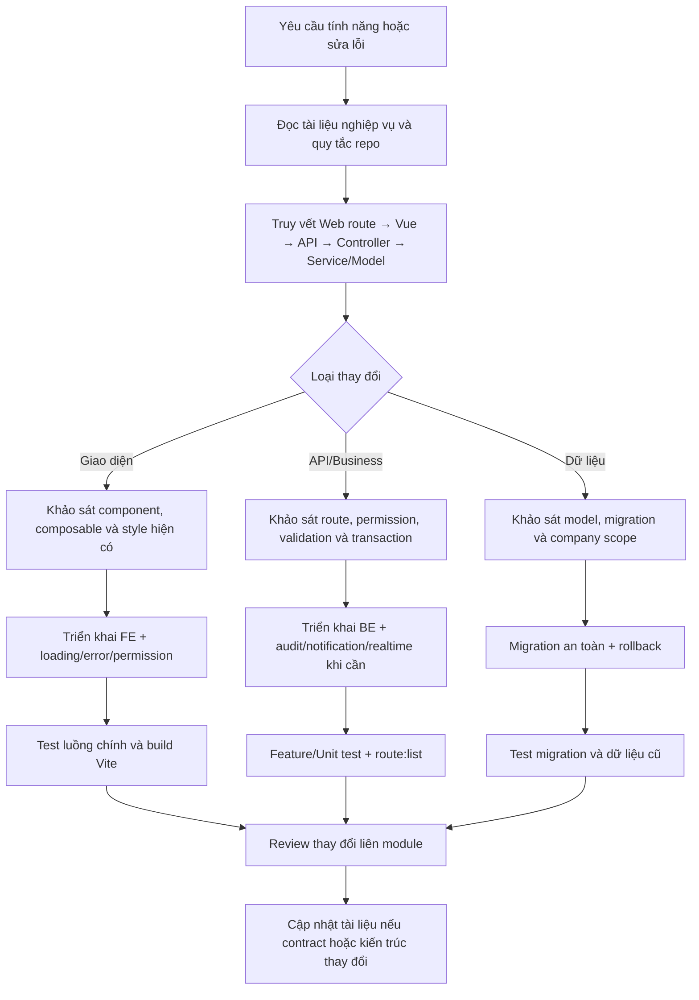

# Hướng dẫn Cấu trúc Dự án, Module & Quy chuẩn Phát triển (Cho Con người & AI)

Tài liệu này phân tích cấu trúc mã nguồn, các module nghiệp vụ, vị trí BE/FE, luồng gọi API và quy chuẩn phát triển của hệ thống ERP nội bộ. Đối tượng sử dụng là lập trình viên mới, người vận hành và AI/Coding Assistant tham gia bảo trì hoặc phát triển dự án.

> Người mới nên bắt đầu tại [`MODULE_INDEX.md`](MODULE_INDEX.md) để tra cứu nhanh từng module nằm ở đâu trên FE, BE, database và test; quay lại tài liệu này khi cần hiểu sâu kiến trúc và luồng nghiệp vụ.

> Cập nhật theo mã nguồn ngày 27/07/2026. Nguồn đúng cuối cùng khi tài liệu và code lệch nhau là `routes/api.php`, `routes/web.php` và implementation trong controller/service.

---

## Mục lục

1. [Dự án này là gì?](#1-dự-án-này-là-gì)
2. [Chạy dự án và các tiến trình vận hành](#2-chạy-dự-án-và-các-tiến-trình-vận-hành)
3. [Bản đồ mã nguồn](#3-bản-đồ-mã-nguồn)
4. [Một request đi qua hệ thống như thế nào?](#4-một-request-đi-qua-hệ-thống-như-thế-nào)
5. [Ma trận toàn bộ module](#5-ma-trận-toàn-bộ-module)
6. [Module nền tảng và quản trị](#6-module-nền-tảng-và-quản-trị)
7. [Module Mua hàng](#7-module-mua-hàng)
8. [Module Bán hàng](#8-module-bán-hàng)
9. [Module Kho](#9-module-kho)
10. [Module Kế toán](#10-module-kế-toán)
11. [Dashboard, thông báo, realtime và audit](#11-dashboard-thông-báo-realtime-và-audit)
12. [API dùng chung](#12-api-dùng-chung)
13. [Luồng nghiệp vụ liên module](#13-luồng-nghiệp-vụ-liên-module)
14. [Dữ liệu, phân quyền và cô lập công ty](#14-dữ-liệu-phân-quyền-và-cô-lập-công-ty)
15. [Kiểm thử và nơi nên bắt đầu khi sửa code](#15-kiểm-thử-và-nơi-nên-bắt-đầu-khi-sửa-code)
16. [Điểm cần lưu ý của code hiện tại](#16-điểm-cần-lưu-ý-của-code-hiện-tại)
17. [Quy chuẩn phát triển dành cho con người](#17-quy-chuẩn-phát-triển-dành-cho-con-người)
18. [Chỉ dẫn kỹ thuật dành cho AI](#18-chỉ-dẫn-kỹ-thuật-dành-cho-ai)
19. [Quy trình phối hợp phát triển](#19-quy-trình-phối-hợp-phát-triển)
20. [Hạ tầng vận hành hiện tại](#20-hạ-tầng-vận-hành-hiện-tại)
21. [Hợp đồng API và phân trang](#21-hợp-đồng-api-và-phân-trang)
22. [Database, cache, queue và lưu trữ file](#22-database-cache-queue-và-lưu-trữ-file)
23. [Triển khai production](#23-triển-khai-production)
24. [Phạm vi hiện tại và kiến trúc định hướng](#24-phạm-vi-hiện-tại-và-kiến-trúc-định-hướng)
25. [Tài liệu API riêng](#25-tài-liệu-api-riêng)

## 1. Dự án này là gì?

Đây là hệ thống ERP nội bộ, dạng monolith: BE và FE nằm chung một repository.

- BE: PHP 8.2+, Laravel 12, MySQL/SQLite tùy `.env`, Sanctum, Spatie Permission/Activity Log.
- FE: Vue 3, Inertia.js 2, Vite 7, Tailwind CSS, Axios.
- Realtime: Laravel Reverb + Echo.
- Tác vụ nền: Laravel Queue.
- Nghiệp vụ chính: quản trị nhân sự/phân quyền, mua hàng, bán hàng, kho, kế toán, dashboard, thông báo và nhật ký.
- Đặc tả nghiệp vụ đầy đủ: [`Document.md`](Document.md).
- Quy ước kiến trúc: [`resources/docs/ARCHITECTURE.md`](resources/docs/ARCHITECTURE.md).
- Quy tắc FE: [`resources/docs/FRONTEND_COMPONENTS.md`](resources/docs/FRONTEND_COMPONENTS.md).
- Quy tắc bảo mật: [`resources/docs/SECURITY.md`](resources/docs/SECURITY.md).

## 2. Chạy dự án và các tiến trình vận hành

### Cài mới

```bash
composer run setup
```

Script trong `composer.json` sẽ cài Composer/NPM, tạo `.env`, sinh application key, migrate và build FE. Cần cấu hình database, mail, queue, broadcasting và Google OAuth trong `.env`; lấy danh sách biến mẫu từ `.env.example`, không đưa secret thật vào Git.

### Chạy phát triển

```bash
composer run dev
```

Lệnh này chạy đồng thời bốn tiến trình bắt buộc:

| Tiến trình | Vai trò |
|---|---|
| `php artisan serve` | HTTP Laravel |
| `php artisan queue:listen --tries=1` | xử lý job nền/thông báo |
| `php artisan reverb:start` | WebSocket realtime |
| `npm run dev` | Vite HMR cho Vue/CSS |

Build production bằng `npm run build`; file đầu vào được khai báo tại `vite.config.js`: `resources/css/main.css` và `resources/js/app.js`. Scheduler phải được vận hành bằng cron/worker của Laravel; hiện có job hằng ngày lúc `00:15` trong `routes/console.php` để hết hạn yêu cầu nhân sự bị trả về quá hạn.

### Test và kiểm tra route

```bash
composer test
php artisan route:list --path=api
php artisan route:list --path=warehouse
```

## 3. Bản đồ mã nguồn

### Cây thư mục tổng quát

```text
project-base/
├── app/
│   ├── Console/Commands/          # Artisan command/import dữ liệu
│   ├── Events/                    # NotificationCreated, CompanyDataChanged
│   ├── Helpers/                   # Tiện ích tiền tệ
│   ├── Http/
│   │   ├── Controllers/           # BE nhận request/API theo module
│   │   ├── Middleware/            # Auth context, audit, permission, company, realtime
│   │   ├── Requests/              # Validation/Form Request
│   │   └── Resources/             # Chuẩn hóa JSON response
│   ├── Models/                    # Eloquent model và quan hệ dữ liệu
│   ├── Providers/                 # Bind repository, broadcasting, app bootstrap
│   ├── Repositories/              # Lớp truy vấn dữ liệu của các module đã refactor
│   ├── Services/                  # Business logic và database transaction
│   └── Traits/                    # BelongsToCompany và logic dùng chung
├── bootstrap/                     # Khởi tạo Laravel, middleware alias, providers
├── config/                        # DB, auth, queue, Reverb, mail, permission...
├── database/
│   ├── factories/                 # Dữ liệu giả cho test
│   ├── migrations/                # Lịch sử và cấu trúc database
│   └── seeders/                   # Role, permission, currency và demo data
├── public/                        # Entry public và tài nguyên đã publish/build
├── resources/
│   ├── css/                       # CSS entry và Tailwind
│   ├── docs/                      # Kiến trúc, component và bảo mật
│   ├── js/
│   │   ├── Pages/                 # Inertia Page chia theo module nghiệp vụ
│   │   ├── Layouts/               # Khung trang quản trị
│   │   ├── components/            # UI/layout/form/modal dùng chung
│   │   ├── composables/           # Logic Vue tái sử dụng
│   │   ├── config/                # Status, enum, validator, helper FE
│   │   ├── realtime/              # Listener thay đổi dữ liệu theo company
│   │   ├── store/                 # Vuex modules hiện có
│   │   ├── app.js                 # Entry Inertia/Vue
│   │   ├── bootstrap.js           # Axios/bootstrap FE
│   │   └── echo.js                # Laravel Echo/Reverb client
│   ├── lang/                      # Bản dịch/validation tiếng Việt
│   └── views/                     # Blade shell và form auth
├── routes/
│   ├── api.php                    # Toàn bộ JSON API chính
│   ├── web.php                    # URL trang và Inertia::render
│   ├── auth.php                   # Đăng nhập/đăng ký/password/OAuth
│   ├── channels.php               # Quyền subscribe private WebSocket channel
│   └── console.php                # Scheduler và console routes
├── storage/                       # Log, cache, file ứng dụng, bundle report
├── tests/
│   ├── Feature/                   # Test request và luồng xuyên module
│   └── Unit/                      # Test quy tắc/service/event độc lập
├── Document.md                    # Đặc tả yêu cầu nghiệp vụ
├── API_DOCUMENTATION.md           # Danh mục endpoint, permission và contract API
├── PROJECT_INDEX.md               # Tài liệu onboarding hiện tại
├── composer.json                  # PHP dependencies và scripts
├── package.json                   # JS dependencies và scripts
├── phpunit.xml                    # Cấu hình test
└── vite.config.js                 # Build Vue/CSS và chia bundle
```

### Vai trò từng lớp

| Khu vực | Nơi viết | Ý nghĩa |
|---|---|---|
| Route trang | `routes/web.php`, `routes/auth.php` | URL trình duyệt, middleware và tên Inertia Page |
| Route JSON API | `routes/api.php` | endpoint FE gọi; phần lớn nằm dưới `/api`, `auth:sanctum`, throttle và permission |
| BE controller | `app/Http/Controllers/` | nhận request, validate/authorize, điều phối và trả JSON/Inertia |
| BE nghiệp vụ | `app/Services/` | transaction và quy tắc liên bảng/module |
| BE truy vấn | `app/Repositories/` | repository hiện được dùng cho dashboard, account, transaction, category, debt |
| BE model | `app/Models/` | Eloquent model, relation, scope và hằng số trạng thái |
| Validation | `app/Http/Requests/` | Form Request; một phần controller cũ vẫn validate trực tiếp |
| JSON resource | `app/Http/Resources/` | định dạng response chuẩn cho product/transaction category |
| Middleware | `app/Http/Middleware/` | Inertia props, activity/permission log, kiểm tra company, phát sự kiện thay đổi |
| Event/realtime | `app/Events/`, `routes/channels.php` | event và quyền subscribe private channel |
| FE entry | `resources/js/app.js`, `resources/js/bootstrap.js`, `resources/js/echo.js` | khởi tạo Inertia, Axios, Vue và Echo |
| FE layout | `resources/js/Layouts/AdminLayout.vue`, `resources/js/components/layout/` | shell, menu, header và notification center |
| FE page | `resources/js/Pages/` | màn hình theo module; `web.php` render các component này |
| FE dùng chung | `resources/js/components/`, `resources/js/composables/` | bảng/form/modal, permission, currency, validation, realtime refresh |
| FE state | `resources/js/store/` | Vuex; hiện chủ yếu có order/reference cũ, đa số page tự gọi Axios |
| Database | `database/migrations/`, `database/seeders/`, `database/factories/` | schema, permission/role/demo data và test data |
| Cấu hình | `config/`, `.env.example` | DB, auth, queue, Reverb, broadcasting, mail, filesystem |
| Test | `tests/Feature/`, `tests/Unit/` | luồng tích hợp và quy tắc nghiệp vụ |

## 4. Một request đi qua hệ thống như thế nào?

### Mở một trang

`Browser -> routes/web.php -> auth + permission -> Inertia::render('Module/Page') -> resources/js/Pages/Module/Page.vue`

Ví dụ `/purchase/orders` render `resources/js/Pages/Purchase/Order/Index.vue`.

### Gọi dữ liệu/thao tác

`Vue Page/Component -> axios /api/... -> routes/api.php -> auth:sanctum -> throttle:api -> LogPermissionAction -> permission:* -> Controller -> Service/Repository/Model -> DB -> JSON`

Axios dùng session cookie + CSRF của Laravel, không phải API token do FE tự lưu. `HandleInertiaRequests` chia sẻ user, company và permissions xuống mọi Inertia page. Khi tìm một tính năng, nên đi theo thứ tự:

1. Tìm URL trang trong `routes/web.php`.
2. Mở Vue page được `Inertia::render`.
3. Tìm `axios.get/post/put/patch/delete` trong page và component con.
4. Khớp URL với `routes/api.php`.
5. Mở method controller; nếu controller inject service thì theo tiếp xuống service/repository/model.

## 5. Ma trận toàn bộ module

| Module | Chức năng | Trang FE chính | BE chính | Prefix API |
|---|---|---|---|---|
| Xác thực/hồ sơ/công ty | đăng ký, đăng nhập, Google OAuth, reset password, hồ sơ, tạo công ty | `Pages/Profile`, `Pages/Company` và Blade `resources/views/auth` | `Controllers/Auth/*`, `ProfileController`, `CompanyController` | web routes và `/api/provinces` |
| Nhân sự | user, duyệt/từ chối/yêu cầu sửa, phòng ban, chức vụ | `Pages/Manage/User*`, `Manage/Department`, `Manage/Position` | `API/UserController`, `DepartmentController`, `PositionController` | `/api/users`, `/api/departments`, `/api/positions` |
| Phân quyền | role, permission, gán quyền | `Pages/Manage/Role*`, `Permission*` | `RoleController`, `PermissionController` | `/api/roles`, `/api/permissions` |
| Mua hàng | NCC, danh mục, đơn vị, sản phẩm, đơn mua | `Pages/Purchase/**` | `SupplierController`, `CategoryController`, `UnitController`, `ProductController`, `PurchaseOrderController` | `/api/purchase` |
| Bán hàng | khách hàng và đơn bán | `Pages/Sale/**` | `CustomerController`, `SalesOrderController` | `/api/sale` |
| Kho | kho, tồn, phiếu nhập/xuất, chuyển kho, biến động | `Pages/Warehouse/**` | `WarehouseController`, `WarehouseSlipController`, `WarehouseTransferController`, `WarehouseInventoryController`, `InventoryMovementController` | `/api/warehouse`, `/api/warehouses` |
| Kế toán | tiền tệ, ngân hàng, tài khoản, giao dịch, sổ, công nợ, lãi lỗ | `Pages/Accountant/**` | controllers kế toán + `TransactionService` và các service số dư/công nợ | `/api/accountant` |
| Dashboard | tổng quan toàn hệ thống/từng module | `Pages/DashBoard.vue`, các `*/Dashboard.vue`, `components/dashboard/ModuleDashboard.vue` | `DashboardController` -> `DashboardService` -> `DashboardRepository` | `/api/dashboard` |
| Thông báo/realtime | notification center, badge, refresh dữ liệu công ty | `components/Notifications`, `realtime/companyData.js` | `NotificationController/Service`, events, `BroadcastController` | `/api/notifications`, `/broadcasting/auth` |
| Audit log | lịch sử hành động và trace | `Pages/AuditLog/**` | `AuditLogController`, `ActivityLogService`, middleware log | `/api/audit-logs` |

## 6. Module nền tảng và quản trị

### Xác thực, hồ sơ và công ty

- FE: form auth là Blade trong `resources/views/auth/`; hồ sơ ở `resources/js/Pages/Profile/Edit.vue`; tạo công ty ở `resources/js/Pages/Company/Create.vue`.
- BE: `app/Http/Controllers/Auth/`, `ProfileController.php`, `CompanyController.php`.
- Route: `routes/auth.php` xử lý đăng nhập/đăng ký/email/password/Google; `routes/web.php` xử lý hồ sơ và công ty.
- API FE gọi khi nhập địa chỉ: `GET /api/provinces`, `GET /api/provinces/{province}/wards` -> `AddressController`.
- Sau đăng nhập, `company.created` chặn vùng nghiệp vụ nếu user chưa có company.

### Nhân sự, phòng ban, chức vụ

| Chức năng | FE gọi API tại | Endpoint chính | BE/model |
|---|---|---|---|
| Danh sách/CRUD nhân sự | `Pages/Manage/User.vue`, `UserForm.vue`, `UserDetail.vue` | `GET/POST /api/users/user`, `GET/PUT /api/users/user/{id}` | `API/UserController`; `User`, `Role`, `Department`, `Position` |
| Workflow nhân sự | `Pages/Manage/User.vue` | `PATCH /api/users/{user}/approve|reject|resubmit|status` | `API/UserController` + `NotificationService` |
| Danh sách tham chiếu | `User.vue`, `UserForm.vue` | `/api/users/roles`, `/api/departments/all`, `/api/positions/all` | user/department/position controllers |
| Phòng ban | `Pages/Manage/Department/Index.vue` | CRUD `/api/departments`; `GET /managers`, `/all` | `DepartmentController`; `Department`, `User` |
| Chức vụ | `Pages/Manage/Position/Index.vue` | CRUD `/api/positions`; `GET /all` | `PositionController`; `Position` |

Trạng thái yêu cầu nhân sự hết hạn được scheduler trong `routes/console.php` cập nhật mỗi ngày.

### Role và permission

- FE: `resources/js/Pages/Manage/Role.vue`, `RoleForm.vue`, `Permission.vue`, `PermissionForm.vue`.
- API: CRUD `/api/roles`, CRUD `/api/permissions`, selector `GET /api/permissions/all`.
- BE: `RoleController`, `PermissionController`; model `Role`, `Permission`; seed định nghĩa quyền tại `database/seeders/PermissionSeeder.php`, `RolePermissionSeeder.php` và `RoleSeeder.php`.
- Mọi menu/action FE nên kiểm tra bằng `resources/js/composables/usePermission.js`; BE vẫn là lớp bảo vệ bắt buộc bằng middleware `permission:*` ở route.

## 7. Module Mua hàng

Route trang bắt đầu bằng `/purchase`; JSON API bắt đầu bằng `/api/purchase`.

| Phân hệ | Chức năng | FE | API và nơi BE xử lý |
|---|---|---|---|
| Nhà cung cấp | danh sách, chi tiết, CRUD, khóa, địa chỉ, tiền tệ, lịch sử đơn/công nợ | `Pages/Purchase/Supplier/*` | CRUD `/suppliers`, `/all`, `/{id}/detail`, `PATCH /{id}/status` -> `SupplierController`; `Supplier`, `SupplierDebt`; dùng `CurrencyService`, `CodeGeneratorService` |
| Danh mục | cây/danh mục sản phẩm | `Pages/Purchase/Category/*` | CRUD `/categories`, `/select`, status -> `CategoryController`; `Category` |
| Đơn vị | đơn vị tính | `Pages/Purchase/Unit/*` | CRUD `/units`, `/select`, status -> `UnitController`; `Unit` |
| Sản phẩm mua | sản phẩm, ảnh, giá/tiền tệ, trạng thái | `Pages/Purchase/Product/*` | CRUD `/products`, status -> `ProductController`; `Product`; dùng `CurrencyService` |
| Đơn mua | tạo/sửa/xem, duyệt/hủy, lọc; dữ liệu cho nhập kho | `Pages/Purchase/Order/*` | CRUD `/orders`, `POST /{id}/approve|cancel`, `GET /{id}/stock-in-data` -> `PurchaseOrderController`; `PurchaseOrder`, `PurchaseOrderItem`; dùng currency/code/notification và `SupplierDebtService` khi duyệt |

API selector mà form đơn mua gọi: `GET /api/products/for-select`, `GET /api/currencies/for-select`, `GET /api/purchase/suppliers/all`. Điểm gọi nằm trong `PurchaseOrderForm.vue` và `Index.vue`.

## 8. Module Bán hàng

Route trang bắt đầu bằng `/sale`; JSON API bắt đầu bằng `/api/sale`.

| Phân hệ | Chức năng | FE | API và nơi BE xử lý |
|---|---|---|---|
| Khách hàng | danh sách, CRUD, khóa, địa chỉ, chi tiết đơn/công nợ | `Pages/Sale/Customer/*` | CRUD `/customers`, `/all`, `/next-code`, `/{id}/detail`, status, `/{id}/quick-order` -> `CustomerController`; `Customer`, `CustomerDebt` |
| Đơn bán | tạo/sửa/xem, duyệt/hủy, kiểm tra sản phẩm và tồn khả dụng | `Pages/Sale/Order/*` | CRUD `/orders`, `POST /{id}/approve|cancel` -> `SalesOrderController`; `SalesOrder`, `SalesOrderItem`; dùng `CustomerDebtService`, `NotificationService` |

Form đơn bán gọi thêm `/api/products/for-select`, `/api/currencies/for-select`, `/api/provinces/{id}/wards` và `/api/sale/customers/{id}/detail`. Kho dùng các endpoint `warehouseIndex`, `stockOutData` và `availableForExport` của cùng `SalesOrderController` để tạo phiếu xuất.

## 9. Module Kho

Route trang bắt đầu bằng `/warehouse`. Do lịch sử phát triển, API kho có hai root: `/api/warehouses` cho master kho và `/api/warehouse/*` cho nghiệp vụ kho.

| Phân hệ | Chức năng | FE | API và nơi BE xử lý |
|---|---|---|---|
| Kho | CRUD/khóa kho, địa chỉ, chi tiết/tồn | `Pages/Warehouse/Index.vue`, `WarehouseForm.vue`, `WarehouseDetail.vue` | CRUD `/api/warehouses`, `/all`, `/{id}/detail`, status -> `WarehouseController`; `Warehouse`, `WarehouseProductStock`, `Stock` |
| Danh mục/đơn vị/sản phẩm | cùng master data nhưng permission theo ngữ cảnh kho | `Pages/Warehouse/Category`, `Unit`, `Product` | CRUD `/api/warehouse/categories|units|products` -> controller dùng chung với Mua hàng |
| Đơn chờ kho | tổng hợp đơn mua cần nhập và đơn bán cần xuất | `Pages/Warehouse/Order/Index.vue` | `GET /api/warehouse/orders`, `/api/saleorders/warehouse`; chi tiết lấy từ API order |
| Phiếu nhập/xuất | tạo từ order, duyệt/từ chối; khi duyệt làm thay đổi tồn | `Pages/Warehouse/Slip/*` | CRUD `/api/warehouse/slips`, `POST /{id}/approve|reject`, `/warehouse/orders/{id}/stock-in|stock-out`, `/available-for-export` -> `WarehouseSlipController` và order controllers; `WarehouseSlip`, `WarehouseSlipItem` |
| Chuyển kho | tạo, duyệt, hủy chuyển nội bộ | `Pages/Warehouse/Transfer/Index.vue` | `GET/POST /api/warehouse/transfers`, `POST /{id}/approve|cancel` -> `WarehouseTransferController`; `WarehouseTransfer`, items; dùng `OrderQuantityValidationService`, `InventoryMovementService` |
| Biến động/tồn | tra cứu lịch sử nhập, xuất, chuyển và tồn hiện tại | `Pages/Warehouse/InventoryMovement/Index.vue`, detail kho | `GET /api/warehouse/inventory-movements`, `/inventory`, `/stocks` -> `InventoryMovementController`, `WarehouseInventoryController`, `WarehouseController`; `InventoryMovement` |

Việc duyệt phiếu/chuyển kho là vùng nhạy cảm: đọc kỹ transaction trong controller/service và các test `Inventory*`, `Warehouse*`, `ProductAvailabilityTest` trước khi sửa.

## 10. Module Kế toán

Route trang bắt đầu bằng `/accountant`; API bắt đầu bằng `/api/accountant`.

| Phân hệ | Chức năng | FE | API và nơi BE xử lý |
|---|---|---|---|
| Tiền tệ/tỷ giá | CRUD, khóa, lịch sử tỷ giá theo công ty | `Pages/Accountant/Currency/*` | CRUD `/currencies`, `/{currency}/rates`, toggle -> `CurrencyController`; `Currency`, `CurrencyRate`, `CompanyCurrencyRate`; `CurrencyService`, `CompanyCurrencyService` |
| Ngân hàng | danh mục ngân hàng, khóa | `Pages/Accountant/Bank/*` | CRUD `/banks`, toggle -> `BankController`; `Bank` |
| Tài khoản/quỹ | tài khoản tiền, số dư, rebuild balance | `Pages/Accountant/Account/*` | CRUD `/accounts`, `/all`, toggle, `POST /{id}/rebuild-balance` -> `AccountController`; `Account`; `AccountBalanceService`, `AccountRepository` |
| Loại giao dịch | phân loại thu/chi | `Pages/Accountant/TransactionCategory/*` | CRUD `/transaction-categories`, `/active` -> `TransactionCategoryController` -> service/repository; `TransactionCategory` |
| Giao dịch | phiếu thu/chi, gắn order/đối tượng, duyệt/từ chối | `Pages/Accountant/Transaction/*` | CRUD `/transactions`, `/order-outstanding`, `POST /{id}/approve|reject` -> `TransactionController` -> `TransactionService`; `Transaction` |
| Sổ tài khoản | biến động số dư theo giao dịch | `Pages/Accountant/AccountLedger/Index.vue` | `GET /account-ledgers`, `/accounts/{account}/ledger` -> `AccountLedgerController`; `AccountLedger` |
| Công nợ khách | tổng hợp/chi tiết phải thu | `Pages/Accountant/Customer/*` | `GET /customers-debt`, `/{id}/detail` -> `CustomerController`; `CustomerDebt`, `CustomerPayment` |
| Công nợ NCC | tổng hợp/chi tiết phải trả | `Pages/Accountant/Supplier/Index.vue` | `GET /suppliers-debt`, `/{id}/detail` -> `SupplierController`; `SupplierDebt` |
| Lãi lỗ | báo cáo doanh thu/chi phí/lợi nhuận theo kỳ | `Pages/Accountant/Report/ProfitLoss.vue` | `GET /profit-loss-report` -> `Accountant/ProfitLossReportController` |

`TransactionService` là trung tâm của luồng tiền: phối hợp `TransactionRepository`, `AccountBalanceService`, `LedgerService`, `CustomerDebtService`, `SupplierDebtService` và `NotificationService`. Việc duyệt giao dịch có thể đồng thời đổi số dư tài khoản, ghi sổ và giảm công nợ; luôn giữ database transaction và idempotency hiện có.

## 11. Dashboard, thông báo, realtime và audit

### Dashboard

- Dashboard tổng: `resources/js/Pages/DashBoard.vue` gọi `GET /api/dashboard/overview`.
- Dashboard module: `resources/js/components/dashboard/ModuleDashboard.vue` gọi `GET /api/dashboard/{purchase|sale|warehouse|accountant}` và được dùng bởi các page Dashboard từng module.
- BE: `DashboardController` -> `DashboardService` -> `DashboardRepository`.

### Thông báo và realtime

- UI: `resources/js/components/Notifications/NotificationCenter.vue`; gọi `/api/notifications`, `/unread-count`, `/mark-all-read`, `/{id}/mark-as-read`, `DELETE /{id}`.
- BE: `NotificationController` -> `NotificationService` -> `Notification`; event `NotificationCreated`.
- Realtime data refresh: event `CompanyDataChanged`; FE listener ở `resources/js/realtime/companyData.js` và composable `useRealtimeRefresh.js`.
- Channel private và authorization: `routes/channels.php`, `BroadcastController`.
- Kết nối FE: `resources/js/echo.js`; server config: `config/reverb.php`, `config/broadcasting.php`.
- Kênh được tách theo user/company/subdomain để tránh rò dữ liệu giữa tenant.

### Audit

- FE: `resources/js/Pages/AuditLog/Index.vue`, `AuditLogDetail.vue`; gọi `GET /api/audit-logs`, `/{id}`, `/trace`.
- BE: `AuditLogController`, model `ActivityLog`, `ActivityLogService`.
- Ghi log tự động: `LogUserActivity`, `LogPermissionAction`; Spatie Activity Log.

## 12. API dùng chung

| Endpoint | Mục đích | Controller | FE dùng tiêu biểu |
|---|---|---|---|
| `GET /api/products/for-select` | selector sản phẩm | `ProductController@forSelect` | form đơn mua/bán |
| `GET /api/currencies/for-select` | selector tiền tệ/tỷ giá | `CurrencyController@forSelect` | NCC, khách, đơn, giao dịch |
| `GET /api/provinces` | tỉnh/thành | `AddressController@provinces` | công ty, kho, NCC, khách |
| `GET /api/provinces/{code}/wards` | phường/xã | `AddressController@wards` | các form địa chỉ |
| `GET /api/warehouses/all` | selector kho | `WarehouseController@all` | sản phẩm, phiếu, chuyển kho |
| `GET /api/user` | user hiện tại | closure trong `routes/api.php` | tiện ích session |
| `GET /api/dashboard/*` | số liệu dashboard | `DashboardController` | dashboard tổng/module |

Danh sách endpoint runtime đầy đủ luôn lấy bằng `php artisan route:list --path=api`. Quy ước HTTP: `GET` đọc, `POST` tạo/action, `PUT` cập nhật, `PATCH` đổi trạng thái, `DELETE` xóa. Quyền cần thiết nằm ngay sau từng route trong `routes/api.php`.

## 13. Luồng nghiệp vụ liên module

### Mua hàng đến thanh toán

1. Mua hàng tạo đơn qua `PurchaseOrderController@store`.
2. Người có quyền duyệt gọi `POST /api/purchase/orders/{id}/approve`; đơn được chốt và ghi nhận nghĩa vụ với NCC.
3. Kho lấy đơn chờ qua `/api/warehouse/orders`, tạo phiếu nhập từ `/stock-in`, rồi duyệt phiếu.
4. Duyệt phiếu nhập cập nhật tồn và ghi `InventoryMovement`.
5. Kế toán xem công nợ NCC, tạo giao dịch chi gắn NCC/đơn.
6. Duyệt giao dịch qua `TransactionService`: cập nhật số dư tài khoản, sổ tài khoản và công nợ NCC.

### Bán hàng đến thu tiền

1. Bán hàng tạo và duyệt đơn bán qua `SalesOrderController`.
2. Kho lấy đơn đủ điều kiện qua `/api/saleorders/warehouse`/`/available-for-export`, tạo và duyệt phiếu xuất.
3. Duyệt xuất kho trừ tồn và ghi biến động.
4. Kế toán xem công nợ khách, tạo giao dịch thu.
5. Duyệt giao dịch cập nhật số dư, sổ và giảm công nợ khách.

### Chuyển kho

1. Tạo transfer với kho nguồn/đích và số lượng.
2. `OrderQuantityValidationService` kiểm tra điều kiện/số lượng.
3. Khi duyệt, `InventoryMovementService` chuyển tồn trong một transaction và ghi lịch sử hai phía.

Các invariant và tiêu chí nghiệm thu chi tiết nằm ở phần 10 và 13 của `Document.md`.

## 14. Dữ liệu, phân quyền và cô lập công ty

- Tenant hiện là company trong cùng database. Trait `app/Traits/BelongsToCompany.php` hỗ trợ gắn/lọc `company_id`; nhiều query còn filter trực tiếp trong controller/repository.
- Không bỏ filter company khi thêm query mới. Kiểm tra các test có tên `Company*`, `*CompanyIsolation*`, `UserListVisibilityTest`.
- Authorization có hai lớp: FE ẩn/hiện bằng permission; BE bắt buộc bằng middleware `permission:*`.
- Permission có dạng `module.hanh_dong`, ví dụ `don_mua.xem`, `phieu_kho.duyet`, `giao_dich.tu_choi`.
- `auth:sanctum` bảo vệ API; `throttle:api` giới hạn request; `LogPermissionAction` ghi hành động.
- Route broadcasting xác thực cả user, company và subdomain.
- Các thao tác duyệt order/slip/transfer/transaction phải dùng DB transaction vì tác động nhiều bảng.
- Migration là lịch sử schema đáng tin cậy; model chính nằm trong `app/Models`. Seeder quyền/role phải được cập nhật khi thêm module/action.

## 15. Kiểm thử và nơi nên bắt đầu khi sửa code

### Bộ test đáng chú ý

| Vùng | Test |
|---|---|
| Mua → trả tiền | `PurchaseToPaymentEndToEndTest.php` |
| Kho xuyên suốt/kế toán kho | `InventoryLifecycleEndToEndTest.php`, `InventoryAccountingFlowTest.php` |
| Công nợ | `DebtFlowEndToEndTest.php`, `DebtSummaryTest.php`, unit debt calculation |
| Giao dịch | `TransactionFlowTest.php`, `OpeningBalanceCurrencySnapshotTest.php` |
| Nhân sự/tổ chức | `DepartmentPositionFlowTest.php`, `DepartmentManagerAssignmentTest.php`, `UserListVisibilityTest.php` |
| Permission/audit | `PermissionListTest.php`, `AuditLogFeatureTest.php`, `UserActivityLogTest.php` |
| Realtime/thông báo | `NotificationFeatureTest.php`, `NotificationRecipientsTest.php`, unit event/middleware tests |
| Dashboard | `ModuleDashboardTest.php` |

Chạy toàn bộ bằng `composer test`, hoặc một vùng bằng `php artisan test --filter=TransactionFlowTest`.

### Checklist thêm/sửa một chức năng

1. Xác nhận nghiệp vụ và trạng thái trong `Document.md`.
2. Schema/model/relation và `company_id`.
3. Permission + seeder; middleware route API và web.
4. Form Request/validation và authorization BE.
5. Service + transaction nếu tác động nhiều aggregate.
6. Controller/JSON response và API route.
7. Inertia web route, Vue page/component, Axios call, loading/error/permission state.
8. Notification/audit/realtime refresh nếu dữ liệu ảnh hưởng người khác.
9. Feature test cho happy path, permission, tenant isolation, invalid state và rollback.
10. Chạy test, `php artisan route:list`, build FE.

## 16. Điểm cần lưu ý của code hiện tại

- Kiến trúc mục tiêu là Controller -> Service -> Repository, nhưng code hiện tại là hỗn hợp: một số controller vẫn chứa validation, Eloquent query và nghiệp vụ trực tiếp. Khi sửa, theo implementation thật của module, không giả định mọi module đã qua service/repository.
- `CategoryController`, `UnitController`, `ProductController` được dùng chung cho ngữ cảnh Purchase và Warehouse; permission/prefix khác nhau nhưng dữ liệu và controller có thể dùng chung.
- API kho tồn tại cả `/api/warehouses/*` và `/api/warehouse/*`; đừng tự đổi prefix vì FE đang gọi cả hai.
- Có route alias tương thích ngược cho customer/supplier debt và warehouse status. Kiểm tra usage trước khi xóa.
- Một số file Vue/store cũ gọi endpoint không có prefix `/api` như `resources/js/store/modules/order.js` và `reference.js`; trước khi tái sử dụng phải xác minh route còn tồn tại.
- `resources/js/Pages/Warehouse/Product/ProductDetail.vue` gọi `/api/index/{id}`, nhưng route hiện tại không thấy endpoint tương ứng; xem đây là điểm kỹ thuật cần kiểm tra trước khi dùng màn hình.
- Web route có cả `/users` và các route user khác nhau; module quản trị hiện dùng API `/api/users/user*`.
- Khi tài liệu này lệch code, dùng `php artisan route:list`, tìm Axios bằng `rg "axios\\.|fetch\\(" resources/js`, rồi cập nhật lại bảng liên quan trong tài liệu này.

## 17. Quy chuẩn phát triển dành cho con người

### 17.1 Backend Laravel

- Luồng mục tiêu: `Route -> Middleware -> Form Request/Controller -> Service -> Repository -> Model -> Database`.
- Controller mới nên mỏng: nhận input đã validate, kiểm tra quyền, gọi service và định dạng response. Không đặt một luồng cập nhật nhiều bảng trực tiếp trong controller nếu có thể tách service.
- Business rule, chuyển trạng thái và thao tác nhiều bảng phải đặt trong service, dùng `DB::transaction()` và khóa bản ghi khi có nguy cơ duyệt đồng thời.
- Query phải giới hạn theo `company_id`. Ưu tiên tái sử dụng `BelongsToCompany`, repository/scope hiện có; không tin `company_id` do client gửi lên.
- Validation dùng Form Request trong `app/Http/Requests`; không chỉ validate ở Vue vì request có thể được gọi trực tiếp.
- Response danh sách phải giữ cấu trúc pagination mà component hiện tại đang dùng. Khi đã có Resource trong `app/Http/Resources`, tiếp tục dùng Resource thay vì tự dựng JSON khác kiểu.
- Khi thêm action mới, thêm permission vào seeder và gắn middleware ở cả web route/API phù hợp. Tên quyền theo dạng `module.hanh_dong`.
- Tên PHP class/file dùng PascalCase; method/biến dùng camelCase; bảng/cột database dùng snake_case. Migration đã chạy không được sửa ngược lịch sử—tạo migration mới.
- Không ghi secret, token, mật khẩu hoặc dữ liệu nhạy cảm vào source/log. Dùng `.env` và `config/*`.

### 17.2 Frontend Vue/Inertia

- Page đặt trong `resources/js/Pages/<Module>/`; component tái sử dụng đặt trong `resources/js/components/`; logic tái sử dụng đặt trong `resources/js/composables/`.
- Trước khi tạo button, input, select, modal, table hoặc badge mới, kiểm tra component hiện có và đọc `resources/docs/FRONTEND_COMPONENTS.md`.
- Component/Page Vue dùng PascalCase; composable bắt đầu bằng `use`; biến/hàm JavaScript dùng camelCase.
- Dùng alias `@/` trỏ đến `resources/js` khi giúp import rõ hơn; giữ cách import đồng nhất với các file lân cận.
- Dùng Axios đã được khởi tạo tại `resources/js/bootstrap.js`; API nghiệp vụ phải đi qua `/api/...`. Không tạo Axios instance mới trong từng component.
- Mọi thao tác async phải có trạng thái loading, hiển thị lỗi validation/server dễ hiểu và ngăn submit lặp. Sau mutation, refresh đúng vùng dữ liệu hoặc dùng realtime listener hiện có.
- FE kiểm tra quyền bằng `usePermission`, nhưng không coi việc ẩn nút là authorization; BE route vẫn phải kiểm tra permission.
- Giá trị tiền/tỷ giá dùng composable/helper tiền tệ hiện có, không tự format rải rác. Status/enum dùng cấu hình trong `resources/js/config/` và hằng số BE tương ứng.
- Ưu tiên Tailwind và style/component hiện hữu; giao diện mới phải responsive và giữ cùng ngôn ngữ thiết kế của module lân cận.

### 17.3 API, realtime và thay đổi dữ liệu

- Route trang đặt ở `routes/web.php`; route JSON đặt ở `routes/api.php`. Không nhầm URL Inertia với endpoint dữ liệu.
- Giữ semantics HTTP hiện tại: GET đọc, POST tạo/action, PUT cập nhật toàn phần, PATCH đổi trạng thái, DELETE xóa.
- Khi thêm API, xác định rõ: permission, tenant scope, validation, response contract, audit log, notification và test.
- Dữ liệu thay đổi mà nhiều user cùng công ty cần thấy nên phát `CompanyDataChanged` theo module phù hợp; thông báo cá nhân/công ty đi qua `NotificationService`.
- Không đổi tên channel trong `routes/channels.php` hoặc phía Echo nếu chưa cập nhật đồng bộ BE, FE và authorization theo company/subdomain.

## 18. Chỉ dẫn kỹ thuật dành cho AI

Các quy tắc dưới đây áp dụng cho AI/Coding Assistant khi đọc, sửa hoặc tạo mã trong repository này.

### 18.1 Khảo sát context trước khi sửa

1. Đọc `composer.json`, `package.json`, `vite.config.js`, `bootstrap/app.php` để không đề xuất sai framework hoặc package.
2. Đọc `Document.md` và tài liệu trong `resources/docs/` liên quan đến vùng đang sửa.
3. Tìm `AGENTS.md` từ root đến thư mục đích và tuân thủ file gần nhất nếu repository bổ sung quy tắc sau này.
4. Đi theo chuỗi thật: web route -> Vue Page/component -> Axios URL -> API route -> controller -> service/repository/model -> migration/test.
5. Kiểm tra `git status` trước khi sửa; mọi thay đổi sẵn có có thể thuộc về người dùng và không được ghi đè hoặc hoàn tác ngoài phạm vi yêu cầu.
6. Đọc test của module và các module liên quan trước khi thay đổi workflow duyệt, tồn kho, số dư hoặc công nợ.

### 18.2 Quy tắc khi tạo/chỉnh sửa code

1. Không bịa service, endpoint, field, permission hoặc package. Xác minh chúng tồn tại bằng tìm kiếm mã nguồn/route/schema.
2. Không nhân bản component hoặc helper đã có. Tìm trong `resources/js/components`, `composables`, `config` và `app/Services` trước.
3. Không xóa comment nghiệp vụ, route tương thích ngược hoặc code chưa hiểu rõ chỉ vì trông có vẻ cũ; phải kiểm tra usage và test.
4. Không mở rộng refactor ngoài phạm vi yêu cầu. Nếu gặp kiến trúc cũ, tích hợp an toàn với module hiện tại và ghi nhận nợ kỹ thuật riêng.
5. Không bỏ tenant scope, middleware permission, validation BE hoặc DB transaction để làm code ngắn hơn.
6. Không thay đổi contract JSON đang được Vue dùng nếu không cập nhật đồng bộ mọi consumer và test.
7. Với thao tác duyệt/hủy/từ chối, kiểm tra state transition hợp lệ, khả năng gọi lặp và rollback khi một bước thất bại.
8. Dùng đúng naming/style của các file lân cận; không thêm dependency nếu thư viện hiện có đã đáp ứng.
9. Chỉ thay đổi file cần thiết; không format hàng loạt hoặc sửa những thay đổi không liên quan của người dùng.

### 18.3 Xác minh bắt buộc trước khi kết thúc

- Chạy test hẹp nhất liên quan trong khi phát triển, sau đó chạy nhóm test rộng hơn tương xứng với rủi ro.
- Với thay đổi BE route/API: chạy `php artisan route:list` và test Feature liên quan.
- Với thay đổi PHP: chạy test/Pint phù hợp; bảo đảm không có lỗi cú pháp.
- Với thay đổi Vue/CSS/Vite: chạy `npm run build`; kiểm tra loading, error, empty state và responsive nếu có giao diện.
- Với thay đổi database: chạy migration trên database test, kiểm tra rollback và dữ liệu cũ.
- Với thay đổi permission/realtime/queue: kiểm tra cả trường hợp được phép, bị từ chối và worker/socket không chạy.
- Báo rõ file đã sửa, kiểm tra đã chạy, kết quả và rủi ro/chưa kiểm tra; không tuyên bố hoàn thành nếu build/test đang lỗi.

## 19. Quy trình phối hợp phát triển



### Definition of Done

Một thay đổi chỉ được xem là hoàn tất khi:

- Đúng yêu cầu nghiệp vụ và không phá invariant tồn kho, công nợ, tiền hoặc tenant isolation.
- FE, API, permission, validation và database contract đồng bộ.
- Có test phù hợp cho happy path, lỗi validation, thiếu quyền và trạng thái không hợp lệ.
- Test/build liên quan chạy thành công; không để debug code hoặc secret.
- Tài liệu này, `Document.md` hoặc tài liệu component được cập nhật nếu thay đổi ảnh hưởng cách người khác phát triển/vận hành hệ thống.

## 20. Hạ tầng vận hành hiện tại

### Ma trận công nghệ đã được xác minh

| Layer | Công nghệ/cấu hình hiện tại | Nguồn kiểm tra |
|---|---|---|
| Backend | PHP `^8.2`, Laravel `^12.0` | `composer.json` |
| Web frontend | Vue 3 + Inertia 2 + Vite 7 + Tailwind | `package.json`, `vite.config.js` |
| Database mặc định | MySQL, database `project_base` trong file mẫu | `.env.example`, `config/database.php` |
| Web authentication | Laravel session + Sanctum cho first-party SPA | `routes/auth.php`, `routes/api.php`, `config/sanctum.php` |
| Authorization | Spatie Laravel Permission | `composer.json`, `config/permission.php` |
| Session | Database, mặc định 120 phút, mã hóa trong `.env.example` | `config/session.php`, `.env.example` |
| Cache | Database | `config/cache.php`, `.env.example` |
| Queue | Database; dev chạy `queue:listen` | `config/queue.php`, `composer.json` |
| Realtime | Laravel Reverb + Echo | `config/reverb.php`, `resources/js/echo.js` |
| File storage | Local/private, public và S3-compatible được cấu hình | `config/filesystems.php` |
| Activity log | Spatie Activity Log | `composer.json`, model/middleware audit |
| Test | PHPUnit 11, Laravel Feature/Unit tests | `phpunit.xml`, `tests/` |

Không được mặc định rằng Redis, Horizon, Docker, FCM, Swagger/Scramble hoặc mobile token authentication đã tồn tại: repository hiện chưa có package/cấu hình triển khai hoàn chỉnh cho các thành phần đó.

### Các tiến trình cần giám sát

| Process | Bắt buộc khi nào | Dấu hiệu lỗi |
|---|---|---|
| HTTP/PHP runtime | luôn luôn | web/API không truy cập được, lỗi 5xx |
| Queue worker | khi notification/job dùng queue | job nằm lâu trong bảng `jobs`, thông báo/email trễ |
| Reverb server | khi cần realtime | badge/dữ liệu chỉ cập nhật sau reload, WebSocket disconnect |
| Scheduler | production | yêu cầu nhân sự quá hạn không chuyển trạng thái lúc `00:15` |
| Vite dev server | chỉ development | mất HMR/assets khi chạy local |

Các lệnh chẩn đoán cơ bản:

```bash
php artisan about
php artisan route:list
php artisan queue:failed
php artisan schedule:list
php artisan reverb:start --debug
php artisan test
```

## 21. Hợp đồng API và phân trang

### Trạng thái hiện tại

API hiện phục vụ trực tiếp Vue/Inertia web client, dùng session cookie, CSRF và `auth:sanctum`. Route chưa version hóa (`/api/...`, không phải `/api/v1/...`) và response giữa các controller chưa hoàn toàn đồng nhất: có endpoint trả paginator chuẩn Laravel, có endpoint trả object/data trực tiếp hoặc message riêng.

Ví dụ cấu trúc paginator Laravel mà nhiều màn hình đang sử dụng:

```json
{
  "current_page": 1,
  "data": [],
  "first_page_url": "...",
  "from": 1,
  "last_page": 5,
  "per_page": 10,
  "to": 10,
  "total": 42
}
```

Không tự chuyển toàn bộ response sang wrapper khác nếu chưa cập nhật tất cả Vue consumer. Với endpoint mới, nên thống nhất contract trước khi triển khai. Contract mục tiêu được khuyến nghị:

```json
{
  "success": true,
  "message": "Thành công",
  "data": {},
  "meta": {
    "current_page": 1,
    "per_page": 20,
    "total": 100,
    "last_page": 5
  }
}
```

Lỗi validation mục tiêu:

```json
{
  "success": false,
  "message": "Dữ liệu không hợp lệ",
  "errors": {
    "field_name": ["Nội dung lỗi"]
  }
}
```

### Quy tắc contract

- Status code: `200` đọc/cập nhật thành công, `201` tạo mới, `204` nếu thật sự không có body, `401` chưa đăng nhập, `403` thiếu quyền, `404` không tìm thấy trong company, `422` validation/state transition, `429` throttle, `500` lỗi ngoài dự kiến.
- Danh sách phải giới hạn `per_page` ở BE; nhiều controller hiện chặn tối đa 100. Không cho client tải không giới hạn bằng endpoint list.
- Filter/sort/search dùng query string và phải whitelist field; không truyền trực tiếp tên cột tùy ý vào `orderBy`.
- Giá trị tiền không phụ thuộc chuỗi đã format từ FE; chuẩn hóa bằng helper/service và snapshot tỷ giá khi nghiệp vụ yêu cầu.
- Timestamp trao đổi theo ISO 8601 nếu tạo contract mới; hiển thị theo timezone `Asia/Ho_Chi_Minh` ở ứng dụng.
- Không trả field nhạy cảm, secret, password hash, remember token hoặc dữ liệu tenant khác.
- Nếu xây mobile/public API sau này, tạo version `/api/v1`, Resource riêng và token ability; không thay đổi âm thầm API session hiện tại.

## 22. Database, cache, queue và lưu trữ file

### Quy ước database

- Tên bảng: snake_case, số nhiều, ví dụ `purchase_orders`, `warehouse_slips`.
- Tên cột: snake_case, ví dụ `company_id`, `created_at`, `approved_by`.
- Foreign key có hậu tố `_id`; bảng tenant phải có `company_id` và index phù hợp.
- Unique constraint của dữ liệu nghiệp vụ thường cần bao gồm `company_id`, tránh vô tình bắt mã duy nhất trên toàn hệ thống.
- Trạng thái phải dùng hằng số/model rule thống nhất; không rải magic string giữa controller và Vue.
- Tiền/tỷ giá phải dùng kiểu decimal phù hợp, không dùng float để lưu dữ liệu kế toán.
- Migration mới phải có `up()`/`down()` an toàn; index các cột thường filter/join như company, status, date và foreign key.

Model `Setting` và bảng `settings` hiện chỉ cung cấp key/value/type đơn giản. Đây chưa phải hệ thống cấu hình động đầy đủ theo module/company; không dùng nó như multi-tenant settings nếu chưa bổ sung `company_id`, scope, validation và cache invalidation.

### Cache và session

- Mặc định hiện tại: `CACHE_STORE=database`, `SESSION_DRIVER=database`.
- Khi cache dữ liệu tenant/user, key bắt buộc chứa định danh scope, ví dụ `dashboard:{company_id}:{user_id}:{date}`.
- Mutation phải xóa/refresh cache liên quan. Không cache response chứa permission/user rồi chia sẻ key giữa người dùng.
- Redis là driver Laravel có sẵn trong config nhưng chưa là mặc định và chưa có hạ tầng được khai báo trong repo.

### Queue

- Mặc định hiện tại: `QUEUE_CONNECTION=database`; bảng `jobs`, `job_batches`, `failed_jobs` do migration quản lý.
- Development dùng `php artisan queue:listen --tries=1` thông qua `composer run dev`.
- Production nên dùng `php artisan queue:work` dưới process manager và cấu hình retry/timeout phù hợp từng job.
- Job tạo từ thay đổi database nên dispatch sau commit nếu phụ thuộc dữ liệu vừa ghi; tránh worker đọc trạng thái chưa commit.
- Job phải idempotent khi có retry, log context đủ dùng nhưng không ghi dữ liệu nhạy cảm.
- Horizon chỉ phù hợp nếu chuyển queue sang Redis và cài/cấu hình package; hiện chưa được cài.

### Upload và file storage

- Không lưu binary file trực tiếp trong database. Chỉ lưu path/metadata cần thiết; ảnh sản phẩm, logo ngân hàng và avatar hiện dùng filesystem.
- Local development có disk `public` tại `storage/app/public`; cần `php artisan storage:link` để public qua `/storage`.
- Disk `local` là private; disk `s3` đã có khung cấu hình cho AWS S3 hoặc MinIO-compatible endpoint nhưng cần credentials/bucket trong môi trường triển khai.
- Upload dùng `multipart/form-data`, validate MIME, extension và size ở BE; tên file do server sinh, không dùng nguyên tên client làm path.
- Khi thay file/xóa record, chỉ xóa đúng path thuộc disk dự kiến và cân nhắc transaction/cleanup nếu database rollback.

## 23. Triển khai production

Repository hiện chưa chứa Dockerfile, Docker Compose, cấu hình Nginx/Supervisor hoặc CI/CD hoàn chỉnh. Vì vậy bảng dưới đây là topology triển khai khuyến nghị, không phải cam kết hạ tầng đang tồn tại.

| Thành phần | Yêu cầu/khuyến nghị |
|---|---|
| Reverse proxy | Nginx/Apache, document root trỏ `public/`, HTTPS bắt buộc |
| PHP runtime | PHP-FPM tương thích PHP 8.2+, đủ extension theo Composer |
| App release | `composer install --no-dev --optimize-autoloader`, `npm ci && npm run build` |
| Database | MySQL được backup, migration chạy một lần trong release |
| Queue | Supervisor/systemd giữ `php artisan queue:work` luôn sống |
| Scheduler | cron gọi `php artisan schedule:run` mỗi phút |
| Reverb | process manager, reverse proxy WebSocket và TLS đúng cấu hình |
| Storage | persistent volume hoặc S3-compatible; `storage:link` nếu dùng public local disk |
| Logs/monitoring | log rotation, cảnh báo HTTP 5xx, failed jobs, worker/socket chết và disk đầy |

### Checklist release

```bash
composer install --no-dev --optimize-autoloader
npm ci
npm run build
php artisan migrate --force
php artisan optimize
php artisan storage:link
php artisan queue:restart
php artisan about
```

Chỉ chạy `storage:link` khi link chưa tồn tại; thứ tự và chiến lược maintenance/zero-downtime phải được điều chỉnh theo hạ tầng thực tế. Không chạy các route `/setup` như cơ chế deploy production; chúng chỉ được mở ở local/staging và vẫn cần auth.

Các biến production quan trọng:

- `APP_ENV=production`, `APP_DEBUG=false`, `APP_URL`, `APP_KEY` cố định và được giữ bí mật.
- Database credentials chỉ có quyền cần thiết; backup và thử restore định kỳ.
- `SESSION_SECURE_COOKIE=true` dưới HTTPS; cấu hình đúng domain/SameSite cho topology domain/subdomain.
- Mail, Reverb, queue, cache và filesystem dùng thông tin xác thực của secret manager/environment.
- Không dùng `REVERB_APP_SECRET=change-me` hoặc key mẫu từ `.env.example`.

## 24. Phạm vi hiện tại và kiến trúc định hướng

### Có trong repository hiện tại

- Web ERP Vue/Inertia với auth session/Sanctum.
- Multi-company theo `company_id` và subdomain/channel context.
- Nhân sự, role/permission, mua hàng, bán hàng, kho, kế toán, dashboard, audit và notification realtime.
- Database-backed session/cache/queue.
- Local/public/S3-compatible filesystem config.
- Google OAuth, Reverb/Echo và test cho các luồng ERP chính.

### Chưa có hoặc chưa hoàn chỉnh

| Khả năng | Trạng thái | Chỉ triển khai khi có yêu cầu rõ |
|---|---|---|
| iOS/Android client | không có trong repo | thiết kế `/api/v1`, Bearer token, payload tối ưu mobile |
| Refresh token/multi-device token | chưa có flow riêng | thiết kế Sanctum token lifecycle và revoke/device table |
| FCM push notification | chưa có package/device token | thêm provider, queue job, consent và token cleanup |
| Redis cache/queue | config driver có, chưa là hạ tầng mặc định | provision Redis, đổi env, test locking/failover |
| Laravel Horizon | chưa cài | chỉ dùng với Redis queue và process manager |
| Docker | chưa có file triển khai | tạo image PHP/Node build, proxy, DB/Redis tùy môi trường |
| Swagger/Scramble/OpenAPI | chưa cài | chuẩn hóa response/versioning trước khi sinh docs |
| API version `/api/v1` | chưa có | giữ `/api` web hiện tại hoặc lập kế hoạch migration |
| Dynamic workflow engine | chưa có | hiện mỗi module có approve/reject/cancel riêng |
| Tasks/projects/attendance/vehicles/AI | ngoài phạm vi ERP hiện tại | cần đặc tả, model, permission và roadmap riêng |
| Settings theo module/company | mới có model key/value đơn giản | cần schema tenant-aware và màn hình quản trị |

### Thứ tự nâng cấp khuyến nghị

| Giai đoạn | Hạng mục | Mục tiêu |
|---|---|---|
| 1 | Chuẩn hóa response, Form Request, Resource và tenant tests | củng cố contract hiện tại |
| 2 | Tách business logic còn nằm trong controller sang service | giảm rủi ro order/kho/kế toán |
| 3 | Production runbook, Supervisor, monitoring, backup/restore | vận hành ổn định |
| 4 | Redis cache/queue và observability nếu tải yêu cầu | mở rộng hiệu năng có số liệu |
| 5 | OpenAPI và `/api/v1` nếu có client ngoài web | contract độc lập cho integration/mobile |
| 6 | Device token + FCM nếu triển khai mobile | push notification đa thiết bị |
| 7 | Docker/CI-CD theo hạ tầng thực tế | release lặp lại và kiểm soát được |

Nguyên tắc quan trọng: các mục định hướng không phải dependency “bắt buộc phải cài”. Chỉ đưa vào khi giải quyết một nhu cầu đã xác nhận, có kế hoạch migration, test và vận hành tương ứng.

## 25. Tài liệu API riêng

Toàn bộ REST API đang triển khai được tổng hợp tại [`API_DOCUMENTATION.md`](API_DOCUMENTATION.md). Đây là tài liệu chính cho FE/BE/QA khi cần:

- Tra base URL, cơ chế session/Sanctum/CSRF và permission.
- Tìm endpoint theo module, controller xử lý và quyền bắt buộc.
- Phân biệt `/warehouses` với `/warehouse`, API trang với API dữ liệu.
- Hiểu pagination/response hiện tại, workflow approve/reject/cancel và API realtime.
- Xác định những API định hướng như `/api/v1`, mobile token, FCM hoặc Swagger hiện chưa tồn tại.

Khi thêm, đổi hoặc xóa endpoint, người thực hiện phải cập nhật `routes/api.php`, test liên quan và `API_DOCUMENTATION.md` trong cùng thay đổi.
