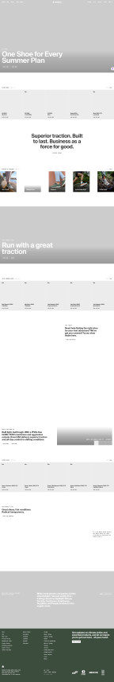

# Tài liệu thiết kế website khách hàng

## 1. Hình ảnh tham khảo chính



Nguồn tham khảo: [Icebug](https://www.icebug.com/en-GB/?ref=minimal.gallery).

Ảnh trên chỉ dùng làm tài liệu định hướng thị giác nội bộ. Dự án không sao chép logo, nội dung, hình ảnh sản phẩm hoặc nhận diện thương hiệu của Icebug.

Thiết kế Shopify Editions trước đây không còn là hình ảnh tham khảo chính. Giao diện hiện tại ưu tiên phong cách thương mại điện tử tối giản, hình sản phẩm lớn và bố cục editorial tương tự Icebug.

## 2. Mục tiêu sản phẩm

Website phục vụ khách hàng bên ngoài mua sản phẩm điện tử của từng công ty trong hệ thống đa công ty.

Luồng chính:

```text
Chọn cửa hàng
    → Xem và lọc sản phẩm
    → Chi tiết sản phẩm
    → Giỏ hàng
    → Thanh toán có VAT
    → Đơn bán online
    → Quản trị xác nhận
    → Xuất kho
    → Giao hàng
```

Mỗi cửa hàng được xác định bằng `storefront_slug`. Sản phẩm, tồn kho, khách hàng, mã giảm giá và đơn hàng luôn được cô lập theo `company_id`.

## 3. Định hướng thị giác

- Tối giản, hiện đại và chuyên nghiệp.
- Nội dung tập trung hoàn toàn vào điện thoại, phụ kiện điện thoại và thiết bị công nghệ.
- Nền giấy ngà cho khu vực mua sắm; nền đen cho thanh thông báo, khối thương hiệu và chân trang.
- Ảnh sản phẩm là thành phần nổi bật nhất trên thẻ sản phẩm.
- Typography lớn, đậm, tiêu đề ngắn và có nhiều khoảng thở.
- Bố cục editorial bất đối xứng trên desktop, chuyển thành một cột rõ ràng trên mobile.
- Viền mảnh, bo tròn vừa phải; hạn chế bóng đổ và hiệu ứng trang trí không cần thiết.
- Màu lime chỉ dùng cho ưu đãi, trạng thái tích cực và điểm nhấn quan trọng.
- Chuyển động ngắn từ 150–250 ms, ưu tiên opacity và translate nhẹ.

## 4. Design tokens

| Token | Giá trị | Mục đích |
|---|---:|---|
| Ink | `#111111` | Nội dung chính, CTA, footer |
| Paper | `#f4f2ed` | Nền website |
| Product surface | `#e8e5df` | Nền ảnh sản phẩm |
| Surface | `#ffffff` | Form, giỏ hàng, checkout |
| Muted | `rgba(17, 17, 17, 0.55)` | Nội dung phụ |
| Line | `rgba(0, 0, 0, 0.10)` | Viền và đường phân cách |
| Accent | `#d8ff43` | Khuyến mãi và điểm nhấn |
| Danger | `#dc2626` | Lỗi và thao tác nguy hiểm |

## 5. Quy tắc thành phần

### Header

- Header sticky, gọn và giữ màu nền giấy ngà.
- Luôn hiển thị logo và tên công ty hiện tại.
- Các thao tác chính gồm tìm kiếm, tài khoản khách hàng, đổi cửa hàng và giỏ hàng.
- Khi khách đã đăng nhập, khu vực tài khoản dẫn tới hồ sơ, địa chỉ và lịch sử đơn hàng riêng của khách.

### Trang chủ cửa hàng

- Hero sử dụng hình thiết bị điện tử hiện đại, phủ gradient vừa đủ để nội dung dễ đọc.
- Danh mục và bộ lọc phải lấy từ dữ liệu của công ty hiện tại.
- Sản phẩm đầu tiên có thể dùng kích thước lớn để tạo nhịp editorial.
- Không sử dụng lại nội dung, danh mục hoặc hình ảnh giày.

### Danh sách và chi tiết sản phẩm

- Tên sản phẩm tối đa hai dòng trên thẻ.
- Giá, khuyến mãi và tồn kho phải đọc được ngay.
- Trang chi tiết sử dụng hai cột: thư viện ảnh và thông tin mua hàng.
- Giá, trạng thái còn hàng, số lượng và nút thêm vào giỏ nằm trong vùng nhìn đầu tiên.
- Backend phải kiểm tra lại `company_id`, trạng thái hiển thị, giá và tồn kho.

### Giỏ hàng

- Giao diện sáng, tối giản, có ảnh sản phẩm, số lượng, đơn giá và thành tiền.
- Thay đổi số lượng phải cập nhật tổng tiền tức thời.
- Không cho đặt vượt tồn kho khả dụng.
- Giỏ hàng được tách theo `storefront_slug`, không trộn sản phẩm giữa các công ty.

### Checkout và VAT

- Checkout tách thành khu thông tin nhận hàng và bảng tóm tắt đơn hàng.
- Bảng tiền phải hiển thị riêng: tạm tính, VAT 10%, phí giao hàng, giảm giá và tổng cộng.
- VAT 10% được tính trên tiền hàng; phí vận chuyển hiện không tính VAT.
- Công thức hiện tại:

```text
VAT = Tạm tính × 10%
Tổng thanh toán = Tạm tính + VAT - Giảm giá + Phí giao hàng
```

- Backend là nguồn dữ liệu có thẩm quyền: tự đọc lại giá, kiểm tra tồn kho, tính VAT, mã giảm giá và tổng thanh toán.
- Đơn từ website lưu `vat_amount` trên đơn và `vat_percent = 10` trên từng dòng sản phẩm.
- POS, đơn bán và đơn mua mới mặc định VAT 10%.
- Các đơn lịch sử giữ nguyên số liệu VAT đã lưu, không tự động tính lại.

### Đăng nhập và đăng ký khách hàng

- Tài khoản khách hàng tách biệt hoàn toàn với tài khoản nhân viên và quản trị.
- `customer_accounts` liên kết với `customers`; không sử dụng guard hoặc quyền của nhân viên.
- Form đăng nhập và đăng ký dùng chung typography, khoảng cách, validation và logo công ty.
- Không hiển thị menu quản trị hoặc quyền nhân viên trên website khách hàng.

### Địa chỉ và số điện thoại

- Địa chỉ gồm tỉnh/thành phố, xã/phường và địa chỉ chi tiết.
- Cho phép khách lưu nhiều địa chỉ và chọn địa chỉ mặc định.
- Số điện thoại di động Việt Nam phải gồm 10 chữ số và bắt đầu bằng `03`, `05`, `07`, `08` hoặc `09`.
- Validation phải tồn tại ở cả frontend và backend.

### Lịch sử đơn hàng

- Không hiển thị mã trạng thái thô như `pending` cho khách hàng.
- Trạng thái phải được dịch thành nhãn tiếng Việt phù hợp với luồng: chờ xác nhận, đã xác nhận, đang chuẩn bị hàng, đang giao, hoàn thành, đã hủy hoặc hoàn trả.
- Mỗi đơn cần hiển thị mã đơn, ngày đặt, tổng sau VAT, phương thức thanh toán và tiến trình giao hàng.

## 6. Dữ liệu hình ảnh

Ảnh sản phẩm điện tử hiện được sử dụng tại:

```text
storage/app/public/storefront/electronics-hero.png
storage/app/public/storefront/phone-graphite.png
storage/app/public/storefront/phone-blue.png
storage/app/public/storefront/phone-accessories.png
storage/app/public/storefront/headphones-black.png
storage/app/public/storefront/keyboard-black.png
storage/app/public/storefront/mouse-graphite.png
```

Khi triển khai máy chủ mới phải chạy `php artisan storage:link`. Các ảnh mẫu trong `storage/app/public` hiện bị Git bỏ qua, vì vậy cần đưa chúng vào quy trình seed/copy tài nguyên hoặc chuyển sang dịch vụ lưu trữ dùng chung trước khi deploy.

## 7. Responsive và accessibility

- Thiết kế mobile-first, vùng bấm tối thiểu 44 px.
- Tất cả ảnh có nội dung phải có `alt` mô tả đúng sản phẩm.
- Form giữ label rõ ràng; placeholder chỉ là nội dung bổ trợ.
- Focus state phải nhìn thấy được và màu chữ phải đủ tương phản.
- Không phụ thuộc duy nhất vào màu sắc để biểu thị lỗi hoặc trạng thái.
- Tôn trọng thiết lập `prefers-reduced-motion` của người dùng.

## 8. Checklist nghiệm thu

- [ ] Logo và tên đúng công ty đang mua hàng.
- [ ] Không rò rỉ sản phẩm hoặc đơn hàng giữa các `company_id`.
- [ ] Hình ảnh và danh mục chỉ còn nội dung công nghệ điện tử.
- [ ] Giỏ hàng được cô lập theo cửa hàng.
- [ ] Giá, tồn kho, giảm giá và VAT được backend tính lại.
- [ ] Checkout hiển thị rõ VAT 10% và tổng sau thuế.
- [ ] Số điện thoại và địa chỉ được validation đầy đủ.
- [ ] Trạng thái đơn hàng được hiển thị bằng tiếng Việt.
- [ ] Giao diện hoạt động tốt trên mobile, tablet và desktop.
- [ ] Ảnh storefront tồn tại sau khi triển khai production.
